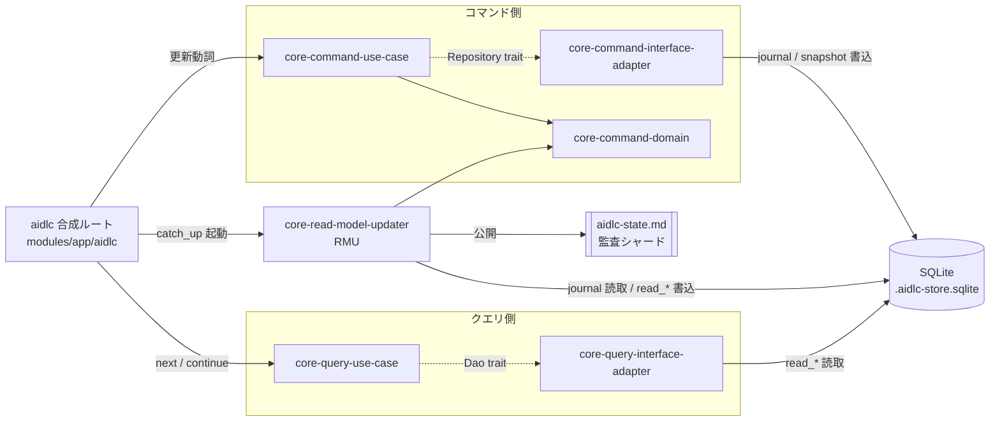
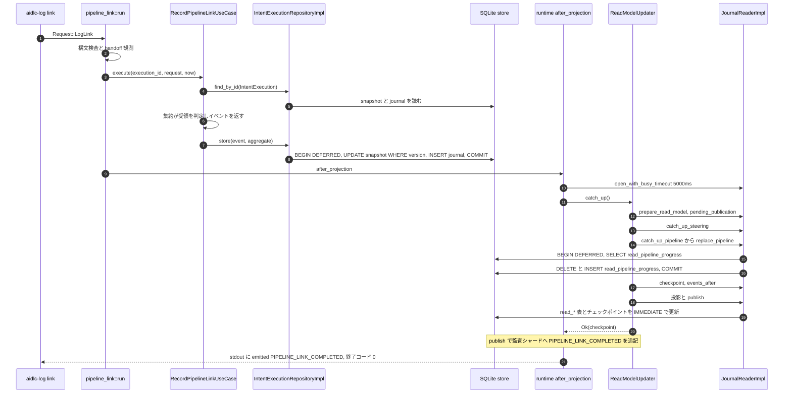
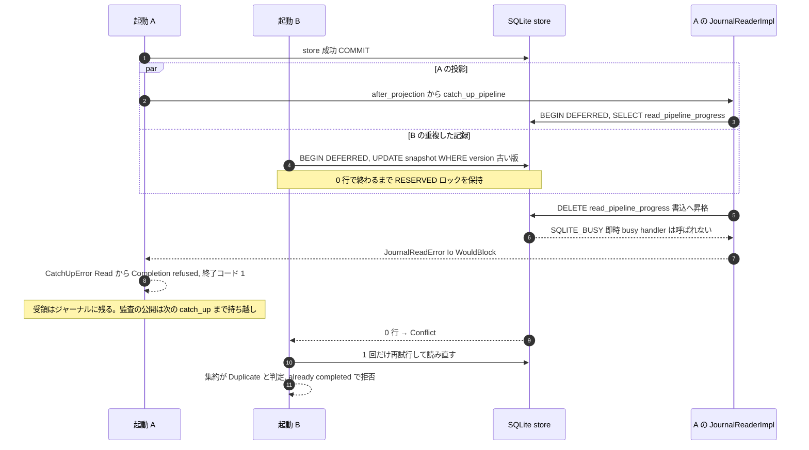

# アーキテクチャ — amadeus-ng

## Architecture Analysis

### System Overview

1 本の CLI バイナリ `aidlc`（マルチコール）が、起動のたびに同じスペースの SQLite ファイル `aidlc/spaces/<space>/intents/.aidlc-store.sqlite` を開き、コマンドを処理して終了する。常駐プロセスやネットワーク API は無い。複数のエージェントが同時に CLI を起動するので、**並行制御は SQLite のトランザクションと集約の楽観 version だけ**で行う（ADR-007。旧来のファイルロック `WorkspaceLock` は退役済み）。

1 つの SQLite ファイルに次の 2 系統の表が同居する。

- 書込モデル: 本家 event-store-adapter-rs の `journal` / `snapshot` 表
- 読取モデル: 自前の `amadeus_projection_checkpoint`、`amadeus_publication*`、`amadeus_read_model_head`、`read_*` 表

このほか、ファイルとして公開するリードモデル（`aidlc-state.md`、監査シャード `audit/<host>-<clone>.md`）がある。

### Architectural Style

**モジュラーモノリス + CQRS + イベントソーシング + ヘキサゴナル（ポートとアダプタ）**。根拠は次のとおり。

- 層ごと・CQRS の側ごとに Cargo クレートを分け、`Cargo.toml` に相手を書かないことで依存方向を物理的に強制している（`coding-rules/cqrs-boundaries.md`、ADR-009）。クレートの一覧は `component-inventory.md`、依存の辺は `dependencies.md` を参照。
- 書込は集約 → ドメインイベント → イベントストア（ES）。読取はリードモデルだけを読む。両者をつなぐのは RMU（`core-read-model-updater`）だけである。
- ユースケース層は trait（`XxxRepository` / `XxxDao`）だけに依存し、実装は interface-adapter 層に置く。配線は合成ルート `aidlc` が行う。

### Component Relationships

<!-- Text fallback: 合成ルート aidlc は、更新動詞ではコマンド側ユースケースを呼び、ユースケースは Repository trait 越しに interface-adapter の実装を使って SQLite の journal / snapshot 表へ書く。書いた後、合成ルートは RMU の catch_up を起動し、RMU は journal を読んで read_* 表を書き、aidlc-state.md と監査シャードを公開する。読取動詞（next / continue）ではクエリ側ユースケースが Dao trait 越しに read_* 表を読む。RMU だけがコマンド側ドメインとリードモデルの両方を知る。 -->

### Data Flow

1. **入口**: `main` → `runtime.rs` の `Request` 振り分け（`runtime.rs:213-240` 付近）。更新動詞と読取動詞で経路が分かれる。
2. **書込（コマンド側）**: ユースケースが Repository の `find_by_id` で集約を再構成（最新スナップショット + 差分 replay）→ 集約のコマンドが単一のドメインイベントを返す → `store(event, aggregate)` がジャーナル追記とスナップショット更新を 1 トランザクションで行う。楽観 version が合わなければ `RepositoryError::Conflict`。
3. **投影（RMU）**: 更新動詞は記録の後で必ず `after_projection`（`runtime.rs:3226`）を通る。`catch_up`（`runtime.rs:3159`）→ `catch_up_with`（`runtime.rs:3165-3223`）が `JournalReaderImpl` を開き、`ReadModelUpdater::catch_up` が未公開の公開計画の確定 → steering → pipeline 進捗 → チェックポイント以降のイベント投影 → 公開（状態ファイル・監査シャード・`read_*` 表）を行う。**投影が失敗すると、記録済みでも更新動詞は失敗を返す**。
4. **読取（クエリ側）**: `next` / `continue` は読む前に `catch_up_before_reading` で投影を済ませ、DAO で `read_*` 表を 1 表ずつ引いて View を返す。判断は RMU が書いた行にある。

### Key Design Decisions

| 決定 | 中身 | 帰結 |
| --- | --- | --- |
| ES + SQLite 単一ファイル（ADR-001 / ADR-003） | 集約の正本はジャーナル。互換ファイルはリードモデル | 読取モデルは常に遅れる。コマンド側は必ず集約から判断する |
| CQRS をクレートで分離（ADR-009） | コマンド側とクエリ側は相互に依存しない。橋は RMU と合成ルートだけ | 違反はビルドで落ちる。エラー写像（`store_failure.rs`）は側ごとに意図的に複製 |
| 並行制御は SQLite Tx + 楽観 version（ADR-007） | ファイルロックを廃止 | 書込トランザクションの張り方（DEFERRED / IMMEDIATE）が並行時の正しさを左右する |
| 「更新結果は公開が完了してから作る」 | `after_projection` がすべての更新動詞の共通の失敗境界 | 投影の一時的な失敗が、記録の成否と区別されずに利用者へ返る（Issue #134 の直接の形） |
| 投影の取得ループは RMU に置く | 合成ルートは起動だけ（カバレッジ除外領域にロジックを置かない） | `catch_up` の手順は RMU クレート内でテストできる |

### Improvement Opportunities

- 書込トランザクションの作法の統一（`TransactionBehavior::Immediate`）と、ロック競合の扱いを投影の失敗境界で明示すること。詳細な所見と修正候補の比較材料は `code-quality-assessment.md` を参照。
- `CatchUpError` の表示が失敗した段を運ばないため、運用時の切り分けが難しい（同上）。
- 1 ファイルに本家接続 3 本と RMU 接続 1 本、さらに複数プロセスが並行する構成は、本家ストアのサポート範囲（NFR3.9）の外にある。前提のずれとして `code-quality-assessment.md` に残した。

## Interaction Diagrams

### pipeline link の完了報告 — 記録から投影まで（正常系）

<!-- Text fallback: aidlc-log link は pipeline_link::run に入り、構文検査と handoff 観測の後、RecordPipelineLinkUseCase.execute を呼ぶ。ユースケースは IntentExecutionRepositoryImpl.find_by_id で集約を再構成し、集約が受領を判定してイベントを返し、store が DEFERRED トランザクションで snapshot の version 付き UPDATE と journal の INSERT を行う。次に after_projection が JournalReaderImpl を busy timeout 5000ms で開き、ReadModelUpdater.catch_up を呼ぶ。catch_up は prepare_read_model、pending_publication、catch_up_steering、catch_up_pipeline（replace_pipeline：DEFERRED で SELECT した後に DELETE / INSERT）、checkpoint と events_after、投影と publish（IMMEDIATE）の順に進み、監査シャードに PIPELINE_LINK_COMPLETED を追記する。成功すると stdout に emitted の JSON を出して終了コード 0 を返す。 -->

### 並行した重複報告 — Issue #134 の失敗の形（仮説を含む）

2 本の同じ link 報告 A と B が並行したときの流れである。**「B の楽観ロック失敗の窓と A の書込昇格が重なって即時 BUSY になる」は仮説**で、アプリ本体での再現はまだしていない。確認済みの事実と仮説の切り分けは `code-quality-assessment.md` の R-1 に書いた。

<!-- Text fallback: 起動 A は store に成功した後、after_projection から catch_up_pipeline に入り、replace_pipeline が DEFERRED トランザクションで read_pipeline_progress を SELECT する。同じ頃、起動 B は古い版で store を試み、DEFERRED トランザクションの先頭で snapshot の version 付き UPDATE を実行し、0 行で終わるまで RESERVED ロックを持つ。A が DELETE で書込へ昇格しようとすると、読取トランザクションを持つ接続の昇格なので SQLite は busy handler を呼ばず即座に SQLITE_BUSY を返す。これが JournalReadError::Io(WouldBlock) → CatchUpError::Read → Completion::refused となり、A は記録済みなのに終了コード 1 で失敗する。受領はジャーナルに残り、監査の公開は次に誰かが catch_up したときに行われる。B は Conflict を受けて 1 回だけ再試行し、集約が重複と判定して already completed で拒否される。 -->

失敗文言 `aidlc-orchestrate: projection: read: io: WouldBlock at …/.aidlc-store.sqlite` は、`wording::orchestrate_failure` の接頭辞、`catch_up` の `format!("projection: {error}")`（`runtime.rs:3222`）、`CatchUpError::Read` の `read: …`、`JournalReadError::Io` の `io: WouldBlock at <path>` がこの順に重なってできる。`WouldBlock` は RMU の `store_failure.rs:46` が `SQLITE_BUSY` / `SQLITE_LOCKED` を写したものである。
