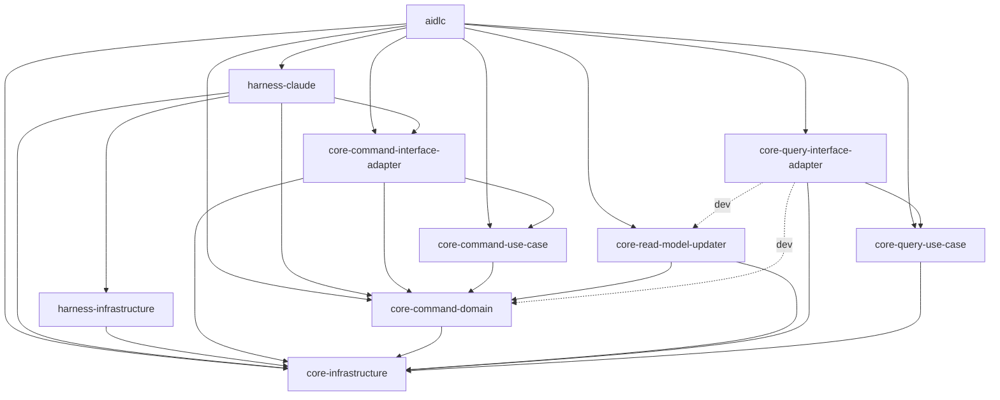

# 依存関係 — amadeus-ng

## クレート間の内部依存

各クレートの `Cargo.toml` の `[dependencies]` から起こした（dev-dependency は点線）。クレートごとの責務は `component-inventory.md` を参照。

<!-- Text fallback: aidlc はコア 7 クレートすべてと harness-claude に依存する。harness-claude は harness-infrastructure、core-infrastructure、core-command-domain、core-command-interface-adapter に依存する。コマンド側は core-command-interface-adapter → core-command-use-case → core-command-domain → core-infrastructure の一方向（interface-adapter は domain と infrastructure にも直接依存）。core-read-model-updater は core-command-domain と core-infrastructure に依存する。クエリ側は core-query-interface-adapter → core-query-use-case → core-infrastructure で、コマンド側・RMU・ドメインには通常の依存を持たない。core-query-interface-adapter だけが dev-dependency で RMU とドメインを引く。 -->

### 依存の規則

- **CQRS 境界**: コマンド側クレートにクエリ側・RMU が現れたら違反。クエリ側クレートにコマンド側（ドメインを含む）・RMU が現れたら違反。RMU だけが両側に依存してよい。両側を知ってよいプロダクトクレートは RMU と合成ルート `aidlc` だけ（`coding-rules/cqrs-boundaries.md`、ADR-009）。判定は `Cargo.toml` を見るだけでよく、違反はビルドで落ちる。
- **infrastructure は何も知らない**: `core-infrastructure` はドメイン・use-case・interface-adapter に依存しない。rusqlite や RPC クライアントも置かない。
- **意図的な複製**: SQLite 失敗の写像 `store_failure.rs` はコマンド側と RMU に 1 つずつある。共有するとコマンド側が RMU に依存することになるためで、側の独立を DRY より優先した裁定である。

## 外部依存

版と用途は `technology-stack.md` に一覧した。ここでは**誰が使うか**だけを記す。

| 外部依存 | 使うクレート | 注意点 |
| --- | --- | --- |
| event-store-adapter-rs（`=3.0.0`） | `core-command-interface-adapter`（dev: `aidlc`、`core-read-model-updater`） | 本家の契約は Conformist として受け入れる（`coding-rules/upstream-contracts.md`、ADR-010）。doc は「同じ DB ファイルを複数のストアインスタンスやプロセスから開くことはサポート外（NFR3.9）」と明言している（`event_store_for_sqlite.rs` 70〜75 行付近）。`persist_event` は DEFERRED トランザクションの先頭で `UPDATE snapshot … WHERE version = ?` を行う（503〜533 行） |
| rusqlite（`bundled`） | `core-command-interface-adapter`、`core-query-interface-adapter`、`core-read-model-updater`、`aidlc` | 本家も同じ rusqlite を使うので SQLite 本体は 1 つ。既定の busy timeout 5000ms |
| tokio | `aidlc`（dev: use-case・interface-adapter・RMU） | current_thread |
| serde / serde_json | interface-adapter 各層、RMU、`core-infrastructure`、`aidlc`、`harness-claude` | ドメインには入れない（`coding-rules/domain-persistence-neutrality.md`） |
| chrono / uuid | ドメイン、コマンド側、RMU、`aidlc` | — |
| regex | `core-command-domain`、`harness-infrastructure` | — |
| libc / nix / sha2 / hmac / base64 / getrandom | `core-infrastructure` ほか | `getrandom` などコマンド側の直接 I/O は `cargo lint` の `command-side-io` で監視 |
| thiserror（推移依存） | event-store-adapter-rs 経由 | 我々のコードでの直接使用は禁止。推移依存は違反ではない（`coding-rules/error-handling.md`） |

リポジトリ外の参照（分析範囲には数えない）: cargo レジストリ上の `event-store-adapter-rs-3.0.0/src/event_store_for_sqlite.rs` と `rusqlite-0.40.2/src/inner_connection.rs`。

## そのほかの依存

- **git submodule**: `vendor/aidlc-workflows`（`https://github.com/j5ik2o/aidlc-workflows.git`）。upstream 配布元で、観測互換の正本
- **ゴールデン**: `tests/golden/upstream-a277af21/`（ピン `a277af21` = v2.7.1）
