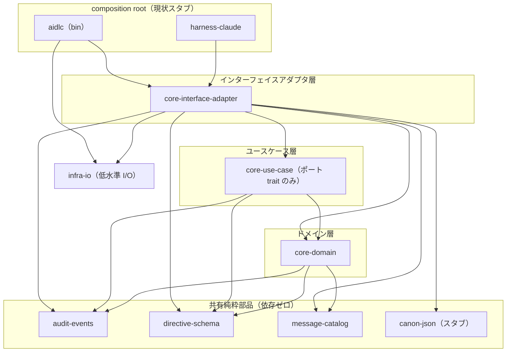
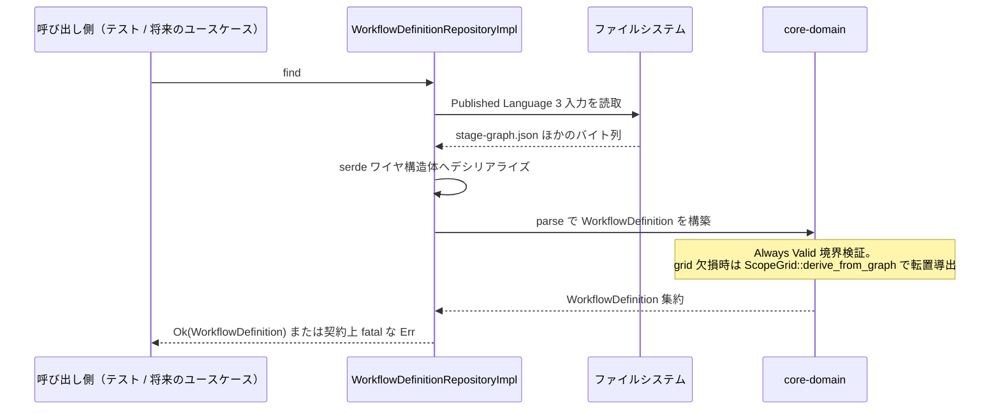
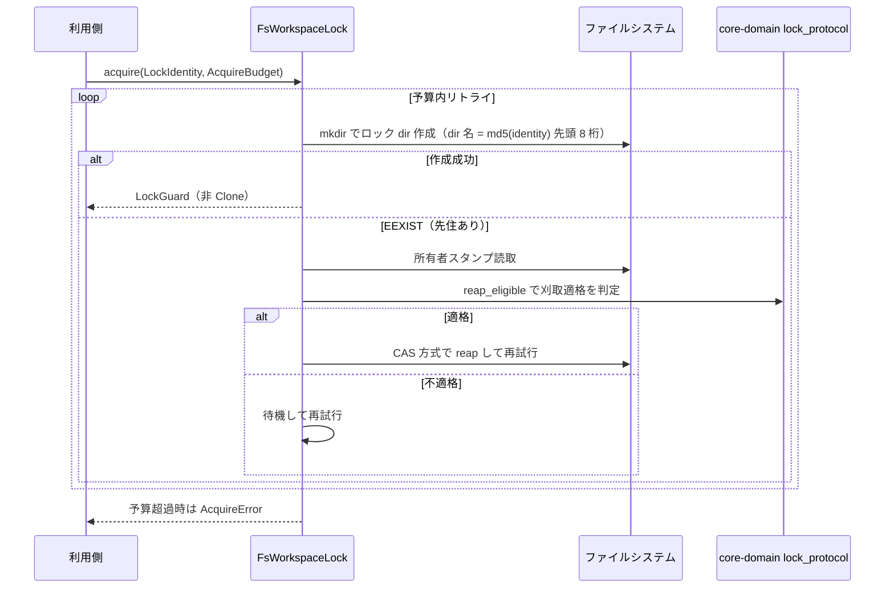
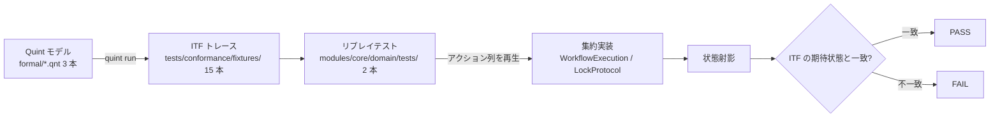

# architecture — システムアーキテクチャとコンポーネント関係

> リバースエンジニアリング成果物（2026-08-22 実施、`c4d8d95` 時点）。一次情報は開発者スキャン結果・`docs/specs/00-policy.md` D3/D4/D10・ADR 0001〜0005。

## アーキテクチャスタイル

**クリーンアーキテクチャ + Always Valid Domain Model（DDD）を、Cargo のクレート境界で機械強制する単一バイナリ構成**である（`00-policy.md` D3/D4）。

- **層 = クレート**。ドメイン層 → ユースケース層 → インターフェイスアダプタ層の依存は常に内向きで、逆依存は `Cargo.toml` に依存が無いことによるビルドエラー（E0432）として物理的に成立しない。
- **インフラストラクチャは 2 群に分割**: 純粋部品（`message-catalog`・`audit-events`・`directive-schema`・`canon-json`）はどの層からも利用可。`infra-io`（アトミック書込・追記 open・プロセス生存判定）はアダプタ層と composition root のみが依存できる。
- **ドメイン層は I/O ゼロ・serde 非依存**。不正状態は newtype / enum で表現不能にし、検証は境界（parse 時）に置く（Domain Primitive / parse-don't-validate）。
- **開発進行は inside-out**（D10）: 仕様 + Quint 形式モデル → ドメイン層 TDD → ポート → Gateway の順で、現時点はアダプタ層まで完成し、ユースケース本体・composition root・CLI が未着手。
- デプロイ形態はマルチコールの**単一 CLI バイナリ**（`aidlc`、A1 計画）。Web サービス・常駐プロセスは無い。

## コンポーネント関係

<!-- Text fallback: 依存は常に内向き。app 層 (aidlc, harness-claude) -> core-interface-adapter -> core-use-case -> core-domain。core-domain / core-use-case / core-interface-adapter は共有純粋部品 (audit-events, directive-schema, message-catalog, canon-json) を利用可。infra-io に依存できるのはアダプタ層と app 層のみ。shared 4 クレートと infra-io は内部クレート依存ゼロ。 -->

検証資産はこのクレート図の外に立つ: `formal/`（Quint モデル 3 本）が契約の正本側、`tests/golden/` + `tests/conformance/fixtures/`（ITF トレース）が突き合わせ入力、`tools/lint`（workspace 非メンバーの detached クレート）がコーディング規則の機械強制を担う。

## Interaction Diagrams

現状実装済みの範囲で、ビジネストランザクションがコンポーネントを横断してどう実装されているかを示す。

### WorkflowDefinition 読取パス（Repository find）

<!-- Text fallback: 呼び出し側 -> WorkflowDefinitionRepositoryImpl.find -> ファイルシステムから PL 3 入力 (stage-graph.json 等) を読取 -> serde ワイヤ構造体にデシリアライズ (アダプタ層内) -> core-domain の parse で Always Valid 検証して WorkflowDefinition 集約を構築 (grid 欠損は ScopeGrid::derive_from_graph で転置導出) -> Ok を返す。not-found は契約上 fatal な Err。 -->

ワイヤ構造体（serde）はアダプタ層に閉じ、ドメイン型は parse を通過した値しか存在しない。upstream 配布実バイト（33 ノード）の全数 load パリティは `golden_parity_test.rs` が固定する。

### FsWorkspaceLock の acquire / reap

<!-- Text fallback: acquire(LockIdentity, AcquireBudget) は予算内でリトライ: mkdir で md5(identity) 先頭 8 桁のロック dir を作成し、成功なら非 Clone の LockGuard を返す。EEXIST なら所有者スタンプを読み、刈取適格の判断はドメイン層の reap_eligible 述語に委譲 (Gateway は判断を再実装しない)。適格なら CAS 方式で reap して再試行、不適格なら待機して再試行。予算超過で AcquireError。 -->

刈取適格の判断は Gateway に重複実装されず、ドメイン述語 `reap_eligible` に一元化されている（tell-dont-ask ルールの適用例）。時刻とプロセス生存は `Clock` / `ProcessProbe`（アダプタ層の機構、Fake 付き）から注入される。この振る舞いの契約正本は `formal/workspace/audit_lock.qnt`。

### ITF 準拠テストの検証フロー

<!-- Text fallback: Quint モデル (formal/*.qnt) から quint run で ITF トレース (tests/conformance/fixtures/ 15 本) を生成 -> ドメイン層のリプレイテストがトレースのアクション列を集約 (WorkflowExecution / LockProtocol) に再生 -> 各ステップの状態射影を ITF の期待状態と突き合わせ、一致で PASS、不一致で FAIL。 -->

これにより「Quint で模型検査した契約」と「Rust 集約の実挙動」が機械的に結ばれる（ADR 0003 決定 5）。Quint 側は mutation テストで検査力が証明済み（engine_loop 3/3、audit_lock 10/10 + witness 7/7、stop_hook 7/7）。

## データフロー

- **入力**: upstream 互換のオンディスク資産 — ステージグラフ（`stage-graph.json` 等 PL 3 入力）、ワークスペース状態ファイル `aidlc-state.md`、ロック dir・所有者スタンプ。
- **変換**: アダプタ層でワイヤ構造体 → parse → ドメイン型。ドメイン層は純粋（集約コマンドは純粋ステップ関数、状態ファイル操作は純関数群 `get_field`/`set_field` 等）。
- **出力**: 現状はテスト経由でのみ観測される（CLI がスタブのため）。将来は監査台帳追記（`infra-io::append_only`）・状態ファイル原子書込（`infra-io::atomic`）・ディレクティブ出力が composition root 経由で結線される。

## 主要な設計判断（決定の索引）

| 判断 | 内容 | 記録 |
| --- | --- | --- |
| D3/D4 | Always Valid Domain Model + クリーンアーキテクチャ（層 = クレート） | `00-policy.md` |
| D9/A9 | Quint を決定論コアの状態機械契約に適用、ITF 準拠層で実装と結合 | ADR 0003 |
| A2 | 正準 JSON シリアライザを全クレートで共有（未実装、`canon-json` スタブ） | ADR 0001 |
| A3 | 逐語文言・コマンド語彙の単一カタログ（`message-catalog`、7 形 Captured 済み） | ADR 0002 |
| A10 | 計装 `tracing` + OTel エクスポート、監査台帳が真実源（未導入） | ADR 0004 |
| A8 | モノレポ、`modules/{core,shared,infra-io,app,harness}` 構成、デュアルライセンス | ADR 0005 |
| — | Gateway 責務は Repository と外部システムクライアントの 2 つのみ、機構はアダプタ層内部 | `coding-rules/gateway-taxonomy.md` |
| — | CQRS 不採用。読取専用保証は「Repository 非注入 + `&` 参照渡し」の型強制で実現 | 同上 §4 / `use-case-rules.md` |

## 改善機会（設計監査より）

設計監査 `design-audit-2026-08-22.md`（29 CONFIRMED）の確定裁定 R1〜R5 が現アーキテクチャの既知の歪みを裁定済み・未履行のまま保持している。アーキテクチャ観点で重要なもの:

- **R1（C13）**: `workflow_definition/scope_grid.rs` が `orchestration::PlanAction` を import する**コンテキスト間逆依存**が残存。`PlanAction` の所有を workflow_definition へ一本化する。
- **R2（C14）**: 有効プランの畳み込み `effective_plan_action` を orchestration 側ドメインサービス `(&WorkflowExecution, &WorkflowDefinition) → …` へ移設する。
- **R4（C21/C22）**: Gateway 直書きの逐語文言 7 形を `message-catalog` へ移設し、ドメイン層エラーは材料のみ保持する。
- **C26**: `LockGuard::new` が公開で偽造可能（release 側の台帳照合で防御はあるが、型強制が未完）。
- **E 束**: ドメインイベント発行（C16、B-1 中核）、`AuditLedger` のイベントログ再分類、`WorkflowExecutionRepository` 設計（B-2）が次のアーキテクチャ空白。

詳細な負債分類は `code-quality-assessment.md` を参照。
