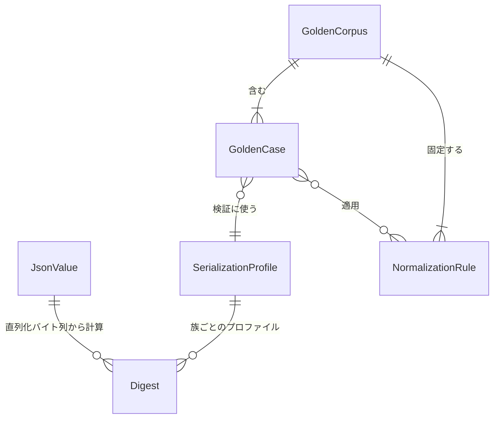

# functional-spec — U1 canon-json とゴールデン（`u1-canon-json-goldens`）

> Functional Design（Construction 3.1）成果物（Unit: U1）。出典: `../../../inception/units-generation/unit-of-work.md`、
> `../../../inception/units-generation/unit-of-work-story-map.md`（FR7.1〜7.3）、`../../../inception/requirements-analysis/requirements.md`
> （FR7、NFR1、前提 A3）、`../../../inception/domain-design/components.md`（CanonJson — 依存ゼロ、PersistenceGateways が
> continue_token/ドリフト判定で利用）、`../../../inception/contract-design/contract-summary.md`（C1 continue_token、C7 ゴールデン）、
> `docs/adr/0001-canonical-json-serializer.md`、`entities.md`（データの正本）、`rules.md`（規則の正本）。
>
> 本ファイルはワークフローと状態遷移の正本。ER 図と規則要約は導出ビュー。

## 1. 概要

U1 は 2 つの成果を持つ: (1) `core-infrastructure::canon_json` — upstream（JS の `JSON.stringify` / `hashObject`）との互換を
受入コーパスで確認するJSONの読み書きとダイジェスト計算の純粋部品。ドメインには依存せず、3プロファイルを提供する。(2) ゴールデンコーパス —
upstream ピンから採取した正解データと、それを使う比較テストの土台（後続 Bolt の TDD のオラクル）。

## 2. インターフェイス（設計レベル）

```text
serialize(value: &JsonValue, profile: SerializationProfile) -> String          // BR1.1〜BR1.5
hash_canonical(value: &JsonValue) -> Digest{family: canonical-prefixed}       // BR1.6（"sha256:" + hex）
hash_compact(value: &JsonValue) -> Digest{family: compact-raw}               // BR1.6（生 hex）
parse(text: &str) -> Result<JsonValue, ParseError>                            // 挿入順を保持して読む
to_value<T: Serialize>(t: &T) -> Result<JsonValue, ToValueError>               // 型付き値 → 宣言順の JsonValue
```

- 型付き契約型（stage-graph / scope-grid / directive 等）は struct のフィールド宣言順で JsonValue になる（BR1.1）。
- 動的マップ（serde_json::Map 相当）は preserve_order で挿入順を保持し、直列化時に BR1.2 の順序規則を適用する。
- 契約JSONの直列化・型付き値の変換は、このモジュールを通す（BR1.7）。アダプタによる型付きDTOへの読取は別の境界であり、`serde_json::from_str` 等を利用できる。

## 3. ワークフロー

### W1 — 契約 JSON の直列化（serialize）

1. 入力 `JsonValue` とプロファイルを受ける。
2. すべてのプロファイルで整数形式キーを数値昇順で先頭に置く（BR1.2）。残りのキーは hash-canonical なら
   UTF-16コード単位順で再帰ソートし、それ以外は宣言順/挿入順を保持する（BR1.1）。
3. 値種別ごとに書く: 数値は BR1.3、文字列は BR1.4、配列/オブジェクトは BR1.5 の体裁。
4. 出力文字列を返す（pretty は末尾改行付き）。
- 事前条件: JsonValue は構築済み（不変）。事後条件: 同じ入力・同じプロファイルなら同じバイト列（決定性）。
- エラー経路: なし（非有限数は null に落とす。integer-like キーの写像未定義は設計時の棚卸しで排除 — 実行時は
  BR1.2 の規則で機械的に並べる）。

### W2 — ダイジェスト計算（hash）

1. 正準族: W1 を hash-canonical で実行 → UTF-8 バイト列の sha256 → `sha256:` + 小文字 hex（BR1.6）。
2. 非正準族: W1 を contract-compact で実行 → sha256 → 生 hex。
- 用途と族は ADR 0001 のコンテキストの区分に従う。ハッシュ名だけで族を推測しない。

| 用途 | 関数・族 | 出力 |
|---|---|---|
| contract_sha256・approval fingerprint | hash_canonical / canonical-prefixed | sha256: + 小文字hex |
| bundle hash・directiveHash・route hash・ルール配送の冪等digest | hash_compact / compact-raw | 小文字hex |

- 事後条件: 同じ入力・同じ族なら同じダイジェスト。ダイジェストから入力値を復元する契約は持たない。

### W3 — 契約 JSON の読取（parse）

1. テキストを JSON として読み、オブジェクトのキー順を保持した `JsonValue` を作る。
2. 不正 JSON は `ParseError`（位置と理由を材料として保持 — 文言化はアダプタ層）。
3. 対をなすサロゲートのエスケープはUnicode文字に復号する。孤立サロゲートはUTF-8の値モデルに保持できないため `ParseError::Syntax` で拒否する。深さ127段までを受け入れ、128段以上は `TooDeep` とする。
- 利用箇所: ゴールデン比較など、順序を保持した汎用JSON値が必要な読取。U3の配布定義を読む責務は `CompiledDefinitionRepositoryImpl` にあり、現行の型付きDTO読取には `serde_json::from_str` を使う。同アダプタは契約JSONの書出しで `to_value` / `serialize` を利用する。
- 互換保証の範囲: FR7.3/C7が指定する採取済み受入表の全行一致と、UTF-8で表せる値の読み書き。型付き入力の文字列はこの値域に入る。孤立サロゲートを含む任意の外部JSONまで同値とはしない。既存実装の「契約JSONには現れない」という注記だけを、将来の全入力を保証する証拠として扱わない。その入力を扱う拡張にはUTF-16を保持する値モデルと受入ケースの追加が必要になる。

型付き値を受ける `to_value` は、JSONオブジェクトのキーへ変換できない複合型などを `ToValueError` として返す。呼出側は入力・型を修正し、同じ値の自動リトライはしない。

### W4 — ゴールデン採取（再採取スクリプト、FR7.1 / FR7.2）

1. 使い捨てのワークスペースを用意し、upstream ピン `3c3146cf` の dist ツールを bun で実行する（前提 A3）。
2. hash-canonical 族: 入力クラス別の入力 JSON（BR2.3 のクラス一覧）を upstream の `canonicalize` / `hashObject` に
   通し、出力文字列とダイジェストを受入表に書く。
3. cli 族: BR2.4 の主要遷移を順に実行し、各コマンドの stdout・状態ファイル差分・監査行を採る。
4. hook 族: フック 4 本に代表ケースの stdin JSON を与え、exit code・stderr・監査行を採る。
5. 全ケースに BR2.2 の正規化を適用し、来歴（commit, captured_at, command）を付けてコーパスに書く（BR2.1）。
- 事後条件: コーパスは再実行で同じ内容になる（正規化後）。
- エラー経路: upstream ツールが失敗 → そのケースは採取しない（欠落を明示。捏造しない）。

### W5 — ゴールデン比較（テスト）

1. コーパスのケースを読む。
2. hash-canonical 族: 同じ入力を canon-json に通し、出力文字列とダイジェストを行ごとに比較（BR2.3 — 全行一致が
   FR7.3 の合格）。
3. cli / hook 族: 後続 Bolt（U6 / U7）の実装を同じ入力で動かし、BR2.2 の正規化後にバイト比較。本 Unit では
   コーパスの読取と比較器（normalize + diff）を用意するところまで（実装対象は後続 Bolt）。
- エラー経路: 不一致はテスト失敗。ゴールデンは直さず実装を直す（BR2.3 / BR2.5）。

## 4. 状態遷移

ライブラリ（W1〜W3）は状態を持たない。ゴールデンケースの**データとしての状態**のみ:

| 現在 | イベント | 条件 | 次 | 動作 |
|---|---|---|---|---|
| （なし） | 採取（W4） | upstream ツールが成功 | captured | 来歴付きでコーパスに追加 |
| captured / failing | 比較（W5） | 正規化後に一致 | verified | — |
| captured | 比較（W5） | 不一致 | failing | 実装を修正して再比較（ゴールデンは不変） |
| verified / failing | upstream ピン更新 | 別 intent | stale | 再採取（W4）で置換、差分は逸脱台帳と突合（BR2.5） |

## 5. エラー一覧

| エラー | 発生 | 扱い |
|---|---|---|
| ParseError | W3: 不正 JSON | 位置・理由を材料として返す（文言はアダプタ層）。リトライなし |
| ToValueError | 型付き値をJSON値へ変換できない | 変換失敗の材料を返す。入力・型を修正し、同値の自動リトライなし |
| GoldenMismatch | W5: 比較不一致 | テスト失敗。実装を修正 |
| CaptureFailure | W4: upstream ツール失敗 | ケース欠落を記録（捏造しない） |

## 6. 導出ビュー — ER 図（`entities.md` が正本）


<!-- Text fallback: JsonValue 1 → Digest 多（直列化バイト列から計算）。SerializationProfile 1 → Digest 多。GoldenCorpus 1 → GoldenCase 多、GoldenCorpus 1 → NormalizationRule 多。GoldenCase 多 → SerializationProfile 1（検証に使う）。GoldenCase 多 ↔ NormalizationRule 多（適用）。 -->

## 7. 導出ビュー — 規則要約（`rules.md` が正本）

BR1.1 キー順はプロファイル / BR1.2 integer-like は先頭 / BR1.3 数値は JS 互換 / BR1.4 最小エスケープ /
BR1.5 体裁固定 / BR1.6 ダイジェスト 2 族 / BR1.7 直接呼び出し禁止 / BR1.8 preserve_order 常時有効 /
BR2.1 採取 + 来歴 / BR2.2 正規化比較 / BR2.3 受入表網羅 / BR2.4 CLI 範囲 / BR2.5 更新はピン更新 intent のみ。

## 8. トレーサビリティ

FR7.1 → BR2.1, BR2.3（受入表の採取）。FR7.2 → BR2.1, BR2.2, BR2.4（CLI/フックゴールデン）。
FR7.3 → BR1.1〜BR1.6（実装規則）+ BR2.3（合格基準）。NFR1 の正準化面 → BR1.1〜BR1.6。


## Review

**Verdict:** READY
**Reviewer:** aidlc-architecture-reviewer-agent
**Date:** 2026-09-06T00:27:00Z
**Iteration:** 1
**Request Challenge:** review:abb6da86e9c815820fb407d4d72d895f

### Findings

本レビューは1回の ADVISORY 評価である。過去の ID を引き継ぎ、現在の本文・共有契約・実装・受入データで解消状況を確認した。未解決は Minor 1件で、Critical / Major の未解決はない。

| ID | Severity | Location | Finding | Required action | Status |
|---|---|---|---|---|---|
| R-01 | Major | aidlc/spaces/default/intents/260822-stage1-selfhost/construction/u1-canon-json-goldens/functional-design/rules.md > BR2.3、および entities.md > GoldenCase.expected | 出力文字列とダイジェストの両方を検証する契約は整合している。共有 contract-summary.md > C7 が canonical_output / canonical_digest を明記し、実コーパス32行と golden_hash_canonical.rs の全行比較も両方を検証する。旧来の2フィールド省略表記との不一致は解消済み。 | 追加対応なし。C7と受入表の一致を維持する。 | Resolved |
| R-02 | Minor | aidlc/spaces/default/intents/260822-stage1-selfhost/construction/u1-canon-json-goldens/functional-design/functional-spec.md > W2 用途と族の対応表 | contract_sha256・approval fingerprint は canonical-prefixed、bundle hash・directiveHash・route hash・ルール配送の冪等digest は compact-raw と明記された。docs/adr/0001-canonical-json-serializer.md > コンテキスト、および canon_json/mod.rs の2族表と一致する。 | 追加対応なし。用途を追加するときも族を明記する。 | Resolved |
| R-03 | Minor | aidlc/spaces/default/intents/260822-stage1-selfhost/construction/u1-canon-json-goldens/functional-design/entities.md > JsonValue.integer_value | 非負はu64、負はi64、小数・非有限はfloatと定義され、保持型と出力時の丸めを区別している。canon_json/value/number.rs・parse.rs の変換順、および numbers_prefer_unsigned_then_signed_then_float の成功ログと対応する。 | 追加対応なし。保持型の判別とBR1.3の出力規則を区別した記述を維持する。 | Resolved |
| R-04 | Major | aidlc/spaces/default/intents/260822-stage1-selfhost/construction/u1-canon-json-goldens/functional-design/rules.md > BR1.1・BR1.2、および functional-spec.md > W1 手順2 | 全プロファイルで整数形式キーを数値昇順で先頭に置き、残りだけをプロファイル別に並べる二段階が明記された。受入ケース hash-canonical/integer-like/numeric-vs-string-order の実出力は1,9,10,xで、canon_json/canonical.rs > member_order と一致する。FR7.3の受入値に反する旧規則は解消済み。 | 追加対応なし。整数形式キーの上限・非正準十進表記の境界ケースを維持する。 | Resolved |
| R-05 | Major | aidlc/spaces/default/intents/260822-stage1-selfhost/construction/u1-canon-json-goldens/functional-design/rules.md > BR1.3.logic | 絶対値が2^53を超える整数をf64へ変換してJS互換表記にする規則と、around-2p53 / u64-range の受入値が追加された。実コーパスの9007199254740993 → 9007199254740992、u64最大値 → 18446744073709552000と一致し、全行比較と整数範囲テストの成功ログも確認した。 | 追加対応なし。保持値の正確さと出力バイトの互換を別々に扱う。 | Resolved |
| R-06 | Major | aidlc/spaces/default/intents/260822-stage1-selfhost/construction/u1-canon-json-goldens/functional-design/entities.md > JsonValue.string_value、rules.md > BR1.4、および functional-spec.md > W3 | UTF-8で保持できるUnicode scalar valueと、孤立サロゲートをSyntaxで拒否する境界が揃った。最新の確認済みQ&Aもこの境界を明示している。FR7.3/C7の32行一致と型付き文字列の値域を根拠とし、任意の外部JSONへの完全互換は主張しないため、実装の存在だけで要求を縮小した状態ではない。parse.rsの拒否テスト成功も確認した。 | 追加対応なし。孤立サロゲート対応を将来追加する場合は、値モデルと受入ケースを合わせて変更する。 | Resolved |
| R-07 | Minor | aidlc/spaces/default/intents/260822-stage1-selfhost/construction/u1-canon-json-goldens/functional-design/functional-spec.md > 第2節 to_value・W3末尾・第5節エラー一覧 | to_valueのResult返却、複合型キー等の変換失敗、呼出側への材料返却、同じ値を自動リトライしない方針が明記された。value/json_value.rsとToValueErrorの公開境界に整合し、maps_with_non_string_keys_are_rejectedの成功ログも確認した。 | 追加対応なし。呼出側は変換エラーを伝播し、入力・型を修正する。 | Resolved |
| R-08 | Minor | aidlc/spaces/default/intents/260822-stage1-selfhost/construction/u1-canon-json-goldens/functional-design/functional-spec.md > W3 手順1、および entities.md > JsonValue.members | W3は順序保持、membersはキー一意と定めるが、入力JSONに同じキーが複数回現れた場合の統合規則が未記載。現行parse.rsの duplicate_keys_are_last_wins_at_the_first_position は、入力 {"a":1,"b":2,"a":3} を順序a,b・値a=3にする挙動を固定している。本文だけでは拒否・先勝ち・後勝ちの選択が残る。 | W3に「最後の値を採用し、キーの位置は最初の出現位置を保持する」と明記し、既存の重複キーテストを根拠として参照する。 | New |

### Validation Tool Results

| Tool | Result | Interpretation |
|---|---|---|
| aidlc-sensor-required-sections（entities.md / rules.md / functional-spec.md、stage=functional-design） | PASS、H2数は追記前に2 / 2 / 8、findings_count=0 | 指定された3設計文書の構造検査を実行した。 |
| aidlc-sensor-upstream-coverage（consumes=unit-of-work,unit-of-work-story-map,requirements,components,contract-summary、deliverables=entities,rules,functional-spec） | PASS、unreferenced=[]、findings_count=0 | 正確に5入力・3設計文書を対象とし、上流参照を確認した。 |
| aidlc-sensor-traceability（U1 functional-design/traceability.json） | FAIL、findings_count=34 | missing_from_upstream_idsにFR1〜FR6・FR8・FR9とその子だけを報告した。gaps / orphans / missing_from_table / invalid_entries / invalid_targetsはすべて空。共有story-mapの他Unit割当をU1にも要求する検出であり、PASSへの読み替えはしない。 |
| U1割当の手動突合（story-map → traceability.json → rules.md） | 一致 | U1割当のFR7 / FR7.1 / FR7.2 / FR7.3は4件とも存在し、全OK targetがBRに解決する。13規則のうち10規則はcoverage、BR1.7 / BR1.8 / BR2.5は理由付きreverseで説明される。NFR1の主担当は共有story-mapでU7、U1の正準化面は第8節に明記されている。 |
| 既存canon_jsonテストの実行ログ（/tmp/u1-resume-unit-tests.log） | 87 passed、0 failed | 同一セッションの成功ログを確認。キー順・整数境界・孤立サロゲート拒否・変換失敗・重複キー・深さ127/128の境界を含む。コード未変更のため再実行していない。 |
| 既存goldenテストの実行ログ（/tmp/u1-resume-golden-tests.log） | 16 passed、0 failed（読取9件、hash-canonical7件） | canonical / compact / prettyの出力と2族のダイジェストについて32行の全行比較を確認。CLI/フックは読取・正規化・範囲の検証であり、後続Unitの実行出力一致を証明するものではない。 |
| C7のコーパス・来歴・未採取記録の確認 | 受入表32行、hash-canonicalのmissing_cases=[] | CLIのset-autonomy正常系・continue複数part、フックのtranscript-carve-outには理由付き未採取記録がある。W4の欠落明示・後続ケース追加方針に対応する。全CLI/フック分岐が検証済みとは評価しない。 |
| 指定統合点のスポットチェック（CompiledDefinitionRepositoryImpl） | W3と一致 | 型付き読取はserde_json::from_str、契約JSONの書出しはto_value → serialize(ContractPretty)。U1から他Unitへの内部依存はなく、共有CanonJsonのdepends_on=[]に沿う。兄弟construction成果物は読んでいない。 |
| Mermaid ER図 | 目視確認のみ、専用パーサによる構文検証は未実施 | mmdcとローカル解決可能なmermaidパッケージが見つからなかった。図の型名・関連方向とテキスト代替を照合したが、レンダリング成功までは保証しない。依存は追加していない。 |
| linter / type-check | 対象外 | 指定センサーが対象とするTypeScript/JavaScriptのコード片は設計3文書にない。 |

### Summary

キー順・整数丸め・文字列表現・変換失敗の矛盾は解消され、確認済みの互換範囲と受入表を使って実装できる設計になった。残る所見は重複キーの読取規則を本文へ明記するMinor 1件であり、規定の判定基準によりREADYとする。
