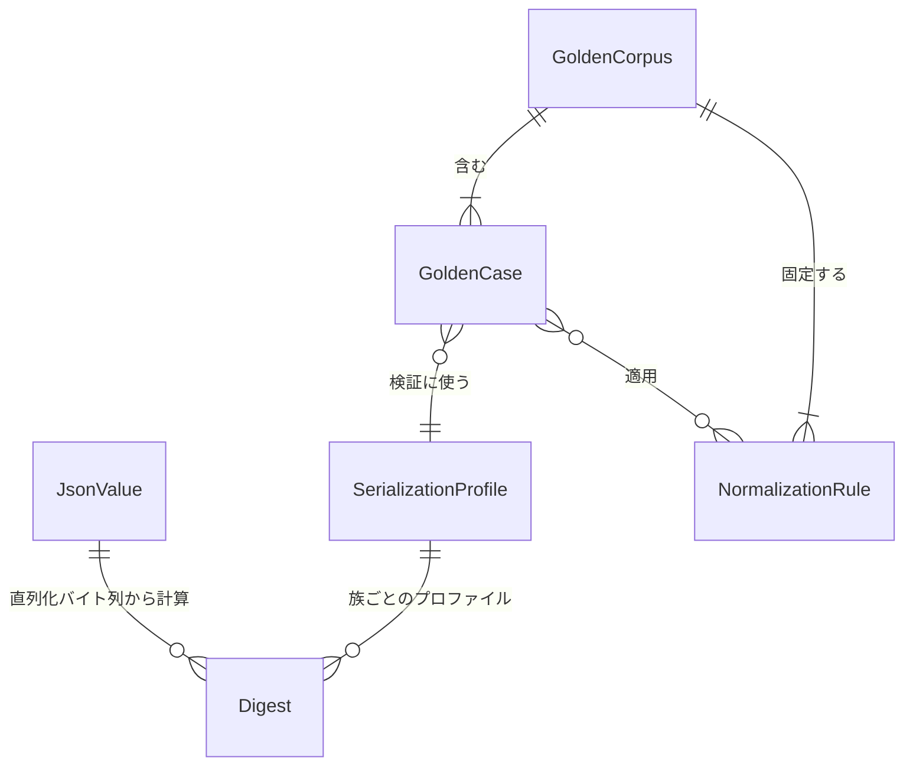

# functional-spec — U1 canon-json とゴールデン（`u1-canon-json-goldens`）

> Functional Design（Construction 3.1）成果物（Unit: U1）。出典: `../../../inception/units-generation/unit-of-work.md`、
> `../../../inception/units-generation/unit-of-work-story-map.md`（FR7.1〜7.3）、`../../../inception/requirements-analysis/requirements.md`
> （FR7、NFR1、前提 A3）、`../../../inception/domain-design/components.md`（CanonJson — 依存ゼロ、PersistenceGateways が
> continue_token/ドリフト判定で利用）、`../../../inception/contract-design/contract-summary.md`（C1 continue_token、C7 ゴールデン）、
> `docs/adr/0001-canonical-json-serializer.md`、`entities.md`（データの正本）、`rules.md`（規則の正本）。
>
> 本ファイルはワークフローと状態遷移の正本。ER 図と規則要約は導出ビュー。

## 1. 概要

U1 は 2 つの成果を持つ: (1) `core-infrastructure::canon_json` — upstream（JS の `JSON.stringify` / `hashObject`）との互換を
受入コーパスで確認するJSONの読み書きとダイジェスト計算の純粋部品。ドメインには依存せず、3プロファイルを提供する。(2) ゴールデンコーパス —
upstream ピンから採取した正解データと、それを使う比較テストの土台（後続 Bolt の TDD のオラクル）。

## 2. インターフェイス（設計レベル）

```text
serialize(value: &JsonValue, profile: SerializationProfile) -> String          // BR1.1〜BR1.5
hash_canonical(value: &JsonValue) -> Digest{family: canonical-prefixed}       // BR1.6（"sha256:" + hex）
hash_compact(value: &JsonValue) -> Digest{family: compact-raw}               // BR1.6（生 hex）
parse(text: &str) -> Result<JsonValue, ParseError>                            // 挿入順を保持して読む
to_value<T: Serialize>(t: &T) -> Result<JsonValue, ToValueError>               // 型付き値 → 宣言順の JsonValue
```

- 型付き契約型（stage-graph / scope-grid / directive 等）は struct のフィールド宣言順で JsonValue になる（BR1.1）。
- 動的マップ（serde_json::Map 相当）は preserve_order で挿入順を保持し、直列化時に BR1.2 の順序規則を適用する。
- 呼出側は `serde_json` を直接呼ばない（BR1.7）。

## 3. ワークフロー

### W1 — 契約 JSON の直列化（serialize）

1. 入力 `JsonValue` とプロファイルを受ける。
2. すべてのプロファイルで整数形式キーを数値昇順で先頭に置く（BR1.2）。残りのキーは hash-canonical なら
   UTF-16コード単位順で再帰ソートし、それ以外は宣言順/挿入順を保持する（BR1.1）。
3. 値種別ごとに書く: 数値は BR1.3、文字列は BR1.4、配列/オブジェクトは BR1.5 の体裁。
4. 出力文字列を返す（pretty は末尾改行付き）。
- 事前条件: JsonValue は構築済み（不変）。事後条件: 同じ入力・同じプロファイルなら同じバイト列（決定性）。
- エラー経路: なし（非有限数は null に落とす。integer-like キーの写像未定義は設計時の棚卸しで排除 — 実行時は
  BR1.2 の規則で機械的に並べる）。

### W2 — ダイジェスト計算（hash）

1. 正準族: W1 を hash-canonical で実行 → UTF-8 バイト列の sha256 → `sha256:` + 小文字 hex（BR1.6）。
2. 非正準族: W1 を contract-compact で実行 → sha256 → 生 hex。
- 用途と族は ADR 0001 のコンテキストの区分に従う。ハッシュ名だけで族を推測しない。

| 用途 | 関数・族 | 出力 |
|---|---|---|
| contract_sha256・approval fingerprint | hash_canonical / canonical-prefixed | sha256: + 小文字hex |
| bundle hash・directiveHash・route hash・ルール配送の冪等digest | hash_compact / compact-raw | 小文字hex |

- 事後条件: 同じ入力なら同じダイジェスト。

### W3 — 契約 JSON の読取（parse）

1. テキストを JSON として読み、オブジェクトのキー順を保持した `JsonValue` を作る。
2. 不正 JSON は `ParseError`（位置と理由を材料として保持 — 文言化はアダプタ層）。
3. 対をなすサロゲートのエスケープはUnicode文字に復号する。孤立サロゲートはUTF-8の値モデルに保持できないため `ParseError::Syntax` で拒否する。深さ127段までを受け入れ、128段以上は `TooDeep` とする。
- 利用箇所: stage-graph / scope-grid / scopes の読取（WorkflowDefinitionRepositoryImpl — U3 既存）、ゴールデン比較。
- 互換保証の範囲: FR7.3/C7が指定する採取済み受入表の全行一致と、UTF-8で表せる値の読み書き。型付き入力の文字列はこの値域に入る。孤立サロゲートを含む任意の外部JSONまで同値とはしない。既存実装の「契約JSONには現れない」という注記だけを、将来の全入力を保証する証拠として扱わない。その入力を扱う拡張にはUTF-16を保持する値モデルと受入ケースの追加が必要になる。

型付き値を受ける `to_value` は、JSONオブジェクトのキーへ変換できない複合型などを `ToValueError` として返す。呼出側は入力・型を修正し、同じ値の自動リトライはしない。

### W4 — ゴールデン採取（再採取スクリプト、FR7.1 / FR7.2）

1. 使い捨てのワークスペースを用意し、upstream ピン `3c3146cf` の dist ツールを bun で実行する（前提 A3）。
2. hash-canonical 族: 入力クラス別の入力 JSON（BR2.3 のクラス一覧）を upstream の `canonicalize` / `hashObject` に
   通し、出力文字列とダイジェストを受入表に書く。
3. cli 族: BR2.4 の主要遷移を順に実行し、各コマンドの stdout・状態ファイル差分・監査行を採る。
4. hook 族: フック 4 本に代表ケースの stdin JSON を与え、exit code・stderr・監査行を採る。
5. 全ケースに BR2.2 の正規化を適用し、来歴（commit, captured_at, command）を付けてコーパスに書く（BR2.1）。
- 事後条件: コーパスは再実行で同じ内容になる（正規化後）。
- エラー経路: upstream ツールが失敗 → そのケースは採取しない（欠落を明示。捏造しない）。

### W5 — ゴールデン比較（テスト）

1. コーパスのケースを読む。
2. hash-canonical 族: 同じ入力を canon-json に通し、出力文字列とダイジェストを行ごとに比較（BR2.3 — 全行一致が
   FR7.3 の合格）。
3. cli / hook 族: 後続 Bolt（U6 / U7）の実装を同じ入力で動かし、BR2.2 の正規化後にバイト比較。本 Unit では
   コーパスの読取と比較器（normalize + diff）を用意するところまで（実装対象は後続 Bolt）。
- エラー経路: 不一致はテスト失敗。ゴールデンは直さず実装を直す（BR2.3 / BR2.5）。

## 4. 状態遷移

ライブラリ（W1〜W3）は状態を持たない。ゴールデンケースの**データとしての状態**のみ:

| 現在 | イベント | 条件 | 次 | 動作 |
|---|---|---|---|---|
| （なし） | 採取（W4） | upstream ツールが成功 | captured | 来歴付きでコーパスに追加 |
| captured / failing | 比較（W5） | 正規化後に一致 | verified | — |
| captured | 比較（W5） | 不一致 | failing | 実装を修正して再比較（ゴールデンは不変） |
| verified / failing | upstream ピン更新 | 別 intent | stale | 再採取（W4）で置換、差分は逸脱台帳と突合（BR2.5） |

## 5. エラー一覧

| エラー | 発生 | 扱い |
|---|---|---|
| ParseError | W3: 不正 JSON | 位置・理由を材料として返す（文言はアダプタ層）。リトライなし |
| ToValueError | 型付き値をJSON値へ変換できない | 変換失敗の材料を返す。入力・型を修正し、同値の自動リトライなし |
| GoldenMismatch | W5: 比較不一致 | テスト失敗。実装を修正 |
| CaptureFailure | W4: upstream ツール失敗 | ケース欠落を記録（捏造しない） |

## 6. 導出ビュー — ER 図（`entities.md` が正本）


<!-- Text fallback: JsonValue 1 → Digest 多（直列化バイト列から計算）。SerializationProfile 1 → Digest 多。GoldenCorpus 1 → GoldenCase 多、GoldenCorpus 1 → NormalizationRule 多。GoldenCase 多 → SerializationProfile 1（検証に使う）。GoldenCase 多 ↔ NormalizationRule 多（適用）。 -->

## 7. 導出ビュー — 規則要約（`rules.md` が正本）

BR1.1 キー順はプロファイル / BR1.2 integer-like は先頭 / BR1.3 数値は JS 互換 / BR1.4 最小エスケープ /
BR1.5 体裁固定 / BR1.6 ダイジェスト 2 族 / BR1.7 直接呼び出し禁止 / BR1.8 preserve_order 常時有効 /
BR2.1 採取 + 来歴 / BR2.2 正規化比較 / BR2.3 受入表網羅 / BR2.4 CLI 範囲 / BR2.5 更新はピン更新 intent のみ。

## 8. トレーサビリティ

FR7.1 → BR2.1, BR2.3（受入表の採取）。FR7.2 → BR2.1, BR2.2, BR2.4（CLI/フックゴールデン）。
FR7.3 → BR1.1〜BR1.6（実装規則）+ BR2.3（合格基準）。NFR1 の正準化面 → BR1.1〜BR1.6。

## Review

**Verdict:** NOT-READY
**Reviewer:** aidlc-architecture-reviewer-agent
**Date:** 2026-09-05T07:00:29Z
**Iteration:** 1
**Request Challenge:** review:8763a6305d40c2cc847be8ae1e5d58c5

### Findings

旧レビューの数値番号 1〜3 はそのまま保持する。旧 context の「No findings」は解消証拠として用いず、退避された旧レビューと現物を照合した。新規所見は R-04 以降とする。

| ID | Severity | Location | Finding | Required action | Status |
|---|---|---|---|---|---|
| 1 | Major | aidlc/spaces/default/intents/260822-stage1-selfhost/construction/u1-canon-json-goldens/functional-design/rules.md > BR2.3、および entities.md > GoldenCase.expected | 旧所見は C7 の受入表が入力とハッシュだけを宣言していた点。現在の contract-summary.md > C7 は cases.json の expected に canonical_output / canonical_digest 等を明記し、2026-08-22 の訂正理由も記録している。実コーパスの 32 行と比較テストもこの形を使っている。 | 追加対応なし。現行 C7 とコーパスの対応を維持する。 | Resolved |
| 2 | Minor | aidlc/spaces/default/intents/260822-stage1-selfhost/construction/u1-canon-json-goldens/functional-design/functional-spec.md > W2 | 用途とダイジェスト族の対応表は依然ない。ADR 0001 と現行 canon_json/mod.rs は contract_sha256・approval fingerprint を canonical-prefixed、bundle hash・directiveHash・route hash・配送冪等 digest を compact-raw と区別しているが、W2 は用途を一括列挙する。実装側の説明は改善されているものの、本書だけでは選択が曖昧なままである。 | W2 に用途と族の対応を明記し、根拠となる ADR の区分を参照する。 | Unresolved |
| 3 | Minor | aidlc/spaces/default/intents/260822-stage1-selfhost/construction/u1-canon-json-goldens/functional-design/entities.md > JsonValue.integer_value | i64/u64 の判別規則は設計に未記載。現行 value/number.rs は非負を PosInt(u64)、負を NegInt(i64)、小数・非有限を Float と説明し、numbers_prefer_unsigned_then_signed_then_float テストも成功する。実装では決着しているが、論理モデルへの反映がない。 | 非負・負・浮動小数の判別規則を entities の制約へ反映する。大整数の出力丸めは R-05 と区別して記述する。 | Unresolved |
| R-04 | Major | aidlc/spaces/default/intents/260822-stage1-selfhost/construction/u1-canon-json-goldens/functional-design/rules.md > BR1.1・BR1.2、および functional-spec.md > W1 手順 2 | BR1.1 は hash-canonical の全キーを UTF-16 順に整列し、BR1.2 の整数形式キー優先を contract-pretty / contract-compact に限定する。しかしコーパス hash-canonical/integer-like/numeric-vs-string-order の canonical_output はキー順 1,9,10,x であり、文字列順の 1,10,9,x ではない。現行 canonical.rs は全プロファイルで整数形式キーを数値昇順で先頭に置き、残りだけを再帰ソートする。設計を文字どおり再実装すると、U1 自身のゴールデンとハッシュ互換が壊れる。 | BR1.2 の適用を全プロファイルへ広げ、BR1.1 と W1 に「整数形式キーを数値昇順で先頭、残りを UTF-16 順」の二段階を明記する。実コーパスの上記例を境界条件として参照する。 | New |
| R-05 | Major | aidlc/spaces/default/intents/260822-stage1-selfhost/construction/u1-canon-json-goldens/functional-design/rules.md > BR1.3.logic | integer なら常に十進表記する規則には、JS の正確整数範囲を超えた値の丸めがない。コーパス hash-canonical/large-int/around-2p53 は入力 9007199254740993 の出力を 9007199254740992 に固定し、u64-range では u64 最大値の出力が 18446744073709552000 になる。現行 writer の整数範囲テストと全行比較は成功しており、仕様どおりの正確な整数出力へ戻すと受入値に一致しなくなる。 | BR1.3 に整数の保持型と出力時の JS 互換丸めを分けて定義し、2^53 周辺・u64 上限付近のゴールデンを根拠として明示する。 | New |
| R-06 | Major | aidlc/spaces/default/intents/260822-stage1-selfhost/construction/u1-canon-json-goldens/functional-design/entities.md > JsonValue.string_value、および rules.md > BR1.4 | string_value は UTF-8 と定義する一方、BR1.4 は孤立サロゲートをエスケープして出力することを要求する。孤立サロゲートはこの値モデルで保持できず、両方を同時に実装できない。現行 mod.rs はこの非対称を明示し、lone_surrogate_escapes_are_rejected_as_syntax_errors テストは読取拒否を固定する。現行実装が対応していない入力まで、設計は互換保証している。 | 対象契約に孤立サロゲートが現れないという根拠を明記したうえで、UTF-8 入力の拒否境界と互換保証範囲を BR1.4・W3 に反映する。対応を要するなら値モデルの変更が必要であり、実装の存在だけで要求を縮小しない。 | New |
| R-07 | Minor | aidlc/spaces/default/intents/260822-stage1-selfhost/construction/u1-canon-json-goldens/functional-design/functional-spec.md > 第 2 節 to_value・第 5 節エラー一覧 | to_value を失敗しない JsonValue 返却として宣言しているが、現行 value/json_value.rs は Result<JsonValue, ToValueError> を返す。タプルをキーにしたマップの変換拒否は maps_with_non_string_keys_are_rejected テストで確認できる。唯一の型付き変換境界の失敗経路が設計から落ちている。 | インターフェイス例とエラー一覧に変換失敗を追加し、呼出側へ返す材料とリトライの扱いを明記する。 | New |

### Validation Tool Results

| Tool | Result | Interpretation |
|---|---|---|
| aidlc-sensor-required-sections.ts（--stage functional-design、各 --output-path） | PASS: entities / rules / functional-spec、所見 0 | 追記前の H2 数は 2 / 2 / 8。文面と実測値の一致までは検査しない。 |
| aidlc-sensor-upstream-coverage.ts（consumes 5 件・deliverables 3 件を明示） | PASS: unreferenced 0 | Unit 定義・要求割当・要求・構成・共有契約への参照がある。 |
| aidlc-sensor-traceability.ts | FAIL: missing_from_upstream_ids 34 件。gaps / orphans / invalid_entries / invalid_targets / missing_from_table は空 | 欠落一覧は FR1〜FR6・FR8・FR9 系で、共有 story-map 上の U1 担当外。U1 の FR7・FR7.1〜7.3 と 13 BR は対応し、対象 Unit の要求欠落としては計上しない。 |
| linter / type-check の適用判定 | 対象外・未実行 | 成果物に TS/JS/TSX のコード出力や該当スニペットがない。Rust 全体の lint 成功は主張しない。 |
| cargo test --locked -p core-infrastructure canon_json | PASS: 87 件、失敗・無視 0 | キー順・整数範囲・符号・孤立サロゲート拒否・変換エラーを含む現行実装の単体・性質テスト。統合テストはこのフィルタでは実行されないため次行で別途実行した。 |
| cargo test --locked -p core-infrastructure --test golden_hash_canonical --test golden_corpus_read | PASS: 7 + 9 = 16 件、失敗・無視 0 | 32 行の正準化コーパスについて 3 プロファイルと 2 ハッシュ族を比較し、CLI/フックコーパスの読取・範囲・正規化も確認。CLI 実装との全経路比較や upstream の再採取は今回行っていない。 |
| C7 と cases.json / provenance.json の現物照合 | 一致 | 旧所見 1 は解消。ピンと採取手順の記録があり、出力文字列とハッシュの両方を保持する。 |
| ER 図・状態遷移の机上確認 | 軽微な補足余地あり | Digest と値の関係を方向付きで読める。failing から再比較成功への遷移は W5 の再比較指示にはあるが状態表に明示されない。Mermaid パーサ検査は未実行。 |

### Summary

未解消の Critical 0・Major 3・Minor 3 のため ADVISORY 判定は NOT-READY。現行実装とゴールデン検証は成功しているが、保存済みの振る舞い仕様には、それを再実装すると互換性を失うキー順・大整数・文字列表現の契約差が残る。実装を古い設計へ戻さず、実測と契約の根拠に沿って設計を同期する必要がある。
