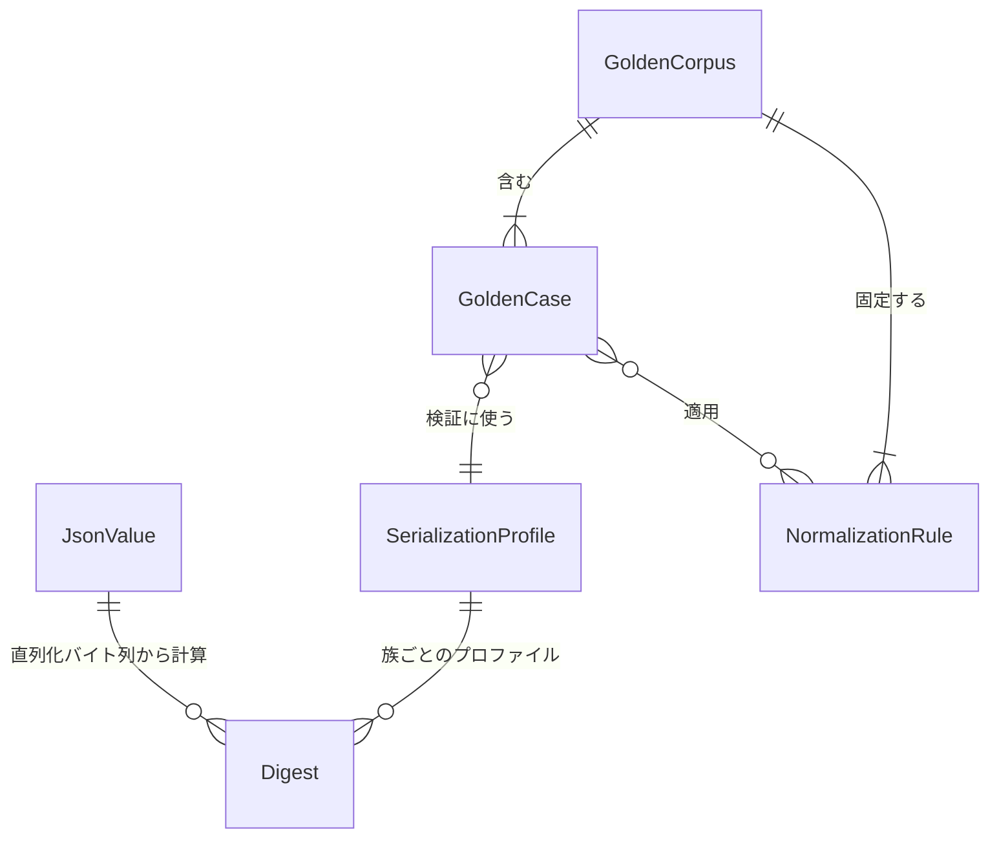

# functional-spec — U1 canon-json とゴールデン（`u1-canon-json-goldens`）

> Functional Design（Construction 3.1）成果物（Unit: U1）。出典: `../../../inception/units-generation/unit-of-work.md`、
> `../../../inception/units-generation/unit-of-work-story-map.md`（FR7.1〜7.3）、`../../../inception/requirements-analysis/requirements.md`
> （FR7、NFR1、前提 A3）、`../../../inception/domain-design/components.md`（CanonJson — 依存ゼロ、PersistenceGateways が
> continue_token/ドリフト判定で利用）、`../../../inception/contract-design/contract-summary.md`（C1 continue_token、C7 ゴールデン）、
> `docs/adr/0001-canonical-json-serializer.md`、`entities.md`（データの正本）、`rules.md`（規則の正本）。
>
> 本ファイルはワークフローと状態遷移の正本。ER 図と規則要約は導出ビュー。

## 1. 概要

U1 は 2 つの成果を持つ: (1) `canon-json` クレート — upstream（JS の `JSON.stringify` / `hashObject`）とバイト一致する
JSON の読み書きとダイジェスト計算を、3 プロファイルで提供する依存ゼロの純粋部品。(2) ゴールデンコーパス —
upstream ピンから採取した正解データと、それを使う比較テストの土台（後続 Bolt の TDD のオラクル）。

## 2. インターフェイス（設計レベル）

```text
serialize(value: &JsonValue, profile: SerializationProfile) -> String          // BR1.1〜BR1.5
hash_canonical(value: &JsonValue) -> Digest{family: canonical-prefixed}       // BR1.6（"sha256:" + hex）
hash_compact(value: &JsonValue) -> Digest{family: compact-raw}               // BR1.6（生 hex）
parse(text: &str) -> Result<JsonValue, ParseError>                            // 挿入順を保持して読む
to_value<T: Serialize>(t: &T) -> JsonValue                                    // 型付き struct → 宣言順の JsonValue（契約経路の唯一の変換点）
```

- 型付き契約型（stage-graph / scope-grid / directive 等）は struct のフィールド宣言順で JsonValue になる（BR1.1）。
- 動的マップ（serde_json::Map 相当）は preserve_order で挿入順を保持し、直列化時に BR1.2 の順序規則を適用する。
- 呼出側は `serde_json` を直接呼ばない（BR1.7）。

## 3. ワークフロー

### W1 — 契約 JSON の直列化（serialize）

1. 入力 `JsonValue` とプロファイルを受ける。
2. プロファイルがキー順を決める: hash-canonical なら全オブジェクトを再帰的にソート（BR1.1）、それ以外は
   宣言順/挿入順 + BR1.2 の integer-like 規則。
3. 値種別ごとに書く: 数値は BR1.3、文字列は BR1.4、配列/オブジェクトは BR1.5 の体裁。
4. 出力文字列を返す（pretty は末尾改行付き）。
- 事前条件: JsonValue は構築済み（不変）。事後条件: 同じ入力・同じプロファイルなら同じバイト列（決定性）。
- エラー経路: なし（非有限数は null に落とす。integer-like キーの写像未定義は設計時の棚卸しで排除 — 実行時は
  BR1.2 の規則で機械的に並べる）。

### W2 — ダイジェスト計算（hash）

1. 正準族: W1 を hash-canonical で実行 → UTF-8 バイト列の sha256 → `sha256:` + 小文字 hex（BR1.6）。
2. 非正準族: W1 を contract-compact で実行 → sha256 → 生 hex。
- 利用箇所: continue_token / バンドル digest / ドリフト判定（C1、PersistenceGateways）、approval fingerprint 等。
- 事後条件: 同じ入力なら同じダイジェスト。

### W3 — 契約 JSON の読取（parse）

1. テキストを JSON として読み、オブジェクトのキー順を保持した `JsonValue` を作る。
2. 不正 JSON は `ParseError`（位置と理由を材料として保持 — 文言化はアダプタ層）。
- 利用箇所: stage-graph / scope-grid / scopes の読取（WorkflowDefinitionRepositoryImpl — U3 既存）、ゴールデン比較。

### W4 — ゴールデン採取（再採取スクリプト、FR7.1 / FR7.2）

1. 使い捨てのワークスペースを用意し、upstream ピン `3c3146cf` の dist ツールを bun で実行する（前提 A3）。
2. hash-canonical 族: 入力クラス別の入力 JSON（BR2.3 のクラス一覧）を upstream の `canonicalize` / `hashObject` に
   通し、出力文字列とダイジェストを受入表に書く。
3. cli 族: BR2.4 の主要遷移を順に実行し、各コマンドの stdout・状態ファイル差分・監査行を採る。
4. hook 族: フック 4 本に代表ケースの stdin JSON を与え、exit code・stderr・監査行を採る。
5. 全ケースに BR2.2 の正規化を適用し、来歴（commit, captured_at, command）を付けてコーパスに書く（BR2.1）。
- 事後条件: コーパスは再実行で同じ内容になる（正規化後）。
- エラー経路: upstream ツールが失敗 → そのケースは採取しない（欠落を明示。捏造しない）。

### W5 — ゴールデン比較（テスト）

1. コーパスのケースを読む。
2. hash-canonical 族: 同じ入力を canon-json に通し、出力文字列とダイジェストを行ごとに比較（BR2.3 — 全行一致が
   FR7.3 の合格）。
3. cli / hook 族: 後続 Bolt（U6 / U7）の実装を同じ入力で動かし、BR2.2 の正規化後にバイト比較。本 Unit では
   コーパスの読取と比較器（normalize + diff）を用意するところまで（実装対象は後続 Bolt）。
- エラー経路: 不一致はテスト失敗。ゴールデンは直さず実装を直す（BR2.3 / BR2.5）。

## 4. 状態遷移

ライブラリ（W1〜W3）は状態を持たない。ゴールデンケースの**データとしての状態**のみ:

| 現在 | イベント | 条件 | 次 | 動作 |
|---|---|---|---|---|
| （なし） | 採取（W4） | upstream ツールが成功 | captured | 来歴付きでコーパスに追加 |
| captured | 比較（W5） | 正規化後に一致 | verified | — |
| captured | 比較（W5） | 不一致 | failing | 実装を修正して再比較（ゴールデンは不変） |
| verified / failing | upstream ピン更新 | 別 intent | stale | 再採取（W4）で置換、差分は逸脱台帳と突合（BR2.5） |

## 5. エラー一覧

| エラー | 発生 | 扱い |
|---|---|---|
| ParseError | W3: 不正 JSON | 位置・理由を材料として返す（文言はアダプタ層）。リトライなし |
| GoldenMismatch | W5: 比較不一致 | テスト失敗。実装を修正 |
| CaptureFailure | W4: upstream ツール失敗 | ケース欠落を記録（捏造しない） |

## 6. 導出ビュー — ER 図（`entities.md` が正本）


<!-- Text fallback: JsonValue 1 → Digest 多（直列化バイト列から計算）。SerializationProfile 1 → Digest 多。GoldenCorpus 1 → GoldenCase 多、GoldenCorpus 1 → NormalizationRule 多。GoldenCase 多 → SerializationProfile 1（検証に使う）。GoldenCase 多 ↔ NormalizationRule 多（適用）。 -->

## 7. 導出ビュー — 規則要約（`rules.md` が正本）

BR1.1 キー順はプロファイル / BR1.2 integer-like は先頭 / BR1.3 数値は JS 互換 / BR1.4 最小エスケープ /
BR1.5 体裁固定 / BR1.6 ダイジェスト 2 族 / BR1.7 直接呼び出し禁止 / BR1.8 preserve_order 常時有効 /
BR2.1 採取 + 来歴 / BR2.2 正規化比較 / BR2.3 受入表網羅 / BR2.4 CLI 範囲 / BR2.5 更新はピン更新 intent のみ。

## 8. トレーサビリティ

FR7.1 → BR2.1, BR2.3（受入表の採取）。FR7.2 → BR2.1, BR2.2, BR2.4（CLI/フックゴールデン）。
FR7.3 → BR1.1〜BR1.6（実装規則）+ BR2.3（合格基準）。NFR1 の正準化面 → BR1.1〜BR1.6。

## Review

**Verdict:** READY
**Reviewer:** aidlc-architecture-reviewer-agent
**Date:** 2026-08-22T11:46:03Z
**Iteration:** 1（advisory, unit: u1-canon-json-goldens）

### Findings

| # | Severity | Location | Finding | Recommendation |
|---|---|---|---|---|
| 1 | Major | rules.md BR2.3 / entities.md GoldenCase.expected vs `contract-summary.md` C7 | C7（U1 が所有する共有契約）は hash-canonical ゴールデンのファイル形を `tests/goldens/hash-canonical/*.json # { input, expected_sha256 } の受入表` と 2 フィールドで明記している。一方 BR2.3 は「各行で出力文字列とダイジェストの両方が一致しなければならない」、entities.md の `GoldenCase.expected` も hash-canonical 系列で「出力文字列 + Digest」を要求しており、ADR 0001 の受入条件 2（実出力文字列と実ハッシュ値の両方を表に固定）とは整合するが、C7 の 2 フィールド表記とは食い違う。C7 は U6/U7 も consumers として読む共有契約であり、上流成果物間の矛盾は読み替えず人間裁定を仰ぐという project.md の是正学習（`ALWAYS 上流成果物間に矛盾を見つけたら…人間へ裁定を求める`）に照らすと、C7 のスキーマ表記（`{ input, expected_sha256 }`）を `{ input, expected_output, expected_sha256 }` へ更新すべきか、あるいは単なる省略表記であることを承認ゲートで確認すべきかが未裁定のまま進んでいる。 | 承認ゲートで「C7 の受入表スキーマは省略表記か、3 フィールドへの更新が必要か」を人間に確認し、必要なら C7 を本 Unit のスコープで同時に改訂する。 |
| 2 | Minor | functional-spec.md W2 / §8 トレーサビリティ | W2（ダイジェスト計算）は continue_token・バンドル digest・ドリフト判定・approval fingerprint を「利用箇所」として一括りに挙げているが、ADR 0001 のコンテキスト節は digest を正準族（hashObject 互換 = `sha256:` 接頭辞、hash-canonical 由来）と非正準族（`sha256(JSON.stringify(x))` = 生 hex、contract-compact 由来）の 2 族に明確に分け、bundle hash / directiveHash / route hash を非正準族側に分類している。continue_token に埋め込まれる「バンドル digest」がどちらの族かを本ファイルは明示していないため、実装者（U6）が `hash_canonical` と `hash_compact` のどちらを呼ぶべきか一覧から一意に読み取れない。 | W2 に「用途 → family」の対応表（例: バンドル digest = compact-raw、approval fingerprint = canonical-prefixed）を1行追加し、ADR のコンテキスト節の分類と揃える。 |
| 3 | Minor | entities.md JsonValue.integer_value | `integer_value` の型を `integer(i64/u64)` と単一属性で併記しており、i64 の範囲を超え u64 のみで表現できる値（i64::MAX 超・u64 範囲内）をどちらの型として保持するかの判別規則が記載されていない。設計レベルの抽象化ではあるが、契約型の数値フィールドを「i64/u64 に固定」（ADR 0001 決定 4）する以上、実装時に符号の取り違えが起きうる。 | attributes に `sign: [signed, unsigned]` のような判別属性を足すか、「非負値は u64 優先、それ以外は i64」等の一言規則を constraints に追記する。 |

### Validation Tool Results

| 確認項目 | 結果 | 解釈 |
|---|---|---|
| ADR 0001 決定 1〜6・受入条件 (a)〜(e) と rules.md BR1.x の突合 | 一致 | キー順（決定3/BR1.1・BR1.2、ECMA-262 の integer-like キー範囲 0〜2^32-2 も正確）、数値表記（決定4/BR1.3、指数閾値・`-0`・非有限→null 込み）、体裁（決定2/BR1.5）、直接呼び出し禁止（決定5/BR1.7）、preserve_order（決定3/BR1.8）、2 族ダイジェスト（コンテキスト/BR1.6）はいずれも ADR の記述と矛盾なし |
| traceability.json の OK target と rules.md の BR 実在確認 | 一致 | FR7 / FR7.1 / FR7.2 / FR7.3 が指す BR1.1〜BR1.6・BR2.1〜BR2.4 は rules.md に全て実在。reverse の BR1.7・BR1.8・BR2.5 も rules.md に実在し、要求 ID を持たない横断規則という説明も rules.md の記述と整合 |
| rules.md 全 BR の traceability 網羅（OK 側 + reverse 側の突合） | 一致 | BR1.1〜BR1.8・BR2.1〜BR2.5 の 13 件すべてが coverage の target か reverse のいずれかに現れ、孤立規則なし |
| unit-of-work.md U1 定義（責務・境界・合格）との突合 | 一致 | 「依存ゼロの純粋部品」「upstream ピン 3c3146cf のみを入力」「FR7.1 全行一致 + FR7.2 コミットが合格」の記述と entities.md／functional-spec.md の設計が一致 |
| components.md CanonJson（depends_on: []、PersistenceGateways が token/ドリフトのハッシュで利用）との突合 | 一致 | functional-spec.md W2 の「利用箇所」記述と整合。ただし family 分類の粒度は所見 2 参照 |
| contract-summary.md C1（continue_token）・C7（ゴールデン）との突合 | 一部不一致 | C1 の continue_token 記述とは矛盾なし。C7 のゴールデンスキーマとは所見 1 の食い違いあり |
| 設計ステージの制約（コード ≤15 行、実装詳細不記載）順守確認 | 順守 | functional-spec.md §2 のインターフェイス例示は 5 行、擬似コードレベルに留まる |

### Summary

ADR 0001 の決定・受入条件と rules.md／entities.md の対応はほぼ一対一で、traceability.json も rules.md の全 BR を漏れなく参照しており、致命的な欠落や循環はない。唯一、本 Unit が所有する共有契約 C7 のゴールデンスキーマ（2 フィールド）と、本 Unit 自身の規則（BR2.3、3 フィールド相当）が食い違っており、これは U6/U7 が消費する契約面なので承認前に人間が裁定すべき（Major 1 件）。それ以外はダイジェスト family の対応表を足す程度の Minor 2 件にとどまる。
