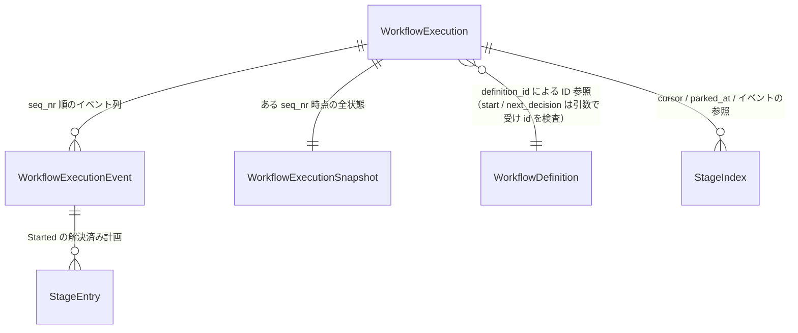

# functional-spec — U2 ドメイン ES コア（`u2-domain-es-core`）

> Functional Design（Construction 3.1）成果物（Unit: U2）。出典: `../../../inception/units-generation/unit-of-work.md`、
> `../../../inception/units-generation/unit-of-work-story-map.md`（FR8.3 / FR8.4、FR2.1 / FR3.1 / FR3.3 の土台）、
> `../../../inception/requirements-analysis/requirements.md`（FR1.3 / FR2.1 / FR3.1 / FR3.3 / FR8.3 / FR8.4、NFR1 / NFR3）、
> `../../../inception/domain-design/decisions.md`（ADR-001〜007）、`../../../inception/domain-design/components.md`、
> `../../../inception/contract-design/contract-summary.md`（C3 / C5 / C6）、`formal/orchestration/engine_loop.qnt`、
> 現行 `workflow_execution.rs`、`entities.md`（データの正本）、`rules.md`（規則の正本）、確認質問 `functional-design-questions.md`。
>
> 本ファイルはワークフローと状態遷移の正本。ER 図と規則要約は導出ビュー。コードは ≤15 行の例示のみ。

## 1. 概要

U2 は `core-domain` の `WorkflowExecution` を **イベントソーシング形の FSM** にする: コマンドは decide（`&mut self`、単一
イベントを返し自身に適用）、`apply_event` がリプレイと通常実行を同一経路にし、`version` / `seq_nr` を保持する。判断
（`next_decision` / `jump_resolve` / `stale_report`）はクエリ。あわせて `PlanAction` を `workflow_definition` へ完全移動し
（FR8.3）、有効プランの畳み込みを集約へ一本化する（FR8.4）。I/O なし・純粋・同期・~~serde なし~~ → **serde あり（memento 経由）**
（2026-08-27 改訂 / ADR-010・Bolt B6: 本家 event-store-adapter-rs の trait が serde 境界を要求する。
ただし集約の直列化は `state()`、復号は `from_state()` へ委ねるので検査点は 1 か所のまま。あわせて
`chrono::DateTime<Utc>` が入った — **NFR4.1 依存最小化の再検討対象**）。Repository・ストア・投影は
U3 / U4。

## 2. インターフェイス（設計レベル）

```text
WorkflowExecution::start(id: IntentId, def: &WorkflowDefinition, scope, request) -> Result<(Self, Started), StartError>
   // def.id() / def.revision() を Started に記録するだけ（検査しない — BR2.6）。以後 definition_id(&self) -> &WorkflowDefinitionId で公開
complete_stage(&mut self) -> Result<StageCompleted, CommandError>     // 非ゲート（initialization フェーズ）のみ
open_gate(artifacts) / approve_gate(user_input?, phase_boundary?) / reject_gate(feedback?) / revise_stage / skip_stage(reason)
   // artifacts / phase_boundary は C5 の投影材料で呼出側（ユースケース）が定義・ワークスペースから渡す（集約は検証せず載せるだけ）
jump(target: StageIndex) -> Result<Jumped, CommandError>   jump_resolve(target) -> Result<JumpDirection, CommandError>
park / unpark / recompose(flips: [StageIndex]) / set_autonomy(mode) -> Result<Event, CommandError>
accepts_commands(&self) -> bool   // BR1.0: running ∧ !park 中。偽なら unpark 以外の decide は NotRunning
apply_event(&mut self, &WorkflowExecutionEvent) -> Result<(), ApplyError>     // リプレイ経路
next_decision(&self, &WorkflowDefinition, &NextRequest) -> Result<NextDecision, CommandError>  // 書込なし。def.id() ≠ definition_id は Err(DefinitionMismatch)
stale_report(&self, stage) -> Result<NextDecision, CommandError>                  // 書込なし（Done を返す）
state(&self) -> WorkflowExecutionState   from_state(s) -> Result<Self, StateError>   // 2026-08-27: with_version(v) は削除（ADR-010）
// 本家 Aggregate の実装として id() / seq_nr() / version() / set_version(v) / last_updated_at() を持つ（借り物の契約なので綴りも型もそのまま — usize）
stage_index(&self, usize) -> Option<StageIndex>  stages() / cursor() / checkbox(StageIndex) / effective_plan(StageIndex) …
```

- 非ゲート = `phase = initialization`（実グラフでは 3 ステージ）。Quint の `stage 0` はこの束の抽象（BR1.3 / BR2.5）。
- 集約間の依存は ID 参照（BR2.6）: `WorkflowDefinition` はエンティティとして `id(): &WorkflowDefinitionId` / `revision(): &DefinitionRevision` を持ち（本 Unit で追加）、
  `WorkflowExecution` は `definition_id` だけを保持する。C4 は `WorkflowDefinitionRepository::find_by_id(&WorkflowDefinitionId)` に改訂（`find()` は廃止、
  後方互換の併存なし — Bolt B3 で use-case の trait・interface-adapter の impl・呼出側を同時修正、ADR-008）。
- コマンド名は C5 のイベントと 1:1（`complete_stage` → `StageCompleted`、`open_gate` → `GateOpened`、`approve_gate` →
  `GateApproved`、`reject_gate` → `GateRejected`、`revise_stage` → `StageRevised`、`skip_stage` → `StageSkipped`、`jump` →
  `Jumped`、`park` → `Parked`、`unpark` → `Unparked`、`recompose` → `Recomposed`、`set_autonomy` → `AutonomyModeSet`）。
- 現行 API との対応: `report_forward` → `complete_stage`（非ゲート）/ `approve_gate`（ゲート）、`gate_start` → `open_gate`、
  `reject` → `reject_gate`、`revise` → `revise_stage`、`report_skipped` → `skip_stage`、`recompose_flip` → `recompose`、
  `next` → `next_decision`（`EngineSignal` は導出）。

## 3. ワークフロー

### W1 — 開始（start → Started）

1. `WorkflowDefinition::is_valid_scope(scope)` を確認（不正なら `StartError::UnknownScope`）。`stages_in_scope(scope)` が返す**全ステージ**を
   **文書（グラフ）順**に `StageEntry(slug, phase, plan_action, conditional)` 列にする — `plan_action` はグリッドの `Option<PlanAction>` を
   `None → SKIP` で畳み、`conditional` は同じ文書順の `graph().nodes()[i].execution() = CONDITIONAL`、`phase` は `stages_in_scope` の
   PhaseId（BR2.2）。`gated(i) = phase ≠ initialization`（BR1.3）。
2. 列が空（グラフが空）/ initialization ステージが SKIP / conditional なら `StartError`（BR2.2）。
3. `Started{definition_id: def.id(), definition_revision: def.revision(), scope, request, stages}` を構築し、新しい集約（seq_nr = 0、version = 0）に apply → seq_nr = 1、
   checkbox[0] = InProgress、cursor = 0、overlay = plan の写し、revision_count = 0、definition_id / definition_revision を保持。集約と `Started` を返す。
4. birth のユースケースは続けて initialization の各ステージ（実グラフでは 3 つ）を `complete_stage` で順に完了させる（StageCompleted ×3 —
   upstream の birth 時自動完了を 1 コマンド 1 イベントで再現。Quint の stage 0 はこの initialization 束の抽象 — BR2.5）。
- 事後条件: 以後リプレイは `Started` だけで集約を再構成できる（定義不要）。

### W2 — コマンド実行（decide → event → apply）

1. ガード（`accepts_commands` — BR1.0、checkbox の前提、対象の妥当性 — BR1.x）を検査。不成立なら `Err(CommandError)`、状態不変。
2. イベントを構築（封筒は `id` = intent_id + (seq_nr + 1)（2026-08-27 / ADR-010: `WorkflowExecutionEventId` に
   まとまった。値は同じ 2 つ組）/ schema_version 1。`occurred_at`、`GateOpened.artifacts`、`GateApproved.phase_boundary`
   は呼出側が渡す投影材料。`GateRejected.revision_count` は集約の revision_count[stage] を +1 した値）。
3. `apply_event(&event)` で状態を進め seq_nr を +1。イベントを返す（BR1.1）。
4. ユースケース（U5 / U6）は `Repository.store(&event, &aggregate)` を呼ぶ（C3）。~~成功後に `with_version(v + 1)`~~
   → **失効（2026-08-27 / ADR-010・Bolt B6）**: `with_version` は削除された。**新しい version を知るのはストアだけ**
   なので、続けて書くには再水和が要る（BR5.3。1 コマンド 1 プロセスの CLI では起きない）。
- 事後条件: `self == old.apply_event(event)`（BR2.3）。

### W3 — 再水和（from_snapshot + replay）

1. `from_snapshot(S)` が不変条件（長さ一致・cursor in-scope・進行中高々 1・ゲート完了は承認付き）を検証して集約を復元
   （version / seq_nr 引継ぎ）。違反は `SnapshotError`。
2. seq_nr 以降のイベントを順に `apply_event`。seq_nr の飛びは `ApplyError::SequenceGap`（BR2.1）。
- 利用箇所: U3 の `find_by_id`（最新スナップショット + 差分 replay）。
- 再構成の契約は**「最新スナップショット + 後続イベント」のみ**。`apply_event(Started)` は genesis 専用で、既存集約への適用は
  `ApplyError::InvariantViolation` で拒否する（Bolt B3 実装判断 D6）。journal の先頭イベント（`Started`、seq_nr = 1）だけから集約を
  再構成する経路は U2 の契約に含めない — 必要なら U3 の設計で `from_started` 相当の入口を仕様化する（`StartRequest` + `Started::new` で
  代用する案は採らない）。

### W4 — next_decision（BR3.1 の優先順）

0. `definition.id() ≠ self.definition_id` → `Err(CommandError::DefinitionMismatch{expected, actual})`（BR2.6。revision の差は Err にしない）。
1. park 中（parked_at = cursor）かつ再入フラグなし → `Parked{cursor}`（`resume` なら `UnparkThenResume`）。
2. `resume`（非 park）→ `ResumeMenu`。3. `free_text` → `NewWorkRouting`。4. completed → `Done`。
5. cursor が in-flight（Pending を含む未完了 — BR1.2 の用語）かつ実効プラン SKIP → InProgress / Revising なら
   `RecoverSkipInconsistency{stage, checkbox}`、Pending / AwaitingApproval は `InconsistentSkip{stage, checkbox}`。
6. cursor が in-flight → `RunStage{cursor, gate: gated(cursor)}`。
7. 次の in-scope ステージ → `RunStage`、無ければ `Done`。
- 事後条件: 書込なし。`EngineSignal` は `NextDecision` から導出（RunStage / Done / Parked / Error）。

### W5 — ジャンプ（jump_resolve → jump → Jumped）

1. `jump_resolve(target)`: BR1.6 の検証と `JumpDirection` の導出（純読取、`aidlc-jump resolve` に対応）。
2. `jump(target)`: resolve が Ok なら差分を計算し `Jumped{direction, source, target, stages_reset, stages_skipped}`（C5 の形、slug）を
   1 つ返す。forward のスキップ集合は Quint の 2 条件 — 介在ステージ（cursor < u < target）は in-flight（Pending 含む）なら Skipped、
   現ステージ cursor は in-flight かつ非 Pending のときのみ Skipped。backward は target+1 以降の in-scope 非 Pending を Pending に戻し
   target 以降の approved を消す（apply 側が direction / target から導出）、redo は cursor の approved を消す。target は InProgress、
   cursor = target。

### W6 — recompose / park / unpark / set_autonomy

- `recompose(flips)`: 反転対象の集合（1 件以上）を BR1.8 のガードで全件検査（1 件でも不正なら全体 Err）→ `Recomposed{skipped, added,
  stages_in_scope}`（C5）、overlay を一括反転。plan は不変。
- `park` → `Parked{cursor}`（gated のみ）、`unpark` → `Unparked{}`（park 中のみ、位置は parked_at から復元）、`set_autonomy(mode)` →
  `AutonomyModeSet`（setter。Quint のトグルとの対応は BR2.5）。

### W7 — PlanAction の完全移動（FR8.3）と畳み込みの移設（FR8.4）

1. `plan_action.rs` を `workflow_definition/` へ移動し、`workflow_definition/mod.rs` の `pub use` に加える。`orchestration/mod.rs`
   から定義と再輸出を消す。呼出側（BR4.1 の一覧）を `core_domain::workflow_definition::PlanAction` に一斉修正。
2. `WorkflowDefinition::effective_plan_action` と、その合成に依存する `next_in_scope_stage` を削除（BR4.2）。グリッド照会
   `grid().action(scope, slug)` と畳み込みを含まない述語（`is_valid_scope` / `valid_scopes` / `scope_metadata` / `subgraph_for_scope` /
   `stages_in_scope` / `first_in_scope_stage_of_phase`）は残す。既存テスト（`workflow_definition.rs` 内の effective_plan_action /
   next_in_scope_stage 系、interface-adapter テストの該当箇所）は集約側または grid 照会に書き換え。
- 合格: `grep -rnE 'enum PlanAction|pub use .*PlanAction' modules/core/domain/src/orchestration` が 0 件（`workflow_execution.rs` の
  正当な利用は対象外）、CI 全ジョブ緑。

## 4. 状態遷移

### 4.1 ステージの checkbox（各ステージ）

| 現在 | イベント | 条件 | 次 | 動作 |
|---|---|---|---|---|
| Pending | Started（索引 0 = 最初の initialization ステージ） | — | InProgress | cursor = 0 |
| Pending | StageCompleted / GateApproved / StageSkipped の next_stage | 次の in-scope | InProgress | cursor 前進 |
| Pending | Jumped（target） | forward / backward | InProgress | cursor = target |
| Pending | Recomposed | stage > cursor | Pending | overlay 反転のみ |
| InProgress | StageCompleted | 非ゲート（initialization） | Completed | 次へ |
| InProgress | GateOpened | ゲート | AwaitingApproval | — |
| InProgress | GateApproved | ゲート（open 省略経路） | Completed | approved = true |
| InProgress | GateRejected | ゲート | Revising | — |
| InProgress / Revising | StageSkipped | conditional ∨ 実効 SKIP | Skipped | 次へ |
| AwaitingApproval | GateApproved | — | Completed | approved = true |
| AwaitingApproval | GateRejected | — | Revising | — |
| Revising | StageRevised | — | AwaitingApproval | — |
| Pending / InProgress / AwaitingApproval / Revising | Jumped（forward, 介在 cursor < u < target） | in-flight なら | Skipped | — |
| InProgress / AwaitingApproval / Revising | Jumped（forward, 現ステージ cursor） | in-flight かつ非 Pending | Skipped | — |
| Completed / Skipped / Revising / AwaitingApproval / InProgress | Jumped（backward, target 以降の非 Pending — cursor 自身を含む） | in-scope | Pending | approved 消去 |
| InProgress / AwaitingApproval / Revising（cursor） | Jumped（redo, target = cursor） | cursor が非 initialization | InProgress | approved[cursor] 消去 |
| Completed | stale_report | クエリ | Completed | 変化なし |

### 4.2 ワークフロー全体

| 現在 | イベント | 条件 | 次 |
|---|---|---|---|
| running | StageCompleted / GateApproved / StageSkipped（next_stage = None） | 後続 in-scope なし | completed |
| running | Parked | gated | running（parked_at = cursor） |
| running（park 中） | Unparked | — | running（parked_at = None） |
| running（park 中） | unpark 以外の decide コマンド | BR1.0 | 拒否（NotRunning、状態不変） |
| completed | — | 終端（コマンドは NotRunning） | completed |

## 5. エラー一覧

| エラー | 発生 | 扱い |
|---|---|---|
| StartError（UnknownScope / Empty / InitializationMustExecute / InitializationMustBeUnconditional） | W1 | 呼出側へ返す。状態なし。グリッド列が無いステージは SKIP に畳むので Err にはならない（initialization ステージを除く — 畳んだ結果 SKIP なら InitializationMustExecute）。Empty はコンパイル済みグラフが空の場合のみ（防御的、実グラフでは到達しない） |
| CommandError（NotRunning / CheckboxPrecondition{stage, actual} / NotSkippable / NotStale / InvalidTarget / RefusedUnderAutonomy / DefinitionMismatch{expected, actual}） | W2 / W4 / W5 / W6 | 状態不変で返す。文言はアダプタ層。DefinitionMismatch は別の定義（id 不一致）で駆動しようとしたとき（BR2.6） |
| ApplyError（SequenceGap{expected, actual} / UnknownStage / InvariantViolation） | W3 | 再水和失敗（U3 は Corrupt に写す） |
| SnapshotError（InvariantViolation{reason}） | W3 | 同上 |

## 6. 導出ビュー — ER 図（`entities.md` が正本）


<!-- Text fallback: WorkflowExecution 1 → WorkflowExecutionEvent 多（seq_nr 順）。WorkflowExecution 1 ↔ WorkflowExecutionSnapshot 1。WorkflowExecution 多 → WorkflowDefinition 1（definition_id による ID 参照、所有しない）。Started 1 → StageEntry 多。WorkflowExecution 1 → StageIndex 多。 -->

## 7. 導出ビュー — 規則要約（`rules.md` が正本）

BR1.0 コマンド受理述語（park 中は unpark 以外拒否）/ BR1.1 1 コマンド 1 イベント / BR1.2 用語（active / in-flight）・cursor in-scope・active 1 / BR1.3 ゲート完了は承認 / BR1.4 ゲート生存期間 / BR1.5 skip /
BR1.6 jump / BR1.7 park・unpark / BR1.8 recompose・set_autonomy / BR1.9 stale_report はクエリ / BR2.1 封筒と seq_nr /
BR2.2 Started 自己完結（全ステージ文書順、None→SKIP）/ BR2.3 リプレイ決定性 / BR2.4 12 変種（C5 の形）/ BR2.5 Quint 射影表 / BR2.6 集約間は ID 参照（definition_id、DefinitionMismatch）/ BR3.1 next_decision 優先順 / BR3.2 状態非依存分岐は U6 /
BR3.3 jump_resolve / BR4.1 PlanAction 完全移動 / BR4.2 畳み込み移設 / BR5.1 StageIndex / BR5.2 ~~serde なし~~ → serde は memento 経由（2026-08-27 / ADR-010）・snapshot /
BR5.3 version・seq_nr / BR5.4 コーディング規則。

## 8. トレーサビリティ

FR8.3 → BR4.1。FR8.4 → BR4.2。FR2.1（report の遷移コミットの集約側）→ BR1.0, BR1.1, BR1.3, BR1.4, BR1.5, BR1.9。FR3.1 / FR3.3
（next_decision の判断本体と層配置）→ BR3.1, BR3.2, BR3.3。FR1.3（Repository の集約側: snapshot / replay）→ BR2.1, BR2.3,
BR2.6, BR5.2, BR5.3。NFR1（engine_loop 契約維持）→ BR1.0, BR1.2〜BR1.9, BR2.3, BR2.5。NFR3（再構成可能性の前提）→ BR2.1〜BR2.3, BR2.6。

## Review

**Verdict:** NOT-READY
**Reviewer:** aidlc-architecture-reviewer-agent
**Date:** 2026-08-23T00:18:27Z
**Iteration:** 2（advisory, recovery, unit: u2-domain-es-core）

### Findings

#### A. 新規所見（今回の反映で顕在化／未検出だったもの）

| # | Severity | Location | Finding | Recommendation |
|---|---|---|---|---|
| 14 | Critical | `rules.md` BR1.3 / BR1.4 / BR1.6 / BR3.1、`functional-spec.md` §2・W1・W4・§4.1、`entities.md` StageEntry / StageIndex | **「非ゲート = stage 0」という Quint の抽象を実グラフに持ち込んでおり、設計内部で矛盾している。** 所見2 の是正で BR2.2 は「`stages_in_scope(scope)` が返す**全ステージ**を文書順」に確定したが、実グラフ（`.claude/tools/data/stage-graph.json`、実測 33 ノード）の索引 0 / 1 / 2 は `workspace-scaffold` / `workspace-detection` / `state-init` の**3 つとも initialization フェーズ**である。上流のゲートモデルは「initialization **phase** → gate = `false`（bootstrap auto-proceed, no governance gate）」と**フェーズ単位**で定めており（`docs/specs/research/orchestration-next-ladder.md:210`）、jump 禁止も `INIT_JUMP_ERROR: Cannot jump to initialization stages`（複数形、同 `:35`）である。ところが本設計は BR1.3「stage 0 は非ゲート」、BR1.4「非ゲート（stage 0）への open_gate / reject_gate は Err(InvalidTarget)」、BR1.6「target ≠ 0」、BR3.1「gate = cursor ≠ 0」、§2「`complete_stage` は stage 0 のみ」、`entities.md`「0 は initialization（非ゲート）ステージ」と**索引 0 だけ**を特別扱いする。結果、実グラフでは索引 1 / 2 が「ゲート付き」と判定され、`complete_stage` が拒否され、`no_gate_bypass` 相当の承認履歴を要求され、`next_decision` が `gate: true` を返し、索引 1 / 2 への jump が通ってしまう。**さらに集約は判定材料を持たない** — `StageEntry` は `slug` / `plan_action` / `conditional` のみで phase を持たず、`WorkflowExecution` にも phase 列が無い（`stages_in_scope` は `(&StageSlug, PhaseId, Option<PlanAction>)` を返すのに PhaseId を捨てている）。加えて C5 の `Started` 投影は `STAGE_STARTED×3 + STAGE_COMPLETED×3（init 3 stage）` と init 3 ステージの自動完了を規定するのに対し、W1 は `checkbox[0] = InProgress、cursor = 0` として索引 0 を実行待ちにしており、**同じイベントの意味が U2 と C5 で食い違う**。現行 `workflow_execution.rs:187-189` の `gated(s) = s != 0` は Quint slice-1 の写しであり（同ファイル doc「stage 0 = initialization」）、実定義に接続する B3 でこそ解かねばならない抽象である。 | (1) `StageEntry` に `phase`（または `gated: bool`）を追加し、`start` で `stages_in_scope` の `PhaseId` を捨てずに載せる。(2) BR1.3 / BR1.4 / BR1.6 / BR3.1 / §2 / §4.1 / `entities.md` の「stage 0」をすべて「initialization フェーズのステージ」に置き換える（`gated(s) = phase(s) ≠ initialization`）。(3) W1 の初期状態を C5 の `Started` 投影と突き合わせ、init 3 ステージを `Started` の apply で Completed にして cursor を最初の非 initialization in-scope ステージに置くのか、`complete_stage` を 3 回受けるのかをオーナー裁定として確定する（前者なら BR1.2 の `cursor_in_scope` と §4.1 の初期行も改訂が要る）。(4) この変更は BR2.5 の Quint 射影（`gated(s) = s != 0`）を実グラフでは 1:1 にできないことを意味するため、ITF 準拠テストが使うモデル世界と実グラフ世界の境界を BR2.5 に 1 行明記する。 |
| 15 | Major | `functional-spec.md` §2（コマンド一覧）・W2 手順2、`entities.md` payloads（GateOpened / GateApproved） | **所見3 の是正で C5 のペイロードを復帰させたが、その材料を受け取るコマンド引数が無い。** `entities.md` は `GateOpened{stage, artifacts}`・`GateApproved{stage, user_input?, next_stage?, phase_boundary?}` を「呼出側が渡す投影材料 — C5 どおり」と注記するのに、§2 のシグネチャは `open_gate`（引数なし）/ `approve_gate(user_input?)` のままで、W2 手順2 も呼出側供給を `occurred_at` のみとする。§2 は `reject_gate(feedback?)` / `skip_stage(reason)` のように引数を明示する書式なので、この欠落は省略記法ではない。`artifacts` と `phase_boundary` は C5 が U4 の投影入力として宣言する項目（`GateApproved` → `PHASE_COMPLETED, PHASE_VERIFIED?, PHASE_STARTED`）であり、集約は phase を持たない（所見14）ため自力導出もできない。 | §2 を `open_gate(artifacts)` / `approve_gate(user_input?, phase_boundary?)` に改め、W2 手順2 の「呼出側が渡す」対象に artifacts / phase_boundary を加える。`phase_boundary` の record 形（誰がどう導出するか）は U4 と合意して 1 行で定義する。所見14 の (1) を採ると集約が phase を持つため、`phase_boundary` を集約導出に切り替える選択肢も生じる — どちらかを明示する。 |
| 16 | Major | `entities.md` payloads（GateRejected）、`entities.md` WorkflowExecution attributes | **`GateRejected.revision_count` の供給元がどこにも無い。** C5 は `GateRejected: {stage, feedback, revision_count}` を規定し本設計もそのまま採用するが、`WorkflowExecution` の属性列（intent_id / stages / plan / overlay / conditional / checkbox / cursor / status / parked_at / autonomy / approved / seq_nr / version）に改訂回数の状態が無く、現行 `workflow_execution.rs` にも `revision` を含むフィールドは存在しない（実測 grep 0 件）。呼出側供給の注記も無い。集約状態を増やすなら `WorkflowExecutionSnapshot` → C6 snapshot 列 → U3 まで波及するため、実装前の裁定が要る。 | 3 択を明示して 1 つ選ぶ: (a) 集約に `revision_count: list<integer>` を持たせ `reject_gate` で +1（Snapshot / C6 への波及を BR5.2 / C6 に反映）、(b) 呼出側が渡す引数にする（§2 を `reject_gate(feedback?, revision_count)` に）、(c) ペイロードから外して U4 が `GateRejected` を数えて導出する（C5 の改訂提案に加える）。 |
| 17 | Major | `entities.md` `c5_revision_proposal`、同 payloads（Started） | **`c5_revision_proposal` の「変更なし: 既存 11 変種のペイロードは C5 のまま」が `Started` について事実に反する。** C5 の `Started.payload` は `{ scope, request, stages_in_scope, depth, test_strategy }` だが、本設計は `stages: list<StageEntry>` に**改名かつ型変更**している（`StageEntry` = slug + plan_action + conditional）。改名も型変更も P1（Started 自己完結）の帰結として正当だが、C5 は U4 の投影入力契約でもあり（`Started` → 「全フィールド初期化（Stage Progress 含む）」）、無宣言のままでは所見3 が指摘した問題がこの 1 変種に残る。同ブロックの「型の明示: C5 の `stages_*` は StageSlug」とも自己矛盾する（`stages` の要素は StageSlug ではない）。 | `c5_revision_proposal` を 3 項目に直す: 「追加: StageCompleted」「変更: `Started.stages_in_scope`（list&lt;StageSlug&gt;）→ `stages`（list&lt;StageEntry&gt; = slug + plan_action + conditional）— P1 自己完結の帰結、U4 の Started 投影に影響」「型の明示: 他変種の `stage` / `next_stage` / `stages_*` は StageSlug」。 |
| 18 | Minor | `functional-spec.md` §4.1（Jumped backward 行、redo 行の欠落） | §4.1 の backward 行は現在状態を `Completed / Skipped / Revising / AwaitingApproval` に限定するが、Quint `actJumpBackward`（`engine_loop.qnt:265-280`）は `u > t ∧ inScope(u) ∧ checkbox ≠ Pending` をすべて Pending に戻すので **InProgress も対象**である（backward では cursor 自身が u > t に入るため実際に頻出する）。BR1.6 の本文（「target+1 以降の in-scope 非 Pending」）は正しいので、導出表だけが不完全。また `Jumped(redo)` の行（`actJumpRedo`: cursor の checkbox → InProgress、approved 消去）が §4.1 に 1 行も無い。§4.1 は本ファイル冒頭で「状態遷移の正本」と宣言されているため、表の側も揃える必要がある。 | backward 行の現在状態に `InProgress` を加える（または「非 Pending のすべて」と書く）。`| Completed / AwaitingApproval / Revising | Jumped（redo, cursor） | cursor ≠ 0 | InProgress | approved[cursor] 消去 |` の行を追加する。 |
| 19 | Minor | `rules.md` BR2.2 の `logic` | `logic` は「`stages_in_scope`（文書順、全ステージ）→ None→SKIP 畳み込み → conditional 付与」と 1 本のパイプラインで書くが、実測の `stages_in_scope` は `Vec<(&StageSlug, PhaseId, Option<PlanAction>)>` を返し **`execution`（CONDITIONAL 判定の材料）を返さない**。`conditional` は `StageNode::execution()`（`stage_node.rs:333`）を `graph().nodes()` 側から索引一致で拾う必要がある（両者とも同じ文書順なので索引 zip は安全）。 | `logic` に「`conditional` は同じ文書順の `graph().nodes()[i].execution()` から索引一致で取る（`stages_in_scope` は execution を返さない）」を 1 行足す。所見14 の (1) で phase を載せるなら、この行に PhaseId も併記する。 |
| 20 | Minor | `functional-spec.md` §5 エラー一覧（StartError 行） | 「グリッド列が無いステージは SKIP に畳むので Err にはならない」は index 0 には当てはまらない（畳んだ結果 SKIP なら BR2.2 により `InitializationMustExecute`）。また供給元が全ステージになったことで `StartError::Empty` は「グラフが空」のときしか発火せず、実グラフでは到達不能に近い（旧 `subgraph_for_scope` 経路では zero-EXECUTE で発火した）。到達不能な変種は実装者に「いつ返すのか」を問わせる。 | 「グリッド列が無いステージは SKIP に畳むので Err にはならない（**index 0 を除く** — 畳んだ結果 SKIP なら `InitializationMustExecute`）」に直し、`Empty` に「コンパイル済みグラフが空の場合のみ（防御的）」の注記を付ける。 |

#### B. iteration 1 所見の解消状況（13 件）

| iter1 # | Severity | 判定 | 根拠 |
|---|---|---|---|
| 1 | Critical | **解消** | BR1.0 を新設し `accepts_commands = (status = running) ∧ (parked_at ≠ Some(cursor))` を規則化。BR1.5 / BR1.6 / BR1.7 / BR1.8 / BR1.9 がすべて BR1.0 を参照し、§2 に述語を、§4.2 に「park 中は unpark 以外の decide を NotRunning で拒否」の行を追加。Quint 側（`actPark` で `WorkflowParked` へ遷移し他 action は `status == Running` 要求）および現行 `running()` ガードと 1:1 になった。park 中の jump による暗黙解除も BR1.0 本文で明示的に禁止。 |
| 2 | Major | **解消** | BR2.2 / W1 が `stages_in_scope(scope)` の全ステージ・文書順に確定。実コードで裏取り済み — `workflow_definition.rs:219-234` は `graph.nodes()`（文書順）を全件写し、PBT `stages_in_scope_lists_every_stage_in_document_order`（同 `:654-668`）が長さ = `graph().len()` と索引一致を固定している。`subgraph_for_scope`（`:154-171`）が数値順 + EXECUTE 抽出であることとの使い分けも一致。 |
| 3 | Major | **部分解消** | `GateOpened.artifacts` / `GateApproved.phase_boundary` の復活、`Unparked{}`、`Recomposed{skipped, added, stages_in_scope}`、`Jumped` からの `approvals_cleared` 削除（apply 側導出）はすべて C5 逐語と一致することを確認。`completed: bool` の追加も撤回済み。**残件**: `Started.stages_in_scope` → `stages: list<StageEntry>` の改名・型変更が未宣言（→ 新規所見17）。 |
| 4 | Major | **解消** | BR1.6 が Quint の 2 条件を逐語で写している — `engine_loop.qnt:246-252` の「`u == cursor and isInFlight and != Pending`」「`u > cursor and u < t and isInFlight`」と一致。§4.1 にも 2 行に分けて反映済み。 |
| 5 | Major | **解消** | BR1.2 が `active = {InProgress, AwaitingApproval, Revising}` と `in-flight = {Pending, InProgress, AwaitingApproval, Revising}` を分離。実コードの `checkbox.rs:61-76`（`is_in_flight = !is_finished`、`is_active = is_in_flight && != Pending`）と完全一致。BR3.1 (5)(6)・W4・§4.1 の各出現も in-flight 側に振り分け済み。 |
| 6 | Major | **解消** | BR4.2 が削除対象を `effective_plan_action` と `next_in_scope_stage` の 2 つに限定し、残す述語を列挙。列挙した 6 メソッド（`is_valid_scope` / `valid_scopes` / `scope_metadata` / `subgraph_for_scope` / `stages_in_scope` / `first_in_scope_stage_of_phase`）が実在することを公開面の実測で確認。削除 2 メソッドの外部呼出しはテスト（`workflow_definition_repository_impl_test.rs`）のみで、W7 手順2 の書き換え指示と整合。 |
| 7 | Major | **解消** | BR2.2 に「`Option<PlanAction>` を `None → SKIP` で 2 値に畳む」を明記し、現行 `next_in_scope_stage` の `== Some(Execute)` 挙動との等価性、および Recomposed による EXECUTE 化が 3 値契約と等価である旨も併記。 |
| 8 | Minor | **解消** | §2 と BR1.9 がともに `Result<NextDecision, CommandError>` / `Ok(Done)` に統一。ITF 準拠テストの `agg.stale_report(s)` 戻り値経路（`engine_loop_conformance.rs:168`）と両立する。 |
| 9 | Minor | **解消** | 判定式が `grep -rnE 'enum PlanAction|pub use .*PlanAction' modules/core/domain/src/orchestration` に限定された。実行して検出力を確認 — 今日 2 件ヒット（`plan_action.rs:7` の `pub enum PlanAction`、`mod.rs:18` の `pub use plan_action::PlanAction`）、移動後に 0 件となる。`workflow_execution.rs` の正当利用にはマッチしない。 |
| 10 | Minor | **解消** | BR4.1 の 10 ファイル列挙が `grep -rln PlanAction modules tools` の実測 10 ファイルと完全一致（`orchestration/mod.rs` を含む）。 |
| 11 | Minor | **解消** | BR2.5 の射影表を新設。`engine_loop_conformance.rs:92-124` の `assert_projection`（`parked_at.map_or(-1, ...)`、`Running` は `!parked_active()` を追加検査、`WorkflowParked` は `parked_active()`、`WorkflowCompleted` は `Status::Completed`）と一致。`actSetAutonomy` のトグル ⇔ setter、`actRecompose` の 1 ステージ ⇔ 要素数 1 の `recompose` も明記。 |
| 12 | Minor | **解消** | BR3.1 末尾に「第 2 引数 `&WorkflowDefinition` は FR3.3 の合格基準が固定する契約上の引数で、現時点の分岐では参照しない（`_definition` で未使用警告を抑える）」を追記。 |
| 13 | Minor | **部分解消** | `relationships` の `from: Started` は `from: WorkflowExecutionEvent`（`kind = Started` の説明付き）に修正され、§6 の ER 図と一致した。**残件**: `WorkflowDefinition` / `StageSlug` / `CheckboxState` / `AutonomyMode` / `JumpDirection` に「既存型・本 Unit では変更なし」の注記が付いていない（Minor のため再掲のみ、新規番号は起こさない）。 |

### Validation Tool Results

| ツール / 手動クロスチェック | 結果 | 解釈 |
|---|---|---|
| ステージ定義（`.claude/aidlc-common/stages/construction/functional-design.md`）の validation tools 確認 | 該当なし（`sensors:` は PostToolUse hook 実行） | 本ステージは CLI 検証ツールを宣言しない。以下はすべて手動クロスチェック。 |
| `traceability.json` の全 OK target が `rules.md` に実在するか | PASS | forward 21 件（BR1.0〜BR1.9 / BR2.1 / BR2.2 / BR2.3 / BR2.5 / BR3.1〜BR3.3 / BR4.1 / BR4.2 / BR5.2 / BR5.3）+ reverse 3 件（BR2.4 / BR5.1 / BR5.4）= 24 で、`rules.md` の全 24 規則と過不足なく一致。孤立規則ゼロ、存在しない BR 参照ゼロ。 |
| `checkbox.rs` の `is_in_flight` / `is_active` 実態 ↔ BR1.2 | PASS | `is_in_flight = !is_finished`（Pending を含む）、`is_active = is_in_flight && != Pending`。BR1.2 の用語定義と逐語一致（所見5 解消の裏取り）。 |
| `stages_in_scope` の返り値・順序 ↔ BR2.2 / W1 | 部分 PASS（所見19） | 全ステージ・文書順は PBT で固定されており一致。ただし返り値は `(&StageSlug, PhaseId, Option<PlanAction>)` で `execution` を含まず、`conditional` の取得元が logic 行に書かれていない。捨てている `PhaseId` は所見14 の解に必要。 |
| Quint action 16 本 ↔ コマンド／規則の対応 | PASS | `actReportForward`（gated/非 gated 共通の checkbox 前提 `{InProgress, AwaitingApproval}`）↔ BR1.3、`actGateStart` / `actReject`（gated 必須）/ `actRevise` ↔ BR1.4、`actReportSkipped`（`{InProgress, Revising}` ∧ `conditional ∨ SKIP`）↔ BR1.5、`actJumpForward/Backward/Redo` ↔ BR1.6、`actPark`（非 autonomous）/ `actUnpark` ↔ BR1.7、`actRecompose`（Running ∧ 非 autonomous ∧ `s > cursor` ∧ Pending）/ `actSetAutonomy` ↔ BR1.8、`actStaleReport` ↔ BR1.9。全 action の `status == Running` 前提が BR1.0 で規則化され、iteration 1 の FAIL は解消。 |
| Quint 不変条件 9 本 ↔ BR の対応 | PASS | iteration 1 と同じ対応が維持され、`parked_position` / `unpark_restores_position` は BR1.0 + BR1.7 の組で保証されるようになった（park 中に cursor が動かないことが規則で担保された）。 |
| C5 イベント語彙・封筒との突合 | 部分 PASS（所見15・16・17） | 11 変種のうち 10 変種のペイロードが C5 逐語と一致（`Jumped` / `Recomposed` / `Unparked` / `GateOpened` / `GateApproved` / `Parked` / `StageSkipped` / `GateRejected` / `StageRevised` / `AutonomyModeSet`）。`Started` のみ未宣言変更（所見17）。`artifacts` / `phase_boundary` / `revision_count` は形は戻ったが供給経路が無い（所見15・16）。封筒と C6 `UNIQUE(aggregate_id, seq_nr)` は BR2.1 と整合。 |
| C5 `Started` 投影（init 3 stage）↔ W1 の初期状態 | FAIL（所見14） | C5 は `Started` が `STAGE_STARTED×3 + STAGE_COMPLETED×3（init 3 stage）` を描くと規定するが、W1 は `checkbox[0] = InProgress、cursor = 0`。同一イベントの意味が U2 と C5 で食い違う。 |
| 実グラフ（`.claude/tools/data/stage-graph.json`）↔「非ゲート = stage 0」 | FAIL（所見14） | 実測 33 ノード中、索引 0 / 1 / 2 がすべて `phase: initialization`（`workspace-scaffold` / `workspace-detection` / `state-init`、いずれも `execution: ALWAYS`）。上流のゲート決定はフェーズ単位（ladder `:210`）、jump 禁止も initialization ステージ群（同 `:35`）。`StageEntry` に phase が無く集約は判定不能。 |
| C3 Repository ポートとの突合 | PASS | `find_by_id` = 最新スナップショット + `seq_nr` 以降 replay ⇔ W3、`store` の楽観 version 判定は Repository 側 ⇔ BR5.3。変更なし。 |
| ADR-002 / 004 / 005 / 007 との突合 | PASS | 集約 = FSM、1 コマンド 1 イベント、decide / apply、`next_decision` は集約クエリ、畳み込みは集約メソッド、`version` / `seq_nr`、PlanAction 完全移動 — いずれも一致（変更なし）。 |
| `PlanAction` 呼出側の網羅性 | PASS | 実測 10 ファイルと BR4.1 の列挙が一致。W7 の grep 判定式も検出力を実行確認済み。 |
| `WorkflowDefinition` 公開面 ↔ BR4.2 の残す／消す | PASS | 消す 2 つ（`effective_plan_action:133` / `next_in_scope_stage:180`）、残す 6 つがすべて実在。外部呼出しは `workflow_definition_repository_impl_test.rs` のみ（実測）で、W7 の書き換え指示と整合。 |
| mermaid ER 図の構文と `entities.md` との一致 | PASS | `erDiagram` の記法・カーディナリティは妥当。`WorkflowExecutionEvent ||--o{ StageEntry` が正本側の `relationships` と一致するようになった（所見13 の主要部解消）。テキストフォールバックあり。 |

### Summary

iteration 1 の 13 所見は 11 件が完全解消、2 件（#3 / #13）が部分解消で、Critical だった park 中のコマンド受理述語（BR1.0）は Quint・現行実装・既存テストのいずれとも 1:1 になった。`stages_in_scope` の全ステージ文書順、jump forward の Pending 非対称、active / in-flight の用語分離、BR4.2 の削除範囲、grep 判定式、10 ファイル列挙、BR2.5 の射影表はいずれも実コード・実データで裏取りして一致を確認している。

一方、その是正の副産物として**より深い抽象の破れが露出した**（所見14, Critical）。BR2.2 が「実グラフの全ステージ」を `Started` に載せると確定したことで、Quint slice-1 の `gated(s) = s != 0` という抽象がそのまま実グラフに当たり、initialization フェーズの 3 ステージ（索引 0 / 1 / 2）のうち 1 / 2 が誤ってゲート付き扱いになる。集約は phase を保持しないため自力では区別できず、C5 の `Started` 投影（init 3 stage の自動完了）とも初期状態が食い違う。ここは `StageEntry` への phase 追加と `Started` 適用時の初期カーソル位置というデータ設計の裁定を伴うため、実装着手前にオーナー判断が要る。残る Major 3 件（所見15〜17）は、C5 ペイロードを正しく戻した結果として「その値を誰がどこから供給するのか」が未定義になった同種の穴（artifacts / phase_boundary / revision_count）と、`Started` 1 変種の未宣言改訂であり、いずれも所見14 の phase 追加と併せて 1 往復で閉じられる範囲にある。
