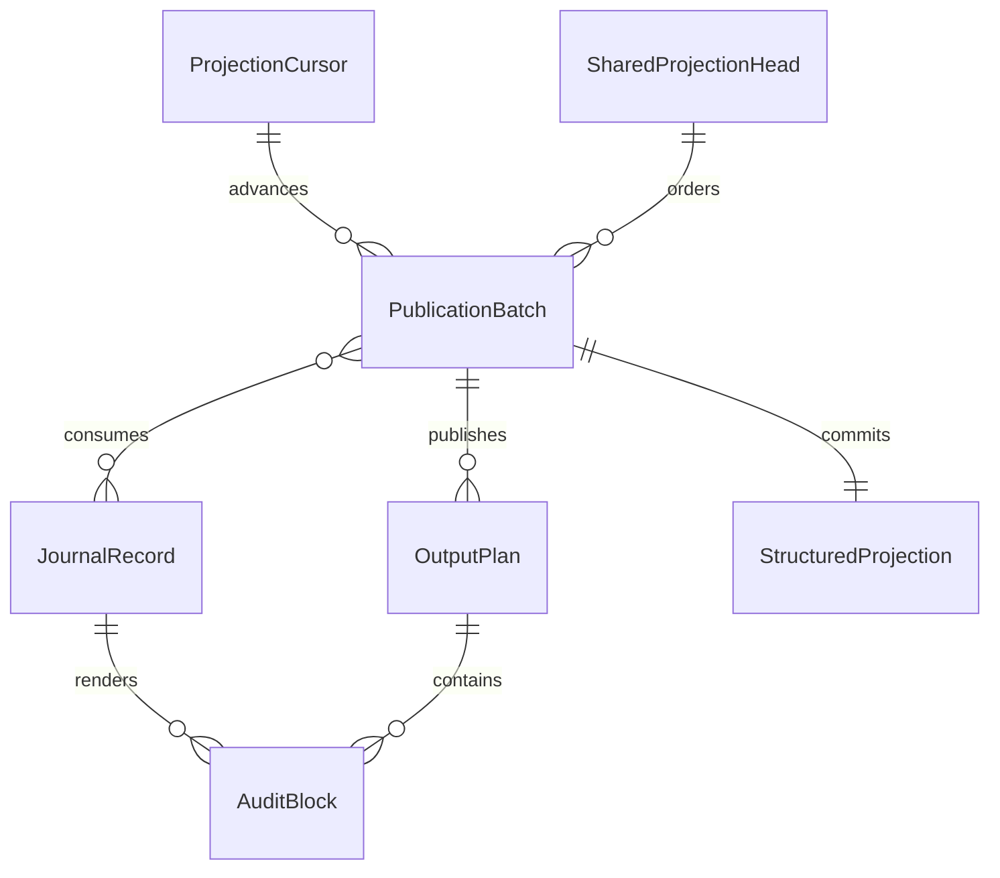

# U4 リードモデル更新の振る舞い仕様

## 1. 目的と適用範囲

FR1.1 の監査投影と横断読取、FR5.4 の監査描画側、NFR1 の観測互換、NFR3 の障害後の再生成を満たす。対象は取得ループ、純粋投影核、公開と再開の管理である。業務上の判断はコマンド側ドメインの責務、起動は U7、イベントの永続化は U3 に残す。

出典は [Unit定義](../../../inception/units-generation/unit-of-work.md)、[要求割当](../../../inception/units-generation/unit-of-work-story-map.md)、[要求](../../../inception/requirements-analysis/requirements.md)、[構成](../../../inception/domain-design/components.md)、[共有契約](../../../inception/contract-design/contract-summary.md)、[確認回答](functional-design-questions.md)。
データと判断規則の正本は [entities.md](entities.md) と [rules.md](rules.md)。本書は手順と状態遷移の正本で、関係図と規則一覧は派生表示である。

2026-09-06 JST の実装同期に続き、2026-09-07 の再走（unit-major 反復、Modify）で現行コード `b9be20f6`（`main` の #120 squash コミット。実測時の作業ツリー `52fce820` と `modules/core/read-model-updater/` は同一バイト）を正として追従させた。本書の `b9be20f6` はこのコミットを指す。根拠は [gap-measurement-20260907.md](gap-measurement-20260907.md)（G-1〜G-8）。PublicationBatch と、OutputPlanを具体化したPublicationFileによる保存・照合・再開は実装済みである。2026-09-05 の Review 節は [review-history-20260905.md](review-history-20260905.md) へ退避した。

## 2. 境界と入力

| 境界 | U4 が受け取る／提供するもの |
|---|---|
| U2 → U4 | 発生したイベント、集約ID、イベントID、発生時刻、解決済み計画と表示材料 |
| U3 の保存先 → U4 | 確定済みジャーナル。読取ポートとその実装は現在 U4 が所有する |
| U7 → U4 | 投影先と参照入力を指定した起動。取得ループを U7 に移さない |
| U4 → 互換ファイル | 状態、監査、実践昇格に伴う規則の管理部分。所有外の本文は保持する |
| U4 → 構造化面 → query | 同じ履歴断面の読取用行集合。形とキーは仕様11号 §4.1、責務は coding-rules/cqrs-boundaries.md に従う |
| 参照規則 → U4 | イベントとは独立して変更される内容。出典順序を保持した配信用の投影 |

同一のストア、投影対象、確定位置を区別する。集約内通番はジャーナル全体の走査位置ではない。
U3 の集約再構成は確定済みの「最新スナップショット＋それより後の差分イベント」である。一方、U4 が複数の投影を再生成するために履歴を読むことは別の用途であり、U3 を全再生へ戻す指示にはならない。

## 3. ワークフロー

### W1 — 通常の取得と計画

1. request_id が既に受理済みなら、その計画と状態を返す。superseded は置換先を案内するだけで書かない。同じ対象の別の未完計画があれば W3 または W7 へ進む。
2. W4 で参照規則の変更を同期する。ジャーナル差分が空でも、この確認は省略しない。
3. 確定済み ProjectionCursor を読み、後続の行の有無を確認する。通常の差分処理だけなら、差分なしは無操作で終了する。再生成が要求された場合や出力の欠落を検出した場合は、差分の有無によらず W6 へ進む。
4. 差分があれば、必要な履歴を一つの断面として読み、その末尾を target_position とする。確認後に到着した行まで読む場合も、すべての出力と到達位置をその同じ断面から導く。
5. 計画の表示材料を履歴から解決する。存在しない材料を現在の定義で推測して補わない。入力の破損、欠けた前提、未知の契約値は出力前に検出する。
6. 純粋投影核が互換ファイルへの変化と監査ブロックを計算し、構造化投影核が同じ断面の行集合を作る。1イベントが0行または複数行へ写ることを許す。イベントIDとブロック順序で対応を一意にする。
7. 対象の現在内容、管理境界、適用後の確定バイトを OutputPlan に記録する。発生時刻と表示材料は入力に由来し、再実行時の壁時計へ置き換えない。
8. 同じ投影の未完計画がないことを排他下で再確認し、新しい世代を採番する。入力断面・変換規約版・各出力計画・構造化面・request_id と世代を PublicationBatch として保存し、active_generation の更新と不可分に受理する。保存に失敗した場合は何も公開しない。成功後 W2 へ進む。

ここまでが BR1.1〜BR1.3、BR2.1〜BR2.3、BR3.1 の適用である。

### W2 — 計画の公開と確定

1. 更新権はストア（= space）単位の SQLite 書込トランザクション（`BEGIN IMMEDIATE`）で取る。ファイル単位・正準パス順のロックは持たない — ストアの書込ロックが同じ space の全投影対象を包含する。排他は 2 段で、計画の保存（`prepare`、Tx 1）が pending 行を耐久化して commit し、公開の確定（`publish_prepared`、Tx 2）が pending 行が同じ request_id のままか、確定位置と共有 head が計画時と一致するか、対象束縛が一致するかを**先に再検査**し、そのあと同じ Tx の中でファイルを適用（`PublicationBatch::apply`）し、`advance_on` と committed の確定まで書込ロックを保持して commit する。Tx 1 と Tx 2 の間に別の書き手が完了・置換・前進させていれば、再検査で古い計画では書かない（フェンシング）。通常・再生成・構造化のみ・置換のすべてがこの 2 段を使う。superseded や古い世代の計画は再開しない。共有面の受理済み規約版と異なる計画はファイル書込前に競合として返す（規約版が古い head は公開の入口 `prepare_read_model` が再生成する）。
2. 計画にあるファイルを順番に照合して適用する。実践昇格がある場合は project、team、状態、監査の順序を維持する。変更がないファイルは書かない。
3. 対象の内容が適用前なら計画を適用する。適用後と一致するなら既に反映済みと扱い、追記しない。追記が途中で終わった場合は、適用前の厳密なバイト列に計画された追記の接頭辞が続くと確認できたときだけ残りを補完する。
4. 上記のいずれでもない内容は競合である。既存本文を消去したり、末尾の似た行を削除したり、現在の規則で計画を作り直したりせず、`CatchUpError::PublicationConflict { path }` を返して停止する（本書の blocked はこの返却を指し、永続状態ではない — §4）。pending 計画は保持し、次回の照合または W7 の置換で扱う。
5. 全ファイルの反映後、W8 に従って共有面への公開または新しい既存面の維持を決める。その決定、個別確定位置の target_position への更新、served_by、計画の committed を不可分に確定する。失敗時はこれらのDB更新をトランザクション前の値へ戻し、保存済み計画を保持する。既に反映したファイルは戻さず、再試行時に照合する。
6. 単一計画の完了を取得ループへ返す。確定した計画を再度受け取っても、ファイルもチェックポイントも変更しない。W3からの復旧なら、取得ループは同じ呼出しの中で後続差分へ進む。

ファイル群と構造化面が全瞬間に一斉に切り替わる保証ではない。計画候補のファイルと構造化面は同じ断面から作るが、成功時の共有面は他の投影によって既に新しい場合がある。成功とは、ファイルが計画の断面まで反映済みで、同じ規約版の有効な共有面がその断面以上に達し、served_by が利用した世代を特定できることである。共有面を古い断面へ戻して一致させてはならない。

実践規則の編集後は次の参照規則同期で新しい内容を取得する。ジャーナル面の確定位置を、規則入力の版として使わない。

### W3 — 障害後の再開

1. 確定位置と未完計画を読み、排他取得後にその組と active_generation を再確認する。superseded や古い世代は再開しない。新しいイベントが届いていても、まず保存済みの到達位置を処理する。
2. 各ファイルを適用前・適用後・追記途中の厳密な接頭辞・競合に分類する。前回実行のメモリ上の成功フラグだけを信用しない。
3. 適用後の対象は無操作、適用前または検証可能な追記途中だけを完了する。置換・部分更新は単一ファイルの原子的な公開を前提とし、途中の値を正常と認めない。
4. 全対象の反映後、W2 の不可分な確定を再実行する。先の確定が成功していたなら無操作で完了する。
5. 保存済みの終点を確定しても呼出元にはまだ戻らず、同じ`catch_up`呼出しでW4の規則同期と通常の差分処理へ進む。後続があれば新たな断面を採取し、別のPublicationBatch・別のトランザクションで公開する。戻り値は後続処理後の確定位置とする。
6. 1回の呼出しで公開する計画は、未完計画の復旧と通常の後続計画の最大2件とする。後続計画の採取後に届いたイベントは次の呼出しで扱う。U7のruntimeに追随用ループを置かない。
7. 後続計画で失敗した場合も、先に確定した旧計画を取り消さない。失敗と、後続の未完計画があればその計画を保持して返す。取得呼出し全体が成功するまでは、U7は通常の指示や後続の変異へ進まない。

再試行回数を業務上の成功条件にしない。進行不能な競合や破損は対象と段階を返し、未完計画を残す。対象の所有外部分を同時に直接書き換える非協調の編集まで排他できるとは主張しない。そのような変更を検知したら停止し、復旧前に内容の扱いを確定する。

### W4 — ジャーナルとは独立した参照規則の同期

規則入力を適用順序で読み、保存済み source_identity と比較する。同じなら書かず、異なるなら配信用の行を作って不可分に差し替える。存在するファイルを読めない場合は空の規則として続けない。この処理でジャーナルのチェックポイントは進めない。

### W5 — 初回の構造化面

互換ファイルの投影先がまだない初回は、構造化面だけを作成する専用経路を用いる。この経路の確定位置を後のファイル投影へ流用して、まだ描かれていない監査行を既処理にしない。全体の起動や出発テンプレートの作成は U7 の責務である。

### W6 — 再生成と横断読取

入口（`b9be20f6`）: 共有面だけの再生成は `JournalReaderImpl::rebuild_read_model`（チェックポイント不変。app からは未配線で、契約テストで検収）、欠落した出力ファイルの復元は `JournalReaderImpl::restore_missing_files`（最後の確定計画から復元。U7 の `catch_up` が毎回 `ReadModelUpdater::catch_up` の前に呼ぶ）、規約版が古い共有 head の再生成は `prepare_read_model`（公開の入口で毎回）。

1. 再生成は新しい request_id と mode=rebuild を持つ独立した要求として受ける。同じ要求の再送は同じ計画へ戻し、committed の計画を再利用して再生成したことにはしない。
2. 未完計画があれば先に W3 / W7 で解決する。確定位置、共有面の公開位置、所有範囲を読み、必要な履歴を取得する。target_position は個別確定位置と共有面の記録済み位置の両方以上とする。履歴が不足するなら停止し（保存済み計画の終点まで届かなければ `PlanUnavailable`、アンカー不一致なら `Corrupt`）、位置を巻き戻さない。
3. 再生成する所有部分は、対象断面までの履歴から完全な出力を計算する。監査は全ブロックを無条件追記せず、所有部分の再構築または確認済み接頭辞への不足分適用として計画する。既存出力・欠落・部分書込のいずれかを before_identity に記録し、expected_content と after_identity も確定する。利用者部分は現物または利用可能な保全データから保持し、欠落した利用者本文を捏造しない。この計算に失敗した場合は、新しいprepared計画もactive_generationの変更も公開しない。
4. 完全な出力計画と構造化候補が揃ってから、W1手順8と同じ排他・再検査を行い、新しい世代を採番する。request_id、完全な再生成計画、active_generationの更新を不可分に受理する。例えば位置100・末尾100・状態ファイル欠落なら、100→100の新世代を作る。空履歴の0→0も表現できる。受理後に停止しても、保存済みの確定バイトだけでW3から再開できる。
5. W2で公開する。個別位置は同じ値でも、計画世代を確定できる。構造化面が欠落している場合は、記録済みの共有位置以上で行集合とheadを再公開する。確定後の同じ要求の再送は無操作となる。

空の出力先で2回生成した比較だけを障害復旧の証拠にしない。位置が末尾に達したまま出力だけを失ったケースを別途検収する。

他クローンのシャードは読取専用とする。表示は時刻と位置で再現可能に合流するが、同秒の別シャード間に記録されていない因果順序を作らない。

### W7 — 利用者の変更を保持した計画の置換

入口（`b9be20f6`）: `JournalReaderImpl::resolve_publication` — 競合した未完計画を、現在内容を保持する新世代へ置換して再開する。app（U7）からは未配線で、契約テスト（`publication_recovery_contract` の 33 件のうち `resolve_publication` を呼ぶ 7 件）で検収する。配線の要否は U7 の裁定事項として申し送る。以下の blocked は永続状態ではなく `PublicationConflict` の返却を指す（§4）。

1. blocked の原因と現在内容を調べ、保持する利用者部分と、旧計画のどの監査ブロックがどこまで反映されたかを特定する。旧計画に保存したバイト列・管理境界・イベントIDとブロック順序・出力範囲を用いる。同じ文言の行があるだけでは反映済みと推定しない。
2. 解決内容を resolution として記録する。現物との対応を一意に証明できない場合は blocked のままとし、保全データから所有部分を復元する等の解決を先に行う。未確認のブロックを引継ぎ対象にしない。
3. W2と同じ順序で排他を取得し、観測した内容と旧計画の世代が変わっていないことを再検査する。利用者の現在本文を新しいbeforeにし、反映済みブロックは inherited_blocks へ、未反映分と追記途中の残りだけを新しい適用計画へ引き継ぐ。置換・部分更新では、既に反映された管理部分を現在の利用者部分と合わせて目標出力へ含める。
4. 新しい request_id と世代を採番し、旧計画の superseded と replacement_id、新計画の prepared と predecessor_id、active_generation の更新を不可分に保存する。位置と規約が同じでもIDは別になる。保存前の停止は旧blocked計画、保存後の停止は新prepared計画だけが有効となる。
5. 新計画をW2で適用する。旧要求の再送や旧実行者の再開は、世代不一致／supersededとして書込を拒否する。旧計画と解決記録を残し、反映済み監査ブロックを再追記しない。

### W8 — 共有構造化面の公開順序

ジャーナル由来の構造化行集合はspaceごとに一つであり、通常投影・初回の構造化のみの処理・再生成が同じSharedProjectionHeadを更新する。SteeringProjectionは別の版で管理し、ここで上書きしない。

排他下でheadの世代、規約版、as_ofと実際の行集合の同一性を再検査し、次の規則で確定する。

| 共有面の状態 | 判断 |
|---|---|
| 同じ規約版で有効、共有as_of < 候補のtarget | 候補を公開し、headの位置・同一性・世代を更新する |
| 同じ規約版で有効、共有as_of = target | 同じ行集合なら維持し、served_byにその世代を記録する。内容不一致なら破損として止める |
| 同じ規約版で有効、共有as_of > target | 新しい共有面を維持する。個別ファイル計画と個別カーソルだけをtargetまで確定し、served_byは新しい共有世代を指す |
| 共有面が欠落・破損 | 記録済みas_ofを下げない。`shared_projection::verify` が `Corrupt(ProjectionSnapshotMismatch)` を返して確定を止め、候補は pending のまま保持する。その位置以上の再生成（`rebuild_read_model` / `prepare_read_model`）で完全な行集合を再公開してから候補を再評価する |
| 規約版が異なる | 旧版計画で共有面を上書きしない。公開の入口 `prepare_read_model` が現行規約で head を再生成し、旧規約で保存した計画は再開しない（`a_valid_plan_from_an_old_transform_is_not_resumed`）。rebuild指定だけで古い規約への変更を許可しない |

共有面を書き替える場合はheadの世代も増やす。同じ位置の再生成でも世代で区別する。新しい候補が初公開する場合も、同じspaceのhead作成と行集合の作成を不可分に行う。規約版の移行は明示的な別操作であり、この手順が自動的に版を選ぶことはない。

例: 計画Bが断面120を公開した後に計画A（断面100）が確定する場合、共有面は120のまま、Aの個別位置は100、A.served_byは120の共有世代となる。Aが未完計画の復旧中なら、同じ取得呼出しの別計画で後続行を反映する。共有面の行同士が異なる断面になることや、Aのために120を100へ戻すことは許さない。

### 共有面の変換規約更新

`open`は旧変換規約のheadだけを理由に全履歴を再投影しない。公開の入口である`catch_up`／`catch_up_structured`が`prepare_read_model`を呼び、必要なら書込トランザクション内で再生成してから通常処理を続ける。履歴破損は`Read`、投影不能は`ReadTables`の分類を保持する。既存のDDL版移行は別の初期化責務である。

差分を観測した後の全履歴取得が空になった場合は`HistoryDisappeared`で拒否し、古い位置で成功を返さない。

## 4. 処理管理記録の状態遷移

PublicationBatch は投影実行の管理記録であり、業務上の集約や AI-DLC のステージを追加するものではない。

| 現在 | 条件 | 次 | 効果 | 実現（`b9be20f6`） |
|---|---|---|---|---|
| 未作成 | 入力断面と出力計画の保存に成功 | prepared | 外部出力はまだ変えない | `prepare`（Tx 1）が `amadeus_publication` に `committed=0` の行を書く。generation は直前世代 + 1 |
| prepared | 対象の更新権と現在位置を確認 | publishing | 同じ計画を適用開始 | 区別しない（`committed=0` のまま。`publish_prepared` の Tx 2 が再検査のあと同じ Tx 内で `PublicationBatch::apply` を実行する） |
| publishing | 一部出力済みで停止 | publishing | 保存済み計画を保持、再開時は現物照合 | 次回の `pending_publication` が同じ行を返し、`apply` が現物と before / after を照合 |
| prepared / publishing | 前提と異なる内容・所有を検出 | blocked | 出力・確定位置の追加更新を停止 | 永続状態ではない。`CatchUpError::PublicationConflict { path }` を返し、pending 行は保持 |
| blocked | 内容の扱いを解決し、同じ計画の前提が再び成立 | publishing | 再照合して続行 | 次回の `catch_up` / `restore_missing_files` が同じ pending 行を再照合 |
| blocked | 利用者変更と反映済み範囲を検証し、置換を不可分に受理 | superseded | 旧計画を失効し、新世代のprepared計画へ引き継ぐ | `resolve_publication` → `prepare`（predecessor = 旧 request_id）が旧行を `archive`（state = superseded、ファイル前後も `_history_file` へ保全）で履歴へ写し、新行で置き換える（同一 Tx） |
| publishing | 全ファイル反映済み、構造化面と位置の確定に成功 | committed | 次の差分へ進める | `publish_prepared`（Tx 2）が再検査 → `advance_on` → `committed=1` + `served_*` + snapshot 表 |
| committed | 同じ計画を再実行 | committed | 無操作 | `prepare` が履歴の committed 行（同じ request_id）を見て `Ok(None)` |
| committed | 新しい再生成要求を受理 | committed | 旧計画は不変。別世代のrebuild計画を作成する | `PublicationBatch::rebuild` + `prepare`（`rebuild_mode=1`、新 generation）。旧行は `archive`（state = committed）で履歴へ |
| superseded | 旧要求の再送・旧実行者の再開 | superseded | 書込不可、置換先を返す | `prepare` が履歴の superseded 行を見て `PublicationConflict`。`publish_prepared` は pending 行の request_id 不一致で `PublicationConflict` |

計画を別の内容へ変更する場合はW7を使う。同じ規約版・履歴境界でも新しい世代を持つ別計画として識別し、古い書込者と並行して切り替えない。

## 5. エラーと受入シナリオ

| シナリオ | 期待する観測 |
|---|---|
| 通常の処理を2回起動 | 2回目の出力バイト・監査行数・確定位置が変わらない |
| 同じ入力を空の出力先へ再生成 | 管理対象のバイトが一致する。これは別の障害復旧試験の代用にはならない |
| 計画保存前の失敗 | ファイル・構造化面・確定位置に変化なし |
| 状態書込後、監査書込前の停止 | 同じ対象で再開し、既反映の状態を保持して未反映の監査だけを描く |
| 監査追記後、確定位置更新前の停止 | 再開後の監査イベントは2行のまま。4行への増加は不合格 |
| 監査追記途中の停止 | 計画の接頭辞を照合して不足バイトだけを補完。不正な接尾辞なら競合 |
| 構造化面と位置の確定中の停止 | 両方とも旧断面か新断面。片側だけの前進は不合格 |
| 同じ対象へ二つの実行者 | 直列化され、同じ監査行を二重に描かない。古い計画で新しい位置を上書きしない |
| 未完計画の保存後に新しいイベントが到着 | 元の到達位置を先に確定し、同じ呼出しで追加分を別計画として処理。履歴に残る最初のtargetは元の終点、最終CPは追加分の終点 |
| 旧計画の復旧後、後続計画の確定に失敗 | 旧計画のcommitは保持し、後続計画を再開可能な状態で残して失敗を返す |
| 規則入力だけが変更、ジャーナル差分なし | 規則の配信面だけ更新。ジャーナル位置は不変 |
| 初回の構造化面のみの処理後、通常起動 | 必要な互換ファイルの生成が省略されない |
| 利用者が所有する部分の変更を検出 | 内容を保持し、前提に一致しない計画を強行適用しない |
| 位置100・末尾100で状態ファイルを失う | 新世代の100→100 rebuildで復元。位置は100のまま、同じ要求再送は無操作 |
| 空履歴で構造化面を作り直す | 0→0 rebuildを表現し、空の正当な行集合を公開できる |
| 再生成の出力計算または同一性の確定で失敗 | 新しいprepared計画もactive_generationの変更も公開しない |
| 再生成計画の受理直後に停止 | before・expected_content・afterがすべて保存済みで、W3から同じ計画を再開できる |
| 共有as_ofとtargetが同値だが候補の内容が異なる | W8とBR5.3の両方が破損として停止し、成功扱いしない |
| 一部公開後に利用者本文が変わる | 旧計画をsupersededへ、新計画は利用者本文と確認済みブロックを保持。反映済み監査行の再追記なし |
| 計画置換の確定前後で停止 | 旧blockedまたは新preparedのどちらか一方だけが有効。旧世代の書込は拒否 |
| 反映済みブロックとの対応が曖昧 | 置換を受理せず、既存データと旧計画を保持 |
| 異なる投影IDでB=120の後にA=100を確定 | 共有面120を維持。Aの個別位置100とserved_by=120を確定し、共有面は後退しない |
| 共有面120が欠落し、古い候補100が残る | 記録済み位置120を保持。120以上の共有rebuild後に候補100を再評価 |
| 同じ位置の再生成後に古い世代で確定を試みる | head・計画の世代を再検査して拒否または最新の有効面を維持。再生成結果を古いバイトへ戻さない |

入力の不正、投影材料の欠落、計画保存失敗、対象競合、ファイル読書失敗、確定失敗を区別して返す。現行の分類（`b9be20f6`、`CatchUpError` 14 変種）: `Read(JournalReadError)`（`Io` / `Corrupt { aggregate_id, seq_nr, cause: CorruptCause }` / `CheckpointRegression`。`CorruptCause` は `UndecodablePayload` / `InvariantViolation` / `CheckpointAnchorMismatch` / `ProjectionSnapshotMismatch`）が入力の不正・破損と確定時の整合失敗、`ReadTables(ReadTablesError)`（`MissingGenesis` = 先頭が誕生記録でない、`IntentUnavailable` = 実行が指す intent が履歴に無い、または集約 `next_decision` が別 intent として拒否した — b51）と `Projection(ProjectionError)` が投影材料の欠落・投影不能、`PlanUnavailable`（`Started` / `Created` が無く 1 行も描けない `read_model_updater.rs:319`、または保存済み計画の終点まで履歴が届かない `:155` — W3 / W6 手順 2 の履歴不足はこの分類で停止する）/ `HistoryDisappeared`（差分観測後の全履歴が空）/ `MixedIntents`（複数 intent を指す実行の混在 — Markdown 面の契約）が採取断面の不整合、`PublicationConflict { path }` が対象競合（blocked の返却）、`PublicationIo` / `StateFileRead` / `StateFileWrite` / `MemoryFileRead` / `MemoryFileWrite` がファイル読書失敗、`SteeringRead` / `SteeringPack` が参照規則の読取・整形失敗。計画保存・確定の SQL 失敗は `at_store` が対象パスと `ErrorKind` へ写して `Read(Io)` で返る。エラー表示に必要な対象・位置・原因を保持する。集約が拒否した判断を RMU で判断し直さず、`IntentUnavailable` として材料不足に分類する（BR2.3）。U7の`catch_up_before_reading`はこの失敗を呼出元へ伝え、古い読み面から通常の指示を返すフォールバックを行わない。

| U7の呼出元 | 復旧・投影の失敗時 |
|---|---|
| `next` / `resume` | `error` directiveを返す。既存CLI契約に従って終了コードは0。通常の`load-steering`等の指示へ進まない |
| `report` / `practices_promote` / `set_autonomy` | `refused`として終了コード1を返す。後続の集約操作・イベント追加を開始しない |

SQLiteの操作失敗は`SqliteResultExt::at_store`で対象パスと`ErrorKind`へ写し、ファイルI/Oは`PublicationIoResultExt::at_output`で同じ材料を保持する。条件・SQL・トランザクション境界は呼出側に残す。同位置の行比較はSAVEPOINT内で行い、挿入途中の失敗でも元の共有行・head・CPを保持する。内容同一性にはSQLiteの型も含め、REAL／BLOBへの破損を文字列と同一視しない。

後続の実装検証では、上記の停止点を実際の永続化境界で注入し、再プロセス・同一出力先・同一チェックポイントで再開すること。メモリ上のフェイクでの比較だけで、実DBの原子性やプロセス終了時の復旧が検証済みとはしない。

## 6. エンティティ関係図と規則一覧（派生表示）

テキスト代替: 投影の確定位置に世代別の公開計画が連なる。各計画は一つの履歴断面、0個以上のファイル計画、一つの構造化候補を持つ。SharedProjectionHeadが複数投影の共有面への公開を順序付ける。イベントは0個以上の監査ブロックへ写り、ファイル計画がその出力位置を管理する。SteeringProjectionはジャーナル面とは独立した入力版を持つ。

| ID | 要約 |
|---|---|
| BR1.1 | 取得ループと純粋投影核を分離する |
| BR1.2 | 横断通番と集約内通番を混同しない |
| BR1.3 | すべての出力を同じ採取断面から計画する |
| BR2.1 | 監査の語彙・フィールド順・時刻・文言を観測契約に揃える |
| BR2.2 | 所有対象の管理部分だけを更新する |
| BR2.3 | 構造化面はドメイン判断の結果を保持する |
| BR3.1 | 出力に先立って再開可能な計画を保持する |
| BR3.2 | 同じ計画の再試行で同じ監査行を重複させない |
| BR3.3 | 必要な出力の確認後に構造化面と確定位置を一緒に確定する |
| BR3.4 | 同じ対象へ競合する計画を適用しない |
| BR4.1 | 初回は構造化面だけを用意できる |
| BR4.2 | 規則入力の変更をジャーナル差分の有無から独立して反映する |
| BR4.3 | 失敗を出力段階と対象付きで伝え、同じ入力から回復する |
| BR4.4 | 他シャードを読取専用で合流し表示順と因果関係を区別する |
| BR5.1 | 確定済み位置でも新しい世代で再生成できる |
| BR5.2 | 利用者の変更と確認済み出力を保持してblocked計画を置換する |
| BR5.3 | 共有構造化面をspace単位で公開し古い断面へ戻さない |

## 7. 実装との対応、共有契約への影響、検証状況

| 項目 | 作業ツリーの実装 | 検証・残る作業 |
|---|---|---|
| 取得・計画 | `catch_up`が保存済みの終点を先に確定し、同じ呼出しで後続を別計画として処理する | 同呼出し内の分離と、後続失敗でも旧commitを保持する契約試験を更新。統合版2,200件の成功と、その後の再検証を実装記録で区別 |
| 計画保存と公開 | `prepare`で計画を耐久化し、privateな`publish_prepared`が次のTxで世代・位置を再照合して公開する | 実SQLite別接続で、同一要求の完了、別世代への置換、位置の前進、古いpredecessorの拒否を検証 |
| ファイルの保全 | `PublicationFile`が保存バイトと現物を照合する。prefix／suffixの余剰部分は直接取得し、利用者本文を保持する | 追記途中、削除、曖昧な変更、読取・書込拒否、診断情報の契約試験を追加 |
| 共有構造化面 | 型付き内容ダイジェストとheadで整合性を確認し、古い候補で新しい面を戻さない | REAL／BLOB破損からの再生成、同位置比較の途中失敗、CP書込中のhead喪失とrollbackを検証 |
| 復旧とU7 | `catch_up_before_reading`が失敗を伝播し、第5節のdirective／refused契約で処理を止める | 破損した保存計画を与えるCLI試験を追加。統合版のCLI470件成功。レビュー修正後の最終CIも成功 |
| 共有 C3/C5/C6 | U4の`JournalReader`へ保存計画の取得・公開を追加し、重複を許容せず復旧する | 共有契約との表現差、保全期間、整理手順は引き続き確認対象 |
| 旧イベント表 | C5等には旧イベントIDや古いペイロードの記述が残る | 現行イベント・後続裁定・ゴールデンとの対応を個別に確認する |
| 監査文言の順序（b51 #118） | `Recomposed` の `Stages skipped` / `Stages added` は `in_document_order`（`workspace/projection.rs`）で計画の文書順に並べる。`StageSlugSet` の辞書順にしない | テスト `the_recomposed_spelling_follows_the_document_order_not_the_alphabet`。上流契約（`audit-format.md` RECOMPOSED / contract-summary）は順序に沈黙 — contract-design の pending-revision へ折り戻す |
| 構造化面の失敗経路（b51 #118） | `NextAnswerRow::of` が `Result` を返し、集約 `next_decision` の `IntentMismatch` を `ReadTablesError::IntentUnavailable` として `ReadTables::project` から伝播する | `read_tables_error.rs` の描画テスト 2 件。RMU で判断し直さない（BR2.3） |
| W6 / W7 の入口 | `rebuild_read_model` / `restore_missing_files` / `resolve_publication`（`JournalReaderImpl` の公開メソッド）と `prepare_read_model` | `restore_missing_files` と `prepare_read_model` は U7 配線済み、`rebuild_read_model` / `resolve_publication` は契約テストのみ（配線は U7 への申し送り） |

実装と契約試験の詳細は[implementation-report.md](../implementation-report.md)に記録する。2026-09-06 JSTの統合版 `9b4a6d55` は51スイート2,200件が成功し、同headのCIでも成功した。一方、相対カバレッジは99.01854%対99.13907%で未達である。その後の最終コード `e1691a53` は相対カバレッジを含むCIが成功し、mainへ統合済みである。最新結果は実装記録の「収束ループ完了」に記す。

2026-09-07（再走、`b9be20f6`）の実測: `cargo test --locked -p core-read-model-updater` は 9 バイナリ 481 件（lib 295 / audit_block_golden 1 / cross_shard_read 5 / journal_reader_impl 46 / projection_golden 18 / publication_file_contract 13 / publication_recovery_contract 33 / read_model_updater 31 / read_tables 39）、workspace 全体は 2,354 件（b52 で `PROPTEST_RNG_SEED=20260823 cargo test --workspace`）、failed 0。2026-09-05 の Review 節は [review-history-20260905.md](review-history-20260905.md) に退避した（当時の判定であり、本再走の判定ではない）。

