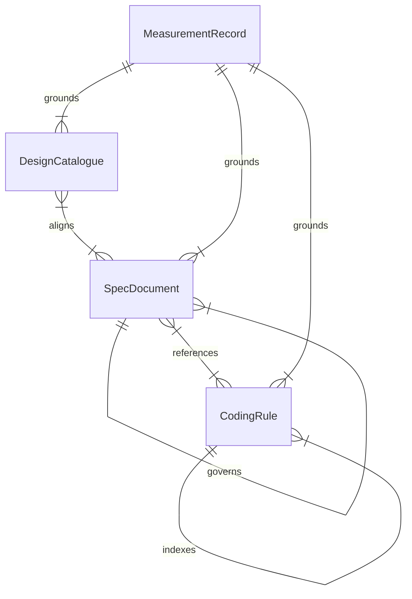

# U9 正本・仕様の追従 — 振る舞い仕様

## 1. 目的と今回の範囲

FR8（正本・仕様の canon 追従）のうち U9 が担う文書部分 — FR8.1（規則の語彙整合）、FR8.2（仕様と共有契約の追従）、FR9.6（エラー処理規則）— について、文書の棚卸しから改訂・検証・確認までの順序を定義する。U9 は文書の Unit であり、アプリケーションの新しい集約や API を設計するものではない。コードは触らない。

**改訂履歴**: 補完 2026-09-05（本書の新設、READY R-01〜R-03）→ **再走 2026-09-07（本版、Modify）**: functional-design ステージの差し戻し後、オーナー指示「コードを実測して提案しろ。現状のコードを基準」「正しさを実装コードもテストも仕様も常に検証」「bolt か unit を全部探索して正しい姿に仕様としてる？？」（Q4 = A）に従い、(1) 現行コード `main` `02cacea2` を基準に文書側のずれを行単位で実測し（[gap-measurement-20260907.md](gap-measurement-20260907.md) §1〜§2）、(2) Bolt / Unit 記録（construction 配下 29 ディレクトリ・224 ファイル、handoff 16 本、ADR-001〜011）を 4 区画で全数探索して裁定を拾い（[survey-20260907/](survey-20260907/)）、(3) 拾った裁定を 1 件ずつコードで実否確認して統合台帳（同 §4）を作り、記録同士が食い違う 13 論点はコードの現状で裁いて（同 §4.8）、これを仕様の「正しい姿」の正本にした。正本 YAML（[rules.md](rules.md) / [entities.md](entities.md)）はこの台帳に同期済み（R-01 解消）。

本書は文書改訂のワークフローと確認状態の正本である。データ形状は entities.md、判断規則は rules.md の YAML が正本であり、第 4・5 節はその派生表示である。

## 2. 入力・対象・責任

| 入力 | 用途 |
| --- | --- |
| [Unit 定義](../../../inception/units-generation/unit-of-work.md)、[要求割当](../../../inception/units-generation/unit-of-work-story-map.md) | U9 の責務と FR8 → FR8.1 → FR8.2 → FR9.6 の順序を確認する |
| [要求](../../../inception/requirements-analysis/requirements.md) | 受入対象と制約 C2 / C4 を固定する |
| [構成](../../../inception/domain-design/components.md)、[契約](../../../inception/contract-design/contract-summary.md)、[ADR](../../../inception/domain-design/decisions.md) | 所有・依存・外部契約の変更有無を照合する。本再走では components / contract-summary 自体が改訂対象（BR3.7） |
| [回答](functional-design-questions.md)（Q1〜Q4、要約確認 2026-09-07） | 確定判断を固定する |
| [実測記録](gap-measurement-20260907.md) §1〜§2 | **改訂箇所の行単位の正本**。『処置』列（要改訂 / 予定 / 履歴 / 維持）がそのまま作業指示 |
| [実測記録](gap-measurement-20260907.md) §4 / §4.8 | **仕様に書く「正しい姿」の正本**（O1〜O15 / P1〜P9 / R1〜R7 / W1〜W5 / S1〜S4 / K1〜K6、未実装 §4.7、矛盾 13 論点の裁き） |
| [一次台帳](survey-20260907/) 4 本 | 裁定の出典（path:line）。台帳に無い主張は書かない |
| 現行の規則・仕様・実装コード・テスト | 記録の主張を独立に照合する（BR5.3）。実装の存在だけを規範の根拠にしない |

改訂対象は、規則 6 ファイル（README / error-handling / factory-naming / gateway-taxonomy / module-visibility / use-case-rules、12 行）、仕様 4 ファイル（01 / 10 / 11 / 12 号。deviations は触らない）、共有契約 3 ファイル（components 全面、contract-summary 節単位、unit-of-work 注記のみ）。以下の `coding-rules/` はすべて `aidlc/spaces/default/knowledge/aidlc-shared/coding-rules/` を指す。

**責任分担**（project.md Mandated「実装は委譲」）: 作成はサブエージェント 2 派遣（派遣 A = P2 coding-rules + P3 の 10 号・01 号、派遣 B = P3 の 11 号・12 号 + P4 共有契約。書込スコープは非重複）。メインセッションは差分の全件レビュー、BR5.1 の受入チェックの実行、統合結果の受入判断を行う。新しい方針や未解決の規範衝突はオーナーが決める。別 Unit のコード修正を U9 の文書作業に混ぜない。

## 3. 文書改訂のワークフローと状態

### 3.1 棚卸しから改訂案まで

1. 対象パス、関連 FR/BR、改訂対象節、根拠となる裁定を一覧化する（本再走では gap-measurement §2 の表がこの一覧）。パスや節が移動していたら、同じ責務の現在の所在を確認して記録する。存在しない参照先を推測で補わない。
2. 規則・仕様・構成・実装を突き合わせ、「現行の規範」「失効が明示された履歴」「実装事実」「未解決の矛盾」に分ける。古い完了報告は照合の入口とする。**記録の主張はコード・テスト・仕様の三つで検証してから採用する**（BR5.3）。
3. 衝突時は、適用範囲を明示した後続のオーナー裁定・優先順位注記を確認し、コードの現状で裁く（§4.8 の 13 論点はすべて裁定済み）。日付が新しいだけの報告やコードコメントで規範を上書きしない。明示的な解決根拠がなければ当該項目を保留し、裁定を求める。
4. FR8.1 の規則語彙、FR8.2 の仕様・共有契約、FR9.6 の索引の順で改訂案を作る。各変更を既存 BR へ結び付ける。未実装は「予定（未実装）」と明記する。
5. 派生表示と参照を更新する。規則を変更した場合は対応するエンティティの改訂 ID と traceability も確認する。未定義の BR を派生表だけに新設しない。

### 3.2 検証と確認

1. 改訂前後の文書差分、参照先、所有の一意性、規則索引を確認する。行番号は探索の目安であり、同じ節の現在の内容を読む。
2. 旧語彙の検出結果を、現行規範・履歴・禁止例に分類する（BR5.1 (c) の履歴除外判定）。履歴や禁止例を消して件数だけを満たさない。
3. 必須節・要求対応・規則 ID の検証を実行し、実際の結果を残す。対応表の `OK` は規則への割当を意味し、改訂の適用完了や実装の正しさを証明しない。
4. 文書以外の変更がないことを、`origin/main..HEAD` の差分（`modules tools scripts .github Cargo.toml Cargo.lock`）で確認する（BR5.1 (d)）。
5. gap-measurement §2 の各行の『処置』が反映され『維持』行が変わっていないことを確認する（BR5.1 (e)）。
6. 独立確認へ成果物、回答、入力契約を渡す。所見は重要度と根拠を付けて残し、過去の確認結果で今回の確認を代用しない。
7. 所定の確認点で、成果物と残った所見を提示する。変更要求があれば対象項目を改訂案へ戻し、影響する検証と独立確認を行う。

### 3.3 文書改訂項目の状態遷移

これは文書作業の論理状態であり、アプリケーションの永続化モデルや AI-DLC のステージ状態を新設・上書きするものではない。

| 現在 | 契機・条件 | 次 | 残す記録 |
| --- | --- | --- | --- |
| 未照合 | 対象と根拠の照合を開始 | 照合中 | パス・FR/BR・根拠の時点 |
| 照合中 | 根拠がコード・テスト・仕様で一致、または失効範囲が明示される | 改訂案 | 採用根拠と差分 |
| 照合中 / 改訂案 / 検証中 | 参照欠落・根拠衝突・未決定の範囲を検出 | 保留 | 衝突する両方の根拠と必要な判断 |
| 保留 | オーナーの判断または欠けた証拠を取得 | 照合中 | 判断・証拠を受け取った記録 |
| 改訂案 | 対象の編集と参照更新が完了 | 検証中 | 改訂版と検証対象 |
| 検証中 | 不整合・検証失敗を検出 | 改訂案 | 失敗内容 |
| 検証中 | 検証結果と独立確認が揃う | 確認待ち | 所見、残余リスク、適用範囲 |
| 確認待ち | オーナーが変更を要求 | 改訂案 | 変更要求 |
| 確認待ち | オーナーが対象範囲を明示して承認 | 確認済み | 承認対象と残る保留事項 |
| 確認済み | 後続裁定・実装変更で根拠が変化 | 照合中 | 変化した根拠 |

未解決項目を残して限定範囲が承認された場合も、当該項目は「保留」のままである。過去の承認を消去せず、新しい照合として記録する。

## 4. エンティティ関係図（派生表示）

[entities.md](entities.md) の関係を表示する。自己関連は文書種別間の関係であり、すべてのファイルが自身を参照するという意味ではない。

テキスト代替: CodingRule の README が複数の規則を索引する。複数の仕様が複数の規則を参照する（未参照 12 本へ本再走で相互参照を付ける）。SpecDocument の 01 号が 10 / 11 / 12 号を統括する。DesignCatalogue（components / contract-summary）と仕様は同じ台帳から書く。MeasurementRecord（gap-measurement §4）が仕様・共有契約・規則の各改訂の根拠になる。各文書はパスで識別する。

## 5. 規則一覧（派生表示）

rules.md の `status` を併記する。done は実測で適用済みを確認、open は本再走の Bolt で実施、superseded は失効（文面は履歴）。

| 規則 | status | 要約 |
| --- | --- | --- |
| BR1.1 | done | use-case の読取例を Repository 語彙へ揃える |
| BR1.2 | done | gateway の load/save 散文を許容語彙へ揃える |
| BR1.3 | done | イベント保存の語彙を規則へ明記する |
| BR1.4 | done | 退役した監査 Repository の実例を除く |
| BR1.5 | done | 非 Repository ポートの模範例を一般形へ（記録登録が本再走） |
| BR1.6 | open | coding-rules の旧名・旧クレート名 12 行を現行へ |
| BR2.1 | done | workspace のポートと内部機構を区別する |
| BR2.2 | superseded | 01 号の集約候補（B12 分割で失効 → BR3.3） |
| BR2.3 | superseded | 10 号の『同上』廃止と退役行削除（テストダブル指示は失効 → BR3.3） |
| BR2.4 | done | PlanAction と CheckboxState の所有を一意にする |
| BR2.5 | done | 12 号の削除済み API を全出現で除く |
| BR3.1 | done | 定義の識別子と内容版を区別する |
| BR3.2 | done | workspace の集約・値・投影を区別し、未実装は予定と明記する |
| BR3.3 | open | 仕様 4 号を現行コードへ全文追従（正本 = gap-measurement §4） |
| BR3.4 | done | 永続化と並行制御の設計変更を逸脱台帳へ記録する |
| BR3.5 | superseded | components の WorkspaceModel 縮退（→ BR3.7 に吸収） |
| BR3.6 | done | ドメインモデルの原則を 01 号へ明記する（本再走で 6 件追記） |
| BR3.7 | open | 共有契約 3 本を現行へ（全面 / 節単位 / 注記のみ） |
| BR4.1 | done | エラー処理規則は現行ファイルが正本（再構成の panic 例外を含む） |
| BR4.2 | open | 規則の索引を同期する |
| BR5.1 | open | 合格条件（履歴除外 grep・コード diff 空・実測表一致） |
| BR5.2 | done | 外部互換性を保ち、出典を示し、履歴化し、日本語で改訂する |
| BR5.3 | open | 検証規律（コード・テスト・仕様で検証、記録全数探索） |

## 6. 照合結果と保留事項（2026-09-07）

照合基準はコード `main` `02cacea2`（b51 マージ後）。実測の方法と結果は gap-measurement §1〜§2、記録との突合は §4 / §4.8 にある。再構成方式は 2026-09-05 に契約・実装テスト 43 件で実測済み（[実測記録](verification/verification.md)）。他の項目は静的照合であり、アプリケーション全体の動作保証ではない。

| 項目 | 確認結果 | 扱い |
| --- | --- | --- |
| 2026-09-05 の保留 R-01（正本 YAML の未同期） | rules.md / entities.md / traceability.json を台帳に同期した（BR3.3 / BR4.1 の旧指示を廃し、BR1.5 / BR1.6 / BR3.7 / BR5.3 新設、BR2.5 / BR5.1 の範囲確定、pending-revision 5 項目反映） | **解消**。pending-revision.md は履歴として残す |
| R-02（共有契約の『全再生』文面） | components.md 冒頭 1 件・contract-summary.md 1 件が残る（実測） | BR3.7 (a) / (b) で本再走の Bolt が現行化 |
| R-03（FR8 親行） | traceability.json に FR8 親行を追加し、U9 / U2 の境界を注記 | **解消** |
| 仕様 4 号の旧名 `WorkflowExecution` | 01 号 8 / 10 号 18 / 11 号 11 / 12 号 9 件（履歴を含む grep 件数）。現行規範としての残存は §2.1〜§2.4 の表の『要改訂』『名称のみ』行 | BR3.3 で改訂。判定は BR5.1 (c) の履歴除外 grep |
| 旧 manifest 綴り `workflow-execution-event/1` | 4 件すべて打消し線つきの履歴（10 号 :51、decisions.md :473、contract-summary :285 / :305 / :388） | 改訂対象ではない（要約確認の表現を §5 で訂正済み） |
| 記録間の矛盾 13 論点 | コードの現状で裁定済み（§4.8）: イベント 16、version 集約内、差分再生、`DefinitionRevision` はドメイン導出、`StageSlugSet` 辞書順、skeleton = Construction の最初の EXECUTE、RMU 同期呼出、`Directive` 構築可能 7 / kind 10、RMU がジャーナルを読む、`CommitOutcome` 2 形、`ReviewAttempt` は `StageSlot` 内、`next_decision` は `(&Intent, &NextRequest) -> Result`、`Started` は intent_id + stages | 仕様・共有契約はこの裁きに従う。記録 A / B の文面は各 Unit / Bolt の記録として残す |
| 未実装（§4.7） | unpark / jump / recompose、フック 4 本、doctor、workspace 集約 3・供給面 4、`intents.json` 直列化、Bolt / SwarmBatch、他 CLI 動詞 | 仕様に『予定（未実装）』と明記。文書の誤りではない |
| U9 で扱わないもの（§5） | U1 / U2 / U3 / U10 の設計本文、Bolt 記録（read-model-spec / inventory）、`formal/orchestration/journal_protocol.qnt` のコメント 5 行、codekb・docs/CLAUDE.md・CI 設定 | 各 Unit / 別 Bolt へ。Quint コメントはコード扱いのため別途 1 行 PR か U6 / U7 の Bolt |

保留事項: 無し（本再走時点）。contract-summary §4 の未決「同一シャード内の直接行と投影行の順序」は U9 の対象外の設計未決であり、未決のまま残す。

## 7. 受入シナリオ

| シナリオ | 期待する扱い |
| --- | --- |
| 旧語彙が現行規範として残る | 対応 BR に紐付けて改訂し、相互参照と再検出結果を確認する |
| 旧語彙が禁止例・履歴にだけ残る | 根拠と範囲を記録して保持する。機械的なゼロ件化はしない |
| 出典の API が削除・改名されている | 現在の所有と後続裁定を照合する。古い名前を復活させない |
| 記録の主張がコードと異なる | コードの現状で裁き、§4.8 の形式で両出典と裁きを残す。記録を転記しない |
| 未実装の設計を記録が「完了」と書いている | 仕様には予定と書く。完了報告の件数や READY を証明に流用しない |
| 規範と実装が異なり解決根拠がない | 当該項目を保留し、必要な判断を示す |
| 検証が他 Unit の要求不足を報告する | 割当元と照合して対象範囲の問題か実欠落かを判定する。失敗結果自体は隠さない |
| 確認後に対象文書や出典が変わる | 影響範囲を再照合し、古い確認を新しい版の承認と見なさない |

## Review 履歴（2026-09-05、iteration 1、READY）

> 補完版（本書新設）に対するレビュー。R-01 / R-03 は本再走（2026-09-07）で解消、R-02 は BR3.7 で本再走の Bolt が実施する。当時のセンサー結果と
> 43 件のテスト再実行は履歴であり、本再走の承認根拠には使わない。

| ID | Severity | 要旨 | 本再走での扱い |
|---|---|---|---|
| R-01 | Major | 正本 YAML（BR2.5 / BR3.3 / BR4.1 / BR5.1、entities の改訂 ID）が現行裁定と未同期。単独利用すると過去の設計を再導入する | **解消** — rules.md / entities.md を台帳に同期（§6） |
| R-02 | Minor | 「再生方式の不一致は解消」は共有契約 2 箇所（components 冒頭、contract-summary C3 追記）を含む表現として広すぎる | BR3.7 (a) / (b) の改訂対象に登録。§6 で残存を実測 |
| R-03 | Minor | FR8 親行が traceability に無い（U9 が主担当） | **解消** — FR8 親行と U2 境界の注記を追加 |

## Review

**Verdict:** READY
**Reviewer:** aidlc-architecture-reviewer-agent
**Date:** 2026-09-07T01:06:04Z
**Iteration:** 1

### Findings

| ID | Severity | Location | Finding | Required action | Status |
|---|---|---|---|---|---|
| R-04 | Minor | `rules.md` §1 BR3.3 / BR3.7、`entities.md` SpecDocument / DesignCatalogue インスタンス | BR3.3（仕様4号の全文追従）と BR3.7（共有契約3本の現行化）は本再走でもまだ `status: open` のまま — つまり本レビュー時点で仕様本文・共有契約の実改訂そのものはまだ着手されていない（正本 YAML の同期と検証記録の整備だけが今回の成果）。これは指示範囲・スコープ判断としては正しい（U9 の Bolt は P2〜P4 に分割され、本ステージは「正しい姿の確定と改訂計画の記録」までを担う）が、承認者はこの点を「文書はまだ書き換わっていない、次の Bolt で書き換える計画が承認される」という前提で読む必要がある | 変更不要（構造は妥当）。承認時に「BR3.3 / BR3.7 は open のまま = 実改訂は次 Bolt」であることを承認者へ明示して渡すことを推奨 | New |
| R-05 | Minor | `traceability.json` coverage 配列の `target` フィールド（FR8 / FR8.1 / FR8.2 / FR9.6 いずれも） | `target` に複数の BR ID をカンマ区切りで列挙している。project.md の学習則「traceability.json の OK target は単一の Unit ID にする」は units-generation 段の Unit 単位トレーサビリティを指した教訓であり、functional-design 段の BR 単位トレーサビリティには文言上そのまま適用されない（他 Unit の同種成果物でも同じ複数列挙の慣習が見られる）。実害は無いが、字面が似ているため将来の混同を避ける注記があるとよい | 変更不要（誤りではない）。次回改訂時に「本欄の複数列挙は units-generation の学習則の対象外（BR 単位のため）」と一言添えると誤読を防げる | New |

### Validation Tool Results

| Tool | Result | Interpretation |
|---|---|---|
| aidlc-sensor-required-sections（rules.md） | PASS（h2_count 3, findings 0） | 必須節すべて確認 |
| aidlc-sensor-required-sections（entities.md） | PASS（h2_count 3, findings 0） | 必須節すべて確認 |
| aidlc-sensor-required-sections（functional-spec.md） | PASS（h2_count 8, findings 0） | 必須節すべて確認、`## Review` 履歴節も検出 |
| aidlc-sensor-traceability（traceability.json） | `pass: false` だが `gaps` / `orphans` / `missing_from_table` / `invalid_entries` / `invalid_targets` はすべて空。`missing_from_upstream_ids` 34 件のみ | ブリーフに記載の既知解釈どおり — センサーはリポジトリ全体の FR/NFR を基準にするが、U9 の traceability は自 Unit 責務（FR8 系列）だけを列挙する構造的帰結。実質の合格基準（gaps/orphans/invalid_*）はすべて空であり問題なし |
| aidlc-sensor-upstream-coverage（functional-spec.md、consumes 5 本） | PASS（unreferenced 0） | 上流契約（unit-of-work / story-map / requirements / components / contract-summary）はすべて成果物内で参照済み |

### コードでの実測による裏取り（抜粋）

コード基準コミット `main` `02cacea2` は現在の作業ツリー HEAD と一致することを確認したうえで、`gap-measurement-20260907.md` §4 の主要な数値主張を独立に実測し、すべて一致した:

- `IntentExecution` 構造体のフィールド数 = 12（id / intent_id / slots / cursor / status / parked_at / autonomy / skeleton_stance / last_gate_resolution_at / seq_nr / version / last_updated_at）。`version: usize` フィールドの実在も確認（BR3.3 (a) 一致）。
- `IntentExecutionEvent` のサブモジュール数 = 16（イベント変種 16 に一致、BR3.3 (k) の「11 → 16」訂正と一致）。
- `IntentExecution::replay(snapshot: IntentExecution, events: impl IntoIterator<Item = (usize, DateTime<Utc>, IntentExecutionEvent)>) -> IntentExecution` — 差分再生のシグネチャと一致（BR3.3 (a)）。
- `IntentExecution::next_decision(&self, intent: &Intent, request: &NextRequest) -> Result<NextDecision, CommandError>` — 記載どおりの署名（BR3.3 (b)）。
- コマンド側ポート = 4 ファイル（`intent_execution_repository.rs` / `intent_repository.rs` / `workflow_definition_repository.rs` / `compiled_definition_repository.rs`）、`RepositoryError` の変種 = 4（`NotFound` / `Conflict` / `Io` / `Corrupt`）（BR3.3 (e) 一致）。
- クエリ側 `find_*_use_case.rs` = 13 本、`*_dao.rs` = 14 本（BR3.3 (e) の「Find* 13」「DAO 14」と一致）。
- `modules/app/aidlc/src/runtime.rs` に読取直前の同期 `catch_up_before_reading` / `catch_up` 呼出を複数確認（BR3.3 (g) の RMU 同期呼出と一致）。
- `coding-rules/error-handling.md:37` 付近に再構成の panic 例外の記述を確認（BR4.1 一致）。
- `grep -c AuditLedgerRepository`（docs/specs + coding-rules）= 0、`grep -c next_in_scope_stage`（12号）= 0（BR1.4 / BR2.5 の done 主張と一致）。
- `coding-rules/README.md:50` に `message-catalog`、`:115` に `WorkflowExecutionState` の記述を確認（BR1.6 が挙げる改訂対象行と一致）。コード側に `WorkflowExecutionState` 型は存在せず（0件）、`wording` という語彙はコマンド側アダプタ層に実在（`intent_repository_impl.rs` 等）— BR1.6 / BR3.3 (a) の言い換え先が実在する語彙であることを確認。
- `docs/specs/{01,10,11,12}-*.md` の `WorkflowExecution` 出現数 = 8 / 18 / 11 / 9 件 — functional-spec.md §6 の記載値と完全一致。
- `unit-of-work-story-map.md` :39 に「FR8 | 親 ID。子は FR8.1/8.2 → U9、FR8.3/8.4 → U2」の記載を確認 — `traceability.json` の FR8 note と一致（R-03 の解消は正当）。
- `pending-revision.md` の 5 項目すべてが `rules.md` / `entities.md` に反映されていることを個別に照合（項目1→BR2.5 全出現化、2→BR1.5 新設、3→BR5.1 grep 範囲、4→BR5.1 diff スコープ、5→entities.md の 1:1 対応）。

食い違い・破綻は見つからなかった。

### Summary

正本 YAML（rules.md / entities.md）が主張する現行コードの実測値（属性数・イベント変種数・関数シグネチャ・ポート数・DAO 数など）を独立に検証したところ、抽出した主要な数値・署名claim はすべてコードと一致した。前回 iteration 1（2026-09-05）の所見 R-01（正本 YAML の未同期）と R-03（FR8 親行の欠落）は主張どおり解消されており、R-02（共有契約の「全再生」文言）は本再走で解消せず BR3.7 の open な改訂項目として正しく登録されている。BR3.3 / BR3.7 という最大の実改訂項目はまだ `status: open`（次 Bolt での実施計画）であり、本ステージの成果物は「正しい姿の確定と改訂計画の記録」までを正しく担っている。Critical な所見は無く、新規の所見 R-04 / R-05 はいずれも運用上の注記レベルの Minor であり、承認を妨げるものではない。
