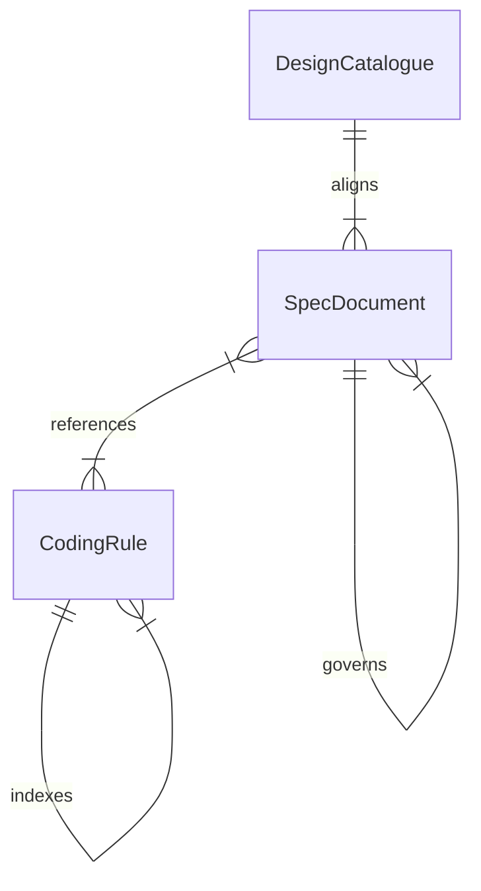

# U9 正本・仕様の追従 — 振る舞い仕様

## 1. 目的と今回の補完範囲

FR8.1（規則の語彙整合）、FR8.2（仕様の追従）、FR9.6（エラー処理規則）について、文書の棚卸しから改訂・検証・確認までの順序を定義する。U9 は文書の Unit であり、アプリケーションの新しい集約や API を設計するものではない。

2026-09-05 の要約確認に基づき、不足していた本書を補完する。B4 当時の回答と改訂実績は履歴として維持する。実装済みの処理を古い B3/B4 の語彙へ戻したり、外部互換性を変更したりする根拠にはしない。

本書は文書改訂のワークフローと確認状態の正本である。データ形状は [entities.md](entities.md)、判断規則は [rules.md](rules.md) の YAML が正本であり、第 4・5 節はその派生表示である。過去の規則が後続裁定と食い違う箇所は第 6 節に記録する。本書を追加しただけで、それらの規則や過去の承認が更新されたとは扱わない。

## 2. 入力・対象・責任

| 入力 | 用途 |
| --- | --- |
| [Unit 定義](../../../inception/units-generation/unit-of-work.md)、[要求割当](../../../inception/units-generation/unit-of-work-story-map.md) | U9 の責務と FR8.1 → FR8.2 → FR9.6 の順序を確認する |
| [要求](../../../inception/requirements-analysis/requirements.md) | 受入対象と制約 C2/C4 を固定する |
| [構成](../../../inception/domain-design/components.md)、[契約](../../../inception/contract-design/contract-summary.md) | 所有・依存・外部契約の変更有無を照合する |
| [回答](functional-design-questions.md)、[改訂保留](pending-revision.md) | 確定判断と未反映の指摘を分ける |
| 現行の規則・仕様・対応する実装 | 過去の報告を独立に照合する。実装の存在だけを規範の根拠にしない |

元の改訂対象は、規則 4 ファイル（use-case-rules / gateway-taxonomy / error-handling / README）、仕様 5 ファイル（01 / 10 / 11 / 12 / deviations）、構成一覧 1 ファイルである。これは B4 の対象一覧であり、現在の規則ファイル総数ではない。 2026-09-05 の追加裁定により、今回の再生方式の訂正対象として aggregate-commands と ubiquitous-language の 2 規則を追加した。

以下の `coding-rules/` は、すべてリポジトリ内の `aidlc/spaces/default/knowledge/aidlc-shared/coding-rules/` を指す。リポジトリ直下に同名ディレクトリが存在するとは仮定しない。

作成担当が出典と差分を整理し、独立した確認担当が矛盾・参照・受入条件を点検する。新しい方針や未解決の規範衝突はオーナーが決める。別 Unit のコード修正を U9 の文書作業に混ぜない。

## 3. 文書改訂のワークフローと状態

### 3.1 棚卸しから改訂案まで

1. 対象パス、関連 FR/BR、改訂対象節、根拠となる裁定を一覧化する。パスや節が移動していたら、同じ責務の現在の所在を確認して記録する。存在しない参照先を推測で補わない。
2. 規則・仕様・構成・実装を突き合わせ、「現行の規範」「失効が明示された履歴」「実装事実」「未解決の矛盾」に分ける。古い完了報告は照合の入口とする。
3. 衝突時は、適用範囲を明示した後続のオーナー裁定・優先順位注記を確認する。日付が新しいだけの報告やコードコメントで規範を上書きしない。明示的な解決根拠がなければ当該項目を保留し、裁定を求める。他の独立した項目は作業を続けられる。
4. FR8.1 の規則語彙、FR8.2 の仕様・所有・構成・逸脱台帳、FR9.6 のエラー処理と索引の順で改訂案を作る。各変更を既存 BR または確認された追加判断へ結び付ける。
5. 派生表示と参照を更新する。規則を変更した場合は対応するエンティティの改訂 ID と traceability も確認する。未定義の BR を派生表だけに新設しない。

### 3.2 検証と確認

1. 改訂前後の文書差分、参照先、所有の一意性、規則索引を確認する。行番号は探索の目安であり、同じ節の現在の内容を読む。
2. 旧語彙の検出結果を、現行規範・履歴・禁止例に分類する。履歴や禁止例を消して件数だけを満たさない。探索範囲の拡張案は第 6 節の保留事項として扱う。
3. 必須節・要求対応・規則 ID の検証を実行し、実際の結果を残す。対応表の `OK` は規則への割当を意味し、改訂の適用完了や実装の正しさを証明しない。
4. 文書以外の変更がないことを、作業開始時点との差分で確認する。途中で基準版を替えて既存のコード差分を隠さない。今回の補完に伴う質問・状態・監査記録は別途差分として確認する。
5. 独立確認へ成果物、回答、入力契約を渡す。所見は重要度と根拠を付けて残し、過去の確認結果で今回の確認を代用しない。
6. 所定の確認点で、成果物と残った所見を提示する。変更要求があれば対象項目を改訂案へ戻し、影響する検証と独立確認を行う。明示的な確認なしに保留事項を完了へ移さない。

### 3.3 文書改訂項目の状態遷移

これは文書作業の論理状態であり、アプリケーションの永続化モデルや AI-DLC のステージ状態を新設・上書きするものではない。

| 現在 | 契機・条件 | 次 | 残す記録 |
| --- | --- | --- | --- |
| 未照合 | 対象と根拠の照合を開始 | 照合中 | パス・FR/BR・根拠の時点 |
| 照合中 | 根拠が一致、または失効範囲が明示される | 改訂案 | 採用根拠と差分 |
| 照合中 / 改訂案 / 検証中 | 参照欠落・根拠衝突・未決定の範囲を検出 | 保留 | 衝突する両方の根拠と必要な判断 |
| 保留 | オーナーの判断または欠けた証拠を取得 | 照合中 | 判断・証拠を受け取った記録 |
| 改訂案 | 対象の編集と参照更新が完了 | 検証中 | 改訂版と検証対象 |
| 検証中 | 不整合・検証失敗を検出 | 改訂案 | 失敗内容 |
| 検証中 | 検証結果と独立確認が揃う | 確認待ち | 所見、残余リスク、適用範囲 |
| 確認待ち | オーナーが変更を要求 | 改訂案 | 変更要求 |
| 確認待ち | オーナーが対象範囲を明示して承認 | 確認済み | 承認対象と残る保留事項 |
| 確認済み | 後続裁定・実装変更で根拠が変化 | 照合中 | 変化した根拠 |

未解決項目を残して限定範囲が承認された場合も、当該項目は「保留」のままである。過去の承認を消去せず、新しい照合として記録する。

## 4. エンティティ関係図（派生表示）

[entities.md](entities.md) の関係を表示する。自己関連は文書種別間の関係であり、すべてのファイルが自身を参照するという意味ではない。

テキスト代替: CodingRule の README が複数の規則を索引する。複数の仕様が複数の規則を参照する。SpecDocument の 01 号が 10/11/12 号を統括する。DesignCatalogue の components が 01 号 §3.3 と 11 号に整合する。各文書はパスで識別する。

## 5. 規則一覧（派生表示）

以下は既存 YAML の改訂意図の要約であり、古い API や構造を現在の実装へ再導入する指示ではない。実行前に第 3 節の照合を通す。

| 規則 | 要約 |
| --- | --- |
| BR1.1 | use-case の読取例を Repository 語彙へ揃える |
| BR1.2 | gateway の load/save 散文を許容語彙へ揃える |
| BR1.3 | イベント保存の語彙を規則へ明記する |
| BR1.4 | 退役した監査 Repository の実例を除く |
| BR2.1 | workspace のポートと内部機構を区別する |
| BR2.2 | 01 号の集約候補を確定した分類へ揃える |
| BR2.3 | orchestration の実装欄と退役ポートを整理する |
| BR2.4 | PlanAction と CheckboxState の所有を一意にする |
| BR2.5 | 12 号の削除済み API と集約への判断移管を反映する |
| BR3.1 | 定義の識別子と内容版を区別する |
| BR3.2 | workspace の集約・値・投影を区別する |
| BR3.3 | B3 時点の実行状態とイベント構造を仕様へ反映する（後続裁定との照合が必要） |
| BR3.4 | 永続化と並行制御の設計変更を逸脱台帳へ記録する |
| BR3.5 | 構成一覧で workspace の値語彙と描画責務を分ける |
| BR3.6 | ドメインモデルの原則を 01 号へ明記する |
| BR4.1 | エラー処理の確定規則を文書化する（後続の再生時例外との照合が必要） |
| BR4.2 | 規則の索引を更新する |
| BR5.1 | 旧語彙とコード変更の検証を行う |
| BR5.2 | 外部互換性を保ち、出典を示し、日本語で改訂する |

## 6. 批判的な引継ぎ結果と保留事項

照合基準は 2026-09-05、作業ツリーのコード基準は `537c4e56a838a4cb28f6564d4c0add1d4adfe915`。以下は現物の照合結果である。再構成方式は追加で実測し、契約・実装固有テスト計 43 件が成功した（[実測記録](verification/verification.md)）。他の項目は静的照合であり、アプリケーション全体の動作保証ではない。

| 項目 | 確認結果 | 引継ぎ時の扱い |
| --- | --- | --- |
| 仕様の古い再構成説明 | `docs/specs/01-domain-model.md`、`10-orchestration.md`、`12-workflow-definition.md` の B13 優先順位注記が、構築・再構成・エラー設計の旧本文を非規範と指定している | 当該範囲は現行 coding-rules を確認する。注記の対象外まで一括して失効したとは扱わない |
| 実行集約と ID | 現在の `modules/core/command/domain/src/orchestration/intent_execution.rs` は IntentExecutionId と IntentId を区別する。`intent_id.rs` は UUIDv7 を検証する | BR3.3 の WorkflowExecution・16 属性・12 イベント等を現在の構造として転記しない。BR/エンティティ記録の更新は未実施 |
| 再構成方式 | `modules/core/command/interface-adapter/src/orchestration/intent_execution_repository_impl.rs` の `find_by_id` は最新スナップショットを復元し、それより後のイベントを再生する。差分再生で動作することを実測済み | **2026-09-05 オーナー裁定で方針確定**。最新スナップショットと差分イベントのリプレイが正しい。aggregate-commands と ubiquitous-language に残っていた全再生指定を訂正した。再生方式の不一致は解消し、実装は維持する |
| query 側の責務 | `modules/core/query/use-case/src/orchestration/find_next_answer_use_case.rs` は DAO で投影行の外部キーをたどる。`coding-rules/cqrs-boundaries.md` の現行裁定が基準 | 古い NextUseCase の所在を仮定しない。確認したファイルの責務から query 全体の適合性までは断定しない |
| 非 Repository ポート例 | 現行 `coding-rules/gateway-taxonomy.md` §1b は「非 Repository ポートの一般形」になっている | 改訂が実在する。一方 rules の BR1.5 と entities の対応 ID は未反映であり、設計記録の欠落は残る |
| 過去の「完了」報告 | U9 の既存 code-summary と pending-revision は、文書実績と機能設計への未反映を別々に記録している | 過去の検証件数や READY を現在の証明に流用しない |

[pending-revision.md](pending-revision.md) の 5 項目は次のとおり残っている。本書への記載は、正本 YAML の改訂を代替しない。

1. BR2.5 の 12 号への適用範囲に §4/§8/§9 を含める件。
2. BR1.5 として非 Repository ポートの一般形を対象に加える件。
3. BR5.1 の検索範囲を規則直下と仕様直下に限定し、研究文書・履歴・禁止例の扱いを明示する件。
4. コード無変更の確認対象を modules / tools に加えて scripts / .github / Cargo.toml / Cargo.lock へ広げる件。
5. gateway-taxonomy の改訂 ID に BR1.5 を加え、rules 側と一致させる件。

これらと、後続裁定によって古くなった BR3.3・BR4.1 等は、対象範囲を明示した変更要求で正本を同期する必要がある。今回の補完では entities / rules / traceability の内容や古いレビュー記録を変更していない。

## 7. 受入シナリオ

| シナリオ | 期待する扱い |
| --- | --- |
| 旧語彙が現行規範として残る | 対応 BR に紐付けて改訂し、相互参照と再検出結果を確認する |
| 旧語彙が禁止例・履歴にだけ残る | 根拠と範囲を記録して保持する。機械的なゼロ件化はしない |
| 出典の API が削除・改名されている | 現在の所有と後続裁定を照合する。古い名前を復活させない |
| 規範と実装が異なり解決根拠がない | 当該項目を保留し、必要な判断を示す |
| 文書の改訂実績はあるが設計記録が未更新 | 実績と記録不足を別々に示し、完了と断定しない |
| 検証が他 Unit の要求不足を報告する | 割当元と照合して対象範囲の問題か実欠落かを判定する。失敗結果自体は隠さない |
| 確認後に対象文書や出典が変わる | 影響範囲を再照合し、古い確認を新しい版の承認と見なさない |

## Review

**Verdict:** READY
**Reviewer:** aidlc-architecture-reviewer-agent
**Date:** 2026-09-05T06:40:59Z
**Iteration:** 1

### Findings

| ID | Severity | Location | Finding | Required action | Status |
|---|---|---|---|---|---|
| R-01 | Major | aidlc/spaces/default/intents/260822-stage1-selfhost/construction/u9-canon-docs/functional-design/rules.md > BR2.5・BR3.3・BR4.1・BR5.1、および entities.md > CodingRule.instances | 正本 YAML の同期は未完了である。BR3.3 は旧 WorkflowExecution・16 属性・12 イベント・from_snapshot、BR4.1 は message-catalog と例外なしの Panics 禁止を指示し、現行 aggregate-commands / error-handling の裁定と一致しない。pending-revision の BR1.5・適用節・検索範囲・コード無変更の確認範囲も未反映。本書第 6 節はこれを正しく保留と明示しているため今回の補完を妨げないが、YAML を現行の改訂指示として単独利用すると過去の設計を再導入する。 | 今回の確認対象を手順書の補完に限定し、正本同期の保留を維持する。別途その変更範囲が確定した時点で、歴史を残しつつ現行の適用規則を明示し、BR1.5・対象節・検証範囲・エンティティの改訂 ID を同時に揃える。 | New |
| R-02 | Minor | aidlc/spaces/default/intents/260822-stage1-selfhost/construction/u9-canon-docs/functional-design/functional-spec.md > 第 6 節「再構成方式」 | 「再生方式の不一致は解消」は訂正した 2 規則と実装の間では成立するが、渡された共有契約まで含む完了表現としては広すぎる。inception/domain-design/components.md 冒頭は依然「ジャーナル全再生」、inception/contract-design/contract-summary.md の C3・2026-08-30 追記は「payload は読取に使わない」と明記している。2026-09-05 のオーナー裁定で採用方式は確定済みだが、共有契約の文面同期は残る。 | 解消済みの範囲を aggregate-commands / ubiquitous-language と実装に限定し、共有契約の上記 2 箇所を残る同期対象として記録する。差分再生という裁定自体を問い直す必要はない。 | New |
| R-03 | Minor | aidlc/spaces/default/intents/260822-stage1-selfhost/construction/u9-canon-docs/functional-design/traceability.json > upstream_ids・coverage | センサーの missing_from_upstream_ids 35 件のうち FR8 は、unit-of-work-story-map.md 第 1・3 節が U9 を主担当とする親要求である。他 Unit の要求として一括除外できない。子 FR8.1 / FR8.2 と FR9.6 の割当・BR 参照は正しいため、機能欠落ではなく親要求の追跡漏れである。 | 正本同期時に FR8 の親行を追加し、U9 が担う文書部分と U2 が担う FR8.3 / FR8.4 の境界を説明する。既存 BR への対応または明示的な集約行として扱い、U9 にコード作業を追加しない。 | New |

### Validation Tool Results

| Tool | Result | Interpretation |
|---|---|---|
| aidlc-sensor-required-sections.ts（--stage functional-design、各 --output-path） | PASS: entities / rules / functional-spec、所見 0 | 追記前の H2 数は 3 / 2 / 7。必須節の構造検査であり、文面の現行性までは保証しない。 |
| aidlc-sensor-traceability.ts（--stage functional-design、traceability.json） | FAIL: missing_from_upstream_ids 35 件。gaps / orphans / invalid_entries / invalid_targets / missing_from_table は空 | 34 件は U9 の担当外。FR8 の親行だけは R-03。3 子要求と 20 BR の参照は解決する。 |
| aidlc-sensor-upstream-coverage.ts | PASS: consumes 5 件、unreferenced 0 | --consumes に stage の 5 入力を、--deliverables に entities,rules,functional-spec を明示して実行。最初の引数不足実行は no upstream を返したため、検証成功の根拠には用いていない。 |
| linter / type-check の適用判定 | 対象外・未実行 | 成果物に TS/JS/TSX コードも該当するスニペットもない。Rust 全体の lint/type-check 成功を主張しない。 |
| cargo test --locked -p core-command-interface-adapter --test intent_execution_repository_contract --test intent_execution_repository_impl_test | PASS: 20 + 23 = 43 件、失敗・無視 0（レビュー中に再実行） | 既存ログだけに依存せず再確認。スナップショット基底と差分再生、基底以前の manifest 非検査、差分欠落の Corrupt、snapshot 欠落の Corrupt をテスト本体とも照合した。全ワークスペースの動作保証ではない。 |
| 現物の静的照合 | 一致: IntentExecutionId と IntentId の区別、UUIDv7 検査、find_next_answer_use_case の DAO/FK 読取 | 第 6 節の限定された実装主張は裏付けられる。query 側全体の適合性は評価していない。 |
| 派生表示と手順の照合 | ER 図の 4 関係、規則要約 20 行、状態遷移を手動照合 | entities / rules の対応と一致。保留・差し戻し・再照合の経路があり、アプリケーションの状態機械を新設していない。Mermaid パーサによる検査は未実行。 |
| 旧レビューの再確認 | entities.md の旧所見 1〜3 と pending-revision 5 項目を照合 | 12 号に next_in_scope_stage は残らず、gateway-taxonomy §1b は一般形へ改訂済み。文書の実績と設計記録の未同期を区別し、旧 READY を今回の承認根拠には使っていない。旧レビューは数値番号であり、今回の R-NN は新規採番。 |

### Summary

Critical 0・Major 1・Minor 2。確認された補完範囲について、手順・保留時の扱い・再確認条件は実行可能であり、ADVISORY 判定を READY とする。これは既存正本の同期完了や U9 全体の再承認を意味せず、R-01 の保留と R-02・R-03 の残件を伴う。
