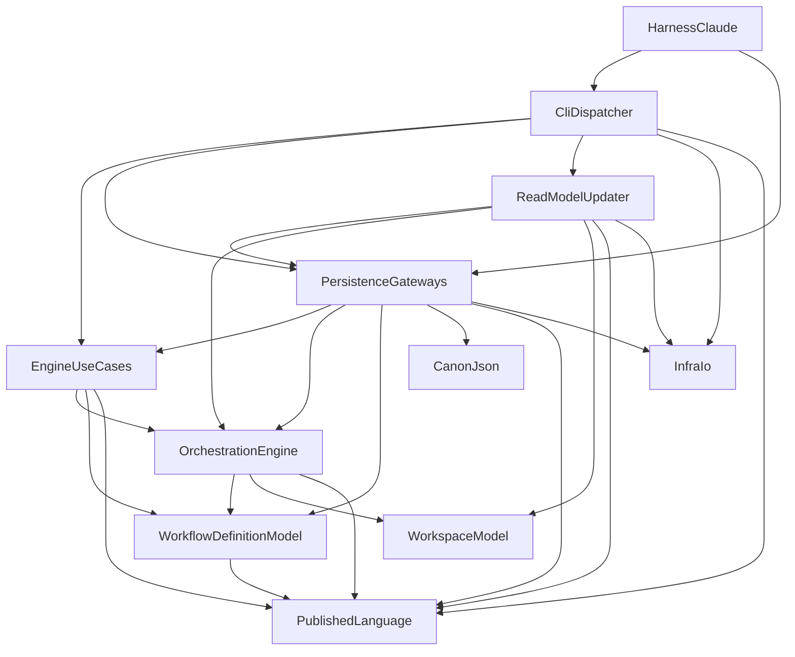

# components — stage-1 コンポーネントカタログ（ES 設計・全面改訂版）

> Domain Design（Inception 2.6）成果物・改訂版。出典: `../requirements-analysis/requirements.md`（FR/NFR）、
> RE 成果物 `aidlc/spaces/default/codekb/docs/architecture.md` / `component-inventory.md`（brownfield 現状）、
> チーム実践 `../practices-discovery/team-practices.md`、設計裁定 `domain-design-questions.md`（Q1〜Q9 確定 —
> Q5〜Q9 のイベントソーシング採用により初版から全面改訂）。
> パラダイム: **イベントソーシング**（j5ik2o/event-store-adapter-rs 前提・1コマンド1イベント・SQLite ストア・
> upstream 互換ファイルはすべてリードモデル）。デプロイ形態は単一 CLI バイナリで、本ステージでは扱わない。

```yaml
components:
  - name: OrchestrationEngine
    summary: "エンジン FSM の集約 WorkflowExecution とドメインイベント（orchestration コンテキスト）"
    behaviour: >
      集約 = FSM（統一ルール）。コマンドは decide —
      approve_gate(&mut self, ...) → Result<GateApproved, ApproveError> のように
      1コマンド1イベント（絶対）で単一ドメインイベントを返し、apply_event(&mut self, &Event)
      が状態を進める（リプレイと通常実行が同一経路）。導出はクエリメソッド —
      next_decision(&self, &WorkflowDefinition, ...) → NextDecision（21分岐ラダー、
      engine_loop.qnt が契約正本）と有効プラン畳み込み（R2 の移設先）。
      ドメインイベント語彙（WorkflowExecutionEvent、コマンドと1:1 — Started / GateOpened /
      GateApproved / GateRejected / StageRevised / StageSkipped / Jumped / Parked / Unparked /
      Recomposed / AutonomyModeSet）は upstream 監査行語彙（86語）とは別物 — 監査行は
      ReadModelUpdater が1イベントから N 行を描画する。集約は I/O を持たず純粋・同期。
    responsibilities:
      - "WorkflowExecution 集約（状態・遷移・判断の単一型、decide/apply 分離）"
      - "ドメインイベント（1コマンド1イベント）の定義と発行"
      - "NextDecision の導出（21分岐ラダー）"
    depends_on:
      - component: WorkflowDefinitionModel
        interaction: "next_decision / 畳み込みの照会先（参照渡しのみ）"
        style: sync
      - component: WorkspaceModel
        interaction: "CheckboxState 等ワークスペース語彙の利用"
        style: sync
      - component: PublishedLanguage
        interaction: "Directive 種別の型"
        style: sync
    dependents:
      - component: EngineUseCases
        interaction: "集約コマンド/クエリの呼出（フロー制御）"
      - component: PersistenceGateways
        interaction: "リプレイ（apply_event）による集約再構成"
      - component: ReadModelUpdater
        interaction: "ドメインイベントの読取（投影の入力）"
    external_dependencies: []
    entities:
      - name: WorkflowExecution
        identifier: intent_id
        # version は失効（2026-08-29 / ADR-010・Bolt B7）— 楽観 version は集約の外へ
        # （RehydratedWorkflowExecution が持ち回る。ストア採番の不透明トークン）
        attributes: [status, stage_cursor, checkboxes, overlay, approved, autonomy_mode, parked_at, revision_count, seq_nr]
        references:
          - entity: WorkflowDefinition
            owned_by: WorkflowDefinitionModel
            relationship: "実行は定義（グラフ/グリッド）を参照して進む — 参照渡し、所有しない"

  - name: WorkflowDefinitionModel
    summary: "読取専用集約 WorkflowDefinition（workflow_definition コンテキスト）"
    behaviour: >
      PL 3 入力（stage-graph / scope-grid / scopes）を束ねた Always Valid 集約。
      グリッド照会（plan_action_in_grid）等の述語面のみ提供し、オーバレイとの畳み込みは
      持たない（R2 — OrchestrationEngine 側の集約メソッドへ）。R1 裁定により PlanAction は
      このコンテキストが所有（orchestration は再輸出せず、完全移動で参照 — ADR-005 改訂）。ES 対象外（本システムから
      書き換えない読取専用集約のため、従来どおり find のみの Repository で扱う）。
    responsibilities:
      - "StageGraph / ScopeGrid / StageNode / PlanAction（R1 後）の所有"
      - "スコープ解決・グラフ述語（subgraph_for_scope / next_in_scope_stage 等）"
    depends_on:
      - component: PublishedLanguage
        interaction: "ディレクティブ/イベント語彙の参照"
        style: sync
    dependents:
      - component: OrchestrationEngine
        interaction: "照会（参照渡し）"
      - component: EngineUseCases
        interaction: "Repository 経由の取得と参照配布"
      - component: PersistenceGateways
        interaction: "集約の再構成（parse）"
    external_dependencies: []
    entities:
      - name: WorkflowDefinition
        identifier: source_digest
        attributes: [graph, grid, scopes]
      - name: StageNode
        identifier: slug
        attributes: [phase, execution, agents, mode, produces, consumes, sensors, scopes]

  - name: WorkspaceModel
    summary: "workspace 語彙 — 値オブジェクト群（Always Valid newtype）"
    behaviour: >
      SpaceName / CloneId / ShardName / StateFieldValue / CheckboxState / StateVersion /
      IntentId（UUIDv7）/ IntentDirName の値オブジェクト。状態ファイル・チェックボックスの
      描画関数は ReadModelUpdater（U4、Bolt B6）の責務へ移す — 本 Unit ではコードを動かさない
      （オーナー裁定 2026-08-23）。Q9 裁定により LockProtocol・reap_eligible・OwnerStamp は退役
      （並行制御は SQLite Tx + 楽観 version へ — ADR-007）。
    responsibilities:
      - "ワークスペース語彙の値オブジェクト（Always Valid newtype）の提供"
    depends_on: []
    dependents:
      - component: OrchestrationEngine
        interaction: "CheckboxState 等の語彙利用"
      - component: ReadModelUpdater
        interaction: "値オブジェクトの利用"
    external_dependencies: []
    entities: []

  - name: EngineUseCases
    summary: "ユースケース層 — 進行管理・フロー制御のみ（統一ルール、async fn）"
    behaviour: >
      NextUseCase / ReportUseCase / ContinueUseCase / DoctorUseCase / フック4ユースケース。
      各ユースケースは async fn で、I/O 調達（ポート呼出）とドメイン呼出の順序制御だけを持つ
      （ビジネスロジック禁止）。典型形: find_by_id で集約を再水和 → decide（1イベント取得）→
      store(event, aggregate) → ReadModelUpdater 起動。ポート trait:
      WorkflowExecutionRepository（ES: store / find_by_id）・WorkflowDefinitionRepository
      （読取専用 find）。WorkspaceLock ポートは退役（Q9）。DIP: trait のみ依存、静的束縛既定。
    responsibilities:
      - "ユースケース本体（フロー制御・async）とポート trait の所有"
      - "コマンド実行の定型（再水和 → decide → store → 投影キャッチアップ）の指揮"
    depends_on:
      - component: OrchestrationEngine
        interaction: "集約コマンド/クエリの呼出"
        style: sync
      - component: WorkflowDefinitionModel
        interaction: "定義集約の参照配布"
        style: sync
      - component: PublishedLanguage
        interaction: "Directive 型"
        style: sync
    dependents:
      - component: PersistenceGateways
        interaction: "ポート trait の実装対象"
      - component: CliDispatcher
        interaction: "ユースケースの起動（composition root）"
    external_dependencies: []
    entities: []

  - name: PersistenceGateways
    summary: "Gateway 実装層 — SQLite EventStore + Repository 実装 + 機構"
    behaviour: >
      EventStoreImpl（event-store-adapter-rs と同形の async trait をローカル定義し実装。
      journal / snapshot / checkpoint テーブル。persist_event_and_snapshot は同一 Tx +
      楽観 version 条件付き書込）・WorkflowExecutionRepositoryImpl（store = イベント+
      スナップショット永続化、find_by_id = 最新スナップショット + seq_nr 以降のイベントを
      replay）・WorkflowDefinitionRepositoryImpl（既存、PL 3 入力の読取）。
      機構 Clock（Fake 付き）は Gateway ではなく、このクレートに同居する機構モジュール
      （gateway-taxonomy §1 の裁定どおり — Gateway 責務には数えない）。
      ワイヤ構造体（serde）はこの層に閉じ、ドメイン型へは parse-don't-validate。
      FsWorkspaceLock は退役、state_file_io は ReadModelUpdater の部品へ転生（Q9）。
    responsibilities:
      - "ポート trait の実 I/O 実装（1 trait 1 Impl）"
      - "SQLite ジャーナル/スナップショット/チェックポイントの管理"
    depends_on:
      - component: EngineUseCases
        interaction: "実装するポート trait の定義元"
        style: sync
      - component: OrchestrationEngine
        interaction: "リプレイ（apply_event）による集約再構成"
        style: sync
      - component: WorkflowDefinitionModel
        interaction: "集約の再構成（parse）"
        style: sync
      - component: CanonJson
        interaction: "正準 JSON / ハッシュ（continue_token・ドリフト判定）"
        style: sync
      - component: PublishedLanguage
        interaction: "文言カタログ・語彙"
        style: sync
      - component: InfraIo
        interaction: "低水準 I/O"
        style: sync
    dependents:
      - component: CliDispatcher
        interaction: "composition root での結線"
      - component: HarnessClaude
        interaction: "ハーネス配線からの利用"
      - component: ReadModelUpdater
        interaction: "ジャーナル読取（チェックポイント以降の差分取得）"
    external_dependencies:
      - name: SQLite
        kind: database
        purpose: "ジャーナル・スナップショット・チェックポイントのストア（ローカルファイル、git 管理外）"
    entities: []

  - name: ReadModelUpdater
    summary: "リードモデル更新器 — チェックポイント付きのプロセス内差分関数（Lambda 型）"
    behaviour: >
      チェックポイント以降のイベントをジャーナルから読み、リードモデルへ畳み込み、
      チェックポイントを進める冪等な差分処理関数。常駐しない — コマンド末尾（Tx コミット後・
      プロセス終了前）に同期実行し、クラッシュ時は次回呼出が修復（真実源はジャーナル = B9）。
      リードモデル: aidlc-state.md（状態ファイル）・監査シャード <host>-<clone>.md
      （1ドメインイベント → upstream 監査行 N 行の描画。86語彙・見出し・フィールド順は
      逐語互換）。書込は単一ファイル原子性（tmp+rename）。他クローンのシャードは
      読み取り専用の外部入力として読み側でのみ合流（stage-1 は単一クローン運用）。
    responsibilities:
      - "ドメインイベント → upstream 互換ファイルの投影（状態ファイル・監査シャード）"
      - "状態ファイル・チェックボックス・監査ブロック（`render_audit_block` / `state_writers` 相当）の描画 — 投影 API（旧 WorkspaceModel / workspace ドメインサービスの純関数 — U4 で移管。オーナー裁定 2026-08-23）"
      - "チェックポイント管理と冪等キャッチアップ"
    depends_on:
      - component: PersistenceGateways
        interaction: "ジャーナルの差分読取・チェックポイント永続化"
        style: sync
      - component: OrchestrationEngine
        interaction: "ドメインイベントの型と内容の読取"
        style: sync
      - component: WorkspaceModel
        interaction: "値オブジェクトの利用"
        style: sync
      - component: PublishedLanguage
        interaction: "監査行語彙（86語）・逐語文言による行描画"
        style: sync
      - component: InfraIo
        interaction: "原子書込（tmp+rename）"
        style: sync
    dependents:
      - component: CliDispatcher
        interaction: "コマンド末尾での起動"
    external_dependencies: []
    entities:
      - name: ProjectionCheckpoint
        identifier: projection_name
        attributes: [last_seq_nr, updated_at]

  - name: CliDispatcher
    summary: "マルチコールバイナリ aidlc — async 初期化 + ROUTES + composition root + Presenter"
    behaviour: >
      tokio による async main（Q8 — async は初期化から。ドメインは純粋・同期のまま）。
      逸脱台帳 #1 の綴り写像による ROUTES 表で動詞（next / report / continue / doctor /
      hook 4 動詞ほか）を async ユースケースへ配線。Q3 裁定によりフックもサブコマンド。
      directive の JSON 出力・逐語文言の最終出力面。実物/InMemory の結線は composition root
      だけが行う。各コマンド末尾で ReadModelUpdater を起動してから終了する。
    responsibilities:
      - "コマンド解決と起動（thin CLI 面、async main）"
      - "composition root（DI 結線）と Presenter"
    depends_on:
      - component: EngineUseCases
        interaction: "ユースケース起動"
        style: sync
      - component: PersistenceGateways
        interaction: "実装の結線"
        style: sync
      - component: ReadModelUpdater
        interaction: "コマンド末尾の投影キャッチアップ起動"
        style: sync
      - component: InfraIo
        interaction: "プロセス終了コード・低水準 I/O"
        style: sync
      - component: PublishedLanguage
        interaction: "文言カタログの出力配線"
        style: sync
    dependents:
      - component: HarnessClaude
        interaction: "ハーネス設定がバイナリ動詞を参照"
    external_dependencies:
      - name: tokio
        kind: other
        purpose: "async ランタイム（current_thread。ワンショット CLI の初期化）"
    entities: []

  - name: CanonJson
    summary: "正準 JSON シリアライザ + ハッシュ（ADR 0001、FR7 で実装）"
    behaviour: >
      upstream 互換の正準化（キー順・数値・エスケープ）と sha256。受入基準は 0b の
      hash-canonical 受入表（実入力 → 実ハッシュ）全行一致。continue_token・バンドル digest・
      ドリフトガードの土台。
    responsibilities:
      - "正準 JSON 直列化とハッシュ計算"
    depends_on: []
    dependents:
      - component: PersistenceGateways
        interaction: "トークン/ドリフト判定のハッシュ"
    external_dependencies: [serde, serde_json(preserve_order, float_roundtrip), sha2]   # 2026-08-22 U1 code-generation で実体化（内部コンポーネント依存 depends_on は引き続きゼロ）
    entities: []

  - name: PublishedLanguage
    summary: "共有閉集合 — 監査行語彙・ディレクティブ種別・逐語文言カタログ"
    behaviour: >
      audit-events（upstream 監査行の EventType 86 語 / 22 カテゴリ。CLI_RESERVED /
      MERGE_PROTECTED の確定を B-1 で完了）・directive-schema（DirectiveKind 10 種 +
      Directive 本体・28KiB 上限・continue_token 型を FR3 で追加）・message-catalog
      （逐語文言。R4 で Gateway 直書き分を移設）。依存ゼロの純粋部品。
      注: ドメインイベント（コマンド1:1）は OrchestrationEngine 所有であり、ここが持つのは
      投影先の監査行語彙。
    responsibilities:
      - "閉集合語彙と逐語文言の単一正本"
    depends_on: []
    dependents:
      - component: OrchestrationEngine
        interaction: "Directive 種別の型"
      - component: WorkflowDefinitionModel
        interaction: "種別語彙"
      - component: EngineUseCases
        interaction: "Directive 型"
      - component: PersistenceGateways
        interaction: "文言・語彙"
      - component: ReadModelUpdater
        interaction: "監査行描画の語彙"
      - component: CliDispatcher
        interaction: "文言出力"
    external_dependencies: []
    entities: []

  - name: InfraIo
    summary: "低水準 I/O プリミティブ（ポリシーなし）"
    behaviour: >
      atomic（tmp+rename+fsync）・append_only（O_APPEND|O_NOFOLLOW）・fs_meta・process_probe。
      既存実装を維持（投影書込と CLI が利用。ロック退役後も原子書込は投影の土台）。
    responsibilities:
      - "ファイルシステム原子性・追記・メタ検査の一次実装"
    depends_on: []
    dependents:
      - component: PersistenceGateways
        interaction: "I/O 委譲"
      - component: ReadModelUpdater
        interaction: "原子書込"
      - component: CliDispatcher
        interaction: "composition root からの直接利用"
    external_dependencies:
      - name: ローカルファイルシステム
        kind: other
        purpose: "全ファイル I/O の実体"
    entities: []

  - name: HarnessClaude
    summary: "Claude Code ハーネス配線（フック登録・パス規約のホスト固有部）"
    behaviour: >
      Claude Code の settings/hook 登録が aidlc バイナリの hook サブコマンド（Q3）を呼ぶための
      配線データとシム。ハーネス固有の差異はこの層に閉じ、エンジン本体は関知しない。
    responsibilities:
      - "ハーネス固有の設定・登録・パス規約"
    depends_on:
      - component: PersistenceGateways
        interaction: "既存クレート依存（結線補助）"
        style: sync
      - component: CliDispatcher
        interaction: "バイナリ動詞の参照（設定データとして）"
        style: sync
    dependents: []
    external_dependencies: []
    entities: []
```

## Component Diagram


<!-- Text fallback: 依存は内向き・非循環。HarnessClaude -> CliDispatcher / PersistenceGateways。CliDispatcher -> EngineUseCases / PersistenceGateways / ReadModelUpdater / InfraIo / PublishedLanguage。ReadModelUpdater -> PersistenceGateways / OrchestrationEngine / WorkspaceModel / PublishedLanguage / InfraIo。PersistenceGateways -> EngineUseCases / OrchestrationEngine / WorkflowDefinitionModel / CanonJson / PublishedLanguage / InfraIo（外部依存 SQLite）。EngineUseCases -> OrchestrationEngine / WorkflowDefinitionModel / PublishedLanguage。OrchestrationEngine -> WorkflowDefinitionModel / WorkspaceModel / PublishedLanguage。WorkflowDefinitionModel -> PublishedLanguage。WorkspaceModel / CanonJson / PublishedLanguage / InfraIo は依存なし。 -->

## Component Summary

| Component | Purpose | Depends On | Dependents | Entities Owned |
|---|---|---|---|---|
| OrchestrationEngine | FSM 集約 + ドメインイベント（1コマンド1イベント） | WD, WS, PL | UC, GW, RMU | WorkflowExecution |
| WorkflowDefinitionModel | 読取専用の定義集約 | PL | OE, UC, GW | WorkflowDefinition, StageNode |
| WorkspaceModel | 語彙（値オブジェクト群。描画関数は U4 へ移管） | — | OE, RMU | — |
| EngineUseCases | フロー制御（async）+ ポート trait | OE, WD, PL | GW, CLI | — |
| PersistenceGateways | SQLite EventStore + Repository 実装 | UC, OE, WD, CJ, PL, IO | CLI, HC, RMU | — |
| ReadModelUpdater | 投影（チェックポイント付き差分関数） | GW, OE, WS, PL, IO | CLI | ProjectionCheckpoint |
| CliDispatcher | async main + ROUTES + composition root | UC, GW, RMU, IO, PL | HC | — |
| CanonJson | 正準 JSON + ハッシュ | — | GW | — |
| PublishedLanguage | 閉集合語彙・逐語文言 | — | OE, WD, UC, GW, RMU, CLI | — |
| InfraIo | 低水準 I/O | — | GW, RMU, CLI | — |
| HarnessClaude | ハーネス固有配線 | GW, CLI | — | — |

## Entity Ownership

| Entity | Owning Component | Identifier | Attributes | References |
|---|---|---|---|---|
| WorkflowExecution | OrchestrationEngine | intent_id | status, stage_cursor, checkboxes, overlay, approved, autonomy_mode, parked_at, revision_count, ~~version~~（失効 2026-08-29 / B7 — 集約の外へ）, seq_nr | WorkflowDefinition（参照渡し） |
| WorkflowDefinition | WorkflowDefinitionModel | source_digest | graph, grid, scopes | — |
| StageNode | WorkflowDefinitionModel | slug | phase, execution, agents, mode, produces, consumes, sensors, scopes | — |
| ProjectionCheckpoint | ReadModelUpdater | projection_name | last_seq_nr, updated_at | — |

## External Dependencies

| Component | Dependency | Kind | Purpose |
|---|---|---|---|
| PersistenceGateways | SQLite | database | ジャーナル・スナップショット・チェックポイント（ローカル、git 管理外） |
| CliDispatcher | tokio | other | async ランタイム（current_thread） |
| InfraIo | ローカルファイルシステム | other | 全ファイル I/O の実体 |

## Rationale

| Component | 分離根拠 |
|---|---|
| OrchestrationEngine / WorkflowDefinitionModel / WorkspaceModel | 境界づけられたコンテキスト（変更理由: エンジン規則 / 定義スキーマ / ワークスペース語彙）。brownfield の既存構造維持 |
| EngineUseCases | フロー制御専任の薄い層。DIP の機械強制点（クレート分離 = E0432） |
| PersistenceGateways | ストア技術（SQLite）の変更理由を隔離。event-store-adapter-rs 同形 trait で本家合流可能性を保持 |
| ReadModelUpdater | 投影は「何を描くか（upstream 互換）」という独自の変更理由を持つ — ストア実装からも CLI からも独立 |
| CliDispatcher | 起動・結線・出力面 — ハーネス/配布の変更理由 |
| CanonJson / PublishedLanguage / InfraIo | 依存ゼロの純粋部品 — 全層から参照される正本は独立が最小コスト |
| HarnessClaude | ハーネス固有差異の隔離 |

分解は既存クレート構造を踏襲しつつ、ES 採用で新たに必要になる2ブロック
（EventStoreImpl を含む Gateway 拡張・ReadModelUpdater）を同じ境界原則で追加した。
境界を動かした裁定は Q1〜Q9 として個別に取り、`decisions.md` に ADR として記録した。

## Review

**Verdict:** READY
**Reviewer:** aidlc-architecture-reviewer-agent
**Date:** 2026-08-22T09:35:31Z
**Iteration:** 1（後方ジャンプ後の再入・advisory）

### Findings

| # | Severity | Location | Finding | Recommendation |
|---|---|---|---|---|
| 1 | Minor | components.md ReadModelUpdater / traceability.json FR1.1 | 改訂 FR1.1 は「監査シャード（`<record>/audit/<host>-<clone>.md`）の**位置付き読取**（シャード横断の順序規約 = timestamp ソート + バッファ位置 tiebreak）を実装する」ことを合格基準としているが、ReadModelUpdater の behaviour はジャーナル→リードモデルへの**書込（投影）**側の記述に終始しており（「他クローンのシャードは読み取り専用の外部入力として読み側でのみ合流（stage-1 は単一クローン運用）」という一文があるのみ）、シャード横断の位置付き読取そのものを実装する責務がどのコンポーネントに属するか明示されていない。traceability.json は FR1.1 の target を「ReadModelUpdater, PersistenceGateways」としているが、両コンポーネントの behaviour 記述のどちらにも「シャード横断の順序規約」という読取ロジックの置き場は書かれていない。これは前回の advisory レビュー（2026-08-22T09:21、無効化前）で計上した Minor 1 と同一観点であり、components.md はこの再入で変更されていない（変更対象は ADR-005 関連の完全移動裁定のみ）ため、依然として未解消と判断する。実装者は「どのコンポーネントに位置付き横断読取のコードを書くか」を推測する必要があり、コンポーネント境界としては軽微な曖昧さにとどまる（読取専用ロジックであり、既存の境界のどちらかに収まる可能性が高い — ブロッキング水準ではない）。 | ReadModelUpdater（または新設する読取専用ヘルパー）の responsibilities に「監査シャード横断の位置付き読取（timestamp ソート + バッファ位置 tiebreak）」を明記する一文を追加する。 |

所見はこの1件のみ。ADR-005（PlanAction 完全移動）は `coding-rules/module-visibility.md` の 2026-08-22 追補（「利便性のための再エクスポートはどこでも禁止」「所有を移すときは完全移動で行い、エイリアス再輸出で先送りしない」）と文言レベルで一致しており、Context / Decision / Consequences / Alternatives Rejected の4節も揃っている。components.md 内で `orchestration` からの再輸出を前提とした記述の残存は確認されなかった（WorkflowDefinitionModel のエントリは「orchestration は再輸出せず、完全移動で参照」と明記）。

### Validation Tool Results

| Tool | Result | Interpretation |
|---|---|---|
| ID 突合（requirements.md ↔ traceability.json） | 一致 — requirements.md の FR1〜FR9.6・NFR1〜NFR5（計42 ID）と traceability.json の `upstream_ids` 配列が完全一致。追加・欠落なし | coverage の網羅性に問題なし |
| target 名解決（traceability.json → components.md） | 一致 — coverage の `target` に現れるコンポーネント名（OrchestrationEngine / WorkflowDefinitionModel / WorkspaceModel / EngineUseCases / PersistenceGateways / ReadModelUpdater / CliDispatcher / CanonJson / PublishedLanguage）はすべて components.md 内に実在。`ci-pipeline` は意図的な後段ステージへの Deferred 参照（FR9系・NFR2/NFR4）であり component ではないが正しい用法 | 参照切れなし |
| ADR-005 改訂 vs module-visibility.md 追補 | 一致 — 「利便性のための再エクスポートはどこでも禁止」「完全移動」の文言が decisions.md ADR-005 と一致し、Context/Decision/Consequences/Alternatives Rejected の4節を具備（phases/inception.md Architecture Standards 準拠） | ADR 品質基準を満たす |
| FR8.1（旧称 AuditLedgerRepository 残存）の引き取り確認 | `coding-rules/gateway-taxonomy.md` を実測すると `AuditLedger → AuditLedgerRepository` の行が現存（42行目）しており、FR8.1 がこれを除去対象として明記している（本ステージのスコープ外の文書修正 — traceability.json も FR8.1 を N/A・「canon 文書の修正 — コード成果物なし」として正しく扱っている） | 前回 READY 時の所見3は改訂 FR8.1 で正しく引き取られている |
| FR1.2（audit-first + 楽観 version）/ NFR3（クラッシュ再構成）と components.md の整合 | 一致 — PersistenceGateways の behaviour に「persist_event_and_snapshot は同一 Tx + 楽観 version 条件付き書込」、「find_by_id = 最新スナップショット + seq_nr 以降のイベントを replay」の記述があり、FR1.2/NFR3/FR1.3 の合格基準と対応が取れる | 追加所見なし |

### Summary

改訂 ADR-005（PlanAction 完全移動）は同日追補された `module-visibility.md` の再エクスポート禁止裁定と矛盾なく整合しており、components.md 内にも再輸出前提の記述は残っていない。traceability.json の ID 集合・target 参照も改訂後の requirements.md と齟齬なく、前回 READY 時の所見3（旧称 AuditLedgerRepository）も改訂 FR8.1 に正しく引き取られている。唯一、FR1.1 の監査シャード横断の位置付き読取の実装責務がどのコンポーネントに属するか components.md 上でなお明示されていない点を Minor として再計上する（前回 advisory レビューと同一観点、成果物側は無変更のため）。Critical・Major は無く、advisory 判定として READY とする。承認前にこの Minor 1件を人間が重みづけされたい。
