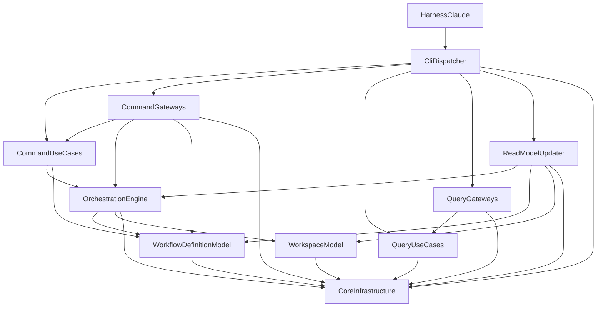

# components — stage-1 コンポーネントカタログ（ES 設計・現行コード追従版）

> **2026-09-07 全面改訂（U9 再走）**: 本書は現行コード（`main` `02cacea2` 時点の作業ツリー）を
> 実測して書き直した。クレート 10・集約 4・イベント 16 / 1 / 2 / 4・コマンド側ポート 4 とユース
> ケース 9・クエリ側ユースケース 13 と DAO ポート 14・RMU の `read_*` 17 表を、いずれも該当
> ファイルを開いて確認している（各コンポーネントの `behaviour` に実測の所在を書いた）。
>
> ~~**2026-08-30 訂正（Bolt B13、オーナー裁定）**: 再構成は**ジャーナル全再生**（スナップ
> ショット行は版の正本と存在検査のみ。状態の正本はイベント列）~~ — **失効（2026-09-05 オーナー
> 裁定 / 実測 2026-09-07）**: 再構成は**最新スナップショットを基底に、その `seq_nr` より後の
> 差分イベントだけを再生する**（`IntentExecution::replay(snapshot, events)`。実測
> `interface-adapter/src/orchestration/intent_execution_repository_impl.rs:336-438`）。集約の
> 構築 API が genesis / `replay` / `apply_event` のみで memento 型（~~`IntentExecutionSnapshot`~~）を
> 持たない点は現行のまま有効である。正典: `coding-rules/aggregate-commands.md`「再構成の形」。
>
> Domain Design（Inception 2.6）成果物・改訂版。出典: `../requirements-analysis/requirements.md`（FR/NFR）、
> RE 成果物 `aidlc/spaces/default/codekb/docs/architecture.md` / `component-inventory.md`（brownfield 現状）、
> チーム実践 `../practices-discovery/team-practices.md`、設計裁定 `domain-design-questions.md`（Q1〜Q9 確定 —
> Q5〜Q9 のイベントソーシング採用により初版から全面改訂）、および
> `../../construction/u9-canon-docs/functional-design/gap-measurement-20260907.md` §4 の裁定台帳。
> パラダイム: **イベントソーシング**（j5ik2o/event-store-adapter-rs `=3.0.0` 前提・1コマンド1イベント・
> SQLite ストア・upstream 互換ファイルはすべてリードモデル）。デプロイ形態は単一 CLI バイナリで、
> 本ステージでは扱わない。
>
> **クレート構成（実測 `Cargo.toml` members 10）**: `core-command-domain` / `core-command-use-case` /
> `core-command-interface-adapter` / `core-query-use-case` / `core-query-interface-adapter` /
> `core-read-model-updater` / `core-infrastructure` / `aidlc`(app) / `harness-claude` /
> `harness-infrastructure`。CQRS の境界は**クレート分離で物理強制**され、コマンド側とクエリ側は
> 互いの `Cargo.toml` に現れない。両側を知ってよいのは中間クレートの RMU と合成ルートだけである
> （K1 / K2、`coding-rules/cqrs-boundaries.md`）。下の YAML はドメインの 3 コンテキストを
> `core-command-domain` の 3 モジュールとして分けて書くので、コンポーネント 12 が 10 クレートに
> 対応する。

```yaml
components:
  - name: OrchestrationEngine
    summary: "orchestration コンテキストのドメイン（core-command-domain::orchestration）— 集約 Intent + IntentExecution とドメインイベント"
    behaviour: >
      集約 = FSM（統一ルール）。~~単一の集約 WorkflowExecution~~ は 2 集約へ分割された（改名・分割
      B12 2026-08-30）— Intent（静的な intent。7 属性 = id / definition_id / definition_revision /
      start_request / stages: StageEntries / scan / created_at。genesis create、イベント
      IntentEvent::Created 1 変種）と IntentExecution（1 回の実行。12 属性 = id / intent_id /
      slots: StageSlots / cursor / status / parked_at / autonomy / skeleton_stance /
      last_gate_resolution_at / seq_nr / version / last_updated_at）。1 intent : n 実行で、実行は
      intent_id で ID 参照し、計画が要るコマンド・クエリは &Intent を引数で受けて
      intent.id() != self.intent_id を Err(CommandError::IntentMismatch) で拒む。
      コマンドは decide — approve_gate(&mut self, ..) -> Result<IntentExecutionEvent, CommandError>
      のように 1コマンド1イベント（絶対）で単一ドメインイベントを返し、apply_event が状態を進める
      （リプレイと通常実行が同一経路）。楽観 version は**集約の内側**（version: usize フィールド、
      version() / with_version()、UNPERSISTED_VERSION = 0）にあり、~~RehydratedWorkflowExecution~~ /
      ~~StatePosition~~ / ~~StoreVersion~~ は撤去済み（失効 2026-08-30 / B13）。導出はクエリメソッド —
      next_decision(&self, &Intent, &NextRequest) -> Result<NextDecision, CommandError>、
      report_dispatch、jump_resolve、effective_plan、gated、state_binding ほか。
      ドメインイベント語彙（IntentExecutionEvent 16 変種 — Started / GateOpened / GateApproved /
      GateRejected / StageRevised / StageSkipped / Jumped / Parked / Unparked / Recomposed /
      AutonomyModeSet / SingleStageRunCommitted / SkeletonStanceRecorded / ReviewRequested /
      ReviewCompleted / PracticesAffirmed）は upstream 監査行語彙（86語）とは別物 — 監査行は
      ReadModelUpdater が1イベントから N 行を描画する。ドメインイベントはエンティティであり、
      全変種が自前の id: XxxEventId（UUIDv7、採番は集約のコマンド内）と aggregate_id: XxxId を
      持つ（オーナー裁定 2026-09-02）。集約は I/O を持たず純粋・同期である。
      実測: modules/core/command/domain/src/orchestration/{intent.rs, intent_execution.rs,
      intent_execution_event/*}（16 ファイル）、gap-measurement §4.1 O1〜O15。
    responsibilities:
      - "Intent 集約（静的な依頼と解決済み計画 stages: StageEntries の所有）"
      - "IntentExecution 集約（実行時状態・遷移・判断の単一型、decide/apply 分離、コマンド 15 + genesis start）"
      - "ドメインイベント（1コマンド1イベント）の定義と発行 — IntentExecutionEvent 16 / IntentEvent 1"
      - "NextDecision・ReportDecision・JumpDirection の導出（判断は集約 1 箇所に閉じる）"
      - "ファーストクラスコレクション 8 型（StageEntries / StageSlots / StageIndexSet / StageSlugSet / ArtifactPaths / TransitionSteps / ReviewClosures / PendingIterations）"
    depends_on:
      - component: WorkflowDefinitionModel
        interaction: "next_decision / 述語照会の照会先（参照渡しのみ）"
        style: sync
      - component: WorkspaceModel
        interaction: "CheckboxState / HumanTurns 等ワークスペース語彙の利用"
        style: sync
      - component: CoreInfrastructure
        interaction: "FirstClassCollection trait（言語拡張）"
        style: sync
    dependents:
      - component: CommandUseCases
        interaction: "集約コマンド/クエリの呼出（フロー制御）"
      - component: CommandGateways
        interaction: "replay / apply_event による集約再構成と DTO 変換"
      - component: ReadModelUpdater
        interaction: "ドメインイベントの読取と replay（投影の入力）"
    external_dependencies: []
    entities:
      - name: Intent
        identifier: id
        attributes: [definition_id, definition_revision, start_request, stages, scan, created_at]
        references:
          - entity: WorkflowDefinition
            owned_by: WorkflowDefinitionModel
            relationship: "intent は定義を definition_id で ID 参照する（埋め込まない）"
      - name: IntentExecution
        identifier: id
        attributes: [intent_id, slots, cursor, status, parked_at, autonomy, skeleton_stance, last_gate_resolution_at, seq_nr, version, last_updated_at]
        references:
          - entity: Intent
            owned_by: OrchestrationEngine
            relationship: "実行は intent を intent_id で ID 参照し、計画は &Intent 引数で受ける（1 intent : n 実行）"

  - name: WorkflowDefinitionModel
    summary: "workflow_definition コンテキストのドメイン（core-command-domain::workflow_definition）— 集約 WorkflowDefinition + CompiledDefinition"
    behaviour: >
      集約は 2 つある。WorkflowDefinition（ジャーナルに住む定義。8 属性 = id / revision / graph /
      grid / scopes / seq_nr / version / last_updated_at。define genesis / redefine / replay、
      イベント WorkflowDefinitionEvent 2 変種 = Defined / Redefined）と CompiledDefinition
      （配布束の集約。5 属性 = id: CompiledDefinitionId / revision / graph / grid / scopes。
      compile genesis / recompile / register_scope / apply_plugin_selection、イベント
      CompiledDefinitionEvent 4 変種 = Compiled / Recompiled / ScopeRegistered /
      PluginSelectionApplied。媒体がスナップショット = 配布 3 ファイルなので replay は無い）。
      DefinitionRevision::of_content はドメインが内容から導出する（ADR-008 改訂 2026-09-02）。
      述語面 6（is_valid_scope / valid_scopes / scope_metadata / subgraph_for_scope /
      stages_in_scope / first_in_scope_stage_of_phase）+ grid().action() の 3 値照会に加えて、
      クエリ scope_cost / review_policy(slug, scope, override) / stage_route を持つ。
      ~~effective_plan_action~~ と ~~next_in_scope_stage~~ は**存在しない**（履歴 — 前者の畳み込みは
      IntentExecution::effective_plan、後者は RMU が read_run_stage へ非正規化する。設計監査 R2 / b41）。
      ~~読取専用集約~~ の呼称は廃止（2026-08-29 オーナー裁定: 集約に統一）。~~ES 対象外・find のみの
      Repository~~ は**失効（2026-08-31 / b30）** — WorkflowDefinition の永続表現はジャーナルであり、
      Repository は find_by_id / find_for_intent / store の 3 動詞を持つ。R1 裁定により PlanAction は
      このコンテキストが所有（orchestration に定義も再輸出も無い — ADR-005 改訂）。
      実測: modules/core/command/domain/src/workflow_definition/{workflow_definition.rs:349-529,
      compiled_definition.rs, workflow_definition_event.rs, compiled_definition_event.rs}、
      gap-measurement §4.4 W1〜W5。
    responsibilities:
      - "WorkflowDefinition 集約（ジャーナルに住む定義。define / redefine / replay）の所有"
      - "CompiledDefinition 集約（配布束。compile / recompile / register_scope / apply_plugin_selection）の所有"
      - "StageGraph / ScopeGrid / StageNode / StageEntry / PlanAction（R1 後）の所有"
      - "スコープ解決・グラフ述語 6 + grid().action() + クエリ 3（scope_cost / review_policy / stage_route）"
      - "ファーストクラスコレクション 2 型（StageGraph / ScopeGrid — Filtered = Self）"
    depends_on:
      - component: CoreInfrastructure
        interaction: "FirstClassCollection trait（言語拡張）"
        style: sync
    dependents:
      - component: OrchestrationEngine
        interaction: "照会（参照渡し）"
      - component: CommandUseCases
        interaction: "Repository 経由の取得と参照配布"
      - component: CommandGateways
        interaction: "集約の再構成（replay）と DTO 変換"
      - component: ReadModelUpdater
        interaction: "WorkflowDefinition::replay と述語面の呼出（投影の材料）"
    external_dependencies: []
    entities:
      - name: WorkflowDefinition
        identifier: id
        attributes: [revision, graph, grid, scopes, seq_nr, version, last_updated_at]
      - name: CompiledDefinition
        identifier: id
        attributes: [revision, graph, grid, scopes]
      - name: StageNode
        identifier: slug
        attributes: [phase, execution, agents, mode, produces, consumes, sensors, scopes, reviewer, review_class]

  - name: WorkspaceModel
    summary: "workspace コンテキストのドメイン（core-command-domain::workspace）— 値オブジェクトとファーストクラスコレクションのみ（集約は無い）"
    behaviour: >
      SpaceName / CloneId / ShardName / StateFieldValue / CheckboxState / CheckboxEntry /
      StateVersionClassification（CURRENT_STATE_VERSION = "8"）/ AuditFieldKey / AuditFieldValue /
      AuditEventRecord / EventType（86 語）/ EventCategory / StorePath / HumanTurns / IntentDirName の
      値オブジェクトと、ファーストクラスコレクション 6 型（Checkboxes / AuditFields / BoltRefs /
      OrderedAuditEvents / PromotedSections / RuleLines）を持つ。**このモジュールに集約は無い**
      （実測 workspace/mod.rs の pub use 一覧）。IntentId（UUIDv7）は orchestration 側に住む。
      状態ファイル・監査ブロックの描画関数（render_audit_block / state_writers）は
      ReadModelUpdater の投影 API へ移管済み（2026-08-29 / Bolt B8）。Q9 裁定により
      LockProtocol・reap_eligible・OwnerStamp・ProcessProbe は退役（並行制御は SQLite Tx +
      楽観 version へ — ADR-007）。11 号 §2.1 が挙げる workspace の集約 3（登録簿 Intent /
      Space / Worktree）と供給面 4 は**予定（未実装、クリティカルパス 4 = マルチコール CLI + 文言カタログ配線）**で、
      orchestration の Intent 集約とは同名の別物である。
      実測: modules/core/command/domain/src/workspace/mod.rs、gap-measurement §4.5 S1〜S4。
    responsibilities:
      - "ワークスペース語彙の値オブジェクト（Always Valid newtype）の提供"
      - "ファーストクラスコレクション 6 型と、PracticesPromotion::plan / markdown_sections 3 関数"
    depends_on:
      - component: CoreInfrastructure
        interaction: "FirstClassCollection trait（言語拡張）"
        style: sync
    dependents:
      - component: OrchestrationEngine
        interaction: "CheckboxState / HumanTurns 等の語彙利用"
      - component: ReadModelUpdater
        interaction: "値オブジェクトと順序付け純関数の利用"
    external_dependencies: []
    entities: []

  - name: CommandUseCases
    summary: "コマンド側ユースケース層（core-command-use-case）— 書込ユースケース 9 とポート 4。~~EngineUseCases~~ — 改名（U9 再走 2026-09-07、CQRS の側分割に合わせた）"
    behaviour: >
      **書き込むユースケースだけがここにある**（cqrs-boundaries 規則 5 — 読むだけの動詞はクエリ側）。
      実測 9 本: CommitVerdictUseCase（= report。execute(&IntentExecutionId, ReportRequest, at)
      -> Result<CommitOutcome, CommitError>。Approve 段だけ定義を読み、競合は再構成から 1 回だけ
      再試行）/ CreateIntentUseCase / DefineWorkflowUseCase / ParkUseCase / PromotePracticesUseCase /
      RecordReviewUseCase / RecordSingleStageRunUseCase / RecordSkeletonStanceUseCase /
      SwitchAutonomyUseCase。~~NextUseCase / ContinueUseCase~~ はクエリ側へ移設済み（失効
      2026-08-31 / b26）、~~DoctorUseCase~~ とフック 4 ユースケースは**予定（未実装、クリティカル
      パス 5 = 最小フック / 6 = doctor → ドッグフード）**、unpark / jump / recompose のユースケースは
      **予定（未実装、クリティカルパス 4 = マルチコール CLI + 文言カタログ配線）**である。
      各ユースケースは async fn で、I/O 調達（ポート呼出）とドメイン呼出の順序制御だけを持つ
      （ビジネスロジック禁止）。典型形: find_by_id で集約を再構成 → decide（1イベント取得）→
      store(&event, &aggregate)。execute の引数は集約 ID と値オブジェクトのみで、集約インスタンスは
      渡さない（use-case-rules §2b）。
      ポート trait 4（orchestration/port/、すべて async fn。~~expected_version 引数~~ は無い）:
      IntentExecutionRepository { find_by_id(&IntentExecutionId), store(&mut self, &IntentExecutionEvent, &IntentExecution) } /
      IntentRepository { find_by_id, find_for_execution(&IntentExecution), store } /
      WorkflowDefinitionRepository { find_by_id, find_for_intent(&Intent), store } /
      CompiledDefinitionRepository { find_by_id, store }。エラーは RepositoryError<Id> 1 本
      （NotFound / Conflict / Io / Corrupt の 4 変種）で、Corrupt の分類はアダプタ私有
      （Error::source 連鎖）。DIP: trait のみ依存、静的束縛既定。~~WorkspaceLock ポート~~ は退役（Q9）。
      テストダブルは3層である — (1) 公開のインメモリ実装はアダプタ層の XxxRepositoryImpl<S>::in_memory()
      （本家 memory バックエンド）、(2) 自作 HashMap ダブルはそれ以外で禁止（オーナー裁定 2026-08-31）、
      (3) 例外として use-case 層の #[cfg(test)] に pub(crate) の trait フェイク 4 つ
      （InMemoryIntentExecutionRepository / InMemoryIntentRepository /
      InMemoryWorkflowDefinitionRepository / InMemoryCompiledDefinitionRepository）が住む —
      DIP のクレート分離により use-case は core-command-interface-adapter を dev-dependency にも
      書けず、そこには本家ストアが届かないためである。
      実測: modules/core/command/use-case/src/orchestration/{port/*.rs, *_use_case.rs,
      test_support.rs:1-17, mod.rs:38-39}、gap-measurement §4.2 P1〜P5。
    responsibilities:
      - "書込ユースケース 9 本（フロー制御・async fn）の所有"
      - "コマンド側ポート trait 4 と RepositoryError<Id> の所有"
      - "コマンド実行の定型（再構成 → decide → store）の指揮"
    depends_on:
      - component: OrchestrationEngine
        interaction: "集約コマンド/クエリの呼出"
        style: sync
      - component: WorkflowDefinitionModel
        interaction: "定義集約の参照配布"
        style: sync
    dependents:
      - component: CommandGateways
        interaction: "ポート trait の実装対象"
      - component: CliDispatcher
        interaction: "ユースケースの起動（composition root）"
    external_dependencies: []
    entities: []

  - name: CommandGateways
    summary: "コマンド側アダプタ層（core-command-interface-adapter）— Repository 実装 4 と永続化 DTO。~~PersistenceGateways~~ — 改名（U9 再走 2026-09-07）"
    behaviour: >
      Repository 実装 4 本（IntentExecutionRepositoryImpl<S> / IntentRepositoryImpl<S> /
      WorkflowDefinitionRepositoryImpl<S> / CompiledDefinitionRepositoryImpl）。~~EventStoreImpl の
      ローカル同形 trait~~ は**失効（ADR-010）** — 本家 event-store-adapter-rs（ピン =3.0.0）の
      ストア（EventStoreForSqlite / EventStoreForMemory）を**内包**する形に変わり、借り物の契約を
      二重に書かない。find_by_id は get_latest_snapshot_by_id →
      get_events_by_id_since_seq_nr → replay(base, events).with_version(version) の
      **最新スナップショット + 差分再生**（実測 intent_execution_repository_impl.rs:336-438）。
      store は I/O の前に event.aggregate_id == aggregate.id を照合し、不一致は
      Corrupt(WriteContract) で拒む（3 実装とも）。提示する楽観 version は集約が運ぶ
      （let expected_version = aggregate.version(); — 実測 :455）。新規・更新とも
      persist_event_and_snapshot で同一 Tx、スナップショットは SnapshotStrategy::every(n)（既定 10、
      初回必須）。in_memory() は本家 memory バックエンドを内包した唯一の公開インメモリ形で、
      実装コードは SQLite と 1 行も違わない（契約テストが両バックエンドに同じ約束を課せる）。
      例外は CompiledDefinitionRepositoryImpl — 媒体が配布 3 ファイル + harness.json なので型引数 S も
      in_memory() も持たない（実測 compiled_definition_repository_impl.rs:408、in_memory() は 3 実装のみ）。
      永続化 DTO（*Dto、serde）はこの層が所有し、ドメインは永続化知識から中立に保つ
      （domain-persistence-neutrality.md）。~~Wire 接頭辞・wire/ ディレクトリ~~ は全廃（2026-09-01）。
      機構 Clock（Fake 付き）は Gateway ではなく、このクレートに同居する機構モジュールである
      （gateway-taxonomy §1）。~~FsWorkspaceLock~~ は退役、~~state_file_io~~ は ReadModelUpdater の
      部品へ転生（Q9）。
      実測: modules/core/command/interface-adapter/src/orchestration/{*_repository_impl.rs, dto/}、
      gap-measurement §4.2 P1〜P4。
    responsibilities:
      - "コマンド側ポート trait 4 の実 I/O 実装（1 trait 1 Impl）"
      - "本家 event-store-adapter-rs のジャーナル/スナップショットの取り回し（同一 Tx・楽観 version）"
      - "永続化 DTO（*Dto）の所有と、検査付き再構成コンストラクタへの復号"
    depends_on:
      - component: CommandUseCases
        interaction: "実装するポート trait の定義元"
        style: sync
      - component: OrchestrationEngine
        interaction: "replay / apply_event による集約再構成"
        style: sync
      - component: WorkflowDefinitionModel
        interaction: "定義集約の再構成"
        style: sync
      - component: CoreInfrastructure
        interaction: "正準 JSON・原子的 I/O・codec"
        style: sync
    dependents:
      - component: CliDispatcher
        interaction: "composition root での結線"
    external_dependencies:
      - name: event-store-adapter-rs
        kind: library
        purpose: "ジャーナル・スナップショットのストア（ピン =3.0.0。EventStoreForSqlite / EventStoreForMemory）"
      - name: SQLite
        kind: database
        purpose: "ジャーナル・スナップショット・チェックポイント・read_* のストア（ローカルファイル、git 管理外）"
    entities: []

  - name: QueryUseCases
    summary: "クエリ側ユースケース層（core-query-use-case）— 読取ユースケース 13 と DAO ポート 14（新設 2026-08-31 / b26〜b28）"
    behaviour: >
      **読むだけの動詞はすべてここにある**（cqrs-boundaries 規則 5〜7）。ユースケース 13 本:
      FindNextAnswerUseCase / FindContinuationUseCase / FindRunStageUseCase / FindSteeringUseCase /
      FindDefinitionUseCase / FindDefinitionStageUseCase / FindScopeUseCase /
      FindScopeKeywordUseCase / FindPhaseEntryUseCase / FindJumpUseCase / FindExecutionUseCase /
      FindScopeChangeUseCase / FindStateFileUseCase。本体は execute(key) = dao.find(key) -> View
      だけで、**判断・導出・選択・文言組立のどれも持たない**（オーナー裁定 2026-09-02 — 状態の値で
      決まる答えは RMU が行に書いてある）。DAO ポート 14 本（DefinitionDao / DefinitionStageDao /
      ExecutionDao / JumpDao / JumpPhaseDao / NextAnswerDao / PhaseEntryDao / RunStageDao /
      ScopeChangeDao / ScopeDao / ScopeKeywordDao / StateFileDao / SteeringPartDao /
      SteeringPlanDao）は動詞 find のみで、**更新動詞が無いこと自体が「リードモデルは更新できない」の
      型保証**である。DTO（*View 群）は DAO と同じ port/ に同居する（オーナー裁定 2026-08-31）。
      **クエリ側クレートはドメイン（core-command-domain）に絶対依存しない**（Cargo.toml による物理強制）。
      Directive（構築可能 7 = LoadSteering / RunStage / Ask / Print / Error / Done / Parked）・
      DirectiveKind（10 — dispatch-subagent / invoke-swarm / present-gate は placeholder）・
      ContinueToken（HMAC 封筒、codec はアダプタ）・StateBinding の型は**このクレートに住む**
      （コマンド側ドメインではない — 所在の規範であり、kind の列挙と JSON 形は逐語契約として不変）。
      実測: modules/core/query/use-case/src/（Find*UseCase 13 / *Dao 14 / directive.rs /
      directive_schema.rs）、gap-measurement §4.1 O15・§4.2 P6。
    responsibilities:
      - "読取ユースケース 13 本（dao.find(key) -> View のみ）の所有"
      - "DAO ポート 14 本（find のみ）と View DTO の所有"
      - "Directive / DirectiveKind / ContinueToken / StateBinding の型の所有（逐語契約は不変）"
    depends_on:
      - component: CoreInfrastructure
        interaction: "正準 JSON・codec（トークン封筒）"
        style: sync
    dependents:
      - component: QueryGateways
        interaction: "DAO ポートの実装対象"
      - component: CliDispatcher
        interaction: "読取ユースケースの起動（composition root）"
    external_dependencies: []
    entities: []

  - name: QueryGateways
    summary: "クエリ側アダプタ層（core-query-interface-adapter）— SQLite DAO 14 と InMemory DAO 13（新設 2026-08-31 / b27）"
    behaviour: >
      DAO ポート 14 本の実装（*DaoImpl 14 — DefinitionDaoImpl / DefinitionStageDaoImpl /
      ExecutionDaoImpl / JumpDaoImpl / JumpPhaseDaoImpl / NextAnswerDaoImpl / PhaseEntryDaoImpl /
      RunStageDaoImpl / ScopeChangeDaoImpl / ScopeDaoImpl / ScopeKeywordDaoImpl / StateFileDaoImpl /
      SteeringPartDaoImpl / SteeringPlanDaoImpl）と、公開テストダブル InMemory*Dao 13 本
      （StateFileDao はファイル面を読むため InMemory 版を持たない）。SQL はリテラルで
      **1 表 1 引当**（JOIN しない・非正規化の焼き込みもしない — cargo lint の dao-single-table が
      機械強制）。読む先は RMU が書いた read_* 17 表で、1 要求につき 1 本の読取専用接続を Rc で共有する。
      **媒体（SQLite / ファイル）は実装詳細でポート契約に漏らさない**（gateway-taxonomy §3）。
      実測: modules/core/query/interface-adapter/src/、gap-measurement §4.2 P6。
    responsibilities:
      - "DAO ポート 14 本の SQLite 実装（1 表 1 引当）"
      - "公開テストダブル InMemory*Dao 13 本の提供"
    depends_on:
      - component: QueryUseCases
        interaction: "実装する DAO ポートの定義元"
        style: sync
      - component: CoreInfrastructure
        interaction: "正準 JSON・低水準 I/O"
        style: sync
    dependents:
      - component: CliDispatcher
        interaction: "composition root での結線"
    external_dependencies:
      - name: SQLite
        kind: database
        purpose: "read_* 17 表の読取（イベントストアと同一ファイル、読取専用接続）"
    entities: []

  - name: ReadModelUpdater
    summary: "リードモデル更新器（core-read-model-updater）— 中間クレート。取得ループ + 純粋投影核 + read_* 17 表"
    behaviour: >
      **コマンド側でもクエリ side でもない中間**であり、コマンド側のドメインイベントにもクエリ側
      （リードモデル）にも依存できる唯一のクレートである（2026-08-24 原裁定）。二層でできている —
      **取得ループ**（catch_up / catch_up_structured。checkpoint 読取 → events_after で差分取得 →
      project → advance_checkpoint、at-least-once）と、**純粋投影核** project（イベント列だけを
      受け取る。JournalReader・接続・チェックポイントを知らない）。投影核は判断を再実装せず、
      IntentExecution::replay / WorkflowDefinition::replay で集約を起こし、next_decision /
      jump_resolve / scope_cost / 述語面などの**クエリメソッドを呼んでその答えを行に書く**
      （オーナー裁定 2026-09-02）。
      ポート JournalReader と実装 JournalReaderImpl（別接続、rowid カーソル、BEGIN IMMEDIATE）を
      RMU 自身が所有する。JournalReader のメソッドは **9 本 = async fn 8**（events_after /
      events_through / checkpoint / advance_checkpoint / publish / pending_publication /
      steering_source_digest / replace_steering）**+ 同期の fn prepare_read_model(&mut self) 1 本**
      （実測 orchestration/journal_reader.rs:38）。
      リードモデルは 2 系統。(1) 人・upstream ツールが見るファイル面（aidlc-state.md / 監査シャード /
      メモリ層 team.md・project.md / 配布束の面）— バイト互換、golden 固定。(2) CLI 読取コマンド
      向けの構造化リードモデル = **read_* 17 表**（read_definition / read_definition_stage /
      read_definition_scope / read_definition_scope_keyword / read_definition_scope_stage /
      read_definition_scope_phase_entry / read_intent / read_intent_stage / read_execution /
      read_execution_stage / read_next_answer / read_next_jump / read_next_jump_phase /
      read_run_stage / read_scope_change / read_steering_plan / read_steering_part）。
      主キーは 1 列 id、複合主キーにしない。自然キーの重複防止は UNIQUE、関連行は FK 列
      （オーナー裁定 2026-09-03）。ジャーナル由来の表は catch_up ごとに全履歴から再計算して全差し替え、
      チェックポイント前進と同一 Tx。参照入力由来の steering 2 表だけは source_digest の比較で
      変化時に別 Tx で差し替える。
      我々の表は amadeus_projection_checkpoint（(aid, seq_nr) アンカー併記、不一致は
      Corrupt(CheckpointAnchorMismatch)）/ amadeus_read_model_head / publication 系 6 表
      （amadeus_publication / _file / _history / _history_file / _snapshot / _snapshot_file。
      公開は prepare -> publish の 2 Tx で、1 回の catch_up は最大 2 計画）。journal / snapshot は
      本家所有で、manifest 列は intent-execution-event/1 / intent-event/1 /
      workflow-definition-event/1 である。
      状態ファイルの骨格は合成ルートの成果物で、RMU は差分適用に徹する（欠落は
      ProjectionError::ScaffoldMissing）。状態ファイル・監査ブロックの描画（render_audit_block /
      state_writers）と利用者向け逐語文言（workspace/wording.rs）はこのクレートが持つ — 文言は
      **出す側**が組む（message-catalog クレートは 2026-08-29 に解体。~~PublishedLanguage
      コンポーネント~~ は本改訂で解消した）。
      実測: modules/core/read-model-updater/src/{orchestration/{journal_reader.rs,
      journal_reader_impl.rs, read_model_updater.rs, publication_store.rs, steering_source.rs},
      read_tables/, workspace/}、gap-measurement §4.3 R1〜R7。
    responsibilities:
      - "取得ループ（catch_up）とチェックポイント管理（単調・冪等・at-least-once）"
      - "純粋投影核 project — 集約を replay で起こし、クエリメソッドの答えを read_* 17 表へ非正規化"
      - "upstream 互換ファイル面（状態ファイル・監査シャード・メモリ層 2 本）の投影と逐語文言の所有"
      - "公開（prepare -> publish の 2 Tx、publication 系 6 表）"
    depends_on:
      - component: OrchestrationEngine
        interaction: "ドメインイベントの読取と IntentExecution::replay / クエリメソッド呼出"
        style: sync
      - component: WorkflowDefinitionModel
        interaction: "WorkflowDefinition::replay と述語面の呼出"
        style: sync
      - component: WorkspaceModel
        interaction: "値オブジェクトと順序付け純関数の利用"
        style: sync
      - component: CoreInfrastructure
        interaction: "原子書込（tmp+rename）・正準 JSON"
        style: sync
    dependents:
      - component: CliDispatcher
        interaction: "読取前と書込後の catch_up 起動"
    external_dependencies:
      - name: SQLite
        kind: database
        purpose: "ジャーナル読取・read_* 表と amadeus_* 表の書込（rusqlite）"
    entities:
      - name: ProjectionCheckpoint
        identifier: projection_name
        attributes: [last_seq_nr, aid, seq_nr_anchor, updated_at]

  - name: CliDispatcher
    summary: "合成ルート（modules/app/aidlc）— マルチコールバイナリ + ROUTES + composition root + Presenter"
    behaviour: >
      tokio による async main（#[tokio::main(flavor = "current_thread")] — 実測 main.rs:12。
      Q8 / ADR-006「async は初期化から、ドメイン（集約）は I/O を持たず純粋・同期」は有効）。
      **両側を知ってよいのは RMU とこの合成ルートだけ**である。
      面は 5 つ — 素の aidlc / aidlc-orchestrate、aidlc-utility、
      aidlc-log、aidlc-state、aidlc-bolt（実測 cli/face.rs の Face enum）。配線済みの動詞は
      next / continue / report / park / compose / init / intent-create / link / decision / answer /
      review（aidlc-log）/ set-autonomy（aidlc-bolt）/ practices-promote（aidlc-state）で、
      unpark / jump / recompose / フック 4 本 / doctor / aidlc-state の他 24 動詞・aidlc-bolt の
      他 7 動詞は**予定（未実装、クリティカルパス 4 = マルチコール CLI + 文言カタログ配線 /
      5 = 最小フック / 6 = doctor → ドッグフード）**である（未配線の動詞は逐語の拒否文言で断る）。
      **ポート・ユースケース・RMU はいずれも async fn であり、駆動ループも tokio::spawn も持たない** —
      合成ルートが読取の前と書込の後に catch_up を **await で直列に**呼ぶ（実測 runtime.rs:194,
      200, 238。modules/ に tokio::spawn / spawn_blocking は 0 件）。「別タスクへ切り出さない」
      という意味であって関数が同期という意味ではないので、ここを「同期呼出」とは書かない。
      directive の JSON 出力と利用者向け逐語文言の最終出力面（app/src/wording.rs）を持つ。
      要求の形で決まる分岐（--resume / --single / 名詞トークン）はコントローラの構文的ルーティングで、
      **状態の値で決まる分岐は持たない**（それは RMU が行に書いてある）。実物/InMemory の結線は
      composition root だけが行い、main.rs は配線だけの薄い 1 ファイル（coverage 除外はここで済む）。
      実行カーソル <record>/.aidlc-execution を intent-create が書き、definition_id は "claude" 固定。
      実測: modules/app/aidlc/src/{main.rs:12, runtime.rs:126-165, wording.rs, cli/face.rs,
      cli/request.rs:112-128}、gap-measurement §4.2 P7〜P9。
    responsibilities:
      - "コマンド解決と起動（thin CLI 面、async main、5 面のマルチコール）"
      - "composition root（DI 結線 — 両側を知る唯一の場所）と Presenter"
      - "読取前・書込後の RMU catch_up の await 直列呼出（駆動ループは持たない）"
    depends_on:
      - component: CommandUseCases
        interaction: "書込ユースケース起動"
        style: sync
      - component: CommandGateways
        interaction: "Repository 実装の結線"
        style: sync
      - component: QueryUseCases
        interaction: "読取ユースケース起動"
        style: sync
      - component: QueryGateways
        interaction: "DAO 実装の結線"
        style: sync
      - component: ReadModelUpdater
        interaction: "読取前・書込後の catch_up 起動（await 直列）"
        style: sync
      - component: CoreInfrastructure
        interaction: "プロセス終了コード・低水準 I/O・正準 JSON"
        style: sync
    dependents:
      - component: HarnessClaude
        interaction: "ハーネス設定がバイナリ動詞を参照"
    external_dependencies:
      - name: tokio
        kind: other
        purpose: "async ランタイム（current_thread。ワンショット CLI の初期化）"
    entities: []

  - name: CoreInfrastructure
    summary: "言語拡張のみの基盤（core-infrastructure）— 正準 JSON・コレクション・原子的 I/O。~~CanonJson~~ + ~~InfraIo~~ の統合（改名・統合 2026-08-29 の shared 解体に追従、U9 再走 2026-09-07 で本書へ反映）"
    behaviour: >
      **標準ライブラリを延長する汎用機構だけ**を置く（infrastructure-layer.md）。RPC クライアント・
      DB アクセス・外部サービス結合は置かない — それらは相手方契約を知る gateway であり
      interface-adapter 層の持ち物である。実測のモジュールは 7 つ:
      canon_json（upstream 互換の正準化 — キー順・数値・エスケープ・sha256。3 プロファイルと
      ダイジェスト 2 族。契約 JSON は必ずここを通し serde_json::to_* の直接呼出を禁じる）/
      collections（FirstClassCollection trait と汎用の Collection<T> / NonEmptyCollection<T> — #114。
      非空型は map と非空同士の combine で非空を保ち、filter / divide では Collection へ戻る）/
      atomic（tmp+rename+fsync）/ append_only（O_APPEND|O_NOFOLLOW）/ fs_meta / codec / secret_file。
      canon_json の ObjectMembers も FirstClassCollection を実装する。
      ドメイン側のファーストクラスコレクション 16 型（orchestration 8 / workspace 6 /
      workflow-definition 2）はこの trait に適合し、契約は
      modules/core/command/domain/tests/collection_contract_test.rs と
      modules/core/infrastructure/tests/collections_test.rs が検査する。
      実測: modules/core/infrastructure/src/lib.rs:20-26、collections/、canon_json/value/object_members.rs:124、
      gap-measurement §4.6 K4 / K5。
    responsibilities:
      - "正準 JSON 直列化とハッシュ（upstream 互換の受入基準は hash-canonical 受入表の全行一致）"
      - "FirstClassCollection trait と汎用コレクション 2 型の提供"
      - "ファイルシステム原子性・追記・メタ検査・codec の一次実装"
    depends_on: []
    dependents:
      - component: OrchestrationEngine
        interaction: "FirstClassCollection trait"
      - component: WorkflowDefinitionModel
        interaction: "FirstClassCollection trait"
      - component: WorkspaceModel
        interaction: "FirstClassCollection trait"
      - component: CommandGateways
        interaction: "正準 JSON・原子書込・codec"
      - component: QueryUseCases
        interaction: "正準 JSON・codec（トークン封筒）"
      - component: QueryGateways
        interaction: "正準 JSON・低水準 I/O"
      - component: ReadModelUpdater
        interaction: "原子書込・正準 JSON"
      - component: CliDispatcher
        interaction: "composition root からの直接利用"
    external_dependencies:
      - name: ローカルファイルシステム
        kind: other
        purpose: "全ファイル I/O の実体"
    entities: []

  - name: HarnessClaude
    summary: "Claude Code ハーネス配線（harness-claude）— マニフェストデータとフックアダプタシム"
    behaviour: >
      Claude Code の settings / hook 登録が aidlc バイナリの hook サブコマンドを呼ぶための配線データと
      薄いシム。ハーネス固有の差異はこの層に閉じ、エンジン本体（core）はハーネス中立である。
      **実測では 3 行のスタブ**（lib.rs — doc コメントと #![forbid(unsafe_code)] のみ）であり、
      中身は**予定（未実装、クリティカルパス 5 = 最小フック）**である。
      実測: modules/harness/claude/src/lib.rs（3 行）、gap-measurement §4.6 K1。
    responsibilities:
      - "ハーネス固有の設定・登録・パス規約（予定）"
    depends_on:
      - component: CliDispatcher
        interaction: "バイナリ動詞の参照（設定データとして）"
        style: sync
    dependents: []
    external_dependencies: []
    entities: []

  - name: HarnessInfrastructure
    summary: "harness 文脈の言語拡張（harness-infrastructure）— 憲章のみの器（新設 2026-08-29）"
    behaviour: >
      harness 文脈の infrastructure（言語拡張）を置く器。core-infrastructure と同じ責務境界
      （標準ライブラリの汎用延長のみ、相手方契約を知る部品は置かない）を harness 側に敷くための
      クレートで、**実測では実体がまだ生まれていない**（25 行の憲章 doc のみ）。中身は
      **予定（未実装、クリティカルパス 5 = 最小フック）**である。
      実測: modules/harness/infrastructure/src/lib.rs（25 行）、infrastructure-layer.md「配置と依存方向」。
    responsibilities:
      - "harness 文脈の汎用機構（予定）"
    depends_on: []
    dependents: []
    external_dependencies: []
    entities: []
```

## Component Diagram


<!-- Text fallback: 依存は内向き・非循環で、コマンド側とクエリ側は互いを指さない（CQRS 境界のクレート分離による物理強制）。HarnessClaude -> CliDispatcher。CliDispatcher（合成ルート、両側を知る唯一の場所）-> CommandUseCases / CommandGateways / QueryUseCases / QueryGateways / ReadModelUpdater / CoreInfrastructure。ReadModelUpdater（中間クレート）-> OrchestrationEngine / WorkflowDefinitionModel / WorkspaceModel / CoreInfrastructure。CommandGateways -> CommandUseCases / OrchestrationEngine / WorkflowDefinitionModel / CoreInfrastructure（外部依存 event-store-adapter-rs・SQLite）。CommandUseCases -> OrchestrationEngine / WorkflowDefinitionModel。QueryGateways -> QueryUseCases / CoreInfrastructure（外部依存 SQLite）。QueryUseCases -> CoreInfrastructure（ドメインには絶対依存しない）。OrchestrationEngine -> WorkflowDefinitionModel / WorkspaceModel / CoreInfrastructure。WorkflowDefinitionModel / WorkspaceModel -> CoreInfrastructure。CoreInfrastructure は依存なし。HarnessInfrastructure は依存も依存元も無い（憲章のみ）。 -->

## Component Summary

| Component | Purpose | Crate | Depends On | Dependents | Entities Owned |
|---|---|---|---|---|---|
| OrchestrationEngine | 集約 Intent + IntentExecution とドメインイベント 16 + 1（1コマンド1イベント） | core-command-domain::orchestration | WD, WS, INF | CUC, CGW, RMU | Intent, IntentExecution |
| WorkflowDefinitionModel | 集約 WorkflowDefinition + CompiledDefinition とイベント 2 + 4、述語面 6 + クエリ 3 | core-command-domain::workflow_definition | INF | OE, CUC, CGW, RMU | WorkflowDefinition, CompiledDefinition, StageNode |
| WorkspaceModel | 語彙（値オブジェクト + FCC 6。集約は無い。描画は RMU へ移管済み） | core-command-domain::workspace | INF | OE, RMU | — |
| CommandUseCases（~~EngineUseCases~~ — 改名） | 書込ユースケース 9 + ポート 4（async fn、DIP） | core-command-use-case | OE, WD | CGW, CLI | — |
| CommandGateways（~~PersistenceGateways~~ — 改名） | Repository 実装 4 + 永続化 DTO（本家ストアを内包） | core-command-interface-adapter | CUC, OE, WD, INF | CLI | — |
| QueryUseCases（新設） | 読取ユースケース 13 + DAO ポート 14 + View DTO + Directive 型 | core-query-use-case | INF | QGW, CLI | — |
| QueryGateways（新設） | SQLite DAO 14 + InMemory DAO 13（1 表 1 引当） | core-query-interface-adapter | QUC, INF | CLI | — |
| ReadModelUpdater | 中間クレート — 取得ループ + 純粋投影核 + read_* 17 表 | core-read-model-updater | OE, WD, WS, INF | CLI | ProjectionCheckpoint |
| CliDispatcher | async main + 5 面のマルチコール + composition root | aidlc (app) | CUC, CGW, QUC, QGW, RMU, INF | HC | — |
| CoreInfrastructure（~~CanonJson~~ + ~~InfraIo~~ — 統合） | 言語拡張のみ（canon_json / collections / atomic / append_only / fs_meta / codec / secret_file） | core-infrastructure | — | OE, WD, WS, CGW, QUC, QGW, RMU, CLI | — |
| HarnessClaude | ハーネス固有配線（実測 3 行のスタブ — 予定） | harness-claude | CLI | — | — |
| HarnessInfrastructure（新設） | harness 文脈の言語拡張（憲章のみ — 予定） | harness-infrastructure | — | — | — |

~~PublishedLanguage~~ — **解消（2026-08-29 の shared 解体 / 本改訂 2026-09-07 で反映）**: 独立クレート `message-catalog` は解体され、利用者向け逐語文言は**出す側**が持つ（`modules/app/aidlc/src/wording.rs` と `modules/core/read-model-updater/src/workspace/wording.rs`）。監査行語彙（`EventType` 86 語 / 22 カテゴリ）は `WorkspaceModel` が、`Directive` / `DirectiveKind` / `ContinueToken` は `QueryUseCases` が所有する。「ドメインの pub 型がそのまま公開言語」なので独立の語彙クレートは要らない（`coding-rules/cqrs-boundaries.md` 配置表）。

## Entity Ownership

| Entity | Owning Component | Identifier | Attributes | References |
|---|---|---|---|---|
| Intent | OrchestrationEngine | id (IntentId, UUIDv7) | definition_id, definition_revision, start_request, stages (StageEntries), scan, created_at | WorkflowDefinition（definition_id で ID 参照） |
| IntentExecution | OrchestrationEngine | id (IntentExecutionId) | intent_id, slots (StageSlots), cursor, status, parked_at, autonomy, skeleton_stance, last_gate_resolution_at, seq_nr, version, last_updated_at | Intent（intent_id で ID 参照。計画は &Intent 引数） |
| WorkflowDefinition | WorkflowDefinitionModel | id (WorkflowDefinitionId) | revision, graph, grid, scopes, seq_nr, version, last_updated_at | — |
| CompiledDefinition | WorkflowDefinitionModel | id (CompiledDefinitionId) | revision, graph, grid, scopes | — |
| StageNode | WorkflowDefinitionModel | slug | phase, execution, agents, mode, produces, consumes, sensors, scopes, reviewer, review_class | — |
| ProjectionCheckpoint | ReadModelUpdater | projection_name | last_seq_nr, aid, seq_nr_anchor, updated_at | — |
| ~~WorkflowExecution~~ | ~~OrchestrationEngine~~ | ~~intent_id~~ | ~~status, stage_cursor, checkboxes, overlay, approved, autonomy_mode, parked_at, revision_count, version, seq_nr~~ | ~~WorkflowDefinition（参照渡し）~~ |

最終行は**履歴**である — 単一集約 `WorkflowExecution` は 2026-08-30（B12）に `Intent` + `IntentExecution` へ分割・改名され、楽観 `version` は 2026-08-30（B13）に集約の内側へ戻った。旧 7 並列列（`stage_cursor` / `checkboxes` / `overlay` / `approved` / `revision_count` ほか）はファーストクラスコレクション `StageSlots`（要素 `StageSlot` 7 欄 = key / plan_action / checkbox / approved / revision_count / review_attempt / practices_affirmed）へ統合された。

## External Dependencies

| Component | Dependency | Kind | Purpose |
|---|---|---|---|
| CommandGateways | event-store-adapter-rs | library | ジャーナル・スナップショットのストア（ピン `=3.0.0`。`EventStoreForSqlite` / `EventStoreForMemory`） |
| CommandGateways | SQLite | database | ジャーナル・スナップショットの実体（ローカル、git 管理外） |
| QueryGateways | SQLite | database | `read_*` 17 表の読取（イベントストアと同一ファイル、読取専用接続） |
| ReadModelUpdater | SQLite | database | ジャーナル読取・`read_*` / `amadeus_*` の書込（rusqlite） |
| CliDispatcher | tokio | other | async ランタイム（current_thread） |
| CoreInfrastructure | ローカルファイルシステム | other | 全ファイル I/O の実体 |

## Rationale

| Component | 分離根拠 |
|---|---|
| OrchestrationEngine / WorkflowDefinitionModel / WorkspaceModel | 境界づけられたコンテキスト（変更理由: エンジン規則 / 定義スキーマ / ワークスペース語彙）。3 つとも `core-command-domain` の中のモジュールで、**ドメインはコマンド側の持ち物**（2026-08-29 オーナー裁定）。ドメインは永続化知識から中立で、依存は chrono / uuid / core-infrastructure のみ（K3） |
| CommandUseCases / CommandGateways | フロー制御専任の薄い層と、その実 I/O。DIP の機械強制点（クレート分離 = E0432）。コマンド側は**書くためだけの世界**で、集約を読むのは書くための再構成のみである |
| QueryUseCases / QueryGateways | **読むだけの世界**。RMU が構築したリードモデルだけに依存し、ドメインには絶対依存しない（`Cargo.toml` の不在による物理強制）。DAO の動詞が `find` だけであることが「リードモデルは更新できない」の型保証になる |
| ReadModelUpdater | 投影は「何を描くか（upstream 互換）」という独自の変更理由を持つ。**中間クレート**として両側に依存できる唯一の例外で、取得ループと純粋投影核の二層を潰さない（投影核の入口はイベント列だけ） |
| CliDispatcher | 起動・結線・出力面 — ハーネス/配布の変更理由。両側を知ってよいのは RMU とここだけで、駆動ループを置かない（カバレッジ除外領域に実ロジックを落とさないため） |
| CoreInfrastructure | 依存ゼロの言語拡張。全層から参照される正本は独立が最小コストで、RPC / DB を置かないことが層の定義そのものである |
| HarnessClaude / HarnessInfrastructure | ハーネス固有差異の隔離（エンジン本体はハーネス中立） |

分解は ES 採用時の構造（Q1〜Q9、`decisions.md` の ADR）を土台に、2026-08-29〜08-31 の CQRS 側分割（ADR-009）で
`core-use-case` / `core-interface-adapter` を**側ごとに割り**、中間クレート RMU を独立させた形である。
境界の物理強制は `Cargo.toml` に相手が現れないことで行い、判定は依存表を見るだけで済む。
境界を動かした裁定は Q1〜Q9 と ADR-009 / 010 / 011 として個別に取り、`decisions.md` に記録した。
本書の各コンポーネントの主張は 2026-09-07 に該当ファイルを開いて実否を確認しており、確認の所在を
`behaviour` の末尾に `実測:` として書いてある（BR5.3 の検証規律）。

## Review

**Verdict:** READY
**Reviewer:** aidlc-architecture-reviewer-agent
**Date:** 2026-08-22T09:35:31Z
**Iteration:** 1（後方ジャンプ後の再入・advisory）

### Findings

| # | Severity | Location | Finding | Recommendation |
|---|---|---|---|---|
| 1 | Minor | components.md ReadModelUpdater / traceability.json FR1.1 | 改訂 FR1.1 は「監査シャード（`<record>/audit/<host>-<clone>.md`）の**位置付き読取**（シャード横断の順序規約 = timestamp ソート + バッファ位置 tiebreak）を実装する」ことを合格基準としているが、ReadModelUpdater の behaviour はジャーナル→リードモデルへの**書込（投影）**側の記述に終始しており（「他クローンのシャードは読み取り専用の外部入力として読み側でのみ合流（stage-1 は単一クローン運用）」という一文があるのみ）、シャード横断の位置付き読取そのものを実装する責務がどのコンポーネントに属するか明示されていない。traceability.json は FR1.1 の target を「ReadModelUpdater, PersistenceGateways」としているが、両コンポーネントの behaviour 記述のどちらにも「シャード横断の順序規約」という読取ロジックの置き場は書かれていない。これは前回の advisory レビュー（2026-08-22T09:21、無効化前）で計上した Minor 1 と同一観点であり、components.md はこの再入で変更されていない（変更対象は ADR-005 関連の完全移動裁定のみ）ため、依然として未解消と判断する。実装者は「どのコンポーネントに位置付き横断読取のコードを書くか」を推測する必要があり、コンポーネント境界としては軽微な曖昧さにとどまる（読取専用ロジックであり、既存の境界のどちらかに収まる可能性が高い — ブロッキング水準ではない）。 | ReadModelUpdater（または新設する読取専用ヘルパー）の responsibilities に「監査シャード横断の位置付き読取（timestamp ソート + バッファ位置 tiebreak）」を明記する一文を追加する。 |

所見はこの1件のみ。ADR-005（PlanAction 完全移動）は `coding-rules/module-visibility.md` の 2026-08-22 追補（「利便性のための再エクスポートはどこでも禁止」「所有を移すときは完全移動で行い、エイリアス再輸出で先送りしない」）と文言レベルで一致しており、Context / Decision / Consequences / Alternatives Rejected の4節も揃っている。components.md 内で `orchestration` からの再輸出を前提とした記述の残存は確認されなかった（WorkflowDefinitionModel のエントリは「orchestration は再輸出せず、完全移動で参照」と明記）。

### Validation Tool Results

| Tool | Result | Interpretation |
|---|---|---|
| ID 突合（requirements.md ↔ traceability.json） | 一致 — requirements.md の FR1〜FR9.6・NFR1〜NFR5（計42 ID）と traceability.json の `upstream_ids` 配列が完全一致。追加・欠落なし | coverage の網羅性に問題なし |
| target 名解決（traceability.json → components.md） | 一致 — coverage の `target` に現れるコンポーネント名（OrchestrationEngine / WorkflowDefinitionModel / WorkspaceModel / EngineUseCases / PersistenceGateways / ReadModelUpdater / CliDispatcher / CanonJson / PublishedLanguage）はすべて components.md 内に実在。`ci-pipeline` は意図的な後段ステージへの Deferred 参照（FR9系・NFR2/NFR4）であり component ではないが正しい用法 | 参照切れなし |
| ADR-005 改訂 vs module-visibility.md 追補 | 一致 — 「利便性のための再エクスポートはどこでも禁止」「完全移動」の文言が decisions.md ADR-005 と一致し、Context/Decision/Consequences/Alternatives Rejected の4節を具備（phases/inception.md Architecture Standards 準拠） | ADR 品質基準を満たす |
| FR8.1（旧称 AuditLedgerRepository 残存）の引き取り確認 | `coding-rules/gateway-taxonomy.md` を実測すると `AuditLedger → AuditLedgerRepository` の行が現存（42行目）しており、FR8.1 がこれを除去対象として明記している（本ステージのスコープ外の文書修正 — traceability.json も FR8.1 を N/A・「canon 文書の修正 — コード成果物なし」として正しく扱っている） | 前回 READY 時の所見3は改訂 FR8.1 で正しく引き取られている |
| FR1.2（audit-first + 楽観 version）/ NFR3（クラッシュ再構成）と components.md の整合 | 一致 — PersistenceGateways の behaviour に「persist_event_and_snapshot は同一 Tx + 楽観 version 条件付き書込」、「find_by_id = 最新スナップショット + seq_nr 以降のイベントを replay」の記述があり、FR1.2/NFR3/FR1.3 の合格基準と対応が取れる | 追加所見なし |

### Summary

改訂 ADR-005（PlanAction 完全移動）は同日追補された `module-visibility.md` の再エクスポート禁止裁定と矛盾なく整合しており、components.md 内にも再輸出前提の記述は残っていない。traceability.json の ID 集合・target 参照も改訂後の requirements.md と齟齬なく、前回 READY 時の所見3（旧称 AuditLedgerRepository）も改訂 FR8.1 に正しく引き取られている。唯一、FR1.1 の監査シャード横断の位置付き読取の実装責務がどのコンポーネントに属するか components.md 上でなお明示されていない点を Minor として再計上する（前回 advisory レビューと同一観点、成果物側は無変更のため）。Critical・Major は無く、advisory 判定として READY とする。承認前にこの Minor 1件を人間が重みづけされたい。
