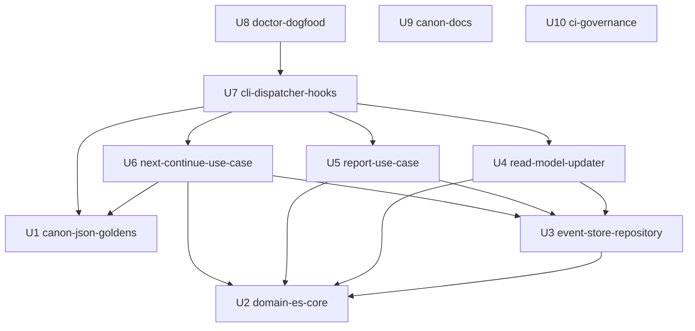

# unit-of-work-dependency — Unit 間の依存 DAG（形だけ。順序は 2.9 が決める）

> Units Generation（Inception 2.7）成果物。Unit 定義は `unit-of-work.md`、出典は `../domain-design/components.md`
> （コンポーネント間依存）、`../domain-design/decisions.md`（ADR-001〜007）、`../requirements-analysis/requirements.md`
> （FR の依存注記: FR3/FR4/FR5 → FR7）、確認質問 `units-generation-questions.md`（Q6 = A: 厳密な依存のみを辺に
> する。Q7 = A〜D: 形式化する境界）。
>
> 本ファイルは**トポロジーだけ**を書く。どの Unit から着手するか・クリティカルパス・Bolt 順序は
> delivery-planning（2.9）の判断であり、ここでは推奨順序を示さない。

## 1. 依存グラフ（機械可読）

辺の意味: `depends_on` に挙げた Unit が**無いとコンパイルまたはテストできない**（Q6 = A）。望ましい順序や
ガバナンス上の前提は辺にしない（§4 に別記）。

```yaml
units:
  - name: u1-canon-json-goldens
    kind: library
    depends_on: []
  - name: u2-domain-es-core
    kind: library
    depends_on: []
  - name: u3-event-store-repository
    kind: library
    depends_on: [u2-domain-es-core]
  - name: u4-read-model-updater
    kind: library
    depends_on: [u2-domain-es-core, u3-event-store-repository]
  - name: u5-report-use-case
    kind: library
    depends_on: [u2-domain-es-core, u3-event-store-repository, u4-read-model-updater]
  - name: u6-next-continue-use-case
    kind: library
    depends_on: [u1-canon-json-goldens, u2-domain-es-core, u3-event-store-repository]
  - name: u7-cli-dispatcher-hooks
    kind: service
    depends_on: [u1-canon-json-goldens, u4-read-model-updater, u5-report-use-case, u6-next-continue-use-case]
  - name: u8-doctor-dogfood
    kind: service
    depends_on: [u7-cli-dispatcher-hooks]
  - name: u9-canon-docs
    kind: spec
    depends_on: []
  - name: u10-ci-governance
    kind: packaging
    depends_on: []
```

## 2. 依存グラフ（図）


<!-- Text fallback: 矢印は「依存元 → 依存先」。U3→U2。U4→U2,U3。U5→U2,U3（U5→U4 は 2026-08-29 / Bolt B11 で失効 — 下表参照）。U6→U1,U2,U3。U7→U1,U4,U5,U6。U8→U7。U1・U2・U9・U10 は依存なし（根）。循環なし。 -->

辺の根拠（各辺 1 行）:

| 依存元 → 依存先 | 理由（無いと何ができないか） |
|---|---|
| U3 → U2 | ストアに書く/再生するイベント型と集約（apply_event）は U2 が定義する |
| U4 → U2 | 投影の入力（ドメインイベントの型と内容）は U2 |
| U4 → U3 | ジャーナル差分読取とチェックポイント永続化は U3 のストア API |
| U5 → U2 | decide（集約コマンド）は U2 |
| U5 → U3 | 再水和（find_by_id）と store は U3 の Repository 実装（テストは InMemory） |
| ~~U5 → U4~~ | ~~コマンド末尾の投影キャッチアップ起動（report の出力契約に監査行が含まれる）~~ → **失効（2026-08-29 / Bolt B11。オーナー裁定を in-place 反映）**: 投影キャッチアップを**起動する**のは合成ルート（U7）であり、U5 ではない（`coding-rules/cqrs-boundaries.md` はコマンド側クレートが RMU を `Cargo.toml` に書くことを禁止パターンとし、クレート分離で機械強制している）。監査行が report の出力契約に含まれるのは事実だが、それは U7 がU5 の直後に RMU を起動することで満たされる。したがって U5 → U4 の依存は存在しない |
| U6 → U1 | `continue_token` のバンドル digest・正準 JSON は U1 |
| U6 → U2 | `next_decision`（21 分岐ラダー）は U2 の集約クエリ |
| U6 → U3 | Controller が find_by_id で載せた集約を `&` で渡す（読取専用の型強制） |
| U7 → U1 | CLI 実行出力のゴールデン（FR4.1 の合格基準）は U1 が採取 |
| U7 → U4 | コマンド末尾で ReadModelUpdater を起動する（composition root の結線対象） |
| U7 → U5 / U6 | ROUTES 表が起動するユースケース本体 |
| U8 → U7 | doctor は CLI のサブコマンド。ドッグフードは CLI 全体の実働が前提 |

## 3. 並列開発の機会（依存の無い Unit の組）

複数の有効なトポロジカル順序が存在する。PR は直列運用（team.md）だが、**どれを先に出すか**の選択肢として
2.9 に渡す:

- **根（依存なし）**: U1・U2・U9・U10 の 4 つは互いに独立。任意の順で着手できる。
- U5 と U6 は互いに依存しない（どちらも U2・U3 の後。U6 はさらに U1 の後）。
- U9・U10 は他のどの Unit とも依存関係が無く、いつでも差し込める。
- 直列に並ぶ鎖: U2 → U3 → U4 → U5 → U7 → U8（最長の依存連鎖 — これは幾何であって推奨順ではない）。

## 4. Unit 間の統合点（contract-design 2.8 で形式化する境界 — Q7 = A〜D）

| 境界 | 両側の Unit | 形式化するもの |
|---|---|---|
| ポート trait | U3（実装）⇄ U5 / U6（消費） | `WorkflowExecutionRepository`（store / find_by_id）、`WorkflowDefinitionRepository`（find）、event-store-adapter-rs 同形の EventStore trait（journal / snapshot / checkpoint の操作、楽観 version 失敗の型） |
| ドメインイベント語彙と投影規則 | U2（発行）⇄ U4（投影） | `WorkflowExecutionEvent` の変種とペイロード、1 イベント → 監査行 N 行・状態ファイル差分の描画規則（86 語彙・見出し・フィールド順は逐語） |
| SQLite スキーマ | U3（所有）⇄ U4（読取） | journal / snapshot / checkpoint テーブル定義、seq_nr・version・チェックポイントの単調性 |
| CLI 動詞・directive JSON・フック入出力 | U7（面）⇄ U5 / U6（中身）⇄ U1（ゴールデン） | ROUTES の動詞集合、directive スキーマ（10 種・28KiB 上限・continue_token）、フック 4 本の stdin/stdout/exit code、逐語文言 |

辺にしない運用上の前提（2.9 への申し送り）:

- U9 の FR8.1（`gateway-taxonomy.md` §2b への `store` 注記・旧称除去）は、U3 の実装レビューが正本に照らして
  行われるため、U3 の**着手前に済んでいるのが望ましい**。コンパイル/テストの依存ではないので辺にしない。
- U10 の `unsafe_code = "forbid"` 昇格と `rust-toolchain.toml` 固定は、コードの Unit より先に入ると CI の
  突然赤を早く潰せる。これも辺ではない。
- U8 の実地スモークは U1〜U7 のすべてを統合して初めて意味を持つ（辺は U7 のみだが、実質は全 Unit の後）。

## 5. 出典との対応

- `../domain-design/components.md` のコンポーネント間依存（内向き・非循環）を Unit 粒度に粗視化した。
  コンポーネントと Unit の対応は `unit-of-work.md` §3 の各 Unit 責務に記す。
- `../domain-design/decisions.md` ADR-005（完全移動）により、U2 に PlanAction の呼出側一斉修正を含めた
  （再輸出による段階移行は採らない）。
- `../requirements-analysis/requirements.md` の依存注記（FR3.2 → FR7、FR4.1 → FR7.2、FR5 → FR7.2）が
  U6 → U1、U7 → U1 の辺に対応する。
