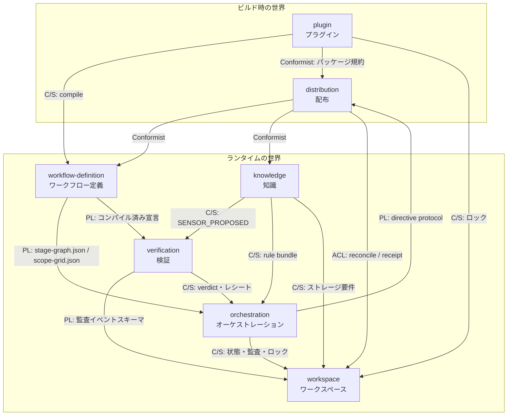

# amadeus-ng ドメインモデル — ユビキタス言語とコンテキストマップ

> **位置づけ**: 仕様セット第2文書。`00-policy.md` の D2（ドメインモデル起点）・D3（Always Valid Domain Model / Domain Primitive）・D6（aidlc 互換）に基づき、境界づけられたコンテキストとユビキタス言語の正準を定める。以後のコンテキスト別仕様（10 番台）はすべて本書の裁定に従う。
> **根拠**: upstream 13 仕様（awslabs/aidlc-workflows v2 @ `3c3146cf`, v2.6.40）の全数抽出。337 語 → 正規化 125 語、不変条件付き。状態機械 74 件。全量は [`research/domain-vocabulary.json`](research/domain-vocabulary.json) に収録し、本書は**裁定**（境界・衝突解決・関係・強制手段）を担う。
> **策定日**: 2026-08-22

---

## 1. 用語の正準規則

4 つの規則で用語を統制する。

1. **正準用語は upstream の英語綴り**とする（D6 の帰結。翻訳・改名はしない）。説明と定義は日本語で書く。Rust の型名は正準用語から機械的に導出する（例: `Stage` → `Stage`、`CheckboxState` → `CheckboxState`）。
2. **多義語は §5 の衝突台帳が裁定する**。台帳が定める限定名（例: `StageGraph` / `RuntimeGraph` / `UnitDag`）以外での無修飾使用を禁止する。ドメインモデル上の型名の分離であり、ファイル名・監査イベント名・CLI 語彙は D6 により upstream 互換のまま維持する。
3. **すべての不変条件に強制手段を明記する**。コンテキスト別仕様は、各不変条件に次の 5 分類のいずれかを必ず付す。これにより「仕様に書いた不変条件が型に落ちているか」を機械的に照合できる。
   - **E1 型**: Rust の型システムで不正状態を表現不能にする（newtype / enum / typestate）
   - **E2 パース**: 境界のコンストラクタが検証し `Result` で拒否する（parse, don't validate）
   - **E3 ガード**: 実行時検査＋監査イベント（フック、engine のガード列、fail-open/fail-closed の別を明記）
   - **E4 モデル検査**: Quint の不変条件・時相性質として検査する（A9）
   - **E5 プロトコル**: 散文契約（コンダクタ / LLM が遵守。機械強制なし、または E3 で部分補強）
   E1 > E2 > E3 の順で強い手段を優先し、E5 に留まる不変条件は「なぜ機械化できないか」を書く。
4. **語彙集の正本は本書＋研究付録**とする。コードリポジトリ成立後（A8）にコンテキストごとの `CONTEXT.md` を置く場合は本書からの抜粋・参照とし、二重維持しない。

## 2. コンテキストマップ — 7 コンテキストと 2 つの世界

7 候補すべてを正式なコンテキストとして確定する。最重要の構造は**ビルド時とランタイムの分離**である。distribution はランタイムに存在せず（アップグレード＝配布ツリーの再コピー＋新セッション）、両世界をつなぐのは実行時連携ではなく公開された契約だけになる。

*凡例*: PL = Published Language、C/S = Customer/Supplier、ACL = Anticorruption Layer。

**関係の要点**（全 16 関係は研究付録を参照）:

- **Published Language が 3 つある**。(1) コンパイル済み `stage-graph.json` / `scope-grid.json`（workflow-definition → orchestration / verification）、(2) 監査イベントスキーマ 86 種（verification ほか → workspace。workspace はイベント行を opaque に扱い、merge-protected 属性もスキーマ側の宣言として受け取る）、(3) directive protocol（orchestration → distribution。stage runner はこの契約に conform する生成物）。3 つとも D6 により upstream 互換で凍結される。
- **暗黙の Shared Kernel を 2 か所で解体する**。レビューレシートの鮮度・凍結述語（engine の advance ガードとフックの freeze 執行が同一でなければならない）は verification 所有の単一クレートに置き、orchestration は依存として呼ぶ。compose とエンジンが共有するワークスペースロックは workspace 単独所有のロックサービスとし、plugin はその顧客に格下げする。upstream で「同一述語の二重実装」「物理的なロック共有」だった箇所を、Rust では依存方向として固定する。
- **distribution → workspace は腐敗防止層**。installer / workspace-sync の reconcile トランザクション（preflight → staging → 可逆リネーム → quarantine）と install receipt が、ファイル操作の都合からライブな workspace 状態を守る。
- **横断機構**（特定コンテキストに属さない）: Hook（17 本の器。個別フックは各コンテキストへ帰属 — ガード 4 本は verification、監査/セッション系は workspace、Stop フックの forwarding loop は orchestration、deliver-stage-rules は knowledge、アダプタは distribution）、voice contract、doctor、usage ledger、session skill、可観測性（`tracing` 計装と OTel エクスポート — ADR 0004。監査台帳が真実源で、テレメトリは派生であり挙動に影響させない）。

## 3. 各コンテキストの責務と中核

各コンテキストの詳細仕様は 10 番台の文書が所有する。ここでは責務、中核用語、集約と Domain Primitive の候補、状態機械を確定する。用語の完全な定義・不変条件は研究付録にある。

### 3.1 workflow-definition（ワークフロー定義）— 18 語

**責務**: 「何を実行しうるか」の静的定義。5 Phase / 33 Stage / 11 Scope、Depth・TestStrategy・Tier の 3 ダイヤル、エージェントペルソナ 14 体、そして唯一の YAML→JSON 変換である `compileStageGraph`。コンパイラは**純粋ドメインサービス**であり（裁定 B6）、ビルド時（distribution）とランタイム（plugin の再コンパイル）の両方から呼ばれるが、失敗時の補償は各呼び出し元の責務。

**集約候補**: `StageDefinition`（stage file = frontmatter + 本文）、`ScopeDefinition`（identity + グリッド列）、`AgentPersona`、成果物としての `StageGraph`（コンパイル出力、以後 immutable）。

**Domain Primitive 候補**: `PhaseId`（5 値・全順序）、`StageSlug`、`StageNumber`（エンジン付与・再番号なし）、`DepthLevel`、`TestStrategyLevel`、`AgentTier`（judgment > balanced > templated、下方単調）、`StageMode`（5 値、agent-team は予約）、`ExecutionKind`（ALWAYS / CONDITIONAL）、`ArtifactName`（122 語彙・kebab-case）、`ScopeName`、`PlanAction`（EXECUTE / SKIP）。

**代表不変条件**: 「全 requires_stage エッジで依存側が必ず小さい番号」（E1 候補: コンパイル出力型の構築で保証。網羅検査は proptest — 状態遷移ではないため Quint 対象外。ADR 0003）、「キーワード推論はアルファベット順 first-match で決定論的」（E2）、「Depth はエンジンの決定に影響しない」（E5 — 設計上の助言軸であることを型コメントでなく仕様に明記）。

**状態機械**: effectivePlanAction、composer の 3 モーメント、Skeleton stance 解決（アンカー計算の純関数部分）。

### 3.2 orchestration（オーケストレーション）— 26 語

**責務**: 「次に何が起こるか」。engine（`next` の 21 分岐ラダー / `report` の 13 段ガード）、`Directive`（10 種の判別共用体、28KiB 上限）、Gate の 3 層構造（静的決定 / コンダクタの儀式 / 承認強制）、jump・park・recompose、Construction 実行機構（Bolt / swarm / per-unit 反復 / loop-back）、Stop フックの forwarding loop。**7 コンテキスト中、状態機械が最も密**であり、Quint モデル化の最優先領域（A9）。

**集約候補**: `WorkflowExecution`（intent のライフサイクルとカーソル。状態遷移動詞 11 個の唯一の所有者）、`Bolt`、`SwarmBatch`（収束はサーガとしてモデル化 — 監査行なしの中間状態からの復旧を含む。裁定 B5）。`Directive` は値オブジェクト（Rust では enum そのもの）。

**Domain Primitive 候補**: `DirectiveKind`、`Verdict`（受理 10 語、同義語正規化）、`ContinueToken`（HMAC 署名付き）、`ProgressSignature`、`AutonomyMode`（状態読取は "autonomous" 厳密一致・それ以外は gated の fail-closed。CLI 引数境界は 2 値厳密パース＋逐語拒否の別型 — 10 §2.2）、`SkeletonStance`（on / off / scope-dependent）、`MergeHeld`（HOLD-MERGE）。

**代表不変条件**: 「1 回の呼び出しで JSON 行をちょうど 1 つ emit」（E2+E3）、「有効プランが SKIP のステージに run-stage を emit しない」（E4）、「autonomous への昇格のみ human presence を要する」（E3+E4）、「HARD STOP RULE — ゲート提示後ターン即終了」（E5、Stop フックで部分補強）。

**状態機械**: Conductor–engine directive loop、Gate 解決（skeleton 往復）、park/resume、per-unit 反復カーソル、Bolt lifecycle、Swarm batch convergence、Autonomy Mode、HOLD-MERGE、Code Generation approval、Build-and-Test loop-back、Stop-hook no-progress counter。

### 3.3 workspace（ワークスペース）— 19 語

**責務**: 永続化の機構。Space / Intent、状態ファイル `aidlc-state.md`（State Version 8、audit-first 不変条件）、監査台帳（clone ごとの shard、追記専用、86 イベントの閉集合）、mkdir ロック（再入深度カウンタ・reap 規則）、三層 fork/merge（state / audit / fragment）、Worktree、committed vs ignored の規律。**イベント行の意味論には関与しない** — merge-protected 判定もスキーマ駆動（裁定 B5）。「状態ファイルはキャッシュ、真実源は監査」という upstream の原則を、コンテキスト境界の規約に昇格させる（裁定 B9）。

**集約候補**: `Intent`（集約ルート。birth は単一チョークポイント）、`Space`、`StateFile`、`AuditShard`、`WorkspaceLock`、`Worktree`。

**Domain Primitive 候補**: `SpaceName`（`/^[a-z][a-z0-9-]*$/` — E2）、`IntentId`（UUIDv7、文字列ソート＝作成順）、`CloneId`（12 hex、machine-local が本質）、`CheckboxState`（6 状態 — E1）、`StateVersion`（ok / unparseable / past / future の分類器つき）、`EventType`（86 語の閉集合 — E1。型は監査イベントスキーマの Published Language クレートに置き、各イベントファミリの意味論は所有コンテキストが定義する。workspace が所有するのは閉集合の強制と台帳機構）、`AuthorityClass`（CLI_RESERVED / CLI_PROTECTED / MERGE_PROTECTED）。

**代表不変条件**: 「監査 emit が state 書き込みに先行し、emit 失敗時は state を書かない」（E3+E4 — audit-first はロックモデルの中心不変条件）、「追記パスは封じ込め検査・シンボリックリンク拒否・O_NOFOLLOW を通る」（E3。POSIX 前提 — 方針書 R3）、「フィールド値は単一行必須」（E2）、「生きている閾値未満のロック保持者からは決して奪わない」（E4 — クラッシュをアクションに含めて検査。方針書 R6）。

**状態機械**: Audit lock lifecycle、shard fork/merge（prefix-hash 照合）、Workflow / Unit / Phase lifecycle、CheckboxState、Worktree lifecycle、Session-intent binding。

### 3.4 knowledge（知識）— 10 語

**責務**: 実践知の蓄積と規律ある還流。Memory 層（org / team / project / phase の 4 層 — strict-additive、ドロップもオーバーライドもなく、矛盾は入場ゲートで拒否）、Learnings Ritual（surface → 質問 → 矛盾チェック → 冪等 persist の §13 パイプライン）、StageDiary（per-stage の `memory.md` — MemoryLayer とは別物。§5 参照）、TeamKnowledge、DocumentKB（顧客文書は徹底的に非信頼データ）。文書スキーマとライフサイクルの所有者であり、ストレージは workspace から供給される（裁定 B12）。

**集約候補**: `MemoryLayer`（space ごと）、`Learning`（candidate → admitted → persisted のライフサイクル）、`StageDiary`、`DocumentKB`（journal + rename コミット）。

**Domain Primitive 候補**: `RuleLayer`（4 値 + SCOPE_PRIORITY 順）、`ContentHash`（cid = 本文 SHA-256、冪等 persist の鍵）、`ExtractionState`（6 要素の凍結列挙）、`PracticeLine`。

**代表不変条件**: 「認可された決定的ライターはちょうど 2 つ（practices-promote と learnings persist）」（E3）、「書き込みとイベント発行は同一ロック内」（E3+E4）、「文書内の命令文はタスクを変えず権限を与えない」（E5 — data-not-instructions、プロンプト構造で補強）。

**状態機械**: Learnings Ritual pipeline、cid dedup、DocumentKB 抽出状態、practices-promote の 8 段 fail-closed トランザクション。

### 3.5 verification（検証）— 19 語

**責務**: 決定的な検査と証跡。Sensor（advisory 固定 — ブロッキング経路がコードに存在しない）、Fire id ペアリングと折り込み規則（runtime-graph の器は workspace、規則の所有は verification。裁定 B8）、reviewer（READY / NOT-READY、独立判断、turn budget）、review receipt / freeze / read scope、PreToolUse ガード 4 本、Testing Posture / Testing Contract、CodeGenerationApproval（approval fingerprint による anti-forgery）。`review_class` の列挙と意味論の正準所有者（workflow-definition は外部キーとして参照するのみ。裁定 B7）。

**集約候補**: `SensorManifest` + worker の対、`SensorFiring`（FIRED と終端行のペア）、`ReviewProcess`（receipt・freeze・dispatch record を束ねる）、`TestingContract`、`CodeGenerationApproval`。

**Domain Primitive 候補**: `FireId`（8 hex）、`Severity`（advisory のみ — E1 で単一値型にし、拡張は仕様変更として顕在化させる）、`ReviewClass`（none < advisory < adversarial の low-wins 束 — E1）、`ReviewVerdict`（READY / NOT-READY）、`ContractSha256`、`ApprovalFingerprint`。

**代表不変条件**: 「SENSOR_FAILED になるのは status 0 かつ pass===false の 1 分岐のみ、インフラ失敗は Note 付き PASSED（fail-open）」（E2+E3 — verdict truth table を enum 変換関数として実装）、「レシートスキャンは floored — STAGE_STARTED / GATE_REJECTED / 最新 produces 書き込み以後のみ有効」（E4 — B10 の単一述語クレート）、「plan は生成への INPUT であり遡及的サマリではない」（E3 — plan approval guard）。

**状態機械**: Sensor fire transaction、verdict truth table、Fire-terminal pairing、Review receipt lifecycle、Review freeze window、reviewer iteration loop、reviewer-scope enforcement window。

### 3.6 distribution（配布）— 16 語

**責務**: ビルド時の世界。三ゾーン統治（core / harness / dist）、HarnessManifest（データとしての宣言 + emit 拡張点）、packaging pipeline（順序制約つき 9 ステップ）、T5 トークン置換、drift guard（バイトパリティ）、tier projection（semantic tier → ハーネス語彙への **ACL**。裁定 B3）、hook adapter、installer / workspace-sync。パック時入力はすべて `BuildInput` 値オブジェクトに明示列挙し、knowledge がビルドへ直接手を伸ばさない構造にする（B3 — upstream の「--check 時に AIDLC_TIER_CAP を無視する」歪みの正規化)。

**集約候補**: `HarnessManifest`、`BuildInput`、`DistTree`（inventory つき成果物）、`InstallReceipt`。

**Domain Primitive 候補**: `HarnessName`（7 値 + 発見ベース）、`HarnessDir`（衝突台帳: 「harness」の多義解消）、`RulesRename`、`HarnessToken`（`{{HARNESS_DIR}}`）。

**代表不変条件**: 「dist = source の純関数（バイトパリティ）」（E3 + 正準シリアライザ A2 が前提）、「T5 以外のテキスト変形禁止」（E3）、「memory 出力は compile より前、emit は領域リフレッシュより前」（E4 — パイプライン順序不変条件）。

**状態機械**: buildTree pipeline、drift check verdict、installer managed-file lifecycle、workspace-sync reconcile、memory tree self-heal、active-space repointing。

**注記**: 本コンテキストは方針書で redesign 判定（配布物の中身が TS → バイナリ + 資産へ変わる）。ここに挙げた契約は「配布モデルが変わっても維持する意味論」であり、具体化は A1 の ADR とコンテキスト仕様で行う。

### 3.7 plugin（プラグイン）— 11 語

**責務**: contribution のライフサイクルに限定する（裁定 B4）: 選択（selection closure invariant / stranded workflow guard）、fragment splice（FNV-1a センチネルの冪等 3 分岐）、sidecar / strip、drop（no-silent-failure）、aidlc 予約名前空間。graph compile は workflow-definition の、runner 生成は distribution のサービス呼び出しであり、plugin は両者の customer。stranded workflow guard は orchestration への読み取り専用クエリ。

**集約候補**: `Plugin`（manifest + contributions + selection 状態）、`Contribution`、`ComposeRun`（トランザクション実行）。

**Domain Primitive 候補**: `PluginName`（aidlc / aidlc-* 拒否 — E2）、`Anchor`（4 形式の閉集合 — E1）、`FragmentHash`（FNV-1a）、`DropSeverity`（degraded / advisory）。

**代表不変条件**: 「contribution は加算のみ — 上書き・削除・並べ替えは不可能」（E1 — マージ面を set-union 型で表現）、「compose は呼び出し元に決して throw しない」（E3）、「コンパイル失敗時は全ロールバック + retry marker」（E4 — ComposeRun は Quint 好適: ロック × トランザクション × 自己修復の交差）。

**状態機械**: ComposeRun、PluginActivation（設置 × 選択の直交 2 軸）、FragmentSplice、DropsFile。

**注記**: 方針書で redesign 判定（プラグイン同梱の実行可能 TS の扱い）。契約面（上記）は実行形式の決定と独立に維持する。

## 4. 境界の裁定

境界ストレステスト 14 シナリオの検討結果を、以後の仕様が従う裁定として確定する（各シナリオの全文は研究付録）。

| # | 裁定 |
| --- | --- |
| B1 | scope grid は workflow-definition の**不変の成果物**。recompose の EXECUTE/SKIP flip は orchestration の集約へのコマンドであり、`effectivePlanAction`（grid + オーバレイの合成読み）は orchestration 所有の read model。workspace は永続化のみ担う。 |
| B2 | learnings の採否ゲートは knowledge の政策。`SENSOR_PROPOSED` / `RULE_LEARNED` はコンテキスト間ドメインイベントとし、センサーマニフェストの妥当性は verification、stage frontmatter への bind は workflow-definition の公開コマンド経由に分解する。upstream の「単一ロックで 3 コンテキストの成果物を書く」構造は、(stage, sensor id) の冪等性を利用した順序付けに置き換えてよい。 |
| B3 | semantic tier は workflow-definition の Domain Primitive。`TIER_PROJECTIONS` は distribution 内の ACL。パック時入力（cap 含む）は `BuildInput` に明示列挙し、check モードでの cap 無視は BuildInput の正規化規則として distribution が所有する。 |
| B4 | plugin コンテキストの所有物は contribution のライフサイクルに限定。compile / runner 生成は supplier 呼び出し、stranded workflow guard は orchestration への読み取り専用クエリ。 |
| B5 | workspace は台帳の mechanics（fork/merge、prefix-hash、audit-first、ロック）をイベント意味論から独立に所有し、イベント行は opaque。merge-protected はイベントスキーマ（Published Language）上の宣言。swarm のマージ失敗 converged unit の復旧は orchestration のサーガ。 |
| B6 | `compileStageGraph` は workflow-definition の純粋ドメインサービスとして 1 か所に置く。distribution と plugin は共に customer で、失敗時の補償（ビルド中断 vs ロールバック + retry marker）は各呼び出し元の責務。 |
| B7 | `review_class` の列挙と契約的意味は verification が正準所有。workflow-definition の stage 属性は外部キー参照で、妥当性検証はコンパイル時に verification 提供のスキーマで行う。 |
| B8 | Fire id ペアリング・60 秒カットオフ・incomplete 分類は verification 所有。`runtime-graph.json` という器は workspace 所有で、センサー区画の折り込みは verification 提供の宣言的規則として受け取る。 |
| B9 | `HUMAN_TURN` の記録（事実）は workspace、`humanActedSinceGate`（導出述語）と昇格可否の政策は orchestration。「状態ファイルはキャッシュ、真実源は監査」を境界規約に昇格。 |
| B10 | レビューレシートの鮮度・凍結述語は verification 所有の単一クレートに置き、orchestration は依存として呼ぶ（暗黙の Shared Kernel を Customer/Supplier に解体）。フロアイベントの列挙はイベントスキーマに載せる。 |
| B11 | walking skeleton の stance 解決は orchestration のプロセス。knowledge と workflow-definition は優先順位付き設定ソースの供給者。アンカー計算（スコープで最初の Construction EXECUTE ステージ）は workflow-definition の純関数で、recompose ガードがそれを呼ぶ。 |
| B12 | diary / memory の文書スキーマとライフサイクルは knowledge 所有。workspace は space/intent スコープの汎用ストレージと存在保証（self-heal）を供給。memory-seed は「knowledge のスキーマに conform する distribution の成果物」。churn 禁止不変条件は workspace の存在保証仕様に置く。 |
| B13 | worktree / fork / merge の機構と WORKTREE_* は workspace 所有。HOLD-MERGE は orchestration の政策値で、workspace には opaque な保留フラグの保存 API としてだけ渡す（set/clear の冪等性と欠如ファイルへの非対称エラーは保存 API の仕様）。 |
| B14 | directive protocol（next / report、Directive スキーマ、continue_token、ask）は orchestration の Published Language として独立文書化。stage runner は「その契約に conform する distribution の生成テンプレート」。 |

## 5. 衝突台帳 — 多義語の裁定

upstream の語彙には放置できない多義が 16 件ある。ドメインモデル上の型名を以下のとおり分離する（再掲: ファイル名・イベント名・CLI 語彙は D6 で upstream 互換のまま）。

| 語 | 問題 | 裁定（正準の型名） |
| --- | --- | --- |
| harness | 配布ターゲット / テストドライバ群 / ガイド名の 3 義 + 内部でも 4 つの顔 | `Harness`（配布ターゲット）を正準。エンジン配置ディレクトリは `HarnessDir`。テスト用法（TestDriver / TestSuite）はドメイン語彙から排除 |
| scope | Scope 設定 / ルール階層 / レビュアー読み取り境界 / Kiro の tool scope の 4 義 | `Scope` は EXECUTE/SKIP グリッドの設定のみ。ルール階層は `RuleLayer`、読み取り境界は `ReviewerReadBoundary`。Kiro 用法は用語集から除外 |
| memory.md | per-stage のステージ日誌と per-space の Memory 層ファイルが同名 | `StageDiary`（日誌）と `MemoryLayer`（層）を型名で分離 |
| plugin | 拡張パッケージと emit() コード拡張点の 2 義 | `Plugin`（パッケージ）を正準。emit() は `EmitExtension` と呼び plugin の語を使わない |
| tier | エージェント段位 / センサー設置経路 / テスト階層の 3 義 + Depth との混同 | `AgentTier` / `InstallRoute` / `TestLevel`。Depth と別軸であることを定義に必ず併記 |
| gate | 承認ゲート / ルール入場ゲート / テストの環境変数ゲートほか | `ApprovalGate`（3 層: 決定 / 儀式 / 強制）を正準。ルール側は `AdmissionCheck`。テスト用法は除外 |
| knowledge | 出荷方法論知識 / チーム知識 / 文書カタログの 3 本の木 | `MethodologyKnowledge` / `TeamKnowledge` / `DocumentKB`。無修飾の knowledge を単独で使わない |
| workspace | aidlc/ ツリーと multi-repo checkout の 2 義 | `Workspace`（aidlc/ ツリー）を正準。後者は `RepoWorkspace`（repos.json = `WorkspaceManifest`） |
| conductor 系 | conductor / orchestrator / main session が同役割、persona も 2 義 | 役割は `Conductor` に統一。frontmatter の orchestrator は予約擬似スラッグ。`ConductorCharter` と `AgentPersona` を分離 |
| graph | プラン / 観測 / unit 依存の 3 グラフ | `StageGraph`（プラン）/ `RuntimeGraph`（観測）/ `UnitDag`。無修飾の「グラフ」禁止 |
| compose 系 | compose / compile / recompose が近縁綴りで別概念 | `PluginCompose` / `GraphCompile` / `PlanRecompose`。composer エージェントの成果は「グリッド構成」と表現 |
| steering | ルール配送 directive / Kiro のディレクトリ名 / 本プロジェクトの .kiro/steering | `RuleDelivery`（load-steering）と `Rules`（常時ロード層）。steering は「Kiro でのネイティブ名」という註記に格下げ |
| runner | per-stage ランナー / オーケストレータスキル / スコープランナー | `StageRunner` / `OrchestratorSkill` / `ScopeRunner` |
| receipt / fingerprint | receipt 2 系統・fingerprint 4 系統 | `ReviewReceipt` / `SessionHandoffReceipt`、`ApprovalFingerprint` / `ProgressSignature` / `SourceFingerprint` / `ArtifactFingerprint` — 修飾子必須の複合名に統一 |
| skipped / done | プラン SKIP / 自己スキップ / 表記、done の 2 用法 | `PlanAction`（EXECUTE/SKIP）/ `StageOutcome`（completed/skipped）/ `CheckboxState`（表記）の 3 層を型で分離。directive kind の done は終端 Directive として別型 |
| sync | multi-repo 調停とプラグイン合成ファンアウト | `WorkspaceSync` / `PluginSync` と常に修飾付き |

境界を跨ぐ用語 16 件（walking skeleton、recompose、review_class、Hook、Unit of Work、rules_in_context、Testing Posture、memory-seed、artifact ほか）は §4 の裁定で主所有を確定済み。特に `artifact` は `ArtifactName`（語彙 — workflow-definition）と `ArtifactFile`（record ツリー上の実体 — workspace）の 2 型に分ける。

## 6. 状態機械の全量と Quint 優先度

抽出した状態機械は 74 件（全記述は研究付録）。重複（同一機械の多面記述）を除いた実体はおよそ 55 件で、A9 の Quint 適用は次の 3 陣で行う。

**第一陣（フェーズ A、実装前にモデル化）** — エンジンとワークスペースの核:

- Conductor–engine directive loop（next 21 分岐 × report 13 段ガード × Verdict）
- Stage checkbox lifecycle + effectivePlanAction（PlanAction × StageOutcome × recompose オーバレイの合成）
- ApprovalGate 解決（skeleton 往復・human-presence・QUESTION_ANSWERED 先行順序）
- Audit lock lifecycle + audit-first invariant（クラッシュ・reap・再入を含む並行モデル — R6 の受け皿。R7 はガード論理面のみで、ダイジェスト計算互換の本体はゴールデン互換層が受け持つ）
- Workflow / park / jump / per-unit 反復カーソル
- Stop-hook forwarding loop（no-progress cap・carve-out 順序）

**第二陣（フェーズ A 後半〜B）** — Construction 実行機構:

- Bolt lifecycle + 三層 fork/merge（prefix-hash 照合、mid-Bolt tampering 拒否）
- Swarm batch convergence（6 段ガード finalize、「行なし中間状態」からの復旧サーガ）
- Code Generation approval（fingerprint 失効・anti-forgery）+ HOLD-MERGE
- Review receipt lifecycle + freeze window（B10 の単一述語）
- Worktree lifecycle（source-bound / bypassed / neither の 3 クリーンアップ経路）

**第三陣（フェーズ C〜D）** — 検証層・プラグイン・配布:

- Sensor fire transaction + Fire-terminal pairing + verdict truth table
- ComposeRun / PluginActivation / FragmentSplice（ロック × トランザクション × 自己修復）
- Learnings Ritual pipeline + practices-promote 8 段トランザクション
- buildTree pipeline 順序不変条件 / drift check / installer / workspace-sync reconcile
- テスト基盤系（Runner tier pipeline、coverage ratchet — テスト戦略文書側で扱う）

## 7. クリーンアーキテクチャへの写像原則（D4）

crate 構成の確定は実装開始時（A8 以降）に行うが、本書の裁定から次の原則が既に導かれる。

1. **コンテキスト = モジュール境界、層は 3＋1**（2026-08-22 オーナー決定で精密化）。7 コンテキストをそれぞれ次の層で構成する。
   - **ドメイン層**: 集約・Domain Primitive・ドメインサービス。純粋で、計装もしない。
   - **ユースケース層**: CLI 動詞・フック応答 1 つ = ユースケース 1 つ。Gateways / Presenters への出入口となるポート（trait）をここで定義する。
   - **インターフェイスアダプタ層**: **Controllers**（CLI 引数・フック stdin JSON をユースケース入力へ変換。**バリデーションは値オブジェクト＝Domain Primitive が初期化できるかで判定し、成功した型付き値オブジェクトをユースケースのメソッドに渡す**。ユースケースのシグネチャに素の String / JSON を渡さず、検証ロジックを Controller に書かない — 判定は値オブジェクトのコンストラクタの仕事。初期化失敗は Presenter 経由で文言カタログの拒否文言になる）、**Presenters**（ユースケース出力を Directive の stdout 1 行 JSON・exit code・stderr 診断へ変換）、**Gateways**（ユースケース層のポートを実装する永続化と外部プロセスの出入口 — 状態ファイル、監査台帳、ステージグラフ JSON、git / Worktree 操作、センサーワーカーの spawn）。Markdown / YAML / JSON のコーデックは Gateways / Presenters の内部部品とする。
   - 依存はドメイン ← ユースケース ← アダプタの内向きのみ。**I/O の責務（ファイル・プロセス・git・ネットワーク/RPC・データソース）は必ず Gateways に置く**。
   - **各層は独立した Cargo クレート（workspace メンバ）とし、依存方向は Cargo の依存宣言そのもので強制する**（2026-08-22 オーナー決定）。ドメインクレートの `Cargo.toml` にはユースケース・アダプタ・infra-io への依存が存在せず、ユースケースクレートはドメイン（＋純粋部品）のみに依存する。**逆方向の依存を書いたらビルドエラー**になり、レビューではなくビルドグラフが層規律を守る。コンテキスト × 層のクレーム粒度（マトリクスにするか層単位クレート＋コンテキストモジュールにするか）は A8 で確定する。
2. **インフラストラクチャ層は横断の技術基盤 — I/O 責務は持たない**。クレート構成では**2 群に分割**する: (a) **純粋部品クレート群**（正準 JSON = A2、文言カタログ = A3、ハッシュ等）— 全層のどこからでも依存宣言してよい。(b) **infra-io クレート**（アトミック書き込みプリミティブ、プロセス spawn 基盤 = A4、テレメトリ配線 = A10）— 依存宣言できるのは Gateways を含むアダプタクレートと composition root（バイナリクレート）のみで、ドメイン・ユースケースの `Cargo.toml` には決して載せない。これにより「インフラ層経由の抜け道」も型ではなく**ビルドエラー**として塞がる。
3. **Published Language は専用クレート**。監査イベントスキーマ、directive スキーマ、コンパイル済みグラフのスキーマは、所有コンテキストが公開する独立クレートとし、正準 JSON シリアライザ（A2）と文言カタログ（A3）もここに同居させる。
4. **共有述語は所有者のクレートに 1 実装**（B10）。orchestration が verification の述語クレートに依存する方向で固定し、二重実装を構造的に不可能にする。
5. **E1/E2 の徹底が外側を薄くする**。Domain Primitive がパースを終えた値だけを内側に通すので、ユースケース層以深に検証コードが現れないことをレビュー基準にする。
6. **実装はドメインモデルから（D10）**。ドメインモデルに駆動されるシステムにするには、ドメインモデル自体を最初に実装するしかない。各コンテキストの Domain Primitive と集約を、ユースケースを想定したシナリオを添えて TDD で先行実装し、proptest と ITF 準拠テスト（ADR 0003）がその最初の消費者になる。ユースケース・アダプタ・インフラはドメイン層の型が安定してから外側へ重ねる。

## 8. 次のステップ

本書の裁定を前提に、コンテキスト別仕様（10 番台）を「domain → use case → adapter → infra、契約節で upstream 参照、全不変条件に E1〜E5」の型で書き進める。着手順はフェーズ計画（方針書 §5.2）に従い、orchestration と workspace を最初に置く。その際 A2（正準 JSON）・A3（文言カタログ）・A9（Quint 運用）の ADR を先行させる。

---

## 付記: 本書の根拠と保守

2026-08-22、upstream 13 仕様に対する 15 エージェントの抽出・統合・境界ストレステストに基づく。用語の完全な定義・不変条件・出典・状態機械の全記述は `research/domain-vocabulary.json` にあり、本書と食い違う場合は upstream 実装 → upstream 仕様 → 研究付録 → 本書の順で正とし、乖離を発見したら本書を直す。upstream 追従（A7）で語彙が変わった場合は、衝突台帳と裁定への影響を必ず評価する。
