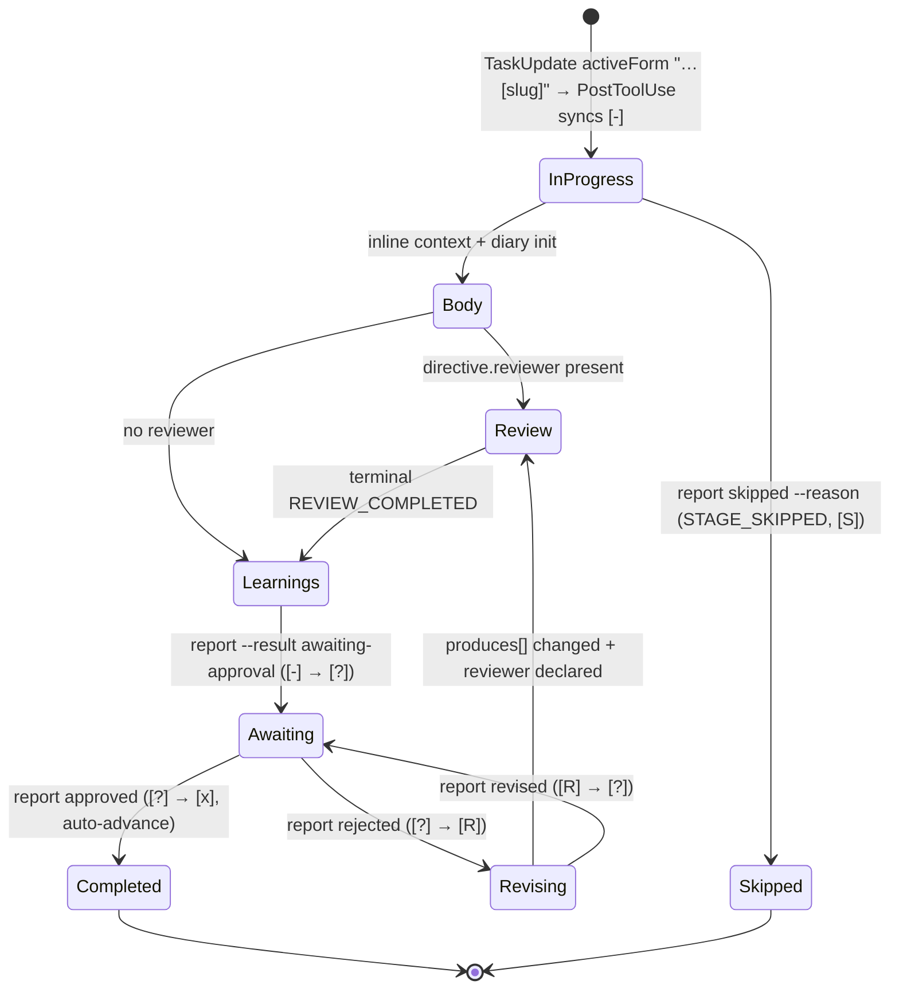

> 抽出元: upstream as-built 仕様 (awslabs/aidlc-workflows v2 @ 3c3146cf, v2.6.40)。2026-08-22 の 3 エージェント精密抽出。10-orchestration.md と engine_loop.qnt の執筆材料。

必要な節をすべて読了しました (02 全文、03 §5.4/§5.7/§6.4、04 §4.1–§4.4/§5.5/§11.2、07 L238)。以下が抽出結果です。

---

# タスク 2 抽出結果: `report` ガード連鎖・状態遷移の完全列挙

凡例: 「典拠」列は as-built 仕様のファイル・節・行番号。`(:NNNN)` は upstream コード `core/tools/aidlc-orchestrate.ts` 等の行番号 (仕様に記載のもの)。逐語契約は英語原文のまま。

## 1. `report` の固定 13 段ガード (実行順)

`handleReport` (`aidlc-orchestrate.ts:5464-5927`) は「aidlc-state.ts の遷移サブコマンドに対するディスパッチャであり、遷移ロジックを一切再実装しない」(`:4698-4703`)。全変更は spawn されたサブプロセスで行われ、`spawnState` は `AIDLC_STATE_TRANSITION_OWNER: orchestrate:<pid>` を渡す (`:4879-4887`)。

| 段 | ガード名 | 検査内容 | 失敗時の応答 (逐語) | 典拠 |
|---|---|---|---|---|
| 1 | turn-shape marker + state-version guard | ターンマーカーを touch (`:5470`)。次に `classifyStateVersion` を**すべての report 経路**に適用 (`:5476-5488`)。判定は `ok / unparseable / past / future` (`aidlc-lib.ts:10627`、`CURRENT_STATE_VERSION = "8"`) | 判定結果を `error` として中継。`unparseable` は archive (`mv aidlc aidlc.archive`) を案内 | 02 §7.2 (L280); 03 §5.5 (L555-566) |
| 2 | `--single` 分岐 | `--single` 付きなら `handleSingleReport` へ。**最優先で解決**するのは「single-stage のコミットが state 変更サブコマンドへ落ちることを構造的に不可能にする」ため (`:5490-5499`) | `--stage` 欠落時: `report --single must not advance the main workflow. Pass --stage <slug> to commit the single stage's synthetic-id pair; --single never writes the main workflow's Current Stage.` | 02 §7.2 (L281), §9 (L357-364) |
| 3 | `--skeleton-stance` 分岐 | classify round-trip。stance report は verdict を持たないため `--result` 必須化より**前**に解決 (`:5501-5513`)。`handleSkeletonStanceReport` (`:4943-5008`) は値検証 + state ファイル必須 + `Current Stage` がスコープの skeleton-gate stage であることを要求 | 不一致時: `Current stage "<slug>" is not the skeleton-gate stage for scope "<scope>" — a skeleton stance is only reported for the first Construction Bolt's gate.` / 成功時 print: `Recorded walking-skeleton stance "<stance>" for "<slug>". Re-run \`next\` to continue — the gate is now determined.` | 02 §7.2 (L282), §6 (L256) |
| 4 | `resume`/`resumed` 分岐 | `handleResumeReport` (`:5383-5457`) へルーティング (`:5517-5520`)。§8 参照 | `--stage` 付き: `A resume-choice report is not a stage transition; omit --stage.` | 02 §7.2 (L283), §7.4 (L317) |
| 5 | `--result` 必須 + 既知値 | `REPORT_RESULTS` に含まれるか (`:5522-5543`) | 欠落時 (逐語・実測): `report requires --result <outcome>. Accepted: approved, completed, complete, done, awaiting-approval, rejected, revised, resume, resumed, skipped (the verdict for the stage just acted on).` / 未知値: `Unknown --result "<v>". accepted outcomes: <list>.` | 02 §7.1 (L268-276), §7.2 (L284), 測定表 L524 |
| 6 | state ファイル存在 | `aidlc-state.md` 読取り (`:5545-5554`) | `No active intent workflow state found (aidlc-state.md is absent) — nothing to report a transition for.` | 02 §7.2 (L285) |
| 7 | `Current Stage` 存在 + 対象 stage 決定 | 作用対象は `--stage` 指定時はその値、なければ `Current Stage`。明示ピンは「conductor が既に Current Stage を動かした stale pointer gap を塞ぐ」(`:5556-5570`) | — | 02 §7.2 (L286) |
| 8 | `Scope` 存在 + graph ノード存在 + checkbox 行存在 | (`:5572-5599`) | ノード欠落: `Internal: reported stage "<slug>" is not in the compiled graph — cannot commit its transition.` / checkbox 行欠落: `Stage "<slug>" is not present in the state file — cannot commit its transition.` | 02 §7.2 (L287) |
| 9 | `skipped` アーム | §5 参照。**全 completion ガードより先**に判定 (`:5601-5667`) | §5 の逐語 | 02 §7.2 (L288), §7.4 (L315) |
| 10 | gate 判定 + gate-lifecycle アーム | `isGated = node.phase !== "initialization"` (`:5669`)。`awaiting-approval`/`rejected`/`revised` は completion ガードより先に処理 (`:5674-5751`)。§3 参照 | §3 の逐語 | 02 §7.2 (L289), §7.3 (L309) |
| 11 | completion-evidence guard | `checkStageCompletionEvidence` (`:5128-5230`)。checkbox が `completed` でない stage に対し: pipeline link receipts / per-unit coverage / paused-unit 拒否 / ensemble contribution evidence | (詳細メッセージは仕様に逐語なし) | 02 §7.2 (L290) |
| 12 | practices-discovery promotion receipt | `practices-discovery` への `--result approved` は `hasFreshPracticesAffirmationReceipt` — 有効な `Practices Affirmed Timestamp` **かつ** 最新の `STAGE_STARTED`/`GATE_REJECTED`/`STAGE_REVISING` floor イベントより後の `PRACTICES_AFFIRMED` 行 — がなければ拒否 (`:4761-4790`、拒否文 `:5779-5783`)。rejection は先行 promotion receipt を無効化する | (拒否文は仕様に逐語未収載) | 02 §7.2 (L291); 08 L334 |
| 13 | human-presence guard (engine 側) | gated かつ未 completed の stage で、autonomy が `autonomous` でなく、`AIDLC_SKIP_HUMAN_PRESENCE_GUARD !== "1"` のとき、空の `--user-input` を拒否 (`:5786-5797`) | `report --result <r> for "<slug>" requires --user-input with the human's exact approval choice.` | 02 §7.2 (L292) |

段 13 通過後: finality 判定 (`nextInScopeStage(slug, scope, stateContent) === null`, `:5801`) → §3 のディスパッチ (`:5810-5891`)。

**後処理の逐語** (02 §7.3 L311):
- spawn 先の非ゼロ exit: `Transition rejected by aidlc-state.ts  for "<slug>": <stderr or stdout>` (`:5896-5906`)
- 成功: `done` — `Committed <subs joined by " + "> for "<slug>" (scope: <scope>). State advanced; run next to continue.` (`:5921-5926`)

## 2. 受理 verdict 10 語と正規化

`REPORT_RESULTS = FORWARD_RESULTS ∪ GATE_RESULTS ∪ RESUME_RESULTS ∪ {"skipped"}` (`:4736-4745`; 02 §7.1 L268)。

| # | verdict | 分類 | 正規化 (同義語) | 典拠 |
|---|---|---|---|---|
| 1 | `approved` | FORWARD | `approved`/`completed`/`complete`/`done` は**相互交換可能な同義語**。「The engine — not the caller — picks the committing subcommand from gate status + finality」(`:4730-4735`) | 02 §7.1 (L276) |
| 2 | `completed` | FORWARD | 同上 | 同上 |
| 3 | `complete` | FORWARD | 同上 | 同上 |
| 4 | `done` | FORWARD | 同上 | 同上 |
| 5 | `awaiting-approval` | GATE | — | 02 §7.1, §7.3 |
| 6 | `rejected` | GATE | — | 同上 |
| 7 | `revised` | GATE | — | 同上 |
| 8 | `resume` | RESUME | `resume`/`resumed` 同義 | 02 §7.2 (L283) |
| 9 | `resumed` | RESUME | 同上 | 同上 |
| 10 | `skipped` | routed lifecycle outcome (completion ではない) | — | 02 §7.4 (L315) |

## 3. verdict → aidlc-state.ts サブコマンド選択規則

### 3.1 gate-lifecycle アーム (completion ガードより先、`:5674-5751`; 02 §7.3 L309)

| verdict | 前提 checkbox | 追加要件 | dispatch | 応答 |
|---|---|---|---|---|
| `awaiting-approval` | `in-progress` | — (逐語: `only an in-progress stage can open a gate`) | `gate-start <slug>` | print `Recorded <result> for "<slug>".` |
| `rejected` | `in-progress` \| `awaiting-approval` | 非空 feedback | `reject --feedback` | 同上 |
| `revised` | `revising` (逐語: `only a revising stage can re-enter its gate`) | — | `revise` | 同上 |

### 3.2 forward verdict のディスパッチ表 (02 §7.3 L296-308 の表そのまま)

finality = `nextInScopeStage(slug, scope, stateContent) === null` (`:5801`)。gated = `node.phase !== "initialization"` (`:5669`)。

| checkbox 状態 | gated? | final? | シーケンス |
|---|---|---|---|
| `skipped` / `revising` | — | — | 拒否: `Stage "<slug>" is <state>; report commits forward completions only.` |
| `pending` | — | — | 拒否: `Stage "<slug>" is still pending. Run the stage before reporting it complete.` |
| `completed` | — | yes | `complete-workflow <slug>` (`Status` が既に `Completed` なら no-op を説明する `done`) |
| `completed` | — | no | `advance <slug>` — ただし workflow が既に先へ進んでいれば **stale re-report guard → 冪等 `done`** (`:5842-5859`) |
| `in-progress` | yes | — | 明示 `--stage` 必須 (なければ拒否; flowchart 上の文言 "error: report the acted directive explicitly")。その後 `gate-start <slug> --recovered` + `approve <slug>` |
| `awaiting-approval` | yes | — | `approve <slug>` (approve は advance/complete-workflow へ**自己委譲**する。engine が重ねて advance を呼んではならない — `:4716-4723`) |
| any | no | yes | `complete-workflow <slug>` |
| any | no | no | `advance <slug>` |

- `--single` → `aidlc-audit.ts append-batch` のみ (`advance`/`approve`/`complete-workflow` は**構造的に呼べない**)。synthetic id `single-stage:<slug>`。終端 `done`: `Single-stage run of "<slug>" committed under synthetic workflow "<wf>". The main workflow's Current Stage is untouched.` (02 §9 L364)
- `--skeleton-stance` → `aidlc-state.ts set-skeleton-stance` (02 §6 L256)
- `skipped` → `aidlc-state.ts skip <slug> --reason <r> --route` (02 §7.4 L315)
- `resume`/`resumed` → state サブコマンドなし (ルーティングのみ、§8)

**stale re-report guard (冪等 done) の条件**: checkbox が `completed`、非 final、かつカーソルが既に当該 stage を通過している (workflow moved on) → 変更を一切コミットせず冪等 `done` (`:5842-5859`; 02 §7.3 表 + §11 recovery seam 3、L417)。final かつ `Status: Completed` 済みの場合も no-op 説明の `done`。

## 4. human-presence guard の判定規則

2 層構造:

| 層 | 検査 | 典拠 |
|---|---|---|
| engine 側 (段 13) | gated + 未 completed + autonomy ≠ `autonomous` + `AIDLC_SKIP_HUMAN_PRESENCE_GUARD !== "1"` のとき空 `--user-input` を拒否 (逐語は §1 段 13) | 02 §7.2 (L292) |
| state 側 (`handleApprove`/`handleAnswer`) | 「最後の gate resolution 以降に `HUMAN_TURN` が記録されていない限り拒否 — autopilot 下のモデルが人間の行動なしに承認を捏造できないように」(`aidlc-record-human-turn.ts:4-7` の引用)。判定関数は `humanActedSinceGate` (`aidlc-lib.ts:3774`)、無効化は `humanPresenceGuardDisabled` (`aidlc-lib.ts:6542-6543`, env `AIDLC_SKIP_HUMAN_PRESENCE_GUARD=1`) | 07 L238; 03 L112; 02 §6 (L258) |

**同秒 fail-closed** (03 §6.4 L737-748): audit 行には順序番号がなく `isoTimestamp()` は秒精度。`humanActedSinceGate` は共有リーダーを使わず `auditShards(projectDir)` で自らシャードを列挙し (`:3780`)、`readAppendOnlyFileNoFollowOrThrow` (`:3786`) で読み、`{ ts, shard, pos, human }` レコードを自前構築 (`:3811-3816`)。最新 `HUMAN_TURN` 候補が**別シャード**の最新 gate resolution と同一秒を共有する場合、「execution order is unknowable and the check fails CLOSED (require a fresh turn) rather than let shard-filename order pick a winner」(`aidlc-lib.ts:3752-3754`)。判定述語 (`:3838-3853`): 最新 turn が勝つのは**すべての** latest resolution が `resolution.shard === human.shard && resolution.pos < human.pos` を満たすときのみ。

補足: `HUMAN_TURN` は「chronological presence evidence, not authenticated decision content」(03 §6.6 L836-839)。`aidlc-bolt set-autonomy` の autonomous への**昇格**も同じ `humanActedSinceGate` を要求、`gated` への降格は presence 不要 (09 L279)。

## 5. `skipped` 受理条件 (02 §7.4 L315, `:5601-5667`)

「a routed lifecycle outcome, not a completion」。全 completion ガードより先に判定。受理には以下**すべて**が必要 (仕様は 5 項目を列挙; うちタスク文の「3 条件」に相当する核は a–c):

| # | 条件 |
|---|---|
| a | 明示・非空の `--stage` |
| b | `CONDITIONAL` ノード **または** effective plan action が `SKIP` |
| c | 非空の `--reason` |
| d | `Current Stage` との厳密一致。違反時逐語: `Cannot skip stage "<slug>": Current Stage is "<current>". A skip report must name the active stage exactly.` |
| e | checkbox ∈ {`in-progress`, `revising`, `skipped`} |

dispatch: `aidlc-state.ts skip <slug> --reason <r> --route`。engine は「`[S]` を保存し、`STAGE_SKIPPED` を 1 件 emit し、`STAGE_COMPLETED` を emit せずに次の in-scope stage を開始 (または workflow を完了) する。single-stage run はこの routing outcome を使えない」(04 §4.4 L274)。skipped stage は進捗カウントから除外され「never rewritten as completed」(04 L272)。

## 6. ゲート付き stage の承認前提条件 (`aidlc-state.ts handleApprove` 側の強制)

配置理由: 「a report-only guard is bypassable」(02 §6 L258, `:5878-5883`)。engine 所有の 11 遷移サブコマンド (`set, checkbox, advance, finalize, complete-workflow, gate-start, approve, reject, revise, skip, park`) は直接呼出しを拒否し、`AIDLC_STATE_TRANSITION_OWNER === orchestrate:${process.ppid}` を要求 (03 §5.7 L582-594; 拒否文逐語: `Direct aidlc-state.ts  is blocked: workflow lifecycle transitions are engine-owned. Use aidlc-orchestrate.ts report --stage <slug> --result <awaiting-approval|approved|rejected|revised|completed|skipped>; use aidlc-orchestrate.ts park to park, and next/jump for routing changes.`)。

completion ハンドラ 4 種すべてが実装する前提条件 (03 §5.7 L601-617 の `advance` ガードスタックが代表):

| # | 前提 | 内容 | 典拠 |
|---|---|---|---|
| 1 | Scope 妥当 | `Scope` 存在 + `validScopes()` 内 — 「Refusing to advance」であり silent fallback しない (`aidlc-state.ts:2096-2106`) | 03 §5.7 |
| 2 | カーソル一致 | completed slug = `Current Stage` **or** 既に `[x]` (`:2117-2131`) | 03 §5.7 |
| 3 | next slug 非 SKIP | 呼出側指定の next slug は state suffix / scope mapping いずれでも `SKIP` であってはならない (`:2142-2150`) | 03 §5.7 |
| 4 | 冪等 replay guard | 遷移が既に完全適用済みなら clean exit (`:2174-2196`) | 03 §5.7 |
| 5 | `verifyReviewerPrecondition` (`aidlc-state.ts:1775`) | reviewer 宣言 stage は terminal `REVIEW_COMPLETED` receipt 必須。floor 付きスキャン: 最新 `STAGE_STARTED`・それ以降の `GATE_REJECTED`・最新の関連 `produces[]` write より後の行のみ有効; 行は Stage **と** Reviewer の両方に一致 (「self-certifying must not satisfy it」); `for_each: unit-of-work` では**全 unit**に個別 receipt (`:1763-1771`)。「hard on the review having happened and soft on its verdict」 | 04 §5.5 (L354-363) |
| 6 | `verifyStageArtifacts` / `verifySummaryConfirmationPrecondition` (`:1732-1751`) / `verifyPipelineLinkPrecondition` (`:2210-2214`) | stage が既に completed の場合はスキップ | 03 §5.7 (L612-613) |
| 7 | human presence | §4 の `humanActedSinceGate` (approve 側) | 07 L238 |
| 8 | Practices Affirmed Timestamp | approve gate が要求するタイムスタンプ (欠落行は `setOrInsertField` で修復可能に設計、さもなければ「approve gate … would then refuse forever」) | 03 L527-533; 08 L327, L334 |

`verifyReviewerPrecondition` の拒否文 (契約、04 §5.5 L356-359 逐語):
- receipt なし: `Refusing to complete "<slug>": it declares a reviewer (<reviewer>) but no fresh REVIEW_COMPLETED is recorded for it.` (続き: "Terminal ordering: apply any fixes FIRST, then run the reviewer, record the receipt, and stop editing produces[] artifacts")
- receipt 無効化: `Refusing to complete "<slug>": its terminal review receipt from <reviewer> was invalidated by a later write to a declared produces[] artifact.`
- recovery 消費済み: `...its stale-receipt recovery review from <reviewer> was invalidated by another later write... Only a human Request Changes decision resets the review attempt; do not record it on the human's behalf.`
- `workspace_requires` stage の fingerprint 不一致: `...the workspace source no longer matches the state of the most recent recorded review (source-fingerprint mismatch)`

不変条件: 全 read-modify-write は `withAuditLock` 内、**audit-first** — audit 行 emit が lock 内で先、state write が後、audit エラー throw で state write は行われない (03 §5.7 L596-599)。

## 7. CheckboxState 6 状態の遷移図

マーカー定義 (`parseCheckboxes`, `aidlc-lib.ts:6678`, regex `/^- \[([ xSR?-])\] (\S+)\s*—\s*(.*)$/gm`、区切りは **em dash**; 03 §5.4 L535-547):

| マーカー | `CheckboxState` |
|---|---|
| `[ ]` | `pending` |
| `[-]` | `in-progress` |
| `[?]` | `awaiting-approval` |
| `[R]` | `revising` |
| `[x]` | `completed` |
| `[S]` | `skipped` |

`setCheckbox` (`:6713`) はマーカーのみ、`setStageSuffix` (`:6733`) は `EXECUTE`/`SKIP` サフィックスのみを書換え — 「the two edit disjoint fields of the same line, so recompose and jump compose cleanly」(03 L549-553)。

遷移の完全表 (動詞 → マーカー移動 → audit イベント):

| 動詞 / 契機 | マーカー移動 | audit イベント | 典拠 |
|---|---|---|---|
| TaskUpdate `activeForm "…[slug]"` → PostToolUse hook 同期 | `[ ]` → `[-]` | (state 同期) | 04 §4.4 (L270), 図 L585 |
| `gate-start` (report `awaiting-approval`) | `[-]` → `[?]` | `STAGE_AWAITING_APPROVAL` | 04 §4.2 (L237), 図 L590 |
| `gate-start --recovered` (in-progress gated + 明示 `--stage` の backfill) | `[-]` → `[?]` (直後に approve) | 同上 + recovered マーク (「audit consumers can tell the engine-opened gate from an organic gate-start」) | 02 §11 (L416) |
| `approve` (report `approved` 同義語群) | `[?]` → `[x]` | `GATE_APPROVED` + `STAGE_COMPLETED`; advance/complete-workflow に自己委譲して auto-advance | 04 §4.2 (L239), 図 L591 |
| `reject --feedback` (report `rejected`) | `[?]` → `[R]` | `GATE_REJECTED` + `STAGE_REVISING`; `Revision Count` インクリメント | 04 §4.2 (L239), 図 L592 |
| `revise` (report `revised`) | `[R]` → `[?]` | 新規 `STAGE_AWAITING_APPROVAL`。produces[] を変更した revision で reviewer 宣言があれば `revised` 報告前に §12a reviewer を再実行 (§13 learnings ritual は再実行しない) | 04 §4.2 (L239), 図 L593-594 |
| `advance` (非 gated / approve からの委譲) | 当該 stage → `[x]`、次 in-scope stage → `[-]` | `STAGE_COMPLETED` (+ phase 境界で `PHASE_COMPLETED`/`PHASE_VERIFIED`/`PHASE_STARTED` トリオ) + `STAGE_STARTED` | 03 §5.7 (L615-617) |
| `complete-workflow` (final) | 当該 stage → `[x]`、`Status: Completed` | (`WORKFLOW_COMPLETED` は MANDATORY 8 イベントの一つ; 03 §6.5 L797-799) | 02 §7.3 |
| `skip --reason --route` (report `skipped`) | → `[S]` (受理元は `[-]`/`[R]`/`[S]`) | `STAGE_SKIPPED` 1 件のみ; `STAGE_COMPLETED` は emit しない; 次 in-scope stage 開始 or workflow 完了 | 02 §7.4; 04 §4.4 (L274), 図 L595 |
| `aidlc-jump.ts execute --direction forward` | 介在する in-flight stage → `[S]` (現 stage も in-flight かつ非 pending なら `[S]`) | skip された stage ごとに `STAGE_SKIPPED`; 全 jump 共通で `STAGE_JUMPED` + ターゲット `STAGE_STARTED` | 02 §8 (L331-339) |
| `execute --direction backward` | ターゲット + 下流の全 EXECUTE stage で `completed/in-progress/awaiting-approval/revising/skipped` → `[ ]` | `STAGE_JUMPED` + `STAGE_STARTED` (境界越えで phase トリオ) | 同上 |
| `execute --direction redo` | ターゲット → `[ ]` | 同上 |
| (全 jump 共通、最後に) | ターゲット → `[-]` | audit emit は `writeStateFile` より**前**、emit 失敗は write を abort | 02 §8 (L339) |

Mermaid 遷移図 (04 §11.2 L583-598 の原文を再掲):

## 8. `resume`/`resumed` のルーティング (参考、段 4 の中身)

`handleResumeReport` (`:5383-5457`; 02 §7.4 L317): `--user-input` 必須、数字メニューキー 1–4 を正規化し、**mutate せず route する**:

| 選択 | ルート |
|---|---|
| redo | `aidlc-jump.ts execute --direction redo` |
| jump | どの stage か ask → `next --stage <slug>` |
| start fresh | `next --new-intent --scope <s> "<desc>"` |
| resume | `next` を再実行 |

非該当回答は 4 択を列挙する `error`。

## 9. Quint モデル化に効く要点 (抽出者注)

- ガード連鎖は**全順序**であり、段 2 (`--single`)・段 3 (`--skeleton-stance`)・段 4 (`resume`) は verdict 検査 (段 5) より前に短絡する。
- gate-lifecycle 3 verdict は checkbox 前提が厳密 (`awaiting-approval`←`in-progress`、`rejected`←`in-progress|awaiting-approval`、`revised`←`revising`) で、違反は状態不変の `error`。
- forward verdict の遷移関数は (checkbox, gated, final, moved-on, explicit-stage) の 5 引数で決定的。`skipped`/`revising`/`pending` は吸収的拒否、`completed`+moved-on は冪等 no-op。
- 同秒 fail-closed は「同一シャードかつ pos 比較で厳密に後」のみ presence を認める安全側述語としてモデル化できる。
- `--single` は `advance/approve/complete-workflow` への到達不能性 (mechanically incapable) が不変条件。

典拠ファイル (絶対パス):
- /Users/j5ik2o/orca/workspaces/amadeus-ng/docs/docs/upstream/specs/02-orchestration-engine.md (§3.1, §6, §7.1–7.4, §9, §11, §13, 測定表)
- /Users/j5ik2o/orca/workspaces/amadeus-ng/docs/docs/upstream/specs/03-state-audit-runtime.md (§5.4, §5.5, §5.7, §6.4, §6.6, L112)
- /Users/j5ik2o/orca/workspaces/amadeus-ng/docs/docs/upstream/specs/04-stage-protocol.md (§4.1, §4.2, §4.4, §5.5, §11.2)
- /Users/j5ik2o/orca/workspaces/amadeus-ng/docs/docs/upstream/specs/07-hooks.md (L238)
- /Users/j5ik2o/orca/workspaces/amadeus-ng/docs/docs/upstream/specs/08-memory-rules-learnings.md (L327, L334)
- /Users/j5ik2o/orca/workspaces/amadeus-ng/docs/docs/upstream/specs/09-cli-tools.md (L279)