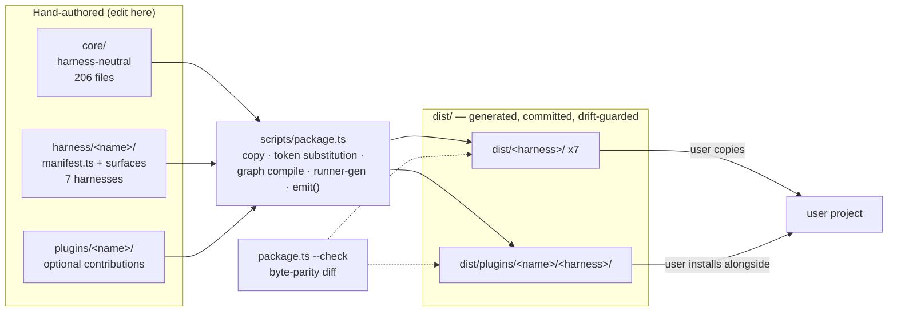

# リポジトリ概要と正本(Source-of-Truth)モデル

> **Source**: [awslabs/aidlc-workflows](https://github.com/awslabs/aidlc-workflows/tree/3c3146cfd7cef33020d48e8d48d4e80d0f8c2820) — branch `v2`, commit `3c3146cf` (v2.6.40, retrieved 2026-08-21)
> **Status**: 実装から導出された as-built 仕様である。上流コードが本文書に対して優先する。
> **正本**: 英語版 `00-overview.md`(この日本語版は参照訳。両者が食い違う場合は英語版が優先)

---

## 1. Purpose(目的)

AI-DLC Workflows は、リポジトリ自身の説明によれば「**AI-DLC メソドロジー**(AI-Driven Development Life Cycle)のネイティブ実装であり、**1つの正本から多数のハーネス上で動作する**」(`README.md:10`)。メソドロジーと本リポジトリの区別は次のように明示されている。

> "**AI-DLC is a methodology** — a structured, gated approach to AI-driven software development, defined by AWS … **This repository is its native, multi-harness implementation** — the methodology rendered as skills, agents, hooks, and tools from one harness-neutral `core/`" (`README.md:52`).

2.0 系列は General Availability(GA)であると宣言されており(`README.md:3-5`)、tree 内に同梱された *AI-DLC Workflows 2.0 Specification* ホワイトペーパー(`assets/AI-DLC-Workflows-2.0-Specification.pdf`、`README.md:25`, `README.md:465`)の実装として位置づけられている。

具体的には、出荷される成果物は**稼働可能なサービスではない**。それは *生成された CLI ハーネス配布物* の集合 — Markdown 形式の skills/stages/agents/rules に加え TypeScript 製 CLI ツールと hooks — であり、ユーザーが自分のプロジェクトへコピーし、それをホスト CLI(Claude Code、Kiro、Codex、Cursor、opencode、GitHub Copilot)が読み込む。`package.json:11` はこの境界を逐語的に述べている。

> `"Dev-only tooling for the multi-harness AI-DLC framework. Generated distributions live under dist/<harness>/ and run via bun without requiring this private package."`

ユーザーが得る機能面 — 5 フェーズ、33 ステージ、14 エージェント編成、11 スコープ、3 深度レベル、3 テスト戦略レベル、承認ゲート、監査証跡、学習ループ — は `README.md:38-48` に列挙されている。これらの各主題は姉妹仕様書がそれぞれ所有する。§9(読み方ガイド)を参照。

### 1.1 本文書が扱う範囲

本仕様書はリポジトリの形状、core→dist の正本モデル、バージョニング/リリース規律、開発者向けツーリング面を扱う。ステージのセマンティクス、エンジン内部、hook の挙動、ハーネス固有のレイアウトについては、1行の役割説明を超えて意図的に記述**しない** — それらは §9 に列挙する姉妹仕様書が担う。

---

## 2. Identity, license, provenance(素性・ライセンス・出自)

| Property | Value | Evidence |
| --- | --- | --- |
| Upstream | `https://github.com/awslabs/aidlc-workflows` | `package.json:16` |
| Branch analyzed | `v2`(CI がゲートするブランチ。`ci.yml` は `v2` を対象とする PR で実行される) | `.github/workflows/ci.yml:16-18` |
| Commit | `3c3146cfd7cef33020d48e8d48d4e80d0f8c2820` | `git log -1`(§10 参照) |
| Framework version | `2.6.40` | `core/tools/aidlc-version.ts:4` |
| License | **MIT-0**("MIT No Attribution")、Copyright Amazon.com, Inc. or its affiliates | `LICENSE:1-3`, `package.json:13` |
| Dev package name | `aidlc-workflows-dev`, `private: true`, `version: "0.0.0"` | `package.json:2-5` |
| Documentation site | `https://awslabs.github.io/aidlc-workflows/` | `zensical.toml:3` |
| Code of Conduct | Amazon Open Source Code of Conduct(参照による採用) | `CODE_OF_CONDUCT.md:3` |

意図的なバージョンの分離に注意する。`package.json` の npm 形式の `version` は、このパッケージが private な開発ツーリングであるため `0.0.0` に固定されている。**フレームワーク**バージョンは別の手書き TypeScript 定数(§6)として存在する。

---

## 3. Repository layout(リポジトリ構成)

リポジトリルート直下には 29 個のエントリが追跡されている(§10、M1)。tree 全体では 3,183 個の追跡ファイルがあり、そのうち 2,089 個(約 66%)は生成された `dist/` tree である(§10、M2–M3)。

| Path | Kind | Role | Evidence |
| --- | --- | --- | --- |
| `core/` | source (authored) | ハーネス中立な唯一の正本: tools、stage protocol + stages、agents、memory(rules/method)、scopes、sensors、knowledge、hooks、session skills、onboarding template。10 サブディレクトリ、206 追跡ファイル。 | `AGENTS.md:10`; §10 M4, M13 |
| `harness/` | source (authored) | 7 つの薄い per-CLI 表層(`claude`, `codex`, `copilot`, `cursor`, `kiro`, `kiro-ide`, `opencode`)。それぞれが `core/` をそのハーネスの tree へ投影する方法を記述する `manifest.ts` を持ち、加えて orchestrator skill、settings、任意の `emit.ts` を持つ。119 追跡ファイル。 | `AGENTS.md:11`; §10 M5, M12 |
| `plugins/` | source (authored) | 任意の一次(first-party)AIDLC プラグイン。参照 fixture として `plugins/test-pro/` を1つ出荷しており、`.aidlc-plugin/plugin.json` に加え core 形状のサブツリー(`stages/`, `contributions/`, `agents/`, `scopes/`, `knowledge/`, `sensors/`, `tools/`, `tests/`)を持つ。16 追跡ファイル。 | `AGENTS.md:12`; `plugins/test-pro/.aidlc-plugin/plugin.json:1-18`; §10 M6 |
| `scripts/` | source (authored) | Build と CI のエントリポイント: `package.ts`(ビルド本体)、`manifest-types.ts`(manifest 契約)、`onboarding.ts`、`agent-knowledge.ts`、`build-binaries.ts`、`ci-changelog-guard.ts`、`docs-rewrite-links.ts`、`plugin-hooks-template/`。9 追跡ファイル。 | `AGENTS.md:13`; §10 M6 |
| `dist/` | **generated + committed** | 各ハーネスにつき1本の tree に加え `dist/plugins/`。ユーザーがコピーする対象。バイト一致がドリフトガードで保証される。2,089 追跡ファイル。 | `AGENTS.md:14`; §10 M3 |
| `tests/` | source (authored) | 全て TypeScript のスイート(`*.test.ts`)で 4 階層(`smoke/`, `unit/`, `integration/`, `e2e/`)から成り、加えて `harness/` ヘルパーライブラリ、`hooks/`、`fixtures/`、`lib/`、ランナーである `run-tests.ts` / `run-tests.sh` を持つ。621 追跡ファイル。 | `AGENTS.md:15`; §10 M6, M14 |
| `docs/` | documentation | 読者を絞った 3 つのガイド — `guide/`(User Guide)、`harness-engineering/`(Harness Engineer Guide)、`reference/`(Developer Reference) — に加えて `rfcs/` と `roadmap.md`。100 追跡ファイル。 | `docs/README.md:18-22`; §10 M6 |
| `assets/` | binary asset | `AI-DLC-Workflows-2.0-Specification.pdf` — 本実装が具現化しているホワイトペーパー。1 追跡ファイル。 | `README.md:25`; §10 M6 |
| `.github/` | CI | 2 つの workflow: `ci.yml`(契約チェック + テスト階層 + changelog ガード)と `docs.yml`(zensical build + GitHub Pages deploy)。 | `.github/workflows/ci.yml:1`, `.github/workflows/docs.yml:1` |
| `README.md` | doc | ユーザー向けのエントリポイント: アナウンス、機能一覧、ハーネスごとのインストール表、リポジトリ構成、build/test コマンド。 | `README.md:1-465` |
| `AGENTS.md` | agent instructions | 正本となる機械向け contributor brief: プロジェクト構造、「`core/` を編集し `dist/` は編集しない」の原則、ドキュメンテーションポリシー、changelog ポリシー。 | `AGENTS.md:1-60` |
| `CLAUDE.md` | agent instructions | 全内容が `@AGENTS.md` の1行だけのファイル — Claude Code の memory file は単にハーネス中立な brief を import しているだけであり、authored なコピーは1つしか存在しない。 | `CLAUDE.md:1` |
| `CONTRIBUTING.md` | governance | プロジェクト全体の規約(issue/PR フロー、セキュリティ報告、ライセンシング)を記載し、実務的なループについては `docs/reference/11-contributing.md` へ委譲している。 | `CONTRIBUTING.md:9` |
| `CODE_OF_CONDUCT.md` | governance | Amazon Open Source Code of Conduct を参照によって採用している。 | `CODE_OF_CONDUCT.md:3` |
| `CHANGELOG.md` | release record | 193 件の日付付きバージョンエントリ、新しい順。 | §10 M7 |
| `LICENSE` | legal | MIT-0。 | `LICENSE:1` |
| `package.json` | tooling config | Dev 専用パッケージ: 3 つのスクリプト(`typecheck`, `lint`, `check`)と devDependencies。 | `package.json:6-26` |
| `bun.lock` | lockfile | `bun install --frozen-lockfile` 用に JS/TS ツールチェーンを固定する。 | `.github/workflows/ci.yml:48` |
| `tsconfig.json` / `tsconfig.tests.json` / `tsconfig.adapters.json` | tooling config | 3 つの型検査プロジェクト(§7.2)。 | `package.json:7` |
| `biome.json` | tooling config | Linter 専用の Biome 設定(formatter は無効)。 | `biome.json:3-6` |
| `knip.json` | tooling config | 未使用 export/依存の解析設定 — **存在するが**、どのスクリプト・CI ステップ・依存関係・文書にも**配線されていない**(§7.5)。 | `knip.json:1-25`; §10 M11 |
| `pyproject.toml` / `uv.lock` | tooling config | zensical でドキュメンテーションサイトをビルドするためだけに使う Python/uv プロジェクト。 | `pyproject.toml:1-8` |
| `zensical.toml` | tooling config | ドキュメントサイト設定: サイト名/URL、完全な `nav` tree、テーマ、markdown 拡張。 | `zensical.toml:1-181` |
| `roadmap.html` | transitional stub | `docs/roadmap.html` への meta-refresh リダイレクト。GitHub Pages がこのブランチをレガシー Jekyll でビルドし続けている間だけ維持されており、コメントには Pages が Actions デプロイへ切り替わったら「削除できる」と書かれている。 | `roadmap.html:9`(`<meta http-equiv="refresh">`); `roadmap.html:2-7`(理由のコメント) |
| `.gitattributes` | repo config | `* text=auto eol=lf` — dist のドリフトガードがバイト一致 diff を行う**ため**、全プラットフォームで LF が固定されている。Windows チェックアウトでの CRLF 書き換えは `dist/` 全体をドリフトとして報告してしまう。 | `.gitattributes:1-8` |
| `.gitignore` | repo config | `node_modules/`, `build/`, `/site/`, `/.venv/`, `tests/logs/`、per-user の Claude 設定、AIDLC ランタイム状態(`/.aidlc/`, `/aidlc/spaces/*/intents/.aidlc-*`)を除外する。 | `.gitignore:1-52` |

### 3.1 命名上の落とし穴: 3つの意味を持つ "harness"

`AGENTS.md:39` は読者が混同しないよう記録すべき命名の衝突を記している。

> "'harness' has three senses in this repo: `harness/` (top-level, the per-CLI distribution surfaces …), `docs/harness-engineering/` (the Harness Engineer Guide), and `tests/harness/` (test-suite helper library) — unrelated."

---

## 4. The source-of-truth model(正本モデル)

### 4.1 Three zones(3つのゾーン)

`README.md:359` はこの不変条件を次のように述べている。「Three zones: what AI-DLC **is**, how each harness **speaks**, and what users **copy**. You only ever edit the first two — `bun scripts/package.ts` regenerates the third.」 `AGENTS.md:36` は同じ規則を指令として与えている。「**Edit `core/` (or `harness/<name>/`), never `dist/`.**」



*Text fallback*: `core/`(ハーネス中立なメソッド + エンジン)と `harness/<name>/`(per-CLI 表層)、加えて任意の `plugins/<name>/` だけが、手で編集される唯一の入力である。`scripts/package.ts` はこれらを `dist/<harness>/` と `dist/plugins/<name>/<harness>/` へ投影し、それらはリポジトリへコミットされ `package.ts --check` によってバイト単位で再検証される。ユーザーは `dist/` の tree を自分のプロジェクトへコピーする。

### 4.2 The build entry and its pipeline(ビルドのエントリポイントとそのパイプライン)

`scripts/package.ts` は「THE build entry for the one-core-N-harnesses layout」である(`scripts/package.ts:2`)。そのヘッダーは、ハーネスごとの 6 段階の順序を文書化している(`scripts/package.ts:9-25`)。

1. **COPY** `core/<src>` → `dist/<name>/<harnessDir>/<dst>`。ハーネストークンを置換し、manifest の rules-dir リネームを適用する。
2. **COPY** `harness/<name>/<src>` を同じ tree へコピーする(orchestrator skill、`CLAUDE.md`/`AGENTS.md`、settings/config)。`.md` に対して同じトークン置換を行う。
3. **COMPILE** stage graph を組み立て済みの tree へコンパイルする — 「emits harness-correct stage-graph.json + scope-grid.json — compiled data lives only in dist」(`scripts/package.ts:17-18`)。
4. **GENERATE** ステージごとの runner を、`aidlc-runner-gen` が `AIDLC_HARNESS_DIR` の下でエクスポートするレンダー関数を通じて組み立て済みの tree へ生成する。
5. **EMIT** manifest が宣言している場合、`harness/<name>/emit.ts` 経由で発行する。
6. **REFRESH** 組み立て済みの orchestrator skill 内の生成テーブル領域を、たった今コンパイルした graph と scope grid から更新する。

Step 6 の領域は、それが編集不可であることを示す逐語的なマーカーで区切られている(`scripts/package.ts:106`, `:111`)。

```text
<!-- BEGIN: compiled stage graph via `bun aidlc-utility.ts stage-table` - do NOT hand-edit -->
<!-- BEGIN: compiled scope grid via `bun aidlc-utility.ts scope-table` - do NOT hand-edit -->
```

### 4.3 The one permitted text transform(唯一許可されているテキスト変換)

`scripts/package.ts:27-31` はこれを「THE TRANSFORM CLASS (T5 — the only permitted text transform): the harness-dir token」と名付けている。`core/` 内の authored な prose は `{{HARNESS_DIR}}`(正規表現 `HARNESS_TOKEN = /\{\{HARNESS_DIR\}\}/g`、`scripts/package.ts:102`)を持ち、packager がこれを manifest の `harnessDir` の値へ置換する。7 つの manifest 全体で観測されたマッピングは以下のとおり。

| Harness | `name` | `harnessDir` | `rulesRename` | Evidence |
| --- | --- | --- | --- | --- |
| Claude Code | `claude` | `.claude` | `null` | `harness/claude/manifest.ts:19-20,76` |
| Kiro CLI | `kiro` | `.kiro` | `steering` | `harness/kiro/manifest.ts:24-25,89` |
| Kiro IDE | `kiro-ide` | `.kiro` | `steering` | `harness/kiro-ide/manifest.ts:27-28,142` |
| Codex CLI | `codex` | `.codex` | `aidlc-rules` | `harness/codex/manifest.ts:22-23,55` |
| Cursor | `cursor` | `.cursor` | `null` | `harness/cursor/manifest.ts:39-40,98` |
| opencode | `opencode` | `.aidlc` | `null` | `harness/opencode/manifest.ts:33-34,72` |
| GitHub Copilot | `copilot` | `.aidlc` | `null` | `harness/copilot/manifest.ts:42-43,73` |

`scripts/manifest-types.ts:4-7` は manifest の思想を述べている。「A manifest is DATA … The only CODE a harness may contribute is an optional `emit()` plugin … structural divergence that no declarative row can express.」

### 4.4 Harness discovery is not hardcoded(ハーネスの発見はハードコードされていない)

`discoverHarnessNames()` は「every `harness/<name>/` that carries a `manifest.ts`」を列挙する。「DISCOVERED, not hardcoded: adding harness #N is one `harness/<n>/` dir + manifest row (+ optional `emit.ts`), with zero edits here — the one-core-many-harnesses promise」(`scripts/package.ts:116-126`)。結果はソートされ、build と `--check` の順序が安定するようになっている。現時点で 7 つの manifest が存在する(§10、M12)。

### 4.5 The drift guard(ドリフトガード)

`--check` は「the freshness-diff idiom … build each tree into a temp dir, diff byte-for-byte against the committed `dist/`, exit 1 with the offending paths on any drift. `dist/` stays committed; this guard fails CI when someone hand-edits a dist or forgets to regenerate」と説明されている(`scripts/package.ts:33-36`)。

比較関数 `diffTrees()` は 3 種類の逐語的な問題クラスを出力する(`scripts/package.ts:362`, `:363`, `:369`)。

- `` `MISSING in dist: ${relPrefix}/${rel}` ``
- `` `DIFFERS: ${relPrefix}/${rel}` ``
- `` `ORPHAN in dist: ${relPrefix}/${rel}` ``

そして CLI は以下のいずれかで終了する(`scripts/package.ts:1293`, `:1297`)。

- `` `\npackage --check FAILED (${problems.length} problem(s)):` `` の後に、最大 40 行の問題行が続き、`process.exit(1)` する。
- または成功時は `"package --check: all harness trees in sync with core/ + harness/."`。

`dist/plugins/` も同じヘルパーによってドリフトガードされる(`scripts/package.ts:1289-1291`)。削除されたプラグインディレクトリに対するトップレベルの orphan スイープは、リポジトリ全体のチェック時にのみ実行され、単一ハーネスのチェック時には実行されない(`scripts/package.ts:1147-1149`)。

このガードが `dist/<name>` と `dist/plugins` を起点とした *tree* diff であることから、2つの帰結が導かれる。

1. 改行コードの正規化はガード全体を失敗させる。まさにこの理由で `.gitattributes:7` は `* text=auto eol=lf` を固定している。その上のコメントはガードと issue #640 を名指ししている(`.gitattributes:1-7`)。
2. `dist/` の root には存在するが、どのガード対象サブツリーにも含まれないファイルはスイープされない。`dist/AI-DLC Workflows 2.0 Specification.pdf` はそのようなファイルである — 追跡されてはいるが(§10、M15)、`scripts/` 内のどのコードパスによっても生成されない(§10、M16)。これは packager の出力ではなく、ホワイトペーパーのコミット済みコピーである。

### 4.6 Build and check commands (verbatim)(ビルド・チェックコマンド、逐語)

`package.json:6-10` より。

```json
"scripts": {
    "typecheck": "tsc --noEmit -p tsconfig.json && tsc --noEmit -p tsconfig.tests.json && tsc --noEmit -p tsconfig.adapters.json",
    "lint": "biome check --error-on-warnings core harness scripts plugins tests",
    "check": "bun scripts/package.ts --check && bun run typecheck && bun run lint"
  }
```

`README.md:416-418` より。

```bash
bun scripts/package.ts            # regenerate every dist/<harness>/ from core/ + harness/
bun scripts/package.ts <name>     # regenerate one harness (e.g. claude, kiro-ide, codex)
bun scripts/package.ts --check    # byte-parity drift guard (run in CI)
```

`CONTRIBUTING.md:22-23` はその部分集合を2行だけ載せている — `<name>` の行は無く、1行目のコメントは `# regenerate every dist/<harness>/` に短縮されている — 一方で `--check` の行は同一である。

```bash
bun scripts/package.ts            # regenerate every dist/<harness>/
bun scripts/package.ts --check    # byte-parity drift guard (run in CI)
```

CI は `Contract checks (parity + typecheck + lint)` という名前のジョブの中で正確に `bun run check` を呼び出す(`.github/workflows/ci.yml:38`, `:53-54`)。したがってドリフトガードは最初にブロックするゲートである。

リリースバイナリはガード後の別ステップである。`bun scripts/build-binaries.ts`(マトリクス用には `--all-targets`)が、gitignore された `build/binaries/<target>/` へ出力し、そこに dispatch しうる生成済み配布物ごとの `runtime/<harness>/` コピーを含む(`README.md:421-430`, `.gitignore:16`)。

### 4.7 Pack-time tier cap(パック時 tier キャップ)

出力を調整する build ノブが1つある。`AIDLC_TIER_CAP`(呼び出しごとの環境変数)は、`core/memory/` の階層化されたメソッドファイル上の永続的な `tier_cap:` frontmatter キーより優先される(`scripts/package.ts:69-86`)。`--check` の下では環境変数は意図的に無視され、逐語的な診断メッセージが出される。

> `"[tier] AIDLC_TIER_CAP is set but IGNORED under --check (the env cap is a one-shot write knob; persistent caps live in core/memory)"` (`scripts/package.ts:96-97`)

この理由は `scripts/package.ts:73-78` に述べられている。ガードはコミット済みの dist が正当に何からビルドされたかと比較しなければならない。したがって CI runner 上の紛れ込んだ環境変数が、ドリフトを失敗させることも隠すこともあってはならない。出荷される `core/memory/` のファイルには `tier_cap:` キーは存在しないため(§10、M17)、既定のキャップは null である。tier のセマンティクス自体は `core/tools/aidlc-tiers.ts` にあり、本文書の対象範囲外である。

### 4.8 What "one core" actually means, measured(「1つの core」の実測上の意味)

「the deterministic engine … is byte-identical across every harness; only the shell differs」(`README.md:66`)という主張は直接検証可能である。`aidlc-orchestrate.ts` は Claude、Kiro、Codex、Copilot の各 tree で同一の MD5 を持つ一方、コンパイル済みの `tools/data/stage-graph.json` は Claude と Kiro で異なる(§10、M18) — これは `scripts/package.ts:17-18` の「コンパイル済み graph データはハーネスごとに発行され dist にのみ存在する」という記述と整合する。

---

## 5. The eight `dist/` targets(8つの `dist/` ターゲット)

`dist/` は 8 個の生成されたターゲット — 7 個のハーネス tree と 1 個の plugin 投影 root — に加え、§4.5 で述べたコミット済みの PDF を含む。各レイアウトの詳細は **10-distribution-harnesses.md** に属する。1行の役割と実測サイズは以下のとおり。

| Target | Ships | Role | Tracked files | Evidence |
| --- | --- | --- | --- | --- |
| `dist/claude/` | `.claude/` + `aidlc/` + `.mcp.json` + `.gitignore` | Claude Code 配布物。`/aidlc` で呼び出す。 | 262 | `README.md:60`; §10 M8, M19 |
| `dist/codex/` | `.codex/` + `.agents/` + `aidlc/` + `AGENTS.md` | Codex CLI(≥ 0.145.0)配布物。`$aidlc` または `/skills` → aidlc。 | 318 | `README.md:61`; §10 M8, M19 |
| `dist/copilot/` | `.aidlc/` + `.github/` + `aidlc/` + `AGENTS.md` | GitHub Copilot 配布物。`.github/` はマージされ、置換されない。 | 274 | `README.md:64`; §10 M8, M19 |
| `dist/cursor/` | `.cursor/` + `aidlc/` + `AGENTS.md` + `install.ts` | Cursor 配布物。同梱スクリプトでインストールされる唯一のターゲット(`bun dist/cursor/install.ts <project>`)。 | 270 | `README.md:62`; §10 M8, M19 |
| `dist/kiro/` | `.kiro/` + `aidlc/` + `AGENTS.md` | Kiro CLI(≥ 2.6)配布物。`chat.defaultAgent` = `aidlc` を持つ `.kiro/settings/cli.json` を出荷する。 | 276 | `README.md:59`, `README.md:167`; §10 M8, M19 |
| `dist/kiro-ide/` | `.kiro/` + `aidlc/` + `AGENTS.md` | Kiro IDE 配布物。hooks を v2 の `.json` 形式とレガシーの `.kiro.hook` 形式の両方に登録する。 | 293 | `README.md:58`, `README.md:138`; §10 M8, M19 |
| `dist/opencode/` | `.aidlc/` + `.opencode/` + `aidlc/` + `opencode.json` + `AGENTS.md` | opencode(≥ 1.17)配布物。 | 275 | `README.md:63`; §10 M8, M19 |
| `dist/plugins/<name>/{claude,codex,copilot,cursor,kiro,kiro-ide,opencode}/` | ハーネスごとに1つの実ホストプラグイン | ハーネス tree と並べてインストールされるプラグイン投影。現時点では `test-pro` のみが、全7ハーネスへ投影されている。 | 120 | `AGENTS.md:12`; §10 M9, M19 |

さらに引き継ぐべき構造的事実が2つある。

- どのハーネス tree も、エンジンが読む事前ビルド済みの `aidlc/spaces/default/memory/` メソッドツリーを含む **`aidlc/` workspace shell** を、姉妹として同梱している。`README.md:136` は、それがないと `/aidlc --doctor` が「workspace shell ready」チェックに失敗すると述べている。
- どのハーネス tree も、`harness/<name>/dot-gitignore` から投影された生成済み `.gitignore` を出荷している(§10、M8)。

---

## 6. Versioning and release cadence(バージョニングとリリースの周期)

### 6.1 The single source of truth(唯一の正本)

`core/tools/aidlc-version.ts:1-4`:

```ts
// Hand-edited single source of truth for the AIDLC framework version.
// Bumped in the same commit that adds the matching ## [N.N.N] heading
// to CHANGELOG.md. Pinned by tests/unit/t68-version-changelog-sync.test.ts.
export const AIDLC_VERSION = "2.6.40";
```

この値は2つの経路で伝播する。

- **すべての配布物へ**: packaging を通じて。`dist/claude/.claude/tools/aidlc-version.ts:4` は同一のリテラル `"2.6.40"` を持つ(§10、M20)。
- **ユーザーへ**: CLI を通じて。`core/tools/aidlc-utility.ts:387` は `` `aidlc ${AIDLC_VERSION}\n` `` を stdout へ書き出し、`core/tools/aidlc-utility.ts:5992` の `version` サブコマンドから dispatch される。

README のバッジが第3の面である。`README.md:14` は `` をレンダリングする。

### 6.2 The changelog discipline(changelog の規律)

`AGENTS.md:56` はこの規則を逐語的に述べている。

> "IMPORTANT: Every user-visible PR bumps `core/tools/aidlc-version.ts` … bumps the README badge, and adds a matching `## [X.Y.Z] - YYYY-MM-DD` heading + bullet(s) to `CHANGELOG.md` in the same commit."

明示的な除外として「Pure doc sweeps, internal refactors, and test-only changes do NOT bump」とある。`AGENTS.md:58` はエントリの形を固定している: `## [N.N.N] - YYYY-MM-DD` の見出し、アップグレード手順を含む1段落の要約、その後に「focused on what users actually invoke (commands, flags, errors they see, breaking changes for CI/scripts)」というフラットな箇条書きリストが続く。

2つの自動ガードがこれを強制する。

| Guard | Enforces | Evidence |
| --- | --- | --- |
| `tests/unit/t68-version-changelog-sync.test.ts` | `AIDLC_VERSION` の代入が正確に1つであること。それが最新の CHANGELOG 見出しと一致すること。見出しが一意であること(rebase 後の重複を検出する)。配線済みの CLI `version` サブコマンドが `aidlc <CHANGELOG version>` を出力すること。README バッジが一致すること。 | `tests/unit/t68-version-changelog-sync.test.ts:44-56` |
| `scripts/ci-changelog-guard.ts` | PR が既存のエントリを**削除**してはならないことを強制する。「Exit 0 = every base heading is still present (new headings are fine). Exit 1 = one or more base headings were removed」。PR の base SHA に対して CI 内で実行される。 | `scripts/ci-changelog-guard.ts:1-16`; `.github/workflows/ci.yml:125-126` |

両ガードは同じ見出し用正規表現を使っており、「in lock-step so the two guards never disagree about what counts as a heading」とされている: `` const HEADING_LINE = /^## \[[0-9]+\.[0-9]+\.[0-9]+\]/ `` (`scripts/ci-changelog-guard.ts:22-24`)。

同時バンプに対する文書化された衝突罠の解決策も存在する。「when two PRs both bump `aidlc-version.ts` to the same patch number, the second-to-merge resolves by rebasing and re-bumping … plus renaming its `## [0.6.5]` heading to match」(`AGENTS.md:60`)。

バージョンリンク参照(ファイル末尾の `[N.N.N]:`)は **v0.6.9 で削除された**。現在は t68 がそれが再出現しないことをガードしている。理由は「a distributed file should not embed a repository host」だからである(`AGENTS.md:60`; 根拠は `tests/unit/t68-version-changelog-sync.test.ts:59-62`)。

### 6.3 Cadence, measured(実測されたリリース頻度)

`CHANGELOG.md` は **193** 件の日付付きエントリを保持しており(§10、M7)、`## [0.1.0] - 2026-04-24`(`CHANGELOG.md:2334`)から `## [2.6.40] - 2026-08-21`(`CHANGELOG.md:4`)まで続く。上位3つのエントリ — 2.6.40、2.6.39、2.6.38 — はいずれも 2026-08-21 という日付を持っており(`CHANGELOG.md:4,12,21`)、つまり系列の先頭では1日に複数のパッチリリースが行われている。`AGENTS.md:56` はこれを意図されたものと説明している。「Patch versions accumulate through a release-prep cycle; the eventual minor cut … consolidates them.」

### 6.4 The upgrade convention(アップグレードの慣習)

更新を取り込むインストーラが存在しないため、各エントリはインラインのアップグレード手順を伴う。**106** 件のエントリが太字の `**Upgrade:**` 節を含む(§10、M10a)。支配的な言い回しはシェルの再コピーであり、**85** 個の節が `re-copy` で始まり、**12** 個が `refresh` で始まる。残りは `copy`(4)と、5つの一回限りの書き出し — `upgrade`、`rerun`、`fresh installs`、`existing installs`、そして逐語的な `mkdir -p` コマンドで始まる節が1つ(§10、M10b)。106件のうち **95** 件は、この2つの動詞のいずれかと明示的な `dist/` パスを組み合わせている(§10、M10d)。最も一般的な言い回しは**「re-copy your `dist/<harness>/` shell」**であり — **72** 件の節がある。これに対し「refresh your `dist/<harness>/` shell」の変種は **5** 件である(§10、M10c)。代表的な多数派形式のエントリは以下のとおり(`CHANGELOG.md:99`)。

> "**Upgrade:** re-copy your `dist/<harness>/` shell so the new `aidlc-testing-posture.ts` tool, stage contract, dispatch guard, swarm precondition, and developer persona are installed."

先頭のエントリはたまたま少数派の `refresh` 変種を使っている(`CHANGELOG.md:6`)。

> "**Upgrade:** refresh your `dist/<harness>/` shell so the shared Stop hook and active-directive evidence reader are updated; Copilot's session-owned Stop path remains unchanged."

運用上の意味はこうである。アップグレードとは **`dist/` tree の再コピー**であり、`README.md:455` はセッションに関する注意事項を付け加えている — 「Skills or rules don't take effect after you copy a new `dist/` … Start a fresh session — harnesses load skills, agents, and rules at session start.」

---

## 7. Developer tooling surface(開発者向けツーリング面)

### 7.1 Runtime: bun, everywhere(ランタイム: あらゆる場所で bun)

`README.md:79` は唯一の共通前提を述べている。「Every harness runs the same TypeScript hooks and CLI tools through **bun**, so install bun first — it's the one requirement they all share.」CI は 4 つのジョブすべてで `bun-version: '1.3.14'` を固定し(`.github/workflows/ci.yml:45`)、`bun install --frozen-lockfile` でインストールする(`.github/workflows/ci.yml:48`)。

文書化された PATH の落とし穴が2箇所で言及されている(`README.md:99`、およびトラブルシューティング表の `README.md:451`)。ハーネスは *非対話的* シェルを通じて hooks を実行し、それは `~/.zshenv` または `~/.bashrc` を読み込む。一方 bun のインストーラは `~/.zshrc` へ書き込む。

### 7.2 TypeScript: three projects, one base(TypeScript: 3つのプロジェクト、1つの基底)

`package.json:7` は `tsc --noEmit` を3回実行する。

| Project | Includes | Notes | Evidence |
| --- | --- | --- | --- |
| `tsconfig.json` | `core/**/*.ts`, `harness/**/*.ts`, `scripts/**/*.ts`, `plugins/*/tools/**/*.ts` | 基底: `strict: true`, `noEmit`, ESNext target/module, `moduleResolution: "bundler"`, `allowImportingTsExtensions`, `types: ["bun-types"]`。`harness/*/hooks/*-adapter.ts` は除外。 | `tsconfig.json:1-22` |
| `tsconfig.tests.json` | `tests/**/*.ts`, `plugins/*/tests/**/*.ts` | `tests/fixtures/brownfield-todo/**`(未インストールの React/Vite 依存)と `tests/fixtures/v05-mr9-sensor-fire/failing-type-check/**` を除外 — 後者は「sensor テストのために実際のコンパイラ診断を生成しなければならない」。 | `tsconfig.tests.json:9`, `:11`(`:10` のコメント); ファイルは 13 行 |
| `tsconfig.adapters.json` | `dist/*/.*/hooks/*-adapter.ts` | **生成済み**ファイルを型検査する唯一のプロジェクト: 「Adapters import sibling tools that exist only in emitted harness trees. `package.ts --check`, run by `bun run check`, enforces source/dist parity.」 | `tsconfig.adapters.json:1-7` |

`typescript` は `^6.0.3`、`bun-types` は `^1.3.13` に固定されている(`package.json:22,25`)。

### 7.3 Biome: linter only(Biome: linter のみ)

`biome.json:3-6` は formatter を無効化し(`"formatter": {"enabled": false}`)、linter のみを有効化している。`organizeImports` assist は無効(`biome.json:8-14`)。バージョン `2.4.16` が `$schema` の URL と devDependencies の両方に固定されている(`biome.json:2`, `package.json:20`)。`dist/**` と失敗する linter fixture が1つ、ファイル集合から除外されている(`biome.json:16-22`)。lint は `core harness scripts plugins tests` に対して `--error-on-warnings` 付きで実行される(`package.json:8`)。

最も注目すべき override は、lint 設定として表現されたアーキテクチャ上のルールである: `core/tools/aidlc-knowledge.ts` は読み取り専用の `node:fs` プリミティブのみを bind してよく、逐語的なメッセージは以下のとおりである(`biome.json:60`)。

> "aidlc-knowledge.ts may only bind read-only node:fs primitives directly; route every mutation (write, append, rename, rm, mkdir, symlink, link, fd-based write) through writeFileAtomic/writeBufferAtomic in aidlc-lib.ts. A namespace (`import * as fs`), default (`import fs`), or dynamic (`await import(\"node:fs\")`) import is refused outright because it hides every bound name from this rule."

より広範な override が2つある。`noNonNullAssertion` を `tests/**` に対して、そして `useTemplate` とともに `core/tools/**`, `harness/**`, `scripts/**` に対して緩和している(`biome.json:24-45`)。

### 7.4 Tests(テスト)

`bun tests/run-tests.ts` がランナーであり、`bash tests/run-tests.sh` は POSIX ラッパーである(`README.md:436-441`)。フラグ `--smoke`, `--ci`, `--release` は `tests/run-tests.ts:136,152,158` でパースされる。実測された階層サイズ: smoke 13、unit 226、integration 106、e2e 71 — `tests/` 配下の `*.test.ts` は合計 419 件で、そのうち 3 件は 4 階層のディレクトリの外側にあり(`tests/harness/` 配下の calibration test が2件、`tests/lib/` 配下が1件)、さらに `plugins/` 配下に 1 件ある(§10、M14)。戦略、階層分け、決定的な `--no-llm` サブセットについては **12-testing-ci.md** に属する。

### 7.5 knip

`knip.json` はエントリポイント(`core/tools/*.ts`, `core/hooks/*.ts`, `harness/*/manifest.ts`, `harness/*/emit.ts`, `scripts/package.ts`, `scripts/docs-rewrite-links.ts`、加えて fixture のスクリプト glob)とプロジェクト集合を宣言し、`ignoreUnresolved: ["./aidlc-lib.ts"]` を持つ(`knip.json:3-24`)。**実装上は何もこれを呼び出していない**。文字列 `knip` に対するリポジトリ全体の検索は `knip.json` 自身にのみヒットする(§10、M11) — `package.json` に `knip` スクリプトはなく、devDependency もなく、CI ステップもなく、ドキュメント参照もない。したがってこれは(`bunx knip` で利用可能ではあるが)アドホックな解析設定であり、強制されるゲート集合の一部ではない。

### 7.6 Documentation site: python + uv + zensical(ドキュメントサイト: python + uv + zensical)

`pyproject.toml:1-8` は、`aidlc-workflows-docs` という名前の Python ≥ 3.12 プロジェクトを定義しており、その唯一の目的は「Documentation site build for AI-DLC Workflows (zensical)」であり、依存グループは `docs = ["zensical==0.0.51"]` の1つのみである。パッケージも実行時コードも定義しない — フレームワーク自体は bun 専用のままである。

`zensical.toml` は `site_name`, `site_description`, `site_url = "https://awslabs.github.io/aidlc-workflows/"`, `repo_url`、手で保守された `nav` tree、`[theme]`、トグル付きの `[[theme.palette]]` ブロック2つ、`[markdown_extensions]` を持つ(`zensical.toml:1-181`)。

デプロイ workflow(`.github/workflows/docs.yml`)は `uv` `0.11.28` と Python `3.12` を固定し、以下の順序で実行する: `uv sync --locked --group docs`(`:59`)、`bun scripts/docs-rewrite-links.ts` によって「Rewrite out-of-tree links to GitHub URLs」を行う(`:66-67`)、`uv run zensical build --strict`(`:70`)、レガシーな `/roadmap.html` リダイレクトを発行する(`:76`)、そして `actions/upload-pages-artifact` / `actions/deploy-pages` 経由で公開する(`:78`, `:100`)。`/site/`、`/.cache/`、`/.venv/` は gitignore されている(`.gitignore:20-22`)。

### 7.7 devDependencies and what they imply(devDependencies とその含意)

`package.json:19-25` は7つの dev dependency を固定している。3つはツールチェーン(`@biomejs/biome`, `typescript`, `bun-types`)である。1つは**ビルド時**である: `smol-toml` は Codex の `emit()` プラグイン(`harness/codex/emit.ts:21` — `import { stringify } from "smol-toml";`)によって import されており、packager はこれをその EMIT ステップで呼び出す(`scripts/package.ts:22-23`)。そのため `bun scripts/package.ts` — したがって `bun run check`(`package.json:9`)— はこれを必要とする。他の消費者は3つのテストのみである(§10、M24)。残る3つはテスト専用である: `@anthropic-ai/claude-agent-sdk`(ライブモデルテストファミリー。`tests/harness/sdk-drive.ts` で消費される)と `@xterm/headless` + `node-pty`(TUI e2e harness、`tests/harness/tui-drive.ts`)。ツールチェーン以外の4つの依存のいずれも、`dist/` tree を動かすユーザーには必要とされない — どの `dist/` ファイルもこれらを参照していない(§10、M23) — `package.json:11` 参照。

### 7.8 CI at a glance(CI の概観)

`.github/workflows/ci.yml` は `v2` を対象とする `pull_request`(types `opened`, `synchronize`, `reopened`)と `workflow_dispatch` で実行され、`permissions: contents: read` と ref ごとの同時実行1本の concurrency を持つ(`.github/workflows/ci.yml:15-34`)。4つのジョブがある: `Contract checks (parity + typecheck + lint)` → `bun run check`; `Tests (smoke + unit)`; `--no-llm` の下での `Tests (integration + e2e, deterministic)`; そして `Changelog completeness` → `bun scripts/ci-changelog-guard.ts "${{ github.event.pull_request.base.sha }}"`(`.github/workflows/ci.yml:38,54,57,72,75,100,103,126`)。ヘッダーは `--no-llm` という選択の理由を、green な実行を「クレデンシャルをたまたま持たない runner でサイレントに skip して通す」ものではなく意味あるものにするためだと説明している(`.github/workflows/ci.yml:3-15`)。詳細は全て **12-testing-ci.md** に属する。

---

## 8. Governance and meta files(ガバナンスとメタファイル)

| File | Audience | Function |
| --- | --- | --- |
| `AGENTS.md` | AI agents and maintainers | 正本となる contributor brief。プロジェクト構造(`:10-16`)、動作原理の一覧(`:26-32`)、「`core/` を編集し `dist/` は編集しない」というルール(`:36`)、Documentation Policy — 「When adding, removing, or renaming files, directories, commands, or flags — grep `docs/` and `README.md` for stale references and update them in the same commit」(`:52`) — および Changelog Policy(`:56-60`)を含む。 |
| `CLAUDE.md` | Claude Code | 内容は正確に `@AGENTS.md`(`CLAUDE.md:1`)、すなわち1行の import である。authored な brief は1つだけであり、Claude 専用の memory file は fork ではなくポインタである。 |
| `CONTRIBUTING.md` | human contributors | プロジェクト全体の規約のみ。明示的に委譲している: 「The authoritative, hands-on contributor guide … is `docs/reference/11-contributing.md`. Read it before making code changes」(`:9`)。3ゾーンの要約(`:13-17`)、regenerate コマンド(`:22-23`)、10個の「AI-DLC Authoring Principles」(`:32-41`)、6項目の PR チェックリスト(`:47-52`)、テストコマンド(`:59-60`)、issue 報告のガイダンス(`:65-73`)、conventional commits を含む PR フロー(`:87-92`)、明示的な「AI-generated contributions … are welcome and follow the same process」節(`:83`)、Code of Conduct、AWS のセキュリティ報告手順(`:106`)を含む。 |
| `CODE_OF_CONDUCT.md` | everyone | Amazon Open Source Code of Conduct を参照によって採用する(`:3`)。 |
| `LICENSE` | everyone | MIT-0 — 「without restriction … and to permit persons to whom the Software is furnished to do so」の許可があり、特に**帰属表示の要求がない**(`LICENSE:1-9`)。 |

`AGENTS.md` / `CLAUDE.md` の分離それ自体が、このリポジトリを統べる原則のインスタンスである — すなわち1つの authored な正本があり、ハーネス固有の表層はそれから生成されるか、それを指し示す。これは packager が `core/` と `dist/` の間に作り出しているのと同じ関係である。

---

## 9. Reading guide(読み方ガイド)

本文書は 13 ファイルから成る仕様書セットのエントリポイントである。各姉妹ファイルはそれぞれの主題を所有しており、本ファイルは重複させず指し示すだけである。

| File | Subject |
| --- | --- |
| `00-overview.md` | *(this document)* リポジトリ概要、正本モデル、バージョニング、開発者ツーリング。 |
| `01-workflow-model.md` | ワークフローモデル: 5フェーズ、33ステージ、scopes、depth・test-strategy レベル、gate・interaction モード。 |
| `02-orchestration-engine.md` | オーケストレーションエンジン — `aidlc-orchestrate.ts`、directive の種類、conductor の駆動方法。 |
| `03-state-audit-runtime.md` | ワークフロー状態、監査イベントログ、ランタイムグラフ、spaces/intents のレコードレイアウト。 |
| `04-stage-protocol.md` | ステージプロトコルとステージ定義スキーマ: 単一のステージファイルがどう構造化され実行されるか。 |
| `05-agents.md` | エージェント編成(11のドメインエキスパート、2つのレビュー専用エージェント、composer)と persona の採用・委譲方法。 |
| `06-sensors.md` | 決定的な検証マニフェスト: 出荷される6つの sensor、発火、verdict のセマンティクス。 |
| `07-hooks.md` | フレームワークの hooks(監査発行、セッションライフサイクル、強制)とハーネスごとのアダプタ。 |
| `08-memory-rules-learnings.md` | 階層化されたメソッド: `org` → `team` → `project` → phase のルール、および是正事項を永続化する学習ループ。 |
| `09-cli-tools.md` | `core/tools/` 配下の `aidlc-*.ts` CLI ツール面とそのサブコマンド。 |
| `10-distribution-harnesses.md` | ハーネスごとの manifest、投影ルール、`emit()` プラグイン、各 `dist/<harness>/` tree の形状。 |
| `11-plugin-system.md` | プラグイン機構: `.aidlc-plugin/plugin.json`、コントリビューションのシーム、compose hook、ハーネスごとの投影。 |
| `12-testing-ci.md` | テスト階層、ランナー、決定的な `--no-llm` サブセット、CI ゲートの構成。 |

---

## 10. Documented-vs-code discrepancies(文書とコードの不一致)

実装が正本であるという大原則に従うと、このコミット時点でリポジトリ自身の prose に含まれる3つの数値は tree と一致しない。

| Claim | Location | Measured | Note |
| --- | --- | --- | --- |
| "25 `aidlc-*.ts` engine tools" | `README.md:365` | `core/tools/` に **41** 個の `.ts` ファイル(§10、M13a) | README のレイアウト図は古い。ツール一覧は **09-cli-tools.md** が所有する。 |
| "3 session skills (session-cost, replay, outcomes-pack)"(`README.md:369`); "the 3 session skills"(`AGENTS.md:10`、こちらは名前を挙げていない) | `README.md:369`, `AGENTS.md:10` | `core/skills/` 配下に **4** 個のディレクトリ: `aidlc-knowledge`, `aidlc-outcomes-pack`, `aidlc-replay`, `aidlc-session-cost`(§10、M13d) | prose の両方の箇所とも 3 と述べている。名前のリストを持つのは README のみで、`aidlc-knowledge` はどちらにも欠けている。 |
| "`tools/ … (+ data/scaffold/ templates)`" | `README.md:365` | `core/tools/data/` は `ars-priors.json`, `model-rates.json`, `templates/` を含む — `scaffold/` は無い(§10、M21) | レイアウト図中の命名のドリフト。 |

**問題なく一致する**カウント: 33 個の stage ファイル(`AGENTS.md:26`; §10 M13b)、14 個の agent(`AGENTS.md:27`; §10 M13c)、17 個の hooks(`AGENTS.md:32`; §10 M13e)、6 個の sensor(`AGENTS.md:29`; §10 M13f)、11 個の scope(`README.md:40`; §10 M13g)、7 個の harness(`README.md:10`; §10 M12)。

---

## Measurement notes(測定に関する注記)

すべてのコマンドは upstream の clone root で `HEAD` = `3c3146cfd7cef33020d48e8d48d4e80d0f8c2820`(ブランチ `v2`)の状態で実行され、`git log -1 --format='%H %d %ci'` → `3c3146cfd7cef33020d48e8d48d4e80d0f8c2820 (grafted, HEAD -> v2, origin/v2) 2026-08-21 11:53:55 +0100` によって検証されている。以下に述べる各数値はすべて、記載されたコマンドの出力から転記したものである。

述語に関する注意点が1つあり、これは §6.4 の以前の草稿で誤った分布を生んだために記録している: `[a-z]+` の形の文字クラス述語は、`**Upgrade:**` 節の大多数を占めるハイフン付きの動詞 `re-copy` に**マッチしない**。したがって M10b は `[^ ]+` でトークン化し、M10a の合計と照合している(動詞ごとのカウントの合計は 106 になる)。M10a と一致しない開始動詞の集計は、過小分類していることになる。

| ID | Number stated | Command (predicate + target set) | Result |
| --- | --- | --- | --- |
| M1 | 29 top-level tracked entries | `git ls-tree --name-only HEAD \| wc -l` | `29` |
| M2 | 3,183 tracked files | `git ls-files \| wc -l` | `3183` |
| M3 | 2,089 tracked files under `dist/` | `git ls-files dist \| wc -l` | `2089` |
| M4 | 206 tracked files under `core/` | `git ls-files core \| wc -l` | `206` |
| M5 | 119 tracked files under `harness/` | `git ls-files harness \| wc -l` | `119` |
| M6 | 100 / 621 / 16 / 9 / 1 / 2 tracked files | `git ls-files docs \| wc -l`; same for `tests`, `plugins`, `scripts`, `assets`, `.github` | `100`, `621`, `16`, `9`, `1`, `2` |
| M7 | 193 CHANGELOG entries | `grep -cE '^## \[[0-9]+\.[0-9]+\.[0-9]+\] - [0-9]{4}-[0-9]{2}-[0-9]{2}$' CHANGELOG.md` | `193` |
| M7b | oldest/newest headings | `grep -nE '^## \[[0-9]+\.[0-9]+\.[0-9]+\] - ' CHANGELOG.md \| head -3` and `\| tail -5` | head: `4:## [2.6.40] - 2026-08-21`, `12:## [2.6.39] - 2026-08-21`, `21:## [2.6.38] - 2026-08-21`; tail includes `2334:## [0.1.0] - 2026-04-24` |
| M8 | `dist/` target contents | `ls -1A dist/claude dist/codex dist/copilot dist/cursor dist/kiro dist/kiro-ide dist/opencode dist/plugins dist/plugins/test-pro` | §5 に列挙されているとおり。各ハーネス tree は `.gitignore` を含む。`dist/plugins/test-pro/` は7個のハーネスサブディレクトリを含む |
| M9 | 7 plugin projections | `ls -d dist/plugins/test-pro/*/ \| wc -l` | `7` |
| M10a | 106 `**Upgrade:**` clauses | `grep -c '\*\*Upgrade:\*\*' CHANGELOG.md` | `106` |
| M10b | upgrade-clause opening-verb distribution (sums to 106) | `grep -oE '\*\*Upgrade:\*\* [^ ]+' CHANGELOG.md \| sed 's/\*\*Upgrade:\*\* //' \| sort \| uniq -c \| sort -rn` | `85 re-copy`, `12 refresh`, `4 copy`, `1 upgrade`, `1 rerun`, `1 fresh`, `1 existing`, backtick で囲まれた `mkdir` が1件 |
| M10c | 72 "re-copy your `dist/<harness>/` shell" vs 5 "refresh your …" | ``grep -c 're-copy your `dist/<harness>/` shell' CHANGELOG.md``; ``grep -c 'refresh your `dist/<harness>/` shell' CHANGELOG.md`` | `72`; `5` |
| M10d | 95 clauses naming a `dist/` path with `re-copy`/`refresh` | ``grep -cE '\*\*Upgrade:\*\* (re-copy\|refresh)[^.]*`dist/' CHANGELOG.md`` | `95` |
| M11 | knip unreferenced | `git grep -n -i "knip" -- .` | ヒットは1件のみ: `knip.json:2`(`$schema` の URL) |
| M12 | 7 harness manifests | `ls harness/*/manifest.ts \| wc -l` | `7` |
| M13a | 41 files in `core/tools/` | `ls core/tools/*.ts \| wc -l` | `41` |
| M13b | 33 stage files | `find core/aidlc-common/stages -name '*.md' \| wc -l` | `33` |
| M13c | 14 agents | `ls core/agents/*.md \| wc -l` | `14` |
| M13d | 4 session-skill dirs | `ls -d core/skills/*/ \| wc -l` | `4` |
| M13e | 17 hooks | `ls core/hooks/*.ts \| wc -l` | `17` |
| M13f | 6 sensors | `ls core/sensors/*.md \| wc -l` | `6` |
| M13g | 11 scopes | `ls core/scopes \| wc -l` | `11` |
| M13h | 8 stage protocol files, 15 knowledge dirs, 10 `core/` subdirs | `ls core/aidlc-common/protocols/*.md \| wc -l`; `ls -d core/knowledge/*/ \| wc -l`; `ls -d core/*/ \| wc -l` | `8`, `15`, `10` |
| M14 | test tier sizes | `ls tests/smoke/*.test.ts \| wc -l`(`unit`, `integration`, `e2e` も同様); `find tests -name '*.test.ts' \| wc -l`; `find tests -name '*.test.ts' \| grep -vE '^tests/(smoke\|unit\|integration\|e2e)/'`; `find plugins -name '*.test.ts' \| wc -l` | `13`, `226`, `106`, `71`; 合計 `419`; 3つの例外は `tests/harness/kiro-acp-drive.calibration.test.ts`, `tests/harness/sdk-drive.calibration.test.ts`, `tests/lib/bun-junit-to-meta.test.ts`; plugins は `1` |
| M15 | PDF tracked under `dist/` | `git ls-files "dist/*.pdf" "assets/*"` | `assets/AI-DLC-Workflows-2.0-Specification.pdf`, `dist/AI-DLC Workflows 2.0 Specification.pdf` |
| M16 | PDF not produced by the packager | `grep -rn "Specification.pdf\|\.pdf" scripts/` | マッチなし |
| M17 | no `tier_cap:` in shipped memory | `git grep -n "tier_cap" -- core/memory core/tools/aidlc-tiers.ts` | ヒットは `core/tools/aidlc-tiers.ts`(`:54,185,190,191,200,212,231`)のみ。`core/memory/` にはゼロ |
| M18 | engine byte-identity vs per-harness compiled data | `md5 -q dist/{claude/.claude,kiro/.kiro,codex/.codex,copilot/.aidlc}/tools/aidlc-orchestrate.ts`; then `md5 -q dist/claude/.claude/tools/data/stage-graph.json dist/kiro/.kiro/tools/data/stage-graph.json` | orchestrator: `cc84aaf88946afc3dc27cb809a44440b` が4件(同一); stage-graph: `3ee59d7a177bd55d2e8392fb9028561d` vs `2993c26ff6e085fc6a17e658fed5a140`(異なる) |
| M19 | per-target tracked file counts | `git ls-files dist/claude \| wc -l`(`codex`, `copilot`, `cursor`, `kiro`, `kiro-ide`, `opencode`, `plugins` についても同様) | `262`, `318`, `274`, `270`, `276`, `293`, `275`, `120`(合計 `2088` + PDF 1 = `2089`。M3 と一致) |
| M20 | version literal in the Claude dist | `grep -n 'AIDLC_VERSION' dist/claude/.claude/tools/aidlc-version.ts` | `4:export const AIDLC_VERSION = "2.6.40";` |
| M21 | `core/tools/data/` contents | `ls core/tools/data` | `ars-priors.json`, `model-rates.json`, `templates` |
| M22 | README badge line | `grep -n 'badge/version' README.md` | `14:` |
| M23 | no `dist/` reference to the four non-toolchain devDeps | `grep -rlE 'smol-toml\|@xterm/headless\|node-pty\|claude-agent-sdk' dist/` | マッチなし(exit 1) |
| M24 | `smol-toml` consumers | `git grep -ln smol-toml` | `bun.lock`, `harness/codex/emit.ts`, `package.json`, `tests/integration/t145-packaging-parity.test.ts`, `tests/unit/t150-codex-packaging.test.ts`, `tests/unit/t294-document-extractors-seam.test.ts` |
