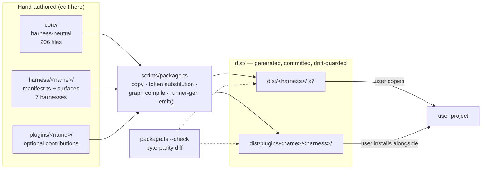

# Repository Overview and Source-of-Truth Model

> **Source**: [awslabs/aidlc-workflows](https://github.com/awslabs/aidlc-workflows/tree/3c3146cfd7cef33020d48e8d48d4e80d0f8c2820) — branch `v2`, commit `3c3146cf` (v2.6.40, retrieved 2026-08-21)
> **Status**: As-built specification derived from the implementation; the upstream code is authoritative over this document.

---

## 1. Purpose

AI-DLC Workflows is described by the repository as "a native implementation of the **AI-DLC methodology** (AI-Driven Development Life Cycle) that runs on **many harnesses from one source of truth**" (`README.md:10`). The distinction between the methodology and this repository is stated explicitly:

> "**AI-DLC is a methodology** — a structured, gated approach to AI-driven software development, defined by AWS … **This repository is its native, multi-harness implementation** — the methodology rendered as skills, agents, hooks, and tools from one harness-neutral `core/`" (`README.md:52`).

The 2.0 line is declared generally available (`README.md:3-5`) and is positioned as the implementation of the *AI-DLC Workflows 2.0 Specification* whitepaper shipped in-tree at `assets/AI-DLC-Workflows-2.0-Specification.pdf` (`README.md:25`, `README.md:465`).

Concretely, the shipped artifact is **not a runnable service**. It is a set of *generated CLI-harness distributions* — Markdown skills/stages/agents/rules plus TypeScript CLI tools and hooks — that a user copies into their own project, where a host CLI (Claude Code, Kiro, Codex, Cursor, opencode, GitHub Copilot) loads them. `package.json:11` states the boundary verbatim:

> `"Dev-only tooling for the multi-harness AI-DLC framework. Generated distributions live under dist/<harness>/ and run via bun without requiring this private package."`

The functional surface a user gets — 5 phases, 33 stages, a 14-agent roster, 11 scopes, 3 depth levels, 3 test-strategy levels, approval gates, an audit trail and a learning loop — is enumerated at `README.md:38-48`. Each of those subjects is owned by a sibling spec; see §9 (Reading guide).

### 1.1 What this document covers

This spec covers repository shape, the core→dist source-of-truth model, versioning/release discipline, and the developer tooling surface. It deliberately does **not** describe stage semantics, engine internals, hook behavior, or harness-specific layouts beyond one-line role statements; those belong to the siblings listed in §9.

---

## 2. Identity, license, provenance

| Property | Value | Evidence |
| --- | --- | --- |
| Upstream | `https://github.com/awslabs/aidlc-workflows` | `package.json:16` |
| Branch analyzed | `v2` (the CI-gated branch; `ci.yml` runs on PRs targeting `v2`) | `.github/workflows/ci.yml:16-18` |
| Commit | `3c3146cfd7cef33020d48e8d48d4e80d0f8c2820` | `git log -1` (see §10) |
| Framework version | `2.6.40` | `core/tools/aidlc-version.ts:4` |
| License | **MIT-0** ("MIT No Attribution"), Copyright Amazon.com, Inc. or its affiliates | `LICENSE:1-3`, `package.json:13` |
| Dev package name | `aidlc-workflows-dev`, `private: true`, `version: "0.0.0"` | `package.json:2-5` |
| Documentation site | `https://awslabs.github.io/aidlc-workflows/` | `zensical.toml:3` |
| Code of Conduct | Amazon Open Source Code of Conduct (by reference) | `CODE_OF_CONDUCT.md:3` |

Note the deliberate version split: the npm-style `version` in `package.json` is pinned at `0.0.0` because the package is private dev tooling; the **framework** version lives in a separate hand-edited TypeScript constant (§6).

---

## 3. Repository layout

29 entries are tracked at the repository root (§10, M1). The whole tree is 3,183 tracked files, of which 2,089 (≈66%) are the generated `dist/` trees (§10, M2–M3).

| Path | Kind | Role | Evidence |
| --- | --- | --- | --- |
| `core/` | source (authored) | The single harness-neutral source of truth: tools, stage protocol + stages, agents, memory (rules/method), scopes, sensors, knowledge, hooks, session skills, onboarding template. 10 subdirectories, 206 tracked files. | `AGENTS.md:10`; §10 M4, M13 |
| `harness/` | source (authored) | Seven thin per-CLI surfaces (`claude`, `codex`, `copilot`, `cursor`, `kiro`, `kiro-ide`, `opencode`), each with a `manifest.ts` describing how to project `core/` into that harness's tree, plus orchestrator skill, settings and optional `emit.ts`. 119 tracked files. | `AGENTS.md:11`; §10 M5, M12 |
| `plugins/` | source (authored) | Optional first-party AIDLC plugins. Ships one reference fixture, `plugins/test-pro/`, carrying `.aidlc-plugin/plugin.json` plus core-shaped subtrees (`stages/`, `contributions/`, `agents/`, `scopes/`, `knowledge/`, `sensors/`, `tools/`, `tests/`). 16 tracked files. | `AGENTS.md:12`; `plugins/test-pro/.aidlc-plugin/plugin.json:1-18`; §10 M6 |
| `scripts/` | source (authored) | Build and CI entry points: `package.ts` (the build), `manifest-types.ts` (the manifest contract), `onboarding.ts`, `agent-knowledge.ts`, `build-binaries.ts`, `ci-changelog-guard.ts`, `docs-rewrite-links.ts`, and `plugin-hooks-template/`. 9 tracked files. | `AGENTS.md:13`; §10 M6 |
| `dist/` | **generated + committed** | One tree per harness plus `dist/plugins/`; what users copy. Byte-parity drift-guarded. 2,089 tracked files. | `AGENTS.md:14`; §10 M3 |
| `tests/` | source (authored) | All-TypeScript suite (`*.test.ts`) in four tiers (`smoke/`, `unit/`, `integration/`, `e2e/`) plus `harness/` helper library, `hooks/`, `fixtures/`, `lib/`, and the runners `run-tests.ts` / `run-tests.sh`. 621 tracked files. | `AGENTS.md:15`; §10 M6, M14 |
| `docs/` | documentation | Three reader-scoped guides — `guide/` (User Guide), `harness-engineering/` (Harness Engineer Guide), `reference/` (Developer Reference) — plus `rfcs/` and `roadmap.md`. 100 tracked files. | `docs/README.md:18-22`; §10 M6 |
| `assets/` | binary asset | `AI-DLC-Workflows-2.0-Specification.pdf` — the whitepaper this implementation realizes. 1 tracked file. | `README.md:25`; §10 M6 |
| `.github/` | CI | Two workflows: `ci.yml` (contract checks + test tiers + changelog guard) and `docs.yml` (zensical build + GitHub Pages deploy). | `.github/workflows/ci.yml:1`, `.github/workflows/docs.yml:1` |
| `README.md` | doc | User-facing entry: announcement, feature list, per-harness install table, repository layout, build/test commands. | `README.md:1-465` |
| `AGENTS.md` | agent instructions | The canonical machine-facing contributor brief: project structure, "edit `core/` never `dist/`", documentation policy, changelog policy. | `AGENTS.md:1-60` |
| `CLAUDE.md` | agent instructions | A one-line file whose entire content is `@AGENTS.md` — Claude Code's memory file simply imports the harness-neutral brief, so there is exactly one authored copy. | `CLAUDE.md:1` |
| `CONTRIBUTING.md` | governance | Project-wide conventions (issue/PR flow, security reporting, licensing) that defer the hands-on loop to `docs/reference/11-contributing.md`. | `CONTRIBUTING.md:9` |
| `CODE_OF_CONDUCT.md` | governance | Adopts the Amazon Open Source Code of Conduct by reference. | `CODE_OF_CONDUCT.md:3` |
| `CHANGELOG.md` | release record | 193 dated version entries, newest first. | §10 M7 |
| `LICENSE` | legal | MIT-0. | `LICENSE:1` |
| `package.json` | tooling config | Dev-only package: three scripts (`typecheck`, `lint`, `check`) and devDependencies. | `package.json:6-26` |
| `bun.lock` | lockfile | Pins the JS/TS toolchain for `bun install --frozen-lockfile`. | `.github/workflows/ci.yml:48` |
| `tsconfig.json` / `tsconfig.tests.json` / `tsconfig.adapters.json` | tooling config | Three type-check projects (§7.2). | `package.json:7` |
| `biome.json` | tooling config | Linter-only Biome configuration (formatter disabled). | `biome.json:3-6` |
| `knip.json` | tooling config | Unused-export/dependency analysis config — **present but not wired** to any script, CI step, dependency, or doc (§7.5). | `knip.json:1-25`; §10 M11 |
| `pyproject.toml` / `uv.lock` | tooling config | Python/uv project used **only** to build the documentation site with zensical. | `pyproject.toml:1-8` |
| `zensical.toml` | tooling config | Docs-site configuration: site name/URL, full `nav` tree, theme, markdown extensions. | `zensical.toml:1-181` |
| `roadmap.html` | transitional stub | A meta-refresh redirect to `docs/roadmap.html`, kept alive only while GitHub Pages still builds this branch with legacy Jekyll; the comment says it "can be deleted" once Pages switches to the Actions deploy. | `roadmap.html:9` (the `<meta http-equiv="refresh">`); `roadmap.html:2-7` (the rationale comment) |
| `.gitattributes` | repo config | `* text=auto eol=lf` — LF pinned on every platform *because* the dist drift guard does a byte-parity diff; CRLF rewriting on Windows checkouts would report the whole of `dist/` as drifted. | `.gitattributes:1-8` |
| `.gitignore` | repo config | Excludes `node_modules/`, `build/`, `/site/`, `/.venv/`, `tests/logs/`, per-user Claude settings, and AIDLC runtime state (`/.aidlc/`, `/aidlc/spaces/*/intents/.aidlc-*`). | `.gitignore:1-52` |

### 3.1 Naming hazard: three meanings of "harness"

`AGENTS.md:39` records a naming collision that a reader must keep straight:

> "'harness' has three senses in this repo: `harness/` (top-level, the per-CLI distribution surfaces …), `docs/harness-engineering/` (the Harness Engineer Guide), and `tests/harness/` (test-suite helper library) — unrelated."

---

## 4. The source-of-truth model

### 4.1 Three zones

`README.md:359` states the invariant: "Three zones: what AI-DLC **is**, how each harness **speaks**, and what users **copy**. You only ever edit the first two — `bun scripts/package.ts` regenerates the third." `AGENTS.md:36` gives the same rule as a directive: "**Edit `core/` (or `harness/<name>/`), never `dist/`.**"



*Text fallback*: `core/` (harness-neutral method + engine) and `harness/<name>/` (per-CLI surfaces), plus optional `plugins/<name>/`, are the only hand-edited inputs. `scripts/package.ts` projects them into `dist/<harness>/` and `dist/plugins/<name>/<harness>/`, which are committed to the repository and re-verified byte-for-byte by `package.ts --check`. Users copy a `dist/` tree into their own project.

### 4.2 The build entry and its pipeline

`scripts/package.ts` is "THE build entry for the one-core-N-harnesses layout" (`scripts/package.ts:2`). Its header documents six ordered steps per harness (`scripts/package.ts:9-25`):

1. **COPY** `core/<src>` → `dist/<name>/<harnessDir>/<dst>`, substituting the harness token and applying the manifest's rules-dir rename.
2. **COPY** `harness/<name>/<src>` into the same tree (orchestrator skill, `CLAUDE.md`/`AGENTS.md`, settings/config), with the same token substitution on `.md`.
3. **COMPILE** the stage graph into the assembled tree — "emits harness-correct stage-graph.json + scope-grid.json — compiled data lives only in dist" (`scripts/package.ts:17-18`).
4. **GENERATE** per-stage runners into the assembled tree via `aidlc-runner-gen`'s exported render functions under `AIDLC_HARNESS_DIR`.
5. **EMIT** via `harness/<name>/emit.ts` when the manifest declares one.
6. **REFRESH** generated table regions in the assembled orchestrator skill from the just-compiled graph and scope grid.

Step 6's regions are delimited by verbatim markers that mark them non-editable (`scripts/package.ts:106`, `:111`):

```text
<!-- BEGIN: compiled stage graph via `bun aidlc-utility.ts stage-table` - do NOT hand-edit -->
<!-- BEGIN: compiled scope grid via `bun aidlc-utility.ts scope-table` - do NOT hand-edit -->
```

### 4.3 The one permitted text transform

`scripts/package.ts:27-31` names it "THE TRANSFORM CLASS (T5 — the only permitted text transform): the harness-dir token." Authored prose in `core/` carries `{{HARNESS_DIR}}` (regex `HARNESS_TOKEN = /\{\{HARNESS_DIR\}\}/g`, `scripts/package.ts:102`), which the packager replaces with the manifest's `harnessDir` value. The observed mapping across the seven manifests:

| Harness | `name` | `harnessDir` | `rulesRename` | Evidence |
| --- | --- | --- | --- | --- |
| Claude Code | `claude` | `.claude` | `null` | `harness/claude/manifest.ts:19-20,76` |
| Kiro CLI | `kiro` | `.kiro` | `steering` | `harness/kiro/manifest.ts:24-25,89` |
| Kiro IDE | `kiro-ide` | `.kiro` | `steering` | `harness/kiro-ide/manifest.ts:27-28,142` |
| Codex CLI | `codex` | `.codex` | `aidlc-rules` | `harness/codex/manifest.ts:22-23,55` |
| Cursor | `cursor` | `.cursor` | `null` | `harness/cursor/manifest.ts:39-40,98` |
| opencode | `opencode` | `.aidlc` | `null` | `harness/opencode/manifest.ts:33-34,72` |
| GitHub Copilot | `copilot` | `.aidlc` | `null` | `harness/copilot/manifest.ts:42-43,73` |

`scripts/manifest-types.ts:4-7` states the manifest philosophy: "A manifest is DATA … The only CODE a harness may contribute is an optional `emit()` plugin … structural divergence that no declarative row can express."

### 4.4 Harness discovery is not hardcoded

`discoverHarnessNames()` enumerates "every `harness/<name>/` that carries a `manifest.ts`. DISCOVERED, not hardcoded: adding harness #N is one `harness/<n>/` dir + manifest row (+ optional `emit.ts`), with zero edits here — the one-core-many-harnesses promise" (`scripts/package.ts:116-126`). The result is sorted so build and `--check` order is stable. Seven manifests exist today (§10, M12).

### 4.5 The drift guard

`--check` is described as "the freshness-diff idiom … build each tree into a temp dir, diff byte-for-byte against the committed `dist/`, exit 1 with the offending paths on any drift. `dist/` stays committed; this guard fails CI when someone hand-edits a dist or forgets to regenerate" (`scripts/package.ts:33-36`).

The comparison function `diffTrees()` emits three verbatim problem classes (`scripts/package.ts:362`, `:363`, `:369`):

- `` `MISSING in dist: ${relPrefix}/${rel}` ``
- `` `DIFFERS: ${relPrefix}/${rel}` ``
- `` `ORPHAN in dist: ${relPrefix}/${rel}` ``

and the CLI terminates with either (`scripts/package.ts:1293`, `:1297`):

- `` `\npackage --check FAILED (${problems.length} problem(s)):` `` followed by up to 40 problem lines, then `process.exit(1)`;
- or `"package --check: all harness trees in sync with core/ + harness/."` on success.

`dist/plugins/` is drift-guarded by the same helper (`scripts/package.ts:1289-1291`); the top-level orphan sweep for a deleted plugin directory runs only on a whole-repo check, never a single-harness one (`scripts/package.ts:1147-1149`).

Two consequences follow from the guard being a *tree* diff rooted at `dist/<name>` and `dist/plugins`:

1. Line-ending normalization would fail the entire guard, which is exactly why `.gitattributes:7` pins `* text=auto eol=lf`; the rationale comment above it names the guard and issue #640 (`.gitattributes:1-7`).
2. A file that sits at the `dist/` root but inside no guarded subtree is not swept. `dist/AI-DLC Workflows 2.0 Specification.pdf` is such a file — it is tracked (§10, M15) but is produced by no code path in `scripts/` (§10, M16); it is a committed copy of the whitepaper, not packager output.

### 4.6 Build and check commands (verbatim)

From `package.json:6-10`:

```json
"scripts": {
    "typecheck": "tsc --noEmit -p tsconfig.json && tsc --noEmit -p tsconfig.tests.json && tsc --noEmit -p tsconfig.adapters.json",
    "lint": "biome check --error-on-warnings core harness scripts plugins tests",
    "check": "bun scripts/package.ts --check && bun run typecheck && bun run lint"
  }
```

From `README.md:416-418`:

```bash
bun scripts/package.ts            # regenerate every dist/<harness>/ from core/ + harness/
bun scripts/package.ts <name>     # regenerate one harness (e.g. claude, kiro-ide, codex)
bun scripts/package.ts --check    # byte-parity drift guard (run in CI)
```

`CONTRIBUTING.md:22-23` carries a two-line subset — the `<name>` line is absent, and the first line's comment is shortened to `# regenerate every dist/<harness>/` — while the `--check` line is identical:

```bash
bun scripts/package.ts            # regenerate every dist/<harness>/
bun scripts/package.ts --check    # byte-parity drift guard (run in CI)
```

CI invokes exactly `bun run check` in the job named `Contract checks (parity + typecheck + lint)` (`.github/workflows/ci.yml:38`, `:53-54`), so the drift guard is the first blocking gate.

Release binaries are a separate, post-guard step: `bun scripts/build-binaries.ts` (and `--all-targets` for the matrix), emitting to the gitignored `build/binaries/<target>/` with a `runtime/<harness>/` copy of every generated distribution it may dispatch into (`README.md:421-430`, `.gitignore:16`).

### 4.7 Pack-time tier cap

A single build knob modulates output: `AIDLC_TIER_CAP` (per-invocation env var) beats a persistent `tier_cap:` frontmatter key on the layered method files in `core/memory/` (`scripts/package.ts:69-86`). Under `--check` the env var is deliberately ignored, with the verbatim diagnostic:

> `"[tier] AIDLC_TIER_CAP is set but IGNORED under --check (the env cap is a one-shot write knob; persistent caps live in core/memory)"` (`scripts/package.ts:96-97`)

The rationale is stated at `scripts/package.ts:73-78`: the guard must compare against what the committed dist was legitimately built from, so a stray env var in a CI runner must neither fail nor mask drift. No `tier_cap:` key is present in the shipped `core/memory/` files (§10, M17), so the default cap is null. Tier semantics themselves live in `core/tools/aidlc-tiers.ts` and are out of scope here.

### 4.8 What "one core" actually means, measured

The claim that "the deterministic engine … is byte-identical across every harness; only the shell differs" (`README.md:66`) is directly checkable. `aidlc-orchestrate.ts` has the same MD5 in the Claude, Kiro, Codex and Copilot trees, while the compiled `tools/data/stage-graph.json` differs between Claude and Kiro (§10, M18) — matching `scripts/package.ts:17-18`, which says compiled graph data is emitted per-harness and lives only in dist.

---

## 5. The eight `dist/` targets

`dist/` contains eight generated targets — seven harness trees and one plugin projection root — plus the committed PDF noted in §4.5. Details of each layout belong to **10-distribution-harnesses.md**; the one-line roles and measured sizes:

| Target | Ships | Role | Tracked files | Evidence |
| --- | --- | --- | --- | --- |
| `dist/claude/` | `.claude/` + `aidlc/` + `.mcp.json` + `.gitignore` | Claude Code distribution; `/aidlc` invocation. | 262 | `README.md:60`; §10 M8, M19 |
| `dist/codex/` | `.codex/` + `.agents/` + `aidlc/` + `AGENTS.md` | Codex CLI (≥ 0.145.0) distribution; `$aidlc` or `/skills` → aidlc. | 318 | `README.md:61`; §10 M8, M19 |
| `dist/copilot/` | `.aidlc/` + `.github/` + `aidlc/` + `AGENTS.md` | GitHub Copilot distribution; `.github/` is merged, not replaced. | 274 | `README.md:64`; §10 M8, M19 |
| `dist/cursor/` | `.cursor/` + `aidlc/` + `AGENTS.md` + `install.ts` | Cursor distribution; the only target installed by a shipped script (`bun dist/cursor/install.ts <project>`). | 270 | `README.md:62`; §10 M8, M19 |
| `dist/kiro/` | `.kiro/` + `aidlc/` + `AGENTS.md` | Kiro CLI (≥ 2.6) distribution; ships `.kiro/settings/cli.json` with `chat.defaultAgent` = `aidlc`. | 276 | `README.md:59`, `README.md:167`; §10 M8, M19 |
| `dist/kiro-ide/` | `.kiro/` + `aidlc/` + `AGENTS.md` | Kiro IDE distribution; registers hooks in both the v2 `.json` and legacy `.kiro.hook` formats. | 293 | `README.md:58`, `README.md:138`; §10 M8, M19 |
| `dist/opencode/` | `.aidlc/` + `.opencode/` + `aidlc/` + `opencode.json` + `AGENTS.md` | opencode (≥ 1.17) distribution. | 275 | `README.md:63`; §10 M8, M19 |
| `dist/plugins/<name>/{claude,codex,copilot,cursor,kiro,kiro-ide,opencode}/` | one real host plugin per harness | Plugin projections installed alongside a harness tree; today only `test-pro`, projected into all 7 harnesses. | 120 | `AGENTS.md:12`; §10 M9, M19 |

Two structural facts worth carrying forward:

- Every harness tree also ships a sibling **`aidlc/` workspace shell** containing the pre-built `aidlc/spaces/default/memory/` method tree the engine reads; `README.md:136` states that `/aidlc --doctor` fails its "workspace shell ready" check without it.
- Every harness tree ships a generated `.gitignore` (§10, M8), projected from the authored `harness/<name>/dot-gitignore`.

---

## 6. Versioning and release cadence

### 6.1 The single source of truth

`core/tools/aidlc-version.ts:1-4`:

```ts
// Hand-edited single source of truth for the AIDLC framework version.
// Bumped in the same commit that adds the matching ## [N.N.N] heading
// to CHANGELOG.md. Pinned by tests/unit/t68-version-changelog-sync.test.ts.
export const AIDLC_VERSION = "2.6.40";
```

The value propagates two ways:

- **Into every distribution** by packaging: `dist/claude/.claude/tools/aidlc-version.ts:4` carries the identical literal `"2.6.40"` (§10, M20).
- **To the user** through the CLI: `core/tools/aidlc-utility.ts:387` writes `` `aidlc ${AIDLC_VERSION}\n` `` to stdout, dispatched from the `version` subcommand at `core/tools/aidlc-utility.ts:5992`.

The README badge is the third face: `README.md:14` renders ``.

### 6.2 The changelog discipline

`AGENTS.md:56` states the rule verbatim:

> "IMPORTANT: Every user-visible PR bumps `core/tools/aidlc-version.ts` … bumps the README badge, and adds a matching `## [X.Y.Z] - YYYY-MM-DD` heading + bullet(s) to `CHANGELOG.md` in the same commit."

with the explicit exclusion that "Pure doc sweeps, internal refactors, and test-only changes do NOT bump". `AGENTS.md:58` fixes the entry shape: a `## [N.N.N] - YYYY-MM-DD` heading, a one-paragraph summary "that includes any upgrade instruction", then a flat bullet list "focused on what users actually invoke (commands, flags, errors they see, breaking changes for CI/scripts)".

Two automated guards enforce it:

| Guard | Enforces | Evidence |
| --- | --- | --- |
| `tests/unit/t68-version-changelog-sync.test.ts` | Exactly one `AIDLC_VERSION` assignment; it matches the latest CHANGELOG heading; headings are unique (catches post-rebase duplicates); the wired CLI `version` subcommand prints `aidlc <CHANGELOG version>`; the README badge matches. | `tests/unit/t68-version-changelog-sync.test.ts:44-56` |
| `scripts/ci-changelog-guard.ts` | A PR must never *delete* an existing entry: "Exit 0 = every base heading is still present (new headings are fine). Exit 1 = one or more base headings were removed". Run in CI against the PR base SHA. | `scripts/ci-changelog-guard.ts:1-16`; `.github/workflows/ci.yml:125-126` |

Both guards key off the same heading regex, kept "in lock-step so the two guards never disagree about what counts as a heading": `` const HEADING_LINE = /^## \[[0-9]+\.[0-9]+\.[0-9]+\]/ `` (`scripts/ci-changelog-guard.ts:22-24`).

A documented conflict-trap resolution exists for concurrent bumps: "when two PRs both bump `aidlc-version.ts` to the same patch number, the second-to-merge resolves by rebasing and re-bumping … plus renaming its `## [0.6.5]` heading to match" (`AGENTS.md:60`).

Version-link references (`[N.N.N]:` at file bottom) were **removed in v0.6.9** and t68 now guards that none reappear, because "a distributed file should not embed a repository host" (`AGENTS.md:60`; rationale at `tests/unit/t68-version-changelog-sync.test.ts:59-62`).

### 6.3 Cadence, measured

`CHANGELOG.md` holds **193** dated entries (§10, M7), running from `## [0.1.0] - 2026-04-24` (`CHANGELOG.md:2334`) to `## [2.6.40] - 2026-08-21` (`CHANGELOG.md:4`). The top three entries — 2.6.40, 2.6.39, 2.6.38 — all carry the date 2026-08-21 (`CHANGELOG.md:4,12,21`), i.e. multiple patch releases per day at the head of the line. `AGENTS.md:56` describes this as intended: "Patch versions accumulate through a release-prep cycle; the eventual minor cut … consolidates them."

### 6.4 The upgrade convention

Because there is no installer that pulls updates, entries carry an in-line upgrade instruction. **106** entries contain a bold `**Upgrade:**` clause (§10, M10a). The dominant idiom is a re-copy of the shell: **85** clauses open with `re-copy` and **12** with `refresh`, leaving `copy` (4) and five one-off openings — `upgrade`, `rerun`, `fresh installs`, `existing installs`, and one clause that opens with a literal `mkdir -p` command (§10, M10b). **95** of the 106 pair one of those two verbs with an explicit `dist/` path (§10, M10d). The single most common wording is **"re-copy your `dist/<harness>/` shell"** — **72** clauses, against **5** for the "refresh your `dist/<harness>/` shell" variant (§10, M10c). A representative majority-form entry (`CHANGELOG.md:99`):

> "**Upgrade:** re-copy your `dist/<harness>/` shell so the new `aidlc-testing-posture.ts` tool, stage contract, dispatch guard, swarm precondition, and developer persona are installed."

The head entry happens to use the minority `refresh` variant (`CHANGELOG.md:6`):

> "**Upgrade:** refresh your `dist/<harness>/` shell so the shared Stop hook and active-directive evidence reader are updated; Copilot's session-owned Stop path remains unchanged."

The operational meaning: an upgrade is a **re-copy of a `dist/` tree**, and `README.md:455` adds the session caveat — "Skills or rules don't take effect after you copy a new `dist/` … Start a fresh session — harnesses load skills, agents, and rules at session start."

---

## 7. Developer tooling surface

### 7.1 Runtime: bun, everywhere

`README.md:79` states the single shared prerequisite: "Every harness runs the same TypeScript hooks and CLI tools through **bun**, so install bun first — it's the one requirement they all share." CI pins `bun-version: '1.3.14'` in all four jobs (`.github/workflows/ci.yml:45`) and installs with `bun install --frozen-lockfile` (`.github/workflows/ci.yml:48`).

A documented PATH hazard is called out twice (`README.md:99`, and again in the troubleshooting table at `README.md:451`): a harness runs hooks through a *non-interactive* shell, which reads `~/.zshenv` or `~/.bashrc`, whereas the bun installer writes to `~/.zshrc`.

### 7.2 TypeScript: three projects, one base

`package.json:7` runs `tsc --noEmit` three times:

| Project | Includes | Notes | Evidence |
| --- | --- | --- | --- |
| `tsconfig.json` | `core/**/*.ts`, `harness/**/*.ts`, `scripts/**/*.ts`, `plugins/*/tools/**/*.ts` | Base: `strict: true`, `noEmit`, ESNext target/module, `moduleResolution: "bundler"`, `allowImportingTsExtensions`, `types: ["bun-types"]`. Excludes `harness/*/hooks/*-adapter.ts`. | `tsconfig.json:1-22` |
| `tsconfig.tests.json` | `tests/**/*.ts`, `plugins/*/tests/**/*.ts` | Excludes `tests/fixtures/brownfield-todo/**` (uninstalled React/Vite deps) and `tests/fixtures/v05-mr9-sensor-fire/failing-type-check/**` — the latter "must produce a real compiler diagnostic for the sensor test". | `tsconfig.tests.json:9`, `:11` (comment at `:10`); file is 13 lines |
| `tsconfig.adapters.json` | `dist/*/.*/hooks/*-adapter.ts` | The one project that type-checks **generated** files: "Adapters import sibling tools that exist only in emitted harness trees. `package.ts --check`, run by `bun run check`, enforces source/dist parity." | `tsconfig.adapters.json:1-7` |

`typescript` is pinned as `^6.0.3`, `bun-types` as `^1.3.13` (`package.json:22,25`).

### 7.3 Biome: linter only

`biome.json:3-6` disables the formatter (`"formatter": {"enabled": false}`) and enables only the linter; `organizeImports` assist is off (`biome.json:8-14`). Version `2.4.16` is pinned in both the `$schema` URL and devDependencies (`biome.json:2`, `package.json:20`). `dist/**` and one failing-linter fixture are excluded from the file set (`biome.json:16-22`). Lint runs with `--error-on-warnings` over `core harness scripts plugins tests` (`package.json:8`).

The most notable override is an architectural rule expressed as lint config: `core/tools/aidlc-knowledge.ts` may bind only read-only `node:fs` primitives, with the verbatim message (`biome.json:60`):

> "aidlc-knowledge.ts may only bind read-only node:fs primitives directly; route every mutation (write, append, rename, rm, mkdir, symlink, link, fd-based write) through writeFileAtomic/writeBufferAtomic in aidlc-lib.ts. A namespace (`import * as fs`), default (`import fs`), or dynamic (`await import(\"node:fs\")`) import is refused outright because it hides every bound name from this rule."

Two broader overrides relax `noNonNullAssertion` for `tests/**` and, together with `useTemplate`, for `core/tools/**`, `harness/**`, `scripts/**` (`biome.json:24-45`).

### 7.4 Tests

`bun tests/run-tests.ts` is the runner; `bash tests/run-tests.sh` is a POSIX wrapper (`README.md:436-441`). The flags `--smoke`, `--ci`, `--release` are parsed at `tests/run-tests.ts:136,152,158`. Measured tier sizes: 13 smoke, 226 unit, 106 integration, 71 e2e — 419 `*.test.ts` under `tests/` in total, of which 3 sit outside the four tier directories (two calibration tests under `tests/harness/`, one under `tests/lib/`), plus 1 under `plugins/` (§10, M14). Strategy, tiering and the `--no-llm` deterministic subset belong to **12-testing-ci.md**.

### 7.5 knip

`knip.json` declares entry points (`core/tools/*.ts`, `core/hooks/*.ts`, `harness/*/manifest.ts`, `harness/*/emit.ts`, `scripts/package.ts`, `scripts/docs-rewrite-links.ts`, plus a fixture scripts glob) and a project set, with `ignoreUnresolved: ["./aidlc-lib.ts"]` (`knip.json:3-24`). **As built, nothing invokes it**: a repository-wide search for the string `knip` matches only `knip.json` itself (§10, M11) — there is no `knip` script in `package.json`, no devDependency, no CI step, and no documentation reference. It is therefore an ad-hoc analysis config (usable via `bunx knip`), not part of the enforced gate set.

### 7.6 Documentation site: python + uv + zensical

`pyproject.toml:1-8` defines a Python ≥ 3.12 project named `aidlc-workflows-docs` whose sole purpose is "Documentation site build for AI-DLC Workflows (zensical)", with one dependency group `docs = ["zensical==0.0.51"]`. It defines no package and no runtime code — the framework itself remains bun-only.

`zensical.toml` carries `site_name`, `site_description`, `site_url = "https://awslabs.github.io/aidlc-workflows/"`, `repo_url`, a hand-maintained `nav` tree, `[theme]`, two `[[theme.palette]]` blocks with toggles, and `[markdown_extensions]` (`zensical.toml:1-181`).

The deploy workflow (`.github/workflows/docs.yml`) pins `uv` `0.11.28` and Python `3.12`, then runs in order: `uv sync --locked --group docs` (`:59`), `bun scripts/docs-rewrite-links.ts` to "Rewrite out-of-tree links to GitHub URLs" (`:66-67`), `uv run zensical build --strict` (`:70`), emits a legacy `/roadmap.html` redirect (`:76`), and publishes via `actions/upload-pages-artifact` / `actions/deploy-pages` (`:78`, `:100`). `/site/`, `/.cache/` and `/.venv/` are gitignored (`.gitignore:20-22`).

### 7.7 devDependencies and what they imply

`package.json:19-25` pins seven dev dependencies. Three are the toolchain (`@biomejs/biome`, `typescript`, `bun-types`). One is **build-time**: `smol-toml` is imported by the Codex `emit()` plugin (`harness/codex/emit.ts:21` — `import { stringify } from "smol-toml";`), which the packager invokes at its EMIT step (`scripts/package.ts:22-23`), so `bun scripts/package.ts` — and therefore `bun run check` (`package.json:9`) — needs it; its only other consumers are three tests (§10, M24). The remaining three are test-only: `@anthropic-ai/claude-agent-sdk` (live-model test families, consumed at `tests/harness/sdk-drive.ts`) and `@xterm/headless` + `node-pty` (the TUI e2e harness, `tests/harness/tui-drive.ts`). None of the four non-toolchain deps is required by a user running a `dist/` tree — no `dist/` file references any of them (§10, M23) — see `package.json:11`.

### 7.8 CI at a glance

`.github/workflows/ci.yml` runs on `pull_request` targeting `v2` (types `opened`, `synchronize`, `reopened`) and on `workflow_dispatch`, with `permissions: contents: read` and one-in-flight concurrency per ref (`.github/workflows/ci.yml:15-34`). Four jobs: `Contract checks (parity + typecheck + lint)` → `bun run check`; `Tests (smoke + unit)`; `Tests (integration + e2e, deterministic)` under `--no-llm`; and `Changelog completeness` → `bun scripts/ci-changelog-guard.ts "${{ github.event.pull_request.base.sha }}"` (`.github/workflows/ci.yml:38,54,57,72,75,100,103,126`). The header explains the `--no-llm` choice as making a green run meaningful rather than "silently passing-by-skip on a runner that happens to lack credentials" (`.github/workflows/ci.yml:3-15`). Full detail belongs to **12-testing-ci.md**.

---

## 8. Governance and meta files

| File | Audience | Function |
| --- | --- | --- |
| `AGENTS.md` | AI agents and maintainers | The canonical contributor brief. Carries project structure (`:10-16`), the how-it-works inventory (`:26-32`), the "edit `core/`, never `dist/`" rule (`:36`), the Documentation Policy — "When adding, removing, or renaming files, directories, commands, or flags — grep `docs/` and `README.md` for stale references and update them in the same commit" (`:52`) — and the Changelog Policy (`:56-60`). |
| `CLAUDE.md` | Claude Code | Content is exactly `@AGENTS.md` (`CLAUDE.md:1`), i.e. a one-line import. There is one authored brief; the Claude-specific memory file is a pointer, not a fork. |
| `CONTRIBUTING.md` | human contributors | Project-wide conventions only. It explicitly defers: "The authoritative, hands-on contributor guide … is `docs/reference/11-contributing.md`. Read it before making code changes" (`:9`). Contains the three-zone summary (`:13-17`), the regenerate commands (`:22-23`), ten "AI-DLC Authoring Principles" (`:32-41`), a six-item PR checklist (`:47-52`), the test commands (`:59-60`), issue-reporting guidance (`:65-73`), PR flow including conventional commits (`:87-92`), an explicit "AI-generated contributions … are welcome and follow the same process" clause (`:83`), Code of Conduct, and AWS security-reporting instructions (`:106`). |
| `CODE_OF_CONDUCT.md` | everyone | Adopts the Amazon Open Source Code of Conduct by reference (`:3`). |
| `LICENSE` | everyone | MIT-0 — permission granted "without restriction … and to permit persons to whom the Software is furnished to do so", notably with **no attribution requirement** (`LICENSE:1-9`). |

The `AGENTS.md` / `CLAUDE.md` split is itself an instance of the repository's governing principle: one authored source, harness-specific surfaces generated or pointed at it — the same relationship the packager creates between `core/` and `dist/`.

---

## 9. Reading guide

This document is the entry point of a 13-file spec set. Each sibling owns its subject; this file points rather than duplicates.

| File | Subject |
| --- | --- |
| `00-overview.md` | *(this document)* Repository overview, source-of-truth model, versioning, developer tooling. |
| `01-workflow-model.md` | The workflow model: 5 phases, 33 stages, scopes, depth and test-strategy levels, gates and interaction modes. |
| `02-orchestration-engine.md` | The orchestration engine — `aidlc-orchestrate.ts`, directive kinds, and how the conductor is driven. |
| `03-state-audit-runtime.md` | Workflow state, the audit event log, the runtime graph, and the spaces/intents record layout. |
| `04-stage-protocol.md` | The stage protocol and stage-definition schema: how a single stage file is structured and executed. |
| `05-agents.md` | The agent roster (11 domain experts, 2 review-only agents, the composer) and how personas are adopted or delegated. |
| `06-sensors.md` | Deterministic verification manifests: the six shipped sensors, firing, and verdict semantics. |
| `07-hooks.md` | The framework hooks (audit emission, session lifecycle, enforcement) and their per-harness adapters. |
| `08-memory-rules-learnings.md` | The layered method: `org` → `team` → `project` → phase rules, and the learning loop that persists corrections. |
| `09-cli-tools.md` | The `aidlc-*.ts` CLI tool surface under `core/tools/` and its subcommands. |
| `10-distribution-harnesses.md` | Per-harness manifests, projection rules, `emit()` plugins, and the shape of each `dist/<harness>/` tree. |
| `11-plugin-system.md` | The plugin mechanism: `.aidlc-plugin/plugin.json`, contribution seams, compose hook, and per-harness projections. |
| `12-testing-ci.md` | Test tiers, the runner, the deterministic `--no-llm` subset, and the CI gate composition. |

---

## 10. Documented-vs-code discrepancies

Per the ground rule that the implementation is authoritative, three counts in the repository's own prose do not match the tree at this commit:

| Claim | Location | Measured | Note |
| --- | --- | --- | --- |
| "25 `aidlc-*.ts` engine tools" | `README.md:365` | **41** `.ts` files in `core/tools/` (§10, M13a) | The README layout diagram is stale. Tool inventory is owned by **09-cli-tools.md**. |
| "3 session skills (session-cost, replay, outcomes-pack)" (`README.md:369`); "the 3 session skills" (`AGENTS.md:10`, which names none) | `README.md:369`, `AGENTS.md:10` | **4** directories in `core/skills/`: `aidlc-knowledge`, `aidlc-outcomes-pack`, `aidlc-replay`, `aidlc-session-cost` (§10, M13d) | Both prose locations state 3; only the README carries the name list, and `aidlc-knowledge` is absent from both. |
| "`tools/ … (+ data/scaffold/ templates)`" | `README.md:365` | `core/tools/data/` contains `ars-priors.json`, `model-rates.json`, `templates/` — no `scaffold/` (§10, M21) | Naming drift in the layout diagram. |

Counts that **do** check out: 33 stage files (`AGENTS.md:26`; §10 M13b), 14 agents (`AGENTS.md:27`; §10 M13c), 17 hooks (`AGENTS.md:32`; §10 M13e), 6 sensors (`AGENTS.md:29`; §10 M13f), 11 scopes (`README.md:40`; §10 M13g), 7 harnesses (`README.md:10`; §10 M12).

---

## Measurement notes

All commands were run at the upstream clone root with `HEAD` = `3c3146cfd7cef33020d48e8d48d4e80d0f8c2820` (branch `v2`), verified by `git log -1 --format='%H %d %ci'` → `3c3146cfd7cef33020d48e8d48d4e80d0f8c2820 (grafted, HEAD -> v2, origin/v2) 2026-08-21 11:53:55 +0100`. Every stated number below is transcribed from the listed command's output.

One predicate caveat, recorded because it produced a wrong distribution in an earlier draft of §6.4: character-class predicates of the form `[a-z]+` do **not** match the hyphenated verb `re-copy`, which is the majority opening of the `**Upgrade:**` clauses. M10b therefore tokenizes on `[^ ]+` and is checked against the M10a total (the per-verb counts sum to 106); any opening-verb tally that does not reconcile to M10a is under-classifying.

| ID | Number stated | Command (predicate + target set) | Result |
| --- | --- | --- | --- |
| M1 | 29 top-level tracked entries | `git ls-tree --name-only HEAD \| wc -l` | `29` |
| M2 | 3,183 tracked files | `git ls-files \| wc -l` | `3183` |
| M3 | 2,089 tracked files under `dist/` | `git ls-files dist \| wc -l` | `2089` |
| M4 | 206 tracked files under `core/` | `git ls-files core \| wc -l` | `206` |
| M5 | 119 tracked files under `harness/` | `git ls-files harness \| wc -l` | `119` |
| M6 | 100 / 621 / 16 / 9 / 1 / 2 tracked files | `git ls-files docs \| wc -l`; same for `tests`, `plugins`, `scripts`, `assets`, `.github` | `100`, `621`, `16`, `9`, `1`, `2` |
| M7 | 193 CHANGELOG entries | `grep -cE '^## \[[0-9]+\.[0-9]+\.[0-9]+\] - [0-9]{4}-[0-9]{2}-[0-9]{2}$' CHANGELOG.md` | `193` |
| M7b | oldest/newest headings | `grep -nE '^## \[[0-9]+\.[0-9]+\.[0-9]+\] - ' CHANGELOG.md \| head -3` and `\| tail -5` | head: `4:## [2.6.40] - 2026-08-21`, `12:## [2.6.39] - 2026-08-21`, `21:## [2.6.38] - 2026-08-21`; tail includes `2334:## [0.1.0] - 2026-04-24` |
| M8 | `dist/` target contents | `ls -1A dist/claude dist/codex dist/copilot dist/cursor dist/kiro dist/kiro-ide dist/opencode dist/plugins dist/plugins/test-pro` | listed in §5; each harness tree contains a `.gitignore`; `dist/plugins/test-pro/` contains 7 harness subdirs |
| M9 | 7 plugin projections | `ls -d dist/plugins/test-pro/*/ \| wc -l` | `7` |
| M10a | 106 `**Upgrade:**` clauses | `grep -c '\*\*Upgrade:\*\*' CHANGELOG.md` | `106` |
| M10b | upgrade-clause opening-verb distribution (sums to 106) | `grep -oE '\*\*Upgrade:\*\* [^ ]+' CHANGELOG.md \| sed 's/\*\*Upgrade:\*\* //' \| sort \| uniq -c \| sort -rn` | `85 re-copy`, `12 refresh`, `4 copy`, `1 upgrade`, `1 rerun`, `1 fresh`, `1 existing`, 1 backtick-quoted `mkdir` |
| M10c | 72 "re-copy your `dist/<harness>/` shell" vs 5 "refresh your …" | ``grep -c 're-copy your `dist/<harness>/` shell' CHANGELOG.md``; ``grep -c 'refresh your `dist/<harness>/` shell' CHANGELOG.md`` | `72`; `5` |
| M10d | 95 clauses naming a `dist/` path with `re-copy`/`refresh` | ``grep -cE '\*\*Upgrade:\*\* (re-copy\|refresh)[^.]*`dist/' CHANGELOG.md`` | `95` |
| M11 | knip unreferenced | `git grep -n -i "knip" -- .` | single hit: `knip.json:2` (the `$schema` URL) |
| M12 | 7 harness manifests | `ls harness/*/manifest.ts \| wc -l` | `7` |
| M13a | 41 files in `core/tools/` | `ls core/tools/*.ts \| wc -l` | `41` |
| M13b | 33 stage files | `find core/aidlc-common/stages -name '*.md' \| wc -l` | `33` |
| M13c | 14 agents | `ls core/agents/*.md \| wc -l` | `14` |
| M13d | 4 session-skill dirs | `ls -d core/skills/*/ \| wc -l` | `4` |
| M13e | 17 hooks | `ls core/hooks/*.ts \| wc -l` | `17` |
| M13f | 6 sensors | `ls core/sensors/*.md \| wc -l` | `6` |
| M13g | 11 scopes | `ls core/scopes \| wc -l` | `11` |
| M13h | 8 stage protocol files, 15 knowledge dirs, 10 `core/` subdirs | `ls core/aidlc-common/protocols/*.md \| wc -l`; `ls -d core/knowledge/*/ \| wc -l`; `ls -d core/*/ \| wc -l` | `8`, `15`, `10` |
| M14 | test tier sizes | `ls tests/smoke/*.test.ts \| wc -l` (etc. for `unit`, `integration`, `e2e`); `find tests -name '*.test.ts' \| wc -l`; `find tests -name '*.test.ts' \| grep -vE '^tests/(smoke\|unit\|integration\|e2e)/'`; `find plugins -name '*.test.ts' \| wc -l` | `13`, `226`, `106`, `71`; total `419`; the 3 outliers are `tests/harness/kiro-acp-drive.calibration.test.ts`, `tests/harness/sdk-drive.calibration.test.ts`, `tests/lib/bun-junit-to-meta.test.ts`; plugins `1` |
| M15 | PDF tracked under `dist/` | `git ls-files "dist/*.pdf" "assets/*"` | `assets/AI-DLC-Workflows-2.0-Specification.pdf`, `dist/AI-DLC Workflows 2.0 Specification.pdf` |
| M16 | PDF not produced by the packager | `grep -rn "Specification.pdf\|\.pdf" scripts/` | no matches |
| M17 | no `tier_cap:` in shipped memory | `git grep -n "tier_cap" -- core/memory core/tools/aidlc-tiers.ts` | hits only in `core/tools/aidlc-tiers.ts` (`:54,185,190,191,200,212,231`); zero in `core/memory/` |
| M18 | engine byte-identity vs per-harness compiled data | `md5 -q dist/{claude/.claude,kiro/.kiro,codex/.codex,copilot/.aidlc}/tools/aidlc-orchestrate.ts`; then `md5 -q dist/claude/.claude/tools/data/stage-graph.json dist/kiro/.kiro/tools/data/stage-graph.json` | orchestrator: `cc84aaf88946afc3dc27cb809a44440b` x4 (identical); stage-graph: `3ee59d7a177bd55d2e8392fb9028561d` vs `2993c26ff6e085fc6a17e658fed5a140` (differ) |
| M19 | per-target tracked file counts | `git ls-files dist/claude \| wc -l` (repeated for `codex`, `copilot`, `cursor`, `kiro`, `kiro-ide`, `opencode`, `plugins`) | `262`, `318`, `274`, `270`, `276`, `293`, `275`, `120` (sum `2088` + 1 PDF = `2089`, matching M3) |
| M20 | version literal in the Claude dist | `grep -n 'AIDLC_VERSION' dist/claude/.claude/tools/aidlc-version.ts` | `4:export const AIDLC_VERSION = "2.6.40";` |
| M21 | `core/tools/data/` contents | `ls core/tools/data` | `ars-priors.json`, `model-rates.json`, `templates` |
| M22 | README badge line | `grep -n 'badge/version' README.md` | `14:` |
| M23 | no `dist/` reference to the four non-toolchain devDeps | `grep -rlE 'smol-toml\|@xterm/headless\|node-pty\|claude-agent-sdk' dist/` | no matches (exit 1) |
| M24 | `smol-toml` consumers | `git grep -ln smol-toml` | `bun.lock`, `harness/codex/emit.ts`, `package.json`, `tests/integration/t145-packaging-parity.test.ts`, `tests/unit/t150-codex-packaging.test.ts`, `tests/unit/t294-document-extractors-seam.test.ts` |
