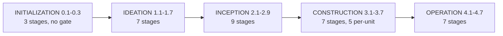

# ワークフローモデル: フェーズ、ステージ、スコープ、深度とティア

> **Source**: [awslabs/aidlc-workflows](https://github.com/awslabs/aidlc-workflows) — branch `v2`, commit `3c3146cf` (v2.6.40, retrieved 2026-08-21)
> **Status**: 実装から導出された as-built 仕様書。upstream のコードが本文書に優先する。
> **正本**: 英語版 `01-workflow-model.md`(この日本語版は参照訳。両者が食い違う場合は英語版が優先)

---

## 1. 目的と境界

本文書は**静的なワークフローモデル**を規定する: フェーズの背骨、ステージ一覧、
ステージを選択するスコープグリッド、深度(depth)とテスト戦略(test-strategy)の
ダイヤル、そして著者が書いた YAML フロントマターをランタイムの
`stage-graph.json` / `scope-grid.json` ペアへ変換するコンパイルパイプラインである。
非ストック(non-stock)なスコープグリッドを唯一生成する adaptive composer(適応的
コンポーザー)についても扱う。

本文書は意図的にランタイムの境界で止める。エンジンが選択されたサブ DAG を
どう歩き、ディレクティブをどう発行し、ゲートをどう強制するかは
`02-orchestration-engine.md` に属する。state ファイルと監査台帳は
`03-state-audit-runtime.md` に属する。ステージ単位の実行儀礼(質問、ゲート、§13
学習)は `04-stage-protocol.md` に属する。エージェントのペルソナとそのティアは
`05-agents.md` に、センサーマニフェストは `06-sensors.md` に、レイヤー化された
ルールファイルは `08-memory-rules-learnings.md` に、CLI サーフェスは
`09-cli-tools.md` に、ハーネスごとの投影は `10-distribution-harnesses.md` に、
プラグイン所有のステージとスコープは `11-plugin-system.md` に属する。

ここに記載される数値は §10 の *Measurement notes* に記録されたコマンドから
転記したものである。`dist/` は生成された投影出力であり決して正本ではない。
本文書が `dist/` を読む箇所ではその旨を明記し理由を説明する。

---

## 2. フェーズモデル

### 2.1 5つのフェーズ

フェーズの語彙は単一の順序付き定数 `PHASES`(`core/tools/aidlc-lib.ts:130`)
であり、ステージスキーマの enum `VALID_PHASES`(`core/tools/aidlc-stage-schema.ts:117`)
として重複定義されている:

```text
initialization, ideation, inception, construction, operation
```

この順序は二重の意味で構造を支えている(load-bearing)。まず各ステージのコンパイル済み
`number` が持つ**数値プレフィックス**そのものである — `PHASES.indexOf(phase)` が
ドットの前の整数になり(`core/tools/aidlc-graph.ts:1767`、続いて `:1850` で
`` `${prefix}.${nextIndex}` ``)、次に `numericStageOrder`
(`core/tools/aidlc-graph.ts:1510-1515`)が使う全順序でもあり、これはまずフェーズ
プレフィックスで、次にインデックスでソートする。5つのいずれでもない名前の
ディレクトリに置かれたステージファイルは、合法な集合を名指すハードなコンパイル
エラーになる(`core/tools/aidlc-graph.ts:1772-1776`)。

| # | フェーズ | ステージファイル数 | 数値範囲 | ステージとルールファイルから読み取れる目的 |
| --- | ------- | ------------: | --------------- | ------------------------------------------------------ |
| 0 | `initialization` | 3 | 0.1–0.3 | ブートストラップ専用: intent ごとの record ツリーをスキャフォールドし、ワークスペースを分類し、値を投入した state ファイルを書き出す。3ファイルすべてが `lead_agent: orchestrator`、`mode: inline`、`produces: []`、`sensors: []`、そして全スコープ名を宣言する。フェーズルールファイルは**持たない**。 |
| 1 | `ideation` | 7 | 1.1–1.7 | ソリューション化に先立つ問題フレーミング。`core/memory/phases/ideation.md` は "Prioritize user needs and problem definition before proposing solutions" と "Keep ideation artifacts at the problem/opportunity level — no implementation details" を義務付ける。 |
| 2 | `inception` | 9 | 2.1–2.9 | 既存システムを理解し、仕様化し、コンポーネントモデルを設計し、Unit of Work へ分解し、配送計画を立てる。締めくくり(capstone)は `delivery-planning`(`execution: ALWAYS`、"capstone Inception stage, produces the detailed execution plan for Construction and Operation")。 |
| 3 | `construction` | 7 | 3.1–3.7 | Unit ごとの設計とコード生成、その後に一度きりのステージが2つ続く。`core/memory/phases/construction.md` は "complete, runnable files — no partial implementations" を要求する。 |
| 4 | `operation` | 7 | 4.1–4.7 | 出荷し、観測し、対応し、NFR に照らして検証する。`core/memory/phases/operation.md` がデプロイ/ロールバック/SLO 規律を統括する。 |

合計: **33** ステージファイル。フェーズルールファイルはちょうど**4つ**
(`core/memory/phases/{ideation,inception,construction,operation}.md`)しかない —
`initialization` フェーズはブートストラップ専用でありルールレイヤーを一切
寄与しない。これが initialization ノードのコンパイル済み `rules_in_context` が
`org`/`team`/`project` の行だけを持つ理由である(生成された
`dist/claude/.claude/tools/data/stage-graph.json` の `workspace-scaffold` ノードで
観測可能)。

### 2.2 フェーズの進行と境界イベント



*テキストによる代替表現: 5つのフェーズは INITIALIZATION → IDEATION →
INCEPTION → CONSTRUCTION → OPERATION の順に進む。initialization はゲートなしで
自動的に進行する。それ以降のフェーズ境界はすべて PHASE_COMPLETED /
PHASE_VERIFIED / PHASE_STARTED のイベント三つ組を発行する。*

フェーズ境界を跨いだことは、完了したステージの `phase` と次のステージの
`phase` を比較して検出される(`core/tools/aidlc-state.ts:2217`)。境界を跨ぐと
state writer は完了したフェーズの Phase Progress 行を `Verified` に、入った
フェーズの行を `Active` にフリップし(`core/tools/aidlc-state.ts:2248-2251`)、
3つの監査イベントを順に発行する — `PHASE_COMPLETED`、`PHASE_VERIFIED`、
`PHASE_STARTED`(`core/tools/aidlc-state.ts:2264-2277`)。

**重要**: `PHASE_VERIFIED` はどの境界でも無条件に発行される。エンジンには
決定論的なトレーサビリティゲートは存在しない。トレーサビリティ検査は
**conductor が実行するプロトコル**である: post-initialization の3つの境界では
`core/aidlc-common/protocols/stage-protocol-governance.md` が読み込まれ、
それらを明示的に名指し —
"Ideation→Inception (approval-handoff→reverse-engineering), Inception→Construction
(delivery-planning→functional-design), Construction→Operation
(ci-pipeline→deployment-pipeline)" (`:12`) — 結果を
`<record>/verification/[phase-boundary]-verification.md` へ書くよう指示し
(`:22`)、その後 "Log a `PHASE_VERIFIED` event" と指示する(`:27`)。`verification/`
ディレクトリはスキャフォールドのステップで作成される
(`core/tools/aidlc-utility.ts:3776`)。同じファイルには
"The Initialization→Ideation transition has no governance boundary check"
(`:3`) とも書かれている。検査の内容は `04-stage-protocol.md` を参照。

### 2.3 ステージ単位の進捗語彙

state テンプレートは2つの語彙を固定している
(`core/tools/aidlc-utility.ts:4264` と `:4269`):

- Phase Progress ステータス: `Pending`、`Active`、`Verified`、`Skipped`。
- Stage チェックボックス: `[ ]` 未着手、`[-]` 進行中、`[?]` 承認待ち
  (ゲートが開いている)、`[R]` 修正中(ユーザーがゲートを却下)、`[x]` 完了、
  `[S]` `--stage`/`--phase` ジャンプによりスキップ。

`03-state-audit-runtime.md` が state ファイルのスキーマを所有する。ここで
語彙を挙げているのは、composer の recompose ガード(§8.5)がこれらを読むためである。

---

## 3. ステージ定義の契約

### 3.1 ステージがどこに存在するか

`core/aidlc-common/stages/<phase>/<slug>.md` の下に、ステージ1つにつき1つの
Markdown ファイル。コンパイル時に2つの構造的不変条件が強制される:

- ファイル名の語幹はフロントマターの `slug` と一致しなければならない。さもなくば:
  `"stage filename stem \"<stem>\" does not match frontmatter slug \"<slug>\". Rename the file or fix the slug."`
  (`core/tools/aidlc-graph.ts:1741-1745`)。
- 2つのファイルが同じ slug を名乗ることはハードエラーであり、両ファイルを
  名指す(`core/tools/aidlc-graph.ts:1750-1757`)。

フロントマター以下の本文は conductor 向けの散文である。代表的な形
(`core/aidlc-common/stages/inception/requirements-analysis.md`、240行): H1
タイトル、`MANDATORY: Follow stage-protocol.md for approval gates, question
format, and completion messages.` の行(`:56`)、番号付きの `## Steps` の連なり
(`:58-198`)、インポートした各センサーとその失敗モードを名指す `## Sensors`
セクション(`:202`)、memory.md 日誌と §13 ルーティングを説明する `## Learn`
セクション(`:211`)。`core/aidlc-common/stages/construction/code-generation.md`
(364行)も同じ形に従うが、`### Critical Rules` ブロックが追加され、
`### Step 3: Plan Approval` でゲートされる Planning/Generation の明示的な
2部構成を持つ。本文の意味論は `04-stage-protocol.md` に属する。

### 3.2 フロントマタースキーマ

`validateStageFrontmatter`(`core/tools/aidlc-stage-schema.ts`)が唯一のゲート
である。未知のキーを問答無用で拒否する —
`` `unknown key: ${key}` ``(`core/tools/aidlc-stage-schema.ts:233-234`) —
したがって以下のフィールド一覧は閉じている。

**必須(12個)** — `core/tools/aidlc-stage-schema.ts:161-174`:
`slug`、`phase`、`execution`、`condition`、`lead_agent`、`support_agents`、
`mode`、`produces`、`consumes`、`requires_stage`、`inputs`、`outputs`。

**任意(15個)** — `core/tools/aidlc-stage-schema.ts:176`:
`number`、`name`、`plugin`、`for_each`、`workspace_requires`、
`optional_produces`、`produces_kinds`、`sensors`、`scopes`、`reviewer`、
`reviewer_max_iterations`、`review_class`、`summary_confirmation`、`when`、
`required_sections`。

**予約(4個)** — `core/tools/aidlc-stage-schema.ts:148-153`。存在はするが
不活性な名前空間キーで、それぞれ
`` `${key} is reserved (${reason}); not active yet` `` で拒否される:
`on_failure`("loop driver")、`blocks_on`("construction worktrees")、`timeout`
("sensor binding")、`retry`("loop driver")。

| フィールド | 契約 | 強制箇所 |
| ------- | ---------- | ------------- |
| `slug` | kebab-case、`^[a-z][a-z0-9-]*$` | `core/tools/aidlc-stage-schema.ts:184` |
| `phase` | `VALID_PHASES` のいずれか | `:117-123`, `:260` |
| `execution` | `ALWAYS` \| `CONDITIONAL` | `:125` |
| `condition` | 自由記述の散文。人間可読な適用可否ルール | 必須フィールド |
| `mode` | `inline` \| `subagent` \| `pipeline` \| `mob` \| `agent-team` | `:127` |
| `support_agents` | `mode` が `pipeline` または `mob` のとき非空 — `` `mode "${o.mode}" requires a non-empty support_agents` `` | `:133`, `:283-285` |
| `produces` / `optional_produces` | kebab-case の成果物語彙名 | `:196`, `:411-416` |
| `produces_kinds` | 成果物 → 非空の unit-kind リストへのマップ。各キーは `produces`/`optional_produces` に存在しなければならない(`` `produces_kinds key "${name}" is not in produces` ``) | `:429-452` |
| `consumes[]` | `{artifact, required}` に加え任意の `conditional_on: brownfield\|greenfield` | `:135`, `:458-490` |
| `requires_stage` | 既知のステージ slug のリスト。build 時に重複除去される | `core/tools/aidlc-graph.ts:1986` |
| `reviewer_max_iterations` | 正の整数、`reviewer` を要する(`"reviewer_max_iterations requires a reviewer"`) | `core/tools/aidlc-stage-schema.ts:346` |
| `review_class` | `adversarial` \| `advisory`、`reviewer` を要する | `:357-360` |
| `when` | 述語キーを厳密に1つ、現状では `producer-in-plan` のみ | `:159`, `:382-396` |
| `lead_agent` / `support_agents` | 出荷済みのエージェント名簿に対して解決できなければならない。予約された疑似エージェント `orchestrator` を除く | `:142`、加えて `core/tools/aidlc-graph.ts:1683,1710` で渡される `knownAgents` |
| `number` | `^\d+\.\d+$`。著者が書いた値は順序付けの**ヒント**にすぎず、絶対値は決して使われない | `:186-190` |

2つのフィールドはコンパイル済みノードにのみ存在し、著者が書けば拒否される:
`rules_in_context` と `sensors_applicable`(`core/tools/aidlc-graph.ts:174-184`)。

### 3.3 しばしば混同される軸

`execution` とスコープグリッドは直交している:

- `execution: ALWAYS | CONDITIONAL` は**ステージが著者するアプリカビリティ
  (applicability)** である — `condition` が成立しないときにそのステージが
  実行を辞退できるかどうか。エンジンは、プランがすでに SKIP と言っている場合を
  除き、非 CONDITIONAL のステージに対する `report --result skipped` を拒否する:
  `` `Stage "${slug}" is execution: ${node.execution}; only a CONDITIONAL stage can report skipped.` ``
  (`core/tools/aidlc-orchestrate.ts:5614-5617`)。
- スコープグリッドは**メンバーシップ**を決める — このステージがそもそも
  このワークフローの計画に含まれているかどうか。`effectivePlanAction` は
  `execution` とは別物だと文字どおりに文書化されている: "Keep this separate
  from GraphStage.execution: ALWAYS|CONDITIONAL describes stage-authored
  applicability, not whether this workflow approved the stage for execution."
  (`core/tools/aidlc-orchestrate.ts:2559-2561`)。

したがって `ALWAYS` のステージがあるスコープでは SKIP になりうる
(`intent-capture` は `ALWAYS` だが `bugfix` の下では SKIP)。また、グリッド上
EXECUTE の `CONDITIONAL` ステージが実行時に自己スキップすることもありうる。

同様に、`execution` は**ゲート**の軸でもない: `computeGate` は
initialization のステージに対してのみ `false` を返し、それ以外では `true` を
返す(`core/tools/aidlc-orchestrate.ts:1761,1770`)。walking-skeleton ステージが
唯一の据え置き(deferred)ケースである(§6.4)。

---

## 4. 全ステージ一覧

33 ステージ。Slug、フェーズ、コンパイル済み番号と表示名、実行軸、トポロジー
`mode`、宣言済み `sensors`、`produces`。レビュアーと実効レビュークラスは
§4.2 に記載する。全行は生成された
`dist/claude/.claude/tools/data/stage-graph.json` から転記(生成出力ではあるが、
各フィールドは対応する `core/aidlc-common/stages/<phase>/<slug>.md` の
フロントマターに由来する)。

| # | Slug | 名称 | Exec | Mode | Sensors | Produces |
| --- | ------ | ------ | ------ | ------ | --------- | ---------- |
| 0.1 | `workspace-scaffold` | Workspace Scaffold | ALWAYS | inline | — | — |
| 0.2 | `workspace-detection` | Workspace Detection | ALWAYS | inline | — | — |
| 0.3 | `state-init` | State Initialization | ALWAYS | inline | — | — |
| 1.1 | `intent-capture` | Intent Capture & Framing | ALWAYS | inline | claim-sources, required-sections, upstream-coverage | `intent-statement`, `stakeholder-map`, `intent-capture-questions` |
| 1.2 | `market-research` | Market Research | CONDITIONAL | inline | required-sections, upstream-coverage | `competitive-analysis`, `market-trends`, `build-vs-buy`, `market-research-questions` |
| 1.3 | `feasibility` | Feasibility & Constraints | CONDITIONAL | inline | required-sections, upstream-coverage | `feasibility-assessment`, `constraint-register`, `raid-log`, `feasibility-questions` |
| 1.4 | `scope-definition` | Scope Definition | ALWAYS | inline | required-sections, upstream-coverage | `scope-document`, `intent-backlog`, `scope-definition-questions` |
| 1.5 | `team-formation` | Team Formation | CONDITIONAL | inline | required-sections, upstream-coverage | `team-assessment`, `skill-matrix`, `mob-composition`, `team-formation-questions` |
| 1.6 | `rough-mockups` | Rough Mockups | CONDITIONAL | inline | required-sections, upstream-coverage | `wireframes`, `user-flow`, `rough-mockups-questions` |
| 1.7 | `approval-handoff` | Approval & Handoff | ALWAYS | inline | required-sections, upstream-coverage | `initiative-brief`, `decision-log`, `approval-handoff-questions` |
| 2.1 | `reverse-engineering` | Reverse Engineering | CONDITIONAL | **pipeline** | required-sections, upstream-coverage | `business-overview`, `architecture`, `code-structure`, `api-documentation`, `component-inventory`, `technology-stack`, `dependencies`, `code-quality-assessment`, `reverse-engineering-timestamp` |
| 2.2 | `practices-discovery` | Practices Discovery | CONDITIONAL | **subagent** | required-sections, upstream-coverage | `team-practices`, `discovered-rules`, `evidence`, `practices-discovery-timestamp` |
| 2.3 | `requirements-analysis` | Requirements Analysis | ALWAYS | inline | required-sections, upstream-coverage | `requirements`, `requirements-analysis-questions` |
| 2.4 | `user-stories` | User Stories | CONDITIONAL | **mob** | required-sections, upstream-coverage, traceability | `stories`, `personas`, `user-stories-assessment`, `traceability` |
| 2.5 | `refined-mockups` | Refined Mockups | CONDITIONAL | inline | required-sections, upstream-coverage | `mockups`, `interaction-spec`, `design-system-mapping`, `accessibility-checklist`, `refined-mockups-questions` |
| 2.6 | `domain-design` | Domain Design | CONDITIONAL | inline | required-sections, upstream-coverage, traceability | `components`, `decisions`, `traceability` |
| 2.7 | `units-generation` | Units Generation | ALWAYS | inline | required-sections, upstream-coverage, traceability | `unit-of-work`, `unit-of-work-dependency`, `unit-of-work-story-map`, `traceability` |
| 2.8 | `contract-design` | Contract Design | CONDITIONAL | inline | required-sections, upstream-coverage | `contract-summary` |
| 2.9 | `delivery-planning` | Delivery Planning | ALWAYS | inline | required-sections, upstream-coverage | `bolt-plan`, `team-allocation`, `risk-and-sequencing-rationale`, `external-dependency-map`, `delivery-planning-questions` |
| 3.1 | `functional-design` | Functional Design | CONDITIONAL | inline | required-sections, upstream-coverage, linter, type-check, traceability | `entities`, `rules`, `functional-spec`, `traceability`(加えて任意で `frontend-components`) |
| 3.2 | `nfr-requirements` | NFR Requirements | CONDITIONAL | inline | required-sections, upstream-coverage, linter, type-check, traceability | `performance-requirements`, `security-requirements`, `scalability-requirements`, `reliability-requirements`, `observability-requirements`, `tech-stack-decisions`, `traceability` |
| 3.3 | `nfr-design` | NFR Design | CONDITIONAL | inline | required-sections, upstream-coverage, linter, type-check, traceability | `performance-design`, `security-design`, `scalability-design`, `reliability-design`, `observability-design`, `logical-components`, `traceability` |
| 3.4 | `infrastructure-design` | Infrastructure Design | CONDITIONAL | inline | required-sections, upstream-coverage, linter, type-check, traceability | `infrastructure-specification`, `monitoring-design`, `cicd-pipeline`, `traceability` |
| 3.5 | `code-generation` | Code Generation | ALWAYS | **subagent** | required-sections, linter, type-check, traceability | `code-generation-plan`, `unit-test-instructions`, `code-summary`, `traceability` |
| 3.6 | `build-and-test` | Build and Test | ALWAYS | inline | required-sections, upstream-coverage, type-check | `build-instructions`, `integration-test-instructions`, `performance-test-instructions`, `security-test-instructions`, `build-and-test-summary`, `build-test-results`, `cross-unit-traceability` |
| 3.7 | `ci-pipeline` | CI Pipeline | CONDITIONAL | inline | required-sections, upstream-coverage, linter, type-check | `ci-config`, `quality-gates`, `ci-pipeline-questions` |
| 4.1 | `deployment-pipeline` | Deployment Pipeline | CONDITIONAL | inline | required-sections, upstream-coverage | `cd-config`, `deployment-strategy`, `rollback-runbook`, `deployment-pipeline-questions` |
| 4.2 | `environment-provisioning` | Environment Provisioning | CONDITIONAL | inline | required-sections, upstream-coverage | `environment-inventory`, `validation-report`, `environment-provisioning-questions` |
| 4.3 | `deployment-execution` | Deployment Execution | CONDITIONAL | inline | required-sections, upstream-coverage | `deployment-log`, `smoke-test-results`, `health-check-report`, `deployment-execution-questions` |
| 4.4 | `observability-setup` | Observability Setup | CONDITIONAL | inline | required-sections, upstream-coverage | `dashboards`, `alarms`, `slo-config`, `log-queries`, `tracing-config`, `anomaly-config`, `observability-setup-questions` |
| 4.5 | `incident-response` | Incident Response | CONDITIONAL | inline | required-sections, upstream-coverage | `runbooks`, `incident-plan`, `escalation-matrix`, `incident-response-questions` |
| 4.6 | `performance-validation` | Performance Validation | CONDITIONAL | inline | required-sections, upstream-coverage | `load-test-plan`, `load-test-results`, `nfr-validation-matrix`, `performance-validation-questions` |
| 4.7 | `feedback-optimization` | Feedback & Optimization | CONDITIONAL | inline | required-sections, upstream-coverage | `slo-report`, `cost-analysis`, `drift-report`, `feedback-loop`, `feedback-optimization-questions` |

集計: 実行軸は **11 ALWAYS / 22 CONDITIONAL**; トポロジーは **29 inline /
2 subagent / 1 pipeline / 1 mob**; **27** ステージが
`summary_confirmation: required` を宣言; **13** がレビュアーを宣言。
`produces ∪ optional_produces` から到達可能な成果物語彙は **122** 個
(`artifactsRegistry`、`core/tools/aidlc-graph.ts:1264`)。

成果物名は語彙トークンであり、パスではない。`artifactFilename`
(`core/tools/aidlc-lib.ts:4666-4668`)が `name` → `<name>.md` にマップし、
ただ1つの例外を持つ: `traceability` → `traceability.json`。パス解決は
その後、ファイルを `<record>/<phase>/<slug>/` の下、または unit ごとの
ステージなら `<record>/construction/<unit>/<slug>/` の下、あるいは
codekb ステージ1つについてはスペースレベルの codekb ディレクトリの下に
配置する(`core/tools/aidlc-orchestrate.ts:1512-1535`;
`KNOWN_CODEKB_STAGES` = {`reverse-engineering`}、`core/tools/aidlc-lib.ts:4659-4661`)。

### 4.1 Unit ごとのステージ(Construction のファンアウト)

Construction の5ステージが `for_each: unit-of-work` を持ち、したがって
Unit of Work ごとに1回ずつ繰り返される: `functional-design`、
`nfr-requirements`、`nfr-design`、`infrastructure-design`、`code-generation`。
ノード自身の `for_each` が真実の源(source of truth)であり、防御的な
ハードコード済みのクロスチェック集合 `KNOWN_PER_UNIT_STAGES` が同じ5つを
名指す(`core/tools/aidlc-lib.ts:77-93`)。`build-and-test` と `ci-pipeline` は
unit ごとの作業がすべて終わった後に**一度だけ**実行される — 前者の
`condition` には "Always executes once after all per-unit stages are
finished." と書かれている。

`code-generation` は `workspace_requires: true` を持つ唯一のステージであり、
これはそのステージが自身の Markdown produces だけでなく実際のソースを
ワークスペースルートへ書き込まなければならないことを示すマーカーである
(`core/tools/aidlc-lib.ts:60-65`)。

コンパイルは、Construction ステージが `for_each: unit-of-work` と
`workspace_requires: true` を持ちながら `mode !== "subagent"` の場合に
**非致命的なアドバイザリ**を出す。なぜなら自律的な Construction swarm は
まさにこのフィールドの一致によって発火するため、これがずれると無音で発火しなく
なるからである(`core/tools/aidlc-graph.ts:1915-1929`)。swarm そのものは
`02-orchestration-engine.md` に属する。

4つのステージが `produces_kinds` を宣言している。これは自身の produces に
対する unit-kind ごとの適用可能性フィルタである(`functional-design`、
`nfr-requirements`、`nfr-design`、`infrastructure-design`)。例:
`infrastructure-design` は `infrastructure-specification: [service, ui, packaging]`
を宣言しているので、`library` の unit はこれを一切負わない。マップに存在しない
成果物はすべての kind に適用される(`core/tools/aidlc-graph.ts:151-155`)。

### 4.2 レビュアーとレビュークラス

| レビュアーエージェント | ステージ | 宣言された `review_class` |
| ---------------- | -------- | ------------------------- |
| `aidlc-product-lead-agent` | `intent-capture`、`rough-mockups`、`requirements-analysis`、`user-stories`、`refined-mockups` | `advisory`(著者による宣言) |
| `aidlc-architecture-reviewer-agent` | `domain-design`、`units-generation`、`contract-design` | `advisory`(著者による宣言) |
| `aidlc-architecture-reviewer-agent` | `functional-design`、`nfr-requirements`、`nfr-design`、`infrastructure-design`、`code-generation` | `adversarial`(**コンパイル時のデフォルト値**) |

Construction のレビュアー付き5ステージはそもそも `review_class:` を著者
していない。コンパイラはレビュアーを持つステージを、クラス導入以前の
挙動である `adversarial` へデフォルトさせる:
`stage.review_class = parsed.review_class === "advisory" ? "advisory" : "adversarial"`
(`core/tools/aidlc-graph.ts:2064-2065`)。`reviewer_max_iterations` も同じ
ルールの下で `2` にデフォルトされる(`:2053-2059`)。

**実効的な**クラスは、実行時には3つの入力 — ステージの宣言、スコープの
`review_cap`、実行ごとの `Review Override` state フィールド — に対する
低優先(low-wins)の最小値であり、順位は `none(0) < advisory(1) < adversarial(2)`
(`core/tools/aidlc-lib.ts:8732-8770`)。クラスを引き上げるものは何もない:
"An override or cap can only LOWER the stage's declared class, never raise it"
(`:8750-8752`)、そしてレビュアーを持たないステージはどうあれ `none` に解決
される(`:8759`)。レビュアーの挙動自体は `04-stage-protocol.md` /
`05-agents.md` の範疇である。

---

## 5. スコープモデル

### 5.1 スコープは1つでなく2つのファイルである

スコープは**識別ファイル(identity file)**と**グリッドの列(grid column)**を
持ち、この2つは異なるソースに由来する:

1. **識別** — `core/scopes/aidlc-<name>.md`。その YAML フロントマターが
   `name`、`depth`、`description`、`keywords` を供給し、任意で `plugin`、
   `testStrategy`、`runner`、`skeleton`、`review_cap`、`freeform_default` を
   供給する。`loadScopeMetadataAll`(`core/tools/aidlc-lib.ts:8643-8722`)が
   パースする。スコープの妥当性はファイルの存在である —
   "Scope validity is the .md-presence authority (validScopes), not the grid"
   (`core/tools/aidlc-graph.ts:991-992`)。
2. **グリッドの列** — 各ステージの `scopes:` フロントマターのリストを転置
   (transpose)することで導出される。あるステージによって名指されたスコープは
   そのステージにとって EXECUTE であり、それ以外はすべて SKIP になる
   (`transposeScopeGrid`、`core/tools/aidlc-graph.ts:1384-1409`)。

`loadScopeMapping` がこの2つを再び結合し、レガシーな `ScopeDefinition` の形
—`{depth, stages, keywords, description, testStrategy?, plugin?, runner?, skeleton}`
— にする(`core/tools/aidlc-lib.ts:8828-8852`)。スコープファイルが存在するが
それを名指すステージがない場合は、未知のスコープではなく合法な**ゼロ EXECUTE**
スコープになる(`core/tools/aidlc-graph.ts:988-992`)。

Initialization は転置において特別扱いされる:
`s.phase === "initialization" || (s.scopes ?? []).includes(scope)`
(`core/tools/aidlc-graph.ts:1402`)。3つの initialization ステージはすべて、
フロントマターに関わらずどの列でも EXECUTE である — もっとも実際には3つとも
すべてのスコープ名を明示的に列挙してもいる。

スコープのフロントマターは大きな音を立てるエラー(loud errors)で検証される:

- `skeleton` は `on` または `off` でなければならない:
  `` `Scope file ${filePath} has invalid skeleton value "${skeleton}". Expected "on" or "off".` ``
  (`core/tools/aidlc-lib.ts:8697-8700`)。
- `review_cap` は `adversarial` \| `advisory` \| `none` でなければならない
  (`core/tools/aidlc-lib.ts:8706-8716`)。
- 2つのスコープファイルにまたがる `name:` の重複は致命的エラーである
  (`core/tools/aidlc-lib.ts:8664-8670`)。
- `aidlc-` で始まる `plugin:` の値は、コア runner のパスを踏み潰すため
  拒否される(`core/tools/aidlc-lib.ts:8684-8687`)。
- **有効な**スコープのうち `freeform_default: true` を設定できるのは
  高々1つである(`core/tools/aidlc-lib.ts:8785-8790`)。

### 5.2 11のストックスコープ

各スコープファイルは `description:` フロントマターフィールドに自身の意図を
述べている — そのスコープが何のためのものかについてスコープが提供する1行
である。`loadScopeMetadataAll` がこれをパースし
(`core/tools/aidlc-lib.ts:8674`)、`loadScopeMapping` が `ScopeDefinition` へ
持ち込む(`:8842`)ので、これはエンジン自身が読む宣言された意図である。
逐語で、以下ではグリッドの順序で示す
(`grep -n '^description:' core/scopes/*.md`):

| スコープ | 宣言された意図(`description:`) | 場所 |
| ------- | ---------------------------------- | ------- |
| `enterprise` | Regulated enterprise feature, full audit trail | `core/scopes/aidlc-enterprise.md:5` |
| `feature` | Full lifecycle for new features, practical depth | `core/scopes/aidlc-feature.md:5` |
| `classic` | V1-style lifecycle without ideation ceremony — the implicit default | `core/scopes/aidlc-classic.md:5` |
| `workshop` | Facilitated group session with mandatory gates | `core/scopes/aidlc-workshop.md:9` |
| `mvp` | Skip operations, ship the core | `core/scopes/aidlc-mvp.md:7` |
| `infra` | Infrastructure changes | `core/scopes/aidlc-infra.md:8` |
| `security-patch` | CVE response | `core/scopes/aidlc-security-patch.md:9` |
| `express` | Lightest run: requirements to deploy, no design pass, no reviewers | `core/scopes/aidlc-express.md:7` |
| `poc` | Prove feasibility fast | `core/scopes/aidlc-poc.md:9` |
| `refactor` | Clean up existing code | `core/scopes/aidlc-refactor.md:8` |
| `bugfix` | Fix a specific bug | `core/scopes/aidlc-bugfix.md:8` |

各スコープの機械的な形:

| スコープ | 深度 | テスト戦略 | `skeleton` | `review_cap` | `runner` | キーワード | EXECUTE / 33 | ゲート数 | Per-unit |
| ------- | ------- | --------------- | ----------- | -------------- | ---------- | ---------- | -------------: | ------: | ---------: |
| `enterprise` | Comprehensive | (深度から) | on | — | — | *(なし)* | 33 | 30 | 5 |
| `feature` | Standard | (深度から) | on | — | true | *(なし)* | 33 | 30 | 5 |
| `classic` | Standard | (深度から) | on | advisory | — | *(なし)* | 26 | 23 | 5 |
| `workshop` | Standard | **Minimal** | on | advisory | — | workshop, lab, training | 26 | 23 | 5 |
| `mvp` | Standard | (深度から) | on | — | true | mvp, minimum viable | 23 | 20 | 5 |
| `infra` | Standard | (深度から) | on | — | — | infrastructure, deploy, infra | 13 | 10 | 3 |
| `security-patch` | Minimal | (深度から) | off | — | true | security, CVE, vulnerability, patch | 10 | 7 | 2 |
| `express` | Minimal | (深度から) | off | **none** | true | express, lightweight | 10 | 7 | 1 |
| `poc` | Minimal | (深度から) | on | advisory | — | proof of concept, prototype, poc, spike | 8 | 5 | 1 |
| `refactor` | Minimal | (深度から) | off | — | — | refactor, clean up, simplify | 8 | 5 | 2 |
| `bugfix` | Minimal | (深度から) | off | advisory | true | fix, bug, broken | 7 | 4 | 1 |

儀礼(ceremony)の各列は単一の関数 `gridCostSummary`
(`core/tools/aidlc-lib.ts:9844-9862`)で計算されるため、ユーザーに見える
確認行はエンジンが実行するグリッドと必ず一致する。そのルール: `gates` =
フェーズが `initialization` ではない EXECUTE ステージ — `computeGate` の
閉じた形(`:9832-9833`)。`perUnitStages` = `isPerUnitStage` を満たす
EXECUTE ステージ。

`workshop` は `testStrategy:` オーバーライドを持つ唯一のストックスコープ
であり、テスト量を深度から切り離している
(`core/scopes/aidlc-workshop.md:4`、逐語 `testStrategy: Minimal`)。他の
すべてのスコープは自身の深度をそのままテスト戦略として継承する(§7.2)。

### 5.3 EXECUTE / SKIP グリッド

`E` = EXECUTE、空欄 = SKIP。ステージの `scopes:` フロントマターから転置し、
生成された `dist/claude/.claude/tools/data/scope-grid.json` から転記。

| # | ステージ | ent | fea | cla | wks | mvp | inf | sec | exp | poc | ref | bug |
| --- | ------- | :---: | :---: | :---: | :---: | :---: | :---: | :---: | :---: | :---: | :---: | :---: |
| 0.1–0.3 | initialization (3) | E | E | E | E | E | E | E | E | E | E | E |
| 1.1 | intent-capture | E | E | | | E | | | | E | | |
| 1.2 | market-research | E | E | | | | | | | | | |
| 1.3 | feasibility | E | E | | | E | | | | | | |
| 1.4 | scope-definition | E | E | | | E | | | | | | |
| 1.5 | team-formation | E | E | | | | | | | | | |
| 1.6 | rough-mockups | E | E | | | E | | | | | | |
| 1.7 | approval-handoff | E | E | | | | | | | | | |
| 2.1 | reverse-engineering | E | E | E | E | E | | E | E | E | E | E |
| 2.2 | practices-discovery | E | E | E | E | E | E | | | | | |
| 2.3 | requirements-analysis | E | E | E | E | E | E | E | E | E | E | E |
| 2.4 | user-stories | E | E | E | E | E | | | | | | |
| 2.5 | refined-mockups | E | E | E | E | E | | | | | | |
| 2.6 | domain-design | E | E | E | E | E | | | | | | |
| 2.7 | units-generation | E | E | E | E | E | | | | | | |
| 2.8 | contract-design | E | E | E | E | E | | | | | | |
| 2.9 | delivery-planning | E | E | E | E | E | | | | | | |
| 3.1 | functional-design | E | E | E | E | E | | | | | E | |
| 3.2 | nfr-requirements | E | E | E | E | E | E | E | | | | |
| 3.3 | nfr-design | E | E | E | E | E | E | | | | | |
| 3.4 | infrastructure-design | E | E | E | E | E | E | | | | | |
| 3.5 | code-generation | E | E | E | E | E | | E | E | E | E | E |
| 3.6 | build-and-test | E | E | E | E | E | | E | E | E | E | E |
| 3.7 | ci-pipeline | E | E | E | E | E | E | | | | | |
| 4.1 | deployment-pipeline | E | E | E | E | | E | E | E | | | |
| 4.2 | environment-provisioning | E | E | E | E | | E | | | | | |
| 4.3 | deployment-execution | E | E | E | E | | E | E | E | | | |
| 4.4 | observability-setup | E | E | E | E | | E | | E | | | |
| 4.5 | incident-response | E | E | E | E | | | | | | | |
| 4.6 | performance-validation | E | E | E | E | | | | | | | |
| 4.7 | feedback-optimization | E | E | E | E | | | | | | | |
| | **合計** | **33** | **33** | **26** | **26** | **23** | **13** | **10** | **10** | **8** | **8** | **7** |

このグリッドが精密に示す観測事実:

- `enterprise` と `feature` は**構造的に同一**のグリッドである。両者の違いは
  `depth`(Comprehensive vs Standard)のみであり、それゆえ成果物の詳細度と
  質問量だけが異なる。`core/scopes/aidlc-feature.md` はこれを明記している:
  "The difference from `enterprise` is depth, expressed in the stage bodies and
  the org/team rule layers, not in which stages run."
- `classic` と `workshop` も構造的に同一である(inception、construction、
  operation はすべて実行し、7つの ideation ステージはすべて SKIP)。両者の違いは
  `testStrategy` と `keywords` のみである。
- `infra` は `reverse-engineering` が SKIP になる**唯一の**スコープであり、
  かつ `code-generation` なしで NFR/infrastructure design パスを実行する
  唯一のスコープである。
- `express` は `units-generation`、`ci-pipeline`、`nfr-*`、
  `infrastructure-design` なしでデプロイに到達する。スコープファイルは
  その帰結を名指している — "The swarm path is structurally unreachable
  because `express` skips Units Generation, so no Unit DAG can exist"
  (`core/scopes/aidlc-express.md`)。
- `mvp` は ideation、inception、construction を実行するが operation ステージを
  **ゼロ**実行する唯一のスコープである(フェーズ別に 4 / 9 / 7 / 0)—
  これは "Skip operations, ship the core" という宣言された意図のグリッド上の
  現れである。
- `poc` はいずれかの ideation ステージを実行する唯一の Minimal スコープである
  (`intent-capture` 単体)。これが8ステージのグリッドと接触してもなお
  "Prove feasibility fast" が生き残るしくみである。
- `bugfix` は11のうち最小のグリッド(7つ)を持つ: initialization、続いて
  `reverse-engineering` + `requirements-analysis`、続いて `code-generation` +
  `build-and-test`。設計ステージも operation ステージも一切ない — "Fix a
  specific bug"。
- `refactor` は `functional-design` を維持する唯一の Minimal スコープである。
- `security-patch` は `nfr-requirements` とデプロイのペア**両方**を維持する
  唯一の Minimal スコープである。それぞれ片方だけなら他にも共有されている:
  `express` も Minimal で(`core/scopes/aidlc-express.md:3`)`deployment-pipeline`
  - `deployment-execution`(上の行 4.1 と 4.3)も実行するが、
  `nfr-requirements` はスキップする。`refactor` と `bugfix` は両方とも
  スキップする。

### 5.4 スコープ検証: エラー vs アドバイザリ

`validateScope` はスコープの EXECUTE 集合を構築し、`validateGrid` へ委譲する
(`core/tools/aidlc-graph.ts:1085-1097`)。2つの深刻度がある
(`core/tools/aidlc-graph.ts:1166-1201`):

- **エラー** — 必須(required)な consume で、その成果物が**グラフのどこにも
  プロデューサーを持たない**場合:
  `` `Stage "${stage.slug}" requires artifact "${consume.artifact}" but no stage in the graph produces it.` ``
- **アドバイザリ** — 必須な consume でプロデューサーは存在するが、それが
  **このスコープのパス外**にある場合:
  `` `... whose producer(s) [...] are not on the "${label}" path. Ensure existing artifact is current.` ``

`consumes[].required: false` は設計上サイレントであり、`conditional_on` の
consume は `projectType` が与えられたときフィルタで除外される
(`:1169-1177`)。

`opts.strict` — 実行中の recompose だけが使う — はアドバイザリをエラーへ
昇格させ、サフィックス
`"Strict (recompose) mode rejects a starved required input."` を付ける
(`:1192-1195`)。未知の slug と `EXECUTE`/`SKIP` 以外のアクションはどちらの
モードでもエラーになり、コンパイル済みのステージを欠くグリッドは
`"Every compiled stage must be explicitly EXECUTE or SKIP."` でエラーに
なる(`:1134-1155`)。

11のストックスコープ全体で測定(すべて exit 0、エラーはゼロ):

| スコープ | アドバイザリ数 | 性質 |
| ------- | -----------: | -------- |
| `enterprise`、`feature`、`mvp` | 0 | 完全なグリッド |
| `poc`、`bugfix` | 1 | `code-generation` がスキップされた `units-generation` から `unit-of-work` を consume している |
| `classic`、`workshop` | 2 | `refined-mockups` がスキップされた `rough-mockups` から `wireframes` / `user-flow` を consume している |
| `refactor` | 3 | `bugfix` と同様、加えて `functional-design` の上流 |
| `security-patch` | 8 | 設計 + CI + プロビジョニングのプロデューサーがスキップされている |
| `infra` | 9 | アプリケーション側のプロデューサーがスキップされている |
| `express` | 11 | 設計パスなし、CI なし、プロビジョニングなし |

`core/tools/aidlc-utility.ts:5228-5233` のコメントが、これらが許容される
理由を名指している: "a stock scope may be BORN with structural advisories …
the scope author owns that upstream work"。*新たに*フリップによって
発生した飢餓(starvation)だけが拒否される。

### 5.5 スコープの選択

エンジンが解決する順序で3つの経路がある:

1. **明示** — `--scope <name>`、`validScopes()`(ファイルの存在)に対して
   検証される。
2. **キーワード推論** — `inferScopeFromText`
   (`core/tools/aidlc-utility.ts:5563-5602`)。各キーワードは語境界正規表現
   にコンパイルされる。`` new RegExp(`\\b${tokens.join("\\s+")}\\b`, "i") ``
   (`:5578`)、したがって "debug" は `bugfix` を発火させず、余分な空白を持つ
   "proof  of  concept" もなお一致する。スコープは**アルファベット順**に
   走査され、最初に一致したものが決定論的に勝つ(`:5574`, `:5596-5601`)。
   決定的に重要なのは、推論が5語を超える入力に対して**抑止される**ことで
   ある: "keyword + >5 words → likely a project description containing the
   keyword incidentally"(`:5586-5594`)。この場合は代わりに
   `source: "freeform"` としてデフォルトへルーティングされる。
   `enterprise`、`feature`、`classic` は `keywords: []` を出荷しており、
   したがって決して推論されえない — 明示的に名指す必要がある。
3. **デフォルトの梯子(default ladder)** — 設定済みで有効なら
   `AWS_AIDLC_DEFAULT_SCOPE`(`envDefaultScope`、
   `core/tools/aidlc-lib.ts:8902-8908`)、さもなくば単一のハードコード済み定数
   `export const DEFAULT_SCOPE = "classic";`
   (`core/tools/aidlc-lib.ts:8896`)。好ましい名前が*有効な*スコープでない
   とき、`selectionAwareDefaultScope` はまず `freeform_default: true` を
   自ら名乗るスコープへフォールバックし、次に唯一有効なプラグインの最初の
   スコープへフォールバックする(`core/tools/aidlc-lib.ts:8910-8947`)。

### 5.6 合成されたスコープ(composed scopes)

11のストック列を超えて、`scope-grid.json` は承認時に composer が追加する
**合成された(composed)**エントリを持つことがある。これらにはフロントマターの
プロデューサーが存在しないため、素朴な再転置(re-transpose)はそれらを
削除してしまう。`mergeComposedScopes`
(`core/tools/aidlc-graph.ts:1432-1459`)は、転置が生成しなかったディスク上の
列を新しいグリッドへ折り込んで戻す。これは `preserveNames` によって
ガードされており、対応する `.md` を持たない孤立した列は合成スコープと
誤認されるのではなく破棄される。この賭け金はコメントに名指されている:
このマージなしでは "the name stays 'valid' and resolves as all-SKIP, an
emptied plan with no diagnostic"(`:1425-1427`)。

合成されたスコープは意図的にストックマッチの候補から除外される —
`nearestStockScopes` は何らかのステージが宣言している名前だけに絞る
(`core/tools/aidlc-graph.ts:1022-1027`)。

---

## 6. スコープに対する儀礼修飾子(ceremony modifiers)

### 6.1 `runner: true`

そのスコープが専用の生成 runner スキル(`/aidlc-<scope>`)を持つに値すると
マークする。`ScopeMetadata.runner` として読み込まれる
(`core/tools/aidlc-lib.ts:8693-8694`)。これを設定するのは5つのスコープ:
`bugfix`、`express`、`feature`、`mvp`、`security-patch`。Runner の生成は
`09-cli-tools.md` / `10-distribution-harnesses.md` の範疇。

### 6.2 `review_cap`

ワークフロー全体に対するステージレビュー重みの上限: `advisory` は
すべての adversarial ステージを単一の advisory パスへ降格させ、`none` は
レビュアーのディスパッチを完全に無効化する。4つのスコープが `advisory`
へキャップする(`bugfix`、`classic`、`poc`、`workshop`)。`express` だけが
`none` を設定し、そのスコープファイルはその意図を述べている —
"Reviewers are disabled by `review_cap: none`"。解決は §4.2 の範疇。

### 6.3 `freeform_default`

出荷済みのコアスコープでこれを設定するものはない。この機構が存在するのは、
プラグインのみのインストールが自身の軽量なデフォルトを名乗れるようにする
ためである(`core/tools/aidlc-lib.ts:8914-8926`)。

### 6.4 `skeleton` と walking-skeleton ゲート

`skeleton: on|off` はスコープが宣言する walking-skeleton の**姿勢
(stance)のデフォルト**である。7つのスコープが `on`(`classic`、
`enterprise`、`feature`、`infra`、`mvp`、`poc`、`workshop`)、4つが `off`
(`bugfix`、`express`、`refactor`、`security-patch`)— 3つのインクリメンタルな
スコープに加えて `express`。3つのスコープファイルが同じ根拠を名指している。
うち2つは逐語でそれを持つ — "One of the three incremental scopes that skip
the walking-skeleton ceremony"(`core/scopes/aidlc-refactor.md:27-28`、
`aidlc-security-patch.md:33-34`、ソフトラップ)。3つ目は同じ文を異なる
言い回しで表す: "This scope is one of the three incremental scopes that skip
the walking-skeleton ceremony (alongside `refactor` and `security-patch`),"
(`core/scopes/aidlc-bugfix.md:28-29`)。

ゲートのアンカーは**導出される、決してハードコードされない**。
`isSkeletonGateStage` は現在アクティブなスコープの最初の Construction
EXECUTE ステージについてのみ true を返す
(`core/tools/aidlc-orchestrate.ts:1357-1361`)。これは
`firstInScopeStageOfPhase("construction", scope)` がスコープごとに以下のように
解決する:

| アンカーステージ | スコープ |
| -------------- | -------- |
| `functional-design` (3.1) | `enterprise`、`feature`、`classic`、`workshop`、`mvp`、`refactor` |
| `nfr-requirements` (3.2) | `infra`、`security-patch` |
| `code-generation` (3.5) | `express`、`poc`、`bugfix` |

これは2つの方法で導出され、両者は一致する: (a) コンパイル済みグリッドに
おける各スコープ列の最初の construction フェーズ EXECUTE 行(§5.3、
`scope-grid.json`)、(b) 出荷済みランタイム関数自体、`dist/claude` から
呼び出された `firstInScopeStageOfPhase("construction", scope)` を11の
スコープすべてに対して実行した結果。注記: `security-patch` は
`code-generation` ではなく `nfr-requirements` にアンカーする —
`core/tools/aidlc-orchestrate.ts:1353-1354` のソース中コメントは反対のことを
言っているが古くなっている(§10、項目9)。同コメントの残りの部分は設計意図を
記録しており、それは今も有効である: "A scope-mapping edit that moves the
first construction stage moves the skeleton gate with it, no code change"
(`:1355-1356`)。

姿勢が最終的には `## Walking Skeleton` 見出しの下にある自由記述のチーム散文
に依存するため、エンジンはそれを分類できず処理を据え置く: そのステージ1つに
ついて `gate: "unresolved"` を発行し、conductor が分類して
`report --skeleton-stance` 経由で報告し、次の `next` がブール値を解決する
(`core/tools/aidlc-orchestrate.ts:1221-1240`)。記録された姿勢は state
フィールド `"Skeleton Stance"` に生き、`on` / `off` / `scope-dependent` の
いずれかである(`:1234-1240`)。

解決(`resolveSkeletonGate`、`core/tools/aidlc-orchestrate.ts:1398-1416`)は
**あらゆる**姿勢で `true` を返す。`on` は Bolt 1 で常にゲートを強制する。
`off` は Bolt 1 を通常の Bolt として実行するが、`Construction Autonomy Mode`
は Bolt 1 後の梯子プロンプトまで未設定(ゲート済みとして扱われる)のままなので、
バッチゲートはいずれにせよ提示される。`scope-dependent` は
`scopeDefaultSkeletonStance`(`:1363-1369`)へフォールバックして再帰する。
コメントは、これが no-op ではないことを明示している: "the engine cannot
EMIT a boolean it has not determined … the determinism is in having
classified"(`:1389-1393`)。

厳密な文字列 `"autonomous"` のみが `Construction Autonomy Mode` において
バッチごとのゲートを無効化する。未設定、空、`"gated"`、および認識されない
どの値も「未許可」として読まれる
(`core/tools/aidlc-orchestrate.ts:1251-1267`)。梯子プロンプトと Bolt の
意味論は `02-orchestration-engine.md` の範疇である。語彙(Bolt / walking
skeleton / ladder prompt / parallel batch)は
`core/aidlc-common/protocols/stage-protocol.md:841-844` で定義されている。

Composer はアンカーを移動できない: どのステージが最初の
Construction-EXECUTE かを変えるような実行中のフリップは拒否される:
`"the flip moves the first EXECUTE stage of Construction (the walking-skeleton gate anchor) … The skeleton gate must stay anchored; jump or change scope instead."`
(`core/tools/aidlc-utility.ts:5210-5225`)。

---

## 7. 深度とテスト戦略

### 7.1 深度(Depth)

3段階あり、入力時に大文字小文字を正規化し、タイトルケースで保存される
(`VALID_DEPTHS`、`core/tools/aidlc-utility.ts:140-144`):

```text
minimal → "Minimal"   standard → "Standard"   comprehensive → "Comprehensive"
```

認識されない値は大きな音を立てる(loud)失敗になる:
`` `Unknown depth: "${rawDepth}". Valid depths: minimal, standard, comprehensive.` ``
(`core/tools/aidlc-utility.ts:5403`)。

深度は state ファイルに `- **Depth**: <value>` として一度だけ保存され
(`core/tools/aidlc-utility.ts:4245`)、`--depth` が上書きしない限りアクティブ
スコープの `depth:` フロントマターがデフォルトになる(`:4106`)。これは
**モデルへのアドバイザリであり、機械的に強制されるものではない**: どの
エンジンの判断もこれによってルーティングされない。その消費者はステージ
プロトコルであり、`aidlc-state.md → **Depth**` を読んで期待される質問量を
設定する(`core/aidlc-common/protocols/stage-protocol.md:269`):

| 深度 | ステージあたりの目標質問数 | ガイダンス(逐語の要旨) |
| ------- | --------------------------- | -------------------------- |
| Minimal | ~2–4 | "Ask only what's essential to proceed." |
| Standard | ~5–8 | "Cover the stage's topic areas. Follow up on ambiguities." |
| Comprehensive | ~8–12+ | "Cover all topic areas in depth. Generate additional context-aware questions beyond the reference set." |

出典: `core/aidlc-common/protocols/stage-protocol.md:277-281`。プロトコルは
"These are guidelines, not hard caps" を付け加え、すべての水準で矛盾検出を
必須としている(`:283-288`)。またカウントのハードコードを拒否し、
読者に対しプロトコルへステージ数をコピーするのではなく
`aidlc-utility.ts scope-table` を実行するよう指示している(`:744-746`)。

オーバーライドはプロトコルによれば3箇所で発生する(`:767-770`): `--depth`
フラグ、スコープ確認プロンプト、あるいは任意の承認ゲート。永続化の
書き込み経路は `aidlc-utility.ts config-change --depth` であり、これは
state フィールドを書き換え `DEPTH_CHANGED` 監査イベントを発行する
(`core/tools/aidlc-utility.ts:5425-5444`)。

### 7.2 テスト戦略

同じ3段階の語彙、独立した軸(`VALID_TEST_STRATEGIES`、
`core/tools/aidlc-utility.ts:146-150`)。型としては
`export type TestStrategy = "minimal" | "standard" | "comprehensive";`
(`core/tools/aidlc-testing-posture.ts:22`)。

**デフォルトルール** — 実効的な戦略はスコープの `testStrategy:` オーバー
ライドがあればそれ、なければ実効的な深度:

```ts
const effectiveTestStrategy = testStrategyOverride
  ? VALID_TEST_STRATEGIES[testStrategyOverride.toLowerCase()]
  : (scopeDef.testStrategy ?? effectiveDepth);
```

(`core/tools/aidlc-utility.ts:4108-4110`)。`- **Test Strategy**: <value>` として
保存される(`:4246`)。今日オーバーライドを出荷しているのは `workshop` だけ
なので、`scope-table` の出力は他の10については `(default)` と表示する。

深度と異なり、テスト戦略は**機械的に消費される**。`resolveTestingPosture`
は state フィールドを読んで正規化し、認識されない値に対しては黙って
`"standard"` へフォールバックする(`normalizeStrategy`、
`core/tools/aidlc-testing-posture.ts:489-499`; `:714` で読まれる)。
`combineTestObligations(scope, strategy)`
(`core/tools/aidlc-testing-posture.ts:507-553`)は続いて、`strategy`、
`strategy_volume`、`scope_floor`、`combination_rule` を運ぶ構造化された
義務(obligation)レコードを生成する:

| 戦略 | `strategy_volume` の義務(逐語) |
| ---------- | ------------------------------------------ |
| `minimal` | "One verifiable test per requirement at the narrowest effective level." / "At least one happy-path unit test per component." / "Unit tests are the default; a bugfix/security scope floor may require an integration or E2E regression when that is the narrowest level that reproduces the defect." |
| `standard` | "Five to eight tests per component." / "Unit tests plus integration tests for key boundaries." / "Add E2E, performance, or security tests when requirements demand them." |
| `comprehensive` | "Ten to fifteen tests per component." / "Unit, integration, and E2E tests." / "Add performance and security tests when NFRs demand them." |

**スコープフロア(scope floor)**は加算的(additive)かつ直交的である
(`core/tools/aidlc-testing-posture.ts:528-545`):

| スコープの分類 | フロア |
| ------------- | ------- |
| `mvp`、`enterprise`、`feature`、`infra` | "Meet an 80% line-coverage floor." + "Run the selected tests in CI before merge." |
| `bugfix`、`security-patch` | "Include a targeted regression for the bug or vulnerability." + "Keep the existing test suite green." |
| それ以外すべて | "Keep the existing test suite green." + "This scope adds no extra new-test floor beyond the selected test strategy." |

`combination_rule` の文字列は、どちらも他方を置き換えないことを明示している:
"Apply every selected-strategy obligation and every scope-floor obligation;
neither replaces the other …"(`core/tools/aidlc-testing-posture.ts:550-551`)。
プロトコルの Minimal に対する散文モデルはその着想源を名指している —
"**Minimal — Nyquist model** … the minimum tests needed to verify every
requirement — no more, no less"
(`core/aidlc-common/protocols/stage-protocol.md:799-808`)。この義務契約が
どうやって code-generation の計画へレンダリングされ承認のためにフィンガー
プリント化されるかは `04-stage-protocol.md` の範疇。

これを変更すると `TEST_STRATEGY_CHANGED` が発行される
(`core/tools/aidlc-audit.ts:131,242`)。

### 7.3 3つ目のダイヤル: `Review Override`

`config-change --review` によって設定される、実行ごとのレビュークラス上限。
値は `adversarial` \| `advisory` \| `none` で、それ以外は大きな音を立てて
拒否される(`core/tools/aidlc-utility.ts:155-162`)。`adversarial` は
**空**フィールドとして保存される。なぜならそれは「実行ごとの上限なし」を
意味するからである(`:164-168`)。§4.2 に従ってスコープキャップと組み合わされる。
設定可能な3つのキーはちょうど `["depth", "test-strategy", "review"]`
(`core/tools/aidlc-utility.ts:152`)である。

### 7.4 ティア(Tiers) — まったく別の軸

`core/tools/aidlc-tiers.ts` は深度もテスト戦略も実装**していない**。それが
実装しているのは**エージェント**ごとのティアであり、ペルソナの仕事が
要求する判断力の量を名指し、その1つの著者済みの事実を各ハーネスの
モデル/エフォートのつまみへ投影する。この語彙は高から低の順に並んでおり、
順序はクランプ処理にとって本質的な意味を持つ(load-bearing):

```ts
export const TIERS = ["judgment", "balanced", "templated"] as const;
```

(`core/tools/aidlc-tiers.ts:66`; `capTier` はインデックスでクランプする
(`:169-172`))。

意味論は、モジュールヘッダーから(`core/tools/aidlc-tiers.ts:3-15`):
`judgment` は "multi-constraint reasoning under ambiguity whose output
cascades downstream" であり、セッションのモデルとエフォートを継承するので
"the user's ceiling is never silently capped"。`balanced` は
"reviewer-shaped work (novel input judged against explicit criteria)"。
`templated` は "dominantly pattern-following output whose methodology
already lives in knowledge" であり "the one place the framework steps DOWN
on its own"。不変条件: "Tiers only ever step down, never up, and only for
templated work"。

投影(projection)はティアとハーネスをキーとするテーブルである
(`TIER_PROJECTIONS`、`core/tools/aidlc-tiers.ts:117-152`)。`null` は
「キーを省略し、ハーネス自身のデフォルトを適用させる」ことを意味する。
3つのハーネススロットは*設計上*モデルのみである — `TierProjection` 型は
それらに一切 effort/variant キーを与えないため、漏出は構造的に不可能である
(`grep -n 'BY DESIGN' core/tools/aidlc-tiers.ts` → `83`、`97`、`106`):

- `kiro: { model: string | null }`(`:90`)— "The kiro slot is model-only BY
  DESIGN: kiro-cli rejects effort-like keys in agent surfaces (fail-closed
  schema)"(`:83-86`)。Kiro の effort は `KIRO_TIER_EFFORT` → `cli.json`
  経由で出荷される。
- `copilot: { model: null }`(`:104`)— "the model slot is model-only AND
  always omitted BY DESIGN, like kiro"(`:97`)。CLI と IDE のサーフェスが
  `model:` の構文について一致しないため、安全にピン留めできる値がない
  ためである。
- `cursor: { model: string | null }`(`:111`)— "Model-only BY DESIGN, like
  kiro: Cursor has no effort key in agent frontmatter (effort rides the
  model id suffix)"(`:106`)。すべてのティアが `null` を出荷するのは
  モデルの利用可能性がプラン依存であるためである。

キャップは**パック時**に解決され、実行時ではない: `AIDLC_TIER_CAP`
(呼び出しごと)は、レイヤー化されたメソッドファイル org → team → project の
`tier_cap:` キーに勝つ(最後の書き手が勝つ)(`resolveTierCap`、
`core/tools/aidlc-tiers.ts:233-238`)。未知の env 値は、無キャップのまま
出荷するのではなく throw する(`:176-183`)。投影時の未知のティアも同様
(`:249-251`)。消費者はパッケージャーである
(`scripts/package.ts:189,240,282`)。出荷済みの14エージェントすべてが
`tier:` の行を持つ。`05-agents.md` が名簿を、`10-distribution-harnesses.md`
が投影を所有する。

---

## 8. ステージグラフのコンパイル

### 8.1 入力と出力

`compileStageGraph()`(`core/tools/aidlc-graph.ts:1640-1970`)が唯一の
YAML → JSON 変換である。`<phase>/<slug>.md` の全ステージ、エージェント
名簿、ルールファイル、センサーマニフェストを読み、決して食い違わないよう
一緒に発行される2つの正規 JSON 文字列を返す: "both artifacts derive from
the same in-memory stages, so a single compile keeps stage-graph.json and
scope-grid.json in lockstep"(`:1637-1639`)。

ソースツリーはコンパイル済みデータを**一切**出荷していないことに注意:
`core/tools/data/` が保持するのは `ars-priors.json`、`model-rates.json`、
`templates/` のみである。`stage-graph.json` と `scope-grid.json` は
`dist/<harness>/` の下にのみ存在し、パッケージャーはこれを文字どおりに
述べている — "stage-graph.json + scope-grid.json — compiled data lives only
in dist"(`scripts/package.ts:18`; このペアは `scripts/package.ts:377` で
`COMPILED_DATA` として列挙されている)。

7つのハーネス配布物にわたって、`scope-grid.json` は**バイト同一**(1つの
ハッシュ)である一方、`stage-graph.json` は5つの異なるハッシュを持つ。
違いのすべてはハーネス相対のセンサーパスである:
`.claude/sensors/aidlc-*.md` vs `.codex/sensors/aidlc-*.md` など。ルール
パスは変化しない — それらはワークスペース相対である
(`aidlc/spaces/default/memory/...`)。

### 8.2 番号と名前の割り当て

番号はエンジンによって割り当てられ安定しており、決して著者が主張する
ものではない:

> "Numbers are ALWAYS assigned by the engine, never claimed by authors — a
> plugin's authored `number:` is a relative-ordering hint among its own new
> stages, its absolute value never used, so uncoordinated plugins cannot collide."
> (`core/tools/aidlc-graph.ts:24-27`)

機構(`core/tools/aidlc-graph.ts:1649-1852`):

1. 既存の `stage-graph.json` から slug ごとに `number` と `name` を収穫
   (harvest)する。ピン留めされた行を持つ slug は両方を保持する
   (`:1652-1654`, `:1777-1781`)。
2. フェーズプレフィックスごとにすでに使われている最高インデックスを
   追跡し、新しいステージがシードされるたびにそれを引き上げることで、
   複数ステージを持つプラグインが連続したインデックスを得られるようにする
   (`:1656-1669`)。
3. 新しい slug は据え置かれ、その後**自身の `requires_stage` エッジによって
   自身のフェーズバッチ内で**(Kahn 法により)順序付けされる。同点は
   著者された `number:` ヒントのインデックスセグメント、次に slug で
   決着される(`:1801-1836`)。エッジはまず重複除去される。なぜなら
   "a duplicated requires_stage entry would strand the stage at indegree > 0
   and misreport a copy-paste duplicate as a cycle" だからである
   (`:1804-1807`)。
4. 新しいステージ間の循環は致命的であり、循環を名指すのではなく*詰まった*
   集合を名指す:
   `` `Cannot seed stage numbers for phase "..." : requires_stage cycle among new stages (stuck: ...). Break the cycle.` ``
   (`:1837-1846`)。
5. `name` は著者された `name:` へフォールバックし、次にタイトルケースの
   slug へフォールバックする(`:1778-1779`、`titleCaseSlug` は `:1562-1567`)。

シードは決して行を**追加するだけ**である: "Seeding only ever ADDS rows, it
never renumbers a stage that already has a row, so an in-flight workflow's
slug-keyed state is safe."(`:41-43`)。既存ステージのリナンバリングは
明示的な JSON 編集のまま残される。

### 8.3 解決パス

数値ソート(`:1855`)の後、2つの充実化パスが各ノードにコンテキストを
焼き込む。これによりランタイムがルールディレクトリやセンサーディレクトリを
歩く必要は決して生じない:

- **ルール** — `resolveRulesForStage` が `rules_in_context` を割り当てる。
  これはフェーズ行が自身の `phase:` を `phases/<phase>.md` と一致させる
  ことでアタッチされる、厳密加算(strict-additive)の連鎖
  `org → team → project → phase` である
  (`core/tools/aidlc-graph.ts:1864-1867`; モデルは `:480-494`; 優先度マップ
  `SCOPE_PRIORITY` は `:524-529`)。このモデルは `enforcement` フィールドを
  持たない: "every applicable rule is concatenated and ALL apply at runtime;
  conflicts are rejected at admission gates"(`:110-115`)。
  `08-memory-rules-learnings.md` を参照。
- **センサー** — `resolveSensorsForStage` がステージの `sensors: [<id>]`
  プルインポートを `sensors_applicable` の行(`{id, path, matches?}`)へ
  変換し、マニフェストの capability glob を逐語でコピーする。未知の id は
  コンパイル時に throw する: "authoring errors fail loud at compile, not at
  fire time"(`:1869-1876`; 形は `:121-132`)。PostToolUse フックは
  スナップショットされた `matches` をグラフノードから読み、"never re-opens
  the manifest at fire time"(`:126-127`)。6つのマニフェストが出荷される。
  `06-sensors.md`、`07-hooks.md` を参照。

### 8.4 コンパイル時不変条件

| # | 不変条件 | 失敗 |
| --- | ----------- | ------ |
| 1 | フロントマターがスキーマを通過する | `` `${filePath}: schema validation failed: ${errors.join("; ")}` ``(`:1711-1715`) |
| 2 | ファイル名の語幹 == slug | `:1741-1745` |
| 3 | slug の重複なし、両ファイルとも名指される | `:1750-1757` |
| 4 | フェーズディレクトリは5つのうちの1つである | `:1772-1776` |
| 5 | `plugin:` は `aidlc` でも `aidlc-` で始まってもならず、slug は `<plugin>-` でプレフィックスされる | `:1718-1738` |
| 6 | すべての `requires_stage` が既知の slug を名指す | `` `Unknown requires_stage: "${dep}" on stage "${stage.slug}". Every requires_stage entry must reference a known stage slug.` ``(`:1890-1895`) |
| 7 | **エッジローカルな順序**: `A ∈ B.requires_stage` のすべてのエッジについて、`numericOrder(A) < numericOrder(B)` | `` `Compile invariant violated: stage "..." (n) requires "..." (m) — dependency must be lower-numbered.` ``(`:1896-1904`) |
| 8 | プラグインの**選択クロージャ**: 有効なステージの必須 consume は、グラフ内に少なくとも1つの有効なプロデューサーを持たなければならない | `` `Plugin selection closure failed: enabled stage "..." consumes required artifact "...", but its only producer(s) are disabled: ...` ``(`:1580-1609`) |
| 9 | swarm トリガーの形(per-unit + workspace_requires ⇒ `mode: subagent`) | **stderr のみへのアドバイザリ**、決して失敗しない(`:1907-1929`) |
| 10 | 選択によって無効化されたステージへの順序エッジ | **アドバイザリ**、doctor によって表面化される(`selectionDroppedOrderingEdges`、`:1611-1630`) |

不変条件7が位相ソートの比較よりも意図的に選ばれているのは、位相順序が
ファンアウトの下で一意でなく、ソート等価性がトートロジーになってしまう
ためである: "The edge-local check captures the real failure mode"
(`:1881-1885`)。これは、シリアルなランタイムがサブ DAG を数値順で
線形化できることの保証である。`topoSort` と `findCycles` は分析と将来の
スケジューリングのために存在し、"do not gate runtime iteration today"
(`:18-20`)。出荷済みグラフに対する循環チェックは何も返さない。

### 8.5 正規の発行(canonical emission)とドリフト

両方のエミッターがそれぞれのファイルの唯一の書き手であり、これが
`compile --check` のバイト比較を頑健にしている — "formatter drift is
impossible when there's exactly one writer"
(`core/tools/aidlc-graph.ts:1345-1348`)。`canonicalStageGraphJson`
(`:1349-1362`)はピン留めされた28エントリの `FIELD_ORDER`(`:449-478`)を
歩き、`undefined` を落とすので、キーの順序は構築方法に依存しない。
`canonicalScopeGridJson`(`:1416-1418`)は、転置がすでにスコープ名を
ソート済みであることに依拠しており、スコープごとのステージキーは数値の
ステージ順に従う。`runCompileCheck`(`:2073-2076`)は両方をディスクと
比較し、不一致があれば非ゼロで終了する。

別に、`stageGraphDrift()`(`core/tools/aidlc-graph.ts:1536-1560`)は
セッション開始時のホットパスにとって安全な、安価な slug 集合の差分である:

- `missingFiles`(グラフ → ディスク)— ファイルを持たないコンパイル済み
  slug。"a real runtime breakage … The doctor reports it as a hard fail."
- `uncompiledStages`(ディスク → グラフ)— グラフが認識していないステージ
  ファイル。"the runtime resolves stages from the compiled graph only
  (loadGraph), so this file is silently never executed until
  `aidlc-graph compile` regenerates the graph. Advisory"。

### 8.6 graph CLI

`COMMANDS` 宣言順で以下の12のサブコマンド
(`core/tools/aidlc-graph.ts:2548-2773`; 使用法のテキストは `:2812-2843`):

```text
artifacts  producers  consumers  topo  cycles  scope
validate-scope  ars  validate-grid  compile  resolve  export
```

ワークフローモデルに関連するもの: `scope <name>` は EXECUTE のサブ DAG を
表示する(`subgraphForScope`、`:994-1009`); `validate-scope <name>` は
§5.4 を実行する; `validate-grid --proposal <path> [--strict] [--project-type <t>] [--keywords <csv>]`
は名前のないグリッドを検証し、composer のゲートである; `resolve <name>` は
`.aidlc-plan.json` を発行し、"byte-identical to lib.ts's stagesInScope()" で
"across all 11 scopes" のパリティテストを持つ(`:1042-1046`);
`compile [--check]` はこのペアを再生成またはガードする。CLI サーフェス
全体は `09-cli-tools.md` の範疇。

---

## 9. adaptive composer(適応的コンポーザー)

### 9.1 役割

`core/agents/aidlc-composer-agent.md` は EXECUTE/SKIP グリッドを提案する
委任(delegated)エージェント(`tier: judgment`、`disallowedTools: Task`、
`:14-15`)である。そのモデルを平易に述べている: "A **scope** is an
EXECUTE/SKIP grid over the full stage set (33 stages today; the compiled
stage graph is authoritative). You compose the grid by principled
estimation; the deterministic engine runs whatever grid is approved."
(`:29-31`)。その運用規律は
`core/knowledge/aidlc-composer-agent/composing.md` に因数分解されており、
その最初の行が目的をフレーミングしている: "propose the minimum viable
workflow - the least sufficient EXECUTE set that still produces every
artifact the task's outcome depends on"(`:3-5`)。

### 9.2 3つの瞬間

`core/agents/aidlc-composer-agent.md:39-65`:

1. **Front(前段)** — 新規プロジェクト、ワークフローなし: タスクをスコア
   付けし合成する。
2. **Report(レポート)** — ユーザーが提供したスキャンレポート(例:
   SonarQube 風の JSON)が捕捉された intent であり、ideation のフレーミング
   ステージは "are answered by its existence - screen them out rather than
   scoring them in"(`:47-49`)。
3. **In-flight(実行中)** — ワークフローが実行中: エビデンスから再見積もり
   し、**カーソルより先の pending なステージのみ**へのフリップを提案する。
   完了済み `[x]`、進行中 `[-]`、スキップ済み `[S]` のステージは凍結され、
   "Never propose flipping the walking-skeleton gate anchor"(`:57-65`)。

### 9.3 何を読むか

- `aidlc-utility.ts detect --json`。これはワークスペーススキャンに加え、
  書き込んでよいちょうど2つのパス `scopesDir` と `scopeGridPath` を返す
  (`:80-82`)。
- 構造的エビデンスはただ1つのソースから — 存在してインデックス済みなら
  CodeKB MCP、さもなくば境界付きのワークスペーススキャン。"Never blend the
  two paths"(`:88-94`)。
- コンパイル済みステージグラフ(`consumes`/`produces` エッジ)—
  "Stages are data-coupled, not just ordered: check `consumes`/`produces`
  in the stage graph before cutting anything mid-arc"(`composing.md:43-44`)。
- 実行中(in-flight)の場合は生きた state ファイル。

その効率性ルールはスコープファイルの閲覧を禁じている: "never read scope
`.md` files otherwise - the grid JSON has the complete EXECUTE/SKIP data;
the `.md` files only add depth and keywords metadata"(`:604-607`)。

### 9.4 ARS スクリーン

`[0,1]` の範囲を持つ5つのコンポーネント — IAE(intent の曖昧性)、CSU
(コードベース構造の不確実性)、VE(検証エントロピー)、R(リスク/爆発半径)、
UA(未解決の前提)(`:98-104`) — は連続的に LOW `[0.00,0.30)`、MED
`[0.30,0.70)`、HIGH `[0.70,1.00]` へ帯域化される(`:112-114`)。

合成値(composite)は**手計算ではなく必ずツールによって**計算される
(`:154-157`):

```text
ARS = 100 × [0.20·IAE + 0.30·CSU + 0.25·VE + 0.15·R + 0.10·UA]
```

これは `core/tools/data/ars-priors.json` の `weights`
(`{iae:0.2, csu:0.3, ve:0.25, r:0.15, ua:0.1}`)と正確に一致する。同ファイルは
また `componentBands`(`{lowMax:0.3, medMax:0.7}`)、5つの `compositeBands`
(0–20 Near-direct、21–40 Focused、41–60 Standard、61–80 Comprehensive、
81–100 Full ceremony)、コスト 1–5 を最小コンポーネントスコアへマップする
`evThresholds`(`{1:0, 2:0.2, 3:0.3, 4:0.4, 5:0.5}`)、そして
`targets`、`cost`、任意で `projectTypes` を運ぶ33ステージ分のエントリ
(例: `reverse-engineering` → `{targets:["csu"], cost:4, projectTypes:["brownfield"]}`)
を保持する。

エージェントファイルは、このスカラーがアドバイザリであることを曖昧さなく
述べている: "These weights are UNCALIBRATED priors and the composite is an
advisory index for the human at the gate: stage selection keys off the
component bands and the fold discipline … never off the scalar, and
nothing deterministic routes on it"(`:182-185`)。

選択(selection)はその後、二部構成のテストを適用する — コンポーネント帯域
とコスト優先度に対する正の期待値(EV)(`:355-386`, `:501-517`)、続いて
それを支配する**フォールド(fold)**部分集合化テスト: "a stage with
genuine positive EV still SKIPs when its contribution is already covered.
This is the lever that keeps a high-ARS intent from inflating to full
ceremony"(`:496-498`)。名指されたフォールドテーブル(見出しとセパレータは
`:457-458`、8つのデータ行は `:459-466`)は8つのデフォルトフォールドを
列挙する(reverse-engineering は CodeKB へ、feasibility は domain-design
へ、rough-mockups は refined-mockups へ、user-stories は
requirements-analysis へ、practices-discovery は reverse-engineering へ、
delivery-planning は units-generation へ、nfr-design は nfr-requirements
へ、requirements-analysis は intent-capture へ)。それぞれに明示的な
un-SKIP トリガーがある。

### 9.5 検証とルーティング

すべての提案は表示される前に `validate-grid` を通過しなければならない:
"Exit 1 = rejected grid. Fix or withdraw the SKIP. Never show an invalid
grid."(`:563`)。Composer はバリデータの `summary` を再集計するのではなく
逐語でコピーしなければならない(`:564-565`)。これはまさに
`ScopeValidation` が `summary` と `nearest_stock` を運ぶ理由である —
"The composer copies this into its proposal verbatim so the gate the human
sees leads with numbers the validator computed, not an LLM recount"
(`core/tools/aidlc-graph.ts:206-209`)。

ルーティング(`:573-612`):

- **In-flight(実行中)** — 決してマッチも合成もしない。スコープ名、深度、
  凍結されたすべてのアクションを保存する。`changes.skip` / `changes.add`
  のみを返す。
  "Approval lands only through `recompose --skip <changes.skip> --add <changes.add>`"
  (`:582`)。実行中の検証は `--strict` で実行される。
- **Front/Report(前段/レポート)** — 最終提案の
  `validate-grid.nearest_stock[0]` のみでルーティングする。距離 `<= 2` かつ
  互換な深度 ⇒ `mode: "matched"`。ストックグリッドを**そのまま**採用し、
  再検証し、選択されたスコープが `diff: 0` にランクされることを要求する
  (`:589-600`)。さもなくば `mode: "custom"` として合成する。
  `--new-scope` は合成を強制する。

### 9.6 ゲートと書き込み

Conductor は提案を3つのブロックでレンダリングし "holds approve/edit/reject.
… Never write before explicit human approval."(`:716-723`)。採用された
ストックグリッドへの**編集(edit)**はモードを `custom` へ変換しなければ
ならない。"because matched approval writes no scope file and would
silently discard the edit"(`:729-733`)。

承認時(`:735-749`)、composer はちょうど2つのものを書く — 識別ファイル
`aidlc-<name>.md`(フロントマター `name`、`depth`、`keywords: []`)を
`scopesDir` へ、そして `scopeGridPath` へ `"<name>": { "stages": { ... } }`
というエントリを。そして "**NEVER run `aidlc-graph.ts compile` after the
write.** The runtime reads the JSON verbatim." と指示される。マッチした
提案または実行中の提案は何も書き込まない。

合成されたスコープは `keywords: []` を出荷するため決して推論に入らない。
キーワードを付与することは明示的な人間の選択であり、衝突チェックを
トリガーする(`:753-760`)。これはハードエラーである。なぜなら推論は
アルファベット順で最初に一致するものを取るため、重複は "would permanently
shadow the incumbent scope on every future cold start" だからである
(`keywordCollisions`、`core/tools/aidlc-graph.ts:1220-1248`)。

### 9.7 `recompose` 動詞

実行中の決定論的な書き込み
(`core/tools/aidlc-utility.ts:5106-5340`)。生きた state ファイル上で
ステージごとの EXECUTE/SKIP サフィックスをフリップする — これは読み取り時に
スコープグリッドを上書きする(`effectivePlanAction`、
`core/tools/aidlc-orchestrate.ts:2562-2571`)。ガードは順に:

1. 少なくとも1つのフリップが名指されていること。さもなくば使用法エラー
   (`:5120`)。
2. 実行中のワークフローが存在し、`Status` が `Running` であること
   (`:5129`、`:5161`)。
3. 自律性ガード — Construction の自律性がアクティブな間は拒否される
   (`:5141-5148`)。
4. 名指されたすべての slug がコンパイル済みでなければならない
   (`:5189-5191`)。
5. 名指されたすべての slug のチェックボックスが**pending** でなければ
   ならない:
   `` `its checkbox is not pending ([${state}]). Only a PENDING stage's plan can be re-shaped; completed/in-progress/skipped stages are frozen.` ``
   (`:5195`)。
6. 名指されたすべての slug がカーソルより先(ahead)でなければならない:
   "In-flight recompose only reaches forward; re-running the past is out
   of scope."(`:5199`)。
7. walking-skeleton アンカーは動いてはならない(§6.4、`:5210-5225`)。
8. **差分(diff)**としての厳密検証: フリップ後には存在しフリップ前には
   存在しなかった厳密なエラーだけが拒否される(`:5228-5238`)。すでに
   `[x]` のステージは両方のグリッドで EXECUTE とマークされるので、
   プロデューサーがすでに実行された後のフリップが誤って飢餓と判定される
   ことはない(`:5239-5245`)。

---

## 10. ドキュメントとコードの不一致

コードが勝つという原則に従って記録する。

| # | 主張 | 場所 | コードが言っていること |
| --- | ------- | ------- | ----------- |
| 1 | "31 stage definitions"; "a bad YAML edit across 31 stage files"; "Regenerate stage-graph.json from the 31 YAML stage files" | `core/tools/aidlc-graph.ts:8`, `:1695`, `:1632` | 33のステージファイルが存在し、33行がコンパイルされる。古びたコメントのみで、いかなる挙動もこの数値に依存しない。 |
| 2 | `ScopeCostSummary.total` は "stages in the grid (32 today, never hardcoded)" と文書化されている | `core/tools/aidlc-lib.ts:9829` | 33。この値は `Object.keys(stages).length` から計算されるので、コメントだけが古い。 |
| 3 | "`feature` … remains the implicit freeform fallback" | `core/scopes/aidlc-feature.md:27` | `export const DEFAULT_SCOPE = "classic";`(`core/tools/aidlc-lib.ts:8896`)であり、`core/scopes/aidlc-classic.md` は自らを "the implicit default scope" と呼ぶ。`feature` はフォールバックではない。 |
| 4 | `infra` は "the only non-enterprise/feature scope that runs the operation phase" である | `core/scopes/aidlc-infra.md:29-30` | コンパイル済みグリッドは operation ステージを `classic`(7)、`workshop`(7)、`express`(3)、`security-patch`(2)にも配置している。 |
| 5 | "`feature` runs all 33 with 29 gates" | `docs/guide/05-scopes-and-depth.md:127` | `gridCostSummary` は `feature` に対して **30** のゲートを産出する(33 EXECUTE から3つの initialization ステージを引いたもの)。同ページの `bugfix` の数値(7ステージ / 4ゲート / 1 per-unit)は正しい。 |
| 6 | フェーズ境界が "a **verification gate** runs automated traceability checks" と記述されている | `docs/guide/04-phases-and-stages.md:63` | エンジンは `PHASE_VERIFIED` を無条件に発行する(`core/tools/aidlc-state.ts:2270`)。トレーサビリティ検査は conductor が実行するプロトコル(`stage-protocol-governance.md`)であり、決定論的なエンジンのゲートではない。 |
| 7 | `build-and-test` のフロントマター `outputs:` の散文は `test-results.md` を名指す; `performance-validation` も同様 | `core/aidlc-common/stages/construction/build-and-test.md`, `.../operation/performance-validation.md`(フロントマター `outputs:`) | 機械が読む `produces` の名前は `build-test-results` と `load-test-results` であり、`artifactFilename` はそれらを `build-test-results.md` / `load-test-results.md` へ解決する(`core/tools/aidlc-lib.ts:4666-4668`)。散文の `outputs:` フィールドは説明のためだけであり、`produces` が正本である。 |
| 8 | ある実例が `application-design` を下流の EXECUTE ステージとして名指している | `core/agents/aidlc-composer-agent.md:445-446`(`application-` / `design` としてソフトラップ) | そのようなステージは存在せず、`domain-design` へリネームされている(`core/tools/aidlc-utility.ts:2065`、`core/tools/aidlc-lib.ts:10595`)。非規範的な例における散文のみの残滓。 |
| 9 | skeleton ゲートのアンカーはコメントによれば: "functional-design for feature/enterprise/mvp/refactor/classic, code-generation for poc/bugfix/security-patch, nfr-requirements for infra" | `core/tools/aidlc-orchestrate.ts:1353-1354` | `security-patch` は `code-generation` ではなく**`nfr-requirements`** にアンカーする: `nfr-requirements` はコンパイル済みグリッドにおいて `security-patch` に対して EXECUTE であり、`firstInScopeStageOfPhase("construction", "security-patch")` は `nfr-requirements` を返す。同コメントはまた `workshop`(→ `functional-design`)と `express`(→ `code-generation`)より前に書かれており、どちらも名指していない。古びたコメントのみである — アンカーは計算されるものであり、決してこのリストから読まれることはないので、いかなる挙動もこれに依存しない(§6.4)。 |

項目5を除けば、`docs/guide/05-scopes-and-depth.md` のスコープ別ステージ
マトリクス(`:138-171`)はコンパイル済みグリッドをセル単位・合計単位で
正確に再現している。これは自身の HTML コメントで名指されたテスト
(`tests/unit/t244-scope-matrix-doc-sync.test.ts`)によって同期が保たれて
いる。

---

## 11. 測定ノート

すべてのコマンドのリポジトリルート:
`<clone>/` = commit `3c3146cfd7cef33020d48e8d48d4e80d0f8c2820` の upstream
チェックアウト。`cd` が示されていない限り、コマンドは `<clone>/` から
実行された。

| 記載された数値 | コマンド(述語 + 対象集合) | 結果 |
| --------------- | ---------------------------------- | -------- |
| 33 ステージファイル | `find core/aidlc-common/stages -name '*.md' -type f \| wc -l` | `33` |
| フェーズ別カウント 3/7/9/7/7 | `find core/aidlc-common/stages -name '*.md' -type f -printf '%h\n' \| sort \| uniq -c` | construction 7, ideation 7, inception 9, initialization 3, operation 7 |
| 11 スコープファイル | `ls -1 core/scopes/*.md \| wc -l` | `11` |
| 33 コンパイル済みステージ; 番号/slug | `bun -e 'const g=require("./dist/claude/.claude/tools/data/stage-graph.json"); console.log(g.length)'` および同ファイルを `number+" "+slug` へマップしたもの | `33`, `0.1`…`4.7` |
| モード 29 inline / 2 subagent / 1 pipeline / 1 mob; 実行軸 11 ALWAYS / 22 CONDITIONAL; 5 `for_each`; 1 `workspace_requires`; 13 レビュアー; 27 `summary_confirmation` | `dist/claude/.claude/tools/data/stage-graph.json` に対する `bun -e` で `s.mode`、`s.execution` を集計し、`s.for_each`、`s.workspace_requires`、`s.reviewer`、`s.summary_confirmation` でフィルタ | 記載どおり |
| 11 スコープ列; スコープごとの EXECUTE/33 | `dist/claude/.claude/tools/data/scope-grid.json` に対する `bun -e` で、スコープごとに値が `"EXECUTE"` のエントリをカウント | bugfix 7, classic 26, enterprise 33, express 10, feature 33, infra 13, mvp 23, poc 8, refactor 8, security-patch 10, workshop 26 |
| グリッドセル(§5.3 のテーブル) | `stage-graph.json` の slug 順序を `scope-grid.json` の列と結合し、セルごとに `E`/`.` を出力する `bun -e` | §5.3 に再現 |
| ゲート数と per-unit カウント(スコープごと) | 両方の生成ファイルに対する `bun -e` で `gridCostSummary` のルール(`phase !== "initialization"` ⇒ ゲート; `for_each === "unit-of-work"` ⇒ per-unit)を適用 | ent 30/5, fea 30/5, cla 23/5, wks 23/5, mvp 20/5, inf 10/3, sec 7/2, exp 7/1, poc 5/1, ref 5/2, bug 4/1 |
| depth / test-strategy / EXECUTE テーブル(§5.2 クロスチェック) | `cd dist/claude && bun .claude/tools/aidlc-utility.ts scope-table` | 11行; `workshop` だけが TestStrategy `Minimal` を示し、他の10は `(default)` |
| 122 成果物 | `cd dist/claude && bun .claude/tools/aidlc-graph.ts artifacts \| wc -l` | `122` |
| スコープごとのアドバイザリ数(§5.4) | `for s in enterprise feature mvp poc bugfix refactor infra security-patch classic workshop express; do bun .claude/tools/aidlc-graph.ts validate-scope "$s"; done` を `dist/claude` から実行し、`\[advisory\]` と `\[error\]` に一致する行と exit code を記録 | すべて `exit=0`, `errors=0`; アドバイザリ数はこの順で 0,0,0,1,1,3,9,8,2,2,11 |
| グラフ全体に循環なし | `cd dist/claude && bun .claude/tools/aidlc-graph.ts cycles` | 出力なし(exit 0) |
| 12 の graph サブコマンド | `core/tools/aidlc-graph.ts` の `COMMANDS` オブジェクトリテラルから `^  "?([a-z][a-z-]*)"?:\s*(\(\|async)` を抽出する `bun -e` | `artifacts, producers, consumers, topo, cycles, scope, validate-scope, ars, validate-grid, compile, resolve, export` |
| 7つのハーネス配布物; `scope-grid.json` は同一; `stage-graph.json` は5つ異なる | `find dist -name scope-grid.json -exec shasum {} \;` および `find dist -name stage-graph.json -exec shasum {} \; \| awk '{print $1}' \| sort -u` | 7つのグリッドにわたって単一のハッシュ `60fb4547…`; 7つにわたって5つの異なる stage-graph ハッシュ |
| stage-graph のハーネス間の違いはセンサーパスのみ | `diff dist/claude/.claude/tools/data/stage-graph.json dist/codex/.codex/tools/data/stage-graph.json` | すべてのハンクが `.claude/sensors/…` vs `.codex/sensors/…` |
| 6つのセンサーマニフェスト | `ls -1 core/sensors/` | `aidlc-claim-sources.md`, `aidlc-linter.md`, `aidlc-required-sections.md`, `aidlc-traceability.md`, `aidlc-type-check.md`, `aidlc-upstream-coverage.md` |
| 4つのフェーズルールファイル | `find core -path '*core/memory*' -name '*.md'`(より緩い `-path '*memory*'` は `core/knowledge/aidlc-shared/memory-template.md` にも一致するが、これはルールファイルではない) | 7つのパス: `core/memory/{org,team,project}.md` + `core/memory/phases/{ideation,inception,construction,operation}.md`(`initialization.md` なし) |
| 8つのデフォルトフォールド(§9.4) | `awk 'NR>=459 && NR<=466' core/agents/aidlc-composer-agent.md \| wc -l`(`:457` 見出し、`:458` セパレータ、`:459-466` データ行) | `8` |
| `workshop` が唯一の `testStrategy:` オーバーライド(§5.2) | `grep -n '^testStrategy:' core/scopes/*.md` | 1件のヒット: `core/scopes/aidlc-workshop.md:4:testStrategy: Minimal` |
| 宣言された意図、11スコープ(§5.2) | `grep -n '^description:' core/scopes/*.md` | 11件のヒット、スコープファイルにつき1件; §5.2 で逐語引用(YAML の値がクォートされている場合は周囲のクォートを除去) |
| スコープごとの skeleton ゲートアンカー(§6.4) | (a) `scope-grid.json` × `stage-graph.json` に対する `bun -e` で、スコープごとに最初の `phase === "construction"` の EXECUTE ステージを取得; (b) `cd dist/claude && bun -e` で、出荷済みの `firstInScopeStageOfPhase("construction", scope)` を11のスコープすべてに対して呼び出す | 両者は一致: `functional-design` は ent/fea/cla/wks/mvp/ref; `nfr-requirements` は inf/sec; `code-generation` は exp/poc/bug |
| スコープごとのフェーズ別 EXECUTE 内訳(§5.3 の観測事実) | 両方の生成ファイルに対する `bun -e` で `phase` ごとに EXECUTE ステージを集計 | `mvp` 3/4/9/7/0(operation なし); `poc` の ideation は1; `bugfix` 合計7(init 3 + inception 2 + construction 2) |
| 3つのモデルのみのハーネススロット(§7.4) | `grep -n 'BY DESIGN' core/tools/aidlc-tiers.ts`; `grep -n 'kiro: {\|copilot: {\|cursor: {' core/tools/aidlc-tiers.ts` | `83`, `97`, `106`; 宣言は `:90`, `:104`, `:111` |
| 14エージェント、すべてティア付き | `ls -1 core/agents/*.md \| wc -l`; `grep -rn "^tier:" core/agents/*.md` | `14`; 14個の `tier:` 行(`judgment` 9、`balanced` 2、`templated` 3) |
| ARS の重み、帯域、EV しきい値、33ステージの事前分布 | `core/tools/data/ars-priors.json` のキー `weights`、`componentBands`、`compositeBands`、`evThresholds`、`Object.keys(stages).length` を読む `bun -e` | `{iae:0.2,csu:0.3,ve:0.25,r:0.15,ua:0.1}`; `{lowMax:0.3,medMax:0.7}`; 5つの composite bands; `{1:0,2:0.2,3:0.3,4:0.4,5:0.5}`; `33` |
| バージョン 2.6.40 | `head -8 CHANGELOG.md` | `## [2.6.40] - 2026-08-21`(注: `package.json` の `"version": "0.0.0"` — パッケージマニフェストはバージョンの出典ではない) |
| §3.1 で引用されたステージファイルの行数 | `wc -l core/aidlc-common/stages/inception/requirements-analysis.md core/aidlc-common/stages/construction/code-generation.md core/aidlc-common/stages/initialization/state-init.md` | `240`, `364`, `123` |
| `core/tools/data/` はコンパイル済みグラフを一切保持していない | `ls core/tools/data/` | `ars-priors.json`, `model-rates.json`, `templates` |
| 2つのプラグインステージ、1つのプラグインスコープ(出荷済みグリッドの外側) | `find plugins -path '*stages*' -name '*.md'`; `find plugins -path '*scopes*' -name '*.md'` | `test-pro-full-suite.md`, `test-pro-integration.md`; `test-pro-validation.md` |
