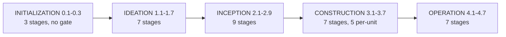

# Workflow Model: Phases, Stages, Scopes, Depth and Tiers

> **Source**: [awslabs/aidlc-workflows](https://github.com/awslabs/aidlc-workflows/tree/3c3146cfd7cef33020d48e8d48d4e80d0f8c2820) — branch `v2`, commit `3c3146cf` (v2.6.40, retrieved 2026-08-21)
> **Status**: As-built specification derived from the implementation; the upstream code is authoritative over this document.

---

## 1. Purpose and boundaries

This document specifies the **static workflow model**: the phase spine, the stage
inventory, the scope grid that selects stages, the depth and test-strategy dials,
and the compile pipeline that turns authored YAML frontmatter into the runtime's
`stage-graph.json` / `scope-grid.json` pair. It also covers the adaptive composer,
which is the only producer of non-stock scope grids.

It deliberately stops at the boundary of the runtime. How the engine walks the
selected sub-DAG, emits directives, and enforces gates belongs to
`02-orchestration-engine.md`; the state file and audit ledger belong to
`03-state-audit-runtime.md`; the per-stage execution ritual (questions, gates,
§13 learnings) belongs to `04-stage-protocol.md`; agent personas and their tiers
to `05-agents.md`; sensor manifests to `06-sensors.md`; the layered rule files to
`08-memory-rules-learnings.md`; the CLI surface to `09-cli-tools.md`; per-harness
projection to `10-distribution-harnesses.md`; plugin-owned stages and scopes to
`11-plugin-system.md`.

Numbers stated here are transcribed from commands recorded in §10, *Measurement
notes*. `dist/` is generated projection output and is never source; where this
document reads `dist/`, it says so and explains why.

---

## 2. Phase model

### 2.1 The five phases

The phase vocabulary is a single ordered constant, `PHASES`
(`core/tools/aidlc-lib.ts:130`), duplicated as the stage-schema enum
`VALID_PHASES` (`core/tools/aidlc-stage-schema.ts:117`):

```text
initialization, ideation, inception, construction, operation
```

The order is load-bearing twice over. It is the **numeric prefix** each stage's
compiled `number` carries — `PHASES.indexOf(phase)` becomes the integer before
the dot (`core/tools/aidlc-graph.ts:1767`, then
`` `${prefix}.${nextIndex}` `` at `:1850`) — and it is the total order used by
`numericStageOrder` (`core/tools/aidlc-graph.ts:1510-1515`), which sorts by phase
prefix first and index second. A stage file sitting in a directory whose name is
not one of the five is a hard compile error naming the legal set
(`core/tools/aidlc-graph.ts:1772-1776`).

| # | Phase | Stage files | Numeric range | Purpose as evidenced by its stages and its rule file |
| --- | ------- | ------------: | --------------- | ------------------------------------------------------ |
| 0 | `initialization` | 3 | 0.1–0.3 | Bootstrap only: scaffold the per-intent record tree, classify the workspace, write the populated state file. All three declare `lead_agent: orchestrator`, `mode: inline`, `produces: []`, `sensors: []`, and every scope name. Ships **no** phase rule file. |
| 1 | `ideation` | 7 | 1.1–1.7 | Problem framing before solutioning. `core/memory/phases/ideation.md` mandates "Prioritize user needs and problem definition before proposing solutions" and "Keep ideation artifacts at the problem/opportunity level — no implementation details". |
| 2 | `inception` | 9 | 2.1–2.9 | Understand the existing system, specify, design the component model, decompose into Units of Work, and plan delivery. Capstone is `delivery-planning` (`execution: ALWAYS`, "capstone Inception stage, produces the detailed execution plan for Construction and Operation"). |
| 3 | `construction` | 7 | 3.1–3.7 | Per-unit design and code, then two once-only stages. `core/memory/phases/construction.md` requires "complete, runnable files — no partial implementations". |
| 4 | `operation` | 7 | 4.1–4.7 | Ship, observe, respond, and validate against NFRs. `core/memory/phases/operation.md` governs deploy/rollback/SLO discipline. |

Total: **33** stage files. There are exactly **four** phase rule files
(`core/memory/phases/{ideation,inception,construction,operation}.md`) — the
`initialization` phase is bootstrap-only and contributes no rule layer, which is
why an initialization node's compiled `rules_in_context` holds only the
`org`/`team`/`project` rows (observable in the generated
`dist/claude/.claude/tools/data/stage-graph.json`, `workspace-scaffold` node).

### 2.2 Phase progression and boundary events



*Text fallback: the five phases run in the order INITIALIZATION → IDEATION →
INCEPTION → CONSTRUCTION → OPERATION. Initialization auto-proceeds without a
gate; every later phase boundary emits the PHASE_COMPLETED / PHASE_VERIFIED /
PHASE_STARTED event trio.*

Crossing a phase boundary is detected by comparing the completed stage's `phase`
with the next stage's `phase` (`core/tools/aidlc-state.ts:2217`). On a crossing
the state writer flips the completed phase's Phase Progress row to `Verified` and
the entered phase's to `Active` (`core/tools/aidlc-state.ts:2248-2251`) and emits
three audit events in order — `PHASE_COMPLETED`, `PHASE_VERIFIED`,
`PHASE_STARTED` (`core/tools/aidlc-state.ts:2264-2277`).

**Important**: `PHASE_VERIFIED` is emitted unconditionally on any boundary. There
is no deterministic traceability gate in the engine. The traceability check is a
**conductor-run protocol**: `core/aidlc-common/protocols/stage-protocol-governance.md`
is loaded at the three post-initialization boundaries, names them explicitly —
"Ideation→Inception (approval-handoff→reverse-engineering), Inception→Construction
(delivery-planning→functional-design), Construction→Operation
(ci-pipeline→deployment-pipeline)" (`:12`) — and instructs the conductor to write
results to `<record>/verification/[phase-boundary]-verification.md` (`:22`) and
then "Log a `PHASE_VERIFIED` event" (`:27`). The `verification/` directory is
created by the scaffold step (`core/tools/aidlc-utility.ts:3776`). The same file
states "The Initialization→Ideation transition has no governance boundary check"
(`:3`). See `04-stage-protocol.md` for the check contents.

### 2.3 Per-stage progress vocabulary

The state template pins two vocabularies (`core/tools/aidlc-utility.ts:4264` and
`:4269`):

- Phase Progress status: `Pending`, `Active`, `Verified`, `Skipped`.
- Stage checkbox: `[ ]` not started, `[-]` in progress, `[?]` awaiting approval
  (gate open), `[R]` revising (user rejected gate), `[x]` completed,
  `[S]` skipped via `--stage`/`--phase` jump.

`03-state-audit-runtime.md` owns the state file schema; the vocabularies appear
here because the composer's recompose guard reads them (§8.5).

---

## 3. The stage definition contract

### 3.1 Where a stage lives

One Markdown file per stage under
`core/aidlc-common/stages/<phase>/<slug>.md`. Two structural invariants are
enforced at compile time:

- The filename stem must equal the frontmatter `slug`, else:
  `"stage filename stem \"<stem>\" does not match frontmatter slug \"<slug>\". Rename the file or fix the slug."`
  (`core/tools/aidlc-graph.ts:1741-1745`).
- Two files claiming the same slug is a hard error naming both files
  (`core/tools/aidlc-graph.ts:1750-1757`).

The body below the frontmatter is conductor-facing prose. A representative shape
(`core/aidlc-common/stages/inception/requirements-analysis.md`, 240 lines): an H1
title, the line `MANDATORY: Follow stage-protocol.md for approval gates, question
format, and completion messages.` (`:56`), a numbered `## Steps` sequence
(`:58-198`), a `## Sensors` section naming each imported sensor and its failure
mode (`:202`), and a `## Learn` section describing the memory.md diary and §13
routing (`:211`). `core/aidlc-common/stages/construction/code-generation.md` (364
lines) follows the same shape with an added `### Critical Rules` block and an
explicit two-part Planning/Generation split gated by `### Step 3: Plan Approval`.
Body semantics belong to `04-stage-protocol.md`.

### 3.2 Frontmatter schema

`validateStageFrontmatter` (`core/tools/aidlc-stage-schema.ts`) is the single
gate. It rejects unknown keys outright — `` `unknown key: ${key}` ``
(`core/tools/aidlc-stage-schema.ts:233-234`) — so the field list below is closed.

**Required (12)** — `core/tools/aidlc-stage-schema.ts:161-174`:
`slug`, `phase`, `execution`, `condition`, `lead_agent`, `support_agents`,
`mode`, `produces`, `consumes`, `requires_stage`, `inputs`, `outputs`.

**Optional (15)** — `core/tools/aidlc-stage-schema.ts:176`:
`number`, `name`, `plugin`, `for_each`, `workspace_requires`,
`optional_produces`, `produces_kinds`, `sensors`, `scopes`, `reviewer`,
`reviewer_max_iterations`, `review_class`, `summary_confirmation`, `when`,
`required_sections`.

**Reserved (4)** — `core/tools/aidlc-stage-schema.ts:148-153`. Present-but-inert
namespace keys, each rejected with `` `${key} is reserved (${reason}); not active yet` ``:
`on_failure` ("loop driver"), `blocks_on` ("construction worktrees"), `timeout`
("sensor binding"), `retry` ("loop driver").

| Field | Contract | Enforcement |
| ------- | ---------- | ------------- |
| `slug` | kebab-case, `^[a-z][a-z0-9-]*$` | `core/tools/aidlc-stage-schema.ts:184` |
| `phase` | one of `VALID_PHASES` | `:117-123`, `:260` |
| `execution` | `ALWAYS` \| `CONDITIONAL` | `:125` |
| `condition` | free prose; the human-readable applicability rule | required field |
| `mode` | `inline` \| `subagent` \| `pipeline` \| `mob` \| `agent-team` | `:127` |
| `support_agents` | non-empty when `mode` is `pipeline` or `mob` — `` `mode "${o.mode}" requires a non-empty support_agents` `` | `:133`, `:283-285` |
| `produces` / `optional_produces` | kebab-case artifact vocabulary names | `:196`, `:411-416` |
| `produces_kinds` | map artifact → non-empty unit-kind list; every key must appear in `produces`/`optional_produces` (`` `produces_kinds key "${name}" is not in produces` ``) | `:429-452` |
| `consumes[]` | `{artifact, required}` plus optional `conditional_on: brownfield\|greenfield` | `:135`, `:458-490` |
| `requires_stage` | list of known stage slugs; deduped at build | `core/tools/aidlc-graph.ts:1986` |
| `reviewer_max_iterations` | positive integer, requires a `reviewer` (`"reviewer_max_iterations requires a reviewer"`) | `core/tools/aidlc-stage-schema.ts:346` |
| `review_class` | `adversarial` \| `advisory`, requires a `reviewer` | `:357-360` |
| `when` | exactly one predicate key, today only `producer-in-plan` | `:159`, `:382-396` |
| `lead_agent` / `support_agents` | must resolve against the shipped agent roster, except the reserved pseudo-agent `orchestrator` | `:142`, and `knownAgents` passed at `core/tools/aidlc-graph.ts:1683,1710` |
| `number` | `^\d+\.\d+$`; an authored value is only an ordering **hint**, its absolute value is never used | `:186-190` |

Two fields exist only on the compiled node and are rejected if authored:
`rules_in_context` and `sensors_applicable` (`core/tools/aidlc-graph.ts:174-184`).

### 3.3 Axes that are frequently confused

`execution` and the scope grid are orthogonal:

- `execution: ALWAYS | CONDITIONAL` is **stage-authored applicability** — whether
  the stage may decline to run when its `condition` does not hold. The engine
  refuses `report --result skipped` for a non-CONDITIONAL stage unless the plan
  already says SKIP:
  `` `Stage "${slug}" is execution: ${node.execution}; only a CONDITIONAL stage can report skipped.` ``
  (`core/tools/aidlc-orchestrate.ts:5614-5617`).
- The scope grid decides **membership** — whether the stage is in this workflow's
  plan at all. `effectivePlanAction` is documented as separate from `execution`
  in as many words: "Keep this separate from GraphStage.execution: ALWAYS|CONDITIONAL
  describes stage-authored applicability, not whether this workflow approved the
  stage for execution." (`core/tools/aidlc-orchestrate.ts:2559-2561`).

So an `ALWAYS` stage can be SKIP in a scope (`intent-capture` is `ALWAYS` but SKIP
under `bugfix`), and a `CONDITIONAL` stage that is EXECUTE in the grid can still
self-skip at runtime.

Similarly, `execution` is not the **gate** axis: `computeGate` returns `false` only
for initialization stages and otherwise `true`
(`core/tools/aidlc-orchestrate.ts:1761,1770`), with the walking-skeleton stage as
the one deferred case (§6.4).

---

## 4. Full stage inventory

33 stages. Slug, phase, compiled number and display name, execution axis,
topology `mode`, declared `sensors`, and `produces`. Reviewer and effective
review class are in §4.2. All rows transcribed from the generated
`dist/claude/.claude/tools/data/stage-graph.json` (generated output; every field
originates in the corresponding `core/aidlc-common/stages/<phase>/<slug>.md`
frontmatter).

| # | Slug | Name | Exec | Mode | Sensors | Produces |
| --- | ------ | ------ | ------ | ------ | --------- | ---------- |
| 0.1 | `workspace-scaffold` | Workspace Scaffold | ALWAYS | inline | — | — |
| 0.2 | `workspace-detection` | Workspace Detection | ALWAYS | inline | — | — |
| 0.3 | `state-init` | State Initialization | ALWAYS | inline | — | — |
| 1.1 | `intent-capture` | Intent Capture & Framing | ALWAYS | inline | claim-sources, required-sections, upstream-coverage | `intent-statement`, `stakeholder-map`, `intent-capture-questions` |
| 1.2 | `market-research` | Market Research | CONDITIONAL | inline | required-sections, upstream-coverage | `competitive-analysis`, `market-trends`, `build-vs-buy`, `market-research-questions` |
| 1.3 | `feasibility` | Feasibility & Constraints | CONDITIONAL | inline | required-sections, upstream-coverage | `feasibility-assessment`, `constraint-register`, `raid-log`, `feasibility-questions` |
| 1.4 | `scope-definition` | Scope Definition | ALWAYS | inline | required-sections, upstream-coverage | `scope-document`, `intent-backlog`, `scope-definition-questions` |
| 1.5 | `team-formation` | Team Formation | CONDITIONAL | inline | required-sections, upstream-coverage | `team-assessment`, `skill-matrix`, `mob-composition`, `team-formation-questions` |
| 1.6 | `rough-mockups` | Rough Mockups | CONDITIONAL | inline | required-sections, upstream-coverage | `wireframes`, `user-flow`, `rough-mockups-questions` |
| 1.7 | `approval-handoff` | Approval & Handoff | ALWAYS | inline | required-sections, upstream-coverage | `initiative-brief`, `decision-log`, `approval-handoff-questions` |
| 2.1 | `reverse-engineering` | Reverse Engineering | CONDITIONAL | **pipeline** | required-sections, upstream-coverage | `business-overview`, `architecture`, `code-structure`, `api-documentation`, `component-inventory`, `technology-stack`, `dependencies`, `code-quality-assessment`, `reverse-engineering-timestamp` |
| 2.2 | `practices-discovery` | Practices Discovery | CONDITIONAL | **subagent** | required-sections, upstream-coverage | `team-practices`, `discovered-rules`, `evidence`, `practices-discovery-timestamp` |
| 2.3 | `requirements-analysis` | Requirements Analysis | ALWAYS | inline | required-sections, upstream-coverage | `requirements`, `requirements-analysis-questions` |
| 2.4 | `user-stories` | User Stories | CONDITIONAL | **mob** | required-sections, upstream-coverage, traceability | `stories`, `personas`, `user-stories-assessment`, `traceability` |
| 2.5 | `refined-mockups` | Refined Mockups | CONDITIONAL | inline | required-sections, upstream-coverage | `mockups`, `interaction-spec`, `design-system-mapping`, `accessibility-checklist`, `refined-mockups-questions` |
| 2.6 | `domain-design` | Domain Design | CONDITIONAL | inline | required-sections, upstream-coverage, traceability | `components`, `decisions`, `traceability` |
| 2.7 | `units-generation` | Units Generation | ALWAYS | inline | required-sections, upstream-coverage, traceability | `unit-of-work`, `unit-of-work-dependency`, `unit-of-work-story-map`, `traceability` |
| 2.8 | `contract-design` | Contract Design | CONDITIONAL | inline | required-sections, upstream-coverage | `contract-summary` |
| 2.9 | `delivery-planning` | Delivery Planning | ALWAYS | inline | required-sections, upstream-coverage | `bolt-plan`, `team-allocation`, `risk-and-sequencing-rationale`, `external-dependency-map`, `delivery-planning-questions` |
| 3.1 | `functional-design` | Functional Design | CONDITIONAL | inline | required-sections, upstream-coverage, linter, type-check, traceability | `entities`, `rules`, `functional-spec`, `traceability` (+ optional `frontend-components`) |
| 3.2 | `nfr-requirements` | NFR Requirements | CONDITIONAL | inline | required-sections, upstream-coverage, linter, type-check, traceability | `performance-requirements`, `security-requirements`, `scalability-requirements`, `reliability-requirements`, `observability-requirements`, `tech-stack-decisions`, `traceability` |
| 3.3 | `nfr-design` | NFR Design | CONDITIONAL | inline | required-sections, upstream-coverage, linter, type-check, traceability | `performance-design`, `security-design`, `scalability-design`, `reliability-design`, `observability-design`, `logical-components`, `traceability` |
| 3.4 | `infrastructure-design` | Infrastructure Design | CONDITIONAL | inline | required-sections, upstream-coverage, linter, type-check, traceability | `infrastructure-specification`, `monitoring-design`, `cicd-pipeline`, `traceability` |
| 3.5 | `code-generation` | Code Generation | ALWAYS | **subagent** | required-sections, linter, type-check, traceability | `code-generation-plan`, `unit-test-instructions`, `code-summary`, `traceability` |
| 3.6 | `build-and-test` | Build and Test | ALWAYS | inline | required-sections, upstream-coverage, type-check | `build-instructions`, `integration-test-instructions`, `performance-test-instructions`, `security-test-instructions`, `build-and-test-summary`, `build-test-results`, `cross-unit-traceability` |
| 3.7 | `ci-pipeline` | CI Pipeline | CONDITIONAL | inline | required-sections, upstream-coverage, linter, type-check | `ci-config`, `quality-gates`, `ci-pipeline-questions` |
| 4.1 | `deployment-pipeline` | Deployment Pipeline | CONDITIONAL | inline | required-sections, upstream-coverage | `cd-config`, `deployment-strategy`, `rollback-runbook`, `deployment-pipeline-questions` |
| 4.2 | `environment-provisioning` | Environment Provisioning | CONDITIONAL | inline | required-sections, upstream-coverage | `environment-inventory`, `validation-report`, `environment-provisioning-questions` |
| 4.3 | `deployment-execution` | Deployment Execution | CONDITIONAL | inline | required-sections, upstream-coverage | `deployment-log`, `smoke-test-results`, `health-check-report`, `deployment-execution-questions` |
| 4.4 | `observability-setup` | Observability Setup | CONDITIONAL | inline | required-sections, upstream-coverage | `dashboards`, `alarms`, `slo-config`, `log-queries`, `tracing-config`, `anomaly-config`, `observability-setup-questions` |
| 4.5 | `incident-response` | Incident Response | CONDITIONAL | inline | required-sections, upstream-coverage | `runbooks`, `incident-plan`, `escalation-matrix`, `incident-response-questions` |
| 4.6 | `performance-validation` | Performance Validation | CONDITIONAL | inline | required-sections, upstream-coverage | `load-test-plan`, `load-test-results`, `nfr-validation-matrix`, `performance-validation-questions` |
| 4.7 | `feedback-optimization` | Feedback & Optimization | CONDITIONAL | inline | required-sections, upstream-coverage | `slo-report`, `cost-analysis`, `drift-report`, `feedback-loop`, `feedback-optimization-questions` |

Aggregates: execution axis **11 ALWAYS / 22 CONDITIONAL**; topology **29 inline /
2 subagent / 1 pipeline / 1 mob**; **27** stages declare
`summary_confirmation: required`; **13** declare a reviewer. The artifact
vocabulary reachable from `produces ∪ optional_produces` holds **122** names
(`artifactsRegistry`, `core/tools/aidlc-graph.ts:1264`).

Artifact names are vocabulary tokens, not paths. `artifactFilename`
(`core/tools/aidlc-lib.ts:4666-4668`) maps `name` → `<name>.md`, with exactly one
exception: `traceability` → `traceability.json`. Path resolution then places the
file under `<record>/<phase>/<slug>/`, or `<record>/construction/<unit>/<slug>/`
for a per-unit stage, or the space-level codekb dir for the one codekb stage
(`core/tools/aidlc-orchestrate.ts:1512-1535`; `KNOWN_CODEKB_STAGES` = {`reverse-engineering`},
`core/tools/aidlc-lib.ts:4659-4661`).

### 4.1 Per-unit stages (the Construction fan-out)

Five Construction stages carry `for_each: unit-of-work` and therefore repeat once
per Unit of Work: `functional-design`, `nfr-requirements`, `nfr-design`,
`infrastructure-design`, `code-generation`. The node's own `for_each` is the
source of truth, with a defensive hard-coded cross-check set
`KNOWN_PER_UNIT_STAGES` naming the same five (`core/tools/aidlc-lib.ts:77-93`).
`build-and-test` and `ci-pipeline` run **once** after the per-unit work — the
former's `condition` reads "Always executes once after all per-unit stages are
finished."

`code-generation` is the only stage carrying `workspace_requires: true`, the
marker that the stage must write real source to the workspace root and not only
its Markdown produces (`core/tools/aidlc-lib.ts:60-65`).

Compile emits a **non-fatal advisory** when a Construction stage has
`for_each: unit-of-work` and `workspace_requires: true` but `mode !== "subagent"`,
because the autonomous Construction swarm fires on that exact field match and
would silently not fire (`core/tools/aidlc-graph.ts:1915-1929`). The swarm itself
belongs to `02-orchestration-engine.md`.

Four stages declare `produces_kinds`, a per-unit-kind applicability filter over
their own produces (`functional-design`, `nfr-requirements`, `nfr-design`,
`infrastructure-design`). Example: `infrastructure-design` declares
`infrastructure-specification: [service, ui, packaging]`, so a `library` unit owes
none of it. An artifact absent from the map applies to all kinds
(`core/tools/aidlc-graph.ts:151-155`).

### 4.2 Reviewers and review class

| Reviewer agent | Stages | Declared `review_class` |
| ---------------- | -------- | ------------------------- |
| `aidlc-product-lead-agent` | `intent-capture`, `rough-mockups`, `requirements-analysis`, `user-stories`, `refined-mockups` | `advisory` (authored) |
| `aidlc-architecture-reviewer-agent` | `domain-design`, `units-generation`, `contract-design` | `advisory` (authored) |
| `aidlc-architecture-reviewer-agent` | `functional-design`, `nfr-requirements`, `nfr-design`, `infrastructure-design`, `code-generation` | `adversarial` (**defaulted at compile**) |

The five Construction reviewer stages do not author `review_class:` at all; the
compiler defaults a reviewer-bearing stage to `adversarial`, the pre-class
behaviour: `stage.review_class = parsed.review_class === "advisory" ? "advisory" : "adversarial"`
(`core/tools/aidlc-graph.ts:2064-2065`). `reviewer_max_iterations` defaults to `2`
under the same rule (`:2053-2059`).

The **effective** class at runtime is a low-wins minimum over three inputs —
stage declaration, the scope's `review_cap`, and the per-run `Review Override`
state field — over the rank order `none(0) < advisory(1) < adversarial(2)`
(`core/tools/aidlc-lib.ts:8732-8770`). Nothing can raise a class: "An override or
cap can only LOWER the stage's declared class, never raise it" (`:8750-8752`), and
a stage with no reviewer resolves to `none` regardless (`:8759`). Reviewer
behaviour itself is `04-stage-protocol.md` / `05-agents.md`.

---

## 5. Scope model

### 5.1 A scope is two files, not one

A scope has an **identity file** and a **grid column**, and the two come from
different sources:

1. **Identity** — `core/scopes/aidlc-<name>.md`. Its YAML frontmatter supplies
   `name`, `depth`, `description`, `keywords`, and optionally `plugin`,
   `testStrategy`, `runner`, `skeleton`, `review_cap`, `freeform_default`. Parsed
   by `loadScopeMetadataAll` (`core/tools/aidlc-lib.ts:8643-8722`). Scope validity
   is file presence — "Scope validity is the .md-presence authority (validScopes),
   not the grid" (`core/tools/aidlc-graph.ts:991-992`).
2. **Grid column** — derived by transposing every stage's `scopes:` frontmatter
   list. A scope named by a stage is EXECUTE for it; everything else is SKIP
   (`transposeScopeGrid`, `core/tools/aidlc-graph.ts:1384-1409`).

`loadScopeMapping` re-joins the two into the legacy `ScopeDefinition` shape —
`{depth, stages, keywords, description, testStrategy?, plugin?, runner?, skeleton}`
(`core/tools/aidlc-lib.ts:8828-8852`). A scope file present with no stage naming
it is a legal **zero-EXECUTE** scope, not an unknown one
(`core/tools/aidlc-graph.ts:988-992`).

Initialization is special-cased in the transpose: `s.phase === "initialization" || (s.scopes ?? []).includes(scope)`
(`core/tools/aidlc-graph.ts:1402`). All three initialization stages are EXECUTE in
every column regardless of frontmatter — though in practice all three also list
every scope name explicitly.

Scope frontmatter is validated with loud errors:

- `skeleton` must be `on` or `off`:
  `` `Scope file ${filePath} has invalid skeleton value "${skeleton}". Expected "on" or "off".` ``
  (`core/tools/aidlc-lib.ts:8697-8700`).
- `review_cap` must be `adversarial` \| `advisory` \| `none`
  (`core/tools/aidlc-lib.ts:8706-8716`).
- A duplicate `name:` across two scope files is fatal
  (`core/tools/aidlc-lib.ts:8664-8670`).
- A `plugin:` value starting with `aidlc-` is rejected because it would clobber
  core runner paths (`core/tools/aidlc-lib.ts:8684-8687`).
- At most one **enabled** scope may set `freeform_default: true`
  (`core/tools/aidlc-lib.ts:8785-8790`).

### 5.2 The eleven stock scopes

Each scope file states its own intent in a `description:` frontmatter field —
the one line the scope offers about what it is for. `loadScopeMetadataAll` parses
it (`core/tools/aidlc-lib.ts:8674`) and `loadScopeMapping` carries it into
`ScopeDefinition` (`:8842`), so it is the declared intent the engine itself reads.
Verbatim, in the grid order used below (`grep -n '^description:' core/scopes/*.md`):

| Scope | Declared intent (`description:`) | Where |
| ------- | ---------------------------------- | ------- |
| `enterprise` | Regulated enterprise feature, full audit trail | `core/scopes/aidlc-enterprise.md:5` |
| `feature` | Full lifecycle for new features, practical depth | `core/scopes/aidlc-feature.md:5` |
| `classic` | V1-style lifecycle without ideation ceremony — the implicit default | `core/scopes/aidlc-classic.md:5` |
| `workshop` | Facilitated group session with mandatory gates | `core/scopes/aidlc-workshop.md:9` |
| `mvp` | Skip operations, ship the core | `core/scopes/aidlc-mvp.md:7` |
| `infra` | Infrastructure changes | `core/scopes/aidlc-infra.md:8` |
| `security-patch` | CVE response | `core/scopes/aidlc-security-patch.md:9` |
| `express` | Lightest run: requirements to deploy, no design pass, no reviewers | `core/scopes/aidlc-express.md:7` |
| `poc` | Prove feasibility fast | `core/scopes/aidlc-poc.md:9` |
| `refactor` | Clean up existing code | `core/scopes/aidlc-refactor.md:8` |
| `bugfix` | Fix a specific bug | `core/scopes/aidlc-bugfix.md:8` |

The mechanical shape of each scope:

| Scope | Depth | Test strategy | `skeleton` | `review_cap` | `runner` | Keywords | EXECUTE / 33 | Gates | Per-unit |
| ------- | ------- | --------------- | ----------- | -------------- | ---------- | ---------- | -------------: | ------: | ---------: |
| `enterprise` | Comprehensive | (from depth) | on | — | — | *(none)* | 33 | 30 | 5 |
| `feature` | Standard | (from depth) | on | — | true | *(none)* | 33 | 30 | 5 |
| `classic` | Standard | (from depth) | on | advisory | — | *(none)* | 26 | 23 | 5 |
| `workshop` | Standard | **Minimal** | on | advisory | — | workshop, lab, training | 26 | 23 | 5 |
| `mvp` | Standard | (from depth) | on | — | true | mvp, minimum viable | 23 | 20 | 5 |
| `infra` | Standard | (from depth) | on | — | — | infrastructure, deploy, infra | 13 | 10 | 3 |
| `security-patch` | Minimal | (from depth) | off | — | true | security, CVE, vulnerability, patch | 10 | 7 | 2 |
| `express` | Minimal | (from depth) | off | **none** | true | express, lightweight | 10 | 7 | 1 |
| `poc` | Minimal | (from depth) | on | advisory | — | proof of concept, prototype, poc, spike | 8 | 5 | 1 |
| `refactor` | Minimal | (from depth) | off | — | — | refactor, clean up, simplify | 8 | 5 | 2 |
| `bugfix` | Minimal | (from depth) | off | advisory | true | fix, bug, broken | 7 | 4 | 1 |

The ceremony columns are computed by one function, `gridCostSummary`
(`core/tools/aidlc-lib.ts:9844-9862`), so the confirmation line a user sees agrees
with the grid the engine runs. Its rules: `gates` = EXECUTE stages whose phase is
not `initialization` — the closed form of `computeGate` (`:9832-9833`); `perUnitStages`
= EXECUTE stages satisfying `isPerUnitStage`.

`workshop` is the only stock scope with a `testStrategy:` override, decoupling
test volume from depth (`core/scopes/aidlc-workshop.md:4`, verbatim
`testStrategy: Minimal`); every other scope inherits its depth as its test
strategy (§7.2).

### 5.3 The EXECUTE / SKIP grid

`E` = EXECUTE, blank = SKIP. Transposed from stage `scopes:` frontmatter;
transcribed from the generated `dist/claude/.claude/tools/data/scope-grid.json`.

| # | Stage | ent | fea | cla | wks | mvp | inf | sec | exp | poc | ref | bug |
| --- | ------- | :---: | :---: | :---: | :---: | :---: | :---: | :---: | :---: | :---: | :---: | :---: |
| 0.1–0.3 | initialization (3) | E | E | E | E | E | E | E | E | E | E | E |
| 1.1 | intent-capture | E | E | | | E | | | | E | | |
| 1.2 | market-research | E | E | | | | | | | | | |
| 1.3 | feasibility | E | E | | | E | | | | | | |
| 1.4 | scope-definition | E | E | | | E | | | | | | |
| 1.5 | team-formation | E | E | | | | | | | | | |
| 1.6 | rough-mockups | E | E | | | E | | | | | | |
| 1.7 | approval-handoff | E | E | | | | | | | | | |
| 2.1 | reverse-engineering | E | E | E | E | E | | E | E | E | E | E |
| 2.2 | practices-discovery | E | E | E | E | E | E | | | | | |
| 2.3 | requirements-analysis | E | E | E | E | E | E | E | E | E | E | E |
| 2.4 | user-stories | E | E | E | E | E | | | | | | |
| 2.5 | refined-mockups | E | E | E | E | E | | | | | | |
| 2.6 | domain-design | E | E | E | E | E | | | | | | |
| 2.7 | units-generation | E | E | E | E | E | | | | | | |
| 2.8 | contract-design | E | E | E | E | E | | | | | | |
| 2.9 | delivery-planning | E | E | E | E | E | | | | | | |
| 3.1 | functional-design | E | E | E | E | E | | | | | E | |
| 3.2 | nfr-requirements | E | E | E | E | E | E | E | | | | |
| 3.3 | nfr-design | E | E | E | E | E | E | | | | | |
| 3.4 | infrastructure-design | E | E | E | E | E | E | | | | | |
| 3.5 | code-generation | E | E | E | E | E | | E | E | E | E | E |
| 3.6 | build-and-test | E | E | E | E | E | | E | E | E | E | E |
| 3.7 | ci-pipeline | E | E | E | E | E | E | | | | | |
| 4.1 | deployment-pipeline | E | E | E | E | | E | E | E | | | |
| 4.2 | environment-provisioning | E | E | E | E | | E | | | | | |
| 4.3 | deployment-execution | E | E | E | E | | E | E | E | | | |
| 4.4 | observability-setup | E | E | E | E | | E | | E | | | |
| 4.5 | incident-response | E | E | E | E | | | | | | | |
| 4.6 | performance-validation | E | E | E | E | | | | | | | |
| 4.7 | feedback-optimization | E | E | E | E | | | | | | | |
| | **Total** | **33** | **33** | **26** | **26** | **23** | **13** | **10** | **10** | **8** | **8** | **7** |

Observations the grid makes precise:

- `enterprise` and `feature` are **structurally identical** grids; they differ only
  in `depth` (Comprehensive vs Standard) and hence in artefact detail and question
  volume. `core/scopes/aidlc-feature.md` states this: "The difference from
  `enterprise` is depth, expressed in the stage bodies and the org/team rule layers,
  not in which stages run."
- `classic` and `workshop` are also structurally identical (all of inception,
  construction and operation; all seven ideation stages SKIP); they differ only in
  `testStrategy` and `keywords`.
- `infra` is the **only** scope where `reverse-engineering` is SKIP, and the only
  scope that runs the NFR/infrastructure design pass without `code-generation`.
- `express` reaches deployment without `units-generation`, `ci-pipeline`,
  `nfr-*` or `infrastructure-design`; its scope file names the consequence — "The
  swarm path is structurally unreachable because `express` skips Units Generation,
  so no Unit DAG can exist" (`core/scopes/aidlc-express.md`).
- `mvp` is the only scope that runs ideation, inception and construction but
  **zero** operation stages (4 / 9 / 7 / 0 by phase) — the grid form of its
  declared intent, "Skip operations, ship the core".
- `poc` is the only Minimal scope that runs any ideation stage at all
  (`intent-capture` alone), which is how "Prove feasibility fast" survives
  contact with a 8-stage grid.
- `bugfix` has the smallest grid of the eleven (7): initialization, then
  `reverse-engineering` + `requirements-analysis`, then `code-generation` +
  `build-and-test`. No design stage and no operation stage — "Fix a specific bug".
- `refactor` is the only Minimal scope that keeps `functional-design`.
- `security-patch` is the only Minimal scope that keeps **both**
  `nfr-requirements` and the deployment pair. Each half alone is shared:
  `express` is also Minimal (`core/scopes/aidlc-express.md:3`) and also runs
  `deployment-pipeline` + `deployment-execution` (rows 4.1 and 4.3 above), but it
  skips `nfr-requirements`; `refactor` and `bugfix` skip both halves.

### 5.4 Scope validation: errors vs advisories

`validateScope` builds the scope's EXECUTE set and delegates to `validateGrid`
(`core/tools/aidlc-graph.ts:1085-1097`). Two severities
(`core/tools/aidlc-graph.ts:1166-1201`):

- **Error** — a required consume whose artifact has **no producer anywhere in the
  graph**: `` `Stage "${stage.slug}" requires artifact "${consume.artifact}" but no stage in the graph produces it.` ``
- **Advisory** — a required consume whose producers exist but are **off this
  scope's path**: `` `... whose producer(s) [...] are not on the "${label}" path. Ensure existing artifact is current.` ``

`consumes[].required: false` is silent by design, and `conditional_on` consumes
are filtered out when a `projectType` is supplied (`:1169-1177`).

`opts.strict` — used only by in-flight recompose — promotes the advisory to an
error with the suffix `"Strict (recompose) mode rejects a starved required input."`
(`:1192-1195`). Unknown slugs and non-`EXECUTE`/`SKIP` actions error in both
modes, and a grid missing any compiled stage errors with
`"Every compiled stage must be explicitly EXECUTE or SKIP."` (`:1134-1155`).

Measured over the eleven stock scopes (all exit 0, zero errors):

| Scope | Advisories | Nature |
| ------- | -----------: | -------- |
| `enterprise`, `feature`, `mvp` | 0 | complete grids |
| `poc`, `bugfix` | 1 | `code-generation` consumes `unit-of-work` from the skipped `units-generation` |
| `classic`, `workshop` | 2 | `refined-mockups` consumes `wireframes` / `user-flow` from the skipped `rough-mockups` |
| `refactor` | 3 | as `bugfix`, plus `functional-design`'s upstream |
| `security-patch` | 8 | design + CI + provisioning producers skipped |
| `infra` | 9 | application-side producers skipped |
| `express` | 11 | no design pass, no CI, no provisioning |

The comment at `core/tools/aidlc-utility.ts:5228-5233` names why these are
tolerated: "a stock scope may be BORN with structural advisories … the scope
author owns that upstream work"; only *new* starvation introduced by a flip is
rejected.

### 5.5 Scope selection

Three routes, in the order the engine resolves them:

1. **Explicit** — `--scope <name>`, validated against `validScopes()` (file
   presence).
2. **Keyword inference** — `inferScopeFromText`
   (`core/tools/aidlc-utility.ts:5563-5602`). Each keyword compiles to a
   word-boundary regex, `` new RegExp(`\\b${tokens.join("\\s+")}\\b`, "i") ``
   (`:5578`), so "debug" does not trigger `bugfix` and "proof  of  concept" with
   extra whitespace still matches. Scopes are scanned in **alphabetical** order and
   the first match wins, deterministically (`:5574`, `:5596-5601`). Critically,
   inference is **suppressed for anything longer than 5 words**: "keyword + >5
   words → likely a project description containing the keyword incidentally"
   (`:5586-5594`), which routes to the default instead with `source: "freeform"`.
   `enterprise`, `feature` and `classic` ship `keywords: []` and are therefore never
   inferable — they must be named.
3. **Default ladder** — `AWS_AIDLC_DEFAULT_SCOPE` when set and valid
   (`envDefaultScope`, `core/tools/aidlc-lib.ts:8902-8908`), else the single
   hard-coded constant `export const DEFAULT_SCOPE = "classic";`
   (`core/tools/aidlc-lib.ts:8896`). When the preferred name is not an *enabled*
   scope, `selectionAwareDefaultScope` falls back first to any scope nominating
   itself via `freeform_default: true`, then to the sole enabled plugin's first
   scope (`core/tools/aidlc-lib.ts:8910-8947`).

### 5.6 Composed scopes

Beyond the eleven stock columns, `scope-grid.json` may carry **composed** entries
appended by the composer at approval time. These have no frontmatter producer, so
a bare re-transpose would delete them. `mergeComposedScopes`
(`core/tools/aidlc-graph.ts:1432-1459`) folds any on-disk column the transpose did
not produce back into the fresh grid, guarded by `preserveNames` so an orphan
column with no matching `.md` is dropped rather than mistaken for a composed
scope. The stakes are named in the comment: without the merge, "the name stays
'valid' and resolves as all-SKIP, an emptied plan with no diagnostic" (`:1425-1427`).

Composed scopes are deliberately excluded from stock-match candidacy —
`nearestStockScopes` filters to names some stage declares
(`core/tools/aidlc-graph.ts:1022-1027`).

---

## 6. Ceremony modifiers on a scope

### 6.1 `runner: true`

Marks the scope as worth its own generated runner skill (`/aidlc-<scope>`); read
into `ScopeMetadata.runner` at `core/tools/aidlc-lib.ts:8693-8694`. Five scopes
set it: `bugfix`, `express`, `feature`, `mvp`, `security-patch`. Runner generation
is `09-cli-tools.md` / `10-distribution-harnesses.md`.

### 6.2 `review_cap`

A ceiling on stage review weight for the whole workflow: `advisory` degrades every
adversarial stage to a single advisory pass; `none` disables reviewer dispatch
entirely. Four scopes cap to `advisory` (`bugfix`, `classic`, `poc`, `workshop`);
`express` alone sets `none`, and its scope file states the intent — "Reviewers are
disabled by `review_cap: none`". Resolution is §4.2.

### 6.3 `freeform_default`

No shipped core scope sets it; the mechanism exists so a plugin-only install can
nominate its own lean default (`core/tools/aidlc-lib.ts:8914-8926`).

### 6.4 `skeleton` and the walking-skeleton gate

`skeleton: on|off` is the scope's declared walking-skeleton **stance default**.
Seven scopes are `on` (`classic`, `enterprise`, `feature`, `infra`, `mvp`, `poc`,
`workshop`); four are `off` (`bugfix`, `express`, `refactor`, `security-patch`) —
the three incremental scopes plus `express`. Three scope files name the same
rationale. Two carry it verbatim — "One of the three incremental scopes that skip
the walking-skeleton ceremony" (`core/scopes/aidlc-refactor.md:27-28`,
`aidlc-security-patch.md:33-34`, soft-wrapped). The third phrases the same
sentence differently: "This scope is one of the three incremental scopes that skip
the walking-skeleton ceremony (alongside `refactor` and `security-patch`),"
(`core/scopes/aidlc-bugfix.md:28-29`).

The gate anchor is **derived, never hardcoded**. `isSkeletonGateStage` returns true
only for the first Construction EXECUTE stage of the active scope
(`core/tools/aidlc-orchestrate.ts:1357-1361`), which
`firstInScopeStageOfPhase("construction", scope)` resolves per scope as:

| Anchor stage | Scopes |
| -------------- | -------- |
| `functional-design` (3.1) | `enterprise`, `feature`, `classic`, `workshop`, `mvp`, `refactor` |
| `nfr-requirements` (3.2) | `infra`, `security-patch` |
| `code-generation` (3.5) | `express`, `poc`, `bugfix` |

Derived two ways, both agreeing: (a) the first construction-phase EXECUTE row per
scope column in the compiled grid (§5.3, `scope-grid.json`); (b) the shipped
runtime function itself, `firstInScopeStageOfPhase("construction", scope)` invoked
from `dist/claude` for all eleven scopes. Note that `security-patch` anchors at
`nfr-requirements`, not `code-generation` — the in-source comment at
`core/tools/aidlc-orchestrate.ts:1353-1354` says otherwise but is stale (§10,
item 9). The rest of that comment records the design intent and still holds: "A
scope-mapping edit that moves the first construction stage moves the skeleton gate
with it, no code change" (`:1355-1356`).

Because the stance ultimately depends on free-form team prose under a
`## Walking Skeleton` heading, the engine cannot classify it and defers: it emits
`gate: "unresolved"` for that one stage, the conductor classifies and reports via
`report --skeleton-stance`, and the next `next` resolves the boolean
(`core/tools/aidlc-orchestrate.ts:1221-1240`). The recorded stance lives in the
state field `"Skeleton Stance"` and is one of `on` / `off` / `scope-dependent`
(`:1234-1240`).

Resolution (`resolveSkeletonGate`, `core/tools/aidlc-orchestrate.ts:1398-1416`)
returns `true` in **every** stance. `on` forces an always-gate at Bolt 1; `off`
runs Bolt 1 as a regular Bolt, but `Construction Autonomy Mode` is unset (treated
as gated) until the post-Bolt-1 ladder prompt, so the batch gate is presented
anyway; `scope-dependent` falls back to `scopeDefaultSkeletonStance`
(`:1363-1369`) and recurses. The comment is explicit that this is not a no-op:
"the engine cannot EMIT a boolean it has not determined … the determinism is in
having classified" (`:1389-1393`).

Only the exact string `"autonomous"` in `Construction Autonomy Mode` disables the
per-batch gate; unset, empty, `"gated"`, and any unrecognised value all read as
not-granted (`core/tools/aidlc-orchestrate.ts:1251-1267`). The ladder prompt and
Bolt semantics belong to `02-orchestration-engine.md`; the vocabulary
(Bolt / walking skeleton / ladder prompt / parallel batch) is defined in
`core/aidlc-common/protocols/stage-protocol.md:841-844`.

The composer may not move the anchor: an in-flight flip that changes which stage
is first-Construction-EXECUTE is rejected with
`"the flip moves the first EXECUTE stage of Construction (the walking-skeleton gate anchor) … The skeleton gate must stay anchored; jump or change scope instead."`
(`core/tools/aidlc-utility.ts:5210-5225`).

---

## 7. Depth and test strategy

### 7.1 Depth

Three levels, case-normalised on input and stored title-cased
(`VALID_DEPTHS`, `core/tools/aidlc-utility.ts:140-144`):

```text
minimal → "Minimal"   standard → "Standard"   comprehensive → "Comprehensive"
```

An unrecognised value is a loud failure:
`` `Unknown depth: "${rawDepth}". Valid depths: minimal, standard, comprehensive.` ``
(`core/tools/aidlc-utility.ts:5403`).

Depth is stored once in the state file as `- **Depth**: <value>`
(`core/tools/aidlc-utility.ts:4245`) and defaults to the active scope's `depth:`
frontmatter unless `--depth` overrides it (`:4106`). It is **advisory to the
model, not machine-enforced**: no engine decision routes on it. Its consumer is
the stage protocol, which reads `aidlc-state.md → **Depth**` to set expected
question volume (`core/aidlc-common/protocols/stage-protocol.md:269`):

| Depth | Target questions per stage | Guidance (verbatim gist) |
| ------- | --------------------------- | -------------------------- |
| Minimal | ~2–4 | "Ask only what's essential to proceed." |
| Standard | ~5–8 | "Cover the stage's topic areas. Follow up on ambiguities." |
| Comprehensive | ~8–12+ | "Cover all topic areas in depth. Generate additional context-aware questions beyond the reference set." |

Source: `core/aidlc-common/protocols/stage-protocol.md:277-281`. The protocol adds
"These are guidelines, not hard caps" and holds contradiction detection mandatory
at every level (`:283-288`). It also declines to hardcode counts, instructing
readers to run `aidlc-utility.ts scope-table` rather than copying stage counts
into the protocol (`:744-746`).

Overrides land at three points per the protocol (`:767-770`): the `--depth` flag,
the scope-confirmation prompt, or any approval gate. The persistent write path is
`aidlc-utility.ts config-change --depth`, which rewrites the state field and emits
a `DEPTH_CHANGED` audit event (`core/tools/aidlc-utility.ts:5425-5444`).

### 7.2 Test strategy

Same three-level vocabulary, an independent axis (`VALID_TEST_STRATEGIES`,
`core/tools/aidlc-utility.ts:146-150`), typed as
`export type TestStrategy = "minimal" | "standard" | "comprehensive";`
(`core/tools/aidlc-testing-posture.ts:22`).

**Default rule** — the effective strategy is the scope's `testStrategy:` override
if present, else the effective depth:

```ts
const effectiveTestStrategy = testStrategyOverride
  ? VALID_TEST_STRATEGIES[testStrategyOverride.toLowerCase()]
  : (scopeDef.testStrategy ?? effectiveDepth);
```

(`core/tools/aidlc-utility.ts:4108-4110`). Stored as `- **Test Strategy**: <value>`
(`:4246`). Only `workshop` ships an override today, so the `scope-table` output
prints `(default)` for the other ten.

Unlike depth, test strategy **is** machine-consumed. `resolveTestingPosture` reads
the state field and normalises it, silently falling back to `"standard"` for an
unrecognised value (`normalizeStrategy`, `core/tools/aidlc-testing-posture.ts:489-499`;
read at `:714`). `combineTestObligations(scope, strategy)`
(`core/tools/aidlc-testing-posture.ts:507-553`) then produces a structured
obligation record carrying `strategy`, `strategy_volume`, `scope_floor`, and a
`combination_rule`:

| Strategy | `strategy_volume` obligations (verbatim) |
| ---------- | ------------------------------------------ |
| `minimal` | "One verifiable test per requirement at the narrowest effective level." / "At least one happy-path unit test per component." / "Unit tests are the default; a bugfix/security scope floor may require an integration or E2E regression when that is the narrowest level that reproduces the defect." |
| `standard` | "Five to eight tests per component." / "Unit tests plus integration tests for key boundaries." / "Add E2E, performance, or security tests when requirements demand them." |
| `comprehensive` | "Ten to fifteen tests per component." / "Unit, integration, and E2E tests." / "Add performance and security tests when NFRs demand them." |

The **scope floor** is additive and orthogonal
(`core/tools/aidlc-testing-posture.ts:528-545`):

| Scope class | Floor |
| ------------- | ------- |
| `mvp`, `enterprise`, `feature`, `infra` | "Meet an 80% line-coverage floor." + "Run the selected tests in CI before merge." |
| `bugfix`, `security-patch` | "Include a targeted regression for the bug or vulnerability." + "Keep the existing test suite green." |
| everything else | "Keep the existing test suite green." + "This scope adds no extra new-test floor beyond the selected test strategy." |

The `combination_rule` string is explicit that neither replaces the other:
"Apply every selected-strategy obligation and every scope-floor obligation;
neither replaces the other …" (`core/tools/aidlc-testing-posture.ts:550-551`).
The protocol's prose model for Minimal names its inspiration — "**Minimal —
Nyquist model** … the minimum tests needed to verify every requirement — no more,
no less" (`core/aidlc-common/protocols/stage-protocol.md:799-808`). How the
posture contract is rendered into a code-generation plan and fingerprinted for
approval is `04-stage-protocol.md`.

Changing it emits `TEST_STRATEGY_CHANGED` (`core/tools/aidlc-audit.ts:131,242`).

### 7.3 The third dial: `Review Override`

A per-run ceiling on review class, set by `config-change --review` with values
`adversarial` \| `advisory` \| `none` and rejected loudly otherwise
(`core/tools/aidlc-utility.ts:155-162`). `adversarial` is stored as an **empty**
field because it means "no per-run ceiling" (`:164-168`). Combined with the scope
cap per §4.2. The three configurable keys are exactly
`["depth", "test-strategy", "review"]` (`core/tools/aidlc-utility.ts:152`).

### 7.4 Tiers — a different axis entirely

`core/tools/aidlc-tiers.ts` does **not** implement depth or test strategy. It
implements a per-**agent** tier that names how much judgment a persona's work
demands, and projects that one authored fact onto each harness's model/effort
knobs. The vocabulary is ordered high-to-low and the order is load-bearing for
clamping:

```ts
export const TIERS = ["judgment", "balanced", "templated"] as const;
```

(`core/tools/aidlc-tiers.ts:66`; `capTier` clamps by index at `:169-172`).

Semantics, from the module header (`core/tools/aidlc-tiers.ts:3-15`): `judgment`
is "multi-constraint reasoning under ambiguity whose output cascades downstream"
and inherits the session's model and effort so "the user's ceiling is never
silently capped"; `balanced` is "reviewer-shaped work (novel input judged against
explicit criteria)"; `templated` is "dominantly pattern-following output whose
methodology already lives in knowledge" and is "the one place the framework steps
DOWN on its own". The invariant: "Tiers only ever step down, never up, and only
for templated work".

Projection is a table keyed by tier and harness (`TIER_PROJECTIONS`,
`core/tools/aidlc-tiers.ts:117-152`) with `null` meaning "omit the key so the
harness's own default applies". Three harness slots are model-only *by design* —
the `TierProjection` type gives them no effort/variant key at all, so a leak is
structurally impossible (`grep -n 'BY DESIGN' core/tools/aidlc-tiers.ts` → `83`,
`97`, `106`):

- `kiro: { model: string | null }` (`:90`) — "The kiro slot is model-only BY
  DESIGN: kiro-cli rejects effort-like keys in agent surfaces (fail-closed
  schema)" (`:83-86`); Kiro effort ships via `KIRO_TIER_EFFORT` → `cli.json`.
- `copilot: { model: null }` (`:104`) — "the model slot is model-only AND always
  omitted BY DESIGN, like kiro" (`:97`), because the CLI and IDE surfaces
  disagree on `model:` syntax, so no value is safely pinnable.
- `cursor: { model: string | null }` (`:111`) — "Model-only BY DESIGN, like kiro:
  Cursor has no effort key in agent frontmatter (effort rides the model id
  suffix)" (`:106`); all tiers ship `null` because model availability is
  plan-dependent.

A cap is resolved at **pack time**, not runtime: `AIDLC_TIER_CAP` (per-invocation)
beats a `tier_cap:` key in the layered method files org → team → project, last
writer wins (`resolveTierCap`, `core/tools/aidlc-tiers.ts:233-238`). An unknown
env value throws rather than shipping uncapped (`:176-183`), as does an unknown
tier at projection (`:249-251`). The consumer is the packager
(`scripts/package.ts:189,240,282`). All 14 shipped agents carry a `tier:` line;
`05-agents.md` owns the roster and `10-distribution-harnesses.md` the projection.

---

## 8. Stage graph compilation

### 8.1 Inputs and outputs

`compileStageGraph()` (`core/tools/aidlc-graph.ts:1640-1970`) is the single
YAML → JSON transform. It reads every `<phase>/<slug>.md` under the stages root,
the agent roster, the rule files, and the sensor manifests, and returns two
canonical JSON strings emitted together so they can never drift: "both artifacts
derive from the same in-memory stages, so a single compile keeps stage-graph.json
and scope-grid.json in lockstep" (`:1637-1639`).

Note the source tree ships **no** compiled data: `core/tools/data/` holds only
`ars-priors.json`, `model-rates.json`, and `templates/`. `stage-graph.json` and
`scope-grid.json` exist only under `dist/<harness>/`, which the packager states
in as many words — "stage-graph.json + scope-grid.json — compiled data lives only
in dist" (`scripts/package.ts:18`; the pair is listed as `COMPILED_DATA` at
`scripts/package.ts:377`).

Across the seven harness distributions, `scope-grid.json` is **byte-identical**
(one hash), while `stage-graph.json` has five distinct hashes. The whole
difference is harness-relative sensor paths: `.claude/sensors/aidlc-*.md` vs
`.codex/sensors/aidlc-*.md` and so on. Rule paths do not vary — they are
workspace-relative (`aidlc/spaces/default/memory/...`).

### 8.2 Number and name assignment

Numbers are engine-assigned and stable, never authored:

> "Numbers are ALWAYS assigned by the engine, never claimed by authors — a
> plugin's authored `number:` is a relative-ordering hint among its own new
> stages, its absolute value never used, so uncoordinated plugins cannot collide."
> (`core/tools/aidlc-graph.ts:24-27`)

Mechanics (`core/tools/aidlc-graph.ts:1649-1852`):

1. Harvest `number` and `name` per slug from the existing `stage-graph.json`. A
   slug with a pinned row keeps both (`:1652-1654`, `:1777-1781`).
2. Track the highest index already used per phase prefix, bumping it as new stages
   are seeded so a multi-stage plugin gets contiguous indices (`:1656-1669`).
3. New slugs are deferred and then ordered **within their phase batch by their own
   `requires_stage` edges** (Kahn), with ties broken by the authored `number:`
   hint's index segment and then slug (`:1801-1836`). Edges are deduped first
   because "a duplicated requires_stage entry would strand the stage at indegree > 0
   and misreport a copy-paste duplicate as a cycle" (`:1804-1807`).
4. A cycle among new stages is fatal, naming the *stuck* set rather than claiming
   to name the cycle: `` `Cannot seed stage numbers for phase "..." : requires_stage cycle among new stages (stuck: ...). Break the cycle.` `` (`:1837-1846`).
5. `name` falls back to the authored `name:` and then to the title-cased slug
   (`:1778-1779`, `titleCaseSlug` at `:1562-1567`).

Seeding only ever **adds** rows: "Seeding only ever ADDS rows, it never renumbers
a stage that already has a row, so an in-flight workflow's slug-keyed state is
safe." (`:41-43`). Renumbering an existing stage remains an explicit JSON edit.

### 8.3 Resolution passes

After the numeric sort (`:1855`), two enrichment passes bake context onto each
node so no runtime walk of the rule or sensor directories is ever needed:

- **Rules** — `resolveRulesForStage` assigns `rules_in_context`, a strict-additive
  chain `org → team → project → phase` where the phase row is attached by matching
  the stage's own `phase:` against `phases/<phase>.md`
  (`core/tools/aidlc-graph.ts:1864-1867`; model at `:480-494`; priority map
  `SCOPE_PRIORITY` at `:524-529`). The model carries no `enforcement` field: "every
  applicable rule is concatenated and ALL apply at runtime; conflicts are rejected
  at admission gates" (`:110-115`). See `08-memory-rules-learnings.md`.
- **Sensors** — `resolveSensorsForStage` turns the stage's `sensors: [<id>]` pull
  import into `sensors_applicable` rows of `{id, path, matches?}`, copying the
  manifest's capability glob verbatim. Unknown ids throw at compile: "authoring
  errors fail loud at compile, not at fire time" (`:1869-1876`; shape at `:121-132`).
  The PostToolUse hook reads the snapshotted `matches` off the graph node and
  "never re-opens the manifest at fire time" (`:126-127`). Six manifests ship. See
  `06-sensors.md`, `07-hooks.md`.

### 8.4 Compile-time invariants

| # | Invariant | Failure |
| --- | ----------- | --------- |
| 1 | Frontmatter passes the schema | `` `${filePath}: schema validation failed: ${errors.join("; ")}` `` (`:1711-1715`) |
| 2 | Filename stem == slug | `:1741-1745` |
| 3 | No duplicate slug, both files named | `:1750-1757` |
| 4 | Phase directory is one of the five | `:1772-1776` |
| 5 | `plugin:` is not `aidlc` and does not start with `aidlc-`, and the slug is prefixed `<plugin>-` | `:1718-1738` |
| 6 | Every `requires_stage` names a known slug | `` `Unknown requires_stage: "${dep}" on stage "${stage.slug}". Every requires_stage entry must reference a known stage slug.` `` (`:1890-1895`) |
| 7 | **Edge-local ordering**: for every edge `A ∈ B.requires_stage`, `numericOrder(A) < numericOrder(B)` | `` `Compile invariant violated: stage "..." (n) requires "..." (m) — dependency must be lower-numbered.` `` (`:1896-1904`) |
| 8 | Plugin **selection closure**: an enabled stage's required consume must have at least one enabled producer | `` `Plugin selection closure failed: enabled stage "..." consumes required artifact "...", but its only producer(s) are disabled: ...` `` (`:1580-1609`) |
| 9 | Swarm-trigger shape (per-unit + workspace_requires ⇒ `mode: subagent`) | **advisory on stderr only**, never fails (`:1907-1929`) |
| 10 | Ordering edges into selection-disabled stages | **advisory**, surfaced by the doctor (`selectionDroppedOrderingEdges`, `:1611-1630`) |

Invariant 7 is chosen deliberately over comparing topological sorts, because
topological order is non-unique under fan-out and sort-equivalence would be
tautological: "The edge-local check captures the real failure mode"
(`:1881-1885`). It is the guarantee that lets the serial runtime linearise a
sub-DAG by numeric order. `topoSort` and `findCycles` exist for analysis and
future scheduling and "do not gate runtime iteration today" (`:18-20`). A cycle
check over the shipped graph returns nothing.

### 8.5 Canonical emission and drift

Both emitters are the sole writers of their file, which is what makes
`compile --check` byte-comparison robust — "formatter drift is impossible when
there's exactly one writer" (`core/tools/aidlc-graph.ts:1345-1348`).
`canonicalStageGraphJson` (`:1349-1362`) walks a pinned 28-entry `FIELD_ORDER`
(`:449-478`) and drops `undefined`, so key order is construction-independent.
`canonicalScopeGridJson` (`:1416-1418`) relies on the transpose having already
sorted scope names, with per-scope stage keys following the numeric stage order.
`runCompileCheck` (`:2073-2076`) compares both against disk and exits non-zero on
mismatch.

Separately, `stageGraphDrift()` (`core/tools/aidlc-graph.ts:1536-1560`) is a cheap
slug-set difference safe for the session-start hot path:

- `missingFiles` (graph → disk) — a compiled slug with no file. "a real runtime
  breakage … The doctor reports it as a hard fail."
- `uncompiledStages` (disk → graph) — a stage file the graph does not know about.
  "the runtime resolves stages from the compiled graph only (loadGraph), so this
  file is silently never executed until `aidlc-graph compile` regenerates the
  graph. Advisory".

### 8.6 The graph CLI

Twelve subcommands, listed below in `COMMANDS` declaration order
(`core/tools/aidlc-graph.ts:2548-2773`; usage text at `:2812-2843`):

```text
artifacts  producers  consumers  topo  cycles  scope
validate-scope  ars  validate-grid  compile  resolve  export
```

The workflow-model relevant ones: `scope <name>` prints the EXECUTE sub-DAG
(`subgraphForScope`, `:994-1009`); `validate-scope <name>` runs §5.4;
`validate-grid --proposal <path> [--strict] [--project-type <t>] [--keywords <csv>]`
validates an unnamed grid and is the composer's gate; `resolve <name>` emits
`.aidlc-plan.json`, "byte-identical to lib.ts's stagesInScope()" with a parity test
"across all 11 scopes" (`:1042-1046`); `compile [--check]` regenerates or guards
the pair. `09-cli-tools.md` owns the full CLI surface.

---

## 9. The adaptive composer

### 9.1 Role

`core/agents/aidlc-composer-agent.md` is a delegated agent (`tier: judgment`,
`disallowedTools: Task`, `:14-15`) that proposes an EXECUTE/SKIP grid. It states
the model plainly: "A **scope** is an EXECUTE/SKIP grid over the full stage set
(33 stages today; the compiled stage graph is authoritative). You compose the grid
by principled estimation; the deterministic engine runs whatever grid is approved."
(`:29-31`). Its operating discipline is factored into
`core/knowledge/aidlc-composer-agent/composing.md`, whose first line frames the
objective: "propose the minimum viable workflow - the least sufficient EXECUTE set
that still produces every artifact the task's outcome depends on" (`:3-5`).

### 9.2 The three moments

`core/agents/aidlc-composer-agent.md:39-65`:

1. **Front** — fresh project, no workflow: score the task and compose.
2. **Report** — a user-supplied scan report (e.g. SonarQube-style JSON) is the
   captured intent, so the ideation framing stages "are answered by its existence -
   screen them out rather than scoring them in" (`:47-49`).
3. **In-flight** — a workflow is running: re-estimate from evidence and propose
   flips for **pending, ahead-of-cursor stages only**. Completed `[x]`,
   in-progress `[-]` and skipped `[S]` stages are frozen, and "Never propose
   flipping the walking-skeleton gate anchor" (`:57-65`).

### 9.3 What it reads

- `aidlc-utility.ts detect --json`, which returns the workspace scan plus the two
  and only two paths it may write: `scopesDir` and `scopeGridPath` (`:80-82`).
- Structural evidence from exactly one source — CodeKB MCP when present and
  indexed, otherwise a bounded workspace scan. "Never blend the two paths"
  (`:88-94`).
- The compiled stage graph (`consumes`/`produces` edges) — "Stages are
  data-coupled, not just ordered: check `consumes`/`produces` in the stage graph
  before cutting anything mid-arc" (`composing.md:43-44`).
- For in-flight, the live state file.

Its efficiency rule forbids browsing scope files: "never read scope `.md` files
otherwise - the grid JSON has the complete EXECUTE/SKIP data; the `.md` files only
add depth and keywords metadata" (`:604-607`).

### 9.4 The ARS screen

Five components in `[0,1]` — IAE (intent ambiguity), CSU (codebase structural
uncertainty), VE (verification entropy), R (risk/blast radius), UA (unresolved
assumptions) (`:98-104`) — banded continuously as LOW `[0.00,0.30)`, MED
`[0.30,0.70)`, HIGH `[0.70,1.00]` (`:112-114`).

The composite is computed **by the tool, never by hand** (`:154-157`):

```text
ARS = 100 × [0.20·IAE + 0.30·CSU + 0.25·VE + 0.15·R + 0.10·UA]
```

matching `core/tools/data/ars-priors.json` `weights` exactly
(`{iae:0.2, csu:0.3, ve:0.25, r:0.15, ua:0.1}`). That file also holds
`componentBands` (`{lowMax:0.3, medMax:0.7}`), five `compositeBands`
(0–20 Near-direct, 21–40 Focused, 41–60 Standard, 61–80 Comprehensive,
81–100 Full ceremony), `evThresholds` mapping cost 1–5 to a minimum component
score (`{1:0, 2:0.2, 3:0.3, 4:0.4, 5:0.5}`), and a per-stage entry for all 33
stages carrying `targets`, `cost`, and optional `projectTypes` (e.g.
`reverse-engineering` → `{targets:["csu"], cost:4, projectTypes:["brownfield"]}`).

The agent file is unambiguous that the scalar is advisory: "These weights are
UNCALIBRATED priors and the composite is an advisory index for the human at the
gate: stage selection keys off the component bands and the fold discipline …
never off the scalar, and nothing deterministic routes on it" (`:182-185`).

Selection then applies a two-part test — positive expected value against the
component bands and cost priors (`:355-386`, `:501-517`), then a **fold**
subsumption test that dominates it: "a stage with genuine positive EV still SKIPs
when its contribution is already covered. This is the lever that keeps a high-ARS
intent from inflating to full ceremony" (`:496-498`). A named fold table
(header and separator at `:457-458`, eight data rows at `:459-466`) lists the
eight default folds (reverse-engineering into CodeKB, feasibility into
domain-design, rough-mockups into refined-mockups, user-stories into
requirements-analysis, practices-discovery into reverse-engineering,
delivery-planning into units-generation, nfr-design into nfr-requirements,
requirements-analysis into intent-capture) each with an explicit un-SKIP trigger.

### 9.5 Validation and routing

Every proposal must pass `validate-grid` before it is shown: "Exit 1 = rejected
grid. Fix or withdraw the SKIP. Never show an invalid grid." (`:563`). The
composer must copy the validator's `summary` verbatim rather than recount
(`:564-565`), which is exactly why `ScopeValidation` carries `summary` and
`nearest_stock` — "The composer copies this into its proposal verbatim so the gate
the human sees leads with numbers the validator computed, not an LLM recount"
(`core/tools/aidlc-graph.ts:206-209`).

Routing (`:573-612`):

- **In-flight** — never matches or synthesizes. Preserve scope name, depth and
  every frozen action; return only `changes.skip` / `changes.add`. "Approval lands
  only through `recompose --skip <changes.skip> --add <changes.add>`" (`:582`).
  In-flight validation runs `--strict`.
- **Front/report** — route solely on `validate-grid.nearest_stock[0]` of the final
  proposal. Distance `<= 2` with compatible depth ⇒ `mode: "matched"`, adopt the
  stock grid **verbatim**, re-validate, and require the selected scope to rank at
  `diff: 0` (`:589-600`). Otherwise `mode: "custom"` and synthesize. `--new-scope`
  forces synthesis.

### 9.6 Gate and write

The conductor renders the proposal in three blocks and "holds approve/edit/reject.
… Never write before explicit human approval." (`:716-723`). An **edit** to an
adopted stock grid must convert the mode to `custom`, "because matched approval
writes no scope file and would silently discard the edit" (`:729-733`).

On approval (`:735-749`) the composer writes exactly two things — the identity
file `aidlc-<name>.md` (frontmatter `name`, `depth`, `keywords: []`) in `scopesDir`,
and a `"<name>": { "stages": { ... } }` entry in `scopeGridPath` — and is told
"**NEVER run `aidlc-graph.ts compile` after the write.** The runtime reads the JSON
verbatim." A matched or in-flight proposal writes nothing.

Composed scopes ship `keywords: []` so they never enter inference; granting
keywords is an explicit human choice at the gate and triggers the collision check
(`:753-760`), which is a hard error because inference takes the first alphabetical
match and a duplicate "would permanently shadow the incumbent scope on every
future cold start" (`keywordCollisions`, `core/tools/aidlc-graph.ts:1220-1248`).

### 9.7 The `recompose` verb

The deterministic in-flight write (`core/tools/aidlc-utility.ts:5106-5340`). It
flips per-stage EXECUTE/SKIP suffixes on the live state file — which override the
scope grid at read time (`effectivePlanAction`,
`core/tools/aidlc-orchestrate.ts:2562-2571`). Guards, in order:

1. At least one flip named, else usage error (`:5120`).
2. A running workflow must exist and `Status` must be `Running` (`:5129`, `:5161`).
3. Autonomy guard — refused while Construction autonomy is active (`:5141-5148`).
4. Every named slug must be compiled (`:5189-5191`).
5. Every named slug's checkbox must be **pending**:
   `` `its checkbox is not pending ([${state}]). Only a PENDING stage's plan can be re-shaped; completed/in-progress/skipped stages are frozen.` `` (`:5195`).
6. Every named slug must be ahead of the cursor: "In-flight recompose only reaches
   forward; re-running the past is out of scope." (`:5199`).
7. The walking-skeleton anchor must not move (§6.4, `:5210-5225`).
8. Strict validation as a **diff**: only strict errors "present post-flip that was
   absent pre-flip" reject (`:5228-5238`). Stages already `[x]` are marked EXECUTE
   in both grids so a flip after a producer already ran is not falsely starved
   (`:5239-5245`).

---

## 10. Documentation / code discrepancies

Recorded per the ground rule that code wins.

| # | Claim | Where | Code says |
| --- | ------- | ------- | ----------- |
| 1 | "31 stage definitions"; "a bad YAML edit across 31 stage files"; "Regenerate stage-graph.json from the 31 YAML stage files" | `core/tools/aidlc-graph.ts:8`, `:1695`, `:1632` | 33 stage files exist and 33 rows compile. Stale comments only; no behaviour depends on the number. |
| 2 | `ScopeCostSummary.total` documented as "stages in the grid (32 today, never hardcoded)" | `core/tools/aidlc-lib.ts:9829` | 33. The value is computed from `Object.keys(stages).length`, so only the comment is stale. |
| 3 | "`feature` … remains the implicit freeform fallback" | `core/scopes/aidlc-feature.md:27` | `export const DEFAULT_SCOPE = "classic";` (`core/tools/aidlc-lib.ts:8896`), and `core/scopes/aidlc-classic.md` calls itself "the implicit default scope". `feature` is not the fallback. |
| 4 | `infra` is "the only non-enterprise/feature scope that runs the operation phase" | `core/scopes/aidlc-infra.md:29-30` | The compiled grid puts operation stages in `classic` (7), `workshop` (7), `express` (3) and `security-patch` (2) as well. |
| 5 | "`feature` runs all 33 with 29 gates" | `docs/guide/05-scopes-and-depth.md:127` | `gridCostSummary` yields **30** gates for `feature` (33 EXECUTE minus 3 initialization stages). The same page's `bugfix` numbers (7 stages / 4 gates / 1 per-unit) are correct. |
| 6 | Phase boundaries described as "a **verification gate** runs automated traceability checks" | `docs/guide/04-phases-and-stages.md:63` | The engine emits `PHASE_VERIFIED` unconditionally (`core/tools/aidlc-state.ts:2270`). The traceability check is conductor-run protocol (`stage-protocol-governance.md`), not a deterministic engine gate. |
| 7 | `build-and-test` frontmatter `outputs:` prose names `test-results.md`; `performance-validation` likewise | `core/aidlc-common/stages/construction/build-and-test.md`, `.../operation/performance-validation.md` (frontmatter `outputs:`) | The machine-read `produces` names are `build-test-results` and `load-test-results`, which `artifactFilename` resolves to `build-test-results.md` / `load-test-results.md` (`core/tools/aidlc-lib.ts:4666-4668`). The prose `outputs:` field is descriptive only; `produces` is authoritative. |
| 8 | A worked example names `application-design` as a downstream EXECUTE stage | `core/agents/aidlc-composer-agent.md:445-446` (soft-wrapped as `application-` / `design`) | No such stage; it was renamed to `domain-design` (`core/tools/aidlc-utility.ts:2065`, `core/tools/aidlc-lib.ts:10595`). Prose-only residue in a non-normative example. |
| 9 | The skeleton-gate anchors, per comment: "functional-design for feature/enterprise/mvp/refactor/classic, code-generation for poc/bugfix/security-patch, nfr-requirements for infra" | `core/tools/aidlc-orchestrate.ts:1353-1354` | `security-patch` anchors at **`nfr-requirements`**, not `code-generation`: `nfr-requirements` is EXECUTE for `security-patch` in the compiled grid, and `firstInScopeStageOfPhase("construction", "security-patch")` returns `nfr-requirements`. The comment also predates `workshop` (→ `functional-design`) and `express` (→ `code-generation`), naming neither. Stale comment only — the anchor is computed, never read from this list, so no behaviour depends on it (§6.4). |

Item 5 aside, `docs/guide/05-scopes-and-depth.md`'s stage-by-scope matrix
(`:138-171`) reproduces the compiled grid exactly, cell for cell and total for
total; it is kept in sync by a test named in its own HTML comment
(`tests/unit/t244-scope-matrix-doc-sync.test.ts`).

---

## 11. Measurement notes

Repo root for all commands:
`<clone>/` = the upstream checkout at commit `3c3146cfd7cef33020d48e8d48d4e80d0f8c2820`.
Commands were run from `<clone>/` unless a `cd` is shown.

| Number stated | Command (predicate + target set) | Result |
| --------------- | ---------------------------------- | -------- |
| 33 stage files | `find core/aidlc-common/stages -name '*.md' -type f \| wc -l` | `33` |
| per-phase counts 3/7/9/7/7 | `find core/aidlc-common/stages -name '*.md' -type f -printf '%h\n' \| sort \| uniq -c` | construction 7, ideation 7, inception 9, initialization 3, operation 7 |
| 11 scope files | `ls -1 core/scopes/*.md \| wc -l` | `11` |
| 33 compiled stages; numbers/slugs | `bun -e 'const g=require("./dist/claude/.claude/tools/data/stage-graph.json"); console.log(g.length)'` and the same file mapped to `number+" "+slug` | `33`, `0.1`…`4.7` |
| modes 29 inline / 2 subagent / 1 pipeline / 1 mob; execution 11 ALWAYS / 22 CONDITIONAL; 5 `for_each`; 1 `workspace_requires`; 13 reviewers; 27 `summary_confirmation` | `bun -e` over `dist/claude/.claude/tools/data/stage-graph.json` tallying `s.mode`, `s.execution`, and filtering `s.for_each`, `s.workspace_requires`, `s.reviewer`, `s.summary_confirmation` | as stated |
| 11 scope columns; EXECUTE/33 per scope | `bun -e` over `dist/claude/.claude/tools/data/scope-grid.json` counting entries with value `"EXECUTE"` per scope | bugfix 7, classic 26, enterprise 33, express 10, feature 33, infra 13, mvp 23, poc 8, refactor 8, security-patch 10, workshop 26 |
| grid cells (§5.3 table) | `bun -e` joining `stage-graph.json` slug order against `scope-grid.json` columns, printing `E`/`.` per cell | reproduced in §5.3 |
| gates and per-unit counts per scope | `bun -e` over both generated files applying `gridCostSummary`'s rules (`phase !== "initialization"` ⇒ gate; `for_each === "unit-of-work"` ⇒ per-unit) | ent 30/5, fea 30/5, cla 23/5, wks 23/5, mvp 20/5, inf 10/3, sec 7/2, exp 7/1, poc 5/1, ref 5/2, bug 4/1 |
| depth / test-strategy / EXECUTE table (§5.2 cross-check) | `cd dist/claude && bun .claude/tools/aidlc-utility.ts scope-table` | 11 rows; `workshop` alone shows TestStrategy `Minimal`, the other ten `(default)` |
| 122 artifacts | `cd dist/claude && bun .claude/tools/aidlc-graph.ts artifacts \| wc -l` | `122` |
| advisories per scope (§5.4) | `for s in enterprise feature mvp poc bugfix refactor infra security-patch classic workshop express; do bun .claude/tools/aidlc-graph.ts validate-scope "$s"; done` from `dist/claude`, counting lines matching `\[advisory\]` and `\[error\]` and recording exit codes | all `exit=0`, `errors=0`; advisories 0,0,0,1,1,3,9,8,2,2,11 in that order |
| no cycles in the full graph | `cd dist/claude && bun .claude/tools/aidlc-graph.ts cycles` | no output (exit 0) |
| 12 graph subcommands | `bun -e` extracting `^  "?([a-z][a-z-]*)"?:\s*(\(\|async)` from the `COMMANDS` object literal in `core/tools/aidlc-graph.ts` | `artifacts, producers, consumers, topo, cycles, scope, validate-scope, ars, validate-grid, compile, resolve, export` |
| 7 harness distributions; `scope-grid.json` identical; `stage-graph.json` 5 distinct | `find dist -name scope-grid.json -exec shasum {} \;` and `find dist -name stage-graph.json -exec shasum {} \; \| awk '{print $1}' \| sort -u` | one hash `60fb4547…` across 7 grids; 5 distinct stage-graph hashes across 7 |
| stage-graph harness difference is sensor paths only | `diff dist/claude/.claude/tools/data/stage-graph.json dist/codex/.codex/tools/data/stage-graph.json` | every hunk is `.claude/sensors/…` vs `.codex/sensors/…` |
| 6 sensor manifests | `ls -1 core/sensors/` | `aidlc-claim-sources.md`, `aidlc-linter.md`, `aidlc-required-sections.md`, `aidlc-traceability.md`, `aidlc-type-check.md`, `aidlc-upstream-coverage.md` |
| 4 phase rule files | `find core -path '*core/memory*' -name '*.md'` (the looser `-path '*memory*'` also matches `core/knowledge/aidlc-shared/memory-template.md`, which is not a rule file) | 7 paths: `core/memory/{org,team,project}.md` + `core/memory/phases/{ideation,inception,construction,operation}.md` (no `initialization.md`) |
| 8 default folds (§9.4) | `awk 'NR>=459 && NR<=466' core/agents/aidlc-composer-agent.md \| wc -l` (`:457` header, `:458` separator, `:459-466` data rows) | `8` |
| `workshop` is the sole `testStrategy:` override (§5.2) | `grep -n '^testStrategy:' core/scopes/*.md` | one hit: `core/scopes/aidlc-workshop.md:4:testStrategy: Minimal` |
| declared intents, 11 scopes (§5.2) | `grep -n '^description:' core/scopes/*.md` | 11 hits, one per scope file; quoted verbatim in §5.2 (surrounding quotes stripped where the YAML value is quoted) |
| skeleton-gate anchor per scope (§6.4) | (a) `bun -e` over `scope-grid.json` × `stage-graph.json`, taking the first `phase === "construction"` EXECUTE stage per scope; (b) `cd dist/claude && bun -e` calling the shipped `firstInScopeStageOfPhase("construction", scope)` for all 11 scopes | both agree: `functional-design` for ent/fea/cla/wks/mvp/ref; `nfr-requirements` for inf/sec; `code-generation` for exp/poc/bug |
| per-phase EXECUTE split per scope (§5.3 observations) | `bun -e` over both generated files tallying EXECUTE stages by `phase` | `mvp` 3/4/9/7/0 (no operation); `poc` ideation 1; `bugfix` 7 total (3 init + 2 inception + 2 construction) |
| 3 model-only harness slots (§7.4) | `grep -n 'BY DESIGN' core/tools/aidlc-tiers.ts`; `grep -n 'kiro: {\|copilot: {\|cursor: {' core/tools/aidlc-tiers.ts` | `83`, `97`, `106`; declarations at `:90`, `:104`, `:111` |
| 14 agents, all tiered | `ls -1 core/agents/*.md \| wc -l`; `grep -rn "^tier:" core/agents/*.md` | `14`; 14 `tier:` lines (9 `judgment`, 2 `balanced`, 3 `templated`) |
| ARS weights, bands, EV thresholds, 33 stage priors | `bun -e` reading `core/tools/data/ars-priors.json` keys `weights`, `componentBands`, `compositeBands`, `evThresholds`, `Object.keys(stages).length` | `{iae:0.2,csu:0.3,ve:0.25,r:0.15,ua:0.1}`; `{lowMax:0.3,medMax:0.7}`; 5 composite bands; `{1:0,2:0.2,3:0.3,4:0.4,5:0.5}`; `33` |
| version 2.6.40 | `head -8 CHANGELOG.md` | `## [2.6.40] - 2026-08-21` (note `package.json` `"version": "0.0.0"` — the package manifest is not the version source) |
| stage-file line counts cited in §3.1 | `wc -l core/aidlc-common/stages/inception/requirements-analysis.md core/aidlc-common/stages/construction/code-generation.md core/aidlc-common/stages/initialization/state-init.md` | `240`, `364`, `123` |
| `core/tools/data/` holds no compiled graph | `ls core/tools/data/` | `ars-priors.json`, `model-rates.json`, `templates` |
| 2 plugin stages, 1 plugin scope (out of the shipped grid) | `find plugins -path '*stages*' -name '*.md'`; `find plugins -path '*scopes*' -name '*.md'` | `test-pro-full-suite.md`, `test-pro-integration.md`; `test-pro-validation.md` |
