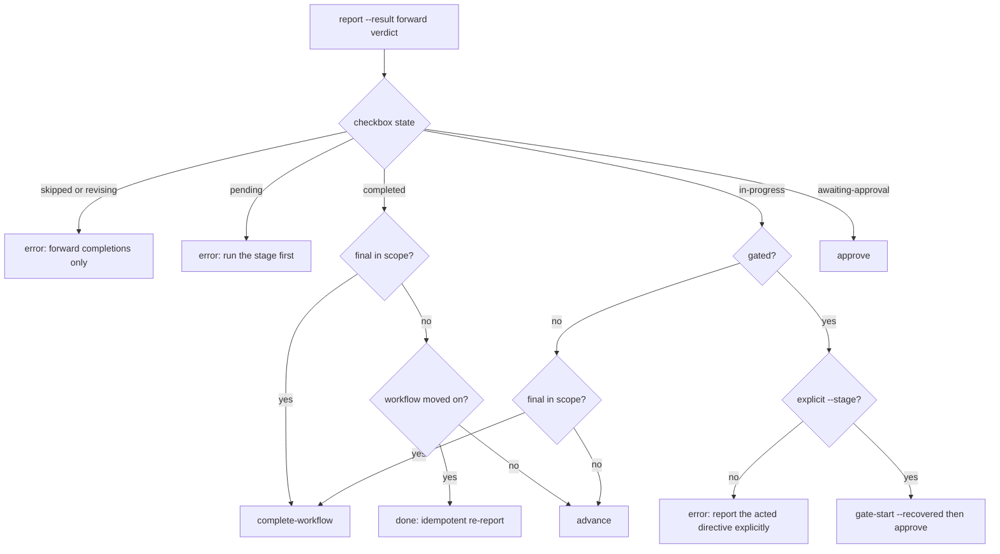

# オーケストレーションエンジンと指令(directive)プロトコル

> **Source**: [awslabs/aidlc-workflows](https://github.com/awslabs/aidlc-workflows) — branch `v2`, commit `3c3146cf` (v2.6.40, retrieved 2026-08-21)
> **Status**: 実装から導出されたas-built仕様である。upstream のコードが本書に対して正本となる。
> **正本**: 英語版 `02-orchestration-engine.md`(この日本語版は参照訳。両者が食い違う場合は英語版が優先)

## 1. 本書のスコープ

本仕様は**エンジンループ**を記述する — 「次に何が起こるか」に答える決定的な CLI、それが出力する型付き指令(directive)、その結果の遷移をコミットする report 呼び出し、そして周辺のモード(jump、park/resume、単一ステージ隔離、ルール配送の継続)である。加えて conductor 契約 — 各指令に対してモデル側が実行すべき事柄 — も規定する。

他所の管轄: ステージ/フェーズ/スコープモデルとコンパイル済みグラフ(`01-workflow-model.md`)、state ファイル・チェックボックスのライフサイクル・`report` が書き込む監査台帳(`03-state-audit-runtime.md`)、conductor がステージ内で実行する散文形式のステージプロトコルとゲート儀式(`04-stage-protocol.md`)、エージェントペルソナ(`05-agents.md`)、センサー(`06-sensors.md`)、ループを監視する Stop/PostToolUse フック(`07-hooks.md`)、そのテキストを本エンジンが搬送するメモリ/ルール層(`08-memory-rules-learnings.md`)、本エンジンが shell out する姉妹 CLI ツール(`09-cli-tools.md`)、`core/` を `dist/<harness>/` へ投影するパッケージング(`10-distribution-harnesses.md`)、プラグイン所有のステージ(`11-plugin-system.md`)、テストコーパス(`12-testing-ci.md`)。

### 1.1 コンポーネントマップ

| File | Lines | Role |
| --- | --- | --- |
| `core/tools/aidlc-orchestrate.ts` | 6169 | エンジン本体。4 つのサブコマンド: `next`、`continue`、`report`、`park`。 |
| `core/tools/aidlc-directive.ts` | 1362 | 凍結されたワイヤ契約: 指令(directive)種別についての判別ユニオンおよび `validateDirective`。I/O なし。 |
| `core/tools/aidlc-jump.ts` | 487 | `resolve`(純粋な読取: ターゲットと方向)と `execute`(jump をコミットする変更操作)。 |
| `core/tools/aidlc-runner-gen.ts` | 841 | ステージ別の `--single` ランナースキルとそのドリフトガードを生成する。 |
| `core/tools/aidlc.ts` | 1197 | 単一エントリのディスパッチャ。4 つのエンジン動詞を `aidlc-orchestrate.ts` へルーティングする。 |
| `core/aidlc-common/conductor.md` | 136 | conductor の実行品質憲章。最初の `run-stage` で in-band 配送される。 |
| `harness/claude/skills/aidlc/SKILL.md` | 255 | conductor の転送ループ(Claude harness)。配送済みの `dist/claude/.claude/skills/aidlc/SKILL.md` とバイト同一。 |
| `harness/claude/skills/aidlc/question-rendering.md` | 155 | プロトコルの構造化された質問を `AskUserQuestion` に紐づける harness 附属文書。 |

`dist/` は生成された投影出力であり、何が配送されるかを記述するためだけにここで参照される。`core/` と `harness/` が正本(ソース)である。

---

## 2. conductor / エンジン分割

この分割はエンジン自身のヘッダで宣言され、境界の両側で反復されている。

エンジン側、`core/tools/aidlc-orchestrate.ts:8-20`:

> The engine reads workflow state (aidlc-docs/aidlc-state.md) and the compiled stage graph (data/stage-graph.json), then emits EXACTLY ONE typed Directive (JSON) to stdout. `next` mutates no workflow state itself … the conductor relays human choices and supplies resolved facts, but the engine never originates a deviation, never calls AskUserQuestion (that is a Bash tool the conductor owns), and never spawns agents.

conductor 側、`core/aidlc-common/conductor.md:3-7`:

> The forwarding loop in your runner's `SKILL.md` is the *mechanism* — get a directive from the engine, do that one move, report the outcome, repeat. This file is the irreducible *knowledge-work* the engine cannot do for you: how to run a stage **well**. The engine decides which stage is next; you own the quality of execution inside the move it named.

そして `conductor.md:33-37`:

> The engine owns lifecycle bookkeeping. Open, reject, revise, approve, complete, or skip a stage only through `aidlc-orchestrate.ts report`; never call lifecycle verbs on `aidlc-state.ts` directly or hand-edit stage checkboxes.

### 2.1 意思決定の所有権

| Decision | Owner | Evidence |
| --- | --- | --- |
| スコープ解決(state > `--scope` > 位置引数 > `AWS_AIDLC_DEFAULT_SCOPE` > デフォルト) | engine | `aidlc-orchestrate.ts:1041-1073` |
| 次に実行するステージ; 終端性; jump の方向; ゲート状態 | engine | `handleNext` `aidlc-orchestrate.ts:2587-3357`; `computeGate:1756-1771` |
| Artifact 語彙名 → `aidlc-docs/...` パス | engine | `aidlc-orchestrate.ts:61-66, 1418-1428` |
| どのコミット系 state サブコマンドが走るか(`gate-start`/`reject`/`revise`/`approve`/`advance`/`complete-workflow`/`skip`) | engine | `aidlc-orchestrate.ts:4712-4728, 5805-5891` |
| 自由記述の practices prose から分類される walking-skeleton の**構え(stance)** | conductor、型付きでフィードバックされる | `aidlc-directive.ts:24-36`; `conductor.md:96-118` |
| 自由記述テキストの continue-vs-new-work-vs-reshape 分類 | conductor(エンジンは型付き `ask` でバックストップする) | `SKILL.md:137-145`; `aidlc-orchestrate.ts:3229-3261` |
| ペルソナのフレーミング、質問品質、diary、Keep/Modify/Redo、§13 の矛盾チェック | conductor | `conductor.md:15-38, 39-54, 56-73, 75-93` |
| 人間への質問のレンダリング | conductor(`AskUserQuestion`) | `SKILL.md:80`; `question-rendering.md:9-28` |

エンジンは再実装するのではなく合成する: `aidlc-orchestrate.ts:31-58` は使用しているライブラリ読取(`loadGraph`、`nextInScopeStage`、`firstInScopeStageOfPhase`、`validScopes`、`getField`/`parseCheckboxes`、`resolveProjectDir`/`readStateFile`)を列挙し、ハッピーパス以外の分岐は姉妹 CLI へ `Bun.spawnSync` で shell out し、その stderr を `toolErrorMessage`(`:412-428`)経由で**逐語的に**中継すると述べている — これにより正準の文言が決してドリフトしない。

エンジンが**追加する**2 点は `aidlc-orchestrate.ts:60-68` に名指しされている: "(1) the decision rule that maps (observed state + graph) -> directive kind, and (2) the artifact-path resolver"。

---

## 3. CLI サーフェス

`main(argv)`(`aidlc-orchestrate.ts:6098-6157`)は `--project-dir <dir>` と `--aidlc-attempt-id <id>`(`/^[A-Za-z0-9._:-]{1,128}$/` に対して検証される)を取り除いてから、残った先頭トークンでディスパッチする:

| Subcommand | Handler | Mutates workflow state? |
| --- | --- | --- |
| `next` | `handleNext` (`:2587`) | No(§3.1 参照) |
| `continue <token>` | `handleContinue` (`:5963`) | No |
| `report` | `handleReport` (`:5464`) | Yes — spawn した `aidlc-state.ts` / `aidlc-audit.ts` サブコマンド経由のみ |
| `park` | `handlePark` (`:5937`) | Yes — spawn した `aidlc-state.ts park` 経由 |

それ以外はすべて exit 1 で stderr に `Unknown subcommand: ${subcommand ?? "(none)"}. Valid: next, continue, report, park` を出す(`:6148-6151`)。ネストしたディスパッチは `Nested aidlc-orchestrate dispatch is not supported` を投げる(`:6124`)。読取エラーが捕捉されない場合(グラフの欠落、破損した state)は非 0 で終了しメッセージを stderr に出す — 「stdout に半端に出力された directive は決してない」(`:6163-6168`)。

単一エントリのディスパッチャは、同じ 4 つの動詞をトップレベルのパススルー経路として公開している(`core/tools/aidlc.ts:92-105`): `verbs: ["next", "continue", "report", "park"]` に `tool: TOOLS.orchestrate`、加えて `compose` をプレフィックス `["next", "compose"]` へマッピングする変換経路(`:106-116`)。スラッシュフラグのエイリアスは `--resume` と `--scope` をそれぞれ `next --resume` / `next --scope` へルーティングする(`aidlc.ts:83-84`)。

### 3.1 読取専用不変条件とその2つの例外

`next` は決して workflow state(`aidlc-state.md`、チェックボックス、監査行)を書き込まない。誕生(birth)、jump、スコープ変更、config 変更はすべて conductor に対して**実行される**のではなく `print` 指令として**名指しされる**(`:10-14`、`:2863-2867`、`:3040-3063`、`:4571-4579`)。マシンローカルな 2 つの書込みが明示的に例外化されている:

1. **steering の MAC key** — `.aidlc-steering-token-key`。intent の gitignore された `.aidlc-*` ファミリー、または `aidlc/.aidlc-sessions/` 配下に遅延生成される(`:2275-2347`)。「信頼できない継続が再計算できるプロジェクト由来の値ではなく、マシンローカルなランタイム状態」と記述されている(`:2288-2292`)。
2. **アクティブ指令マーカー** — `load-steering`/`run-stage` を発行するたびに `writeActiveDirectiveMarker`(`aidlc-lib.ts:2883`)により書き込まれ、`state_sha256`、attempt id、コマンドダイジェスト、発行済み結果ダイジェストを保持する(`aidlc-orchestrate.ts:271-296, 310-355`)。フックの消費側は spec 07 の主題である。

いずれもルーティングに対して advisory であり、失敗は例外を投げるのでなく `recordHookDrop` に記録される。ただし Copilot-commit アームだけは例外で、work directive の発行を拒否する:

- `"This tracked \`next\` attempt is stale or superseded, so its prepared result was not issued. Run a fresh \`next\` in the current Copilot session."`(`:327-329`)
- `"The fresh Copilot directive could not be published, so no work directive was issued. Retry \`next\`; if coordination remains busy, run \`/aidlc --doctor\`."`(`:334-336`,`:347-349`)

### 3.2 発行の規律

`prepareEmission`(`:233-304`)→ `validateDirective` → シリアライズ → サイズ検査 → `writePrepared` が stdout へ厳密に 1 行の JSON を書く(`:306-308`)。

2 つのハード拒否があり、いずれも `process.exit(1)` と stderr テキストを伴う:

- `aidlc-orchestrate: refusing to emit a malformed directive: <errors joined by "; ">` (`:259-262`)
- `aidlc-orchestrate: refusing to emit a directive larger than ${DIRECTIVE_MAX_BYTES} bytes` (`:266-268`)

`DIRECTIVE_MAX_BYTES = 28 * 1024`(28,672 バイト)は「共通の 28 KiB harness floor」である。`STEERING_TEXT_TARGET_BYTES = 20 * 1024`、`CONTEXT_WARNINGS_MAX_BYTES = 6 * 1024`、`INLINE_CONTEXT_PATHS_MAX_BYTES = 8 * 1024`(`:1140-1143`)。

---

## 4. 指令(directive)プロトコル

### 4.1 種別(kinds)

`aidlc-directive.ts:71-81` がユニオンを宣言し、`VALID_KINDS`(`:419-430`)が「エンジン設計のカタログ順」で判別子の許可リストとなる:

```text
"load-steering", "run-stage", "dispatch-subagent", "invoke-swarm",
"present-gate", "ask", "print", "error", "done", "parked"
```

10 種類が定義されており、**うち今日実際に構築されるのは 8 種類**である。`present-gate` と `dispatch-subagent` は `aidlc-orchestrate.ts` 内のコメント(`:1031-1034`)以外には一切現れない。`SKILL.md:89` も同じことを述べ、「この 2 つのプレースホルダー的な振る舞いを見込みで実装するな」と指示している。

| Kind | Emitted today | Meaning (from the schema comments) | Required fields |
| --- | --- | --- | --- |
| `load-steering` | yes | 「アクティブなステージの決定的なルールバンドルの 1 つの有界パート」; conductor は `rules_content` を順に適用し、直ちに `continue <continue_token>` を実行する(`:83-87`) | `stage`, `bundle`, `part`, `parts`, `rules_content[]{path,text}`, `continue_token` |
| `run-stage` | yes | ルールをロードし、エージェントをロードし、`consumes` をロードし、本体を実行し、`produces` を書き、`memory.md` を保つ(`:138-143`) | §4.3 参照 |
| `dispatch-subagent` | no(プレースホルダー) | run-stage のフィールドに加え、`Task` へ渡す名指しされたワーカーの `worker`(`:261-263`) | run-stage 共有分 + `worker` |
| `invoke-swarm` | yes | 「build バッチ向けに N 個の worktree にまたがって N 個の並列ワーカーをファンアウトする」(`:288-289`) | `units[]`(+ 任意で `stage`, `stage_file`, `reviewer`, `reviewer_max_iterations`, `review_class`, `protocol_modules`, `repo`) |
| `present-gate` | no(プレースホルダー) | §13 学習儀式を実行してから承認ゲートをレンダリングする(`:320-321`) | `stage`, `phase`, `memory_path` |
| `ask` | yes | 構造化された質問をレンダリングする; 2 つのサブタイプ(§4.5) | `question` |
| `print` | yes | 「逐語的に出力して停止する(status / help / doctor / version)」(`:358`) — 実際には run-then-continue / run-then-stop の形でも使われる | `message` |
| `error` | yes | 「エラーで停止する … ユーザーに逐語的に表示される」(`:366-367`) | `message` |
| `done` | yes | 「ループを停止する(ワークフロー完了または単一ステージ完了)」(`:375-376`) | `reason` |
| `parked` | yes | 「ワークフローが途中で意図的に park された … `done` とは異なる … park されたワークフローはスコープ内のステージが未実施のまま残っている」(`:384-389`) | `reason`, `stage` |

`narration` はすべての kind で合法であり、`withNarration`(`:520-544`)によって中央で各許可キー集合へ折り込まれる。これは明示的に「プレゼンテーション用フィールドであり、ルーティング上の意味は一切持たない。すべての kind がこれを省略でき、省略してもフレームワークの挙動は何も変わらない」とされている(`:40-43`)。エンジンがこれを著すのは「エンジンはすでに決定的に、これがどのステージで、どのスコープが解決され、たった今何を決定し、次に何が来るかを知っているから」である(`:45-53`)。

### 4.2 検証(Validation)

`validateDirective(obj)`(`:553-701`)は `{valid:true,data}` または `{valid:false,errors[]}` を返し、最初のフィールドエラーで例外を投げるのではなくすべてのフィールドエラーを収集する。ルールは順に:

1. **形状(Shape)** — オブジェクトでない場合は単一のエラー `expected object, got <null|array|typeof>`(`:557-561`)。
2. **判別子(Discriminator)** — `missing or non-string required field: kind`、そうでなければ `unknown kind: "<k>" (expected one of <kinds joined by " | ">)`(`:566-576`)。両方とも短絡評価。
3. **未知キー** — kind の許可集合外のキーは `<kind>: unknown key: <key>` を生む(`:579-585`)。
4. **フィールドごとの型/存在** — `<kind>: missing required field: <f>` と `<kind>: <f> must be string, got <desc>` の形(`:764-777`)。正の整数、`{path,text}` 配列、`{path,expected}` 配列、`pipeline` オブジェクト、`protocol_modules` 列挙、ネストした `wave` 構造に対する専用検査を含む(`:829-1199`)。
5. **フィールド横断ルール** — `load-steering`: `part must be less than or equal to parts`(`:603-611`); `review_class` を持つが `reviewer` を持たない kind: `<kind>: review_class requires reviewer`(`:630-632`, `:740-742`); `ask` サブタイプのルール(§4.5)。

`checkGate`(`:783-799`)は真偽値**または**リテラル `"unresolved"` を受け付ける。それ以外(型を間違えたセンチネルを含む)は `<kind>: gate must be boolean or "unresolved", got <desc>` として拒否される。

成功時、バリデータは*同一の参照*を返す。これは「コードベース中で唯一の信頼境界のキャスト」と文書化されている(`:693-700`)。

`bun core/tools/aidlc-directive.ts` はセルフチェックであり、10 種類すべてを網羅する 12 個の整形式の例を構築し、各例ごとに `<kind>: VALID` を出力し、すべて検証成功すれば exit 0 する(`:1239-1362`)。本コミット時点で 12/12 が検証成功している。

### 4.3 `run-stage` エンベロープ

許可されるキーは `RUN_STAGE_FIELDS`(`aidlc-directive.ts:442-470`)で列挙される。`DISPATCH_SUBAGENT_FIELDS` は同一のリストから `single`、`wave`、`protocol_modules`、`swarm_settled` を除き `worker` を加えたものである(`:484-493`)。

| Field | Type | Source / semantics |
| --- | --- | --- |
| `stage`, `phase`, `lead_agent`, `support_agents`, `mode`, `sensors_applicable`, `stage_file` | routing | コンパイル済みグラフのノードからそのまま読み取られる(`aidlc-orchestrate.ts:2044-2071`)。`mode ∈ inline\|subagent\|pipeline\|mob\|agent-team`(`aidlc-directive.ts:435`); `agent-team` は予約済みで、配送されるグラフからは生成されない(`aidlc-orchestrate.ts:2050-2054`)。 |
| `inline_context_paths` | string[] | 「conductor がインラインで所有する作業のために読むべき、正確なペルソナ + ナレッジファイル: インラインステージでは lead + supports、mob では lead のみ … 完全にディスパッチされる subagent/pipeline トポロジーでは空」(`aidlc-directive.ts:161-166`)。 |
| `context_warnings` | string[]? | 非致命的なロースター問題; 6 KiB に上限がある(`aidlc-orchestrate.ts:1971-2000`)。ルール配送の失敗は代わりにブロッキングの `error` 指令になる(`aidlc-directive.ts:167-171`)。 |
| `gate` | `boolean \| "unresolved"` | §6 参照。 |
| `memory_path` | string | `<recordPrefix>/<phase>/<slug>/memory.md`、または unit ごとに `<recordPrefix>/construction/<unit>/<slug>/memory.md`(`aidlc-orchestrate.ts:1086-1098`)。 |
| `consumes` | string[] | 発行時点で**ディスク上に実在する**、宣言済みの入力のみ(`aidlc-directive.ts:177-180`)。 |
| `consumes_absent` | `{path,expected}[]?` | 発行時点で欠落している必須入力。`expected: true` = 生産元ステージがアクティブなスコープの経路外である(「不在は設計どおり。利用可能なコンテキストで代替し、artifact を捏造しないこと」); `expected: false` = 生産元がその経路上にあるがファイルが欠落している(`aidlc-directive.ts:246-258`)。 |
| `produces` | string[] | 解決済みのパス。`produces_kinds` によって kind でフィルタされ、`optional_produces` を含む(`aidlc-orchestrate.ts:1705-1732`)。 |
| `rules_in_context` | string[] | 直前の `load-steering` チェーンによって既に配送されたルールテキストの、順序付きパス一覧(`aidlc-orchestrate.ts:2489-2491`)。 |
| `reviewer`, `review_class`, `reviewer_max_iterations` | optional | ステージが reviewer を宣言し、**かつ**解決されたクラスが `none` でない場合にのみ存在する; `advisory` は iterations を 1 に固定し、`adversarial` はデフォルト 2(`aidlc-orchestrate.ts:2094-2113`)。`none` への解決はブロック全体を省略する。 |
| `protocol_modules` | enum[]? | `["reviewer","ensemble","construction","swarm"]` に対する決定的なヒント(`aidlc-directive.ts:62-68`); `aidlc-orchestrate.ts:2114-2131` で計算される。散文によるトリガーは引き続きフォールバックとして残る。 |
| `pipeline` | `{links,completed}`? | `mode: pipeline` 用のパイプライン復旧サーフェス(`aidlc-orchestrate.ts:2072-2078`)。 |
| `conductor_persona` | string? | `aidlc-common/conductor.md` の内容(`readConductorPersona` で読まれる、`aidlc-orchestrate.ts:1121-1129`)。ワークフローの最初の `run-stage` に焼き込まれる — 「Decision D-E: bake the conductor persona into the FIRST run-stage of the workflow」(`:2132-2133`、`forcePersona \|\| isFirstRunStageOfWorkflow(...)` 配下の `:2139-2143`で付与)。以降の指令ではすべて省略される。§1.1 と、`--single` での強制付与については §9 も参照。 |
| `next_stage` | `string \| null`? | 続いてスコープ内にあるステージの表示名。「承認ゲートの Approve オプションが 'Continue to <next_stage>' を逐語的に読めるよう、エンジンが解決する」; `null` = スコープ内の最終ステージ(`aidlc-directive.ts:217-224`; 計算は `aidlc-orchestrate.ts:2092-2093`)。 |
| `unit` | string? | 具体的な Unit of Work に解決された、unit ごとの Construction 指令にのみ存在する; また「この run-stage が N 回のイテレーションのうち 1 回であることのマーカー」でもある(`aidlc-directive.ts:225-236`)。 |
| `wave` | `{batch_index,entries[]}`? | 4 つのインライン per-unit design ステージ向けの、任意のステージ主体並列サーフェス(`aidlc-directive.ts:238-245`); エントリ形状は重複 unit や `required_produces ⊆ produces` の検査を含め `:1029-1199` で検証される。 |
| `swarm_settled` | `true`? | 自律型 swarm のすべての unit とレビュアーの受領が収束した後の、ゲートのみの再入; 「conductor はステージ本体もレビュアーも再実行してはならない」(`aidlc-directive.ts:207-210`)。 |
| `single` | boolean? | 隔離されたステージランナーのマーカー(§9)。 |

### 4.4 ダイジェストとフィンガープリントの結合

指令自体には自己署名は含まれないが、4 つのダイジェストが発行をそのコンテキストに結び付ける:

| Digest | Computed at | Binds |
| --- | --- | --- |
| `bundle: "sha256:<hex>"` | `sha256(JSON.stringify(loaded.content))`(`aidlc-orchestrate.ts:2492`) | チャンク化されている正確なルールテキストバンドル。 |
| `directiveHash` | `sha256(JSON.stringify(directive))`(`:2493`) | チャンクチェーンが配送先とする run-stage。 |
| route hash `r` | `sha256(JSON.stringify({node, scopeStages: subgraphForScope(scope).map(s => s.slug)}))`(`:2467-2474`) | グラフノード**と**スコープのステージメンバーシップ。 |
| `state_sha256` / payload `h` | `sha256(stateContent)`(`:2156`, `:5974`) | 指令の計算元となった state ファイル。 |

`continue_token` は HMAC-SHA256 で認証されたエンベロープ `{p: payload, m: mac}` であり、base64url でエンコードされる(`:2358-2372`)。デコード時に `timingSafeEqual` で検証される(`:2395-2405`)。ペイロードフィールド(`:1156-1175`、`:2438-2465` で入力される): `v`(=1)、`s` ステージ、`c` スコープ、`i` 次パートのインデックス、`b` バンドルダイジェスト、`d` 指令ダイジェスト、`r` route hash、`a` state-aware フラグ、`u` unit、`k` unit kind、`f` force-persona、`g` gate、`n` next_stage、`x` single、`p` per-unit、`w` wave、`z` swarm-settled、`h` state hash。デコードは正確な型テーブルに違反するペイロードをすべて拒否する(`:2409-2431`)。

### 4.5 `ask` のサブタイプ

`AskDirective` はユニオンである(`aidlc-directive.ts:335-356`): 通常の `ReportAskDirective`(回答は `report --user-input` 経由で戻る)と、`ask_type: "new-work-routing"`、`response_route: "next"` を持ち `new_work_description` と `proposed_scope` を運ぶ `NewWorkRoutingAskDirective`。コメントは明示的である: 「その回答は `next` 経由でルーティングされ、決してステージの report として記録されてはならない」(`:332-334`)。バリデータは `ask_type must be one of new-work-routing`、`new-work-routing response_route must be "next"`、そしてサブタイプ専用の 3 フィールドについて `<field> requires ask_type "new-work-routing"` を強制する(`:647-670`)。

---

## 5. `next` の意思決定ルール

`handleNext`(`aidlc-orchestrate.ts:2587-3357`)は 21 のラベル付き分岐からなる平坦なはしご構造である。前提条件とディスパッチは実行順に:

| # | Guard / branch | Emits | Notes |
| --- | --- | --- | --- |
| — | ターン形状マーカー | — | 読取専用/workspace の場合を除き `touchEngineMarker`(`:2605`) |
| — | `flags.parseError` | `error` | 例: `--review requires <adversarial\|advisory\|none>.`(`:806`) |
| — | 他モードとの `--review` 併用 | `error` | `Cannot combine --review with read-only, workspace, compose, single-stage, jump, or resume modes. Apply /aidlc --review <class> first, then run the other command.`(`:2629-2631`) |
| 0 | Kiro roll-forward ラッチ: `.aidlc-readonly-latch` と同じターンカウンタでの真の裸の `next` | `done` | Advisory、fail open(`:2635-2681`) |
| 1 | 読取専用フラグ(`--status/--help/--doctor/--version`) | `print` | `aidlc-utility.ts <sub>` を名指しする; 「これは読取専用ユーティリティであり、ワークフロー作業ではない。`next` を実行してはならない」(`:2697-2709`) |
| 1b/1c/1d | workspace / plugin / knowledge の名詞 | `print`/`error` | 先頭トークンの意味論のみ(`:2711-2775`) |
| 2 | `--stage` + `--phase` | `error` | `Cannot use --stage and --phase together. Use one or the other.`(`:2780-2784`) |
| — | state バージョンガード | `error` | カーソルの読取に先立ち `classifyStateVersion` の判定が中継される(`:2789-2803`) |
| 2.5 | `Parked` が設定済みかつ `Parked At Stage === Current Stage`、再入フラグなし | `parked` | `Workflow parked at "<slug>". Resume with /aidlc --resume.`(`:2830-2848`) |
| 2.6 | park されたワークフローに対する `--resume` | `print` | `aidlc-state.ts unpark` を名指しし、次いで `next --resume` を再実行させる(`:2856-2868`) |
| 3b | 無効な明示的 `--scope` | `error` | `Unknown scope "<s>". Valid scopes: <list>.` — state が優先する場合でも無条件に検証される(`:2880-2896`) |
| 4 | env からのスコープ | `error` | `aidlc-utility.ts resolve-env-scope` を shell し、その逐語的な `Invalid AWS_AIDLC_DEFAULT_SCOPE "…". Valid scopes: …` を中継する(`:2898-2911`) |
| — | 解決不能なスコープ | `error` | 同じ `Unknown scope` 文言(`:2921-2925`) |
| 4c | `compose` / `--new-scope` / `--report` | `print` | Composer ディスパッチ。state の有無で front/in-flight を分岐。`Cannot combine compose with --stage/--phase. Compose re-shapes the plan; jump moves the cursor. Run them separately.`(`:2940-2949`、文字列は `:2943`) |
| 4a | `--new-intent` | `print`/`error` | 空白でない description を要求する; ラダーではなく**明示的な** `--scope` を使う(`:2966-2982`) |
| 4b | `--single` | `run-stage`/`error` | §9(`:3004-3021`) |
| 5 | state に加え、有効かつ異なる `--scope` / depth / test-strategy / review | `print` | `aidlc-utility.ts scope-change` または `config-change` を名指しする(`:3028-3065`) |
| 6 | state 有りの `--resume` | `ask` | `An existing workflow was found (currently at "<slug>"). How would you like to proceed? Resume from last checkpoint, redo the current stage, jump to a stage, or start fresh.`(`:3084-3087`) |
| 7 | `--stage`/`--phase` | `print`/`run-stage`/`error` | §8 |
| 7b | 位置引数のスコープ、state なし | `print`/`ask` | Birth の print、または fresh-clone の intent 選択 ask(`:3111-3127`) |
| 8 | 自由記述テキスト、state なし | `ask` | キーワード一致 → コスト条項付きのスコープ確認; それ以外は compose の提案(`:3148-3183`) |
| 9a | 明示的な `--scope`、state なし | `print` | Birth(`:3196-3210`) |
| 9b | state なし、名指しされたスコープなし | `error` | `No workflow state found (no active intent). Start one by describing what to build (/aidlc "build the auth service") or by naming a scope (/aidlc --scope <scope>).`(`:3220-3227`) |
| 9c | ワークフローがアクティブな状態での自由記述テキスト | `ask`(`new-work-routing`) | conductor の分類に対するエンジンのバックストップ(`:3241-3261`) |
| 10 | ハッピーパス | `run-stage` / `invoke-swarm` / `done` / `error` / `print` | §5.1 |

Birth は決して `next` によって実行されない: `createPrintDirective`(`:876-916`)は `bun <harness>/tools/aidlc-utility.ts intent-create --scope <s> [--arguments <json>] --label "<2-3 word kebab essence>"` を名指しし、`--new-intent` の変種はさらに conductor に対して停止しフレッシュなセッションへ引き継ぐよう指示する。重複 birth ガード `intentPickPromptIfRecordsExist`(`:1001-1020`)は「record は存在するが active-intent カーソルがない」状態を、2 つ目の intent を生成するのではなく `ask` に変換する。

### 5.1 分岐 10 — ハッピーパス

1. `Current Stage` が存在しなければならず、なければ `State file has no Current Stage field — cannot determine the next stage.`(`:3266-3271`)。
2. In-flight = チェックボックス状態 ∈ {pending, in-progress, awaiting-approval, revising} または未設定(`:3281-3286`)。
3. **プラン/カーソル不一致**: in-flight ステージの有効な plan action が `SKIP` である場合、エンジンは run-stage の発行を拒否する。`in-progress`/`revising` では復旧方法を名指しする(`report --stage <slug> --result skipped --reason "stage is SKIP in the approved workflow plan"`); それ以外はエラーになる: `Stage "<slug>" is SKIP in the approved workflow plan but its active cursor state is "<state>". Refusing to emit run-stage; repair the inconsistent state before continuing.`(`:3293-3312`)。
4. In-flight → まず `tryEmitSwarm(...)`、そうでなければ `emitForSlug(...)`(`:3314-3328`)。
5. Completed/skipped → `nextInScopeStage(currentSlug, scope, stateContent)`; `null` なら理由 `Workflow complete — no in-scope stage remains after <slug> (scope: <scope>).` を伴う `done`。加えて `NEW_WORK_HINT` の接尾辞(`:3332-3348`、ヒントテキストは `:853-857`)。

`effectivePlanAction`(`:2562-2571`)は生きたプランを解決する: state ファイルのステージ別 EXECUTE/SKIP 接尾辞(recomposition)が静的なスコープグリッドに優先する。

### 5.2 per-unit イテレーションと swarm アーム

`emitForSlug`(`:4394-4416`)は `for_each: unit-of-work` ノードを、`Construction Iteration` が厳密に `unit-major` のとき `emitUnitMajorRunStage` へ、それ以外は `emitPerUnitRunStage` へルーティングする。

Per-unit の意味論(`:3616-3634`、`emitPerUnitRunStage` `:4013-4201`): カバレッジは per-unit の**ディスク上の artifact**である(unit ライフサイクル導入後は `UNIT_COMPLETED` の受領も加わる、`:3672-3695`); エンジンは最初のカバーされていない unit を `directive.gate = false` で発行し(`:4198`、根拠コメントは `:4190-4197`)、conductor は report せずに `next` を再実行する; カバーされていない unit がなくなると、最後の unit のために、そのステージの実際に計算されたゲートを持って再発行する — 「これがゲートが発火する唯一の指令である」(`:4172-4186`)。ステージが skeleton-gate ステージであり構えが記録されていない場合、per-unit イテレーションは遅延され、まず `gate:"unresolved"` を伴う単純な `{unit-name}` 指令が発行される(`:4026-4044`)。

swarm アーム(`tryEmitSwarm`, `:3483-3589`)は、ノードが `for_each: unit-of-work` **かつ** `mode: subagent` を持つ Construction ステージであり、skeleton-gate ステージ**でなく**、`Construction Autonomy Mode` が厳密に `autonomous` である場合にのみ発火する(`:3400-3410`)。これはディスク上の artifact ではなく `SWARM_UNIT_CONVERGED` 監査行をキーとして、`next` ごとに 1 つの Bolt バッチを前進させる(`:3446-3463`); すべての unit が収束すると、`swarm_settled: true` を持ち、reviewer フィールドを取り除いた settle の `run-stage` を、`protocol_modules: ["construction","swarm"]` とともに発行する(`:3435-3444`, `:3519-3532`)。

---

## 6. エンジンレベルでのゲートモデル

ゲートは `run-stage` 上の単一のフィールドであり、独立した指令 kind ではない(`present-gate` という kind は存在するが決して発行されない)。`computeGate`(`:1756-1771`)の 3 つの結果は、そのドキュメントコメント(`:1734-1742`)で名指しされている:

- initialization フェーズ → `false`(`:1761`; 「bootstrap は自動進行し、ガバナンスゲートなし」、`:1736`);
- 記録された構え(stance)がない skeleton-gate ステージ(スコープの最初の Construction EXECUTE ステージ) → `GATE_UNRESOLVED`;
- それ以外すべて → `true`。

`isSkeletonGateStage` はハードコードではなく導出される: `firstInScopeStageOfPhase("construction", scope)`(`:1349-1361`)。ゲート軸は `execution: ALWAYS|CONDITIONAL` の包含軸と明示的に直交している(`:1744-1746`)。

**classify の往復。** `aidlc-directive.ts:24-36` はその論拠を述べている: 構え(stance)は「LLM がチームの自由記述の `## Walking Skeleton` practices prose を読んで解決するものである(パーサが自由な英語を stance に変換するのではない)」。conductor は `conductor.md:106-118` に従って分類し、`report --skeleton-stance <on|off|scope-dependent>` として返す; `handleSkeletonStanceReport`(`:4943-5008`)はその値を検証し、state ファイルの存在を要求し、`Current Stage` がそのスコープの skeleton-gate ステージであることを要求し(`Current stage "<slug>" is not the skeleton-gate stage for scope "<scope>" — a skeleton stance is only reported for the first Construction Bolt's gate.`)、`aidlc-state.ts set-skeleton-stance` 経由でフィールドを書き込み、`Recorded walking-skeleton stance "<stance>" for "<slug>". Re-run \`next\` to continue — the gate is now determined.`を出力する。`resolveSkeletonGate` は今日どの stance に対しても `true`を返すが、コードはそれでもこの往復が存在価値を持つ理由を記している: 「エンジンは自ら決定していない真偽値を EMIT できない」(`:1371-1416`)。

**ゲートが強制される場所。** エンジンはゲートの*ライフサイクル*を report 側で強制する(§7); レビュアーの前提条件と artifact/human-presence ガードは意図的に `aidlc-state.ts handleApprove` に存在する。なぜなら「report のみのガードはバイパス可能」だからである(`:5878-5883`)。ゲートで conductor が実行する散文的儀式 — 質問 → artifact → レビュアー → §13 学習 → `awaiting-approval` → Approve/Request Changes — は `04-stage-protocol.md` で規定され、`SKILL.md:100-105` に要約されている。

---

## 7. `report` — 書込み側

`handleReport`(`:5464-5927`)は「aidlc-state.ts の遷移サブコマンドに対するディスパッチャであり、それらの遷移ロジックを一切再実装しない」(`:4698-4703`)。すべての変更は spawn されたサブプロセス内で発生する; `spawnState` は `AIDLC_STATE_TRANSITION_OWNER: orchestrate:<pid>` を渡す(`:4879-4887`)。spawn される各サブコマンドはすでにアトミックであるため、エンジンは監査ロックを保持しない(`:4705-4710`)。

### 7.1 受理される判定(verdicts)

`REPORT_RESULTS` = `FORWARD_RESULTS ∪ GATE_RESULTS ∪ RESUME_RESULTS ∪ {"skipped"}`(`:4736-4745`)。`--result` なしのライブ呼び出しは正準のリストを逐語的に返す:

```text
report requires --result <outcome>. Accepted: approved, completed, complete, done,
awaiting-approval, rejected, revised, resume, resumed, skipped
(the verdict for the stage just acted on).
```

未認識の値は `Unknown --result "<v>". accepted outcomes: <list>.` を生む(`:5535-5543`)。`approved`/`completed`/`complete`/`done` は互換な同義語である: 「呼び出し元ではなくエンジンが、ゲート状態と終端性からコミットするサブコマンドを選ぶ」(`:4730-4735`)。

### 7.2 ガード順序

1. ターン形状マーカー(`:5470`)、次いですべての report 経路に適用される state バージョンガード(`:5476-5488`)。
2. `--single` → `handleSingleReport`(§9)。単一ステージのコミットが決して state を変更するサブコマンドへフォールスルーしないよう、最初に解決される(`:5490-5499`)。
3. `--skeleton-stance` → classify 往復。stance の report は判定(verdict)を持たないため、`--result` 要求より先に解決される(`:5501-5513`)。
4. `resume`/`resumed` → `handleResumeReport`(`:5517-5520`)。
5. `--result` が必須かつ認識可能であること(`:5522-5543`)。
6. state ファイルが存在すること、なければ `No active intent workflow state found (aidlc-state.md is absent) — nothing to report a transition for.`(`:5545-5554`)。
7. `Current Stage` が存在すること; 対象ステージは `--stage` が与えられればそれ、なければ `Current Stage` — 明示的なピンは「conductor がすでに Current Stage を動かしている可能性がある古びたポインタの隙間を閉じる」(`:5556-5570`)。
8. `Scope` が存在すること; ノードがコンパイル済みグラフに存在すること(`Internal: reported stage "<slug>" is not in the compiled graph — cannot commit its transition.`); チェックボックス行が存在すること(`Stage "<slug>" is not present in the state file — cannot commit its transition.`)(`:5572-5599`)。
9. `skipped` アーム(§7.4)。
10. `isGated = node.phase !== "initialization"`(`:5669`)、次いでゲートライフサイクルアーム(§7.3)。
11. まだ完了していないあらゆるステージに対する完了証跡ガード `checkStageCompletionEvidence`(`:5128-5230`): パイプラインのリンク受領、per-unit カバレッジ、一時停止 unit の拒否、ensemble 貢献の証跡。
12. practices-discovery 昇格受領(`:5772-5784`)。
13. Human-presence ガード: ゲート付きでまだ完了していないステージに対して、autonomy が `autonomous` ではなく `AIDLC_SKIP_HUMAN_PRESENCE_GUARD !== "1"` の場合、空白の `--user-input` は拒否される: `report --result <r> for "<slug>" requires --user-input with the human's exact approval choice.`(`:5786-5797`)。

### 7.3 ディスパッチ意思決定ルール

終端性は `nextInScopeStage(slug, scope, stateContent) === null`(`:5801`)。コミット系列(`:5810-5891`):

| Checkbox state | Gated? | Final? | Sequence |
| --- | --- | --- | --- |
| `skipped` / `revising` | — | — | 拒否: `Stage "<slug>" is <state>; report commits forward completions only.` |
| `pending` | — | — | 拒否: `Stage "<slug>" is still pending. Run the stage before reporting it complete.` |
| `completed` | — | yes | `complete-workflow <slug>`(`Status` が既に `Completed` であれば、no-op を説明する `done`) |
| `completed` | — | no | `advance <slug>`(ただし、ワークフローがすでに先へ進んでいる場合は例外 — 陳腐化した再 report ガードにより冪等な `done`) |
| `in-progress` | yes | — | 明示的な `--stage` を要求。なければ拒否。その後 `gate-start <slug> --recovered` + `approve <slug>` |
| `awaiting-approval` | yes | — | `approve <slug>`(approve は自己委譲で advance/complete-workflow を呼ぶ。エンジンが加えて advance も呼んではならない — `:4716-4723`) |
| any | no | yes | `complete-workflow <slug>` |
| any | no | no | `advance <slug>` |

ゲートライフサイクルの判定は完了ガードより前に処理される(`:5674-5751`): `awaiting-approval` は `in-progress` を要求し(`only an in-progress stage can open a gate`)、`gate-start` をディスパッチする; `rejected` は `in-progress`/`awaiting-approval` に加え空でないフィードバックを要求し、`reject --feedback` をディスパッチする; `revised` は `revising` を要求し(`only a revising stage can re-enter its gate`)、`revise` をディスパッチする。それぞれが `print` を返す — `Recorded <result> for "<slug>".`。

spawn されたサブコマンドの非 0 終了はすべて `Transition rejected by aidlc-state.ts <sub> for "<slug>": <stderr or stdout>` として中継される(`:5896-5906`)。成功は `Committed <subs joined by " + "> for "<slug>" (scope: <scope>). State advanced; run next to continue.` という `done` を発する(`:5921-5926`)。

### 7.4 `skipped` と resume ルーティング

`skipped` は「ルーティングされたライフサイクル結果であり、完了ではない」ため、すべての完了ガードより先に検査される(`:5601-5667`)。明示的で空でない `--stage`、`CONDITIONAL` ノード**または**プランアクション `SKIP`、空でない `--reason`、`Current Stage` との完全一致(`Cannot skip stage "<slug>": Current Stage is "<current>". A skip report must name the active stage exactly.`)、そして `in-progress`/`revising`/`skipped` のいずれかのチェックボックスを要求する。`aidlc-state.ts skip <slug> --reason <r> --route` をディスパッチする。

`handleResumeReport`(`:5383-5457`)は `--stage` を拒否し(`A resume-choice report is not a stage transition; omit --stage.`)、`--user-input` を要求し、数値メニューキー 1〜4 を正規化し、変更するのではなく*ルーティングする*: redo → `aidlc-jump.ts execute --direction redo`; jump → どのステージかを尋ねてから `next --stage <slug>`; start fresh → `next --new-intent --scope <s> "<desc>"`; resume → `next` を再実行。マッチしない回答は 4 つの受理可能な選択肢とともにエラーになる。

---

## 8. Jump

`emitJumpDirective`(`:4530-4646`)は `--stage <slug|#>` / `--phase <name|#>` を実装する。

**初期化ガード(エンジンによる強制)。** `--phase initialization` は先に拒否され、解決されたターゲットのフェーズも再検査される。`INIT_JUMP_ERROR`: `Cannot jump to initialization stages. The Initialization phase runs automatically when you start a workflow (describe what to build, e.g. /aidlc "build the auth service").`(`:4527-4528`、ライブで検証済み)。コードはこのガードがそれより上流では散文的でしかないことに注意している — `aidlc-jump.ts resolve` は init ステージを有効なターゲットとして扱う — そのためエンジンはツールエラーを中継するのではなく自ら強制する(`:4521-4526`)。

**state ありの場合。** エンジンは `aidlc-jump.ts resolve --scope <s> --project-dir <pd> [--stage|--phase] <t>` を shell する — スコープメンバーシップを検証しつつ方向を計算する純粋な読取である(`aidlc-jump.ts:108-217`)。拒否は逐語的に中継される。例: `Stage "<slug>" is skipped for scope "<scope>". Choose a different stage or change scope.`(`aidlc-jump.ts:141-144`)。方向は `Current Stage` に対するインデックス比較: `forward` / `backward` / `redo`(`aidlc-jump.ts:175-181`)。jump をコミットすることは変更操作であるため、`next` は `print` を発行する: `Run \`bun <harness>/tools/aidlc-jump.ts execute --target <slug> --direction <dir> --scope <scope>\` to perform the jump, then re-run \`next\` to continue from the jump target.`(`:4577-4579`)。不正な形式の`resolve` ペイロードは `Internal: aidlc-jump.ts resolve returned no target_slug/direction for …`を生む(`:4557-4562`)。

**state なしの場合。** `resolve` は方向を確定するために state ファイルを要求するため、state なしの経路は直接グラフを検索して素の `run-stage`(「start here」)を発行する。この経路は独自のスコープメンバーシップガードを持ち、その文言は state ありの経路のものを踏襲している(`:4583-4645`)。

**`execute` が state に対して行うこと**(`aidlc-jump.ts:221-479`)、すべて*有効な*プラン(state の接尾辞オーバーライドがスコープグリッドより優先する、`:34-40`)に対して行われる:

| Direction | Checkbox effects | Audit |
| --- | --- | --- |
| `forward` | 途中の in-flight ステージ → `skipped`; 現在のステージも in-flight かつ pending でない場合は同様 | skipped されたステージごとに 1 つの `STAGE_SKIPPED` |
| `backward` | ターゲットおよび下流の `completed/in-progress/awaiting-approval/revising/skipped` にある EXECUTE ステージすべて → `pending` | — |
| `redo` | ターゲット → `pending` | — |

そしていずれの場合もターゲットは `in-progress` に設定され、フィールド `Lifecycle Phase`、`Current Stage`、`Next Stage`、`Active Agent`、`Status=Running`、`Last Updated`、`In Progress`、`Next Action`、`Completed`、`Last Completed Stage` が書き換えられる(`:342-414`)。フェーズ境界を跨ぐ場合は `PHASE_COMPLETED` + `PHASE_VERIFIED` + `PHASE_STARTED` を発し、Phase Progress の行を書き換える(`:378-442`) — コードは、jump がこれまで `advance` とのこの対称性を欠いていたと注記している。すべての jump は `STAGE_JUMPED`(Direction/Source/Target/Scope/Details)とターゲットに対する `STAGE_STARTED` を発する; 監査の発行は `writeStateFile` の**前に**試みられ、発行失敗は書込みを中止させる(`:416-463`)。

---

## 9. 単一ステージモード

不変条件は `:4418-4439` と `:5232-5260` で述べられている: **`--single` の実行はメインワークフローの `Current Stage` に決して触れない。**

**発行**(`emitSingleRunStage`, `:4443-4489`)。`--single` は分岐 4b、スコープ変更と jump の分岐より前で処理されるため、その下では変更を伴う経路には到達できない。ガードは順に、ライブで検証済み:

- `--phase` と併用された `--single` → `Cannot use --single with --phase. --single runs one stage; pass --stage <slug>.`
- `--stage` なしの `--single` → `--single requires --stage <slug>. A stage-runner runs exactly one named stage.`
- 未知の slug → `Unknown stage "<slug>". Run /aidlc --help for the full list.`
- initialization フェーズ → `SINGLE_INIT_ERROR`: `Cannot run an initialization stage with --single. Initialization is bootstrap (it creates the intent + state); it runs automatically when you start a workflow …`
- スコープ外 → `Stage "<slug>" is skipped for scope "<scope>". Choose a different stage or change scope.`(jump の経路と意図的に同じ文言)

指令は `stateContent: null` で構築される — 「メインの state 読取なし、skeleton 往復なし、メインポインタのペルソナシグナルなし」 — 次いで `single = true`、`gate = false`、`next_stage = null` が設定され、これがその実行における conductor にとって最初で唯一の指令であるためペルソナが強制付与される(`:4469-4488`)。

**コミット**(`handleSingleReport`, `:5261-5361`)。前向きの判定(verdict)のみを受理する; `--stage` を**要求する**。`--single` の report がそれを持たないことは、まさにメインワークフローを前進させようとする試みそのものだからである:

```text
report --single must not advance the main workflow. Pass --stage <slug> to commit the
single stage's synthetic-id pair; --single never writes the main workflow's Current Stage.
```

`aidlc-audit.ts append-batch`(`spawnAuditAppendBatch`, `:4899-4931`)にのみ shell out し、`advance`/`approve`/`complete-workflow` へは決して shell out しない — 「したがって単一ステージ実行はメインワークフローを機構的に前進させることができない」。ペアは `STAGE_STARTED {Stage, Agent, Workflow}` と `STAGE_COMPLETED {Stage, Details, Workflow}` であり、`Workflow` は**合成 id** `single-stage:<slug>`(`syntheticWorkflowId`, `:5017-5019`)である。これらの受領は、それが「メインワークフローのガードを満たすことは決してあり得ない」ように厳密にタグ付けられている(`:5254-5260`); practices-affirmation の floor scan は、`Workflow` が `single-stage:` で始まる `STAGE_STARTED` 行を明示的にスキップする(`:4806-4810`)。終端出力は `done` である: `Single-stage run of "<slug>" committed under synthetic workflow "<wf>". The main workflow's Current Stage is untouched.`

**ランナー生成**(`core/tools/aidlc-runner-gen.ts`)。**実行可能な**ステージ 1 つにつき 1 つのランナースキルが生成される。実行可能 = フェーズが `initialization` でないコンパイル済みステージすべて(`:101-117`); init ステージが除外されるのは「init ステージごとの `--single` ランナーは常にエラーになる、タイプ可能なコマンドになってしまうから」である(`:92-100`)。レンダリングされる本体(`renderStageRunner`, `:136-196`)は 3 ステップである: `next --stage <slug> --single`; `stage-protocol.md` と `directive.protocol_modules` が名指しするすべてのモジュールを読む; `report --single --stage <slug> --result completed`。スキルディレクトリは、core のステージでは `aidlc-<slug>`、プラグイン所有のステージではプラグイン接頭辞付きの素の slug である(`:88-90`)。同じツールによって、ステージランナーと並んで**ステージでない**2 つのランナーも生成される: `/aidlc-init`(initialization フェーズ全体。`intent-create` を駆動する、`renderInitRunner`、`:207`)と `/aidlc-compose`(`renderComposeRunner`、`:274`; ディレクトリ定数は `:263`)。`handleWrite` は 3 セットすべてを 1 パスで発行する — 「加えて単一の `/aidlc-init` フェーズラッパーと `/aidlc-compose` composer ショートカット。冪等: 再実行してもバイト同一の SKILL.md が発行される。」(`:313-315`、書込みは `:331` と `:335`) — そして配送されるファイルにはスタンプ `generated-by: aidlc-runner-gen` が刻まれる(`dist/claude/.claude/skills/aidlc-init/SKILL.md:3`、`dist/claude/.claude/skills/aidlc-compose/SKILL.md:3`)。ここで手書きのものは何もない: `docs/reference/17-skill-system.md:101` — 「The runner skills are generated, never hand-written, by `tools/aidlc-runner-gen.ts`」。この 2 つとステージセットを分けるのは、それらが何を駆動するかである: `--stage … --single` ではなく `intent-create` と compose 動詞。ドリフトガードは、本体中のリテラルなマーカーペア `--stage` + `--single`(`/--stage\s+([a-z][a-z0-9-]*)\s+--single/` に一致、`:413-417`)によって*ステージ*ランナーを識別するため、いずれのステージでないランナーもカウントされることはない; その同等性(parity)は代わりに、パッケージャの dist レベルでの `--check` バイト比較によって保たれる(`:266-272`)。

本コミット時点で、配送済みの Claude ツリーは 30 個のステージランナースキルを備えている — これはコンパイル済みグラフの 33 ステージのうち非 initialization な 30 ステージにちょうど一致する。

`SKILL.md:66` は conductor 側を結び付ける: 通常のゲート処理より**前に** `directive.single === true` を分岐し、本体とそのレビュアーを実行し、`report --single … --result completed` を厳密に一度呼び、返ってきた `done` を終端として扱う — 「ワークフロー学習儀式を実行するな、`awaiting-approval` を report するな、ワークフローゲートを提示するな、メインワークフローの `next` を呼ぶな、park するな」。

---

## 10. ルール配送: `load-steering` と `continue`

ルールの*パス*はルーティングメタデータであり、ルールの*テキスト*は必須の steering である。`run-stage` が発行される前に、エンジンはアクティブなスペースのルールファイルを読み、その内容を 1 つ以上の有界な `load-steering` 指令経由で配送する — 「1 つのツール結果に収まらなかったからといって、ルールが discretionary なパス読取へ降格されることはない」(`:1131-1139`)。

**チャンク化。** `steeringPieces` は各ルールを Markdown の見出し境界で分割し、次いで肥大したセクションを、実際の JSON ワイヤサイズに基づいてコードポイント境界で分割する(`:2170-2243`); `steeringChunks` は 20 KiB の目標までピースを詰め込む(`:2245-2260`)。それでも収まらないセクションは `A rule section could not be split below the directive transport limit. Shorten the affected heading section, then run a fresh \`next\`.`を生む(`:2544-2548`)。

**読取失敗はブロッキングである。** `readRuleBundle`(`core/tools/aidlc-steering.ts:85-106`)は `Cannot load required stage rule "<rel>" (<error>). The stage has not started. Restore the file or fix its permissions/UTF-8 encoding, then run \`next\` again.` を返す — エンジンはそれを run-stage ではなく `error`指令に変換する(`:2487`)。メモリツリーのないワークスペースに対してライブで検証済み。

**陳腐化(staleness)ルール。** `transportRunStage`(`:2476-2550`)は継続ペイロードを、新たに再構築されたバンドルと比較する:

| Condition | Emitted message |
| --- | --- |
| `payload.s ≠ stage` または `payload.b ≠ bundle` または `payload.d ≠ directiveHash` | `This stage or its rules changed while they were being loaded, so what has arrived so far is stale. Run a fresh \`next\` to restart delivery from part 1.` |
| `payload.i > chunks.length` | `This request asks for a part of the stage rules that does not exist. Run a fresh \`next\` to restart delivery from part 1.` |
| `payload.i === chunks.length` | (終端)`run-stage` 指令そのもの |

`handleContinue`(`:5963-6094`)はさらに 4 つを追加し、それぞれ fail-closed である:

| Condition | Message |
| --- | --- |
| トークンの欠落/デコード不能/MAC 不一致、または余分な argv | `Invalid steering continuation token: this stage's rules cannot be loaded from where they left off. Run a fresh \`next\` to restart delivery from part 1.` |
| state-aware トークンの `h` が現在の state ダイジェストと一致しない | `The saved position moved on: the workflow state changed while this stage's rules were being loaded. Run a fresh \`next\` to restart delivery from part 1.` |
| ステージ slug がもはやグラフに存在しない | `Stage "<slug>" no longer exists. Run a fresh \`next\` after recompiling the stage graph.` |
| route hash 不一致 | `Which stage runs next has changed: the stage route changed while its rules were being loaded. Run a fresh \`next\` to restart delivery from part 1.` |

`continue` は現在のディスク上の state から run-stage を再構築し、キャッシュされたオブジェクトを信用するのではなくペイロードのピン留めされたフィールド(`gate`、`unit`、`next_stage`、`single`、`swarm_settled`、`wave`)を再適用する(`:5996-6037`)。カーソルの前進はトランザクショナルであり、競合は `Continuation coordination is busy. This call did not commit a cursor change. Retry the current token; if it is reported superseded, run a fresh \`next\`.`を生む(`:6090-6092`)。

conductor 契約: `rules_content` を配列順に適用し、それをアクティブなバンドルとして保持し、`load-steering` を report**しない**、そして直ちに `continue <token>` を実行する(`SKILL.md:44, 78`)。

---

## 11. Park、resume、リカバリ

**Park。** `handlePark`(`:5937-5957`)は `aidlc-state.ts park` を shell する。これは自律型グラントの下では拒否する — `Refusing to park: Construction Autonomy Mode is autonomous. An unattended autonomous run has no human to resume it and must keep moving - do not park it.`(`core/tools/aidlc-state.ts:796-800`) — 完了済みのワークフローも拒否し、`Current Stage` を要求し、`WORKFLOW_PARKED` を発し、`Parked` / `Parked At Stage` のランタイムフィールドを書き込む(`:811-815`)。エンジンは次いで、ナレーション `Pausing here with everything saved. Run \`/aidlc --resume\` when you want to pick it back up.` を伴う終端の `parked`指令を発する(`:662-672`)。非 0 の終了は`Cannot park the workflow: <detail>` として中継される。

**再入。** park 分岐は明示的な再入フラグのそれぞれで自己無効化される — ガードは `!flags.resume`、`!flags.stage`、`!flags.phase`、`!flags.review`、`!flags.newIntent` を要求する(`:2830-2838`) — そして進捗による陳腐化を伴う: `Parked At Stage === Current Stage` の間だけ発火する(`:2839-2848`; 論拠は `:2817-2829`)。park されたワークフローに対する `--resume` は、まず `aidlc-state.ts unpark`(`WORKFLOW_UNPARKED` を発する、`aidlc-state.ts:825-839`)を名指しし、次いで resume の `ask` が続く `next` で提示される。

**`parked` が独立した kind である理由。** `aidlc-directive.ts:384-389`: 「Stop フックは `parked` を終端の allow として扱うため、conductor は `done` に到達するためにステージをゴム印よろしく承認し続けるのではなく、クリーンなステージ間の境界でそのターンを終えられる」。フック側(`core/hooks/aidlc-continue-workflow.ts:1273-1280`)はこの allow を*尊重する*が、自律型 Construction の下では*例外*であり、parked の allow を拒否して cap 付きのブロックにフォールスルーする; 詳細は `07-hooks.md` を参照。

**リカバリの相互作用。** エンジンレベルで 3 つのリカバリシームが存在し、すべて無音ではなく fail-loud である:

1. **Resume 待機マーカー** — 分岐 6 は resume の ask を発行する前に `markActiveDirectiveResumeWaiting` をスタンプする(`:3074-3088`)。
2. **バックフィルされたゲート** — `in-progress` のゲート付きステージに対する明示的な `--stage` を伴う report は、`approve` の前に `gate-start <slug> --recovered` を実行する。「監査の消費者が、エンジンが開いたゲートと有機的な gate-start とを区別できるように」(`:5874-5877`)。
3. **陳腐化ポインタのリカバリ** — プラン/カーソルの SKIP 不一致(§5.1)と、完了しているが先へ進んでしまった場合の冪等な `done`(`:5842-5859`)。

conductor 側のリカバリプロトコル(`stage-protocol-recovery.md`)は spec 04 の主題である; エンジンはそのプロトコルへの入力として `consumes_absent {expected:false}` エントリを表面化する(`aidlc-directive.ts:249-252`)。

---

## 12. 質問レンダリング契約

エンジンは決して質問しない; `ask` を発行して停止する。レンダリングは、スキルの傍らに置かれた附属文書によって harness ごとに紐づけられる(`harness/claude/skills/aidlc/question-rendering.md`)。これは規範的(normative)である:

- **仕様をそのまま echo するな。** フェンス付き ` ```question ` ブロックは「`AskUserQuestion` ツールへの**入力であり、レンダリングして出力するものでは決してない**」; これを echo することは「スタイル上の選択ではなく**プロトコル違反**」である。なぜならそれは非対話的なテキストを生み、組み込みの「その他」エスケープを失わせ、他所での正しいレンダリングと矛盾するからである(`:9-28`)。
- **フィールドマッピング**は 1:1 である — `prompt→questions[0].question`、`header→header`、`multiSelect→multiSelect`、`options[].label/description`(`:48-58`)。
- **対象サイト**: 承認ゲート、質問のインタラクションモード選択、ラダープロンプト、Bolt 失敗時の halt-and-ask、consolidated-summary の確認、そして §13 学習ゲート(`:30-38`)。
- **Consolidated-summary チェックポイント**は、ファイルバックされた Q&A の後、artifact 生成前に必須である: `## Consolidated Summary Confirmation` を追記し、チェックポイント専用の `aidlc-log.ts decision` を実行し、意味論的な選択肢を 2 つレンダリングし、**ターンを終了**し、次いで `[Answer]: Looks correct` または `[Answer]: Request changes` を正確に永続化して対応する `aidlc-log.ts answer` を実行する; 文字接頭辞付きや自己選択された回答は無効である(`:89-133`)。
- **`next_stage` は逐語的にレンダリングされる**: 「承認質問では、`Continue to [next stage]` のプレースホルダーを run-stage 指令の `next_stage` フィールドから逐語的にレンダリングすること … `next_stage` が null のときは `Complete workflow` をレンダリングすること。次のステージを決して推測しないこと。」(`:136-140`)。これは §4.3 で記述したエンジンフィールドの消費者である。
- **バッチ上限**: 1 回の呼び出しにつき最大 4 問、質問ごとに最大 4 選択肢、**最低 2** 選択肢; 1 選択肢のみの呼び出しは決して行わない(`:141-145`)。`ask` 指令自体への回答は、次の `report` で `--user-input "<answer>"` 経由でフィードバックされる(`SKILL.md:80`)。ただし `new-work-routing` サブタイプは例外で、`next` 経由でルーティングされる。

conductor 側の質問設計(A–E + X の選択肢、guided/self-guided/chat の tri-mode フロー、ステージ内での矛盾解決)は `conductor.md:39-54` の主題である。

---

## 13. 1 回分の完全なステージサイクル

```mermaid
sequenceDiagram
    participant H as Human
    participant C as Conductor (SKILL.md)
    participant E as Engine (aidlc-orchestrate.ts)
    participant T as State/Audit tools

    C->>E: next
    E-->>C: load-steering (part i of N) + continue_token
    C->>E: continue <token>
    Note over C,E: repeat until the terminal part
    E-->>C: run-stage {gate:true, produces, reviewer, next_stage}
    C->>C: read inline_context_paths, stage_file, consumes; init memory.md
    C->>H: structured questions (AskUserQuestion)
    H-->>C: answers
    C->>H: consolidated-summary confirmation
    H-->>C: Looks correct
    C->>C: write produces, run reviewer, run §13 learnings ritual
    C->>E: report --stage S --result awaiting-approval
    E->>T: aidlc-state.ts gate-start S
    E-->>C: print "Recorded awaiting-approval for S."
    C->>H: approval gate (Approve / Request Changes)
    H-->>C: Approve
    C->>E: report --stage S --result approved --user-input "Approve"
    E->>T: aidlc-state.ts approve S  (self-delegates advance | complete-workflow)
    E-->>C: done "Committed approve for S ... run next to continue."
    C->>E: next
```

**テキストによるフォールバック。** 1 回分のステージサイクルは次のとおりである: `next` → ルールテキストを運ぶ 0 回以上の `load-steering`/`continue` の往復 → `run-stage` 指令 → ブロッキングなコンテキスト読込 → 人間との質問と summary confirmation → artifact、レビュアー、学習 → `report --result awaiting-approval`(エンジンが `gate-start` を実行し、`print` を返す) → 人間との承認ゲート → `report --result approved --user-input <choice>`(エンジンが `approve` を実行し、`approve` 自身がワークフローを前進させるか完了させ、`done` を返す) → 次のステージのための `next`。Request Changes の場合、サイクルの中間部分が繰り返される: `report --result rejected --user-input <feedback>` → ステージ内での Keep/Modify/Redo → `report --result revised` → ゲートの再提示。

report 側のディスパッチ選択:



**テキストによるフォールバック。** エンジンはコミットするサブコマンドを、チェックボックス状態・ゲート状態(gated = initialization 以外のすべてのステージ)・終端性(スコープ内に残るステージがない)から選ぶ。`skipped`/`revising` と `pending` は拒否される。`completed` なステージは、final であれば `complete-workflow` を、そうでなければ `advance` をコミットする — ただしカーソルがすでにそれを通り過ぎている場合は例外で、冪等な `done` で応答する。`awaiting-approval` のゲート付きステージは `approve` をコミットする; `in-progress` のゲート付きステージは明示的な `--stage` を要求し、`approve` の前に `gate-start --recovered` をバックフィルする。ゲートなしのステージは `complete-workflow`(final)または `advance` をコミットする。

---

## 14. コメント/文書とコードの間で観測された食い違い

いずれもコメントのドリフトである; 上記で文書化した振る舞いはコードのそれである。

1. `core/tools/aidlc-orchestrate.ts:2-6` は依然として、エンジンが「散文の orchestrator の脇に立つ … SKILL.md からはこのファイルはまだ何も呼んでいない; それは自身のユニットテストによってのみ実行される … このファイルの存在によってフレームワークの振る舞いは変わらない」と述べている。配送済みの `SKILL.md:40-48` はその制御構造全体を `aidlc-orchestrate.ts next/report` によって駆動しており、`docs/reference/03-orchestrator.md` はエンジンを control plane として記述している。このコメントは陳腐化している。
2. `core/tools/aidlc-directive.ts:566` は `kind` 判別子が「8 つのうちのいずれか」でなければならないと述べているが、`VALID_KINDS` は 10 個を保持し、バリデータはその配列に対して検査する。コメントのみが誤っている。
3. `core/tools/aidlc-directive.ts:1241` は CLI セルフチェックが「10 種類それぞれの整形式の例を 1 つずつ構築する」と述べているが、その配列は 12 個の例(`invoke-swarm` が 2 つ、`run-stage` が 2 つ)を保持しており、これは実行時に出力される内容と一致する。10 種類すべてのカバレッジは正しいが、コメント中の個数は誤っている。

食い違いではないが特筆に値する点: `docs/reference/17-skill-system.md:46` と `SKILL.md:89` はいずれも、定義済み 10 種類/発行される 8 種類と述べており、これはコードと正確に一致する。

---

## 測定に関する注記

本書中のすべての数値と、それを算出したコマンド。すべてのコマンドは、upstream のクローンを作業ディレクトリとして、コミット `3c3146cfd7cef33020d48e8d48d4e80d0f8c2820` にて実行された。

| Claim | Command | Result |
| --- | --- | --- |
| ツリーの identity | `git log -1 --format='%H %d'` | `3c3146cfd7cef33020d48e8d48d4e80d0f8c2820 (grafted, HEAD -> v2, origin/v2)` |
| §1.1 の行数 | `wc -l core/tools/aidlc-orchestrate.ts core/tools/aidlc-directive.ts core/tools/aidlc-jump.ts core/tools/aidlc.ts core/aidlc-common/conductor.md core/tools/aidlc-runner-gen.ts` and `wc -l harness/claude/skills/aidlc/SKILL.md harness/claude/skills/aidlc/question-rendering.md` | 6169 / 1362 / 487 / 1197 / 136 / 841; 255 / 155 |
| 配送済みスキルは harness ソースとバイト同一 | `cmp harness/claude/skills/aidlc/SKILL.md dist/claude/.claude/skills/aidlc/SKILL.md` | exit 0(同一) |
| 指令 kind は 10 種類 | `sed -n '419,430p' core/tools/aidlc-directive.ts \| grep -c '^  "'`(`VALID_KINDS` リテラル) | `10` |
| エンジンによって構築される 8 種類 | `grep -o 'kind: "[a-z-]*"' core/tools/aidlc-orchestrate.ts \| sort \| uniq -c \| sort -rn` | error 15, done 7, load-steering 2, invoke-swarm 2, ask 2, run-stage 1, print 1, parked 1(加えて `not-plugin`/`not-knowledge` — これらは指令ではなくパーサの結果) = 8 種類の異なる指令 kind |
| `present-gate` / `dispatch-subagent` は決して構築されない | `grep -n 'present-gate\|dispatch-subagent' core/tools/aidlc-orchestrate.ts` | 1 件のヒット、1032 行目、コメント内 |
| 指令セルフチェックはすべての kind を検証する | `bun core/tools/aidlc-directive.ts; echo EXIT=$?` | 12 行、すべて `: VALID`、`EXIT=0` |
| 4 つのエンジンサブコマンド | `sed -n '6125p;6149p' core/tools/aidlc-orchestrate.ts`(`commandKind` タプルと usage 文字列) | `["next","continue","report","park"]`; `Valid: next, continue, report, park` |
| `handleNext` 中の 21 のラベル付き分岐 | `sed -n '2587,3357p' core/tools/aidlc-orchestrate.ts \| grep -cE '^  // Branch [0-9]+(\.[0-9]+)?[a-z]? [—-]'` | `21`(ラベル: 0, 1, 1b, 1c, 1d, 2, 2.5, 2.6, 3b, 4, 4a, 4b, 4c, 5, 6, 7, 7b, 8, 9, 9c, 10) |
| 10 種類の受理される `report --result` 結果 | `bun core/tools/aidlc-orchestrate.ts report --project-dir <empty scratch dir>` | `{"kind":"error","message":"report requires --result <outcome>. Accepted: approved, completed, complete, done, awaiting-approval, rejected, revised, resume, resumed, skipped (the verdict for the stage just acted on)."}` |
| state なしの `next` エラー文字列 | `bun dist/claude/.claude/tools/aidlc-orchestrate.ts next --project-dir <empty scratch dir>` | `{"kind":"error","message":"No workflow state found (no active intent). …"}` |
| `--single` ガード | `… next --single --project-dir <scratch>` and `… next --single --stage state-init --project-dir <scratch>` | §9 に逐語引用した 2 つのエラー |
| Jump init ガード、`--stage`+`--phase` ガード | `… next --stage state-init --project-dir <scratch>`; `… next --stage x --phase y --project-dir <scratch>` | §5/§8 に逐語引用した 2 つのエラー |
| ブロッキングなルール読込失敗 | `… next --single --stage requirements-analysis --scope feature --project-dir <scratch>` | `{"kind":"error","message":"Cannot load required stage rule \"aidlc/spaces/default/memory/org.md\" …"}` |
| コンパイル済み 33 ステージ / 非 initialization 30 / per-unit 5 | `bun -e 'const g=await Bun.file("dist/claude/.claude/tools/data/stage-graph.json").json(); const a=Array.isArray(g)?g:(g.stages??[]); console.log(a.length, a.filter(s=>s.phase!=="initialization").length, a.filter(s=>s.for_each==="unit-of-work").map(s=>s.slug+":"+s.mode).join(", "))'` | `33 30 functional-design:inline, nfr-requirements:inline, nfr-design:inline, infrastructure-design:inline, code-generation:subagent` |
| 配送済みツリー中の 30 個の生成されたステージランナースキル | `grep -o -- '--stage [a-z0-9-]* --single' dist/claude/.claude/skills/*/SKILL.md \| sed 's/.*--stage //;s/ --single//' \| sort -u \| wc -l` | `30`(`--single` を含む 31 ファイルのうち、余分な 1 つは `aidlc` orchestrator スキルの散文) |
| `DIRECTIVE_MAX_BYTES` = 28 KiB = 28 672 バイト | `sed -n '1140,1143p' core/tools/aidlc-orchestrate.ts` | `28 * 1024`, `20 * 1024`, `6 * 1024`, `8 * 1024` |
| 4 つの per-unit / per-batch ゲート抑制; §5.2 は `emitPerUnitRunStage` の 1 つを引用 | `grep -n 'directive.gate = false' core/tools/aidlc-orchestrate.ts` | `4139`, `4198`, `4356`, `4486` |
| conductor-persona 決定コメントは一意である | `git grep -n 'Decision D-E' core/tools/aidlc-orchestrate.ts` | 1 件のヒット、`2132` 行目 |

ライブプローブに使用した scratch ディレクトリ: リポジトリ外の空ディレクトリを `--project-dir` として渡したため、リポジトリの state は一切変更されていない。
