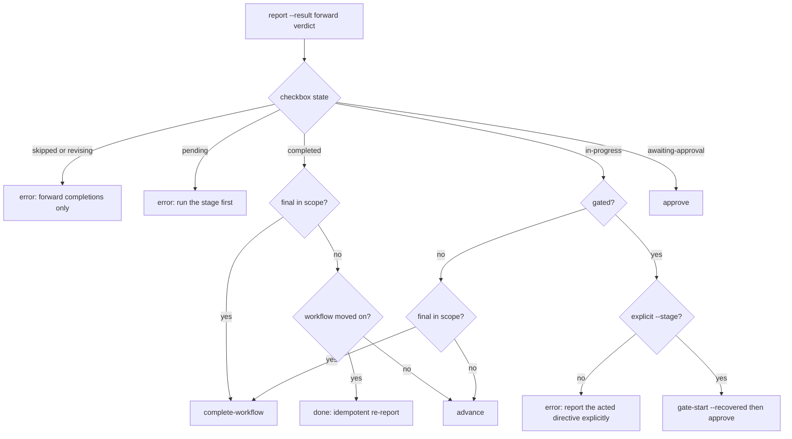

# Orchestration Engine and Directive Protocol

> **Source**: [awslabs/aidlc-workflows](https://github.com/awslabs/aidlc-workflows) — branch `v2`, commit `3c3146cf` (v2.6.40, retrieved 2026-08-21)
> **Status**: As-built specification derived from the implementation; the upstream code is authoritative over this document.

## 1. Scope of this document

This spec describes the **engine loop**: the deterministic CLI that answers "what happens next?", the typed directive it emits, the report call that commits the resulting transition, and the surrounding modes (jump, park/resume, single-stage isolation, rule-delivery continuations). It also states the conductor contract — what the model side is required to do with each directive.

Owned elsewhere: the stage/phase/scope model and the compiled graph (`01-workflow-model.md`), the state file, checkbox lifecycle and audit ledger that `report` writes through (`03-state-audit-runtime.md`), the prose stage protocol and gate ritual the conductor executes inside a stage (`04-stage-protocol.md`), agent personas (`05-agents.md`), sensors (`06-sensors.md`), the Stop/PostToolUse hooks that police the loop (`07-hooks.md`), memory/rule layering whose text this engine transports (`08-memory-rules-learnings.md`), the sibling CLI tools this engine shells out to (`09-cli-tools.md`), the packaging that projects `core/` into `dist/<harness>/` (`10-distribution-harnesses.md`), plugin-owned stages (`11-plugin-system.md`), and the test corpus (`12-testing-ci.md`).

### 1.1 Component map

| File | Lines | Role |
| --- | --- | --- |
| `core/tools/aidlc-orchestrate.ts` | 6169 | The engine. Four subcommands: `next`, `continue`, `report`, `park`. |
| `core/tools/aidlc-directive.ts` | 1362 | The frozen wire contract: the discriminated union over directive kinds plus `validateDirective`. No I/O. |
| `core/tools/aidlc-jump.ts` | 487 | `resolve` (pure read: target + direction) and `execute` (the mutating jump commit). |
| `core/tools/aidlc-runner-gen.ts` | 841 | Generates the per-stage `--single` runner skills and their drift guard. |
| `core/tools/aidlc.ts` | 1197 | The single-entry dispatcher; routes the four engine verbs to `aidlc-orchestrate.ts`. |
| `core/aidlc-common/conductor.md` | 136 | The conductor's execution-quality charter, delivered in-band on the first `run-stage`. |
| `harness/claude/skills/aidlc/SKILL.md` | 255 | The conductor's forwarding loop (Claude harness). Byte-identical to the delivered `dist/claude/.claude/skills/aidlc/SKILL.md`. |
| `harness/claude/skills/aidlc/question-rendering.md` | 155 | Harness annex binding the protocol's structured questions to `AskUserQuestion`. |

`dist/` is generated projection output, inspected here only to describe what is delivered; `core/` and `harness/` are the sources.

---

## 2. The conductor/engine split

The split is stated in the engine's own header and repeated on both sides of the boundary.

Engine side, `core/tools/aidlc-orchestrate.ts:8-20`:

> The engine reads workflow state (aidlc-docs/aidlc-state.md) and the compiled stage graph (data/stage-graph.json), then emits EXACTLY ONE typed Directive (JSON) to stdout. `next` mutates no workflow state itself … the conductor relays human choices and supplies resolved facts, but the engine never originates a deviation, never calls AskUserQuestion (that is a Bash tool the conductor owns), and never spawns agents.

Conductor side, `core/aidlc-common/conductor.md:3-7`:

> The forwarding loop in your runner's `SKILL.md` is the *mechanism* — get a directive from the engine, do that one move, report the outcome, repeat. This file is the irreducible *knowledge-work* the engine cannot do for you: how to run a stage **well**. The engine decides which stage is next; you own the quality of execution inside the move it named.

And `conductor.md:33-37`:

> The engine owns lifecycle bookkeeping. Open, reject, revise, approve, complete, or skip a stage only through `aidlc-orchestrate.ts report`; never call lifecycle verbs on `aidlc-state.ts` directly or hand-edit stage checkboxes.

### 2.1 Decision ownership

| Decision | Owner | Evidence |
| --- | --- | --- |
| Scope resolution (state > `--scope` > positional > `AWS_AIDLC_DEFAULT_SCOPE` > default) | engine | `aidlc-orchestrate.ts:1041-1073` |
| Which stage runs next; finality; jump direction; gate status | engine | `handleNext` `aidlc-orchestrate.ts:2587-3357`; `computeGate:1756-1771` |
| Artifact vocabulary name → `aidlc-docs/...` path | engine | `aidlc-orchestrate.ts:61-66, 1418-1428` |
| Which committing state subcommand runs (`gate-start`/`reject`/`revise`/`approve`/`advance`/`complete-workflow`/`skip`) | engine | `aidlc-orchestrate.ts:4712-4728, 5805-5891` |
| Walking-skeleton **stance** classified from free-form practices prose | conductor, fed back typed | `aidlc-directive.ts:24-36`; `conductor.md:96-118` |
| Continue-vs-new-work-vs-reshape classification of freeform prose | conductor (engine backstops with a typed `ask`) | `SKILL.md:137-145`; `aidlc-orchestrate.ts:3229-3261` |
| Persona framing, question quality, diary, Keep/Modify/Redo, §13 conflict-check | conductor | `conductor.md:15-38, 39-54, 56-73, 75-93` |
| Rendering any human question | conductor (`AskUserQuestion`) | `SKILL.md:80`; `question-rendering.md:9-28` |

The engine composes rather than reimplements: `aidlc-orchestrate.ts:31-58` lists the library reads it uses (`loadGraph`, `nextInScopeStage`, `firstInScopeStageOfPhase`, `validScopes`, `getField`/`parseCheckboxes`, `resolveProjectDir`/`readStateFile`) and states that non-happy-path branches shell out to sibling CLIs with `Bun.spawnSync`, relaying their stderr **verbatim** through `toolErrorMessage` (`:412-428`) so canonical wording never drifts.

The two things the engine *adds* are named at `aidlc-orchestrate.ts:60-68`: "(1) the decision rule that maps (observed state + graph) -> directive kind, and (2) the artifact-path resolver".

---

## 3. CLI surface

`main(argv)` (`aidlc-orchestrate.ts:6098-6157`) strips `--project-dir <dir>` and `--aidlc-attempt-id <id>` (validated against `/^[A-Za-z0-9._:-]{1,128}$/`), then dispatches on the first remaining token:

| Subcommand | Handler | Mutates workflow state? |
| --- | --- | --- |
| `next` | `handleNext` (`:2587`) | No (see §3.1) |
| `continue <token>` | `handleContinue` (`:5963`) | No |
| `report` | `handleReport` (`:5464`) | Yes — via spawned `aidlc-state.ts` / `aidlc-audit.ts` subcommands only |
| `park` | `handlePark` (`:5937`) | Yes — via spawned `aidlc-state.ts park` |

Anything else exits 1 with `Unknown subcommand: ${subcommand ?? "(none)"}. Valid: next, continue, report, park` on stderr (`:6148-6151`). A nested dispatch throws `Nested aidlc-orchestrate dispatch is not supported` (`:6124`). Uncaught read errors (missing graph, malformed state) exit non-zero with the message on stderr — "never a half-emitted directive on stdout" (`:6163-6168`).

The single-entry dispatcher exposes the same four verbs as a top-level passthrough route (`core/tools/aidlc.ts:92-105`): `verbs: ["next", "continue", "report", "park"]` with `tool: TOOLS.orchestrate`, plus a translation route mapping `compose` to the prefix `["next", "compose"]` (`:106-116`). Slash-flag aliases route `--resume` and `--scope` to `next --resume` / `next --scope` (`aidlc.ts:83-84`).

### 3.1 The read-only invariant and its two exceptions

`next` never writes workflow state (`aidlc-state.md`, checkboxes, audit rows). Birth, jump, scope-change and config-change are all *named* to the conductor as `print` directives rather than performed (`:10-14`, `:2863-2867`, `:3040-3063`, `:4571-4579`). Two machine-local writes are explicitly carved out:

1. **The steering MAC key** — `.aidlc-steering-token-key`, minted lazily under the intent's gitignored `.aidlc-*` family or `aidlc/.aidlc-sessions/` (`:2275-2347`). Described as "machine-local runtime state, not a project-derived value an untrusted continuation can recompute" (`:2288-2292`).
2. **The active-directive marker** — written on every `load-steering`/`run-stage` emission through `writeActiveDirectiveMarker` (`aidlc-lib.ts:2883`), carrying `state_sha256`, the attempt id, the command digest and the emitted result digest (`aidlc-orchestrate.ts:271-296, 310-355`). Hook consumers are spec 07's subject.

Both are advisory to routing; failures are recorded through `recordHookDrop` rather than thrown, except on the Copilot-commit arm, which refuses to issue a work directive:

- `"This tracked \`next\` attempt is stale or superseded, so its prepared result was not issued. Run a fresh \`next\` in the current Copilot session."`(`:327-329`)
- `"The fresh Copilot directive could not be published, so no work directive was issued. Retry \`next\`; if coordination remains busy, run \`/aidlc --doctor\`."`(`:334-336`,`:347-349`)

### 3.2 Emission discipline

`prepareEmission` (`:233-304`) → `validateDirective` → serialize → size check → `writePrepared` writes exactly one JSON line to stdout (`:306-308`).

Two hard refusals, both `process.exit(1)` with stderr text:

- `aidlc-orchestrate: refusing to emit a malformed directive: <errors joined by "; ">` (`:259-262`)
- `aidlc-orchestrate: refusing to emit a directive larger than ${DIRECTIVE_MAX_BYTES} bytes` (`:266-268`)

`DIRECTIVE_MAX_BYTES = 28 * 1024` (28 672 bytes) is "the common 28 KiB harness floor"; `STEERING_TEXT_TARGET_BYTES = 20 * 1024`, `CONTEXT_WARNINGS_MAX_BYTES = 6 * 1024`, `INLINE_CONTEXT_PATHS_MAX_BYTES = 8 * 1024` (`:1140-1143`).

---

## 4. The directive protocol

### 4.1 Kinds

`aidlc-directive.ts:71-81` declares the union; `VALID_KINDS` (`:419-430`) is the discriminator allowlist "in the engine design's catalogue order":

```text
"load-steering", "run-stage", "dispatch-subagent", "invoke-swarm",
"present-gate", "ask", "print", "error", "done", "parked"
```

Ten kinds are defined; **eight are constructed by the engine today**. `present-gate` and `dispatch-subagent` appear nowhere in `aidlc-orchestrate.ts` except a comment (`:1031-1034`); `SKILL.md:89` states the same and instructs "Do not implement those two placeholder behaviours speculatively."

| Kind | Emitted today | Meaning (from the schema comments) | Required fields |
| --- | --- | --- | --- |
| `load-steering` | yes | "one bounded part of the active stage's deterministic rule bundle"; conductor applies `rules_content` in order then immediately runs `continue <continue_token>` (`:83-87`) | `stage`, `bundle`, `part`, `parts`, `rules_content[]{path,text}`, `continue_token` |
| `run-stage` | yes | load rules, load agents, load `consumes`, run the body, write `produces`, keep `memory.md` (`:138-143`) | see §4.3 |
| `dispatch-subagent` | no (placeholder) | run-stage fields plus `worker`, the named worker to `Task` (`:261-263`) | run-stage shared + `worker` |
| `invoke-swarm` | yes | "fan out N parallel workers across N worktrees for a build batch" (`:288-289`) | `units[]` (+ optional `stage`, `stage_file`, `reviewer`, `reviewer_max_iterations`, `review_class`, `protocol_modules`, `repo`) |
| `present-gate` | no (placeholder) | run §13 learnings ritual then render the approval gate (`:320-321`) | `stage`, `phase`, `memory_path` |
| `ask` | yes | render a structured question; two subtypes (§4.5) | `question` |
| `print` | yes | "print verbatim and stop (status / help / doctor / version)" (`:358`) — in practice also the run-then-continue / run-then-stop shapes | `message` |
| `error` | yes | "stop with an error … shown to the user verbatim" (`:366-367`) | `message` |
| `done` | yes | "stop the loop (workflow or single-stage complete)" (`:375-376`) | `reason` |
| `parked` | yes | "the workflow was intentionally parked mid-flow … Distinct from `done` … a parked workflow has in-scope stages still pending" (`:384-389`) | `reason`, `stage` |

`narration` is legal on **every** kind and is folded into each allowed-key set centrally by `withNarration` (`:520-544`). It is explicitly "a presentation field: it carries no routing meaning, every kind may omit it, and dropping it changes nothing about what the framework does" (`:40-43`). The engine authors it because "the engine already knows, deterministically, which stage this is, what scope resolved, what it just decided, and what comes next" (`:45-53`).

### 4.2 Validation

`validateDirective(obj)` (`:553-701`) returns `{valid:true,data}` or `{valid:false,errors[]}` and collects every field error rather than throwing on the first. Rules, in order:

1. **Shape** — non-object returns a single error `expected object, got <null|array|typeof>` (`:557-561`).
2. **Discriminator** — `missing or non-string required field: kind`, else `unknown kind: "<k>" (expected one of <kinds joined by " | ">)` (`:566-576`). Both short-circuit.
3. **Unknown keys** — any key outside the kind's allowed set yields `<kind>: unknown key: <key>` (`:579-585`).
4. **Type/presence per field** — `<kind>: missing required field: <f>` and `<kind>: <f> must be string, got <desc>` shapes (`:764-777`), with specialised checks for positive integers, `{path,text}` arrays, `{path,expected}` arrays, the `pipeline` object, `protocol_modules` enum, and the nested `wave` structure (`:829-1199`).
5. **Cross-field rules** — `load-steering`: `part must be less than or equal to parts` (`:603-611`); any kind carrying `review_class` without `reviewer`: `<kind>: review_class requires reviewer` (`:630-632`, `:740-742`); `ask` subtype rules (§4.5).

`checkGate` (`:783-799`) accepts a boolean **or** the literal `"unresolved"`; anything else — including a mistyped sentinel — is rejected with `<kind>: gate must be boolean or "unresolved", got <desc>`.

On success the validator returns the *same reference*, documented as the single trust boundary cast in the codebase (`:693-700`).

`bun core/tools/aidlc-directive.ts` is a self-check that constructs 12 well-formed examples covering all 10 kinds, prints `<kind>: VALID` per example, and exits 0 iff all validate (`:1239-1362`); it validated 12/12 at this commit.

### 4.3 The `run-stage` envelope

Allowed keys are enumerated by `RUN_STAGE_FIELDS` (`aidlc-directive.ts:442-470`). `DISPATCH_SUBAGENT_FIELDS` is the same list minus `single`, `wave`, `protocol_modules`, `swarm_settled`, plus `worker` (`:484-493`).

| Field | Type | Source / semantics |
| --- | --- | --- |
| `stage`, `phase`, `lead_agent`, `support_agents`, `mode`, `sensors_applicable`, `stage_file` | routing | Read straight off the compiled graph node (`aidlc-orchestrate.ts:2044-2071`). `mode ∈ inline\|subagent\|pipeline\|mob\|agent-team` (`aidlc-directive.ts:435`); `agent-team` is reserved and not produced by the shipped graph (`aidlc-orchestrate.ts:2050-2054`). |
| `inline_context_paths` | string[] | "Exact persona + knowledge files the conductor must read for work it owns inline: lead + supports on inline stages, lead only on a mob … empty on fully-dispatched subagent/pipeline topologies" (`aidlc-directive.ts:161-166`). |
| `context_warnings` | string[]? | Non-fatal roster problems; bounded to 6 KiB (`aidlc-orchestrate.ts:1971-2000`). Rule-delivery failures are blocking `error` directives instead (`aidlc-directive.ts:167-171`). |
| `gate` | `boolean \| "unresolved"` | §6. |
| `memory_path` | string | `<recordPrefix>/<phase>/<slug>/memory.md`, or `<recordPrefix>/construction/<unit>/<slug>/memory.md` per unit (`aidlc-orchestrate.ts:1086-1098`). |
| `consumes` | string[] | Only declared inputs that **exist on disk at emit time** (`aidlc-directive.ts:177-180`). |
| `consumes_absent` | `{path,expected}[]?` | Required inputs missing at emit time. `expected: true` = the producing stage is off the active scope's path ("absence is by design; substitute available context, do not invent the artifact"); `expected: false` = a producer is on the path but the file is missing (`aidlc-directive.ts:246-258`). |
| `produces` | string[] | Resolved paths, kind-filtered by `produces_kinds` and including `optional_produces` (`aidlc-orchestrate.ts:1705-1732`). |
| `rules_in_context` | string[] | The ordered path manifest of the rule text already delivered by the preceding `load-steering` chain (`aidlc-orchestrate.ts:2489-2491`). |
| `reviewer`, `review_class`, `reviewer_max_iterations` | optional | Present only when the stage declares a reviewer **and** the resolved class is not `none`; `advisory` pins iterations to 1, `adversarial` defaults to 2 (`aidlc-orchestrate.ts:2094-2113`). A `none` resolution omits the whole block. |
| `protocol_modules` | enum[]? | Deterministic hints over `["reviewer","ensemble","construction","swarm"]` (`aidlc-directive.ts:62-68`); computed at `aidlc-orchestrate.ts:2114-2131`. Prose triggers remain the fallback. |
| `pipeline` | `{links,completed}`? | Pipeline recovery surface for `mode: pipeline` (`aidlc-orchestrate.ts:2072-2078`). |
| `conductor_persona` | string? | The contents of `aidlc-common/conductor.md` (read by `readConductorPersona`, `aidlc-orchestrate.ts:1121-1129`), baked into the first `run-stage` of the workflow — "Decision D-E: bake the conductor persona into the FIRST run-stage of the workflow" (`:2132-2133`, attached at `:2139-2143` under `forcePersona \|\| isFirstRunStageOfWorkflow(...)`); omitted on every later directive. See §1.1 and, for the force-attach on`--single`, §9. |
| `next_stage` | `string \| null`? | Display name of the following in-scope stage, "resolved by the engine so the approval gate's Approve option can read 'Continue to <next_stage>' verbatim"; `null` = final in-scope stage (`aidlc-directive.ts:217-224`; computed `aidlc-orchestrate.ts:2092-2093`). |
| `unit` | string? | Present only on a per-unit Construction directive resolved to a concrete Unit of Work; also "a marker that this run-stage is ONE iteration of N" (`aidlc-directive.ts:225-236`). |
| `wave` | `{batch_index,entries[]}`? | Optional stage-major parallel surface for the four inline per-unit design stages (`aidlc-directive.ts:238-245`); entry shape validated at `:1029-1199` including duplicate-unit and `required_produces ⊆ produces` checks. |
| `swarm_settled` | `true`? | Gate-only re-entry after every autonomous swarm unit and reviewer receipt converged; "the conductor must not rerun the stage body or reviewer" (`aidlc-directive.ts:207-210`). |
| `single` | boolean? | Isolated stage-runner marker (§9). |

### 4.4 Digest and fingerprint binding

Nothing in the directive carries a self-signature, but four digests bind an emission to its context:

| Digest | Computed at | Binds |
| --- | --- | --- |
| `bundle: "sha256:<hex>"` | `sha256(JSON.stringify(loaded.content))` (`aidlc-orchestrate.ts:2492`) | The exact rule-text bundle being chunked. |
| `directiveHash` | `sha256(JSON.stringify(directive))` (`:2493`) | The run-stage the chunk chain is delivering toward. |
| route hash `r` | `sha256(JSON.stringify({node, scopeStages: subgraphForScope(scope).map(s => s.slug)}))` (`:2467-2474`) | The graph node **and** the scope's stage membership. |
| `state_sha256` / payload `h` | `sha256(stateContent)` (`:2156`, `:5974`) | The state file the directive was computed from. |

The `continue_token` is an HMAC-SHA256-authenticated envelope `{p: payload, m: mac}`, base64url-encoded (`:2358-2372`), verified with `timingSafeEqual` on decode (`:2395-2405`). Payload fields (`:1156-1175`, populated `:2438-2465`): `v` (=1), `s` stage, `c` scope, `i` next part index, `b` bundle digest, `d` directive digest, `r` route hash, `a` state-aware flag, `u` unit, `k` unit kind, `f` force-persona, `g` gate, `n` next_stage, `x` single, `p` per-unit, `w` wave, `z` swarm-settled, `h` state hash. Decode rejects any payload failing the exact type table (`:2409-2431`).

### 4.5 The `ask` subtypes

`AskDirective` is a union (`aidlc-directive.ts:335-356`): the ordinary `ReportAskDirective` (answer returns via `report --user-input`) and `NewWorkRoutingAskDirective` with `ask_type: "new-work-routing"` and `response_route: "next"`, carrying `new_work_description` and `proposed_scope`. The comment is explicit: "its answer routes through `next` and must never be recorded as a stage report" (`:332-334`). The validator enforces `ask_type must be one of new-work-routing`, `new-work-routing response_route must be "next"`, and `<field> requires ask_type "new-work-routing"` for the three subtype-only fields (`:647-670`).

---

## 5. The `next` decision rule

`handleNext` (`aidlc-orchestrate.ts:2587-3357`) is a flat ladder of 21 labelled branches. Preconditions and dispatch, in execution order:

| # | Guard / branch | Emits | Notes |
| --- | --- | --- | --- |
| — | turn-shape marker | — | `touchEngineMarker` unless read-only/workspace (`:2605`) |
| — | `flags.parseError` | `error` | e.g. `--review requires <adversarial\|advisory\|none>.` (`:806`) |
| — | `--review` combined with another mode | `error` | `Cannot combine --review with read-only, workspace, compose, single-stage, jump, or resume modes. Apply /aidlc --review <class> first, then run the other command.` (`:2629-2631`) |
| 0 | Kiro roll-forward latch: a truly bare `next` in the same turn counter as `.aidlc-readonly-latch` | `done` | Advisory, fails open (`:2635-2681`) |
| 1 | read-only flag (`--status/--help/--doctor/--version`) | `print` | Names `aidlc-utility.ts <sub>`; "This is a read-only utility, NOT workflow work: do NOT run `next`" (`:2697-2709`) |
| 1b/1c/1d | workspace / plugin / knowledge nouns | `print`/`error` | Leading-token semantics only (`:2711-2775`) |
| 2 | `--stage` + `--phase` | `error` | `Cannot use --stage and --phase together. Use one or the other.` (`:2780-2784`) |
| — | state-version guard | `error` | `classifyStateVersion` verdict relayed before any cursor read (`:2789-2803`) |
| 2.5 | `Parked` set and `Parked At Stage === Current Stage`, no re-entry flag | `parked` | `Workflow parked at "<slug>". Resume with /aidlc --resume.` (`:2830-2848`) |
| 2.6 | `--resume` over a parked workflow | `print` | Names `aidlc-state.ts unpark`, then re-run `next --resume` (`:2856-2868`) |
| 3b | invalid explicit `--scope` | `error` | `Unknown scope "<s>". Valid scopes: <list>.` — validated unconditionally, even when state wins the ladder (`:2880-2896`) |
| 4 | scope came from env | `error` | Shells `aidlc-utility.ts resolve-env-scope` and relays its verbatim `Invalid AWS_AIDLC_DEFAULT_SCOPE "…". Valid scopes: …` (`:2898-2911`) |
| — | unresolvable scope | `error` | Same `Unknown scope` wording (`:2921-2925`) |
| 4c | `compose` / `--new-scope` / `--report` | `print` | Composer dispatch; front vs in-flight split on state presence. `Cannot combine compose with --stage/--phase. Compose re-shapes the plan; jump moves the cursor. Run them separately.` (`:2940-2949`, string at `:2943`) |
| 4a | `--new-intent` | `print`/`error` | Requires a nonblank description; uses the **explicit** `--scope`, not the ladder (`:2966-2982`) |
| 4b | `--single` | `run-stage`/`error` | §9 (`:3004-3021`) |
| 5 | state + valid differing `--scope` / depth / test-strategy / review | `print` | Names `aidlc-utility.ts scope-change` or `config-change` (`:3028-3065`) |
| 6 | `--resume` with state | `ask` | `An existing workflow was found (currently at "<slug>"). How would you like to proceed? Resume from last checkpoint, redo the current stage, jump to a stage, or start fresh.` (`:3084-3087`) |
| 7 | `--stage`/`--phase` | `print`/`run-stage`/`error` | §8 |
| 7b | positional scope, no state | `print`/`ask` | Birth print, or the fresh-clone intent-pick ask (`:3111-3127`) |
| 8 | freeform prose, no state | `ask` | Keyword hit → scope confirm with cost clause; otherwise the compose offer (`:3148-3183`) |
| 9a | explicit `--scope`, no state | `print` | Birth (`:3196-3210`) |
| 9b | no state, no named scope | `error` | `No workflow state found (no active intent). Start one by describing what to build (/aidlc "build the auth service") or by naming a scope (/aidlc --scope <scope>).` (`:3220-3227`) |
| 9c | freeform prose while a workflow is active | `ask` (`new-work-routing`) | Engine backstop for the conductor's classification (`:3241-3261`) |
| 10 | happy path | `run-stage` / `invoke-swarm` / `done` / `error` / `print` | §5.1 |

Birth is never performed by `next`: `createPrintDirective` (`:876-916`) names `bun <harness>/tools/aidlc-utility.ts intent-create --scope <s> [--arguments <json>] --label "<2-3 word kebab essence>"`, and the `--new-intent` variant additionally instructs the conductor to stop and hand off to a fresh session. The duplicate-birth guard `intentPickPromptIfRecordsExist` (`:1001-1020`) converts "records exist but no active-intent cursor" into an `ask` rather than minting a second intent.

### 5.1 Branch 10 — the happy path

1. `Current Stage` must be present, else `State file has no Current Stage field — cannot determine the next stage.` (`:3266-3271`).
2. In-flight = checkbox state ∈ {pending, in-progress, awaiting-approval, revising} or absent (`:3281-3286`).
3. **Plan/cursor mismatch**: if the in-flight stage's effective plan action is `SKIP`, the engine refuses to emit a run-stage. For `in-progress`/`revising` it names the recovery (`report --stage <slug> --result skipped --reason "stage is SKIP in the approved workflow plan"`); otherwise it errors: `Stage "<slug>" is SKIP in the approved workflow plan but its active cursor state is "<state>". Refusing to emit run-stage; repair the inconsistent state before continuing.` (`:3293-3312`).
4. In-flight → `tryEmitSwarm(...)` first, else `emitForSlug(...)` (`:3314-3328`).
5. Completed/skipped → `nextInScopeStage(currentSlug, scope, stateContent)`; `null` → `done` with reason `Workflow complete — no in-scope stage remains after <slug> (scope: <scope>).` plus the `NEW_WORK_HINT` suffix (`:3332-3348`, hint text at `:853-857`).

`effectivePlanAction` (`:2562-2571`) resolves the live plan: the state file's per-stage EXECUTE/SKIP suffix (recomposition) wins over the static scope grid.

### 5.2 Per-unit iteration and the swarm arm

`emitForSlug` (`:4394-4416`) routes a `for_each: unit-of-work` node to `emitUnitMajorRunStage` when `Construction Iteration` is exactly `unit-major`, else `emitPerUnitRunStage`.

Per-unit semantics (`:3616-3634`, `emitPerUnitRunStage` `:4013-4201`): coverage is the per-unit **artifacts on disk** (plus `UNIT_COMPLETED` receipts once the unit lifecycle is in use, `:3672-3695`); the engine emits the first uncovered unit with `directive.gate = false` (`:4198`, after the rationale comment `:4190-4197`) and the conductor re-runs `next` *without* reporting; when no uncovered unit remains it re-emits for the last unit carrying the stage's real computed gate — "This is the ONLY directive on which the gate fires" (`:4172-4186`). If the stage is the skeleton-gate stage and no stance is recorded, per-unit iteration is deferred and the plain `{unit-name}` directive with `gate:"unresolved"` is emitted first (`:4026-4044`).

The swarm arm (`tryEmitSwarm`, `:3483-3589`) fires only when the node is a Construction stage with `for_each: unit-of-work` **and** `mode: subagent`, is **not** the skeleton-gate stage, and `Construction Autonomy Mode` is exactly `autonomous` (`:3400-3410`). It advances one Bolt batch per `next`, keyed on `SWARM_UNIT_CONVERGED` audit rows rather than disk artifacts (`:3446-3463`); when every unit has converged it emits the settle `run-stage` with `swarm_settled: true`, reviewer fields stripped and `protocol_modules: ["construction","swarm"]` (`:3435-3444`, `:3519-3532`).

---

## 6. The gate model at engine level

A gate is a single field on `run-stage`, not a separate directive kind (the `present-gate` kind exists but is never emitted). `computeGate` (`:1756-1771`), whose three outcomes are named in its doc comment (`:1734-1742`):

- initialization phase → `false` (`:1761`; "bootstrap auto-proceed, no governance gate", `:1736`);
- the skeleton-gate stage (first Construction EXECUTE stage of the scope) with no recorded stance → `GATE_UNRESOLVED`;
- everything else → `true`.

`isSkeletonGateStage` is derived, not hardcoded: `firstInScopeStageOfPhase("construction", scope)` (`:1349-1361`). The gate axis is explicitly orthogonal to the `execution: ALWAYS|CONDITIONAL` inclusion axis (`:1744-1746`).

**The classify round-trip.** `aidlc-directive.ts:24-36` states the rationale: the stance "an LLM resolves by reading a team's free-form `## Walking Skeleton` practices prose (no parser turns free English into a stance)". The conductor classifies per `conductor.md:106-118` and hands back `report --skeleton-stance <on|off|scope-dependent>`; `handleSkeletonStanceReport` (`:4943-5008`) validates the value, requires a state file, requires `Current Stage` to be the skeleton-gate stage for the scope (`Current stage "<slug>" is not the skeleton-gate stage for scope "<scope>" — a skeleton stance is only reported for the first Construction Bolt's gate.`), writes the field through `aidlc-state.ts set-skeleton-stance`, and prints `Recorded walking-skeleton stance "<stance>" for "<slug>". Re-run \`next\` to continue — the gate is now determined.` `resolveSkeletonGate` returns `true`for every stance today, and the code documents why the round-trip still earns its keep: "the engine cannot EMIT a boolean it has not determined" (`:1371-1416`).

**Where gates are enforced.** The engine enforces gate *lifecycle* on the report side (§7); the reviewer precondition and the artifact/human-presence guards live in `aidlc-state.ts handleApprove`, deliberately, because "a report-only guard is bypassable" (`:5878-5883`). The prose ritual the conductor runs at a gate — questions → artifacts → reviewer → §13 learnings → `awaiting-approval` → Approve/Request Changes — is specified in `04-stage-protocol.md` and summarised at `SKILL.md:100-105`.

---

## 7. `report` — the write half

`handleReport` (`:5464-5927`) is "a dispatcher over aidlc-state.ts's transition subcommands [that] reimplements none of their transition logic" (`:4698-4703`). Every mutation happens in a spawned subprocess; `spawnState` passes `AIDLC_STATE_TRANSITION_OWNER: orchestrate:<pid>` (`:4879-4887`). The engine holds no audit lock because each spawned subcommand is already atomic (`:4705-4710`).

### 7.1 Accepted verdicts

`REPORT_RESULTS` = `FORWARD_RESULTS ∪ GATE_RESULTS ∪ RESUME_RESULTS ∪ {"skipped"}` (`:4736-4745`). A live invocation with no `--result` returns the canonical list verbatim:

```text
report requires --result <outcome>. Accepted: approved, completed, complete, done,
awaiting-approval, rejected, revised, resume, resumed, skipped
(the verdict for the stage just acted on).
```

An unrecognised value yields `Unknown --result "<v>". accepted outcomes: <list>.` (`:5535-5543`). `approved`/`completed`/`complete`/`done` are interchangeable synonyms: "The engine — not the caller — picks the committing subcommand from gate status + finality" (`:4730-4735`).

### 7.2 Guard order

1. Turn-shape marker (`:5470`), then the state-version guard applied to *every* report path (`:5476-5488`).
2. `--single` → `handleSingleReport` (§9), resolved first so a single-stage commit can never fall through to a state-mutating subcommand (`:5490-5499`).
3. `--skeleton-stance` → the classify round-trip; resolved before the `--result` requirement because a stance report carries no verdict (`:5501-5513`).
4. `resume`/`resumed` → `handleResumeReport` (`:5517-5520`).
5. `--result` required and recognised (`:5522-5543`).
6. State file present, else `No active intent workflow state found (aidlc-state.md is absent) — nothing to report a transition for.` (`:5545-5554`).
7. `Current Stage` present; the acted stage is `--stage` when given, else `Current Stage` — the explicit pin "closes the stale pointer gap where the conductor may have already moved Current Stage" (`:5556-5570`).
8. `Scope` present; node present in the compiled graph (`Internal: reported stage "<slug>" is not in the compiled graph — cannot commit its transition.`); checkbox row present (`Stage "<slug>" is not present in the state file — cannot commit its transition.`) (`:5572-5599`).
9. `skipped` arm (§7.4).
10. `isGated = node.phase !== "initialization"` (`:5669`), then the gate-lifecycle arm (§7.3).
11. Completion-evidence guard `checkStageCompletionEvidence` (`:5128-5230`) for any non-completed stage: pipeline link receipts, per-unit coverage, paused-unit refusal, ensemble contribution evidence.
12. Practices-discovery promotion receipt (`:5772-5784`).
13. Human-presence guard: for a gated, not-yet-completed stage, with autonomy not `autonomous` and `AIDLC_SKIP_HUMAN_PRESENCE_GUARD !== "1"`, a blank `--user-input` is refused: `report --result <r> for "<slug>" requires --user-input with the human's exact approval choice.` (`:5786-5797`).

### 7.3 Dispatch decision rule

Finality is `nextInScopeStage(slug, scope, stateContent) === null` (`:5801`). The committing sequence (`:5810-5891`):

| Checkbox state | Gated? | Final? | Sequence |
| --- | --- | --- | --- |
| `skipped` / `revising` | — | — | refuse: `Stage "<slug>" is <state>; report commits forward completions only.` |
| `pending` | — | — | refuse: `Stage "<slug>" is still pending. Run the stage before reporting it complete.` |
| `completed` | — | yes | `complete-workflow <slug>` (or, when `Status` is already `Completed`, a `done` describing the no-op) |
| `completed` | — | no | `advance <slug>`, unless the workflow has already moved on (stale re-report guard → idempotent `done`) |
| `in-progress` | yes | — | requires explicit `--stage`, else refuse; then `gate-start <slug> --recovered` + `approve <slug>` |
| `awaiting-approval` | yes | — | `approve <slug>` (approve self-delegates to advance/complete-workflow; the engine must not also call advance — `:4716-4723`) |
| any | no | yes | `complete-workflow <slug>` |
| any | no | no | `advance <slug>` |

Gate-lifecycle results are handled before completion guards (`:5674-5751`): `awaiting-approval` requires `in-progress` (`only an in-progress stage can open a gate`) and dispatches `gate-start`; `rejected` requires `in-progress`/`awaiting-approval` plus nonblank feedback and dispatches `reject --feedback`; `revised` requires `revising` (`only a revising stage can re-enter its gate`) and dispatches `revise`. Each returns a `print` — `Recorded <result> for "<slug>".`

Any non-zero exit from a spawned subcommand is relayed as `Transition rejected by aidlc-state.ts <sub> for "<slug>": <stderr or stdout>` (`:5896-5906`). Success emits `done` with `Committed <subs joined by " + "> for "<slug>" (scope: <scope>). State advanced; run next to continue.` (`:5921-5926`).

### 7.4 `skipped` and resume routing

`skipped` is "a routed lifecycle outcome, not a completion" and is checked ahead of every completion guard (`:5601-5667`). It requires an explicit nonblank `--stage`, a `CONDITIONAL` node **or** a plan action of `SKIP`, a nonblank `--reason`, exact identity with `Current Stage` (`Cannot skip stage "<slug>": Current Stage is "<current>". A skip report must name the active stage exactly.`), and a checkbox in `in-progress`/`revising`/`skipped`. It dispatches `aidlc-state.ts skip <slug> --reason <r> --route`.

`handleResumeReport` (`:5383-5457`) refuses `--stage` (`A resume-choice report is not a stage transition; omit --stage.`), requires `--user-input`, normalises numeric menu keys 1–4, and *routes* rather than mutates: redo → `aidlc-jump.ts execute --direction redo`; jump → ask which stage then `next --stage <slug>`; start fresh → `next --new-intent --scope <s> "<desc>"`; resume → re-run `next`. An unmatched answer errors with the four accepted choices.

---

## 8. Jump

`emitJumpDirective` (`:4530-4646`) implements `--stage <slug|#>` / `--phase <name|#>`.

**Init guard (engine-enforced).** `--phase initialization` is refused up front, and the resolved target's phase is re-checked, with `INIT_JUMP_ERROR`: `Cannot jump to initialization stages. The Initialization phase runs automatically when you start a workflow (describe what to build, e.g. /aidlc "build the auth service").` (`:4527-4528`, verified live). The code notes this guard is prose-only upstream of it — `aidlc-jump.ts resolve` treats init stages as valid targets — so the engine enforces it rather than relaying a tool error (`:4521-4526`).

**With state.** The engine shells `aidlc-jump.ts resolve --scope <s> --project-dir <pd> [--stage|--phase] <t>` — a pure read that both validates scope membership and computes direction (`aidlc-jump.ts:108-217`). A refusal is relayed verbatim, e.g. `Stage "<slug>" is skipped for scope "<scope>". Choose a different stage or change scope.` (`aidlc-jump.ts:141-144`). Direction is index comparison against `Current Stage`: `forward` / `backward` / `redo` (`aidlc-jump.ts:175-181`). Because committing the jump is a mutation, `next` emits a `print`: `Run \`bun <harness>/tools/aidlc-jump.ts execute --target <slug> --direction <dir> --scope <scope>\` to perform the jump, then re-run \`next\` to continue from the jump target.`(`:4577-4579`). A malformed`resolve` payload yields `Internal: aidlc-jump.ts resolve returned no target_slug/direction for …`(`:4557-4562`).

**Without state.** `resolve` requires a state file to anchor direction, so the no-state path is a direct graph lookup that emits a plain `run-stage` ("start here"), with its own scope-membership guard mirroring the with-state wording (`:4583-4645`).

**What `execute` does to state** (`aidlc-jump.ts:221-479`), all against the *effective* plan (state suffix overrides beat the scope grid, `:34-40`):

| Direction | Checkbox effects | Audit |
| --- | --- | --- |
| `forward` | intervening in-flight stages → `skipped`; the current stage too when it is in-flight and not pending | one `STAGE_SKIPPED` per skipped stage |
| `backward` | target and all downstream EXECUTE stages in `completed/in-progress/awaiting-approval/revising/skipped` → `pending` | — |
| `redo` | target → `pending` | — |

Then in every case the target is set `in-progress`, and the fields `Lifecycle Phase`, `Current Stage`, `Next Stage`, `Active Agent`, `Status=Running`, `Last Updated`, `In Progress`, `Next Action`, `Completed`, `Last Completed Stage` are rewritten (`:342-414`). Crossing a phase boundary emits `PHASE_COMPLETED` + `PHASE_VERIFIED` + `PHASE_STARTED` and rewrites Phase Progress rows (`:378-442`) — the code notes jump previously lacked this symmetry with `advance`. Every jump emits `STAGE_JUMPED` (Direction/Source/Target/Scope/Details) and a `STAGE_STARTED` for the target; audit emission is attempted **before** `writeStateFile`, and an emission failure aborts the write (`:416-463`).

---

## 9. Single-stage mode

The invariant, stated at `:4418-4439` and `:5232-5260`: **a `--single` run never touches the main workflow's `Current Stage`.**

**Emission** (`emitSingleRunStage`, `:4443-4489`). `--single` is handled at Branch 4b, ahead of the scope-change and jump branches, so no mutating path is reachable under it. Guards, in order, verified live:

- `--single` with `--phase` → `Cannot use --single with --phase. --single runs one stage; pass --stage <slug>.`
- `--single` without `--stage` → `--single requires --stage <slug>. A stage-runner runs exactly one named stage.`
- unknown slug → `Unknown stage "<slug>". Run /aidlc --help for the full list.`
- initialization phase → `SINGLE_INIT_ERROR`: `Cannot run an initialization stage with --single. Initialization is bootstrap (it creates the intent + state); it runs automatically when you start a workflow …`
- out of scope → `Stage "<slug>" is skipped for scope "<scope>". Choose a different stage or change scope.` (same wording as the jump path, deliberately)

The directive is built with `stateContent: null` — "no main state read, no skeleton round-trip, no main-pointer persona signal" — then `single = true`, `gate = false`, `next_stage = null` are set, and the persona is force-attached because this is the conductor's first and only directive of the run (`:4469-4488`).

**Commit** (`handleSingleReport`, `:5261-5361`). Accepts only forward verdicts; **requires** `--stage`, because a `--single` report without one is precisely an attempt to advance the main workflow:

```text
report --single must not advance the main workflow. Pass --stage <slug> to commit the
single stage's synthetic-id pair; --single never writes the main workflow's Current Stage.
```

It shells out only to `aidlc-audit.ts append-batch` (`spawnAuditAppendBatch`, `:4899-4931`), never to `advance`/`approve`/`complete-workflow` — "so a single-stage run is mechanically incapable of advancing the main workflow". The pair is `STAGE_STARTED {Stage, Agent, Workflow}` and `STAGE_COMPLETED {Stage, Details, Workflow}` where `Workflow` is the **synthetic id** `single-stage:<slug>` (`syntheticWorkflowId`, `:5017-5019`). Those receipts are tagged precisely so they "can never satisfy the MAIN workflow's guard" (`:5254-5260`); the practices-affirmation floor scan explicitly skips `STAGE_STARTED` rows whose `Workflow` starts with `single-stage:` (`:4806-4810`). Terminal output is `done`: `Single-stage run of "<slug>" committed under synthetic workflow "<wf>". The main workflow's Current Stage is untouched.`

**Runner generation** (`core/tools/aidlc-runner-gen.ts`). One runner skill per **runnable** stage, where runnable = every compiled stage whose phase is not `initialization` (`:101-117`); init stages are excluded because "a per-init-stage `--single` runner would be a typeable command that always errors" (`:92-100`). The rendered body (`renderStageRunner`, `:136-196`) is three steps: `next --stage <slug> --single`; read `stage-protocol.md` plus every module named by `directive.protocol_modules`; `report --single --stage <slug> --result completed`. The skill dir is `aidlc-<slug>` for core stages and the bare plugin-prefixed slug for plugin-owned stages (`:88-90`). Two **non-stage** runners are generated by the same tool alongside the stage runners: `/aidlc-init` (whole initialization phase, drives `intent-create`, `renderInitRunner`, `:207`) and `/aidlc-compose` (`renderComposeRunner`, `:274`; dir constant `:263`). `handleWrite` emits all three sets in one pass — "plus the single `/aidlc-init` phase wrapper and the `/aidlc-compose` composer shortcut. Idempotent: re-running emits byte-identical SKILL.md files." (`:313-315`, writes at `:331` and `:335`) — and the delivered files carry the stamp `generated-by: aidlc-runner-gen` (`dist/claude/.claude/skills/aidlc-init/SKILL.md:3`, `dist/claude/.claude/skills/aidlc-compose/SKILL.md:3`). Nothing here is hand-written: `docs/reference/17-skill-system.md:101` — "The runner skills are generated, never hand-written, by `tools/aidlc-runner-gen.ts`". What separates the two from the stage set is what they drive: `intent-create` and the compose verb rather than `--stage … --single`. The drift guard identifies a *stage* runner by the literal marker pair `--stage` + `--single` in the body, matching `/--stage\s+([a-z][a-z0-9-]*)\s+--single/` (`:413-417`), so neither non-stage runner is ever counted; their parity is held instead by the packager's dist-level `--check` byte-compare (`:266-272`).

At this commit the delivered Claude tree carries 30 stage-runner skills — exactly the 30 non-initialization stages of the 33-stage compiled graph.

`SKILL.md:66` binds the conductor side: branch on `directive.single === true` **before** ordinary gate handling, run the body and its reviewer, call `report --single … --result completed` exactly once, and treat the returned `done` as terminal — "Do not run the workflow learnings ritual, report `awaiting-approval`, present a workflow gate, call main-workflow `next`, or park."

---

## 10. Rule delivery: `load-steering` and `continue`

Rule *paths* are routing metadata; rule *text* is required steering. Before any `run-stage` is emitted the engine reads the active-space rule files and ships their content through one or more bounded `load-steering` directives — "No rule is downgraded to a discretionary path read because it did not fit one tool result" (`:1131-1139`).

**Chunking.** `steeringPieces` splits each rule at Markdown heading boundaries, then splits oversized sections at code-point boundaries by actual JSON wire size (`:2170-2243`); `steeringChunks` packs pieces up to the 20 KiB target (`:2245-2260`). A section that still cannot fit yields `A rule section could not be split below the directive transport limit. Shorten the affected heading section, then run a fresh \`next\`.`(`:2544-2548`).

**Read failure is blocking.** `readRuleBundle` (`core/tools/aidlc-steering.ts:85-106`) returns `Cannot load required stage rule "<rel>" (<error>). The stage has not started. Restore the file or fix its permissions/UTF-8 encoding, then run \`next\` again.` — the engine turns that into an `error`directive instead of a run-stage (`:2487`). Verified live against a workspace with no memory tree.

**Staleness rules.** `transportRunStage` (`:2476-2550`) compares the continuation payload against a freshly rebuilt bundle:

| Condition | Emitted message |
| --- | --- |
| `payload.s ≠ stage` or `payload.b ≠ bundle` or `payload.d ≠ directiveHash` | `This stage or its rules changed while they were being loaded, so what has arrived so far is stale. Run a fresh \`next\` to restart delivery from part 1.` |
| `payload.i > chunks.length` | `This request asks for a part of the stage rules that does not exist. Run a fresh \`next\` to restart delivery from part 1.` |
| `payload.i === chunks.length` | (terminal) the `run-stage` directive itself |

`handleContinue` (`:5963-6094`) adds four more, each fail-closed:

| Condition | Message |
| --- | --- |
| token missing/undecodable/MAC mismatch, or extra argv | `Invalid steering continuation token: this stage's rules cannot be loaded from where they left off. Run a fresh \`next\` to restart delivery from part 1.` |
| state-aware token whose `h` ≠ current state digest | `The saved position moved on: the workflow state changed while this stage's rules were being loaded. Run a fresh \`next\` to restart delivery from part 1.` |
| stage slug no longer in the graph | `Stage "<slug>" no longer exists. Run a fresh \`next\` after recompiling the stage graph.` |
| route hash mismatch | `Which stage runs next has changed: the stage route changed while its rules were being loaded. Run a fresh \`next\` to restart delivery from part 1.` |

`continue` rebuilds the run-stage from current disk state and re-applies the payload's pinned fields (`gate`, `unit`, `next_stage`, `single`, `swarm_settled`, `wave`) rather than trusting a cached object (`:5996-6037`). Cursor advancement is transactional; contention yields `Continuation coordination is busy. This call did not commit a cursor change. Retry the current token; if it is reported superseded, run a fresh \`next\`.`(`:6090-6092`).

The conductor contract: apply `rules_content` in array order, retain it as the active bundle, **do not** report a `load-steering`, and immediately run `continue <token>` (`SKILL.md:44, 78`).

---

## 11. Park, resume, recovery

**Park.** `handlePark` (`:5937-5957`) shells `aidlc-state.ts park`, which refuses under an autonomous grant — `Refusing to park: Construction Autonomy Mode is autonomous. An unattended autonomous run has no human to resume it and must keep moving - do not park it.` (`core/tools/aidlc-state.ts:796-800`) — refuses a completed workflow, requires `Current Stage`, emits `WORKFLOW_PARKED`, and writes the `Parked` / `Parked At Stage` runtime fields (`:811-815`). The engine then emits the terminal `parked` directive with the narration `Pausing here with everything saved. Run \`/aidlc --resume\` when you want to pick it back up.`(`:662-672`). A non-zero exit is relayed as`Cannot park the workflow: <detail>`.

**Re-entry.** The park branch self-disables on every explicit re-entry flag — the guard requires `!flags.resume`, `!flags.stage`, `!flags.phase`, `!flags.review` and `!flags.newIntent` (`:2830-2838`) — and is stale-by-progress: it only fires while `Parked At Stage === Current Stage` (`:2839-2848`; rationale `:2817-2829`). `--resume` over a parked workflow first names `aidlc-state.ts unpark` (which emits `WORKFLOW_UNPARKED`, `aidlc-state.ts:825-839`), then the resume `ask` is presented on the following `next`.

**Why `parked` is a distinct kind.** `aidlc-directive.ts:384-389`: "The Stop hook treats `parked` as a terminal allow, so the conductor can end its turn at a clean inter-stage boundary instead of rubber-stamping stages to reach `done`." The hook side (`core/hooks/aidlc-continue-workflow.ts:1273-1280`) honours that allow *except* under autonomous Construction, where it declines the parked allow and falls through to the cap-bounded block; see `07-hooks.md`.

**Recovery interplay.** Three recovery seams exist at engine level, all fail-loud rather than silent:

1. **Resume waiting marker** — Branch 6 stamps `markActiveDirectiveResumeWaiting` before emitting the resume ask (`:3074-3088`).
2. **Backfilled gate** — an explicit-`--stage` report against an `in-progress` gated stage runs `gate-start <slug> --recovered` before `approve`, "so audit consumers can tell the engine-opened gate from an organic gate-start" (`:5874-5877`).
3. **Stale-pointer recoveries** — the plan/cursor SKIP mismatch (§5.1) and the completed-but-moved-on idempotent `done` (`:5842-5859`).

The conductor-side recovery protocol (`stage-protocol-recovery.md`) is spec 04's subject; the engine surfaces `consumes_absent {expected:false}` entries as its input to that protocol (`aidlc-directive.ts:249-252`).

---

## 12. Question-rendering contract

The engine never asks; it emits `ask` and stops. Rendering is bound per harness by an annex beside the skill (`harness/claude/skills/aidlc/question-rendering.md`), which is normative:

- **Never echo the spec.** A fenced ` ```question ` block "is **INPUT to the `AskUserQuestion` tool, never output to render**"; echoing it "is a **protocol violation**, not a stylistic choice" because it produces non-interactive text, loses the built-in "Other" escape, and is inconsistent with correct renderings elsewhere (`:9-28`).
- **Field mapping** is 1:1 — `prompt→questions[0].question`, `header→header`, `multiSelect→multiSelect`, `options[].label/description` (`:48-58`).
- **Sites covered**: approval gates, the questions interaction-mode choice, the ladder prompt, halt-and-ask on Bolt failure, consolidated-summary confirmation, and the §13 learnings gate (`:30-38`).
- **Consolidated-summary checkpoint** is mandatory before artifact generation after file-backed Q&A: append `## Consolidated Summary Confirmation`, run the checkpoint-specific `aidlc-log.ts decision`, render two semantic options, **end the turn**, then persist `[Answer]: Looks correct` or `[Answer]: Request changes` exactly and run the matching `aidlc-log.ts answer`; letter-prefixed or self-selected answers are invalid (`:89-133`).
- **`next_stage` is rendered verbatim**: "on an approval question, render the `Continue to [next stage]` placeholder from the run-stage directive's `next_stage` field verbatim … render `Complete workflow` when `next_stage` is null. Never guess the next stage." (`:136-140`). This is the consumer of the engine field described in §4.3.
- **Batching limits**: max 4 questions per call, max 4 options per question, **at least 2** options; never a one-option call (`:141-145`). The `ask` directive's own answer is fed back on the next `report` via `--user-input "<answer>"` (`SKILL.md:80`), except for the `new-work-routing` subtype, which routes through `next`.

Conductor-side question craft (A–E + X options, the tri-mode guided/self-guided/chat flow, resolving contradictions inside the stage) is `conductor.md:39-54`.

---

## 13. One full stage cycle

```mermaid
sequenceDiagram
    participant H as Human
    participant C as Conductor (SKILL.md)
    participant E as Engine (aidlc-orchestrate.ts)
    participant T as State/Audit tools

    C->>E: next
    E-->>C: load-steering (part i of N) + continue_token
    C->>E: continue <token>
    Note over C,E: repeat until the terminal part
    E-->>C: run-stage {gate:true, produces, reviewer, next_stage}
    C->>C: read inline_context_paths, stage_file, consumes; init memory.md
    C->>H: structured questions (AskUserQuestion)
    H-->>C: answers
    C->>H: consolidated-summary confirmation
    H-->>C: Looks correct
    C->>C: write produces, run reviewer, run §13 learnings ritual
    C->>E: report --stage S --result awaiting-approval
    E->>T: aidlc-state.ts gate-start S
    E-->>C: print "Recorded awaiting-approval for S."
    C->>H: approval gate (Approve / Request Changes)
    H-->>C: Approve
    C->>E: report --stage S --result approved --user-input "Approve"
    E->>T: aidlc-state.ts approve S  (self-delegates advance | complete-workflow)
    E-->>C: done "Committed approve for S ... run next to continue."
    C->>E: next
```

**Text fallback.** One stage cycle is: `next` → zero or more `load-steering`/`continue` round-trips carrying the rule text → a `run-stage` directive → blocking context loads → questions and the summary confirmation with the human → artifacts, reviewer, learnings → `report --result awaiting-approval` (engine runs `gate-start`, returns a `print`) → the approval gate with the human → `report --result approved --user-input <choice>` (engine runs `approve`, which itself advances or completes the workflow, returns `done`) → `next` for the following stage. On Request Changes the middle of the cycle repeats: `report --result rejected --user-input <feedback>` → Keep/Modify/Redo inside the stage → `report --result revised` → re-present the gate.

The report-side dispatch choice:



**Text fallback.** The engine chooses the committing subcommand from checkbox state, gate status (gated = any non-initialization stage) and finality (no in-scope stage remains). `skipped`/`revising` and `pending` are refused. A `completed` stage commits `complete-workflow` when final, otherwise `advance` — unless the cursor has already moved past it, which is answered with an idempotent `done`. An `awaiting-approval` gated stage commits `approve`; an `in-progress` gated stage requires an explicit `--stage` and then backfills `gate-start --recovered` before `approve`. Non-gated stages commit `complete-workflow` (final) or `advance`.

---

## 14. Observed discrepancies between comments/docs and code

All three are comment drift; the behaviour documented above is the code's.

1. `core/tools/aidlc-orchestrate.ts:2-6` still says the engine "stands BESIDE the prose orchestrator … Nothing in SKILL.md calls this file yet; it is exercised only by its own unit tests … Framework behaviour is unchanged by this file's existence." The delivered `SKILL.md:40-48` drives its whole control structure through `aidlc-orchestrate.ts next/report`, and `docs/reference/03-orchestrator.md` describes the engine as the control plane. The comment is stale.
2. `core/tools/aidlc-directive.ts:566` says the `kind` discriminator must be "one of the 8", while `VALID_KINDS` holds 10 and the validator checks against that array. Only the comment is wrong.
3. `core/tools/aidlc-directive.ts:1241` says the CLI self-check "constructs one well-formed example of each of the 10 kinds"; the array holds 12 examples (two `invoke-swarm`, two `run-stage`), which is what the run prints. Coverage of all 10 kinds is correct; the count in the comment is not.

Not a discrepancy but worth naming: `docs/reference/17-skill-system.md:46` and `SKILL.md:89` both state ten defined kinds / eight emitted, which matches the code exactly.

---

## Measurement notes

Every number in this document, with the command that produces it. All commands were run at commit `3c3146cfd7cef33020d48e8d48d4e80d0f8c2820` with the upstream clone as the working directory.

| Claim | Command | Result |
| --- | --- | --- |
| Identity of the tree | `git log -1 --format='%H %d'` | `3c3146cfd7cef33020d48e8d48d4e80d0f8c2820 (grafted, HEAD -> v2, origin/v2)` |
| Line counts in §1.1 | `wc -l core/tools/aidlc-orchestrate.ts core/tools/aidlc-directive.ts core/tools/aidlc-jump.ts core/tools/aidlc.ts core/aidlc-common/conductor.md core/tools/aidlc-runner-gen.ts` and `wc -l harness/claude/skills/aidlc/SKILL.md harness/claude/skills/aidlc/question-rendering.md` | 6169 / 1362 / 487 / 1197 / 136 / 841; 255 / 155 |
| Delivered skill is byte-identical to the harness source | `cmp harness/claude/skills/aidlc/SKILL.md dist/claude/.claude/skills/aidlc/SKILL.md` | exit 0 (identical) |
| 10 directive kinds | `sed -n '419,430p' core/tools/aidlc-directive.ts \| grep -c '^  "'` (the `VALID_KINDS` literal) | `10` |
| 8 kinds constructed by the engine | `grep -o 'kind: "[a-z-]*"' core/tools/aidlc-orchestrate.ts \| sort \| uniq -c \| sort -rn` | error 15, done 7, load-steering 2, invoke-swarm 2, ask 2, run-stage 1, print 1, parked 1 (plus `not-plugin`/`not-knowledge`, which are parser results, not directives) = 8 distinct directive kinds |
| `present-gate` / `dispatch-subagent` are never constructed | `grep -n 'present-gate\|dispatch-subagent' core/tools/aidlc-orchestrate.ts` | one hit, line 1032, inside a comment |
| Directive self-check validates every kind | `bun core/tools/aidlc-directive.ts; echo EXIT=$?` | 12 lines, all `: VALID`, `EXIT=0` |
| 4 engine subcommands | `sed -n '6125p;6149p' core/tools/aidlc-orchestrate.ts` (the `commandKind` tuple and the usage string) | `["next","continue","report","park"]`; `Valid: next, continue, report, park` |
| 21 labelled branches in `handleNext` | `sed -n '2587,3357p' core/tools/aidlc-orchestrate.ts \| grep -cE '^  // Branch [0-9]+(\.[0-9]+)?[a-z]? [—-]'` | `21` (labels: 0, 1, 1b, 1c, 1d, 2, 2.5, 2.6, 3b, 4, 4a, 4b, 4c, 5, 6, 7, 7b, 8, 9, 9c, 10) |
| 10 accepted `report --result` outcomes | `bun core/tools/aidlc-orchestrate.ts report --project-dir <empty scratch dir>` | `{"kind":"error","message":"report requires --result <outcome>. Accepted: approved, completed, complete, done, awaiting-approval, rejected, revised, resume, resumed, skipped (the verdict for the stage just acted on)."}` |
| No-state `next` error string | `bun dist/claude/.claude/tools/aidlc-orchestrate.ts next --project-dir <empty scratch dir>` | `{"kind":"error","message":"No workflow state found (no active intent). …"}` |
| `--single` guards | `… next --single --project-dir <scratch>` and `… next --single --stage state-init --project-dir <scratch>` | the two verbatim errors quoted in §9 |
| Jump init guard, `--stage`+`--phase` guard | `… next --stage state-init --project-dir <scratch>`; `… next --stage x --phase y --project-dir <scratch>` | the two verbatim errors quoted in §5/§8 |
| Blocking rule-load failure | `… next --single --stage requirements-analysis --scope feature --project-dir <scratch>` | `{"kind":"error","message":"Cannot load required stage rule \"aidlc/spaces/default/memory/org.md\" …"}` |
| 33 compiled stages / 30 non-initialization / 5 per-unit | `bun -e 'const g=await Bun.file("dist/claude/.claude/tools/data/stage-graph.json").json(); const a=Array.isArray(g)?g:(g.stages??[]); console.log(a.length, a.filter(s=>s.phase!=="initialization").length, a.filter(s=>s.for_each==="unit-of-work").map(s=>s.slug+":"+s.mode).join(", "))'` | `33 30 functional-design:inline, nfr-requirements:inline, nfr-design:inline, infrastructure-design:inline, code-generation:subagent` |
| 30 generated stage-runner skills in the delivered tree | `grep -o -- '--stage [a-z0-9-]* --single' dist/claude/.claude/skills/*/SKILL.md \| sed 's/.*--stage //;s/ --single//' \| sort -u \| wc -l` | `30` (31 files contain `--single`; the extra is the `aidlc` orchestrator skill's prose) |
| `DIRECTIVE_MAX_BYTES` = 28 KiB = 28 672 bytes | `sed -n '1140,1143p' core/tools/aidlc-orchestrate.ts` | `28 * 1024`, `20 * 1024`, `6 * 1024`, `8 * 1024` |
| 4 per-unit / per-batch gate suppressions; §5.2 cites the `emitPerUnitRunStage` one | `grep -n 'directive.gate = false' core/tools/aidlc-orchestrate.ts` | `4139`, `4198`, `4356`, `4486` |
| The conductor-persona decision comment is unique | `git grep -n 'Decision D-E' core/tools/aidlc-orchestrate.ts` | one hit, line `2132` |

Scratch directory used for the live probes: an empty directory outside the repository, passed as `--project-dir`, so no repository state was mutated.
