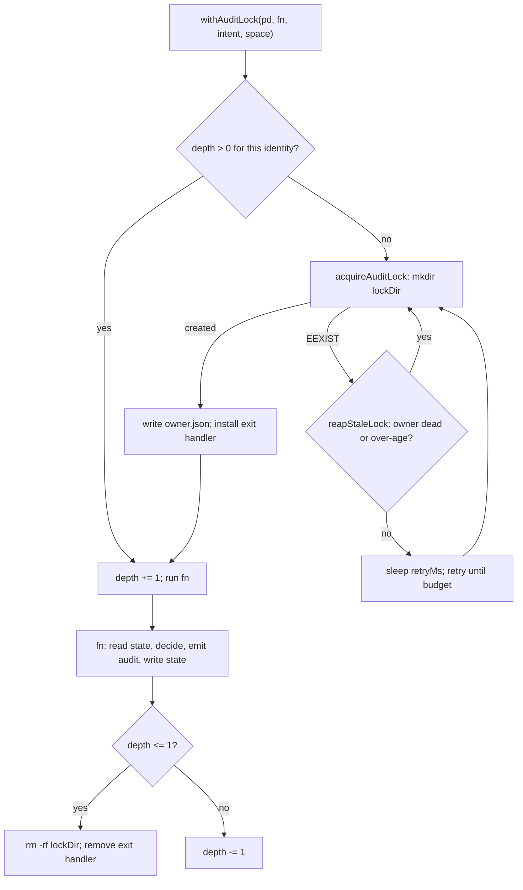

# ワークスペース、State、監査ログ、ランタイムイントロスペクション

> **Source**: [awslabs/aidlc-workflows](https://github.com/awslabs/aidlc-workflows/tree/3c3146cfd7cef33020d48e8d48d4e80d0f8c2820) — branch `v2`, commit `3c3146cf` (v2.6.40, retrieved 2026-08-21)
> **Status**: 実装から導出したビルド後仕様書(as-built specification)。上流コードが本文書に優先する。
> **正本**: 英語版 `03-state-audit-runtime.md`(この日本語版は参照訳。両者が食い違う場合は英語版が優先)

---

## 1. スコープ

本 spec が扱うのは**データプレーン**である — AI-DLC がディスク上のどこにバイトを置くか、そのバイトが何を意味するか、そしてどう読み戻されるか。

| 本書が扱う | 別文書が扱う |
| --- | --- |
| ディスク上のワークスペースツリー(`aidlc/spaces/<space>/…`)、カーソル、clone id、コミット対象/無視対象の切り分け | ステージグラフ、スコープグリッド、ディレクティブ → `02-orchestration-engine.md` |
| Intent record のレイアウト、`intents.json` レジストリ、record 命名規則 | ステージ本文、成果物語彙、ゲート儀礼 → `04-stage-protocol.md` |
| `aidlc-state.md` のフィールド/セクション契約、field writer と遷移ガード | State の*機械*そのもの(各 verb がどの遷移を行うか) → `02-orchestration-engine.md` |
| 監査ブロック形式、イベント分類、シャードモデル、ロック、fork/merge | どのフックがどのイベントを emit するか → `07-hooks.md`; センサーの意味論 → `06-sensors.md` |
| パス解決と環境変数オーバーライド | ハーネス投影 / `dist/` ビルド → `10-distribution-harnesses.md` |
| `runtime-graph.json` のコンパイルと `summary` API | メモリ日誌の*内容*ルールと §13 学習 → `08-memory-rules-learnings.md` |
| — | ツールの CLI 面をコマンドとして扱う → `09-cli-tools.md` |

事前に訂正しておく価値のある2つの前提がある — これが以後の話全体を形作るからだ:

- **監査ログは JSONL ではない。** Markdown ブロックストリーム(`## Heading` /
  `**Field**: value` / `---`)である — §6.1 参照。
- **シーケンス番号は存在しない。** 監査行は秒精度の ISO タイムスタンプを持つのみで、それ以外に
  序列を示すものは何もない。共有リーダーは、タイムスタンプでソートし、*あらゆる*タイ(シャード
  をまたぐ場合を含む)のタイブレークとして連結バッファ位置を使うことで順序を再構成しており、
  fail closed(閉じて失敗する)ことは決してない。クロスシャードのタイで fail closed するのは
  **権威を帯びた(authority-bearing)** 比較(`humanActedSinceGate`)に限られ、これはシャード自体を
  列挙する。§6.4 参照。

---

## 2. パス解決

独立した2つのリゾルバが存在し、これらは**同一の関数ではない**。両者を混同することが「なぜ
このツールは間違ったツリーへ書き込んだのか」というバグの最も一般的な原因である。

### 2.1 プロジェクトディレクトリ

`resolveProjectDir()`(`core/tools/aidlc-lib.ts:477`)はワークスペースに触れるすべてのツールが
使う。優先順位はソースコード上の順で以下の通り:

| # | ソース | 備考 |
| --- | --- | --- |
| 1 | 明示的な `--project-dir <path>` 引数 | 相対パスは `process.cwd()` に対して解決される(`aidlc-lib.ts:479-481`) |
| 2 | `AIDLC_PROJECT_DIR` | `aidlc-lib.ts:484-488` |
| 3 | `CLAUDE_PROJECT_DIR` | `aidlc-lib.ts:491-495` |
| 4 | スクリプトパスからの導出 | このモジュールは `<project>/<harness>/tools/` に置かれて出荷されるため、`<harness>/tools` を取り除く(`aidlc-lib.ts:500-502`、`stripHarnessLeaf` は `:520`) |
| 5 | CWD が既知のハーネスディレクトリを含む | `KNOWN_HARNESS_DIRS` を走査する(`aidlc-lib.ts:506-510`) |
| 6 | `process.cwd()` | フォールバック(`aidlc-lib.ts:513`) |

`resolveProjectDirFromHook(importMetaUrl)`(`aidlc-lib.ts:529`)はフック側の双子である — 明示的
引数のステップを省き(フックは argv を受け取らない)、`<harness>/tools` の代わりに
`<harness>/hooks` を取り除く。

`KNOWN_HARNESS_DIRS` は `[".claude", ".kiro", ".codex", ".aidlc", ".cursor"]`
(`aidlc-lib.ts:166`)である。ステップ4は意図的にオープンセットであり — `stripHarnessLeaf` は
ハーネスセグメントを*形状*で検証する(`isHarnessDirName`、`aidlc-lib.ts:172`)のであってメンバー
シップでは検証しないため、新しいハーネスを追加する際にここへの編集は不要である。

### 2.2 ハーネスルート

`core/tools/aidlc-runtime-paths.ts` は(ワークスペースがどこにあるかではなく)*エンジン*がどこに
存在するかを解決する。これが独立したモジュールになっているのは、コンパイル/パッケージ化された
実行ファイルがプロジェクトとは別の場所からハーネスツリーを読む可能性があるためである。

- `runtimeProjectDir()`(`aidlc-runtime-paths.ts:40`) — `resolveProjectDir` よりも簡略化した
  優先順位: `process.argv` から走査した `--project-dir`、次に
  `AIDLC_PROJECT_DIR ?? CLAUDE_PROJECT_DIR`、次に `process.cwd()`(`explicitRuntimeProjectDir`、
  `:26-38`。`cwd()` フォールバックは `:41`)。
- `runtimeHarnessDir()`(`:44`) — `AIDLC_HARNESS_DIR`。なければ、このファイルが `tools/` ディレクトリ
  内にあり親ディレクトリが `/^\.[a-z0-9][a-z0-9._-]*$/i` に一致する場合はモジュール自身の親
  ディレクトリ名。それもなければ
  `[".claude", ".kiro", ".codex", ".cursor", ".aidlc"]`(`KNOWN_HARNESSES`、`:7`)のうち
  `<dir>/tools/data/harness.json` が存在する最初のもの。それもなければ `".claude"`。
- `runtimeHarnessName()`(`:72`) — `AIDLC_HARNESS_NAME`。なければ `tools/data/harness.json` の
  `name` フィールド(プロジェクトルートを先に見て、次にモジュール自身のハーネスルート)。それも
  なければディレクトリ名フォールバックテーブル — `.aidlc → "opencode"`、`.codex → "codex"`、
  `.kiro → "kiro"`、`.cursor → "cursor"`、デフォルト `"claude"`(`:88-95`)。`:88-90` のコメント
  には、Copilot と OpenCode が意図的に `.aidlc` を共有していること、したがって `harness.json` が
  唯一の権威ある判別子であり、ディレクトリ名フォールバックは互換性のためだけのものであることが
  記録されている。
- `resolveHarnessRoot(location)`(`:137`) — 読み取りパスは以下の順で優先する:
  `AIDLC_RUNTIME_HARNESS_ROOT` / `AIDLC_RUNTIME_ROOT`(`explicitHarnessRoot`、`:102`)、次に
  モジュール自身のハーネスルート、次にプロジェクトの `<projectDir>/<harnessDir>`(それが実際の
  ハーネスルートである場合)、最後に `dirname(process.execPath)/runtime/<distribution>` 配下の
  パッケージ化されたランタイムルート。
- **変更(mutation)はプロジェクトが所有する。** `:147-148` のコメントは明示的である: *「変更は
  プロジェクトが所有する。明示的/モジュール/パッケージ化されたルートは読み取り用フォールバック
  にすぎず、決して書き込み対象になってはならない」*。`location.mutable` の場合、リゾルバは
  プロジェクトルート(プロジェクトディレクトリが指定されなかった場合はモジュールルート)を返し、
  明示的/パッケージ化されたルートを返すことは決してない。

`resolveSkillsPath`(`:176`)はディストリビューションごとに2つの特殊ケースを追加する — `copilot`
は `.github/skills/` を読み、`codex` は `<harness>/skills` が存在しない場合に `.agents/skills/`
へフォールバックする。

### 2.3 環境変数オーバーライド一覧

| 変数 | 効果 | 箇所 |
| --- | --- | --- |
| `AIDLC_PROJECT_DIR` | プロジェクトルートのオーバーライド(両リゾルバ共通) | `aidlc-lib.ts:484`、`aidlc-runtime-paths.ts:34` |
| `CLAUDE_PROJECT_DIR` | プロジェクトルートのオーバーライド、優先度は低い | `aidlc-lib.ts:491`、`aidlc-runtime-paths.ts:34` |
| `AIDLC_HARNESS_DIR` | ハーネスディレクトリ名を固定する(テストシーム) | `aidlc-lib.ts:198`、`aidlc-runtime-paths.ts:45` |
| `AIDLC_HARNESS_NAME` | ハーネス/ディストリビューション名を固定する | `aidlc-runtime-paths.ts:76` |
| `AIDLC_RULES_SUBDIR` | ハーネスの rules サブディレクトリを固定する | `aidlc-lib.ts:465` |
| `AIDLC_RUNTIME_ROOT` | パッケージ化されたランタイムルート | `aidlc-runtime-paths.ts:106` |
| `AIDLC_RUNTIME_HARNESS_ROOT` | ハーネスルートの直接オーバーライド | `aidlc-runtime-paths.ts:103` |
| `AIDLC_COMPILED_EXECUTABLE` | コンパイル済み実行ファイルのパス探索をオーバーライドする | `aidlc-runtime-paths.ts:21` |
| `AIDLC_STATE_TRANSITION_OWNER` | エンジン所有の state verb では `orchestrate:<ppid>` と一致する必要がある | `aidlc-state.ts:540` |
| `AIDLC_ALLOW_DIRECT_STATE_TRANSITIONS` | `=1` でエンジン所有権チェックをバイパスする | `aidlc-state.ts:541` |
| `AIDLC_ALLOW_DIRECT_AUDIT_EVENTS` | `=1` で監査 CLI に権威を帯びたイベントの emit を許可する | `aidlc-audit.ts:432` |
| `AIDLC_SKIP_HUMAN_PRESENCE_GUARD` | `=1` で `HUMAN_TURN` 鮮度ゲートを無効化する | `aidlc-lib.ts:6543`(`humanPresenceGuardDisabled`、宣言は `:6542`) |
| `AIDLC_LOCK_STALE_MS` | 失効ロックとみなす経過時間の閾値(デフォルト 600000) | `aidlc-lib.ts:6787`、デフォルトは `:6784` |
| `AIDLC_LOCK_UNSTAMPED_GRACE_MS` | スタンプ未記入のロックディレクトリに対する猶予(デフォルト 5000) | `aidlc-lib.ts:6925-6931` |
| `AIDLC_AUDIT_LOCK_RETRIES` / `_RETRY_MS` | `audit-merge` の取得予算(デフォルト 200 × 100 ms) | `aidlc-audit.ts:1363-1371` |
| `AIDLC_METRICS_ENDPOINT` | 設定されている場合、構造化 append のたびにメトリクスモジュールをフックする | `aidlc-audit.ts:514` |

---

## 3. ワークスペースツリー

### 3.1 屋根(roof)と space

`workspaceRoot(projectDir)` は `join(projectDir, "aidlc")`(`aidlc-lib.ts:1293`)である —
ハーネス中立の単一ディレクトリで、ハーネスのエンジンディレクトリの隣に置かれる。ワークフローが
生成するすべてのものはこの配下に置かれる。

```text
<project>/
├── .claude/  (or .kiro/ .codex/ .cursor/ .aidlc/)   THE ENGINE — see 10-distribution-harnesses.md
└── aidlc/                                            THE WORKSPACE
    ├── active-space                    per-user cursor (gitignored)
    ├── .aidlc-clone-id                 per-clone audit-shard token (gitignored)
    ├── .aidlc-sessions/                per-conversation session→intent map (gitignored)
    ├── diagnostics/                    --doctor --export output (gitignored)
    └── spaces/
        └── <space>/
            ├── memory/                 org.md team.md project.md phases/ templates/
            ├── knowledge/              free-form team knowledge; documents/ + documentkb/
            ├── codekb/<repo>/          per-repo code knowledge
            └── intents/
                ├── active-intent       per-user cursor (gitignored)
                ├── intents.json        the registry
                └── <YYMMDD>-<label>/   ONE INTENT RECORD  (see §4)
```

*文書化フォールバック: プロジェクトルートは1つのハーネスエンジンディレクトリと1つの
`aidlc/` ワークスペースディレクトリを保持する。`aidlc/` は2つのユーザー単位のカーソルファイル、
マシンローカルなランタイムファイル、そして `spaces/<space>/` 配下のサブツリーを保持する。
各 space は `memory/`、`knowledge/`、`codekb/<repo>/`、`intents/` を保持し、`intents/` は
レジストリと intent ごとの record ディレクトリを1つずつ保持する。*

Space レベルのパスヘルパー:

| ヘルパー | 解決先 | 箇所 |
| --- | --- | --- |
| `activeSpace(projectDir)` | `aidlc/active-space` の内容(トリム済み)。存在しない/空の場合は `"default"` | `aidlc-lib.ts:1300` |
| `intentsDir(projectDir, space?)` | `aidlc/spaces/<space>/intents` | `aidlc-lib.ts:1312` |
| `knowledgeDir(projectDir, space?)` | `aidlc/spaces/<space>/knowledge` | `aidlc-lib.ts:1324` |
| `codekbDir(projectDir, repo, space?)` | `aidlc/spaces/<space>/codekb/<repo>` | `aidlc-lib.ts:1436` |
| `spacesRoot(projectDir)` | `aidlc/spaces` | `aidlc-lib.ts:1924` |
| `spaceRecordRoot(projectDir, space?)` | *= `intentsDir`* — null-intent 時のフォールバックルート | `aidlc-lib.ts:1669` |
| `relativeSpaceRecordPrefix(space)` | posix スラッシュ形式の `aidlc/spaces/<space>/intents` | `aidlc-lib.ts:1679` |

`activeSpace` は**決して例外を投げない**(`aidlc-lib.ts:1298-1299`: *「NEVER throws — ディスク上に
まだ何もない場合でも、デフォルト space は常に有効である」*)。`listSpaces`(`:1962`)は
`aidlc/spaces/` が存在しなくても常に `default` を報告する。`--space` フラグは
`SPACE_NAME_REGEX = /^[a-z][a-z0-9-]*$/`(`aidlc-lib.ts:1341`)に対して `validSpaceFlag`
(`:1343`)によって検証される — これはパスセグメントであり、生のまま `join()` へ届いては
ならないためである。

### 3.2 カーソル

エクスポートされた定数で名付けられた、ユーザー単位のポインタファイルが2つ存在する:

```ts
export const ACTIVE_SPACE_POINTER = "active-space";     // aidlc-lib.ts:589
export const ACTIVE_INTENT_POINTER = "active-intent";   // aidlc-lib.ts:590
export const DEFAULT_SPACE = "default";                 // aidlc-lib.ts:591
```

- `aidlc/active-space` は space 名を保持する。`setActiveSpaceCursor`(`aidlc-lib.ts:2067`)に
  よって書き込まれる — ベストエフォートで、失敗は握りつぶされる。*「per-user cursor;
  best-effort」*。
- `aidlc/spaces/<space>/intents/active-intent` は**record ディレクトリ名**を保持する。
  `setActiveIntentCursor`(`aidlc-lib.ts:2055`)によって書き込まれる。
- `ensureActiveSpaceCursor`(`aidlc-lib.ts:2032`)は、並行して行われる切り替えを踏み潰すことなく
  space カーソルを実体化する — `flag: "wx"` でステージング用の
  `aidlc/.aidlc-active-space-<pid>-<uuid>.tmp` を書き込み、(no-replace 意味論がアトミックである)
  `linkSync` でインストールしたのち、ステージングファイルを unlink する。

両カーソルとも gitignore されている(§3.4)ため、fresh clone にはどちらも存在しない — したがって
リゾルバは不在を許容しなければならない。これが `activeSpace` がデフォルト値を返し、
`activeIntent` が `null` を返す理由である。

### 3.3 Clone id とシャード命名

```ts
export const CLONE_ID_FILE = ".aidlc-clone-id";   // aidlc-lib.ts:3681
```

`cloneIdPath(projectDir)` は `aidlc/.aidlc-clone-id`(`aidlc-lib.ts:3683`)である。`cloneId()`
(`:3700`)はこれを読み取り、`/^[a-z0-9]{1,32}$/` に対して検証する。不在の場合は
`randomUUID()` から12桁の16進文字を採取して永続化し、その後**再読み取り**することで、並行する
初回起動でのミントが1つのディスク上トークンへ収束するようにする。値はプロセス単位でメモ化
され、書き込み不能なワークスペースの場合はインメモリのトークンへ縮退する。

`auditShardName(projectDir)`(`aidlc-lib.ts:4499`)は
`` `${host}-${cloneId(projectDir)}.md` `` を組み立てる。ここで `host` は小文字化した
`os.hostname()` であり、`[a-z0-9-]` 以外の連続部分は `-` に潰され、トリムされ、48文字で
切り詰められ、デフォルトは `"host"` である。

`aidlc-lib.ts:3675-3680` のコメントは設計意図を逐語で述べている — トークンは gitignore
されており、*「so it never travels in a commit — that is what makes the token DISTINCT
across clones(コミットに乗らないようにするためだ — これがトークンをクローンごとに異なる
ものにする所以である。fresh checkout はトークンファイルを持たず自身でミントする)」*、そして
これが並行する監査 append における git マージコンフリクトを取り除く仕組みである。

### 3.4 コミット対象 vs 無視対象

出荷される `.gitignore` は、トラッキングされているソースファイル
`harness/claude/dot-gitignore` を `dist/claude/.gitignore` へ逐語投影(バイト同一。Measurement
notes M11 参照)したものである。AI-DLC ブロックは11個の ignore glob を宣言する。ファイル順に
逐語で示す(`harness/claude/dot-gitignore:34-63`):

```text
aidlc/active-space
aidlc/spaces/*/intents/active-intent
aidlc/.aidlc-clone-id
aidlc/.aidlc-active-space-*.tmp
aidlc/.aidlc-sessions/
aidlc/spaces/*/intents/.aidlc-*
aidlc/spaces/*/knowledge/documentkb/.journal/
aidlc/spaces/*/knowledge/.sources.local.json
aidlc/spaces/*/intents/*/runtime-graph.json
aidlc/spaces/*/intents/*/.aidlc-*
aidlc/diagnostics/
```

このファイル自身が経験則を述べている(`harness/claude/dot-gitignore:27-29`): *「per-user
session CURSORS and machine-local runtime/derived state are ignored; everything that is the
shared work — method, registry, state, AUDIT (per-clone shards), artifacts — is committed.
(ユーザー単位のセッション CURSOR とマシンローカルなランタイム/派生状態は無視される。共有される
作業のすべて — method、レジストリ、state、監査(per-clone シャード)、成果物 — はコミット
される)」*。

各 glob ファミリーについてインラインで記録されている理由:

| Glob ファミリー | 記録されている理由 |
| --- | --- |
| `active-space`、`active-intent` | *「two teammates legitimately point at different spaces/intents at once; committing them would turn per-user navigation into shared state and cause conflicts on births and switches(2人のチームメイトが同時に別々の space/intent を正当に指し示すことがある。これらをコミットするとユーザー単位のナビゲーションが共有状態になってしまい、intent の誕生や切り替え時にコンフリクトが起きる)」*(`:30-33`) |
| `.aidlc-clone-id` | *「it MUST stay machine-local (gitignored) or every clone from a commit would share a shard and git-conflict(マシンローカル(gitignore 対象)である必要がある。さもなければ、あるコミットから作られたすべてのクローンが同じシャードを共有してしまい git コンフリクトを起こす)」*(`:38-39`) |
| `.aidlc-active-space-*.tmp` | アトミックな active-space 作成のステージング用(`:41`) |
| `.aidlc-sessions/` | 会話単位の session→intent マップ、*「per-user runtime state keyed by Claude Code session_id, never shared truth(Claude Code の session_id をキーとするユーザー単位のランタイム状態であり、決して共有される真実ではない)」*(`:43-44`) |
| `documentkb/.journal/` | ステージングされたトランザクションのスクラッチ。*「a committed journal would be a merge conflict on every concurrent sync(コミットされたジャーナルは並行する同期のたびにマージコンフリクトを起こす)」*(`:47-52`) |
| `.sources.local.json` | エイリアス→絶対ルートのマップ。*「Committing it would give every clone one developer's directory layout(コミットすると、すべてのクローンが1人の開発者のディレクトリレイアウトを持つことになってしまう)」*(`:54-57`) |
| `runtime-graph.json` | コンパイル済みの派生ビュー(§7 参照) |
| intent / record 配下の `.aidlc-*` | recovery、hooks-health、sensor、active-directive のスクラッチ(§4.4) |
| `diagnostics/` | `--doctor --export` の出力。*「machine-local derived output, never shared truth(マシンローカルな派生出力であり、決して共有される真実ではない)」*(`:61-62`) |

同じファイルは、コミット対象の集合を非規範的な記録として列挙している(`:65-72`):
`aidlc/spaces/*/memory/**`、`codekb/**`、`intents/intents.json`、`intents/*/aidlc-state.md`、
`intents/*/audit/*.md`、`intents/*/<phase>/<stage>/*.md`。また監査マージに関する意図的な
否定的判断も記録している: *「there is intentionally NO .gitattributes merge=union, which was
proven to corrupt the multi-line audit blocks(.gitattributes の merge=union は意図的に
設定していない。これは複数行にわたる監査ブロックを破損させることが実証されているためだ)」*
(`:70-71`)。

### 3.5 出荷されるワークスペースシード(生成物)

`dist/` は生成された投影出力であり、ソースではない。レイアウトの確認のみを目的として見ると、
出荷される Claude シードは method ツリーと space カーソルだけを持ち — intent record は
持たない:

```text
dist/claude/aidlc/active-space                                  (content: "default")
dist/claude/aidlc/spaces/default/memory/{org,team,project}.md
dist/claude/aidlc/spaces/default/memory/phases/{ideation,inception,construction,operation}.md
dist/claude/aidlc/spaces/default/memory/templates/.gitkeep
```

これはコードパスと整合する: `ensureWorkspaceDirs`(`core/tools/aidlc-utility.ts:3764`)が
残りを誕生時に遅延生成する — record ディレクトリ、スコープ内の各フェーズのサブディレクトリ、
`verification/`、そして space レベルの `knowledge/` ディレクトリであり、これらを明示的に
*「never SEED」*しない(`:3782`)。唯一のガード付き例外はエンジンのみインストール時の
セルフヒールである: `aidlc/spaces/default/memory/` が存在しない場合、memory ツリーはエンジン
内部にバンドルされたコピー `tools/data/memory-seed/` からコピーされる
(`aidlc-utility.ts:3799-3803`)。

### 3.6 `repos.json` — 別種の「ワークスペース」

`core/tools/aidlc-workspace-manifest.ts`(158行)は `aidlc/` ツリーに**関するものではない**。
これは workspace sync と doctor が消費する、マルチリポチェックアウトマニフェストのスキーマ
である:

```ts
export interface WorkspaceManifest { org: string; repos: WorkspaceRepoEntry[] }   // :12-15
```

`parseWorkspaceManifest`(`:90`)は文字列を意識したスキャナ(`stripWorkspaceManifestComments`、
`:28`)で `//` と `/* */` のコメントを取り除いたのち、以下を強制する: 空でない文字列
`org` と配列 `repos`(`aidlc-workspace-manifest.ts:98-105`、メッセージは `:104` の
*「repos.json must have a non-empty string \"org\" and an array \"repos\".」*)。各エントリは
空でない `name`(`:110-112`)を持ち、それは `REPO_NAME_REGEX` に一致する(*「must be a single path segment matching
… (no separators or \"..\")」*、`:113-117`、メッセージは `:115`)。名前の重複を禁止する
(`:118-120`)。`branch`/`url` は存在する場合は空でない文字列でなければならない(`:123-138`)。
`workspaceRepoPath`(`:149`)は包含関係を再チェックする — 解決された候補はワークスペースルートの
*直下の子*でなければならず、そうでなければ例外を投げる。

`.gitignore` の書き換え用に3つの管理領域の定数がエクスポートされている(`:17-22`):
`WORKSPACE_GITIGNORE_GATE_BEGIN`、`WORKSPACE_GITIGNORE_GATE_END`、
`WORKSPACE_RECOVERY_GITIGNORE = "/.aidlc-workspace-sync-recovery-*/"`。

---

## 4. Intent record

### 4.1 命名と識別

識別子とディレクトリ名は意図的に分離されている。

- **正準 id**: `uuidv7()`(`aidlc-lib.ts:1698`)がミントする UUIDv7 — 48ビットの Unix-ms
  プレフィックス、バージョンニブル `7`、そして `randomUUID()`(`Math.random` は不使用)から
  取り出した暗号論的乱数のテール。uuid 文字列でソートすると生成順になる。
- **Record ディレクトリ名**: `<YYMMDD>-<short-label>`。`intentDirNameBase`
  (`aidlc-lib.ts:1765`)が `dateStamp()`(UTC の `YYMMDD`、`:1754`)と `slugify(label, 24)`
  (`:1717`)から組み立てる。`:1731-1735` のコメントがこの選択を説明している: 時刻トークンを
  *プレフィックス*にしているのは record が `ls` で時系列順にソートされるようにするためであり、
  ラベルは短い2〜3語の要約(上限24文字。旧48から削減)である。
- **衝突**: `resolveUniqueIntentDir`(`aidlc-lib.ts:1781`)は `-2`、`-3`、… と付与していき、
  `MAX_DIR_COLLISIONS = 1000` まで到達すると、スピンし続けるのではなく大きな声で例外を投げる。
- **予約名**: `RESERVED_RECORD_NAMES`(`aidlc-lib.ts:836`)は `RESERVED_RECORD_NAME_LIST`
  (`:826`)から構築される — 内容は `"help"` ∪ `INTENT_VERBS` ∪ `SPACE_VERBS` ∪
  `RESERVED_FUTURE`、すなわち `help, list, switch, create, archive, rename, show, birth`。
  `createIntent` は *「…is a reserved name and cannot be an intent label」* を投げる
  (`:2335-2337`)。

`createIntent`(`aidlc-lib.ts:2319`)が誕生の関門である。uuid をミントし、ディレクトリ名を
解決し、record を `mkdir` し、**ヘッダーのみのスタブ** `aidlc-state.md`(内容は単に
`# AI-DLC State Tracking\n`)を書き込む(`:2352`。`if (!existsSync(statePath))` ガード配下、
`:2351`)。このスタブには意味がある: `activeIntent()` はディレクトリが `aidlc-state.md` を
保持している場合にのみ、それを実在する record として扱う。したがってこのスタブがなければ、
カーソルはミントとフル state 書き込みの間で解決できず、誕生後の書き込みが空の space ルートへ
漏れ出てしまう(コメントは `:2343-2350`)。

### 4.2 レジストリ — `intents.json`

`intentsRegistryPath` は `<space>/intents/intents.json`(`aidlc-lib.ts:1900`)である。行の型
(`aidlc-lib.ts:1874-1887`):

```ts
export interface IntentRegistryEntry {
  uuid: string;
  slug: string;
  dirName?: string;   // stored verbatim at birth; optional for pre-spike rows
  scope?: string;
  repos?: string[];
  status: string;
}
```

- `appendIntentToRegistry`(`:1904`)によって、`writeFileAtomic` と2スペース JSON で書き込まれる。
  不在/破損したファイルは失敗するのではなく新しいリストとして開始される。
- `readIntentRegistry`(`:1934`)は不在/破損の場合に `[]` を返す — 同じ寛容さである。
- `recordDirMatches(entry, dirName)`(`:1893`)は行↔ディレクトリの唯一の対応付けルールである:
  厳密な `entry.dirName` を優先し、それがなければレガシーな `<slug>-<id8>` 形状
  (スラッグのプレフィックスに続けて、`idSuffix(entry.uuid, …)` のプレフィックスとなる16進の
  連続部分)へフォールバックする。
- `listIntents`(`:1991`)はレジストリの行をディスク上のディレクトリへ結合し、**孤立分は追記
  する** — レジストリ行を持たない record ディレクトリは `uuid: ""`、`status: "unknown"` として
  表面化する。
- `updateIntentStatus`(`:2372`)は行の `status` をその場で書き換える(誕生時は
  `"in-flight"` を書き込み、ワークフロー完了時に終端状態を書き込む)。これはワークスペース
  ロックの下で実行されなければならない。

`listIntentDirs`(`:1353`)は安価なディスク上専用の対応物である: `aidlc-state.md` を含む
`intents/` 配下のエントリをソート済みで列挙し、意図的にレジストリから独立している(*「it must
not depend on the registry being present(レジストリが存在することに依存してはならない)」*、
`:1352`)。

### 4.3 Record レイアウト

`docsRoot(projectDir, intent?, space?)`(`aidlc-lib.ts:5881`)が record ごとのベースである:
`recordDir(...) ?? spaceRecordRoot(...)`。

| パス(`<record>/` からの相対) | 内容 | 箇所 |
| --- | --- | --- |
| `aidlc-state.md` | state ファイル(§5) | `stateFilePath`、`aidlc-lib.ts:2545` |
| `audit/<host>-<clone>.md` | per-clone 監査シャード(§6) | `auditFilePath`、`aidlc-lib.ts:3668` |
| `<phase>/<stage>/*.md` | ステージ成果物 | エンジンが解決する。`04-stage-protocol.md` 参照 |
| `<phase>/<stage>/memory.md` | ステージ単位の観察日誌 | `memoryFilePath`、`aidlc-lib.ts:6159` |
| `inception/units-generation/unit-of-work-dependency.md` | Bolt/unit DAG エッジブロック | `unitDependencyPath`、`aidlc-lib.ts:6165` |
| `verification/` | スコープに依存しない検証出力 | `aidlc-utility.ts:3776` |
| `runtime-graph.json` | コンパイル済みランタイムビュー(gitignore 対象) | `runtimeGraphPath`、`aidlc-lib.ts:5893` |
| `.aidlc-hooks-health/` | フックごとのハートビートとドロップカウンタ(gitignore 対象) | `hooksHealthDir`、`aidlc-lib.ts:5899` |
| `.aidlc-recovery.md` | resume 時に読まれる validate-state のパンくず(gitignore 対象) | `recoveryFilePath`、`aidlc-lib.ts:5905` |
| `.aidlc-plan.json` | `aidlc-graph resolve` の出力(gitignore 対象) | `planFilePath`、`aidlc-lib.ts:5910` |
| `.aidlc-sensors/<stage>/…` | センサーの詳細出力 + tsbuildinfo(gitignore 対象) | `sensorsDir`、`aidlc-lib.ts:6134` |
| `.aidlc-active-directive.json` | エンジンの現在の run-stage マーカー(gitignore 対象) | `aidlc-lib.ts:2556` |

`relativeRecordDir`(`aidlc-lib.ts:1420`)は、エンジンが emit しエージェントが消費するパスで
使われる posix 形式 `aidlc/spaces/<space>/intents/<dirName>` を生成する。intent が何も
解決しない場合は `null` を返す。`relativeMemoryPath`(`:6153`)は
`<prefix>/<phase>/<stage>/memory.md` を組み立て、prefix が null の場合は
`relativeSpaceRecordPrefix()` へフォールバックする。

フェーズ成果物ディレクトリは**遅延生成され、スコープ内フェーズのみ**が対象となる —
`ensureWorkspaceDirs` は `phasesWithExecuteStages(scope)`(`aidlc-utility.ts:3771-3773`)を
反復するため、スコープ外のフェーズはディレクトリを一切持たず、誕生時の監査がその件数を記録する
(`WORKSPACE_SCAFFOLDED`、`Details: "<n> in-scope phase dirs + verification/ + space-level
knowledge/ ensured (shell shipped by SEED)"`、`aidlc-utility.ts:4032-4036`)。

### 4.4 Intent 解決と null ケース

`activeIntent(projectDir, space?, explicit?)`(`aidlc-lib.ts:1376`)の優先順位:

1. `explicit` 引数;
2. `active-intent` カーソル — ただしそれが `aidlc-state.md` を実際に保持するディレクトリを
   指している場合**に限る**(`:1387`);
3. `listIntentDirs` がちょうど1件だけを返す場合の、その唯一の intent;
4. それ以外は `null`。

この `null` には意味がある。`aidlc-lib.ts:1373-1375` のコメントは、このヘルパーが曖昧性の
ある場合に例外を投げるのではなく null を返す理由を記録している: *「Returns null rather than
throwing on ambiguity so the path helpers stay total; the verb/handler layer (P4) owns the
error/prompt for the >1-intent-no-cursor case.(曖昧性のある場合に例外を投げるのではなく null
を返すのは、パスヘルパーを全域関数のまま保つためである。intent が2件以上でカーソルがない
ケースのエラー/プロンプトは verb/handler 層(P4)が所有する)」*。

`activeIntent` が null の場合、すべての絶対パスヘルパーは `spaceRecordRoot`(= 空の `intents/`
ディレクトリ)に対して解決される。`aidlc-state.md` がそこに直接正当に存在することは決してない
(`aidlc-lib.ts:579-587`)ため、存在有無をゲートとする消費者は正しく「ワークフローはまだない」
と読み取る。`aidlc-log.ts` はまさにこれを何かを emit する前にガードしている
(`resolveActiveProjectDir`、`aidlc-log.ts:62-69`、メッセージは *「No active workflow —
refusing to log an interaction event with no resolvable intent.」*)。

### 4.5 Worktree ミラー

Bolt ごとの git worktree は、record ツリーの*同一の相対レイアウト*でそのミラーを保持する。
`worktreePath(projectDir, boltSlug)` は `<project>/.aidlc/worktrees/bolt-<slug>`
(`aidlc-lib.ts:4639`)である。その内側:

| ヘルパー | パス | 箇所 |
| --- | --- | --- |
| `worktreeDocsDir(wt, prefix)` | `<wt>/<recordPrefix>` | `aidlc-lib.ts:6189` |
| `worktreeStateFilePath` | `<wt>/<recordPrefix>/aidlc-state.md` | `aidlc-lib.ts:6193` |
| `worktreeAuditFilePath` | `<wt>/<recordPrefix>/audit/<shardName>` | `aidlc-lib.ts:6197` |
| `worktreeRuntimeGraphPath` | `<wt>/<recordPrefix>/runtime-graph.json` | `aidlc-lib.ts:6209` |

`worktreeAuditFilePath` は**メイン**の `projectDir` を受け取る。これは worktree が自身で
ミントするであろうトークンではなく、メインクローンのトークンをシャード名に埋め込むためである
— *「the fork and merge subprocesses are both spawned from the main checkout, so threading
the main clone-id makes them resolve the SAME worktree shard across the two PIDs(fork と
merge のサブプロセスはどちらもメインのチェックアウトから spawn される。したがってメインの
clone-id を通すことで、両者が2つの PID をまたいで同一の worktree シャードへ解決できるように
なる)」*(`aidlc-lib.ts:6198-6203`)。`audit-fork` はさらに clone-id トークンファイルを worktree
内へコピーする(`aidlc-audit.ts:1232-1239`)。これにより worktree ローカルのツールが、merge が
消費することになるシャードへ append できるようになる。

---

## 5. State ファイル — `aidlc-state.md`

### 5.1 形状

intent ごとに `<record>/aidlc-state.md` に1つの Markdown ドキュメントがある。9つの `##`
セクションを持ち、すべてのフィールドは `- **<Field>**: <value>` という厳密な形のトップレベル
箇条書きである。

正準の形状は `core/knowledge/aidlc-shared/state-template.md` に置かれている。このファイルは
ステージの列挙を明示的に拒んでいる(`state-template.md:3-5`: *「the engine writes the
concrete state file and enumerates stages from the compiled stage graph plus scope grid; this
template must not hand-list shipped stages(具体的な state ファイルを書き、コンパイル済み
ステージグラフとスコープグリッドからステージを列挙するのはエンジンの役目である。この
テンプレートが出荷済みステージを手書きで列挙してはならない)」*)。

| セクション | フィールド(テンプレート順) |
| --- | --- |
| `## Project Information` | Project, Project Type, Scope, Start Date, State Version, Active Agent, Worktree Path, Bolt Refs, Practices Affirmed Timestamp |
| `## Scope Configuration` | Stages to Execute, Stages to Skip, Depth, Test Strategy |
| `## Workspace State` | Project Root, Languages, Frameworks, Build System |
| `## Execution Plan Summary` | Total Stages, Completed, In Progress |
| `## Runtime State` | Revision Count |
| `## Phase Progress` | フェーズごとに1行、`- **<Phase>**: <status>` |
| `## Stage Progress` | `### <PHASE> PHASE` の下にグルーピングされた、コンパイル済みステージごとのチェックボックス行 |
| `## Current Status` | Lifecycle Phase, Current Stage, Next Stage, Status, Construction Autonomy Mode, Last Updated |
| `## Session Resume Point` | Last Completed Stage, Next Action, Pending Artifacts |

誕生時の emitter は `aidlc-utility.ts:4229-4282` である。これは同じ9セクションと30個の
リテラル箇条書き、そして補間される5つの Phase Progress 行(`phaseProgressLines`、
`aidlc-utility.ts:4221-4227`)を書き込む。テンプレートからの実質的な乖離が2点ある(§5.8 参照):

- 誕生時の書き込みは `## Scope Configuration` 内に `- **Review Override**:` を書く
  (`:4247`)が、これはテンプレートには存在しない;
- 誕生時の書き込みは `- **Construction Autonomy Mode**:` を**書かない**が、これは
  テンプレートには存在する。

### 5.2 値の文法

`getField`(`aidlc-lib.ts:6487`)は `m` フラグ付きで `^- \*\*<Field>\*\*:[ \t]*(.*)$` に
マッチし、トリム済みのキャプチャ、または `null` を返す。水平空白文字クラスであることは
意図的である: `:6489-6491` のコメントは、JS では `\s*` が `\n` にマッチしてしまうため、
空の値を持つフィールドがそれをそのまま使うと次の箇条書き行を飲み込んでしまうと指摘している。

したがって値は**単一行**でなければならない。`hasUnsafeSingleLineCharacter`
(`aidlc-lib.ts:6436`)はコードポイント単位で文字列を走査し、`<= 0x1f`、`0x7f`、`0x2028`、
`0x2029`(`:6436-6448`、すなわち C0 制御文字、`DEL`、Unicode の行/段落区切り文字2種)を
拒否する。`validateStateLineValue`(`aidlc-state.ts:1073`)はこれを呼び出し側から供給される
`--reason` / `--next-action` テキストへ適用する。

`Bolt Refs` はリスト形状の単一行値である: `parseRefsList`(`aidlc-lib.ts:6635`)は `""`、
リテラル `[empty list]`、またはブラケット付きカンマ区切りリストを受け付ける。
`emitRefsList`(`:6647`)は空の場合は常に `[empty list]` を、そうでなければソート済みの
ブラケット付きリストを emit するため、往復変換は決定的になる。`appendSlug` / `removeSlug`
(`:6653`、`:6662`)は重複/不在のスラッグに対して no-op ではなく例外を投げる。

### 5.3 4つの writer

これが writer 契約の全体である。すべて純粋な文字列→文字列関数である。

| Writer | フィールドが**存在する**場合の挙動 | **不在**の場合の挙動 | 箇所 |
| --- | --- | --- | --- |
| `setField` | 値を置換する | **サイレントな no-op**(内容を変えずに返す) | `aidlc-lib.ts:6546` |
| `setFieldStrict` | 値を置換する | **例外を投げる** `Field not found in state file: "<f>". Cannot update — refusing to silently no-op.` | `aidlc-lib.ts:6564` |
| `setOrInsertField(content, heading, field, value)` | 値を置換する | 指定された `## Heading` の末尾に新しい箇条書きを追記する | `aidlc-lib.ts:6599` |
| `removeField` | 箇条書き行全体(末尾の改行を含む)を削除する | no-op | `aidlc-lib.ts:6620` |

`setFieldStrict` の docstring は設計上のルールを述べている(`aidlc-lib.ts:6560-6563`):
*「state-machine transitions where a silent no-op would cause undetected drift … if the
field is missing, we want to know immediately, not ship a lie to the caller.(サイレントな
no-op が検知不能なドリフトを引き起こしてしまうような state machine の遷移で使う。…フィールドが
不在の場合、呼び出し元に嘘を返すのではなく、直ちにそれを知りたい)」*。

エンジン内の `setFieldStrict` の呼び出し箇所は全部で4つある: fork 時に追記される
`Bolt Refs`(`aidlc-state.ts:4042`)、worktree コピー時の `Worktree Path`
(`aidlc-state.ts:4074`)、worktree マージパス上で削除される `Bolt Refs`
(`aidlc-state.ts:4217`)、そして `aidlc-bolt.ts:837` の `Construction Autonomy Mode`。

`setPhaseProgress`(`aidlc-lib.ts:6585`)は、フェーズスラッグを大文字化(「ideation」→
「Ideation」)して `Pending | Active | Verified | Skipped` のいずれかを書き込む、薄い
`setField` ラッパーである。行が不在の場合に意図的に no-op である: *「the section is
display-only, so a missing row must never fail a transition(このセクションは表示専用で
あるため、行が不在であっても遷移を失敗させてはならない)」*(`:6582-6584`)。

#### ランタイム限定フィールド

ベーステンプレートには含まれないが、`setOrInsertField` によってランタイムで挿入される
フィールド:

| フィールド | セクション | 書き込み元 |
| --- | --- | --- |
| `Skeleton Stance`(`on`/`off`/`scope-dependent`) | `## Runtime State` | `aidlc-state.ts:724`(`set-skeleton-stance`) |
| `Construction Iteration`(`unit-major`/`stage-major`) | `## Runtime State` | `aidlc-state.ts:764` |
| `Parked`(ISO ts)、`Parked At Stage` | `## Runtime State` | `aidlc-state.ts:814-815`(`park`)。`unpark` によって削除される `:831-832` |
| `Active Unit`、`Unit State`、`Unit Pause Reason`、`Unit Next Action` | `## Runtime State` | `aidlc-state.ts:1046-1055`。`unit complete` 時に4つとも削除される `:1041-1044` |
| `Merge-Held`(`true`/`false`) | `## Project Information` — **Bolt ごとに fork された state 限定** | `aidlc-bolt.ts:692` |

unit フィールド群は明示的にキャッシュである: *「audit stays the source of truth — these
fields are a cache, exactly like Parked / Parked At Stage(監査こそが正本であり続ける — これら
のフィールドは Parked / Parked At Stage とまったく同様にキャッシュである)」*
(`aidlc-state.ts:1036-1038`)。

`Practices Affirmed Timestamp` は `setOrInsertField`(`aidlc-state.ts:3743`)で書かれるが、
ランタイム限定フィールドでは**ない**。テンプレートに載るフィールドであり
(`state-template.md:20`)、birth も空値の箇条書きを出力する(`aidlc-utility.ts:4240`)ため、
このエンジンが生成した state ファイルであれば呼び出しは常に *replace* 側の分岐を通る。挿入側
の分岐は旧形式の修復用である: `:3739-3742` のコメントはその対象を *「a state file missing the
row (a hand-edited or pre-field file)(この行を欠く state ファイル — 手編集されたもの、または
このフィールド導入前のもの)」* に限定している。そこで `setField` を使うと暗黙の no-op となり、
このタイムスタンプを要求する approve ゲートは永久に拒否し続け、その是正指示(「practices-promote
を実行せよ」)もまた no-op を繰り返すことになる。

### 5.4 チェックボックス文法

`parseCheckboxes`(`aidlc-lib.ts:6678`)は `/^- \[([ xSR?-])\] (\S+)\s*—\s*(.*)$/gm` に
マッチする — **em ダッシュ**区切りであることに注意。6つの状態がある:

| マーカー | `CheckboxState` |
| --- | --- |
| `[ ]` | `pending` |
| `[-]` | `in-progress` |
| `[?]` | `awaiting-approval` |
| `[R]` | `revising` |
| `[x]` | `completed` |
| `[S]` | `skipped` |

`setCheckbox`(`:6713`)はマーカーのみを書き換える。`setStageSuffix`(`:6733`)は
`EXECUTE`/`SKIP` の末尾のみを書き換える。`:6727-6731` のコメントはこの分割を明示的に述べている:
*「setCheckbox owns the marker (run-state); this owns the suffix (the plan) - the two edit
disjoint fields of the same line, so recompose and jump compose cleanly.(setCheckbox は
マーカー(実行状態)を所有し、こちらは末尾(計画)を所有する — 両者は同一行の互いに素な
フィールドを編集するため、recompose と jump はクリーンに合成できる)」*。`countCheckboxes`
(`:6745`)は `Completed` フィールドの同期に使われる集計値である(`aidlc-state.ts:2240-2241`)。

### 5.5 スキーマバージョン

```ts
export const CURRENT_STATE_VERSION = "8";   // aidlc-lib.ts:10605
```

`classifyStateVersion(stateContent)`(`aidlc-lib.ts:10627`)は、ランタイム(`aidlc-orchestrate
next`/`report`)と `--doctor` の両方が使う単一の分類器であり、両者が食い違うことはあり得ない。
これは `/^- \*\*State Version\*\*:[ \t]*(\S+)[ \t]*$/m` にマッチする — 行末に固定される
ため `State Version: 8 garbage` は `unparseable` に分類される — そして
`{kind:"ok"} | {kind:"unparseable"} | {kind:"past"} | {kind:"future"}` のいずれかを返す。
`unparseable` のメッセージはユーザーに(`mv aidlc aidlc.archive` で)アーカイブして再出発する
よう促す。

### 5.6 ファイル I/O 契約

- `readStateFile`(`aidlc-lib.ts:6453`)は不在の場合に `State file not found: <path>` を
  投げる。
- `writeStateFile`(`:6461`)は書き込み前に2つのことを行う: 対象が存在する場合は
  `accessSync(path, W_OK)` を呼び `EACCES` を伝播させる。存在しない場合は親ディレクトリの
  チェーンを `mkdir -p` する。この `W_OK` の事前チェックが存在する理由は、書き込み自体が
  `writeFileAtomic`(tmp + rename)を経由するためであり、*「POSIX rename overwrites a
  read-only TARGET (it only needs directory-write permission), so it would bypass that
  barrier(POSIX の rename は読み取り専用の TARGET でも上書きしてしまう(ディレクトリの書き込み
  権限さえあればよい)。したがってこのバリアをバイパスしてしまう)」*(`:6463-6469`)ためである。
  読み取り専用の `aidlc-state.md` は意図的な書き込みバリアとして扱われる。
- 書き込みはアトミックである(tmp + rename)ため、クラッシュが並行する読み手に対して不完全な
  ファイルを残すことはない(`:6477-6481`)。

### 5.7 遷移の所有権とガード

`aidlc-state.ts` は25個のサブコマンドを公開しているが、そのうち11個は**エンジンが所有**して
おり、直接呼び出しを拒否する(`aidlc-state.ts:524-549`):

```text
set, checkbox, advance, finalize, complete-workflow,
gate-start, approve, reject, revise, skip, park
```

このチェックは `process.env.AIDLC_STATE_TRANSITION_OWNER ===`orchestrate:${process.ppid}``
(PID に束縛されたマーカーであり、コピーされた静的トークンでは通らない)を要求する。ただし
`AIDLC_ALLOW_DIRECT_STATE_TRANSITIONS === "1"` の場合は例外である。拒否メッセージは逐語で
以下の通り:

> `Direct aidlc-state.ts <sub> is blocked: workflow lifecycle transitions are engine-owned. Use aidlc-orchestrate.ts report --stage <slug> --result <awaiting-approval|approved|rejected|revised|completed|skipped>; use aidlc-orchestrate.ts park to park, and next/jump for routing changes.`

読み取り→変更→書き込みを行うすべてのハンドラは `withAuditLock(pd, …)`(§6.8)の内側で実行
される。つまり読み取り→判断→監査→書き込みは1つの critical section である。不変条件は
*audit-first(監査が先)* であり、監査行はロックの内側で emit され、その後に state 書き込みが
続く。監査でエラーが投げられれば state 書き込みはスキップされる(`aidlc-state.ts:128-130`、
例えば `:2255-2286`)。

`advance`(`aidlc-state.ts:2064`)はガード群を代表する例である:

1. `Scope` が存在し `validScopes()` に含まれなければならない — サイレントな `feature`
   フォールバックではなく *「Refusing to advance」*(`:2096-2106`);
2. 完了したスラッグは `Current Stage` と一致するか、既に `[x]` でなければならない
   (`:2117-2131`);
3. 呼び出し側から供給される次スラッグは、state の末尾接尾辞でもスコープマッピングでも
   `SKIP` であってはならない(`:2142-2150`);
4. 遷移が既に完全に適用済みの場合、冪等性/リプレイガードがクリーンに終了する(`:2174-2196`);
5. `verifyReviewerPrecondition`(`:1775`) — レビュアーを伴うステージには終端の
   `REVIEW_COMPLETED` レシートが必要;
6. `verifyStageArtifacts`、`verifySummaryConfirmationPrecondition`、
   `verifyPipelineLinkPrecondition`(`:2210-2214`) — ステージが既に完了していた場合は
   スキップされる。

これらをすべて経たのちにようやくチェックボックスを反転させ、10個のフィールドを更新し、
フェーズ境界であれば Phase Progress 行を反転させ、`STAGE_COMPLETED`(+ 境界の場合は
`PHASE_COMPLETED`/`PHASE_VERIFIED`/`PHASE_STARTED` の三点セット)と `STAGE_STARTED` を
emit し、state を書き込む。

`park` は自律的な Construction の下では拒否され(`aidlc-state.ts:796-801`)、`Status` が
`Completed` の場合も拒否される(`:803-805`)。`unit start|pause|resume|complete`
(`:861`)は単一アクティブ unit の不変条件を強制し、自律 swarm がステージを所有している場合は
拒否し(`:906-912`)、unit が権威あるDAGに含まれることを要求し(`:921-925`)、`complete` に
ついては必要な成果物がすべてディスク上に存在することをレシートをコミットする*前に*検証する
(`:980-988`)。このコメントはこれを *「the claim-1 inversion — the artifact walk moved from
'is the transition' to 'is checked by the transition'(claim-1 の反転 — 成果物走査は
「遷移そのもの」から「遷移によってチェックされるもの」へ移った)」*と呼んでいる
(`:976-979`)。

### 5.8 観測された乖離(state)

| 乖離 | 根拠 |
| --- | --- |
| テンプレートは `Construction Autonomy Mode` を宣言している(`state-template.md:61`)が、誕生時の emitter はこれを決して書かない(`aidlc-utility.ts:4271-4276`)。読み手は `getField` を使うため、`null` が返り「非自律」として扱われ、読み取りは安全側に縮退する。しかし唯一の writer である `aidlc-bolt set-autonomy` は `setFieldStrict`(`aidlc-bolt.ts:837`)を使い、このフィールド用の `setOrInsertField` 箇所は存在しない(Measurement note M12)。したがって誕生直後の state ファイルに対しては `State update failed: Field not found in state file: "Construction Autonomy Mode". …` で失敗する。テストフィクスチャは正規のプロダクトパスではなく正規表現でこの行を注入している(`tests/unit/t186-foreach-per-unit-iteration.test.ts:205`、`tests/unit/t215-bolt-dag-selfheal.test.ts:250`)。 | コード vs テンプレート |
| 誕生時の書き込みは `Review Override` を書く(`aidlc-utility.ts:4247`)が、テンプレートにはこれが列挙されていない。 | コード vs テンプレート |
| テンプレートの Stage Progress のコメントはチェックボックスの意味を `[ ] pending, [-] in-progress, [?] awaiting approval, [R] revising, [x] completed, [S] skipped` と列挙している(`state-template.md:48`)が、emitter は末尾が `[S] skipped via --stage/--phase jump` で終わる異なる文言のコメントを書き(`aidlc-utility.ts:4269`)、さらに書き換え用正規表現のヘッダー(`aidlc-utility.ts:5013`)には `[?]`/`[R]` を完全に省いた第3の異形が現れる。このコメントは装飾にすぎない — `parseCheckboxes` はマーカーを読むのであって凡例を読むのではない — が、3つの文言は一致していない。 | コード vs コード |
| `docs/guide/10-state-and-audit.md:15` は Project Information が「現在のフェーズ」を保持すると記しているが、実際に emit されるセクションにはそのようなフィールドはない(Lifecycle Phase は `## Current Status` に存在する)。 | ドキュメント vs コード |

---

## 6. 監査ログ

### 6.1 保存モデル — JSONL ではなく Markdown ブロック

監査シャードは UTF-8 の Markdown ファイルである。空ファイルへの最初の書き込みはヘッダー
`# AI-DLC Audit Log\n` を emit し(`aidlc-audit.ts:693`)、以後すべてのイベントは
`renderAuditBlock`(`aidlc-audit.ts:485`)によってレンダリングされたブロックとして追記される:

```text
\n## <Heading>\n
**Timestamp**: <ISO 8601, second precision>\n
**Event**: <EVENT_TYPE>\n
**<Key>**: <value>\n      (repeated)
\n---\n
```

具体的には、1行分に対して emit される実際のバイト列は次のようになる:

```text
## Stage Completion
**Timestamp**: 2026-08-21T09:14:07Z
**Event**: STAGE_COMPLETED
**Stage**: requirements-analysis
**Details**: Stage Requirements Analysis completed

---
```

見出しは `EVENT_HEADINGS`(`aidlc-audit.ts:192`)から取られ、なければ生のイベント名へ
フォールバックする。リーダーは `\n---\n` で分割する(`findAllEvents`、`aidlc-lib.ts:7767`)。

`core/knowledge/aidlc-shared/audit-format.md` はさらに2つのブロック形状(`:301` の
`### Error Format`、`:313` の `### Recovery Format`)を文書化している。これらは自由形式の
プローズブロックであり、構造化された emitter ではなく `append-raw` CLI を通じて到達可能な
ものである。

### 6.2 フィールド検証

`validateAuditEntry`(`aidlc-audit.ts:463`)は3つのことを強制する:

1. イベント種別が `VALID_EVENT_TYPES` に含まれること。さもなければ
   `Invalid event type: <x>. Must be one of: <full list>`;
2. どのフィールドキーも `RESERVED_FIELD_KEYS = {"Event"}`(`:452`)に含まれないこと —
   呼び出し側が供給した `Event` は2行目の `**Event**:` としてレンダリングされてしまい、
   *「forge a second matching line and spoof multiline event queries(2行目のマッチする行を
   偽造し、複数行にわたるイベントクエリをスプーフィングしてしまう)」*(`:472-473`);
3. すべてのキーが `AUDIT_FIELD_KEY_PATTERN = /^[A-Za-z][A-Za-z0-9 ._()/-]*$/`(`:461`)に
   マッチすること — これにより*「remain[s] one Markdown label on one physical line(1つの
   物理行上の1つの Markdown ラベルであり続ける)」*。

`EMITTER_OWNED_FIELD_KEYS = {"Timestamp","Event"}`(`:460`)はレンダリング時にスキップされる。
この非対称性は意図的であり、`:444-451` に文書化されている: `Timestamp` は互換性のために
公開 CLI に*受理される*が、その値は破棄される。なぜなら emitter 自身の `**Timestamp**:` 行が
最初に書かれ、すべてのパーサーは最初のマッチを採用するからである。`audit-format.md:16-23` は
同じ契約を述べ、古いシャードには旧バージョン由来の重複タイムスタンプフィールドが含まれる
可能性があると警告している。

レンダリングされるすべての値では JS の行終端文字がエスケープされる —
`const safeValue = String(value).replace(/\r\n?|\n|\u2028|\u2029/g, "\\n");`
(`aidlc-audit.ts:499`) — *「so a malicious or malformed input cannot forge a second audit
field or event line.(悪意ある、あるいは不正な形式の入力が2つ目の監査フィールドやイベント行を
偽造できないようにするため)」*。このクラスは `\u2028` / `\u2029` もカバーする(`\r` や `\n`
に加えて)。これらの2文字はほとんどの Markdown リーダーが通常の文字として扱う一方、JS の
行終端文字だからである。

### 6.3 シャードモデル

```text
<record>/audit/<host>-<clone-id>.md
```

- `auditFilePath(projectDir, intent?, space?)`(`aidlc-lib.ts:3668`) — 書き込み先。intent が
  何も解決しない場合は `<space>/intents/audit/<shard>` へフォールバックする。
- `auditShardDir`(`aidlc-lib.ts:4512`)は intent が何も解決しない場合に `null` を返す。
  したがって空の space に対する列挙は `[]` になる。
- `auditShards(projectDir, intent?, space?)`(`:4530`)はシャードを列挙する。3つの挙動が
  契約として定められている: `undefined intent + explicit space` の形式では**space レベル**の
  シャードが先頭に付く(DocumentKB の provenance と doctor がこれを使う);解決された intent の
  シャードは最後に来る;intent が一切解決しない場合、space シャードそのものが台帳になる —
  このコメントは、これが最初に省略されたとき10個のフィクスチャスイートを壊した pre-birth の
  読み書き対称性であると指摘している(`:4523-4528`)。返されるのは `*.md` エントリのみであり、
  各シャードディレクトリはまずシンボリックリンクのチェーンチェックを受ける。
- `readAllAuditShards`(`:4568`)は、`readAppendOnlyFileNoFollowOrThrow`(`:7521`)経由で
  各シャードを読みながら、シャードの内容を `\n` で連結する。消滅したシャードや拒否された
  シャードはスキップされる。*読み取り中の成長は明示的に失敗とみなされない* — したがって
  ライブな台帳はマージから脱落しない。

**space レベル**のシャード(`spaces/<space>/intents/audit/`)は、3つの `DOCUMENT_*` イベントの
本来の置き場所であり、それはたとえドキュメントが intent スコープであっても変わらない —
ドキュメントは1つの intent よりも長生きし、`associate`/`dissociate` がそのスコープを移動
させ得るからである(`audit-format.md:160`、`168-173`;`aidlc-audit.ts:117-120`)。
`appendAuditEntryAtPathUnlocked`(`aidlc-audit.ts:751`)は、DocumentKB がそのシャードパスを
自ら組み立てられるようにするためだけに存在する — 通常の解決ではそれを*求める*ことができない
(`:581-594`)。

### 6.4 順序付け — シーケンス番号は存在しない

監査行は序数フィールドを一切持たない。`isoTimestamp()` は秒精度であるため、タイは日常的に
発生する。順序契約は2つの層で実装されている:

- **単一シャード内**では、append の順序がバッファ順であり保存される。
- **シャードをまたぐ**場合、バッファ位置は何の情報も運ばない — `readAllAuditShards` は
  *ファイル名*順で連結する。したがって `findAllEvents`(`aidlc-lib.ts:7761`)は
  `**Timestamp**` で時系列順にソートし、タイはバッファ位置で解決する(`:7799-7801`)。
  `:7791-7798` のコメントはその理由を述べている — 素朴な `[len-1]`(「最新」)リーダーは
  *「could otherwise pick an OLDER event from a lexically-later shard.(そうしなければ、
  辞書順で後になるシャードから、より古いイベントを選んでしまう可能性がある)」*
- **権威を帯びた比較はクロスシャードのタイで fail closed する。** `humanActedSinceGate`
  (`aidlc-lib.ts:3774`)は連結バッファを経由せず、共有の `readAuditShardEvents` リーダーも
  再利用しない: `auditShards(projectDir)`(`:3780`)でシャード自体を列挙し、各シャードを
  `readAppendOnlyFileNoFollowOrThrow`(`:3786`)で読み、独自の
  `{ ts, shard, pos, human }` レコード(`:3811-3816`)を組み立てる。これによりシャード
  インデックスとシャード内 append 位置がすべてのイベントに紐付いたまま保たれる。候補となる
  最新の `HUMAN_TURN` が、**別の**シャード内の最新ゲート解決と同一秒を共有する場合、
  *「execution order is unknowable and the check fails CLOSED (require a fresh turn)
  rather than let shard-filename order pick a winner(実行順序は知りようがなく、チェックは
  シャードファイル名の順序に勝者を決めさせるのではなく CLOSED(新しいターンを要求する)側へ
  失敗する)」*(`aidlc-lib.ts:3752-3754`)。これを強制する述語は `:3838-3853` にある:
  最新のターンが勝つのは、**すべて**の最新の解決が
  `resolution.shard === human.shard && resolution.pos < human.pos` を満たす場合のみである。

Unit ライフサイクルのイベントは、カウンタなしで、より強い境界を厳密なトークンで達成する:
`Run floor` は `<event>:<timestamp>#<ordinal>` であり、異なるシャードにまたがる同時刻の
境界は、先行するレシートが決してマッチできない決定的な
`AMBIGUOUS:<timestamp>#<digest>` フロアへと縮退する(`audit-format.md:114-119`)。

センサー行は同じ問題を、位置ではなく明示的な相関子で解決している: すべての `SENSOR_*` 行は
8桁16進の `Fire id` を持ち、`audit-format.md:248` は強調している — *「Pair by `Fire id`,
not by audit-row index(監査行のインデックスではなく `Fire id` でペアにせよ)」* — というのも、
1回のツール呼び出しが4つの並行センサー発火に fan out することがあり、その終端行は実行時間の
違いによって入り混じるからである。

### 6.5 イベント分類

`VALID_EVENT_TYPES`(`aidlc-audit.ts:39-189`)は**86**個のイベント名を保持し、
`EVENT_HEADINGS`(`:192-279`)はその86個すべてに対する見出しを保持しており、どちらの方向にも
集合差がない(M2/M3)。`core/knowledge/aidlc-shared/audit-format.md` は同じ86個を22の
カテゴリ見出しの下に文書化しており、コードと厳密に一致する(M4/M5/M9)。
`tests/unit/t28-audit-event-sync.test.ts` はこれを守るドリフトガードである — 出荷バイトから
両方の集合を抽出し、分類法を再宣言することなくその関係をアサートする。

命名規則: `SUBJECT_PAST_VERB` — *「every event answers 'what happened?'(すべてのイベントは
『何が起きたか』に答える)」*(`audit-format.md:14`)。

| カテゴリ | 件数 | イベント |
| --- | ---: | --- |
| Workflow Lifecycle | 4 | `WORKFLOW_STARTED` `WORKFLOW_COMPLETED` `WORKFLOW_PARKED` `WORKFLOW_UNPARKED` |
| Phase Lifecycle | 4 | `PHASE_STARTED` `PHASE_COMPLETED` `PHASE_VERIFIED` `PHASE_SKIPPED` |
| Stage Lifecycle | 6 | `STAGE_STARTED` `STAGE_AWAITING_APPROVAL` `STAGE_REVISING` `STAGE_COMPLETED` `STAGE_JUMPED` `STAGE_SKIPPED` |
| Session (hook-owned) | 5 | `SESSION_STARTED` `SESSION_RESUMED` `SESSION_COMPACTED` `SESSION_ENDED` `HUMAN_TURN` |
| Initialization | 3 | `WORKSPACE_SCAFFOLDED` `WORKSPACE_SCANNED` `WORKSPACE_INITIALISED` |
| Navigation | 7 | `SCOPE_CHANGED` `PLUGIN_SELECTION_CHANGED` `DEPTH_CHANGED` `TEST_STRATEGY_CHANGED` `REVIEW_CLASS_CHANGED` `SCOPE_DETECTED` `RECOMPOSED` |
| Interaction | 8 | `DECISION_RECORDED` `GATE_APPROVED` `GATE_REJECTED` `QUESTION_ANSWERED` `SUMMARY_CONFIRMATION_RECORDED` `REVIEW_REQUESTED` `REVIEW_COMPLETED` `PIPELINE_LINK_COMPLETED` |
| Unit Lifecycle | 4 | `UNIT_STARTED` `UNIT_PAUSED` `UNIT_RESUMED` `UNIT_COMPLETED` |
| Artifact | 3 | `ARTIFACT_CREATED` `ARTIFACT_UPDATED` `ARTIFACT_REUSED` |
| Subagent | 1 | `SUBAGENT_COMPLETED` |
| Reviewer Enforcement | 2 | `REVIEWER_SCOPE_BLOCKED` `REVIEW_FREEZE_BLOCKED` |
| Plan Approval | 1 | `PLAN_APPROVAL_BLOCKED` |
| Documents | 3 | `DOCUMENT_INDEXED` `DOCUMENT_UPDATED` `DOCUMENT_REMOVED` |
| Utility | 1 | `HEALTH_CHECKED` |
| Error/Recovery | 2 | `ERROR_LOGGED` `RECOVERY_COMPLETED` |
| Construction Bolt | 4 | `BOLT_STARTED` `BOLT_COMPLETED` `BOLT_FAILED` `AUTONOMY_MODE_SET` |
| Worktree | 7 | `WORKTREE_CREATED` `WORKTREE_MERGED` `WORKTREE_DISCARDED` `STATE_FORKED` `STATE_MERGED` `AUDIT_FORKED` `AUDIT_MERGED` |
| Practices | 4 | `PRACTICES_DISCOVERED` `PRACTICES_AFFIRMED` `PRACTICES_OVERRIDE` `PRACTICES_SECTION_EMPTY` |
| Merge Dispatch | 3 | `MERGE_DISPATCH_INVOKED` `MERGE_DISPATCH_RETURNED` `MERGE_DISPATCH_FALLBACK` |
| Sensor | 5 | `SENSOR_FIRED` `SENSOR_PASSED` `SENSOR_FAILED` `SENSOR_BUDGET_OVERRIDE` `GUARDRAIL_LOADED` |
| Learning Loop | 3 | `MEMORY_EMPTY` `RULE_LEARNED` `SENSOR_PROPOSED` |
| Swarm | 6 | `SWARM_STARTED` `SWARM_UNIT_CONVERGED` `SWARM_UNIT_FAILED` `SWARM_BATON_RETURNED` `SWARM_COMPLETED` `SWARM_DEGRADED` |

レジストリ内で MANDATORY(`✓`)とマークされているイベントは8個ある: `WORKFLOW_STARTED`、
`WORKFLOW_COMPLETED`、`WORKFLOW_PARKED`、`WORKFLOW_UNPARKED`、`PHASE_STARTED`、
`PHASE_COMPLETED`、`STAGE_STARTED`、`STAGE_COMPLETED`(M6)。

`audit-format.md:3` はクローズドセットのルールを述べている: *「Event names MUST match this
table exactly. Do not invent new event types. For stage completions, ALWAYS use
`STAGE_COMPLETED` — do not substitute stage-specific names like \"Requirements Analysis
Complete\" or \"Code Generated\".(イベント名はこの表に厳密に一致しなければならない。新しい
イベント種別を発明してはならない。ステージ完了については常に `STAGE_COMPLETED` を使い、
「Requirements Analysis Complete」や「Code Generated」のようなステージ固有の名前で代替
してはならない)」*。

### 6.6 権威クラス

「誰が何を発行できるか」を表す3つの重なり合う拒否リストがある。

| 集合 | 件数 | 意味 | 箇所 |
| --- | ---: | --- | --- |
| `CLI_RESERVED_EVENT_TYPES` | 8 | どの emit パスよりも前、`main` 内でのパース前拒否 | `aidlc-audit.ts:292` |
| `CLI_PROTECTED_EVENT_TYPES` | 18 | `AIDLC_ALLOW_DIRECT_AUDIT_EVENTS=1` でない限り `handleAppend` が拒否する | `aidlc-audit.ts:348` |
| `MERGE_PROTECTED_EVENT_TYPES` | 26(+ すべての `DOCUMENT_*` をプレフィックスで) | worktree の差分に決して乗ってはならない | `aidlc-audit.ts:395`、プレフィックスルールは `:426-429` |

`CLI_PROTECTED_EVENT_TYPES` は、人間の権威(`HUMAN_TURN`、`GATE_APPROVED`、
`GATE_REJECTED`、`QUESTION_ANSWERED`、`AUTONOMY_MODE_SET`)、レビュアー/パイプラインの
レシート(`REVIEW_REQUESTED`、`REVIEW_COMPLETED`、`PIPELINE_LINK_COMPLETED`、
`ARTIFACT_REUSED`)、swarm の試行/収束(`SWARM_STARTED`、`SWARM_UNIT_CONVERGED`)、4つの
`UNIT_*` レシート、そして3つの `DOCUMENT_*` 行をカバーする。拒否メッセージは逐語で以下の通り:

> `Direct emission of <E> is blocked: it is an authority-bearing receipt owned by its emitting tool or hook (gate resolutions and approvals come from aidlc-orchestrate.ts report, interview answers and reviews from aidlc-log.ts, human presence from the prompt-submit hook). The audit CLI appends diagnostic events only.`

予約セットのメッセージはこれとは異なる:

> `<E> is reserved for its owning hook/tool and cannot be appended through the public audit CLI.`

`MERGE_PROTECTED_EVENT_TYPES` は意図的にプレフィックスファミリーではなく明示的な列挙で
ある。`aidlc-audit.ts:377-394` のコメントが説明している: Bolt/swarm worktree は正当に
`STAGE_*`、`SENSOR_*`、レビュアーレシート、`ARTIFACT_*` を自身の成果物として emit する。
そして*「the referee's defence against a lying conductor is artifact re-verification at
finalize, not delta filtering.(嘘をつく conductor に対する referee の防御手段は、差分の
フィルタリングではなく finalize 時の成果物再検証である)」*。これらのファミリーに対する
プレフィックスブラックリストは `bolt complete --merge` を決定的に回復不能にしてしまった。
実際にブロックされるものは: 人間の権威、unit ライフサイクルのレシート、referee の帳簿
(fork/merge/swarm/bolt/worktree の各行、メイン側で emit される)、そしてプレフィックスによる
`DOCUMENT_*` である。

`audit-format.md:66-73` はこのモデルの限界について率直である: `HUMAN_TURN` は
*「chronological presence evidence, not authenticated decision content(時系列的な在席の
証拠であって、認証された意思決定の内容ではない)」*であり、`--user-input` /
`--feedback` / `--details` のフィールドは呼び出し側が供給するプローズであり、
*「Audit shards are operational evidence, not a tamper-proof human-authorship boundary.
(監査シャードは運用上の証拠であって、改竄不能な人間執筆の境界ではない)」*。

### 6.7 Append パス

`appendAuditBlockAtPath`(`aidlc-audit.ts:615`)は台帳に**append する**唯一の関数である。
ただし監査バイトを書き込む唯一の関数ではない: `audit-fork` はホールファイルの
`writeBufferAtomic`(`:1252`、§6.9 / §6.10)で worktree ミラーシャードを確立する。append パスは
シンボリックリンク攻撃や rename 攻撃に対して防御的に書かれている:

1. 包含関係 — シャードのプロジェクトからの相対パスは `""`、`".."` であってはならず、`../` で
   始まってはならず、絶対パスであってもならない。さもなければ
   `Refusing audit shard outside project: <p>`(`:625-627`);
2. 親ディレクトリの `mkdir -p` の前後で `assertNoSymlinkInChainOrThrow`(`:628-630`);
3. `O_RDWR | O_APPEND | O_CREAT | O_NOFOLLOW | O_NONBLOCK`、モード `0o666` でオープンする
   (`:634-642`);
4. `fstat` は通常ファイルであることを報告しなければならない。さもなければ
   `Refusing non-regular audit shard: <p>`;
5. `verifyPathStillNamesDescriptor()` — チェーン内にシンボリックリンクがないことを
   再アサートし、`realpath` を再実行し、包含関係を再チェックし、`dev`/`ino` がオープン済み
   ディスクリプタと依然として一致することを要求する(`:677-690`)。これは書き込みの**前後**
   両方で実行される。したがって書き込み中の rename は、もはや発見できない行を報告する
   のではなく、それを包含する audit-first トランザクションを失敗させる;
6. `writeAll`(`:599`)は部分的な書き込みをループし、ゼロバイトの書き込みでは
   `Audit append made no write progress` を投げる。

注目すべきは、`nlink != 1` は通常の append パスでは拒否**されない**という点である。
`:645-652` のコメントがその理由を記録している: `rsync --link-dest` や `cp -al` の
スナップショットは、ライブなシャードを `nlink 2` の状態で残す。これを拒否すると
*「bricked every later gate/hook append framework-wide(フレームワーク全体で、以後の
すべての gate/hook append を文鎮化させてしまった)」*。ハードリンクは、既にチェック済みの
パス内で同一の inode をエイリアスするだけであり、リダイレクトを何ら許可しない。明示的な
fork/merge パスは厳密なままである — `readAuditSnapshot`(`:705`)は複数リンクされている
シャードを拒否し(`:719-721`)、`verifyExpectedPrefix`(`:657`)はマージ時の append 中に
`nlink` と期待するプレフィックスの SHA-256 を再チェックする。

### 6.8 ロック

監査ロックは、`os.tmpdir()` 内に置かれた **`mkdir`-EEXIST ディレクトリとして実装された
プロセス間ミューテックス**である(`aidlc-lib.ts:6753-6755`)。

**識別子。** `auditLockIdentity(projectDir, intent?, space?)`(`aidlc-lib.ts:6799`)は
`<realpath(projectDir)>\x00<space>\x00<intent>` を組み立てる。`intent` が省略された場合は
`<realpath(projectDir)>\x00__workspace__`(`WORKSPACE_LOCK_SENTINEL`、`:6777`)。2つの
キーイング上の不変条件が `:6757-6768` に記録されている:

1. intent が省略された場合は予約済みセンチネルをハッシュ化し、**決して** `activeIntent()`
   を解決しない — 誕生時にはアクティブな intent が存在しない。もし解決してしまうと、
   並行する2つの初回起動が異なるバケットにキー付けされ、両方とも誕生してしまう。
   `intents.json` へのすべての変更はこのバケットを使う;
2. この複合的な識別子は、ロックディレクトリとプロセス内の depth/handler マップの両方を
   キー付けする。さもなければ、これらのマップが intent をまたいで衝突してしまう。

**場所。** `auditLockDir`(`:6814`)は
`join(tmpdir(),`.aidlc-audit-${md5(identity).slice(0,8)}.lock`)` である。

**取得。** `acquireAuditLock(projectDir, maxRetries=50, retryMs=100, intent?, space?,
reapLiveOwnerAfterStale=true)`(`aidlc-lib.ts:7138`)はループする: `mkdirSync(lockDir)` の
のち `writeOwnerStamp`。`EEXIST` の場合は `reapStaleLock` を試み、成功すれば直ちに `mkdir`
をリトライし、さもなければ `retryMs` だけスリープする。予算を使い切ると `false` を返し、
呼び出し側はこれを `Failed to acquire audit lock after retries`(`aidlc-audit.ts:543`)へ
変換する。

**Owner stamp。** ロックディレクトリ内の `owner.json` は
`{ pid, startedAtMs, reapLiveOwnerAfterStale, token? }` を保持する(`aidlc-lib.ts:6824-6826`)。

**Reaping(回収)。** 待機側がロックを取り戻すのは、`process.kill(pid, 0)` が `ESRCH`
(所有者が消滅)を投げた場合、またはスタンプの経過時間が `lockStaleMs()` — デフォルトは
`DEFAULT_LOCK_STALE_MS = 10 * 60 * 1000`(`:6784`)、`AIDLC_LOCK_STALE_MS` でオーバーライド
可能 — を超えた場合のみである。ライブで閾値未満の保有者から奪われることは決してない
(`:6771-6774`)。**スタンプ未記入の**ディレクトリ(mkdir は成功したが `owner.json` はまだ
書かれていない)は `unstampedGraceMs()` — デフォルト5000ミリ秒、
`AIDLC_LOCK_UNSTAMPED_GRACE_MS`(`:6925-6932`) — で保護される。これにより取得の最中にある
ライブなプロセスから奪われることがないようにしている。

**奪取は CAS(compare-and-swap)である。** `reapStaleLock`(`:7023`)はロックディレクトリを
reaper 専用の `<lockDir>.dead.<pid>-<counter>` パスへリネームし退避させたのち、
`stampMatches`(`:6960`)を移動先のディレクトリに対して呼び、自分が判断した対象と同一の
ロックを掴んだことを確認する。不一致であればディレクトリを元に戻す。`:6993-7014` の
コメントは残存するレースについて正直に述べている: この復元は、隙間で第三のプロセスが
同じパスへ再び `mkdir` していた場合には `EEXIST` で失敗しうる。その場合ライブなロックが
既に存在しており、reaper 専用ディレクトリは単に破棄される。

**再入(Re-entrancy)。** `withAuditLock`(`aidlc-lib.ts:7570`)は識別子ごとの depth カウンタ
を保持しており、保持中のセクション内でのネストした呼び出しは再取得せず、早期解放もしない。
初回取得時に `process.on("exit")` ハンドラをインストールし、これがロックディレクトリを
`rm -rf` する — *「if the body calls process.exit (Bun skips `finally` in that case) …
so the project isn't poisoned for ~5s on the next invocation(本体が process.exit を呼んだ
場合(その場合 Bun は `finally` をスキップする)…次回の呼び出しでプロジェクトが約5秒間
汚染されたままにならないようにするためだ)」*(`:7601-7609`)。`holdsAuditLock`(`:7637`)は
複合識別子の下でこのハンドラの存在を検査し、`emitAudit`(`aidlc-state.ts:141`)と
`emitError`(`aidlc-lib.ts:9977`)の両方がこれを分岐条件として `appendAuditEntryUnlocked`
を選び、自己デッドロックを回避する。



*文書化フォールバック: `withAuditLock` は、プロセスがその識別子についてのロックを既に
保持している場合は再取得せずに再入する。そうでない場合はロックディレクトリを `mkdir` する。
`EEXIST` の場合は、死んでいるか年季の入りすぎた所有者を回収しようと試み、成功すればリトライ
する。さもなければ予算内でスリープしてリトライする。成功すれば owner スタンプを書き込み、
exit ハンドラをインストールし、read-decide-emit-write の本体を実行する。抜ける際には
depth カウンタがゼロに戻ったときのみ解放する。*

### 6.9 Fork と merge

`aidlc-audit.ts` は5個のサブコマンド(M8)を公開する: `append`、`append-batch`、
`append-raw`、`audit-fork`、`audit-merge`。

**`audit-fork --slug <s> [--intent <i>] [--space <sp>]`**(`:1123`)は、Bolt worktree が
書き込みを開始する前に fork 境界を記録する:

1. emit 前のガードがクリーンに失敗する — `main audit not found at <p>; start a workflow
   first …`、`worktree directory not found at <p>; run aidlc-worktree create first`;
2. intent ごとのロックの下で main をスナップショットする;`boundary = bytes.length`、
   `sourceHash = sha256(bytes)`;
3. `Bolt slug`、`Source Audit Hash`、`Fork Boundary` を伴う `AUDIT_FORKED` を emit する —
   `expectedIdentity` プレフィックスチェックによって固定されているため、スナップショットと
   emit の間に並行する append が入り込むことはできない;
4. clone-id トークンを worktree へコピーしたのち、そこへシャードをホールファイルの
   tmp+rename として書き込む(`writeBufferAtomic(wtAuditPath, mainAfterFork)`、`:1252`)
   — `aidlc-audit.ts` 内で append ではない唯一の台帳バイト書き込みである(§6.10、M15)。

既存の worktree シャードの再 fork は、それが証明可能に最新である場合にのみ許容される —
そうでなければ3つの逐語的な拒否のいずれかが発火する(`:1164-1182`): *「…with unmerged
work after AUDIT_FORKED; merge the delta with audit-merge, or discard the worktree」*、
*「…its AUDIT_FORKED row does not match the authoritative main row」*、*「…its fork prefix
differs from main」*。これら3つのガード — そしてこれらがガードする `alreadyCurrent` の
ショートサーキット — はすべて `if (existingFork)`(`:1161-1188`)の**内側**に存在する。
ここで `existingFork = latestAuditFork(existingContent, slug)` である。この slug に対する
`AUDIT_FORKED` 行を1つも持たない既存の worktree シャードはこれらのどれにも一致せず、
`alreadyCurrent === false` のままとなり、ステップ4の書き込みによって丸ごと置き換えられる。

**`audit-merge --slug <s>`**(`:1320`)は*差分*のみを append する — `wtContent.slice(fork.end)`:

- `validateMergeDelta`(`:974`)は、差分がブロック境界で終わることを要求し
  (`worktree audit delta ends with an incomplete block`)、各ブロックが厳密に1つの
  `Event` と1つの `Timestamp` を持つこと(または、厳密に1つの timestamp と event を持た
  ない、完全な `append-raw` ノートであること)を要求し、そのイベントが `VALID_EVENT_TYPES`
  に含まれること(`worktree audit delta contains unknown event <E>`)、そして
  merge-protected でないこと(`worktree audit delta contains protected authority event <E>`)
  を要求する;
- 並行する複数 Bolt によるコンテンションのために、ロック予算はデフォルトで
  `200 × 100 ms = 20 秒` へ拡大される;
- ロックの内側で main は再スナップショットされる。worktree のスナップショットは、ロック
  取得前の読み取りとバイト単位・inode 単位で同一でなければならない
  (`worktree audit changed while merge was preparing; retry the merge`);
- *権威ある* fork 行は書き込み可能な worktree のコピーから信用するのではなく、**main**から
  回収される(`:1404-1411`)。そしてすべての相関フィールドが一致していなければならない;
- main の先頭 `boundary` バイトの SHA-256 が、記録された `Source Audit Hash` と一致
  しなければならない。さもなければ `main audit prefix-hash at byte <n> does not match
  recorded Source Audit Hash; refusing to merge (mid-Bolt tampering suspected)` — あるいは、
  main が boundary より短い場合は `… (main-audit truncation suspected)`。

`AUDIT_MERGED` は `Bolt slug`、`Entries Merged`、`Source Audit Hash`、`Fork Boundary`、
`Fork Timestamp` を持つ。`audit-format.md:211` によれば、Bolt ごとのエントリ順序は保存
される一方、Bolt をまたぐ順序はマージ完了順を反映する。

### 6.10 Append-only 規律

- **書式標準**(`audit-format.md:284`): *「Append-only — NEVER modify or delete existing
  entries.(Append-only — 既存のエントリを決して変更・削除してはならない)」*。同様に
  義務付けられているもの: ISO-8601 タイムスタンプ、認証情報/PII の非記録、そして
  *「Human decisions recorded verbatim — NEVER summarize(人間の意思決定は逐語で記録する
  — 決して要約してはならない)」*(`:286`)。
- 構造的に、**main** intent シャードを書き換えるコードパスは存在しない。すべてのインプレース
  台帳書き込みは `appendAuditBlockAtPath` を経由し、これは `O_APPEND` でのみオープンし、
  常に append のみを行う(`writeAll` → `writeSync`、`aidlc-audit.ts:603`)。
- **Worktree ミラー**シャードは文書化された例外である: `audit-fork` はホールファイルの
  `writeBufferAtomic` tmp+rename でそれを*確立*する(`aidlc-audit.ts:1252`;ヘルパーは
  `aidlc-lib.ts:7260-7281` — `openSync(tmp, "wx")` → `writeFileSync` → `renameSync`)。
  これは create-if-absent ではないため、既存の worktree シャードを*置き換える*ことも
  できる — §6.9 参照。fork 境界が書かれた後は、そのシャードへのその後の書き込みはすべて
  再び append であり、main へのマージ戻しも差分のみを append する。
- これら3つの呼び出し箇所が `aidlc-audit.ts` におけるバイト書き込みの完全な集合である:
  `:603` の `writeSync`(append パス)、`:1239` の `writeBufferAtomic`(clone-id トークン、
  台帳ではない)、`:1252` の `writeBufferAtomic`(worktree シャード) — M15。
- 読み取りは `readAppendOnlyFileNoFollowOrThrow`(`aidlc-lib.ts:7521`)を経由する。これは
  シンボリックリンク(`<what> is a symlink, which is not followed: <p>`)、非通常ファイル、
  パス→ディスクリプタの同一性不一致(`<what> changed while opening: <p>`)を拒否する —
  ただし成長は許容する。ライブな台帳が読み手の下で成長するのは想定内だからである。
- ランタイムグラフの再コンパイルは、`MEMORY_EMPTY` 行を重複排除するのではなく再 emit する;
  doctor はレートを計算する際に `(Stage, ISO-second)` で重複排除する
  (`aidlc-runtime.ts:20-23`)。
- `appendAuditEntries`(`aidlc-audit.ts:770`)は監査専用のトランザクションプリミティブで
  ある: ディスクに触れる*前に*すべてのエントリを検証し、その後1つのロックの下で1回の
  書き込みですべてのブロックを書く。したがって *「a malformed later entry cannot leave an
  earlier entry committed, and no concurrent emitter can interleave between the blocks
  (後続の不正なエントリが先行するエントリをコミット済みのまま残すことはなく、並行する
  emitter がブロックの間に割り込むこともできない)」*(`:765-769`)。

### 6.11 観測された乖離(監査)

| 乖離 | 根拠 |
| --- | --- |
| `audit-format.md:10` は、必須イベントが *「asserted by `tests/feature/t48-audit-event-emitters.sh`」* によってアサートされると述べている。しかしリポジトリには `tests/feature/` ディレクトリが存在しない(M13)。現行のクロスファイル同期ガードは `tests/unit/t28-audit-event-sync.test.ts` であり、そのヘッダー自身が `.sh` の前身から移行されたものであることを記している。 | ドキュメント vs ツリー |
| `core/knowledge/aidlc-shared/worktree-info-schema.md:42` は `merge_held` が `<path>/aidlc-docs/aidlc-state.md` から読み取られると記述している。フラットな `aidlc-docs/` レイアウトは、一度限りの移行元(`FLAT_MIGRATION_ROOT`、`aidlc-lib.ts:1823`)としてのみ生き残っている。現行の worktree state パスは `worktreeStateFilePath` = `<wt>/<recordPrefix>/aidlc-state.md`(`aidlc-lib.ts:6193`)である。同じ古いパスは `aidlc-state.ts:4071` と `aidlc-runtime.ts:1101`、`:1306` のコメントにも現れる。 | ドキュメント/コメント vs コード |
| `audit-format.md:20-23` は、古いシャードには重複した `Timestamp` フィールドが含まれる可能性があり、ファイル全体を読むリーダーは重複排除しなければならないと文書化している。`findAllEvents` はブロックごとに最初のマッチを採用する(`aidlc-lib.ts:7772`、非グローバルな `m` 正規表現)ため、これを満たしている。一方 `validateMergeDelta` は timestamp が1つでないブロックを*拒否する*(`aidlc-audit.ts:987-989`)。したがってレガシーな二重タイムスタンプブロックは worktree からマージすることができない。 | コード vs コード |

---

## 7. ランタイムグラフとサマリー

### 7.1 それは何か

`<record>/runtime-graph.json` は**実体化された派生ビュー**である — 構造的な
`stage-graph.json` のデータプレーン側の鏡像である。`core/tools/aidlc-runtime.ts:1-13` は
この契約を述べている: *「Pure observer — never mutates state.md, never asks the user, only
reads the audit log + memory.md files and writes runtime-graph.json + emits MEMORY_EMPTY
rows for zero-entry approved stages.(純粋な観測者 — state.md を決して変更せず、ユーザーに
決して質問せず、監査ログと memory.md ファイルだけを読み、runtime-graph.json を書き、
エントリがゼロの承認済みステージについて MEMORY_EMPTY 行を emit する)」*。これは gitignore
されており(§3.4)、再導出可能である。

決定性は明示的に主張されている(`:19-23`): *「re-running compile against the same audit log
produces a byte-equivalent runtime-graph.json.(同じ監査ログに対して compile を再実行すると、
バイト等価な runtime-graph.json が生成される)」*。

### 7.2 コンパイル

`compile()`(`aidlc-runtime.ts:316`)は、`aidlc-state.md` が不在の場合には
`{skipped:"no-state"}` と stderr への注記を出してスキップし(`:320-326`)、その後
`readAllAuditShards`(`:328`)経由で**すべての**シャードを読む。

- `buildWorkflowHeader`(`:239`)は最新の `WORKFLOW_STARTED` を取る;`workflow_id` と
  `started_at` はどちらもこの行のタイムスタンプであり、`scope` は監査行の値よりも state
  ファイルの `Scope` フィールドを優先する。
- `pairStartedCompleted`(`:172`)は `STAGE_STARTED`@T1 を、同じスラッグに対する後続の
  `STAGE_COMPLETED` とペアにする;最新の `STAGE_STARTED` が勝つため、再 jump は行を
  リセットする(`:138-147`)。
- `isSingleStageRow`(`:168`)は `--single` ステージランナー行をフィルタリングして除外する。
  これは `/^\*\*Workflow\*\*:\s*single-stage:/m`(`:166`)にマッチするもので判定される。
  メインワークフローの行は `Workflow` フィールドを一切持たないため、不在はメインを意味する
  (`:158-165`)。
- `readMemory`(`:271`)は §13 の4つの見出しの下にある日誌エントリを数える。`memory.md` が
  存在しない場合は `{null, null}` を返し(これは日誌が出荷される前に完了したステージ向けの
  バックフィルルールである)、ファイルが存在するが空の場合はゼロカウントを返す。
- `computeBoltDag`(`:299`)は units-generation のエッジブロックをパースする;不在、破損、
  循環のあるブロックはいずれも `bolt_dag` ノードを丸ごと省略する — 誤った、しかし有効な
  DAG をエンコードするのではなく。この2つの分岐は音量が異なる: 不在の場合、`undefined`
  をサイレントに返す(`:301`)一方、破損または循環のあるブロックは、理由と詳細を示す stderr
  への注記を出す(`:304-309`)。

コンパイルは、遷移クラスの監査 emit のたびに PostToolUse Bash フック
(`aidlc-rebuild-stage-graph.ts`)によって自動的に呼び出される;手動呼び出しはデバッグ用の
面である(`aidlc-runtime.ts:1312-1314`)。`07-hooks.md` を参照。

### 7.3 スキーマ

`docs/reference/13-runtime-graph.md` に固定されている(`aidlc-runtime.ts:15-17`:
*「Changing the shape requires bumping every consumer (Bolt fork/merge, gate ritual,
lifecycle, doctor) in the same change.(形状を変更する場合は、同じ変更ですべての消費者
(Bolt の fork/merge、ゲート儀礼、ライフサイクル、doctor)のバージョンを上げる必要がある)」*)。

```ts
interface RuntimeGraph {                    // aidlc-runtime.ts:117
  workflow_id: string; scope: string; started_at: string;
  stages: RuntimeStage[]; bolt_dag?: BoltDag;
}
interface RuntimeStage {                    // :84
  stage_slug: string;
  started_at: string | null; completed_at: string | null; agent: string | null;
  memory_path: string; memory_entries: number | null;
  memory_breakdown: MemoryBreakdown | null;      // interpretations/deviations/tradeoffs/open_questions
  sensor_firings: SensorFiring[];                // {id, fire_id, result, ts, detail_path?}
  outcome: "approved" | "failed" | "pending";
  learnings_captured: { from_orchestrator: number; from_user_addition: number } | null;
  instances?: BoltInstance[];
}
```

`instances` が存在する場合、単一インスタンス用のフィールドは `null` になり、実際のデータは
各 `BoltInstance` の側に置かれる — ただし `memory_path` は例外で、親ステージのパスとして
入り続ける(`:86-89`)。`SensorFiring.result` は4状態である: ディスパッチャの3つの終端状態に
加え、孤児状態の `"incomplete"`(`:67`)。`fire_id` は8桁16進の相関子である(`:66`)。

### 7.4 `summary` — 数値 API

`aidlc-runtime.ts` は5個のサブコマンド(M8)を公開する: `compile`、`read <stage-slug>`、
`summary [--json]`、`fragment-fork --slug`、`fragment-merge --slug`。すべて `--project-dir`
を受け付け、`stripProjectDir`(`:1399`)によって事前に取り除かれる。

`summarize()`(`:936`)は実体化された**スナップショットのみ**を読む: *「Reads the
materialised snapshot only — never re-walks audit — so the output is a pure function of
the graph (no LLM-side counting, no token heuristics)(実体化されたスナップショットのみを
読む — 監査を再走査することは決してない — したがって出力はグラフの純粋関数である(LLM 側の
カウントもトークンヒューリスティクスもない))」*(`:851-853`)。グラフが不在の場合、stderr へ
`aidlc-runtime summary: no runtime-graph.json found — run a workflow first` を出し、
終了コード1で終わる(`:1369-1373`)。

`RuntimeSummary` の形状(`:888`):

| キー | 内容 |
| --- | --- |
| `workflow_id`、`scope`、`started_at` | グラフのヘッダーからコピーされる |
| `duration_minutes` | `started_at` → 最新の `completed_at`(インスタンスの最大値を含む)、分単位で丸める;進行中は `null`(`durationMinutes`、`:1045`) |
| `stages` | `{total, approved, failed, pending}` |
| `by_phase` | `stage-graph.json` から取ったフェーズをキーとする同じ形状;未知のスラッグは `"unknown"` バケットへ入る |
| `memory` | `{total, interpretations, deviations, tradeoffs, open_questions}` |
| `sensors` | `{total, passed, failed, budget_override, incomplete}` |
| `learnings` | `{from_orchestrator, from_user_addition}` |

集計単位はステージ行ではなく*インスタンス*である: `unitsForStage`(`:869`)は `instances[]`
をフラット化するため、各 Bolt インスタンスは自身の outcome/memory の単位としてカウント
され、親の行が二重にカウントされることはない(`:857-860`)。

オーバーレイが1つ存在する。`completedStateOverlay`(`:917`)は state ファイルの `Status` が
`Completed` の場合**のみ**発火する;その場合、`EXECUTE` 接尾辞のついたすべてのチェックボックス
を、`approved`(completed の場合)または `pending`(skipped 以外の場合)へマッピングし、
インスタンスを持たないステージへそれを適用し、グラフが一度も見なかったスコープ内のスラッグ
に対して行を追加する(`:1009-1019`)。これにより、監査行のペアリングが不完全な場合でも、
完了したワークフローのサマリーが state ファイルと一致するようになる。

`renderSummary`(`:1052`)はプレーンテキスト形式(`Session Summary` ブロック)である;
`--json` は構造体を2スペースインデントで表示する。

**消費者。** 読み取り専用の3つのセッションスキルが `summary --json` からすべての数値を
取得する: `core/skills/aidlc-session-cost/SKILL.md:43`、
`core/skills/aidlc-replay/SKILL.md:35`、`core/skills/aidlc-outcomes-pack/SKILL.md:35`。
オンボーディングテンプレートはこのルールを述べている
(`core/templates/onboarding.md:26`): それぞれが *「pulls every count from `bun
{{HARNESS_DIR}}/tools/aidlc-runtime.ts summary --json` (no LLM-side counting)」*であり、
3つとも読み取り専用に分類される — *「they never advance the workflow stage pointer and
never emit audit events.(ワークフローのステージポインタを決して前進させず、監査イベントを
決して emit しない)」*。`docs/guide/11-session-management.md:158` はさらに、意図的に
トークン見積もりが存在しないこと(古いファイルサイズヒューリスティックは撤去済みで
あること)を付け加えている。

### 7.5 Fragment の fork/merge

`fragment-fork --slug` は main の `runtime-graph.json` を Bolt worktree へバイトコピー
する;`fragment-merge --slug` は worktree のフラグメントを削除する(冪等)。どちらも監査
イベントを emit しない: *「the fork boundary is already triple-attested by BOLT_STARTED +
STATE_FORKED + AUDIT_FORKED, the merge boundary by BOLT_COMPLETED + STATE_MERGED +
AUDIT_MERGED(fork 境界は既に BOLT_STARTED + STATE_FORKED + AUDIT_FORKED によって三重に
証明されており、merge 境界は BOLT_COMPLETED + STATE_MERGED + AUDIT_MERGED によって
証明されている)」*(`aidlc-runtime.ts:1104-1107`)。`fragment-fork` は、並行するコンパイルに
対するバイトコピー/ハッシュのレースを閉じるために、単一読み取りプロトコル — 1回読み、
そのバッファから書き込み、同じバッファをハッシュする — を使う(`:1120-1122`)。main が
まだグラフを持たない場合は、代わりに空のグラフをフラグメントパスへ書き込む
(`writeEmptyGraph`、`:813`)。戻り側では意図的に**内容のマージを行わない** — main の
グラフは post-Bash フックによって main の監査からイベントソース的に再構築され、内容の
マージは compile と競合してしまうためである(`:1109-1112`)。

---

## 8. 相互参照

| トピック | Spec |
| --- | --- |
| `next`/`report` が state verb をどう駆動するか;ディレクティブの種別 | `02-orchestration-engine.md` |
| ステージ本文、produces/consumes、§12a レビュアーステップ、ゲート | `04-stage-protocol.md` |
| どのフックが `HUMAN_TURN`、`ARTIFACT_*`、`SESSION_*`、コンパイルトリガーを emit するか | `07-hooks.md` |
| センサーディスパッチ、`Fire id` の意味論、`.aidlc-sensors/` 配下の詳細ファイル | `06-sensors.md` |
| `memory/` 層の解決と `RULE_LEARNED` を書き込む §13 学習ゲート | `08-memory-rules-learnings.md` |
| `aidlc-state`、`aidlc-audit`、`aidlc-log`、`aidlc-runtime` の CLI 面 | `09-cli-tools.md` |
| `core/` + `harness/` から `dist/<harness>/` がどう投影されるか | `10-distribution-harnesses.md` |
| プラグイン所有のステージとその record パス | `11-plugin-system.md` |
| `tests/unit/t28-audit-event-sync.test.ts` とより広範なテストスイート | `12-testing-ci.md` |

---

## Measurement notes

本文書のすべての数値は、以下のコマンドのいずれかを本タスク内で実行し、コミット
`3c3146cfd7cef33020d48e8d48d4e80d0f8c2820` の上流クローンに対して得たものである。`$R` は
クローンルートを表す。すべてのコマンドは `$R` を作業ディレクトリとして実行された。

- **M1 — ファイルサイズ。** `wc -l core/tools/aidlc-state.ts core/tools/aidlc-audit.ts core/tools/aidlc-log.ts core/tools/aidlc-runtime.ts core/tools/aidlc-runtime-paths.ts core/tools/aidlc-workspace-manifest.ts core/tools/aidlc-lib.ts`
  → 4278 / 1589 / 1223 / 1434 / 220 / 158 / 10668。

- **M2 — `VALID_EVENT_TYPES` の要素数 = 86。** Bun ワンライナー: `core/tools/aidlc-audit.ts`
  をリテラル `const VALID_EVENT_TYPES = new Set([` から次の `]);` までスライスし、
  `/^\s*"([A-Z_]+)",$/gm` にマッチするすべての行を抽出してカウントする。

- **M3 — `EVENT_HEADINGS` の要素数 = 86、対称差は空。** 同じスクリプト: `const
  EVENT_HEADINGS` から次の `};` までスライスし、`/^\s*([A-Z_]+):/gm` を抽出してカウント
  し、両方の集合差を M2 と比較する(どちらも `[]` を出力した)。

- **M4 — 権威集合の要素数。** 集合名ごとに同じスライス技法を適用:
  `CLI_RESERVED_EVENT_TYPES` = 8、`CLI_PROTECTED_EVENT_TYPES` = 18、
  `MERGE_PROTECTED_EVENT_TYPES` = 26。(`MERGE_PROTECTED` はさらに `aidlc-audit.ts:428` で
  すべての `DOCUMENT_*` をプレフィックスによってブロックしており、これは列挙されたメンバー
  としてはカウントされていない。)

- **M5 — audit-format レジストリの行数 = 86、distinct = 86、M2 と厳密に一致。**
  `core/knowledge/aidlc-shared/audit-format.md` に対する Bun ワンライナー: `/^\| (?:✓ )?`([A-Z_]+)`\|/gm`
  を抽出し、M2 の集合と比較する。`inDocNotCode` と `inCodeNotDoc` はどちらも `[]` を出力した。

- **M6 — 必須(`✓`)イベント数 = 8。** 同じファイル、述語 ``/^\| ✓ `([A-Z_]+)` \|/gm``。

- **M7 — state ファイルのセクション/フィールド数。**
  `grep -c '^## ' core/knowledge/aidlc-shared/state-template.md` → 9;
  `grep -cE '^- \*\*[^*]+\*\*:' core/knowledge/aidlc-shared/state-template.md` → テンプレート
  フィールド31個(`[Phase]` プレースホルダー行を含む)。
  Emitter 側、state リテラル領域に限定:
  `sed -n '4229,4282p' core/tools/aidlc-utility.ts | grep -c '^## '` → 9、そして
  `sed -n '4229,4282p' core/tools/aidlc-utility.ts | grep -cE '^- \*\*[^*]+\*\*:'` → 30個の
  リテラル箇条書き。5つの Phase Progress 行は補間される
  (`${phaseProgressLines}`)ためリテラル grep では見えず、ランタイムでは35個の箇条書きとなる。
  §5.8 のテンプレート対 emitter 比較に使ったフィールド名リストは、同じ2つの領域を
  `grep -oE '^- \*\*[^*]+\*\*:' | sed 's/^- \*\*//;s/\*\*:$//'` にパイプして得た。

- **M8 — サブコマンド数。**
  state: `awk 'NR>=552 && NR<=632 && /^      case "/' core/tools/aidlc-state.ts | wc -l` →
  25(`:553-625` のケース)。`aidlc-state.ts:630` の `Unknown subcommand` 使用法文字列は
  裏付けにはなら**ない** — 24個の名前しか列挙しておらず、`unit`(`:619`)を欠いている。
  両方のソースは1個ずれている;ここではディスパッチテーブル側の数を採用した;
  audit: `sed -n '1540,1584p' core/tools/aidlc-audit.ts | grep -cE '^    case "'` → 5;
  runtime: `SUBCOMMANDS` オブジェクトリテラル内の `tryRun("` をカウントする Bun ワンライナー
  → 5;
  log: `sed -n '1192,1205p' core/tools/aidlc-log.ts | grep -cE '^      case "'` → 4。

- **M9 — audit-format のカテゴリ見出し = 22。**
  `awk '/^## Hook-Generated Format/{exit} /^### /{c++} END{print c}' core/knowledge/aidlc-shared/audit-format.md`。
  (ファイル全体に対する `grep -c '^### '` は25を返す;余分な3つはレジストリ後の
  `### Standard/Error/Recovery Format` サブ見出しであり、これがカウントをレジストリ領域に
  固定している理由である。)

- **M10 — エンジン所有の state 遷移数 = 11。**
  `awk 'NR>=524 && NR<=536 && /^    "/' core/tools/aidlc-state.ts | wc -l`。

- **M11 — gitignore。** `grep -cE '^aidlc/' dist/claude/.gitignore` → 11。
  `diff harness/claude/dot-gitignore dist/claude/.gitignore` → 出力なし(同一)。これは dist
  ファイルがトラッキング対象のソースの逐語投影であることを裏付けている。
  出荷されるシードのレイアウト: `find dist/claude/aidlc -maxdepth 5 | sort` → 15パス =
  6ディレクトリ(`aidlc`、`spaces`、`spaces/default`、`memory`、`memory/phases`、
  `memory/templates`)+ 9ファイル(カーソルファイル1個、spaces/default/memory 配下の
  レイヤーファイル3個、phases/ 配下のファイル4個、templates/.gitkeep)。

- **M12 — `Construction Autonomy Mode` に対する `setOrInsertField` 箇所は存在しない。**
  `grep -rn "setOrInsertField" core/tools/` → 19行;呼び出し箇所10個(import/定義/コメント
  行9個との対比 — `aidlc-lib.ts:6594`、`:6599`、`:6616`、`aidlc-bolt.ts:55`、
  `aidlc-orchestrate.ts:4992`、`aidlc-state.ts:67`、`:696`、`:739`、`:3739`)は
  `aidlc-bolt.ts:692`、`aidlc-state.ts:724`、`:764`、`:814`、`:815`、`:1046`、`:1047`、
  `:1054`、`:1055`、`:3743` であり — いずれもこのフィールドを名指ししていない。
  `grep -rn "Construction Autonomy Mode" core harness scripts tests docs plugins | wc -l`
  → 142行(`core` 35、`docs` 21、`tests` 86;`harness`、`scripts`、`plugins` からの寄与は
  なし)。うち唯一の*書き手*は `aidlc-bolt.ts:837`(`setFieldStrict`)であり、残りは
  `getField` の読み取り、プローズ、テンプレート行、正規表現でこの行を注入するテスト
  フィクスチャである。2つの `AUTONOMY_MODE_FIELD` 定数(`aidlc-lib.ts:6507`、
  `aidlc-orchestrate.ts:1257`)は `getField` の読み取り(`aidlc-lib.ts:6510`、
  `aidlc-orchestrate.ts:1264`)にのみ消費されている。

- **M13 — `tests/feature/` は存在しない。** `ls tests/feature/t48*` →
  `no matches found`;
  `ls tests/` → `e2e fixtures gen-coverage-registry.ts harness hooks integration lib
  README.md run-tests.sh run-tests.ts smoke tsconfig.json unit`。
  `ls tests/unit | grep -i "t48\|audit-event"` → `t28-audit-event-sync.test.ts`。

- **M14 — record ローカルな派生パスヘルパー数 = 5。**
  `grep -cE '^export function (hooksHealthDir|recoveryFilePath|planFilePath|runtimeGraphPath|sensorsDir)' core/tools/aidlc-lib.ts`。

- **M15 — `aidlc-audit.ts` 内のバイト書き込み箇所 = 3箇所。**
  `grep -nE "writeSync|writeFileSync|appendFileSync|writeBufferAtomic|copyFileSync|createWriteStream|truncateSync|ftruncateSync" core/tools/aidlc-audit.ts`
  → 5行: import が2つ(`writeSync` は `:14`、`writeBufferAtomic` は `:33`)、呼び出しが
  3つ — `:603`(`writeSync`。`writeAll` の内部で、`appendAuditBlockAtPath` からのみ到達)、
  `:1239`(`writeBufferAtomic`、clone-id トークン)、`:1252`(`writeBufferAtomic`、
  worktree 監査シャード)。これが §6.7 と §6.10 の主張の裏にある述語である;修飾なしの
  *「唯一の監査バイトを書き込む関数」*という主張は `:1252` によって反証されてしまう。

- **Identity。** `git log -1 --format='%H %s'` → `3c3146cfd7cef33020d48e8d48d4e80d0f8c2820 fix:
  preserve Resume waits and semantic Stop progress (2.6.40) (#849)`。
