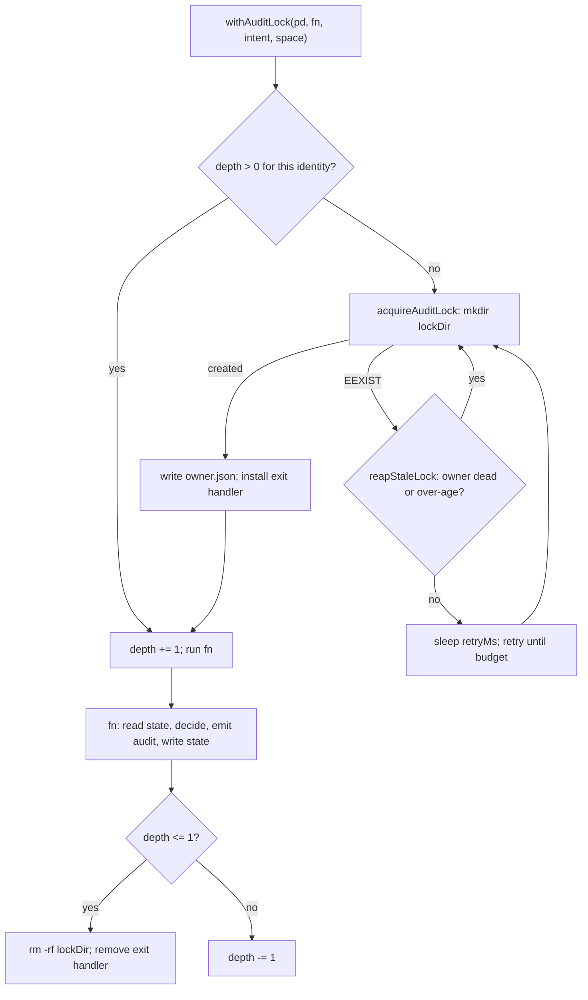

# Workspace, State, Audit Log and Runtime Introspection

> **Source**: [awslabs/aidlc-workflows](https://github.com/awslabs/aidlc-workflows) — branch `v2`, commit `3c3146cf` (v2.6.40, retrieved 2026-08-21)
> **Status**: As-built specification derived from the implementation; the upstream code is authoritative over this document.

---

## 1. Scope

This spec covers the **data plane**: where AI-DLC puts bytes on disk, what those bytes mean,
and how they are read back.

| Owned here | Owned elsewhere |
| --- | --- |
| On-disk workspace tree (`aidlc/spaces/<space>/…`), cursors, clone id, committed-vs-ignored split | Stage graph, scope grid, directives → `02-orchestration-engine.md` |
| Intent record layout, `intents.json` registry, record naming | Stage bodies, artifact vocabulary, gate ritual → `04-stage-protocol.md` |
| `aidlc-state.md` field/section contract, field writer + transition guards | The state *machine* (which transition each verb performs) → `02-orchestration-engine.md` |
| Audit block format, event taxonomy, shard model, locking, fork/merge | Which hooks emit which events → `07-hooks.md`; sensor semantics → `06-sensors.md` |
| Path resolution and env overrides | Harness projection / `dist/` build → `10-distribution-harnesses.md` |
| `runtime-graph.json` compile + `summary` API | Memory diary *content* rules and §13 learnings → `08-memory-rules-learnings.md` |
| — | CLI surfaces of the tools as commands → `09-cli-tools.md` |

Two assumptions worth correcting up front, because they shape everything downstream:

- **The audit log is not JSONL.** It is a Markdown block stream (`## Heading` /
  `**Field**: value` / `---`) — see §6.1.
- **There is no sequence number.** Audit rows carry a second-precision ISO timestamp and
  nothing else ordinal; the shared reader reconstructs order by sorting on timestamp with
  concatenated-buffer position as the tiebreak for *every* tie, cross-shard included, and never
  fails closed. Failing closed on a cross-shard tie is specific to **authority-bearing**
  comparisons (`humanActedSinceGate`), which enumerate the shards themselves. See §6.4.

---

## 2. Path resolution

Two independent resolvers exist and are **not** the same function. Confusing them is the
most common source of "why did my tool write to the wrong tree" bugs.

### 2.1 Project directory

`resolveProjectDir()` (`core/tools/aidlc-lib.ts:477`) is used by every tool that touches the
workspace. Precedence, in source order:

| # | Source | Notes |
| --- | --- | --- |
| 1 | explicit `--project-dir <path>` argument | relative paths resolved against `process.cwd()` (`aidlc-lib.ts:479-481`) |
| 2 | `AIDLC_PROJECT_DIR` | `aidlc-lib.ts:484-488` |
| 3 | `CLAUDE_PROJECT_DIR` | `aidlc-lib.ts:491-495` |
| 4 | script-path derivation | this module ships at `<project>/<harness>/tools/`, so strip `<harness>/tools` (`aidlc-lib.ts:500-502`, `stripHarnessLeaf` at `:520`) |
| 5 | CWD contains a known harness dir | iterates `KNOWN_HARNESS_DIRS` (`aidlc-lib.ts:506-510`) |
| 6 | `process.cwd()` | fallback (`aidlc-lib.ts:513`) |

`resolveProjectDirFromHook(importMetaUrl)` (`aidlc-lib.ts:529`) is the hook-side twin: it drops
the explicit-argument step (hooks get no argv) and strips `<harness>/hooks` instead of
`<harness>/tools`.

`KNOWN_HARNESS_DIRS` is `[".claude", ".kiro", ".codex", ".aidlc", ".cursor"]`
(`aidlc-lib.ts:166`). Step 4 is deliberately open-set — `stripHarnessLeaf` validates the
harness segment by *shape* (`isHarnessDirName`, `aidlc-lib.ts:172`), not membership, so a new
harness needs no edit there.

### 2.2 Harness root

`core/tools/aidlc-runtime-paths.ts` resolves where the *engine* lives (as opposed to where the
workspace lives). It is a separate module precisely because a compiled/packaged executable
may read its harness tree from somewhere other than the project.

- `runtimeProjectDir()` (`aidlc-runtime-paths.ts:40`) — a slimmer precedence than
  `resolveProjectDir`: `--project-dir` scanned out of `process.argv`, then
  `AIDLC_PROJECT_DIR ?? CLAUDE_PROJECT_DIR`, then `process.cwd()` (`explicitRuntimeProjectDir`,
  `:26-38`; the `cwd()` fallback at `:41`).
- `runtimeHarnessDir()` (`:44`) — `AIDLC_HARNESS_DIR`; else the module's own parent directory
  name when this file sits in a `tools/` dir and the parent matches
  `/^\.[a-z0-9][a-z0-9._-]*$/i`; else the first of
  `[".claude", ".kiro", ".codex", ".cursor", ".aidlc"]` (`KNOWN_HARNESSES`, `:7`) whose
  `<dir>/tools/data/harness.json` exists; else `".claude"`.
- `runtimeHarnessName()` (`:72`) — `AIDLC_HARNESS_NAME`; else the `name` field of
  `tools/data/harness.json` (project root first, then the module's own harness root); else a
  dir-name fallback table where `.aidlc → "opencode"`, `.codex → "codex"`, `.kiro → "kiro"`,
  `.cursor → "cursor"`, default `"claude"` (`:88-95`). The comment at `:88-90` records that
  Copilot and OpenCode intentionally share `.aidlc`, so `harness.json` is the authoritative
  discriminator and the dir-name fallback is compatibility only.
- `resolveHarnessRoot(location)` (`:137`) — the read path prefers, in order:
  `AIDLC_RUNTIME_HARNESS_ROOT` / `AIDLC_RUNTIME_ROOT` (`explicitHarnessRoot`, `:102`), then the
  module's own harness root, then the project's `<projectDir>/<harnessDir>` when it is a real
  harness root, then the packaged runtime root under `dirname(process.execPath)/runtime/<distribution>`.
- **Mutation is project-owned.** The comment at `:147-148` is explicit: *"Mutation is
  project-owned. Explicit/module/packaged roots are read fallbacks only and must never become
  a write target."* With `location.mutable`, the resolver returns the project root (or the
  module root when no project dir was named), never an explicit/packaged root.

`resolveSkillsPath` (`:176`) adds two per-distribution special cases: `copilot` reads
`.github/skills/`, and `codex` falls back to `.agents/skills/` when `<harness>/skills` is
absent.

### 2.3 Environment override inventory

| Variable | Effect | Site |
| --- | --- | --- |
| `AIDLC_PROJECT_DIR` | project root override (both resolvers) | `aidlc-lib.ts:484`, `aidlc-runtime-paths.ts:34` |
| `CLAUDE_PROJECT_DIR` | project root override, lower precedence | `aidlc-lib.ts:491`, `aidlc-runtime-paths.ts:34` |
| `AIDLC_HARNESS_DIR` | pin the harness dir name (test seam) | `aidlc-lib.ts:198`, `aidlc-runtime-paths.ts:45` |
| `AIDLC_HARNESS_NAME` | pin the harness/distribution name | `aidlc-runtime-paths.ts:76` |
| `AIDLC_RULES_SUBDIR` | pin the harness rules subdir | `aidlc-lib.ts:465` |
| `AIDLC_RUNTIME_ROOT` | packaged runtime root | `aidlc-runtime-paths.ts:106` |
| `AIDLC_RUNTIME_HARNESS_ROOT` | direct harness-root override | `aidlc-runtime-paths.ts:103` |
| `AIDLC_COMPILED_EXECUTABLE` | override the compiled-executable path probe | `aidlc-runtime-paths.ts:21` |
| `AIDLC_STATE_TRANSITION_OWNER` | must equal `orchestrate:<ppid>` for engine-owned state verbs | `aidlc-state.ts:540` |
| `AIDLC_ALLOW_DIRECT_STATE_TRANSITIONS` | `=1` bypasses the engine-ownership check | `aidlc-state.ts:541` |
| `AIDLC_ALLOW_DIRECT_AUDIT_EVENTS` | `=1` lets the audit CLI emit authority-bearing events | `aidlc-audit.ts:432` |
| `AIDLC_SKIP_HUMAN_PRESENCE_GUARD` | `=1` disables the `HUMAN_TURN` freshness gate | `aidlc-lib.ts:6543` (`humanPresenceGuardDisabled`, declared `:6542`) |
| `AIDLC_LOCK_STALE_MS` | stale-lock age threshold (default 600000) | `aidlc-lib.ts:6787`, default `:6784` |
| `AIDLC_LOCK_UNSTAMPED_GRACE_MS` | grace for an unstamped lock dir (default 5000) | `aidlc-lib.ts:6925-6931` |
| `AIDLC_AUDIT_LOCK_RETRIES` / `_RETRY_MS` | `audit-merge` acquire budget (defaults 200 × 100 ms) | `aidlc-audit.ts:1363-1371` |
| `AIDLC_METRICS_ENDPOINT` | when set, every structured append taps the metrics module | `aidlc-audit.ts:514` |

---

## 3. The workspace tree

### 3.1 Roof and spaces

`workspaceRoot(projectDir)` is `join(projectDir, "aidlc")` (`aidlc-lib.ts:1293`) — a single
harness-neutral directory beside the harness engine dir. Everything the workflow produces
lives under it.

```text
<project>/
├── .claude/  (or .kiro/ .codex/ .cursor/ .aidlc/)   THE ENGINE — see 10-distribution-harnesses.md
└── aidlc/                                            THE WORKSPACE
    ├── active-space                    per-user cursor (gitignored)
    ├── .aidlc-clone-id                 per-clone audit-shard token (gitignored)
    ├── .aidlc-sessions/                per-conversation session→intent map (gitignored)
    ├── diagnostics/                    --doctor --export output (gitignored)
    └── spaces/
        └── <space>/
            ├── memory/                 org.md team.md project.md phases/ templates/
            ├── knowledge/              free-form team knowledge; documents/ + documentkb/
            ├── codekb/<repo>/          per-repo code knowledge
            └── intents/
                ├── active-intent       per-user cursor (gitignored)
                ├── intents.json        the registry
                └── <YYMMDD>-<label>/   ONE INTENT RECORD  (see §4)
```

*Text fallback: the project root holds one harness engine directory and one `aidlc/`
workspace directory; `aidlc/` holds two per-user cursor files, machine-local runtime files,
and `spaces/<space>/` subtrees; each space holds `memory/`, `knowledge/`, `codekb/<repo>/`,
and `intents/`, and `intents/` holds the registry plus one record directory per intent.*

Space-level path helpers:

| Helper | Resolves to | Site |
| --- | --- | --- |
| `activeSpace(projectDir)` | contents of `aidlc/active-space`, trimmed; `"default"` when absent/empty | `aidlc-lib.ts:1300` |
| `intentsDir(projectDir, space?)` | `aidlc/spaces/<space>/intents` | `aidlc-lib.ts:1312` |
| `knowledgeDir(projectDir, space?)` | `aidlc/spaces/<space>/knowledge` | `aidlc-lib.ts:1324` |
| `codekbDir(projectDir, repo, space?)` | `aidlc/spaces/<space>/codekb/<repo>` | `aidlc-lib.ts:1436` |
| `spacesRoot(projectDir)` | `aidlc/spaces` | `aidlc-lib.ts:1924` |
| `spaceRecordRoot(projectDir, space?)` | *= `intentsDir`* — the null-intent fallback root | `aidlc-lib.ts:1669` |
| `relativeSpaceRecordPrefix(space)` | `aidlc/spaces/<space>/intents` with posix slashes | `aidlc-lib.ts:1679` |

`activeSpace` **never throws** (`aidlc-lib.ts:1298-1299`: *"NEVER throws — the default space is
always valid even when nothing is on disk yet"*). `listSpaces` (`:1962`) always reports
`default` even when `aidlc/spaces/` does not exist. A `--space` flag is validated against
`SPACE_NAME_REGEX = /^[a-z][a-z0-9-]*$/` (`aidlc-lib.ts:1341`) by `validSpaceFlag` (`:1343`)
because it is a path segment that must never reach `join()` raw.

### 3.2 Cursors

Two per-user pointer files, named by exported constants:

```ts
export const ACTIVE_SPACE_POINTER = "active-space";     // aidlc-lib.ts:589
export const ACTIVE_INTENT_POINTER = "active-intent";   // aidlc-lib.ts:590
export const DEFAULT_SPACE = "default";                 // aidlc-lib.ts:591
```

- `aidlc/active-space` holds a space name. Written by `setActiveSpaceCursor`
  (`aidlc-lib.ts:2067`) — best-effort, failures swallowed, *"per-user cursor; best-effort"*.
- `aidlc/spaces/<space>/intents/active-intent` holds a **record directory name**. Written by
  `setActiveIntentCursor` (`aidlc-lib.ts:2055`).
- `ensureActiveSpaceCursor` (`aidlc-lib.ts:2032`) materialises the space cursor without
  clobbering a concurrent switch: it writes a staged `aidlc/.aidlc-active-space-<pid>-<uuid>.tmp`
  with `flag: "wx"` and installs it with `linkSync` (whose no-replace semantics are atomic),
  then unlinks the staging file.

Both cursors are gitignored (§3.4), so a fresh clone has neither — the resolvers therefore
must tolerate absence, which is why `activeSpace` defaults and `activeIntent` returns `null`.

### 3.3 Clone id and shard naming

```ts
export const CLONE_ID_FILE = ".aidlc-clone-id";   // aidlc-lib.ts:3681
```

`cloneIdPath(projectDir)` is `aidlc/.aidlc-clone-id` (`aidlc-lib.ts:3683`). `cloneId()`
(`:3700`) reads it, validating against `/^[a-z0-9]{1,32}$/`; when absent it mints 12 hex chars
from `randomUUID()`, persists it, then **re-reads** so a concurrent first-run mint converges on
one on-disk token. The value is memoised per process; an unwritable workspace degrades to an
in-memory token.

`auditShardName(projectDir)` (`aidlc-lib.ts:4499`) composes
`` `${host}-${cloneId(projectDir)}.md` `` where `host` is `os.hostname()` lowercased,
non-`[a-z0-9-]` runs collapsed to `-`, trimmed, capped at 48 chars, defaulting to `"host"`.

The comment at `aidlc-lib.ts:3675-3680` states the design intent verbatim: the token is
gitignored *"so it never travels in a commit — that is what makes the token DISTINCT across
clones (a fresh checkout has no token file and mints its own)"*, and this is what removes git
merge conflicts on concurrent audit appends.

### 3.4 Committed vs ignored

The delivered `.gitignore` is the tracked source file `harness/claude/dot-gitignore`, projected
verbatim to `dist/claude/.gitignore` (byte-identical; see Measurement notes M11). The AI-DLC
block declares 11 ignore globs. Verbatim, in file order (`harness/claude/dot-gitignore:34-63`):

```text
aidlc/active-space
aidlc/spaces/*/intents/active-intent
aidlc/.aidlc-clone-id
aidlc/.aidlc-active-space-*.tmp
aidlc/.aidlc-sessions/
aidlc/spaces/*/intents/.aidlc-*
aidlc/spaces/*/knowledge/documentkb/.journal/
aidlc/spaces/*/knowledge/.sources.local.json
aidlc/spaces/*/intents/*/runtime-graph.json
aidlc/spaces/*/intents/*/.aidlc-*
aidlc/diagnostics/
```

The file states its own rule of thumb (`harness/claude/dot-gitignore:27-29`): *"per-user session
CURSORS and machine-local runtime/derived state are ignored; everything that is the shared work
— method, registry, state, AUDIT (per-clone shards), artifacts — is committed."*

Rationale recorded inline, per glob family:

| Glob family | Recorded reason |
| --- | --- |
| `active-space`, `active-intent` | *"two teammates legitimately point at different spaces/intents at once; committing them would turn per-user navigation into shared state and cause conflicts on births and switches"* (`:30-33`) |
| `.aidlc-clone-id` | *"it MUST stay machine-local (gitignored) or every clone from a commit would share a shard and git-conflict"* (`:38-39`) |
| `.aidlc-active-space-*.tmp` | atomic active-space create staging (`:41`) |
| `.aidlc-sessions/` | per-conversation session→intent map, *"per-user runtime state keyed by Claude Code session_id, never shared truth"* (`:43-44`) |
| `documentkb/.journal/` | staged-transaction scratch; *"a committed journal would be a merge conflict on every concurrent sync"* (`:47-52`) |
| `.sources.local.json` | alias→absolute-root map; *"Committing it would give every clone one developer's directory layout"* (`:54-57`) |
| `runtime-graph.json` | compiled derived view (see §7) |
| `.aidlc-*` under intents / record | recovery, hooks-health, sensors, active-directive scratch (§4.4) |
| `diagnostics/` | `--doctor --export` output; *"machine-local derived output, never shared truth"* (`:61-62`) |

The same file enumerates the committed set as a non-normative record (`:65-72`):
`aidlc/spaces/*/memory/**`, `codekb/**`, `intents/intents.json`, `intents/*/aidlc-state.md`,
`intents/*/audit/*.md`, `intents/*/<phase>/<stage>/*.md`. It also records a deliberate negative
decision about audit merging: *"there is intentionally NO .gitattributes merge=union, which was
proven to corrupt the multi-line audit blocks"* (`:70-71`).

### 3.5 Delivered workspace seed (generated)

`dist/` is generated projection output, not source. Inspected for layout only, the delivered
Claude seed carries exactly the method tree and the space cursor — no intent record:

```text
dist/claude/aidlc/active-space                                  (content: "default")
dist/claude/aidlc/spaces/default/memory/{org,team,project}.md
dist/claude/aidlc/spaces/default/memory/phases/{ideation,inception,construction,operation}.md
dist/claude/aidlc/spaces/default/memory/templates/.gitkeep
```

That matches the code path: `ensureWorkspaceDirs` (`core/tools/aidlc-utility.ts:3764`) creates the
rest lazily at birth — the record dir, one subdirectory per in-scope phase, `verification/`,
and the space-level `knowledge/` dir — and explicitly *"never SEED"s them (`:3782`). The single
guarded exception is engine-only-install self-heal: when `aidlc/spaces/default/memory/` is
absent, the memory tree is copied from a copy bundled inside the engine at
`tools/data/memory-seed/` (`aidlc-utility.ts:3799-3803`).

### 3.6 `repos.json` — a different "workspace"

`core/tools/aidlc-workspace-manifest.ts` (158 lines) is **not** about the `aidlc/` tree. It is the
schema for a multi-repo checkout manifest consumed by workspace sync and doctor:

```ts
export interface WorkspaceManifest { org: string; repos: WorkspaceRepoEntry[] }   // :12-15
```

`parseWorkspaceManifest` (`:90`) strips `//` and `/* */` comments through a string-aware scanner
(`stripWorkspaceManifestComments`, `:28`) and then enforces: non-empty string `org` and array
`repos` (`aidlc-workspace-manifest.ts:98-105`, message *"repos.json must have a non-empty string
\"org\" and an array \"repos\"."* at `:104`); each entry a non-empty `name` (`:110-112`) matching
`REPO_NAME_REGEX` (*"must be a single path segment matching … (no separators or \"..\")"*,
`:113-117`, message at `:115`); no duplicate names (`:118-120`); `branch`/`url` non-empty strings
when present (`:123-138`). `workspaceRepoPath` (`:149`) re-checks containment: the resolved
candidate must be an *immediate child* of the workspace root or it throws.

Three managed-region constants are exported for `.gitignore` rewriting (`:17-22`):
`WORKSPACE_GITIGNORE_GATE_BEGIN`, `WORKSPACE_GITIGNORE_GATE_END`, and
`WORKSPACE_RECOVERY_GITIGNORE = "/.aidlc-workspace-sync-recovery-*/"`.

---

## 4. The intent record

### 4.1 Naming and identity

Identity and directory name are deliberately separated.

- **Canonical id**: a UUIDv7 minted by `uuidv7()` (`aidlc-lib.ts:1698`) — a 48-bit Unix-ms
  prefix, version nibble `7`, and a cryptographically-sourced tail lifted from `randomUUID()`
  (no `Math.random`). Sorting by uuid string is creation order.
- **Record directory name**: `<YYMMDD>-<short-label>`, built by `intentDirNameBase`
  (`aidlc-lib.ts:1765`) from `dateStamp()` (UTC `YYMMDD`, `:1754`) and `slugify(label, 24)`
  (`:1717`). The comment at `:1731-1735` explains the choice: the time token is a *prefix* so
  records sort chronologically in `ls`, and the label is a short 2–3 word essence (cap 24, down
  from the old 48).
- **Collision**: `resolveUniqueIntentDir` (`aidlc-lib.ts:1781`) appends `-2`, `-3`, … up to
  `MAX_DIR_COLLISIONS = 1000`, then throws loudly rather than spinning.
- **Reserved names**: `RESERVED_RECORD_NAMES` (`aidlc-lib.ts:836`) is built from
  `RESERVED_RECORD_NAME_LIST` (`:826`) = `"help"` ∪ `INTENT_VERBS` ∪ `SPACE_VERBS` ∪
  `RESERVED_FUTURE` — i.e. `help, list, switch, create, archive, rename, show, birth`.
  `createIntent` throws *"…is a reserved name and cannot be an intent label"* (`:2335-2337`).

`createIntent` (`aidlc-lib.ts:2319`) is the birth chokepoint. It mints the uuid, resolves the
dir name, `mkdir`s the record, then writes a **header-only stub** `aidlc-state.md` containing
just `# AI-DLC State Tracking\n` (`:2352`, under the `if (!existsSync(statePath))` guard at
`:2351`). That stub matters: `activeIntent()` only treats a
directory as a real record once it holds an `aidlc-state.md`, so without the stub the cursor
would not resolve between mint and the full state write and post-birth writes would leak to the
bare space root (comment at `:2343-2350`).

### 4.2 Registry — `intents.json`

`intentsRegistryPath` = `<space>/intents/intents.json` (`aidlc-lib.ts:1900`). The row type
(`aidlc-lib.ts:1874-1887`):

```ts
export interface IntentRegistryEntry {
  uuid: string;
  slug: string;
  dirName?: string;   // stored verbatim at birth; optional for pre-spike rows
  scope?: string;
  repos?: string[];
  status: string;
}
```

- Written by `appendIntentToRegistry` (`:1904`) with `writeFileAtomic` and 2-space JSON;
  absent/malformed files start a fresh list rather than failing.
- `readIntentRegistry` (`:1934`) returns `[]` on absent/malformed — the same tolerance.
- `recordDirMatches(entry, dirName)` (`:1893`) is the single row→dir join rule: prefer exact
  `entry.dirName`; else fall back to the legacy `<slug>-<id8>` shape (slug prefix plus a
  trailing hex run that is a prefix of `idSuffix(entry.uuid, …)`).
- `listIntents` (`:1991`) joins registry rows to on-disk dirs and **appends orphans** — record
  dirs with no registry row surface with `uuid: ""`, `status: "unknown"`.
- `updateIntentStatus` (`:2372`) flips a row's `status` in place (birth writes `"in-flight"`;
  workflow completion writes the terminal status). It must run under the workspace lock.

`listIntentDirs` (`:1353`) is the cheap on-disk counterpart: it enumerates `intents/` entries
that contain an `aidlc-state.md`, sorted, and is deliberately independent of the registry
(*"it must not depend on the registry being present"*, `:1352`).

### 4.3 Record layout

`docsRoot(projectDir, intent?, space?)` (`aidlc-lib.ts:5881`) is the per-record base:
`recordDir(...) ?? spaceRecordRoot(...)`.

| Path (relative to `<record>/`) | Content | Site |
| --- | --- | --- |
| `aidlc-state.md` | the state file (§5) | `stateFilePath`, `aidlc-lib.ts:2545` |
| `audit/<host>-<clone>.md` | per-clone audit shards (§6) | `auditFilePath`, `aidlc-lib.ts:3668` |
| `<phase>/<stage>/*.md` | stage artifacts | resolved by the engine; see `04-stage-protocol.md` |
| `<phase>/<stage>/memory.md` | per-stage observation diary | `memoryFilePath`, `aidlc-lib.ts:6159` |
| `inception/units-generation/unit-of-work-dependency.md` | the Bolt/unit DAG edge block | `unitDependencyPath`, `aidlc-lib.ts:6165` |
| `verification/` | scope-independent verification outputs | `aidlc-utility.ts:3776` |
| `runtime-graph.json` | compiled runtime view (gitignored) | `runtimeGraphPath`, `aidlc-lib.ts:5893` |
| `.aidlc-hooks-health/` | per-hook heartbeat + drop counters (gitignored) | `hooksHealthDir`, `aidlc-lib.ts:5899` |
| `.aidlc-recovery.md` | validate-state breadcrumb read on resume (gitignored) | `recoveryFilePath`, `aidlc-lib.ts:5905` |
| `.aidlc-plan.json` | `aidlc-graph resolve` output (gitignored) | `planFilePath`, `aidlc-lib.ts:5910` |
| `.aidlc-sensors/<stage>/…` | sensor detail output + tsbuildinfo (gitignored) | `sensorsDir`, `aidlc-lib.ts:6134` |
| `.aidlc-active-directive.json` | the engine's active run-stage marker (gitignored) | `aidlc-lib.ts:2556` |

`relativeRecordDir` (`aidlc-lib.ts:1420`) yields the posix form
`aidlc/spaces/<space>/intents/<dirName>` used in engine-emitted, agent-consumed paths; it
returns `null` when no intent resolves. `relativeMemoryPath` (`:6153`) composes
`<prefix>/<phase>/<stage>/memory.md`, falling back to `relativeSpaceRecordPrefix()` when the
prefix is null.

Phase artifact dirs are created **lazily and only for in-scope phases** —
`ensureWorkspaceDirs` iterates `phasesWithExecuteStages(scope)` (`aidlc-utility.ts:3771-3773`),
so a scope-excluded phase gets no directory at all, and the birth audit records the count
(`WORKSPACE_SCAFFOLDED`, `Details: "<n> in-scope phase dirs + verification/ + space-level
knowledge/ ensured (shell shipped by SEED)"`, `aidlc-utility.ts:4032-4036`).

### 4.4 Intent resolution and the null case

`activeIntent(projectDir, space?, explicit?)` (`aidlc-lib.ts:1376`) precedence:

1. `explicit` argument;
2. the `active-intent` cursor — **only if** it names a directory that actually holds an
   `aidlc-state.md` (`:1387`);
3. the lone intent, when `listIntentDirs` returns exactly one;
4. otherwise `null`.

The `null` is load-bearing. The comment at `aidlc-lib.ts:1373-1375` records why the helper
returns null rather than throwing on ambiguity: *"Returns null rather than throwing on ambiguity
so the path helpers stay total; the verb/handler layer (P4) owns the error/prompt for the
>1-intent-no-cursor case."*

When `activeIntent` is null, every absolute path helper resolves against `spaceRecordRoot` =
the bare `intents/` directory. No `aidlc-state.md` ever legitimately lives directly there
(`aidlc-lib.ts:579-587`), so existence-gated consumers correctly read "no workflow yet".
`aidlc-log.ts` guards on exactly this before emitting anything
(`resolveActiveProjectDir`, `aidlc-log.ts:62-69`, message *"No active workflow — refusing to log
an interaction event with no resolvable intent."*).

### 4.5 Worktree mirrors

A per-Bolt git worktree carries its own mirror of the record tree at the *same relative layout*.
`worktreePath(projectDir, boltSlug)` is `<project>/.aidlc/worktrees/bolt-<slug>`
(`aidlc-lib.ts:4639`). Inside it:

| Helper | Path | Site |
| --- | --- | --- |
| `worktreeDocsDir(wt, prefix)` | `<wt>/<recordPrefix>` | `aidlc-lib.ts:6189` |
| `worktreeStateFilePath` | `<wt>/<recordPrefix>/aidlc-state.md` | `aidlc-lib.ts:6193` |
| `worktreeAuditFilePath` | `<wt>/<recordPrefix>/audit/<shardName>` | `aidlc-lib.ts:6197` |
| `worktreeRuntimeGraphPath` | `<wt>/<recordPrefix>/runtime-graph.json` | `aidlc-lib.ts:6209` |

`worktreeAuditFilePath` takes the **main** `projectDir` so the shard name embeds the main
clone's token, not one the worktree would mint for itself — *"the fork and merge subprocesses
are both spawned from the main checkout, so threading the main clone-id makes them resolve the
SAME worktree shard across the two PIDs"* (`aidlc-lib.ts:6198-6203`). `audit-fork` additionally
copies the clone-id token file into the worktree (`aidlc-audit.ts:1232-1239`) so worktree-local
tools append to the shard the merge will consume.

---

## 5. The state file — `aidlc-state.md`

### 5.1 Shape

One Markdown document per intent at `<record>/aidlc-state.md`. Nine `##` sections; every field
is a top-level bullet of the exact form `- **<Field>**: <value>`.

The canonical shape lives in `core/knowledge/aidlc-shared/state-template.md`. That file
explicitly refuses to enumerate stages (`state-template.md:3-5`: *"the engine writes the
concrete state file and enumerates stages from the compiled stage graph plus scope grid; this
template must not hand-list shipped stages"*).

| Section | Fields (template order) |
| --- | --- |
| `## Project Information` | Project, Project Type, Scope, Start Date, State Version, Active Agent, Worktree Path, Bolt Refs, Practices Affirmed Timestamp |
| `## Scope Configuration` | Stages to Execute, Stages to Skip, Depth, Test Strategy |
| `## Workspace State` | Project Root, Languages, Frameworks, Build System |
| `## Execution Plan Summary` | Total Stages, Completed, In Progress |
| `## Runtime State` | Revision Count |
| `## Phase Progress` | one `- **<Phase>**: <status>` row per phase |
| `## Stage Progress` | one checkbox row per compiled stage, grouped under `### <PHASE> PHASE` |
| `## Current Status` | Lifecycle Phase, Current Stage, Next Stage, Status, Construction Autonomy Mode, Last Updated |
| `## Session Resume Point` | Last Completed Stage, Next Action, Pending Artifacts |

The birth emitter is `aidlc-utility.ts:4229-4282`. It writes the same nine sections and 30
literal bullets, plus five interpolated Phase Progress rows (`phaseProgressLines`,
`aidlc-utility.ts:4221-4227`). Two divergences from the template are real (see §5.8):

- birth writes `- **Review Override**:` in `## Scope Configuration` (`:4247`), which the
  template does not list;
- birth does **not** write `- **Construction Autonomy Mode**:`, which the template does list.

### 5.2 Value grammar

`getField` (`aidlc-lib.ts:6487`) matches `^- \*\*<Field>\*\*:[ \t]*(.*)$` with the `m` flag and
returns the trimmed capture, or `null`. The horizontal-whitespace class is deliberate: the
comment at `:6489-6491` notes that `\s*` matches `\n` in JS, so a field with an empty value would
otherwise swallow the next bullet line.

Values must therefore be **single-line**. `hasUnsafeSingleLineCharacter` (`aidlc-lib.ts:6436`)
walks the string by code point and rejects any of `<= 0x1f`, `0x7f`, `0x2028`, `0x2029`
(`:6436-6448`) — i.e. C0 controls, `DEL`, and the two Unicode line/paragraph separators;
`validateStateLineValue` (`aidlc-state.ts:1073`) applies it to caller-supplied `--reason` /
`--next-action` text.

`Bolt Refs` is a list-shaped single-line value: `parseRefsList` (`aidlc-lib.ts:6635`) accepts
`""`, the literal `[empty list]`, or a bracketed comma list; `emitRefsList` (`:6647`) always
emits `[empty list]` when empty and a sorted bracketed list otherwise, so round-trips are
deterministic. `appendSlug` / `removeSlug` (`:6653`, `:6662`) throw on duplicate/absent slugs
rather than no-op.

### 5.3 The four writers

This is the writer contract in full. All are pure string→string.

| Writer | Behaviour when the field is **present** | Behaviour when **absent** | Site |
| --- | --- | --- | --- |
| `setField` | replace the value | **silent no-op** (returns content unchanged) | `aidlc-lib.ts:6546` |
| `setFieldStrict` | replace the value | **throws** `Field not found in state file: "<f>". Cannot update — refusing to silently no-op.` | `aidlc-lib.ts:6564` |
| `setOrInsertField(content, heading, field, value)` | replace the value | append a new bullet at the end of the named `## Heading` | `aidlc-lib.ts:6599` |
| `removeField` | delete the whole bullet line including its trailing newline | no-op | `aidlc-lib.ts:6620` |

The `setFieldStrict` docstring states the design rule (`aidlc-lib.ts:6560-6563`): use it *"in
state-machine transitions where a silent no-op would cause undetected drift … if the field is
missing, we want to know immediately, not ship a lie to the caller."*

All four `setFieldStrict` call sites in the engine: `Bolt Refs` appended on fork
(`aidlc-state.ts:4042`), `Worktree Path` on the worktree copy (`aidlc-state.ts:4074`), `Bolt Refs`
removed on the worktree merge path (`aidlc-state.ts:4217`), and `Construction Autonomy Mode` in
`aidlc-bolt.ts:837`.

`setPhaseProgress` (`aidlc-lib.ts:6585`) is a thin `setField` wrapper that capitalises the phase
slug ("ideation" → "Ideation") and writes one of `Pending | Active | Verified | Skipped`. It is
deliberately a no-op when the row is absent: *"the section is display-only, so a missing row
must never fail a transition"* (`:6582-6584`).

#### Runtime-only fields

Fields not in the base template but inserted at runtime via `setOrInsertField`:

| Field | Section | Written by |
| --- | --- | --- |
| `Skeleton Stance` (`on`/`off`/`scope-dependent`) | `## Runtime State` | `aidlc-state.ts:724` (`set-skeleton-stance`) |
| `Construction Iteration` (`unit-major`/`stage-major`) | `## Runtime State` | `aidlc-state.ts:764` |
| `Parked` (ISO ts), `Parked At Stage` | `## Runtime State` | `aidlc-state.ts:814-815` (`park`); removed by `unpark` `:831-832` |
| `Active Unit`, `Unit State`, `Unit Pause Reason`, `Unit Next Action` | `## Runtime State` | `aidlc-state.ts:1046-1055`; all four removed on `unit complete` `:1041-1044` |
| `Merge-Held` (`true`/`false`) | `## Project Information` — **per-Bolt forked state only** | `aidlc-bolt.ts:692` |
| `Practices Affirmed Timestamp` | `## Project Information` | `aidlc-state.ts:3743` (insert-if-missing so the approve gate's remediation cannot loop forever, `:3739-3742`) |

The unit fields are explicitly a cache: *"audit stays the source of truth — these fields are a
cache, exactly like Parked / Parked At Stage"* (`aidlc-state.ts:1036-1038`).

### 5.4 Checkbox grammar

`parseCheckboxes` (`aidlc-lib.ts:6678`) matches `/^- \[([ xSR?-])\] (\S+)\s*—\s*(.*)$/gm` — note
the **em dash** separator. Six states:

| Marker | `CheckboxState` |
| --- | --- |
| `[ ]` | `pending` |
| `[-]` | `in-progress` |
| `[?]` | `awaiting-approval` |
| `[R]` | `revising` |
| `[x]` | `completed` |
| `[S]` | `skipped` |

`setCheckbox` (`:6713`) rewrites only the marker; `setStageSuffix` (`:6733`) rewrites only the
`EXECUTE`/`SKIP` tail. The comment at `:6727-6731` states the split explicitly: *"setCheckbox
owns the marker (run-state); this owns the suffix (the plan) - the two edit disjoint fields of
the same line, so recompose and jump compose cleanly."* `countCheckboxes` (`:6745`) is the
aggregate used to sync the `Completed` field (`aidlc-state.ts:2240-2241`).

### 5.5 Schema version

```ts
export const CURRENT_STATE_VERSION = "8";   // aidlc-lib.ts:10605
```

`classifyStateVersion(stateContent)` (`aidlc-lib.ts:10627`) is the single classifier used by both
runtime (`aidlc-orchestrate next`/`report`) and `--doctor`, so they cannot disagree. It matches
`/^- \*\*State Version\*\*:[ \t]*(\S+)[ \t]*$/m` — anchored to end-of-line so
`State Version: 8 garbage` falls into `unparseable` — and returns one of
`{kind:"ok"} | {kind:"unparseable"} | {kind:"past"} | {kind:"future"}`. The `unparseable`
message tells the user to archive (`mv aidlc aidlc.archive`) and start fresh.

### 5.6 File I/O contract

- `readStateFile` (`aidlc-lib.ts:6453`) throws `State file not found: <path>` when absent.
- `writeStateFile` (`:6461`) does two things before writing: if the target exists it calls
  `accessSync(path, W_OK)` and lets `EACCES` propagate; otherwise it `mkdir -p`s the parent
  chain. The `W_OK` pre-check exists because the write itself goes through `writeFileAtomic`
  (tmp + rename), and *"POSIX rename overwrites a read-only TARGET (it only needs
  directory-write permission), so it would bypass that barrier"* (`:6463-6469`). A read-only
  `aidlc-state.md` is treated as a deliberate write barrier.
- The write is atomic (tmp + rename) so a crash cannot leave a torn file for a concurrent
  reader (`:6477-6481`).

### 5.7 Transition ownership and guards

`aidlc-state.ts` exposes 25 subcommands, but 11 of them are **engine-owned** and refuse direct
invocation (`aidlc-state.ts:524-549`):

```text
set, checkbox, advance, finalize, complete-workflow,
gate-start, approve, reject, revise, skip, park
```

The check requires `process.env.AIDLC_STATE_TRANSITION_OWNER ===`orchestrate:${process.ppid}``
(a PID-bound marker, so a copied static token does not help) unless
`AIDLC_ALLOW_DIRECT_STATE_TRANSITIONS === "1"`. The refusal message is verbatim:

> `Direct aidlc-state.ts <sub> is blocked: workflow lifecycle transitions are engine-owned. Use aidlc-orchestrate.ts report --stage <slug> --result <awaiting-approval|approved|rejected|revised|completed|skipped>; use aidlc-orchestrate.ts park to park, and next/jump for routing changes.`

Every read-modify-write handler runs inside `withAuditLock(pd, …)` (§6.8) so read → decide →
audit → write is one critical section. The invariant is *audit-first*: the audit row is emitted
inside the lock and the state write follows; a thrown audit error skips the state write
(`aidlc-state.ts:128-130`, and e.g. `:2255-2286`).

`advance` (`aidlc-state.ts:2064`) is representative of the guard stack:

1. `Scope` must be present and in `validScopes()` — *"Refusing to advance"* rather than a silent
   `feature` fallback (`:2096-2106`);
2. the completed slug must equal `Current Stage` **or** already be `[x]` (`:2117-2131`);
3. a caller-supplied next slug must not be `SKIP` in either the state suffixes or the scope
   mapping (`:2142-2150`);
4. an idempotency/replay guard exits cleanly when the transition is already fully applied
   (`:2174-2196`);
5. `verifyReviewerPrecondition` (`:1775`) — a reviewer-bearing stage needs a terminal
   `REVIEW_COMPLETED` receipt;
6. `verifyStageArtifacts`, `verifySummaryConfirmationPrecondition`, `verifyPipelineLinkPrecondition`
   (`:2210-2214`), skipped when the stage was already completed.

Only then does it flip checkboxes, update ten fields, flip Phase Progress rows on a phase
boundary, emit `STAGE_COMPLETED` (+ the `PHASE_COMPLETED`/`PHASE_VERIFIED`/`PHASE_STARTED` trio
at a boundary) and `STAGE_STARTED`, and write state.

`park` refuses under autonomous Construction (`aidlc-state.ts:796-801`) and when `Status` is
`Completed` (`:803-805`). `unit start|pause|resume|complete` (`:861`) enforces a
single-active-unit invariant, refuses when the autonomous swarm owns the stage (`:906-912`),
requires the unit to be in the authoritative DAG (`:921-925`), and — for `complete` — verifies
every required artifact exists on disk *before* committing the receipt (`:980-988`), which the
comment calls *"the claim-1 inversion — the artifact walk moved from 'is the transition' to 'is
checked by the transition'"* (`:976-979`).

### 5.8 Observed divergences (state)

| Divergence | Evidence |
| --- | --- |
| Template declares `Construction Autonomy Mode` (`state-template.md:61`); the birth emitter never writes it (`aidlc-utility.ts:4271-4276`). Readers use `getField`, which returns `null` → treated as not-autonomous, so reads degrade safely. But the sole writer, `aidlc-bolt set-autonomy`, uses `setFieldStrict` (`aidlc-bolt.ts:837`) and no `setOrInsertField` site exists for this field (Measurement note M12), so on a freshly-born state file it would fail with `State update failed: Field not found in state file: "Construction Autonomy Mode". …`. Test fixtures inject the row by regex rather than through a product path (`tests/unit/t186-foreach-per-unit-iteration.test.ts:205`, `tests/unit/t215-bolt-dag-selfheal.test.ts:250`). | code vs template |
| Birth writes `Review Override` (`aidlc-utility.ts:4247`); the template does not list it. | code vs template |
| The template's Stage Progress comment lists checkbox meanings as `[ ] pending, [-] in-progress, [?] awaiting approval, [R] revising, [x] completed, [S] skipped` (`state-template.md:48`); the emitter writes a differently-worded comment ending `[S] skipped via --stage/--phase jump` (`aidlc-utility.ts:4269`), and a third variant appears in a rewrite regex header (`aidlc-utility.ts:5013`) that omits `[?]`/`[R]` entirely. The comment is decorative — `parseCheckboxes` reads markers, not the legend — but the three wordings do not agree. | code vs code |
| `docs/guide/10-state-and-audit.md:15` lists Project Information as carrying "current phase"; the emitted section has no such field (Lifecycle Phase lives in `## Current Status`). | docs vs code |

---

## 6. The audit log

### 6.1 Storage model — Markdown blocks, not JSONL

An audit shard is a UTF-8 Markdown file. The first write to an empty file emits the header
`# AI-DLC Audit Log\n` (`aidlc-audit.ts:693`); every event is then appended as a block rendered
by `renderAuditBlock` (`aidlc-audit.ts:485`):

```text
\n## <Heading>\n
**Timestamp**: <ISO 8601, second precision>\n
**Event**: <EVENT_TYPE>\n
**<Key>**: <value>\n      (repeated)
\n---\n
```

Concretely, the emitted bytes for one row look like:

```text
## Stage Completion
**Timestamp**: 2026-08-21T09:14:07Z
**Event**: STAGE_COMPLETED
**Stage**: requirements-analysis
**Details**: Stage Requirements Analysis completed

---
```

The heading comes from `EVENT_HEADINGS` (`aidlc-audit.ts:192`), falling back to the raw event
name. Readers split on `\n---\n` (`findAllEvents`, `aidlc-lib.ts:7767`).

`core/knowledge/aidlc-shared/audit-format.md` documents two further block shapes (`### Error
Format` at `:301`, `### Recovery Format` at `:313`) that are free-form prose blocks reachable
through the `append-raw` CLI, not through the structured emitter.

### 6.2 Field validation

`validateAuditEntry` (`aidlc-audit.ts:463`) enforces three things:

1. the event type is in `VALID_EVENT_TYPES`, else
   `Invalid event type: <x>. Must be one of: <full list>`;
2. no field key is in `RESERVED_FIELD_KEYS = {"Event"}` (`:452`) — a caller-supplied `Event`
   would render a second `**Event**:` line and *"forge a second matching line and spoof
   multiline event queries"* (`:472-473`);
3. every key matches `AUDIT_FIELD_KEY_PATTERN = /^[A-Za-z][A-Za-z0-9 ._()/-]*$/` (`:461`) so it
   *"remain[s] one Markdown label on one physical line"*.

`EMITTER_OWNED_FIELD_KEYS = {"Timestamp","Event"}` (`:460`) are skipped at render time. The
asymmetry is intentional and documented at `:444-451`: `Timestamp` is *accepted* by the public
CLI for compatibility but its value is dropped, because the emitter's own `**Timestamp**:` line
is written first and every parser takes the first match. `audit-format.md:16-23` states the same
contract and warns that historical shards may contain duplicate timestamp fields from older
versions.

Every rendered value has JS line terminators escaped —
`const safeValue = String(value).replace(/\r\n?|\n|\u2028|\u2029/g, "\\n");`
(`aidlc-audit.ts:499`) — *"so a malicious or malformed input cannot forge a second audit field or
event line."* The class covers `\u2028` / `\u2029` as well as `\r` and `\n`, because those two
are JS line terminators even though most Markdown readers treat them as ordinary characters.

### 6.3 Shard model

```text
<record>/audit/<host>-<clone-id>.md
```

- `auditFilePath(projectDir, intent?, space?)` (`aidlc-lib.ts:3668`) — the write target. When
  no intent resolves, it falls back to `<space>/intents/audit/<shard>`.
- `auditShardDir` (`aidlc-lib.ts:4512`) returns `null` when no intent resolves, so an
  enumerator over a bare space gets `[]`.
- `auditShards(projectDir, intent?, space?)` (`:4530`) enumerates shards. Three behaviours are
  contractual: the `undefined intent + explicit space` form prepends the **space-level** shard
  (DocumentKB provenance and doctor use it); the resolved intent's shards come last; and when no
  intent resolves at all, the space shard *is* the ledger — a pre-birth read/write parity the
  comment calls out as having broken 10 fixture suites when it was first omitted (`:4523-4528`).
  Only `*.md` entries are returned, and each shard dir is symlink-chain-checked first.
- `readAllAuditShards` (`:4568`) concatenates shard contents with `\n`, reading each through
  `readAppendOnlyFileNoFollowOrThrow` (`:7521`). A vanished or refused shard is skipped;
  *growth during the read is explicitly not a failure*, so a live ledger is not dropped from
  the merge.

The **space-level** shard (`spaces/<space>/intents/audit/`) is the mandated home for the three
`DOCUMENT_*` events even when the document is intent-scoped, because a document outlives any one
intent and `associate`/`dissociate` can move its scope (`audit-format.md:160`, `168-173`;
`aidlc-audit.ts:117-120`). `appendAuditEntryAtPathUnlocked` (`aidlc-audit.ts:751`) exists solely
so DocumentKB can compose that shard path itself — normal resolution cannot *ask* for it
(`:581-594`).

### 6.4 Ordering — there is no sequence number

Audit rows carry no ordinal field. `isoTimestamp()` is second-precision, so ties are common.
The ordering contract is implemented in two layers:

- **Within one shard**, append order is buffer order and is preserved.
- **Across shards**, buffer position carries no information — `readAllAuditShards` concatenates
  in *filename* order. `findAllEvents` (`aidlc-lib.ts:7761`) therefore sorts chronologically by
  `**Timestamp**` and breaks ties by buffer position (`:7799-7801`). The comment at
  `:7791-7798` states why: a naive `[len-1]` "newest" reader *"could otherwise pick an OLDER
  event from a lexically-later shard."*
- **Authority-bearing comparisons fail closed on cross-shard ties.** `humanActedSinceGate`
  (`aidlc-lib.ts:3774`) does not go through the concatenated buffer, and does not reuse the
  shared `readAuditShardEvents` reader either: it enumerates the shards itself with
  `auditShards(projectDir)` (`:3780`), reads each one with
  `readAppendOnlyFileNoFollowOrThrow` (`:3786`), and builds its own
  `{ ts, shard, pos, human }` records (`:3811-3816`) so the shard index and the within-shard
  append position stay attached to every event. When a candidate latest
  `HUMAN_TURN` shares one second with a latest gate resolution in a **different** shard,
  *"execution order is unknowable and the check fails CLOSED (require a fresh turn) rather than
  let shard-filename order pick a winner"* (`aidlc-lib.ts:3752-3754`). The predicate that
  enforces it is at `:3838-3853`: a latest turn wins only if **every** latest resolution
  satisfies `resolution.shard === human.shard && resolution.pos < human.pos`.

The unit-lifecycle events achieve a stronger boundary without a counter, using an exact token:
`Run floor` is `<event>:<timestamp>#<ordinal>`, and equal-time boundaries in different shards
degrade to a deterministic `AMBIGUOUS:<timestamp>#<digest>` floor that prior receipts cannot
match (`audit-format.md:114-119`).

Sensor rows solve the same problem with an explicit correlator rather than position: every
`SENSOR_*` row carries an 8-hex `Fire id`, and `audit-format.md:248` is emphatic — *"Pair by
`Fire id`, not by audit-row index"* — because one tool call can fan out four parallel sensor
fires whose terminal rows interleave by duration.

### 6.5 Event taxonomy

`VALID_EVENT_TYPES` (`aidlc-audit.ts:39-189`) holds **86** event names, and `EVENT_HEADINGS`
(`:192-279`) holds a heading for all 86 with no set difference in either direction (M2/M3).
`core/knowledge/aidlc-shared/audit-format.md` documents the same 86 across 22 category headings
with an exact set match against the code (M4/M5/M9). `tests/unit/t28-audit-event-sync.test.ts`
is the drift guard: it extracts both sets from the shipped bytes and asserts the relationship
without re-declaring the taxonomy.

Naming convention: `SUBJECT_PAST_VERB` — *"every event answers 'what happened?'"*
(`audit-format.md:14`).

| Category | n | Events |
| --- | ---: | --- |
| Workflow Lifecycle | 4 | `WORKFLOW_STARTED` `WORKFLOW_COMPLETED` `WORKFLOW_PARKED` `WORKFLOW_UNPARKED` |
| Phase Lifecycle | 4 | `PHASE_STARTED` `PHASE_COMPLETED` `PHASE_VERIFIED` `PHASE_SKIPPED` |
| Stage Lifecycle | 6 | `STAGE_STARTED` `STAGE_AWAITING_APPROVAL` `STAGE_REVISING` `STAGE_COMPLETED` `STAGE_JUMPED` `STAGE_SKIPPED` |
| Session (hook-owned) | 5 | `SESSION_STARTED` `SESSION_RESUMED` `SESSION_COMPACTED` `SESSION_ENDED` `HUMAN_TURN` |
| Initialization | 3 | `WORKSPACE_SCAFFOLDED` `WORKSPACE_SCANNED` `WORKSPACE_INITIALISED` |
| Navigation | 7 | `SCOPE_CHANGED` `PLUGIN_SELECTION_CHANGED` `DEPTH_CHANGED` `TEST_STRATEGY_CHANGED` `REVIEW_CLASS_CHANGED` `SCOPE_DETECTED` `RECOMPOSED` |
| Interaction | 8 | `DECISION_RECORDED` `GATE_APPROVED` `GATE_REJECTED` `QUESTION_ANSWERED` `SUMMARY_CONFIRMATION_RECORDED` `REVIEW_REQUESTED` `REVIEW_COMPLETED` `PIPELINE_LINK_COMPLETED` |
| Unit Lifecycle | 4 | `UNIT_STARTED` `UNIT_PAUSED` `UNIT_RESUMED` `UNIT_COMPLETED` |
| Artifact | 3 | `ARTIFACT_CREATED` `ARTIFACT_UPDATED` `ARTIFACT_REUSED` |
| Subagent | 1 | `SUBAGENT_COMPLETED` |
| Reviewer Enforcement | 2 | `REVIEWER_SCOPE_BLOCKED` `REVIEW_FREEZE_BLOCKED` |
| Plan Approval | 1 | `PLAN_APPROVAL_BLOCKED` |
| Documents | 3 | `DOCUMENT_INDEXED` `DOCUMENT_UPDATED` `DOCUMENT_REMOVED` |
| Utility | 1 | `HEALTH_CHECKED` |
| Error/Recovery | 2 | `ERROR_LOGGED` `RECOVERY_COMPLETED` |
| Construction Bolt | 4 | `BOLT_STARTED` `BOLT_COMPLETED` `BOLT_FAILED` `AUTONOMY_MODE_SET` |
| Worktree | 7 | `WORKTREE_CREATED` `WORKTREE_MERGED` `WORKTREE_DISCARDED` `STATE_FORKED` `STATE_MERGED` `AUDIT_FORKED` `AUDIT_MERGED` |
| Practices | 4 | `PRACTICES_DISCOVERED` `PRACTICES_AFFIRMED` `PRACTICES_OVERRIDE` `PRACTICES_SECTION_EMPTY` |
| Merge Dispatch | 3 | `MERGE_DISPATCH_INVOKED` `MERGE_DISPATCH_RETURNED` `MERGE_DISPATCH_FALLBACK` |
| Sensor | 5 | `SENSOR_FIRED` `SENSOR_PASSED` `SENSOR_FAILED` `SENSOR_BUDGET_OVERRIDE` `GUARDRAIL_LOADED` |
| Learning Loop | 3 | `MEMORY_EMPTY` `RULE_LEARNED` `SENSOR_PROPOSED` |
| Swarm | 6 | `SWARM_STARTED` `SWARM_UNIT_CONVERGED` `SWARM_UNIT_FAILED` `SWARM_BATON_RETURNED` `SWARM_COMPLETED` `SWARM_DEGRADED` |

Eight events are marked MANDATORY (`✓`) in the registry: `WORKFLOW_STARTED`,
`WORKFLOW_COMPLETED`, `WORKFLOW_PARKED`, `WORKFLOW_UNPARKED`, `PHASE_STARTED`,
`PHASE_COMPLETED`, `STAGE_STARTED`, `STAGE_COMPLETED` (M6).

`audit-format.md:3` states the closed-set rule: *"Event names MUST match this table exactly. Do
not invent new event types. For stage completions, ALWAYS use `STAGE_COMPLETED` — do not
substitute stage-specific names like \"Requirements Analysis Complete\" or \"Code Generated\"."*

### 6.6 Authority classes

Three overlapping deny-lists express "who may mint what".

| Set | n | Meaning | Site |
| --- | ---: | --- | --- |
| `CLI_RESERVED_EVENT_TYPES` | 8 | pre-parse refusal in `main`, before any emit path | `aidlc-audit.ts:292` |
| `CLI_PROTECTED_EVENT_TYPES` | 18 | refused by `handleAppend` unless `AIDLC_ALLOW_DIRECT_AUDIT_EVENTS=1` | `aidlc-audit.ts:348` |
| `MERGE_PROTECTED_EVENT_TYPES` | 26 (+ every `DOCUMENT_*` by prefix) | may never travel in a worktree delta | `aidlc-audit.ts:395`, prefix rule `:426-429` |

`CLI_PROTECTED_EVENT_TYPES` covers human authority (`HUMAN_TURN`, `GATE_APPROVED`,
`GATE_REJECTED`, `QUESTION_ANSWERED`, `AUTONOMY_MODE_SET`), reviewer/pipeline receipts
(`REVIEW_REQUESTED`, `REVIEW_COMPLETED`, `PIPELINE_LINK_COMPLETED`, `ARTIFACT_REUSED`), swarm
attempt/convergence (`SWARM_STARTED`, `SWARM_UNIT_CONVERGED`), the four `UNIT_*` receipts, and
the three `DOCUMENT_*` rows. The refusal message is verbatim:

> `Direct emission of <E> is blocked: it is an authority-bearing receipt owned by its emitting tool or hook (gate resolutions and approvals come from aidlc-orchestrate.ts report, interview answers and reviews from aidlc-log.ts, human presence from the prompt-submit hook). The audit CLI appends diagnostic events only.`

The reserved-set message differs:

> `<E> is reserved for its owning hook/tool and cannot be appended through the public audit CLI.`

`MERGE_PROTECTED_EVENT_TYPES` is deliberately an explicit enumeration rather than prefix
families. The comment at `aidlc-audit.ts:377-394` explains: a Bolt/swarm worktree legitimately
emits `STAGE_*`, `SENSOR_*`, reviewer receipts and `ARTIFACT_*` as its work product, and *"the
referee's defence against a lying conductor is artifact re-verification at finalize, not delta
filtering."* A prefix blacklist over those families made `bolt complete --merge`
deterministically unrecoverable. What *is* blocked: human authority, unit-lifecycle receipts,
referee bookkeeping (fork/merge/swarm/bolt/worktree rows, emitted main-side), and `DOCUMENT_*`
by prefix.

`audit-format.md:66-73` is candid about the limit of this model: `HUMAN_TURN` is *"chronological
presence evidence, not authenticated decision content"*, the `--user-input` / `--feedback` /
`--details` fields are caller-supplied prose, and *"Audit shards are operational evidence, not a
tamper-proof human-authorship boundary."*

### 6.7 The append path

`appendAuditBlockAtPath` (`aidlc-audit.ts:615`) is the only function that **appends** to a
ledger. It is not the only function that writes audit bytes: `audit-fork` establishes the
worktree mirror shard with a whole-file `writeBufferAtomic` (`:1252`, §6.9 / §6.10). The append
path is written defensively against symlink and rename attacks:

1. containment — the shard's path relative to the project must not be `""`, `".."`, start with
   `../`, or be absolute, else `Refusing audit shard outside project: <p>` (`:625-627`);
2. `assertNoSymlinkInChainOrThrow` before and after the `mkdir -p` of the parent (`:628-630`);
3. open with `O_RDWR | O_APPEND | O_CREAT | O_NOFOLLOW | O_NONBLOCK`, mode `0o666` (`:634-642`);
4. `fstat` must report a regular file, else `Refusing non-regular audit shard: <p>`;
5. `verifyPathStillNamesDescriptor()` — re-assert no symlink in the chain, re-`realpath`,
   re-check containment, and require `dev`/`ino` to still match the open descriptor
   (`:677-690`). It runs **before and after** the write, so a rename mid-write fails the
   enclosing audit-first transaction rather than reporting a row that is no longer discoverable;
6. `writeAll` (`:599`) loops on partial writes and throws `Audit append made no write progress`
   on a zero-byte write.

Notably, `nlink != 1` is **not** refused on the ordinary append path. The comment at `:645-652`
records why: `rsync --link-dest` and `cp -al` snapshots leave a live shard at `nlink 2`, and
refusing it *"bricked every later gate/hook append framework-wide"*; a hardlink aliases the same
inode inside an already-checked path, so it grants no redirect. The explicit fork/merge path
stays strict — `readAuditSnapshot` (`:705`) refuses a multiply-linked shard (`:719-721`) and
`verifyExpectedPrefix` (`:657`) re-checks `nlink` plus a SHA-256 of the expected prefix during a
merge append.

### 6.8 Locking

The audit lock is a **cross-process mutex implemented as a `mkdir`-EEXIST directory in
`os.tmpdir()`** (`aidlc-lib.ts:6753-6755`).

**Identity.** `auditLockIdentity(projectDir, intent?, space?)` (`aidlc-lib.ts:6799`) composes
`<realpath(projectDir)>\x00<space>\x00<intent>`, or `<realpath(projectDir)>\x00__workspace__`
when `intent` is omitted (`WORKSPACE_LOCK_SENTINEL`, `:6777`). Two keying invariants are recorded
at `:6757-6768`:

1. an omitted intent hashes the reserved sentinel and **never** resolves `activeIntent()` — at
   birth there is no active intent, and resolving would make two concurrent first-runs key
   different buckets and both birth. Every `intents.json` mutation takes this bucket;
2. the composite identity keys both the lock dir and the in-process depth/handler maps, or the
   maps collide across intents.

**Location.** `auditLockDir` (`:6814`) is `join(tmpdir(),`.aidlc-audit-${md5(identity).slice(0,8)}.lock`)`.

**Acquire.** `acquireAuditLock(projectDir, maxRetries=50, retryMs=100, intent?, space?, reapLiveOwnerAfterStale=true)`
(`aidlc-lib.ts:7138`) loops: `mkdirSync(lockDir)` then `writeOwnerStamp`. On `EEXIST` it attempts
`reapStaleLock`, retries the `mkdir` immediately on success, else sleeps `retryMs`. It returns
`false` after the budget; callers translate that to
`Failed to acquire audit lock after retries` (`aidlc-audit.ts:543`).

**Owner stamp.** `owner.json` inside the lock dir holds
`{ pid, startedAtMs, reapLiveOwnerAfterStale, token? }` (`aidlc-lib.ts:6824-6826`).

**Reaping.** A waiter reclaims a lock iff `process.kill(pid, 0)` throws `ESRCH` (owner gone) or
the stamp's age exceeds `lockStaleMs()` — default `DEFAULT_LOCK_STALE_MS = 10 * 60 * 1000`
(`:6784`), overridable by `AIDLC_LOCK_STALE_MS`. A live, under-threshold holder is never robbed
(`:6771-6774`). An **unstamped** dir (mkdir landed, `owner.json` not yet written) is protected by
`unstampedGraceMs()` — default 5000 ms, `AIDLC_LOCK_UNSTAMPED_GRACE_MS` (`:6925-6932`) — so a
live process mid-acquire is not stolen from.

**The steal is a CAS.** `reapStaleLock` (`:7023`) renames the lock dir aside to a reaper-private
`<lockDir>.dead.<pid>-<counter>` path, then calls `stampMatches` (`:6960`) on the moved dir to
confirm it grabbed the same lock it judged. On mismatch it renames the dir back. The comment at
`:6993-7014` walks the residual race honestly: restoring can fail `EEXIST` if a third process
re-`mkdir`ed the path in the gap, in which case a live lock already exists and the private dir is
just dropped.

**Re-entrancy.** `withAuditLock` (`aidlc-lib.ts:7570`) keeps a per-identity depth counter, so a
nested call inside a held section does not re-acquire and does not release early. On first
acquire it installs a `process.on("exit")` handler that `rm -rf`s the lock dir — *"if the body
calls process.exit (Bun skips `finally` in that case) … so the project isn't poisoned for ~5s on
the next invocation"* (`:7601-7609`). `holdsAuditLock` (`:7637`) probes the presence of that
handler under the composite identity, and both `emitAudit` (`aidlc-state.ts:141`) and `emitError`
(`aidlc-lib.ts:9977`) branch on it to pick `appendAuditEntryUnlocked` and avoid self-deadlock.



*Text fallback: `withAuditLock` re-enters without re-acquiring when the process already holds the
lock for that identity. Otherwise it `mkdir`s the lock directory; on `EEXIST` it tries to reap a
dead or over-age owner and retries, else sleeps and retries within the budget. On success it
writes the owner stamp and installs an exit handler, runs the read-decide-emit-write body, and on
the way out releases only when the depth counter returns to zero.*

### 6.9 Fork and merge

`aidlc-audit.ts` exposes 5 subcommands (M8): `append`, `append-batch`, `append-raw`,
`audit-fork`, `audit-merge`.

**`audit-fork --slug <s> [--intent <i>] [--space <sp>]`** (`:1123`) records a fork boundary
before a Bolt worktree starts writing:

1. pre-emit guards fail clean — `main audit not found at <p>; start a workflow first …`,
   `worktree directory not found at <p>; run aidlc-worktree create first`;
2. under the per-intent lock, snapshot main; `boundary = bytes.length`,
   `sourceHash = sha256(bytes)`;
3. emit `AUDIT_FORKED` with `Bolt slug`, `Source Audit Hash`, `Fork Boundary` — pinned by the
   `expectedIdentity` prefix check so a concurrent append cannot slip in between snapshot and
   emit;
4. copy the clone-id token into the worktree, then write the shard there as a whole-file
   tmp+rename (`writeBufferAtomic(wtAuditPath, mainAfterFork)`, `:1252`) — the one ledger byte
   write in `aidlc-audit.ts` that is not an append (§6.10, M15).

Re-forking an existing worktree shard is tolerated only when it is provably current — otherwise
one of three verbatim refusals fires (`:1164-1182`): *"…with unmerged work after AUDIT_FORKED;
merge the delta with audit-merge, or discard the worktree"*, *"…its AUDIT_FORKED row does not
match the authoritative main row"*, *"…its fork prefix differs from main"*. All three guards —
and the `alreadyCurrent` short-circuit they gate — live **inside** `if (existingFork)`
(`:1161-1188`), where `existingFork = latestAuditFork(existingContent, slug)`. A pre-existing
worktree shard carrying no `AUDIT_FORKED` row *for this slug* therefore matches none of them,
leaves `alreadyCurrent === false`, and is replaced wholesale by the step-4 write.

**`audit-merge --slug <s>`** (`:1320`) appends only the *delta* — `wtContent.slice(fork.end)`:

- `validateMergeDelta` (`:974`) requires the delta to end at a block boundary
  (`worktree audit delta ends with an incomplete block`), each block to have exactly one `Event`
  and one `Timestamp` (or be a complete `append-raw` note with exactly one timestamp and no
  event), the event to be in `VALID_EVENT_TYPES` (`worktree audit delta contains unknown event <E>`),
  and not to be merge-protected (`worktree audit delta contains protected authority event <E>`);
- the lock budget is widened to `200 × 100 ms = 20 s` by default for parallel-Bolt contention;
- inside the lock, main is re-snapshotted; the worktree snapshot must be byte- and
  inode-identical to the pre-lock read (`worktree audit changed while merge was preparing; retry
  the merge`);
- the *authoritative* fork row is recovered from **main**, not trusted from the writable worktree
  copy (`:1404-1411`), and every correlation field must agree;
- the SHA-256 of main's first `boundary` bytes must equal the recorded `Source Audit Hash`, else
  `main audit prefix-hash at byte <n> does not match recorded Source Audit Hash; refusing to merge
  (mid-Bolt tampering suspected)` — or, when main is shorter than the boundary,
  `… (main-audit truncation suspected)`.

`AUDIT_MERGED` carries `Bolt slug`, `Entries Merged`, `Source Audit Hash`, `Fork Boundary`,
`Fork Timestamp`. Per `audit-format.md:211`, per-Bolt entry order is preserved while cross-Bolt
order reflects merge-completion order.

### 6.10 Append-only discipline

- **Format standard** (`audit-format.md:284`): *"Append-only — NEVER modify or delete existing
  entries."* Also mandated: ISO-8601 timestamps, no credentials/PII, and *"Human decisions
  recorded verbatim — NEVER summarize"* (`:286`).
- Structurally, no code path rewrites the **main** intent shard. Every in-place ledger write goes
  through `appendAuditBlockAtPath`, which only ever opens `O_APPEND` and only ever appends
  (`writeAll` → `writeSync`, `aidlc-audit.ts:603`).
- The **worktree mirror** shard is the documented exception: `audit-fork` *establishes* it with a
  whole-file `writeBufferAtomic` tmp+rename (`aidlc-audit.ts:1252`; helper at
  `aidlc-lib.ts:7260-7281` — `openSync(tmp, "wx")` → `writeFileSync` → `renameSync`). This is not
  create-if-absent, so it can also *replace* an existing worktree shard: see §6.9. Once the fork
  boundary is written, every subsequent write to that shard is again an append, and the merge
  back into main appends only the delta.
- Those three call sites are the complete set of byte writers in `aidlc-audit.ts`:
  `writeSync` at `:603` (the append path) and `writeBufferAtomic` at `:1239` (clone-id token,
  not a ledger) and `:1252` (the worktree shard) — M15.
- Reads go through `readAppendOnlyFileNoFollowOrThrow` (`aidlc-lib.ts:7521`), which refuses
  symlinks (`<what> is a symlink, which is not followed: <p>`), non-regular files, and a
  path→descriptor identity mismatch (`<what> changed while opening: <p>`) — but tolerates growth,
  because a live ledger is expected to grow under a reader.
- Re-compiling the runtime graph re-emits `MEMORY_EMPTY` rows rather than de-duplicating them;
  the doctor de-duplicates by `(Stage, ISO-second)` when computing rates
  (`aidlc-runtime.ts:20-23`).
- `appendAuditEntries` (`aidlc-audit.ts:770`) is the audit-only transaction primitive: it
  validates every entry *before* touching disk, then writes all blocks under one lock in one
  write, so *"a malformed later entry cannot leave an earlier entry committed, and no concurrent
  emitter can interleave between the blocks"* (`:765-769`).

### 6.11 Observed divergences (audit)

| Divergence | Evidence |
| --- | --- |
| `audit-format.md:10` says mandatory events are *"asserted by `tests/feature/t48-audit-event-emitters.sh`"*. There is no `tests/feature/` directory in the repo (M13). The live cross-file sync guard is `tests/unit/t28-audit-event-sync.test.ts`, whose own header notes it was migrated from a `.sh` predecessor. | docs vs tree |
| `core/knowledge/aidlc-shared/worktree-info-schema.md:42` describes `merge_held` as read from `<path>/aidlc-docs/aidlc-state.md`. The flat `aidlc-docs/` layout survives only as the one-time migration source (`FLAT_MIGRATION_ROOT`, `aidlc-lib.ts:1823`); the live worktree state path is `worktreeStateFilePath` = `<wt>/<recordPrefix>/aidlc-state.md` (`aidlc-lib.ts:6193`). The same stale path appears in `aidlc-state.ts:4071` and `aidlc-runtime.ts:1101`, `:1306` comments. | docs/comments vs code |
| `audit-format.md:20-23` documents that older shards may carry duplicate `Timestamp` fields and that whole-file readers must deduplicate. `findAllEvents` takes the first match per block (`aidlc-lib.ts:7772`, non-global `m` regex), which satisfies this; `validateMergeDelta` instead *rejects* a block with ≠1 timestamp (`aidlc-audit.ts:987-989`), so a legacy dual-timestamp block cannot be merged from a worktree. | code vs code |

---

## 7. Runtime graph and summary

### 7.1 What it is

`<record>/runtime-graph.json` is a **materialised, derived view** — the data-plane mirror of the
structural `stage-graph.json`. `core/tools/aidlc-runtime.ts:1-13` states the contract: *"Pure
observer — never mutates state.md, never asks the user, only reads the audit log + memory.md
files and writes runtime-graph.json + emits MEMORY_EMPTY rows for zero-entry approved stages."*
It is gitignored (§3.4) and re-derivable.

Determinism is claimed explicitly (`:19-23`): *"re-running compile against the same audit log
produces a byte-equivalent runtime-graph.json."*

### 7.2 Compile

`compile()` (`aidlc-runtime.ts:316`) skips with `{skipped:"no-state"}` and a stderr note when
`aidlc-state.md` is absent (`:320-326`), then reads **all** shards via `readAllAuditShards`
(`:328`).

- `buildWorkflowHeader` (`:239`) takes the latest `WORKFLOW_STARTED`; `workflow_id` and
  `started_at` are both that row's timestamp, and `scope` prefers the state file's `Scope` field
  over the audit row's.
- `pairStartedCompleted` (`:172`) pairs `STAGE_STARTED`@T1 with a later `STAGE_COMPLETED` for the
  same slug; the latest `STAGE_STARTED` wins, so a re-jump resets the row (`:138-147`).
- `isSingleStageRow` (`:168`) filters out `--single` stage-runner rows, matched by
  `/^\*\*Workflow\*\*:\s*single-stage:/m` (`:166`). Main-workflow rows carry no `Workflow`
  field, so absence means main (`:158-165`).
- `readMemory` (`:271`) counts diary entries under the four §13 headings, returning
  `{null, null}` when `memory.md` does not exist (a backfill rule for stages that completed
  before diaries shipped) and zero counts when it exists but is empty.
- `computeBoltDag` (`:299`) parses the units-generation edge block; absent, malformed, and
  cyclic blocks all omit the `bolt_dag` node entirely rather than encode a wrong-but-valid DAG.
  The two arms differ in loudness: an absent file returns `undefined` silently (`:301`), while a
  malformed or cyclic block writes a stderr note naming the reason and detail (`:304-309`).

Compile is invoked automatically by the PostToolUse Bash hook
(`aidlc-rebuild-stage-graph.ts`) on every transition-class audit emit; manual invocation is a
debug surface (`aidlc-runtime.ts:1312-1314`). See `07-hooks.md`.

### 7.3 Schema

Pinned to `docs/reference/13-runtime-graph.md` (`aidlc-runtime.ts:15-17`: *"Changing the shape
requires bumping every consumer (Bolt fork/merge, gate ritual, lifecycle, doctor) in the same
change."*).

```ts
interface RuntimeGraph {                    // aidlc-runtime.ts:117
  workflow_id: string; scope: string; started_at: string;
  stages: RuntimeStage[]; bolt_dag?: BoltDag;
}
interface RuntimeStage {                    // :84
  stage_slug: string;
  started_at: string | null; completed_at: string | null; agent: string | null;
  memory_path: string; memory_entries: number | null;
  memory_breakdown: MemoryBreakdown | null;      // interpretations/deviations/tradeoffs/open_questions
  sensor_firings: SensorFiring[];                // {id, fire_id, result, ts, detail_path?}
  outcome: "approved" | "failed" | "pending";
  learnings_captured: { from_orchestrator: number; from_user_addition: number } | null;
  instances?: BoltInstance[];
}
```

When `instances` is present the single-instance fields are `null` and the real data sits on each
`BoltInstance` — except `memory_path`, which stays populated as the parent stage's path
(`:86-89`). `SensorFiring.result` is four-state: the dispatcher's three terminals plus the
orphan `"incomplete"` (`:67`), and `fire_id` is the 8-hex correlator (`:66`).

### 7.4 `summary` — the numbers API

`aidlc-runtime.ts` exposes 5 subcommands (M8): `compile`, `read <stage-slug>`,
`summary [--json]`, `fragment-fork --slug`, `fragment-merge --slug`. All accept `--project-dir`,
pre-stripped by `stripProjectDir` (`:1399`).

`summarize()` (`:936`) reads **only** the materialised snapshot: *"Reads the materialised
snapshot only — never re-walks audit — so the output is a pure function of the graph (no LLM-side
counting, no token heuristics)"* (`:851-853`). Missing graph → stderr
`aidlc-runtime summary: no runtime-graph.json found — run a workflow first` and exit 1
(`:1369-1373`).

The `RuntimeSummary` shape (`:888`):

| Key | Content |
| --- | --- |
| `workflow_id`, `scope`, `started_at` | copied from the graph header |
| `duration_minutes` | `started_at` → latest `completed_at` (incl. instance max), rounded to minutes; `null` while in progress (`durationMinutes`, `:1045`) |
| `stages` | `{total, approved, failed, pending}` |
| `by_phase` | same shape keyed by phase from `stage-graph.json`; unknown slugs bucket to `"unknown"` |
| `memory` | `{total, interpretations, deviations, tradeoffs, open_questions}` |
| `sensors` | `{total, passed, failed, budget_override, incomplete}` |
| `learnings` | `{from_orchestrator, from_user_addition}` |

Aggregation unit is the *instance*, not the stage row: `unitsForStage` (`:869`) flattens
`instances[]` so each Bolt instance counts as its own outcome/memory unit and the parent row is
never double-counted (`:857-860`).

One overlay exists. `completedStateOverlay` (`:917`) fires **only** when the state file's
`Status` is `Completed`; it then maps every `EXECUTE`-suffixed checkbox to `approved` (completed)
or `pending` (anything but skipped), applies it to non-instance stages, and appends rows for
in-scope slugs the graph never saw (`:1009-1019`). This makes a finished workflow's summary agree
with its state file even where the audit pairing is incomplete.

`renderSummary` (`:1052`) is the plain-text form (`Session Summary` block); `--json` prints the
struct with 2-space indent.

**Consumers.** Three read-only session skills pull every number from `summary --json`:
`core/skills/aidlc-session-cost/SKILL.md:43`, `core/skills/aidlc-replay/SKILL.md:35`,
`core/skills/aidlc-outcomes-pack/SKILL.md:35`. The onboarding template states the rule
(`core/templates/onboarding.md:26`): each *"pulls every count from `bun {{HARNESS_DIR}}/tools/aidlc-runtime.ts summary --json` (no LLM-side counting)"*,
and all three are classified read-only — *"they never advance the workflow stage pointer and never
emit audit events."* `docs/guide/11-session-management.md:158` adds that there is deliberately no
token estimate, the old file-size heuristic having been removed.

### 7.5 Fragment fork/merge

`fragment-fork --slug` byte-copies main's `runtime-graph.json` into a Bolt worktree;
`fragment-merge --slug` removes the worktree fragment (idempotent). Neither emits an audit event:
*"the fork boundary is already triple-attested by BOLT_STARTED + STATE_FORKED + AUDIT_FORKED, the
merge boundary by BOLT_COMPLETED + STATE_MERGED + AUDIT_MERGED"* (`aidlc-runtime.ts:1104-1107`).
`fragment-fork` uses a single-read protocol — read once, write from the buffer, hash the same
buffer — to close the byte-copy/hash race against a concurrent compile (`:1120-1122`). When main
has no graph yet it writes an empty graph to the fragment path instead (`writeEmptyGraph`,
`:813`). There is deliberately **no content merge** on the way back: main's graph is rebuilt
event-sourced from main audit by the post-Bash hook, and a content merge would compete with
compile (`:1109-1112`).

---

## 8. Cross-references

| Topic | Spec |
| --- | --- |
| How `next`/`report` drive the state verbs; directive kinds | `02-orchestration-engine.md` |
| Stage bodies, produces/consumes, the §12a reviewer step, gates | `04-stage-protocol.md` |
| Which hook emits `HUMAN_TURN`, `ARTIFACT_*`, `SESSION_*`, the compile trigger | `07-hooks.md` |
| Sensor dispatch, `Fire id` semantics, detail files under `.aidlc-sensors/` | `06-sensors.md` |
| `memory/` layer resolution and the §13 learnings gate that writes `RULE_LEARNED` | `08-memory-rules-learnings.md` |
| CLI shapes of `aidlc-state`, `aidlc-audit`, `aidlc-log`, `aidlc-runtime` | `09-cli-tools.md` |
| How `dist/<harness>/` is projected from `core/` + `harness/` | `10-distribution-harnesses.md` |
| Plugin-owned stages and their record paths | `11-plugin-system.md` |
| `tests/unit/t28-audit-event-sync.test.ts` and the wider suite | `12-testing-ci.md` |

---

## Measurement notes

Every number in this document was produced by one of the commands below, run in this task
against the upstream clone at commit `3c3146cfd7cef33020d48e8d48d4e80d0f8c2820`. `$R` denotes the
clone root. All commands were run with `$R` as the working directory.

- **M1 — file sizes.** `wc -l core/tools/aidlc-state.ts core/tools/aidlc-audit.ts core/tools/aidlc-log.ts core/tools/aidlc-runtime.ts core/tools/aidlc-runtime-paths.ts core/tools/aidlc-workspace-manifest.ts core/tools/aidlc-lib.ts`
  → 4278 / 1589 / 1223 / 1434 / 220 / 158 / 10668.

- **M2 — `VALID_EVENT_TYPES` cardinality = 86.** Bun one-liner: slice
  `core/tools/aidlc-audit.ts` from the literal `const VALID_EVENT_TYPES = new Set([` to the next
  `]);`, extract all lines matching `/^\s*"([A-Z_]+)",$/gm`, count.

- **M3 — `EVENT_HEADINGS` cardinality = 86, symmetric difference empty.** Same script: slice from
  `const EVENT_HEADINGS` to the next `};`, extract `/^\s*([A-Z_]+):/gm`, count and compare both
  set differences against M2 (both printed `[]`).

- **M4 — authority-set cardinalities.** Same slice technique per set name:
  `CLI_RESERVED_EVENT_TYPES` = 8, `CLI_PROTECTED_EVENT_TYPES` = 18,
  `MERGE_PROTECTED_EVENT_TYPES` = 26. (`MERGE_PROTECTED` additionally blocks every `DOCUMENT_*`
  by prefix at `aidlc-audit.ts:428`, which is not an enumerated member.)

- **M5 — audit-format registry rows = 86, distinct = 86, exact set match with M2.** Bun one-liner
  over `core/knowledge/aidlc-shared/audit-format.md`: extract `/^\| (?:✓ )?`([A-Z_]+)`\|/gm`;
  compare against the M2 set. `inDocNotCode` and `inCodeNotDoc` both printed `[]`.

- **M6 — mandatory (`✓`) events = 8.** Same file, predicate ``/^\| ✓ `([A-Z_]+)` \|/gm``.

- **M7 — state-file section/field counts.**
  `grep -c '^## ' core/knowledge/aidlc-shared/state-template.md` → 9;
  `grep -cE '^- \*\*[^*]+\*\*:' core/knowledge/aidlc-shared/state-template.md` → 31 template
  fields (including the `[Phase]` placeholder row).
  Emitter side, restricted to the state-literal region:
  `sed -n '4229,4282p' core/tools/aidlc-utility.ts | grep -c '^## '` → 9 and
  `sed -n '4229,4282p' core/tools/aidlc-utility.ts | grep -cE '^- \*\*[^*]+\*\*:'` → 30 literal
  bullets. The five Phase Progress rows are interpolated (`${phaseProgressLines}`) and therefore
  invisible to the literal grep, giving 35 bullets at runtime.
  Field-name lists for the template-vs-emitter comparison in §5.8 came from the same two regions
  piped through `grep -oE '^- \*\*[^*]+\*\*:' | sed 's/^- \*\*//;s/\*\*:$//'`.

- **M8 — subcommand counts.**
  state: `awk 'NR>=552 && NR<=632 && /^      case "/' core/tools/aidlc-state.ts | wc -l` → 25
  (cases at `:553-625`). The `Unknown subcommand` usage string at `aidlc-state.ts:630` is **not**
  a corroborating source: it enumerates only 24 names, omitting `unit` (`:619`). The two sources
  disagree by one; the dispatch table is the count used here;
  audit: `sed -n '1540,1584p' core/tools/aidlc-audit.ts | grep -cE '^    case "'` → 5;
  runtime: Bun one-liner counting `tryRun("` inside the `SUBCOMMANDS` object literal → 5;
  log: `sed -n '1192,1205p' core/tools/aidlc-log.ts | grep -cE '^      case "'` → 4.

- **M9 — audit-format category headings = 22.**
  `awk '/^## Hook-Generated Format/{exit} /^### /{c++} END{print c}' core/knowledge/aidlc-shared/audit-format.md`.
  (`grep -c '^### '` over the whole file returns 25; the extra three are the
  `### Standard/Error/Recovery Format` sub-headings after the registry, which is why the count is
  anchored to the registry region.)

- **M10 — engine-owned state transitions = 11.**
  `awk 'NR>=524 && NR<=536 && /^    "/' core/tools/aidlc-state.ts | wc -l`.

- **M11 — gitignore.** `grep -cE '^aidlc/' dist/claude/.gitignore` → 11.
  `diff harness/claude/dot-gitignore dist/claude/.gitignore` → no output (identical), confirming
  the dist file is a verbatim projection of the tracked source.
  Delivered seed layout: `find dist/claude/aidlc -maxdepth 5 | sort` → 15 paths = 6 directories
  (`aidlc`, `spaces`, `spaces/default`, `memory`, `memory/phases`, `memory/templates`) plus 9
  files (1 cursor file, spaces/default/memory with 3 layer files, phases/ with 4 files,
  templates/.gitkeep).

- **M12 — no `setOrInsertField` site for `Construction Autonomy Mode`.**
  `grep -rn "setOrInsertField" core/tools/` → 19 lines; the 10 call sites (as opposed to the
  9 import/definition/comment lines — `aidlc-lib.ts:6594`, `:6599`, `:6616`, `aidlc-bolt.ts:55`,
  `aidlc-orchestrate.ts:4992`, `aidlc-state.ts:67`, `:696`, `:739`, `:3739`) are
  `aidlc-bolt.ts:692`, `aidlc-state.ts:724`, `:764`, `:814`, `:815`, `:1046`, `:1047`, `:1054`,
  `:1055`, `:3743` — none names that field.
  `grep -rn "Construction Autonomy Mode" core harness scripts tests docs plugins | wc -l` → 142
  lines (`core` 35, `docs` 21, `tests` 86; `harness`, `scripts`, and `plugins` contribute none),
  of which the only *writer* is `aidlc-bolt.ts:837` (`setFieldStrict`); the rest are `getField`
  reads, prose, the template line, or test fixtures injecting the row by regex. The two
  `AUTONOMY_MODE_FIELD` constants (`aidlc-lib.ts:6507`, `aidlc-orchestrate.ts:1257`) are consumed
  only by `getField` reads (`aidlc-lib.ts:6510`, `aidlc-orchestrate.ts:1264`).

- **M13 — `tests/feature/` does not exist.** `ls tests/feature/t48*` → `no matches found`;
  `ls tests/` → `e2e fixtures gen-coverage-registry.ts harness hooks integration lib README.md
  run-tests.sh run-tests.ts smoke tsconfig.json unit`.
  `ls tests/unit | grep -i "t48\|audit-event"` → `t28-audit-event-sync.test.ts`.

- **M14 — record-local derived-path helpers = 5.**
  `grep -cE '^export function (hooksHealthDir|recoveryFilePath|planFilePath|runtimeGraphPath|sensorsDir)' core/tools/aidlc-lib.ts`.

- **M15 — byte writers in `aidlc-audit.ts` = 3 call sites.**
  `grep -nE "writeSync|writeFileSync|appendFileSync|writeBufferAtomic|copyFileSync|createWriteStream|truncateSync|ftruncateSync" core/tools/aidlc-audit.ts`
  → 5 lines: two imports (`writeSync` at `:14`, `writeBufferAtomic` at `:33`) and three calls —
  `:603` (`writeSync`, inside `writeAll`, reached only from `appendAuditBlockAtPath`), `:1239`
  (`writeBufferAtomic`, clone-id token), `:1252` (`writeBufferAtomic`, worktree audit shard).
  This is the predicate behind the §6.7 and §6.10 claims; an unqualified *"the only function that
  writes audit bytes"* would be falsified by `:1252`.

- **Identity.** `git log -1 --format='%H %s'` → `3c3146cfd7cef33020d48e8d48d4e80d0f8c2820 fix:
  preserve Resume waits and semantic Stop progress (2.6.40) (#849)`.
