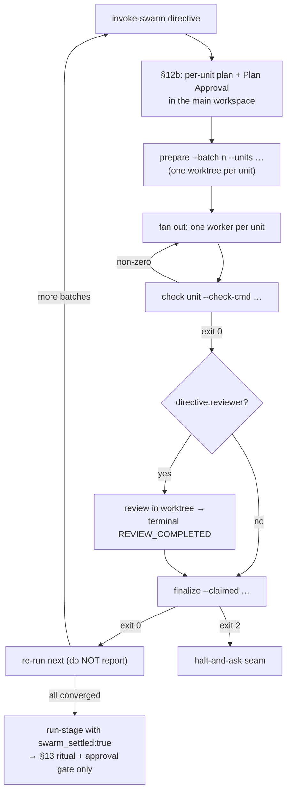
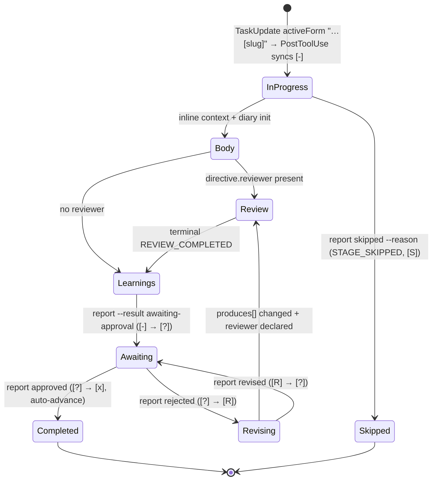

# ステージ定義スキーマとステージプロトコル

> **Source**: [awslabs/aidlc-workflows](https://github.com/awslabs/aidlc-workflows/tree/3c3146cfd7cef33020d48e8d48d4e80d0f8c2820) — branch `v2`, commit `3c3146cf` (v2.6.40, retrieved 2026-08-21)
> **Status**: 実装から導出したas-built仕様書である。upstreamのコードが本文書に優先する。
> **正本**: 英語版 `04-stage-protocol.md`(この日本語版は参照訳。両者が食い違う場合は英語版が優先)

---

## 1. 本文書の範囲

本仕様書は結合した2つの成果物を扱う。

1. **ステージファイル** — `core/aidlc-common/stages/<phase>/<slug>.md` 配下の `.md` 単位であり、YAMLフロントマターでステージのidentity・トポロジー・入出力・レビューポリシーを宣言し、決まった構成のボディコンパートメントで実行手順を記述する。
2. **ステージプロトコル群** — 基底プロトコル(`core/aidlc-common/protocols/stage-protocol.md`)1本に加え、conductorがオンデマンドでロードする6つの条件付きモジュール。両者が合わさって、あるステージが実行されたときに実際に何が起きるか — ゲート、質問、成果物生成、レビュー、diary、learnings儀式 — を定義する。

他所が所有する隣接主題: directiveのエンベロープと `next`/`report` ループ(`02-orchestration-engine.md` 参照)、state ファイルと監査イベント(`03-state-audit-runtime.md`)、エージェントペルソナとロースター(`05-agents.md`)、センサーマニフェストと発火(`06-sensors.md`)、PreToolUse/PostToolUse の強制フック(`07-hooks.md`)、memory ファイルのリゾルバと learnings admission ゲート(`08-memory-rules-learnings.md`)、`aidlc-swarm.ts` / `aidlc-log.ts` / `aidlc-learnings.ts` の CLI 面(`09-cli-tools.md`)、ハーネス投影(`10-distribution-harnesses.md`)、プラグイン提供ステージと `when:`(`11-plugin-system.md`)、これらの契約を固定するテストコーパス(`12-testing-ci.md`)。

ステージファイル自体を規定する規範文書は2つあり、両者は箇所によって食い違う。食い違う場合、本仕様書はコードに従う。

| 成果物 | 役割 |
| --- | --- |
| `core/aidlc-common/protocols/stage-definition.md` | ファイル形状のプロース契約(231行) |
| `core/tools/aidlc-stage-schema.ts` | 機械検査可能なバリデータ(676行) |
| `core/tools/aidlc-lib.ts` `parseStageFrontmatter` | 自前実装のYAMLサブセットパーサ(`core/tools/aidlc-lib.ts:9105`) |

`stage-definition.md:4-6` はこの関係を次のように述べる。「The schema (`stage-schema.ts`), the YAML parser (`parseStageFrontmatter` in `lib.ts`), and the YAML stage files all implement against this document.」(スキーマ・YAMLパーサ・YAMLステージファイルはすべて本文書に対して実装される。)以下の第12節に、文書がスキーマに遅れをとっている箇所を列挙する。

---

## 2. ステージファイルの構造

### 2.1 ファイルレイアウト

`stage-definition.md:19-37` は正準のレイアウトを宣言する — YAMLフロントマターブロック、H1タイトル、必須のコンプライアンス行、その後この順で3つのボディコンパートメント `## Steps`、`## Sensors`、`## Learn`。

パーサは意図的に狭く作られている。`parseStageFrontmatter`(`core/tools/aidlc-lib.ts:9113`)は `/^---\r?\n([\s\S]*?)\r?\n---/` にマッチさせ、マッチしない場合は `"Stage file missing YAML frontmatter (---...---)"` を投げる。その後 `/^([a-z_][a-z0-9_]*)\s*:/`(`aidlc-lib.ts:9129`)でトップレベルキーを発見し、キー名でルーティングする。

- **配列キー**は無条件にブロックリストとしてパースされる: `support_agents`、`produces`、`requires_stage`、`sensors`、`scopes`(`aidlc-lib.ts:9133-9139`)。これらはパース済みオブジェクトに常に(`[]` としてでも)存在する — スキーマが必須フィールドの不在を拒否するためである。
- **`consumes`** は `objectListField` によって `{artifact, required, conditional_on?}` エントリへパースされる(`aidlc-lib.ts:9175`)。
- **存在ゲートされた任意配列**: `optional_produces`、`required_sections`(`aidlc-lib.ts:9182`、`:9200`) — キーが不在ならプロパティも不在になり、注釈のないステージはバイト同一にコンパイルされる。
- **`produces_kinds`** は `mapOfListsField` によってパースされる(`aidlc-lib.ts:9191`)。
- **`when`** はネストした単一キーのマップとしてパースされ、インライン `{k: v}` のフォールバックを持つ(`aidlc-lib.ts:9235-9246`)。
- **それ以外すべて** はスカラー文字列としてパースされ、その後2つの狙い撃ちの型強制が入る: `reviewer_max_iterations` を整数リテラルから数値へ(`aidlc-lib.ts:9212-9217`)、`workspace_requires` を `"true"`/`"false"` トークンからブール値へ(`aidlc-lib.ts:9224-9229`)。不正な値は意図的に文字列のまま残され、パーサが `NaN` へ型強制するのではなく、バリデータが大きな声で拒否する。

未知のキーはドロップされずに通過させられる — バリデータが具体的なメッセージ付きで拒否できるようにするためである(`aidlc-lib.ts:9121-9126`)。

### 2.2 フロントマターフィールド

必須フィールド(`REQUIRED_FIELDS`、`core/tools/aidlc-stage-schema.ts:161-174`) — 12個。

| フィールド | 型 | 制約・意味論 |
| --- | --- | --- |
| `slug` | string | `^[a-z][a-z0-9-]*$`(`aidlc-stage-schema.ts:184`)。ファイル名幹と一致していなければならない — 等価性は `compileStageGraph` がチェックし、バリデータは形状のみをチェックする |
| `phase` | string | `initialization` \| `ideation` \| `inception` \| `construction` \| `operation` のいずれか(`VALID_PHASES`、`:117-123`) |
| `execution` | string | `ALWAYS` \| `CONDITIONAL`(`VALID_EXECUTIONS`、`:125`) |
| `condition` | string | 自由記述。`ALWAYS` では常時有効である根拠、`CONDITIONAL` では分岐条件。`CONDITIONAL` が false になった場合の実行時の実現形は `report --result skipped --reason "<reason>"` |
| `lead_agent` | string | エージェントスラッグ。ロースターが供給されているときは `loadAgents()` に対して検証され、`RESERVED_AGENT_SLUG = "orchestrator"` は除外される(`:142`、`:546-554`) |
| `support_agents` | string[] | 空でもよい。各エントリは同じ除外規則でロースター検査される |
| `mode` | string | コミュニケーショントポロジー: `inline` \| `subagent` \| `pipeline` \| `mob` \| `agent-team`(`VALID_MODES`、`:127`)。§2.3参照 |
| `produces` | string[] | 空でもよい。小文字ケバブケースの成果物名 |
| `consumes` | object[] | 空でもよい。エントリは `{artifact, required, conditional_on?}` |
| `requires_stage` | string[] | 空でもよい。データ依存エッジであると同時に提示順序エッジでもあり、計算される `display_order` への主要な入力(`stage-definition.md:67`) |
| `inputs` | string | 人間可読なプロース |
| `outputs` | string | 人間可読なプロース、**実行時には非拘束** — §2.5参照 |

任意フィールド(`OPTIONAL_FIELDS`、`aidlc-stage-schema.ts:176`) — 15個。

| フィールド | 型 | 制約・意味論 |
| --- | --- | --- |
| `number` | string | `^\d+\.\d+$`(`NUMBER_RE`、`:190`)。あくまで著者が付けた順序のヒントであり、エンジンはコンパイル済みの値を割り当てる。インデックスセグメントのみが、プラグインの独立した新規ステージ間のタイブレークとして読まれる |
| `name` | string | 著者が付けた表示名。なければ計算される(§2.4) |
| `plugin` | string | 所有権のidentity。不在はコアであることを意味する。開いた集合なので文字列のみで、列挙型ではない(`:23-26`) |
| `for_each` | string | 成果物スラッグ。ステージがそのインスタンスごとに1回実行される。現時点では `unit-of-work` のみが使われる |
| `workspace_requires` | boolean | 既定 `false`。`aidlc/` ツリーの外にソースコードを書き込む必要があるステージに付ける |
| `optional_produces` | string[] | ステージがユニットごとに書いてもよい成果物。per-unit のカバレッジ検査からは除外されるが、directive のパスへの解決は行われる(`:50-55`) |
| `produces_kinds` | map | 成果物名 → 適用可能なユニット種別。列挙され**ていない**成果物は全種別に適用され、列挙**された**成果物はその種別を持たないユニットからは取り除かれる — 「It prunes BOTH the directive produces paths and the coverage set - exempt from nothing」(directiveのproducesパスとカバレッジ集合の両方を刈り取る — 何も免除しない)(`:56-61`) |
| `sensors` | string[] | 空でないid。マニフェストレジストリとの突き合わせはパース時ではなくコンパイル時に行われる(`:505-507`) |
| `scopes` | string[] | ステージごとのスコープ所属。あるスコープ名を持つことでそのスコープでは EXECUTE と印がつき、不在は SKIP を意味する。不在と `[]` は同一 |
| `reviewer` | string | エージェントスラッグ。`lead_agent` と同様にロースターで突き合わせ検査される(`:568-578`) |
| `reviewer_max_iterations` | integer | `>= 1`。`reviewer` を必要とする。既定は `2` |
| `review_class` | string | `adversarial` \| `advisory`。`reviewer` を必要とする。既定は `adversarial`。「"none" is deliberately NOT a stage value」(「none」は意図的にステージの値として使えない)(`:351-354`) |
| `summary_confirmation` | string | `required` \| `if-present` |
| `when` | object | `WHEN_PREDICATE_KEYS = ["producer-in-plan"]`(`:159`)からちょうど1個のキー、値は空でない成果物スラッグ |
| `required_sections` | string[] | 出力が持つべき、空でない `##` H2 見出し名。ここでは形状のみを扱い、内容は `required-sections` センサーが強制する |

ネストした `consumes[]` エントリのサブフィールドは `OPTIONAL_FIELDS` のメンバー**ではない** — 1段下でルール8(`:458` 以降)によって検証され、各エントリは `{artifact, required, conditional_on?}` というオブジェクトであることが要求される。任意の `conditional_on` は `brownfield` \| `greenfield` を取る(`VALID_CONDITIONAL_ON`、`:135`)。`always` という値は存在しない。

`consumes[].required` は有効なプラン(実行計画)にスコープされたものであり、グローバルな主張ではない — `true` は「もし生成側ステージが実行されるなら、この consume は満たされなければならない」ことを意味する(`stage-definition.md:65`)。あるスコープが生成元ステージをスキップする場合、その consume は無意味になり、ステージ本文はグレースフルに縮退する。

### 2.3 `mode` — コミュニケーショントポロジーであってレビューループではない

`mode` は *ボディの実行中に誰が誰と話すか* を指定する(`aidlc-stage-schema.ts:33-42`)。4つの値が有効で1つは予約済みである。

- `inline` — conductor がすべての声を担う。ディスパッチはゼロ、貢献ファイル(contribution file)もない。
- `subagent` — ハブアンドスポーク: lead が起草し、`support_agents[]` の各エントリが相互に見えないスポークとなり、lead が統合する。
- `pipeline` — 連鎖。各リンクは上流のすべての作業を見ることができ、成果物を直接進める。空でない `support_agents` を要求する。
- `mob` — 相互に発言しあうメッシュルームで、記録された異論を伴う。空でない `support_agents` を要求する。
- `agent-team` — **予約済み**。`stage-definition.md:211-214`: 「orchestrator code reading the `mode` field must handle `agent-team` explicitly. At minimum, throw "mode agent-team not yet implemented". Do not fall through to a default execution path.」(`mode` フィールドを読むオーケストレーターのコードは `agent-team` を明示的に扱わなければならない。最低限、"mode agent-team not yet implemented" を投げること。既定の実行経路へフォールスルーしないこと。)

アンサンブル結合はスキーマで強制されるのであって、conductor で強制されるのではない — `ENSEMBLE_MODES = ["pipeline", "mob"]`(`aidlc-stage-schema.ts:133`)、違反すると `mode "<mode>" requires a non-empty support_agents` が返る(`:285`)。`agent-team` は明示的に結合の対象**外**である — コンシューマが出荷されるまで、いかなるステージもこれを宣言できない。

レビューループは直交している: `stage-definition.md:55` — 「The review loop is NOT a mode: `reviewer` + `reviewer_max_iterations` deliver the two-party critique topology on every mode」(レビューループはモードでは*ない* — `reviewer` + `reviewer_max_iterations` が、どのモードでも二者間の批評トポロジーを提供する)。

### 2.4 計算フィールド

2つのフィールドは著者によって書かれることなく `stage-graph.json` に着地する(`stage-definition.md:79-83`)。

- `display_order` — `<phase-prefix>.<sequence>` の形式。フェーズプレフィックスは `initialization=0`、`ideation=1`、`inception=2`、`construction=3`、`operation=4`。シーケンスはフェーズでフィルタした `requires_stage` のトポロジカルソートから決まり、スラッグのアルファベット順でタイブレークする。
- `name` — スラッグのタイトルケース、またはステージファイルのH1見出し。

### 2.5 成果物パスはエンジンが解決する

どのステージファイルもワークスペースのルートをハードコードしない。ステージは `produces[]` に相対的な成果物**名**を出力し、エンジンはdirective発行時に、`aidlc-orchestrate.ts` 内の `resolveArtifactPath` / `memoryPathFor` を通じてアクティブなintentのrecordディレクトリ `aidlc/spaces/<space>/intents/<YYMMDD>-<label>/<phase>/<stage>/<name>.md` に対してそれを解決する(`stage-definition.md:135-143`。`memoryPathFor` は `core/tools/aidlc-orchestrate.ts:1086`)。文書はステージファイル内のルート付きパスリテラルが「a doc bug, not a behavior contract」(文書のバグであって、振る舞い契約ではない)であると明言している(`stage-definition.md:142-143`)。

同じ発行時パスは、消費される入力を存在有無で振り分ける(`stage-definition.md:145-154`) — directiveの `consumes` には、ディスク上に存在する解決済みパスのみが列挙される。REQUIRED と宣言された入力のファイルが不在の場合、それは `consumes_absent` へ移され、生成側ステージがアクティブなスコープの経路から外れている場合は `expected: true`、生成側がその経路上にあるにもかかわらずファイルがまだ不在の場合は `expected: false` と注釈される。`required: false` の consume が不在の場合、それは単純にドロップされる — 「an optional input that does not exist is not an input, never a gap」(存在しない任意入力は、そもそも入力ではなく、決してギャップではない)。

### 2.6 検証ルールと予約名前空間

`validateStageFrontmatter`(`aidlc-stage-schema.ts:200`)は9つの番号付きルールを走らせる: (1) プレーンオブジェクトの形状、(2) 予約キー、(3) 未知キー、(4) 必須フィールドの存在、(5–7) フィールドごとの型/列挙/正規表現、(8) ネストした `consumes[]`、(9) 動的なエージェントロースター照会。エラーは蓄積される。バリデータは純粋である — 「no I/O, no YAML parsing, no mutation」(I/Oなし、YAMLパースなし、mutationなし)(`:5-7`)。

予約キーとそのメッセージ(`RESERVED_KEYS`、`:148-153`)は `<key> is reserved (<reason>); not active yet` を生成する。

| キー | 理由文字列 |
| --- | --- |
| `on_failure` | `loop driver` |
| `blocks_on` | `construction worktrees` |
| `timeout` | `sensor binding` |
| `retry` | `loop driver` |

1つのキーは汎用の未知キーエラーではなく狙い撃ちのメッセージを受け取る: `bundle: was renamed; write plugin: for ownership`(`:230`)。それ以外の未知キーはすべて `unknown key: <key>` を生成する。

2つの結合はスキーマの段階で拒否される — ミスをconductorの実行時ではなくコンパイル時に失敗させるためである: `reviewer_max_iterations requires a reviewer`(`:346`)と `review_class requires a reviewer`(`:360`)。

**Swarmトリガーの結合。** 自律的なConstruction swarmはフィールドの一致で発火する — `SWARM_FOR_EACH = "unit-of-work"` かつ `SWARM_MODE = "subagent"`(`core/tools/aidlc-orchestrate.ts:3366-3367`)であり、`:3406` の `if (node.for_each !== SWARM_FOR_EACH || node.mode !== SWARM_MODE) return false;` でゲートされる。per-unitのビルドステージのmodeを付け替えると、静かにswarm経路から外れてしまう。そのため `aidlc-graph compile` は、`for_each: unit-of-work` + `workspace_requires: true` を持つがmodeが `subagent` ではないconstructionステージについて、stderrにadvisory(勧告)を出す(`core/tools/aidlc-graph.ts:1915-1928`)。文言は `swarm will NOT fire for it; units build serially.`(このステージではswarmは発火しない。ユニットは直列にビルドされる。)で終わる。このadvisoryはコンパイルを決して失敗させないため、`compile --check` のパリティは損なわれない。

### 2.7 ボディコンパートメント

`stage-definition.md:164-172` は `## Steps` を「Required, populated」(必須、記入済み)と提示し、`## Sensors` と `## Learn` の両方を「Reserved, absent」(予約済み、不在)と提示しているが、パーサは不在を許容する。**出荷済みツリーでは、これら3つのコンパートメントはすべて33のステージファイルすべてで記入されている**(測定値 M3–M5)。`intent-capture.md:172` は各インポート済みセンサーが何を検査するかを説明する実質的な `## Sensors` セクションを開いており、`:187` は4つのdiary見出しを再掲する実質的な `## Learn` セクションを開いている。文書の「予約済み/不在」という行は古くなっている。パーサのルール(不在を許容する)は依然として正確であり、これらのコンパートメントを機械的に読むものは何もない — 機械可読な結び付けはフロントマターの `sensors:` リストである。

### 2.8 出荷済みインベントリ

`core/aidlc-common/stages/*/*.md`(33ファイル、M1)にわたって測定。

| フロントマター機能 | 件数 | 備考 |
| --- | --- | --- |
| `mode: inline` | 29 | M6 |
| `mode: subagent` | 2 | practices-discovery、code-generation |
| `mode: pipeline` | 1 | reverse-engineering |
| `mode: mob` | 1 | user-stories |
| `mode: agent-team` | 0 | 予約済み。宣言しているステージはない |
| `reviewer:` 宣言あり | 13 | M7 — 8件が `aidlc-architecture-reviewer-agent`、5件が `aidlc-product-lead-agent` を指定(M8) |
| `review_class: advisory` | 8 | M9。残りの5つのreviewerステージはフィールドを省略しており `adversarial` に既定される — その5件はすべてConstructionフェーズ(code-generation、functional-design、nfr-requirements、nfr-design、infrastructure-design) |
| `for_each: unit-of-work` | 5 | M10 — 4つのインラインper-unit設計ステージにcode-generationを加えたもの |
| `workspace_requires: true` | 1 | code-generationのみ(M11) |
| `summary_confirmation: required` | 27 | M12。`if-present` を使うステージはない |
| `optional_produces:` | 1 | functional-design(M13) |
| `produces_kinds:` | 4 | 4つのper-unit設計ステージ(M14) |

`UNIT_KINDS = ["service", "spec", "ui", "packaging", "library"]`(`core/tools/aidlc-lib.ts:10210`)は、`produces_kinds` の値が従うべき閉じた語彙である。

---

## 3. プロトコルファミリー

基底プロトコルはすべてのステージで必須である。6つのモジュールは条件付きで、トリガーによってロードされる。そのうち4つはエンジンによって `directive.protocol_modules` で告知され、残り2つはプロース条件のみでトリガーされる。

| ファイル | 行数 | ロードトリガー(ファイル自身のヘッダーからの逐語引用) | エンジンによる告知? |
| --- | --- | --- | --- |
| `stage-protocol.md` | 1099 | "MANDATORY: All stages follow this protocol."(`:3`) | 常時 |
| `stage-protocol-reviewer.md` | 186 | "Load this module when a directive names a reviewer with an effective review class other than `none`."(`:3`) | `reviewer` |
| `stage-protocol-ensemble.md` | 173 | "Load this module when `directive.mode` is `subagent`, `pipeline`, or `mob`, or when the stage declares support agents"(`:3`) | `ensemble` |
| `stage-protocol-construction.md` | 369 | "Load this module on the first Construction-phase directive of the session and on every `invoke-swarm`"(`:3`) | `construction` |
| `stage-protocol-swarm.md` | 66 | "Load this module for every `invoke-swarm` directive and every `run-stage` with `directive.swarm_settled === true`"(`:3-4`) | `swarm` |
| `stage-protocol-governance.md` | 32 | "Load this file at phase transitions (end of Ideation, Inception, Construction)."(`:3`) | なし |
| `stage-protocol-recovery.md` | 274 | "Load this file on session resume or when a change event is detected mid-stage."(`:3`) | なし |

行数の出典: M2。

告知される集合は閉じている: `VALID_PROTOCOL_MODULES = ["reviewer", "ensemble", "construction", "swarm"]`(`core/tools/aidlc-directive.ts:62-67`)、`<kind>: protocol_modules[<i>] must be one of reviewer | ensemble | construction | swarm` によって強制される(`:948`)。ガバナンスとリカバリは意図的にこの集合の外にある — それらのトリガーは単一のdirectiveのプロパティではなく、ワークフローイベント(フェーズ境界、セッションの再開)である。

`run-stage` directiveに対する選択(`core/tools/aidlc-orchestrate.ts:2114-2131`):

```text
reviewer   ← directive.reviewer && directive.review_class both set
ensemble   ← node.mode ∈ {subagent, pipeline, mob} OR support_agents.length > 0
construction ← node.phase === "construction"
```

`invoke-swarm` directiveは代わりにリストをハードコードする(`aidlc-orchestrate.ts:3567-3571`): `[...(node.reviewer ? ["reviewer"] : []), "construction", "swarm"]`。

`protocol_modules` は非空のときのみ付与される(`:2129-2131`)。これは `run-stage` / `invoke-swarm` のフィールドであり、`dispatch-subagent` はこれを明示的に除外する(`aidlc-directive.ts:485-491`) — 委任されたワーカーはconductorではないためである。

7つのプロトコルファイルのうち4つは、ハーネスごとのサブセクションを持つ — Claude Code、Kiro CLI、Kiro IDE、Codex CLI、Cursor、opencode、GitHub Copilotそれぞれに1つずつ(M18)。

| ファイル | 結び付けの見出し | サブセクション |
| --- | --- | --- |
| `stage-protocol-swarm.md` | (モジュール前文、`:1-5`) | `:14-62` |
| `stage-protocol-ensemble.md` | `## Harness topology bindings`(`:119`) | `:121-169` |
| `stage-protocol-construction.md` | `## Harness construction bindings`(`:315`) | `:317-365` |
| `stage-protocol-reviewer.md` | `## Harness reviewer bindings`(`:144`) | `:148-186` |

`stage-protocol-governance.md` と `stage-protocol-recovery.md` はいずれも持たず、基底の `stage-protocol.md` も同様である — この3つのいずれにも `### <harness>` の結び付けサブセクションは存在しない(M18)。

「使うハーネスを選べ」という指示は、意図としては一様だが逐語では一様ではない — ensemble(`:3`)とconstruction(`:3`)はどちらも「use only the harness subsection that matches the active harness」と読め、reviewer(`:146`)は「Use only the subsection that matches the active harness.」と読め、swarm(`:3-5`)は「use only the subsection for the active harness」と読める。可搬な契約はサブセクションの上位に存在する。reviewer・ensemble・construction の各モジュールでは、サブセクションは主にディスパッチ動詞(`Task` / `subagent` / `task` / spawn / delegate)が異なるだけである。swarmのサブセクションは動詞以上に違いがある — Claude Codeのもの(`:16`)だけがインラインの `AIDLC_USE_SWARM=1` Dynamic Workflow分岐を持つ。他の6つはすべてこのフラグが不活性であると述べており、うち5つは「`AIDLC_USE_SWARM=1` has no effect here (no Workflow tool exists)」と読み、Codex CLI(`:40`)は「…has no effect on this harness (no Workflow tool exists)」と読む — §7参照。`10-distribution-harnesses.md` も参照。

---

## 4. 基底プロトコルの詳解

`stage-protocol.md` はそのセクションに1〜13の番号を振っているが、**7と11はファイル内に存在しない** — その番号はモジュールへ抽出され(§7 Change Handlingはrecoveryへ、§11 Subagent Return Summaryはensembleへ)、基底ファイルにはポインターだけが残っている。番号はクロスリファレンスを有効に保つため保持されている。

### 4.0 前文(番号なし)

§1の前に3つの番号なしセクションがある。

**ユーザーへの語りかけ方(語り口の契約)**(`:5-61`) — 「MANDATORY on every stage, every gate, every message the user reads. This governs the WORDS you say, never the mechanics you run.」(すべてのステージ、すべてのゲート、ユーザーが読むすべてのメッセージで必須。これは発する言葉を規律するのであって、実行する機構を規律するのではない。)チャットのナレーションに決して現れてはならない予約された内部語彙を宣言している: 「engine, directive, dispatch, conductor, harness, verb, scope grid, steering, forwarding loop, mint, birth, swarm, entropy, and the ARS component names (IAE, CSU, VE, R, UA)」(`:17-21`)、そして置換表を提供する。2つの例外がある — ツールが印字せよと指示した文字列は逐語のまま印字すること、そしてすべての監査イベント名、stateマーカー、ツールフラグ、ファイルパス、ステージスラッグは正確な綴りを保持すること(`:57-61`)。

**構造化された質問(ハーネス中立の契約)**(`:63-91`) — フェンス付きの ` ```question ` ブロックは**仕様(spec)**であり、ハーネスの `question-rendering.md` 注釈を通じてレンダリングされる、決して逐語で印字してはならない — 「Echoing the raw spec into the transcript is a protocol violation」(生の仕様をそのままトランスクリプトへ反復するのはプロトコル違反である)(`:76-77`)。プロースでレンダリングするハーネスでは、各質問は `1` から始まる新しい応答キースコープを開き、プロース形式の質問の直前にある文脈リストは番号なし箇条書きを使わなければならない(`:86-91`)。

**Critical Compliance Checklist(重要遵守チェックリスト)**(`:93-100`) — 6項目。中でも拘束力のあるものは: すべてのライフサイクル遷移は `aidlc-orchestrate.ts report` を経由すること、決して `aidlc-state.ts` のライフサイクル動詞を使わないこと、決して手書きの `aidlc-audit.ts append` を使わないこと; ゲート以外の質問は `aidlc-log.ts decision` / `answer` で挟むこと; User Inputは決して要約されないこと; **「Stage ritual is ATOMIC — once a stage starts, EVERY step in its protocol fires: questions → artifact → reviewer (if declared) → learnings → gate」**(ステージ儀式は原子的である — ステージが始まったら、そのプロトコルのすべてのステップが発火する: 質問 → 成果物 → レビュアー(宣言されていれば) → learnings → ゲート)(`:99`); そして **「Autonomy is NEVER inferred」**(自律性は決して推測されない) — 一度きりの「recommendedで進めて」はそのステージにのみ結び付く(`:100`)。

### 4.1 §1 承認ゲート(`:104-179`)

3つのInitializationステージ(workspace-scaffold、workspace-detection、state-init)を除くすべてのステージが明示的なユーザー承認を要求する(`:106`)。

- **HARD STOP RULE(ハードストップルール)**(`:108-110`): 承認ゲートを提示したら「MUST end your turn immediately… Do NOT call any tool until the user has typed their choice in a new message.」(即座にターンを終了しなければならない…ユーザーが新しいメッセージで選択を入力するまで、いかなるツールも呼び出してはならない。)
- **NO EMERGENT BEHAVIOR RULE(創発的振る舞い禁止ルール)**(`:112-113`): ConstructionとOperationのゲートは厳格に2択(Approve / Request Changes)である。IdeationとInceptionのみが、以前スキップしたステージを再追加する第3の選択肢を追加できる。2つの是認された例外が存在する — revisionのエスケープハッチと、Build-and-Test失敗のループバック。
- **次のステージの命名**(`:129-133`): `[next stage]` は `directive.next_stage` から逐語でレンダリングする。nullのときは `Complete workflow` をレンダリングする。「NEVER infer or guess the next stage name.」(次のステージ名を決して推測してはならない。)
- **Revisionループのエスケープハッチ**(`:153-171`): 同じステージで「Request Changes」を3回繰り返した後、そのステージの以後すべてのゲートに「Accept as-is」の選択肢が追加される。それを選ぶと監査シャードに記録され、ステージは完了とマークされ先へ進む。2回目のサイクルの後、ゲートはこの選択肢が来ることを警告しなければならない。

### 4.2 §2 完了メッセージ(`:181-244`)

Part 0〜4の5部構成。

**Part 0 — ゲートに入る**(`:185-193`)は順序の契約であり、最も間違えやすい部分である。

1. Part 1–2をレンダリングし、その後§13 learnings儀式を**それ自身の人間ターンとして**実行する — その質問でターンを終える。その `QUESTION_ANSWERED` 行はゲートの `STAGE_AWAITING_APPROVAL` に先行しなければならない — 「the gate is never opened in the same message as the learnings question」(ゲートはlearningsの質問と同じメッセージの中で開かれることは決してない)(`:187`)。
2. `report --stage <slug> --result awaiting-approval` は `[-]` → `[?]` とマークし、`STAGE_AWAITING_APPROVAL` を発する。これはサイレントな簿記処理である: 「**SAY:** nothing for it」(これについては何も言わない)(`:188`)。
3. 承認質問を提示する。これはライフサイクルゲートであり、インタビュー質問ではない — 「do not call `aidlc-log.ts decision` or `aidlc-log.ts answer` for it」(これに対しては `aidlc-log.ts decision` も `aidlc-log.ts answer` も呼び出さない)(`:189`)。
4. 応答をルーティングする: `approved --user-input "<exact choice>"` は `GATE_APPROVED` + `STAGE_COMPLETED` を発し自動的に前進する; `rejected --user-input "<feedback>"` は `GATE_REJECTED` + `STAGE_REVISING` を発し、`[?]` → `[R]` とマークし、Revision Countを増やす; revision作業の後、`revised` は新しい `STAGE_AWAITING_APPROVAL` を発し `[R]` → `[?]` に戻る。重要な点として: 「When the revision changed a `produces[]` artifact and the directive carries a reviewer, re-run the `stage-protocol-reviewer.md` §12a reviewer step before reporting revised… (The §13 learnings ritual runs once per stage and is not re-run.)」(revisionが `produces[]` 成果物を変更し、directiveがreviewerを持つ場合、revisedを報告する前に `stage-protocol-reviewer.md` §12aのレビュアーステップを再実行すること…(§13 learnings儀式はステージにつき一度だけ実行され、再実行されることはない。))(`:192`)。

Part 1–3はアナウンス、5〜10行の成果物テーブルを伴う事実の要約、そして `**Review:** <record>/…` 行と質問である。Part 4は承認後の進捗行で、アクティブなスコープがコンパイル済みステージのすべてを実行するかどうかによって決まる2つの正確な書式のうちの1つで書かれ(`:225-239`)、総数は `aidlc-utility.ts scope-table` から読まれる — 「never carry a hand-maintained per-scope count table in this protocol」(このプロトコルの中に手書きのスコープ別カウント表を持たない)。

### 4.3 §3 質問フォーマット(`:248-464`)

質問ファイルは常に唯一の正本(source of truth)である。ステップ1は空白の `[Answer]:` タグを持つ `<slug>-questions.md` を作成する。すべての通常の質問は `X. Other (please specify)` で終わる — Consolidated Summary Confirmationのみが唯一の記号なしの例外である(`:259-261`)。

ステップ2は3つの対話モードを提供する: **Guide me**(対話式)、**I'll edit the file**(自己主導式)、**Chat**(自由記述式)。ユーザーはステージの途中でモードを切り替えてもよい(`:385`)。

3つのモードすべてが、成果物生成の前に同一の**Consolidated Summary Confirmation**(統合サマリ確認)に収束する(`:316-365`)。その機構は決定論的で受領証(receipt)に裏付けられている。

- 提示する前に: `aidlc-log.ts decision --stage <slug> --checkpoint summary-confirmation --questions-file "<path>" --decision "Does this all look correct before I generate the artifact?" --options "Looks correct,Request changes"`、加えてper-unitステージには `--unit`、単独実行(isolated run)には `--single`。
- ファイルのエントリは厳密に `[Answer]: Looks correct` または `[Answer]: Request changes` を格納する — 「`[Answer]: A. Looks correct` and `[Answer]: 1. Looks correct` are invalid」(`[Answer]: A. Looks correct` と `[Answer]: 1. Looks correct` は無効である)(`:340`)。
- 人間が回答した後: 対応する `aidlc-log.ts answer` の受領証。「The tool refuses a self-selected answer, a response without a matching prompt record and later human turn, or a questions file whose stored choice differs」(このツールは、自己選択された回答、対応するプロンプト記録および後続の人間ターンを欠く応答、あるいは保存された選択が異なる質問ファイルを拒否する)(`:354-356`)。
- **Request changes**が選ばれた場合、`## Requested Changes Feedback` 質問を追加し、「What should change?」と尋ね、何かをrevisionする前にターンを終了する。

フロントマターの対応物は `summary_confirmation` であり、完了時に `verifySummaryConfirmationPrecondition`(`core/tools/aidlc-state.ts:1732-1751`)によって強制される。

深度に応じた生成(`:265-290`)は、state ファイルの `**Depth**` フィールドから質問の量を決める: Minimal は約2〜4件、Standardは約5〜8件、Comprehensiveは約8〜12件以上、ステージごと。ライフサイクルが進むにつれ減少する — Constructionの質問は「**exceptional, not routine**」(例外的であり、日常的ではない)(`:274`)。

回答収集の後に2つの必須の分析が続く: 曖昧さ・矛盾・詳細の欠落についての**回答分析**(`:407-414`)、そして全回答セットにわたる**矛盾検出**(スコープ、リスク、技術、タイムラインの不一致) — 「Do NOT proceed until contradictions are resolved」(矛盾が解決されるまで先へ進んではならない)(`:434-445`)。

`:416-426` にある微妙だが重要なルール: フォローアップやChatモードの質問を含む、保留中のすべての質問は、**ターンが終わる前に**空白の `[Answer]:` タグ付きで質問ファイルに書き込まれなければならない — なぜなら、forwarding-loopのStopフックがそのファイルを読んで、本物の人間待ちと放棄されたステージとを区別するからである。これは自律的なConstructionには適用されない。

**グラウンディングされた成果物を消費する**(`:391-405`): ソースタグは出所(provenance)を記録するが、主張を強化するライセンスにはならない; `[assumption]` の内容は、そのステージの質問ファイルを通じて確認されるまで下流でも仮定のままである; 仮定、未解決の質問、未選択の選択肢、ワークフローのメタデータを、確認済みの要件へ静かに昇格させることは決してしない。

### 4.4 §4 State追跡(`:467-672`)

`aidlc-orchestrate.ts report` を通じて結果を報告することが唯一のライフサイクル経路であり、エンジンが原子的な遷移を選択・実行する(`:470`)。

タスク遷移はすべてのステージの前に必須である: 前のステージのタスクを `completed` とマークし、その後 `TaskUpdate({..., status: "in_progress", activeForm: "Running [Stage Name] [slug]"})` を呼ぶ。「The `[slug]` suffix in `activeForm` is required. A PostToolUse hook parses it to automatically sync the state file」(`activeForm` の `[slug]` サフィックスは必須である。PostToolUseフックがこれをパースしてstateファイルを自動的に同期する)(`:483`)。

ステージ進捗の記法(`:509-522`): `[ ]` 未開始、`[-]` 進行中、`[x]` 完了、`[S]` スキップ。`[S]` は `aidlc-jump.ts execute` によってjumpターゲットより前のスコープ内ステージに対して設定されるか、あるいはアクティブなステージ自身の適用可能性検査がそれを正当化した場合に `report --result skipped` によって設定される。スキップされたステージは進捗カウントから除外され、「are never rewritten as completed」(決して完了として書き換えられることはない)。

条件付きスキップ(`:558-570`)は明示的なステージのpinと空白でない理由を要求する。エンジンは「preserves `[S]`, emits one `STAGE_SKIPPED`, and starts the next in-scope stage (or completes the workflow) without emitting `STAGE_COMPLETED`. A single-stage run cannot use this routing outcome.」(`[S]` を保持し、1件の `STAGE_SKIPPED` を発し、`STAGE_COMPLETED` を発することなく次のスコープ内ステージを開始する(またはワークフローを完了する)。単一ステージ実行はこの経路の結果を使うことができない。)

イベントの発行はツールが所有する(`:572`)。`aidlc-audit.ts append` は狭い診断用のエスケープハッチであり、権限を伴う受領証を**拒否する** — 逐語で列挙されているのは: `HUMAN_TURN`、`GATE_APPROVED`、`GATE_REJECTED`、`QUESTION_ANSWERED`、`REVIEW_REQUESTED`、`REVIEW_COMPLETED`、`PIPELINE_LINK_COMPLETED`、`ARTIFACT_REUSED`、`SWARM_STARTED`、`SWARM_UNIT_CONVERGED`、`AUTONOMY_MODE_SET`、`UNIT_STARTED`、`UNIT_PAUSED`、`UNIT_RESUMED`、`UNIT_COMPLETED`。

本節はさらに5種類の特化した監査ログテンプレート(Error、Recovery、Change Request、Question interaction、および標準の会話イベントブロック)と監査規則を固定する: `<record>/audit/<host>-<clone>.md` への追記専用(append-only)であること、User Inputを改変せず完全なまま保つこと、そして `ERROR_LOGGED` / `RECOVERY_COMPLETED` を決して手書きしないこと(`:664-672`)。

### 4.5 §5 エージェントペルソナのロード(`:676-727`)

6段階のknowledgeロード順序(アクティブスペースの `memory/{org,team,project}.md` → 共有ハーネスknowledge → エージェントknowledge → チーム共有knowledge → チームエージェントknowledge → 先行ステージの成果物)。

inlineステージについては、このルールはヒントではなく厳格な前提条件である(`:688-708`): `load-steering.rules_content` の各エントリを順に適用し、その後、他の何よりも先に `inline_context_paths` にあるすべてのパスを読む。「The first tool calls after `run-stage` must read these paths only… Do not read the stage file or consumes, initialize the diary, run the body, dispatch mob supports, or write artifacts until every required inline-context read has completed.」(`run-stage` の後の最初のツール呼び出しはこれらのパスのみを読まなければならない…必須のinline-context読み込みがすべて完了するまで、ステージファイルやconsumesを読んだり、diaryを初期化したり、ボディを実行したり、mobのサポートをディスパッチしたり、成果物を書いたりしてはならない。)

subagentステージについては(`:710-719`)、委任の境界が明示されている: 「Every delegated lead, support, and reviewer is artifact-scoped, never a workflow conductor. It MUST NOT call `aidlc-orchestrate.ts next`, `report`, or `park`; mutate lifecycle state (including `aidlc-state.ts unpark`); route with a jump/configuration tool; or present approval gates or resume menus.」(委任されたlead・support・reviewerはいずれも成果物にスコープされ、決してワークフローのconductorにはならない。`aidlc-orchestrate.ts next`、`report`、`park` を呼び出してはならず; ライフサイクルstate(`aidlc-state.ts unpark` を含む)を変更してはならず; jump/configurationツールでルーティングしてはならず; 承認ゲートやresumeメニューを提示してはならない。)

### 4.6 §6、§8–§10、§12

- **§6 エラーリカバリ**(`:731-734`)はrecoveryモジュールへのポインターである。
- **§8 深度ガイダンス**(`:737-828`)は出荷済みの11スコープを既定の深度へマッピングし、3つのテスト戦略(Minimal/Nyquist、Standard per-component、Comprehensive per-component)を定義する — それぞれソフトなガイドラインである。テスト戦略はスコープが上書きしない限り深度レベルに既定され、`--test-strategy` で個別に上書き可能である。
- **§9 用語集**(`:832-855`)は正準の用語集である — Phase、Stage、Scope、**Bolt**、**Walking skeleton**、**Ladder prompt**、**Parallel batch**、Unit of Work、Service、Module、Component、Planning、Generation、Depth、Artifact、Guardrail、AIDLC — 17行(`:838-854`)。
- **§10 コンテンツ検証**(`:858-928`)は、すべてのダイアグラムの下に `<!-- Text fallback: … -->` 行を伴うMermaid構文検証、作成前チェックリスト、ASCIIのみのテキストダイアグラム(Unicodeボックス描画文字 U+2500–U+257F の禁止)、文字エスケープルールを要求する。**テンプレートの上書き**も固定する(`:875-881`): 成果物 `X` の解決は、まず `aidlc/spaces/<space>/memory/templates/X.md`、次にフレームワーク既定(GA時点では何も出荷されない)、それ以外はステージのプロースの順で行う。解決済みテンプレートは文書全体として使われ、「The `required-sections` sensor verifies the output against the SAME resolution order and the SAME file, so the produced shape and the checked shape cannot drift.」(`required-sections` センサーは、生成された出力を「同じ解決順序、同じファイル」に対して検証するため、生成された形状と検査される形状はドリフトし得ない。)
- **§12 フェーズ境界検証**(`:936-938`)はgovernanceモジュールへのポインターである。

### 4.7 成果物の再利用(`:1040-1099`)

§13の後にある番号なしセクション。あるステージが自身の成果物ディレクトリに既存の出力を見つけた場合、3択の質問を提示する — **Keep**、**Modify**、**Redo from scratch** — そして `aidlc-state.ts reuse-artifact <stage-slug> --decision <keep|modify|redo> --artifacts "<list>" [--repo <repo>]` でその選択を監査する。これは `ARTIFACT_REUSED` を発する。これはjumpターゲットに限らず、すべてのステージに適用される。

2つの上書きがこの質問を抑制する。いずれもBuild-and-Testのループバック(下記§6参照)に紐付いている: **autonomous(自律)**版(人間がループに介在しない)と、**gated(ゲート付き)**版(人間がすでに「Retry with fix」を選んでいる)。両方とも、Loop-Back Logの計画済みの修正から決定論的に決まる — 対象ユニットにはModify、それ以外にはKeep、build-and-test自体にはModify、そして**そこでのRedoは禁じられている** — Loop-Back Logを消してしまうからである。いずれにせよ「fresh current-attempt reviews for every applicable unit are mandatory before the replayed gate is auto-approved」(リプレイされたゲートが自動承認される前に、該当するすべてのユニットに対する新規のcurrent-attemptレビューが必須である)(`:1080-1081`)。

---

## 5. レビュアープロトコル(`stage-protocol-reviewer.md` §12a)

### 5.1 配置とクラスの解決

レビュアーは「after the stage body produces its artifacts and before the §13 learnings ritual」(ステージ本体が成果物を生成した後、かつ§13 learnings儀式の前)に実行される(`:7`)。エンジンは発行の時点ですでにクラスを解決済みなので、「a directive that carries a reviewer always carries a class」(reviewerを持つdirectiveは常にクラスも持つ)(`:9`)。

解決は3層を単調に下る方向で行われ(`resolveReviewClass`、`core/tools/aidlc-lib.ts:8753-8770`)、ランクは `none: 0, advisory: 1, adversarial: 2` である(`REVIEW_RANK`、`:8735-8739`)。3層とは、ステージの宣言 → スコープの `review_cap` による低減 → stateファイルの `Review Override` によるさらなる低減。capもoverrideもクラスを*引き上げる*ことはできない。`none` に解決された場合、reviewerブロックはdirectiveから完全に省略され(`aidlc-orchestrate.ts:2105-2112`)、同じ解決が完了時にも再実行されるため、完了経路がconductorに作成するなと言われた受領証を要求することは決してない(`aidlc-state.ts:1798-1811`)。

出荷済み11スコープのうち5つがcapを宣言している(M15): `bugfix`、`classic`、`poc`、`workshop` は `advisory`; `express` は `none`。

2つのクラスは異なる振る舞いをする。

- **`adversarial`** — 反駁と修復のループ。既定2回までの `reviewer_max_iterations`、パスの間にleadの修正を挟む。「The default for Construction stages, where findings are machine-checkable and fix loops converge」(所見が機械検査可能で修正ループが収束するConstructionステージの既定)(`:11`)。
- **`advisory`** — 正確に1回の通常フローのパス、`reviewer_max_iterations` はエンジンによって1へ強制される(`aidlc-orchestrate.ts:2111`)。「Whatever the verdict, do NOT re-invoke the lead and do NOT re-run the reviewer during normal flow: record the terminal receipt, proceed to §13, and quote the reviewer's findings VERBATIM at the approval gate for the human to triage」(verdictがどうであれ、通常フロー中はleadを再呼び出しせず、reviewerを再実行しない: terminalな受領証を記録し、§13へ進み、承認ゲートで人間がトリアージできるようreviewerの所見を逐語で引用する)(`:12`)。

### 5.2 読み取り範囲とツール

レビュアーには、ステージ定義のパス、Q&Aのパス、すべての `produces[]` 成果物パス、解決済みの `directive.consumes` パス(コンテキスト予算ルールに従いパスのみ)、フロントマターのvalidation-toolsリストが渡される。`memory.md` やあらゆるplan/reasoningファイルは渡され**ない**: 「The reviewer forms independent judgment」(レビュアーは独立した判断を形成する)(`:36`)。

読み取り範囲の境界は明示されている(`:38`): per-unitステージでは、レビュアーはいかなるツールを通じても他のユニットの `construction/<other-unit>/` 内容を読んではならない — 「through any tool - not by opening files, and not via grep, glob, or shell patterns that span sibling unit paths (a `construction/*/` glob is a sibling read, not a search)」(いかなるツールを通じても — ファイルを開くことによっても、隣接ユニットのパスをまたぐgrep・glob・シェルパターンによっても不可(`construction/*/` のようなglobは検索ではなく隣接読み取りである))。唯一の例外は、現在のユニットの設計が明示的に名指す統合ポイントをスポットチェックする場合で、共有契約を通じて解決され、所有するファイルに限定される。

強制可能なハーネス(Claude Code、Kiro CLI、Codex CLI、opencode、Cursor、GitHub Copilot — Kiro IDEは除く)では、この境界は機械的に強制される。per-unitディスパッチの直前に、conductorは `<record>/.aidlc-reviewer-dispatch.json` を書く(`:40-47`)。

```json
{"reviewer": "<directive.reviewer>", "stage": "<stage slug>", "unit": "<directive.unit>",
 "exempt": ["<each resolved directive.consumes path>", "<stage file path>", "<Q&A file path>"]}
```

`aidlc-reviewer-scope.ts` PreToolUseフックはこのレコードを読み(`core/hooks/aidlc-reviewer-scope.ts:21`)、違反時に `REVIEWER_SCOPE_BLOCKED` を発する(`:845`)。このレコードは、スポットチェックの例外が付与される唯一の場所である。再呼び出しのたびに新しいレコードが書かれ、単一ステージレビューはレコードを書かず、ステップ3はこれを削除する — 「a leftover record would keep refusing sibling access for later, unrelated work」(削除しないと残存レコードが後続の無関係な作業まで隣接アクセスを拒否し続けてしまう)ためである(`:78`)。

### 5.3 Verdictフォーマットと未完了試行の経路

レビュアーは「Appends exactly ONE `## Review` section to the primary artifact file with exactly one verdict line: READY or NOT-READY」(主要成果物ファイルに、正確に1つのverdict行 — READYまたはNOT-READY — を持つ、正確に1つの `## Review` セクションを追記する)(`:73`)、そして応答の最初の行として逐語のidentityマーカー `**Reviewer:** <reviewer-agent-name>` を返す(`:74-76`)。

ステップ1は、**最初のディスパッチのみならず、すべてのディスパッチの前に**既存の `## Review` セクションを削除する(`:27`)。この根拠がステップ3のチェックを網羅的にする — レビュー履歴は監査台帳(audit ledger)に生きているため、セクションが不在であることは常に、あるverdictが生きた見出しの下に古びて残っているということではなく、すべての経路において未完了のレビューを意味する。

ステップ3は、成果物が正確に1つの正準トークンを持つ、正確に1つの現行の `## Review` セクションを持つ場合にのみ、レビューを完了として受理する。3つの形はINCOMPLETE(未完了)であり、verdictではない(`:78`): セクションが全くない、正準のverdict行を持たないセクション、または複数のセクション/verdict行がある場合。

未完了の試行があった場合(`:80`): ステップ1のリクエストはまだマッチしていないので、`--retry-pending` を付けて同じリクエストコマンドをちょうど1回再実行する — ロガーは「accepts it only while that exact request is unmatched, marks the retry in the audit, and does not consume another review iteration」(その正確なリクエストがまだマッチしていない間だけこれを受理し、監査にretryとして記録し、別のレビューイテレーションを消費しない)(`:54-56`)。retryも未完了の場合、retryを止めてterminalな受領証を `--verdict NOT-READY` と所見 `"review did not complete within its turn budget"` で記録する。「Recording the receipt is what keeps the engine's completion precondition satisfiable: the gate is never presented on a silently missing verdict, and never deadlocks on one either.」(受領証を記録することが、エンジンの完了前提条件を充足可能に保つ — ゲートは、静かに欠落したverdictの上に提示されることは決してなく、それでデッドロックすることも決してない。)

### 5.4 Terminal受領証とフリーズ

以降のパスが続かない受領証はすべてTERMINALであり、「do not write to any `produces[]` artifact between recording it and gate approval (a later write invalidates the receipt and the engine refuses the gate)」(それを記録してからゲート承認までの間、いかなる `produces[]` 成果物にも書き込まないこと(後の書き込みは受領証を無効化し、エンジンはゲートを拒否する))(`:84`)。強制可能なハーネスでは、`aidlc-review-freeze.ts` PreToolUseフックがそのような書き込みを拒否し `REVIEW_FREEZE_BLOCKED` を発する(`core/hooks/aidlc-review-freeze.ts:824`)。記録された `GATE_REJECTED` はrevision経路のためにこのフリーズを解除する。

verdictに乗っている提案は欠陥ではなくゲートへの入力である: それらを適用せず、逐語で引用する — そしてオプションの順序ドリフトを狙い撃ちにしたルール: 「keep the §1 approval question's standard option order (Approve first, Request Changes second) - do not present Request Changes as the recommended or first option because a suggestion exists」(§1承認質問の標準的な選択肢順(Approveが先、Request Changesが次)を保つこと — 提案が存在するからといってRequest Changesを推奨や最初の選択肢として提示しない)(`:84`)。

書き込みが受領証を無効化してしまった場合、adversarialステージに未使用の通常イテレーションが残っていたとしても、次の序数(ordinal)で正確に**1回**のリカバリレビューが許可される。ロガーはこれを `Recovery: stale-receipt` とマークする(`core/tools/aidlc-log.ts:1103`)。そのリカバリ受領証が再度無効化された場合、それ以上のレビューは要求しない — recovery-spentの拒否を提示し、「only Request Changes (`GATE_REJECTED`) resets the attempt」(Request Changes(`GATE_REJECTED`)のみが試行をリセットする)(`:86`)。

### 5.5 エンジンによる強制

`:109-132` の引用ブロックが前提条件を述べ、`aidlc-state.ts` が4つの完了ハンドラすべてでそれを実装する(`verifyReviewerPrecondition`、`core/tools/aidlc-state.ts:1775`)。拒否の文字列が契約である。

- 受領証が全くない場合: `Refusing to complete "<slug>": it declares a reviewer (<reviewer>) but no fresh REVIEW_COMPLETED is recorded for it.`(`aidlc-state.ts:2028-2029`)、続けて「Terminal ordering: apply any fixes FIRST, then run the reviewer, record the receipt, and stop editing produces[] artifacts」(terminalの順序: まず修正を適用し、次にreviewerを実行し、受領証を記録し、その後produces[]成果物の編集を止めること)。
- 受領証が無効化されている場合: `Refusing to complete "<slug>": its terminal review receipt from <reviewer> was invalidated by a later write to a declared produces[] artifact.`(`:2014-2015`)。
- リカバリがすでに使い切られている場合: `...its stale-receipt recovery review from <reviewer> was invalidated by another later write... Only a human Request Changes decision resets the review attempt; do not record it on the human's behalf.`(`:2006-2010`)。
- `workspace_requires` ステージはさらに検査対象のワークスペースソースの `Source Fingerprint` を持ち、すべての完了経路で再計算・比較される。不一致は `...the workspace source no longer matches the state of the most recent recorded review (source-fingerprint mismatch)` を生成する(`:1960-1961`)。

受領証のスキャンには*床(floor)*がある — そのステージの最新の `STAGE_STARTED`、以降の任意の `GATE_REJECTED`、そして最も新しい該当する `produces[]` の書き込みより後の行のみがカウントされる; per-unitの書き込みはそのユニットの受領証のみを無効化する(`aidlc-state.ts:1763-1770`)。行はStageとReviewerの**両方**にマッチしなければならない、つまり「a row naming the wrong reviewer — a typo, or the conductor self-certifying — must not satisfy it」(誤ったreviewer名を持つ行 — タイプミス、あるいはconductorの自己認定 — はこれを満たしてはならない)(`:1770-1771`)。`for_each: unit-of-work` ステージでは、**すべての**ユニットが独自のterminal受領証を必要とする。

この前提条件は「hard on the review having happened and soft on its verdict: a NOT-READY verdict after the iteration cap still reaches the human gate」(レビューが行われたことについては厳格であり、そのverdictについては緩い — イテレーションcapの後のNOT-READY verdictも、依然として人間のゲートまで到達する)(`stage-protocol-reviewer.md:118-119`)。

### 5.6 レビュアーが行わないこと

逐語(`:134-140`): `## Review` の追記を超えて成果物を変更しない; builderと直接コミュニケーションしない; builderの `plan.md` や `memory.md` へアクセスしない; ワークフローをブロックしない — 人間が常にゲートで最終決定権を持つ; directiveに `reviewer` フィールドがないステージでは発火しない。

---

## 6. Constructionプロトコル(`stage-protocol-construction.md`)

### 6.1 適用可能性

このモジュールはガードから始まる(`:5-11`): Bolt、walking-skeleton、ladder、autonomy、per-Unitの儀式は「apply only when the engine resolved a real non-empty Unit DAG」(エンジンが実在する空でないUnit DAGを解決した場合にのみ適用される)。`directive.unit` または `directive.wave` はUnit作業を識別する; `directive.swarm_settled` は自律実行のゲートのみの終端を識別する。「A zero-Unit directive has none of those fields: run it once as an ordinary stage, with no Bolt, skeleton, ladder, or swarm ceremony.」(ゼロUnitのdirectiveはこれらのフィールドを一切持たない — Bolt、skeleton、ladder、swarmの儀式なしに、通常のステージとして一度実行する。)

### 6.2 3つのゲートパターン

**Walking-skeletonゲート**(`:17-25`) — 実在するUnit DAGが存在し、適用可能なskeletonスタンスがこの儀式を選ぶ場合、最初のBoltは「always presents a Bolt-level approval gate regardless of any autonomy-mode setting」(いかなるautonomy-mode設定によらず、常にBoltレベルの承認ゲートを提示する)。このゲートはBoltの設計成果物と生成されたコードの両方をカバーする。

このスタンス自体が、エンジンが計算できない唯一のゲート値である。エンジンは `gate: "unresolved"`(`GATE_UNRESOLVED`、`core/tools/aidlc-directive.ts:37`)を発し、分類作業を差し戻す: `## Walking Skeleton` セクションを、解決順序 `org.md` → `team.md` → `project.md` で読み、最も具体的で非空の記述が勝つ。その後分類する — `"always"`/`"every greenfield feature"` → `on`; `"never"` → `off`; `"scope-dependent"`/未指定/空 → `scope-dependent`(その場合エンジンはアクティブなスコープファイルの `skeleton:` フィールドを読む)。practicesと矛盾するbolt-planマーカーは負ける — `PRACTICES_OVERRIDE` 行が先に発せられる。その後 `report --skeleton-stance <on|off|scope-dependent>` を実行すると、次の `next` は同じステージをブールのゲートで再発行する(`:319`)。

**Ladderプロンプト**(`:27-45`) — 実際のwalking skeletonのゲートが承認された直後に正確に一度だけ発火し、skeleton-offやゼロUnit実行では全く発火しない。2つの選択肢: 「Continue autonomously」/「Gate every Bolt」。回答は `aidlc-bolt.ts set-autonomy --mode <choice>` を通じて記録され、これ自体が `AUTONOMY_MODE_SET` を発する。モードの切り替えは人間の新しいターンを必要とするため、「logging the choice as an interview answer first would consume that turn and the mode switch would refuse」(選択をまずインタビューの回答として記録すると、そのターンを消費してしまいモード切り替えが拒否されてしまう)(`:44`)。resume時、モードが `unset` でskeletonが `[x]` の場合、このプロンプトを再発火する。

**失敗時のHalt-and-ask**(`:51-74`) — 「When a Bolt's code-generation returns failure, **always halt and present the halt-and-ask prompt regardless of autonomy mode**.」(Boltのcode-generationが失敗を返したとき、**autonomyモードによらず常に停止しhalt-and-askプロンプトを提示する**。)これは自律モードが人間に相談する2つのケースのうちの1つであり、もう1つはBuild-and-Testループバックのrungが尽きた場合である。単独の失敗は `--slug` を伴う `BOLT_FAILED` を発する; parallel batchはすべてのタスクを待ち、成功したBoltの成果物を保存し、`Succeeded=[names]` を伴う `BOLT_FAILED` を発する。3つの選択肢はRetry(既存のworktree内で再実行)、Skip(`[S]` とマーク、worktreeは保存)、Abort(worktreeは保存)である。worktreeの `<path>` と `<branch_name>` は、質問が構成される前に `aidlc-worktree.ts info --slug <slug>` から決定論的に得られる。

### 6.3 Build-and-Test失敗のループバック(3.6 → 3.5)

Build and Testが、根本原因が生成されたコードまたはcode-generationで選ばれたアプローチにある失敗を診断した場合、ワークフローはcode-generationへ後方ジャンプすることがある。これはNO EMERGENT BEHAVIOR RULEとチェックリスト項目5の両方に対する是認された例外である: 「a failed build-and-test run is deliberately left in-flight — its gate is NOT presented and its §13 learnings ritual DEFERS to the eventual passing run (the stage diary memory.md persists across the loop)」(失敗したbuild-and-testの実行は意図的にin-flightのまま残される — そのゲートは提示されず、その§13 learnings儀式は最終的に成功する実行まで先送りされる(ステージのdiary memory.mdはループを跨いで持続する))(`:86-88`)。

**カウンタは監査ではなく成果物台帳である。** それは `test-results.md` の `## Loop-Back Log` の下に存在する — 「the count of `### Loop-back N` entries IS the bound (max 3 per intent)」(`### Loop-back N` エントリの件数が境界そのものである(intentあたり最大3回))(`:90-91`)。この根拠は述べられている: 台帳は後方ジャンプを生き延びる(jumpはチェックボックスをリセットするが成果物は決してリセットしない)、診断と同じ場所にある、そして最終ゲートで読める; `STAGE_JUMPED` 行が決定論的な監査上のクロスチェックとして残る。この台帳は追記専用(append-only)であり、人間主導の後方ジャンプはこの境界に対してカウントされない。

**Plan承認はリプレイを生き延びる**(`:100-108`): 記録済みのPlan Approval回答は権威あるままである — 「the conductor MUST NOT blank its `[Answer]:` for the loop-back revision」(conductorはloop-backのrevisionのためにその `[Answer]:` を空白にしてはならない) — そしてplanの差分はLoop-Back Logのエントリに記録される。gatedモードでは、人間の「Retry with fix」がそのまま再承認となり、リプレイされたreportの `--user-input` を通じて運ばれる。

**ジャンプはエンジンを通じてのみ行われ、手作業では決して行わない**(`:115-122`): `aidlc-orchestrate.ts next --stage code-generation` を実行すると、正確な `aidlc-jump.ts execute --target code-generation --direction backward --scope <scope>` コマンドを指定する `print` directiveで応答が返る; その印字されたコマンドを逐語で実行する。「Never compose the `execute` call by hand — the engine's print is the validated form.」(`execute` の呼び出しを手で組み立てては決していけない — エンジンの印字が検証済みの形である。)

**再入(re-entry)の落ち着き先**は、code-generationがかつてunit lifecycle台帳を使ったことがあるかどうかで分岐する(`:139-153`): **成果物のみのワークフロー**は、修正が再入オーバーライドを通じて適用された、全カバー済みの `gate: true` 高速経路を取ることができる; **受領証モードのワークフロー**は、1つでもlifecycle行が存在すれば固着(sticky)し、再入はper-unit directiveを発し、該当する各ユニットは `unit start` / `unit complete` を再mintする。どちらの経路でも、ゲートの前に該当するすべてのユニットに対して新規のcurrent-attemptレビューが必須である — 「The backward jump's `STAGE_JUMPED` invalidates every prior review receipt」(後方ジャンプの `STAGE_JUMPED` は、先行するすべてのレビュー受領証を無効化する)ためである(`:158`)。

**2つのHalt-and-askバリアント**(`:191-226`) — impact見積もり付きのバリアントはRetry with fix / Accept failure / Abortを、それぞれの説明に労力・金銭コスト・リスクを添えて提示し、fixなしバリアントは「Retry with fix」を完全に**省略する** — 候補となる修正案なしでそれを提示することは「would itself be the impact-unestimated give-up option this protocol forbids in the other direction (a fabricated fix to retry with)」(このプロトコルが逆方向で禁じているimpact未見積もりの投げ出しの選択肢そのもの(retryするための捏造された修正案)になってしまう)ためである。impact見積もり付きテンプレートのスロットを、形を保つためだけにプレースホルダーや捏造した内容でレンダリングすることは決してしない。

### 6.4 Bolt、per-unitイテレーション、そしてwave

**Bolt内の質問収集**(`:243-256`)は、各Boltの開始時に人間とのやり取りを集中させる: ステージ3.1〜3.4に対する、Boltのすべてのユニットにわたる質問は前もって収集され、**ステージごとに**まとめられ、ユニット名でラベル付けされる; 標準の質問プロトコルはユニットごとではなくステージグループごとに一度適用される; 単一のBoltレベルの回答ゲートがそれらを確認する; その後、ステージファイルは人間との対話なしにARTIFACT-ONLYモードで実行される。Code generationはユニットごとに委任され、そのper-unitゲートは「**suppressed by the orchestrator** — a single Bolt-level gate (or batch-level gate for parallel batches) replaces it」(**オーケストレーターによって抑制される** — 単一のBoltレベルのゲート(またはparallel batchの場合はbatchレベルのゲート)がそれに代わる)。

**エンジン主導のper-unitイテレーション**(`:257`): エンジンは、Boltのビルド順序でユニットごとに `directive.unit` を持つ `run-stage` を1つずつ発行し、`next` のたびに次の未確定(unsettled)のユニットで差し替える。per-unitゲートは、まだ確定していないすべてのユニットで `gate: false` であり、実ゲートはLASTユニットが確定した後の再入時に正確に一度だけ発火する — 「enforced deterministically: `report --result approved` on a not-yet-completed per-Unit stage is refused while any Unit is unsettled」(決定論的に強制される: まだ完了していないper-Unitステージに対する `report --result approved` は、いずれかのユニットが未確定である間は拒否される)。

**Unitライフサイクル受領証**(`:259`): ボディの前に `aidlc-state.ts unit start --stage <slug> --unit <name>`、ボディの後に `unit complete`(completeは「verifies that every required artifact is a regular file on disk and refuses directories or missing paths」(すべての必須成果物がディスク上の通常ファイルであることを検証し、ディレクトリや欠落パスを拒否する))、そしてユニット途中での停止のために `unit pause --reason "<why>" --next-action "<the exact next step>"`。`unit start` は、そのステージの別のユニットが開いている間は拒否される。一時停止(paused)されたユニットは「routes FIRST and hard-stops the loop」(最優先でルーティングされ、ループをハードストップする) — エンジンは `unit_state: paused` を伴う `ask` を発し、明示的な `unit resume` があるまでいかなる他の作業も開始できない。あるステージについて一度でも受領証が存在すれば、それ以降の試行はずっと受領証モードのままになる: 「Artifact files alone no longer settle a Unit.」(成果物ファイルだけではもはやユニットを確定できない。)

**Per-unit batch wave**(`:261-265`)は任意であり、ステージ主導のみに限られる。code-generationは「because it writes the shared workspace and hard-stops for Plan Approval」(共有ワークスペースへ書き込み、Plan Approvalでハードストップするため)waveの対象外である。waveのbuilderはシリアルなlifecycle動詞を呼び出さない — wave directiveそのものがbatchのチェックポイントである — そしてブロッキング質問は、`entry.required_produces` からパスを差し控えることでエントリを開いたままにする。エントリごとに運ばれるレビューステートの語彙は閉じている: `outstanding`、`retry-required`、`repair-required`、`recovery-required`、`escalation-required`、そして確定済みの `READY` / terminalの `NOT-READY` / `not-required`。`escalation-required` はリカバリがすでに使い切られたことを意味する: 「do not request another review or complete the Unit; halt and present the situation to the human」(別のレビューを要求したり、ユニットを完了させたりしない; 停止し、状況を人間に提示する)。

**Unit-majorイテレーション**(`:267`)は、`## Runtime State` の下の `Construction Iteration: unit-major` によるopt-inである。これはUnit外側/ステージ内側の順に歩む — したがって最初の動くコードが1つのユニットの設計の後に着地する。自律的なswarmはunit-majorの下では決して発火しない。ゲートは件数や機構は変わらないが、遅れて、ブロックの終わりにカスケード状に発火する。conductorにとっての帰結は、すべてのハーネスサブセクションで繰り返される標準ルールである: 「Always act on the directive's own `directive.stage` + `directive.unit`, never on `Current Stage`.」(常にdirective自身の `directive.stage` + `directive.unit` に基づいて行動し、決して `Current Stage` に基づいて行動しない。)

### 6.5 §12b 自律的Code Generation Planの契約

`:273-311`。`invoke-swarm` は「changes where generation runs, not whether planning and Plan Approval happen」(生成がどこで実行されるかを変えるのであって、planningとPlan Approvalが行われるかどうかを変えるのではない)。`aidlc-swarm.ts prepare` の前に4つの義務がすべて満たされなければならない。

1. `directive.units` の各ユニットについて、Code Generation Part 1からPlan Approvalの準備までを**メインワークスペースで**実行する: `code-generation-plan.md` を作成し、`aidlc-testing-posture.ts render` が発する正確な `## Testing Contract` を埋め込み、`unit-test-instructions.md` を作成し、現行の `[Approval Fingerprint]` を書き、そのユニットのPlan Approval質問を提示する。
2. 未回答のPlan Approvalごとに停止する。「Do not fork worktrees or dispatch implementation workers during these planning turns.」(これらのplanningターンの間はworktreeをforkしたり、実装ワーカーをディスパッチしたりしない。)
3. batch内のすべてのユニットが最新の承認証拠を持ってから初めて `prepare` を呼ぶ; `prepare` はworktreeを作成する前に、plan、テスト指示、埋め込まれた契約、回答、フィンガープリントを検証する。
4. すべてのワーカーへの指示(worker brief)は正確に以下から始まる:

   ```text
   AIDLC-UNIT: <unit>
   AIDLC-TESTING-CONTRACT: <contract_sha256 from that unit's approved plan>
   ```

   「The plan-approval guard rejects a delegated worker whose marker is missing, stale, or different from the approved plan.」(plan-approvalガードは、マーカーが欠落・古い・承認済みplanと異なる委任ワーカーを拒否する。)

---

## 7. Swarmプロトコル(`stage-protocol-swarm.md`)

このモジュールは短い(66行) — ハーネスごとに繰り返される1つの契約だからである。可搬な形は以下の通り。

**役割。** 「You — the live `/aidlc` session — are the conductor: you own the fan-out and the retry loop; `aidlc-swarm.ts` is the deterministic referee you consult, never a loop-owner」(あなた — 生きている `/aidlc` セッション — がconductorである: fan-outとretryループを所有するのはあなたであり、`aidlc-swarm.ts` は相談する決定論的なrefereeであって、決してループの所有者ではない)(`:16`)。refereeがverdict、マージ、監査を所有し、conductorがfan-outとretry判断を所有する。CLI面については `09-cli-tools.md` を参照。

**4つのステップ。**

1. `prepare --batch <n> --units <directive.units joined by comma> [--base main] [--repo <name>]` はユニットごとに隔離されたworktreeをforkする。`--repo` はdirectiveの `repo` フィールドが存在するときそれを使う; マルチリポのintentでdirectiveがそれを省略している場合、`prepare` はそれなしではエラーになる。
2. Fan out(展開)する。Claude Codeでは、床(floor)は1つのメッセージ内のN個の並列 `Task` 呼び出しである; `AIDLC_USE_SWARM=1` はインラインのDynamic Workflowをopt-inし、Workflowツールが利用不可の場合、conductorは「loud-degrade to the floor」(声高に床へ縮退する)しなければならず、`--degraded-from ultracode` を渡すことでツールに `SWARM_DEGRADED` を発させる。それ以外のすべてのハーネスでは、subagent/spawnによるfan-outが唯一のモードであり、`AIDLC_USE_SWARM=1` には効果がない — 「if it is set, say so out loud」(設定されている場合は声に出してそう言うこと)。
3. `check <unit> --check-cmd "<the project's build/test convergence check>" [--test-file <protected spec>]` — 「exit `0` = genuinely converged (the real check passed and no protected file was tampered); non-zero = not yet, and you judge retry-vs-escalate」(exit `0` = 真に収束した(実際のチェックが通り、保護されたファイルが改ざんされていない); 非ゼロ = まだ、そしてあなたがretryかescalateかを判断する)。
4. `finalize --batch <n> --units <all> --claimed <the units you believe converged> --check-cmd "<…>" [--reasons <unit>=<unsatisfiable|budget-exhausted|cap-exhausted>,…]` は、マージする前にclaimされたすべてのユニットを再検証する — 「a unit you wrongly claim is refused — the lying-conductor guard」(誤ってclaimしたユニットは拒否される — 「嘘つきconductor」ガード) — そして真に成功したものをシリアルにマージする。列挙されなかったdeclineユニットは既定で `cap-exhausted` になる; ツールは「records your attribution faithfully but never lets it override a claimed-but-red unit's `error` verdict」(あなたの帰属を忠実に記録するが、claimされたが赤(red)のユニットの `error` verdictをそれで上書きさせることは決してない)。

**Exit-code分岐**(`:16`): `0` → batchは収束しマージされた、したがって**ステージを報告せずに** `next` を再実行する; エンジンは別の `invoke-swarm`、あるいはすべてのbatchが収束したら `run-stage` のsettle directiveで応答する。「Reporting approved after an intermediate batch would complete the stage with later batches unbuilt.」(中間batchの後にapprovedを報告すると、後のbatchが未ビルドのままステージが完了してしまう。)`2` → 失敗エンベロープ; バトンを引き取り、constructionモジュールのhalt-and-ask区間を通じて停止する。`merge_failures` ユニット(収束したがマージバックが失敗した場合。「no `SWARM_UNIT_CONVERGED` row lands until the merge does」(マージが着地するまで `SWARM_UNIT_CONVERGED` 行は着地しない))については、ブロッカーを解決し、そのユニットにスコープした `finalize` を再実行する — `release-merge` は冪等である — そして `prepare` は決して再実行しない、既存のworktreeがそれをエラーにするためである。

**自律的レビュアーの境界**(`:18`)。`invoke-swarm` が `directive.reviewer` を運ぶ場合、「a unit is not claimable at `finalize` merely because `check` passed」(`check` が通っただけでは、そのユニットは `finalize` でclaim可能にはならない)。そのユニットの準備済みworktree内で、`aidlc-log.ts review --stage "<directive.stage>" --unit "<unit>" --reviewer "<directive.reviewer>" --iteration <n> --project-dir "<worktree>"` で `REVIEW_REQUESTED` を記録し、`directive.stage_file` とそのworktreeの成果物・契約に対してレビュアーをディスパッチし、その後 `--verdict <READY|NOT-READY>` を伴う `REVIEW_COMPLETED` を記録する。ロガーはメインワークスペースに留まりつつ、`--project-dir` がworktreeを対象とする。NOT-READYは同じworktree内でleadを再呼び出しし、checkを再実行し、`directive.reviewer_max_iterations` まで繰り返す。1回のリカバリ受領証が再度無効化された場合: claimせず、finalizeせず、人間のRetry/Abortのために停止する — そしてRetryでは、「return to the main workspace, abort and discard the old Bolt, then rerun the current `aidlc-swarm.ts prepare` step for that Unit with the original batch/base/repo arguments; the fresh `BOLT_STARTED` boundary resets review accounting without claiming convergence」(メインワークスペースへ戻り、古いBoltを中止・破棄し、そのユニットについて元のbatch/base/repo引数で現在の `aidlc-swarm.ts prepare` ステップを再実行する; 新たな `BOLT_STARTED` 境界は、収束をclaimすることなくレビュー会計をリセットする)。`GATE_REJECTED` を決して合成しない(`stage-protocol-reviewer.md:132`)。

**Settled-swarmの再入**(`:7-12`)は、フレッシュなセッションがswarmの会話を失った後にレビューを繰り返さないよう、自己完結したルールとして述べられている: 「`swarm_settled: true` is a gate-only directive emitted after every Unit body and reviewer receipt has converged. Do not run the stage body, dispatch builders, or dispatch a reviewer again. Run only the stage-level learnings ritual and approval gate, then report the human's result.」(`swarm_settled: true` は、すべてのUnitボディとレビュアー受領証が収束した後に発せられる、ゲートのみのdirectiveである。ステージのボディを実行したり、builderをディスパッチしたり、reviewerを再びディスパッチしたりしない。ステージレベルのlearnings儀式と承認ゲートのみを実行し、その後人間の結果を報告する。)



<!-- Text fallback: an invoke-swarm directive first runs the §12b planning and Plan Approval obligations in the main workspace, then prepare forks a worktree per unit, workers fan out, and check gates each unit. A converged unit that has a declared reviewer must obtain a terminal review receipt in its worktree before it may be claimed. finalize exit 0 means re-run next without reporting the stage; exit 2 routes to the halt-and-ask seam. When all batches have converged the engine emits a run-stage directive with swarm_settled true, on which only the learnings ritual and approval gate run. -->

---

## 8. Ensembleプロトコル(`stage-protocol-ensemble.md` §5 および §11)

### 8.1 役割と執筆モデル

役割はトポロジーをまたいで一定である(`:7`): **lead agent**がステージの `produces[]` 成果物を所有し、**support agent**は自身の作業を書く実際の参加者として協働し、reviewerはその後外部から検証する。「The orchestrator is the bus on every topology… Agents do NOT invoke each other — only the orchestrator delegates.」(オーケストレーターはすべてのトポロジーにおいてバス(通信の中枢)である…エージェントは互いを呼び出すことはしない — 委任するのはオーケストレーターのみである。)

ディスパッチされた各support agentは自身の**貢献ファイル(contribution file)**を `<record>/<phase>/<stage>/contributions/<agent-slug>.md` に書く(per-unitステージの場合はそのユニットのステージディレクトリ下)。並列ディスパッチが決して衝突しないよう、エージェントごとに別ファイルとする。その形状(`:77-87`)は、最初の行が逐語のidentityマーカー `**Collaborator:** <agent-slug>`、その後 `## Contribution`、その後 `AGREE:` / `OBJECT:` の箇条書きと1行の根拠を伴う `## Positions`; `None` は完全合意を意味する。「Contribution files never write outside `contributions/`; the lead alone edits the stage's `produces[]` artifacts」(貢献ファイルは決して `contributions/` の外に書き込まない; ステージの `produces[]` 成果物を編集するのはleadのみである)(`:94-95`)。

### 8.2 トポロジーごとの振る舞い

- **`inline`**(`:24`) — support agentはconductorが採用するパースペクティブである: 各support agentのファイルとknowledgeをロードし、leadの出力を最初に生成し、各パースペクティブを重ねて合成する。「Do NOT dispatch a support agent on an inline stage.」(inlineステージでsupport agentをディスパッチしない。)貢献ファイルはない。
- **`subagent`**(`:25`) — leadを起草のためにディスパッチし、その後返された草稿に対して各supportをディスパッチする; 「spokes are mutually blind - no support agent's brief contains another's contribution」(スポークは相互に見えない — どのsupport agentの指示にも他のsupport agentの貢献は含まれない); 各自が貢献ファイルを書く; その後最終のleadディスパッチが統合する。
- **`pipeline`**(`:26`) — `directive.pipeline.links` は宣言されたlead→support順であり、`directive.pipeline.completed` は現行試行のリカバリ台帳である。エントリまたはresume時、完了済みエントリをスキップし、FIRSTの未完エントリをディスパッチする。各リンクが戻るたびに、次のリンクをディスパッチする**前に**その受領証をmintする: `aidlc-log.ts link --stage "<directive.stage>" --link "<agent>"`、`directive.single === true` なら `--single`、マルチリポのチェーンで完了済みエントリが `<repo>:<agent>` としてリポ修飾されている場合は `--repo "<repo>"`。「Order is the point. No contribution files required.」(順序こそが要点である。貢献ファイルは不要である。)
- **`mob`**(`:27-30`) — 制限されたラウンド。ラウンド1はすべてのsupportを並列に、leadの草稿に対して相互に見えない形でディスパッチする。leadが統合し、その後**未解決の異論を種類ごとにトリアージする**: *判断を要する事項*(両方の立場が正当 — スコープ、リスク許容度、優先順位のトレードオフ)は、提示する前に空白の `[Answer]:` タグ付きで質問ファイルへ書かれた§3構造化質問として、ステージ途中でHUMANへ回される — 「The human is a mob participant, not a post-hoc approver」(人間はmobの参加者であり、事後の承認者ではない) — そして自律的なConstructionでは省かれ、その場合その異論は記録され、最終batchのゲートで表面化する; *知識の相違*はラウンド2へ回され、異論を唱えた者のみが再ディスパッチされる。「Two rounds maximum.」(最大2ラウンド。)持続した異論はゲートでの完了サマリに逐語で引用される。

シーケンシャルのみのハーネスは、`subagent` のスポークと `mob` のラウンド1ディスパッチを**変更なしのbrief**で実行する(`:32`): 「The topology's who-sees-what contract is the invariant; concurrency is not.」(トポロジーの「誰が何を見るか」という契約が不変量であり、並行性はそうではない。)

いずれのトポロジーでも「a reviewer NOT-READY… re-invokes the LEAD alone with the findings — the ensemble convenes once; the repair loop is lead-reviewer ping-pong」(reviewerのNOT-READY…は所見とともにLEADのみを再呼び出しする — アンサンブルが集うのは一度だけであり、修復ループはlead-reviewer間の往復である)(`:34`)。

### 8.3 完了の証拠

決定論的でエンジンによって検査される(`:36`)。`mob` またはsupportを伴う `subagent` では、貢献ファイルが証拠である: `checkEnsembleEvidence`(`core/tools/aidlc-orchestrate.ts:5034` で宣言)は宣言された各support agentのファイルを読み、その最初の行を `**Collaborator:** ${agent}` と比較する(`:5104`)。拒否時は `Stage "<slug>" is mode: <mode> - its ensemble must convene before approval, and the contribution files are the evidence. Missing or malformed: <list>.`(`:5117-5118`)。適用可能な必須成果物がゼロ件のkind刈り込みされたユニットは自明にカバーされたことになり、貢献ファイルを負わない(`:5076-5082`)。

`pipeline` では、現行試行の `PIPELINE_LINK_COMPLETED` 受領証が証拠であり、`verifyPipelineLinkPrecondition`(`core/tools/aidlc-state.ts:1969`)によって `Refusing to complete "<slug>": mode: pipeline requires a current-attempt PIPELINE_LINK_COMPLETED receipt for every declared link. Missing: <list>.` で強制される(`:1991-1992`)。`Decision: keep` を伴う現行試行のリポスコープ `ARTIFACT_REUSED` 行は、そのリポを再利用として免除する。「Artifact files alone do not satisfy pipeline evidence.」(成果物ファイルだけではpipelineの証拠を満たさない。)

rejection、jump、または後続ステージの開始は、メインワークフローの証拠をリセットする。単離された `--single` の受領証は「are tagged and never satisfy the main workflow」(タグ付けされ、決してメインワークフローを満たすことはない)。唯一の逃げ道は `AIDLC_DISABLE_ENSEMBLE_EVIDENCE=1` であり、「only for recovering a legitimately-run stage whose evidence was lost during upgrade or interruption」(アップグレードや中断の間に証拠を失った、正当に実行されたステージをリカバリするためだけのものである)(`aidlc-state.ts:1981`、`aidlc-orchestrate.ts:5121`)。

### 8.4 §11 Subagentの返却サマリとコンテキスト予算

すべてのsubagentは固定されたmarkdownサマリを返す — `### Produced`、`### Key Decisions`、`### Issues / Concerns`(なければ `"None"`)、`### Next Steps`(`:44-62`)。3つのルールが続く(`:64-67`): オーケストレーターは先へ進む前にこれを読まなければならない; Issues/Concernsが非空であればオーケストレーターは続行する前にユーザーへ提示しなければならない; Producedが期待より少ないファイルを列挙している場合、ステージを完了とマークする前に調査しなければならない。

コンテキスト予算(`:100-105`): 現在のユニットの成果物のみ; inception成果物についてはパス付きの1〜2行の要約とし、内容を埋め込まない; タスク指示とstate/成果物パスは常に含めるが、ペルソナやknowledgeを貼り付けることは決してしない — 「The harness agent config loads persona and knowledge context; do not paste either into the prompt.」(ハーネスのエージェント設定がペルソナとknowledgeコンテキストをロードする — どちらもプロンプトへ貼り付けない。)

失敗時のリカバリ(`:107-113`): コンテキストを削減して一度だけretryする; retryが失敗したら、ユーザーへ率直に伝え「Run it here」または「Skip and revisit」を提案する; Errorログフォーマットで失敗と解決を記録する。

---

## 9. Governanceプロトコル(`stage-protocol-governance.md`)

最小のモジュール(32行)であり、基底ファイルと番号が衝突している唯一のモジュールである(§12参照)。フェーズ遷移時にのみロードされ、learningsループを明示的に対象外としている: 「Capturing corrections as durable rules is handled by the §13 Learnings Ritual in `stage-protocol.md`… not here. This file covers only phase-boundary traceability verification」(是正を永続的なルールとして捕捉することは `stage-protocol.md` の§13 Learnings儀式が扱う…ここではない。このファイルはフェーズ境界のトレーサビリティ検証のみを扱う)(`:6`)。

3つの境界があり、それぞれのステージペアで命名される(`:12`): Ideation→Inception(`approval-handoff`→`reverse-engineering`)、Inception→Construction(`delivery-planning`→`functional-design`)、Construction→Operation(`ci-pipeline`→`deployment-pipeline`)。「The Initialization→Ideation transition has no governance boundary check.」(Initialization→Ideationの遷移にはガバナンスの境界検査はない。)(`:3`)

いつ検証するか(`:14-17`): 各フェーズの最終ステージが承認された後、次のフェーズの最初のステージが始まる前、そして `/aidlc --status` によるオンデマンド。

そのプロセス(`:19-27`): `{{HARNESS_DIR}}/knowledge/aidlc-shared/verification.md` から検証の方法論を読み、フェーズ固有のチェックを実行し、結果を `<record>/verification/[phase-boundary]-verification.md` に書き、先へ進む前に失敗(欠落したトレーサビリティリンク、孤立した成果物、フェーズ出力間の不整合)をユーザーへ提示し、`PHASE_VERIFIED` イベントをログする。

境界ごとのチェック(`:30-32`): Ideation→Inception — 「Intent captured, scope defined, feasibility confirmed, initiative approved」(intentが捕捉され、スコープが定義され、feasibilityが確認され、initiativeが承認されている); Inception→Construction — 「All requirements traced to designs, units defined, delivery plan approved」(すべての要件が設計へトレースされ、ユニットが定義され、delivery planが承認されている); Construction→Operation — 「All units built and tested, CI pipeline configured, infrastructure designed」(すべてのユニットがビルド・テストされ、CIパイプラインが設定され、インフラが設計されている)。

---

## 10. Recoveryプロトコル(`stage-protocol-recovery.md` §6 および §7)

### 10.1 §6 エラーリカバリ

**固定順序で読まれる5つのリカバリ情報源**(`:12-31`): (1) 成果物ツリー、「the durable record of what was actually agreed」(実際に合意された内容の永続的な記録); (2) ステージごとの `memory.md`; (3) 監査ログ — `<record>/audit/*.md` としてglobされ、タイムスタンプでマージソートされる — 「This is the canonical, append-only source of truth for 'what happened'… Reconcile the other four against it on any disagreement」(これが「何が起きたか」の正準な、追記専用の唯一の情報源である…食い違いがあれば他の4つをこれに対して照合すること); (4) stateドキュメント; (5) `runtime-graph.json`。述べられているヒューリスティック: 「Read outputs first, notes second, timeline third, current cursor fourth, the summary view last — the same way a human picks up someone else's half-finished work.」(出力を最初に読み、次にノート、次にタイムライン、次に現在のカーソル、最後にサマリビュー — 人間が他人の半端な作業を引き継ぐのと同じやり方である。)リカバリは、前セッションの会話バッファを明示的にリカバリできない。

**Loop-backクラッシュ検出**(`:52-66`): `test-results.md` が `## Loop-Back Log` を含み、その最新エントリが計画済みの修正を持つが、監査にその後の一致する `STAGE_JUMPED`(Target: code-generation)が見当たらない場合、「the session died between logging and jumping — re-execute the jump… rather than re-diagnosing. On any resume, the loop-back count is the ledger's entry count, never zero.」(セッションはログとジャンプの間で死んだ — 再診断するのではなく…ジャンプを再実行すること。resumeのたびに、loop-backのカウントは台帳のエントリ件数であり、決してゼロではない。)ジャンプがすでに存在する場合、settlement対応の再入を再開する: 最初の未確定ユニットからの受領証モード、ゲート前オーバーライドからの成果物のみモード、あるいはswarmのdiscard-and-reprepare経路。「None of the three paths may treat preserved artifacts or prior receipts as current-attempt evidence.」(この3つの経路のいずれも、保存された成果物や以前の受領証をcurrent-attemptの証拠として扱ってはならない。)

**フェーズごとの再開コンテキストのロード**(`:68-133`)は、各フェーズとステージファミリーについて何をロードすべきかを列挙する。practices-discoveryのエントリ(`:87-101`)が最も詳細である: 3つの宣言されたsupport agentを、`contributions/` のidentityマーク付きファイルと比較し、欠落したスポークのみをディスパッチし、開いているゲートを監査と照合する — `PRACTICES_AFFIRMED` の後の `GATE_REJECTED` はその受領証を無効化する。そして「Never commit approval before promotion succeeds.」(promotionが成功する前に承認をコミットしない。)

**Stateファイルの破損時のリカバリ**(`:158-168`): `aidlc-state.md.bak` へバックアップし、`<record>/` を成果物の証拠についてスキャンし、その証拠からチェックボックスを再構築し、Current Statusを証拠を欠く最初のステージに設定し、平易な言葉でユーザーへ伝える。

**欠落成果物のリカバリ**(`:170-178`)はスコープの所属によって決まる: 「check whether the producing stage is on the active scope's path at all (SKIP stages never produce). If the producer is SKIP for this scope, the artifact is absent BY DESIGN — this is not an error and re-running the producer is not an option… Do not invent the missing artifact's content and do not treat the gap as a failure.」(そもそも生成側ステージがアクティブなスコープの経路上にあるかを確認する(SKIPステージは決して生成しない)。生成側がこのスコープでSKIPの場合、成果物は設計上不在である — これはエラーではなく、生成側を再実行することも選択肢ではない…欠落している成果物の内容を捏造せず、そのギャップを失敗として扱わない。)

**エラーの重大度**(`:180-194`)は4段階の表(Critical / High / Medium / Low)であり、エスカレーションルールを伴う: CriticalとHighは即座に停止し尋ねる; Mediumは解決を試みてから尋ねる; Lowは黙って処理されログされる。

**矛盾する入力**(`:196-202`): 両方の出典からの引用を伴ってフラグを立て、「Do NOT attempt to resolve the contradiction by choosing one interpretation」(片方の解釈を選ぶことで矛盾を解決しようとしない)、どちらを優先すべきか尋ね、上書きされた成果物を更新し、解決策をログする。

resume時に適用不可能と判明したCONDITIONALステージは、`report --result skipped --reason "<reason>"` を通じてルーティングされる: 「Never call `aidlc-state.ts skip` directly and never mark the checkbox by hand」(`aidlc-state.ts skip` を直接呼び出すことは決してなく、チェックボックスを手でマークすることも決してない)(`:147-150`)。

### 10.2 §7 変更の取り扱い

**ステージ途中で供給される新しい参考資料**(`:210-237`)は、最も鋭いルールを持つサブセクションである: 資料は「**evidence/input for the current stage, never a routing instruction**. Supplying material is not a request to advance.」(現在のステージのための**証拠・入力であり、決してルーティングの指示ではない**。資料を供給することは前進のリクエストではない。)具体的には — 現在のステージとユニットに留まり、残りのConstruction設計ステージをスキップせず、Code Generationへジャンプしない; 資料を織り込み、`memory.md` に記録し、現在のステージの質問と成果物を更新する; その後通常のエンジン遷移を通じて続行する。「Routing changes only on an explicit user action.」(ルーティングが変わるのは、ユーザーの明示的なアクションがあったときのみである。)

残りのサブセクションは影響範囲に応じてスケールする: 軽微な変更はステージ内で適用される; 主要な変更はimpact分析を構造化質問として提示することを要求し、その後影響を受ける境界を名指すjumpまたはrecomposeを行う; スコープ変更はrequirements-analysisまたはdelivery-planningへ戻り、`aidlc-utility.ts recompose` を実行する — 「never edit scope configuration in `aidlc-state.md`」(`aidlc-state.md` のスコープ設定を決して編集しない)。**変更前のアーカイブ**(`:255-260`)は、上書きを伴う変更の前に、影響を受ける成果物を `<record>/archive/[ISO-date]-[stage-name]/` へコピーすることを要求する。Unitの追加/削除/分割とアーキテクチャ変更はそれぞれ明示的な手順を持ち、いずれも影響を受けないユニットは保存され決して再実行されないというルールを共有する。

---

## 11. ステージdiaryとlearnings儀式

### 11.1 Diary(`memory.md`)

すべてのステージは、`run-stage` directiveが運ぶ `memory_path` — `<record>/<phase>/<stage>/memory.md`、`memoryPathFor` によって計算される(`core/tools/aidlc-orchestrate.ts:1086`) — に観察日誌(diary)を保持する; per-unitステージは `unit_memory_path` を持つ(`:3829`)。

conductorがこれを所有する(`core/aidlc-common/conductor.md:56-73`): ステージ開始時、ファイルが存在しなければ `{{HARNESS_DIR}}/knowledge/aidlc-shared/memory-template.md` をそこへコピーする — 「Idempotent — never overwrite; re-entry or resume must keep accumulated entries.」(冪等 — 決して上書きしない; 再入やresumeは蓄積されたエントリを保持しなければならない。)ステージ中は、タイムスタンプ付きの箇条書きを追記する。承認時は、そのまま残す: 「The §13 gate reads it; do not delete or move it.」(§13ゲートがこれを読む; 削除や移動をしない。)そして境界の宣言: 「The diary is the *only* file you maintain by hand. It is hand-maintained narrative; everything else (state fields, checkboxes, audit rows) is tool-owned.」(diaryは手で維持する*唯一の*ファイルである。これは手で維持される物語(narrative)であり、それ以外のすべて(stateフィールド、チェックボックス、監査行)はツールが所有する。)

テンプレート(`core/knowledge/aidlc-shared/memory-template.md`)は4つのH2見出しからなる — `## Interpretations`、`## Deviations`、`## Tradeoffs`、`## Open questions` — 読者への注記が `:2` にある: 「This file is kept up to date automatically while the stage runs. Add observations at the review step, not by editing here directly.」(このファイルはステージ実行中に自動的に最新に保たれる。観察はレビューステップで追加すること、ここを直接編集して追加するのではない。)その最初の行は機械が読む不変量である: 「examples are single-line HTML comments so a fresh template parses to total=0 (MEMORY_EMPTY). Do NOT un-comment or split across lines.」(例は1行のHTMLコメントであり、新しいテンプレートはtotal=0(MEMORY_EMPTY)にパースされる。コメントを外したり複数行に分割したりしないこと。)

エントリのフォーマットは `- <ISO 8601 timestamp> — <one-line summary>; <2-3 sentences of context>` である(`stage-protocol.md:975-977`)。カウンタは `parseMemoryHeadings`(`core/tools/aidlc-lib.ts:9278`)であり、runtime-graphのコンパイル、候補の表面化、memoryのライフサイクルの唯一の情報源である。そのルール: 見出しは大小文字を区別し、先頭の空白を持たない完全一致であること; 空でない、除外されていない行ごとに1エントリ; 除外されるのは空行、blockquoteのみの行、HTMLコメントのみの行、コードフェンスの区切り、見出し行自体、そしてフェンス内のすべて; 正準でないH2は先行するセクションを終了させる; 見出しが不在の場合は0を返し決して例外を投げない。

diaryはセッションをまたいで、そしてBuild-and-Testのループバックをまたいで持続し、承認時には成果物ディレクトリに留まる — 「as part of the stage's permanent record (committed alongside other artefacts)」(ステージの永続的な記録の一部として(他の成果物と一緒にコミットされる))(`stage-protocol.md:979`)。

### 11.2 §13 Learnings儀式

人間の承認ゲートに到達するすべてのステージでMANDATORYであり、「**between the completion message (§2) and the approval gate (§1)**」(**完了メッセージ(§2)と承認ゲート(§1)の間**)に位置する(`:947`)。3つの例外がある: 自動的に先へ進むbootstrap initializationステージ、単離された `single: true` 実行、そしてステージの最終の1回のゲートへ先送りされる未完のper-unitイテレーション。`gate: false` のイテレーションはこれを実行しない(`:964`)。

この儀式は**tool-as-actor(ツールが行為者)**である(`:949`): 「a deterministic tool (`aidlc-learnings.ts`) detects, surfaces, routes, and writes; the orchestrator-LLM renders the structured question and runs the admission conflict-check; the user decides keep / heading / scope.」(決定論的なツール(`aidlc-learnings.ts`)が検出・表面化・ルーティング・書き込みを行う; オーケストレーターのLLMは構造化質問をレンダリングし、admission conflict-checkを実行する; ユーザーがkeep / heading(見出し) / scopeを決める。)

**何が変わり、何が変わらないか**(`:951-960`)。ステージファイルは不変のフレームワーク成果物である: この儀式は、あるステージファイルの `## Steps`、`## Sensors`、`## Learn` の内容を決して編集しない。唯一の例外はフロントマターの `sensors:` インポートリストであり、センサー結び付けの追加はこれに追記する — 「That is the import list, not body content」(それはインポートリストであって、ボディの内容ではない)。ハーネスは可変であり、正確に2つの書き込み面を持つ: `aidlc/spaces/<space>/memory/project.md`(既定)または `team.md`(ワンクリックで拡大)の話題別見出しの下にあるプラクティス行、そして `{{HARNESS_DIR}}/sensors/aidlc-<id>.md` センサーマニフェスト。「There is no parallel `*-learnings.md` surface, no fractional override tier, and no org tier (no widen-to-org path).」(並行する `*-learnings.md` 面は存在せず、部分的な上書き階層も存在せず、orgの階層も存在しない(orgへ拡大する経路はない)。)

**6つのステップ**(`:966-1001`):

1. 作業中はdiaryを維持する(§11.1)。
2. `aidlc-learnings.ts surface --slug <stage-slug>` は `memory.md` をパースし、Interpretations / Deviations / Tradeoffsの下にある空でない各エントリごとに1候補を発し、「surfaced verbatim — no paraphrase, no 'interesting' filtering」(逐語で表面化される — 言い換えなし、「興味深いか」でのフィルタリングなし)、加えて読み取り専用の `parked_open_questions[]` を発する。未解決の質問は「research items, not learnings to install — they never become candidates.」(研究項目であり、導入すべきlearningsではない — 決して候補にはならない。)出力はまた「THIS MOMENT(この瞬間)」に解決された `space` と `intent` を運ぶ — 両方とも選択ファイルに逐語で運ばれなければならない、これは「a later intent switch before persisting can't misattribute the write」(永続化する前のintent切り替えが、書き込みを誤帰属させることがないように)するためである。
3. 構造化質問と自由記述チャネルをレンダリングする。各候補は1つの選択肢になり、そのラベルは候補の要約を逐語で持ち、その説明はルーティング先を名指す。その後**必ず**「Anything to add for next time?」を、少なくとも**Nothing to add**と**Add a note**という2つの明示的な選択肢とともに尋ねる。「This question is mandatory even when `surface` returned zero candidates: do not infer or self-select **Nothing to add**, and END YOUR TURN at the question — the approval gate is a separate, later turn, never rendered in the same message.」(この質問は `surface` が候補ゼロを返した場合でも必須である: **Nothing to add**を推測したり自己選択したりせず、この質問でターンを終了すること — 承認ゲートは別の、後のターンであり、決して同じメッセージ内でレンダリングされない。)これは他のあらゆる構造化質問と同様に、§3の `decision`/`answer` ペアでログされる; 結果として得られる `QUESTION_ANSWERED` 行がゲートの `STAGE_AWAITING_APPROVAL` に先行することが、「is the auditable proof the ritual ran as its own human interaction」(この儀式がそれ自身の人間とのやり取りとして実行されたことの監査可能な証拠である)。ユーザーは4つのdiary見出しのうち1つだけを選び、それ以外は選ばない: 「**The diary-heading pick is the only classification asked of the user.**」(**diary見出しの選択が、ユーザーに求められる唯一の分類である。**)オーケストレーターはそこから適合度でルーティングする — テスト → `## Testing Posture`、禁止 → `## Forbidden`、一般 → `## Corrections`(既定)。
4. いかなる書き込みの前にもadmission conflict-checkを行う: 提案されたプラクティス行を `org.md` の一致する `## <section>` と比較する。「If the practice contradicts an org guardrail, surface the conflicting org sentence inline; the user **revises, skips this candidate, or escalates** (judgement → user; there is no user-override path).」(そのプラクティスがorgのガードレールと矛盾する場合、矛盾するorgの文をインラインで表面化する; ユーザーは**修正するか、この候補をスキップするか、エスカレーションする**(判断はユーザーに委ねられる; ユーザーによる上書き経路は存在しない)。)センサーマニフェストはこのチェックをスキップする。`08-memory-rules-learnings.md` を参照。
5. `aidlc-learnings.ts persist --slug <stage-slug> --selections-json <path>` は1つの `withAuditLock` トランザクションの下で書き込み、ファイルの `stage_slug` と異なる `--slug` を拒否し、テキストの完全なSHA-256であるハッシュを持つ `<!-- cid:<intent-slug>:<stage-slug>:<content-hash> -->` マーカーで重複排除する。learningは `- <text> (learned YYYY-MM-DD) <!-- cid:... -->` を追記し `RULE_LEARNED` を発する; センサーはマニフェストを足場立て(scaffold)し、同じロックの中でそのステージの `sensors:` リストへそのidを追記し、`SENSOR_PROPOSED` を発する。「The orchestrator never `Edit`s a rule or sensor file directly.」(オーケストレーターがルールファイルやセンサーファイルを直接 `Edit` することは決してない。)
6. ゲートへ進む。「The ritual is advisory and additive — it never blocks the gate after the human responds.」(この儀式はadvisoryであり加算的である — 人間が応答した後にゲートをブロックすることは決してない。)

**ステージファイルが不変である理由**(`:1034-1036`): フレームワークのアップグレードがワークフロー時の編集と衝突してしまうこと、そして同じステージが多数のプロジェクトで実行されるため、ボディの変更はメソドロジーを非互換にドリフトさせてしまうこと。「The harness layer (rules, learnings, sensors) is designed to compose — many small additions accumulate without conflicts. Stage-file bodies are not.」(ハーネス層(ルール、learnings、センサー)は合成できるように設計されている — 多くの小さな追加が衝突なく蓄積される。ステージファイルのボディはそうではない。)



<!-- Text fallback: a stage moves from not-started to in-progress when a TaskUpdate with a bracketed slug in activeForm triggers the state-sync hook. The body runs after inline context loading and diary initialisation. If the directive names a reviewer, §12a runs and must reach a terminal REVIEW_COMPLETED receipt before the learnings ritual. The learnings ritual is its own human turn, ending before the gate is opened with report awaiting-approval. Approval completes the stage and auto-advances; rejection moves it to revising, and a revision that changed a produces artefact re-runs the reviewer before report revised reopens the gate. An inapplicable conditional stage instead routes through report skipped with a reason. -->

---

## 12. 文書化された不一致(文書 vs コード)

| # | 主張 | 出典 | コードの振る舞い |
| --- | --- | --- | --- |
| D1 | 「Top-level authored fields (plus three `consumes[]` subfields)」の表が `number`、`name`、`plugin`、`optional_produces`、`produces_kinds`、`sensors`、`when`、`required_sections` を省いている | `stage-definition.md:41-71` | この8個すべてが `OPTIONAL_FIELDS`(`aidlc-stage-schema.ts:176`)に含まれる受理済みの任意フィールドであり、`parseStageFrontmatter` によってパースされる。文書のフィールド表はスキーマの部分集合にすぎない。 |
| D2 | `when` が「Future extensions — reserved namespace」(将来の拡張 — 予約された名前空間)の下に列挙されている | `stage-definition.md:194-205` | `when` は**有効**である: `WHEN_PREDICATE_KEYS` に対して形状検証され(`aidlc-stage-schema.ts:381-400`)、スキーマのコメントは「`when` is no longer reserved」(`when` はもはや予約済みではない)と述べる(`:156-158`)。`RESERVED_KEYS` には `on_failure`、`blocks_on`、`timeout`、`retry` のみが含まれる(`:148-153`)。 |
| D3 | `## Sensors` と `## Learn` は「Reserved, absent」(予約済み、不在)であり、「all existing body content lives under `## Steps` and nothing else」(既存のボディ内容はすべて `## Steps` の下にのみ存在する) | `stage-definition.md:164-172` | 出荷済み33ステージファイルすべてが記入済みの `## Sensors` と `## Learn` コンパートメントを持つ(M4、M5); 例: `core/aidlc-common/stages/ideation/intent-capture.md:172` と `:187`。パーサのルール(不在を許容する)は依然として成立する; これらのコンパートメントを機械的に読むものはない。 |
| D4 | Phase Boundary Verificationは基底プロトコルでは `## 12` だが、それが指すモジュールでは `## 13` である | `stage-protocol.md:936` vs `stage-protocol-governance.md:10` | 基底ファイルの `:938` にあるポインターは「See `stage-protocol-governance.md` §13」と読める — したがってこのクロスリファレンスは解決される; 同じ主題を指す2つのセクション番号は単に異なるだけである。基底ファイルの§13はLearnings儀式であり、無関係な主題である。 |
| D5 | Swarmトリガーの結合が `for_each: unit-of-work` + `mode: subagent` として説明されている | `stage-definition.md:216-220` | 実行時トリガーはまさにそれである(`aidlc-orchestrate.ts:3406`)が、コンパイル時の*advisory*は警告の前に `workspace_requires === true` を追加で要求する(`aidlc-graph.ts:1915-1921`) — したがって `workspace_requires` を持たないper-unitのsubagentなしステージは、静かに、警告なしにswarm経路から外れる。 |
| D6 | 基底プロトコルの番号付けが7と11をスキップしている | `stage-protocol.md` の見出し(M16) | 意図的なもの: §7 Change Handlingは `stage-protocol-recovery.md:206` に、§11 Subagent Return Summaryは `stage-protocol-ensemble.md:40` に存在する。基底ファイルは番号を振り直すのではなくポインターセクションを保持する: §7 Change Handlingは `## 6. Error Recovery`(`:731-734`、「See `stage-protocol-recovery.md` §6 / §7」)を通じて到達し、§11は `## Conditional ensemble return protocol`(`:931-935`)を通じて到達する。(`:721-725` は3つ目のポインターであり、`### Conditional ensemble protocol` であり、§5に属する。) |

---

## 測定に関する注記

上で述べたすべての数値は、以下のコマンドのいずれかから転記されたものである。すべてのコマンドはコミット `3c3146cfd7cef33020d48e8d48d4e80d0f8c2820` のupstreamクローンに対して実行された; `$R` はクローンのルートを、`$S` は `$R/core/aidlc-common/stages` を、`$P` は `$R/core/aidlc-common/protocols` を表す。

| ID | コマンド(述語 + 対象集合) | 使用された結果 |
| --- | --- | --- |
| M1 | `ls $S/*/*.md \| wc -l` | 33ステージファイル |
| M2 | `wc -l $R/core/aidlc-common/protocols/*.md $R/core/tools/aidlc-stage-schema.ts` | stage-definition 231; construction 369; ensemble 173; governance 32; recovery 274; reviewer 186; swarm 66; stage-protocol 1099; stage-schema.ts 676 |
| M3 | `grep -l '^## Steps' $S/*/*.md \| wc -l` | 33 |
| M4 | `grep -l '^## Sensors' $S/*/*.md \| wc -l` | 33 |
| M5 | `grep -l '^## Learn' $S/*/*.md \| wc -l` | 33 |
| M6 | `grep -h '^mode: ' $S/*/*.md \| sort \| uniq -c` | inline 29、mob 1、pipeline 1、subagent 2 |
| M7 | `grep -l '^reviewer: ' $S/*/*.md \| wc -l` | 13 |
| M8 | `grep -rn '^reviewer: ' $S/*/*.md` | `aidlc-architecture-reviewer-agent` × 8、`aidlc-product-lead-agent` × 5; Constructionの5つのreviewerステージはcode-generation、infrastructure-design、nfr-design、functional-design、nfr-requirements |
| M9 | `grep -h '^review_class: ' $S/*/*.md \| sort \| uniq -c` | `advisory` × 8、`adversarial` × 0(残りの5つのreviewerステージはこのフィールドを省略している; 既定は `grep -c '^review_class: adversarial' $S/construction/code-generation.md` → 0 で確認) |
| M10 | `grep -l '^for_each: ' $S/*/*.md` | 5ファイル: functional-design、infrastructure-design、code-generation、nfr-design、nfr-requirements |
| M11 | `grep -l '^workspace_requires: ' $S/*/*.md` | 1ファイル: construction/code-generation.md |
| M12 | `grep -h '^summary_confirmation: ' $S/*/*.md \| sort \| uniq -c` | `required` × 27; `if-present` なし |
| M13 | `grep -l '^optional_produces:' $S/*/*.md` | 1ファイル: construction/functional-design.md |
| M14 | `grep -l '^produces_kinds:' $S/*/*.md` | 4ファイル: functional-design、nfr-design、infrastructure-design、nfr-requirements |
| M15 | `ls $R/core/scopes/` の後 `grep -rn 'review_cap' $R/core/scopes/`、`grep -c '^review_cap: ' <each of the 5 files>` で曖昧さを解消 | 11のスコープファイル; うち5つがフロントマターの `review_cap` を宣言(bugfix/classic/poc/workshop = `advisory`、express = `none`); 6つ目のヒット(aidlc-express.md:23)はプロースであり、フロントマターではない |
| M16 | `grep -n '^## \|^### ' $R/core/aidlc-common/protocols/stage-protocol.md` | 存在する番号付きセクション: 1, 2, 3, 4, 5, 6, 8, 9, 10, 12, 13 — 7と11は不在 |
| M17 | `grep -A 13 '^scopes:' $S/initialization/state-init.md` | initializationステージに11のスコープ名が列挙されており、M15の11のスコープファイルと一致する |
| M18 | `grep -n '^### Claude Code\|^### Kiro CLI\|^### Kiro IDE\|^### Codex CLI\|^### Cursor\|^### opencode\|^### GitHub Copilot' $P/stage-protocol*.md` | 7ファイル中4ファイルが7つの結び付けサブセクションを持つ — swarm `:14/22/30/38/46/54/62`、ensemble `:121/129/137/145/153/161/169`、construction `:317/325/333/341/349/357/365`、reviewer `:148/154/160/166/172/178/184`。`stage-protocol.md`、`stage-protocol-governance.md`、`stage-protocol-recovery.md` のみに対して再実行 → 0ヒット、exit 1(不一致であり、エラーではない) |

逐語文字列とfile:line引用のために使用した裏付けのgrep(件数は導出していない): `grep -n 'protocolModules' $R/core/tools/aidlc-orchestrate.ts`; `grep -n 'VALID_PROTOCOL_MODULES' $R/core/tools/aidlc-directive.ts`; `grep -n 'RUN_STAGE_FIELDS' $R/core/tools/aidlc-directive.ts`; `grep -n 'Refusing to complete' $R/core/tools/aidlc-state.ts`; `grep -rn 'REVIEWER_SCOPE_BLOCKED\|REVIEW_FREEZE_BLOCKED' $R/core/hooks/`; `grep -n 'retry-pending\|stale-receipt' $R/core/tools/aidlc-log.ts`; `grep -n 'REVIEW_RANK\|function resolveReviewClass' $R/core/tools/aidlc-lib.ts`; `grep -n 'SWARM_FOR_EACH\|SWARM_MODE' $R/core/tools/aidlc-orchestrate.ts`; `grep -n 'UNIT_KINDS' $R/core/tools/aidlc-lib.ts`; `grep -rn 'contributions' $R/core/tools/aidlc-orchestrate.ts`; `grep -rn 'checkEnsembleEvidence' $R/core/`(3ヒット = 宣言 `aidlc-orchestrate.ts:5034`、呼び出しサイト `:5219`、`:5315`); `grep -n 'has no effect here\|has no effect on this harness' $P/stage-protocol-swarm.md`(6ヒット = 6つのnon-Claude-Codeサブセクション); `grep -rn 'memory-template' $R/core/`。
