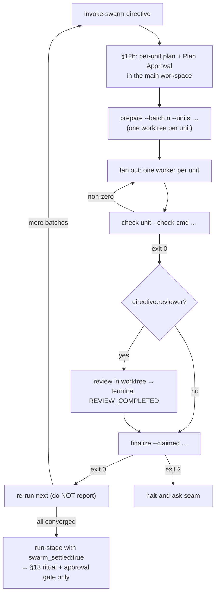
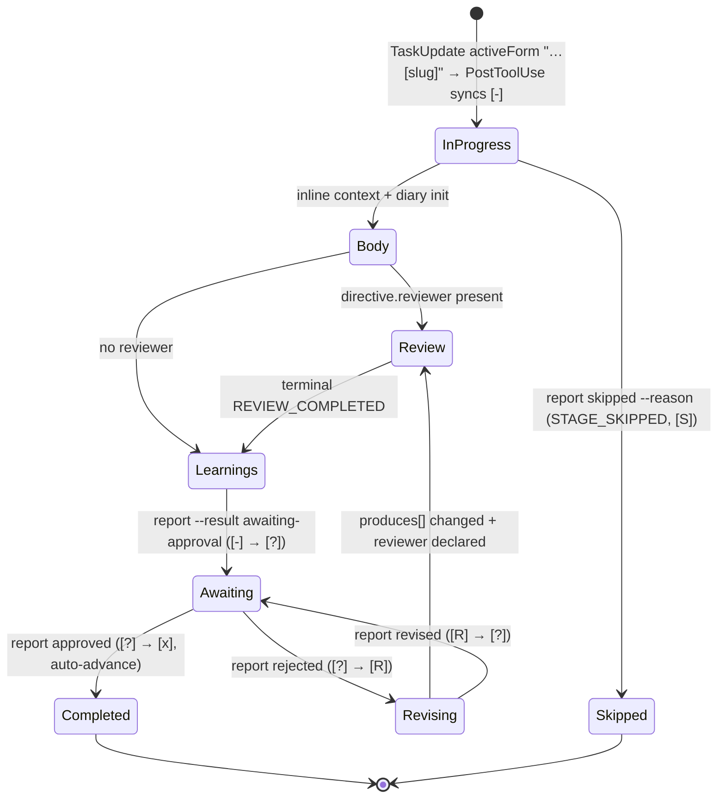

# Stage Definition Schema and Stage Protocols

> **Source**: [awslabs/aidlc-workflows](https://github.com/awslabs/aidlc-workflows) — branch `v2`, commit `3c3146cf` (v2.6.40, retrieved 2026-08-21)
> **Status**: As-built specification derived from the implementation; the upstream code is authoritative over this document.

---

## 1. Scope of this document

This spec covers two coupled artefacts:

1. **The stage file** — the `.md` unit under `core/aidlc-common/stages/<phase>/<slug>.md` that declares a stage's identity, topology, inputs, outputs, and review policy in YAML frontmatter, and its execution prose in a fixed set of body compartments.
2. **The stage protocols** — one base protocol (`core/aidlc-common/protocols/stage-protocol.md`) plus six conditional modules that the conductor loads on demand. Together they define what actually happens when a stage runs: gates, questions, artefact production, review, diaries, and the learnings ritual.

Adjacent subjects owned elsewhere: the directive envelope and the `next`/`report` loop (see `02-orchestration-engine.md`), state files and audit events (`03-state-audit-runtime.md`), agent personas and rosters (`05-agents.md`), sensor manifests and firing (`06-sensors.md`), PreToolUse/PostToolUse enforcement hooks (`07-hooks.md`), the memory-file resolver and learnings admission gate (`08-memory-rules-learnings.md`), the CLI surface of `aidlc-swarm.ts` / `aidlc-log.ts` / `aidlc-learnings.ts` (`09-cli-tools.md`), harness projection (`10-distribution-harnesses.md`), plugin-supplied stages and `when:` (`11-plugin-system.md`), and the test corpus that pins these contracts (`12-testing-ci.md`).

Two normative documents govern the stage file itself and disagree with each other in places; where they do, this spec follows the code:

| Artefact | Role |
| --- | --- |
| `core/aidlc-common/protocols/stage-definition.md` | Prose contract for the file shape (231 lines) |
| `core/tools/aidlc-stage-schema.ts` | The machine-checkable validator (676 lines) |
| `core/tools/aidlc-lib.ts` `parseStageFrontmatter` | The hand-rolled YAML-subset parser (`core/tools/aidlc-lib.ts:9105`) |

`stage-definition.md:4-6` states the relationship: "The schema (`stage-schema.ts`), the YAML parser (`parseStageFrontmatter` in `lib.ts`), and the YAML stage files all implement against this document." Section 12 below lists the places where the document has fallen behind the schema.

---

## 2. Stage file anatomy

### 2.1 File layout

`stage-definition.md:19-37` declares the canonical layout: a YAML frontmatter block, an H1 title, a mandatory compliance line, then three body compartments in this order — `## Steps`, `## Sensors`, `## Learn`.

The parser is deliberately narrow. `parseStageFrontmatter` (`core/tools/aidlc-lib.ts:9113`) matches `/^---\r?\n([\s\S]*?)\r?\n---/` and throws `"Stage file missing YAML frontmatter (---...---)"` when it does not match. It then discovers top-level keys with `/^([a-z_][a-z0-9_]*)\s*:/` (`aidlc-lib.ts:9129`) and routes each key by name:

- **Array keys** parsed as block lists unconditionally: `support_agents`, `produces`, `requires_stage`, `sensors`, `scopes` (`aidlc-lib.ts:9133-9139`). These are always present in the parsed object, even as `[]`, because the schema rejects absent required fields.
- **`consumes`** parsed by `objectListField` into `{artifact, required, conditional_on?}` entries (`aidlc-lib.ts:9175`).
- **Presence-gated optional arrays**: `optional_produces`, `required_sections` (`aidlc-lib.ts:9182`, `:9200`) — absent key yields an absent property so unannotated stages compile byte-identically.
- **`produces_kinds`** parsed by `mapOfListsField` (`aidlc-lib.ts:9191`).
- **`when`** parsed as a nested single-key map, with an inline `{k: v}` fallback (`aidlc-lib.ts:9235-9246`).
- **Everything else** parsed as a scalar string, then two targeted coercions: `reviewer_max_iterations` from an integer literal to a number (`aidlc-lib.ts:9212-9217`), and `workspace_requires` from the `"true"`/`"false"` token to a boolean (`aidlc-lib.ts:9224-9229`). A malformed value is deliberately left as a string so the validator rejects it loudly rather than the parser coercing to `NaN`.

Unknown keys are passed through rather than dropped, precisely so the validator can reject them with a specific message (`aidlc-lib.ts:9121-9126`).

### 2.2 Frontmatter fields

Required fields (`REQUIRED_FIELDS`, `core/tools/aidlc-stage-schema.ts:161-174`) — twelve:

| Field | Type | Constraint / semantics |
| --- | --- | --- |
| `slug` | string | `^[a-z][a-z0-9-]*$` (`aidlc-stage-schema.ts:184`); must match the filename stem — equality checked by `compileStageGraph`, shape only in the validator |
| `phase` | string | one of `initialization` \| `ideation` \| `inception` \| `construction` \| `operation` (`VALID_PHASES`, `:117-123`) |
| `execution` | string | `ALWAYS` \| `CONDITIONAL` (`VALID_EXECUTIONS`, `:125`) |
| `condition` | string | free-form; for `ALWAYS` an always-on rationale, for `CONDITIONAL` the branching condition. Runtime realisation of a `CONDITIONAL` false is `report --result skipped --reason "<reason>"` |
| `lead_agent` | string | agent slug; validated against `loadAgents()` when a roster is supplied, exempting `RESERVED_AGENT_SLUG = "orchestrator"` (`:142`, `:546-554`) |
| `support_agents` | string[] | may be empty; each entry roster-checked with the same exemption |
| `mode` | string | communication topology: `inline` \| `subagent` \| `pipeline` \| `mob` \| `agent-team` (`VALID_MODES`, `:127`). See §2.3 |
| `produces` | string[] | may be empty; lowercase-kebab artefact names |
| `consumes` | object[] | may be empty; entries `{artifact, required, conditional_on?}` |
| `requires_stage` | string[] | may be empty; both a data-dependency edge and a presentation-order edge; the primary input to computed `display_order` (`stage-definition.md:67`) |
| `inputs` | string | human prose |
| `outputs` | string | human prose, **non-load-bearing at runtime** — see §2.5 |

Optional fields (`OPTIONAL_FIELDS`, `aidlc-stage-schema.ts:176`) — fifteen:

| Field | Type | Constraint / semantics |
| --- | --- | --- |
| `number` | string | `^\d+\.\d+$` (`NUMBER_RE`, `:190`). An authored ordering hint only; the engine assigns compiled values, and only the index segment is read as a tiebreak among a plugin's independent new stages |
| `name` | string | authored display name; otherwise computed (§2.4) |
| `plugin` | string | ownership identity; absent means core. Open set, so string-only, no enum (`:23-26`) |
| `for_each` | string | artefact slug; the stage runs once per instance. Today only `unit-of-work` is used |
| `workspace_requires` | boolean | default `false`. Marks a stage that must write source code outside the `aidlc/` tree |
| `optional_produces` | string[] | artefacts the stage MAY write per unit; excluded from the per-unit coverage check but still resolved into directive paths (`:50-55`) |
| `produces_kinds` | map | artefact name → applicable unit kinds. An artefact **not** listed applies to all kinds; a listed one is pruned out of a unit whose kind is absent — "It prunes BOTH the directive produces paths and the coverage set - exempt from nothing" (`:56-61`) |
| `sensors` | string[] | non-empty ids; cross-validation against the manifest registry happens at compile, not parse (`:505-507`) |
| `scopes` | string[] | per-stage scope membership. Naming a scope marks the stage EXECUTE there; absence marks SKIP. Absent and `[]` are identical |
| `reviewer` | string | agent slug, roster-cross-checked like `lead_agent` (`:568-578`) |
| `reviewer_max_iterations` | integer | `>= 1`; requires `reviewer`; defaults to `2` |
| `review_class` | string | `adversarial` \| `advisory`; requires `reviewer`; defaults to `adversarial`. `"none" is deliberately NOT a stage value` (`:351-354`) |
| `summary_confirmation` | string | `required` \| `if-present` |
| `when` | object | exactly one key from `WHEN_PREDICATE_KEYS = ["producer-in-plan"]` (`:159`), value a non-empty artefact slug |
| `required_sections` | string[] | non-empty `##` H2 names the output must carry; shape only here, content enforced by the `required-sections` sensor |

Nested `consumes[]` entry subfields are **not** members of `OPTIONAL_FIELDS` — they are validated one level down by Rule 8 (`:458` ff.), which requires each entry to be an object `{artifact, required, conditional_on?}`. The optional `conditional_on` takes `brownfield` \| `greenfield` (`VALID_CONDITIONAL_ON`, `:135`); there is no `always` value.

`consumes[].required` is scoped to the active plan, not a global assertion: `true` means "if the producing stage runs, this consume must be satisfied" (`stage-definition.md:65`). A scope that skips the producer makes the consume moot and the stage body degrades gracefully.

### 2.3 `mode` — communication topology, not a review loop

`mode` names *who talks to whom while the body runs* (`aidlc-stage-schema.ts:33-42`). Four values are active and one is reserved:

- `inline` — the conductor adopts every voice; zero dispatches, no contribution files.
- `subagent` — hub-and-spoke: lead drafts, each `support_agents[]` entry is a mutually-blind spoke, lead integrates.
- `pipeline` — a chain; each link sees all upstream work and advances the artefacts directly. Requires non-empty `support_agents`.
- `mob` — a mesh room with cross-talk and recorded dissent. Requires non-empty `support_agents`.
- `agent-team` — **reserved**. `stage-definition.md:211-214`: "orchestrator code reading the `mode` field must handle `agent-team` explicitly. At minimum, throw \"mode agent-team not yet implemented\". Do not fall through to a default execution path."

The ensemble coupling is enforced at the schema, not at the conductor: `ENSEMBLE_MODES = ["pipeline", "mob"]` (`aidlc-stage-schema.ts:133`) and a violation yields `mode "<mode>" requires a non-empty support_agents` (`:285`). `agent-team` is explicitly **not** coupled; no stage may declare it at all until a consumer ships.

The review loop is orthogonal: `stage-definition.md:55` — "The review loop is NOT a mode: `reviewer` + `reviewer_max_iterations` deliver the two-party critique topology on every mode".

### 2.4 Computed fields

Two fields land in `stage-graph.json` without being authored (`stage-definition.md:79-83`):

- `display_order` — `<phase-prefix>.<sequence>` with phase prefixes `initialization=0`, `ideation=1`, `inception=2`, `construction=3`, `operation=4`; sequence from a topological sort of `requires_stage` filtered to the phase, slug-alphabetical tiebreak.
- `name` — title-case of the slug, or the H1 heading of the stage file.

### 2.5 Artefact paths are engine-resolved

No stage file hardcodes a workspace root. A stage emits relative artefact **names** in `produces[]`; the engine resolves them at directive-emit time against the active intent's record dir, `aidlc/spaces/<space>/intents/<YYMMDD>-<label>/<phase>/<stage>/<name>.md`, via `resolveArtifactPath` / `memoryPathFor` in `aidlc-orchestrate.ts` (`stage-definition.md:135-143`; `memoryPathFor` at `core/tools/aidlc-orchestrate.ts:1086`). The document is explicit that a rooted path literal in a stage file is "a doc bug, not a behavior contract" (`stage-definition.md:142-143`).

The same emit-time pass splits consumed inputs by presence (`stage-definition.md:145-154`): the directive's `consumes` lists only resolved paths that exist on disk; a REQUIRED declared input whose file is absent moves to `consumes_absent`, annotated `expected: true` when the producing stage is off the active scope's path and `expected: false` when a producer is on the path but the file is still missing. A `required: false` consume that is absent is simply dropped — "an optional input that does not exist is not an input, never a gap."

### 2.6 Validation rules and reserved namespace

`validateStageFrontmatter` (`aidlc-stage-schema.ts:200`) runs nine numbered rules: (1) plain-object shape, (2) reserved keys, (3) unknown keys, (4) required-field presence, (5–7) per-field type/enum/regex, (8) nested `consumes[]`, (9) dynamic agent-roster lookup. Errors accumulate; the validator is pure — "no I/O, no YAML parsing, no mutation" (`:5-7`).

Reserved keys and their messages (`RESERVED_KEYS`, `:148-153`) produce `<key> is reserved (<reason>); not active yet`:

| Key | Reason string |
| --- | --- |
| `on_failure` | `loop driver` |
| `blocks_on` | `construction worktrees` |
| `timeout` | `sensor binding` |
| `retry` | `loop driver` |

One key gets a targeted message rather than the generic unknown-key error: `bundle: was renamed; write plugin: for ownership` (`:230`). Everything else unknown yields `unknown key: <key>`.

Two couplings are rejected at the schema so the mistake fails the compile rather than the conductor: `reviewer_max_iterations requires a reviewer` (`:346`) and `review_class requires a reviewer` (`:360`).

**Swarm-trigger coupling.** The autonomous Construction swarm fires on a field match — `SWARM_FOR_EACH = "unit-of-work"` and `SWARM_MODE = "subagent"` (`core/tools/aidlc-orchestrate.ts:3366-3367`), gated at `:3406` by `if (node.for_each !== SWARM_FOR_EACH || node.mode !== SWARM_MODE) return false;`. Re-moding the per-unit build stage silently takes it off the swarm path, so `aidlc-graph compile` emits an advisory on stderr for a construction stage with `for_each: unit-of-work` + `workspace_requires: true` whose mode is not `subagent` (`core/tools/aidlc-graph.ts:1915-1928`), ending `swarm will NOT fire for it; units build serially.` The advisory never fails the compile, so `compile --check` parity is untouched.

### 2.7 Body compartments

`stage-definition.md:164-172` presents `## Steps` as "Required, populated" and both `## Sensors` and `## Learn` as "Reserved, absent", with the parser tolerating absence. **In the shipped tree all three compartments are populated in all 33 stage files** (measurement M3–M5). `intent-capture.md:172` opens a real `## Sensors` section explaining what each imported sensor checks, and `:187` a real `## Learn` section restating the four diary headings. The document's "reserved/absent" row is stale; the parser rule (tolerate absence) is still accurate, and nothing machine-reads these compartments — the machine-readable binding is the `sensors:` frontmatter list.

### 2.8 Shipped inventory

Measured over `core/aidlc-common/stages/*/*.md` (33 files, M1):

| Frontmatter feature | Count | Notes |
| --- | --- | --- |
| `mode: inline` | 29 | M6 |
| `mode: subagent` | 2 | practices-discovery, code-generation |
| `mode: pipeline` | 1 | reverse-engineering |
| `mode: mob` | 1 | user-stories |
| `mode: agent-team` | 0 | reserved; no stage declares it |
| `reviewer:` declared | 13 | M7 — 8 name `aidlc-architecture-reviewer-agent`, 5 name `aidlc-product-lead-agent` (M8) |
| `review_class: advisory` | 8 | M9; the other 5 reviewer stages omit the field and default to `adversarial` — all five are Construction (code-generation, functional-design, nfr-requirements, nfr-design, infrastructure-design) |
| `for_each: unit-of-work` | 5 | M10 — the four inline per-unit design stages plus code-generation |
| `workspace_requires: true` | 1 | code-generation only (M11) |
| `summary_confirmation: required` | 27 | M12; no stage uses `if-present` |
| `optional_produces:` | 1 | functional-design (M13) |
| `produces_kinds:` | 4 | the four per-unit design stages (M14) |

`UNIT_KINDS = ["service", "spec", "ui", "packaging", "library"]` (`core/tools/aidlc-lib.ts:10210`) is the closed vocabulary `produces_kinds` values must draw from.

---

## 3. The protocol family

The base protocol is mandatory on every stage. Six modules are conditional, loaded by trigger. Four of them are announced by the engine in `directive.protocol_modules`; two are triggered by prose conditions only.

| File | Lines | Loading trigger (verbatim from the file's own header) | Engine-announced? |
| --- | --- | --- | --- |
| `stage-protocol.md` | 1099 | "MANDATORY: All stages follow this protocol." (`:3`) | always |
| `stage-protocol-reviewer.md` | 186 | "Load this module when a directive names a reviewer with an effective review class other than `none`." (`:3`) | `reviewer` |
| `stage-protocol-ensemble.md` | 173 | "Load this module when `directive.mode` is `subagent`, `pipeline`, or `mob`, or when the stage declares support agents" (`:3`) | `ensemble` |
| `stage-protocol-construction.md` | 369 | "Load this module on the first Construction-phase directive of the session and on every `invoke-swarm`" (`:3`) | `construction` |
| `stage-protocol-swarm.md` | 66 | "Load this module for every `invoke-swarm` directive and every `run-stage` with `directive.swarm_settled === true`" (`:3-4`) | `swarm` |
| `stage-protocol-governance.md` | 32 | "Load this file at phase transitions (end of Ideation, Inception, Construction)." (`:3`) | no |
| `stage-protocol-recovery.md` | 274 | "Load this file on session resume or when a change event is detected mid-stage." (`:3`) | no |

Line counts: M2.

The announced set is closed: `VALID_PROTOCOL_MODULES = ["reviewer", "ensemble", "construction", "swarm"]` (`core/tools/aidlc-directive.ts:62-67`), enforced with `<kind>: protocol_modules[<i>] must be one of reviewer | ensemble | construction | swarm` (`:948`). Governance and recovery are deliberately outside it: their triggers are workflow events (a phase boundary, a session resume) rather than properties of a single directive.

Selection for a `run-stage` directive (`core/tools/aidlc-orchestrate.ts:2114-2131`):

```text
reviewer   ← directive.reviewer && directive.review_class both set
ensemble   ← node.mode ∈ {subagent, pipeline, mob} OR support_agents.length > 0
construction ← node.phase === "construction"
```

An `invoke-swarm` directive hardcodes the list instead (`aidlc-orchestrate.ts:3567-3571`): `[...(node.reviewer ? ["reviewer"] : []), "construction", "swarm"]`.

`protocol_modules` is only attached when non-empty (`:2129-2131`). It is a `run-stage` / `invoke-swarm` field; `dispatch-subagent` explicitly filters it out (`aidlc-directive.ts:485-491`) because a delegated worker is not a conductor.

Four of the seven protocol files carry per-harness subsections — one each for Claude Code, Kiro CLI, Kiro IDE, Codex CLI, Cursor, opencode, and GitHub Copilot (M18):

| File | Binding heading | Subsections |
| --- | --- | --- |
| `stage-protocol-swarm.md` | (module preamble, `:1-5`) | `:14-62` |
| `stage-protocol-ensemble.md` | `## Harness topology bindings` (`:119`) | `:121-169` |
| `stage-protocol-construction.md` | `## Harness construction bindings` (`:315`) | `:317-365` |
| `stage-protocol-reviewer.md` | `## Harness reviewer bindings` (`:144`) | `:148-186` |

`stage-protocol-governance.md` and `stage-protocol-recovery.md` carry none, and neither does the base `stage-protocol.md` — no `### <harness>` binding subsection exists in any of the three (M18).

The "pick your harness" instruction is uniform in intent but not verbatim: ensemble (`:3`) and construction (`:3`) both read "use only the harness subsection that matches the active harness", reviewer (`:146`) reads "Use only the subsection that matches the active harness.", and swarm (`:3-5`) reads "use only the subsection for the active harness". The portable contract lives above the subsections; for the reviewer, ensemble, and construction modules the subsections differ mainly in the dispatch verb (`Task` / `subagent` / `task` / spawn / delegate). The swarm subsections differ by more than a verb: only the Claude Code one (`:16`) carries the inline `AIDLC_USE_SWARM=1` Dynamic Workflow branch. All six others state the flag is inert — five read "`AIDLC_USE_SWARM=1` has no effect here (no Workflow tool exists)" and Codex CLI (`:40`) reads "…has no effect on this harness (no Workflow tool exists)" — see §7. See `10-distribution-harnesses.md`.

---

## 4. Base protocol walkthrough

`stage-protocol.md` numbers its sections 1–13 with **7 and 11 absent from the file** — those numbers were extracted into modules (§7 Change Handling into recovery, §11 Subagent Return Summary into ensemble) and the base file keeps only pointers. The numbering is preserved so cross-references stay valid.

### 4.0 Preamble (unnumbered)

Three unnumbered sections precede §1.

**Talking to the user (the voice contract)** (`:5-61`) — "MANDATORY on every stage, every gate, every message the user reads. This governs the WORDS you say, never the mechanics you run." It declares a reserved internal vocabulary that must never reach chat narration: "engine, directive, dispatch, conductor, harness, verb, scope grid, steering, forwarding loop, mint, birth, swarm, entropy, and the ARS component names (IAE, CSU, VE, R, UA)" (`:17-21`), and supplies a substitution table. Two carve-outs: a string a tool tells you to print is printed VERBATIM, and every audit event name, state marker, tool flag, file path, and stage slug keeps its exact spelling (`:57-61`).

**Structured questions (harness-neutral contract)** (`:63-91`) — a fenced ` ```question ` block is a **spec** rendered through the harness's `question-rendering.md` annex, never printed verbatim: "Echoing the raw spec into the transcript is a protocol violation" (`:76-77`). For prose-rendering harnesses each question opens a fresh response-key scope starting at `1`, and context lists immediately before a prose question must use unordered bullets (`:86-91`).

**Critical Compliance Checklist** (`:93-100`) — six items, the load-bearing ones being: every lifecycle transition goes through `aidlc-orchestrate.ts report`, never `aidlc-state.ts` lifecycle verbs and never a hand-written `aidlc-audit.ts append`; non-gate questions are bracketed by `aidlc-log.ts decision` / `answer`; User Input is never summarised; **"Stage ritual is ATOMIC — once a stage starts, EVERY step in its protocol fires: questions → artifact → reviewer (if declared) → learnings → gate"** (`:99`); and **"Autonomy is NEVER inferred"** — a one-off "go with recommended" binds that stage only (`:100`).

### 4.1 §1 Approval Gates (`:104-179`)

Every stage except the three Initialization stages (workspace-scaffold, workspace-detection, state-init) requires explicit user approval (`:106`).

- **HARD STOP RULE** (`:108-110`): on presenting an approval gate you "MUST end your turn immediately… Do NOT call any tool until the user has typed their choice in a new message."
- **NO EMERGENT BEHAVIOR RULE** (`:112-113`): Construction and Operation gates are strictly two options (Approve / Request Changes). Only Ideation and Inception may add a third option to re-add a previously skipped stage. Two sanctioned carve-outs exist: the revision escape hatch and the Build-and-Test failure loop-back.
- **Naming the next stage** (`:129-133`): render `[next stage]` verbatim from `directive.next_stage`; when null render `Complete workflow`. "NEVER infer or guess the next stage name."
- **Revision loop escape hatch** (`:153-171`): after 3 "Request Changes" cycles on the same stage, an "Accept as-is" option is added to all subsequent gates for that stage; selecting it logs to the audit shard, marks the stage complete, and proceeds. After the 2nd cycle the gate must warn that the option is coming.

### 4.2 §2 Completion Messages (`:181-244`)

A five-part structure, Parts 0–4.

**Part 0 — enter the gate** (`:185-193`) is the ordering contract, and the one most easily got wrong:

1. Render Parts 1–2, then run the §13 learnings ritual **as its own human turn** — end the turn at its question. Its `QUESTION_ANSWERED` row must precede the gate's `STAGE_AWAITING_APPROVAL`; "the gate is never opened in the same message as the learnings question" (`:187`).
2. `report --stage <slug> --result awaiting-approval` marks `[-]` → `[?]` and emits `STAGE_AWAITING_APPROVAL`. This is silent bookkeeping: "**SAY:** nothing for it" (`:188`).
3. Present the approval question. It is a lifecycle gate, not an interview question — "do not call `aidlc-log.ts decision` or `aidlc-log.ts answer` for it" (`:189`).
4. Route the response: `approved --user-input "<exact choice>"` emits `GATE_APPROVED` + `STAGE_COMPLETED` and auto-advances; `rejected --user-input "<feedback>"` emits `GATE_REJECTED` + `STAGE_REVISING`, marks `[?]` → `[R]`, and increments Revision Count; after the revision work, `revised` emits a fresh `STAGE_AWAITING_APPROVAL` and returns `[R]` → `[?]`. Critically: "When the revision changed a `produces[]` artifact and the directive carries a reviewer, re-run the `stage-protocol-reviewer.md` §12a reviewer step before reporting revised… (The §13 learnings ritual runs once per stage and is not re-run.)" (`:192`).

Parts 1–3 are announcement, factual summary with a 5–10 line artefact table, and the `**Review:** <record>/…` line plus the question. Part 4 is the post-approval progress line, in one of two exact formats depending on whether the active scope executes every compiled stage (`:225-239`), with totals read from `aidlc-utility.ts scope-table` — "never carry a hand-maintained per-scope count table in this protocol".

### 4.3 §3 Question Format (`:248-464`)

The questions file is always the source of truth. Step 1 creates `<slug>-questions.md` with blank `[Answer]:` tags; every ordinary question ends with `X. Other (please specify)` — the Consolidated Summary Confirmation is the sole unlettered exception (`:259-261`).

Step 2 offers three interaction modes: **Guide me** (interactive), **I'll edit the file** (self-guided), **Chat** (freeform). Users may switch mid-stage (`:385`).

All three converge on the same **Consolidated Summary Confirmation** before artefact generation (`:316-365`). Its mechanics are deterministic and receipt-backed:

- Before presenting: `aidlc-log.ts decision --stage <slug> --checkpoint summary-confirmation --questions-file "<path>" --decision "Does this all look correct before I generate the artifact?" --options "Looks correct,Request changes"`, plus `--unit` for a per-unit stage and `--single` for an isolated run.
- The file entry stores exactly `[Answer]: Looks correct` or `[Answer]: Request changes` — "`[Answer]: A. Looks correct` and `[Answer]: 1. Looks correct` are invalid" (`:340`).
- After the human answers: the matching `aidlc-log.ts answer` receipt. "The tool refuses a self-selected answer, a response without a matching prompt record and later human turn, or a questions file whose stored choice differs" (`:354-356`).
- On **Request changes**, append a `## Requested Changes Feedback` question, ask "What should change?", and END THE TURN before revising anything.

The frontmatter counterpart is `summary_confirmation`, enforced at completion by `verifySummaryConfirmationPrecondition` (`core/tools/aidlc-state.ts:1732-1751`).

Depth-aware generation (`:265-290`) sets question volume from the state file's `**Depth**` field: Minimal ~2-4, Standard ~5-8, Comprehensive ~8-12+ per stage, decreasing as the lifecycle advances — Construction questions are "**exceptional, not routine**" (`:274`).

Two mandatory analyses follow answer collection: **Answer analysis** for vagueness/contradiction/missing detail (`:407-414`) and **Contradiction detection** across the full answer set — scope, risk, technology, timeline mismatches — where "Do NOT proceed until contradictions are resolved" (`:434-445`).

A subtle but load-bearing rule at `:416-426`: every pending question, including follow-ups and chat-mode questions, must be written into the questions file with a blank `[Answer]:` tag **before the turn ends**, because the forwarding-loop Stop hook reads that file to distinguish a genuine human-wait from an abandoned stage. This does not apply in autonomous Construction.

**Consuming grounded artefacts** (`:391-405`): a source tag records provenance and does not license strengthening a claim; `[assumption]` content stays an assumption downstream until confirmed through that stage's questions file; never silently promote an assumption, open question, unselected option, or workflow metadata into a confirmed requirement.

### 4.4 §4 State Tracking (`:467-672`)

Reporting the outcome through `aidlc-orchestrate.ts report` is the only lifecycle path; the engine selects and runs the atomic transition (`:470`).

Task transitions are mandatory before every stage: mark the previous stage task `completed`, then `TaskUpdate({..., status: "in_progress", activeForm: "Running [Stage Name] [slug]"})`. "The `[slug]` suffix in `activeForm` is required. A PostToolUse hook parses it to automatically sync the state file" (`:483`).

Stage progress notation (`:509-522`): `[ ]` not started, `[-]` in progress, `[x]` completed, `[S]` skipped. `[S]` is set either by `aidlc-jump.ts execute` for in-scope stages before a jump target, or by `report --result skipped` when the active stage's own applicability check justifies it; skipped stages are excluded from progress counts and "are never rewritten as completed".

Conditional skip (`:558-570`) requires the explicit stage pin and a nonblank reason. The engine "preserves `[S]`, emits one `STAGE_SKIPPED`, and starts the next in-scope stage (or completes the workflow) without emitting `STAGE_COMPLETED`. A single-stage run cannot use this routing outcome."

Event emission is tool-owned (`:572`). `aidlc-audit.ts append` is a narrow diagnostic escape hatch that **refuses** authority-bearing receipts, listed verbatim: `HUMAN_TURN`, `GATE_APPROVED`, `GATE_REJECTED`, `QUESTION_ANSWERED`, `REVIEW_REQUESTED`, `REVIEW_COMPLETED`, `PIPELINE_LINK_COMPLETED`, `ARTIFACT_REUSED`, `SWARM_STARTED`, `SWARM_UNIT_CONVERGED`, `AUTONOMY_MODE_SET`, `UNIT_STARTED`, `UNIT_PAUSED`, `UNIT_RESUMED`, `UNIT_COMPLETED`.

The section also fixes five specialised audit-log templates (Error, Recovery, Change Request, Question interaction, plus the standard conversation-event block) and the audit rules: append-only to `<record>/audit/<host>-<clone>.md`, complete unmodified User Input, and never hand-write `ERROR_LOGGED` / `RECOVERY_COMPLETED` (`:664-672`).

### 4.5 §5 Agent Persona Loading (`:676-727`)

A six-step knowledge loading order (active-space `memory/{org,team,project}.md` → shared harness knowledge → agent knowledge → team shared knowledge → team agent knowledge → prior stage artefacts).

For inline stages the rule is a hard precondition, not a hint (`:688-708`): apply every `load-steering.rules_content` entry in order, then read every path in `inline_context_paths` before anything else. "The first tool calls after `run-stage` must read these paths only… Do not read the stage file or consumes, initialize the diary, run the body, dispatch mob supports, or write artifacts until every required inline-context read has completed."

For subagent stages (`:710-719`), the delegation boundary is explicit: "Every delegated lead, support, and reviewer is artifact-scoped, never a workflow conductor. It MUST NOT call `aidlc-orchestrate.ts next`, `report`, or `park`; mutate lifecycle state (including `aidlc-state.ts unpark`); route with a jump/configuration tool; or present approval gates or resume menus."

### 4.6 §6, §8–§10, §12

- **§6 Error Recovery** (`:731-734`) is a pointer to the recovery module.
- **§8 Depth Guidance** (`:737-828`) maps the eleven shipped scopes to default depths and defines the three test strategies (Minimal/Nyquist, Standard per-component, Comprehensive per-component), each a soft guideline. Test strategy defaults to the depth level unless the scope overrides it, and is separately overridable with `--test-strategy`.
- **§9 Terminology** (`:832-855`) is the canonical glossary — Phase, Stage, Scope, **Bolt**, **Walking skeleton**, **Ladder prompt**, **Parallel batch**, Unit of Work, Service, Module, Component, Planning, Generation, Depth, Artifact, Guardrail, AIDLC — seventeen rows (`:838-854`).
- **§10 Content Validation** (`:858-928`) requires Mermaid syntax validation with a `<!-- Text fallback: … -->` line beneath every diagram, a pre-creation checklist, ASCII-only text diagrams (Unicode box-drawing U+2500–U+257F prohibited), and character escaping rules. It also fixes **template overrides** (`:875-881`): resolve artefact `X` first against `aidlc/spaces/<space>/memory/templates/X.md`, then a framework default (none ship at GA), else the stage's prose. A resolved template is used whole-doc, and "The `required-sections` sensor verifies the output against the SAME resolution order and the SAME file, so the produced shape and the checked shape cannot drift."
- **§12 Phase Boundary Verification** (`:936-938`) is a pointer to the governance module.

### 4.7 Artifact Re-use (`:1040-1099`)

An unnumbered section after §13. When a stage finds existing outputs in its artefact directory it presents a 3-option question — **Keep**, **Modify**, **Redo from scratch** — and audits the choice with `aidlc-state.ts reuse-artifact <stage-slug> --decision <keep|modify|redo> --artifacts "<list>" [--repo <repo>]`, which emits `ARTIFACT_REUSED`. This applies to ALL stages, not just jump targets.

Two overrides suppress the question, both tied to the Build-and-Test loop-back (§6 below): the **autonomous** variant (no human in the loop) and the **gated** variant (the human already chose "Retry with fix"). Both decide deterministically from the Loop-Back Log's planned fix — Modify for targeted units, Keep for the rest, Modify for build-and-test itself, and **Redo is forbidden there** because it would erase the Loop-Back Log. Either way "fresh current-attempt reviews for every applicable unit are mandatory before the replayed gate is auto-approved" (`:1080-1081`).

---

## 5. Reviewer protocol (`stage-protocol-reviewer.md` §12a)

### 5.1 Placement and class resolution

The reviewer runs "after the stage body produces its artifacts and before the §13 learnings ritual" (`:7`). The engine has already resolved the class before emission, so "a directive that carries a reviewer always carries a class" (`:9`).

Resolution is monotonically downward through three tiers (`resolveReviewClass`, `core/tools/aidlc-lib.ts:8753-8770`) ranked `none: 0, advisory: 1, adversarial: 2` (`REVIEW_RANK`, `:8735-8739`): the stage declaration, lowered by the scope's `review_cap`, lowered again by the state file's `Review Override`. Neither a cap nor an override can *raise* a class. A `none` resolution omits the reviewer block from the directive entirely (`aidlc-orchestrate.ts:2105-2112`), and the same resolution is re-run at completion so the completion path never demands a receipt the conductor was told not to create (`aidlc-state.ts:1798-1811`).

Five of the eleven shipped scopes declare a cap (M15): `bugfix`, `classic`, `poc`, `workshop` at `advisory`; `express` at `none`.

The two classes behave differently:

- **`adversarial`** — the refute-and-repair loop, up to `reviewer_max_iterations` (default 2) with lead fixes between passes. "The default for Construction stages, where findings are machine-checkable and fix loops converge" (`:11`).
- **`advisory`** — exactly ONE normal-flow pass, `reviewer_max_iterations` forced to 1 by the engine (`aidlc-orchestrate.ts:2111`). "Whatever the verdict, do NOT re-invoke the lead and do NOT re-run the reviewer during normal flow: record the terminal receipt, proceed to §13, and quote the reviewer's findings VERBATIM at the approval gate for the human to triage" (`:12`).

### 5.2 Read scope and tooling

The reviewer is passed the stage definition path, the Q&A path, all `produces[]` artefact paths, the resolved `directive.consumes` paths (paths only, per the context-budget rule), and the frontmatter validation-tools list. It is **not** passed `memory.md` or any plan/reasoning file: "The reviewer forms independent judgment" (`:36`).

The read-scope bound is explicit (`:38`): on a per-unit stage the reviewer must not read another unit's `construction/<other-unit>/` content "through any tool - not by opening files, and not via grep, glob, or shell patterns that span sibling unit paths (a `construction/*/` glob is a sibling read, not a search)". The single carve-out is spot-checking an integration point the current unit's design explicitly names, resolved via shared contracts and limited to the owning file.

On enforcement-capable harnesses (Claude Code, Kiro CLI, Codex CLI, opencode, Cursor, GitHub Copilot — Kiro IDE excepted) the bound is machine-enforced. Immediately before a per-unit dispatch the conductor writes `<record>/.aidlc-reviewer-dispatch.json` (`:40-47`):

```json
{"reviewer": "<directive.reviewer>", "stage": "<stage slug>", "unit": "<directive.unit>",
 "exempt": ["<each resolved directive.consumes path>", "<stage file path>", "<Q&A file path>"]}
```

The `aidlc-reviewer-scope.ts` PreToolUse hook reads this record (`core/hooks/aidlc-reviewer-scope.ts:21`) and emits `REVIEWER_SCOPE_BLOCKED` on a violation (`:845`). The record is the only place the spot-check carve-out is granted; a fresh record is written on every re-invoke, single-stage reviews write none, and step 3 deletes it because "a leftover record would keep refusing sibling access for later, unrelated work" (`:78`).

### 5.3 Verdict format and the incomplete-attempt path

The reviewer "Appends exactly ONE `## Review` section to the primary artifact file with exactly one verdict line: READY or NOT-READY" (`:73`) and returns a response whose first line is the verbatim identity marker `**Reviewer:** <reviewer-agent-name>` (`:74-76`).

Step 1 deletes any pre-existing `## Review` section **before every dispatch, not only the first** (`:27`). The rationale is what makes the step-3 check total: review history lives in the audit ledger, so a missing section always means an incomplete review on every path rather than a stale verdict sitting under a live heading.

Step 3 accepts a review as complete only when the artefact carries exactly one current `## Review` section with exactly one canonical token. Three shapes are INCOMPLETE, not verdicts (`:78`): no section at all, a section with no canonical verdict line, or more than one section/verdict line.

On an incomplete attempt (`:80`): the step-1 request is still unmatched, so re-run the same request command with `--retry-pending` exactly once — the logger "accepts it only while that exact request is unmatched, marks the retry in the audit, and does not consume another review iteration" (`:54-56`). If the retry is also incomplete, stop retrying and record the terminal receipt with `--verdict NOT-READY` and the finding `"review did not complete within its turn budget"`. "Recording the receipt is what keeps the engine's completion precondition satisfiable: the gate is never presented on a silently missing verdict, and never deadlocks on one either."

### 5.4 Terminal receipts and the freeze

A receipt is TERMINAL whenever no further pass follows it, and "do not write to any `produces[]` artifact between recording it and gate approval (a later write invalidates the receipt and the engine refuses the gate)" (`:84`). On enforcement-capable harnesses the `aidlc-review-freeze.ts` PreToolUse hook refuses such a write and emits `REVIEW_FREEZE_BLOCKED` (`core/hooks/aidlc-review-freeze.ts:824`); a recorded `GATE_REJECTED` lifts the freeze for the revision path.

Suggestions riding on a verdict are gate input, not defects: do not apply them, quote them verbatim, and — a rule aimed squarely at option-order drift — "keep the §1 approval question's standard option order (Approve first, Request Changes second) - do not present Request Changes as the recommended or first option because a suggestion exists" (`:84`).

If a write does invalidate the receipt, exactly **one** recovery review is permitted at the next ordinal, even when an adversarial stage had unused normal iterations. The logger marks it `Recovery: stale-receipt` (`core/tools/aidlc-log.ts:1103`). If that recovery receipt is invalidated again, request no further review — present the recovery-spent refusal, and "only Request Changes (`GATE_REJECTED`) resets the attempt" (`:86`).

### 5.5 Engine enforcement

The blockquote at `:109-132` states the precondition, and `aidlc-state.ts` implements it in all four completion handlers (`verifyReviewerPrecondition`, `core/tools/aidlc-state.ts:1775`). The refusal strings are the contract:

- No receipt at all: `Refusing to complete "<slug>": it declares a reviewer (<reviewer>) but no fresh REVIEW_COMPLETED is recorded for it.` (`aidlc-state.ts:2028-2029`), continuing "Terminal ordering: apply any fixes FIRST, then run the reviewer, record the receipt, and stop editing produces[] artifacts".
- Receipt invalidated: `Refusing to complete "<slug>": its terminal review receipt from <reviewer> was invalidated by a later write to a declared produces[] artifact.` (`:2014-2015`).
- Recovery already spent: `...its stale-receipt recovery review from <reviewer> was invalidated by another later write... Only a human Request Changes decision resets the review attempt; do not record it on the human's behalf.` (`:2006-2010`).
- `workspace_requires` stages additionally carry a `Source Fingerprint` of the inspected workspace source, recomputed and compared on every completion route; a mismatch produces `...the workspace source no longer matches the state of the most recent recorded review (source-fingerprint mismatch)` (`:1960-1961`).

The receipt scan is *floored*: only rows after the stage's latest `STAGE_STARTED`, any later `GATE_REJECTED`, and the latest relevant `produces[]` write count; per-unit writes invalidate only that unit's receipt (`aidlc-state.ts:1763-1770`). The row must match BOTH Stage AND Reviewer, so "a row naming the wrong reviewer — a typo, or the conductor self-certifying — must not satisfy it" (`:1770-1771`). On `for_each: unit-of-work` stages, **every** unit needs its own terminal receipt.

The precondition is "hard on the review having happened and soft on its verdict: a NOT-READY verdict after the iteration cap still reaches the human gate" (`stage-protocol-reviewer.md:118-119`).

### 5.6 What the reviewer does not do

Verbatim (`:134-140`): does not modify the artefact beyond appending `## Review`; does not communicate with the builder directly; does not access the builder's `plan.md` or `memory.md`; does not block the workflow — the human always gets final say at the gate; does not fire for stages without a `reviewer` field in the directive.

---

## 6. Construction protocol (`stage-protocol-construction.md`)

### 6.1 Applicability

The module opens with a guard (`:5-11`): Bolt, walking-skeleton, ladder, autonomy, and per-Unit ceremonies "apply only when the engine resolved a real non-empty Unit DAG". `directive.unit` or `directive.wave` identifies Unit work; `directive.swarm_settled` identifies the gate-only end of an autonomous run. "A zero-Unit directive has none of those fields: run it once as an ordinary stage, with no Bolt, skeleton, ladder, or swarm ceremony."

### 6.2 Three gate patterns

**Walking-skeleton gate** (`:17-25`) — when a real Unit DAG exists and the applicable skeleton stance selects the ceremony, the first Bolt "always presents a Bolt-level approval gate regardless of any autonomy-mode setting". The gate covers the Bolt's design artefacts and generated code together.

The stance itself is the one gate value the engine cannot compute. It emits `gate: "unresolved"` (`GATE_UNRESOLVED`, `core/tools/aidlc-directive.ts:37`) and hands the classification back: read the `## Walking Skeleton` section with resolution order `org.md` → `team.md` → `project.md`, most-specific non-empty statement wins, then classify — `"always"`/`"every greenfield feature"` → `on`; `"never"` → `off`; `"scope-dependent"`/unspecified/empty → `scope-dependent` (the engine then reads the active scope file's `skeleton:` field). A bolt-plan marker contradicting practices loses; the `PRACTICES_OVERRIDE` row is emitted first. Then `report --skeleton-stance <on|off|scope-dependent>` and the next `next` re-emits the same stage with a boolean gate (`:319`).

**Ladder prompt** (`:27-45`) — fires exactly once, immediately after an actual walking skeleton's gate approves, and not at all for skeleton-off or zero-Unit execution. Two options: "Continue autonomously" / "Gate every Bolt". The answer is recorded via `aidlc-bolt.ts set-autonomy --mode <choice>`, which emits `AUTONOMY_MODE_SET` itself. Because the mode switch requires the human's fresh turn, "logging the choice as an interview answer first would consume that turn and the mode switch would refuse" (`:44`). On resume, if the mode is `unset` but the skeleton is `[x]`, re-fire the prompt.

**Halt-and-ask on failure** (`:51-74`) — "When a Bolt's code-generation returns failure, **always halt and present the halt-and-ask prompt regardless of autonomy mode**." This is one of the two cases where autonomous mode consults the human; the other is the Build-and-Test loop-back's exhausted rung. Solo failure emits `BOLT_FAILED` with `--slug`; a parallel batch waits for all tasks, preserves successful Bolts' artefacts, and emits `BOLT_FAILED` with `Succeeded=[names]`. The three options are Retry (re-run inside the existing worktree), Skip (mark `[S]`, worktree preserved), Abort (worktree preserved). The worktree `<path>` and `<branch_name>` come deterministically from `aidlc-worktree.ts info --slug <slug>` before the question is composed.

### 6.3 Build-and-Test failure loop-back (3.6 → 3.5)

When Build and Test diagnoses a failure whose root cause is in the generated code or an approach chosen at code-generation, the workflow may jump back to code-generation. It is a sanctioned exception both to the NO EMERGENT BEHAVIOR RULE and to checklist item 5: "a failed build-and-test run is deliberately left in-flight — its gate is NOT presented and its §13 learnings ritual DEFERS to the eventual passing run (the stage diary memory.md persists across the loop)" (`:86-88`).

**The counter is an artefact ledger, not the audit.** It lives in `test-results.md` under `## Loop-Back Log`; "the count of `### Loop-back N` entries IS the bound (max 3 per intent)" (`:90-91`). The rationale is stated: the ledger survives the backward jump (jumps reset checkboxes, never artefacts), is colocated with the diagnosis, and is readable at the final gate; the `STAGE_JUMPED` rows remain the deterministic audit cross-check. The log is append-only, and a human-directed backward jump does not count against the bound.

**Plan approval survives the replay** (`:100-108`): the recorded Plan Approval answer stays authoritative — "the conductor MUST NOT blank its `[Answer]:` for the loop-back revision" — and the plan delta is recorded in the Loop-Back Log entry instead. In gated mode the human's "Retry with fix" IS the re-approval, carried through `--user-input` on the replayed report.

**The jump goes through the engine, never by hand** (`:115-122`): run `aidlc-orchestrate.ts next --stage code-generation`, which answers with a `print` directive naming the exact `aidlc-jump.ts execute --target code-generation --direction backward --scope <scope>` command; run that printed command verbatim. "Never compose the `execute` call by hand — the engine's print is the validated form."

**Re-entry settlement** branches on whether code-generation ever used the unit lifecycle ledger (`:139-153`): an **artifact-only workflow** can take the all-covered `gate: true` fast path with the fix applied through the re-entry override; a **receipt-mode workflow** is sticky once any lifecycle row exists, so re-entry emits per-unit directives and each applicable unit re-mints `unit start` / `unit complete`. On both paths a fresh current-attempt review per applicable unit is mandatory before the gate, because "The backward jump's `STAGE_JUMPED` invalidates every prior review receipt" (`:158`).

**Two halt-and-ask variants** (`:191-226`) — the impact-estimated variant offering Retry with fix / Accept failure / Abort with effort, financial cost, and risk in every description, and the no-fix variant that **omits "Retry with fix" entirely** because presenting it without a candidate fix "would itself be the impact-unestimated give-up option this protocol forbids in the other direction (a fabricated fix to retry with)". Never render the impact-estimated template's slots with placeholder or invented content just to keep the shape.

### 6.4 Bolts, per-unit iteration, and waves

**Within-Bolt question collection** (`:243-256`) concentrates human interaction at each Bolt's start: questions for stages 3.1–3.4 across all the Bolt's Units are collected upfront and grouped **by stage**, labelled by Unit name; the standard question protocol applies once per stage group, not per Unit; a single Bolt-level answers gate confirms them; then stage files execute in ARTIFACT-ONLY mode with no human interaction. Code generation delegates per Unit and its per-Unit gate is "**suppressed by the orchestrator** — a single Bolt-level gate (or batch-level gate for parallel batches) replaces it".

**Engine-driven per-unit iteration** (`:257`): the engine emits ONE `run-stage` per Unit in Bolt build order carrying `directive.unit`, substituting the next unsettled Unit on each `next`. The per-Unit gate is `gate: false` on every not-yet-settled Unit and the real gate fires exactly once, on re-entry after the LAST Unit settles — "enforced deterministically: `report --result approved` on a not-yet-completed per-Unit stage is refused while any Unit is unsettled".

**Unit lifecycle receipts** (`:259`): `aidlc-state.ts unit start --stage <slug> --unit <name>` before the body, `unit complete` after (complete "verifies that every required artifact is a regular file on disk and refuses directories or missing paths"), and `unit pause --reason "<why>" --next-action "<the exact next step>"` for a mid-Unit stop. `unit start` refuses while another Unit of the stage is open. A paused Unit "routes FIRST and hard-stops the loop" — the engine emits an `ask` with `unit_state: paused` and no other work may start until an explicit `unit resume`. Once any receipt exists for a stage, every later attempt stays in receipt mode: "Artifact files alone no longer settle a Unit."

**Per-unit batch waves** (`:261-265`) are optional and stage-major only; code-generation is wave-ineligible "because it writes the shared workspace and hard-stops for Plan Approval". A wave builder does not call the serial lifecycle verbs — the wave directive *is* the batch checkpoint — and a blocking question keeps an entry open by withholding a path from `entry.required_produces`. The review-state vocabulary carried per entry is closed: `outstanding`, `retry-required`, `repair-required`, `recovery-required`, `escalation-required`, plus the settled `READY` / terminal `NOT-READY` / `not-required`. `escalation-required` means the recovery was already spent: "do not request another review or complete the Unit; halt and present the situation to the human".

**Unit-major iteration** (`:267`) is opt-in via `Construction Iteration: unit-major` under `## Runtime State`. It walks Unit-outer / stage-inner, so the first working code lands after ONE Unit's design. The autonomous swarm never fires under unit-major. The gates are unchanged in count and machinery but fire late, in a cascade at the end of the block. The consequence for the conductor is a standing rule repeated in every harness subsection: "Always act on the directive's own `directive.stage` + `directive.unit`, never on `Current Stage`."

### 6.5 §12b Autonomous Code Generation Plan Contract

`:273-311`. An `invoke-swarm` "changes where generation runs, not whether planning and Plan Approval happen." Four obligations must all be satisfied before `aidlc-swarm.ts prepare`:

1. For every unit in `directive.units`, execute Code Generation Part 1 through Plan Approval preparation **in the main workspace**: create `code-generation-plan.md`, embed the exact `## Testing Contract` emitted by `aidlc-testing-posture.ts render`, create `unit-test-instructions.md`, write the current `[Approval Fingerprint]`, and present that unit's Plan Approval question.
2. STOP for each unanswered Plan Approval. "Do not fork worktrees or dispatch implementation workers during these planning turns."
3. Call `prepare` only after every unit in the batch has current approval evidence; `prepare` verifies plan, test instructions, embedded contract, answer, and fingerprint before creating any worktree.
4. Every worker brief starts with exactly:

   ```text
   AIDLC-UNIT: <unit>
   AIDLC-TESTING-CONTRACT: <contract_sha256 from that unit's approved plan>
   ```

   "The plan-approval guard rejects a delegated worker whose marker is missing, stale, or different from the approved plan."

---

## 7. Swarm protocol (`stage-protocol-swarm.md`)

The module is short (66 lines) because it is one contract repeated per harness. The portable shape:

**Roles.** "You — the live `/aidlc` session — are the conductor: you own the fan-out and the retry loop; `aidlc-swarm.ts` is the deterministic referee you consult, never a loop-owner" (`:16`). The referee owns the verdict, the merge, and the audit; the conductor owns fan-out and the retry decision. See `09-cli-tools.md` for the CLI surface.

**Four steps.**

1. `prepare --batch <n> --units <directive.units joined by comma> [--base main] [--repo <name>]` forks an isolated worktree per unit. `--repo` is the directive's `repo` field when present; on a multi-repo intent where the directive omits it, `prepare` errors without it.
2. Fan out. On Claude Code the floor is N parallel `Task` calls in one message; `AIDLC_USE_SWARM=1` opts into an inline Dynamic Workflow, and if the Workflow tool is unavailable the conductor must "loud-degrade to the floor" and pass `--degraded-from ultracode` so the tool emits `SWARM_DEGRADED`. On every other harness the subagent/spawn fan-out is the only mode and `AIDLC_USE_SWARM=1` has no effect — "if it is set, say so out loud".
3. `check <unit> --check-cmd "<the project's build/test convergence check>" [--test-file <protected spec>]` — "exit `0` = genuinely converged (the real check passed and no protected file was tampered); non-zero = not yet, and you judge retry-vs-escalate".
4. `finalize --batch <n> --units <all> --claimed <the units you believe converged> --check-cmd "<…>" [--reasons <unit>=<unsatisfiable|budget-exhausted|cap-exhausted>,…]` re-verifies every claimed unit before merging — "a unit you wrongly claim is refused — the lying-conductor guard" — and serialised-merges the genuine passes. An unlisted declined unit defaults to `cap-exhausted`; the tool "records your attribution faithfully but never lets it override a claimed-but-red unit's `error` verdict".

**Exit-code branch** (`:16`): `0` → the batch converged and merged, so re-run `next` **without reporting the stage**; the engine answers with another `invoke-swarm` or, once every batch has converged, a `run-stage` settle directive. "Reporting approved after an intermediate batch would complete the stage with later batches unbuilt." `2` → a failure envelope; take the baton back and halt through the construction module's halt-and-ask seam. For a `merge_failures` unit (converged but merge-back failed; "no `SWARM_UNIT_CONVERGED` row lands until the merge does"), resolve the blocker and re-run `finalize` scoped to that unit — `release-merge` is idempotent — and do NOT re-run `prepare`, because the existing worktree makes it error.

**Autonomous reviewer boundary** (`:18`). When `invoke-swarm` carries `directive.reviewer`, "a unit is not claimable at `finalize` merely because `check` passed." In the unit's prepared worktree, record `REVIEW_REQUESTED` with `aidlc-log.ts review --stage "<directive.stage>" --unit "<unit>" --reviewer "<directive.reviewer>" --iteration <n> --project-dir "<worktree>"`, dispatch the reviewer against `directive.stage_file` plus that worktree's artefacts and contracts, then record `REVIEW_COMPLETED` with `--verdict <READY|NOT-READY>`. The logger stays in the main workspace while `--project-dir` targets the worktree. A NOT-READY re-invokes the lead in the same worktree, reruns the check, and repeats up to `directive.reviewer_max_iterations`. If the one recovery receipt is invalidated again: do not claim, do not finalize, halt for a human Retry/Abort — and on Retry, "return to the main workspace, abort and discard the old Bolt, then rerun the current `aidlc-swarm.ts prepare` step for that Unit with the original batch/base/repo arguments; the fresh `BOLT_STARTED` boundary resets review accounting without claiming convergence." Never synthesize `GATE_REJECTED` (`stage-protocol-reviewer.md:132`).

**Settled-swarm re-entry** (`:7-12`), stated as a self-contained rule so a fresh session cannot repeat reviews after losing the swarm conversation: "`swarm_settled: true` is a gate-only directive emitted after every Unit body and reviewer receipt has converged. Do not run the stage body, dispatch builders, or dispatch a reviewer again. Run only the stage-level learnings ritual and approval gate, then report the human's result."



<!-- Text fallback: an invoke-swarm directive first runs the §12b planning and Plan Approval obligations in the main workspace, then prepare forks a worktree per unit, workers fan out, and check gates each unit. A converged unit that has a declared reviewer must obtain a terminal review receipt in its worktree before it may be claimed. finalize exit 0 means re-run next without reporting the stage; exit 2 routes to the halt-and-ask seam. When all batches have converged the engine emits a run-stage directive with swarm_settled true, on which only the learnings ritual and approval gate run. -->

---

## 8. Ensemble protocol (`stage-protocol-ensemble.md` §5 and §11)

### 8.1 Roles and the writing model

Roles are constant across topologies (`:7`): the **lead agent** owns the stage's `produces[]` artefacts, **support agents** collaborate as real participants who write their own work, and the reviewer verifies from outside afterwards. "The orchestrator is the bus on every topology… Agents do NOT invoke each other — only the orchestrator delegates."

Each dispatched support agent writes its own **contribution file** at `<record>/<phase>/<stage>/contributions/<agent-slug>.md` (per-unit stages: under the unit's stage dir). Separate files per agent so parallel dispatch never conflicts. The shape (`:77-87`) is a verbatim identity-marker first line `**Collaborator:** <agent-slug>`, then `## Contribution`, then `## Positions` with `AGREE:` / `OBJECT:` bullets and one-line rationales; `None` means full agreement. "Contribution files never write outside `contributions/`; the lead alone edits the stage's `produces[]` artifacts" (`:94-95`).

### 8.2 Per-topology behaviour

- **`inline`** (`:24`) — support agents are perspectives the conductor adopts: load each support agent's file and knowledge, produce the lead's output first, layer in each perspective, synthesise. "Do NOT dispatch a support agent on an inline stage." No contribution files.
- **`subagent`** (`:25`) — dispatch the lead for the draft, then each support against the returned draft; "spokes are mutually blind - no support agent's brief contains another's contribution"; each writes its contribution file; then a final lead dispatch integrates.
- **`pipeline`** (`:26`) — `directive.pipeline.links` is the declared lead-then-support order and `directive.pipeline.completed` is the current-attempt recovery ledger. On entry or resume, skip completed entries and dispatch the FIRST missing link. After each link returns, mint its receipt **before** dispatching the next: `aidlc-log.ts link --stage "<directive.stage>" --link "<agent>"`, `--single` when `directive.single === true`, `--repo "<repo>"` for a multi-repo chain whose completed entries are repo-qualified as `<repo>:<agent>`. "Order is the point. No contribution files required."
- **`mob`** (`:27-30`) — bounded rounds. Round 1 dispatches all supports in parallel against the lead's draft, mutually blind. The lead integrates, then **triages unresolved objections by kind**: *judgment calls* (both positions legitimate — scope, risk appetite, priority tradeoffs) go to the HUMAN mid-stage as a §3 structured question written to the questions file with a blank `[Answer]:` tag before presenting — "The human is a mob participant, not a post-hoc approver" — and are skipped under autonomous Construction, where the objection is recorded and surfaces at the final-batch gate; *knowledge disputes* go to round 2 with only the objectors re-dispatched. "Two rounds maximum." Maintained dissent is quoted verbatim in the completion summary at the gate.

Sequential-only harnesses run `subagent` spokes and `mob` round-1 dispatches with **unchanged briefs** (`:32`): "The topology's who-sees-what contract is the invariant; concurrency is not."

On every topology "a reviewer NOT-READY… re-invokes the LEAD alone with the findings — the ensemble convenes once; the repair loop is lead-reviewer ping-pong" (`:34`).

### 8.3 Completion evidence

Deterministic and engine-checked (`:36`). On `mob` or `subagent`-with-supports, the contribution files are the evidence: `checkEnsembleEvidence` (declared at `core/tools/aidlc-orchestrate.ts:5034`) reads each declared support agent's file and compares its first line to `**Collaborator:** ${agent}` (`:5104`), refusing with `Stage "<slug>" is mode: <mode> - its ensemble must convene before approval, and the contribution files are the evidence. Missing or malformed: <list>.` (`:5117-5118`). A kind-pruned unit with zero applicable required artefacts is vacuously covered and owes no contribution files (`:5076-5082`).

On `pipeline`, current-attempt `PIPELINE_LINK_COMPLETED` receipts are the evidence, enforced by `verifyPipelineLinkPrecondition` (`core/tools/aidlc-state.ts:1969`) with `Refusing to complete "<slug>": mode: pipeline requires a current-attempt PIPELINE_LINK_COMPLETED receipt for every declared link. Missing: <list>.` (`:1991-1992`). A current-attempt repo-scoped `ARTIFACT_REUSED` row with `Decision: keep` exempts that reused repo. "Artifact files alone do not satisfy pipeline evidence."

A rejection, jump, or later stage start resets the main-workflow evidence, and isolated `--single` receipts "are tagged and never satisfy the main workflow". The single escape hatch is `AIDLC_DISABLE_ENSEMBLE_EVIDENCE=1`, "only for recovering a legitimately-run stage whose evidence was lost during upgrade or interruption" (`aidlc-state.ts:1981`, `aidlc-orchestrate.ts:5121`).

### 8.4 §11 Subagent return summary and context budget

Every subagent returns a fixed markdown summary with `### Produced`, `### Key Decisions`, `### Issues / Concerns` (`"None"` if none), `### Next Steps` (`:44-62`). Three rules follow (`:64-67`): the orchestrator MUST read it before proceeding; if Issues/Concerns is non-empty it MUST present them to the user before continuing; if Produced lists fewer files than expected it MUST investigate before marking the stage complete.

Context budget (`:100-105`): current-unit artefacts only; 1–2 line summaries with paths for inception artefacts rather than embedded content; always include task instructions and state/artefact paths, never pasted persona or knowledge — "The harness agent config loads persona and knowledge context; do not paste either into the prompt."

Failure recovery (`:107-113`): retry once with reduced context; if the retry fails, tell the user plainly and offer "Run it here" or "Skip and revisit"; log the failure and resolution using the Error log format.

---

## 9. Governance protocol (`stage-protocol-governance.md`)

The smallest module (32 lines), and one whose numbering collides with the base file (see §12). It is loaded at phase transitions only, and it explicitly disclaims the learnings loop: "Capturing corrections as durable rules is handled by the §13 Learnings Ritual in `stage-protocol.md`… not here. This file covers only phase-boundary traceability verification" (`:6`).

Three boundaries, named by their stage pairs (`:12`): Ideation→Inception (`approval-handoff`→`reverse-engineering`), Inception→Construction (`delivery-planning`→`functional-design`), Construction→Operation (`ci-pipeline`→`deployment-pipeline`). "The Initialization→Ideation transition has no governance boundary check" (`:3`).

When to verify (`:14-17`): after the last stage of each phase is approved, before the first stage of the next phase begins, and on demand via `/aidlc --status`.

The process (`:19-27`): read the verification methodology from `{{HARNESS_DIR}}/knowledge/aidlc-shared/verification.md`, run the phase-specific checks, write results to `<record>/verification/[phase-boundary]-verification.md`, present failures to the user before proceeding (missing traceability links, orphaned artefacts, inconsistencies between phase outputs), and log a `PHASE_VERIFIED` event.

Per-boundary checks (`:30-32`): Ideation→Inception — "Intent captured, scope defined, feasibility confirmed, initiative approved"; Inception→Construction — "All requirements traced to designs, units defined, delivery plan approved"; Construction→Operation — "All units built and tested, CI pipeline configured, infrastructure designed".

---

## 10. Recovery protocol (`stage-protocol-recovery.md` §6 and §7)

### 10.1 §6 Error Recovery

**Five recovery sources, read in a fixed order** (`:12-31`): (1) the artefact tree, "the durable record of what was actually agreed"; (2) per-stage `memory.md`; (3) the audit log, globbed as `<record>/audit/*.md` and merge-sorted by timestamp — "This is the canonical, append-only source of truth for 'what happened'… Reconcile the other four against it on any disagreement"; (4) state docs; (5) `runtime-graph.json`. The stated heuristic: "Read outputs first, notes second, timeline third, current cursor fourth, the summary view last — the same way a human picks up someone else's half-finished work." Recovery explicitly cannot recover the previous session's conversation buffer.

**Loop-back crash detection** (`:52-66`): if `test-results.md` contains a `## Loop-Back Log` whose latest entry has a planned fix but the audit shows no matching `STAGE_JUMPED` (Target: code-generation) after it, "the session died between logging and jumping — re-execute the jump… rather than re-diagnosing. On any resume, the loop-back count is the ledger's entry count, never zero." If the jump already exists, resume the settlement-aware re-entry: receipt-mode from the first unsettled unit, artifact-only from the pre-gate override, or the swarm's discard-and-reprepare path. "None of the three paths may treat preserved artifacts or prior receipts as current-attempt evidence."

**Per-phase resume context loading** (`:68-133`) enumerates what to load for each phase and stage family. The practices-discovery entry (`:87-101`) is the most detailed: compare the three declared support agents with the identity-marked files in `contributions/`, dispatch only missing spokes, and reconcile the open gate with the audit — a `GATE_REJECTED` after a `PRACTICES_AFFIRMED` invalidates the receipt, and "Never commit approval before promotion succeeds."

**Corrupted state file recovery** (`:158-168`): back up to `aidlc-state.md.bak`, scan `<record>/` for artefact evidence, rebuild the checkboxes from that evidence, set Current Status to the first stage lacking evidence, and tell the user in plain language.

**Missing artefact recovery** (`:170-178`) turns on scope membership: "check whether the producing stage is on the active scope's path at all (SKIP stages never produce). If the producer is SKIP for this scope, the artifact is absent BY DESIGN — this is not an error and re-running the producer is not an option… Do not invent the missing artifact's content and do not treat the gap as a failure."

**Error severity** (`:180-194`) is a four-level table (Critical / High / Medium / Low) with escalation rules: Critical and High stop and ask immediately; Medium attempts resolution then asks; Low is handled silently and logged.

**Contradictory inputs** (`:196-202`): flag with quotes from both sources, "Do NOT attempt to resolve the contradiction by choosing one interpretation", ask which takes priority, update the overridden artefact, log the resolution.

A CONDITIONAL stage that proves inapplicable on resume routes through `report --result skipped --reason "<reason>"`: "Never call `aidlc-state.ts skip` directly and never mark the checkbox by hand" (`:147-150`).

### 10.2 §7 Change Handling

**New reference material supplied mid-stage** (`:210-237`) is the subsection with the sharpest rule: material is "**evidence/input for the current stage, never a routing instruction**. Supplying material is not a request to advance." Concretely — stay on the current stage and unit, do not skip remaining Construction design stages, do not jump to Code Generation; fold the material in, record it in `memory.md`, update the current stage's questions and artefacts; then continue through the normal engine transition. "Routing changes only on an explicit user action."

The remaining subsections scale by blast radius: minor changes are applied in-stage; major changes require an impact analysis presented as a structured question, then a jump or recompose that names the affected boundary; scope changes return to requirements-analysis or delivery-planning and run `aidlc-utility.ts recompose` — "never edit scope configuration in `aidlc-state.md`". **Archive before change** (`:255-260`) requires copying affected artefacts to `<record>/archive/[ISO-date]-[stage-name]/` before any overwriting change. Unit add/remove/split and architectural changes each get an explicit procedure, all sharing the rule that unaffected units are preserved and never re-run.

---

## 11. Stage diaries and the learnings ritual

### 11.1 The diary (`memory.md`)

Every stage keeps an observation diary at the `memory_path` the `run-stage` directive carries — `<record>/<phase>/<stage>/memory.md`, computed by `memoryPathFor` (`core/tools/aidlc-orchestrate.ts:1086`); per-unit stages get `unit_memory_path` (`:3829`).

The conductor owns it (`core/aidlc-common/conductor.md:56-73`): at stage start, if the file does not exist, copy `{{HARNESS_DIR}}/knowledge/aidlc-shared/memory-template.md` to it — "Idempotent — never overwrite; re-entry or resume must keep accumulated entries." During the stage, append timestamped bullets. On approval, leave it in place: "The §13 gate reads it; do not delete or move it." And the boundary statement: "The diary is the *only* file you maintain by hand. It is hand-maintained narrative; everything else (state fields, checkboxes, audit rows) is tool-owned."

The template (`core/knowledge/aidlc-shared/memory-template.md`) is four H2 headings — `## Interpretations`, `## Deviations`, `## Tradeoffs`, `## Open questions` — with a note to the reader at `:2`: "This file is kept up to date automatically while the stage runs. Add observations at the review step, not by editing here directly." Its first line is a machine-facing invariant: "examples are single-line HTML comments so a fresh template parses to total=0 (MEMORY_EMPTY). Do NOT un-comment or split across lines."

Entry format is `- <ISO 8601 timestamp> — <one-line summary>; <2-3 sentences of context>` (`stage-protocol.md:975-977`). The counter is `parseMemoryHeadings` (`core/tools/aidlc-lib.ts:9278`), the single source of truth for runtime-graph compile, candidate surfacing, and the memory lifecycle. Its rules: headings are case-sensitive exact matches with no leading whitespace; one entry per non-blank, non-excluded line; excluded are blank lines, blockquote-only lines, HTML-comment-only lines, code-fence delimiters, the heading lines themselves, and anything inside a fence; a non-canonical H2 terminates the preceding section; a missing heading returns 0 and never throws.

The diary persists across sessions and across the Build-and-Test loop-back, and on approval it stays in the artefact directory "as part of the stage's permanent record (committed alongside other artefacts)" (`stage-protocol.md:979`).

### 11.2 §13 Learnings Ritual

MANDATORY on every stage that reaches a human approval gate, positioned "**between the completion message (§2) and the approval gate (§1)**" (`:947`). Three exemptions: the auto-proceeding bootstrap initialization stages, isolated `single: true` runs, and unfinished per-unit iterations, which defer to the stage's one final gate. A `gate: false` iteration does not run it (`:964`).

The ritual is **tool-as-actor** (`:949`): "a deterministic tool (`aidlc-learnings.ts`) detects, surfaces, routes, and writes; the orchestrator-LLM renders the structured question and runs the admission conflict-check; the user decides keep / heading / scope."

**What changes vs what doesn't** (`:951-960`). Stage files are immutable framework artefacts: the ritual NEVER edits a stage file's `## Steps`, `## Sensors`, or `## Learn` content. The one carve-out is the frontmatter `sensors:` import list, which a sensor-binding addition appends to — "That is the import list, not body content". The harness is mutable, with exactly two write surfaces: a practice line under a topical heading in `aidlc/spaces/<space>/memory/project.md` (default) or `team.md` (one click to widen), and a `{{HARNESS_DIR}}/sensors/aidlc-<id>.md` sensor manifest. "There is no parallel `*-learnings.md` surface, no fractional override tier, and no org tier (no widen-to-org path)."

**Six steps** (`:966-1001`):

1. Maintain the diary as you work (§11.1).
2. `aidlc-learnings.ts surface --slug <stage-slug>` parses `memory.md` and emits one candidate per non-blank entry under Interpretations / Deviations / Tradeoffs, "surfaced verbatim — no paraphrase, no 'interesting' filtering", plus a read-only `parked_open_questions[]`. Open questions "are research items, not learnings to install — they never become candidates." The output also carries `space` and `intent` resolved AT THIS MOMENT; both must be carried verbatim into the selections file so "a later intent switch before persisting can't misattribute the write".
3. Render the structured question plus the free-text channel. Each candidate becomes one option whose label is the candidate summary verbatim and whose description names the routed destination. Then **always** ask "Anything to add for next time?" with at least two explicit choices — **Nothing to add** and **Add a note**. "This question is mandatory even when `surface` returned zero candidates: do not infer or self-select **Nothing to add**, and END YOUR TURN at the question — the approval gate is a separate, later turn, never rendered in the same message." It is logged like any structured question with the §3 `decision`/`answer` pair; the resulting `QUESTION_ANSWERED` row preceding the gate's `STAGE_AWAITING_APPROVAL` "is the auditable proof the ritual ran as its own human interaction". The user picks one of the four diary headings and nothing else: "**The diary-heading pick is the only classification asked of the user.**" The orchestrator routes from there by fit — testing → `## Testing Posture`, prohibition → `## Forbidden`, general → `## Corrections` (default).
4. Admission conflict-check before any write: compare the proposed practice line against `org.md`'s matching `## <section>`. "If the practice contradicts an org guardrail, surface the conflicting org sentence inline; the user **revises, skips this candidate, or escalates** (judgement → user; there is no user-override path)." Sensor manifests skip this check. See `08-memory-rules-learnings.md`.
5. `aidlc-learnings.ts persist --slug <stage-slug> --selections-json <path>` writes under one `withAuditLock` transaction, rejecting a `--slug` that differs from the file's `stage_slug` and deduplicating on a `<!-- cid:<intent-slug>:<stage-slug>:<content-hash> -->` marker whose hash is the full SHA-256 of the learning text. A learning appends `- <text> (learned YYYY-MM-DD) <!-- cid:... -->` and emits `RULE_LEARNED`; a sensor scaffolds the manifest AND appends its id to the stage's `sensors:` list in the same lock, emitting `SENSOR_PROPOSED`. "The orchestrator never `Edit`s a rule or sensor file directly."
6. Proceed to the gate. "The ritual is advisory and additive — it never blocks the gate after the human responds."

**Why stage files stay immutable** (`:1034-1036`): framework upgrades would conflict with workflow-time edits, and the same stage runs in many projects, so body mutations would drift the methodology incompatibly. "The harness layer (rules, learnings, sensors) is designed to compose — many small additions accumulate without conflicts. Stage-file bodies are not."



<!-- Text fallback: a stage moves from not-started to in-progress when a TaskUpdate with a bracketed slug in activeForm triggers the state-sync hook. The body runs after inline context loading and diary initialisation. If the directive names a reviewer, §12a runs and must reach a terminal REVIEW_COMPLETED receipt before the learnings ritual. The learnings ritual is its own human turn, ending before the gate is opened with report awaiting-approval. Approval completes the stage and auto-advances; rejection moves it to revising, and a revision that changed a produces artefact re-runs the reviewer before report revised reopens the gate. An inapplicable conditional stage instead routes through report skipped with a reason. -->

---

## 12. Documented discrepancies (doc vs code)

| # | Claim | Where | Code behaviour |
| --- | --- | --- | --- |
| D1 | "Top-level authored fields (plus three `consumes[]` subfields)" table omits `number`, `name`, `plugin`, `optional_produces`, `produces_kinds`, `sensors`, `when`, `required_sections` | `stage-definition.md:41-71` | All eight are accepted optional fields in `OPTIONAL_FIELDS` (`aidlc-stage-schema.ts:176`) and parsed by `parseStageFrontmatter`. The document's field table is a subset of the schema's. |
| D2 | `when` listed under "Future extensions — reserved namespace" | `stage-definition.md:194-205` | `when` is **active**: it is shape-validated against `WHEN_PREDICATE_KEYS` (`aidlc-stage-schema.ts:381-400`) and the schema comment states "`when` is no longer reserved" (`:156-158`). `RESERVED_KEYS` contains only `on_failure`, `blocks_on`, `timeout`, `retry` (`:148-153`). |
| D3 | `## Sensors` and `## Learn` are "Reserved, absent"; "all existing body content lives under `## Steps` and nothing else" | `stage-definition.md:164-172` | All 33 shipped stage files carry populated `## Sensors` and `## Learn` compartments (M4, M5); e.g. `core/aidlc-common/stages/ideation/intent-capture.md:172` and `:187`. The parser rule (tolerate absence) still holds; nothing machine-reads these compartments. |
| D4 | Phase Boundary Verification is `## 12` in the base protocol but `## 13` in the module it points to | `stage-protocol.md:936` vs `stage-protocol-governance.md:10` | The base file's pointer at `:938` reads "See `stage-protocol-governance.md` §13", so the cross-reference resolves; the two section numbers for the same subject simply differ. The base file's §13 is the Learnings Ritual, an unrelated subject. |
| D5 | Swarm-trigger coupling described as `for_each: unit-of-work` + `mode: subagent` | `stage-definition.md:216-220` | The runtime trigger is exactly that (`aidlc-orchestrate.ts:3406`), but the compile-time *advisory* additionally requires `workspace_requires === true` before warning (`aidlc-graph.ts:1915-1921`), so a per-unit subagent-less stage without `workspace_requires` falls off the swarm path silently and un-warned. |
| D6 | Base protocol numbering skips 7 and 11 | `stage-protocol.md` headings (M16) | Intentional: §7 Change Handling lives in `stage-protocol-recovery.md:206` and §11 Subagent Return Summary in `stage-protocol-ensemble.md:40`. The base file keeps pointer sections rather than renumbering: §7 Change Handling is reached through `## 6. Error Recovery` (`:731-734`, "See `stage-protocol-recovery.md` §6 / §7"), and §11 through `## Conditional ensemble return protocol` (`:931-935`). (`:721-725` is a third pointer, `### Conditional ensemble protocol`, belonging to §5.) |

---

## Measurement notes

Every number stated above is transcribed from one of the commands below. All commands were run against the upstream clone at commit `3c3146cfd7cef33020d48e8d48d4e80d0f8c2820`; `$R` denotes the clone root, `$S` denotes `$R/core/aidlc-common/stages`, and `$P` denotes `$R/core/aidlc-common/protocols`.

| ID | Command (predicate + target set) | Result used |
| --- | --- | --- |
| M1 | `ls $S/*/*.md \| wc -l` | 33 stage files |
| M2 | `wc -l $R/core/aidlc-common/protocols/*.md $R/core/tools/aidlc-stage-schema.ts` | stage-definition 231; construction 369; ensemble 173; governance 32; recovery 274; reviewer 186; swarm 66; stage-protocol 1099; stage-schema.ts 676 |
| M3 | `grep -l '^## Steps' $S/*/*.md \| wc -l` | 33 |
| M4 | `grep -l '^## Sensors' $S/*/*.md \| wc -l` | 33 |
| M5 | `grep -l '^## Learn' $S/*/*.md \| wc -l` | 33 |
| M6 | `grep -h '^mode: ' $S/*/*.md \| sort \| uniq -c` | 29 inline, 1 mob, 1 pipeline, 2 subagent |
| M7 | `grep -l '^reviewer: ' $S/*/*.md \| wc -l` | 13 |
| M8 | `grep -rn '^reviewer: ' $S/*/*.md` | 8 × `aidlc-architecture-reviewer-agent`, 5 × `aidlc-product-lead-agent`; the 5 Construction reviewer stages are code-generation, infrastructure-design, nfr-design, functional-design, nfr-requirements |
| M9 | `grep -h '^review_class: ' $S/*/*.md \| sort \| uniq -c` | 8 × `advisory`, 0 × `adversarial` (the remaining 5 reviewer stages omit the field; default confirmed by `grep -c '^review_class: adversarial' $S/construction/code-generation.md` → 0) |
| M10 | `grep -l '^for_each: ' $S/*/*.md` | 5 files: functional-design, infrastructure-design, code-generation, nfr-design, nfr-requirements |
| M11 | `grep -l '^workspace_requires: ' $S/*/*.md` | 1 file: construction/code-generation.md |
| M12 | `grep -h '^summary_confirmation: ' $S/*/*.md \| sort \| uniq -c` | 27 × `required`; no `if-present` |
| M13 | `grep -l '^optional_produces:' $S/*/*.md` | 1 file: construction/functional-design.md |
| M14 | `grep -l '^produces_kinds:' $S/*/*.md` | 4 files: functional-design, nfr-design, infrastructure-design, nfr-requirements |
| M15 | `ls $R/core/scopes/` then `grep -rn 'review_cap' $R/core/scopes/`, disambiguated with `grep -c '^review_cap: ' <each of the 5 files>` | 11 scope files; 5 declare a frontmatter `review_cap` (bugfix/classic/poc/workshop = `advisory`, express = `none`); the sixth grep hit in aidlc-express.md:23 is prose, not frontmatter |
| M16 | `grep -n '^## \|^### ' $R/core/aidlc-common/protocols/stage-protocol.md` | Numbered sections present: 1, 2, 3, 4, 5, 6, 8, 9, 10, 12, 13 — 7 and 11 absent |
| M17 | `grep -A 13 '^scopes:' $S/initialization/state-init.md` | 11 scope names listed on an initialization stage, matching the 11 scope files from M15 |
| M18 | `grep -n '^### Claude Code\|^### Kiro CLI\|^### Kiro IDE\|^### Codex CLI\|^### Cursor\|^### opencode\|^### GitHub Copilot' $P/stage-protocol*.md` | 4 of 7 files carry the seven binding subsections — swarm `:14/22/30/38/46/54/62`, ensemble `:121/129/137/145/153/161/169`, construction `:317/325/333/341/349/357/365`, reviewer `:148/154/160/166/172/178/184`. Re-run over `stage-protocol.md`, `stage-protocol-governance.md`, `stage-protocol-recovery.md` alone → 0 hits, exit 1 (no-match, not an error) |

Corroborating greps used for verbatim strings and file:line citations (no counts derived): `grep -n 'protocolModules' $R/core/tools/aidlc-orchestrate.ts`; `grep -n 'VALID_PROTOCOL_MODULES' $R/core/tools/aidlc-directive.ts`; `grep -n 'RUN_STAGE_FIELDS' $R/core/tools/aidlc-directive.ts`; `grep -n 'Refusing to complete' $R/core/tools/aidlc-state.ts`; `grep -rn 'REVIEWER_SCOPE_BLOCKED\|REVIEW_FREEZE_BLOCKED' $R/core/hooks/`; `grep -n 'retry-pending\|stale-receipt' $R/core/tools/aidlc-log.ts`; `grep -n 'REVIEW_RANK\|function resolveReviewClass' $R/core/tools/aidlc-lib.ts`; `grep -n 'SWARM_FOR_EACH\|SWARM_MODE' $R/core/tools/aidlc-orchestrate.ts`; `grep -n 'UNIT_KINDS' $R/core/tools/aidlc-lib.ts`; `grep -rn 'contributions' $R/core/tools/aidlc-orchestrate.ts`; `grep -rn 'checkEnsembleEvidence' $R/core/` (3 hits: declaration `aidlc-orchestrate.ts:5034`, call sites `:5219`, `:5315`); `grep -n 'has no effect here\|has no effect on this harness' $P/stage-protocol-swarm.md` (6 hits = the six non-Claude-Code subsections); `grep -rn 'memory-template' $R/core/`.
