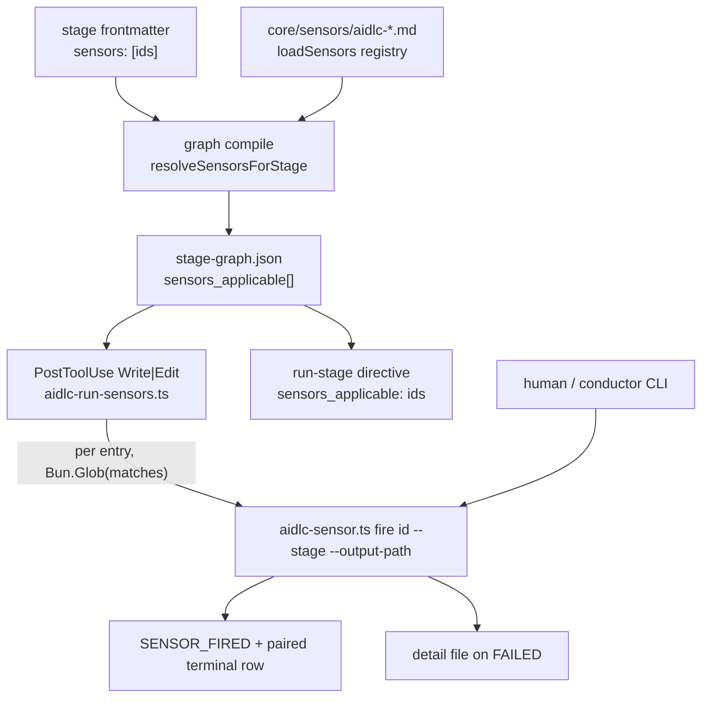

# センサーシステム: 決定的検証マニフェスト

> **Source**: [awslabs/aidlc-workflows](https://github.com/awslabs/aidlc-workflows) — branch `v2`, commit `3c3146cf` (v2.6.40, retrieved 2026-08-21)
> **Status**: 実装から導出したas-built仕様である。upstream のコードが本文書に優先する。
> **正本**: 英語版 `06-sensors.md`(この日本語版は参照訳。両者が食い違う場合は英語版が優先)

---

## 1. スコープとシステム内の位置づけ

**センサー(sensor)** とは、エージェントが直前に書き込んだファイルに対して走る、決定的で非LLMなチェックである。センサーは何も決定しない。出荷済みのマニフェストはすべて `default_severity: advisory` を宣言しており、ディスパッチャCLIはセンサー判定にかかわらず常に exit 0 を返し、PostToolUse フックも常に 0 を返す。センサーの唯一の永続的な成果物は、監査行のペアと、失敗時の Markdown 詳細ファイルである。プラグインセンサー `aidlc-coverage-threshold.md:31-33` は、この設計上の立場を逐語でこう述べている。

> "The framework has no blocking sensor severity yet, so a `SENSOR_FAILED` here is
> REPORTED, not enforced."
> (訳: フレームワークにはまだブロッキングのセンサー重大度がないため、ここでの `SENSOR_FAILED` はREPORT(報告)されるだけで、強制(enforce)はされない。)

フレームワークは**6個**のセンサーマニフェストと、それに対応する6個のワーカースクリプトを出荷している。本文書はマニフェストのスキーマ、2つのディスパッチ経路、各センサーの入力契約と失敗分類、発行される監査イベント、そしてフォークやプラグインが7個目のセンサーを追加する方法を規定する。

他の文書が扱う隣接する主題: コンパイル済みステージグラフとディレクティブの発行は `02-orchestration-engine.md`、監査シャードのファイル形式とイベント一覧は `03-state-audit-runtime.md`、`## Sensors` ステージ本文コンパートメントと §13 学習儀式は `04-stage-protocol.md` および `08-memory-rules-learnings.md`、ハーネスごとの PostToolUse フック配線は `07-hooks.md`、CLI サーフェスは `09-cli-tools.md`、プラグイン合成は `11-plugin-system.md` にある。

---

## 2. マニフェストスキーマ

### 2.1 ファイルの配置と命名

マニフェストは YAML フロントマターを持つ Markdown ファイルであり、ハーネスの sensors ディレクトリ配下に置かれ、`sensorsDir()` によって解決される。

```text
core/tools/aidlc-graph.ts:376-380
  return process.env.AIDLC_SENSORS_DIR ?? resolveHarnessPath(["sensors"]);
```

`AIDLC_SENSORS_DIR` は再配置/テスト用のシームである。ディスカバリは**フラットな** `readdirSync(...).sort()` スキャンであり、`SENSOR_FILE_REGEX = /^aidlc-([a-z][a-z0-9-]*)\.md$/`(`core/tools/aidlc-graph.ts:710`)にマッチするベース名だけがインデックスされる。それ以外 — サブディレクトリ、`aidlc-` プレフィックス欠落、大文字を含む id — は無音でスキップされる(`core/tools/aidlc-graph.ts:725-727`)。このソートこそが、正準 JSON エミッタが依拠する決定性契約である。

### 2.2 フィールド

`SensorManifest`(`core/tools/aidlc-sensor-schema.ts:30-41`):

| Field | Required | Type / accepted values | Consumed by |
| --- | --- | --- | --- |
| `id` | yes | 非空文字列。ファイル名の `aidlc-` 以降のstem(語幹)と一致していなければならない | レジストリキー、ディスパッチャ `fire <id>`、ステージ `sensors:` インポート |
| `kind` | yes | リテラル `"deterministic"`(唯一許容される値) | スキーマ検証のみ |
| `command` | yes | 非空文字列。`.ts` トークンを含んでいなければならない | `resolveScriptPath` が**ベース名のみ**を抽出する |
| `default_severity` | yes | リテラル `"advisory"`(唯一許容される値) | スキーマ検証のみ |
| `description` | yes | 非空文字列 | `sensor list` / `sensor describe` の出力 |
| `category` | no | 自由形式の文字列 | 表示専用。どのディスパッチ分岐もこれを読まない |
| `input_schema` | no | オブジェクト | 文書化専用 — 一切パースされない(`scalarField` はスカラーしか読まない) |
| `output_schema` | no | オブジェクト | 文書化専用 — 一切パースされない |
| `timeout_seconds` | no | 整数 | spawn タイムアウト。既定 60(`aidlc-sensor.ts:66`) |
| `matches` | no | 非空文字列のglob | **唯一の**発火フィルター。グラフにスナップショットされる |

`REQUIRED_FIELDS` はリテラルな5要素配列 `["id","kind","command","default_severity","description"]` である(`core/tools/aidlc-sensor-schema.ts:43-49`)。

未知のキーは前方互換性のために許容される。`parseSensorManifest` は `scalarField` 経由で固定集合のスカラーだけを読み、それ以外は無視する(`core/tools/aidlc-sensor-schema.ts:54-94`)。UTF-8 BOM はフロントマターのマッチングの前に取り除かれるため、BOMを付与するエディタがマニフェストを無音で壊すことはない(`:55`)。したがって `input_schema` / `output_schema` は*散文の契約*であって、強制されるものではない — §5.7 に、ある出荷済みマニフェストの `output_schema` がそのワーカーの実際のJSONと食い違っているケースを示す。

### 2.3 検証エラー(逐語)

`validateSensorManifest` は最初の違反で `"<file>: <message>"` をスローする。このプレフィックスは、それ自身の各スロー箇所に焼き込まれている(`core/tools/aidlc-sensor-schema.ts:142-183`、ヘルパーは `:101-130`)。下表のフロントマター行だけは例外で、これは一段階前の `parseSensorManifest`(`:54-59`)によって**素の状態で**スローされ、呼び出し元 `loadSensors`(`` throw new Error(`${filePath}: ${errorMessage(err)}`) ``、`core/tools/aidlc-graph.ts:736-738`)がプレフィックス `"<file>: "` を付与する。`validateSensorManifest` の呼び出しはその `try` の外にある(`:752`)ため、そのメッセージが二重にプレフィックスされることはない。

| Condition | Message |
| --- | --- |
| `---...---` フロントマターがない(`parseSensorManifest` がスロー) | `Sensor manifest missing YAML frontmatter (---...---)`(`:58`) |
| 必須フィールドが欠落 | `missing required field: <field>`(`:157`) |
| `id`/`command`/`description` が空 | `<field> must be a non-empty string`(`:109`) |
| `matches` が存在するが空 | `matches must be a non-empty string when present`(`:108-109`) |
| `id` がファイル名stemと不一致 | `id "<id>" must match filename stem "<stem>" (file should be aidlc-<id>.md)`(`:163-167`) |
| `kind` が `deterministic` でない | `kind must be "deterministic" (got "<v>"); other kinds reserved for future releases`(`:127`、`:169-175`) |
| `default_severity` が `advisory` でない | `default_severity must be "advisory" (got "<v>")`(`:127`、`:177`) |

同じ `id` を名乗る2つのマニフェストがある場合、ファイルごとの検証より前のロード時点で失敗するため、下流のミスマッチとしてではなく、この重複自体が名指しされる(`core/tools/aidlc-graph.ts:744-750`)。

> `<file>: duplicate sensor id "<id>" — also declared in <other>. Rename one of them.`

### 2.4 カテゴリ

`category` はディスパッチ上の意味を持たない自由なグルーピングラベルである。出荷済み6マニフェストは4つの値を使っている。

| Category | Sensors |
| --- | --- |
| `document-shape` | `required-sections`, `upstream-coverage` |
| `document-provenance` | `claim-sources` |
| `document-traceability` | `traceability` |
| `code-quality` | `linter`, `type-check` |

### 2.5 アドバイザリ vs ブロッキング

コード上にブロッキング経路は一切存在しない。具体的には以下の通り。

- 出荷済みマニフェストはすべて `default_severity: advisory` を宣言しており、スキーマは他の値をすべて拒否する(`aidlc-sensor-schema.ts:177`)。
- ディスパッチャは終端の行を発行した後 exit 0 する(`aidlc-sensor.ts:556`)。そのヘッダは "CLI exits non-zero ONLY on dispatcher invocation errors"(訳: CLIが非ゼロ終了するのはディスパッチャ自身の起動エラーの場合**のみ**)と述べている(`:29-31`)。
- PostToolUse フックが宣言する契約は "Exit-code contract (G5): always exit 0. … Blocking semantics defer to the future ralph driver"(訳: 終了コード契約(G5): 常にexit 0とする。…ブロッキングの意味論は将来の ralph ドライバに委ねる)である(`core/hooks/aidlc-run-sensors.ts:15-18`)。
- どのエンジンやstateコードもセンサー判定を読まない。`aidlc-orchestrate.ts` 内の `sensor` への参照は `:2007` のコメントと `:2069` のディレクティブフィールド投影(`sensors_applicable: (node.sensors_applicable ?? []).map((s) => s.id)`)だけである。`aidlc-state.ts` には一件も存在しない。

一部のマニフェストやステージ本文に見られる「ブロッキング」という言葉は、機械的な強制ではなく、*人間*ゲートについての願望的な散文である。`aidlc-required-sections.md:34-36` は、不正な `units:` エッジブロックが「fails the sensor at the gate so the malformed block never reaches the compiler」(訳: ゲートでセンサーを失敗させ、不正なブロックがコンパイラに到達しないようにする)と述べているが、機械的にはこのセンサーは `pass:false` をセットするだけで、`SENSOR_FAILED` 行が記録され、承認ゲートの人間が判断を下す。

---

## 3. ディスパッチモデル

### 3.1 コンパイル時解決 — `sensors_applicable`

ステージとセンサーの関係は**ステージ側でプル式に**著述される。ステージのフロントマターが `sensors: [<id>, ...]` を持ち、マニフェスト側は決してステージ名を持たない(`core/tools/aidlc-sensor-schema.ts:6-9`)。グラフのコンパイル時、`resolveSensorsForStage` は宣言された各 id をマニフェストレジストリで引き、マニフェストの `matches` をそのまま `SensorResolution` 行へコピーし(`core/tools/aidlc-graph.ts:768-790`)、それをノードへ割り当てる(`core/tools/aidlc-graph.ts:1873-1875`)。

```ts
// core/tools/aidlc-graph.ts:128-132
export interface SensorResolution { id: string; path: string; matches?: string }
```

未知の id は**発火時の無音な no-op ではなく**、コンパイル時の**声高な失敗**になる(`core/tools/aidlc-graph.ts:778-781`)。

> `Stage "<slug>" imports unknown sensor id "<id>". Known ids: <sorted list>`

`sensors_applicable` は固定済みの `FIELD_ORDER` の一部であるため(`core/tools/aidlc-graph.ts:477`)、`stage-graph.json` へラウンドトリップし、PostToolUse フックは実行時にマニフェストを再度開くことがない — これは進行中のワークフローに対する BGP 安定性不変条件である(`core/tools/aidlc-graph.ts:696-700`)。

ステージグラフからフック、そしてディスパッチャへのファンアウト:



テキストによる代替表現: ステージのフロントマターがセンサー id を宣言する。コンパイルはそれらをマニフェストレジストリと突き合わせ、`sensors_applicable` を `stage-graph.json` に焼き込む。PostToolUse フックと run-stage ディレクティブの両方がこの焼き込まれた配列を読む。フックはグロブでフィルターしディスパッチャを起動し、ディスパッチャは1本の `SENSOR_FIRED` 行と、対になる終端行をちょうど1本発行し、判定が失敗した場合には詳細ファイルも書き出す。

### 3.2 経路A — PostToolUse フック

`core/hooks/aidlc-run-sensors.ts` は `Write|Edit` マッチャに、監査ログフックと並んで登録されている(`harness/claude/settings.json:113-125`)。Claude以外のハーネスアダプタも同じコアフックへ転送する(例: `harness/codex/hooks/aidlc-codex-adapter.ts:363`、`harness/kiro/hooks/aidlc-kiro-adapter.ts:906`)。

順序付けられたガードは、いずれも 0 を返す。

| Step | Guard | Line |
| --- | --- | --- |
| 2 | `process.stdin.isTTY` → return | `:59` |
| 3 | stdin が有効な `ClaudeCodeHookInput` JSON でない → return | `:66-72` |
| 4 | `tool_input.file_path` がない → return | `:78-79` |
| 5 | 再帰防止ガード: パスが `<record>/.aidlc-sensors/`(または旧称の `aidlc-docs/.aidlc-sensors/`)内 → return | `:89-98` |
| 6 | 監査ファイルがない → return(初期化前) | `:102` |
| 7 | `aidlc-state.md` がない/読めない → return | `:110-117` |
| 8 | ハートビート書き込み `hooks-health/run-sensors.last` | `:127-132` |
| 8b | 一度限りの stderr バナー、`.first-fired` マーカー | `:141-153` |
| 9 | アクティブステージ = アクティブディレクティブのマーカー `?? Current Stage`。`none`/空 → return | `:160-163` |
| 10 | `loadGraph()` がスローするか slug が不在 → return | `:169-185` |
| 10b | `sensors_applicable` が空 → return | `:189-190` |
| 11 | 各エントリごとに: `if (!entry.matches) continue;` の後 `new Bun.Glob(entry.matches).match(filePath)` | `:202-205` |

`matches` フィルターは重要な意味を持つ。**`matches` グロブを持たないエントリは決して発火しない**(`:194-195`、"G1 lock-in: matches IS the filter")。出荷済み6マニフェストはすべて `matches` を宣言しているため、6個すべてが到達可能である。

Step 9 のマーカー優先の解決には理由がある。unit-major な実行では、`Current Stage` がまだ最初のブロックステージを指したまま、後続のステージが実行中である場合がある。stale だったりプラグインでフィルターされたグラフに存在しないステージを名指すマーカーは、ディスパッチをすべて抑制するのではなく `Current Stage` へフォールバックする(`:174-179`)。

ディスパッチはディスパッチャの同期的な `spawnSync` であり — ワーカースクリプト自体ではない — 既定は 90秒のサブプロセス上限で `AIDLC_SENSOR_TIMEOUT_MS` により上書き可能(`:49-50`、`:220-236`)。フックは `--stage` と `--output-path` のみを渡し、それ以外のスレッディングはすべてディスパッチャが担う(`:212-218`)。フックレベルの失敗は `recordHookDrop(projectDir, "run-sensors", …)` を通じて記録され、`--doctor` が表面化させる。分類はタイムアウト(`ETIMEDOUT` **または** `SIGTERM`、先にチェックされる)、spawn エラー、`dispatcher exit <n>` のいずれかである(`:249-271`)。

このパスには2つの glob エンジンが存在する。フック側の `Bun.Glob` と、ディスパッチャ独自の `globToRegex`(`aidlc-sensor.ts:858-879`)である。フックのコメントには、`.../**/*.md` の形式ではなく緩めた `**/{aidlc-docs,intents}/**` 形式が選ばれているのは「both engines agree on the relaxed form」(訳: 両エンジンがこの緩めた形で一致するため)であると記録されている — ディスパッチャのマッチャは、Bun.Glob が受け付ける `*.md` 形式を拒否する(`:196-200`)。

### 3.3 経路B — 手動 `fire`

`bun <harness>/tools/aidlc-sensor.ts fire <id> --stage <slug> --output-path <path>` が人間/コンダクター用のエントリーポイントである。ディスパッチャは `list`、`describe <id>`、`fire` の3つのサブコマンドを公開している(`aidlc-sensor.ts:909-918`)。

`fire` は自らも `matches` フィルターを再適用する。これは「a human-callable invocation can't bypass the shape contract」(訳: 人間が呼び出せる経路であっても形式契約を迂回できない)ようにするためである(`:374-383`)。その事前発行検証は、順に、いずれも監査行が書かれる**前に** exit 1 する。

| Check | Message | Line |
| --- | --- | --- |
| 位置引数の id が欠落 | `fire requires a sensor id as first positional arg` | `:325` |
| `--stage` が欠落 | `fire requires --stage <slug>` | `:328` |
| `--output-path` が欠落 | `fire requires --output-path <path>` | `:330` |
| 未知の id | `unknown sensor id: "<id>". Known ids: <sorted>` | `:350` |
| 未知の stage | `unknown stage slug: "<slug>". Known (first 10): <…>` | `:364-366` |
| パスが存在しない | `output path does not exist: <path>` | `:371` |
| glob拒否 | `output path "<p>" does not match sensor "<id>" filter "<glob>"` | `:380-382` |
| ワーカースクリプトが存在しない | `per-sensor script missing on disk: <path>` | `:479` |

すべて stderr 上で `aidlc-sensor:` のプレフィックスが付く(`:125`)。発行の前にグラフを解決するのは意図的である("orphan-FIRED prevention")。壊れたステージファイルは `loadGraph()` をスローさせ、プロセスは `SENSOR_FIRED` 行を一切残さず exit 1 する(`:353-355`)。

`list` はアルファベット順で `id\tkind\tdescription` を出力する(`:193-204`)。`describe` は各存在するマニフェストフィールドとレジストリの `path` を出力する(`:208-231`)。引数パースは、値が欠落しているか値自体がフラグであるフラグを拒否する(`:106-122`)。

### 3.4 引数のスレッディング — ディスパッチャが付け足すもの

ワーカースクリプトはグラフのことを知らない。ディスパッチャが `GraphStage` を保持し、それに由来するすべてをスレッディングする(`:392-469`)。

| Sensor | ディスパッチャが渡すフラグ |
| --- | --- |
| `linter`, `type-check` | `--stage <slug> --file-path <abs path>`(`:403-407`) |
| それ以外全id | `--stage <slug> --output-path <abs path>`(`:408`) |
| `upstream-coverage` | `+ --consumes "art:producer,art:producer,…"`(`:410-420`) |
| `upstream-coverage`, `claim-sources` | `+ --deliverables "<stem>,<stem>,…"`(`:425-433`) |
| `required-sections` | `+ --templates-dir <dir> --template-eligible <stems> --framework-templates-dir <dir>`(`:452-469`) |

`--output-path` はディスパッチャの起動時 cwd を基準に絶対パスへ解決される。ワーカーは `cwd: projectDir` で実行されるため、相対パスのままだと2つの異なるファイルを指してしまうからである(`:334-343`)。

**consume の存在フィルタリング。** `presentConsumes` は、成果物がディスク上に存在しない consume をすべて除外する(`:294-304`)。これは、その consume を生成するステージがスコープによってスキップされた場合、「demanding the output prose reference it is a guaranteed false SENSOR_FAILED on every run of that stage in that scope」(訳: 出力の散文にそれを参照させることを要求すれば、そのスコープでそのステージを実行するたびに確実に偽の SENSOR_FAILED になる)ためである(`:239-240`。同じ理由が呼び出し箇所でも繰り返される、`:398-402`)。存在確認はプロデューサーのディレクトリ配下で解決される。codekb プロデューサーはスペースレベルの codekb ルート配下の全リポジトリディレクトリをグロブする(`KNOWN_CODEKB_STAGES` は単一要素の集合 `{"reverse-engineering"}`、`:257-259`)。`for_each: unit-of-work` プロデューサーは `<record>/construction/<unit>/<slug>/` すべてをグロブする。それ以外は `<record>/<phase>/<slug>/<name>.md` を解決する(`:261-292`)。この処理は**開いた**方向へ失敗する。`recordDir` が null のときはリスト全体が無変更でスレッディングされ、グラフのどこにもプロデューサーを持たない孤児 consume も無変更でスレッディングされる。これによってグラフの欠陥が `--doctor` に対して可視のままになる(`:250-255`、`:294-304` — `recordDir` が null の分岐は `:295`、孤児の分岐は `:297-298`)。生き残った各slugはその後 `consumeWithProducer` によって `artifact:producer-stage` の形に書き換えられる(`:311-314`)。

**deliverable のスレッディング。** `templateEligibleArtifacts` が共有フィルターである(`core/tools/aidlc-graph.ts:846-854`)。この関数自体は1つの配列を受け取り、サフィックスのルールだけを適用する — `-questions` または `-timestamp` で終わる名前(および非文字列や空エントリ)をすべて除外する。`produces` と `optional_produces` の和集合は、ディスパッチャの2つの呼び出し箇所 — deliverables のアーム(`aidlc-sensor.ts:428-431`)と required-sections のアーム(`:456-459`)— でそれぞれ両配列を展開して構築される。このフィルターがグラフモジュールに置かれているのは、まさにディスパッチャとフックがディスパッチャをインポートせずに(そのトップレベル `main()` はインポート時に実行されてしまうため)同一の結果を導出できるようにするためである。

### 3.5 発火トランザクション

`handleFire` は監査ロックをちょうど2つの短い区間だけ保持し、spawn をまたいでは決して保持しない(`aidlc-sensor.ts:10-17`)。

1. 解決 + 検証 + 8桁16進の fire id を生成(`randomBytes(4).toString("hex")`、`:187-189`) — ロックなし。
2. ロック → `SENSOR_FIRED` を発行 → アンロック(`:497-508`)。
3. `spawnSync` でワーカーを実行、`timeout: timeoutMs, cwd: projectDir`(`:512-526`) — ロックなし。
4. 真理値表による分類(`:530`)。
5. FAILED の場合、詳細ファイルをレースフリーに書き込む: `writeFileSync(tmp, …, { flag: "wx" })` の後 `renameSync`(`:534-539`)。
6. ロック → 終端行を発行 → アンロック(`:551-553`)。
7. `process.exit(0)`(`:556`)。

詳細ファイルの書き込み失敗はこのペアを失わせない — 判定は `Note: script-error: detail-write-failed: <msg>` を伴って PASSED に降格される(`:540-547`)。

spawn の形式はパッケージングの方法によって異なる(`:512-521`)。id が `BUNDLED_SENSOR_IDS` に含まれるコンパイル済みシングルファイル実行ファイルは `<exe> __sensor-script <id> …` を実行する。それ以外のコンパイル済み実行ファイルは `<exe> __sensor-script-file <id> …` を実行する。そのどちらでもない場合は `[process.execPath, <scriptAbsPath>, …]`。`resolveScriptPath` は `command:` の最初の `.ts` トークンの**ベース名**を取り、それを `AIDLC_SENSOR_SCRIPT_DIR ?? (compiled ? <harness>/tools : __FILE_DIR)` に結合する(`:144-159`) — したがってマニフェストの `command:` のパスプレフィックスは飾りに過ぎず、ベース名のみが経路を決める。

### 3.6 判定の真理値表

分岐の順序は明確に意味を持つ。分岐 **a** は分岐 **0** より前に評価されなければならない。なぜなら Node 16以降ではタイムアウト時に `signal === "SIGTERM"` と同時に `result.error` がセットされるため、これらの順序を逆にすると分岐 a がデッドコードになるからである(`:573-578`)。

| # | Condition | Outcome | Note / fields |
| --- | --- | --- | --- |
| a | `signal === "SIGTERM"` **かつ** `elapsed ≥ timeout − 100 ms` | `SENSOR_BUDGET_OVERRIDE` | `Cap layer: registry`、`Cap value`、`Observed value`(`:587-598`、`:814-821`) |
| 0 | `error` がセット **かつ** `status === null` **かつ** `signal === null` | `SENSOR_PASSED` | `script-error: spawn-failed: <errno code or "unknown">`(`:600-608`) |
| b | `status === 127` | `SENSOR_PASSED` | `tool-unavailable`(`:610-617`) |
| c | `status === 0`、JSON `pass === false` | `SENSOR_FAILED` | 詳細ファイル + `Findings count`(`:642-661`) |
| d | `status === 0`、JSON `pass === true` | `SENSOR_PASSED` | (注記なし)(`:662-663`) |
| f | `status === 0`、JSON がパース不能または `pass` がbooleanでない | `SENSOR_PASSED` | `script-error: bad-output`(`:628-641`) |
| e1 | タイムアウト窓の前に `SIGTERM` | `SENSOR_PASSED` | `script-error: external-sigterm`(`:668-677`) |
| e2 | それ以外の非ゼロステータス | `SENSOR_PASSED` | `script-error: exit-<n>`(`:678-684`) |
| e3 | SIGTERM以外のシグナル(SIGKILL/SIGINT/…) | `SENSOR_PASSED` | `script-error: signal-<SIG>`(`:688-694`) |
| — | 到達不能な既定 | `SENSOR_PASSED` | `script-error: unknown`(`:696-701`) |

猶予定数は `DEFAULT_TIMEOUT_GRACE_MS = 100`(`:71`)であり、タイムアウトによる SIGTERM を外部からのキルと区別するために固定されている。マニフェストが `timeout_seconds` を省略した場合の既定予算は `DEFAULT_TIMEOUT_SECONDS = 60`(`:66`、`:481-483`)である。

ワーカーの stdout は `JSON.parse` の前に `stripStdoutNoise(stdout, "{")` を通される — 最初の `{` までスライスすることで、ペイロードの前にあるパッケージマネージャの実行バナーが判定を無音で `script-error: bad-output` に潰してしまわないようにしている(`:568-571`、`:627`)。linter ワーカー内の同等のヘルパーは `[` までスライスする(`aidlc-sensor-linter.ts:302-305`)。

`findings_count` はワーカーのJSONから**汎用的に**読み取られ、floor(切り捨て)され、それを省略するフォークセンサーに対しては 0 が既定値になる — ディスパッチャは意図的にセンサーごとの分岐を持たない(`:704-722`)。

---

## 4. 監査との連携

4つのイベント名がすべて `VALID_EVENT_TYPES` 集合に含まれ(`core/tools/aidlc-audit.ts:39-189`、4つのセンサーエントリは `:170-173`)、`EVENT_HEADINGS` に人間向け見出しを持つ(`:192`、4つは `:265-268`)。

| Event | Heading | Emitter |
| --- | --- | --- |
| `SENSOR_FIRED` | `Sensor Fired` | `aidlc-sensor.ts:499` |
| `SENSOR_PASSED` | `Sensor Passed` | `aidlc-sensor.ts:799` |
| `SENSOR_FAILED` | `Sensor Failed` | `aidlc-sensor.ts:811` |
| `SENSOR_BUDGET_OVERRIDE` | `Sensor Budget Override` | `aidlc-sensor.ts:821` |

5つ目のイベント `SENSOR_PROPOSED` / `Sensor Proposed`(`aidlc-audit.ts:179`、`:272`)は、新しいマニフェストがスキャフォールドされたとき §13 学習ゲートによって発行される — §7 を参照。

ブロックは `renderAuditBlock` によって `## <heading>` / `**Timestamp**` / `**Event**` / フィールドごとに1行の `**Key**: value`、末尾を `---` で終端する形にレンダリングされる。値中のすべてのJS行終端文字は `\n` へエスケープされるため、値が2つ目のフィールド行やイベント行を偽造することはできない(`core/tools/aidlc-audit.ts:485-503`)。

フィールド集合:

| Event | Fields |
| --- | --- |
| `SENSOR_FIRED` | `Fire id`、`Sensor ID`、`Stage slug`、`Output path`(`:499-506`) |
| `SENSOR_PASSED` | 上記4つの基本フィールド + `Duration ms` + オプションの `Note`(`:791-800`) |
| `SENSOR_FAILED` | 上記4つの基本フィールド + `Detail path` + `Findings count`(`:802-812`) |
| `SENSOR_BUDGET_OVERRIDE` | 上記4つの基本フィールド + `Cap layer`(リテラル `registry`) + `Cap value` + `Observed value`(`:814-821`) |

`Output path` と `Detail path` は `projectDir` に対して相対化されるため、シャードはワークツリーをまたいでも可搬になる。プロジェクト外のパスは逐語のまま発行される(`:755-775`)。

**ペアリングは位置ではなく `Fire id` で行われる。** 単一の Write が複数の並行 fire にファンアウトすることがあり、それらの終端行は spawn の所要時間によって入り交じって届く。そのため `aidlc-runtime.ts` は `Fire id → terminal row` のマップを作り、重複は最新のタイムスタンプで解決する(`core/tools/aidlc-runtime.ts:562-609`)。孤児の `SENSOR_FIRED` は、クローズされたステージウィンドウ内では即座に `incomplete` になるか、あるいは監査の最大タイムスタンプ(**決して** `Date.now()` ではない)を基準にした決定的な60秒のカットオフの後に `incomplete` になる。これにより再コンパイルはバイト等価のまま保たれる(`:566-572`)。`/aidlc-session-cost` スキルは `{ total, passed, failed, budget_override, incomplete }` という集計を表示する(`core/skills/aidlc-session-cost/SKILL.md:70`)。

詳細ファイルは `<record>/.aidlc-sensors/<stage-slug>/<sensor-id>-<fire-id>.md` に書き込まれ(`aidlc-sensor.ts:470-471`。`sensorsDir` は `core/tools/aidlc-lib.ts:6134-6139`)、固定の本文を持つ: H1 見出し `# <sensor-id> finding — <stage-slug>`、太字の `Timestamp` / `Fire id` / `Output path` / `Pass: false` の各行、続いてワーカーの stdout JSON 全体をプリティプリントした ```json フェンスブロックを含む `## Findings` セクション(`aidlc-sensor.ts:726-751`)。

アドバイザリの doctor チェックが1つ、2つのレジストリを結びつける。`frontmatter.pairing` を持つ各ルールについて、`--doctor` は名指された(`aidlc-` プレフィックスを取り除いた)センサー id がいずれかのステージの `sensors_applicable` に現れるかを確認し、`Paired sensor coverage: P/N guardrails paired (X feedforward-only)` を報告する。ミスごとに `unpaired: <rule> → <sensor> (no stage binds it)` を報告する(`core/tools/aidlc-utility.ts:2933-3004`。この2つの文字列は `:2989` と `:2993` にある)。このラベルには成功時のもう1つの形がある。ルールが1件もセンサーを必要としない(`needing === 0`)場合、代わりに `Paired sensor coverage: no sensor-bound rules (X feedforward-only)` と表示される(`:2986-2987`)。ペアリングされていないルールがあっても、このチェックが失敗することは決してない — `unpaired` が空でなくても、成功アームは `{ pass: true, label: coverageLabel }` を push する(`:2997`) — つまりこれは構造的な結合レポートであって、強制ではない。この関数が `pass: false` を出しうる唯一のケースは、`loadRules()` または `loadGraph()` がスローしたときの catch アームで、`Paired sensor coverage: check failed` にエラーメッセージを修正ヒントとして添える(`:2998-3003`)。

---

## 5. センサーごとの仕様

ステージバインディング(出荷済み全33ステージファイルのフロントマター `sensors:` リストより。測定ノート M4 参照):

| Sensor | Stages binding it | Notable stages |
| --- | --- | --- |
| `required-sections` | 30 | 3つの初期化ステージを除く全ステージ |
| `upstream-coverage` | 29 | 初期化ステージと `code-generation` を除く全ステージ |
| `traceability` | 8 | `user-stories`、`domain-design`、`units-generation`、および建設フェーズの5つの設計/コード生成ステージ |
| `type-check` | 7 | 建設フェーズの7ステージ |
| `linter` | 6 | `build-and-test` を除く建設フェーズのステージ |
| `claim-sources` | 1 | `intent-capture` |

3つの初期化ステージは `sensors: []` を宣言しており(例: `core/aidlc-common/stages/initialization/state-init.md:13`)、リゾルバはこれをキー不在の場合と同一に扱う(`core/tools/aidlc-graph.ts:158-163`)。

### 5.1 `required-sections`

- **Manifest**: `core/sensors/aidlc-required-sections.md`。カテゴリ `document-shape`。`matches: "**/{aidlc-docs,intents}/**"`。`timeout_seconds: 5`。
- **Worker**: `core/tools/aidlc-sensor-required-sections.ts`(244行)。
- **Inputs**: `--output-path`(必須)、`--stage`、`--templates-dir`、`--framework-templates-dir`、`--template-eligible <csv>`(`:58-78`)。

**Behaviour.** `.md` でない出力は、いかなる読み込みの前にも静かにパスする。広いレコードツリーのグロブが `traceability.json` のような構造化成果物にもマッチしてしまうためである(`:125-138`)。それ以外の場合、*重複を排し、トリムした* `^##` 見出しを数える(`parseH2Headings`、`:83-94`)。`### Foo` は2文字目が空白でなく `#` であるため除外される(`:150-153`)。汎用の下限は `pass = h2_count >= 2` であり、`findings_count = max(0, 2 - h2_count)` である(`:156-162`)。

**Template-override layer.** 出力ファイル名のstemについて、ワーカーは `<templates-dir>/<stem>.md` を、次いで `<framework-templates-dir>/<stem>.md` を解決し、最初にヒットした方が採用される(`resolveTemplatePath`、`:101-108`)。テンプレートが解決され、かつそのstemがディスパッチャからスレッディングされたeligible集合に含まれる場合、テンプレートの `##` 見出し集合が下限を**置き換える**。判定は `pass` iff `expected ⊆ output` で、欠落している見出しが正確な findings として報告され、`template: "applied"` が付く(`:201-218`)。*eligibleでない*stem(questions/timestamp マーカー)に対してテンプレートが解決した場合、それは無視され、下限がそのまま維持され、`template: "ineligible"` となり、以下の逐語の `config_warning` が発行される。

> `template <stem>.md resolved but artifact "<stem>" is not template-eligible for stage "<slug>" (questions/timestamp markers are excluded); template ignored, keeping the generic >=2-H2 floor.`(`:196-200`)

フレームワークはGA時点で既定テンプレートを**ゼロ個**出荷しているため、tier 2 は通常ミスする。ステージプロトコルはエージェントを同一の解決順序へピン留めしており、それは「the produced shape and the checked shape cannot drift」(訳: 生成される形式とチェックされる形式がドリフトしないようにするため)である(`core/aidlc-common/protocols/stage-protocol.md:881`)。

**Filename-gated extension.** `unit-of-work-dependency.md` に限り、ワーカーはさらに `parseBoltDag(body)` を実行し、`edge_block: "ok" | "absent" | "malformed" | "cyclic"` を報告し、`ok` 以外に対しては findings を1件追加して `pass:false` を強制する(`:228-236`)。この理由の語彙は `parseBoltDag`(`core/tools/aidlc-lib.ts:10403-10449`)からそのまま来ている。`absent` は「no fenced ```yaml units: block found」、`malformed` はパースのスロー・エントリ0件・重複ユニット名・自己依存・未知の依存のいずれか、`cyclic` は「dependency cycle detected」。このチェックはテンプレート分岐とは直交しており、テンプレートが解決している場合でも変わらず適用される。

**Hard errors**(exit 1 → ディスパッチャの分岐e)。いずれも `aidlc-sensor-required-sections:` プレフィックスが付く: `--output-path is required`、`--output-path not found: <p>`、`failed to read --output-path <p>: <e>`、`failed to read template <p>: <e>`(`:110-113`、`:118-147`、`:206-208`)。

### 5.2 `upstream-coverage`

- **Manifest**: `core/sensors/aidlc-upstream-coverage.md`。`document-shape`。`matches: "**/{aidlc-docs,intents}/**"`。`timeout_seconds: 5`。
- **Worker**: `core/tools/aidlc-sensor-upstream-coverage.ts`(224行)。
- **Inputs**: `--output-path`、`--stage`、`--consumes`、`--deliverables`(`:27-45`)。

**Contract.** カバレッジは各ファイルではなくステージの出力全体の性質である(`:124-137`)。スキャン対象の本文は、スレッディングされた deliverable stems について存在する各 `<dir>/<stem>.md` の連結に、発火したファイル自身を加えたもの — ただしそれがスキャフォールディング(`memory.md`、`*-questions.md`、`*-timestamp.md`)である場合を**除く**(`:145-162`)。`--deliverables` がない場合、発火したファイルのみが読まれる。読み込めない兄弟ファイルはスキップされる。読み込めない*発火した*ファイルのみがハードエラーになる(`:166-177`)。

consume がカバーされているとみなされるのは、統合された本文が以下のいずれかにマッチする場合である。

- `slugPattern` — ハイフンを考慮したルックアラウンドアンカー `(?<![\w-])<slug>(?![\w-])` を持つ裸のslug、加えて明示的な `\[\[<slug>\]\]` wikilink 代替形式。大文字小文字を区別しない(`:63-66`)。このアンカーがあるため、`nfr-requirements` に含まれる `requirements` はカウントされないが、`` `<slug>.md` `` や `[[<slug>]]` はカウントされる(バッククォート、`[`、`.`、`]` はいずれも `[\w-]` の外だからである)。
- `producerDirPattern` — プロデューシングステージのslugをパスセグメント全体として扱う `(?<![\w-])<producer>(?=/)|(?<=/)<producer>(?![\w-])`(`:74-77`)。したがって `nfr-requirements/` を引用する1つの provenance ヘッダが、そのステージが生成するすべての成果物をカバーする。

consume エントリは `artifact` または `artifact:producer-stage` としてパースされる。裸の形式は有効なままであり、単にプロデューサーディレクトリの代替形を持たないだけである(`:82-88`)。

**Vacuous passes**(空虚なパス)は偽の失敗ではなく `reason` を伴う。consume リストが空のときの `"no upstream"`(`:111-122`)と、いかなる deliverable も存在する前にスキャフォールディングの書き込みが発火したときの `"no deliverables on disk yet"`(`:185-196`)である。

**Output**: `{pass, consumes[], unreferenced[], scanned_files[], reason?, findings_count}`(`:5-12`、`:212-219`)。`findings_count = unreferenced.length`。

**Hard errors**(プレフィックス `aidlc-sensor-upstream-coverage:`): `--output-path is required`、`--output-path not found: <p>`、`failed to read --output-path <p>: <e>`(`:47-50`、`:93-98`、`:172`)。

### 5.3 `linter`

- **Manifest**: `core/sensors/aidlc-linter.md`。`code-quality`。`matches: "**/*.{ts,js}"`。`timeout_seconds: 30`。
- **Worker**: `core/tools/aidlc-sensor-linter.ts`(383行)。
- **Inputs**: `--stage`、`--file-path`。両方必須(`:88-114`)。

`bunx eslint@10 --format json --max-warnings=-1 <path>` をラップしており、cwd は対象ファイルの最も近い `package.json` の祖先ディレクトリに設定される — その後は eslint 自身のディスカバリが legacy な cascading 設定と flat config の両方を処理する(`:126-138`、`:273-291`)。バージョン指定は定数 `ESLINT_SPEC = "eslint@10"` に固定されている(`:155`)。これは、裸の `bunx eslint` がPATH上にある任意の `eslint`(Ubuntu 24.04 は 6.4.0 を出荷している)を優先してしまい、それは `eslint.config.js` を認識できないため、「the sensor quietly degrades every fire to a tool-unavailable PASS - masking real lint findings」(訳: センサーがすべての発火を静かに tool-unavailable PASS へ劣化させ、実際の lint 検出結果を隠してしまう)からである(`:148-149`、ピン留めの理由全体は `:142-154`)。`--max-warnings=-1` を等号形式で渡すことが必要なのは、eslint v10 が裸の `-1` 位置引数を拒否するためである(`:280-284`)。

**Verdict**: `pass = errorCount === 0`。warning はカウントされるが決して失敗にはならない。なぜなら実際の設定は `no-unused-vars: warn` を出荷しており、warning を失敗扱いにすると「emit SENSOR_FAILED on every Write」(訳: Writeのたびに SENSOR_FAILED を発行してしまう)からである(`:34-38`、`:368-378`)。`findings_count = errorCount`。

**Exit-code taxonomy**(ヘッダコメント `:40-43` は 0 / 127 / 1 を列挙しており、下表は exit-2 とファイル不在のパスを加えたもの):

| Exit | Stderr token | Trigger |
| --- | --- | --- |
| 0 | — | JSON `pass` に判定が含まれる |
| 127 | `eslint-unavailable` | `bunx eslint@10 --version` が非ゼロ、またはその他の `--print-config` 失敗が非ゼロ(`:162-172`、`:230-231`) |
| 127 | `no-eslint-config` | `--print-config` の stderr が `/no eslint configuration found/i`、`/could not find config file/i`、`/eslint couldn[’']t find an? eslint\.config/i`、または `/eslint couldn[’']t find a configuration/i` のいずれかにマッチ(`:202-210`) |
| 2 | `config-parse-error: <line>` | 設定ファイルが**存在し**、stderr がパースエラーのパターン(`/parse error/i`、`/syntaxerror/i`、`/unexpected token/i`、`/configuration .* is invalid/i`、あるいは存在チェック付きの `/unable to load/i` / `/failed to load config/i`)にマッチ(`:214-227`) |
| 1 | `eslint-bad-output` | stdout がパース可能な JSON 配列でない(`:349-359`) |
| 1 | `file-path not found: <p>` | 対象が存在しない。eslint のprobeより前にexitする(`:329-332`) |

127と2の使い分けがこのセンサーの重要な意味論である。「設定なし」は静かな tool-unavailable PASS であるのに対し、*壊れた*設定は `script-error: exit-2` として表面化する。「quietly PASSing those as tool-unavailable masks real bugs」(訳: それらを tool-unavailable として静かに PASS させると本当のバグを隠してしまう)からである(`:174-187`)。`configFilePresent` はプロジェクトルート内の10個の候補ファイル名をプローブしてこの区別を行う(`:239-253`)。

### 5.4 `type-check`

- **Manifest**: `core/sensors/aidlc-type-check.md`。`code-quality`。`matches: "**/*.{ts,tsx}"`。`timeout_seconds: 60`。
- **Worker**: `core/tools/aidlc-sensor-type-check.ts`(317行)。
- **Inputs**: `--stage`、`--file-path`。両方必須(`:97-123`)。

最も近い `tsconfig.json` の祖先から `bunx tsc --project <tsconfig> --noEmit --pretty false --incremental --tsBuildInfoFile <path>` をラップする(`:137-147`、`:167-188`)。裸のファイルではなく `--project` を使うのは、`tsc --noEmit foo.ts` が tsconfig を無視して ES3/no-strict の既定値にフォールバックしてしまい、「checked-but-meaningless on any real project」(訳: 実際のプロジェクトでは検査したことになっていない意味のないチェックになる)からである(`:20-25`)。`--pretty false` は行の正規表現を壊してしまうANSI装飾を取り除く。buildinfo はレコードのgitignore済み `.aidlc-sensors/` 配下に置かれるため、決してコミットを汚さない(`:266-277`)。

診断は `PRIMARY_RE = /^(.+?)\((\d+),(\d+)\):\s+error\s+TS\d+:\s+(.+)$/`(`:197`)でパースされる。インデントされた継続行は前のプライマリの `message` に `"\n  "` で連結されて追記される(`:216-219`)。これがないと「Findings count under-reports」(訳: findings count が過少報告される)からである(`:49`、`:196`)。エラーはその後、絶対一致・tsconfig相対一致・サフィックスフォールバックのいずれかによって対象ファイルへポストフィルタされる(`:229-247`)。

**Known limitation, documented in-source**(`:58-62`): 対象ファイルが原因で発生したクロスファイルなエラー(消費者側を壊す削除された export など)は、消費者側のファイルに帰属してしまう。そのため書き込まれたファイル自体には PASS が出る。

**Exit-code taxonomy**(`:64-70`):

| Exit | Stderr token | Trigger |
| --- | --- | --- |
| 0 | — | JSON `pass = errors.length === 0` に判定 |
| 1 | `no-tsconfig-found` | 祖先に tsconfig がない(`:260-263`) |
| 1 | `file-path not found: <p>` | 対象が存在しない(`:254-257`) |
| 127 | `tsc-unavailable` | `bunx tsc --version` が非ゼロ(`:155-165`) |
| `<n>` | — | tsc が非ゼロ終了し、かつどこにもパース済み診断が**ゼロ**(例: TS18003) — 偽の綺麗な PASS ではなく `script-error: exit-<n>` としてディスパッチャへ伝播される(`:290-305`) |

ステータスのゲートはフィルタ後の集合ではなく、プロジェクト全体のパース結果に対して検査される。そのため本物の型エラーが発生している実行であっても、そのエラーが対象ファイルの範囲外であればファイル単位のPASSはクリーンなままである(`:296-302`)。

### 5.5 `traceability` — 詳細解説

- **Manifest**: `core/sensors/aidlc-traceability.md`。`document-traceability`。`matches: "**/traceability.json"`。`timeout_seconds: 5`。
- **Worker**: `core/tools/aidlc-sensor-traceability.ts`(635行)。
- **Inputs**: `--output-path`(必須)、`--stage`(`:66-74`)。

`required-sections`(§5.1)、`upstream-coverage`(§5.2)、`claim-sources`(§5.6)と同様、このセンサーも発火のきっかけとなった書き込みを超えて読み込む。ステージの期待IDセットを定める upstream の成果物ファイルを解決する(`readText`、`:168-174`) — `requirements.md`、`stories.md`、ストーリーマップ(`:294-301`、`:338`、`:401-402`)。発火したパスに限定されるのは `linter` と `type-check` だけであり、その `type-check` でさえ、そのパスへポストフィルタする前にプロジェクト全体の `tsc` を実行する(§5.4)。

**Input document shape.** `upstream_ids: string[]`、`coverage: {id, status, target?}[]`、オプションの `reverse[]`、オプションの `stage` / `unit` 文字列を持つ JSON オブジェクト(`:12-24`)。閉じたステータス集合は `VALID_STATUSES = {"OK","GAP","ORPHAN","Deferred","N/A"}`(`:10`)。実効ステージは `--stage ?? data.stage ?? ""`(`:568`)。

**Shape failures** — それぞれ `pass:false` と `findings_count: 1` を持つ単一findingの結果を返す(`failedResult`、`:85-97`)。

| Message (verbatim) | Line |
| --- | --- |
| `invalid JSON in traceability file` | `:129` |
| `traceability.json must contain a JSON object` | `:131` |
| `upstream_ids must be an array of non-empty strings` | `:135` |
| `coverage must be an array` | `:138` |
| `reverse must be an array when present` | `:141` |
| `stage must be a string when present` | `:151` |
| `unit must be a string when present` | `:154` |
| `<field>[<i>] must be an object` | `:113` |
| `<field>[<i>].id must be a non-empty string` | `:117` |
| `<field>[<i>].status must be a non-empty string` | `:120` |
| `<field>[<i>].target must be a string when present` | `:123` |
| `no coverage entries found in traceability.json` | `:564` |

**Entry-level checks** は `coverage` と `reverse` の両方を横断して行われる(`:575-587`)。未知のステータスは `<field>:<id>: unknown status "<s>"` になる。`GAP` は `gaps` に集約される。`ORPHAN` は `orphans` に集約される。`OK`/`Deferred`/`N/A` で target が空の場合は `<field>:<id>: status <S> requires a non-empty target` になる。宣言された集合とカバーされた集合の集合演算により `missing_from_table`(宣言されているがカバレッジ行を持たないid)が導出され、はぐれた行ごとに `coverage:<id>: id is absent from upstream_ids` が出る(`:589-594`)。

**Upstream resolution**(`resolveUpstream`、`:276-447`)は6つのIDパターン(`ID_PATTERNS`、`:57-64`)にわたる、ステージごとのディスパッチャである: `FR\d+(\.\d+)?`、`NFR\d+`(`.\d` の否定先読み)、`NFR\d+\.\d+`、`US\d+\.\d+`、`AC\d+\.\d+\.\d+`、`BR\d+\.\d+`。

| Stage | Expected-ID source | Fallback |
| --- | --- | --- |
| `user-stories` | `requirements.md` の FR + NFR | — |
| `domain-design` | `stories.md` の US | stories が不在なら `requirements.md` の FR |
| `units-generation` | `stories.md` の US(またはFR)、**加えて** `unit-of-work-story-map.md` の割り当てカバレッジ | — |
| `functional-design` | このユニットにストーリーマップが割り当てるストーリーの AC id | stories/map が不在なら `requirements.md` の FR |
| `nfr-requirements` | `requirements.md` の NFR | — |
| `nfr-design` | このユニットの4つの `nfr-requirements/*-requirements.md` ファイルからの `NFRx.y` | — |
| `infrastructure-design` | このユニットの5つの `nfr-design/*.md` ファイルからの `NFRx.y` | — |
| `code-generation` | ユニットにマップされた AC id + ユニットの `NFRx.y` + `functional-design/rules.md` の BR id | stories が不在なら `requirements.md` の FR + NFR |
| その他すべて | — | `stage "<s>" has no traceability upstream resolver`(`:445`) |

建設フェーズのステージは、出力パスから `/\/construction\/([^/]+)\/[^/]+\/traceability\.json$/`(`:195-199`)によってユニットを導出し、それを Bolt DAG と突き合わせて検証する(`:250-268`)。

**Fail-closed reasons.** 期待セットを解決できない経路はすべて `reason` 文字列をpushし、その reason は `findings_count` にカウントされる(`:618-625`)。したがって upstream が不在であることは空虚なパスではなく失敗になる。理由の語彙は以下の通り。

| Reason (verbatim) | Line |
| --- | --- |
| `cannot resolve the active intent record directory` | `:280` |
| `required upstream artifact is missing: <path>` | `:170` |
| `required upstream artifact is not a file: <path>` | `:171` |
| `cannot read upstream artifact <path>: <e>` | `:174` |
| `<label> contains no traceable IDs: <path>` | `:191` |
| `cannot derive the construction unit from output path: <p>` | `:252` |
| `unit-of-work-dependency.md is <reason>: <detail>` | `:255`, `:307` |
| `unit "<u>" is not declared in unit-of-work-dependency.md` | `:259` |
| `unit-of-work-dependency.md is missing; cannot verify traceability targets` | `:311` |
| `unit-of-work-story-map.md contains no story-to-unit mappings: <path>` | `:246` |
| `no stories in unit-of-work-story-map.md map to unit "<u>"` | `:348` |
| `stories mapped to unit "<u>" contain no acceptance-criterion IDs` | `:360` |
| `required upstream NFR requirement artifacts are missing under <dir>` | `:382` |
| `NFR requirement artifacts for unit "<u>" contain no NFRx.y IDs` | `:383` |
| `required upstream NFR design artifacts are missing under <dir>` | `:396` |
| `NFR design artifacts for unit "<u>" contain no NFRx.y IDs` | `:397` |
| `upstream ID set is empty for unit "<u>"` | `:441` |
| `upstream ID set is empty for stage "<s>"` | `:601` |
| `stage "<s>" has no traceability upstream resolver` | `:445` |
| `traceability sensor failed safely: <e>` | `:634` |

**Target verification**(`verifyTargets`、`:449-538`)は、自己整合的だが虚偽の表を食い止める層である。

- `user-stories` — `OK` の target はすべて少なくとも1つの `USx.y` を含んでいなければならず(`<id>: target must name at least one USx.y ID`)、名指された各ストーリーは `stories.md` に実在しなければならない(`<id>: target <T> is absent from stories.md`)(`:466-472`)。
- `units-generation` — target は宣言済みのユニット名またはその `U<n>` エイリアスでなければならず(`<id>: target "<T>" is not a declared unit`)、そのストーリー→ユニットのペアはストーリーマップに現れていなければならない(`<id>: target "<T>" is not mapped in unit-of-work-story-map.md`)(`:475-488`)。
- `functional-design` — `OK` の target はすべて少なくとも1つの `BRx.y` を含んでいなければならず(`<id>: target must name at least one BRx.y ID`)、それぞれがそのユニットの `rules.md` に実在しなければならず(`<id>: target <T> is absent from rules.md`)、加えて**導出されたorphan**が計算される。`rules.md` 内にあり、いずれのカバレッジ行にも `reverse` エントリにも説明されない BR id はすべて orphan になる。これはマニフェストが「Derives functional-design orphans from `rules.md` rather than trusting only the self-reported `reverse` array」(訳: 自己申告の `reverse` 配列だけを信頼するのではなく、`rules.md` から functional-design の orphan を導出する)と述べている機能である(`:490-510`、`core/sensors/aidlc-traceability.md:36-37`)。
- `code-generation` — `OK` の target はすべて、実在するファイルへのワークスペース相対パスでなければならない: `<id>: target must be a workspace-relative file path`(空、POSIX絶対パス、ドライブ絶対パスのいずれか)、`<id>: target escapes the project directory`(プロジェクトルート外に解決される)、`<id>: target file does not exist: <t>`、`<id>: target file is unreadable: <t>`(`:512-535`)。

**Output**: `{pass, gaps[], orphans[], missing_from_table[], missing_from_upstream_ids[], invalid_entries[], invalid_targets[], findings_count, reason?}`。6配列すべてが `uniqueSorted` される(`:540-542`、`:608-617`)。`findings_count` はそれらの合計に `reasons.length` を加えたもの。`pass = findings_count === 0`。`reason` は重複排除された理由を `"; "` で連結したもの(`:618-627`)。

**Crash safety**: このモジュールは `main()` をトップレベルの try/catch でラップしており、非ゼロで終了するのではなく `failedResult("traceability sensor failed safely: <e>")` を発行する(`:631-635`) — したがって内部的な不具合は `script-error` ではなく `SENSOR_FAILED` 判定として表面化する。

### 5.6 `claim-sources` — 詳細解説

- **Manifest**: `core/sensors/aidlc-claim-sources.md`。`document-provenance`。`matches: "**/{aidlc-docs,intents}/**"`。`timeout_seconds: 5`。
- **Worker**: `core/tools/aidlc-sensor-claim-sources.ts`(1441行 — ツリー内で最大のセンサー実装)。
- **Inputs**: `--output-path`(必須)、`--stage`、`--deliverables`(`:58-71`)。
- **バインド先はちょうど1ステージのみ**: `intent-capture`(`core/aidlc-common/stages/ideation/intent-capture.md:20-21`)。

**Purpose.** Intent Capture の成果物における実質的な主張はすべて、*確認済み(confirmed)*の情報源に解決されるインライン provenance タグを伴わなければならない。マニフェストはこの境界を明示的に引いている: "It validates citation shape and resolution only; the stage's adversarial reviewer judges whether the cited source actually supports the claim"(訳: これは引用の形式と解決だけを検証する。引用された情報源が本当にその主張を裏付けているかは、ステージの敵対的レビュアーが判断する)(`core/sensors/aidlc-claim-sources.md:44-46`)。

**Tag vocabulary**(`SOURCE_TAG_RE`、`:53-54`): `[desc]`、`[scope]`、`[assumption]`、`[Q<n>]`、`[memory:<id>]`。

**The source universe** は姉妹ファイルの `<stage>-questions.md`(既定stemは `intent-capture`、`:1413-1415`)であり、`parseSourceUniverse`(`:359-508`)によって4つの成果物にパースされる: `registered` 情報源id、`answeredQuestions`、`assumptionsAccepted` boolean、`acceptedAssumptions` テキスト集合。登録エントリは `SOURCE_ENTRY_RE = /^ {0,3}[-*+]\s+\[(desc|scope|memory:<id>)\]\s+(.+?)\s*$/`(`:55-56`)にマッチする可視の Markdown リスト項目でなければならない。

**Record authority** は `aidlc-state.md` であり、ステージディレクトリから上へ辿って見つけられる(`:167-175`)。`[desc]` は `Initial description: "<verbatim>"` の形式で、state の `Project` フィールドと完全一致していなければならない。`[scope]` は ``Workflow-selected scope: `<scope>`.`` の形式で `Scope` と完全一致していなければならない(`:412-442`)。`[memory:<id>]` エントリは ``` `aidlc/spaces/<space>/memory/<file>.md#<exact H2>`: "<exact rule>" ``` でなければならず、file は `org.md` / `team.md` / `project.md` のいずれか(`ACTIVE_MEMORY_FILES`、`:45`)、パスはアクティブなmemoryルート内に収まっていなければならず、そのファイルはちょうど1つのそのH2を含み、引用されたルールがその下の可視リストエントリとバイト単位で一致していなければならない(`:269-352`)。

**Register / questions findings**(逐語):

`cannot verify source register: aidlc-state.md was not found`(`:220`) ·
`cannot verify source register: failed to read aidlc-state.md: <e>`(`:229`) ·
`aidlc-state.md is missing Project authority for [desc]`(`:240`) ·
`aidlc-state.md is missing Scope authority for [scope]`(`:242`) ·
`cannot resolve the project root for memory source validation`(`:244`) ·
`cannot resolve the active space for memory source validation`(`:247`) ·
``[<id>] must use `aidlc/spaces/<space>/memory/<file>.md#<exact H2>`: "<exact rule>"``(`:278`) ·
`[<id>] has an invalid quoted rule`(`:286`) ·
`[<id>] path must name a file under the active memory root <prefix>`(`:298`) ·
`[<id>] must name an active memory file under <prefix>: org.md, team.md, or project.md`(`:305`) ·
`[<id>] path escapes the active memory root`(`:316`) ·
`[<id>] memory source does not exist: <path>`(`:320`) ·
`[<id>] failed to read memory source <path>: <e>`(`:329`) ·
`[<id>] memory source must contain exactly one ## <H2> heading`(`:336`) ·
`[<id>] quoted rule does not exactly match an entry under ## <H2>`(`:347`) ·
`questions file missing: <path>`(`:370`) ·
`failed to read questions file <path>: <e>`(`:384`) ·
`questions file is missing ## Sources`(`:397`) ·
`questions file has duplicate ## Sources sections`(`:400`) ·
`duplicate source id [<id>] in ## Sources`(`:407`) ·
`[desc] must use Initial description: "<verbatim project description>"`(`:419`) ·
`[desc] does not exactly match Project in aidlc-state.md`(`:423`) ·
``[scope] must use Workflow-selected scope: `<scope>`.``(`:434`) ·
`[scope] does not exactly match Scope in aidlc-state.md`(`:438`) ·
`## Sources is missing [<desc|scope>]`(`:450`) ·
`duplicate question id Q<n>`(`:463`) ·
`duplicate [Answer]: entries for Q<n>`(`:473`) ·
`questions file has duplicate ## Assumption Confirmation sections`(`:482`) ·
`duplicate [Answer]: entries for Assumption Confirmation`(`:489`)。

質問が回答済みとみなされるのは、その `[Answer]:` 行が非空であり、かつアンダースコアのみではない場合である(`answerIsFilled`、`:354-357`)。

**Per-deliverable findings**(`inspectDeliverable`、`:1288-1369`)。ここで `<loc>` は `<basename> ## <section>` である。

`<file>: missing ## Assumptions & Open Questions`(`:1307`) ·
`<loc>: assumption/open question lacks [assumption]`(`:1321`) ·
`<loc>: retained assumption is not listed in ## Assumption Confirmation`(`:1327`) ·
`<loc>: claim block has no source tag`(`:1332`) ·
`<loc>: [assumption] is outside ## Assumptions & Open Questions`(`:1337`) ·
`<loc>: [Q<n>] has no filled answer`(`:1346`) ·
`<loc>: [<id>] is not registered in ## Sources`(`:1351`) ·
`<loc>: [scope] is valid only in ## Initial Scope Signal`(`:1356`) ·
`<loc>: [scope] claim is not labeled workflow-selected`(`:1361`) ·
そして実行1回につき1回、
`retained assumptions require an answered ## Assumption Confirmation with Accept assumptions`(`:1426`)。
承諾フレーズは定数 `ACCEPT_ASSUMPTIONS_ANSWER = "A. Accept assumptions"`(`:44`)である。

**Claim-block segmentation**(`claimBlocks`、`:527-607`)。ブロックはH2境界、任意のATX見出し、空行、シマティックブレイク、HTMLブロックの開始、リスト項目、テーブル行で切られる。テーブルのヘッダ行とその区切り行は除外され、データ行だけが claim になる(`:537-542`、`:586-596`)。`## Review` のH2配下のコンテンツは完全にスキップされる(`REVIEW_HEADING`、`:43`、`:568`、`:576`) — これがマニフェストの言う「reviewer-added `## Review` content」の除外である。`None`/`None.` だけからなるブロックは、assumptionsセクション内でも claim とはみなされない(`isNoneBlock`、`:523-525`、`:1318`)。

**Visibility model — このワーカーの最も難しい部分。** タグがカウントされるのは、レンダリングされたドキュメント上でそのタグがリテラルなテキストとして表示される場合のみである。段階的なストリッピング:

1. `visibleMarkdownLines` はフェンスコードブロック(バッククォートまたはチルダ、長さ一致するクロージング)を空白にし、行境界をまたぐHTMLコメントを取り除く(`:78-135`)。
2. インラインコードスパンはバッククォートのラン(連続列)によるマッチングで取り除かれる(`:1271`)。
3. `visibleHtmlText` は `code`、`pre`、`script`、`style`、`template` の中身を取り除く(`NON_VISIBLE_HTML_ELEMENTS`、`:46-52`、`:712-736`)。
4. `withoutReferenceDefinitions` はリンク参照定義を取り除く(`:1206-1211`)。
5. `visibleMarkdownLinkText` は、ドキュメントが実際に持っているリンク参照定義に対して**のみ**、角括弧のペアを Markdown リンクとして解決する(`:1213-1268`)。

その帰結は、マニフェストに逐語で述べられている(`aidlc-claim-sources.md:48-58`)。`[Q1][Q2]` のような隣接するタグは2つの可視タグのまま残る。一方、`[Q1]: <url>` も同時に定義しているドキュメント中の `[Q1]` はリンクとなり、何の根拠にもならない。参照定義パーサーはCommonMarkのかなりの部分集合であり、ラベルの正規化、複数行にわたるdestination、titleの継続、blockquoteとリスト項目のコンテナ、thematic break や HTML ブロックによる中断を扱う(`:746-1211`)。マニフェストは、この読み取りが完全な CommonMark に及ばない箇所での失敗の方向を固定している(`aidlc-claim-sources.md:60-63`)。

> "the divergence must land as a false failure and never as a false pass: the
> sensor may ask for a citation the document did not owe, but it must not let
> unsourced or invisible-tag content through."
> (訳: この乖離は偽の失敗として現れなければならず、決して偽のパスとして現れてはならない。センサーはドキュメントが本来必要としていない引用を求めることはあっても、出典のない、あるいは不可視なタグのコンテンツを通過させてはならない。)

**Scan set and vacuous pass.** `--deliverables` がある場合、スキャン対象はステージディレクトリ内に存在するそれらstemの `.md` ファイルである。ない場合、発火したファイル(スキャフォールディングでない限り)。スキャン対象が空の場合、`reason: "no deliverables on disk yet"` を伴う `pass:true` が返る(`:1380-1411`)。

**Output**: `{pass, findings[], scanned_files[], questions_file, findings_count, reason?}`。`pass = findings.length === 0` かつ `findings_count = findings.length`(`:1430-1436`)。

**Hard errors**(プレフィックス `aidlc-sensor-claim-sources:`): `--output-path is required`、`--output-path not found: <p>`(`:73-76`、`:1373-1376`)。

### 5.7 ワーカー出力形状のまとめ

| Sensor | Emitted JSON keys |
| --- | --- |
| `required-sections` | `pass`、`h2_count`、`headings[]`、`findings_count`、`edge_block?`、`template?`、`template_expected?[]`、`template_missing?[]`、`config_warning?` |
| `upstream-coverage` | `pass`、`consumes[]`、`unreferenced[]`、`scanned_files[]`、`reason?`、`findings_count` |
| `linter` | `pass`、`errorCount`、`warningCount`、`violations[]`、`findings_count` |
| `type-check` | `pass`、`errors[]`、`findings_count` |
| `traceability` | `pass`、`gaps[]`、`orphans[]`、`missing_from_table[]`、`missing_from_upstream_ids[]`、`invalid_entries[]`、`invalid_targets[]`、`findings_count`、`reason?` |
| `claim-sources` | `pass`、`findings[]`、`scanned_files[]`、`questions_file`、`findings_count`、`reason?` |

ディスパッチャが読むのは `pass`(boolean)と `findings_count`(number)だけである。それ以外はすべて詳細ファイルのための逐語ペイロードである。

---

## 6. コードと散文の既知の食い違い

実装が正本(authoritative)であるという基本原則に従って、これらを文書化する。

1. **`upstream-coverage` マニフェストの出力キー。** マニフェストは `unreferenced_artifacts: string[]` と宣言しているが(`core/sensors/aidlc-upstream-coverage.md:16`)、ワーカーが発行するのは `unreferenced` である(`core/tools/aidlc-sensor-upstream-coverage.ts:8`、`:215`)。`output_schema` は一切パースされないため何も壊れないが、マニフェスト側の記述は誤りである。同様に `claim-sources` のマニフェストは `reason` キーを宣言していない(`aidlc-claim-sources.md:13-18`)が、ワーカーはそれを発行する(`:17`、`:1407`)。

2. **`SensorResolution` の古い例。** `core/tools/aidlc-graph.ts:124-126` のコメントは、`matches` が省略される例として「required-sections, upstream-coverage」を挙げているが — 現在は両方のマニフェストとも `matches` を宣言している(6個すべてがそうである。測定ノート M3)。フックは `matches` を持たないエントリをスキップするため(`aidlc-run-sensors.ts:203`)、このコメントに沿ったマニフェストがあったとしても決して発火しないことになる。

3. **`## Sensors` 本文コンパートメント。** `stage-definition.md:167` は `## Sensors` を「Reserved, absent」(予約済み・不在)と記録しているが、実際には出荷済みの33ステージファイルすべてが、内容の詰まった `## Sensors` セクションを持っている(測定ノート M5)。

4. **ステージ本文における詳細ファイル名の記述。** 23個のステージファイルは詳細ファイルを `<sensor-id>-<iso>.md`(例: `core/aidlc-common/stages/ideation/approval-handoff.md:120`)と記述しているが、ディスパッチャが実際に書き込むのは8桁16進の fire id を持つ `<sensor-id>-<fire-id>.md` である(`aidlc-sensor.ts:471`)。このパスを記述している3つのセンサーマニフェストは、fire-id 形式を正しく述べている — パスリテラルは `aidlc-linter.md:31`、`aidlc-required-sections.md:67`、`aidlc-type-check.md:32` にあり、それぞれの直後に fire id を8桁16進の `SENSOR_FIRED` 相関子として定義する文が続く。

5. **コンパイル済みバイナリ下の `traceability`。** `BUNDLED_SENSOR_IDS` には `"traceability"` が含まれており(`aidlc-sensor.ts:176-183`)、コンパイル済み実行ファイルはその発火を `<exe> __sensor-script traceability` へ経路づける — しかし `core/tools/aidlc.ts:727-733` の `__sensor-script` マップにはエントリが5個しかなく `traceability` が欠けているため、このエイリアスは `topLevelError` へフォールスルーし、exit 1 になる(`aidlc.ts:573-579`)。`__sensor-script-file` フォールバックも同様に失敗する。対象モジュールが `main(argv)` をexportすることを要求するが(`aidlc.ts:1129-1131`)、traceability ワーカーは `export` なしで `function main(): void` を宣言し、モジュールのトップレベルでそれを呼び出しているからである(`aidlc-sensor-traceability.ts:544`、`:631-635`)。コンパイル済みバイナリでの実質的な影響: traceability の発火はすべて、本物の判定ではなく `Note: script-error: exit-1` を伴う `SENSOR_PASSED` として着地する。`bun` スクリプトによるインストール経路(出荷時の既定)はこの影響を受けない。

6. **`required_sections` ステージフロントマターは不活性である。** ステージスキーマは、オプションの `required_sections: string[]` を受け付け、「named `##` H2 sections a stage's output must contain (plugin contribution mechanism §6)」(訳: ステージの出力が含まなければならない `##` のH2セクション名の集合。プラグイン貢献機構§6)と記述している(`core/tools/aidlc-stage-schema.ts:95-97`、`:176`、`:364-372`)。プラグインの compose フックはこれをコアステージのソースへマージする — このマージ自体は `scripts/plugin-hooks-template/compose.ts` の contributions ブロックであり(`:1436`から。`installedSchemaAccepts("required_sections", …)` によりゲートされる、`:1439`)、`required_sections` / `required_sections_created` はプラグインごとのサイドカーレコードに保持される(`core/tools/aidlc-utility.ts:650-651`。マージを記述するコメントは `:637-638`)。しかし `FIELD_ORDER` には含まれていないため(`core/tools/aidlc-graph.ts:449-478`)、`stage-graph.json` には決して到達せず、どのセンサーやディスパッチャのコードもこれを読まない(測定ノート M8)。機能している見出しオーバーライド経路は §5.1 のテンプレート層である。

7. **マニフェスト中のバージョン記述の散文。** `aidlc-linter.md` と `aidlc-type-check.md` は、v2.6.40 のツリーであるにもかかわらず、いまだに自らを「v0.5.0 defaults」であり、多言語検出は「deferred to v0.6.0+」であると記述している(`:23-24`、`:37-40` および `:23-25`、`:38-41`)。それらが記述している単一言語の挙動そのものは正確であり、バージョンラベルだけが古いままである。

---

## 7. 拡張ポイント — センサーの追加

センサーは**ペア**である: マニフェスト(能力記述子)とワーカースクリプト。ステージへのバインディングは、それとは別の第三の書き込みである。

### 7.1 新しいセンサーが満たすべきルール

1. **Filename↔id.** ファイルはハーネスの `sensors/` ディレクトリ直下に `aidlc-<id>.md` として置かれなければならず、`id:` は `aidlc-` 以降のstemと一致していなければならない。スキャンはフラットのみ — サブディレクトリは不可視である(`aidlc-graph.ts:710`、`:725-727`; `aidlc-sensor-schema.ts:162-167`)。
2. **Frontmatter.** 5つの必須フィールドすべて。`kind: deterministic`。`default_severity: advisory`。この2つのリテラルフィールドに他の値を与えるとスローされる。
3. **`command`.** `.ts` トークンを含んでいなければならない。使われるのはその**ベース名**だけである(`resolveScriptPath`、`aidlc-sensor.ts:144-159`)。もう1つのリゾルバである `resolveSensorScriptPath`(`:161-174`)は、さらにそのベース名がちょうど `aidlc-sensor-<id>.ts` であることを要求するが — これは既定のディスパッチ経路上には**ない**。`handleFire` はチェックなしの `resolveScriptPath` を呼ぶ(`:474`)。`resolveSensorScriptPath` の唯一の呼び出し元は、コンパイル済み実行ファイルの `__sensor-script-file` アーム(`core/tools/aidlc.ts:1117`、`runSensorScriptFile` 内で宣言 `:1105`、ガードは `:1111`)である。出荷時のbunスクリプトインストールでは、別名のワーカーベース名でも解決され実行される。つまり id↔ファイル名 のピン留めは、コンパイル済みバイナリの場合にのみ成立する。とはいえ、それでもこれには合わせておくべきである — 後にバイナリを出荷することになったフォークが、そうでないと壊れてしまうからである。
4. **`matches`.** 実質的に必須である。これがないとPostToolUseフックがそのエントリをスキップする(`aidlc-run-sensors.ts:203`)。両エンジンが受け付ける形式の内側にパターンを収めること: サフィックス + 単一のbrace group。ディスパッチャの `globToRegex` は `**`、`*`、`?` とエスケープのみを扱う(`aidlc-sensor.ts:858-879`)。また `matchesGlob` はちょうど1つの brace group だけを展開する(`:830-844`)。
5. **Worker CLI.** そのidに対してディスパッチャが渡すフラグを受け付けなければならない: id が `linter` または `type-check` の場合は `--stage` と `--file-path`、それ以外の場合は `--stage` と `--output-path`(`aidlc-sensor.ts:403-409`)。追加のスレッディングアーム(`--consumes`、`--deliverables`、`--templates-dir`、`--template-eligible`、`--framework-templates-dir`)はidごとにハードコードされているため、グラフのコンテキストを必要とするフォークセンサーは、ディスパッチャに追加のアームを加える必要がある。
6. **Worker stdout.** stdout に boolean の `pass` を含む単一のJSONオブジェクトを出すこと。`findings_count` も発行すること。さもなければディスパッチャがこれを0に既定化する — ソースはこの省略を、doctor の兄弟カバレッジチェックが表面化させる「a fork-sensor contract gap」(訳: フォークセンサーの契約上の欠落)と呼んでいる(`aidlc-sensor.ts:704-722`)。
7. **Worker exit codes.** 0 = 判定はJSONに含まれる。127 = ツール利用不可(静かなPASS)。それ以外の非ゼロ = アドバイザリの `script-error: exit-<n>`。非ゼロ終了は `SENSOR_PASSED` を生んでしまうため、traceability ワーカーのように安全側に倒して失敗すること(`pass:false` のペイロードを発行する)を推奨する。
8. **Binding.** 対象ステージのフロントマターの `sensors:` リストにidを追記する。ステージプロトコルはこれを「the pull-authoring two-write install」と呼び、フロントマターのこのリストを、そうでなければイミュータブルなステージファイルに対する*唯一の*許可された変更として名指している(`stage-protocol.md:953`、`:1036`)。

### 7.2 3つのインストール経路

**(a) フレームワーク層。** `core/sensors/aidlc-<id>.md` と `core/tools/aidlc-sensor-<id>.ts` を追加する。両方とも、各ハーネスマニフェストの `coreDirs` 配列(例: `harness/claude/manifest.ts:31-44`、2つのエントリは `:32` と `:35`)に `{ src: "tools", dst: "tools" }` と `{ src: "sensors", dst: "sensors" }` の両方が列挙されているため、すべてのハーネスへ到達する。この配列はパッケージャのコピーループが辿る(`scripts/package.ts:551`)。これは `scripts/package.ts:1000` にあるプラグインの `contentDirs` リスト(`buildPluginProjection` 内、`:975`)とは別の機構であり、そちらは経路(b)専用である。コンパイル済みバイナリの場合は、`BUNDLED_SENSOR_IDS`(`aidlc-sensor.ts:176-183`)、`__sensor-script` マップと `TOOLS` テーブル(`aidlc.ts:66-70`、`:727-733`)、プロセス内デリゲートのswitch文(`aidlc.ts:924-933`)にもidを追加すること — これらのいずれかを省略すると、§6.5の traceability の欠落を再現することになる。

**(b) プラグイン層。** `plugins/<name>/sensors/aidlc-<id>.md`(加えて `plugins/<name>/tools/` 配下のワーカー)を出荷する。composeは両方のツリーをno-clobberでコピーする(`scripts/plugin-hooks-template/compose.ts:1433-1434`)。名前ガードは、発見不能なマニフェストが着地する**前に**それを拒否し、セッションを失敗させるのではなく `degraded` な compose レコードを落とす(`:550-594`)。その落とすテキストは `"<base>" lacks the required "aidlc-" prefix` か `it is nested in a subdirectory that the flat sensor scan never reads` のいずれかを名指し、アップグレード時にはガード導入以前から着地していたファイルも監査する(`:577-585`)。ステージバインディングはプラグインの `contributions` から来ており、それがコアステージのソースへ `sensors:` リストをマージし、`plugin-contrib-<key>.json` へ記録する。これによってプラグインを無効化した際にそれを再び取り除くことができる(`compose.ts:1441-1449`; `core/tools/aidlc-utility.ts:637-651`、`:768`)。出荷済みの `test-pro` プラグインが実例である: 2つのマニフェスト(`plugins/test-pro/sensors/aidlc-requirement-coverage.md`、`aidlc-coverage-threshold.md`)と、`sensors:` を宣言する2つのステージ(`plugins/test-pro/stages/construction/test-pro-integration.md:24`、`plugins/test-pro/stages/operation/test-pro-full-suite.md:25`)。

**(c) プロジェクト層(§13学習ゲート経由)。** 人間がステージゲートで"Check:"の形をした学習を受け入れると、`aidlc-learnings.ts persist` が単一の監査ロックトランザクション内で2つの書き込みを行う(`core/tools/aidlc-learnings.ts:871-925`)。

- **Write 1** — `<projectDir>/<harness>/sensors/aidlc-<id>.md`(`:181-183`、`:967-986`)に、選択された `manifest_fields`(必須キーはちょうど `id, kind, command, default_severity, description, matches`、`:433`)からマニフェストをレンダリングする。フレームワークのディストリビューション配下への書き込みは明確に拒否される: `refusing to scaffold a sensor manifest under the framework distribution: <path>`(`:882`)。
- **Write 2** — `bindSensorToStage` が、既存ブロックのインデントに合わせて id を起点ステージのフロントマターへ追記する。`sensors:` ブロックが存在しない場合は、フロントマターの最後のキーとして新規作成する。すでにバインド済みの場合はべき等な no-op の書き換えになる(`:1028-1068`)。
- 続いて `SENSOR_PROPOSED` を、フィールド `Stage`、`Candidate-ID`、`Sensor ID`、`Manifest path`、`Matches`、`Destinations`(JSON配列)、`Source` とともに発行する(`:906-922`)。再提案は `(origin stage, sensor id)` の組で重複排除される。これは先行する `SENSOR_PROPOSED` 行から読み取られ、位置的な候補idではなく安定したマニフェストidをキーとするため、2つの無関係なステージがそれぞれ同じセンサーをバインドすることができる(`:521-548`)。

このマニフェストとバインディングは次のグラフコンパイル時に有効になる — プロトコルの言う「the sensor binds and fires from the next workflow's compile」(訳: センサーは次のワークフローのコンパイルからバインドされ発火する)(`stage-protocol.md:997`)である。`## Sensors` の散文本体は*編集されない* — それはこの1つのフロントマターリストを除いて、フレームワークとしてイミュータブルなまま維持される。

---

## 8. 測定ノート

本文書中のすべての件数を、その正確な述語とともに示す。すべてのコマンドは commit `3c3146cf` の upstream クローンルートから実行した。

- **M1 — sensor manifests = 6.**
  `ls core/sensors | wc -l` → `6`。実行時にも交差検証: `AIDLC_SENSORS_DIR=$PWD/core/sensors bun core/tools/aidlc-sensor.ts list` は6行(`claim-sources`、`linter`、`required-sections`、`traceability`、`type-check`、`upstream-coverage`)を出力した。

- **M2 — per-sensor worker scripts = 6.**
  `ls core/tools | grep '^aidlc-sensor-'` → 7ファイル。うち1つは `aidlc-sensor-schema.ts`(マニフェストスキーマモジュールであり、ワーカーではない)であるため、残り6つがマニフェストid1つにつき1つのワーカーとなる。

- **M3 — all 6 manifests declare `matches`.**
  `grep -c '^matches:' core/sensors/aidlc-claim-sources.md core/sensors/aidlc-linter.md core/sensors/aidlc-required-sections.md core/sensors/aidlc-traceability.md core/sensors/aidlc-type-check.md core/sensors/aidlc-upstream-coverage.md`
  → 6ファイルすべてで `1`。

- **M4 — stage files = 33; per-sensor binding counts.**
  `git ls-files 'core/aidlc-common/stages/*/*.md' | wc -l` → `33`。
  `git grep -ln '^sensors:' -- 'core/aidlc-common/stages/*/*.md' | wc -l` → `33`。
  センサーごとの件数(required-sections 30、upstream-coverage 29、traceability 8、type-check 7、linter 6、claim-sources 1)と §5 のステージごとの表は、その33ファイルそれぞれについてフロントマターブロックを抽出し、`sensors:` 行を特定し、`/^  - (\S+)$/` にマッチする連続する後続行を収集するスクリプトから得た。このスクリプトはステージごとに1行と、JSON集計、`stage files: 33` を出力した。(このスクリプトはリポジトリには含めず、セッションのスクラッチパッドに `sensors_by_stage.ts` として残した。)単純な `git grep -h -A6 '^sensors:'` は、ウィンドウ内に `scopes:` リストが続くため過剰カウントになる — それゆえフロントマターを考慮した抽出が必要である。

- **M5 — stage files carrying a populated `## Sensors` body = 33.**
  `git grep -l '^## Sensors' -- 'core/aidlc-common/stages/*/*.md' | wc -l` → `33`。

- **M6 — stage files describing the detail file as `-<iso>.md` = 23; as `-<fire-id>.md` = 0.**
  `git grep -c -F -- '-<iso>.md' -- 'core/aidlc-common/stages/*/*.md' | wc -l` → `23`。
  `git grep -c -F -- '-<fire-id>.md' -- 'core/aidlc-common/stages/*/*.md' | wc -l` → `0`。
  fire-id形式を用いているマニフェスト:
  `git grep -c -F -- '<fire-id>' -- 'core/sensors/*.md'` → `aidlc-linter.md`、`aidlc-required-sections.md`、`aidlc-type-check.md` にそれぞれ1ヒット。

- **M7 — implementation sizes.**
  `wc -l core/sensors/*.md core/tools/aidlc-sensor*.ts core/hooks/aidlc-run-sensors.ts` →
  マニフェスト 69/40/70/56/41/45(claim-sources / linter / required-sections / traceability / type-check / upstream-coverage)。
  ツール: `aidlc-sensor-claim-sources.ts` 1441、`aidlc-sensor-linter.ts` 383、`aidlc-sensor-required-sections.ts` 244、`aidlc-sensor-schema.ts` 183、`aidlc-sensor-traceability.ts` 635、`aidlc-sensor-type-check.ts` 317、`aidlc-sensor-upstream-coverage.ts` 224、`aidlc-sensor.ts` 927。
  フック: `aidlc-run-sensors.ts` 288。

- **M8 — `required_sections` has no sensor-side consumer.**
  `git grep -rn 'required_sections' -- core | awk -F: '{print $1}' | sort -u` →
  ちょうど3ファイル: `core/tools/aidlc-lib.ts`、`core/tools/aidlc-stage-schema.ts`、`core/tools/aidlc-utility.ts`。`aidlc-sensor*.ts`、`aidlc-graph.ts`、`core/hooks/` のいずれにもヒットなし。

- **M9 — engine/state read no sensor verdict.**
  `git grep -n 'sensor' -- core/tools/aidlc-orchestrate.ts core/tools/aidlc-state.ts`
  → 2ヒット。いずれも `aidlc-orchestrate.ts`(`:2007` のコメント、`:2069` のディレクティブフィールド投影)。`aidlc-state.ts` はゼロヒット。

- **M10 — SENSOR_* emitter sites.**
  `git grep -n 'SENSOR_FIRED\|SENSOR_PASSED\|SENSOR_FAILED\|SENSOR_BUDGET_OVERRIDE' -- 'core/tools/*.ts' 'core/hooks/*.ts'`
  → 宣言は `aidlc-audit.ts:170-173`(`VALID_EVENT_TYPES` 内、`:39` で宣言、`:189` で閉じる)と `:265-268`(`EVENT_HEADINGS` 内、`:192` で宣言)。発行呼び出しは `aidlc-sensor.ts:499`、`:799`、`:811`、`:821` のみ。読み取りは `aidlc-runtime.ts:573-576`。

- **M11 — sensor-related test files = 9 (plus fixtures).**
  `git ls-files 'tests/*' | grep -i sensor` → 76パス。うちテストファイルは9つ: `tests/integration/t49-bolt-sensor-failures.test.ts`、`t95-sensor-fire-hook-feature.test.ts`、および `tests/unit/{t237-linter-sensor-version-pin, t247-claim-sources-sensor, t251-sensor-stdout-noise, t262-plugin-sensor-name-guard, t281-sensor-traceability, t86-sensor-manifest-schema, t94-sensor-fire-hook}.test.ts`。残り67はfixtureである。(テストスイートの構造は `12-testing-ci.md` の主題である。)

- **M12 — plugin sensors = 2.**
  `find plugins -name 'aidlc-*.md' -path '*sensor*'` →
  `plugins/test-pro/sensors/aidlc-requirement-coverage.md` と `plugins/test-pro/sensors/aidlc-coverage-threshold.md`。
  `git grep -ln '^sensors:' -- 'plugins/**/*.md'` → `sensors:` を宣言するプラグインステージファイルは2つ(`plugins/test-pro/stages/construction/test-pro-integration.md:24`、`plugins/test-pro/stages/operation/test-pro-full-suite.md:25`)。

- **M13 — dispatcher subcommands = 3.**
  `core/tools/aidlc-sensor.ts:909-924` の `switch (cmd)` から読み取り: `list`、`describe`、`fire`。未知のサブコマンドのメッセージも同じ3つを列挙している("Valid: describe, fire, list.")。

- **M14 — dispatched harness wiring.**
  `git grep -n 'run-sensors' -- harness` → Claude の `settings.json` の PostToolUse `Write|Edit` 登録(`harness/claude/settings.json:123`)に加え、codex、copilot、cursor、kiro、kiro-ide、opencode の各アダプタでの転送呼び出し箇所。

- **M15 — the two sensor-projection sites in the packager = 2.**
  `grep -n 'coreDirs\|"sensors"' scripts/package.ts` → ちょうど2ヒット:
  `:551`(`for (const { src, dst } of m.coreDirs)`。各ハーネスマニフェストの `coreDirs`(例: `harness/claude/manifest.ts:32` と `:35`)から供給される、フレームワーク層のコピーループ)と、
  `:1000`(`const contentDirs = [...]`。`buildPluginProjection` 内、`:975` で宣言。プラグイン層専用として機能する)。
  §7.2 の (a) と (b) がこれらを別々に引用しているのはこのためである。

- **`dist/` note.** `dist/claude/.claude/sensors/` は、配布されるレイアウトが同じ6つのマニフェストを持つことを確認するためだけに調査した。これはパッケージャの生成出力であり、決してソースではない。配布レイアウトの詳細は `10-distribution-harnesses.md` に属する。
</content>
