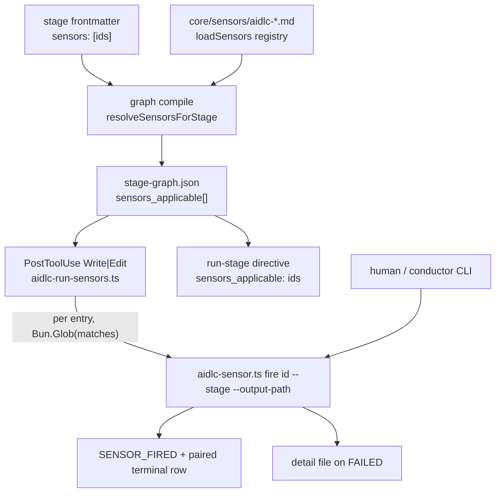

# Sensor System: Deterministic Verification Manifests

> **Source**: [awslabs/aidlc-workflows](https://github.com/awslabs/aidlc-workflows/tree/3c3146cfd7cef33020d48e8d48d4e80d0f8c2820) — branch `v2`, commit `3c3146cf` (v2.6.40, retrieved 2026-08-21)
> **Status**: As-built specification derived from the implementation; the upstream code is authoritative over this document.

---

## 1. Scope and position in the system

A **sensor** is a deterministic, non-LLM check that runs against a file an agent
just wrote. Sensors do not decide anything: every shipped manifest declares
`default_severity: advisory`, the dispatcher CLI always exits 0 on a sensor
verdict, and the PostToolUse hook always returns 0. Their only durable product
is a pair of audit rows plus, on failure, a Markdown detail file. The plugin
sensor `aidlc-coverage-threshold.md:31-33` states the design position verbatim:

> "The framework has no blocking sensor severity yet, so a `SENSOR_FAILED` here is
> REPORTED, not enforced."

The framework ships **six** sensor manifests and six matching worker scripts.
This document specifies the manifest schema, the two dispatch paths, each
sensor's input contract and failure taxonomy, the audit events emitted, and how
a fork or plugin adds a seventh.

Adjacent subjects owned elsewhere: the compiled stage graph and directive
emission are in `02-orchestration-engine.md`; audit-shard file format and event
inventory in `03-state-audit-runtime.md`; the `## Sensors` stage body
compartment and the §13 learning ritual in `04-stage-protocol.md` and
`08-memory-rules-learnings.md`; the PostToolUse hook wiring per harness in
`07-hooks.md`; the CLI surface in `09-cli-tools.md`; plugin composition in
`11-plugin-system.md`.

---

## 2. Manifest schema

### 2.1 File location and naming

Manifests are Markdown files with YAML frontmatter under the harness sensors
directory, resolved by `sensorsDir()`:

```text
core/tools/aidlc-graph.ts:376-380
  return process.env.AIDLC_SENSORS_DIR ?? resolveHarnessPath(["sensors"]);
```

`AIDLC_SENSORS_DIR` is the relocation/test seam. Discovery is a **flat**
`readdirSync(...).sort()` scan; only basenames matching
`SENSOR_FILE_REGEX = /^aidlc-([a-z][a-z0-9-]*)\.md$/`
(`core/tools/aidlc-graph.ts:710`) are indexed. Anything else — a subdirectory, a
missing `aidlc-` prefix, an uppercase id — is silently skipped
(`core/tools/aidlc-graph.ts:725-727`). The sort is the determinism contract the
canonical JSON emitter relies on.

### 2.2 Fields

`SensorManifest` (`core/tools/aidlc-sensor-schema.ts:30-41`):

| Field | Required | Type / accepted values | Consumed by |
| --- | --- | --- | --- |
| `id` | yes | non-empty string; must equal the filename stem after `aidlc-` | registry key, dispatcher `fire <id>`, stage `sensors:` import |
| `kind` | yes | literal `"deterministic"` (sole accepted value) | schema validation only |
| `command` | yes | non-empty string; must contain a `.ts` token | `resolveScriptPath` extracts the **basename only** |
| `default_severity` | yes | literal `"advisory"` (sole accepted value) | schema validation only |
| `description` | yes | non-empty string | `sensor list` / `sensor describe` output |
| `category` | no | free-form string | display only; no dispatch branch reads it |
| `input_schema` | no | object | documentation only — never parsed (`scalarField` reads scalars) |
| `output_schema` | no | object | documentation only — never parsed |
| `timeout_seconds` | no | integer | spawn timeout; default 60 (`aidlc-sensor.ts:66`) |
| `matches` | no | non-empty string glob | **the** fire filter, snapshotted into the graph |

`REQUIRED_FIELDS` is the literal five-element list
`["id","kind","command","default_severity","description"]`
(`core/tools/aidlc-sensor-schema.ts:43-49`).

Unknown keys are tolerated for forward compatibility: `parseSensorManifest`
reads a fixed set of scalars via `scalarField` and ignores everything else
(`core/tools/aidlc-sensor-schema.ts:54-94`). A UTF-8 BOM is stripped before the
frontmatter match so a BOM-adding editor does not silently drop the manifest
(`:55`). `input_schema` / `output_schema` are therefore *prose contracts*, not
enforced ones — see §5.7 for a case where a shipped manifest's `output_schema`
disagrees with its worker's actual JSON.

### 2.3 Validation errors (verbatim)

`validateSensorManifest` throws `"<file>: <message>"` on the first violation, the
prefix baked into each of its own throws
(`core/tools/aidlc-sensor-schema.ts:142-183`, helpers at `:101-130`). The
frontmatter row below is the exception: it is thrown one step earlier by
`parseSensorManifest` (`:54-59`) and thrown **bare**, with the `"<file>: "`
prefix added by the caller `loadSensors`
(`` throw new Error(`${filePath}: ${errorMessage(err)}`) ``,
`core/tools/aidlc-graph.ts:736-738`). The `validateSensorManifest` call sits
outside that `try` (`:752`), so its messages are never double-prefixed:

| Condition | Message |
| --- | --- |
| No `---...---` frontmatter (thrown by `parseSensorManifest`) | `Sensor manifest missing YAML frontmatter (---...---)` (`:58`) |
| A required field absent | `missing required field: <field>` (`:157`) |
| `id`/`command`/`description` empty | `<field> must be a non-empty string` (`:109`) |
| `matches` present but empty | `matches must be a non-empty string when present` (`:108-109`) |
| `id` ≠ filename stem | `id "<id>" must match filename stem "<stem>" (file should be aidlc-<id>.md)` (`:163-167`) |
| `kind` ≠ `deterministic` | `kind must be "deterministic" (got "<v>"); other kinds reserved for future releases` (`:127`, `:169-175`) |
| `default_severity` ≠ `advisory` | `default_severity must be "advisory" (got "<v>")` (`:127`, `:177`) |

Two manifests claiming the same `id` fail at load, before per-file validation,
so the duplicate is named rather than a downstream mismatch
(`core/tools/aidlc-graph.ts:744-750`):

> `<file>: duplicate sensor id "<id>" — also declared in <other>. Rename one of them.`

### 2.4 Categories

`category` is a free grouping label with no dispatch semantics. The six shipped
manifests use four values:

| Category | Sensors |
| --- | --- |
| `document-shape` | `required-sections`, `upstream-coverage` |
| `document-provenance` | `claim-sources` |
| `document-traceability` | `traceability` |
| `code-quality` | `linter`, `type-check` |

### 2.5 Advisory vs blocking

There is no blocking path in the code. Concretely:

- Every shipped manifest declares `default_severity: advisory`, and the schema
  rejects any other value (`aidlc-sensor-schema.ts:177`).
- The dispatcher exits 0 after emitting the terminal row
  (`aidlc-sensor.ts:556`); its header states "CLI exits non-zero ONLY on
  dispatcher invocation errors" (`:29-31`).
- The PostToolUse hook's stated contract is "Exit-code contract (G5): always
  exit 0. … Blocking semantics defer to the future ralph driver"
  (`core/hooks/aidlc-run-sensors.ts:15-18`).
- No engine or state code reads a sensor verdict: the only `sensor` references
  in `aidlc-orchestrate.ts` are the comment at `:2007` and the directive field
  projection at `:2069` (`sensors_applicable: (node.sensors_applicable ?? []).map((s) => s.id)`);
  `aidlc-state.ts` contains none.

"Blocking" language in a few manifests and stage bodies is aspirational prose
about the *human* gate, not machine enforcement. `aidlc-required-sections.md:34-36`
says a bad `units:` edge block "fails the sensor at the gate so the malformed
block never reaches the compiler"; mechanically the sensor sets `pass:false`, a
`SENSOR_FAILED` row lands, and the human at the approval gate decides.

---

## 3. Dispatch model

### 3.1 Compile-time resolution — `sensors_applicable`

The stage↔sensor relationship is authored **pull-style on the stage side**: a
stage's frontmatter carries `sensors: [<id>, ...]`, and the manifest never names
stages (`core/tools/aidlc-sensor-schema.ts:6-9`). At graph compile,
`resolveSensorsForStage` looks each declared id up in the manifest registry and
copies the manifest's `matches` verbatim into a `SensorResolution` row
(`core/tools/aidlc-graph.ts:768-790`), assigned onto the node at
`core/tools/aidlc-graph.ts:1873-1875`:

```ts
// core/tools/aidlc-graph.ts:128-132
export interface SensorResolution { id: string; path: string; matches?: string }
```

An unknown id is a **loud compile failure**, never a silent no-op at fire time
(`core/tools/aidlc-graph.ts:778-781`):

> `Stage "<slug>" imports unknown sensor id "<id>". Known ids: <sorted list>`

`sensors_applicable` is part of the pinned `FIELD_ORDER`
(`core/tools/aidlc-graph.ts:477`), so it round-trips into `stage-graph.json` and
the PostToolUse hook never re-opens a manifest at runtime — the BGP-stability
invariant for in-flight workflows (`core/tools/aidlc-graph.ts:696-700`).

Fan-out from stage graph to hook to dispatcher:



Text fallback: stage frontmatter declares sensor ids; compile joins them against
the manifest registry and bakes `sensors_applicable` into `stage-graph.json`;
the PostToolUse hook and the run-stage directive both read that baked array; the
hook glob-filters and spawns the dispatcher, which emits one `SENSOR_FIRED` row
and exactly one paired terminal row, plus a detail file when the verdict fails.

### 3.2 Path A — the PostToolUse hook

`core/hooks/aidlc-run-sensors.ts` is registered on the `Write|Edit` matcher
alongside the audit-log hook (`harness/claude/settings.json:113-125`); the
non-Claude harness adapters forward the same core hook (e.g.
`harness/codex/hooks/aidlc-codex-adapter.ts:363`,
`harness/kiro/hooks/aidlc-kiro-adapter.ts:906`).

Ordered guards, each returning 0:

| Step | Guard | Line |
| --- | --- | --- |
| 2 | `process.stdin.isTTY` → return | `:59` |
| 3 | stdin not valid `ClaudeCodeHookInput` JSON → return | `:66-72` |
| 4 | no `tool_input.file_path` → return | `:78-79` |
| 5 | recursion guard: path inside `<record>/.aidlc-sensors/` (or legacy `aidlc-docs/.aidlc-sensors/`) → return | `:89-98` |
| 6 | no audit file → return (pre-init) | `:102` |
| 7 | no/unreadable `aidlc-state.md` → return | `:110-117` |
| 8 | heartbeat write `hooks-health/run-sensors.last` | `:127-132` |
| 8b | one-time stderr banner, `.first-fired` marker | `:141-153` |
| 9 | active stage = active-directive marker `?? Current Stage`; `none`/empty → return | `:160-163` |
| 10 | `loadGraph()` throws or slug absent → return | `:169-185` |
| 10b | `sensors_applicable` empty → return | `:189-190` |
| 11 | per entry: `if (!entry.matches) continue;` then `new Bun.Glob(entry.matches).match(filePath)` | `:202-205` |

The `matches` filter is load-bearing: **an entry without a `matches` glob never
fires** (`:194-195`, "G1 lock-in: matches IS the filter"). All six shipped
manifests declare one, so all six are reachable.

Step 9's marker-first resolution exists because unit-major execution can be
running a later stage while `Current Stage` still names the first block stage; a
marker naming a stage absent from a stale or plugin-filtered graph falls back to
`Current Stage` rather than suppressing all dispatch (`:174-179`).

Dispatch is a synchronous `spawnSync` of the dispatcher — never the worker
script — with a 90 s default subprocess cap overridable by
`AIDLC_SENSOR_TIMEOUT_MS` (`:49-50`, `:220-236`). The hook passes only
`--stage` and `--output-path`; the dispatcher owns all other threading (`:212-218`).
Hook-level failures are recorded through `recordHookDrop(projectDir, "run-sensors", …)`
for `--doctor` to surface, discriminated as timeout (`ETIMEDOUT` **or**
`SIGTERM`, checked first), spawn error, or `dispatcher exit <n>` (`:249-271`).

Two glob engines exist in the path: `Bun.Glob` in the hook and the dispatcher's
bespoke `globToRegex` (`aidlc-sensor.ts:858-879`). The hook comment records that
the relaxed `**/{aidlc-docs,intents}/**` form (rather than `.../**/*.md`) is
chosen precisely because "both engines agree on the relaxed form" — the
dispatcher's matcher rejects the `*.md` form that Bun.Glob accepts (`:196-200`).

### 3.3 Path B — manual `fire`

`bun <harness>/tools/aidlc-sensor.ts fire <id> --stage <slug> --output-path <path>`
is the human/conductor entry point. The dispatcher exposes three subcommands —
`list`, `describe <id>`, `fire` (`aidlc-sensor.ts:909-918`).

`fire` re-applies the `matches` filter itself so "a human-callable invocation
can't bypass the shape contract" (`:374-383`). Its pre-emit validation, in
order, each exiting 1 **before** any audit row is written:

| Check | Message | Line |
| --- | --- | --- |
| missing positional id | `fire requires a sensor id as first positional arg` | `:325` |
| missing `--stage` | `fire requires --stage <slug>` | `:328` |
| missing `--output-path` | `fire requires --output-path <path>` | `:330` |
| unknown id | `unknown sensor id: "<id>". Known ids: <sorted>` | `:350` |
| unknown stage | `unknown stage slug: "<slug>". Known (first 10): <…>` | `:364-366` |
| path absent | `output path does not exist: <path>` | `:371` |
| glob rejection | `output path "<p>" does not match sensor "<id>" filter "<glob>"` | `:380-382` |
| worker script absent | `per-sensor script missing on disk: <path>` | `:479` |

All are prefixed `aidlc-sensor:` on stderr (`:125`). Resolving the graph before
the emit is deliberate ("orphan-FIRED prevention"): a malformed stage file makes
`loadGraph()` throw and the process exit 1 with no `SENSOR_FIRED` row (`:353-355`).

`list` prints `id\tkind\tdescription` in alphabetical order (`:193-204`);
`describe` prints each present manifest field plus the registry `path` (`:208-231`).
Argument parsing rejects a flag whose value is missing or is itself a flag
(`:106-122`).

### 3.4 Argument threading — what the dispatcher adds

The worker scripts are graph-blind; the dispatcher holds the `GraphStage` and
threads everything derived from it (`:392-469`):

| Sensor | Flags the dispatcher passes |
| --- | --- |
| `linter`, `type-check` | `--stage <slug> --file-path <abs path>` (`:403-407`) |
| all other ids | `--stage <slug> --output-path <abs path>` (`:408`) |
| `upstream-coverage` | `+ --consumes "art:producer,art:producer,…"` (`:410-420`) |
| `upstream-coverage`, `claim-sources` | `+ --deliverables "<stem>,<stem>,…"` (`:425-433`) |
| `required-sections` | `+ --templates-dir <dir> --template-eligible <stems> --framework-templates-dir <dir>` (`:452-469`) |

`--output-path` is resolved to absolute against the dispatcher's invocation cwd
up front, because the worker runs with `cwd: projectDir` and a relative path
would otherwise name two different files (`:334-343`).

**Consume presence filtering.** `presentConsumes` drops any consume whose
artifact does not exist on disk (`:294-304`), because for a consume whose
producing stage was skipped by the scope, "demanding the output prose reference
it is a guaranteed false SENSOR_FAILED on every run of that stage in that scope"
(`:239-240`; the same rationale restated at the call site, `:398-402`).
Existence resolves under
the producer's directory: codekb producers glob every repo dir under the
space-level codekb root (`KNOWN_CODEKB_STAGES` is the single-element set
`{"reverse-engineering"}`, `:257-259`); `for_each: unit-of-work` producers glob
every `<record>/construction/<unit>/<slug>/`; everything else resolves
`<record>/<phase>/<slug>/<name>.md` (`:261-292`). It fails **open**: when
`recordDir` is null the full list threads unchanged, and an orphan consume with
no producer anywhere in the graph also threads unchanged so the graph defect
stays visible to `--doctor` (`:250-255`, `:294-304` — the `recordDir`-null arm at
`:295`, the orphan arm at `:297-298`). Each surviving slug is then
rewritten as `artifact:producer-stage` by `consumeWithProducer` (`:311-314`).

**Deliverable threading.** `templateEligibleArtifacts` is the shared filter
(`core/tools/aidlc-graph.ts:846-854`). The function itself takes one array and
applies only the suffix rule — it drops any name ending `-questions` or
`-timestamp` (and any non-string or empty entry). The union of `produces` and
`optional_produces` is built at the dispatcher's two call sites, which pass the
spread of both arrays in: the deliverables arm (`aidlc-sensor.ts:428-431`) and
the required-sections arm (`:456-459`). The filter lives in the graph module
precisely so the dispatcher and the hook derive it identically without importing
the dispatcher (whose top-level `main()` would run on import).

### 3.5 The fire transaction

`handleFire` holds the audit lock for exactly two short windows and never across
the spawn (`aidlc-sensor.ts:10-17`):

1. resolve + validate + generate an 8-hex fire id (`randomBytes(4).toString("hex")`, `:187-189`) — no lock;
2. lock → emit `SENSOR_FIRED` → unlock (`:497-508`);
3. `spawnSync` the worker with `timeout: timeoutMs, cwd: projectDir` (`:512-526`) — no lock;
4. classify via the truth table (`:530`);
5. on FAILED, write the detail file race-free: `writeFileSync(tmp, …, { flag: "wx" })` then `renameSync` (`:534-539`);
6. lock → emit the terminal row → unlock (`:551-553`);
7. `process.exit(0)` (`:556`).

A detail-write failure does not lose the pair — it degrades the verdict to
PASSED with `Note: script-error: detail-write-failed: <msg>` (`:540-547`).

Spawn form depends on packaging (`:512-521`): a compiled single-file executable
whose id is in `BUNDLED_SENSOR_IDS` runs `<exe> __sensor-script <id> …`;
otherwise a compiled executable runs `<exe> __sensor-script-file <id> …`;
otherwise `[process.execPath, <scriptAbsPath>, …]`. `resolveScriptPath` takes the
**basename** of the first `.ts` token in `command:` and joins it to
`AIDLC_SENSOR_SCRIPT_DIR ?? (compiled ? <harness>/tools : __FILE_DIR)`
(`:144-159`) — so a manifest's `command:` path prefix is decorative; only the
basename routes.

### 3.6 Verdict truth table

Branch order is explicitly load-bearing: branch **a** must precede branch **0**
because Node 16+ sets `result.error` alongside `signal === "SIGTERM"` on
timeout, and reversing them turns branch a into dead code (`:573-578`).

| # | Condition | Outcome | Note / fields |
| --- | --- | --- | --- |
| a | `signal === "SIGTERM"` **and** `elapsed ≥ timeout − 100 ms` | `SENSOR_BUDGET_OVERRIDE` | `Cap layer: registry`, `Cap value`, `Observed value` (`:587-598`, `:814-821`) |
| 0 | `error` set **and** `status === null` **and** `signal === null` | `SENSOR_PASSED` | `script-error: spawn-failed: <errno code or "unknown">` (`:600-608`) |
| b | `status === 127` | `SENSOR_PASSED` | `tool-unavailable` (`:610-617`) |
| c | `status === 0`, JSON `pass === false` | `SENSOR_FAILED` | detail file + `Findings count` (`:642-661`) |
| d | `status === 0`, JSON `pass === true` | `SENSOR_PASSED` | (no note) (`:662-663`) |
| f | `status === 0`, unparseable JSON or `pass` not boolean | `SENSOR_PASSED` | `script-error: bad-output` (`:628-641`) |
| e1 | `SIGTERM` before the timeout window | `SENSOR_PASSED` | `script-error: external-sigterm` (`:668-677`) |
| e2 | any other non-zero status | `SENSOR_PASSED` | `script-error: exit-<n>` (`:678-684`) |
| e3 | non-SIGTERM signal (SIGKILL/SIGINT/…) | `SENSOR_PASSED` | `script-error: signal-<SIG>` (`:688-694`) |
| — | unreachable default | `SENSOR_PASSED` | `script-error: unknown` (`:696-701`) |

The grace constant is `DEFAULT_TIMEOUT_GRACE_MS = 100` (`:71`), pinned to
disambiguate a timeout SIGTERM from an external kill. The default budget when a
manifest omits `timeout_seconds` is `DEFAULT_TIMEOUT_SECONDS = 60` (`:66`,
`:481-483`).

Worker stdout is passed through `stripStdoutNoise(stdout, "{")` before
`JSON.parse` — slicing to the first `{` so a package manager's run banner ahead
of the payload does not silently collapse the verdict into
`script-error: bad-output` (`:568-571`, `:627`). The equivalent helper in the
linter worker slices to `[` (`aidlc-sensor-linter.ts:302-305`).

`findings_count` is read **generically** off the worker's JSON, floored, and
defaulted to 0 for a fork sensor that omits it — the dispatcher deliberately
carries no per-sensor arm (`:704-722`).

---

## 4. Audit interplay

Four event names, all in the `VALID_EVENT_TYPES` set
(`core/tools/aidlc-audit.ts:39-189`; the four sensor entries at `:170-173`),
with human headings in `EVENT_HEADINGS` (`:192`; the four at `:265-268`):

| Event | Heading | Emitter |
| --- | --- | --- |
| `SENSOR_FIRED` | `Sensor Fired` | `aidlc-sensor.ts:499` |
| `SENSOR_PASSED` | `Sensor Passed` | `aidlc-sensor.ts:799` |
| `SENSOR_FAILED` | `Sensor Failed` | `aidlc-sensor.ts:811` |
| `SENSOR_BUDGET_OVERRIDE` | `Sensor Budget Override` | `aidlc-sensor.ts:821` |

A fifth, `SENSOR_PROPOSED` / `Sensor Proposed` (`aidlc-audit.ts:179`, `:272`), is
emitted by the §13 learning gate when a new manifest is scaffolded — see §7.

Blocks are rendered by `renderAuditBlock` as
`## <heading>` / `**Timestamp**` / `**Event**` / one `**Key**: value` line per
field, terminated by `---`; every JS line terminator in a value is escaped to
`\n` so a value cannot forge a second field or event line
(`core/tools/aidlc-audit.ts:485-503`).

Field sets:

| Event | Fields |
| --- | --- |
| `SENSOR_FIRED` | `Fire id`, `Sensor ID`, `Stage slug`, `Output path` (`:499-506`) |
| `SENSOR_PASSED` | the four base fields + `Duration ms` + optional `Note` (`:791-800`) |
| `SENSOR_FAILED` | the four base fields + `Detail path` + `Findings count` (`:802-812`) |
| `SENSOR_BUDGET_OVERRIDE` | the four base fields + `Cap layer` (literal `registry`) + `Cap value` + `Observed value` (`:814-821`) |

`Output path` and `Detail path` are relativized against `projectDir` so shards
stay portable across worktrees; a path outside the project is emitted verbatim
(`:755-775`).

**Pairing is by `Fire id`, not position.** A single Write can fan out to several
parallel fires whose terminal rows interleave by spawn duration, so
`aidlc-runtime.ts` maps `Fire id → terminal row` and resolves duplicates by
latest timestamp (`core/tools/aidlc-runtime.ts:562-609`). An orphan `SENSOR_FIRED`
becomes `incomplete` immediately inside a closed stage window, or after a
deterministic 60 s cutoff measured against the audit's max timestamp — never
`Date.now()` — so re-compile stays byte-equal (`:566-572`). The
`/aidlc-session-cost` skill surfaces the tally
`{ total, passed, failed, budget_override, incomplete }`
(`core/skills/aidlc-session-cost/SKILL.md:70`).

The detail file is written to `<record>/.aidlc-sensors/<stage-slug>/<sensor-id>-<fire-id>.md`
(`aidlc-sensor.ts:470-471`; `sensorsDir` at `core/tools/aidlc-lib.ts:6134-6139`),
with a fixed body: an H1 `# <sensor-id> finding — <stage-slug>`, bold
`Timestamp` / `Fire id` / `Output path` / `Pass: false` lines, then a
`## Findings` section containing the worker's entire stdout JSON pretty-printed
in a fenced ```json block (`aidlc-sensor.ts:726-751`).

One advisory doctor check joins the two registries: for each rule carrying
`frontmatter.pairing`, `--doctor` confirms the named sensor id (with the
`aidlc-` prefix stripped) appears in some stage's `sensors_applicable`,
reporting `Paired sensor coverage: P/N guardrails paired (X feedforward-only)`
and, per miss, `unpaired: <rule> → <sensor> (no stage binds it)`
(`core/tools/aidlc-utility.ts:2933-3004`; the two strings at `:2989` and
`:2993`). The label has a second success form: when no rule needs a sensor at all
(`needing === 0`) it reads
`Paired sensor coverage: no sensor-bound rules (X feedforward-only)` instead
(`:2986-2987`). An unpaired rule never fails the
check — the success arm pushes `{ pass: true, label: coverageLabel }` whether or
not `unpaired` is empty (`:2997`) — so it is a structural join report, not
enforcement. The only `pass: false` it can produce is the catch arm, when
`loadRules()` or `loadGraph()` throws: `Paired sensor coverage: check failed`
with the error message as the fix hint (`:2998-3003`).

---

## 5. Per-sensor specification

Stage bindings (from the frontmatter `sensors:` lists of all 33 shipped stage
files; see Measurement notes M4):

| Sensor | Stages binding it | Notable stages |
| --- | --- | --- |
| `required-sections` | 30 | all but the 3 initialization stages |
| `upstream-coverage` | 29 | all but initialization and `code-generation` |
| `traceability` | 8 | `user-stories`, `domain-design`, `units-generation`, and the 5 construction design/codegen stages |
| `type-check` | 7 | the 7 construction stages |
| `linter` | 6 | the construction stages except `build-and-test` |
| `claim-sources` | 1 | `intent-capture` |

The three initialization stages declare `sensors: []` (e.g.
`core/aidlc-common/stages/initialization/state-init.md:13`), which the resolver
treats identically to an absent key (`core/tools/aidlc-graph.ts:158-163`).

### 5.1 `required-sections`

- **Manifest**: `core/sensors/aidlc-required-sections.md`; category `document-shape`;
  `matches: "**/{aidlc-docs,intents}/**"`; `timeout_seconds: 5`.
- **Worker**: `core/tools/aidlc-sensor-required-sections.ts` (244 lines).
- **Inputs**: `--output-path` (required), `--stage`, `--templates-dir`,
  `--framework-templates-dir`, `--template-eligible <csv>` (`:58-78`).

**Behaviour.** Non-`.md` outputs quiet-pass before any read, because the broad
record-tree glob also matches structured artefacts such as `traceability.json`
(`:125-138`). Otherwise it counts *distinct, trimmed* `^##` headings
(`parseH2Headings`, `:83-94`); `### Foo` is excluded because character 2 is `#`,
not a space (`:150-153`). The generic floor is `pass = h2_count >= 2` with
`findings_count = max(0, 2 - h2_count)` (`:156-162`).

**Template-override layer.** For the output filename stem, the worker resolves
`<templates-dir>/<stem>.md` then `<framework-templates-dir>/<stem>.md`,
first hit wins (`resolveTemplatePath`, `:101-108`). When one resolves *and* the
stem is in the dispatcher-threaded eligible set, the template's `##` heading set
**replaces** the floor: `pass` iff `expected ⊆ output`, with the missing
headings as precise findings and `template: "applied"` (`:201-218`). When a
template resolves for an *ineligible* stem (a questions/timestamp marker), it is
ignored, the floor is kept, `template: "ineligible"`, and a `config_warning` is
emitted verbatim as:

> `template <stem>.md resolved but artifact "<stem>" is not template-eligible for stage "<slug>" (questions/timestamp markers are excluded); template ignored, keeping the generic >=2-H2 floor.` (`:196-200`)

The framework ships **zero** default templates at GA, so tier 2 normally misses.
The stage protocol pins the agent to the same resolution order so "the produced
shape and the checked shape cannot drift"
(`core/aidlc-common/protocols/stage-protocol.md:881`).

**Filename-gated extension.** For `unit-of-work-dependency.md` only, the worker
additionally runs `parseBoltDag(body)` and reports
`edge_block: "ok" | "absent" | "malformed" | "cyclic"`, adding one finding and
forcing `pass:false` for anything but `ok` (`:228-236`). The reason vocabulary
comes straight from `parseBoltDag` (`core/tools/aidlc-lib.ts:10403-10449`):
`absent` = "no fenced ```yaml units: block found"; `malformed` = a parse throw,
zero entries, a duplicate unit name, a self-dependency, or an unknown
dependency; `cyclic` = "dependency cycle detected". The check is orthogonal to
the template branch — it still applies when a template resolves.

**Hard errors** (exit 1 → dispatcher branch e), all prefixed
`aidlc-sensor-required-sections:`: `--output-path is required`,
`--output-path not found: <p>`, `failed to read --output-path <p>: <e>`,
`failed to read template <p>: <e>` (`:110-113`, `:118-147`, `:206-208`).

### 5.2 `upstream-coverage`

- **Manifest**: `core/sensors/aidlc-upstream-coverage.md`; `document-shape`;
  `matches: "**/{aidlc-docs,intents}/**"`; `timeout_seconds: 5`.
- **Worker**: `core/tools/aidlc-sensor-upstream-coverage.ts` (224 lines).
- **Inputs**: `--output-path`, `--stage`, `--consumes`, `--deliverables` (`:27-45`).

**Contract.** Coverage is a property of the stage's whole output, not of each
file (`:124-137`). The scanned body is the concatenation of every
`<dir>/<stem>.md` that exists for the threaded deliverable stems, plus the fired
file itself **unless** it is scaffolding — `memory.md`, `*-questions.md`,
`*-timestamp.md` (`:145-162`). Without `--deliverables`, only the fired file is
read. An unreadable sibling is skipped; only an unreadable *fired* file is a
hard error (`:166-177`).

A consume is covered when the union body matches either:

- `slugPattern` — the bare slug with hyphen-aware lookaround anchors
  `(?<![\w-])<slug>(?![\w-])`, plus an explicit `\[\[<slug>\]\]` wikilink
  alternative, case-insensitive (`:63-66`). The anchors are why `requirements`
  inside `nfr-requirements` does not count, while `` `<slug>.md` `` and
  `[[<slug>]]` do (backtick, `[`, `.`, `]` are outside `[\w-]`).
- `producerDirPattern` — the producing stage slug as a whole path segment,
  `(?<![\w-])<producer>(?=/)|(?<=/)<producer>(?![\w-])` (`:74-77`), so one
  provenance header citing `nfr-requirements/` covers every artifact that stage
  produces.

Consume entries parse as `artifact` or `artifact:producer-stage`; the bare form
stays valid and simply gets no producer-directory alternative (`:82-88`).

**Vacuous passes** carry a `reason` rather than a false failure: `"no upstream"`
when the consume list is empty (`:111-122`) and `"no deliverables on disk yet"`
when a scaffolding write fires before any deliverable exists (`:185-196`).

**Output**: `{pass, consumes[], unreferenced[], scanned_files[], reason?, findings_count}`
(`:5-12`, `:212-219`); `findings_count = unreferenced.length`.

**Hard errors** (prefix `aidlc-sensor-upstream-coverage:`): `--output-path is required`,
`--output-path not found: <p>`, `failed to read --output-path <p>: <e>` (`:47-50`, `:93-98`, `:172`).

### 5.3 `linter`

- **Manifest**: `core/sensors/aidlc-linter.md`; `code-quality`; `matches: "**/*.{ts,js}"`;
  `timeout_seconds: 30`.
- **Worker**: `core/tools/aidlc-sensor-linter.ts` (383 lines).
- **Inputs**: `--stage`, `--file-path`, both required (`:88-114`).

Wraps `bunx eslint@10 --format json --max-warnings=-1 <path>`, with cwd set to
the nearest `package.json` ancestor of the target file — eslint's own discovery
then handles legacy cascading and flat config (`:126-138`, `:273-291`). The
version spec is pinned to a constant `ESLINT_SPEC = "eslint@10"` (`:155`)
because a bare `bunx eslint` prefers any PATH `eslint` (Ubuntu 24.04 ships
6.4.0) which cannot see `eslint.config.js`, so that "the sensor quietly degrades
every fire to a tool-unavailable PASS - masking real lint findings"
(`:148-149`, within the pin rationale at `:142-154`). The
`--max-warnings=-1` equals-form is required because eslint v10 rejects a bare
`-1` positional (`:280-284`).

**Verdict**: `pass = errorCount === 0`; warnings are counted but never fail,
because real configs ship `no-unused-vars: warn` and warning-as-failure would
"emit SENSOR_FAILED on every Write" (`:34-38`, `:368-378`).
`findings_count = errorCount`.

**Exit-code taxonomy** (the header comment at `:40-43` enumerates 0 / 127 / 1;
the shipped set below adds the exit-2 and missing-file paths):

| Exit | Stderr token | Trigger |
| --- | --- | --- |
| 0 | — | verdict carried in JSON `pass` |
| 127 | `eslint-unavailable` | `bunx eslint@10 --version` non-zero, or any other non-zero `--print-config` failure (`:162-172`, `:230-231`) |
| 127 | `no-eslint-config` | `--print-config` stderr matches `/no eslint configuration found/i`, `/could not find config file/i`, `/eslint couldn[’']t find an? eslint\.config/i`, or `/eslint couldn[’']t find a configuration/i` (`:202-210`) |
| 2 | `config-parse-error: <line>` | a config file **is** present and stderr matches a parse-error pattern (`/parse error/i`, `/syntaxerror/i`, `/unexpected token/i`, `/configuration .* is invalid/i`, or presence-gated `/unable to load/i` / `/failed to load config/i`) (`:214-227`) |
| 1 | `eslint-bad-output` | stdout is not a parseable JSON array (`:349-359`) |
| 1 | `file-path not found: <p>` | target missing; exits before any eslint probe (`:329-332`) |

The 127/2 split is the sensor's key semantic: "no config" is a quiet
tool-unavailable PASS, while a *broken* config surfaces as
`script-error: exit-2` because "quietly PASSing those as tool-unavailable masks
real bugs" (`:174-187`). `configFilePresent` probes ten candidate filenames in
the project root to make the distinction (`:239-253`).

### 5.4 `type-check`

- **Manifest**: `core/sensors/aidlc-type-check.md`; `code-quality`; `matches: "**/*.{ts,tsx}"`;
  `timeout_seconds: 60`.
- **Worker**: `core/tools/aidlc-sensor-type-check.ts` (317 lines).
- **Inputs**: `--stage`, `--file-path`, both required (`:97-123`).

Wraps `bunx tsc --project <tsconfig> --noEmit --pretty false --incremental --tsBuildInfoFile <path>`
from the nearest `tsconfig.json` ancestor (`:137-147`, `:167-188`). `--project`
rather than a bare file because `tsc --noEmit foo.ts` ignores tsconfig and falls
back to ES3/no-strict defaults, making the verdict "checked-but-meaningless on
any real project" (`:20-25`). `--pretty false` strips ANSI decoration that would
break the line regex; the buildinfo lands under the record's gitignored
`.aidlc-sensors/` so it never pollutes commits (`:266-277`).

Diagnostics parse with
`PRIMARY_RE = /^(.+?)\((\d+),(\d+)\):\s+error\s+TS\d+:\s+(.+)$/` (`:197`);
indented continuation lines are appended to the previous primary's `message`
joined by `"\n  "` (`:216-219`), without which "Findings count under-reports"
(`:49`, `:196`). Errors are then post-filtered to the target file by absolute
equality, tsconfig-relative equality, or a suffix fallback (`:229-247`).

**Known limitation, documented in-source** (`:58-62`): a cross-file error that
the target introduced (a removed export breaking a consumer) is attributed to
the consumer's file, so the sensor emits PASS for the written file.

**Exit-code taxonomy** (`:64-70`):

| Exit | Stderr token | Trigger |
| --- | --- | --- |
| 0 | — | verdict in JSON `pass = errors.length === 0` |
| 1 | `no-tsconfig-found` | no ancestor tsconfig (`:260-263`) |
| 1 | `file-path not found: <p>` | target missing (`:254-257`) |
| 127 | `tsc-unavailable` | `bunx tsc --version` non-zero (`:155-165`) |
| `<n>` | — | tsc exited non-zero with **zero** parsed diagnostics anywhere (e.g. TS18003) — propagated so the dispatcher records `script-error: exit-<n>` instead of a false clean PASS (`:290-305`) |

The status gate is checked against the whole-project parse, not the filtered
set, so a genuine type-error run whose errors fall outside the target stays a
per-file clean PASS (`:296-302`).

### 5.5 `traceability` — extended treatment

- **Manifest**: `core/sensors/aidlc-traceability.md`; `document-traceability`;
  `matches: "**/traceability.json"`; `timeout_seconds: 5`.
- **Worker**: `core/tools/aidlc-sensor-traceability.ts` (635 lines).
- **Inputs**: `--output-path` (required), `--stage` (`:66-74`).

Like `required-sections` (§5.1), `upstream-coverage` (§5.2) and `claim-sources`
(§5.6), this sensor reads beyond the write that fired it: it resolves the
upstream artefact files that define the expected ID set for the stage
(`readText`, `:168-174`) — `requirements.md`, `stories.md`, the story map
(`:294-301`, `:338`, `:401-402`). Only `linter` and `type-check` are confined
to the fired path, and even `type-check` runs a whole-project `tsc` before
post-filtering to it (§5.4).

**Input document shape.** A JSON object with `upstream_ids: string[]`,
`coverage: {id, status, target?}[]`, optional `reverse[]`, and optional `stage`
/ `unit` strings (`:12-24`). The closed status set is
`VALID_STATUSES = {"OK","GAP","ORPHAN","Deferred","N/A"}` (`:10`). The effective
stage is `--stage ?? data.stage ?? ""` (`:568`).

**Shape failures** — each returns a single-finding result with `pass:false` and
`findings_count: 1` (`failedResult`, `:85-97`):

| Message (verbatim) | Line |
| --- | --- |
| `invalid JSON in traceability file` | `:129` |
| `traceability.json must contain a JSON object` | `:131` |
| `upstream_ids must be an array of non-empty strings` | `:135` |
| `coverage must be an array` | `:138` |
| `reverse must be an array when present` | `:141` |
| `stage must be a string when present` | `:151` |
| `unit must be a string when present` | `:154` |
| `<field>[<i>] must be an object` | `:113` |
| `<field>[<i>].id must be a non-empty string` | `:117` |
| `<field>[<i>].status must be a non-empty string` | `:120` |
| `<field>[<i>].target must be a string when present` | `:123` |
| `no coverage entries found in traceability.json` | `:564` |

**Entry-level checks** across both `coverage` and `reverse` (`:575-587`):
unknown status → `<field>:<id>: unknown status "<s>"`; `GAP` collects into
`gaps`; `ORPHAN` collects into `orphans`; and `OK`/`Deferred`/`N/A` with an
empty target → `<field>:<id>: status <S> requires a non-empty target`.
Declared-vs-covered set arithmetic yields `missing_from_table` (declared ids with
no coverage row) and, per stray row, `coverage:<id>: id is absent from upstream_ids`
(`:589-594`).

**Upstream resolution** (`resolveUpstream`, `:276-447`) is a per-stage
dispatcher over six ID regexes (`ID_PATTERNS`, `:57-64`): `FR\d+(\.\d+)?`,
`NFR\d+` (negative-lookahead on `.\d`), `NFR\d+\.\d+`, `US\d+\.\d+`,
`AC\d+\.\d+\.\d+`, `BR\d+\.\d+`.

| Stage | Expected-ID source | Fallback |
| --- | --- | --- |
| `user-stories` | `requirements.md` FR + NFR | — |
| `domain-design` | `stories.md` US | `requirements.md` FR when stories absent |
| `units-generation` | `stories.md` US (or FR), **plus** `unit-of-work-story-map.md` assignment coverage | — |
| `functional-design` | AC ids of the stories the story map assigns to this unit | `requirements.md` FR when stories/map absent |
| `nfr-requirements` | `requirements.md` NFR | — |
| `nfr-design` | `NFRx.y` from the unit's four `nfr-requirements/*-requirements.md` files | — |
| `infrastructure-design` | `NFRx.y` from the unit's five `nfr-design/*.md` files | — |
| `code-generation` | unit-mapped AC ids + unit `NFRx.y` + `functional-design/rules.md` BR ids | `requirements.md` FR + NFR when stories absent |
| anything else | — | `stage "<s>" has no traceability upstream resolver` (`:445`) |

The construction stages derive the unit from the output path via
`/\/construction\/([^/]+)\/[^/]+\/traceability\.json$/` (`:195-199`) and
cross-check it against the Bolt DAG (`:250-268`).

**Fail-closed reasons.** Every path that cannot resolve its expected set pushes a
`reason` string, and reasons count toward `findings_count` (`:618-625`), so a
missing upstream is a failure rather than a vacuous pass. The reason vocabulary:

| Reason (verbatim) | Line |
| --- | --- |
| `cannot resolve the active intent record directory` | `:280` |
| `required upstream artifact is missing: <path>` | `:170` |
| `required upstream artifact is not a file: <path>` | `:171` |
| `cannot read upstream artifact <path>: <e>` | `:174` |
| `<label> contains no traceable IDs: <path>` | `:191` |
| `cannot derive the construction unit from output path: <p>` | `:252` |
| `unit-of-work-dependency.md is <reason>: <detail>` | `:255`, `:307` |
| `unit "<u>" is not declared in unit-of-work-dependency.md` | `:259` |
| `unit-of-work-dependency.md is missing; cannot verify traceability targets` | `:311` |
| `unit-of-work-story-map.md contains no story-to-unit mappings: <path>` | `:246` |
| `no stories in unit-of-work-story-map.md map to unit "<u>"` | `:348` |
| `stories mapped to unit "<u>" contain no acceptance-criterion IDs` | `:360` |
| `required upstream NFR requirement artifacts are missing under <dir>` | `:382` |
| `NFR requirement artifacts for unit "<u>" contain no NFRx.y IDs` | `:383` |
| `required upstream NFR design artifacts are missing under <dir>` | `:396` |
| `NFR design artifacts for unit "<u>" contain no NFRx.y IDs` | `:397` |
| `upstream ID set is empty for unit "<u>"` | `:441` |
| `upstream ID set is empty for stage "<s>"` | `:601` |
| `stage "<s>" has no traceability upstream resolver` | `:445` |
| `traceability sensor failed safely: <e>` | `:634` |

**Target verification** (`verifyTargets`, `:449-538`) is the layer that stops a
self-consistent but fictional table:

- `user-stories` — every `OK` target must name at least one `USx.y`
  (`<id>: target must name at least one USx.y ID`) and each named story must
  exist in `stories.md` (`<id>: target <T> is absent from stories.md`) (`:466-472`).
- `units-generation` — the target must be a declared unit name or its `U<n>`
  alias (`<id>: target "<T>" is not a declared unit`) and the story→unit pair
  must appear in the story map
  (`<id>: target "<T>" is not mapped in unit-of-work-story-map.md`) (`:475-488`).
- `functional-design` — every `OK` target must name at least one `BRx.y`
  (`<id>: target must name at least one BRx.y ID`), each must exist in the unit's
  `rules.md` (`<id>: target <T> is absent from rules.md`), and **derived
  orphans** are computed: any BR id in `rules.md` neither targeted by a coverage
  row nor explained by a `reverse` entry becomes an orphan. This is the
  manifest's "Derives functional-design orphans from `rules.md` rather than
  trusting only the self-reported `reverse` array" (`:490-510`,
  `core/sensors/aidlc-traceability.md:36-37`).
- `code-generation` — every `OK` target must be a workspace-relative path to an
  existing file: `<id>: target must be a workspace-relative file path` (empty,
  POSIX-absolute, or drive-absolute), `<id>: target escapes the project directory`
  (resolves outside the project root), `<id>: target file does not exist: <t>`,
  `<id>: target file is unreadable: <t>` (`:512-535`).

**Output**: `{pass, gaps[], orphans[], missing_from_table[], missing_from_upstream_ids[], invalid_entries[], invalid_targets[], findings_count, reason?}`.
All six arrays are `uniqueSorted` (`:540-542`, `:608-617`);
`findings_count` is their sum plus `reasons.length`; `pass = findings_count === 0`;
`reason` is the deduplicated reasons joined by `"; "` (`:618-627`).

**Crash safety**: the module wraps `main()` in a top-level try/catch that emits
`failedResult("traceability sensor failed safely: <e>")` rather than exiting
non-zero (`:631-635`) — so an internal defect surfaces as a `SENSOR_FAILED`
verdict, not a `script-error`.

### 5.6 `claim-sources` — extended treatment

- **Manifest**: `core/sensors/aidlc-claim-sources.md`; `document-provenance`;
  `matches: "**/{aidlc-docs,intents}/**"`; `timeout_seconds: 5`.
- **Worker**: `core/tools/aidlc-sensor-claim-sources.ts` (1441 lines — the
  largest sensor implementation in the tree).
- **Inputs**: `--output-path` (required), `--stage`, `--deliverables` (`:58-71`).
- **Bound to exactly one stage**: `intent-capture`
  (`core/aidlc-common/stages/ideation/intent-capture.md:20-21`).

**Purpose.** Every substantive claim in an Intent Capture deliverable must carry
an inline provenance tag that resolves to a *confirmed* source. The manifest
draws the boundary explicitly: "It validates citation shape and resolution only;
the stage's adversarial reviewer judges whether the cited source actually
supports the claim" (`core/sensors/aidlc-claim-sources.md:44-46`).

**Tag vocabulary** (`SOURCE_TAG_RE`, `:53-54`): `[desc]`, `[scope]`,
`[assumption]`, `[Q<n>]`, `[memory:<id>]`.

**The source universe** is the sibling `<stage>-questions.md`
(default stem `intent-capture`, `:1413-1415`), parsed by `parseSourceUniverse`
(`:359-508`) into four products: `registered` source ids, `answeredQuestions`,
an `assumptionsAccepted` boolean, and the `acceptedAssumptions` text set.
Register entries must be visible Markdown list items matching
`SOURCE_ENTRY_RE = /^ {0,3}[-*+]\s+\[(desc|scope|memory:<id>)\]\s+(.+?)\s*$/` (`:55-56`).

**Record authority** is `aidlc-state.md`, found by walking up from the stage
directory (`:167-175`). `[desc]` must be
`Initial description: "<verbatim>"` matching the state's `Project` field
exactly; `[scope]` must be ``Workflow-selected scope: `<scope>`.`` matching
`Scope` exactly (`:412-442`). A `[memory:<id>]` entry must be
``` `aidlc/spaces/<space>/memory/<file>.md#<exact H2>`: "<exact rule>" ```, where
the file is one of `org.md` / `team.md` / `project.md`
(`ACTIVE_MEMORY_FILES`, `:45`), the path stays inside the active memory root,
the file contains exactly one such H2, and the quoted rule matches a visible
list entry under it byte-for-byte (`:269-352`).

**Register / questions findings** (verbatim):

`cannot verify source register: aidlc-state.md was not found` (`:220`) ·
`cannot verify source register: failed to read aidlc-state.md: <e>` (`:229`) ·
`aidlc-state.md is missing Project authority for [desc]` (`:240`) ·
`aidlc-state.md is missing Scope authority for [scope]` (`:242`) ·
`cannot resolve the project root for memory source validation` (`:244`) ·
`cannot resolve the active space for memory source validation` (`:247`) ·
``[<id>] must use `aidlc/spaces/<space>/memory/<file>.md#<exact H2>`: "<exact rule>"`` (`:278`) ·
`[<id>] has an invalid quoted rule` (`:286`) ·
`[<id>] path must name a file under the active memory root <prefix>` (`:298`) ·
`[<id>] must name an active memory file under <prefix>: org.md, team.md, or project.md` (`:305`) ·
`[<id>] path escapes the active memory root` (`:316`) ·
`[<id>] memory source does not exist: <path>` (`:320`) ·
`[<id>] failed to read memory source <path>: <e>` (`:329`) ·
`[<id>] memory source must contain exactly one ## <H2> heading` (`:336`) ·
`[<id>] quoted rule does not exactly match an entry under ## <H2>` (`:347`) ·
`questions file missing: <path>` (`:370`) ·
`failed to read questions file <path>: <e>` (`:384`) ·
`questions file is missing ## Sources` (`:397`) ·
`questions file has duplicate ## Sources sections` (`:400`) ·
`duplicate source id [<id>] in ## Sources` (`:407`) ·
`[desc] must use Initial description: "<verbatim project description>"` (`:419`) ·
`[desc] does not exactly match Project in aidlc-state.md` (`:423`) ·
``[scope] must use Workflow-selected scope: `<scope>`.`` (`:434`) ·
`[scope] does not exactly match Scope in aidlc-state.md` (`:438`) ·
`## Sources is missing [<desc|scope>]` (`:450`) ·
`duplicate question id Q<n>` (`:463`) ·
`duplicate [Answer]: entries for Q<n>` (`:473`) ·
`questions file has duplicate ## Assumption Confirmation sections` (`:482`) ·
`duplicate [Answer]: entries for Assumption Confirmation` (`:489`).

A question counts as answered when its `[Answer]:` line is non-empty and not
only underscores (`answerIsFilled`, `:354-357`).

**Per-deliverable findings** (`inspectDeliverable`, `:1288-1369`), where
`<loc>` is `<basename> ## <section>`:

`<file>: missing ## Assumptions & Open Questions` (`:1307`) ·
`<loc>: assumption/open question lacks [assumption]` (`:1321`) ·
`<loc>: retained assumption is not listed in ## Assumption Confirmation` (`:1327`) ·
`<loc>: claim block has no source tag` (`:1332`) ·
`<loc>: [assumption] is outside ## Assumptions & Open Questions` (`:1337`) ·
`<loc>: [Q<n>] has no filled answer` (`:1346`) ·
`<loc>: [<id>] is not registered in ## Sources` (`:1351`) ·
`<loc>: [scope] is valid only in ## Initial Scope Signal` (`:1356`) ·
`<loc>: [scope] claim is not labeled workflow-selected` (`:1361`) ·
and, once per run, `retained assumptions require an answered ## Assumption Confirmation with Accept assumptions` (`:1426`).
The accept phrase is the constant `ACCEPT_ASSUMPTIONS_ANSWER = "A. Accept assumptions"` (`:44`).

**Claim-block segmentation** (`claimBlocks`, `:527-607`). Blocks are cut at H2
boundaries, any ATX heading, blank lines, thematic breaks, HTML block starts,
list items, and table rows; a table's header row and its separator are excluded
so only data rows become claims (`:537-542`, `:586-596`). Content under a
`## Review` H2 is skipped entirely (`REVIEW_HEADING`, `:43`, `:568`, `:576`) —
that is the manifest's "reviewer-added `## Review` content" exclusion. A block
reading only `None`/`None.` inside the assumptions section is not a claim
(`isNoneBlock`, `:523-525`, `:1318`).

**Visibility model — the hardest part of this worker.** A tag counts only when
the rendered document shows it as literal text. Layered stripping:

1. `visibleMarkdownLines` blanks fenced code blocks (backtick or tilde,
   length-matched closing) and strips HTML comments across line boundaries
   (`:78-135`).
2. Inline code spans are removed by backtick-run matching (`:1271`).
3. `visibleHtmlText` drops the contents of `code`, `pre`, `script`, `style`,
   `template` (`NON_VISIBLE_HTML_ELEMENTS`, `:46-52`, `:712-736`).
4. `withoutReferenceDefinitions` removes link reference definitions (`:1206-1211`).
5. `visibleMarkdownLinkText` resolves bracket pairs as Markdown links **only**
   against link reference definitions the document actually carries
   (`:1213-1268`).

Consequence, stated verbatim in the manifest (`aidlc-claim-sources.md:48-58`):
adjacent tags such as `[Q1][Q2]` remain two visible tags, while `[Q1]` in a
document that also defines `[Q1]: <url>` is a link and grounds nothing. The
reference-definition parser is a substantial CommonMark subset — label
normalisation, multiline destinations, title continuation, block-quote and
list-item containers, interruption by thematic breaks and HTML blocks
(`:746-1211`). The manifest pins the failure direction where that reading falls
short of full CommonMark (`aidlc-claim-sources.md:60-63`):

> "the divergence must land as a false failure and never as a false pass: the
> sensor may ask for a citation the document did not owe, but it must not let
> unsourced or invisible-tag content through."

**Scan set and vacuous pass.** With `--deliverables`, the scan set is those
stems' `.md` files in the stage directory that exist; without it, the fired file
unless it is scaffolding. An empty scan set yields
`pass:true` with `reason: "no deliverables on disk yet"` (`:1380-1411`).

**Output**: `{pass, findings[], scanned_files[], questions_file, findings_count, reason?}`;
`pass = findings.length === 0` and `findings_count = findings.length` (`:1430-1436`).

**Hard errors** (prefix `aidlc-sensor-claim-sources:`): `--output-path is required`,
`--output-path not found: <p>` (`:73-76`, `:1373-1376`).

### 5.7 Worker output-shape summary

| Sensor | Emitted JSON keys |
| --- | --- |
| `required-sections` | `pass`, `h2_count`, `headings[]`, `findings_count`, `edge_block?`, `template?`, `template_expected?[]`, `template_missing?[]`, `config_warning?` |
| `upstream-coverage` | `pass`, `consumes[]`, `unreferenced[]`, `scanned_files[]`, `reason?`, `findings_count` |
| `linter` | `pass`, `errorCount`, `warningCount`, `violations[]`, `findings_count` |
| `type-check` | `pass`, `errors[]`, `findings_count` |
| `traceability` | `pass`, `gaps[]`, `orphans[]`, `missing_from_table[]`, `missing_from_upstream_ids[]`, `invalid_entries[]`, `invalid_targets[]`, `findings_count`, `reason?` |
| `claim-sources` | `pass`, `findings[]`, `scanned_files[]`, `questions_file`, `findings_count`, `reason?` |

Only `pass` (boolean) and `findings_count` (number) are read by the dispatcher;
everything else is verbatim payload for the detail file.

---

## 6. Known code↔prose discrepancies

Documented per the ground rule that the implementation is authoritative.

1. **`upstream-coverage` manifest output key.** The manifest declares
   `unreferenced_artifacts: string[]` (`core/sensors/aidlc-upstream-coverage.md:16`);
   the worker emits `unreferenced` (`core/tools/aidlc-sensor-upstream-coverage.ts:8`, `:215`).
   Nothing breaks — `output_schema` is never parsed — but the manifest is wrong.
   Similarly `claim-sources`' manifest declares no `reason` key
   (`aidlc-claim-sources.md:13-18`) while the worker emits one (`:17`, `:1407`).

2. **`SensorResolution`'s stale example.** The comment at
   `core/tools/aidlc-graph.ts:124-126` says `matches` is omitted "e.g.,
   required-sections, upstream-coverage" — but both manifests declare `matches`
   today (all six do; Measurement note M3). Since the hook skips entries without
   `matches` (`aidlc-run-sensors.ts:203`), a manifest matching that comment would
   never fire.

3. **`## Sensors` body compartment.** `stage-definition.md:167` records
   `## Sensors` as "Reserved, absent"; in fact all 33 shipped stage files carry a
   populated `## Sensors` section (Measurement note M5).

4. **Detail-file name in stage prose.** 23 stage files describe the detail file
   as `<sensor-id>-<iso>.md` (e.g.
   `core/aidlc-common/stages/ideation/approval-handoff.md:120`), while the
   dispatcher writes `<sensor-id>-<fire-id>.md` with an 8-hex fire id
   (`aidlc-sensor.ts:471`). The three sensor manifests that describe the path
   state the fire-id form correctly — the path literal is at
   `aidlc-linter.md:31`, `aidlc-required-sections.md:67` and
   `aidlc-type-check.md:32`, each followed by the sentence defining the fire id
   as the 8-hex `SENSOR_FIRED` correlator.

5. **`traceability` under a compiled binary.** `BUNDLED_SENSOR_IDS` includes
   `"traceability"` (`aidlc-sensor.ts:176-183`), so a compiled executable routes
   its fire to `<exe> __sensor-script traceability` — but the `__sensor-script`
   map in `core/tools/aidlc.ts:727-733` has only five entries and omits
   `traceability`, so the alias falls through to `topLevelError`, exit 1
   (`aidlc.ts:573-579`). The `__sensor-script-file` fallback would also fail,
   because it requires the target module to export `main(argv)`
   (`aidlc.ts:1129-1131`) and the traceability worker declares `function main(): void`
   without `export` and invokes it at module top level
   (`aidlc-sensor-traceability.ts:544`, `:631-635`). Net effect on a compiled
   binary: every traceability fire lands as `SENSOR_PASSED` with
   `Note: script-error: exit-1` rather than a real verdict. The `bun`-script
   install path (the shipped default) is unaffected.

6. **`required_sections` stage frontmatter is inert.** The stage schema accepts
   an optional `required_sections: string[]` described as "named `##` H2
   sections a stage's output must contain (plugin contribution mechanism §6)"
   (`core/tools/aidlc-stage-schema.ts:95-97`, `:176`, `:364-372`), and the plugin
   compose hook merges it into core stage source — the merge itself is the
   contributions block of `scripts/plugin-hooks-template/compose.ts` (from
   `:1436`, gated by `installedSchemaAccepts("required_sections", …)` at
   `:1439`), with `required_sections` / `required_sections_created` carried in
   the per-plugin sidecar record (`core/tools/aidlc-utility.ts:650-651`, under
   the comment describing the merge at `:637-638`). But it is absent from `FIELD_ORDER`
   (`core/tools/aidlc-graph.ts:449-478`) so it never reaches `stage-graph.json`,
   and no sensor or dispatcher code reads it (Measurement note M8). The working
   heading-override path is the template layer of §5.1.

7. **Version prose in manifests.** `aidlc-linter.md` and `aidlc-type-check.md`
   still describe themselves as "v0.5.0 defaults" with multi-language detection
   "deferred to v0.6.0+" (`:23-24`, `:37-40` and `:23-25`, `:38-41`) in a v2.6.40
   tree. The single-language behaviour they describe is accurate; the version
   labels are stale.

---

## 7. Extension point — adding a sensor

A sensor is a **pair**: a manifest (capability descriptor) and a worker script.
The binding to a stage is a third, separate write.

### 7.1 Rules a new sensor must satisfy

1. **Filename↔id.** The file must be `aidlc-<id>.md` directly inside the harness
   `sensors/` directory, and `id:` must equal the stem after `aidlc-`. Flat scan
   only — a subdirectory is invisible (`aidlc-graph.ts:710`, `:725-727`;
   `aidlc-sensor-schema.ts:162-167`).
2. **Frontmatter.** All five required fields; `kind: deterministic`;
   `default_severity: advisory`. Any other value for the two literals throws.
3. **`command`.** Must contain a `.ts` token; only its **basename** is used
   (`resolveScriptPath`, `aidlc-sensor.ts:144-159`). A second resolver,
   `resolveSensorScriptPath` (`:161-174`), additionally requires that basename
   to be exactly `aidlc-sensor-<id>.ts` — but it is **not** on the default
   dispatch path: `handleFire` calls the unchecked `resolveScriptPath` (`:474`),
   and the only caller of `resolveSensorScriptPath` is the compiled-executable
   `__sensor-script-file` arm (`core/tools/aidlc.ts:1117`, in
   `runSensorScriptFile` declared `:1105`, guarded `:1111`). Under the shipped
   bun-script install a differently-named worker basename resolves and runs, so
   the id↔filename pinning holds only for compiled binaries. Match it anyway —
   a fork that later ships a binary would otherwise break.
4. **`matches`.** Practically mandatory — without it the PostToolUse hook skips
   the entry (`aidlc-run-sensors.ts:203`). Keep the pattern inside the shapes
   both engines accept: suffix + single brace group. The dispatcher's
   `globToRegex` handles `**`, `*`, `?` and escaping only (`aidlc-sensor.ts:858-879`),
   and `matchesGlob` expands exactly one brace group (`:830-844`).
5. **Worker CLI.** It must accept the flags the dispatcher will pass for its id:
   `--stage` plus `--file-path` when the id is `linter` or `type-check`,
   otherwise `--stage` plus `--output-path` (`aidlc-sensor.ts:403-409`). The
   extra threading arms (`--consumes`, `--deliverables`, `--templates-dir`,
   `--template-eligible`, `--framework-templates-dir`) are hard-coded per id, so
   a fork sensor needing graph context must add a dispatcher arm.
6. **Worker stdout.** A single JSON object on stdout with a boolean `pass`; emit
   `findings_count` too, or the dispatcher defaults it to 0 — the source calls
   the omission "a fork-sensor contract gap" that doctor's sibling-coverage check
   surfaces (`aidlc-sensor.ts:704-722`).
7. **Worker exit codes.** 0 = verdict carried in the JSON; 127 = tool
   unavailable (quiet PASS); any other non-zero = advisory `script-error: exit-<n>`.
   Prefer failing safe like the traceability worker (emit a `pass:false` payload)
   over exiting non-zero, because a non-zero exit produces `SENSOR_PASSED`.
8. **Binding.** Append the id to the target stage's frontmatter `sensors:` list.
   The stage protocol calls this "the pull-authoring two-write install" and names
   the frontmatter list as the *only* sanctioned mutation of an otherwise
   immutable stage file (`stage-protocol.md:953`, `:1036`).

### 7.2 The three installation routes

**(a) Framework tier.** Add `core/sensors/aidlc-<id>.md` and
`core/tools/aidlc-sensor-<id>.ts`; both land in every harness because each
harness manifest lists `{ src: "tools", dst: "tools" }` and
`{ src: "sensors", dst: "sensors" }` in its `coreDirs` array (for example
`harness/claude/manifest.ts:31-44`, the two entries at `:32` and `:35`), which
the packager's copy loop walks (`scripts/package.ts:551`). This is a distinct
mechanism from the plugin `contentDirs` list at `scripts/package.ts:1000`
(inside `buildPluginProjection`, `:975`), which drives route (b) only. For a
compiled binary, also add the id to `BUNDLED_SENSOR_IDS` (`aidlc-sensor.ts:176-183`),
the `__sensor-script` map and `TOOLS` table (`aidlc.ts:66-70`, `:727-733`), and
the in-process delegate switch (`aidlc.ts:924-933`) — omitting any of these
reproduces the traceability gap of §6.5.

**(b) Plugin tier.** Ship `plugins/<name>/sensors/aidlc-<id>.md` (plus the
worker under `plugins/<name>/tools/`); compose copies both trees no-clobber
(`scripts/plugin-hooks-template/compose.ts:1433-1434`). A name guard rejects
undiscoverable manifests **before** they land, dropping a `degraded` compose
record rather than failing the session (`:550-594`); the drop text names either
`"<base>" lacks the required "aidlc-" prefix` or
`it is nested in a subdirectory that the flat sensor scan never reads`, and
audits already-landed pre-guard files on upgrade (`:577-585`). Stage binding
comes from the plugin's `contributions`, which merge a `sensors:` list into core
stage source and record it in `plugin-contrib-<key>.json` so disabling the
plugin can strip it again (`compose.ts:1441-1449`;
`core/tools/aidlc-utility.ts:637-651`, `:768`). The shipped `test-pro` plugin is
the worked example: two manifests
(`plugins/test-pro/sensors/aidlc-requirement-coverage.md`,
`aidlc-coverage-threshold.md`) and two stages declaring `sensors:`
(`plugins/test-pro/stages/construction/test-pro-integration.md:24`,
`plugins/test-pro/stages/operation/test-pro-full-suite.md:25`).

**(c) Project tier, via the §13 learning gate.** When a human accepts a
"Check:"-shaped learning at a stage gate, `aidlc-learnings.ts persist` performs
the two writes inside a single audit-lock transaction
(`core/tools/aidlc-learnings.ts:871-925`):

- **Write 1** — render a manifest at
  `<projectDir>/<harness>/sensors/aidlc-<id>.md` (`:181-183`, `:967-986`) from
  the selection's `manifest_fields`, whose required keys are exactly
  `id, kind, command, default_severity, description, matches` (`:433`).
  Writing into the framework distribution is refused outright:
  `refusing to scaffold a sensor manifest under the framework distribution: <path>` (`:882`).
- **Write 2** — `bindSensorToStage` appends the id to the origin stage's
  frontmatter, matching the existing block's indentation, or creating a
  `sensors:` block as the last frontmatter key when none exists; already-bound is
  an idempotent no-op rewrite (`:1028-1068`).
- Then emit `SENSOR_PROPOSED` with fields `Stage`, `Candidate-ID`, `Sensor ID`,
  `Manifest path`, `Matches`, `Destinations` (a JSON array), `Source`
  (`:906-922`). Re-proposal is deduplicated on `(origin stage, sensor id)` read
  off prior `SENSOR_PROPOSED` rows, keyed on the stable manifest id rather than a
  positional candidate id, so two unrelated stages can each bind the same sensor
  (`:521-548`).

The manifest and binding take effect at the next graph compile — the protocol's
"the sensor binds and fires from the next workflow's compile"
(`stage-protocol.md:997`). The `## Sensors` prose body is *not* edited: it stays
framework-immutable except for that one frontmatter list.

---

## 8. Measurement notes

Every count in this document, with the exact predicate. All commands were run
from the upstream clone root at commit `3c3146cf`.

- **M1 — sensor manifests = 6.**
  `ls core/sensors | wc -l` → `6`. Cross-checked live:
  `AIDLC_SENSORS_DIR=$PWD/core/sensors bun core/tools/aidlc-sensor.ts list` printed
  6 rows (`claim-sources`, `linter`, `required-sections`, `traceability`,
  `type-check`, `upstream-coverage`).

- **M2 — per-sensor worker scripts = 6.**
  `ls core/tools | grep '^aidlc-sensor-'` → 7 files; one is
  `aidlc-sensor-schema.ts` (the manifest schema module, not a worker), leaving 6
  workers, one per manifest id.

- **M3 — all 6 manifests declare `matches`.**
  `grep -c '^matches:' core/sensors/aidlc-claim-sources.md core/sensors/aidlc-linter.md core/sensors/aidlc-required-sections.md core/sensors/aidlc-traceability.md core/sensors/aidlc-type-check.md core/sensors/aidlc-upstream-coverage.md`
  → `1` for each of the six files.

- **M4 — stage files = 33; per-sensor binding counts.**
  `git ls-files 'core/aidlc-common/stages/*/*.md' | wc -l` → `33`;
  `git grep -ln '^sensors:' -- 'core/aidlc-common/stages/*/*.md' | wc -l` → `33`.
  The per-sensor counts (required-sections 30, upstream-coverage 29,
  traceability 8, type-check 7, linter 6, claim-sources 1) and the per-stage
  table in §5 come from a script that, for each of those 33 files, extracts the
  frontmatter block, locates the line `sensors:`, and collects the consecutive
  following lines matching `/^  - (\S+)$/`; the script printed one row per stage
  plus a JSON tally and `stage files: 33`. (Script kept out of the repo, in the
  session scratchpad as `sensors_by_stage.ts`.) A plain
  `git grep -h -A6 '^sensors:'` over-counts because the `scopes:` list follows
  within the window — hence the frontmatter-aware extraction.

- **M5 — stage files carrying a populated `## Sensors` body = 33.**
  Heading presence alone is `git grep -l '^## Sensors' -- 'core/aidlc-common/stages/*/*.md' | wc -l` → `33`,
  which does not establish that the body is populated. The populated-body
  predicate prints one line per file whose `## Sensors` section holds at least
  one non-blank line before the next `##` heading:
  `awk 'FNR==1{s=0} /^## Sensors/{s=1;next} s&&/^## /{s=0} s&&NF{print FILENAME; s=0}' core/aidlc-common/stages/*/*.md | sort -u | wc -l`
  → `33`, equal to the file count (`ls core/aidlc-common/stages/*/*.md | wc -l` → `33`),
  so no shipped stage file carries an empty `## Sensors` compartment.

- **M6 — stage files describing the detail file as `-<iso>.md` = 23; as `-<fire-id>.md` = 0.**
  `git grep -c -F -- '-<iso>.md' -- 'core/aidlc-common/stages/*/*.md' | wc -l` → `23`;
  `git grep -c -F -- '-<fire-id>.md' -- 'core/aidlc-common/stages/*/*.md' | wc -l` → `0`.
  Manifests using the fire-id form:
  `git grep -c -F -- '<fire-id>' -- 'core/sensors/*.md'` → 1 hit each in
  `aidlc-linter.md`, `aidlc-required-sections.md`, `aidlc-type-check.md`.

- **M7 — implementation sizes.**
  `wc -l core/sensors/*.md core/tools/aidlc-sensor*.ts core/hooks/aidlc-run-sensors.ts` →
  manifests 69/40/70/56/41/45 (claim-sources / linter / required-sections /
  traceability / type-check / upstream-coverage);
  tools: `aidlc-sensor-claim-sources.ts` 1441, `aidlc-sensor-linter.ts` 383,
  `aidlc-sensor-required-sections.ts` 244, `aidlc-sensor-schema.ts` 183,
  `aidlc-sensor-traceability.ts` 635, `aidlc-sensor-type-check.ts` 317,
  `aidlc-sensor-upstream-coverage.ts` 224, `aidlc-sensor.ts` 927;
  hook: `aidlc-run-sensors.ts` 288.

- **M8 — `required_sections` has no sensor-side consumer.**
  `git grep -rn 'required_sections' -- core | awk -F: '{print $1}' | sort -u` →
  exactly three files: `core/tools/aidlc-lib.ts`, `core/tools/aidlc-stage-schema.ts`,
  `core/tools/aidlc-utility.ts`. No hit in any `aidlc-sensor*.ts`, in
  `aidlc-graph.ts`, or in `core/hooks/`.

- **M9 — engine/state read no sensor verdict.**
  `git grep -n 'sensor' -- core/tools/aidlc-orchestrate.ts core/tools/aidlc-state.ts`
  → 2 hits, both in `aidlc-orchestrate.ts` (`:2007` comment, `:2069` directive
  field projection); zero hits in `aidlc-state.ts`.

- **M10 — SENSOR_* emitter sites.**
  `git grep -n 'SENSOR_FIRED\|SENSOR_PASSED\|SENSOR_FAILED\|SENSOR_BUDGET_OVERRIDE' -- 'core/tools/*.ts' 'core/hooks/*.ts'`
  → declarations at `aidlc-audit.ts:170-173` (inside `VALID_EVENT_TYPES`,
  declared `:39`, closed `:189`) and `:265-268` (inside `EVENT_HEADINGS`,
  declared `:192`); emit calls only at
  `aidlc-sensor.ts:499`, `:799`, `:811`, `:821`; readers at
  `aidlc-runtime.ts:573-576`.

- **M11 — sensor-related test files = 9 (plus fixtures).**
  `git ls-files 'tests/*' | grep -i sensor` → 76 paths, of which 9 are test
  files: `tests/integration/t49-bolt-sensor-failures.test.ts`,
  `t95-sensor-fire-hook-feature.test.ts`, and
  `tests/unit/{t237-linter-sensor-version-pin, t247-claim-sources-sensor, t251-sensor-stdout-noise, t262-plugin-sensor-name-guard, t281-sensor-traceability, t86-sensor-manifest-schema, t94-sensor-fire-hook}.test.ts`;
  the remaining 67 are fixtures. (Test-suite structure is `12-testing-ci.md`'s subject.)

- **M12 — plugin sensors = 2.**
  `find plugins -name 'aidlc-*.md' -path '*sensor*'` →
  `plugins/test-pro/sensors/aidlc-requirement-coverage.md` and
  `plugins/test-pro/sensors/aidlc-coverage-threshold.md`.
  `git grep -ln '^sensors:' -- 'plugins/**/*.md'` → 2 plugin stage files declare
  `sensors:` (`plugins/test-pro/stages/construction/test-pro-integration.md:24`,
  `plugins/test-pro/stages/operation/test-pro-full-suite.md:25`).

- **M13 — dispatcher subcommands = 3.**
  Read from the `switch (cmd)` at `core/tools/aidlc-sensor.ts:909-924`:
  `list`, `describe`, `fire`; the unknown-subcommand message enumerates the same
  three ("Valid: describe, fire, list.").

- **M14 — dispatched harness wiring.**
  `git grep -n 'run-sensors' -- harness` → the Claude `settings.json` PostToolUse
  `Write|Edit` registration (`harness/claude/settings.json:123`) plus forwarding
  call sites in the codex, copilot, cursor, kiro, kiro-ide and opencode adapters.

- **M15 — the two sensor-projection sites in the packager = 2.**
  `grep -n 'coreDirs\|"sensors"' scripts/package.ts` → exactly two hits:
  `:551` (`for (const { src, dst } of m.coreDirs)`, the framework-tier copy loop
  fed by each harness manifest's `coreDirs`, e.g. `harness/claude/manifest.ts:32`
  and `:35`) and `:1000` (`const contentDirs = [...]` inside
  `buildPluginProjection`, declared at `:975`, which serves the plugin tier
  only). §7.2 (a) and (b) cite these separately for that reason.

- **`dist/` note.** `dist/claude/.claude/sensors/` was inspected only to confirm
  the delivered layout carries the same six manifests; it is generated packager
  output, never source. Delivered-layout detail belongs to
  `10-distribution-harnesses.md`.
