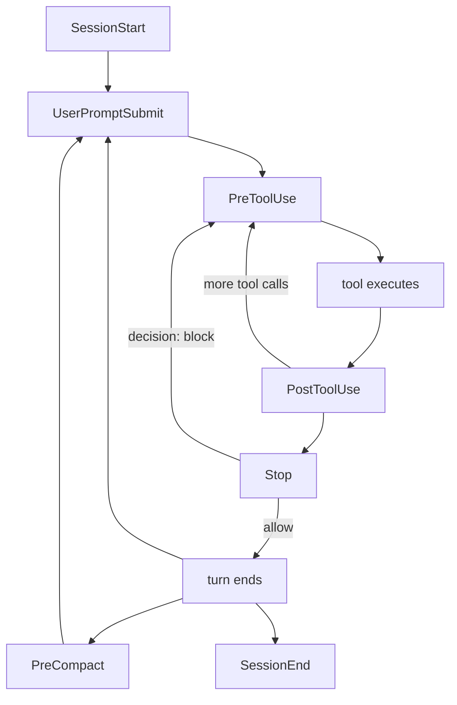

# フックシステム: セッションライフサイクル、ガード、状態同期

> **Source**: [awslabs/aidlc-workflows](https://github.com/awslabs/aidlc-workflows/tree/3c3146cfd7cef33020d48e8d48d4e80d0f8c2820) — branch `v2`, commit `3c3146cf` (v2.6.40, retrieved 2026-08-21)
> **Status**: 実装から導出した as-built 仕様であり、上流コードが本文書に優先する。
> **正本**: 英語版 `07-hooks.md`(この日本語版は参照訳。両者が食い違う場合は英語版が優先)

---

## 1. スコープと階層

フック層はフレームワークの*決定的な背骨*であり、AI-DLC のうちモデルが実行を覚えているかどうかに関わらず動く部分である。`core/hooks/` に含まれるものはすべて `bun` で実行される素の TypeScript であり、ホストハーネスが名前付きのライフサイクルイベントで呼び出し、stdin 上の JSON ペイロードを読み取り、終了コードと(任意で)stdout への1行の JSON で応答する。

`core/hooks/` には **17** 本のフックスクリプトがある([Measurement notes](#measurement-notes) の M1 参照)。うち16本はハーネスイベントに束縛されており、17本目(`aidlc-statusline.ts`)はイベントではなく Claude Code のトップレベル `statusLine` キーに束縛されている(`harness/claude/settings.json:18-20`)。

姉妹仕様との責務分担:

| トピック | 所有 |
| --- | --- |
| エンジンのディレクティブ種別、`next`/`report`/`park` の意味論 | `02-orchestration-engine.md` |
| 状態ファイルのフィールド、監査イベントの分類、ランタイムグラフ | `03-state-audit-runtime.md` |
| §12a レビュアープロトコル、questions ファイルの規約 | `04-stage-protocol.md` |
| センサーマニフェストと `sensors_applicable` の解決 | `06-sensors.md` |
| `rules_in_context` の階層化とルール執筆 | `08-memory-rules-learnings.md` |
| ハーネスごとのパッケージングと `dist/` レイアウト | `10-distribution-harnesses.md` |
| フックのテストコーパス | `12-testing-ci.md` |

本文書は、各フックが何に束縛されているか、何を保証し、何を拒否するか、そして同一の17本の本体がどのように非 Claude ランタイムへ到達するかを扱う。

### 1.1 二つの契約

17本のフックのうち16本は、エクスポートされた `run(input: string): Promise<number>` から終了コードを返す。`import.meta.main` の末尾処理がそれを `process.exit` に変換する(M14)。例外は `aidlc-fold-usage.ts` で、`run` をエクスポートせず `import.meta.main` の末尾処理も持たない。`async function main(): Promise<void>` を宣言し(`core/hooks/aidlc-fold-usage.ts:62`)、その内部から exit し(`:64`、`:69`、`:96`)、インポート時に素のトップレベル `try { await main(); } catch {}` に続けて `process.exit(0)`(`:123-128`)を通じて実行される。次の二つの契約が並立している:

* **Advisory(助言的)** — 常に `0` を返し、ホストの挙動を決して変えない。17本中11本が advisory である(M2)。`aidlc-run-sensors.ts` はこれを明示的に述べている: 「Exit-code contract (G5): always exit 0」(`core/hooks/aidlc-run-sensors.ts:15`)、`aidlc-fold-usage.ts` は「This hook OBSERVES only - it must never alter Claude Code's flow」と述べる(`core/hooks/aidlc-fold-usage.ts:26`)。stdout での沈黙がここでの規範だが普遍的ではない — 2本の advisory フックは契約として出力する。§2 の表が記録するとおり、`aidlc-session-start.ts` は成功パスで `{"additionalContext": …}` を書き(`core/hooks/aidlc-session-start.ts:289`、また `rebind_check` アームでは `:221`)、`aidlc-statusline.ts` はステータス行そのものを出力する(`core/hooks/aidlc-statusline.ts:312`、`:330`、`:342`、`:352`、すべて `printLine` 経由)。
* **Flow-altering(フロー変更)** — 6本のフックがホストの挙動を変えうる(M2、M3):
  * 5本のフックが `exit 2` とともに理由を stderr へ返す — §5 の4種の PreToolUse ガードとルール配送フック(M3)。うち3本は契約を逐語的に述べる: 「harness PreToolUse reject contract: exit 2 + stderr blocks」(`core/hooks/aidlc-review-freeze.ts:845`、`core/hooks/aidlc-reviewer-scope.ts:866`、`core/hooks/aidlc-plan-approval-guard.ts:340`。状態遷移ガードの2つの exit-2 箇所である `:956` と `:970` にはこの種のコメントはない);
  * Stop フックは stdout に `{"decision":"block","reason":…}` を出力する(`core/hooks/aidlc-continue-workflow.ts:206`)。

`aidlc-deliver-stage-rules.ts` は唯一、*成功*パスが拒否ではなく書き換えを行うフックであり、`hookSpecificOutput.updatedInput` を出力する(`core/hooks/aidlc-deliver-stage-rules.ts:286-291`)。それでも2つのアームでは拒否する — ソース順に、ルールバンドルを読み込めない場合(読取不能または非 UTF-8 のステージルールファイル)の `exit 2`(`:281-284`、エラーは `core/tools/aidlc-steering.ts:99-102` で生成)と、バンドルがシリアライズされた後に出力がサイズ上限を超えた場合の `exit 2`/`exit 3`(`:293-308`)である。§8.2 を参照。

---

## 2. フック一覧

以下のイベントとマッチャーは `harness/claude/settings.json`(リファレンス配線)から逐語的に転記したものである。「Blocking」とは、フックが非ゼロの終了コードまたは `decision: block` を返しうることを意味する。

| ファイル(`core/hooks/`) | ハーネスイベント + マッチャー | 目的(一行) | クラス |
| --- | --- | --- | --- |
| `aidlc-session-start.ts` | `SessionStart`、マッチャー `""`(`:91-97`) | `SESSION_STARTED`/`SESSION_RESUMED` を発行し、カーソルとハーネスの include をブートストラップし、intent の再バインドを提示し、ワークフローコンテキストブロックを注入する | Advisory(`additionalContext` を出力) |
| `aidlc-session-end.ts` | `SessionEnd`、マッチャー `""`(`:102-108`) | セッションのスタンプ済み intent に帰属する `SESSION_ENDED` を発行する | Advisory |
| `aidlc-record-human-turn.ts` | `UserPromptSubmit`、マッチャー `""`(`:80-86`) **かつ** `PostToolUse`、マッチャー `AskUserQuestion`(`:137-141`) | `HUMAN_TURN` の監査行を発行し、human-turn マーカーに触れる | Advisory |
| `aidlc-fold-usage.ts` | `PreToolUse`、マッチャー `""`(`:34-40`) **かつ** `PostToolUse`、マッチャー `""`(`:155-159`) | 新規のトランスクリプトターンを恒久的な使用量台帳へ折り込み、セッション/トランスクリプトのポインタを永続化する | Advisory(Claude 専用のプロデューサー) |
| `aidlc-deliver-stage-rules.ts` | `PreToolUse`、マッチャー `Task\|Agent`(`:45-49`) | すべての AI-DLC サブエージェントへの依頼文に、アクティブなステージの解決済みルールバンドルを追記する | **Flow-altering**(入力を書き換える。読み込めないルールファイルで `exit 2`、サイズ超過で `exit 2`/`exit 3`) |
| `aidlc-state-transition-guard.ts` | `PreToolUse`、マッチャー `Read\|NotebookRead\|Edit\|MultiEdit\|Write\|NotebookEdit\|LS\|Glob\|Grep\|Bash`(`:54-58`) | 直接の `aidlc-state.ts` ライフサイクル動詞、および委譲先エージェントによるライフサイクル/ルーティングコマンドを拒否する | **Blocking**(`exit 2`) |
| `aidlc-reviewer-scope.ts` | 同じ PreToolUse グループ(`:54,62`) | 派遣されたレビュアーによる兄弟 `construction/<other-unit>/` パスの読み取りを拒否する | **Blocking**(`exit 2`) |
| `aidlc-review-freeze.ts` | 同じ PreToolUse グループ(`:54,66`) | 新鮮な terminal §12a レビュー受領書を無効化してしまう `produces[]` への書き込みを拒否する | **Blocking**(`exit 2`) |
| `aidlc-plan-approval-guard.ts` | `PreToolUse`、マッチャー `Task`(`:71-75`) | 承認済みでフィンガープリント化されたコード生成計画がないまま行われる `aidlc-developer-agent` の派遣を拒否する | **Blocking**(`exit 2`) |
| `aidlc-write-audit-log.ts` | `PostToolUse`、マッチャー `Write\|Edit`(`:115-119`) | record ルートまたは codekb ルート配下への書き込みに対し `ARTIFACT_CREATED`/`ARTIFACT_UPDATED` を発行する | Advisory |
| `aidlc-run-sensors.ts` | `PostToolUse`、マッチャー `Write\|Edit`(`:115,123`) | 書き込まれたパスに glob が一致する `sensors_applicable` の各エントリについて `aidlc-sensor.ts fire` をディスパッチする | Advisory |
| `aidlc-sync-workflow-state.ts` | `PostToolUse`、マッチャー `TaskUpdate`(`:128-132`) | plan/task の更新または監査の末尾から `Current Stage` を前進のみで同期する | Advisory |
| `aidlc-rebuild-stage-graph.ts` | `PostToolUse`、マッチャー `Bash`(`:146-150`) | 遷移クラスの監査発行後にランタイムグラフを再コンパイルする。新規作成された intent をセッションへ束縛する | Advisory |
| `aidlc-validate-state.ts` | `PreCompact`、マッチャー `""`(`:164-170`) | 状態セクションを検証し、アクティブなディレクティブのコンテキストを無効化し、`SESSION_COMPACTED` を発行し、リカバリー用パンくずを書く | Advisory |
| `aidlc-log-subagent.ts` | `SubagentStop`、マッチャー `""`(`:175-181`) | エージェント種別/id と200文字のメッセージ抜粋を伴う `SUBAGENT_COMPLETED` を発行する | Advisory |
| `aidlc-continue-workflow.ts` | `Stop`、マッチャー `""`(`:186-192`) | 転送ループを強制する: エンジンを確認し、ディレクティブが保留中の間は stop をブロックする | **Flow-altering**(`decision: block`) |
| `aidlc-statusline.ts` | `statusLine` コマンド(`:18-20`) | `[AIDLC] <phase> <bar> > <stage> -- <agent>` に加えモデル/コンテキスト/コストのセグメントを描画する | Advisory(stdout がステータス行そのもの) |

イベント束縛の16本のスクリプトのうち14本は一度ずつ現れる。`aidlc-fold-usage.ts` と `aidlc-record-human-turn.ts` はそれぞれ2回現れ、8つのイベントにまたがって18のコマンドエントリを構成する(M4)。

---

## 3. 共通基盤

すべてのフック本体は、`core/tools/aidlc-lib.ts` にある同じ一握りのシーム(seam)の上に構築されている。

**プロジェクトディレクトリ解決。** `resolveProjectDirFromHook(import.meta.url)`(`core/tools/aidlc-lib.ts:529-558`)は、順に、`AIDLC_PROJECT_DIR`、`CLAUDE_PROJECT_DIR`、スクリプトパスからの導出(*既知の*どのハーネスディレクトリについても `<harness>/hooks` を取り除く)、そして既知のハーネスディレクトリを探す cwd プローブ、最後に素の cwd を試す。これが同一ファイルをハーネス中立にしている理由であり — `aidlc-statusline.ts:37-40` は意図的に共有シームを使う旨を「rather than a private .claude-hardcoded copy」と注記している。

**TTY ガード。** ほぼすべてのフックは `process.stdin.isTTY` のとき早期に終了する。端末上ではハーネスの JSON が来ないため、stdin のブロッキング読み取りがターンをハングさせるからである(例: `core/hooks/aidlc-log-subagent.ts:30`、`core/hooks/aidlc-run-sensors.ts:59`、`core/hooks/aidlc-continue-workflow.ts:1091`)。

**ペイロード形状。** stdin の正規形は `ClaudeCodeHookInput` であり、`isClaudeCodeHookInput` により検証される。フックが読むフィールドは `hook_event_name`、`tool_name`、`tool_input`(`file_path`、`command`、`status`、`activeForm`、`subagent_type`、`prompt`、`source`)、`tool_response`、`agent_type`、`agent_id`、`last_assistant_message`、`session_id`、`transcript_path`、`source`、`reason`、`stop_hook_active`、`cwd`、およびアダプター専用の `scoped_registration` である。

**アクティブなワークフローへの自己ゲート。** 「やるべきことがあるか?」という一様なテストは `existsSync(stateFilePath(projectDir))` であり、`session-start`(`:120-123`)、`session-end`(`:74`)、`record-human-turn`(`:32`)、`run-sensors`(`:110`)、`plan-approval-guard`(`:284`)、`continue-workflow`(`:1095-1096`)で使われている。いくつかのフックはさらに既存の監査ファイルの存在にもゲートし、台帳を*決して作成しない*ようにしている(`aidlc-write-audit-log.ts:109`、`aidlc-run-sensors.ts:102`)。

**ヘルスとドロップ。** ほとんどのフックはハートビート `<record>/.aidlc-hooks-health/<hook>.last` を書き込み(`hooksHealthDir` は `core/tools/aidlc-lib.ts:5899-5901`)、どのフックも `recordHookDrop` 経由でタブ区切りの行として失敗を `<hook>.drops` に記録できる(`core/tools/aidlc-lib.ts:9886-9900`)。`--doctor` は両方を読む。カバレッジは**一様ではない**: 17本中12本がヘルスディレクトリに何らか触れ、5本はどちらにも触れない(M13) — `aidlc-deliver-stage-rules.ts`、`aidlc-fold-usage.ts`、`aidlc-record-human-turn.ts`、`aidlc-state-transition-guard.ts`、`aidlc-statusline.ts` は `.last` を書かず `recordHookDrop` も呼ばない。このうち2本はガードの物語にとって重要である: 状態遷移ガード(§5 の4種の PreToolUse ガードの一つ)とルール配送フック(§8.2)は生存証跡を一切残さないため、`--doctor` はこれらについて「実行して許可した」と「一度も発火していない」を区別できない — その観測可能な証拠は、実際にブロックした際に発行する拒否の監査行であって、ヘルスディレクトリではない。オプトインのトレースは `hookDebug` 経由で `<health>/hook-debug.log` に書き込まれ、`AIDLC_HOOK_DEBUG` または `aidlc/.aidlc-hook-debug` マーカーで有効化される(`core/tools/aidlc-lib.ts:9917-9928`)。

**既定の失敗モードとしての fail-open。** §5 の4つの PreToolUse ガードはいずれも、不正な stdin、状態ファイルの欠落、グラフの読取不能、あるいは任意の throw を*許可*として扱う(`aidlc-state-transition-guard.ts:941-944`、`aidlc-plan-approval-guard.ts:270`、`:284`、`:301`、`aidlc-review-freeze.ts:755`、`:809`、`aidlc-reviewer-scope.ts:734`、`:800`、`:830`)。これはこれら4つのガードの性質であって、フロー変更フック一般の性質ではない: §8.2 のルール配送フックも不正な stdin では fail-open するが(`aidlc-deliver-stage-rules.ts:267-271`)、自身の2つの拒否アームは fail-open では*ない* — 読み込めないルールバンドルでは `exit 2`、サイズ超過では `exit 2`/`exit 3` を返す(§1.1)。§12a 時代の3種のガードはそれぞれ決定的なオフスイッチも備える: `AIDLC_DISABLE_PLAN_APPROVAL_GUARD=1`(`aidlc-plan-approval-guard.ts:249`)、`AIDLC_DISABLE_REVIEWER_SCOPE_HOOK=1`(`aidlc-reviewer-scope.ts:716`)、`AIDLC_DISABLE_REVIEW_FREEZE_HOOK=1`(`aidlc-review-freeze.ts:737`)。

**有界ロック下での監査。** ブロッキングガードは、`acquireAuditLock(projectDir, 5, 50)` でラップされた `appendAuditEntryUnlocked` を通じて拒否の行を発行する — 50 ms 間隔で5回の試行という、標準の予算を大きく下回る値であり、「a dropped advisory row is preferable to a slow block(advisory な行が失われる方が、遅いブロックよりましである)」という考え方である(`aidlc-review-freeze.ts:814-818`、`aidlc-plan-approval-guard.ts:307-312`)。

---

## 4. セッションライフサイクル



テキストによるフォールバック: `SessionStart` は会話ごとに一度だけ実行され、その後は `UserPromptSubmit → PreToolUse → tool → PostToolUse → … → Stop` のループがターンごとに繰り返される。Stop フックはブロックすることでツールループへ再突入できる。`PreCompact` はホストがコンテキストを圧縮するたびに発火する。`SessionEnd` は末尾に一度だけ発火する。`SubagentStop` はツールループの内側で、完了したサブエージェントごとに発火する。

### 4.1 SessionStart — `aidlc-session-start.ts`

順序付けられた効果(それらを失いうる早期終了より前にすべて実行される):

1. `source`(`startup`、`resume`、`clear`、`compact` のいずれか。未認識ペイロードは `unknown`、パース不能な JSON は `malformed` — `:60-93`)、および `session_id`、`transcript_path`、Cursor 専用の `rebind_check` プローブフラグを解析する。
2. トランスクリプトのポインタとライブなセッション id を永続化する — これは事前ワークフロー起動を含む**すべての**発火で行われ、後の intent 誕生がそれへ束縛できるようにする(`:100-109`)。
3. `ensureActiveSpaceCursor(projectDir)` に続いて `repointHarnessIncludes(projectDir, activeSpace(projectDir))` — gitignore 対象のスペースカーソルを実体化し、ハーネスネイティブの include を再整列する(`:113-118`)。
4. 状態ファイルが存在しなければ、セッションアイデンティティだけを保持して return する(`:120-123`)。
5. セッションイベントを発行する。マッピングは明示的である(`:134-139`): `startup → SESSION_STARTED`、`clear → SESSION_STARTED`、`resume → SESSION_RESUMED`、`malformed → SESSION_STARTED`、`compact`/`unknown` → **発行なし**。これは `SESSION_COMPACTED` が PreCompact フックの所有物であるためである(「firing it twice would pollute the audit trail(二度発行すると監査証跡を汚染する)」、`:17-18`)。
6. **再開時の再バインド。** セッションから intent へのスタンプはセッションごとに `aidlc/.aidlc-sessions/<id>` に存在する。STARTED 系のイベントではライブな intent の UUID がスタンプされる。`resume` において*別の、なお解決可能な*スタンプ済み UUID があれば、フックは `INTENT REBIND OFFER: This conversation was working …` で始まる提案を組み立て、正確な切替コマンドを名指しする — Codex では `$aidlc`、それ以外では `/aidlc` を使う(`:181-192`)。セッションは直ちにライブな intent へ再スタンプされ、拒否された提案が旧ワークフローへ使用量を付けたままにしないようにする。
7. **ステージグラフのドリフト advisory。** `stageGraphDrift()` は、ディスク上に存在するがコンパイル済みグラフにはないステージ `.md` ファイルを報告し、`aidlc-graph.ts compile` を実行するようオペレーターへ注記する(`:260-270`)。壊れたグラフが起動をブロックしないようラップされている。
8. `{"additionalContext": …}` を出力する。注入されるブロックは `AIDLC WORKFLOW ACTIVE` で始まり、Scope / Lifecycle Phase / Current Stage / Status / Active Agent / Last Completed / Next Action を運ぶ。任意の `Active Unit:` チェックポイント行、コンパクション時のパンくずの注記、ドリフトの注記、そして `FORWARDING-LOOP DISCIPLINE (non-negotiable — the engine owns ALL routing)` 節を含み、これは2つの規則を固定する: ユーザーの `/aidlc` フラグを最初の `next` へそのまま通すこと、そしてディレクティブが `{kind:"print"}` でコマンドを名指ししている場合はそのコマンドを厳密にそのまま次のツール呼び出しとして実行すること(`:272-285`)。

`rebind_check` パス(Cursor の `beforeSubmitPrompt`)はステップ6の後で短絡する: セッションイベントを発行せず、提案のみを出力し、ドリフトを消費するので警告は繰り返されない(`:218-224`)。

### 4.2 ターンごとのメンテナンス

* **人間の存在**(Human presence) — `aidlc-record-human-turn.ts` が `UserPromptSubmit` と、回答済みウィジェットの `PostToolUse AskUserQuestion` で動く。§6 参照。
* **使用量の折り込み** — `aidlc-fold-usage.ts` は*あらゆる* PreToolUse と PostToolUse で実行される。根拠は、最終ではない LLM 呼び出しは必ずツール使用で終わるため、PostToolUse がすべての中間呼び出しを捕捉し、Stop フックが最終的な `end_turn` を捕捉するというものである(`:1-18`)。折り込みモード: PostToolUse は `holdback`(ファイルごとの最後の未完了メッセージ id グループは、後の折り込みがそれを閉じるまで決してカウントされない)を使い、PreToolUse は `seal-main` を使うが、差し迫った呼び出しがライフサイクル境界のとき `flush-all` へ格上げされる(`:82-90`)。この判定は状態遷移ガードからインポートされた `isLifecycleBoundaryToolCall` → `isLifecycleBoundaryCommand` で行われる。キルスイッチ: `AIDLC_DISABLE_USAGE_TRACKING=1` は stdin を読む前に終了する(`:69`)。リーダーは Claude のトランスクリプトに固有であるため、Kiro/Codex/opencode では「their ledger is never written and every usage consumer degrades silently to no-data」となる(`:22-24`)。
* **成果物の監査** — `aidlc-write-audit-log.ts`。2つのパスアーム: `docsRoot(projectDir)`(intent ごとの record ルート)配下、またはアクティブなスペースの `codekb/` ルート配下(`:75-92`)。codekb アームが存在するのは、逆行分析(reverse-engineering)の成果物がスペースレベルで存在し、そうでなければ承認時の改訂バックストップから見えなくなるためである。再帰ガードは `audit.md` と `audit/<shard>.md` をスキップする(`:97-104`)。CREATE と UPDATE の区別: `Edit` は常に `ARTIFACT_UPDATED` である。`Write` は `|mtimeMs − birthtimeMs| < 10` のとき `ARTIFACT_CREATED`、それ以外は `ARTIFACT_UPDATED` であり、stat の失敗時は CREATED をデフォルトとする(`:143-159`)。
* **センサー** — `aidlc-run-sensors.ts`。解決順序: アクティブなディレクティブマーカーのステージ、それがなければ `Current Stage`(そしてマークされたステージがグラフに存在しない場合は再び戻る — `:162-179`)。次に `stageNode.sensors_applicable`。`matches` glob がそのファイルに一致するエントリごとに `bun aidlc-sensor.ts fire <id> --stage <slug> --output-path <path>` をディスパッチする(`:202-236`)。「matches IS the filter. Entries without a matches glob do not fire」(`:194`)。サブプロセスタイムアウトの既定値は90秒で、`AIDLC_SENSOR_TIMEOUT_MS` で上書き可能(`:49-50`)。タイムアウト、spawn 失敗、非ゼロのディスパッチャ終了コードは、それぞれ別個のドロップとして記録される(`:249-271`)。ワークスペースごとの初回発火時に一回限りの stderr バナーが出力される(`:143-153`)。
* **ステージポインタの同期** — `aidlc-sync-workflow-state.ts`。2つの起動パス。`TaskUpdate` パスは `status === "in_progress"` を要求し(`:95`)、`activeForm` の末尾が `[slug]` である部分から `/\[([a-z][a-z0-9-]*)\]$/` によりスラッグを抽出する(`:98`、アームは `:93-100`)。`tool_input.source === "ide-audit-sync"` パス(タスクペイロードを一切提示しない Kiro IDE 向け)は、監査の末尾にある直近の `STAGE_STARTED` からスラッグを導出し、3つの前進のみのガードの下に置かれる: `Status` は `Running` でなければならない(`:73`)。`Current Stage` は空でも `none` でもあってはならない(`:74`)。そして監査上のスラッグは、チェックボックスがすでに `completed` または `skipped` であるステージを名指ししてはならない(`:82-90`) — アームは `:54-90`。どちらの経路でも `aidlc-utility.ts set-status --stage <slug> --project-dir <dir>` にシェルアウトする(`:109-118`)。
* **グラフ再コンパイル** — `aidlc-rebuild-stage-graph.ts`。§8.1 参照。
* **サブエージェントの完了** — `aidlc-log-subagent.ts` は、監査ファイルがすでに存在するときに限り、`Agent Type`、任意の `Agent ID`、200文字に切り詰めた `Message` を伴う `SUBAGENT_COMPLETED` を発行する(`:41-55`)。

### 4.3 PreCompact — `aidlc-validate-state.ts`

実際のコンパクション時点で発火するため、その記録はちょうど一つのタイムスタンプ付きレコードとなる。効果:

1. `invalidateActiveDirectiveContext(projectDir, content, sessionId)` — アクティブなディレクティブロックの下で、マーカーが v2 であり、このセッションが所有し、プロジェクト/intent/state のダイジェストが一致する場合に限り、`context_epoch` をインクリメントし、マーカーの `kind` を `"error"` に書き換え、`part`/`parts`/`continue_token` をクリアする(`core/tools/aidlc-lib.ts:3207-3232`)。呼び出し全体は本体が単一コメントの `try`/`catch` の中にある — 「Missing/malformed or foreign compaction is coordination-neutral」(`aidlc-validate-state.ts:43`、catch は `:42-44`) — したがって、パース不能なペイロードや別セッション所有のマーカーは黙ってスキップされる。
2. 構造検証: 状態ファイルは `## Stage Progress` と `## Current Status` を含んでいなければならない。欠落しているセクションは stderr へ `WARNING:` として出力され、文字列 `INVALID — missing sections: …` に折り込まれる(`:46-57`)。
3. `<record>/.aidlc-recovery.md` を書く。これは4行のパンくず(`# AIDLC Recovery Breadcrumb`、`**Last validated**`、`**Current stage**`、`**State file**`)であり、SessionStart が後で `NOTE: A compaction recovery breadcrumb exists …` として表示する(`:63-67`、`aidlc-session-start.ts:250-252`)。
4. 監査ファイルが存在するとき、`Current Stage` と `State Validity`(`valid`/`invalid`)を伴う `SESSION_COMPACTED` を発行する(`:69-85`)。

### 4.4 SessionEnd — `aidlc-session-end.ts`

`Reason` フィールド(stdin に何もない場合は `unknown`)を伴う `SESSION_ENDED` を発行する。帰属は意図的に fail-closed である: ペイロードが `session_id` を持つ場合、フックはそのセッションのスタンプ済み intent の UUID を解決し、次の2つのケースで共有カーソルへのフォールバックを拒否する — 未知の intent を名指しするスタンプ(ドロップ理由: `session <id> is stamped to unknown intent <uuid>; refusing active-cursor fallback`、`:53-58`)、そして、アクティブな UUID を*持つ*ワークスペースにおけるスタンプなしのセッション。これは「Falling back to the shared cursor here can attribute a concurrent pre-workflow session's end to an intent it never invoked(ここで共有カーソルへフォールバックすると、並行する事前ワークフローセッションの終了を、そのセッションが一度も呼び出していない intent へ帰属させかねない)」ためである(`:63-66`)。アクティブな UUID を持たないフラット/レガシーなワークスペースは、カーソルへのフォールバックを維持する。ハートビートは監査行と同じ解決済み intent に対して書かれる(`:76-79`)。

なお、ワークフローのライフサイクルはセッションのライフサイクルから明示的に独立している: 「ending a session does NOT complete the workflow. This event is observability only(セッションを終了させることはワークフローを完了させない。このイベントは可観測性のためだけである)」(`:2-3`)。

### 4.5 ステータスライン — `aidlc-statusline.ts`

イベントフックではなく、Claude Code がステータスエリアのために呼び出すものである(`harness/claude/settings.json:18-20`)。プロジェクトディレクトリは `AIDLC_PROJECT_DIR`、次に stdin の `workspace.project_dir`、そして共有フックシームの順に解決する(`:28-41`)。状態ファイルがなければ `[AIDLC] ready` を出力し、そうでなければ `[AIDLC] <prefix><phase> <bar> <done>/<total> > <stage> -- <agent>`、または `Status` が `Completed`/`Complete` のとき `[AIDLC] <prefix>COMPLETE <bar>` を出力する(`:303-355`)。右側のセグメントは省略されたモデル id(Bedrock の推論プロファイルの接頭辞は `BR:` へ折りたたまれる、`:44-60`)、コンテキストウィンドウの使用率、そしてトランスクリプトではなくロールアップ済みの使用量台帳から読んだコストのセグメントを運ぶ(`:22-25`)。

---

## 5. ガードの詳細

4つの PreToolUse ガードが、散文だけでは実地のトレースで失われてしまう順序性を強制する。それぞれ狭くスコープされ、対象ウィンドウの外では fail-open し、自身の拒否を監査する。

### 5.1 `aidlc-state-transition-guard.ts` — ライフサイクル所有権

幅広いマッチャーに配線されているが自己フィルタリングを行う: `if (parsed.tool_name !== "Bash") return 0;`(`:946`)。独立した2つの拒否を持つ。

**(a) 直接の状態遷移。** `directStateTransition(command)` は、*シェルコマンド位置*にある `aidlc-state.ts` の呼び出しで、最初の動詞が `BLOCKED_STATE_TRANSITIONS`(11個の動詞、M5)に含まれるものを走査する: `set`、`checkbox`、`advance`、`finalize`、`complete-workflow`、`gate-start`、`approve`、`reject`、`revise`、`skip`、`park`(`:15-27`)。拒否メッセージは逐語で次のとおり(`:950-954`):

> `[aidlc] Direct aidlc-state.ts <verb> is blocked: stage status is changed by the workflow tools, not by hand, so that the state file, the audit log, and the compiled stage graph stay in agreement. Use aidlc-orchestrate.ts report --stage <slug> --result <awaiting-approval|approved|rejected|revised|completed|skipped>; use aidlc-orchestrate.ts park to pause the workflow, and next/jump to change routing.`

**(b) 委譲先エージェントによるライフサイクル呼び出し。** `agent_type` が非空のとき(すなわち呼び出しがサブエージェントに由来するとき)、`delegatedLifecycleCommand(command)` は、ライフサイクルまたはルーティングの境界を越えるコマンドを探す: `aidlc-orchestrate.ts next|continue|report|park`、`aidlc-state.ts <verb ∈ DELEGATED_STATE_MUTATIONS>`、`aidlc-jump.ts execute`、そして等価な `aidlc-utility.ts` / `aidlc.ts` / `aidlc` ディスパッチャの綴りでワークスペース変更を含むもの(`:906-932`)。`DELEGATED_STATE_MUTATIONS` はブロック対象の集合に加えてさらに9個を持つ(M5): `set-skeleton-stance`、`set-construction-iteration`、`acknowledge-compaction`、`reuse-artifact`、`practices-event`、`practices-promote`、`fork`、`merge`、`unpark`(`:29-40`)。拒否メッセージは逐語で次のとおり(`:967-968`):

> `[aidlc] Delegated agent "<agentType>" cannot run <command>: workflow lifecycle and routing are conductor-owned. Return the artifact, contribution, or review verdict to the invoking orchestrator without parking, resuming, reporting, routing, or presenting a gate.`

面白いのはパーサーの部分である。マッチングの前に、`executableShellText` が引用符付きの区切り文字、heredoc の本体、関数定義をマスクする(`:178-182`)ため、`echo "… aidlc-state.ts approve"` が呼び出しと誤認されることはない。一方で二重引用符内の `$(...)` は実行可能なシェルであるため*保存される*(`:81-86`)。委譲先スキャナーはコマンド置換、heredoc、`eval`、`sh -c` を深さ8まで再帰的に辿り、解決できないものについては**fail-closed** し、同じ拒否の枠に出力される5つのセンチネル理由のいずれかを返す: `nested shell command beyond guard inspection limit`(`:807`)、`dynamic executable beyond guard inspection`(`:839`、`:844`)、`execution wrapper beyond guard inspection`(`:848`)、`dynamic shell command beyond guard inspection`(`:882`、`:887`)、`dynamic eval shell command beyond guard inspection`(`:859`、`:863`)。

同じモジュールは `isLifecycleBoundaryCommand`(`:211-222`)もエクスポートしており、これは使用量フックがサブエージェントの holdback をいつフラッシュするかを判断するために再利用する — 「flushing subagent holdback is destructive if the apparent lifecycle command is only prose(見かけ上のライフサイクルコマンドが単なる散文にすぎない場合、サブエージェントの holdback をフラッシュすることは破壊的である)」という理由から `isEngineToolCall` より意図的に厳格である(`:208-210`)。

### 5.2 `aidlc-plan-approval-guard.ts` — 生成前の計画

ちょうど一つのディスパッチだけをガードする: tool ∈ `{Task, Agent}`(`DISPATCH_TOOLS`、`:82`)、`subagent_type === "aidlc-developer-agent"`(`:77`)、アクティブなステージが正規化すると `code-generation` になる(`:76`、`normalizeStageName` は `:117-119`)。アクティブなステージはアクティブなディレクティブマーカーから読まれ、`Current Stage` がフォールバックとなる(`:287`)。

そのウィンドウが与えられたとき、ディスパッチが許可されるのは、依頼文が**厳密に一つ**の異なる `AIDLC-UNIT:` マーカー(`UNIT_MARKER_RE`、`:121`)を運び、そのマーカーが既知の unit を名指しし、そのユニットが6つの根拠ビットすべてを満たす場合のみである(`:159-165`): `planExists`、`instructionsExist`、`approved`、`contractValid`、`fingerprintValid`、`contractHash !== null`。さらに、その unit の現在の契約ハッシュに等しい値を持つ `AIDLC-TESTING-CONTRACT` マーカーが厳密に一つ必要である(`:169-175`)。既知の unit は、コンパイル済みの Bolt DAG と、ディスク上のすべての `construction/<unit>/` ディレクトリとの和集合である(`:209-228`)。

拒否メッセージは逐語で次のとおり(`:192-199`):

> `plan-approval guard: code-generation must not dispatch aidlc-developer-agent before the plan, unit-test instructions, and current Testing Contract are fingerprinted and approved for <scope>. Follow the stage file's Steps 2-3 first: write the plan and instructions, embed the resolver's ## Testing Contract JSON, record its current [Approval Fingerprint], present the Plan Approval question, END the turn, and record the human's explicit "Approve Plan" answer. Only then dispatch generation (Step 4), starting the delegation prompt with "AIDLC-UNIT: <unit>" and "AIDLC-TESTING-CONTRACT: <contract hash>". code-generation-plan.md is the INPUT to generation, never a retroactive summary.`

`<scope>` は `unit <name>`、`one unit (conflicting AIDLC-UNIT markers: a, b)`、または `one unit (AIDLC-UNIT marker missing)` としてレンダリングされる(`:185-190`)。実際に発生した各ブロックは、`Tool`、`Target`、`Stage`、`Unit`(欠落時はリテラル `(missing marker)` にフォールバック)を伴う `PLAN_APPROVAL_BLOCKED` を発行する(`:314-322`)。

そもそもの発端となった失敗は、ヘッダーに記録されている: ある conductor が「generated the code first and backfilled the plan beside code-summary.md, making the plan an output instead of the input(先にコードを生成し、code-summary.md の隣に計画を後付けし、計画を入力ではなく出力にしてしまった)」というもので、完了時の成果物ガードではこれを捕捉できない。なぜならその時点では後付けされた計画がすでに存在するからである(`:7-11`)。

### 5.3 `aidlc-review-freeze.ts` — terminal 受領書の書き込みフリーズ

エンジンの完了前提条件を保護する: `REVIEW_COMPLETED` 受領書は、それが発行された後で宣言済みの `produces[]` 成果物が書き込まれると無効化される。無効化を起こしてゲートを詰まらせるのではなく、このフックは先に書き込みそのものを拒否する。

フリーズウィンドウ、3条件すべて(`:18-27`):

1. 対象が、**レビュアーを持つ**ステージ(`stage.reviewer`)の宣言済み `produces[]`/`optional_produces[]` 成果物に一致すること — エンジンと同じ `producesArtifactUnit` サフィックスマッチャーを使用する;
2. そのステージが状態ファイル上で completed でも skipped でもないこと(`:779-783`);
3. **新鮮な terminal 受領書**が書き込み対象を覆っていること — ステージレベルの成果物についてはそのステージの受領書、per-unit の書き込みについてはその unit の受領書(`judgeFreeze`、`:681-713`)。曖昧な per-unit パスについては、エンジンはすべての unit 受領書をクリアすることで fail-closed するため、このフックは、いずれかの unit が terminal な `READY` または `NOT-READY` を保持していればフリーズする(`:700-707`)。

書き込み対象は `writeTargets`(`:647-667`)から取得される: `Write|Edit|MultiEdit|NotebookEdit` の集合(`WRITE_TOOLS`、`:81`)が `file_path`/`notebook_path`/`path`/`paths` を提供し、**Bash も検査される** — `shellWriteTargets` は出力リダイレクションと一般的な変更コマンドのオペランドを抽出する。これは「shell writes do not pass through the Write/Edit PostToolUse audit feed, so allowing one after a terminal receipt would leave it fresh over different bytes(シェルによる書き込みは Write/Edit の PostToolUse 監査フィードを通過しないため、terminal 受領書の後にそれを許すと、異なるバイト列に対して受領書が新鮮なまま残ってしまう)」ためである(`:45-49`)。

拒否メッセージは逐語で次のとおり(`:722-729`):

> `review-freeze: "<target>" is a declared produces[] artifact of <scope>, which holds a fresh terminal review receipt. Writing it now would invalidate that receipt and the engine would refuse the gate (stage-protocol-reviewer.md §12a: the terminal receipt ends artifact work). Present the gate instead - quote any reviewer suggestions there verbatim for the human to weigh. If the artifact genuinely needs changes, reject at the gate (or have the human request changes); the recorded rejection lifts this freeze and the revision then re-runs the stage-protocol-reviewer.md §12a reviewer for a fresh receipt.`

`<scope>` は `stage "<slug>"` または `stage "<slug>" unit "<unit>"` である(`:720`)。ブロックは `Tool`、`Target`、`Stage`、任意の `Unit` を伴う `REVIEW_FREEZE_BLOCKED` を発行する(`:824-831`)。

新鮮さのスキャン(`freshReviewReceipts`)は*エンジンと共有*されているため、フリーズはエンジンの下限をリセットするのと同じイベントで自動的に解除される: `GATE_REJECTED`、`STAGE_JUMPED`、`WORKFLOW_STARTED`(`:28-33`)。閾値未満の adversarial な `NOT-READY` は非 terminal のままであり、その修復ループは引き続き編集できる。terminal な `NOT-READY` は `READY` とまったく同様にフリーズする。「because no further review pass follows it(それに続く追加のレビューパスがないため)」(`:33-35`)。コスト管理: `readAllAuditShards(projectDir).length === 0` のとき、このフックは状態やグラフに触れる前に返る(`:766-770`)。

### 5.4 `aidlc-reviewer-scope.ts` — per-unit のレビュアー読み取り範囲

§12a のルールを強制する。あるユニットのために派遣されたレビュアーは、別のユニットの `construction/<other-unit>/` の内容を読んではならない。「not by opening files, and not via grep, glob, or shell patterns that span sibling unit paths(ファイルを開くことによっても、兄弟ユニットのパスにまたがる grep・glob・シェルパターンによっても)」(`:4-7`)。

**レビューが進行中であることをどう知るか。** conductor は §12a のステップ1で `<record>/.aidlc-reviewer-dispatch.json` を書き、ステップ3でそれを削除する。そのスキーマは `{reviewer, stage, unit, exempt[]}` であり、`parseDispatchRecord` によって検証される — 形が少しでも合わなければ null を返し、強制は `reviewer dispatch record is malformed; enforcement skipped` というドロップ理由とともにスキップされる(`:667-680`、`:803`)。このレコードは新鮮な間だけ尊重される: `REVIEWER_DISPATCH_TTL_MS = 6 * 60 * 60 * 1000`(6時間、`core/tools/aidlc-lib.ts:6108`)。それより古いレコードはリンク解除され、ドロップ理由 `ignoring an orphaned reviewer dispatch record (older than the freshness window); cleaned it up` とともに無視される(`:790-795`)。

**アイデンティティ。** ハーネスが `agent_type` を届ける場合(Claude、Codex)は `agentType === dispatch.reviewer`。それ以外の場合はアダプターが表明する `scoped_registration === true`(Kiro CLI はこのフックをレビュアーエージェント自身の JSON 設定内に登録する)。それ以外はすべて素通しされる(`:815-819`)。レコードが存在しないが、出荷済みのレビュー専用エージェント(`/^aidlc-(architecture-reviewer|product-lead)-agent$/`、`:706`)が `construction/` 配下のパスに触れた場合、このフックはレート制限された advisory ドロップ(10分に最大1回)を記録し、ステップ1の書き込みの欠落を指し示す(`:753-774`)。

**何が検査されるか。** パス形のツールフィールド、Bash コマンドのテキスト、Glob/Grep の `glob`/`path` フィールド。Grep の `pattern`(*内容*の正規表現)は意図的にスキャンされない。「matching file content is not a file access(ファイル内容に一致することはファイルアクセスではない)」からである(`:106-109`)。兄弟セグメント内のあらゆる glob メタ文字(`/[*?[\]{}]/`、`:102`)は、ユニットをまたぐものとしてカウントされる。パスを持たない `Grep`、あるいはパターンがカレントユニットに制約されていないパスを持たない `Glob` は、`.` から再帰したものとして判定される(`:653-662`)。シェル処理には、grep 系ツール、ripgrep、`find`、単純なファイルコマンド、汎用フォールバックのための専用の判定器がある(`:455-583`)。

拒否メッセージは逐語で次のとおり(`:688-697`):

> `[aidlc] reviewer read-scope: "<target>" reads another unit's files under construction/. This review covers unit <unit> only, plus the specific files you were handed (the stage file, the questions file, and the shared design documents this unit builds on). Check cross-unit claims against those handed files instead of opening another unit's work. If this unit's design names an integration point in another unit's file, say so in your findings rather than reading it; the only files readable outside this unit are the ones the conductor listed as exceptions when it started the review. (If you meant a file in the CURRENT unit, write the unit name out in full - a shell variable in the path cannot be checked, so it is refused; searches must stay inside the current unit's path.)`

ブロックは `REVIEWER_SCOPE_BLOCKED` を発行する(`:845`)。括弧書きの部分に注意: パス中の解決不能なシェル変数は、推測されるのではなく拒否される — 状態遷移ガードの動的コマンド用センチネルと同じ fail-closed の姿勢である。

---

## 6. 人間の存在 — `aidlc-record-human-turn.ts`

ツリー中で最小のフック(45行、M1)であり、承認ゲートの認可モデルの基盤である。

**何が human turn とみなされるか。** リファレンスハーネスに配線された2つのシーム: 空マッチャーの `UserPromptSubmit`(`harness/claude/settings.json:80-86`)と、マッチャー `AskUserQuestion` の `PostToolUse`(`:137-141`) — すなわち、実際のプロンプト、または回答済みの質問ウィジェットである。このフックは**存在のみ**を扱う: 「the prompt text is irrelevant, so stdin is not read(プロンプトのテキストは無関係であるため、stdin は読まれない)」(`core/hooks/aidlc-record-human-turn.ts:9`)。

**どこに記録されるか。** 決して食い違わないよう、一つのシームから書かれる2つの成果物(`:19-24`):

1. `appendAuditEntry("HUMAN_TURN", {}, projectDir)` — ディスク上のカーソルから解決される、アクティブな intent の追記専用監査シャードへの一行。ペイロードは不要。
2. `markHumanTurn(projectDir)` — record ディレクトリ内の `.aidlc-human-turn` に触れる(`core/tools/aidlc-lib.ts:6024-6027`)。

**それぞれを何が消費するか。** 台帳イベントは*人間の存在ゲート*に供する: `handleApprove` / `handleAnswer` は次の理由で拒否する: 「unless a HUMAN_TURN was recorded since the last gate resolution, so a model under autopilot cannot fabricate an approval with no human having acted this turn(前回のゲート解決以降に HUMAN_TURN が記録されていない限り拒否する。これにより、自動操縦下のモデルが、このターンで人間が何も行動していないのに承認を捏造することはできない)」(`:4-7`)。マーカーは、トランスクリプトを提示しないハーネス上での Stop フックの tier-3 な会話的カーブアウトに供する。それには「直近の人間のプロンプトはいつだったか、直近のエンジン前進と比べて」という安価な比較が必要である(`:20-23`)。

**保証と限界。**

* `existsSync(stateFilePath(projectDir))` に自己ゲートされている(`:32`)ため、ハーネスの外殻は持つがフレームワークを一度も実行していないプロジェクトは、プロンプトのたびに監査シャードを足場立てたり成長させたりしない。空の台帳ではゲートが fail-open するため、そこでの発行のスキップは安全である(`:14-16`)。`markHumanTurn` は `workflowIsBorn`(`core/tools/aidlc-lib.ts:6013-6019`)経由で同じ自己ゲートを繰り返しており、これは「`aidlc-orchestrate next` は何も誕生させない純粋な読み取りである」という不変条件にとって支えとなっている。
* 完全に fail-open である: 本体は素の `try/catch` であり0を返す — 「a mint failure must never block the human's turn(発行の失敗が人間のターンをブロックすることは決してあってはならない)」(`:36-38`)。
* 記録されるイベントが証明するのは**順序と存在だけ**である。ハーネスは信頼できる応答テキストを一様には公開しないため、後の `--user-input` / `--feedback` / `--details` の散文を認証するものではない(`docs/reference/06-hooks-and-tools.md:40`)。

このマーカーと対をなす書き手は `markEngineTouch`(`core/tools/aidlc-lib.ts:6052-6057`)であり、`aidlc-orchestrate.ts` の `next`/`report`/`park` からのみ触れられ、`AIDLC_STOP_HOOK_PROBE=1` のときは抑制される — §7.3 を参照。

---

## 7. Stop フック — `aidlc-continue-workflow.ts`

最大のフック(1421行、M1)であり、唯一ターンを生かし続けられるフックである。その目的: 転送ループは「cannot rest on the conductor's good behaviour: when the conductor tries to end its turn, this hook runs the engine (`aidlc-orchestrate next`) and, if a directive is still PENDING, blocks the stop and injects the directive back via `reason`(conductor の善良な振る舞いに頼ることはできない。conductor がターンを終えようとするとき、このフックはエンジン(`aidlc-orchestrate next`)を実行し、ディレクティブがまだ PENDING であれば stop をブロックし、`reason` 経由でディレクティブを注入し直す)」(`:14-19`)。

### 7.1 セキュリティの枠組み

注入される reason は意図的に**タスクに沿った継続**であり、決して override 形の指示ではない: 「override-shaped directives are refused by the conductor's own safety training, so a buggy or compromised engine can only ever CONTINUE sanctioned work, never hijack the session(override 形のディレクティブは conductor 自身の安全訓練によって拒否されるため、バグのある、あるいは侵害されたエンジンであっても、承認済みの作業を CONTINUE することしかできず、セッションを乗っ取ることは決してできない)」(`:22-27`)。

一般的な継続メッセージは次のとおりである(`:1062-1071`):

> `The AIDLC workflow has a pending step (a <kind> directive for "<stage>"). You have not finished the workflow loop yet. Run \`bun <harness>/tools/aidlc-orchestrate.ts next\`, do what the step it prints asks, then run \`aidlc-orchestrate report --stage <stage> --result <outcome>\` to record the outcome. Repeat until it answers \`done\`. If you meant to pause this workflow instead and pick it up in a later session, run \`bun <harness>/tools/aidlc-orchestrate.ts park\` to stop cleanly between stages - never mark a stage complete just to end the turn.`

他に4つの形が存在する: 新鮮な `next` を一つ要求し、以前の継続トークンの再利用を禁じる `rehydrate` 変種(`:1042-1044`); Copilot のセッション所有パス向けに保持されている `load-steering` および `run-stage` の変種(`:1045-1050`); そして正確な `rules_content` の JSON ペイロードと `continue "<token>"` コマンドをインラインで含み、「Do not summarise or narrate these rule chunks to the user(これらのルールの断片をユーザーへ要約したり語ったりしないこと)」という指示を伴う `load-steering` 変種(`:1051-1061`)。

### 7.2 進捗ゼロ回数の上限

停滞したブロックがセッションを閉じ込めることを防ぐ2つの上限がある — 「a stuck block is the ONE way to trap a session, so this is the safety-critical part(停滞したブロックはセッションを閉じ込める唯一の方法であり、これは安全性にとって重要な部分である)」(`:29-30`):

1. ペイロードからの `stop_hook_active`。この stop がすでに以前のブロックの結果であるという信号として読まれる。
2. `<record>/.aidlc-stop-hook/block-count.json`(`guardFilePath`、`:232-234`; `stopHookDir` は `core/tools/aidlc-lib.ts:5916-5918`)にある恒久的な**進捗ゼロカウンタ**。`{signature, count}` を保持する。

この上限は実行モードを認識する(`blockCap`、`:171-186`): `CLAUDE_CODE_STOP_HOOK_BLOCK_CAP` が正の整数に設定されていればそれが優先される。それ以外では `Construction Autonomy Mode: autonomous` は `AUTONOMOUS_BLOCK_CAP = 8` を、それ以外はすべて `INTERACTIVE_BLOCK_CAP = 2` を与える。数値でない、または正でないオーバーライドは、ガードを無効化するのではなくモードの既定値へフォールバックする。

`decideBlock`(`:340-377`)は現在の進捗シグネチャを永続化済みのものと比較する: 同じシグネチャなら → `count + 1`。以前の記録はないが `stop_hook_active` があれば → 2から起算する(すでに進行中のシーケンスに合流する)。それ以外は → 1。記録は判定の*前に*書かれ、`nextCount >= cap` で解放される。`resetGuard`(`:382-390`)は `done` のとき、`parked` のとき、そして新鮮なセッションへの引き継ぎ境界でゼロにする。

### 7.3 ディレクティブのフィンガープリント(v2.6.40)

`progressSignature`(`:247-284`)は `"<stage>::<stateSha256>::<directiveFingerprint>"` である:

* **stage** — `Current Stage` のスラッグ。
* **stateSha256** — **`- **Last Updated**:` の行を取り除いた**状態ファイル全体に対する SHA-256(`:249-253`)。これは v2.6.40 の3つの変更のうちの一つである: これがなければ、ステータスのみのタイムスタンプ書き込みが、本当に行き詰まったループをリセットしてしまう。CHANGELOG はこれを「The state component excludes `Last Updated`, preventing status-only timestamp writes from resetting a genuinely stuck loop; semantic state changes still reset the counter(state 成分は `Last Updated` を除外し、ステータスのみのタイムスタンプ書き込みが本当に行き詰まったループをリセットするのを防ぐ。意味論的な状態変化は引き続きカウンタをリセットする)」と述べている(`CHANGELOG.md:10`)。
* **directiveFingerprint** — `kind`、`stage`、`unit`、`part`、`parts`、`continue_token_sha256`、`rules_content_sha256`、`units`、`worker`、`repo`、`wave_sha256` の JSON オブジェクトに対する SHA-256(`:254-282`)。v2.6.40 における2つ目の変更である: 「Shared directive fingerprints now include load-steering part/token/content, run-stage wave, `invoke-swarm` units, and dispatched worker/repo identity, so advancing chunks, waves, and batches reset the streak even when progress is audit-backed(共有ディレクティブのフィンガープリントは、いまや load-steering の part/token/content、run-stage の wave、`invoke-swarm` の units、派遣されたワーカー/リポジトリのアイデンティティを含む。これにより、進捗が監査に裏付けられている場合でも、チャンク・wave・バッチの前進が連続カウントをリセットする)」(`CHANGELOG.md:9`)。これらはすべて、`runEngineNextDirective`(`:944-1021`)によってエンジンの stdout から防御的にパースされ、型の合わないフィールドはすべて破棄される。

エンジンのプローブ自体は `ENGINE_TIMEOUT_MS = 10_000`(`:194`)で時間制限され、`STOP_HOOK_PROBE_ENV`(`AIDLC_STOP_HOOK_PROBE`)を `"1"` に設定して spawn される(`:939`)。この環境変数は支柱であり、デバッグ用の便宜ではない: `markEngineTouch` はこの変数を見ると no-op になるため、プローブがエンジンマーカーを更新して自身の会話的カーブアウトを無効化してしまうことがない(`:926-933`)。非ゼロの終了コード、空の stdout、パース不能な JSON はいずれも `null` を返し、stop を許可する。

### 7.4 カーブアウト、評価順

メインの本体は、固定された順序で許可パスを評価する。それぞれは*許可*だけを行いうるのであって、ブロックを引き起こすことはない。

| # | 条件 | 根拠 | Autonomy によるガード |
| --- | --- | --- | --- |
| 0 | 新規作成後セッションの引き継ぎ | 新鮮な `SESSION_INTENT_HANDOFF_TTL_MS`(5分、`core/tools/aidlc-lib.ts:2147`)の受領書で、`from`/`to` の UUID がなおセッションスタンプとライブなカーソルに一致するもの(`:1148-1170`) | n/a |
| 1 | **再開待ち**(v2.6.40) | `hasCurrentSharedResumeWait(projectDir)` — `next` をプローブする**前に**読まれる(`:1209-1229`) | yes |
| 2 | `kind === "done"` | エンジンのディレクティブ(`:1253-1256`) | n/a |
| 3 | `kind === "parked"` | エンジンのディレクティブ(`:1273-1284`) | **yes** — 自律実行は parked による許可を辞退し、フォールスルーする |
| 4 | `kind === "ask"` | エンジンのディレクティブ(`:1289-1291`) | no |
| 5 | 人間待ちゲート | 現在のステージのチェックボックスが明確に `[?] awaiting-approval` または `[R] revising`(`isHumanWaitStop`、`:428-438`) | no |
| 6 | ステージ途中の保留中の質問 | アクティブなディレクティブステージ(またはちょうどそのアクティブユニットディレクトリ)下にある `<slug>-questions.md` で、`/\[Answer\]:[ \t]*_*[ \t]*$/m` に一致する `[Answer]:` タグを持つもの(`:474-511`) | yes、ただしユニット単位の `code-generation` は例外で、その Plan Approval は必須である(`:527-537`) |
| 7 | 保留中のログ済み決定 | 後続の `QUESTION_ANSWERED` を持たない現ステージの `DECISION_RECORDED` — `isPendingDecisionStop`(`:560-573`)が autonomy / `[-]` / ステージのガードを適用し、その後 `hasPendingDecision(projectDir, slug, "STAGE_STARTED")`(`:569`; 定義は `core/tools/aidlc-lib.ts:4439`)へ委譲する | yes |
| 8 | 保留中の compose 提案 | `COMPOSE_MARKER_TTL_MS` = 24時間(`core/tools/aidlc-lib.ts:6126`)より新しい `aidlc/.aidlc-compose-pending` マーカー。古びたマーカーはリンク解除され無視される(`:603-629`) | yes |
| 9 | 会話的なターン | トランスクリプトまたはターンマーカー(下記参照)(`:869-890`) | yes |

**v2.6.40 の再開待ち保存。** v2.6.40 以前は、フック自身の `next` プローブが新鮮なセッションレス・ディレクティブを公開し、それが `ask` マーカーを上書きしてしまうことがあり、再開方法を選ぶ人間がループへ押し戻されていた。現在の挙動はまずこのラッチを読む: 共有(非 Copilot)パスでは、`hasCurrentSharedResumeWait` がアクティブなディレクティブロックの下で実行され、次の条件のときのみ true を返す — マーカーが `version === 2` であり、その `owner_session` が `"sessionless:"` で始まり、その `state_sha256` が現行の状態ファイルに一致し、その `kind` が `"ask"` であり、その `resume.status` が `"waiting"` であり、`Construction Autonomy Mode` が `autonomous` ではないこと(`core/tools/aidlc-lib.ts:3005-3022`)。ロック下での状態読み取りの失敗はすべて `preserve: true` とともに false を返す。フックはドロップ `active resume choice is waiting on the human; allowing the stop before the shared next probe` を記録し(`:1225`)、証跡の読み取りエラーの場合は `active-directive evidence unavailable while reading shared resume wait: <e>; allowing stop` を記録していずれにせよ許可する(`:1214-1219`)。ヘッダーはこの順序上の要件を明示的に述べている: 「we must read this latch BEFORE probing `next`, because the probe publishes its own sessionless directive and can overwrite the `ask` kind(このラッチは `next` をプローブする*前に*読まなければならない。なぜならプローブは自身のセッションレス・ディレクティブを公開し、それが `ask` 種別を上書きしうるからである)」(`:104-106`)。

**会話的カーブアウトの2つの証跡ソース。** 一つの述語、2つの経路(`:77-101`):

* *トランスクリプト経路* — Claude の JSONL、または Codex の rollout JSONL で、パスを `/[/\\]rollout-[^/\\]*\.jsonl$/` に照らして選別される(`:1134`)。リーダーはファイルを `{role, engineCall, humanPrompt}` イベントへ平坦化し、直近の真正な人間のプロンプトがゼロ個のエンジン呼び出しで応答されていることを要求する。合成的なユーザーターンは除外される: `isMeta: true` のエントリ、`tool_result` の配列、そしてフック自身が再注入したナッジで、`isInjectedHookFeedback` によって `Stop hook feedback:` またはテキストが `The AIDLC workflow has a pending step` で始まりかつ `workflow loop` を含むものにマッチする(`:669-676`)。このマッチャーと `continuationReason` は歩調を合わせておかなければ、注入されたナッジが新鮮な人間のプロンプトとして読まれてしまう。
* *マーカー経路* — `turnMarkersShowConversational` は `.aidlc-human-turn` と `.aidlc-engine-touch` の mtime を比較し、両方が存在して通常ファイルであることを要求し、human マーカーが厳密により新しい場合にのみ true を返す(`core/tools/aidlc-lib.ts:6065-6088`)。

マーカー経路は**完全なパリティではない**と文書化されている: `aidlc-jump` / `aidlc-bolt` / `aidlc-swarm`、および状態を変更する `aidlc-state` 動詞に対して盲目であり、これらはトランスクリプト経路では関与とみなされる。「so a conductor that jumps the pointer and then quits is released here and blocked on Claude(そのため、ポインタをジャンプさせてから終了する conductor は、ここでは解放されるが Claude 上ではブロックされる)」(`:95-101`; 同じギャップが `core/tools/aidlc-lib.ts:6035-6051` でも繰り返されている)。

**Copilot のセッション所有経路。** `AIDLC_COPILOT_SESSION_ID` がペイロードの `session_id` と等しい場合、フックはプローブする代わりに `copilotStopEvidence` を読む(`:1202-1235`)。証跡ステータス `foreign` と `resume` は直ちに許可する。`contended` はドロップ `active-directive lock contended while reading Copilot Stop evidence; allowing stop` とともに許可する。`directive` は保持済みディレクティブ(`retained: true` としてマークされ、保持用の継続文字列を駆動する)を生む。それ以外はすべて `{kind: "rehydrate", retained: true}` を合成する。カウントは、トークン/状態のダイジェスト、再開ステータス/アクション、所有セッション/epoch を加えたパイプ区切りのアイデンティティに対して `updateCopilotStopCount` によって行われる(`:1381-1388`)。

**ターン終了時の使用量折り込み。** エンジンプローブの前に、Claude 形式のトランスクリプトはモード `flush-all` で折り込まれる。理由は「the turn is ending, so every file's last message-id group is complete and must be counted now(このターンは終わろうとしているので、各ファイルの最後のメッセージ id グループは完全であり、いまカウントされなければならない)」からである(`:1182-1198`)。Codex の rollout パスには触れない。あらゆる throw は握りつぶされる。

---

## 8. グラフの再コンパイルとルール配送

### 8.1 `aidlc-rebuild-stage-graph.ts` — ランタイムグラフはいつ再コンパイルされるか

`PostToolUse` にマッチャー `Bash` で束縛されているこのフックは、`runtime-graph.json` をライフサイクル遷移に歩調を合わせて保つ。そのパイプライン(ソース内での番号付き):

1. **どのフィルタよりも前に行われるセッション束縛。** `bindCreatedIntentToInvokingSession` は、ツール応答を `/(?:Intent created:|Migrated flat workspace into intent:)\s*([A-Za-z0-9._-]+)\s+\(space:\s*([A-Za-z0-9._-]+)\)/`(`:74-76`)と照合し、新しい intent の UUID を、呼び出した `session_id` にスタンプする。セッションがすでにスタンプを持っている場合は、上書きする代わりに*引き継ぎ受領書*(handoff receipt)を書く — これはまさに Stop フックのカーブアウト0が消費するものである。「PostToolUse is the first boundary that carries both the exact host session_id and the successful birth result(PostToolUse は、正確なホストの session_id と成功した誕生結果の両方を運ぶ最初の境界である)」(`:49-51`)。
2. **コマンドフィルタ。** `classifyRuntimeCompileCommand(command)` は `reject`(コンパイルツールの呼び出し — 再帰ガード)、`pass`(遷移ツールではない)を返すか、あるいは通り抜ける。シェルコマンドを提示しない Kiro IDE は `tool_input.source = "ide-audit-sync"` を設定し、この事前フィルタを完全にスキップする(`:140-149`)。
3. **アクティブな intent の全シャードにわたる監査の読み取り** — このプロセス自身のシャードではない。「the state tool that wrote the transition runs in a SEPARATE process(遷移を書いた state ツールは*別のプロセス*で動く)」からである(`:151-161`)。
4. **遷移フィルタ。** 直近3つの監査ブロック(approve が一度の Bash 呼び出しで `GATE_APPROVED + STAGE_COMPLETED + STAGE_STARTED` を書くことがある)が、逐語の正規表現(`:192`)に照らして照合される:
   `/^\*\*Event\*\*:\s*(GATE_APPROVED|STAGE_STARTED|STAGE_AWAITING_APPROVAL|AUDIT_MERGED|WORKFLOW_COMPLETED)\s*$/m`
   `WORKFLOW_COMPLETED` がこの集合に含まれているのは、terminal な approve でもコンパイルが発火するようにするためである。`STAGE_AWAITING_APPROVAL` がこの集合に含まれているのは、ゲートの儀式が `STAGE_STARTED` 時点でスナップショットされたメモリエントリ件数を読まないようにするためである(`:184-191`)。
5. **冪等性ガード、IDE モードのみ。** コマンドフィルタがそこではスキップされるため、`WORKFLOW_COMPLETED` の後は、そうしなければこの遷移が永久に末尾に居座ることになる。mtime で有界化される: `runtime-graph.json` が最新の監査シャード以上に新しければスキップする(`:200-232`)。
6. **ディスパッチ** `bun run <harness>/tools/aidlc-runtime.ts compile` を同期的に実行する。`cwd: projectDir`、30秒のタイムアウト。非ゼロの終了コードはドロップとして記録され、親の Bash 呼び出しをブロックすることは決してない(`:237-254`)。

再帰ガードは二層になっている: `aidlc-runtime.ts` はコマンドレベルで拒否され、**かつ** `MEMORY_EMPTY`(コンパイル自身が発行する)はイベント用正規表現から除外されている(`:19-21`)。

### 8.2 `aidlc-deliver-stage-rules.ts` — `rules_in_context` はどのようにサブエージェントへ到達するか

`PreToolUse` にマッチャー `Task|Agent` で束縛されているこのフックは、conductor→サブエージェント境界を越えて、アクティブなステージの必須ルールを決定的にする。

**トリガー集合。** `DISPATCH_TOOLS = {task, agent, spawn_agent, subagent}` は大文字小文字を区別せずマッチされる(`:41`、`:217`)。`aidlc-composer-agent` は免除される(`EXEMPT_AGENTS`、`:42`)。対象は本物の AI-DLC エージェントでなければならない: 名前が `/^[a-z0-9][a-z0-9-]*-agent$/` に一致し、**かつ** `agentsDir()` に対応するファイルが存在すること(`:49-56`)。

**ステージの解決**は、最も権威が高い順に行われる(`:68-100`): 依頼文中の明示的な `stages/<phase>/<slug>.md` パス。次に状態ファイルの `Current Stage`。次に依頼文中の*一意の*スラッグ言及。曖昧な言及は何も束縛しない。ポイント2が散文の言及に優先するため、他のステージを通りすがりに名指ししている依頼文が、そのステージのバンドルを束縛することはない。

**バンドルの解決。** `resolvedRuleBundle(node, projectDir)` は、`rules_in_context[].path` の各々を `rulesContentEntries` へマッピングし、任意の `/memory/` パスを `aidlc/spaces/<space>/memory/<subpath>`(`AIDLC_RULES_DIR` オーバーライドを尊重)へ再ルート化し、その後各ファイルを*致命的な*(fatal)UTF-8 デコーダで読む(`core/tools/aidlc-steering.ts:57-116`)。読み取りまたはデコードの失敗は、エラー `Cannot load required stage rule "<rel>" (<reason>). The stage has not started. Restore the file or fix its permissions/UTF-8 encoding, then run \`next\` again.`(`core/tools/aidlc-steering.ts:99-102`)を生成する — このフックはこれを stderr へ出力し`2`を返す(`:281-284`)。実質的なルールテキストだけが保持され(`isSubstantiveRuleText`)、重複する相対パスは重複排除される。

**配送される形。** バンドルは、センチネルで区切られたブロックとして依頼文に追記される(`:102-120`):

```text
<!-- AIDLC_DISPATCH_RULES_BEGIN sha256:<digest> stage:<slug> -->
## Active AI-DLC Rule Bundle
These are the required rules for this stage. Apply the content verbatim; later prose summaries do not replace it.

### <path>
<text>
...
<!-- AIDLC_DISPATCH_RULES_END sha256:<digest> -->
```

ダイジェストは `JSON.stringify(content)` に対する SHA-256 である。冪等性は完全一致で判定される: `hasExactBundle` は依頼文がすでにバイト単位で同一のブロックを含んでいるかを確認するため、再ディスパッチが二重に追記されることはない(`:122-128`、`:139-144`)。依頼文フィールドは `prompt`、`message`、`description`、`task` の順に試行して見つけられ、`items[]` 配列のフォールバックは、差分だけを運ぶ新しい `{type:"text"}` 要素を追加する(`:151-188`)。Kiro の `subagent` ツールの形は個別に扱われ、`input.stages[]` を歩いて各エントリの `prompt_template` を増強する(`:223-251`)。

**出力。** stdout への `{"hookSpecificOutput":{"hookEventName":"PreToolUse","updatedInput":…}}`(`:286-291`)。サイズ上限: `DISPATCH_HOOK_OUTPUT_MAX_BYTES = 512 * 1024`(`:46`)。上限を超えると、部分的なものは何も書かれず、フックは次のメッセージとともに `2` を返す:

> `[aidlc] This stage's rule files add up to <n> bytes, exceeding the safe 524288-byte output limit for attaching them to a subagent brief. The subagent was not started, and nothing partial was written. Shorten or split the rule files for the active stage, then start the subagent again.`(`:303-308`)

…ただし `AIDLC_DISPATCH_RULES_PRELOAD_FALLBACK=1` が設定されている場合はこの限りではなく、その場合は `3` を返し、ハーネスが自身のアクティブメモリのプリロードを通じて同じルールファイルを自ら読み込む旨の advisory を伴う(`:294-301`)。

**ハーネスの到達範囲**は、ヘッダーに記載されている(`:5-10`): Claude、Codex、Copilot は `updatedInput` を直接消費する。opencode のアダプターは同じ出力を消費し `output.args` を変更する。Kiro CLI には入力書き換えチャネルが一切ないため、そのアダプターは提案された書き換えを観測し、ネイティブなエージェントリソースのプリロードに依存する。Kiro IDE はツール引数を一切公開できないため、常に含まれるワークスペースの steering によってライブなファイル参照を通じてアクティブメモリをプリロードする。`rules_in_context` がどのように構成されるかは `08-memory-rules-learnings.md` を、パッケージングについては `10-distribution-harnesses.md` を参照。

---

## 9. クロスハーネス適応

17個のコア本体はバイト単位で共有される。各非 Claude ハーネスは、ネイティブなペイロードを `ClaudeCodeHookInput` の形へ正規化し、名指しされたコアフックへサブプロセスパイプし、stdout と終了コードを中継する**一つの著述されたアダプター**を出荷する。詳細は `10-distribution-harnesses.md` に属する。配線の形はここに要約する。

| ハーネス | 配線成果物 | アダプター | 配線されたイベント |
| --- | --- | --- | --- |
| Claude Code | `harness/claude/settings.json`(`hooks` ブロック + `statusLine`) | なし — コアフックが直接呼び出される | 8イベント、18のコマンドエントリ(M4) |
| Codex | `HOOK_WIRING` から `harness/codex/emit.ts` によって生成される `hooks.json`(`:32-54`) | `harness/codex/hooks/aidlc-codex-adapter.ts` | 13エントリ(M6) |
| Cursor | `harness/cursor/hooks.json`(チェックイン済み) | `harness/cursor/hooks/aidlc-cursor-adapter.ts` | 8イベント、9のコマンドエントリ(M7) |
| Copilot | `HOOK_WIRING` から `harness/copilot/emit.ts` によって生成される(`:41-49`) | `harness/copilot/hooks/aidlc-copilot-adapter.ts` | 8エントリ(M6) |
| Kiro CLI | `*.kiro.hook` ファイル | `harness/kiro/hooks/aidlc-kiro-adapter.ts` | 7つのフックファイル(M8) |
| Kiro IDE | `*.kiro.hook` ファイル9個、うち8個に `*.json` の対応物あり(`aidlc-session-end` にはない) | `harness/kiro-ide/hooks/aidlc-kiro-adapter.ts` | 9つのフックファイル(M8) |
| opencode | `harness/opencode/opencode.json` | `harness/opencode/plugin/aidlc-opencode-adapter.ts` | プラグイン登録 |

**Codex。** `HOOK_WIRING` は `{event, matcher?, target}` レコードのフラットなリストであり、Claude 形の `{hooks:[{type:"command",command:"bun .codex/hooks/aidlc-codex-adapter.ts <target>"}]}` グループへレンダリングされる(`harness/codex/emit.ts:56-69`)。3つのマッチャーは記録された理由とともに意図的に省略されている: `reviewer-scope`、`review-freeze`、`plan-approval-guard` は「self-filter」し、無関係な呼び出しに対して即座に exit 0 する(`:37-47`)。アダプターは4つの支柱となるペイロードの差異を文書化している(`harness/codex/hooks/aidlc-codex-adapter.ts:9-30`): 編集は `apply_patch` として届き、パッチのエンベロープ内にパスがある(シムは `*** Add|Update File:` の行をパースし、ファイルごとに一つのコア呼び出しを扇状に配分する。Add→Write、Update→Edit、Delete はスキップ); plan ツールは `update_plan` であり、`sync-workflow-state` がキーとする `{status, activeForm}` の形へマッピングされる; **すべてのイベントが二重に配送される**ため、最初の配送で `{stdout, exit}` をキャッシュし、重複した配送ではそれをそのまま再生することで対処する; そして `SessionEnd` イベントが存在しないため、`session-start` は、ハートビートが別の以前のセッションを名指ししているときに、推測された provenance の理由を `aidlc-session-end.ts` へ流し込むことで折り合いをつける。出力の再ラッピング: コアの SessionStart の `{"additionalContext":…}` は Codex の `hookSpecificOutput` エンベロープへ再ラップされる一方、Stop フックからの `{"decision":"block","reason"}` は「passes through VERBATIM(逐語のまま素通しされる)」(`:31-38`)。

**Cursor。** `preToolUse` の束縛には `"failClosed": true` が付され、`stop` の束縛には `"loop_limit": 10` が付されている(`harness/cursor/hooks.json:13-18, 29-34`) — これは Stop フック自身の上限のホストレベルでの相似形である。Cursor には `sessionStart` に再開ソースがないため、アダプターの `mint` ターゲット(`beforeSubmitPrompt` 上の)は `aidlc-record-human-turn.ts` を実行し、その後 `rebind_check: true` プローブとともに `aidlc-session-start.ts` を再呼び出しする。「Cursor can only surface this probe through beforeSubmitPrompt's blocking `user_message` channel(Cursor は、beforeSubmitPrompt のブロッキングな `user_message` チャネルを通じてしかこのプローブを露出できない)」ためである(`aidlc-session-start.ts:214-217`、`harness/cursor/hooks/aidlc-cursor-adapter.ts:758-780`)。Cursor アダプターは13個のコアフック本体を参照しており(M9)、`deliver-stage-rules`、`fold-usage`、`statusline`、`sync-workflow-state` は配線して**いない**。

**Copilot。** 通常の集合に加えて `SubagentStart` を配線し、`AIDLC_COPILOT_SESSION_ID` をコアフックの環境へエクスポートする(`harness/copilot/hooks/aidlc-copilot-adapter.ts:130`)。これが Stop フックをそのセッション所有の証跡経路へ切り替えるものである(§7.4)。Copilot はまた、`aidlc-record-human-turn.ts` を spawn するのではなく human-turn の発行をインライン化するが、**監査半分だけ**である: その `record-human-turn` ケースは `appendAuditEntry("HUMAN_TURN", {}, projectDir)`(`:914`)と `recordCopilotHumanSequence(…)`(`:919`)を呼ぶが、`markHumanTurn` には決して触れない(`harness/copilot/hooks/aidlc-copilot-adapter.ts:903-923`; そのファイルに対する `grep -n markHumanTurn` は0ヒットを返す)。したがって Copilot の発行は `.aidlc-human-turn` を更新せず、Stop フックのマーカー経路のカーブアウト(§7.4)には、そのハーネス上で比較すべき human マーカーが存在しない — Copilot の代わりにセッション所有の `copilotStopEvidence` 経路が動く。Kiro アダプターは、共有された `markHumanTurn` シームに対してインライン化しているものである(`harness/kiro/hooks/aidlc-kiro-adapter.ts:237`、`harness/kiro-ide/hooks/aidlc-kiro-adapter.ts:240`); 上流は、このシームのスコープを逐語的に同じように示している: 「Called from the UserPromptSubmit seam of every harness: the core aidlc-record-human-turn.ts hook (Claude, opencode) and both Kiro adapters' inlined `record-human-turn` targets(すべてのハーネスの UserPromptSubmit シームから呼び出される: コアの aidlc-record-human-turn.ts フック(Claude、opencode)、および両方の Kiro アダプターがインライン化した `record-human-turn` ターゲット)」(`core/tools/aidlc-lib.ts:6021-6023`)。

**Kiro。** 2つの能力ギャップが、コアフック自体における専用のコードパスを駆動している: ツール引数の書き換えチャネルがない(それゆえ `deliver-stage-rules` のプリロード・フォールバック)ことと、IDE でシェルコマンドの可視性がない(それゆえ `sync-workflow-state` と `rebuild-stage-graph` 両方における `tool_input.source = "ide-audit-sync"`)ことである。Kiro CLI はまた、reviewer-scope の呼び出しに対して `scoped_registration` を表明する。これは、そのフックをレビュアーエージェント自身の JSON 設定内に登録するためである(`aidlc-reviewer-scope.ts:807-814`)。

**配送される成果物。** `dist/` は生成された投影出力であり、決してソースではない。それを検査すると、配送されるレイアウトが確認できる: `dist/claude/.claude/hooks/` は17個の `.ts` ファイルを含み、`dist/claude/.claude/settings.json` の `hooks` ブロックは `harness/claude/settings.json` のそれとバイト単位で同一である(M10); `dist/cursor/.cursor/hooks/` は18個(17個のコア本体に加えて著述されたアダプター、M10)を含む; `dist/codex/.codex/hooks.json` はレンダリングされた `HOOK_WIRING` である(M11)。

---

## 10. 文書とコードが食い違う箇所についての注記

* `docs/reference/06-hooks-and-tools.md:3` と `:11` は「17個のフック」("all seventeen hook scripts" at `:3`; seventeen scripts, project-wide registration at `:11`)と述べ、`:13` はそれらを「Eleven of the seventeen are **non-blocking**. Six are **flow-altering**」と分けている。コードは正確に一致する: 17ファイル(M1)、`exit 2` も `decision` パスも持たないものが11(M2)、flow-altering が6(M2)。訂正の必要なし。
* `core/hooks/aidlc-record-human-turn.ts:1` は自身を「UserPromptSubmit hook」と説明しているが、リファレンス配線はそれを**2つ**のイベントに束縛している — `UserPromptSubmit` と、マッチャー `AskUserQuestion` を伴う `PostToolUse`(`harness/claude/settings.json:80-86, 137-141`)。文書の表(`docs/reference/06-hooks-and-tools.md:40`)は二イベント形を持っている。ファイル自身のヘッダーコメントの方が古いままである。振る舞い上はこれは無害である: このフックは stdin を一切読まないため、両方のシームは同じことを行う。
* `aidlc-continue-workflow.ts:109-111` は「The frontmatter Stop matcher scopes this to the `aidlc` skill」と述べている。このツリーでは、Stop フックは skill のフロントマターにではなく `settings.json` でプロジェクト全体に登録されている(`:186-192`) — このコメントは、`docs/reference/06-hooks-and-tools.md:11` が移行済みと記録している v0.6.0 以前の配置を説明している。フックはいずれにせよ `:1095-1096` の状態ファイルチェックで自らを守っているため、挙動はどちらにせよ正しい。
* いくつかのソースコメントは `aidlc-orchestrate.ts` や `aidlc-state.ts` への file:line 参照を運んでいる(例: `aidlc-continue-workflow.ts:56` の「aidlc-orchestrate.ts:1161-1176」)。これらはここでは再検証されていない。契約としてではなく、散文的な指し示しとして扱うこと。

---

## Measurement notes

本文書中のすべての数値は、コミット `3c3146cfd7cef33020d48e8d48d4e80d0f8c2820` で、上流クローンのルートを作業ディレクトリとして実行した、以下のいずれかのコマンドによって作成された。`$ROOT` はそのクローンのルートを指す。

| Id | 主張 | コマンド(述語 + 対象集合) | 結果 |
| --- | --- | --- | --- |
| M1 | コアフックファイル17個; ファイルごとの行数(`aidlc-record-human-turn.ts` 45行、`aidlc-continue-workflow.ts` 1421行) | `ls core/hooks/*.ts \| wc -l` ; `wc -l core/hooks/*.ts \| sort -n` | `17`; 最小45、最大1421、合計6714 |
| M2 | advisory フック11個; flow-altering 6個 | `grep -L "return 2;\|decision" core/hooks/*.ts \| wc -l` → advisory の件数; 補集合 = flow-altering | `11` advisory(⇒ 6 flow-altering) |
| M3 | `exit 2` の5個のフック(§5の4種の PreToolUse ガードとルール配送フック)と `decision: block` の1個; 逐語の reject-contract コメントは5個のうち3個にのみ現れる | `grep -l "return 2;" core/hooks/*.ts` ; `grep -ln 'decision: "block"' core/hooks/*.ts` ; `grep -ln "hookSpecificOutput" core/hooks/*.ts` ; `grep -rn "harness PreToolUse reject contract" core/hooks/` | exit-2: `deliver-stage-rules`、`review-freeze`、`plan-approval-guard`、`reviewer-scope`、`state-transition-guard`; decision-block: `continue-workflow`; hookSpecificOutput: `deliver-stage-rules`; reject-contract コメント: `review-freeze:845`、`plan-approval-guard:340`、`reviewer-scope:866`(3ヒット) |
| M4 | Claude の配線: 8イベント、18のコマンドエントリ、`hooks` ブロック内の16個の異なるスクリプト(+ `statusLine` 経由の `statusline`); 14個が一度、2個が二度現れる | `python3 -c "import json,re,collections; d=json.load(open('harness/claude/settings.json')); s=json.dumps(d['hooks']); n=re.findall(r'hooks/(aidlc-[a-z-]+)\.ts',s); c=collections.Counter(n); print(len(d['hooks']), len(n), len(set(n)), sum(1 for v in c.values() if v==1), sum(1 for v in c.values() if v==2))"` | `8 18 16 14 2`; 二重になっている2つは `aidlc-fold-usage` と `aidlc-record-human-turn`(14×1 + 2×2 = 18) |
| M5 | `BLOCKED_STATE_TRANSITIONS` = 11動詞; `DELEGATED_STATE_MUTATIONS` はさらに9個を加える | `sed -n '15,27p' core/hooks/aidlc-state-transition-guard.ts \| grep -c '"'` ; `sed -n '30,40p' core/hooks/aidlc-state-transition-guard.ts \| grep -c '"'` | `11`; `9` |
| M6 | Codex の `HOOK_WIRING` 13エントリ; Copilot の `HOOK_WIRING` 8エントリ | `grep -n "^  { event" harness/codex/emit.ts \| wc -l` ; `grep -n "^  { event" harness/copilot/emit.ts \| wc -l` | `13`; `8` |
| M7 | Cursor: 8イベント、9のコマンドエントリ | `python3 -c "import json; d=json.load(open('harness/cursor/hooks.json'))['hooks']; print(len(d), sum(len(v) for v in d.values()))"` | `8 9` |
| M8 | Kiro CLI の `.kiro.hook` ファイル7個; Kiro IDE の `.kiro.hook` は9個だが `.json` の対応物は8個のみ | `ls harness/kiro/hooks/*.kiro.hook \| wc -l` ; `ls harness/kiro-ide/hooks/*.kiro.hook \| wc -l` ; `ls harness/kiro-ide/hooks/*.json \| wc -l` | `7`; `9`; `8` — 対応物がないのは `aidlc-session-end.kiro.hook`(2つのベース名リストの集合差) |
| M9 | Cursor アダプターは13個のコアフック本体を参照している(2つのアダプターファイル名と `aidlc-state.ts` を除く) | `grep -oh "aidlc-[a-z-]*\.ts" harness/cursor/hooks/aidlc-cursor-adapter.ts \| sort -u` | 16個の異なる名前; `aidlc-cursor-adapter.ts`、`aidlc-codex-adapter.ts`、`aidlc-state.ts` を除くとコアフック13個が残る; `deliver-stage-rules`、`fold-usage`、`statusline`、`sync-workflow-state` は不在 |
| M10 | `dist/claude/.claude/hooks/` = `.ts` 17個; `dist/cursor/.cursor/hooks/` = `.ts` 18個; 配送される Claude の `hooks` ブロックはソースと同一 | `ls dist/claude/.claude/hooks/*.ts \| wc -l` ; `ls dist/cursor/.cursor/hooks/*.ts \| wc -l` ; `python3 -c "import json; a=json.load(open('harness/claude/settings.json'))['hooks']; b=json.load(open('dist/claude/.claude/settings.json'))['hooks']; print('IDENTICAL' if a==b else 'DIFFERENT')"` | `17`; `18`; `IDENTICAL` |
| M11 | `dist/codex/.codex/hooks.json` はレンダリングされた `HOOK_WIRING` である | `head -40 dist/codex/.codex/hooks.json` | 最初の4グループが `HOOK_WIRING[0..3]` に一致(`spawn_agent` マッチャーを含む) |
| M12 | 測定対象のツリーの識別 | `git log -1 --format='%H %ci'` ; `head -4 CHANGELOG.md` | `3c3146cfd7cef33020d48e8d48d4e80d0f8c2820 2026-08-21 11:53:55 +0100`; 先頭のエントリは `## [2.6.40] - 2026-08-21` |
| M13 | 17個のフックのうち12個が `.last` ハートビートを書く; 残り5個はハートビートもドロップも書かない | `grep -l hooksHealthDir core/hooks/*.ts \| wc -l` ; `grep -L hooksHealthDir core/hooks/*.ts` ; `grep -c recordHookDrop <each of the 5>` | `12`; 書かない5個は `aidlc-deliver-stage-rules.ts`、`aidlc-fold-usage.ts`、`aidlc-record-human-turn.ts`、`aidlc-state-transition-guard.ts`、`aidlc-statusline.ts` で、いずれも `recordHookDrop` の件数は `0`。裏付けとなるハートビートファイル名述語 `grep -lE '\.last"\|HOOK_NAME\}\.last' core/hooks/*.ts` は同一の12ファイルのリストを返す — テンプレート形(`${HOOK_NAME}.last`、`aidlc-plan-approval-guard.ts:256`、`aidlc-review-freeze.ts:744`、`aidlc-reviewer-scope.ts:723`)を受け入れなければならず、また素の `.last` へ緩めてはならない。これは `aidlc-state-transition-guard.ts:141,172` の `lastIndexOf`/`lastIndex` に対して誤検出するためである |
| M14 | 17個のフックのうち16個が `run` + `import.meta.main` の形を公開している; `aidlc-fold-usage.ts` は公開していない | `grep -l "export async function run\|import.meta.main" core/hooks/*.ts \| wc -l` ; `grep -L "export async function run\|import.meta.main" core/hooks/*.ts` | `16`; 唯一の補集合は `core/hooks/aidlc-fold-usage.ts` であり、インポート時に実行される(`:123-128`) |

散文中に引用された定数は、数え上げではなくソースから直接読んだものである: `AUTONOMOUS_BLOCK_CAP = 8` / `INTERACTIVE_BLOCK_CAP = 2` / `ENGINE_TIMEOUT_MS = 10_000`(`core/hooks/aidlc-continue-workflow.ts:185-194`)、`DISPATCH_HOOK_OUTPUT_MAX_BYTES = 512 * 1024`(`core/hooks/aidlc-deliver-stage-rules.ts:46`)、`REVIEWER_DISPATCH_TTL_MS = 6 * 60 * 60 * 1000`(`core/tools/aidlc-lib.ts:6108`)、`COMPOSE_MARKER_TTL_MS = 24 * 60 * 60 * 1000`(`core/tools/aidlc-lib.ts:6126`)、`SESSION_INTENT_HANDOFF_TTL_MS = 5 * 60 * 1000`(`core/tools/aidlc-lib.ts:2147`)、センサータイムアウトの既定値 `90_000` ms(`core/hooks/aidlc-run-sensors.ts:49-50`)、ランタイムコンパイルのタイムアウト `30_000` ms(`core/hooks/aidlc-rebuild-stage-graph.ts:242`)、監査ロックの予算 `5 × 50 ms`(`core/hooks/aidlc-review-freeze.ts:821`)、サブエージェントメッセージの切り詰め `200` 文字(`core/hooks/aidlc-log-subagent.ts:43`)、CREATE/UPDATE の mtime 猶予 `10` ms(`core/hooks/aidlc-write-audit-log.ts:154`)、レビュアーの記録欠落 advisory の重複排除 `10 * 60 * 1000` ms(`core/hooks/aidlc-reviewer-scope.ts:761`)、委譲コマンドの再帰上限 `depth > 8`(`core/hooks/aidlc-state-transition-guard.ts:807`)、監査末尾のウィンドウ `slice(-3)`(`core/hooks/aidlc-rebuild-stage-graph.ts:182`)。
