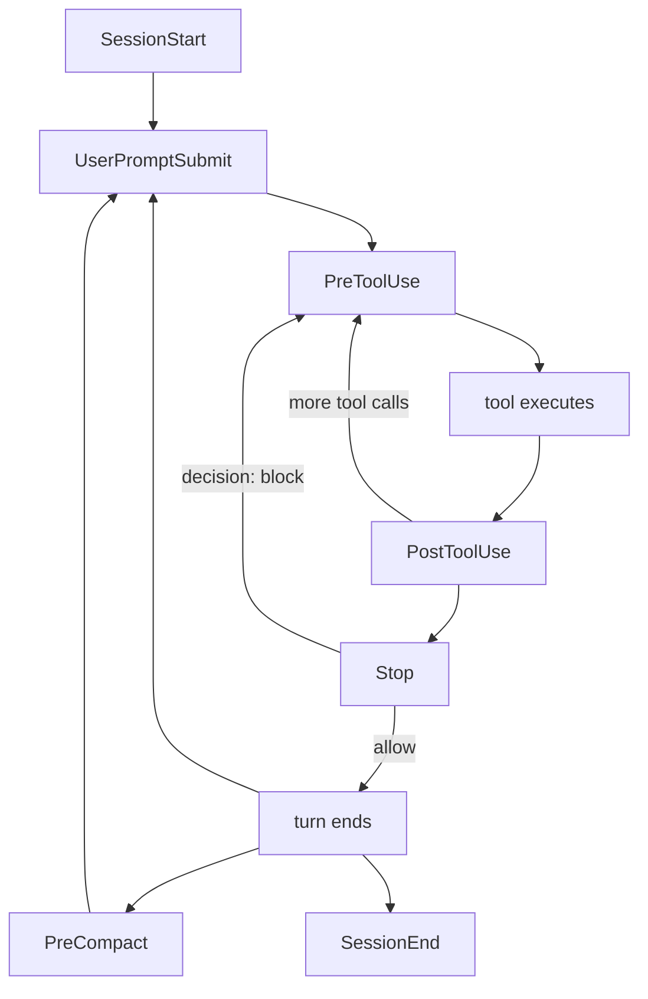

# Hook System: Session Lifecycle, Guards and State Sync

> **Source**: [awslabs/aidlc-workflows](https://github.com/awslabs/aidlc-workflows) — branch `v2`, commit `3c3146cf` (v2.6.40, retrieved 2026-08-21)
> **Status**: As-built specification derived from the implementation; the upstream code is authoritative over this document.

---

## 1. Scope and layering

The hook layer is the framework's *deterministic spine*: the part of AI-DLC that runs whether or not the model remembers to run it. Everything in `core/hooks/` is plain TypeScript executed by `bun`, invoked by the host harness at a named lifecycle event, reading a JSON payload on stdin and answering through an exit code plus (optionally) one line of JSON on stdout.

There are **17** hook scripts in `core/hooks/` (see [Measurement notes](#measurement-notes) M1). Sixteen of them are bound to harness events; the seventeenth (`aidlc-statusline.ts`) is bound to Claude Code's top-level `statusLine` key rather than to an event (`harness/claude/settings.json:18-20`).

Responsibility split with sibling specs:

| Topic | Owner |
| --- | --- |
| Engine directive kinds, `next`/`report`/`park` semantics | `02-orchestration-engine.md` |
| State file fields, audit event taxonomy, runtime graph | `03-state-audit-runtime.md` |
| §12a reviewer protocol, questions-file conventions | `04-stage-protocol.md` |
| Sensor manifests and `sensors_applicable` resolution | `06-sensors.md` |
| `rules_in_context` layering and rule authoring | `08-memory-rules-learnings.md` |
| Per-harness packaging and `dist/` layout | `10-distribution-harnesses.md` |
| Hook test corpus | `12-testing-ci.md` |

This document covers what each hook binds to, what it guarantees, what it refuses, and how the same 17 bodies reach non-Claude runtimes.

### 1.1 The two contracts

Sixteen of the seventeen hooks return an exit code from an exported `run(input: string): Promise<number>`; the `import.meta.main` tail turns that into `process.exit` (M14). The exception is `aidlc-fold-usage.ts`, which exports no `run` and has no `import.meta.main` tail: it declares `async function main(): Promise<void>` (`core/hooks/aidlc-fold-usage.ts:62`), exits from inside it (`:64`, `:69`, `:96`), and runs at import time through a bare top-level `try { await main(); } catch {}` followed by `process.exit(0)` (`:123-128`). Two contracts are in play:

* **Advisory** — always exit `0` and never change what the host does. Eleven of the seventeen are advisory (M2). `aidlc-run-sensors.ts` states this explicitly: "Exit-code contract (G5): always exit 0" (`core/hooks/aidlc-run-sensors.ts:15`), and `aidlc-fold-usage.ts` states "This hook OBSERVES only - it must never alter Claude Code's flow" (`core/hooks/aidlc-fold-usage.ts:26`). Silence on stdout is the norm here but not universal: two advisory hooks print by contract, as the §2 table records — `aidlc-session-start.ts` writes `{"additionalContext": …}` on its success path (`core/hooks/aidlc-session-start.ts:289`, and `:221` on the `rebind_check` arm), and `aidlc-statusline.ts` prints the status line itself (`core/hooks/aidlc-statusline.ts:312`, `:330`, `:342`, `:352`, all via `printLine`).
* **Flow-altering** — six hooks may change what the host does (M2, M3):
  * five hooks return `exit 2` with a reason on stderr — the four PreToolUse guards of §5 plus the rule-delivery hook (M3). Three of them state the contract verbatim: "harness PreToolUse reject contract: exit 2 + stderr blocks" (`core/hooks/aidlc-review-freeze.ts:845`, `core/hooks/aidlc-reviewer-scope.ts:866`, `core/hooks/aidlc-plan-approval-guard.ts:340`; the state-transition guard's two exit-2 sites at `:956` and `:970` carry no such comment);
  * the Stop hook emits `{"decision":"block","reason":…}` on stdout (`core/hooks/aidlc-continue-workflow.ts:206`).

`aidlc-deliver-stage-rules.ts` is the one hook whose *success* path rewrites rather than refuses: it prints `hookSpecificOutput.updatedInput` (`core/hooks/aidlc-deliver-stage-rules.ts:286-291`). It still refuses on two arms, in source order: `exit 2` when the rule bundle cannot be loaded — an unreadable or non-UTF-8 stage rule file (`:281-284`, error minted at `core/tools/aidlc-steering.ts:99-102`) — and, only once a bundle has been serialised, `exit 2`/`exit 3` when the output exceeds the size ceiling (`:293-308`). See §8.2.

---

## 2. Hook inventory

Events and matchers below are transcribed verbatim from `harness/claude/settings.json` (the reference wiring). "Blocking" means the hook can return a non-zero exit or a `decision: block`.

| File (`core/hooks/`) | Harness event(s) + matcher | Purpose (one line) | Class |
| --- | --- | --- | --- |
| `aidlc-session-start.ts` | `SessionStart`, matcher `""` (`:91-97`) | Emit `SESSION_STARTED`/`SESSION_RESUMED`, bootstrap cursors and harness includes, offer an intent rebind, inject the workflow-context block | Advisory (prints `additionalContext`) |
| `aidlc-session-end.ts` | `SessionEnd`, matcher `""` (`:102-108`) | Emit `SESSION_ENDED` attributed to the session's stamped intent | Advisory |
| `aidlc-record-human-turn.ts` | `UserPromptSubmit`, matcher `""` (`:80-86`) **and** `PostToolUse`, matcher `AskUserQuestion` (`:137-141`) | Mint a `HUMAN_TURN` audit row and touch the human-turn marker | Advisory |
| `aidlc-fold-usage.ts` | `PreToolUse`, matcher `""` (`:34-40`) **and** `PostToolUse`, matcher `""` (`:155-159`) | Fold new transcript turns into the durable usage ledger; persist session/transcript pointers | Advisory (Claude-only producer) |
| `aidlc-deliver-stage-rules.ts` | `PreToolUse`, matcher `Task\|Agent` (`:45-49`) | Append the active stage's resolved rule bundle to every AI-DLC subagent brief | **Flow-altering** (rewrites input; `exit 2` on an unloadable rule file, `exit 2`/`exit 3` on oversize) |
| `aidlc-state-transition-guard.ts` | `PreToolUse`, matcher `Read\|NotebookRead\|Edit\|MultiEdit\|Write\|NotebookEdit\|LS\|Glob\|Grep\|Bash` (`:54-58`) | Refuse direct `aidlc-state.ts` lifecycle verbs, and any delegated-agent lifecycle/routing command | **Blocking** (`exit 2`) |
| `aidlc-reviewer-scope.ts` | same PreToolUse group (`:54,62`) | Refuse a dispatched reviewer's reads of sibling `construction/<other-unit>/` paths | **Blocking** (`exit 2`) |
| `aidlc-review-freeze.ts` | same PreToolUse group (`:54,66`) | Refuse a `produces[]` write that would void a fresh terminal §12a review receipt | **Blocking** (`exit 2`) |
| `aidlc-plan-approval-guard.ts` | `PreToolUse`, matcher `Task` (`:71-75`) | Refuse a `aidlc-developer-agent` dispatch before an approved, fingerprinted code-generation plan | **Blocking** (`exit 2`) |
| `aidlc-write-audit-log.ts` | `PostToolUse`, matcher `Write\|Edit` (`:115-119`) | Emit `ARTIFACT_CREATED`/`ARTIFACT_UPDATED` for writes under the record or codekb roots | Advisory |
| `aidlc-run-sensors.ts` | `PostToolUse`, matcher `Write\|Edit` (`:115,123`) | Dispatch `aidlc-sensor.ts fire` for every `sensors_applicable` entry whose glob matches the written path | Advisory |
| `aidlc-sync-workflow-state.ts` | `PostToolUse`, matcher `TaskUpdate` (`:128-132`) | Forward-only sync of `Current Stage` from a plan/task update or the audit tail | Advisory |
| `aidlc-rebuild-stage-graph.ts` | `PostToolUse`, matcher `Bash` (`:146-150`) | Recompile the runtime graph after a transition-class audit emit; bind a newly created intent to the session | Advisory |
| `aidlc-validate-state.ts` | `PreCompact`, matcher `""` (`:164-170`) | Validate state sections, invalidate the active-directive context, emit `SESSION_COMPACTED`, write the recovery breadcrumb | Advisory |
| `aidlc-log-subagent.ts` | `SubagentStop`, matcher `""` (`:175-181`) | Emit `SUBAGENT_COMPLETED` with agent type/id and a 200-char message excerpt | Advisory |
| `aidlc-continue-workflow.ts` | `Stop`, matcher `""` (`:186-192`) | Enforce the forwarding loop: probe the engine and block the stop while a directive is pending | **Flow-altering** (`decision: block`) |
| `aidlc-statusline.ts` | `statusLine` command (`:18-20`) | Render `[AIDLC] <phase> <bar> > <stage> -- <agent>` plus model/context/cost segments | Advisory (stdout is the status line) |

Fourteen of the sixteen event-bound scripts appear once each; `aidlc-fold-usage.ts` and `aidlc-record-human-turn.ts` each appear twice, giving 18 command entries across 8 events (M4).

---

## 3. Common substrate

Every hook body is built on the same handful of seams in `core/tools/aidlc-lib.ts`.

**Project-dir resolution.** `resolveProjectDirFromHook(import.meta.url)` (`core/tools/aidlc-lib.ts:529-558`) tries, in order: `AIDLC_PROJECT_DIR`, `CLAUDE_PROJECT_DIR`, script-path derivation (strip `<harness>/hooks` for *any* known harness dir), then a cwd probe for a known harness directory, then bare cwd. This is what makes the same file harness-neutral — `aidlc-statusline.ts:37-40` notes it deliberately uses the shared seam "rather than a private .claude-hardcoded copy".

**TTY guard.** Nearly every hook exits early when `process.stdin.isTTY`, because no harness JSON is coming on a terminal and a blocking stdin read would hang the turn (e.g. `core/hooks/aidlc-log-subagent.ts:30`, `core/hooks/aidlc-run-sensors.ts:59`, `core/hooks/aidlc-continue-workflow.ts:1091`).

**Payload shape.** The canonical stdin shape is `ClaudeCodeHookInput`, validated by `isClaudeCodeHookInput`. The fields hooks read are `hook_event_name`, `tool_name`, `tool_input` (`file_path`, `command`, `status`, `activeForm`, `subagent_type`, `prompt`, `source`), `tool_response`, `agent_type`, `agent_id`, `last_assistant_message`, `session_id`, `transcript_path`, `source`, `reason`, `stop_hook_active`, `cwd`, and the adapter-only `scoped_registration`.

**Self-gate on an active workflow.** The uniform "is there anything to do?" test is `existsSync(stateFilePath(projectDir))` — used by `session-start` (`:120-123`), `session-end` (`:74`), `record-human-turn` (`:32`), `run-sensors` (`:110`), `plan-approval-guard` (`:284`), and `continue-workflow` (`:1095-1096`). Several hooks additionally gate on an existing audit file so they never *create* a ledger (`aidlc-write-audit-log.ts:109`, `aidlc-run-sensors.ts:102`).

**Health and drops.** Most hooks write a heartbeat `<record>/.aidlc-hooks-health/<hook>.last` (`hooksHealthDir` at `core/tools/aidlc-lib.ts:5899-5901`), and any hook can record failures as tab-separated lines in `<hook>.drops` via `recordHookDrop` (`core/tools/aidlc-lib.ts:9886-9900`). `--doctor` reads both. Coverage is **not** uniform: 12 of the 17 touch the health dir at all, and five touch neither (M13) — `aidlc-deliver-stage-rules.ts`, `aidlc-fold-usage.ts`, `aidlc-record-human-turn.ts`, `aidlc-state-transition-guard.ts`, `aidlc-statusline.ts` write no `.last` and call no `recordHookDrop`. Two of those matter for the guard story: the state-transition guard (one of the four PreToolUse guards of §5) and the rule-delivery hook (§8.2) leave no liveness trace whatsoever, so `--doctor` cannot distinguish "ran and allowed" from "never fired" for them — their observable evidence is the refusal audit rows they emit when they *do* block, not the health dir. Opt-in tracing goes to `<health>/hook-debug.log` via `hookDebug`, enabled by `AIDLC_HOOK_DEBUG` or the `aidlc/.aidlc-hook-debug` marker (`core/tools/aidlc-lib.ts:9917-9928`).

**Fail-open as the default failure mode.** Every guard treats malformed stdin, a missing state file, an unreadable graph, or any throw as *allow*. The three §12a-era guards each also ship a deterministic off-switch: `AIDLC_DISABLE_PLAN_APPROVAL_GUARD=1` (`aidlc-plan-approval-guard.ts:249`), `AIDLC_DISABLE_REVIEWER_SCOPE_HOOK=1` (`aidlc-reviewer-scope.ts:716`), `AIDLC_DISABLE_REVIEW_FREEZE_HOOK=1` (`aidlc-review-freeze.ts:737`).

**Audit under a bounded lock.** The blocking guards emit their refusal rows through `appendAuditEntryUnlocked` wrapped in `acquireAuditLock(projectDir, 5, 50)` — five tries at 50 ms, far below the standard budget, "a dropped advisory row is preferable to a slow block" (`aidlc-review-freeze.ts:814-818`, `aidlc-plan-approval-guard.ts:307-312`).

---

## 4. Session lifecycle



Text fallback: `SessionStart` runs once per conversation; then the loop `UserPromptSubmit → PreToolUse → tool → PostToolUse → … → Stop` repeats per turn, with the Stop hook able to re-enter the tool loop by blocking; `PreCompact` fires whenever the host compacts context; `SessionEnd` fires once at the end. `SubagentStop` fires per finished subagent, inside the tool loop.

### 4.1 SessionStart — `aidlc-session-start.ts`

Ordered effects (all before any early exit that could lose them):

1. Parse `source` (one of `startup`, `resume`, `clear`, `compact`; `unknown` for an unrecognised payload, `malformed` for unparseable JSON — `:60-93`), plus `session_id`, `transcript_path`, and the Cursor-only `rebind_check` probe flag.
2. Persist the transcript pointer and the live session id — done on **every** fire including a pre-workflow start, so a later intent birth can bind to it (`:100-109`).
3. `ensureActiveSpaceCursor(projectDir)` then `repointHarnessIncludes(projectDir, activeSpace(projectDir))` — materialise the gitignored space cursor and realign harness-native includes (`:113-118`).
4. If no state file exists, return, keeping only the session identity (`:120-123`).
5. Emit the session event. The mapping is explicit (`:134-139`): `startup → SESSION_STARTED`, `clear → SESSION_STARTED`, `resume → SESSION_RESUMED`, `malformed → SESSION_STARTED`, and `compact`/`unknown` → **no emission**, because `SESSION_COMPACTED` is owned by the PreCompact hook ("firing it twice would pollute the audit trail", `:17-18`).
6. **Resume rebind.** A per-session→intent stamp lives at `aidlc/.aidlc-sessions/<id>`. On a STARTED-class event the live intent UUID is stamped; on `resume` with a *different, still-resolvable* stamped UUID the hook composes an offer beginning `INTENT REBIND OFFER: This conversation was working …` and naming the exact switch command, using `$aidlc` on Codex and `/aidlc` elsewhere (`:181-192`). The session is re-stamped to the live intent immediately so a declined offer cannot leave usage attached to the old workflow.
7. **Stage-graph drift advisory.** `stageGraphDrift()` reports stage `.md` files on disk that are absent from the compiled graph; the note tells the operator to run `aidlc-graph.ts compile` (`:260-270`). Wrapped so a malformed graph never blocks startup.
8. Print `{"additionalContext": …}`. The injected block opens `AIDLC WORKFLOW ACTIVE` and carries Scope / Lifecycle Phase / Current Stage / Status / Active Agent / Last Completed / Next Action, an optional `Active Unit:` checkpoint line, the compaction breadcrumb note, the drift note, and a `FORWARDING-LOOP DISCIPLINE (non-negotiable — the engine owns ALL routing)` section that pins two rules: pass the user's `/aidlc` flags through to the first `next` unchanged, and when a directive is `{kind:"print"}` naming a command, run that exact command as the immediate next tool call (`:272-285`).

The `rebind_check` path (Cursor's `beforeSubmitPrompt`) short-circuits after step 6: it emits no session event and prints only the offer, consuming the drift so the warning does not repeat (`:218-224`).

### 4.2 Per-turn maintenance

* **Human presence** — `aidlc-record-human-turn.ts` on `UserPromptSubmit` and on the answered-widget `PostToolUse AskUserQuestion`. See §6.
* **Usage folding** — `aidlc-fold-usage.ts` runs on *every* PreToolUse and PostToolUse. The rationale is that a non-final LLM call always ends in a tool use, so PostToolUse catches every intermediate call while the Stop hook catches the final `end_turn` (`:1-18`). Fold modes: PostToolUse uses `holdback` (the last incomplete message-id group per file is never counted until a later fold closes it); PreToolUse uses `seal-main`, upgraded to `flush-all` when the imminent call is a lifecycle boundary (`:82-90`), decided by `isLifecycleBoundaryToolCall` → `isLifecycleBoundaryCommand` imported from the state-transition guard. Kill switch: `AIDLC_DISABLE_USAGE_TRACKING=1` exits before reading stdin (`:69`). The reader is Claude-transcript-specific, so on Kiro/Codex/opencode "their ledger is never written and every usage consumer degrades silently to no-data" (`:22-24`).
* **Artifact audit** — `aidlc-write-audit-log.ts`. Two path arms: under `docsRoot(projectDir)` (the per-intent record root) or under the active space's `codekb/` root (`:75-92`); the codekb arm exists because reverse-engineering artifacts live at space level and were otherwise invisible to the approve-time revision backstop. Recursion guard skips `audit.md` and `audit/<shard>.md` (`:97-104`). CREATE vs UPDATE: `Edit` is always `ARTIFACT_UPDATED`; `Write` is `ARTIFACT_CREATED` when `|mtimeMs − birthtimeMs| < 10` and `ARTIFACT_UPDATED` otherwise, with a stat failure defaulting to CREATED (`:143-159`).
* **Sensors** — `aidlc-run-sensors.ts`. Resolution order: the active-directive marker's stage, falling back to `Current Stage` (and back again if the marked stage is absent from the graph — `:162-179`); then `stageNode.sensors_applicable`, dispatching `bun aidlc-sensor.ts fire <id> --stage <slug> --output-path <path>` for each entry whose `matches` glob matches the file (`:202-236`). "matches IS the filter. Entries without a matches glob do not fire" (`:194`). Subprocess timeout defaults to 90 s, overridable with `AIDLC_SENSOR_TIMEOUT_MS` (`:49-50`); timeout, spawn failure, and non-zero dispatcher exit are each recorded as distinct drops (`:249-271`). A one-time stderr banner is printed on first fire per workspace (`:143-153`).
* **Stage pointer sync** — `aidlc-sync-workflow-state.ts`. Two activation paths. The `TaskUpdate` path requires `status === "in_progress"` (`:95`) and extracts the slug from an `activeForm` ending `[slug]` via `/\[([a-z][a-z0-9-]*)\]$/` (`:98`, arm at `:93-100`). The `tool_input.source === "ide-audit-sync"` path (Kiro IDE, which surfaces no task payload) derives the slug from the latest `STAGE_STARTED` in the audit tail, behind three forward-only guards: `Status` must be `Running` (`:73`); `Current Stage` must be neither empty nor `none` (`:74`); and the audit slug must not name a stage whose checkbox is already `completed` or `skipped` (`:82-90`) — arm at `:54-90`. Either way it shells out to `aidlc-utility.ts set-status --stage <slug> --project-dir <dir>` (`:109-118`).
* **Graph recompile** — `aidlc-rebuild-stage-graph.ts`. See §8.1.
* **Subagent completion** — `aidlc-log-subagent.ts` emits `SUBAGENT_COMPLETED` with `Agent Type`, optional `Agent ID`, and `Message` truncated to 200 characters (`:41-55`), only when an audit file already exists.

### 4.3 PreCompact — `aidlc-validate-state.ts`

Fires at the real compaction moment so there is exactly one timestamped record of it. Effects:

1. `invalidateActiveDirectiveContext(projectDir, content, sessionId)` — under the active-directive lock, if and only if the marker is v2, owned by this session, and matching the project/intent/state digests, it bumps `context_epoch` and rewrites the marker's `kind` to `"error"`, clearing `part`/`parts`/`continue_token` (`core/tools/aidlc-lib.ts:3207-3232`). The whole call sits in a `try`/`catch` whose body is a single comment — "Missing/malformed or foreign compaction is coordination-neutral" (`aidlc-validate-state.ts:43`, catch at `:42-44`) — so a payload that is unparseable, or a marker owned by another session, is silently skipped.
2. Structural validation: the state file must contain `## Stage Progress` and `## Current Status`; missing sections are printed to stderr as a `WARNING:` and folded into the string `INVALID — missing sections: …` (`:46-57`).
3. Write `<record>/.aidlc-recovery.md`, a four-line breadcrumb (`# AIDLC Recovery Breadcrumb`, `**Last validated**`, `**Current stage**`, `**State file**`) that SessionStart later surfaces as `NOTE: A compaction recovery breadcrumb exists …` (`:63-67`, `aidlc-session-start.ts:250-252`).
4. Emit `SESSION_COMPACTED` with `Current Stage` and `State Validity` (`valid`/`invalid`) when an audit file exists (`:69-85`).

### 4.4 SessionEnd — `aidlc-session-end.ts`

Emits `SESSION_ENDED` with a `Reason` field (`unknown` when stdin carries none). Attribution is deliberately fail-closed: if the payload carries a `session_id`, the hook resolves the session's stamped intent UUID and refuses the shared-cursor fallback in two cases — a stamp naming an unknown intent (drop reason: `session <id> is stamped to unknown intent <uuid>; refusing active-cursor fallback`, `:53-58`), and an unstamped session in a workspace that *has* an active UUID, because "Falling back to the shared cursor here can attribute a concurrent pre-workflow session's end to an intent it never invoked" (`:63-66`). Flat/legacy workspaces with no active UUID retain cursor fallback. The heartbeat is written against the same resolved intent as the audit row (`:76-79`).

Note that the workflow lifecycle is explicitly independent of the session lifecycle: "ending a session does NOT complete the workflow. This event is observability only" (`:2-3`).

### 4.5 Statusline — `aidlc-statusline.ts`

Not an event hook; Claude Code invokes it for the status area (`harness/claude/settings.json:18-20`). It resolves the project dir from `AIDLC_PROJECT_DIR`, then stdin's `workspace.project_dir`, then the shared hook seam (`:28-41`). With no state file it prints `[AIDLC] ready`; otherwise `[AIDLC] <prefix><phase> <bar> <done>/<total> > <stage> -- <agent>`, or `[AIDLC] <prefix>COMPLETE <bar>` when `Status` is `Completed`/`Complete` (`:303-355`). The right-hand segment carries the abbreviated model id (Bedrock inference-profile prefixes collapse to `BR:`, `:44-60`), context-window percentage, and a cost segment read from the rolled-up usage ledger — not from the transcript (`:22-25`).

---

## 5. The guards in depth

Four PreToolUse guards enforce orderings that prose alone lost in field traces. Each is scoped tightly, fails open outside its window, and audits its refusals.

### 5.1 `aidlc-state-transition-guard.ts` — lifecycle ownership

Wired to a wide matcher but self-filtering: `if (parsed.tool_name !== "Bash") return 0;` (`:946`). It has two independent refusals.

**(a) Direct state transitions.** `directStateTransition(command)` scans for an invocation of `aidlc-state.ts` in a *shell command position* whose first verb is in `BLOCKED_STATE_TRANSITIONS` — 11 verbs (M5): `set`, `checkbox`, `advance`, `finalize`, `complete-workflow`, `gate-start`, `approve`, `reject`, `revise`, `skip`, `park` (`:15-27`). The refusal, verbatim (`:950-954`):

> `[aidlc] Direct aidlc-state.ts <verb> is blocked: stage status is changed by the workflow tools, not by hand, so that the state file, the audit log, and the compiled stage graph stay in agreement. Use aidlc-orchestrate.ts report --stage <slug> --result <awaiting-approval|approved|rejected|revised|completed|skipped>; use aidlc-orchestrate.ts park to pause the workflow, and next/jump to change routing.`

**(b) Delegated-agent lifecycle calls.** When `agent_type` is non-empty (i.e. the call comes from a subagent), `delegatedLifecycleCommand(command)` looks for any command that crosses a lifecycle or routing boundary: `aidlc-orchestrate.ts next|continue|report|park`, `aidlc-state.ts <verb ∈ DELEGATED_STATE_MUTATIONS>`, `aidlc-jump.ts execute`, and the equivalent `aidlc-utility.ts` / `aidlc.ts` / `aidlc` dispatcher spellings including workspace mutations (`:906-932`). `DELEGATED_STATE_MUTATIONS` is the blocked set plus 9 more (M5): `set-skeleton-stance`, `set-construction-iteration`, `acknowledge-compaction`, `reuse-artifact`, `practices-event`, `practices-promote`, `fork`, `merge`, `unpark` (`:29-40`). The refusal, verbatim (`:967-968`):

> `[aidlc] Delegated agent "<agentType>" cannot run <command>: workflow lifecycle and routing are conductor-owned. Return the artifact, contribution, or review verdict to the invoking orchestrator without parking, resuming, reporting, routing, or presenting a gate.`

The parser is the interesting part. Before matching, `executableShellText` masks quoted separators, heredoc bodies, and function definitions (`:178-182`) so that `echo "… aidlc-state.ts approve"` is not mistaken for an invocation, while `$(...)` inside double quotes is *preserved* because it is executable shell (`:81-86`). The delegated scanner recurses through command substitutions, heredocs, `eval`, and `sh -c` up to depth 8, and **fails closed** on anything it cannot resolve, returning one of five sentinel reasons that are printed in the same refusal slot: `nested shell command beyond guard inspection limit` (`:807`), `dynamic executable beyond guard inspection` (`:839`, `:844`), `execution wrapper beyond guard inspection` (`:848`), `dynamic shell command beyond guard inspection` (`:882`, `:887`), and `dynamic eval shell command beyond guard inspection` (`:859`, `:863`).

The same module exports `isLifecycleBoundaryCommand` (`:211-222`), reused by the usage hook to decide when to flush subagent holdback — deliberately stricter than `isEngineToolCall` because "flushing subagent holdback is destructive if the apparent lifecycle command is only prose" (`:208-210`).

### 5.2 `aidlc-plan-approval-guard.ts` — plan before generation

Guards exactly one dispatch: tool ∈ `{Task, Agent}` (`DISPATCH_TOOLS`, `:82`), `subagent_type === "aidlc-developer-agent"` (`:77`), active stage normalising to `code-generation` (`:76`, `normalizeStageName` at `:117-119`). The active stage is read from the active-directive marker with `Current Stage` as fallback (`:287`).

Given that window, the dispatch is allowed only when the prompt carries **exactly one** distinct `AIDLC-UNIT:` marker (`UNIT_MARKER_RE`, `:121`), that marker names a known unit, and that unit satisfies all six evidence bits (`:159-165`): `planExists`, `instructionsExist`, `approved`, `contractValid`, `fingerprintValid`, `contractHash !== null`. It additionally requires exactly one `AIDLC-TESTING-CONTRACT` marker whose value equals the unit's current contract hash (`:169-175`). Known units are the union of the compiled Bolt DAG and every on-disk `construction/<unit>/` directory (`:209-228`).

Refusal, verbatim (`:192-199`):

> `plan-approval guard: code-generation must not dispatch aidlc-developer-agent before the plan, unit-test instructions, and current Testing Contract are fingerprinted and approved for <scope>. Follow the stage file's Steps 2-3 first: write the plan and instructions, embed the resolver's ## Testing Contract JSON, record its current [Approval Fingerprint], present the Plan Approval question, END the turn, and record the human's explicit "Approve Plan" answer. Only then dispatch generation (Step 4), starting the delegation prompt with "AIDLC-UNIT: <unit>" and "AIDLC-TESTING-CONTRACT: <contract hash>". code-generation-plan.md is the INPUT to generation, never a retroactive summary.`

`<scope>` renders as `unit <name>`, `one unit (conflicting AIDLC-UNIT markers: a, b)`, or `one unit (AIDLC-UNIT marker missing)` (`:185-190`). Each genuine block emits `PLAN_APPROVAL_BLOCKED` with `Tool`, `Target`, `Stage`, and `Unit` (falling back to the literal `(missing marker)`) (`:314-322`).

The motivating failure is recorded in the header: a conductor "generated the code first and backfilled the plan beside code-summary.md, making the plan an output instead of the input", which the completion-time artifact guard cannot catch because by then the backfilled plan exists (`:7-11`).

### 5.3 `aidlc-review-freeze.ts` — the terminal-receipt write freeze

Protects the engine's completion precondition: a `REVIEW_COMPLETED` receipt is invalidated when a declared `produces[]` artifact is written after it. Rather than let the invalidation happen and wedge the gate, the hook refuses the write first.

Freeze window, all three conditions (`:18-27`):

1. the target matches a declared `produces[]`/`optional_produces[]` artifact of a **reviewer-bearing** stage (`stage.reviewer`), using the same `producesArtifactUnit` suffix matcher the engine uses;
2. that stage is *not* completed or skipped in the state file (`:779-783`);
3. a **fresh terminal receipt** covers the write target — the stage receipt for a stage-level artifact, or that unit's receipt for a per-unit write (`judgeFreeze`, `:681-713`). For an ambiguous per-unit path the engine fails closed by clearing every unit receipt, so the hook freezes if any unit holds a terminal `READY` or `NOT-READY` (`:700-707`).

Write targets come from `writeTargets` (`:647-667`): the `Write|Edit|MultiEdit|NotebookEdit` set (`WRITE_TOOLS`, `:81`) contributes `file_path`/`notebook_path`/`path`/`paths`, and **Bash is inspected too** — `shellWriteTargets` extracts output redirections and the operands of common mutation commands, because "shell writes do not pass through the Write/Edit PostToolUse audit feed, so allowing one after a terminal receipt would leave it fresh over different bytes" (`:45-49`).

Refusal, verbatim (`:722-729`):

> `review-freeze: "<target>" is a declared produces[] artifact of <scope>, which holds a fresh terminal review receipt. Writing it now would invalidate that receipt and the engine would refuse the gate (stage-protocol-reviewer.md §12a: the terminal receipt ends artifact work). Present the gate instead - quote any reviewer suggestions there verbatim for the human to weigh. If the artifact genuinely needs changes, reject at the gate (or have the human request changes); the recorded rejection lifts this freeze and the revision then re-runs the stage-protocol-reviewer.md §12a reviewer for a fresh receipt.`

`<scope>` is `stage "<slug>"` or `stage "<slug>" unit "<unit>"` (`:720`). Blocks emit `REVIEW_FREEZE_BLOCKED` with `Tool`, `Target`, `Stage`, and optional `Unit` (`:824-831`).

Because the freshness scan (`freshReviewReceipts`) is *shared with the engine*, the freeze releases automatically on the same events that reset the engine's floor: `GATE_REJECTED`, `STAGE_JUMPED`, and `WORKFLOW_STARTED` (`:28-33`). A below-cap adversarial `NOT-READY` remains nonterminal so its repair loop can still edit; a terminal `NOT-READY` freezes exactly like `READY` "because no further review pass follows it" (`:33-35`). Cost control: the hook returns before touching state or graph when `readAllAuditShards(projectDir).length === 0` (`:766-770`).

### 5.4 `aidlc-reviewer-scope.ts` — per-unit reviewer read bound

Enforces §12a's rule that a reviewer dispatched for one unit must not read another unit's `construction/<other-unit>/` content "not by opening files, and not via grep, glob, or shell patterns that span sibling unit paths" (`:4-7`).

**How a review is known to be in flight.** The conductor writes `<record>/.aidlc-reviewer-dispatch.json` at §12a step 1 and deletes it at step 3. Its schema is `{reviewer, stage, unit, exempt[]}`, validated by `parseDispatchRecord` — any shape miss returns null and enforcement is skipped with a drop reason `reviewer dispatch record is malformed; enforcement skipped` (`:667-680`, `:803`). The record is honoured only while fresh: `REVIEWER_DISPATCH_TTL_MS = 6 * 60 * 60 * 1000` (6 h, `core/tools/aidlc-lib.ts:6108`); an older record is unlinked and ignored with the drop `ignoring an orphaned reviewer dispatch record (older than the freshness window); cleaned it up` (`:790-795`).

**Identity.** `agentType === dispatch.reviewer` when the harness delivers `agent_type` (Claude, Codex); otherwise the adapter-asserted `scoped_registration === true` (Kiro CLI registers the hook inside the reviewer agents' own JSON configs). Anything else passes through (`:815-819`). When no record exists but a shipped review-only agent (`/^aidlc-(architecture-reviewer|product-lead)-agent$/`, `:706`) touches `construction/` paths, the hook records a rate-bounded advisory drop — at most one per 10 minutes — pointing at the missing step-1 write (`:753-774`).

**What is inspected.** Path-shaped tool fields, Bash command text, and Glob/Grep `glob`/`path` fields. Grep's `pattern` (the *content* regex) is deliberately not scanned, "matching file content is not a file access" (`:106-109`). Any glob metacharacter (`/[*?[\]{}]/`, `:102`) in a sibling segment counts as spanning units. A pathless `Grep`, or a pathless `Glob` whose pattern does not constrain to the current unit, is judged as if it recursed from `.` (`:653-662`). Shell handling has dedicated judges for grep-like tools, ripgrep, `find`, simple file commands, and a generic fallback (`:455-583`).

Refusal, verbatim (`:688-697`):

> `[aidlc] reviewer read-scope: "<target>" reads another unit's files under construction/. This review covers unit <unit> only, plus the specific files you were handed (the stage file, the questions file, and the shared design documents this unit builds on). Check cross-unit claims against those handed files instead of opening another unit's work. If this unit's design names an integration point in another unit's file, say so in your findings rather than reading it; the only files readable outside this unit are the ones the conductor listed as exceptions when it started the review. (If you meant a file in the CURRENT unit, write the unit name out in full - a shell variable in the path cannot be checked, so it is refused; searches must stay inside the current unit's path.)`

Blocks emit `REVIEWER_SCOPE_BLOCKED` (`:845`). Note the parenthetical: an unresolvable shell variable in a path is refused rather than guessed — the same fail-closed stance as the state-transition guard's dynamic-command sentinels.

---

## 6. Human presence — `aidlc-record-human-turn.ts`

The smallest hook in the tree (45 lines, M1) and the base of the approval gate's authorization model.

**What counts as a human turn.** Two seams, both wired in the reference harness: `UserPromptSubmit` with an empty matcher (`harness/claude/settings.json:80-86`) and `PostToolUse` with matcher `AskUserQuestion` (`:137-141`) — i.e. a real prompt, or an answered question widget. The hook is **presence-only**: "the prompt text is irrelevant, so stdin is not read" (`core/hooks/aidlc-record-human-turn.ts:9`).

**Where it is recorded.** Two artifacts, written from one seam so they can never disagree (`:19-24`):

1. `appendAuditEntry("HUMAN_TURN", {}, projectDir)` — a row in the active intent's append-only audit shard, resolved from the on-disk cursor with no payload required.
2. `markHumanTurn(projectDir)` — touches `.aidlc-human-turn` in the record dir (`core/tools/aidlc-lib.ts:6024-6027`).

**What consumes each.** The ledger event serves the *human-presence gate*: `handleApprove` / `handleAnswer` refuse "unless a HUMAN_TURN was recorded since the last gate resolution, so a model under autopilot cannot fabricate an approval with no human having acted this turn" (`:4-7`). The marker serves the Stop hook's tier-3 conversational carve-out on harnesses that deliver no transcript, which needs a cheap "when was the last human prompt, relative to the last engine advance?" comparison (`:20-23`).

**Guarantees and limits.**

* Self-gated on `existsSync(stateFilePath(projectDir))` (`:32`) so a project that carries the harness shell but never ran the framework does not scaffold and grow audit shards on every prompt. The gate fails open on an empty ledger, so skipping the mint there is safe (`:14-16`). `markHumanTurn` repeats the same self-gate via `workflowIsBorn` (`core/tools/aidlc-lib.ts:6013-6019`), which is load-bearing for the invariant that `aidlc-orchestrate next` is a pure read that births nothing.
* Entirely fail-open: the body is a bare `try/catch` returning 0 — "a mint failure must never block the human's turn" (`:36-38`).
* The recorded event proves **ordering and presence only**. Because harnesses do not uniformly expose trusted response text, it does not authenticate later `--user-input` / `--feedback` / `--details` prose (`docs/reference/06-hooks-and-tools.md:40`).

The marker's paired writer is `markEngineTouch` (`core/tools/aidlc-lib.ts:6052-6057`), touched only by `aidlc-orchestrate.ts`'s `next`/`report`/`park` and suppressed when `AIDLC_STOP_HOOK_PROBE=1` — see §7.3.

---

## 7. The Stop hook — `aidlc-continue-workflow.ts`

The largest hook (1421 lines, M1) and the only one that can keep a turn alive. Its purpose: the forwarding loop "cannot rest on the conductor's good behaviour: when the conductor tries to end its turn, this hook runs the engine (`aidlc-orchestrate next`) and, if a directive is still PENDING, blocks the stop and injects the directive back via `reason`" (`:14-19`).

### 7.1 Security framing

The injected reason is deliberately an **on-task continuation**, never an override-shaped instruction: "override-shaped directives are refused by the conductor's own safety training, so a buggy or compromised engine can only ever CONTINUE sanctioned work, never hijack the session" (`:22-27`).

The general continuation reads (`:1062-1071`):

> `The AIDLC workflow has a pending step (a <kind> directive for "<stage>"). You have not finished the workflow loop yet. Run \`bun <harness>/tools/aidlc-orchestrate.ts next\`, do what the step it prints asks, then run \`aidlc-orchestrate report --stage <stage> --result <outcome>\` to record the outcome. Repeat until it answers \`done\`. If you meant to pause this workflow instead and pick it up in a later session, run \`bun <harness>/tools/aidlc-orchestrate.ts park\` to stop cleanly between stages - never mark a stage complete just to end the turn.`

Four other shapes exist: a `rehydrate` variant demanding one fresh `next` and forbidding reuse of an earlier continuation token (`:1042-1044`); retained `load-steering` and retained `run-stage` variants for Copilot's session-owned path (`:1045-1050`); and a `load-steering` variant that inlines the exact `rules_content` JSON payload and the `continue "<token>"` command, with the instruction "Do not summarise or narrate these rule chunks to the user" (`:1051-1061`).

### 7.2 The no-progress cap

Two bounds prevent a stuck block from trapping the session — "a stuck block is the ONE way to trap a session, so this is the safety-critical part" (`:29-30`):

1. `stop_hook_active` from the payload, read as a signal that this stop is already the product of a prior block.
2. A durable **no-progress counter** at `<record>/.aidlc-stop-hook/block-count.json` (`guardFilePath`, `:232-234`; `stopHookDir` at `core/tools/aidlc-lib.ts:5916-5918`), holding `{signature, count}`.

The cap is run-mode aware (`blockCap`, `:171-186`): `CLAUDE_CODE_STOP_HOOK_BLOCK_CAP` wins when set to a positive integer; otherwise `Construction Autonomy Mode: autonomous` yields `AUTONOMOUS_BLOCK_CAP = 8` and everything else yields `INTERACTIVE_BLOCK_CAP = 2`. A non-numeric or non-positive override falls back to the mode default rather than disabling the guard.

`decideBlock` (`:340-377`) compares the current progress signature with the persisted one: same signature → `count + 1`; no prior record but `stop_hook_active` → seed at 2 (joining a sequence already in flight); otherwise → 1. The record is written *before* the decision, and `nextCount >= cap` releases. `resetGuard` (`:382-390`) zeroes the record on `done`, on `parked`, and at the fresh-session handoff boundary.

### 7.3 Directive fingerprints (v2.6.40)

`progressSignature` (`:247-284`) is `"<stage>::<stateSha256>::<directiveFingerprint>"`:

* **stage** — the `Current Stage` slug.
* **stateSha256** — SHA-256 over the state file **with `- **Last Updated**:` lines stripped** (`:249-253`). This is one of the three v2.6.40 changes: without it, a status-only timestamp write resets a genuinely stuck loop. The CHANGELOG states it as "The state component excludes `Last Updated`, preventing status-only timestamp writes from resetting a genuinely stuck loop; semantic state changes still reset the counter" (`CHANGELOG.md:10`).
* **directiveFingerprint** — SHA-256 over a JSON object of `kind`, `stage`, `unit`, `part`, `parts`, `continue_token_sha256`, `rules_content_sha256`, `units`, `worker`, `repo`, and `wave_sha256` (`:254-282`). The second v2.6.40 change: "Shared directive fingerprints now include load-steering part/token/content, run-stage wave, `invoke-swarm` units, and dispatched worker/repo identity, so advancing chunks, waves, and batches reset the streak even when progress is audit-backed" (`CHANGELOG.md:9`). All of these are parsed defensively out of the engine's stdout by `runEngineNextDirective` (`:944-1021`), which drops any field with the wrong type.

The engine probe itself is time-bounded at `ENGINE_TIMEOUT_MS = 10_000` (`:194`) and spawned with `STOP_HOOK_PROBE_ENV` (`AIDLC_STOP_HOOK_PROBE`) set to `"1"` (`:939`). That env var is load-bearing, not a debug nicety: `markEngineTouch` no-ops when it sees the var, so the probe does not refresh the engine marker and invalidate its own conversational carve-out (`:926-933`). A non-zero exit, empty stdout, or unparseable JSON all yield `null` and allow the stop.

### 7.4 Carve-outs, in evaluation order

The main body evaluates allow-paths in a fixed order; each can only ever *allow*, never cause a block.

| # | Condition | Evidence | Autonomy-guarded |
| --- | --- | --- | --- |
| 0 | Fresh post-create session handoff | a fresh `SESSION_INTENT_HANDOFF_TTL_MS` (5 min, `core/tools/aidlc-lib.ts:2147`) receipt whose `from`/`to` UUIDs still match the session stamp and the live cursor (`:1148-1170`) | n/a |
| 1 | **Resume wait** (v2.6.40) | `hasCurrentSharedResumeWait(projectDir)` — read **before** probing `next` (`:1209-1229`) | yes |
| 2 | `kind === "done"` | engine directive (`:1253-1256`) | n/a |
| 3 | `kind === "parked"` | engine directive (`:1273-1284`) | **yes** — an autonomous run declines the parked allow and falls through |
| 4 | `kind === "ask"` | engine directive (`:1289-1291`) | no |
| 5 | Human-wait gate | current stage's checkbox is positively `[?] awaiting-approval` or `[R] revising` (`isHumanWaitStop`, `:428-438`) | no |
| 6 | Pending mid-stage question | a `<slug>-questions.md` under the active directive stage (or the exact active-unit dir) with an `[Answer]:` tag matching `/\[Answer\]:[ \t]*_*[ \t]*$/m` (`:474-511`) | yes, except unit-major `code-generation` whose Plan Approval is mandatory (`:527-537`) |
| 7 | Pending logged decision | a current-stage `DECISION_RECORDED` with no later `QUESTION_ANSWERED` — `isPendingDecisionStop` (`:560-573`) applies the autonomy / `[-]` / stage guards and then delegates to `hasPendingDecision(projectDir, slug, "STAGE_STARTED")` (`:569`; defined at `core/tools/aidlc-lib.ts:4439`) | yes |
| 8 | Pending compose proposal | `aidlc/.aidlc-compose-pending` marker younger than `COMPOSE_MARKER_TTL_MS` = 24 h (`core/tools/aidlc-lib.ts:6126`); a stale marker is unlinked and ignored (`:603-629`) | yes |
| 9 | Conversational turn | transcript or turn markers (see below) (`:869-890`) | yes |

**The v2.6.40 resume-wait preservation.** Before v2.6.40 the hook's own `next` probe published a fresh sessionless directive that could overwrite an `ask` marker, so a human choosing how to resume was nudged back into the loop. The current behaviour reads the latch first: on the shared (non-Copilot) path, `hasCurrentSharedResumeWait` runs under the active-directive lock and returns true only when the marker is `version === 2`, its `owner_session` starts with `"sessionless:"`, its `state_sha256` matches the live state file, its `kind` is `"ask"`, its `resume.status` is `"waiting"`, and `Construction Autonomy Mode` is not `autonomous` (`core/tools/aidlc-lib.ts:3005-3022`). Any read failure of state under the lock returns false with `preserve: true`. The hook records the drop `active resume choice is waiting on the human; allowing the stop before the shared next probe` (`:1225`), and an evidence-read error records `active-directive evidence unavailable while reading shared resume wait: <e>; allowing stop` and allows anyway (`:1214-1219`). The header states the ordering requirement explicitly: "we must read this latch BEFORE probing `next`, because the probe publishes its own sessionless directive and can overwrite the `ask` kind" (`:104-106`).

**The conversational carve-out's two evidence sources.** One predicate, two paths (`:77-101`):

* *Transcript path* — Claude JSONL or Codex rollout JSONL, selected by testing the path against `/[/\\]rollout-[^/\\]*\.jsonl$/` (`:1134`). The reader flattens the file to `{role, engineCall, humanPrompt}` events and requires the most recent genuine human prompt to have been answered with zero engine calls. Synthetic user turns are excluded: `isMeta: true` entries, `tool_result` arrays, and the hook's own re-injected nudge, matched by `isInjectedHookFeedback` on either `Stop hook feedback:` or a text opening `The AIDLC workflow has a pending step` and containing `workflow loop` (`:669-676`). That matcher and `continuationReason` must stay in step or an injected nudge reads as a fresh human prompt.
* *Marker path* — `turnMarkersShowConversational` compares the mtimes of `.aidlc-human-turn` and `.aidlc-engine-touch`, requiring both to exist and be regular files, and returning true only when the human marker is strictly newer (`core/tools/aidlc-lib.ts:6065-6088`).

The marker path is documented as **not full parity**: it is blind to `aidlc-jump` / `aidlc-bolt` / `aidlc-swarm` and the mutating `aidlc-state` verbs, which the transcript path counts as engagement, "so a conductor that jumps the pointer and then quits is released here and blocked on Claude" (`:95-101`; the same gap is repeated at `core/tools/aidlc-lib.ts:6035-6051`).

**Copilot's session-owned path.** When `AIDLC_COPILOT_SESSION_ID` equals the payload's `session_id`, the hook reads `copilotStopEvidence` instead of probing (`:1202-1235`). Evidence statuses `foreign` and `resume` allow immediately; `contended` allows with the drop `active-directive lock contended while reading Copilot Stop evidence; allowing stop`; `directive` yields a retained directive (marked `retained: true`, driving the retained continuation strings); anything else synthesises `{kind: "rehydrate", retained: true}`. Counting goes through `updateCopilotStopCount` over a pipe-joined identity that adds the token/state digests, resume status/action, and owner session/epoch (`:1381-1388`).

**Usage folding at turn end.** Before the engine probe, a Claude-format transcript is folded with mode `flush-all`, because "the turn is ending, so every file's last message-id group is complete and must be counted now" (`:1182-1198`). Codex rollout paths are left alone. Any throw is swallowed.

---

## 8. Graph recompilation and rule delivery

### 8.1 `aidlc-rebuild-stage-graph.ts` — when the runtime graph recompiles

Bound to `PostToolUse` with matcher `Bash`, this hook keeps `runtime-graph.json` in step with lifecycle transitions. Its pipeline (numbered in the source):

1. **Session binding, before any filter.** `bindCreatedIntentToInvokingSession` matches the tool response against `/(?:Intent created:|Migrated flat workspace into intent:)\s*([A-Za-z0-9._-]+)\s+\(space:\s*([A-Za-z0-9._-]+)\)/` (`:74-76`) and stamps the new intent's UUID onto the invoking `session_id`. If the session already carries a stamp, it writes a *handoff receipt* instead of overwriting — which is exactly what the Stop hook's carve-out 0 consumes. "PostToolUse is the first boundary that carries both the exact host session_id and the successful birth result" (`:49-51`).
2. **Command filter.** `classifyRuntimeCompileCommand(command)` returns `reject` (a compile-tool invocation — the recursion guard) or `pass` (not a transition tool) or falls through. Kiro IDE, which does not surface the shell command, sets `tool_input.source = "ide-audit-sync"` and skips this pre-filter entirely (`:140-149`).
3. **Audit read across every shard of the active intent** — not this process's own shard, because "the state tool that wrote the transition runs in a SEPARATE process" (`:151-161`).
4. **Transition filter.** The last 3 audit blocks (an approve can write `GATE_APPROVED + STAGE_COMPLETED + STAGE_STARTED` in one Bash call) are matched against the verbatim regex (`:192`):
   `/^\*\*Event\*\*:\s*(GATE_APPROVED|STAGE_STARTED|STAGE_AWAITING_APPROVAL|AUDIT_MERGED|WORKFLOW_COMPLETED)\s*$/m`
   `WORKFLOW_COMPLETED` is in the set so the terminal approve still fires the compile; `STAGE_AWAITING_APPROVAL` is in the set so the gate ritual does not read a memory-entry count snapshotted at `STAGE_STARTED` time (`:184-191`).
5. **Idempotency guard, IDE mode only.** Since the command filter is skipped there, the transition would otherwise sit in the tail forever after `WORKFLOW_COMPLETED`. Bounded by mtime: skip when `runtime-graph.json` is at least as new as the newest audit shard (`:200-232`).
6. **Dispatch** `bun run <harness>/tools/aidlc-runtime.ts compile` synchronously, `cwd: projectDir`, 30 s timeout; a non-zero exit is recorded as a drop and never blocks the parent Bash call (`:237-254`).

The recursion guard is two-layered: `aidlc-runtime.ts` is rejected at the command level, **and** `MEMORY_EMPTY` (which the compile itself emits) is absent from the event regex (`:19-21`).

### 8.2 `aidlc-deliver-stage-rules.ts` — how `rules_in_context` reaches a subagent

Bound to `PreToolUse` matcher `Task|Agent`, this hook makes the active stage's required rules deterministic across the conductor→subagent boundary.

**Trigger set.** `DISPATCH_TOOLS = {task, agent, spawn_agent, subagent}` matched case-insensitively (`:41`, `:217`). `aidlc-composer-agent` is exempt (`EXEMPT_AGENTS`, `:42`). The target must be a real AI-DLC agent: name matching `/^[a-z0-9][a-z0-9-]*-agent$/` **and** a corresponding file existing in `agentsDir()` (`:49-56`).

**Stage resolution**, most-authoritative first (`:68-100`): an explicit `stages/<phase>/<slug>.md` path in the brief; else the state file's `Current Stage`; else a *unique* slug mention in the brief. Ambiguous mentions bind nothing. Point 2 outranks prose mentions so a brief that names another stage in passing does not bind that stage's bundle.

**Bundle resolution.** `resolvedRuleBundle(node, projectDir)` maps each `rules_in_context[].path` through `rulesContentEntries`, re-rooting any `/memory/` path onto `aidlc/spaces/<space>/memory/<subpath>` (honouring an `AIDLC_RULES_DIR` override), then reads each file with a *fatal* UTF-8 decoder (`core/tools/aidlc-steering.ts:57-116`). A read or decode failure produces the error `Cannot load required stage rule "<rel>" (<reason>). The stage has not started. Restore the file or fix its permissions/UTF-8 encoding, then run \`next\` again.`(`core/tools/aidlc-steering.ts:99-102`) — which this hook prints to stderr and returns`2`for (`:281-284`). Only substantive rule text is kept (`isSubstantiveRuleText`), and duplicate relative paths are de-duplicated.

**Delivered shape.** The bundle is appended to the brief as a sentinel-delimited block (`:102-120`):

```text
<!-- AIDLC_DISPATCH_RULES_BEGIN sha256:<digest> stage:<slug> -->
## Active AI-DLC Rule Bundle
These are the required rules for this stage. Apply the content verbatim; later prose summaries do not replace it.

### <path>
<text>
...
<!-- AIDLC_DISPATCH_RULES_END sha256:<digest> -->
```

The digest is SHA-256 over `JSON.stringify(content)`. Idempotency is exact-match: `hasExactBundle` checks whether the prompt already contains the byte-identical block, so a re-dispatch does not double-append (`:122-128`, `:139-144`). The prompt field is located by trying `prompt`, `message`, `description`, `task` in order, with an `items[]` array fallback that appends a new `{type:"text"}` element carrying only the delta (`:151-188`). Kiro's `subagent` tool shape is handled separately by walking `input.stages[]` and augmenting each entry's `prompt_template` (`:223-251`).

**Output.** `{"hookSpecificOutput":{"hookEventName":"PreToolUse","updatedInput":…}}` on stdout (`:286-291`). Size ceiling: `DISPATCH_HOOK_OUTPUT_MAX_BYTES = 512 * 1024` (`:46`). Over the ceiling, nothing partial is written and the hook returns `2` with:

> `[aidlc] This stage's rule files add up to <n> bytes, exceeding the safe 524288-byte output limit for attaching them to a subagent brief. The subagent was not started, and nothing partial was written. Shorten or split the rule files for the active stage, then start the subagent again.` (`:303-308`)

…unless `AIDLC_DISPATCH_RULES_PRELOAD_FALLBACK=1` is set, in which case it returns `3` with an advisory saying the harness loads the same rule files itself through its own active-memory preload (`:294-301`).

**Harness reach**, stated in the header (`:5-10`): Claude, Codex, and Copilot consume `updatedInput` directly; opencode's adapter consumes the same output and mutates `output.args`; Kiro CLI has no input-rewrite channel, so its adapter observes the proposed rewrite and relies on native agent resource preload; Kiro IDE cannot expose tool arguments at all and preloads active memory through always-included workspace steering with live file references. See `08-memory-rules-learnings.md` for how `rules_in_context` is composed and `10-distribution-harnesses.md` for the packaging.

---

## 9. Cross-harness adaptation

The 17 core bodies are byte-shared. Each non-Claude harness ships **one authored adapter** that normalises its native payload into the `ClaudeCodeHookInput` shape, subprocess-pipes into the named core hook, and relays stdout and exit code. Details belong to `10-distribution-harnesses.md`; the wiring shape is summarised here.

| Harness | Wiring artifact | Adapter | Events wired |
| --- | --- | --- | --- |
| Claude Code | `harness/claude/settings.json` (`hooks` block + `statusLine`) | none — core hooks are invoked directly | 8 events, 18 command entries (M4) |
| Codex | `hooks.json` generated by `harness/codex/emit.ts` from `HOOK_WIRING` (`:32-54`) | `harness/codex/hooks/aidlc-codex-adapter.ts` | 13 entries (M6) |
| Cursor | `harness/cursor/hooks.json` (checked in) | `harness/cursor/hooks/aidlc-cursor-adapter.ts` | 8 events, 9 command entries (M7) |
| Copilot | generated by `harness/copilot/emit.ts` from `HOOK_WIRING` (`:41-49`) | `harness/copilot/hooks/aidlc-copilot-adapter.ts` | 8 entries (M6) |
| Kiro CLI | `*.kiro.hook` files | `harness/kiro/hooks/aidlc-kiro-adapter.ts` | 7 hook files (M8) |
| Kiro IDE | 9 `*.kiro.hook` files, 8 with a `*.json` sibling (`aidlc-session-end` has none) | `harness/kiro-ide/hooks/aidlc-kiro-adapter.ts` | 9 hook files (M8) |
| opencode | `harness/opencode/opencode.json` | `harness/opencode/plugin/aidlc-opencode-adapter.ts` | plugin-registered |

**Codex.** `HOOK_WIRING` is a flat list of `{event, matcher?, target}` records rendered into Claude-shaped `{hooks:[{type:"command",command:"bun .codex/hooks/aidlc-codex-adapter.ts <target>"}]}` groups (`harness/codex/emit.ts:56-69`). Three matchers are deliberately omitted with recorded reasons: `reviewer-scope`, `review-freeze`, and `plan-approval-guard` "self-filter" and exit 0 instantly on irrelevant calls (`:37-47`). The adapter documents four load-bearing payload differences (`harness/codex/hooks/aidlc-codex-adapter.ts:9-30`): edits arrive as `apply_patch` with paths inside the patch envelope (the shim parses `*** Add|Update File:` lines and fans out one core invocation per file, Add→Write and Update→Edit, Delete skipped); the plan tool is `update_plan` and is mapped to the `{status, activeForm}` shape `sync-workflow-state` keys on; **every event is delivered twice**, handled by caching `{stdout, exit}` on the first delivery and replaying it identically on the duplicate; and there is no `SessionEnd` event, so `session-start` reconciles by piping an inferred-provenance reason into `aidlc-session-end.ts` when the heartbeat names a different prior session. Output re-wrapping: the core SessionStart's `{"additionalContext":…}` is re-wrapped into Codex's `hookSpecificOutput` envelope, while `{"decision":"block","reason"}` from the Stop hook "passes through VERBATIM" (`:31-38`).

**Cursor.** The `preToolUse` binding is marked `"failClosed": true` and the `stop` binding carries `"loop_limit": 10` (`harness/cursor/hooks.json:13-18, 29-34`) — the host-level analogue of the Stop hook's own cap. Cursor has no resume source on `sessionStart`, so the adapter's `mint` target (on `beforeSubmitPrompt`) runs `aidlc-record-human-turn.ts` and then re-invokes `aidlc-session-start.ts` with the `rebind_check: true` probe, because "Cursor can only surface this probe through beforeSubmitPrompt's blocking `user_message` channel" (`aidlc-session-start.ts:214-217`, `harness/cursor/hooks/aidlc-cursor-adapter.ts:758-780`). The Cursor adapter references 13 core hook bodies (M9) and does **not** wire `deliver-stage-rules`, `fold-usage`, `statusline`, or `sync-workflow-state`.

**Copilot.** Wires `SubagentStart` in addition to the usual set, and exports `AIDLC_COPILOT_SESSION_ID` into the core hook's environment (`harness/copilot/hooks/aidlc-copilot-adapter.ts:130`), which is what switches the Stop hook onto its session-owned evidence path (§7.4). Copilot also inlines the human-turn mint rather than spawning `aidlc-record-human-turn.ts`, but **only the audit half**: its `record-human-turn` case calls `appendAuditEntry("HUMAN_TURN", {}, projectDir)` (`:914`) and `recordCopilotHumanSequence(…)` (`:919`), and never touches `markHumanTurn` (`harness/copilot/hooks/aidlc-copilot-adapter.ts:903-923`; `grep -n markHumanTurn` on that file returns 0 hits). So Copilot's mint does not refresh `.aidlc-human-turn`, and the Stop hook's marker-path carve-out (§7.4) has no human marker to compare against on that harness — Copilot instead runs the session-owned `copilotStopEvidence` path. The Kiro adapters are the ones that inline against the shared `markHumanTurn` seam (`harness/kiro/hooks/aidlc-kiro-adapter.ts:237`, `harness/kiro-ide/hooks/aidlc-kiro-adapter.ts:240`); upstream scopes the seam the same way verbatim: "Called from the UserPromptSubmit seam of every harness: the core aidlc-record-human-turn.ts hook (Claude, opencode) and both Kiro adapters' inlined `record-human-turn` targets" (`core/tools/aidlc-lib.ts:6021-6023`).

**Kiro.** Two capability gaps drive dedicated code paths in the core hooks themselves: no tool-argument rewrite channel (hence the `deliver-stage-rules` preload fallback) and no shell-command visibility in the IDE (hence `tool_input.source = "ide-audit-sync"` in both `sync-workflow-state` and `rebuild-stage-graph`). Kiro CLI also asserts `scoped_registration` on reviewer-scope calls because it registers that hook inside the reviewer agents' own JSON configs (`aidlc-reviewer-scope.ts:807-814`).

**Delivered artifacts.** `dist/` is generated projection output, never source. Inspecting it confirms the delivered layout: `dist/claude/.claude/hooks/` contains 17 `.ts` files and `dist/claude/.claude/settings.json`'s `hooks` block is byte-identical to `harness/claude/settings.json`'s (M10); `dist/cursor/.cursor/hooks/` contains 18 (the 17 core bodies plus the authored adapter, M10); `dist/codex/.codex/hooks.json` is the rendered `HOOK_WIRING` (M11).

---

## 10. Notes where documentation and code diverge

* `docs/reference/06-hooks-and-tools.md:3` and `:11` say seventeen hooks ("all seventeen hook scripts" at `:3`; seventeen scripts, project-wide registration at `:11`), and `:13` splits them "Eleven of the seventeen are **non-blocking**. Six are **flow-altering**". The code agrees exactly: 17 files (M1), 11 with neither an `exit 2` nor a `decision` path, and 6 flow-altering (M2). No correction needed.
* `core/hooks/aidlc-record-human-turn.ts:1` describes itself as a "UserPromptSubmit hook", but the reference wiring binds it to **two** events — `UserPromptSubmit` and `PostToolUse` with matcher `AskUserQuestion` (`harness/claude/settings.json:80-86, 137-141`). The docs table (`docs/reference/06-hooks-and-tools.md:40`) has the two-event form; the file's own header comment is the stale one. Behaviourally this is harmless: the hook reads no stdin, so both seams do the same thing.
* `aidlc-continue-workflow.ts:109-111` says "The frontmatter Stop matcher scopes this to the `aidlc` skill". In this tree the Stop hook is registered project-wide in `settings.json` (`:186-192`), not in skill frontmatter — the comment describes the pre-v0.6.0 arrangement that `docs/reference/06-hooks-and-tools.md:11` records as having moved. The hook defends itself anyway with the state-file check at `:1095-1096`, so the behaviour is correct regardless.
* Several source comments carry file:line references into `aidlc-orchestrate.ts` and `aidlc-state.ts` (e.g. "aidlc-orchestrate.ts:1161-1176" at `aidlc-continue-workflow.ts:56`). These were not re-verified here; treat them as prose pointers, not contracts.

---

## Measurement notes

Every number in this document was produced by one of the commands below, run at commit `3c3146cfd7cef33020d48e8d48d4e80d0f8c2820` with the upstream clone root as the working directory. `$ROOT` denotes that clone root.

| Id | Claim | Command (predicate + target set) | Result |
| --- | --- | --- | --- |
| M1 | 17 core hook files; per-file line counts (`aidlc-record-human-turn.ts` 45 lines, `aidlc-continue-workflow.ts` 1421 lines) | `ls core/hooks/*.ts \| wc -l` ; `wc -l core/hooks/*.ts \| sort -n` | `17`; smallest 45, largest 1421, total 6714 |
| M2 | 11 advisory hooks; 6 flow-altering | `grep -L "return 2;\|decision" core/hooks/*.ts \| wc -l` → advisory count; complement = flow-altering | `11` advisory (⇒ 6 flow-altering) |
| M3 | The 5 `exit 2` hooks (the four PreToolUse guards of §5 plus the rule-delivery hook) and the 1 `decision: block` hook; the verbatim reject-contract comment appears in only 3 of the 5 | `grep -l "return 2;" core/hooks/*.ts` ; `grep -ln 'decision: "block"' core/hooks/*.ts` ; `grep -ln "hookSpecificOutput" core/hooks/*.ts` ; `grep -rn "harness PreToolUse reject contract" core/hooks/` | exit-2: `deliver-stage-rules`, `review-freeze`, `plan-approval-guard`, `reviewer-scope`, `state-transition-guard`; decision-block: `continue-workflow`; hookSpecificOutput: `deliver-stage-rules`; reject-contract comment: `review-freeze:845`, `plan-approval-guard:340`, `reviewer-scope:866` (3 hits) |
| M4 | Claude wiring: 8 events, 18 command entries, 16 distinct scripts in the `hooks` block (+`statusline` via `statusLine`); 14 appear once, 2 appear twice | `python3 -c "import json,re,collections; d=json.load(open('harness/claude/settings.json')); s=json.dumps(d['hooks']); n=re.findall(r'hooks/(aidlc-[a-z-]+)\.ts',s); c=collections.Counter(n); print(len(d['hooks']), len(n), len(set(n)), sum(1 for v in c.values() if v==1), sum(1 for v in c.values() if v==2))"` | `8 18 16 14 2`; the two doubles are `aidlc-fold-usage` and `aidlc-record-human-turn` (14×1 + 2×2 = 18) |
| M5 | `BLOCKED_STATE_TRANSITIONS` = 11 verbs; `DELEGATED_STATE_MUTATIONS` adds 9 more | `sed -n '15,27p' core/hooks/aidlc-state-transition-guard.ts \| grep -c '"'` ; `sed -n '30,40p' core/hooks/aidlc-state-transition-guard.ts \| grep -c '"'` | `11`; `9` |
| M6 | Codex `HOOK_WIRING` 13 entries; Copilot `HOOK_WIRING` 8 entries | `grep -n "^  { event" harness/codex/emit.ts \| wc -l` ; `grep -n "^  { event" harness/copilot/emit.ts \| wc -l` | `13`; `8` |
| M7 | Cursor: 8 events, 9 command entries | `python3 -c "import json; d=json.load(open('harness/cursor/hooks.json'))['hooks']; print(len(d), sum(len(v) for v in d.values()))"` | `8 9` |
| M8 | Kiro CLI 7 `.kiro.hook` files; Kiro IDE 9 `.kiro.hook` but only 8 `.json` siblings | `ls harness/kiro/hooks/*.kiro.hook \| wc -l` ; `ls harness/kiro-ide/hooks/*.kiro.hook \| wc -l` ; `ls harness/kiro-ide/hooks/*.json \| wc -l` | `7`; `9`; `8` — the unpaired one is `aidlc-session-end.kiro.hook` (set difference of the two basename lists) |
| M9 | Cursor adapter references 13 core hook bodies (excluding the two adapter filenames and `aidlc-state.ts`) | `grep -oh "aidlc-[a-z-]*\.ts" harness/cursor/hooks/aidlc-cursor-adapter.ts \| sort -u` | 16 distinct names; removing `aidlc-cursor-adapter.ts`, `aidlc-codex-adapter.ts`, `aidlc-state.ts` leaves 13 core hooks; `deliver-stage-rules`, `fold-usage`, `statusline`, `sync-workflow-state` absent |
| M10 | `dist/claude/.claude/hooks/` = 17 `.ts`; `dist/cursor/.cursor/hooks/` = 18 `.ts`; delivered Claude `hooks` block identical to source | `ls dist/claude/.claude/hooks/*.ts \| wc -l` ; `ls dist/cursor/.cursor/hooks/*.ts \| wc -l` ; `python3 -c "import json; a=json.load(open('harness/claude/settings.json'))['hooks']; b=json.load(open('dist/claude/.claude/settings.json'))['hooks']; print('IDENTICAL' if a==b else 'DIFFERENT')"` | `17`; `18`; `IDENTICAL` |
| M11 | `dist/codex/.codex/hooks.json` is the rendered `HOOK_WIRING` | `head -40 dist/codex/.codex/hooks.json` | first four groups match `HOOK_WIRING[0..3]` including the `spawn_agent` matcher |
| M12 | Identity of the tree under measurement | `git log -1 --format='%H %ci'` ; `head -4 CHANGELOG.md` | `3c3146cfd7cef33020d48e8d48d4e80d0f8c2820 2026-08-21 11:53:55 +0100`; top entry `## [2.6.40] - 2026-08-21` |
| M13 | 12 of the 17 hooks write a `.last` heartbeat; the other 5 write neither a heartbeat nor a drop | `grep -l hooksHealthDir core/hooks/*.ts \| wc -l` ; `grep -L hooksHealthDir core/hooks/*.ts` ; `grep -c recordHookDrop <each of the 5>` | `12`; the 5 non-writers are `aidlc-deliver-stage-rules.ts`, `aidlc-fold-usage.ts`, `aidlc-record-human-turn.ts`, `aidlc-state-transition-guard.ts`, `aidlc-statusline.ts`, each with `recordHookDrop` count `0`. The corroborating heartbeat-filename predicate `grep -lE '\.last"\|HOOK_NAME\}\.last' core/hooks/*.ts` returns the identical 12-file list — it must admit the template form (`${HOOK_NAME}.last` at `aidlc-plan-approval-guard.ts:256`, `aidlc-review-freeze.ts:744`, `aidlc-reviewer-scope.ts:723`) and must not be loosened to a bare `.last`, which false-positives on `lastIndexOf`/`lastIndex` in `aidlc-state-transition-guard.ts:141,172` |
| M14 | 16 of the 17 hooks expose the `run` + `import.meta.main` shape; `aidlc-fold-usage.ts` does not | `grep -l "export async function run\|import.meta.main" core/hooks/*.ts \| wc -l` ; `grep -L "export async function run\|import.meta.main" core/hooks/*.ts` | `16`; the sole complement is `core/hooks/aidlc-fold-usage.ts`, which runs at import time (`:123-128`) |

Constants quoted in prose were read directly from source rather than counted: `AUTONOMOUS_BLOCK_CAP = 8` / `INTERACTIVE_BLOCK_CAP = 2` / `ENGINE_TIMEOUT_MS = 10_000` (`core/hooks/aidlc-continue-workflow.ts:185-194`), `DISPATCH_HOOK_OUTPUT_MAX_BYTES = 512 * 1024` (`core/hooks/aidlc-deliver-stage-rules.ts:46`), `REVIEWER_DISPATCH_TTL_MS = 6 * 60 * 60 * 1000` (`core/tools/aidlc-lib.ts:6108`), `COMPOSE_MARKER_TTL_MS = 24 * 60 * 60 * 1000` (`core/tools/aidlc-lib.ts:6126`), `SESSION_INTENT_HANDOFF_TTL_MS = 5 * 60 * 1000` (`core/tools/aidlc-lib.ts:2147`), sensor timeout default `90_000` ms (`core/hooks/aidlc-run-sensors.ts:49-50`), runtime-compile timeout `30_000` ms (`core/hooks/aidlc-rebuild-stage-graph.ts:242`), audit-lock budget `5 × 50 ms` (`core/hooks/aidlc-review-freeze.ts:821`), subagent message truncation `200` chars (`core/hooks/aidlc-log-subagent.ts:43`), CREATE/UPDATE mtime slack `10` ms (`core/hooks/aidlc-write-audit-log.ts:154`), reviewer missing-record advisory dedupe `10 * 60 * 1000` ms (`core/hooks/aidlc-reviewer-scope.ts:761`), delegated-command recursion limit `depth > 8` (`core/hooks/aidlc-state-transition-guard.ts:807`), and audit tail window `slice(-3)` (`core/hooks/aidlc-rebuild-stage-graph.ts:182`).
