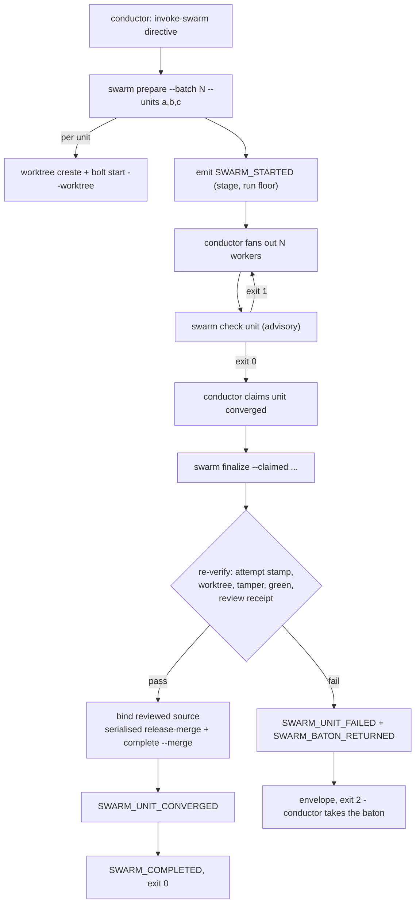
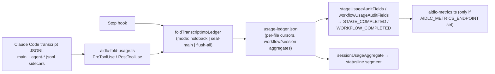

# CLI ツール一覧: Bolt、Swarm、Worktree、Posture、Usage、Doctor 群

> **Source**: [awslabs/aidlc-workflows](https://github.com/awslabs/aidlc-workflows) — branch `v2`, commit `3c3146cf` (v2.6.40, retrieved 2026-08-21)
> **Status**: 実装から導出した as-built 仕様である。upstream のコードが本ドキュメントより優先する。
> **正本**: 英語版 `09-cli-tools.md`(この日本語版は参照訳。両者が食い違う場合は英語版が優先)

---

## 1. スコープ

本ドキュメントは `core/tools/` 配下の決定論的な CLI サーフェスのリファレンスである。以下を含む。

- `core/tools/*.ts`(41 ファイル)のエントリ verb と担当仕様書を含む完全なファイル単位一覧
- `core/tools/aidlc-utility.ts` の全 verb サーフェス
- Construction フェーズの4つのツール(`aidlc-bolt.ts`、`aidlc-swarm.ts`、`aidlc-worktree.ts`、`aidlc-testing-posture.ts`)に関する詳細セクション
- usage/cost パイプライン(`aidlc-usage.ts` + `core/hooks/aidlc-fold-usage.ts` + `aidlc-metrics.ts`)と、同梱される2つのデータファイル(`core/tools/data/model-rates.json`、`core/tools/data/ars-priors.json`)
- バリデーションと2つの doctor モジュール(`aidlc-validate.ts`、`aidlc-doctor-bundle.ts`、`aidlc-workspace-doctor.ts`)
- `core/skills/` 配下の4つのセッションスキル(3つが `read-only`、1つが `read-write`)

他所が担当するトピックは、再掲せずポインタのみを示す: オーケストレーションエンジンと directive スキーマ(`02-orchestration-engine.md`)、state/audit/runtime のプリミティブ(`03-state-audit-runtime.md`)、センサースクリプトとマニフェスト(`06-sensors.md`)、配線サーフェスとしての hooks(`07-hooks.md`)、memory/rules/learnings(`08-memory-rules-learnings.md`)、ハーネス投影と `dist/` レイアウト(`10-distribution-harnesses.md`)、プラグイン(`11-plugin-system.md`)、テストと CI(`12-testing-ci.md`)。

`dist/` は生成された投影出力である。本ドキュメントがこれに言及する箇所(§12.2)は、配送レイアウトを説明しているのであって、正本を示すものでは決してない。

---

## 2. 起動モデル

### 2.1 等価な2つのエントリ形式

すべてのツールは Bun で実行可能な TypeScript モジュールである。2つの起動形式が存在する。

1. **直接**: `bun <harness>/tools/aidlc-<tool>.ts <subcommand> [flags]`。
2. **ディスパッチ**: `core/tools/aidlc.ts` は単一の窓口であり、`<noun> <verb>` の組(または裸のトップレベル verb)をツールファイルとサブコマンドへマッピングする。

ディスパッチャのルーティングテーブルは凍結されたデータ構造である: `export const ROUTES: readonly Route[]`(`core/tools/aidlc.ts:91`)、区切りは番兵コメント `// ROUTES_TABLE_START`(`core/tools/aidlc.ts:90`)と `// ROUTES_TABLE_END`。30 個のルートエントリを保持する。これが参照するツールファイルのマップは `export const TOOLS`(`core/tools/aidlc.ts:54`)である。

### 2.2 ルート種別

| `kind` | 意味 |
| --- | --- |
| `top-passthrough` | 裸のトップレベル verb をそのままツールへ転送する(`next`、`status`、`doctor` など) |
| `top-prefix` | 固定プレフィックスでトップレベル verb を書き換える(`compose` → `orchestrate next compose`) |
| `top-help` | ディスパッチャ自身のヘルプレンダラー |
| `noun-passthrough` | `<noun> <verb>` で、`<verb>` がツール自身のサブコマンド名と一致する場合 |
| `noun-map` | `<noun> <verb>` で、`targets` テーブルが verb をリネームする場合(`scope change` → `scope-change`) |
| `custom` | 独自の引数再構成(`intent`、`space`、`config`、`plugin`、`gen`) |
| `routing-only` | ツール委譲ではまったくない ― hooks、statusline、ハーネスアダプタ |

7つ目の種別 `top-stub` は `RouteKind` に宣言されており(`core/tools/aidlc.ts:18`)、ディスパッチャでも処理される(`:763-765`)が、この commit の時点でこれを使うルートは存在しない。

宣言された `classification` 型は5値である ― `type Classification = "passthrough" | "translation" | "stub" | "routing-only" | "help";`(`core/tools/aidlc.ts:14`)。30 のルートはこのうち4種類だけを使う: `passthrough`(15)、`translation`(11)、`routing-only`(3)、`help`(1)。`stub` は宣言されているが未使用であり、未使用の `top-stub` 種別と符合する。

### 2.3 レガシーフラグエイリアス

`export const SLASH_FLAG_ALIASES`(`core/tools/aidlc.ts:78`)は、ルーティング前に9つのレガシー表記を書き換える。逐語:

```text
--status → status          --doctor → doctor        --help → help
--version → version        --resume → next --resume  --scope → next --scope
--upgrade → upgrade        config-change → config set
space-create → space create
```

5つのエントリは `irregular: true` を持つ。このフラグにはルーティングや arity のセマンティクスはない ― `Alias` は `irregular?: boolean` として宣言されており(`core/tools/aidlc.ts:51`)、唯一の読み手はヘルプレンダラーである: `const mark = alias.irregular ? " (irregular)" : "";`(`core/tools/aidlc.ts:567`)。これは、単一トークンの単純な de-dashing ではない書き換えに付ける手動注釈である ― 5つのうち4つは1トークンを2トークンへ展開する(`--resume` → `next --resume`、`--scope` → `next --scope`、`config-change` → `config set`、`space-create` → `space create`)。一方 `--upgrade` → `upgrade` は1対1の de-dashing であるにもかかわらず irregular と印付けられている(`core/tools/aidlc.ts:85`)。

### 2.4 コンパイル済みバイナリの認識

同胞プロセスを spawn するツールは `bun` をハードコードしない。`compiledExecutable()`(`core/tools/aidlc-runtime-paths.ts:20-24`)は `AIDLC_COMPILED_EXECUTABLE` を返し、なければコンパイル済み実行ファイルとして走っている場合の `process.execPath`、それもなければ `null` を返す。非 null のとき同胞は `<executable> <noun> <verb> …` としてディスパッチャ経由で起動される。null のときは `bun <toolsDir>/aidlc-<tool>.ts …` として起動される。`aidlc-bolt.ts`(`core/tools/aidlc-bolt.ts:117-160`)と `aidlc-swarm.ts`(`core/tools/aidlc-swarm.ts:166-183`)の両方がこの分岐を実装している。`aidlc-bolt.ts:130-135` はさらに、内部限定のサブコマンド名 `audit-fork` / `audit-merge` をディスパッチャの公開 verb である `audit fork` / `audit merge` へ変換する。

---

## 3. マスターインベントリ

`core/tools/` 配下(`core/tools/data/` を除く)には 41 ファイルが存在する。そのうち 26 ファイルは `import.meta.main` ガードを持ち、したがって直接実行可能である。残りはライブラリモジュールである ― 表内に注記した1つの例外を除く(`aidlc-sensor-traceability.ts` は `core/tools/aidlc-sensor-traceability.ts:544` で `main()` を宣言し、トップレベルの `try { main(); } catch { … }`(`:631-635`)から無条件に呼び出すため、`import.meta.main` ガードを持たないにもかかわらずスクリプトである)。

行数は `wc -l` によるものである(本ドキュメント末尾の「Measurement notes」を参照)。

| ファイル | 行数 | エントリ verb / サブコマンド | 目的 | 担当仕様書 |
| --- | ---: | --- | --- | --- |
| `aidlc.ts` | 1197 | `help`、および 30 ルート | 統合ディスパッチャ: noun/verb → ツール + サブコマンド。hook、statusline、アダプタのルーティング | 本書 §2 |
| `aidlc-orchestrate.ts` | 6169 | `next`、`continue`、`report`、`park` | エンジン本体: 呼び出しごとに厳密に1つの型付き directive を発行する | `02-orchestration-engine.md` |
| `aidlc-directive.ts` | 1362 | (自己テスト: directive の種類ごとに1つの例を出力する) | 凍結された engine↔conductor directive のユニオンとランタイムバリデータ。10 種類 | `02-orchestration-engine.md` |
| `aidlc-graph.ts` | 2877 | `artifacts`、`producers`、`consumers`、`topo`、`cycles`、`scope`、`validate-scope`、`validate-grid`、`compile`、`resolve`、`export`、`ars` | ステージグラフのコンパイルとクエリ。ARS 画面(§11)も所有する | `02-orchestration-engine.md` |
| `aidlc-runtime.ts` | 1434 | `compile`、`read`、`summary`、`fragment-fork`、`fragment-merge` | イベントログ上に構築されたランタイムグラフ | `03-state-audit-runtime.md` |
| `aidlc-state.ts` | 4278 | `get`、`set`、`set-skeleton-stance`、`set-construction-iteration`、`checkbox`、`count`、`advance`、`finalize`、`complete-workflow`、`gate-start`、`approve`、`reject`、`revise`、`skip`、`resume`、`acknowledge-compaction`、`reuse-artifact`、`lookup`、`practices-event`、`practices-promote`、`fork`、`merge`、`unit`、`park`、`unpark` | ステートファイルのライフサイクル | `03-state-audit-runtime.md` |
| `aidlc-audit.ts` | 1589 | `append`、`append-batch`、`append-raw`、`audit-fork`、`audit-merge` | 追記専用の監査シャード + メトリクスタップ | `03-state-audit-runtime.md` |
| `aidlc-log.ts` | 1223 | `decision`、`answer`、`link`、`review` | インタラクション監査ヘルパー: decision / answer のログに加え、agent-link と §12a reviewer レシート | `03-state-audit-runtime.md` |
| `aidlc-jump.ts` | 487 | `resolve`、`execute` | ステージ/フェーズのジャンプ | `02-orchestration-engine.md` |
| `aidlc-learnings.ts` | 1141 | `surface`、`persist` | §13 学習選定ゲート | `08-memory-rules-learnings.md` |
| `aidlc-knowledge.ts` | 3954 | `onboard`、`sync`、`list`、`show`、`associate`、`dissociate`、`rebind` | DocumentKB: 顧客ドキュメントをコミット済みカタログへインデックス化する | `08-memory-rules-learnings.md` |
| `aidlc-steering.ts` | 116 | ―(ライブラリ) | `load-steering` directive が運ぶルール内容の共有リゾルバ | `08-memory-rules-learnings.md` |
| `aidlc-utility.ts` | 6108 | 27 verb(§4) | ヘルプ、status、doctor、intent/space/config/plugin/scope の各 verb、recompose | 本書 §4、§12 |
| **`aidlc-bolt.ts`** | **970** | `start`、`complete`、`fail`、`abort`、`set-autonomy`、`dispatch-event`、`hold-merge`、`release-merge` | Construction bolt のライフサイクル + autonomy モード | **本書 §5** |
| **`aidlc-swarm.ts`** | **1392** | `prepare`、`check`、`finalize` | Swarm 収束の審判役 | **本書 §6** |
| **`aidlc-worktree.ts`** | **1195** | `create`、`merge`、`discard`、`list`、`verify`、`info` | Bolt 単位の git worktree プリミティブ | **本書 §7** |
| **`aidlc-testing-posture.ts`** | **1105** | `resolve`、`render`、`fingerprint`、`verify` | テスト手法契約 + Code Generation の承認ゲート | **本書 §8** |
| **`aidlc-usage.ts`** | **1694** | ―(ライブラリ) | トークン/コスト抽出、レートテーブル、耐久台帳 | **本書 §9** |
| **`aidlc-metrics.ts`** | **468** | `--internal-metrics-send`(内部ワーカー専用) | 監査タップからの opt-in な StatsD-over-HTTP 発行 | **本書 §9.5** |
| **`aidlc-doctor-bundle.ts`** | **1616** | ―(ライブラリ) | `--doctor --export`: タイムライン再構築、診断ルール、redact 済みバンドル | **本書 §12.3** |
| **`aidlc-workspace-doctor.ts`** | **181** | ―(ライブラリ) | 3つの advisory なワークスペースマニフェスト doctor 行 | **本書 §12.4** |
| **`aidlc-validate.ts`** | **300** | `outputs` | ステージファイルの宣言済み outputs が本文で参照されているかの検査 | **本書 §12.5** |
| **`aidlc-version.ts`** | **4** | ―(ライブラリ) | `export const AIDLC_VERSION = "2.6.40"` | **本書 §12.6** |
| **`aidlc-includes.ts`** | **366** | ―(ライブラリ) | space 切替時のハーネスネイティブなルール include の surgical な付け替え | **本書 §12.7** |
| **`aidlc-lib.ts`** | **10668** | ―(ライブラリ) | 共有ライブラリ本体(§13) | **本書 §13** |
| `aidlc-workspace-sync.ts` | 1175 | (フラグのみ: `--force`、`--project-dir`) | `repos.json` に対してワークスペースを整合させる | 本書 §12.4 |
| `aidlc-workspace-manifest.ts` | 158 | ―(ライブラリ) | `repos.json` のスキーマ + sync と doctor が共有するパス規則 | 本書 §12.4 |
| `aidlc-runtime-paths.ts` | 220 | ―(ライブラリ) | ハーネス/データパス解決。コンパイル済み実行ファイルの検出 | `10-distribution-harnesses.md` |
| `aidlc-runner-gen.ts` | 841 | `write`、`check`、`list`、`scopes` | コンパイル済みグラフからステージ単位の runner スキルを生成する | `10-distribution-harnesses.md` |
| `aidlc-tiers.ts` | 274 | ―(ライブラリ) | エージェント単位の判断ティア → ハーネスのモデル/effort ノブ投影 | `05-agents.md` |
| `aidlc-sensor.ts` | 927 | `list`、`describe`、`fire` | センサーランナー | `06-sensors.md` |
| `aidlc-sensor-claim-sources.ts` | 1441 | (センサースクリプト) | Claim-sources センサー | `06-sensors.md` |
| `aidlc-sensor-linter.ts` | 383 | (センサースクリプト) | Linter センサー | `06-sensors.md` |
| `aidlc-sensor-required-sections.ts` | 244 | (センサースクリプト) | Required-sections センサー | `06-sensors.md` |
| `aidlc-sensor-traceability.ts` | 635 | (センサースクリプト、無条件の `main()`) | Traceability センサー | `06-sensors.md` |
| `aidlc-sensor-type-check.ts` | 317 | (センサースクリプト) | Type-check センサー | `06-sensors.md` |
| `aidlc-sensor-upstream-coverage.ts` | 224 | (センサースクリプト) | Upstream-coverage センサー | `06-sensors.md` |
| `aidlc-sensor-schema.ts` | 183 | ―(ライブラリ) | センサーマニフェストのスキーマバリデータ | `06-sensors.md` |
| `aidlc-stage-schema.ts` | 676 | ―(ライブラリ) | ステージのフロントマタースキーマバリデータ | `04-stage-protocol.md` |
| `aidlc-rule-schema.ts` | 78 | ―(ライブラリ) | ルールのフロントマタースキーマバリデータ | `08-memory-rules-learnings.md` |
| `aidlc-documentkb-schema.ts` | 607 | ―(ライブラリ) | DocumentKB のインデックス + ドキュメント単位メタデータのスキーマ | `08-memory-rules-learnings.md` |

**Entry verbs** 列は各ツール自身のサブコマンド名を示しており、ディスパッチャ側の綴りではない。`aidlc-runner-gen.ts` はその最も明確な例である: その `main()` は `write` / `check` / `list` / `scopes` に分岐する(`core/tools/aidlc-runner-gen.ts:809-832`、拒否は `:828` ― `Unknown subcommand: ${subcommand ?? "(none)"}. Valid: write, check, list, scopes`)。一方 `gen` ルートは `runners`、`runners --check`、`runner-list`、`runner-scopes`、`stage-table`、`scope-table` を公開する(`core/tools/aidlc.ts:405`)。`handleGen`(`core/tools/aidlc.ts:653-673`)は最初の4つを `write` / `check` / `list` / `scopes` へ変換し、`stage-table` / `scope-table` は代わりに `TOOLS.utility` へ委譲する(`:669-671`)ため、この2つは runner-gen には一切到達しない。

---

## 4. `aidlc-utility.ts` の verb サーフェス

### 4.1 ルータ

`main(rawArgs)` は argv を `{ positional, flags, bareFlags, blankFlags }` へパースし、`core/tools/aidlc-utility.ts:5987` の単一の `switch` で `positional[0]` に分岐する。27 個の `case` ラベルを、逐語かつソース順で示す:

```text
help              version           status            doctor
intent-create     intent            space             space-create
codekb-path       codekb-scope-diff detect            select-plugins
plugin-list       plugin-sync       init              state-init
upgrade           scope-change      recompose         config-change
config-get        config-list       set-status        detect-scope
resolve-env-scope scope-table       stage-table
```

`default` アーム(`core/tools/aidlc-utility.ts:6083-6100`)は、リネームされた `intent-birth` をリダイレクトで特別扱いする(`:6089-6092`) ―

> ``` `intent-birth` was renamed to `intent-create`. Run the same command with `intent-create` instead (flags are unchanged). ```

― それ以外は(`:6093-6100`)``Unknown command "<x>". Run `aidlc-utility help` for what this tool can do.`` で死に、続いてハードコードされた `Available commands:` の一覧と `Common options: [--project-dir <path>] [--scope <scope>] [--json]` を出す。そのハードコードされた一覧は 27 verb のうち 25 個を名指しする ― `init` と `state-init` は省かれており、両者とも遷移用のスタブであり(§4.2)、ユーザー向けサーフェスから意図的に除外されている。

### 4.2 機能別に分類した verb

#### 情報系(読み取り専用、変更なし、監査なし)

| Verb | 挙動 |
| --- | --- |
| `help` | `renderHelpText()`(`core/tools/aidlc-utility.ts:354`)をレンダリングする: scope マッピングからライブに計算されたスコープ表(EXECUTE 数/全体ステージ数、depth、テスト戦略、デフォルトマーカー)を、静的な `HELP_TEXT_TAIL`(`:300`)と連結したもの |
| `version` | `aidlc <AIDLC_VERSION>` を出力する(`:387-389`) |
| `status` | アクティブな(または `--intent`/`--space` で選択された)レコードのステートファイルを読み、進捗をレンダリングする。ステートファイルが不在のときは "No active AI-DLC workflow found." というオンボーディングブロックを出力する(`:1047-1062`) |
| `detect` | ワークスペーススキャン(greenfield/brownfield、言語)に加え、解決済みのスコープレジストリパスを出力する。「変更なし、監査なし」と明示的に文書化されている(`:6026-6029`) |
| `detect-scope` | 説明文からのスコープ自動検出(`:5829`) |
| `resolve-env-scope` | `AWS_AIDLC_DEFAULT_SCOPE` を解決する(`:5925`) |
| `scope-table`、`stage-table` | スコープグリッド/ステージ表を markdown としてレンダリングする(`:5720`、`:5788`) |
| `codekb-path` | 決定論的な space レベルのリポジトリ単位 codekb ディレクトリを出力する。「mkdir なし、state 読み取りなし、監査なし」(`:4571-4572`。ルータのアームも `:6012-6014` で「変更なし、監査なし、mkdir なし」と再掲する) |
| `codekb-scope-diff` | reverse-engineering の再実行ガード。3モード ― status(デフォルト)、`--compare <timestamp.md>`、`--mint --paths <a,b,…>`。Status の verdict、逐語: `NO_STORE`、`CURRENT`、`STALE`、`UNVERIFIED`、`UNKNOWN_SCOPE`(`:4585-4596`)。Compare の verdict: `COVERS`、`NARROWER`。「Always exits 0 with the verdict in the output(read-only query …; refusals are for lifecycle verbs)」(`:4608-4610`) |
| `config-get`、`config-list` | アクティブなワークフロー設定(`depth`、`test-strategy`、`review`)を読む(`:5373`、`:5380`) |
| `plugin-list` | インストール済みプラグインと有効化状態(`:943`) |

#### ワークスペースカーソル

| Verb | 挙動 |
| --- | --- |
| `intent` | `intent list` \| `intent create` \| `intent switch <name>` \| 裸の `intent <name>`。switch は純粋なカーソル書き込み(`setActiveIntentCursor`)に加え、ライブなセッション→intent レコードの再スタンプを行い、後続の resume が誤った rebind プロンプトを発火しないようにする(`:4491-4506`)。マッチングはレコードディレクトリの完全一致を優先し、次に一意なスラッグ。曖昧なスラッグは候補を列挙して死ぬ |
| `intent-create` | 新しい intent レコードを生成する(`:3828`)。`--help`/`-h` は `:5966-5971` の使用法行へ短絡する |
| `space` | `space list` \| `space create` \| `space switch <name>` \| 裸の `space <name>`。switch は**2つ**のユーザー単位の書き込みを行う: gitignore 対象の `active-space` カーソル、続いて `repointHarnessIncludes()`(§12.7)で、次のターンが切り替え先の space の method を読み込むようにする(`:4552-4562`) |
| `space-create` | space を作成する(`:4799`) |

`intent` と `space` はどちらも、ターゲットが `help` または `-h` の場合を switch ではなくヘルプ要求として扱う。これは "help" がレコード/space の予約名だからである(`:4464-4468`、`:4536-4541`)。

これらの未知ターゲット拒否は、意図的に招き入れない文面になっている。Intent(`:4487-4489`):

> `Unknown intent "<t>" in space "<s>". This command only switches between existing intents - run /aidlc intent to list them. Do not start a new workflow to recover from this error.`

Space(`:4550-4553`):

> `Unknown space "<t>". Existing: … This command only switches between existing spaces. Do not create a space to recover from this error - creating one is a separate, deliberate move (/aidlc space create <name>, or legacy /aidlc space-create <name>).`

#### 変更系

| Verb | 挙動 |
| --- | --- |
| `scope-change` | アクティブなスコープを変更する。派生ステートフィールドを再構築する(`:4888`) |
| `recompose` | アダプティブコンポーザーの実行中書き込み。`--skip <slugs>` / `--add <slugs>` は、`withAuditLock` の下で PENDING ステージの計画サフィックスを反転させ、厳格に検証し(「飢餓状態の必須入力は拒否であって advise ではない」)、派生フィールドを再構築し、`RECOMPOSED` を監査する(`:5104-5116`)。どちらのリストも与えられない場合(`Usage: recompose [--skip <slug,...>] [--add <slug,...>] - name at least one flip.`、`:5120`)、両方に同じスラッグが現れる場合(`:5124`)、ステートファイルが存在しない場合(`recompose re-shapes a RUNNING workflow; start one first.`、`:5129`)は拒否する |
| `config-change` | `depth` / `test-strategy` / `review` を設定する(`:5391`) |
| `set-status` | **ユーザーが直接呼び出せない。** 環境ハンドシェイクで保護されている: `AIDLC_STATUSLINE_OWNER === "statusline:" + process.ppid` でない限り死ぬ(`:5491-5500`)。拒否文面は "Direct aidlc-utility set-status is blocked: there is nothing for you to do here. … (status synchronization is owned by the sync-workflow-state hook.)" |
| `select-plugins` | 有効化済みプラグイン一覧の表示/設定。インストール済みプロジェクトハーネスを要求する ― `select-plugins requires an installed project harness at <dir>.`(`:449-451`) |
| `plugin-sync` | インストール済みプラグインを現在のインストールへ合成する(非同期、`:974`) |
| `doctor` | §12.1 |

#### 遷移用スタブ(ヘルプから意図的に不在)

`init` と `state-init` はどちらもリダイレクト付きで `die()` する(`:4349-4357`)。`upgrade` は `upgrade is not available in this install; it arrives with the packaged binary distribution.` で死ぬ(`:224-225`、`:4359-4361`)。`:6039-6041` のルーティングコメントは、これらが「transition-only and intentionally absent from help」であると述べる。

### 4.3 ヘルプとルータの間の `knowledge` ギャップ

`HELP_TEXT_TAIL` は7つの `knowledge …` verb と `plugin select` を告知するが(`core/tools/aidlc-utility.ts:317-323`、`:314`)、`aidlc-utility.ts` のルータには `knowledge` の case が**存在しない**。これは欠陥ではない: `knowledge` は別のルートであり(`core/tools/aidlc.ts:372`)、`aidlc-knowledge.ts` へ委譲する。`plugin select` は `custom` ルートで、その `targets` テーブルが `select-plugins` へマッピングする(`core/tools/aidlc.ts:352-358`。ルートオブジェクトは `:351-365` にまたがる)。ヘルプテキストが記述しているのは**ディスパッチャの**サーフェスであって、このツール自身の switch ではない。

`knowledge` ルートには、実在の欠陥を記録する長い逐語コメントが付いている(`core/tools/aidlc.ts:367-371` および `:374-383`): このルートは元々 `group` が `"knowledge"` であるにもかかわらず `top-passthrough` として宣言されており、2つのリゾルバは group で分岐していた ― `resolveTop` は `group === "top"` のみを反復し、`resolveNoun` は `noun-passthrough`/`noun-map`/`custom`/`routing-only` のみを処理していた。結果として、"NO knowledge verb ran through the compiled dispatcher while the tool itself worked perfectly when invoked directly" という状態になっていた(`:379-380`)。

---

## 5. Bolt ライフサイクル(`aidlc-bolt.ts`)

### 5.1 定義と所有範囲

> "A bolt is one execution of stages 3.1-3.5 for a Unit (or small group of dependency-linked Units)." (`core/tools/aidlc-bolt.ts:3-4`)

このツールは4つの監査発行を所有する: `BOLT_STARTED`、`BOLT_COMPLETED`、`BOLT_FAILED`、`AUTONOMY_MODE_SET`。`abort` は意図的に `BOLT_FAILED` を `Reason: aborted` フィールド付きで再利用し、`BOLT_ABORTED` 型を新設しない ― "keeps the audit count stable and uses field taxonomy for sub-classification" (`:7-9`)。

このツールは同胞のプリミティブを合成するが、決して重複させない: `aidlc-state.ts fork/merge`、`aidlc-audit.ts audit-fork/audit-merge`、`aidlc-runtime.ts fragment-fork/fragment-merge`、`aidlc-worktree.ts discard`。ヘッダは不変条件を述べる: "Never duplicate state mutations the sibling primitives already own (Bolt Refs, Worktree Path) — this is the t48 emitter-pairing rule" (`:36-38`)。

### 5.2 サブコマンド

8つのサブコマンドはルータで列挙される(`:881-910`)。未知の verb に対する拒否は `Unknown subcommand: <x>. Valid: start, complete, fail, abort, set-autonomy, dispatch-event, hold-merge, release-merge` である(`:907-909`)。

| サブコマンド | 必須フラグ | 任意 | 発行する監査 |
| --- | --- | --- | --- |
| `start` | `--name`、`--batch` | `--walking-skeleton`、`--worktree --slug`、`--repo`、`--intent`、`--space` | `BOLT_STARTED`。`--worktree` 付きなら `STATE_FORKED` + `AUDIT_FORKED` + fragment fork も駆動する |
| `complete` | `--name`、`--batch` | `--merge --slug` | `BOLT_COMPLETED`。`--merge` 付きなら `STATE_MERGED` + `AUDIT_MERGED` + fragment merge も駆動する |
| `fail` | `--name`、`--error` | `--slug`、`--succeeded-siblings` | `BOLT_FAILED` |
| `abort` | `--name`、`--slug`、`--reason` | `--discard` | `Reason: aborted` 付きの `BOLT_FAILED` |
| `set-autonomy` | `--mode autonomous\|gated` | ― | `AUTONOMY_MODE_SET` + state フィールド書き込み |
| `dispatch-event` | `--event`、`--slug` + バリアント別フラグ | ― | 3つの `MERGE_DISPATCH_*` のいずれか |
| `hold-merge` | `--slug` | ― | *(監査なし)* |
| `release-merge` | `--slug` | ― | *(監査なし)* |

`--worktree`、`--merge`、`--discard` だけが真偽値フラグであり、厳密な値要求パーサーが走る前に `splitBooleanFlags` によって取り除かれる(`:97-110`)。パーサーは、フラグの後に別のフラグが続くことを拒否する: `--x expects a value, got another flag: "--y". Did you forget the value?`(`:172`)。

`--worktree` と `--merge` は単一 bolt 専用である。いずれかに CSV の `--name` を渡すと拒否される: `--worktree requires a single bolt name; got csv: "<n>". Issue one start --worktree per bolt.`(`:215-217`)、対称形の `--merge requires a single bolt name; …`(`:375-377`)。

### 5.3 順序規律

3つの異なる順序があり、それぞれに記録された理由がある:

- **`start --worktree`** ― ステートファイルの形状を検証 → `BOLT_STARTED` を発行 → state-fork → audit-fork → fragment-fork(`:224-335`)。検証が発行に先行するのは「a missing state file doesn't leave an orphan BOLT_STARTED」ためである(`:221-223`)。各 fork の失敗は、失敗させる前に回復用の `BOLT_FAILED` を発行する。
- **`complete --merge`** ― hold-merge チェック → `BOLT_COMPLETED` を発行 → state-merge → audit-merge → fragment-merge(`:387-489`)。
- **`abort --discard`** ― まず discard、その後に監査(`:562-586`)。コメントには、この順序を導いた発見が記録されている: 先に発行すると「would claim the Bolt was aborted-and-cleaned-up while the worktree directory still existed on disk and the slug remained in main's Bolt Refs」ことになってしまう。

すべての同胞 spawn は 30 秒のタイムアウトを持つ。`signal === "SIGTERM"` はタイムアウトと終了コード失敗を区別し、`*-timeout` の理由 enum を選択する(`:150-151`、`:277-278`)。

### 5.4 失敗エンベロープ

worktree パスにおける `error()` 以外の失敗は、機械可読なエンベロープを出力して exit 1 する(`failJson`、`:946-966`):

```json
{"ok": false, "slug": "…", "stage": "…", "reason": "…", "detail": "…"}
```

`stage` は `start-worktree`、`complete-merge`、`abort-discard`、`hold-merge`、`release-merge` のいずれかである。`reason` は呼び出しサイトで構築される enum のいずれかである: `state-read-failed`、`audit-emit-failed`、`state-fork-failed`、`state-fork-timeout`、`audit-fork-failed`、`audit-fork-timeout`、`fragment-fork-failed`、`fragment-fork-timeout`、`merge-held`、`state-merge-failed`、`state-merge-timeout`、`audit-merge-failed`、`audit-merge-timeout`、`fragment-merge-failed`、`fragment-merge-timeout`、`discard-failed`、`discard-timeout`。これは `error()` とは明確に別物であり、`error()` は `emitError` を経由して `ERROR_LOGGED` 監査行へルーティングされる(`:943-945`、`:916-920`)。

### 5.5 HOLD-MERGE

`hold-merge` / `release-merge` は、Bolt 単位の**フォーク済み**ステートファイル `<projectDir>/.aidlc/worktrees/bolt-<slug>/…/aidlc-state.md` 内の `Merge-Held` フィールドを設定/解除する(`:620-621`)。プロパティは `:622-633` のとおり:

- 双方向で冪等である。
- このフィールドは初回の hold 時に `## Project Information` の下へ挿入されるため、ステートテンプレートのバージョンを上げる必要はない。
- **監査発行なし** ― "Merge-Held is internal coordination state, not a user-visible event."
- フォーク済みステートファイルが不在の場合は *held でない* として読まれる(`forkedStateFilePath` は `null` を返し → `isMergeHeld` は false、`:661-682`)が、不在ファイルに対する `setMergeHeld` はハードエラーである: `No per-Bolt forked state file for slug "<s>" — was \`aidlc-bolt start --worktree --slug <s>\` run?`(`:687-689`)。

強制ポイントは `complete --merge` である。逐語の拒否(`:392`):

> `Merge held by HOLD-MERGE invariant; resolve the failed-sibling halt-and-ask sequence and run \`aidlc-bolt release-merge --slug <slug>\` before retrying.`

その根拠(`:379-386`)は、複数失敗時の halt-and-ask シーケンスが、失敗した sibling に関する質問をレンダリングする前に、成功した*すべての* sibling に対して `Merge-Held: true` を設定するため、シーケンスの途中でマージが着地しないようにするというものである: "This refusal pins that invariant in tooling so an orchestrator that forgets the prose contract cannot land a merge mid-AUQ-sequence."

### 5.6 Autonomy: `set-autonomy` と、意思決定ラダーの不在

`set-autonomy --mode autonomous|gated` はこのツールにおける**唯一の** autonomy verb である。`decide-question` サブコマンドは存在せず、upstream ツリーのどこにも autonomy 決定ラダーは存在しない: `git grep -F -e "decide-question" -e "decideQuestion" -- core plugins harness` はゼロ件を返す(「Measurement notes」参照)。この commit における autonomy は、単一の verb によって書き込まれる2値フィールド(`autonomous` / `gated`)である。

`handleSetAutonomy`(`:804-859`)はこのツールで最もガードされたパスである:

1. すべてが1つの `withAuditLock` の内側で起こる ― "One lock covers presence check -> audit consume -> state write. Otherwise two grants, or a grant racing approval, can both observe one fresh turn" (`:813-814`)。
2. **エスカレーションのみ**が human-presence ガードを持つ。`autonomous` への切替は `humanPresenceGuardDisabled()` でない限り `humanActedSinceGate(pd)` を要求する。`gated` へのデエスカレーションは「presence なしでゲートを復元する」(`:816-818`)。
3. 拒否文面は逐語で以下のとおり(`:825-829`):

   > `Refusing to switch Construction to autonomous: a real human has not acted since the last gate resolution, and autonomous mode is granted only by the human's ladder-prompt answer (it waives every later gate, so the grant itself needs a fresh human turn). Ask the human to confirm autonomous mode in a typed message, then retry. Do not log the ladder choice via aidlc-log answer; the choice is recorded by set-autonomy itself.`

4. その後: `setFieldStrict("Construction Autonomy Mode", mode)` でステートフィールドを検証し、`AUTONOMY_MODE_SET` を発行し、ステートファイルを書き込む ― 検証済みコンテキストの中で監査が先に行われる。

無効なモードはこれより前に拒否される: `Invalid --mode: <m>. Must be 'autonomous' or 'gated'.`(`:808`)。

### 5.7 バッチ番号

`--batch` は `start` と `complete` の両方で `/^[1-9][0-9]*$/` による正の整数として検証される(`:202-204`、`:363-365`)。拒否は `Invalid --batch: "<b>". Must be a positive integer.`。バッチ番号は `Batch number` 監査フィールドへ運ばれ、swarm の `prepare`/`finalize` が `SWARM_STARTED` 境界を unit と相関させるために使う結合キーである(§6.6)。並行バッチはスラッグごとに N 回の `start --worktree` 呼び出しを発行する(`:194-196`)。

### 5.8 Merge-dispatch イベント

`dispatch-event` は発行専用である: "no state mutation, no spawn. Pure audit emission so doctor can reconcile orphan INVOKED rows" (`:716-717`)。バリアント別の必須フラグを持つ3つのバリアントがある(`:732-796`):

| `--event` | 必須 | 監査フィールド |
| --- | --- | --- |
| `MERGE_DISPATCH_INVOKED` | `--practices-excerpt` | `Bolt slug`、`Practices section excerpt` |
| `MERGE_DISPATCH_RETURNED` | `--strategy`(∈ squash\|merge\|rebase)、`--target`、`--confidence`(∈ [0,1])、`--notes` | `Bolt slug`、`Strategy`、`Target branch`、`Confidence`、`Notes` |
| `MERGE_DISPATCH_FALLBACK` | `--reason`、`--defaults` | `Bolt slug`、`Fallback reason`、`Defaults applied` |

実装は Map ルックアップではなく3つのリテラルな `emitAudit(pd, "EVENT_NAME", …)` 呼び出しである。これは、grep ベースのテストが逐語のエミッタペアリングをアサートするためである(`:719-722`)。

---

## 6. Swarm 収束の審判役(`aidlc-swarm.ts`)

### 6.1 三者分割

モジュールヘッダは、アーキテクチャを1文で述べる(`core/tools/aidlc-swarm.ts:11-13`):

> "the conductor owns fan-out + loop drive (knowledge); this tool owns the convergence verdict + merge + audit (determinism); the human grants autonomy and takes the baton on the envelope (judgement)."

ワーカーのディスパッチは、このツールに**含まれない**。「A bun subprocess cannot issue Task calls, so the worker-dispatch layer is NOT here」(`:6-7`)。ファンアウトは N 並列の Task 呼び出しか、`AIDLC_USE_SWARM=1` のときのインライン Dynamic Workflow のいずれかである。ドライバ選択の読み取りは conductor 側であり、このツールはダウングレードについて `prepare --degraded-from` を通してのみ知る(`:28-31`)。これらすべてを起動するエンジン側の `invoke-swarm` directive 種別は `core/tools/aidlc-directive.ts:75` で定義され、`02-orchestration-engine.md` で仕様化されている。

### 6.2 ステートレス性と上限の不在

3つのステートレスなサブコマンドがある。「no iteration counter, no persisted state」(`:15`)。ヘッダの `WHY STATELESS / NO CAP CONSTANT` ブロック(`:55-63`)は、リトライ上限定数が存在しない理由を説明する: 上限とは3つの関心事の上に成り立つ3つの仕事である ― verdict(決定論性 → `check`)、リトライ判断(知識 → conductor)、暴走時のバックストップ(決定論性 → harness の Stop-hook 上限)。したがって:

> "check is advisory, finalize is authoritative (re-verifies at the merge gate), so a red unit cannot merge even if the conductor lies or misremembers." (`:61-63`)

サブコマンドパーサーは `--flag value` のペアをスキップしながら argv を歩くため、`--project-dir <p> check <unit>` と `check --project-dir <p> <unit>` の両方が解決できる(`:1352-1371`)。未知の verb: `Unknown subcommand: <x>. Valid: prepare, check, finalize`(`:1385`)。

### 6.3 `prepare`

`prepare --batch <n> --units <a,b,c> [--base <branch>] [--concurrency <n>] [--degraded-from <subagent|ultracode>] [--repo <name>]`

シーケンス(`:705-859`):

1. `--batch`(正の整数)と、空でない `--units` リストを検証する。
2. **Autonomous Code Generation ゲート。** `Current Stage` が `code-generation` に正規化され、**かつ** `Construction Autonomy Mode` が `autonomous` の場合、すべての unit が `evaluateCodeGenerationApproval`(§8.6)に合格しなければならない。拒否(`:730-736`):
   > `prepare requires a current, explicitly approved Code Generation plan for every autonomous unit before worktrees are forked: <unit> (<reason>); …`
3. 正本の unit DAG を解決する。不正な DAG は fail-closed する: `prepare cannot resolve the authoritative unit DAG: <reason> (<detail>). Fix unit-of-work-dependency.md before starting the swarm.`(`:740-743`)。
4. DAG の unit と要求された unit の和集合にわたって、bolt スラッグの一意性をアサートする(`:745-749`)。
5. Construction リポジトリを解決する(`--repo`。複数リポジトリの intent でこれが指定されていないとエラー)。
6. `--base` はデフォルトでリポジトリの現在のブランチ、`--concurrency` はデフォルトで unit 数となる。
7. **attempt スタンプ** `{stage, floor}`(§6.6)を解決する。不在の場合 → `prepare could not resolve the current stage attempt from state and audit`(`:774`)。
8. `--degraded-from` が存在する場合、バッチ開始行の*前*に `SWARM_DEGRADED` を発行する(`:778-787`)。値は `subagent` または `ultracode` でなければならない。
9. unit ごとに: `aidlc-worktree create --slug <boltSlug> --base <base> [--repo]`、続いて `aidlc-bolt start --worktree --slug <boltSlug> --batch <n> --name <unit> [--repo]`。
10. worktree の作成と起動が**両方とも**成功した unit だけを名指しして、**単一の** `SWARM_STARTED` を発行する(`:842-849`)。コメントにはアンチリプレイの理由が記録されている: "Emitting before creation would let a failed re-prepare in a later stage attempt relabel an old preserved worktree with the current attempt, allowing stale data to pass finalize's exact-attempt check."
11. JSON プランを出力し、`process.exit(prepared.some(p => !p.ok) ? 2 : 0)` する。

保存されたアンチタンパーのベースラインは存在しない: "The anti-tamper baseline is each worktree's OWN git fork (HEAD) — nothing is stored" (`:24-26`)。

### 6.4 `check`

`check <unit> --check-cmd <cmd> [--test-file <path>]`

2つのシグナルがあり、どちらもディスクから再導出される(`:864-906`):

- **Green**: unit の worktree 内で `--check-cmd` を実行する。exit 0 = converged。これは "the AUTHORITATIVE green check — a worker's own claim of success is never trusted (it could fake a pass)" である(`:186-188`)。シェル選択は明示的である ― 根拠は `:190-203`、実装は `:211-219`: POSIX で `/bin/bash` が存在する場合は `shell: "/bin/bash"`(bashism を保持するため)、それ以外は `shell: true`(win32 では cmd.exe、bash なしの POSIX では `/bin/sh`)。タイムアウトは 60 秒。
- **Untampered**: worktree 内での `git diff --quiet HEAD -- <testFile>`。ガードが発動するのはステータス **1** のみである。「any other status (e.g. 128 — path not tracked at HEAD) is not a confirmed tamper」(`:227-228`、`return result.status === 1;` で強制、`:235`)。

`--test-file` は worktree 内に限定される(`:261-272`)。`../` によるエスケープは設定エラーであって pass ではない: `--test-file resolves outside the unit worktree: <path>`(`:268`)。理由は「a `../` escape would point the guard at a file the worker never touched and silently DISABLE it」ためである。

出力形状: `{unit, converged, tampered, reason}`。tampered のときは `detail: "protected test file was modified"`(`:895-902`)。exit コードは真の convergence ― `converged && !tampered` ― のときに**限り** 0 である(`:905`)。worktree が不在の場合: `no worktree for unit "<u>" — run \`prepare\` first`(`:879`)。`check` は監査を**一切**発行しない。

### 6.5 `finalize` ― 正本のゲート

`finalize --batch <n> --units <a,b,c> --claimed <a,b> --check-cmd <cmd> [--test-file <path>] [--reasons <unit>=<reason>,…]`

`--units` の各 unit について:

**Claimed** ― *conductor 詐称ガード*は、6つのガードに not-green のフォールスルーを加えた1本の `else if` チェーンであり(`:966-1059`)、最初に一致したものが勝つ:

1. この unit + batch に対してスタンプされた `SWARM_STARTED` 境界が存在しない(`:973`) → `error`、詳細は `no stamped SWARM_STARTED boundary for this unit and batch; run prepare in the current attempt`。
2. 準備された attempt ≠ 現在の attempt(`:981`) → `error`、詳細は `prepared swarm attempt <s>/<f> does not match the current attempt <s>/<f>`。
3. 再検証時に worktree が存在しない(`:995`) → `error`、詳細は `no worktree on re-verify (prepare not run?)`。
4. `--test-file` の限定チェックに失敗した(`:1002-1003`) → `error`、§6.4 の `confineError` 文字列を運ぶ。
5. Tampered(`:1004`) → `error`、詳細は `convergence rejected: protected test file was modified`、`tampered: true`。
6. Green(`:1012-1049`) → その後、有効な reviewer レシートがない場合はレシートエラーを伴う `error`(§6.7)、source バインディング失敗は binding エラーを伴う `error`、reviewed かつ source bound なら `converged`。
7. フォールスルー ― green でない(`:1050-1058`) → `error`、詳細は `claimed converged but the check command did not pass on re-verify`。

**Declined**(`--claimed` に含まれない) ― `--reasons` から取った理由付きのステータス `failed`。デフォルトは `cap-exhausted`(`:1060-1077`)。`--reasons` が受け付けるのは `unsatisfiable`、`budget-exhausted`、`cap-exhausted` のみ(`DECLINED_REASONS`、`:132`)。`error` は意図的に除外される。「it is the tool's OWN verdict for a claimed-but-red / tampered unit, never a conductor-supplied attribution」ためである(`:130-131`)。不正なエントリは大声で失敗する: `--reasons entry must be <unit>=<reason>: "<pair>"`(`:945`)、`--reasons reason for "<u>" must be one of: unsatisfiable, budget-exhausted, cap-exhausted`(`:951`)。

**Merge-back** は、決定論性のためにソートされた真の pass 群にわたって直列化される(`:1084-1096`): unit ごとに、`aidlc-bolt release-merge --slug <s>`(冪等)、続いて `aidlc-bolt complete --merge --slug <s> --batch <n> --name <u>`。

**監査**(`:1107-1135`): unit ごとに1行、失敗した unit ごとにバトン行、クローズするバッチ集計。converged した unit の merge-back が**失敗**した場合、`SWARM_UNIT_CONVERGED` も `SWARM_UNIT_FAILED` も発行されない。理由は `:1099-1103` に逐語で記録されている: converged 行は「the engine's batch-advance signal」であり、そのメタデータが main へ着地しなかった unit に対してこれを発行すると、マージされていない unit を過ぎて実行を進めてしまうことになる。unit 自体は converge したので、失敗エンベロープと exit 2 がマージ結果を運び、その行はスコープ限定のリトライに載る。

**エンベロープと exit**: `{batch, units, converged, failed, merge_failures}`。いずれかの unit が失敗するかいずれかのマージが失敗した場合は exit 2、それ以外は 0(`:1137-1147`)。exit 2 は「the conductor must take the baton」を意味する。

### 6.6 attempt スタンプ

`SwarmAttemptStamp` は `{stage, floor}` である(`:152-155`)。`prepare` はこれを一度だけ捕捉し、`SWARM_STARTED` にフィールド `Stage` と `Run floor` として書き込む(`:588-598`)。`emitUnitConverged` は *prepare 時点の*スタンプを、再計算せずに運ぶ。理由は「a late retry against a preserved prior-attempt worktree would otherwise be mislabeled as current」ためである(`:616-618`)。

`preparedSwarmAttempt`(`:1194-1237`)は監査シャードを読み、バッチと unit に一致する `SWARM_STARTED` 行を取得し、スタンプ済みの行を優先し、`(timestamp, shardIndex, pos)` でソートし ― 最新のタイムスタンプが複数シャードにまたがり、かつスタンプが*異なる*場合は、ファイル名で選ぶのではなく `null` を返す: "Same-second starts in different shards are unordered. A shared stamp is harmless; differing stamps fail closed instead of picking by filename."

`legacyPreparedSwarmAttempt`(`:1239-1330`)は、スタンプされていない行のための移行パスである。worktree の `AUDIT_FORKED` の `Fork Boundary` バイトオフセットと `Source Audit Hash` を、main シャードのプレフィックスの SHA-256 に対して検証し、凍結されたプレフィックス内で順序付けられた `SWARM_STARTED → BOLT_STARTED → STATE_FORKED` シーケンスを要求してから、worktree の `Current Stage` からスタンプを導出する。

### 6.7 Reviewer レシートと reviewed-source バインディング

`reviewerRequirement`(`:284-325`。`:276-282` で宣言された `ReviewerRequirement` インターフェースを返す)は `Current Stage` を読み、ステージ定義を解決し、`{stage, reviewer, reviewClass, maxIterations}` を返す。`review_class` のデフォルトは `adversarial`。`maxIterations` は `advisory` のとき 1、それ以外は `reviewer_max_iterations ?? 2`。

`reviewerReceiptError`(`:331-465`)は、レビューが**この Bolt attempt の内側で**行われたことを証明する。`STAGE_STARTED` ではなく `BOLT_STARTED` がフロアである。理由は、これが「excludes a matching receipt inherited from main when prepare forked the worktree, while preserving a receipt across a merge retry on that worktree」ためである(`:328-330`)。この関数は worktree 自身の監査シャードを読み、`BOLT_STARTED`/`REVIEW_REQUESTED`/`REVIEW_COMPLETED` へフィルタし、`(timestamp, position)` でソートし、各 `REVIEW_COMPLETED` をキー `<unit>\0<iteration>` で先行する `REVIEW_REQUESTED` とペアリングする ― `Stage`、`Reviewer`、`Unit` フィールドの一致を要求し、`Workflow: single-stage:*` 行をスキップする。`Recovery: stale-receipt` リクエストは verdict のテストを裸の `READY`/`NOT-READY` へ緩和する。

その後、`/^sha256:[0-9a-f]{64}$/` に一致する `Artifact Fingerprint` フィールドが**かつ**新たに再計算された `reviewArtifactFingerprint` と等しいことを要求し ― ステージが `workspace_requires` を宣言する場合は、`Source Fingerprint` が worktree の現在の source フィンガープリントと一致することも要求する。不一致時の拒否(`:456-461`):

> `claimed converged but the reviewed source no longer matches its worktree's fingerprint for stage "<s>", unit "<u>" (source-fingerprint mismatch); re-invoke the reviewer against the current worktree source and record a fresh verdict before finalizing`

`AIDLC_SKIP_SOURCE_FRESHNESS=1` は source 側の検証をバイパスし(`:448`、`:963-964`)、バインディングの代わりに `Source Freshness Bypass: true` を convergence 行に記録する(`:639-641`)。

`bindReviewedSource`(`:473-571`)は、その後、reviewed されたアプリケーションのバイト列を **Bolt ブランチを動かさずに**不変なコミットとして具現化する: 一時的な `GIT_INDEX_FILE`、`read-tree HEAD`、`add -A`、サブモジュール検証(初期化済みで dirty なサブモジュールは fail-closed)、フィルタ対象パスの raw-byte 再バインディング、続いてフレームワーク所有パス指定 `:(top)aidlc/`、`:(top).aidlc/`、`:(glob)**/aidlc/spaces/*/intents/**/.aidlc-sensors/**` の `git reset -q HEAD --` による復元(`:548-553`) ― 関数ヘッダはその目的を述べる: これは「restores framework-owned paths from HEAD so the later source merge carries application source only」(`:469-470`)。フレームワークのアイデンティティ(`GIT_AUTHOR_NAME: "AI-DLC"`、`aidlc@localhost`)でコミットするため、finalize は周辺の git 設定に依存しない。並行編集のウィンドウを閉じるためオブジェクト書き込み後にフィンガープリントを再計算し、専用の ref を通じて `update-ref` でそのコミットを保持する。

### 6.8 監査の分類体系

このツールは swarm 分類体系の唯一の発行元である ― "The engine is read-only and the conductor (prose) never emits audit events" (`:575-576`)。

| イベント | 発行元 | フィールド |
| --- | --- | --- |
| `SWARM_STARTED` | `prepare` | `Batch number`、`Unit names`、`Concurrency cap`、`Stage`、`Run floor` |
| `SWARM_DEGRADED` | `prepare` | `Batch number`、`Requested driver`、`Fallback driver`(常に `subagent`) |
| `SWARM_UNIT_CONVERGED` | `finalize` | `Batch number`、`Unit name`、`Stage`、`Run floor`、および `Source Fingerprint` + `Source Commit` または `Source Freshness Bypass` のいずれか |
| `SWARM_UNIT_FAILED` | `finalize` | `Batch number`、`Unit name`、`Reason` |
| `SWARM_BATON_RETURNED` | `finalize` | `Batch number`、`Unit name`、`Reason` |
| `SWARM_COMPLETED` | `finalize` | `Batch number`、`Converged count`、`Failed count` |

`emitBoltFailed`(`:695-701`)はさらに、失敗した unit ごとに `aidlc-bolt fail` をベストエフォートで合成する: "the swarm's own SWARM_UNIT_FAILED is the authoritative swarm signal, so a failure to emit BOLT_FAILED must not mask it."

### 6.9 フロー



*テキストフォールバック*: `prepare` は unit ごとに1つの worktree をフォークし、`SWARM_STARTED` 境界をスタンプする。conductor はワーカーをファンアウトし、`check`(advisory。green かつ untampered のときのみ exit 0)をポーリングする。`finalize` は、claim されたすべての unit を、attempt スタンプ、worktree、tamper ガード、check コマンド、reviewer レシートに対して独立に再検証し、真の pass のみを直列にマージし、何かが失敗した場合は型付きエンベロープとともに exit 2 する。

**Settle はエンジン側であり、swarm の verb ではない。** 上記3つの verb がこのツールのサーフェスのすべてである。`settle` サブコマンドも pool の概念もここには存在しない(`grep -i -e settle -e pool core/tools/aidlc-swarm.ts core/tools/aidlc-bolt.ts` → 両ファイルとも 0 件)。settled swarm バッチをクローズするバッチ→エンジンのハンドシェイクは、代わりに run-stage directive 上のオプションフィールド `swarm_settled?: true`(`core/tools/aidlc-directive.ts:210`、`:464`、`:490`、`:745` でアローリストされ検証される)である。エンジンが post-swarm の run-stage を再発行するとき(`core/tools/aidlc-orchestrate.ts:3442`)にセットされ、「the swarm settle」と呼ばれる unit-attachment パス(`:243`)で消費される。そのセマンティクスは `02-orchestration-engine.md` に属する。

---

## 7. Worktree プリミティブ(`aidlc-worktree.ts`)

### 7.1 サーフェス

6つのサブコマンド(`core/tools/aidlc-worktree.ts:1151-1172`)。未知の verb: `Unknown subcommand: <x>. Valid: create, merge, discard, list, verify, info`(`:1171`)。

| サブコマンド | フラグ | 監査 | 読み取り専用 |
| --- | --- | --- | --- |
| `create` | `--slug`、`--base`、`[--repo] [--intent] [--space]` | `WORKTREE_CREATED` | no |
| `merge` | `--slug`、`--target`、`--strategy`、`[--message] [--repo] [--intent] [--space]` | `WORKTREE_MERGED` | no |
| `discard` | `--slug`、`[--repo] [--intent] [--space]` | `WORKTREE_DISCARDED` | no |
| `list` | ― | none | yes |
| `verify` | `--event`、`--slug`、`[--max-age-seconds]` | none | yes |
| `info` | `--slug` | none | yes |

検証定数: `SLUG_RE = /^[a-z][a-z0-9-]*$/`(`:40`)、`VALID_STRATEGIES = {squash, merge, rebase}`(`:42`)、`VALID_VERIFY_EVENTS = {WORKTREE_CREATED, WORKTREE_MERGED, WORKTREE_DISCARDED}`(`:43-47`)。

命名は渡されるのではなく導出される: worktree ディレクトリは `<projectDir>/.aidlc/worktrees/bolt-<slug>`、ブランチは `bolt-<slug>` である(`:260`、`:914`)。

### 7.2 安全性チェック(逐語の拒否)

**Sibling-worktree の拒否** ― `assertNotSiblingWorktree`(`:155-175`)は `git rev-parse --show-toplevel` を `dirname(git rev-parse --git-common-dir)` と比較し、両方を `realpathSync` で正規化する。理由は「macOS symlinks `/var → /private/var`」(`:147-148`)ためである。拒否:

> `aidlc-worktree must run from the main repo checkout, not from a sibling worktree at <top>. Bolt worktrees are siblings of the main checkout, not nested.`

`--repo` の下では、このガードは*ターゲット*リポジトリのチェックアウトに再アンカーされる(`:150-154`)。`create`、`merge`、`discard` で実行される。`list` は意図的にこれをスキップする ― 「list is read-only and useful from anywhere」(`:911-912`)。

**スラッグと戦略**(`:192-210`):

> `Invalid --slug: "<s>". Must be kebab-case (lowercase letter then [a-z0-9-]).`
> `Invalid --strategy: "<s>". Must be one of: squash, merge, rebase.`

**`create` の pre-audit ガード**(`:250-264`)、いずれも発行前に終了する:

> `Base branch does not exist locally: <base>`
> `Worktree directory already exists: <path>`
> `Branch already exists: bolt-<slug>`

**`merge` の HEAD チェック**(`:424-440`) ― 呼び出し元はリポジトリの cwd で `<target>` をチェックアウトしていなければならない:

> `expected branch <target>, found detached HEAD`
> `expected branch <target>, found <actual>`

**`merge` の rebase remote 要件**(`:490-499`):

> `rebase strategy requires a remote for <target>; got none`

remote の*存在*チェックは pre-audit であり、`git fetch` は post-audit である。「because fetch mutates remote-tracking refs — running it before the audit emit would leave a kill-9 window where refs moved without a corresponding audit row」ためである(`:484-488`)。

**Source-freshness ガード** ― 最新の `SWARM_UNIT_CONVERGED` 行が `Source Fingerprint` + `Source Commit` を持つ Bolt は *source-bound* である。`Source Freshness Bypass` を持つものは *bypassed* である。swarm を一度も通過していない Bolt はどちらも持たず、そのまま通過する(`:308-312`、`:313-345`)。

> `refusing to rebase a source-bound convergence: rebase before review/finalize, then merge the immutable reviewed commit`(`:448`)
> `refusing to merge: reviewed Source Commit <sha> is unavailable`(`:404`)
> `refusing to merge: the bypassed Bolt has uncommitted or ignored application paths not represented by its branch (<detail>); commit, remove, or discard those paths before retrying`(`:477-479`)

source-bound なマージは、可動な `bolt-<slug>` ブランチではなく**不変なコミットオブジェクト**をターゲットにする: "This is the last guard before source mutation. The convergence selector is the requested intent/space, and the returned target is an immutable commit object rather than the movable bolt-<slug> branch" (`:525-528`)。

### 7.3 base と target のルール

- `create` は `--base <branch>` を取る。何かを発行する前に、ターゲットリポジトリ内で `git rev-parse --verify` によって解決可能でなければならない。`git worktree add <wtPath> -b bolt-<slug> <base>`(`:281`)。
- `merge` は `--target <branch>` を取り、それがリポジトリの cwd で*現在チェックアウトされている*ブランチであることを要求する(§7.2)。
- 各戦略がどのチェックアウトで走るかは明示的である(`:540-546`): `squash` と `merge` はターゲットリポジトリのメインチェックアウト(`repoCwd`)で走る。`rebase` は worktree(`wtPath`)で走り、続いて `repoCwd` で `git merge --ff-only` する。

`squash` と `merge` については、git 引数は `--target` **ではない**: それは `mergeTarget`、すなわち *Bolt* 側 ― `bolt-<slug>` ブランチ、または Bolt が source-bound か bypassed のとき、不変な reviewed commit / bypass ブランチの OID である(`:528` で解決され、bypass ケースでは `:530-537` で上書きされる)。`--target` は `repoCwd` に既にチェックアウトされているブランチ(§7.2)であり、Bolt はそこへ**マージされる**。`flags.target` を直接取るのは `rebase` だけである。そこでは worktree がターゲットへ再生されているためである。

| 戦略 | コマンド |
| --- | --- |
| `squash` | `repoCwd` で `git merge --squash <mergeTarget>`、続いて `git commit --no-edit -m <message>`(`:549-569`) |
| `merge` | `repoCwd` で `git merge --no-ff --no-edit -m "Merge bolt <slug>" <mergeTarget>`(`:571-591`) |
| `rebase` | `wtPath` で `git fetch <remote>` + `git rebase <target>`(`:594`)、続いて `repoCwd` で `git merge --ff-only <ffTarget>`(`:593-620`) |

`--message` のデフォルトは `Bolt <slug>`(`:414`)。

### 7.4 コンフリクト

コンフリクト検出は git の正本のマーカーにアンカーされる: 結合された stdout+stderr にわたる `/^CONFLICT \(/m`(`:793-800`)。コメントには、以前の寛容な `/conflict/i` が置き換えられた理由が記録されている: それは「false-positived on stdout that happened to contain the substring 'conflict' — including unrelated hint text in future git releases」ためである。

コンフリクトのあるパスは、コンフリクトが起きている同じ cwd で `git diff --name-only --diff-filter=U` によって列挙される ― 「Deterministic across all conflict shapes (content, rename/rename, modify/delete) — beats parsing git's prose stderr」(`:802-813`)。

コンフリクトは出力して exit 1 する(`:623-635`):

```json
{"status":"conflict","slug":"…","worktree_path":"…","conflict_files":[…],
 "detail":"Merge produced conflicts in worktree at <path>. Worktree preserved for inspection."}
```

### 7.5 マージ後のクリーンアップと `[merge-succeeded:<sha>]` タグ

マージコミットが着地すればそれは永続的であり、クリーンアップの失敗がマージ失敗として読まれてはならない。マージ後のすべてのエラーには `[merge-succeeded:<commitSha>]` というプレフィックスが付く(`:644`)。理由は「so the ERROR_LOGGED row carries enough state for doctor to tell 'merge failed entirely' from 'merge landed, cleanup orphan remains' — these need different recovery actions」ためである。

クリーンアップはバインディングによって異なる(`:658-765`):

- **bound**: worktree で `git reset --hard <mergeTarget>`、続いて `git worktree remove --force`。強制削除がその成功した reset によって特に許可されるのは、raw-byte スナップショットが「can remain permanently 'modified' under its own lossy clean filter even after reset」ためである。
- **bypass**: まずブランチ OID が変わっていないことを検証する ― `git rev-parse bolt-<slug>^{commit}` を `bypassBranchOid` と比較し、「bypassed Bolt branch changed during the merge; worktree and branch preserved」で fail-closed する(`:645-657`) ― 続いて3つのフレームワークパス指定に限定した復元 + `git clean -ffdx`(`:670-705`)、続いてアプリケーションパスが何も変わっていないことの再チェック(`:706-734`)、続いて**非強制**の `git worktree remove` と、`update-ref -d refs/heads/bolt-<slug> <oid>` によるブランチ削除(OID チェック付き削除、`:741-759`)。
- **どちらでもない**: 単純な `git worktree remove` + `git branch -D`。

保持された reviewed-source ref は最後に列挙されて削除される。列挙の失敗はそれ自体がエラーである(`:766-773`)。

### 7.6 `discard`、`list`、`verify`、`info`

`discard` は冪等である。ディレクトリ、ブランチ、保持された source ref のいずれも存在しない場合は `{"emitted":null,"slug":"…","worktree_path":"…","reason":"already-discarded"}` を出力し、発行せずに戻る(`:844-854`)。それ以外の場合は(監査優先で)`Reason: agent-discard` 付きで `WORKTREE_DISCARDED` を発行し、その後 `git worktree remove --force` と `git branch -D` を実行する。

`list` は `git worktree list --porcelain` を**2つ**の必須条件でフィルタする: ベース名が `bolt-` で始まる**かつ**親ディレクトリが厳密に `<projectDir>/.aidlc/worktrees` である ― 「so an unrelated worktree someone happens to name `bolt-other` outside our namespace doesn't masquerade as a Bolt」(`:905-909`)。パス比較は `pathKey` を経由し、正規化・区切り文字の統一・win32 での小文字化を行う(`:185-188`)。

`verify` はオーケストレーターの決定論的な post-dispatch バックストップである(`:972-1037`)。イベントと `Bolt slug` の両方に一致する最新の監査ブロックを探し、デフォルト**60秒**の鮮度ウィンドウ(`--max-age-seconds`)を適用する。3つの結果: `{verified:true, event, slug, audit_timestamp}`(exit 0)、`{verified:false, …, reason:"absent"}`(exit 1)、`{verified:false, …, reason:"stale (last seen <ts>)"}`(exit 1)。

`info` はあるスラッグに対する最新の `WORKTREE_CREATED` ブロックを読み、halt-and-ask プロンプトへの補間のために `Worktree path` と `Branch name` を出力する。そのスキーマは `knowledge/aidlc-shared/worktree-info-schema.md` に固定されている(`:1039-1049`)。

---

## 8. テスト手法契約(`aidlc-testing-posture.ts`)

### 8.1 何を、どこから解決するか

このモジュールは、人間が書いた散文から Code Generation 用の決定論的な実行契約を1つ解決する(`core/tools/aidlc-testing-posture.ts:1-8`)。ソースは `aidlc/spaces/<space>/memory/{org,team,project}.md` の3つの memory レイヤーで、`resolveTestingPosture`(`:695-717`)によって読まれ、それぞれが `## Testing Posture` セクション(`TESTING_HEADING`、`:83`)に還元される。

レイヤーの優先順位は **project → team → org → fallback** である(`:644-658`)。fallback は `source: "fallback"` を伴う手法 `test-after` である。

Strict-additive な memory は、サイレントな上書きではなくハードなコンフリクトとして強制される(`:632-642`):

> `Testing Posture conflict: project methodology "<p>" contradicts team methodology "<t>". Revise the narrower rule; strict-additive memory does not permit runtime override.`

`compatibleSpecialization`(`:478-487`)は、手法が等しい場合、または狭い方が `custom` であり検出された構成要素のうち広い方をリストしている場合に限り、狭いレイヤーを許可する。

さらに3つの入力がステートファイルから来る(`:712-716`): `Scope`(デフォルト `feature`)、`Test Strategy`(`normalizeStrategy`(`:489`)によって `minimal`/`standard`/`comprehensive` へ正規化。それ以外は `standard`)、`Project Type`(`normalizeProjectType`(`:501`)がそう言う場合のみ `brownfield`、それ以外は `greenfield`)。

### 8.2 手法の分類

`TestingMethodology` は `"tdd" | "bdd" | "atdd" | "test-after" | "custom"` である(`:21`)。

2つの経路がある(`classifyPosture`、`:406-476`):

- **構造化** ― `structuredField`(`:196-209`)によってパースされる `Methodology:` フィールド(および任意で `Ordering:`)。オプションのリストマーカーとオプションの `**` 強調を受け付ける。語彙外の構造化値は `structuredMethodology`(`:162-179`)からのハードエラーである: `Invalid Testing Posture Methodology "<v>". Expected one of: tdd, bdd, atdd, test-after, custom.`
- **散文** ― 手法ごとの正規表現検出(`normalizeMethodology`、`:125-160`)に加え、2つの曖昧さ解消器: `mixedOrdering`(「テストを実装より先/前に」というフレーズが「実装後にテスト」/「グリーン後にリファクタ」/「テストが実装に続く」というフレーズと共起する場合)と `customSignal`(`custom|mixed` が `ordering|cadence|posture|methodology` に隣接する場合)。構造化フィールドが**なく**、かつどちらの曖昧さ解消器も発動しない状態で複数の構成要素が検出された場合、分類は `null` を返す ― このレイヤーは選択されない(`:453-460`)。続く `const methodology = structured ?? …` の解決(`:461-466`)は別ステップである: 検出された唯一の構成要素を選ぶか、曖昧さ解消器が発動した場合は `custom` を選ぶ。

`defaultOrdering` は、著者による記述がない場合の手法ごとの順序文を供給する(`:181-193`)。例えば TDD は `"For each testable layer: Red, then Green, then Refactor."` である。

### 8.3 コメント処理(v2.6.38 の挙動)

v2.6.38 の changelog エントリは以下の契約を述べる:

> "Commented headings and comment-only `Testing Posture` sections no longer select, truncate, or affirm a methodology; the resolver falls through to the real visible section or next visible memory layer."
> "Visible `Methodology` and `Ordering` fields remain authoritative beside comments, and visible prose and fenced content remain in `applicable_notes`."
> "Testing Contract input fingerprints retain each raw resolved section, including comments and fenced content, so comment-only changes still invalidate stale approvals."

実装は1つのベースとなるコメント除去関数と、そこから派生した**3つ**の投影から成る:

| 関数 | 行 | 除去するもの | 用途 |
| --- | --- | --- | --- |
| `markdownWithoutHtmlComments`(ベースの除去器) | `:301-329` | レンダリングされる HTML コメントのみ。フェンス内容はそのまま残る | 以下3つの投影への入力 |
| `structuralMarkdownLines` | `:331-343` | 上記に加え、行ごとに `<!--` で切り詰める。これによりコメントがフェンスを開閉できなくなる | 見出しとフェンスの検出 |
| `classifiablePostureText` | `:349-373` | 可視テキスト**からすべてのフェンスブロックを除いたもの** | 手法の分類 |
| `visiblePostureText` | `:345-347` | 可視テキスト。フェンスは保持 | `applicable_notes` |

コメント除去は正規表現ベースではなく文字精度である(`stripHtmlCommentsFromLine`、`:232-274`): 行をまたいで `inComment` フラグを追跡し、インラインコードのバッククォート連の状態を追跡してバッククォート内の `<!--` をコメント開始として扱わないようにし(`hasMatchingTickRun`、`:217-230`)、バックスラッシュのエスケープを尊重する(`isEscaped`、`:209-215`)。フェンス処理は `` ``` `` と `~~~` の両方を受け付け、少なくとも開始と同じ長さの閉じ連を要求し、info 文字列にバッククォートを含む開始候補を拒否する(`fenceOpening`、`:278-287`。`closesFence`、`:289-299`)。

`extractTestingPostureSection`(`:375-404`)がこの load-bearing な帰結である: **構造化された**行を歩いて `## Testing Posture` 見出しと次の `##` 見出しを見つけるが、返される本文には**生の**行をスライスする。そのコメント自身(`:371-374`)が理由を述べる: "Return the original raw lines so comments and fences remain part of `input_sha256` even though classification uses the visible projection above." したがって、コメント化された見出しは選択も切り詰めも行わないが、コメントのみの編集でも入力ハッシュは動く。

### 8.4 契約オブジェクト

`resolveTestingPostureFromSections`(`:618-693`)は `TestingPostureContractBody` を構築する:

```text
version: 1
methodology, source ("org"|"team"|"project"|"fallback"), ordering
scope, test_strategy, project_type
applicable_notes: [{layer, text}]      // 非空の各レイヤーの可視テキスト
obligations: TestObligations
plan_profile: PlanProfile
input_sha256                            // {sections(raw), scope, test_strategy, project_type} のハッシュ
```

これと `contract_sha256 = hashObject(body)` を返す。

ハッシュは canonical-JSON である: `canonicalize` はオブジェクトのキーを再帰的にソートし(`:104-115`)、`sha256` はダイジェストに `sha256:` プレフィックスを付け(`:117-119`)、`hashObject` は両者を合成する(`:121-123`)。

`combineTestObligations`(`:507-553`)は2つの独立した軸を交差させ、`combination_rule` にそれを記す:

> `Apply every selected-strategy obligation and every scope-floor obligation; neither replaces the other, and a targeted scope regression may add the narrowest necessary test type beyond the strategy default.`

| 軸 | 値 |
| --- | --- |
| `strategy_volume` | minimal: 要件ごとに最も狭い有効レベルで1つの検証可能なテスト。コンポーネントごとに1つ以上のハッピーパス単体テスト。デフォルトは unit。standard: コンポーネントごとに5〜8テスト。主要な境界で unit + integration。comprehensive: コンポーネントごとに10〜15テスト。unit + integration + E2E |
| `scope_floor` | `mvp\|enterprise\|feature\|infra` → 80% の行カバレッジ下限 + マージ前に CI で実行。`bugfix\|security-patch` → 対象を絞ったリグレッション + スイートのグリーン維持。それ以外 → スイートのグリーン維持、追加の下限なし |

`buildPlanProfile`(`:555-616`)は、手法固有の形状を持つ順序付きステップリストを発行する。すべてのプロファイルは構造ステップとランナーステップ(`runner_ready_before_first_test: true` はリテラル型フィールドである)で始まり、環境/ビルド設定とドキュメント/トレーサビリティで終わる。ランナーステップはプロジェクトタイプによって異なる: greenfield は最小限のテストランナーを*ブートストラップ*し、brownfield は既存のものを*検証*する。TDD は5つの `TESTABLE_LAYERS`(`:84-90`: データモデル/データベース、リポジトリ/データアクセス、ビジネスロジック、API/エンドポイント、フロントエンド挙動)を Red/Green/Refactor の三つ組へ展開する。`test-after` はそれらを実装/テストのペアへ展開する。BDD と ATDD はそれぞれ4つのフィーチャースライスステップを発行する。`custom` は `Custom ordering - <ordering>` に加え、それをレイヤー単位の TDD へ変換しないよう指示を発行する。

### 8.5 フィンガープリント

2つの異なるハッシュがあり、どちらも `sha256:` プレフィックス付きである:

| ハッシュ | 定義 | カバー範囲 |
| --- | --- | --- |
| `contract_sha256` | `hashObject(body)`(`:692`) | 生の memory セクションにわたる `input_sha256` を含む、解決された契約全体 |
| 承認フィンガープリント | `approvalFingerprint(plan, instructions, contractHash) = hashObject({plan, instructions, testing_contract})`(`:763-772`) | プランのテキスト、単体テスト指示のテキスト、契約ハッシュ |

契約は `code-generation-plan.md` の `## Testing Contract` 見出しの下に、フェンス付き JSON ブロックとして埋め込まれる(`renderTestingContract`、`:719-721`。セクション抽出は `rawMarkdownSection`、`:723-742`)。`parseTestingContract`(`:744-761`)は読み取り時に再検証する: `version === 1`、`contract_sha256` が `/^sha256:[0-9a-f]{64}$/` に一致すること、`hashObject(body-without-hash) === recorded` であること ― さもなくば `null`。

`promptTestingContractMarkers`(`:916-923`)は任意のテキストをスキャンして `CONTRACT_MARKER_RE`(`:92-93`)に一致する行、すなわち `AIDLC-TESTING-CONTRACT: sha256:<64 hex>` を探し、見つかった別個のハッシュを返す。

### 8.6 Code Generation 承認ゲート

`evaluateCodeGenerationApproval(projectDir, unit)`(`:925-1006`)は、dispatch ガードと swarm 審判役の両方(`aidlc-swarm.ts:727`)が消費する述語である。`<docsRoot>/construction/<unit>/code-generation/` から3つのファイルを読む: `code-generation-plan.md`、`unit-test-instructions.md`、`code-generation-questions.md`。そして `CodeGenerationApproval` レコードを返す。チェックは固定順序で走り、最初の失敗が勝ち、それぞれ逐語の理由を持つ:

1. `code-generation-plan.md is missing or empty`
2. `unit-test-instructions.md is missing or empty`
3. `code-generation-plan.md has no valid ## Testing Contract JSON block`
4. `the approved Testing Contract is stale because memory, scope, test strategy, or project type changed`(埋め込まれた `contract_sha256` が新たに解決したものと異なる)
5. `Plan Approval is not explicitly answered Approve Plan`
6. `the Plan Approval fingerprint does not match the current plan, test instructions, and Testing Contract`
7. それ以外は `ok: true` を伴う `approved`

承認のパース(`latestPlanApproval`、`:845-893`)は、questions ファイルのコメント/フェンス除去済み投影(`visibleMarkdownLines`、`:790-843`)を歩き、現在の見出しが Plan Approval ラベルかどうかを追跡し(`isPlanApprovalLabel` は末尾の `?`/`:` と1層の `**`/`__`/`*`/`_` 強調を正規化する、`:775-788`)、質問文が次の行に落ちる番号付き質問見出しを許容し、新しい Plan Approval 見出しごとに捕捉された回答/フィンガープリントをリセットして**最新の**ものが勝つようにする。回答は `APPROVE_PLAN_RE = /^(?:[A-Z][.)][ \t]*)?["']?Approve Plan["']?$/i`(`:98`)に一致しなければならない。`questionsFileApproved` は `:894-901`、`questionsFileHasPendingPlanApproval` はアンダースコアのみの回答を保留中として扱う(`:903-911`)。

### 8.7 CLI

4つのサブコマンド(`main`、`:1013-1105`)。未知の verb: `Unknown subcommand: <x>. Valid: resolve, render, fingerprint, verify`(`:1090-1093`)。

| サブコマンド | 出力 | Exit |
| --- | --- | --- |
| `resolve` | 契約全体を整形 JSON で | 0 |
| `render` | `## Testing Contract` markdown ブロック | 0 |
| `fingerprint --unit <u>` | 承認フィンガープリント文字列 | 0 |
| `verify --unit <u>` | `CodeGenerationApproval` レコードを整形 JSON で | `result.ok ? 0 : 2` |

`fingerprint` にはアンチ偽造ガードがある: プランが既に承認済みの状態でフィンガープリントを鋳造することを拒否し ― `reset the Plan Approval [Answer]: to blank before regenerating its fingerprint`(`:1057-1060`) ― プランに埋め込まれた契約が現在有効な posture と一致しない場合も拒否する(承認自身の理由文字列がある場合はそれを再利用する、`:1065-1071`)。スローされたエラーは捕捉され、stderr へ `{"error": "<message>"}` として出力され、exit 1 する(`:1095-1102`)。

---

## 9. Usage、コスト、メトリクス

### 9.1 所有範囲とハーネスの適用範囲

`aidlc-usage.ts` は「the single token-usage + cost extraction seam」である(`core/tools/aidlc-usage.ts:1`)。1つのモジュールがレートテーブル、Claude トランスクリプトリーダー、コスト計算、耐久台帳を所有する。それ以外のすべてはこれを消費し、「never re-parses a transcript itself」(`:5-7`)。

リーダーは Claude Code のフォーマットに固有であるため、Claude ハーネスだけがプロデューサーを配線する。Kiro / Codex / opencode では「no producer is wired, so the ledger is never written and every consumer here degrades silently to no-data: the statusline renders no cost segment, and the audit rollup adds no fields」(`:9-14`)。

堅牢性契約は絶対的である(`:16-20`): 不正または不在の入力に対して何もスローしない。半分書き込まれた最後の JSONL 行は正常であり、サイレントにスキップされる。不在または破損したファイルは `[]` または新しい空の台帳を生む。未知のモデルは `cost: null` のトークンを生む ― 「never a fabricated number」。

キルスイッチ: `usageTrackingDisabled()` は `process.env.AIDLC_DISABLE_USAGE_TRACKING === "1"` を返し、呼び出し時に読まれ、決してキャッシュされない(`:149-151`)。

### 9.2 レートテーブル

`PriceRow` は5つの百万トークンあたりのフィールドを持つ(`:57-63`): `input`、`output`、`cacheWrite5m`、`cacheWrite1h`、`cacheRead`。

`DEFAULT_RATES`(`:81-90`)は8つの世代別の行を保持する。キーは**世代**単位であり、決してファミリー単位ではない: "verified real sessions mix generations, and a family-collapse silently misprices them onto whatever the 'current' row happens to be" (`:71-74`)。

`core/tools/data/model-rates.json` は2キーのオブジェクトである ― `_comment` と `rates`。その `rates` マップは同じ8つのキーを保持する: `fable-5`、`haiku-4-5`、`opus-4-6`、`opus-4-7`、`opus-4-8`、`opus-5`、`sonnet-4-6`、`sonnet-5`。各値は `PriceRow` である。例えば `opus-5` = `{"input": 5.0, "output": 25.0, "cacheWrite5m": 6.25, "cacheWrite1h": 10.0, "cacheRead": 0.5}`。このファイルは `schemaVersion` を持たない。その `_comment` は乗数の規約を記録する: cacheWrite5m = input の 1.25 倍、cacheWrite1h = input の 2 倍、cacheRead = input の 0.1 倍。

`loadRates()`(`:162-178`)は、モデルごとに3つのレイヤーをマージし、それぞれが前のレイヤーを上書きする:

1. `DEFAULT_RATES` ― 開発チェックアウトの下限;
2. `tools/data/model-rates.json` ― 同梱されるフレームワークデフォルト;
3. `$AIDLC_MODEL_RATES` ― ユーザー/プロジェクトのオーバーライドファイル。

「a partial file only changes the models it names」。マージされたテーブルはプロセスごとにキャッシュされる。`_resetRatesCacheForTest()`(`:184-186`)がテスト用のシームである。

`normalizeModel`(`:218-256`)はトランスクリプトの `message.model` をレートキーへマッピングする。先頭の `converse/` を取り除き、続いてワイルドカード化された `<region>.anthropic.` inference-profile プレフィックスを取り除き、残りに `claude-` プレフィックスを要求し、トークン境界(`===`、`key-…`、`key[…`)で世代キーにマッチさせる(キーは最長優先でソート)。`BARE_ALIASES`(`:194-199`)は4つの裸のファミリー名を**完全**一致でのみ解決する。未知の世代、`<synthetic>`、不正な形状、非 Claude モデルはすべて `null` を返す。この方針は UNKNOWN-GENERATION POLICY コメント(`:210-217`。その文自体は `:212-214`)に逐語で述べられている: "An honest 'unknown' (made visible by the audit's `Cost USD: null`) beats a confidently-wrong number from an old generation's rate."

`computeCost`(`:269-288`)は5つのバケットにわたる `Σ (count / 1e6) × rate` であり、未知のモデルに対しては `{usd: null, model: null}` を返す。

### 9.3 台帳

パス: `aidlc/.aidlc-sessions/usage-ledger.json`(`ledgerPath`、`:768-770`)。gitignore 対象のランタイム状態。

形状(`:660-741`):

```text
Ledger = {
  schemaVersion: 3,
  cursors:  Record<sourceKey, LedgerCursor>,
  workflows: Record<workflowKey, WorkflowUsage>,
  ...UsageAggregate        // ワークスペース全体。診断専用
}
UsageAggregate = { totals, byStage: Record<slug, StageBucket>, byModel, byAgent }
WorkflowUsage  = UsageAggregate & { sessions: Record<sessionKey, UsageAggregate> }
StageBucket    = { totals, byModel, byAgent }   // ステージスコープのサブ分割
Totals         = { tokens: TokenCounts, usd: number }
TokenCounts    = { input, output, cacheCreate5m, cacheCreate1h, cacheRead }
```

`CURRENT_SCHEMA_VERSION = 3`(`:699`)。バンプの規則は明示的である: トークン**カウント**のセマンティクスが変わるたびにバンプし、古い合計は積み増しではなく破棄する。v2 は holdback カウント方式を初めて採用したスキーマである(v2 以前は「input が約2倍、output が約2.6倍」水増しされていた)。v3 はセッション/intent の所有権と pending グループの帰属を追加する。v2 のワークスペース専用合計は「cannot be partitioned retrospectively, so they are rebuilt too」。

`LedgerCursor`(`:713-731`)は `lastUuid`、`lastTimestamp`、オプションの `byteOffset`(オフセット対応の fold は `[byteOffset, size)` のみを読む)、`lastMessageId`、および held-back なグループの `{byteOffset, messageId, stageSlug, sessionKey, workflowKey}` を捕捉するオプションの `pending` ブロックを運ぶ ― "Its ownership is captured NOW, before a lifecycle tool can advance state, and reused when the group is eventually folded."

カーソルキーは**2つ**の共存するスキームを使う(`:703-712`): オフセット fold はトランスクリプトの**ファイルパス**でキー付けする(セッションをまたいで一意)。行ベースの `updateLedger` はファイルパスを持たず、`"main"` / `"agent-<agentId>"` でキー付けする。ファイルパスが `"main"` に等しくなることは決してないため、両者は衝突しない。ファイル単位のカーソルは load-bearing である: 「uuids collide across concurrent sub-agent files, so a global-uuid cursor would drop real turns or count the 0-token broadcast copies」。

所有権キー: `sessionUsageKey` は `transcript:<path>` を返し、なければ `session:<sanitised id>`、それもなければ `session:unknown` を返す(`:781-791`)。`intentUsageKey` は解決可能な場合 `intent:<uuid>` を返し、フォールバックとして space + レコードディレクトリのアイデンティティを使う(`:793+`)。

### 9.4 Fold パイプライン



*テキストフォールバック*: fold hook はすべてのツール呼び出しの前後で発火し、新たに追記されたトランスクリプトのバイトだけをファイル単位でキー付けされた耐久台帳へ fold する。Stop hook がフラッシュする。`aidlc-state.ts` はステージ/ワークフロースコープの集計を completion 監査行へ読み込み、statusline はセッション集計を読み、監査タップはオプションでその大きさを StatsD へ転送する。

`FoldMode` は `"holdback" | "seal-main" | "flush-all"` である(`:1609`)。セマンティクス(`:1605-1608`):

- `holdback` は**すべての**ファイルの最後のメッセージ id グループを、後続の PostToolUse のために保持する;
- `seal-main` は main トランスクリプトのグループのみをクローズする;
- `flush-all` は、エンジン境界または Stop 時に、完了しているすべてのグループをクローズする。

`foldTranscriptIntoLedger`(`:1611-1691`)はキルスイッチで早期リターンし、台帳ロックを取得し、main トランスクリプトを fold し、サブエージェントのサイドカーディレクトリ内の各 `agent-*.jsonl` を fold し(各ファイルの `agentType` マップを、fold のたびに `.meta.json` サイドカーから再構築する。理由は「sidecars are tiny and the set can grow between folds」)、原子的に永続化する。すべての失敗パスは既存の台帳を変更せずに返す: "on any failure returns the existing ledger unchanged and persists nothing" (`:1603-1604`)。

`core/hooks/aidlc-fold-usage.ts`(128 行)は Claude 専用のプロデューサーである。その契約(`core/hooks/aidlc-fold-usage.ts:26-28`): "This hook OBSERVES only — it must never alter Claude Code's flow. It prints NOTHING on success …, never throws …, and exits 0 in every case." モード選択(`:8-18`): 通常の PreToolUse は main トランスクリプトを seal する。**エンジン境界**の PreToolUse はすべてのソースを flush する ― "so completion rollups include final subagent calls"。PostToolUse は holdback する。Stop はすべてのソースを flush する。境界検出(`isLifecycleBoundaryToolCall`、`:53-60`)はシェルツール呼び出し ― `:54` の `/^(bash|shell|execute_bash)$/i` にマッチ ― を `isLifecycleBoundaryCommand`(`:59`)経由でルーティングし、それ以外はすべて `isEngineToolCall`(`:55`)経由でルーティングする。Pre と Post の両方で fold する理由は、「a non-final llm call always ends in a tool_use, so PostToolUse fires after every intermediate call; the final end_turn call has no tool_use and is caught by the Stop hook」ためである(`:4-8`)。Hook の配線自体は `07-hooks.md` の主題である。

### 9.5 監査集計フィールドとメトリクス

`aggregateUsageAuditFields`(`:1213-1242`)は、`aidlc-state.ts:165` と `:173` によって `STAGE_COMPLETED` / `WORKFLOW_COMPLETED` へマージされるフィールドを生成する:

`Tokens In`、`Tokens Out`、`Cache Read`、`Cache Write`(5m と 1h の合計)、続いて条件付きで `Cost USD`、`By Model`、`By Agent`、`Tokens By Model`、`Tokens By Agent`。

`Cost USD` は意図的に**三値**である(`:1202-1208`):

- そのステージに usage データがない → フィールド集合は `{}`(フィールドなし);
- usage は記録されているがすべてのモデルが未知 → `Cost USD: null`;
- 価格付け可能 → `Cost USD: 1.23`(小数点以下2桁)。

既知/未知が混在するステージは、既知の部分に価格を付け、未知のスライスは `By Model` の中で `<model>=null` として示す ― 「no fabricated cost」。内訳はグローバルなサブマップではなく、そのステージ**自身の**サブマップを読む。理由は、グローバルなものは「sum every stage and would contradict Cost USD」ためである(`:1231-1232`)。型宣言も同じ規則を逆向きに述べる ― 「a global `By Model` would sum every stage and contradict a single-stage cost」(`:668-669`)。

`aidlc-metrics.ts` はオプションの下流である。「OPT-IN and DISABLED by default: it emits ONLY when `AIDLC_METRICS_ENDPOINT` is set. No endpoint is shipped in any harness's settings, so an untouched install emits nothing and the audit path is byte-unchanged」(`core/tools/aidlc-metrics.ts:5-8`)。これは、構造化された書き込みの後に `aidlc-audit.ts` の共有メトリクスタップから呼び出され、常に解決する: "Metric loss is preferable to blocking or breaking the audit write that called us" (`:16-17`)。

ワイヤーフォーマットは StatsD over HTTP である: `<prefix>.<event_type>:1|c|#tag1:v1,...`。ここで prefix は `AIDLC_METRICS_PREFIX` を `[A-Za-z0-9._-]` へサニタイズしたもので、名前空間化のためドットは保持され、デフォルトは `aidlc` である(`metricPrefix`、`:39-43`)。`STAGE_COMPLETED` / `WORKFLOW_COMPLETED` はさらに、集計フィールドから構築された大きさの行を発行する(`:280-313`): `<prefix>.tokens.input:<n>|c`、`<prefix>.tokens.output:<n>|c`、`<prefix>.cost.usd:<n>|g`、加えてモデル単位・エージェント単位のバリアントを `By Model` / `By Agent` / `Tokens By *` の文字列からパースする。すべての行はそのイベントのタグを共有し、まとめて1つの改行区切りボディとして POST される。配送は、専用の内部引数 `--internal-metrics-send`(`METRIC_WORKER_ARG`、`:342`。ガードは `:466` でこれを要求する)を伴い、この同じファイルへ再入する detached spawn であり、ユーザー向けのサブコマンドには決してならない。

---

## 10. データファイル: `model-rates.json`

`aidlc-usage.ts` からのみ、`modelRatesPath()`(`core/tools/aidlc-lib.ts:8527-8529`)経由で消費される。これはコンパイル済みステージグラフの隣、ハーネスのデータディレクトリに解決される。形状とレイヤー構成は §9.2 を参照。`_comment` フィールドはこのファイル自身のドキュメントであり、どのコードもこれを読まない。

---

## 11. データファイル: `ars-priors.json` ― ARS とは何か

**ARS = Autonomy Risk Score(自律性リスクスコア)。** これはアダプティブコンポーザーの advisory なリスク指標であり、このファイルはその背後にあるすべての定数の唯一の正本である。ファイル自身の `_comment` より:

> "ARS (Autonomy Risk Score) priors — the deterministic data behind `aidlc-graph.ts ars`. Single source of truth for the component weights, band boundaries, stage cost priors, and EV thresholds that previously lived as prose arithmetic in the composer persona; the persona's tables are now documentation of THIS file. All values are UNCALIBRATED priors: the composite is an advisory index for the human at the gate, and nothing deterministic routes on it."

消費者は `core/tools/aidlc-graph.ts`(`ars` サブコマンドハンドラは `:2600`。これは `computeArs`(`:2330` で宣言)へ委譲し、その重み付き合成の算術とバンド探索は `:2380-2389`。ローダーは `:2221-2260`。ARS セクションのバナーコメントは `:2140-2149`)と、composer ペルソナ `core/agents/aidlc-composer-agent.md:171` / `:516` のみである。後者はこのファイルを複製するのではなく文書化する。`ars` サブコマンド自体は graph ツールに属し、`02-orchestration-engine.md` がカバーする。以下はデータ契約である。

トップレベルキー: `_comment`、`schemaVersion`、`weights`、`componentInfo`、`componentBands`、`compositeBands`、`evThresholds`、`stages`。

**5つのエントロピー構成要素**(`ARS_COMPONENTS`、`core/tools/aidlc-graph.ts:2151`)。重みの合計は 1.0 でなければならない:

| キー | 名前 | 重み |
| --- | --- | ---: |
| `iae` | Intent Ambiguity(意図の曖昧さ) | 0.20 |
| `csu` | Codebase Structural Uncertainty(コードベースの構造的不確実性) | 0.30 |
| `ve` | Verification Entropy(検証エントロピー) | 0.25 |
| `r` | Risk / Blast Radius(リスク/影響範囲) | 0.15 |
| `ua` | Unresolved Assumptions(未解決の前提) | 0.10 |

構成要素のバンド: `lowMax: 0.3`、`medMax: 0.7` → `LOW`/`MED`/`HIGH`。

合成バンド(0〜100): 0〜20 *Near-direct*、21〜40 *Focused*、41〜60 *Standard*、61〜80 *Comprehensive*、81〜100 *Full ceremony*。

`evThresholds` は、ステージのコスト事前値を、そのステージの実行を正当化する最小の構成要素スコアへマッピングする: `{"1":0, "2":0.2, "3":0.3, "4":0.4, "5":0.5}`。`_comment` は同梱されたアンカーと補間を区別する: コスト 1、2、4 はペルソナの同梱アンカーであり、「costs 3 and 5 are linear interpolation/extension (0.3, 0.5) pending calibration」。

`stages` は 33 個のエントリを保持し、それぞれ `{targets: ArsComponent[], cost: number|null, role?: string, projectTypes?: ("brownfield"|"greenfield")[]}` である。`_comment` によるセマンティクス:

- `cost: null` は「no row in the persona's cost-prior table — the screen reports them as not numerically screenable instead of inventing a cost」を意味する。33 エントリのうち5つがこれを持つ: `_comment` が名指す `incident-response` と `feedback-optimization`(これらは `no-cost-prior` の画面アームに到達する)、加えて `workspace-scaffold`、`workspace-detection`、`state-init`(これらは `role: "initialization"` を持ち、コストが参照される前に `role` によってスクリーンされる)。
- `role` は、構成要素の算術なしに決定されるステージを示す: `initialization`(常に実行)、`core`(スパイン ― 常に)、`phase-gate`(approval-handoff は、他の ideation ステージのいずれかが実行される場合にのみ実行する)、`structural`(分解の判断 ― 機械的なデフォルトは SKIP)。
- `projectTypes` は、あるステージが1つのプロジェクト種別に限定されている場合、そのコンパイル済み `condition:` を反映する(現時点では reverse-engineering のみ、brownfield 限定)。「so the screen never contradicts the stage it would have to run」。

ロードは fail-loud であり、決してサイレントなデフォルトにはならない(`loadArsPriors`。`core/tools/aidlc-graph.ts:2230` で宣言、そのドキュメントコメントは `:2227-2229`。以下に名指す検証は `:2260` まで走る): 読めないファイル、非オブジェクトの JSON、`schemaVersion !== 1`、範囲外の重み、`componentInfo.<c>.name` の欠落、または重みの合計が 1.0 にならない場合(許容誤差 1e-9)は、いずれもスローする。コメントはその理由を述べる: "a silent fallback default would reintroduce exactly the unauditable arithmetic this file exists to remove."

`AIDLC_ARS_PRIORS` はパスを上書きする(`:2223-2225`)。合成の算術は `ARS_RAW_PRECISION = 9` 桁の小数で正規化される(`:2165`)。これにより IEEE 加算の誤差が合計をバンド境界の外へ落とすことがない。

スクリーンの verdict(`ArsScreenRow.screen`、`:2192-2201`)は、`component`、`initialization`、`core`、`phase-gate`、`structural`、`project-type`、`no-cost-prior`、`no-prior`、`completed` のいずれかである。priors に存在しないステージは理由 `no entry in ars-priors.json - not screenable` を生む(`core/tools/aidlc-graph.ts:2461`)。

---

## 12. Doctor 群、バリデーション、小規模なツール

### 12.1 `aidlc-utility.ts doctor` ― ライブヘルスチェック

`handleDoctor`(`core/tools/aidlc-utility.ts:1261-3211`)は、100 の `results.push(...)` 呼び出しサイト(いくつかはループ内にあり、発行される行数はデータ依存である)から、`{pass, label, fix?}` の行を1つの `results[]` 配列へ蓄積する。主題別のグループ:

| グループ | チェック |
| --- | --- |
| ランタイム | `bun` が PATH 上にある(または `$HOME/.bun/bin/bun`)。OS 固有の `fix` 文字列付き |
| Hook 契約 | Claude の場合: 期待されるロースターは `settings.json` の `hooks` イベントブロックと `statusLine` コマンドから導出され、ディスク上の hooks ディレクトリに対して探査される。`:1278-1300` のコメントは、ロースターがなぜ hooks ディレクトリから列挙**されない**のかを説明する: 「probing an enumerated-from-itself roster is tautological (every hook trivially 'present', a deleted hook silently absent from the roster)」 |
| ハーネス配線 | ハーネスごとの必須ファイル: Kiro は `agents/aidlc.json` + `settings/cli.json`。Codex はアダプタ + `codex` CLI が PATH 上に ≥ 0.145.0 で存在。Copilot はアダプタ + `copilot` CLI ≥ 1.0.74。opencode は `opencode.json(c)` + `.opencode/command/aidlc.md`。Claude は `settings.json`。複数ハーネスのインストールは「supported but untested」とフラグされる |
| 設定 | `AWS_AIDLC_DEFAULT_SCOPE` の有無/有効性/無効性。スコープグリッド vs ステージグラフの不一致。プラグイン選択(有効化漏れ、孤立ステージ、選択によって落ちた `requires_stage` エッジ) |
| スキーマ lint | エージェントとスコープのファイル名/名前の整合性 |
| リポジトリ | `.gitmodules` のサブモジュール宣言 vs 初期化状態。修復策は `git submodule update --init --recursive` |
| Hook ヘルス | 最終発火のハートビート。`.aidlc-hooks-health/*.drops` から読む hook 単位の degraded-drop カウント |
| ドリフト | ステート vs 最終監査イベント(例: 監査は `WORKFLOW_COMPLETED` を持つがステートの `Status=` は別の何か)。ステートのバージョンが読み取り可能/最新/互換であること |
| ロック | バケットごとの漏れた監査ロック。所有者 pid 付き |
| Worktree | 孤立した worktree、古い `bolt-*` ブランチ、孤立した Bolt 単位のステートファイル、孤立した監査シャード |
| Compose | 年齢と staleness を伴う `aidlc/.aidlc-compose-pending` マーカー |
| Practices | `Practices staleness`: 不在 / 未肯定 / N 日前に肯定 / staleness ウィンドウを超えた advisory / 未来日付(クロックスキュー) |
| ワークスペース | `aidlc-workspace-doctor.ts` からの3つの advisory 行(§12.4) |

**Exit セマンティクス。** 次のレガシー環境/設定行だけが exit コードを駆動する: `process.exit(failed > 0 ? 1 : 0)`(`core/tools/aidlc-utility.ts:3210`)。構造化されたワークフロー診断(§12.3)は `Workflow diagnosis (advisory):` という見出しの下でレンダリングされる(`:3133`)が、集計からは明示的に除外される ― 「a workflow-level diagnosis (which can be a soft, workflow-in-progress signal) must not flip the exit code that CI and scripts gate on」(`:3120-3128`)。`info` 重大度の所見はライブビューから完全に除外される。export はフルセットを運ぶ。

**コールドセーフな監査。** `GUARDRAIL_LOADED` と `HEALTH_CHECKED` は、既に監査トレイルが存在する場合にのみ発行される ― ゲートは `:3088` の `const auditExists = auditShards(projectDir).length > 0` であり、`:3090` と `:3152` で消費される: 「On a pristine project (no audit shard / flat audit.md) doctor prints its health report and creates NOTHING — it stays a pure read-only diagnostic.」

**レンダリング。** 合格行ごとに `✓`、失敗行ごとに `✗ <label> — <fix>`、`<passed> passed, <failed> failed` の集計。すべて**標準出力**へ(`:3105-3147`) ― `:3206-3209` のコメントは、オーケストレーターのツール失敗ハンドラが doctor に対して標準エラーではなく標準出力を出力すると注記する。

### 12.2 `dist/` に関する注記

`dist/claude/.claude/tools/` には 41 個の `.ts` ファイルが含まれる ― `core/tools/` と同数である。これは投影の成果物にすぎない。`10-distribution-harnesses.md` が投影規則を所有する。本ドキュメントのいかなる箇所も `dist/` をソースとして扱わない。

### 12.3 `aidlc-doctor-bundle.ts` ― `--doctor --export`

目的(`core/tools/aidlc-doctor-bundle.ts:1-14`): 「ユーザーのプロジェクトディレクトリ全体を求める」ことを、「小さく、redact され、自己診断的なバンドル」に置き換える。ライブ doctor が使うのと**同じ** `DoctorFinding` モデルから所見を引き出す ― 呼び出し元がレガシー行を渡す ― 「so the command and the bundle can never develop separate diagnostic rules or remediation text」。

**出力レイアウト**(`:16-22`):

| パス | 内容 |
| --- | --- |
| `report.md` | 人間可読なタイムライン + 所見 |
| `report.json` | 機械可読なタイムライン + 所見 + サマリー |
| `manifest.json` | スキーマ/バージョン、ハッシュ化された intent id、含まれるファイル、適用された redaction、ファイルごとのチェックサム、切り詰め |
| `evidence/…` | 正規化され、アローリストされたフィールドのみ ― 「never raw files, never artifact/contribution/question/memory bodies」 |

`BUNDLE_SCHEMA_VERSION = "1"`(`:79`)。上限: `MAX_EVIDENCE_FILE_BYTES = 512 KiB`、`MAX_BUNDLE_BYTES = 8 MiB`(`:84-85`)。`LONG_STAGE_MS = 6h` はタイムライン上の異常に長いステージにフラグを立てる。advisory のみ(`:89`)。`FROZEN_HEARTBEAT_MS = 24h`(`:560`)。

**安全性**(`:27-34`): redaction は書き込みの前に走る ― ホーム → `~`、プロジェクトルート → `<project>`、intent/unit id → 安定した短いハッシュ(`shortHash`、`:166`)、そして発行されるすべての文字列は絶対パスとシークレットらしき値についてスキャンされる(`redactString`、`:222`。`redactValue`、`:265`)。シンボリックリンクされた入力は、リーフでも、プロジェクトルートをシンボリックリンクされた親を通じてエスケープする入力を拒否する `realpath` チェックでも、拒否される。ファイルは、プラットフォームが対応している場合オーナー専用で作成される。パッケージングは依存なしである: 正本の**契約**はディレクトリであり、システムの `tar` が存在する場合にのみ `.tar.gz` が生成される。存在しない場合はディレクトリが保持され、手動共有の手順が示される(`:23-26`)。

**診断ルール。** `runDiagnosis`(`:564-797`)は以下の id を持つ所見を発行する:

| Id | 重大度 | トリガー |
| --- | --- | --- |
| `gate-unresolved` | error | 承認ゲートが一度も解決されなかったステージ ― 「the single most common 'it will not advance' cause」 |
| `ensemble-evidence-missing` | ― | 構造チェック: mob(または supports 付き subagent)ステージについて宣言された証跡ファイルすべて |
| `state-audit-drift` | ― | ステートが最終監査イベントと食い違う |
| `runtime-graph-stale` | ― | `runtime-graph.json` が最新の著作済み入力より古い |
| `runtime-graph-missing` | ― | `runtime-graph.json` が存在しない |
| `hooks-never-fired` | ― | hook のハートビートが一切ない |
| `hook-heartbeat-frozen` | ― | `FROZEN_HEARTBEAT_MS` より古いハートビート |
| `hook-degraded` | ― | 記録された hook の drop |
| `plan-marker-malformed` | ― | パース不能な計画チェックボックスマーカー |

`DoctorFinding`(`:101`)は `{id, severity, summary, evidence, remedy, safeToAutomate}` を運ぶ。`Severity` は `"info" | "warning" | "error"`(`:95`)。`adaptLegacyResult`(`:135`)はライブの `{pass, label, fix}` 行を finding へ引き上げ、`findingIdFromLabel`(`:122`)が安定した id を導出する。`mergeFindings`(`:1372`)はライブ行と診断を和集合する ― 「so a failing env check must reach it」― このバンドルは、まさにメンテナが利用者のプロジェクトを必要としないために存在する(`core/tools/aidlc-utility.ts:3176-3185`)。

**Export の exit セマンティクス**: export の分岐は `if ("export" in flags)` である(`core/tools/aidlc-utility.ts:3165`)。その内部での失敗は捕捉されインラインで報告される ―「Export failure must not mask the live doctor result; report and go on」(`:3201-3204`) ― そして決して doctor の exit コードを変えない。2つの引数ガード: `--output true`(裸の `--output`)は `--output requires a directory path (e.g. --output /tmp/aidlc-report)` をスローする(`:3171`)。デフォルトの親は `<projectDir>/aidlc/diagnostics`。`--export` は、パーサーがそれを裸で記録したか、続く迷子トークン付きで記録したかにかかわらず受け入れられる。「so a trailing word can never silently disable the export」。

### 12.4 `aidlc-workspace-doctor.ts` とワークスペース同期

3つの行があり、**すべて advisory** である(`pass: true` で、詳細はラベル内)。したがってどれも doctor の exit コードを変えられない ― 「a workspace with uncommitted records or a not-yet-synced manifest is normal user state, not framework breakage」(`core/tools/aidlc-workspace-doctor.ts:10-14`):

| 行 | 条件 | 備考 |
| --- | --- | --- |
| **W1** Workspace records | `git status --porcelain=v1 --untracked-files=all -- aidlc` | 任意の git リポジトリ内で実行される。リポジトリ外ではサイレントにスキップする。gitignore 対象のユーザー単位カーソルは決して偽陽性にならない |
| **W2** Workspace repos | `repos.json` に宣言された集合 ⇄ `discoverSiblingRepos()` によるディスク上の集合 | `repos.json` が存在するときのみ。`sync` が使うのと厳密に同じスキーマでパースされる ―「so doctor never reports a manifest as synchronized when sync would reject it」 |
| **W3** Workspace .gitignore | 凍結されたゲートマーカー間の管理ブロック vs ソート済みの期待行 | `repos.json` が存在するときのみ |

W2 の非対称性は意図的なものである: 宣言されているがクローンされていないものは sync の実行を提案する。ディスク上にあるが宣言されていないものは「they already work at runtime; this only keeps clone/sync accurate」と注記する ― 実行時はディスクが優先し、マニフェストは sync だけを駆動する。

`aidlc-workspace-sync.ts` はこれに対応する書き込み側である。サブコマンドを取らず ― `--force` と `--project-dir` のみ ― ワークスペース単位の `withAuditLock` の下で1つの `reconcile()` を実行する(`core/tools/aidlc-workspace-sync.ts:1155-1173`。ロック呼び出しは `:1160`)。これはディスカバリを変更しない: 「the framework already auto-discovers sibling code repos at runtime …, and that disk scan stays the source of truth」(`:4-6`)。クローンと生成ファイルはステージングされ、可逆的なリネームと no-replace リンクでインストールされる。適用エラーがあれば exit 1 の前にロールバックする(`:11-14`)。`--force` は、保守的な preflight とクォランティンチェックの後にのみ orphan の削除を許可する。ヘッダはその罠を名指しする: 「Cached refs/remotes/* and advertised OIDs alone never prove recoverability: matching object graphs must be fetched into an isolated probe before removal」(`:16-19`)。**3つの exit コード**: 0 が同期済み、2 がブランチ警告付きで同期済み、1 が preflight 失敗またはスローされたエラー。

### 12.5 `aidlc-validate.ts`

サブコマンドは1つ: `outputs <phase|all>`(`core/tools/aidlc-validate.ts:274-296`。dispatch は `:288`)。未知の verb → `Unknown subcommand: <x>. Valid: outputs`(`:293`)。

これは1つの問いに答える: フェーズ内の各ステージについて、そのステージファイルの `Outputs` ヘッダフィールドで宣言された `.md` ファイル名は実際に**本文で参照されている**か。`parseOutputs`(`:44`)は3つの宣言形状を処理する ― パスの単純な CSV、括弧で囲まれたファイルリストが続くディレクトリ、`.md` ファイルを含まない散文(空リストを生む) ― `CONDITIONAL:` プレフィックスを取り除き、`{unit-name}` テンプレート変数を許容する。

結果形状: ステージごとに `{slug, outputs, missing[], pass}`。フェーズごとに `{phase, stages[], pass}`。`all` の場合 `{phases[], pass}`。見つからないステージファイルは `missing: ["STAGE_FILE_NOT_FOUND"]` を生み失敗する ― **ただし** `initialization` フェーズは例外で、「rather than failing the doctor check」合格として扱われる(`:196-206`)。`.md` の outputs をゼロ宣言するステージは合格する。

**Exit セマンティクス**: 成功は整形 JSON を標準出力へ出力して exit 0 する。すべてのエラーパスは `jsonError` を経由し、`{"error": "<message>"}` を**標準エラー**へ書き込んで exit 1 する(`:267-270`)。サブコマンドやターゲットの不在はそれ自体エラーである: `Usage: aidlc-validate outputs <phase|all>`(`:280`)。未知のフェーズは `Unknown phase: <p>. Valid: <PHASES…>, all` を生む(`:185`)。注意すべきは、*バリデーションの失敗*(宣言された出力が参照されていないステージ)であっても、payload 内で `pass: false` を伴いながら exit は**0**であるという点である ― exit コードはバリデーションの verdict ではなく usage/lookup エラーを合図する。

### 12.6 `aidlc-version.ts`

4行。単一の export: `export const AIDLC_VERSION = "2.6.40"`(`core/tools/aidlc-version.ts:4`)。ヘッダはメンテナンス規則を述べる: 「Bumped in the same commit that adds the matching `## [N.N.N]` heading to CHANGELOG.md. Pinned by tests/unit/t68-version-changelog-sync.test.ts.」`aidlc-utility.ts version`、メトリクスタグ、doctor バンドルのマニフェストによって消費される。

### 12.7 `aidlc-includes.ts`

ライブラリ専用(`import.meta.main` なし)。唯一の export は `repointHarnessIncludes(projectDir, space?)`(`core/tools/aidlc-includes.ts:176`)。

これは特定の問題を解決する: AI-DLC メソッドは `aidlc/spaces/<space>/memory/` の下に一度だけ存在するが、各ハーネスはこれを**自身の**ネイティブな include を通じて読む。これはエンジンが走る**前に** CLI によって評価される(`:3-12`):

| ハーネス | Include メカニズム |
| --- | --- |
| Claude | `<harness>/rules/aidlc.md` の `@`-import スタブ |
| Kiro CLI | 各 `agents/*.json` 内の `resources` glob |
| Kiro IDE | ライブなファイル参照を持つ、常に include されるステアリングファイル |
| Codex | `config.toml` 内の `AIDLC_RULES_DIR` |
| opencode | プロジェクトルートの `opencode.json` 内の `instructions` glob |
| Cursor | `<harness>/rules/*.mdc` 内の standing + phase read ポインタ |

これらのサーフェスはコミットされたままである。各サーフェスは include 以外にも load-bearing なエンジン配線を持つため、フレッシュクローンの鶏卵問題なしに gitignore + 生成へ切り替えることができないためである(`:13-18`)。したがって書き換えは**surgical** である ― `aidlc/spaces/<X>/memory` のポインタセグメントだけが変わり、「leaving every other byte untouched」(`:19-22`)。Claude のケースは1行ごとの正規表現である: `CLAUDE_AT_LINE = /^(@(?:\.\.\/)*)aidlc\/spaces\/[^/]+\/memory\/(.+)$/`(`:56`)。これは相対プレフィックスと名指しされたファイルを保持する。

これは2つのタイミングで実行される(`:23-29`): ブートストラップ時(最初の `/aidlc`、`--doctor`、または SessionStart ― ポインタが既に一致している場合は冪等な no-op)と、`/aidlc space <name>` の切替時。`default` space では書き換えはバイト単位で同一であり、「so a single-team user's committed tree never dirties」。

シンボリックリンクを使わない理由(`:31-33`): 「a spike proved Kiro's resources glob will not walk a symlinked root (plain `find` doesn't follow symlinks) and Windows cannot portably create links — both DEAD.」

これは「the ONLY runtime writer into the harness dir」であり(`:37-40`)、サーフェスごとにベストエフォートである: ソースが読めないかパースできないサーフェスはスキップされ、決して壊されない。include はコミットされているため、失敗した書き換えは以前の有効なポインタをそのまま残す。

---

## 13. `aidlc-lib.ts` ― 共有ライブラリの構造

ツリー内で最大のファイルであり、10,668 行である。合計 361 のシンボルを export する: 260 の関数、53 の型/インターフェース、残りは定数である。48 個の `// --- <Topic> ---` セクションバナーに整理されている。load-bearing なグループを、ファイル順で示す:

| 行 | セクション | 所有するもの |
| ---: | --- | --- |
| 148 | ハーネスディレクトリ解決 | `.claude` vs `.kiro` vs `.codex` の選択 |
| 475 / 527 | プロジェクトディレクトリ解決 | `resolveProjectDir`、`resolveProjectDirFromHook` |
| 567 | ワークスペースセレクタ | space + intent カーソルの解決 |
| 593 | ターミナルコマンド分類 | 決定論的ディスパッチのシーム |
| 1087 | エンジンコマンド検出器 | hook 分類器のシーム(`isEngineToolCall`) |
| 1461 | Codekb 分析スコープ | RE スコープブロックのパース + フィンガープリント |
| 1683 / 1730 | Intent アイデンティティ | UUIDv7、slugify、`<YYMMDD>-<short-label>` レコード名 |
| 1794 | フラットレイアウト移行 | 一回限り、ロックガード付き、クラッシュセーフ |
| 1945 | 決定論的クエリ層 | 「何が存在するか」、1つのソース、2つのモード(human/JSON) |
| 2076 | 会話単位のセッション→intent | resume rebind |
| 2299 | Intent birth | エンジンの directive の背後にある変更処理 |
| 2536 | Intent 単位のレコード解決 | `recordDir`、`stateFilePath`、`docsRoot`、… |
| 3726 | ゲートでの Human presence | `humanActedSinceGate`、`humanPresenceGuardDisabled` |
| 4643 | 新鮮な review レシート | §12a completion の事前条件スキャン |
| 5336 | マルチリポジトリ | sibling repo の発見、`resolveConstructionRepo` |
| 5363 | ワークスペース source フィンガープリント | `workspaceSourceFingerprint`、`UNBINDABLE_FINGERPRINT` |
| 5920 | ターン形状マーカー | トランスクリプトフリーな会話上の切り出し |
| 6169 | Worktree 単位のミラーコピー | `worktreePath`、`worktreeStateFilePath`、… |
| 6451–6752 | ステートファイル I/O | `readStateFile`、`getField`、`setFieldStrict`、`setOrInsertField`、autonomy モード、Bolt Refs、チェックボックス |
| 6753 | 監査ロック | intent 単位、リーパーガード付き(`withAuditLock`、`holdsAuditLock`) |
| 7641 | Doctor プローブ | 漏れた監査ロック |
| 7736 | 監査イベント相関 | `findAllEvents`、`auditBlockField`、`readAllAuditShards` |
| 8495 | データローダー | `modelRatesPath`、ステージグラフ、スコープグリッド、エージェント |
| 8724 | Review クラス解決 | `terminalReviewVerdict` とその仲間 |
| 9094 / 9691 | ステージフロントマター + グラフクエリ | `parseStageFrontmatter`、`resolveStage`、`loadStageGraph` |
| 10042–10200 | CLI + markdown ヘルパー | `parseArgs`、反復する `--field key=value`、セクション抽出 |
| 10201 | Bolt/unit 依存 DAG | `resolveBoltDag`、`boltSlugForUnit`、`validateUnitName` |

本ドキュメントのツールはこれに大きく依存する: `aidlc-bolt.ts` はこれから 15 個のシンボルをインポートする(`core/tools/aidlc-bolt.ts:44-60`)。`aidlc-swarm.ts` は 28 個(`core/tools/aidlc-swarm.ts:83-112`)。`aidlc-worktree.ts` は 15 個(`core/tools/aidlc-worktree.ts:18-34`)。

---

## 14. セッションスキル(`core/skills/`)

4つのスキルが同梱される。4つすべてが `user-invocable: true` を宣言する。3つは `classification: read-only` を宣言し(`aidlc-session-cost/SKILL.md:10-11`、`aidlc-replay/SKILL.md:10-11`、`aidlc-outcomes-pack/SKILL.md:10-11`)、`aidlc-knowledge` は `classification: read-write` を宣言する(`aidlc-knowledge/SKILL.md:11-12`)。これは DocumentKB カタログのライターをラップするためである。

| スキル | 行数 | ファイルを書くか? | 出力するもの |
| --- | ---: | --- | --- |
| `aidlc-session-cost` | 127 | no | 端末上のコスト/消費テーブル |
| `aidlc-replay` | 120 | no | 端末上のセッションナラティブ |
| `aidlc-outcomes-pack` | 136 | **yes** ― `OUTCOMES.md` | ワークスペースルートのハンドオーバードキュメント |
| `aidlc-knowledge` | 242 | (DocumentKB カタログ) | `08-memory-rules-learnings.md` がカバーする |

### 14.1 共有カウント規則

3つのセッションスキルは1つの契約を共有する: **すべての数値は `bun {{HARNESS_DIR}}/tools/aidlc-runtime.ts summary --json` から来る**。どのスキルも自身で何かをカウントすることはない。

`aidlc-session-cost/SKILL.md:25-28`:

> "This skill does **no counting of its own**. It does not estimate tokens, does not walk the artefact tree, and does not read `audit.md`. If a number isn't in the tool's output, this skill does not invent it."

`aidlc-replay/SKILL.md:38-41`: "The narrative prose … is yours to synthesise from the active record's audit shards and artefacts. The skeleton numbers are the tool's. Never hand-count stages or artefacts when the tool already reports the figure."

`aidlc-outcomes-pack/SKILL.md:38-40`: "Section *content* … is yours to synthesise from the artefacts and the delivered code. Any *count* that appears in the pack must trace to the tool's output."

スキルが消費する `summary --json` の形状(`aidlc-session-cost/SKILL.md:61-73`):

```jsonc
{
  "workflow_id": "...", "scope": "...", "started_at": "...",
  "duration_minutes": 40,            // 何も完了していないときは null
  "stages":   { "total": N, "approved": N, "failed": N, "pending": N },
  "by_phase": { "<phase>": { "total": N, "approved": N, "failed": N, "pending": N } },
  "memory":   { "total": N, "interpretations": N, "deviations": N,
                "tradeoffs": N, "open_questions": N },
  "sensors":  { "total": N, "passed": N, "failed": N,
                "budget_override": N, "incomplete": N },
  "learnings":{ "from_orchestrator": N, "from_user_addition": N }
}
```

レンダリングは逐語の書き写しである: "Print the fields verbatim — do not recompute, round, or re-estimate any value. Use `in progress` when `duration_minutes` is `null`" (`aidlc-session-cost/SKILL.md:77-78`)。

### 14.2 読み取り専用の分類

3つすべてが同じ三部構成の不変条件を宣言する ― ステージポインタを決して進めない、監査イベントを決して発行しない、ファイルを決して書かない ― `aidlc-outcomes-pack` だけが正確に1つの例外を切り出している(`aidlc-outcomes-pack/SKILL.md:22-28`):

> "Read-only with respect to workflow state. This skill never advances the stage pointer and never emits an audit event. It **does** write one report artefact (`OUTCOMES.md` at the workspace root) — that is its output. It writes nothing else."

`runtime-graph.json` が存在しない場合、3つすべてが同一に degrade する: ツールは非ゼロで終了し、スキルは固定の "No session data yet" ブロックを出力して停止する。

### 14.3 トークン見積りの拒否

`aidlc-session-cost` は、明示的な非機能で締めくくられる(`SKILL.md:124-127`):

> "Note on tokens: this skill deliberately does **not** print a token estimate. The retired file-size-to-token heuristic was guesswork dressed as data. If you need real token accounting, read it from your Claude Code session, not from a file-size approximation."

ここに残るシームに注意されたい: 実際のトークンとコストの会計は usage 台帳(§9)に存在する。これは Claude ハーネス専用であり、監査集計フィールドと statusline を通して表面化する ― このスキルを通してではない。

---

## 15. 横断的なパターン

本ドキュメントのツールをまたいで繰り返し現れ、一度名指しておく価値のある5つの規約がある。

1. **明示された kill-9 ウィンドウを伴う監査優先。** `aidlc-worktree create` と `merge` は、状態を変更する git コマンドの前に発行する。したがって発行と効果の間のクラッシュは、doctor が突き合わせ可能な幻のイベントとして表面化する(`core/tools/aidlc-worktree.ts:266-268`)。`abort --discard` は意図的にこれを逆転させる。そこでは失敗モードが逆方向のほうがより悪いためである(`core/tools/aidlc-bolt.ts:562-569`)。
2. **発行前に検証する。** `bolt start --worktree` は `BOLT_STARTED` を発行する前にステートファイルを読む。「so a missing state file doesn't leave an orphan BOLT_STARTED」(`core/tools/aidlc-bolt.ts:221-223`)。
3. **upstream の主張を決して信用しない。** `swarm check` はワーカーの自己申告を読むのではなく、プロジェクトの check コマンドを再実行する。`swarm finalize` は conductor の `--claimed` 集合に対してそれをもう一度再実行する(`core/tools/aidlc-swarm.ts:186-188`、`:41-46`)。
4. **曖昧さに対しては fail closed する。** シャードをまたいで異なる attempt スタンプは、ファイル名で選ぶのではなく `null` を返す(`core/tools/aidlc-swarm.ts:1227-1233`)。worktree 外の `--test-file` は pass ではなく設定エラーである(`:262-271`)。不正な unit DAG は `prepare` をブロックする(`:739-744`)。
5. **2つの exit コードレジスタ。** ヘルス/verdict のツール(`swarm prepare`、`swarm finalize`、`workspace-sync`、`testing-posture verify`)は 0/1/2 を pass / usage-or-lookup エラー / take-the-baton として使う。一方 `doctor` はその exit コードを厳密にレガシー環境チェック専用に予約しており、advisory なワークフロー診断が CI をひっくり返せないようにしている。

---

## Measurement notes

上述のすべての数値を、upstream クローンの commit `3c3146cfd7cef33020d48e8d48d4e80d0f8c2820` に対して実行した正確なコマンドとともに示す。すべてのコマンドの作業ディレクトリはクローンのルートである。

| 主張 | コマンド | 結果 |
| --- | --- | --- |
| Identity: commit + date | `git log -1 --format='%H %ci'` | `3c3146cfd7cef33020d48e8d48d4e80d0f8c2820 2026-08-21 11:53:55 +0100` |
| `core/tools/` 内の 41 ファイル | `ls core/tools/*.ts \| wc -l` | `41` |
| インベントリ表のすべてのファイル単位行数 | `wc -l core/tools/*.ts \| sort -rn` | 表を参照(合計 `60277`) |
| `import.meta.main` ガードを持つ 26 ファイル | `grep -l "import.meta.main" core/tools/*.ts \| wc -l` | `26` |
| `aidlc-sensor-traceability.ts` が無条件で走る | `tail -20 core/tools/aidlc-sensor-traceability.ts` | `:631-635` のトップレベル `try { main(); }`(`main()` は `:544` で宣言)。`import.meta.main` なし |
| 27 個の `aidlc-utility.ts` verb | `sed -n '5986,6083p' core/tools/aidlc-utility.ts \| grep -c '^    case "'` | `27` |
| verb 名 | `sed -n '5986,6083p' core/tools/aidlc-utility.ts \| grep '^    case "' \| sed 's/.*case "\([^"]*\)".*/\1/'` | §4.1 で列挙した 27 個の名前 |
| 30 個のディスパッチャルート | `grep -c '^    id: "' core/tools/aidlc.ts` | `30` |
| 9つのレガシーフラグエイリアス。5つが `irregular` とマークされる | `sed -n '78,89p' core/tools/aidlc.ts`(読み取り) | `SLASH_FLAG_ALIASES` 内の9エントリ。`:83`–`:87` に `irregular: true` |
| `irregular` はルーティング/arity のセマンティクスを持たない(§2.3) | `grep -n "irregular" core/tools/aidlc.ts` | 6件のヒット: オプションフィールド `:51`、5つのエイリアス行 `:83`–`:87`、唯一の読み手 `:567`(`const mark = alias.irregular ? " (irregular)" : "";`) |
| 30 ルートにわたる `classification` の集計(§2.2) | `grep -o 'classification: "[a-z-]*"' core/tools/aidlc.ts \| sort \| uniq -c` | `15 passthrough`、`11 translation`、`3 routing-only`、`1 help`(`:14` で宣言された型は `stub` も許すが未使用) |
| `top-stub` ルート種別は未使用(§2.2) | `grep -c 'kind: "top-stub"' core/tools/aidlc.ts` | `0`(`:18` で宣言、`:763-765` でディスパッチ) |
| 9つの doctor-bundle 診断ルール | `grep -c '      id: "\|          id: "\|        id: "' core/tools/aidlc-doctor-bundle.ts` | `9` |
| `handleDoctor` 内の 100 個の `results.push` サイト | `awk 'NR>=1261 && NR<=3211' core/tools/aidlc-utility.ts \| grep -c "results.push("` | `100`(関数は `:1261`–`:3211` にまたがる。終端は `grep -n '^}' core/tools/aidlc-utility.ts` で特定) |
| 8つの `DEFAULT_RATES` 行 | `sed -n '81,91p' core/tools/aidlc-usage.ts \| grep -c '^  "'` | `8` |
| `model-rates.json`: 2つのトップレベルキー、8つのレートキー、`opus-5` 行 | `python3 -c "import json;d=json.load(open('core/tools/data/model-rates.json'));print(list(d.keys()));print(len(d['rates']),sorted(d['rates']));print(json.dumps(d['rates']['opus-5']))"` | `['_comment','rates']`; `8 ['fable-5','haiku-4-5','opus-4-6','opus-4-7','opus-4-8','opus-5','sonnet-4-6','sonnet-5']`; `{"input":5.0,"output":25.0,"cacheWrite5m":6.25,"cacheWrite1h":10.0,"cacheRead":0.5}` |
| `ars-priors.json`: 8つのトップレベルキー、33のステージエントリ | `python3 -c "import json;d=json.load(open('core/tools/data/ars-priors.json'));print(list(d.keys()));print('stages:',len(d['stages']))"` | `['_comment','schemaVersion','weights','componentInfo','componentBands','compositeBands','evThresholds','stages']`; `stages: 33` |
| ARS の重み/バンド/閾値 | `head -c 2500 core/tools/data/ars-priors.json` | §11 で引用したとおり |
| ARS の消費者 | `git grep -n -F -e "ars-priors" -e "arsPriors" -- core harness scripts tests plugins docs \| awk -F: '{print $1}' \| sort \| uniq -c` | ヒットは `core/agents/aidlc-composer-agent.md`(2件)、`core/tools/aidlc-graph.ts`(8件: `:2147`、`:2221`、`:2223`、`:2224`、`:2231`、`:2461`、`:2591`、`:2836`)、`docs/guide/12-cli-commands.md`(1件)、`tests/unit/t258-ars-subcommand.test.ts`(3件)のみ |
| `model-rates.json` の消費者 | `git grep -n -F -e "model-rates.json" -e "modelRatesPath" -- core harness scripts tests` | `core/tools/aidlc-lib.ts`(3件: `:8521`、`:8527`、`:8528`)、`core/tools/aidlc-usage.ts`(5件: `:43`、`:67`、`:78`、`:158`、`:168`)、データファイル自身(1件)、3件のテスト参照(`tests/.coverage-registry.json:2793`、`tests/unit/t267-usage.test.ts:1`、`:28`) |
| **`decide-question` verb は upstream に存在しない** | `git grep -n -e "decide-question" -e "decideQuestion" -- core plugins harness` | 0件の一致(空の出力) |
| `aidlc-lib.ts` の export サーフェス | `grep -c "^export " core/tools/aidlc-lib.ts` / `grep -c "^export function\|^export async function" …` / `grep -c "^export interface\|^export type" …` | `361` / `260` / `53` |
| `aidlc-lib.ts` のセクションバナー | `grep -c "^// --- " core/tools/aidlc-lib.ts` | `48` |
| ツールごとの `aidlc-lib.ts` インポート数(§13) | `sed -n '45,59p' core/tools/aidlc-bolt.ts \| grep -c .` / `sed -n '84,111p' core/tools/aidlc-swarm.ts \| grep -c .` / `sed -n '19,33p' core/tools/aidlc-worktree.ts \| grep -c .` | `15` / `28` / `15` |
| 4つのスキルとその行数 | `wc -l core/skills/*/SKILL.md` | `242` knowledge、`136` outcomes-pack、`120` replay、`127` session-cost(合計 `625`) |
| スキルの分類(§14) | `grep -n "^classification:\|^user-invocable:" core/skills/*/SKILL.md` | `user-invocable: true` ×4;`read-only` ×3(session-cost、replay、outcomes-pack)、`read-write` ×1(knowledge) |
| `ars-priors.json` 内の `cost: null` の5つのステージエントリ(§11) | `python3 -c "import json;d=json.load(open('core/tools/data/ars-priors.json'));print([(k,v.get('role')) for k,v in d['stages'].items() if v.get('cost') is None])"` | `[('workspace-scaffold','initialization'),('workspace-detection','initialization'),('state-init','initialization'),('incident-response',None),('feedback-optimization',None)]` |
| `aidlc-runner-gen.ts` 自身のサブコマンド(§3) | `sed -n '809,832p' core/tools/aidlc-runner-gen.ts` | `case "write" \| "check" \| "list" \| "scopes"`、デフォルトの拒否は `:828` |
| Claude の `dist/` 投影内の 41 個の `.ts` ファイル | `ls dist/claude/.claude/tools/*.ts \| wc -l` | `41` |
| 7つのハーネスツリー | `ls harness/` | `claude codex copilot cursor kiro kiro-ide opencode` |
| v2.6.38 コメント処理の changelog エントリ | `awk '/^## \[2\.6\.38\]/,/^## \[2\.6\.37\]/' CHANGELOG.md` | §8.3 で逐語引用した3つの箇条書き |
| フレームワークのバージョン | `cat core/tools/aidlc-version.ts` | `export const AIDLC_VERSION = "2.6.40";`(4行目) |
| 4つの `aidlc-log.ts` サブコマンド(§3) | `grep -n 'case "' core/tools/aidlc-log.ts \| sed -n '1,4p'` | `:1193 case "decision"`、`:1196 case "answer"`、`:1199 case "link"`、`:1202 case "review"`。ハンドラは `:172`、`:353`、`:555`、`:900`。拒否は `:1206` で `Unknown subcommand: ${subcommand}. Valid: decision, answer, link, review` |
| 25個の `aidlc-state.ts` verb、ソース順(§3) | `grep -n 'case "' core/tools/aidlc-state.ts \| sed -n '1,25p'` | `:553`–`:625`、最後は `fork`(`:613`)、`merge`(`:616`)、`unit`(`:619`)、`park`(`:622`)、`unpark`(`:625`)。ツール自身の拒否文字列(`:630`)は `unit` を省いている |
| **swarm/bolt ツールに `settle` verb や pool 概念は存在しない**(§6.9) | `grep -c -i -e settle -e pool core/tools/aidlc-swarm.ts core/tools/aidlc-bolt.ts` | 両ファイルとも `0` |
| `swarm_settled` は verb ではなく directive フィールドである(§6.9) | `grep -n "swarm_settled" core/tools/aidlc-directive.ts core/tools/aidlc-orchestrate.ts` | `aidlc-directive.ts:210`、`:464`、`:490`、`:745`;`aidlc-orchestrate.ts:2462`、`:3442`(加えて「the swarm settle」コメントが `aidlc-orchestrate.ts:243`) |

本文中の `path:line` 引用は `grep -n` で特定されるか、明示的なオフセットで読まれる。§5、§6、§7、§8 の逐語の拒否文字列は、それぞれの逐語テキストで再度 grep して行番号を確認した(例: `grep -n "must run from the main repo checkout" core/tools/aidlc-worktree.ts` → `172`)。commit `3c3146cf` に対する敵対的レビューパスにより、記憶に基づいて(再 grep せずに)周辺の読み取りから書かれたニアミス引用の集合が見つかり、それぞれが名指しされた行で再導出され修正された。§3、§4.3、§6.4、§6.5、§7.1、§7.3、§9.2、§11、§12.1、§12.7、§13、§14 および本表の該当する主張は、いま再測定された値を運んでいる。同一 commit に対する第2の敵対的レビューパスでは、過小報告されたサブコマンド集合(`aidlc-log.ts`)、非ソース順の verb 順序(`aidlc-state.ts`)、さらに5つの off-by-one なコメント範囲(§4.3、§6.1、§6.4、§9.4、§12.7)、2つの異なるコメントを混ぜ合わせた引用(§9.5)、エンジン側の `swarm_settled` ハンドシェイクへのポインタの欠落(§6.9)が発見された。それぞれをクローン内で再 grep してから書き直し、上記の4行がそれらの述語を記録している。
