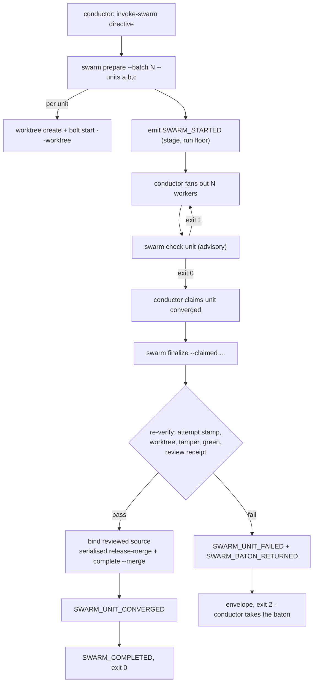
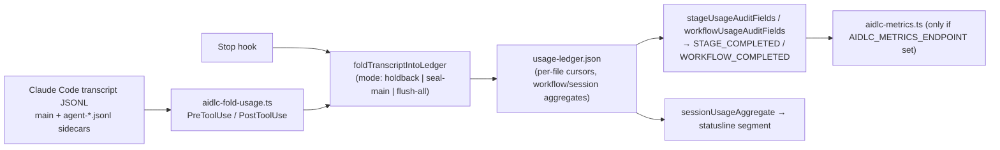

# CLI Tool Inventory: Bolt, Swarm, Worktree, Posture, Usage and Doctors

> **Source**: [awslabs/aidlc-workflows](https://github.com/awslabs/aidlc-workflows) — branch `v2`, commit `3c3146cf` (v2.6.40, retrieved 2026-08-21)
> **Status**: As-built specification derived from the implementation; the upstream code is authoritative over this document.

---

## 1. Scope

This document is the reference for the deterministic CLI surface under `core/tools/`. It carries:

- the complete file-level inventory of `core/tools/*.ts` (41 files) with entry verbs and owning spec;
- the full verb surface of `core/tools/aidlc-utility.ts`;
- deep sections on the four Construction-phase tools (`aidlc-bolt.ts`, `aidlc-swarm.ts`, `aidlc-worktree.ts`, `aidlc-testing-posture.ts`);
- the usage/cost pipeline (`aidlc-usage.ts` + `core/hooks/aidlc-fold-usage.ts` + `aidlc-metrics.ts`) and the two shipped data files (`core/tools/data/model-rates.json`, `core/tools/data/ars-priors.json`);
- validation and the two doctor modules (`aidlc-validate.ts`, `aidlc-doctor-bundle.ts`, `aidlc-workspace-doctor.ts`);
- the four session skills under `core/skills/` (three `read-only`, one `read-write`).

Topics owned elsewhere are pointed at, not restated: the orchestration engine and directive schema (`02-orchestration-engine.md`), state/audit/runtime primitives (`03-state-audit-runtime.md`), sensor scripts and manifests (`06-sensors.md`), hooks as a wiring surface (`07-hooks.md`), memory/rules/learnings (`08-memory-rules-learnings.md`), harness projection and `dist/` layout (`10-distribution-harnesses.md`), plugins (`11-plugin-system.md`), tests and CI (`12-testing-ci.md`).

`dist/` is generated projection output. Where this document mentions it (§12.2) it is describing a delivered layout, never a source of truth.

---

## 2. Invocation model

### 2.1 Two equivalent entry forms

Every tool is a Bun-executable TypeScript module. Two invocation forms exist:

1. **Direct**: `bun <harness>/tools/aidlc-<tool>.ts <subcommand> [flags]`.
2. **Dispatched**: `core/tools/aidlc.ts` is a single front door that maps a `<noun> <verb>` pair (or a bare top-level verb) onto a tool file and a subcommand.

The dispatcher's routing table is a frozen data structure: `export const ROUTES: readonly Route[]` at `core/tools/aidlc.ts:91`, delimited by the sentinel comments `// ROUTES_TABLE_START` (`core/tools/aidlc.ts:90`) and `// ROUTES_TABLE_END`. It holds 30 route entries. The tool-file map it dereferences is `export const TOOLS` at `core/tools/aidlc.ts:54`.

### 2.2 Route kinds

| `kind` | Meaning |
| --- | --- |
| `top-passthrough` | A bare top-level verb forwarded verbatim to a tool (`next`, `status`, `doctor`, …) |
| `top-prefix` | A top-level verb rewritten with a fixed prefix (`compose` → `orchestrate next compose`) |
| `top-help` | The dispatcher's own help renderer |
| `noun-passthrough` | `<noun> <verb>` where `<verb>` is the tool's own subcommand name |
| `noun-map` | `<noun> <verb>` where a `targets` table renames the verb (`scope change` → `scope-change`) |
| `custom` | Bespoke argument reshaping (`intent`, `space`, `config`, `plugin`, `gen`) |
| `routing-only` | Not a tool delegation at all — hooks, statusline, harness adapters |

A seventh kind, `top-stub`, is declared in `RouteKind` (`core/tools/aidlc.ts:18`) and handled by the dispatcher (`:763-765`), but no route at this commit uses it.

The declared `classification` type is five-valued — `type Classification = "passthrough" | "translation" | "stub" | "routing-only" | "help";` (`core/tools/aidlc.ts:14`). The 30 routes use only four of them: `passthrough` (15), `translation` (11), `routing-only` (3), `help` (1); `stub` is declared but unused, matching the unused `top-stub` kind.

### 2.3 Legacy flag aliases

`export const SLASH_FLAG_ALIASES` (`core/tools/aidlc.ts:78`) rewrites nine legacy spellings before routing. Verbatim:

```text
--status → status          --doctor → doctor        --help → help
--version → version        --resume → next --resume  --scope → next --scope
--upgrade → upgrade        config-change → config set
space-create → space create
```

Five entries carry `irregular: true`. The flag has no routing or arity semantics: `Alias` declares it as `irregular?: boolean` (`core/tools/aidlc.ts:51`) and its sole reader is the help renderer, `const mark = alias.irregular ? " (irregular)" : "";` (`core/tools/aidlc.ts:567`). It is a hand-maintained annotation for rewrites that are not a plain de-dashing of a single token — four of the five expand one token into two (`--resume` → `next --resume`, `--scope` → `next --scope`, `config-change` → `config set`, `space-create` → `space create`), while `--upgrade` → `upgrade` is a one-to-one de-dashing marked irregular anyway (`core/tools/aidlc.ts:85`).

### 2.4 Compiled-binary awareness

Tools that spawn siblings do not hardcode `bun`. `compiledExecutable()` (`core/tools/aidlc-runtime-paths.ts:20-24`) returns `AIDLC_COMPILED_EXECUTABLE`, else `process.execPath` when running as a compiled executable, else `null`. When non-null the sibling is invoked as `<executable> <noun> <verb> …` through the dispatcher; when null it is `bun <toolsDir>/aidlc-<tool>.ts …`. Both `aidlc-bolt.ts` (`core/tools/aidlc-bolt.ts:117-160`) and `aidlc-swarm.ts` (`core/tools/aidlc-swarm.ts:166-183`) implement this branch. `aidlc-bolt.ts:130-135` additionally translates the private `audit-fork` / `audit-merge` subcommand names into the dispatcher's public `audit fork` / `audit merge` verbs.

---

## 3. Master inventory

41 files live in `core/tools/` (excluding `core/tools/data/`). 26 of them contain an `import.meta.main` guard and are therefore directly executable; the remainder are library modules — with one exception noted in the table (`aidlc-sensor-traceability.ts` declares `main()` at `core/tools/aidlc-sensor-traceability.ts:544` and calls it unconditionally from a top-level `try { main(); } catch { … }` at `:631-635`, so it is a script despite having no `import.meta.main` guard).

Line counts are from `wc -l` (see "Measurement notes" at the end of this document).

| File | LOC | Entry verbs / subcommands | Purpose | Owning spec |
| --- | ---: | --- | --- | --- |
| `aidlc.ts` | 1197 | `help`, plus 30 routes | Unified dispatcher: noun/verb → tool + subcommand; hook, statusline and adapter routing | this doc §2 |
| `aidlc-orchestrate.ts` | 6169 | `next`, `continue`, `report`, `park` | The engine: emits exactly one typed directive per call | `02-orchestration-engine.md` |
| `aidlc-directive.ts` | 1362 | (self-test: prints one example per directive kind) | Frozen engine↔conductor directive union + runtime validator; 10 kinds | `02-orchestration-engine.md` |
| `aidlc-graph.ts` | 2877 | `artifacts`, `producers`, `consumers`, `topo`, `cycles`, `scope`, `validate-scope`, `validate-grid`, `compile`, `resolve`, `export`, `ars` | Stage-graph compile and queries; also owns the ARS screen (§11) | `02-orchestration-engine.md` |
| `aidlc-runtime.ts` | 1434 | `compile`, `read`, `summary`, `fragment-fork`, `fragment-merge` | Materialised runtime graph over the event log | `03-state-audit-runtime.md` |
| `aidlc-state.ts` | 4278 | `get`, `set`, `set-skeleton-stance`, `set-construction-iteration`, `checkbox`, `count`, `advance`, `finalize`, `complete-workflow`, `gate-start`, `approve`, `reject`, `revise`, `skip`, `resume`, `acknowledge-compaction`, `reuse-artifact`, `lookup`, `practices-event`, `practices-promote`, `fork`, `merge`, `unit`, `park`, `unpark` | State-file lifecycle | `03-state-audit-runtime.md` |
| `aidlc-audit.ts` | 1589 | `append`, `append-batch`, `append-raw`, `audit-fork`, `audit-merge` | Append-only audit shards + the metrics tap | `03-state-audit-runtime.md` |
| `aidlc-log.ts` | 1223 | `decision`, `answer`, `link`, `review` | Interaction audit helper: decision / answer logging plus the agent-link and §12a reviewer receipts | `03-state-audit-runtime.md` |
| `aidlc-jump.ts` | 487 | `resolve`, `execute` | Stage/phase jumps | `02-orchestration-engine.md` |
| `aidlc-learnings.ts` | 1141 | `surface`, `persist` | §13 learnings gate | `08-memory-rules-learnings.md` |
| `aidlc-knowledge.ts` | 3954 | `onboard`, `sync`, `list`, `show`, `associate`, `dissociate`, `rebind` | DocumentKB: index customer documents into a committed catalog | `08-memory-rules-learnings.md` |
| `aidlc-steering.ts` | 116 | — (library) | Shared resolver for rule content carried by `load-steering` directives | `08-memory-rules-learnings.md` |
| `aidlc-utility.ts` | 6108 | 27 verbs (§4) | Help, status, doctor, intent/space/config/plugin/scope verbs, recompose | this doc §4, §12 |
| **`aidlc-bolt.ts`** | **970** | `start`, `complete`, `fail`, `abort`, `set-autonomy`, `dispatch-event`, `hold-merge`, `release-merge` | Construction bolt lifecycle + autonomy mode | **this doc §5** |
| **`aidlc-swarm.ts`** | **1392** | `prepare`, `check`, `finalize` | Swarm convergence referee | **this doc §6** |
| **`aidlc-worktree.ts`** | **1195** | `create`, `merge`, `discard`, `list`, `verify`, `info` | Per-Bolt git worktree primitive | **this doc §7** |
| **`aidlc-testing-posture.ts`** | **1105** | `resolve`, `render`, `fingerprint`, `verify` | Testing methodology contract + Code Generation approval gate | **this doc §8** |
| **`aidlc-usage.ts`** | **1694** | — (library) | Token/cost extraction, rate table, durable ledger | **this doc §9** |
| **`aidlc-metrics.ts`** | **468** | `--internal-metrics-send` (internal worker only) | Opt-in StatsD-over-HTTP emission from the audit tap | **this doc §9.5** |
| **`aidlc-doctor-bundle.ts`** | **1616** | — (library) | `--doctor --export`: timeline reconstruction, diagnosis rules, redacted bundle | **this doc §12.3** |
| **`aidlc-workspace-doctor.ts`** | **181** | — (library) | Three advisory workspace-manifest doctor rows | **this doc §12.4** |
| **`aidlc-validate.ts`** | **300** | `outputs` | Stage-file declared-outputs referenced-in-body check | **this doc §12.5** |
| **`aidlc-version.ts`** | **4** | — (library) | `export const AIDLC_VERSION = "2.6.40"` | **this doc §12.6** |
| **`aidlc-includes.ts`** | **366** | — (library) | Surgical re-point of harness-native rule includes on a space switch | **this doc §12.7** |
| **`aidlc-lib.ts`** | **10668** | — (library) | The shared library (§13) | **this doc §13** |
| `aidlc-workspace-sync.ts` | 1175 | (flags only: `--force`, `--project-dir`) | Reconcile a workspace against `repos.json` | this doc §12.4 |
| `aidlc-workspace-manifest.ts` | 158 | — (library) | `repos.json` schema + path rules shared by sync and doctor | this doc §12.4 |
| `aidlc-runtime-paths.ts` | 220 | — (library) | Harness/data path resolution; compiled-executable detection | `10-distribution-harnesses.md` |
| `aidlc-runner-gen.ts` | 841 | `write`, `check`, `list`, `scopes` | Generates per-stage runner skills from the compiled graph | `10-distribution-harnesses.md` |
| `aidlc-tiers.ts` | 274 | — (library) | Per-agent judgment tier → harness model/effort knob projection | `05-agents.md` |
| `aidlc-sensor.ts` | 927 | `list`, `describe`, `fire` | Sensor runner | `06-sensors.md` |
| `aidlc-sensor-claim-sources.ts` | 1441 | (sensor script) | Claim-sources sensor | `06-sensors.md` |
| `aidlc-sensor-linter.ts` | 383 | (sensor script) | Linter sensor | `06-sensors.md` |
| `aidlc-sensor-required-sections.ts` | 244 | (sensor script) | Required-sections sensor | `06-sensors.md` |
| `aidlc-sensor-traceability.ts` | 635 | (sensor script, unconditional `main()`) | Traceability sensor | `06-sensors.md` |
| `aidlc-sensor-type-check.ts` | 317 | (sensor script) | Type-check sensor | `06-sensors.md` |
| `aidlc-sensor-upstream-coverage.ts` | 224 | (sensor script) | Upstream-coverage sensor | `06-sensors.md` |
| `aidlc-sensor-schema.ts` | 183 | — (library) | Sensor manifest schema validator | `06-sensors.md` |
| `aidlc-stage-schema.ts` | 676 | — (library) | Stage frontmatter schema validator | `04-stage-protocol.md` |
| `aidlc-rule-schema.ts` | 78 | — (library) | Rule frontmatter schema validator | `08-memory-rules-learnings.md` |
| `aidlc-documentkb-schema.ts` | 607 | — (library) | DocumentKB index + per-document metadata schema | `08-memory-rules-learnings.md` |

The **Entry verbs** column names each tool's own subcommands, not the dispatcher spellings. `aidlc-runner-gen.ts` is the clearest case: its `main()` dispatches on `write` / `check` / `list` / `scopes` (`core/tools/aidlc-runner-gen.ts:809-832`, refusal at `:828` — `Unknown subcommand: ${subcommand ?? "(none)"}. Valid: write, check, list, scopes`), while the `gen` route advertises `runners`, `runners --check`, `runner-list`, `runner-scopes`, `stage-table`, `scope-table` (`core/tools/aidlc.ts:405`). `handleGen` (`core/tools/aidlc.ts:653-673`) translates the first four onto `write` / `check` / `list` / `scopes` and delegates `stage-table` / `scope-table` to `TOOLS.utility` instead (`:669-671`), so those two never reach runner-gen at all.

---

## 4. `aidlc-utility.ts` verb surface

### 4.1 The router

`main(rawArgs)` parses argv into `{ positional, flags, bareFlags, blankFlags }` and dispatches on `positional[0]` through a single `switch` at `core/tools/aidlc-utility.ts:5987`. The 27 `case` labels, verbatim and in source order:

```text
help              version           status            doctor
intent-create     intent            space             space-create
codekb-path       codekb-scope-diff detect            select-plugins
plugin-list       plugin-sync       init              state-init
upgrade           scope-change      recompose         config-change
config-get        config-list       set-status        detect-scope
resolve-env-scope scope-table       stage-table
```

The `default` arm (`core/tools/aidlc-utility.ts:6083-6100`) special-cases the renamed `intent-birth` with a redirect (`:6089-6092`) —

> ``` `intent-birth` was renamed to `intent-create`. Run the same command with `intent-create` instead (flags are unchanged). ```

— and otherwise dies (`:6093-6100`) with ``Unknown command "<x>". Run `aidlc-utility help` for what this tool can do.`` followed by a hardcoded `Available commands:` list and `Common options: [--project-dir <path>] [--scope <scope>] [--json]`. That hardcoded list names 25 of the 27 verbs: it omits `init` and `state-init`, both of which are transition stubs (§4.2) deliberately kept out of user-facing surfaces.

### 4.2 Verbs grouped by function

#### Information (read-only, no mutation, no audit)

| Verb | Behaviour |
| --- | --- |
| `help` | Renders `renderHelpText()` (`core/tools/aidlc-utility.ts:354`): a scope table computed live from the scope mapping (EXECUTE-of-total stage counts, depth, test strategy, default marker) concatenated with the static `HELP_TEXT_TAIL` (`:300`) |
| `version` | Prints `aidlc <AIDLC_VERSION>` (`:387-389`) |
| `status` | Reads the state file for the active (or `--intent`/`--space`-selected) record and renders progress; prints a "No active AI-DLC workflow found." onboarding block when the state file is absent (`:1047-1062`) |
| `detect` | Prints the workspace scan (greenfield/brownfield, languages) plus resolved scope-registry paths. Explicitly documented as "No mutation, no audit" (`:6026-6029`) |
| `detect-scope` | Scope auto-detection from a description (`:5829`) |
| `resolve-env-scope` | Resolves `AWS_AIDLC_DEFAULT_SCOPE` (`:5925`) |
| `scope-table`, `stage-table` | Render the scope grid / stage table as markdown (`:5720`, `:5788`) |
| `codekb-path` | Prints the deterministic space-level per-repo codekb dir. "No mkdir, no state read, no audit" (`:4571-4572`; the router arm restates it as "no mutation, no audit, no mkdir" at `:6012-6014`) |
| `codekb-scope-diff` | The reverse-engineering rerun guard. Three modes — status (default), `--compare <timestamp.md>`, `--mint --paths <a,b,…>`. Status verdicts, verbatim: `NO_STORE`, `CURRENT`, `STALE`, `UNVERIFIED`, `UNKNOWN_SCOPE` (`:4585-4596`). Compare verdicts: `COVERS`, `NARROWER`. "Always exits 0 with the verdict in the output (read-only query …; refusals are for lifecycle verbs)" (`:4608-4610`) |
| `config-get`, `config-list` | Read the active workflow config (`depth`, `test-strategy`, `review`) (`:5373`, `:5380`) |
| `plugin-list` | Installed plugins and enabled state (`:943`) |

#### Workspace cursors

| Verb | Behaviour |
| --- | --- |
| `intent` | `intent list` \| `intent create` \| `intent switch <name>` \| bare `intent <name>`. A switch is a pure cursor write (`setActiveIntentCursor`) plus a re-stamp of the live session→intent record so a later resume does not fire a false rebind prompt (`:4491-4506`). Matching is exact record-dir first, then unique slug; an ambiguous slug dies listing the candidates |
| `intent-create` | Mints a new intent record (`:3828`). `--help`/`-h` short-circuits to a usage line at `:5966-5971` |
| `space` | `space list` \| `space create` \| `space switch <name>` \| bare `space <name>`. A switch does **two** per-user writes: the gitignored `active-space` cursor, then `repointHarnessIncludes()` (§12.7) so the next turn loads the switched space's method (`:4552-4562`) |
| `space-create` | Creates a space (`:4799`) |

Both `intent` and `space` treat a target of `help` or `-h` as a help request rather than a switch, because "help" is a reserved record/space name (`:4464-4468`, `:4536-4541`).

Their unknown-target refusals are deliberately non-inviting. Intent (`:4487-4489`):

> `Unknown intent "<t>" in space "<s>". This command only switches between existing intents - run /aidlc intent to list them. Do not start a new workflow to recover from this error.`

Space (`:4550-4553`):

> `Unknown space "<t>". Existing: … This command only switches between existing spaces. Do not create a space to recover from this error - creating one is a separate, deliberate move (/aidlc space create <name>, or legacy /aidlc space-create <name>).`

#### Mutation

| Verb | Behaviour |
| --- | --- |
| `scope-change` | Change the active scope; rebuilds derived state fields (`:4888`) |
| `recompose` | The adaptive composer's in-flight write. `--skip <slugs>` / `--add <slugs>` flip PENDING stages' plan suffixes under `withAuditLock`, strict-validated ("a starved required input rejects, not advises"), derived fields rebuilt, `RECOMPOSED` audited (`:5104-5116`). Refuses when neither list is supplied (`Usage: recompose [--skip <slug,...>] [--add <slug,...>] - name at least one flip.`, `:5120`), when a slug appears in both (`:5124`), and when no state file exists (`recompose re-shapes a RUNNING workflow; start one first.`, `:5129`) |
| `config-change` | Sets `depth` / `test-strategy` / `review` (`:5391`) |
| `set-status` | **Not user-callable.** Guarded by an environment handshake: it dies unless `AIDLC_STATUSLINE_OWNER === "statusline:" + process.ppid` (`:5491-5500`). The refusal reads "Direct aidlc-utility set-status is blocked: there is nothing for you to do here. … (status synchronization is owned by the sync-workflow-state hook.)" |
| `select-plugins` | Show or set the enabled plugin list; requires an installed project harness — `select-plugins requires an installed project harness at <dir>.` (`:449-451`) |
| `plugin-sync` | Compose installed plugins into the current install (async, `:974`) |
| `doctor` | §12.1 |

#### Transition stubs (deliberately absent from help)

`init` and `state-init` both `die()` with a redirect (`:4349-4357`); `upgrade` dies with `upgrade is not available in this install; it arrives with the packaged binary distribution.` (`:224-225`, `:4359-4361`). The routing comment at `:6039-6041` states these are "transition-only and intentionally absent from help".

### 4.3 The `knowledge` gap between help and router

`HELP_TEXT_TAIL` advertises seven `knowledge …` verbs and `plugin select` (`core/tools/aidlc-utility.ts:317-323`, `:314`), but the `aidlc-utility.ts` router has **no** `knowledge` case. This is not a defect: `knowledge` is a separate route (`core/tools/aidlc.ts:372`) delegating to `aidlc-knowledge.ts`, and `plugin select` is a `custom` route whose `targets` table maps it to `select-plugins` (`core/tools/aidlc.ts:352-358`; the route object spans `:351-365`). The help text describes the **dispatcher's** surface, not this tool's own switch.

The `knowledge` route carries a long verbatim comment recording a real defect (`core/tools/aidlc.ts:367-371` and `:374-383`): the route was originally declared `top-passthrough` while its `group` was `"knowledge"`, and the two resolvers split on group — `resolveTop` iterates only `group === "top"`, `resolveNoun` handled only `noun-passthrough`/`noun-map`/`custom`/`routing-only`. The result was that "NO knowledge verb ran through the compiled dispatcher while the tool itself worked perfectly when invoked directly" (`:379-380`).

---

## 5. Bolt lifecycle (`aidlc-bolt.ts`)

### 5.1 Definition and ownership

> "A bolt is one execution of stages 3.1-3.5 for a Unit (or small group of dependency-linked Units)." (`core/tools/aidlc-bolt.ts:3-4`)

This tool owns four audit emissions: `BOLT_STARTED`, `BOLT_COMPLETED`, `BOLT_FAILED`, `AUTONOMY_MODE_SET`. `abort` deliberately reuses `BOLT_FAILED` with a `Reason: aborted` field rather than introducing a `BOLT_ABORTED` type — "keeps the audit count stable and uses field taxonomy for sub-classification" (`:7-9`).

It composes but never duplicates sibling primitives: `aidlc-state.ts fork/merge`, `aidlc-audit.ts audit-fork/audit-merge`, `aidlc-runtime.ts fragment-fork/fragment-merge`, `aidlc-worktree.ts discard`. The header states the invariant: "Never duplicate state mutations the sibling primitives already own (Bolt Refs, Worktree Path) — this is the t48 emitter-pairing rule" (`:36-38`).

### 5.2 Subcommands

The eight subcommands are enumerated in the router (`:881-910`); the unknown-verb refusal reads `Unknown subcommand: <x>. Valid: start, complete, fail, abort, set-autonomy, dispatch-event, hold-merge, release-merge` (`:907-909`).

| Subcommand | Required flags | Optional | Emits |
| --- | --- | --- | --- |
| `start` | `--name`, `--batch` | `--walking-skeleton`, `--worktree --slug`, `--repo`, `--intent`, `--space` | `BOLT_STARTED`; with `--worktree` also drives `STATE_FORKED` + `AUDIT_FORKED` + fragment fork |
| `complete` | `--name`, `--batch` | `--merge --slug` | `BOLT_COMPLETED`; with `--merge` also drives `STATE_MERGED` + `AUDIT_MERGED` + fragment merge |
| `fail` | `--name`, `--error` | `--slug`, `--succeeded-siblings` | `BOLT_FAILED` |
| `abort` | `--name`, `--slug`, `--reason` | `--discard` | `BOLT_FAILED` with `Reason: aborted` |
| `set-autonomy` | `--mode autonomous\|gated` | — | `AUTONOMY_MODE_SET` + state field write |
| `dispatch-event` | `--event`, `--slug` + per-variant flags | — | one of three `MERGE_DISPATCH_*` |
| `hold-merge` | `--slug` | — | *(no audit)* |
| `release-merge` | `--slug` | — | *(no audit)* |

`--worktree`, `--merge`, `--discard` are the only boolean flags; they are stripped by `splitBooleanFlags` before the strict value-required parser runs (`:97-110`). The parser refuses a flag followed by another flag: `--x expects a value, got another flag: "--y". Did you forget the value?` (`:172`).

`--worktree` and `--merge` are single-bolt only. A CSV `--name` with either is refused: `--worktree requires a single bolt name; got csv: "<n>". Issue one start --worktree per bolt.` (`:215-217`) and the symmetric `--merge requires a single bolt name; …` (`:375-377`).

### 5.3 Ordering discipline

Three distinct orderings, each with a recorded reason:

- **`start --worktree`** — validate state-file shape → emit `BOLT_STARTED` → state-fork → audit-fork → fragment-fork (`:224-335`). Validation precedes the emit "so a missing state file doesn't leave an orphan BOLT_STARTED" (`:221-223`). Each fork failure emits a recovery `BOLT_FAILED` before failing.
- **`complete --merge`** — hold-merge check → emit `BOLT_COMPLETED` → state-merge → audit-merge → fragment-merge (`:387-489`).
- **`abort --discard`** — discard **first**, audit **after** (`:562-586`). The comment records the finding that produced this order: emitting first "would claim the Bolt was aborted-and-cleaned-up while the worktree directory still existed on disk and the slug remained in main's Bolt Refs".

All sibling spawns carry a 30 s timeout; `signal === "SIGTERM"` distinguishes a timeout from an exit-code failure and selects a `*-timeout` reason enum (`:150-151`, `:277-278`).

### 5.4 The failure envelope

Non-`error()` failures in the worktree paths print a machine-readable envelope and exit 1 (`failJson`, `:946-966`):

```json
{"ok": false, "slug": "…", "stage": "…", "reason": "…", "detail": "…"}
```

`stage` is one of `start-worktree`, `complete-merge`, `abort-discard`, `hold-merge`, `release-merge`. `reason` is one of the enums built at the call sites: `state-read-failed`, `audit-emit-failed`, `state-fork-failed`, `state-fork-timeout`, `audit-fork-failed`, `audit-fork-timeout`, `fragment-fork-failed`, `fragment-fork-timeout`, `merge-held`, `state-merge-failed`, `state-merge-timeout`, `audit-merge-failed`, `audit-merge-timeout`, `fragment-merge-failed`, `fragment-merge-timeout`, `discard-failed`, `discard-timeout`. This is explicitly distinct from `error()`, which routes through `emitError` → an `ERROR_LOGGED` audit row (`:943-945`, `:916-920`).

### 5.5 HOLD-MERGE

`hold-merge` / `release-merge` set and clear a `Merge-Held` field in the per-Bolt **forked** state file at `<projectDir>/.aidlc/worktrees/bolt-<slug>/…/aidlc-state.md` (`:620-621`). Properties, per `:622-633`:

- Idempotent in both directions.
- The field is inserted under `## Project Information` on first hold, so the state template needs no version bump.
- **No audit emission** — "Merge-Held is internal coordination state, not a user-visible event."
- A missing forked state file reads as *not held* (`forkedStateFilePath` returns `null` → `isMergeHeld` false, `:661-682`), but `setMergeHeld` on a missing file is a hard error: `No per-Bolt forked state file for slug "<s>" — was \`aidlc-bolt start --worktree --slug <s>\` run?`(`:687-689`).

The enforcement point is `complete --merge`. Verbatim refusal (`:392`):

> `Merge held by HOLD-MERGE invariant; resolve the failed-sibling halt-and-ask sequence and run \`aidlc-bolt release-merge --slug <slug>\` before retrying.`

The rationale (`:379-386`) is that the multi-failure halt-and-ask sequence sets `Merge-Held: true` on every *successful* sibling before rendering any failed-sibling question, so a merge cannot land mid-sequence: "This refusal pins that invariant in tooling so an orchestrator that forgets the prose contract cannot land a merge mid-AUQ-sequence."

### 5.6 Autonomy: `set-autonomy`, and the absence of a decision ladder

`set-autonomy --mode autonomous|gated` is the **only** autonomy verb in this tool. There is no `decide-question` subcommand and no autonomy decision ladder anywhere in the upstream tree: `git grep -F -e "decide-question" -e "decideQuestion" -- core plugins harness` returns zero matches (see "Measurement notes"). Autonomy at this commit is a two-valued field (`autonomous` / `gated`) written by a single verb.

`handleSetAutonomy` (`:804-859`) is the tool's most guarded path:

1. Everything happens inside one `withAuditLock` — "One lock covers presence check -> audit consume -> state write. Otherwise two grants, or a grant racing approval, can both observe one fresh turn" (`:813-814`).
2. **Escalation only** carries a human-presence guard. Switching *to* `autonomous` requires `humanActedSinceGate(pd)` unless `humanPresenceGuardDisabled()`. De-escalation to `gated` "restores gates without presence" (`:816-818`).
3. The refusal is verbatim (`:825-829`):

   > `Refusing to switch Construction to autonomous: a real human has not acted since the last gate resolution, and autonomous mode is granted only by the human's ladder-prompt answer (it waives every later gate, so the grant itself needs a fresh human turn). Ask the human to confirm autonomous mode in a typed message, then retry. Do not log the ladder choice via aidlc-log answer; the choice is recorded by set-autonomy itself.`

4. Then: validate the state field with `setFieldStrict("Construction Autonomy Mode", mode)`, emit `AUTONOMY_MODE_SET`, write the state file — audit-first within a validated context.

Invalid modes are rejected before any of this: `Invalid --mode: <m>. Must be 'autonomous' or 'gated'.` (`:808`).

### 5.7 Batch numbers

`--batch` is validated as a positive integer by `/^[1-9][0-9]*$/` in both `start` and `complete` (`:202-204`, `:363-365`); the refusal is `Invalid --batch: "<b>". Must be a positive integer.` The batch number is carried into the `Batch number` audit field and is the join key the swarm's `prepare`/`finalize` use to correlate a `SWARM_STARTED` boundary with a unit (§6.6). Parallel batches issue N `start --worktree` calls, one per slug (`:194-196`).

### 5.8 Merge-dispatch events

`dispatch-event` is emit-only: "no state mutation, no spawn. Pure audit emission so doctor can reconcile orphan INVOKED rows" (`:716-717`). Three variants with per-variant required flags (`:732-796`):

| `--event` | Required | Audit fields |
| --- | --- | --- |
| `MERGE_DISPATCH_INVOKED` | `--practices-excerpt` | `Bolt slug`, `Practices section excerpt` |
| `MERGE_DISPATCH_RETURNED` | `--strategy` (∈ squash\|merge\|rebase), `--target`, `--confidence` (∈ [0,1]), `--notes` | `Bolt slug`, `Strategy`, `Target branch`, `Confidence`, `Notes` |
| `MERGE_DISPATCH_FALLBACK` | `--reason`, `--defaults` | `Bolt slug`, `Fallback reason`, `Defaults applied` |

The implementation is three literal `emitAudit(pd, "EVENT_NAME", …)` calls rather than a Map lookup, because a grep-based test asserts literal emitter pairing (`:719-722`).

---

## 6. Swarm convergence referee (`aidlc-swarm.ts`)

### 6.1 The three-way split

The module header states the architecture in one sentence (`core/tools/aidlc-swarm.ts:11-13`):

> "the conductor owns fan-out + loop drive (knowledge); this tool owns the convergence verdict + merge + audit (determinism); the human grants autonomy and takes the baton on the envelope (judgement)."

Worker dispatch is **not** in this tool. "A bun subprocess cannot issue Task calls, so the worker-dispatch layer is NOT here" (`:6-7`). Fan-out is either N parallel Task calls or an inline Dynamic Workflow when `AIDLC_USE_SWARM=1`; the driver-selection read is conductor-side and this tool learns about a downgrade only through `prepare --degraded-from` (`:28-31`). The engine-side `invoke-swarm` directive kind that triggers all of this is defined at `core/tools/aidlc-directive.ts:75` and specified in `02-orchestration-engine.md`.

### 6.2 Statelessness and the absent cap

Three stateless subcommands, "no iteration counter, no persisted state" (`:15`). The header's `WHY STATELESS / NO CAP CONSTANT` block (`:55-63`) explains why there is no retry cap constant: the cap is three jobs on three concerns — the verdict (determinism → `check`), the retry decision (knowledge → the conductor), and the runaway backstop (determinism → the harness Stop-hook ceiling). Therefore:

> "check is advisory, finalize is authoritative (re-verifies at the merge gate), so a red unit cannot merge even if the conductor lies or misremembers." (`:61-63`)

The subcommand parser walks argv skipping `--flag value` pairs, so `--project-dir <p> check <unit>` and `check --project-dir <p> <unit>` both resolve (`:1352-1371`). Unknown verb: `Unknown subcommand: <x>. Valid: prepare, check, finalize` (`:1385`).

### 6.3 `prepare`

`prepare --batch <n> --units <a,b,c> [--base <branch>] [--concurrency <n>] [--degraded-from <subagent|ultracode>] [--repo <name>]`

Sequence (`:705-859`):

1. Validate `--batch` (positive integer) and a non-empty `--units` list.
2. **Autonomous Code Generation gate.** When `Current Stage` normalises to `code-generation` **and** `Construction Autonomy Mode` is `autonomous`, every unit must pass `evaluateCodeGenerationApproval` (§8.6). Refusal (`:730-736`):
   > `prepare requires a current, explicitly approved Code Generation plan for every autonomous unit before worktrees are forked: <unit> (<reason>); …`
3. Resolve the authoritative unit DAG. A malformed DAG fails closed: `prepare cannot resolve the authoritative unit DAG: <reason> (<detail>). Fix unit-of-work-dependency.md before starting the swarm.` (`:740-743`).
4. Assert bolt-slug uniqueness across the union of DAG units and requested units (`:745-749`).
5. Resolve the construction repo (`--repo`; a multi-repo intent without it errors).
6. `--base` defaults to the repo's current branch; `--concurrency` defaults to the unit count.
7. Resolve the **attempt stamp** `{stage, floor}` (§6.6). Absent → `prepare could not resolve the current stage attempt from state and audit` (`:774`).
8. Emit `SWARM_DEGRADED` *before* the batch-start row when `--degraded-from` is present (`:778-787`); the value must be `subagent` or `ultracode`.
9. Per unit: `aidlc-worktree create --slug <boltSlug> --base <base> [--repo]`, then `aidlc-bolt start --worktree --slug <boltSlug> --batch <n> --name <unit> [--repo]`.
10. Emit **one** `SWARM_STARTED` naming only the units whose worktrees were both created and started (`:842-849`). The comment records the anti-replay reason: "Emitting before creation would let a failed re-prepare in a later stage attempt relabel an old preserved worktree with the current attempt, allowing stale data to pass finalize's exact-attempt check."
11. Print a JSON plan and `process.exit(prepared.some(p => !p.ok) ? 2 : 0)`.

There is no stored anti-tamper baseline: "The anti-tamper baseline is each worktree's OWN git fork (HEAD) — nothing is stored" (`:24-26`).

### 6.4 `check`

`check <unit> --check-cmd <cmd> [--test-file <path>]`

Two signals, both re-derived from disk (`:864-906`):

- **Green**: run `--check-cmd` inside the unit's worktree; exit 0 = converged. This is "the AUTHORITATIVE green check — a worker's own claim of success is never trusted (it could fake a pass)" (`:186-188`). Shell selection is explicit — rationale at `:190-203`, implementation at `:211-219`: `shell: "/bin/bash"` on POSIX when `/bin/bash` exists (to preserve bashisms), `shell: true` otherwise (cmd.exe on win32, `/bin/sh` on POSIX without bash). 60 s timeout.
- **Untampered**: `git diff --quiet HEAD -- <testFile>` in the worktree. Only status **1** trips the guard; "any other status (e.g. 128 — path not tracked at HEAD) is not a confirmed tamper" (`:227-228`, enforced by `return result.status === 1;` at `:235`).

`--test-file` is confined inside the worktree (`:261-272`); a `../` escape is a configuration error, not a pass: `--test-file resolves outside the unit worktree: <path>` (`:268`), because "a `../` escape would point the guard at a file the worker never touched and silently DISABLE it".

Output shape: `{unit, converged, tampered, reason}` with `detail: "protected test file was modified"` when tampered (`:895-902`). Exit code is 0 **only** for a genuine convergence — `converged && !tampered` (`:905`). Missing worktree: `no worktree for unit "<u>" — run \`prepare\` first`(`:879`).`check` emits **no** audit.

### 6.5 `finalize` — the authoritative gate

`finalize --batch <n> --units <a,b,c> --claimed <a,b> --check-cmd <cmd> [--test-file <path>] [--reasons <unit>=<reason>,…]`

For each unit in `--units`:

**Claimed** — the *lying-conductor guard* is one `else if` chain of six guards plus a not-green fallthrough (`:966-1059`), and the first match wins:

1. No stamped `SWARM_STARTED` boundary for this unit+batch (`:973`) → `error`, detail `no stamped SWARM_STARTED boundary for this unit and batch; run prepare in the current attempt`.
2. Prepared attempt ≠ current attempt (`:981`) → `error`, detail `prepared swarm attempt <s>/<f> does not match the current attempt <s>/<f>`.
3. No worktree on re-verify (`:995`) → `error`, detail `no worktree on re-verify (prepare not run?)`.
4. `--test-file` confinement failed (`:1002-1003`) → `error` carrying the `confineError` string from §6.4.
5. Tampered (`:1004`) → `error`, detail `convergence rejected: protected test file was modified`, `tampered: true`.
6. Green (`:1012-1049`) → then either no valid reviewer receipt → `error` with the receipt error (§6.7), a failed source binding → `error` with the binding error, or reviewed and source bound → `converged`.
7. Fallthrough — not green (`:1050-1058`) → `error`, detail `claimed converged but the check command did not pass on re-verify`.

**Declined** (not in `--claimed`) — status `failed` with a reason from `--reasons`, defaulting to `cap-exhausted` (`:1060-1077`). `--reasons` accepts only `unsatisfiable`, `budget-exhausted`, `cap-exhausted` (`DECLINED_REASONS`, `:132`); `error` is deliberately excluded because "it is the tool's OWN verdict for a claimed-but-red / tampered unit, never a conductor-supplied attribution" (`:130-131`). Malformed entries fail loudly: `--reasons entry must be <unit>=<reason>: "<pair>"` (`:945`) and `--reasons reason for "<u>" must be one of: unsatisfiable, budget-exhausted, cap-exhausted` (`:951`).

**Merge-back** is serialised over the genuine passes, sorted for determinism (`:1084-1096`): per unit, `aidlc-bolt release-merge --slug <s>` (idempotent) then `aidlc-bolt complete --merge --slug <s> --batch <n> --name <u>`.

**Audit** (`:1107-1135`): one row per unit, a baton row per failed unit, a batch tally to close. A converged unit whose merge-back **failed** gets neither a `SWARM_UNIT_CONVERGED` nor a `SWARM_UNIT_FAILED` row. The reason is recorded verbatim at `:1099-1103`: the converged row "is the engine's batch-advance signal, and emitting it for a unit whose metadata never landed on main would advance the run past an unmerged unit"; the unit did converge, so the failure envelope plus exit 2 carry the merge outcome, and the row lands on a scoped retry.

**Envelope and exit**: `{batch, units, converged, failed, merge_failures}`; exit 2 when any unit failed or any merge failed, else 0 (`:1137-1147`). Exit 2 means "the conductor must take the baton".

### 6.6 The attempt stamp

`SwarmAttemptStamp` is `{stage, floor}` (`:152-155`). `prepare` captures it once and writes it into `SWARM_STARTED` as the fields `Stage` and `Run floor` (`:588-598`); `emitUnitConverged` carries the *prepare-time* stamp forward rather than recomputing it, because "a late retry against a preserved prior-attempt worktree would otherwise be mislabeled as current" (`:616-618`).

`preparedSwarmAttempt` (`:1194-1237`) reads the audit shards for `SWARM_STARTED` rows matching batch and unit, prefers stamped rows, sorts by `(timestamp, shardIndex, pos)`, and — when the newest timestamp spans multiple shards with *differing* stamps — returns `null` rather than picking by filename: "Same-second starts in different shards are unordered. A shared stamp is harmless; differing stamps fail closed instead of picking by filename."

`legacyPreparedSwarmAttempt` (`:1239-1330`) is the migration path for unstamped rows. It verifies the worktree's `AUDIT_FORKED` `Fork Boundary` byte offset and `Source Audit Hash` against a SHA-256 of the main shard's prefix, then requires an ordered `SWARM_STARTED → BOLT_STARTED → STATE_FORKED` sequence inside the frozen prefix before deriving the stamp from the worktree's `Current Stage`.

### 6.7 Reviewer receipts and reviewed-source binding

`reviewerRequirement` (`:284-325`, returning the `ReviewerRequirement` interface declared at `:276-282`) reads `Current Stage`, resolves the stage definition, and returns `{stage, reviewer, reviewClass, maxIterations}`. `review_class` defaults to `adversarial`; `maxIterations` is 1 for `advisory`, else `reviewer_max_iterations ?? 2`.

`reviewerReceiptError` (`:331-465`) proves the review happened **inside this Bolt attempt**. `BOLT_STARTED` — not `STAGE_STARTED` — is the floor, because it "excludes a matching receipt inherited from main when prepare forked the worktree, while preserving a receipt across a merge retry on that worktree" (`:328-330`). It reads the worktree's own audit shards, filters to `BOLT_STARTED`/`REVIEW_REQUESTED`/`REVIEW_COMPLETED`, sorts by `(timestamp, position)`, then pairs each `REVIEW_COMPLETED` with a preceding `REVIEW_REQUESTED` on the key `<unit>\0<iteration>`, requiring matching `Stage`, `Reviewer` and `Unit` fields and skipping `Workflow: single-stage:*` rows. A `Recovery: stale-receipt` request relaxes the verdict test to a bare `READY`/`NOT-READY`.

It then requires an `Artifact Fingerprint` field matching `/^sha256:[0-9a-f]{64}$/` **and** equal to a freshly recomputed `reviewArtifactFingerprint`, and — when the stage declares `workspace_requires` — a `Source Fingerprint` matching the worktree's current source fingerprint. The mismatch refusal (`:456-461`):

> `claimed converged but the reviewed source no longer matches its worktree's fingerprint for stage "<s>", unit "<u>" (source-fingerprint mismatch); re-invoke the reviewer against the current worktree source and record a fresh verdict before finalizing`

`AIDLC_SKIP_SOURCE_FRESHNESS=1` bypasses the source half (`:448`, `:963-964`), recording `Source Freshness Bypass: true` on the convergence row instead of a binding (`:639-641`).

`bindReviewedSource` (`:473-571`) then materialises the reviewed application bytes as an immutable commit **without moving the Bolt branch**: a temporary `GIT_INDEX_FILE`, `read-tree HEAD`, `add -A`, submodule verification (a dirty initialized submodule fails closed), raw-byte re-binding for filtered paths, then a `git reset -q HEAD --` restore of the framework-owned pathspecs `:(top)aidlc/`, `:(top).aidlc/`, `:(glob)**/aidlc/spaces/*/intents/**/.aidlc-sensors/**` (`:548-553`) — the function header states the purpose: it "restores framework-owned paths from HEAD so the later source merge carries application source only" (`:469-470`). It commits with a framework identity (`GIT_AUTHOR_NAME: "AI-DLC"`, `aidlc@localhost`) so finalize does not depend on ambient git config, recomputes the fingerprint after the object is written to close a concurrent-edit window, and retains the commit under a dedicated ref via `update-ref`.

### 6.8 Audit taxonomy

This tool is the sole emitter of the swarm taxonomy — "The engine is read-only and the conductor (prose) never emits audit events" (`:575-576`).

| Event | Emitted by | Fields |
| --- | --- | --- |
| `SWARM_STARTED` | `prepare` | `Batch number`, `Unit names`, `Concurrency cap`, `Stage`, `Run floor` |
| `SWARM_DEGRADED` | `prepare` | `Batch number`, `Requested driver`, `Fallback driver` (always `subagent`) |
| `SWARM_UNIT_CONVERGED` | `finalize` | `Batch number`, `Unit name`, `Stage`, `Run floor`, and either `Source Fingerprint` + `Source Commit` or `Source Freshness Bypass` |
| `SWARM_UNIT_FAILED` | `finalize` | `Batch number`, `Unit name`, `Reason` |
| `SWARM_BATON_RETURNED` | `finalize` | `Batch number`, `Unit name`, `Reason` |
| `SWARM_COMPLETED` | `finalize` | `Batch number`, `Converged count`, `Failed count` |

`emitBoltFailed` (`:695-701`) additionally composes `aidlc-bolt fail` for each failed unit, best-effort: "the swarm's own SWARM_UNIT_FAILED is the authoritative swarm signal, so a failure to emit BOLT_FAILED must not mask it."

### 6.9 Flow



*Text fallback*: `prepare` forks one worktree per unit and stamps a `SWARM_STARTED` boundary; the conductor fans out workers and polls `check` (advisory, exit 0 only on green-and-untampered); `finalize` independently re-verifies every claimed unit against the attempt stamp, the worktree, the tamper guard, the check command and the reviewer receipt, merges only the genuine passes serially, and exits 2 with a typed envelope if anything failed.

**Settle is engine-side, not a swarm verb.** The three verbs above are the whole tool surface; there is no `settle` subcommand and no pool concept here (`grep -i -e settle -e pool core/tools/aidlc-swarm.ts core/tools/aidlc-bolt.ts` → 0 matches in both). The batch→engine handshake that closes a settled swarm batch is instead an optional `swarm_settled?: true` field on the run-stage directive (`core/tools/aidlc-directive.ts:210`, allow-listed and validated at `:464`, `:490`, `:745`), set by the engine when it re-emits the post-swarm run-stage (`core/tools/aidlc-orchestrate.ts:3442`) and consumed on the unit-attachment path it calls "the swarm settle" (`:243`). Its semantics belong to `02-orchestration-engine.md`.

---

## 7. Worktree primitive (`aidlc-worktree.ts`)

### 7.1 Surface

Six subcommands (`core/tools/aidlc-worktree.ts:1151-1172`); unknown verb: `Unknown subcommand: <x>. Valid: create, merge, discard, list, verify, info` (`:1171`).

| Subcommand | Flags | Audit | Read-only |
| --- | --- | --- | --- |
| `create` | `--slug`, `--base`, `[--repo] [--intent] [--space]` | `WORKTREE_CREATED` | no |
| `merge` | `--slug`, `--target`, `--strategy`, `[--message] [--repo] [--intent] [--space]` | `WORKTREE_MERGED` | no |
| `discard` | `--slug`, `[--repo] [--intent] [--space]` | `WORKTREE_DISCARDED` | no |
| `list` | — | none | yes |
| `verify` | `--event`, `--slug`, `[--max-age-seconds]` | none | yes |
| `info` | `--slug` | none | yes |

Validation constants: `SLUG_RE = /^[a-z][a-z0-9-]*$/` (`:40`), `VALID_STRATEGIES = {squash, merge, rebase}` (`:42`), `VALID_VERIFY_EVENTS = {WORKTREE_CREATED, WORKTREE_MERGED, WORKTREE_DISCARDED}` (`:43-47`).

Naming is derived, not passed: the worktree directory is `<projectDir>/.aidlc/worktrees/bolt-<slug>` and the branch is `bolt-<slug>` (`:260`, `:914`).

### 7.2 Safety checks (verbatim refusals)

**Sibling-worktree rejection** — `assertNotSiblingWorktree` (`:155-175`) compares `git rev-parse --show-toplevel` against `dirname(git rev-parse --git-common-dir)`, canonicalising both through `realpathSync` because "macOS symlinks `/var → /private/var`" (`:147-148`). Refusal:

> `aidlc-worktree must run from the main repo checkout, not from a sibling worktree at <top>. Bolt worktrees are siblings of the main checkout, not nested.`

Under `--repo`, the guard is re-anchored to the *target* repo's checkout (`:150-154`). It runs in `create`, `merge` and `discard`; `list` deliberately skips it — "list is read-only and useful from anywhere" (`:911-912`).

**Slug and strategy** (`:192-210`):

> `Invalid --slug: "<s>". Must be kebab-case (lowercase letter then [a-z0-9-]).`
> `Invalid --strategy: "<s>". Must be one of: squash, merge, rebase.`

**`create` pre-audit guards** (`:250-264`), each exiting before any emit:

> `Base branch does not exist locally: <base>`
> `Worktree directory already exists: <path>`
> `Branch already exists: bolt-<slug>`

**`merge` HEAD check** (`:424-440`) — the caller must have `<target>` checked out at the repo cwd:

> `expected branch <target>, found detached HEAD`
> `expected branch <target>, found <actual>`

**`merge` rebase remote requirement** (`:490-499`):

> `rebase strategy requires a remote for <target>; got none`

The remote-*existence* check is pre-audit; the `git fetch` is post-audit "because fetch mutates remote-tracking refs — running it before the audit emit would leave a kill-9 window where refs moved without a corresponding audit row" (`:484-488`).

**Source-freshness guards** — a Bolt whose newest `SWARM_UNIT_CONVERGED` row carries a `Source Fingerprint` + `Source Commit` is *source-bound*; one carrying `Source Freshness Bypass` is *bypassed*; a Bolt that never went through the swarm has neither and passes straight through (`:308-312`, `:313-345`).

> `refusing to rebase a source-bound convergence: rebase before review/finalize, then merge the immutable reviewed commit` (`:448`)
> `refusing to merge: reviewed Source Commit <sha> is unavailable` (`:404`)
> `refusing to merge: the bypassed Bolt has uncommitted or ignored application paths not represented by its branch (<detail>); commit, remove, or discard those paths before retrying` (`:477-479`)

A source-bound merge targets the **immutable commit object** rather than the movable `bolt-<slug>` branch: "This is the last guard before source mutation. The convergence selector is the requested intent/space, and the returned target is an immutable commit object rather than the movable bolt-<slug> branch" (`:525-528`).

### 7.3 Base and target rules

- `create` takes `--base <branch>`; it must resolve via `git rev-parse --verify` in the target repo before anything is emitted. `git worktree add <wtPath> -b bolt-<slug> <base>` (`:281`).
- `merge` takes `--target <branch>` and requires it to be the *currently checked-out* branch at the repo cwd (§7.2).
- Which checkout each strategy runs in is explicit (`:540-546`): `squash` and `merge` run in the target repo's main checkout (`repoCwd`); `rebase` runs in the worktree (`wtPath`), followed by a `git merge --ff-only` in `repoCwd`.

For `squash` and `merge` the git argument is **not** `--target`: it is `mergeTarget`, the *Bolt* side — the `bolt-<slug>` branch, or, when the Bolt is source-bound or bypassed, the immutable reviewed commit / the bypass branch OID (resolved at `:528`, overridden for the bypass case at `:530-537`). `--target` is the branch already checked out in `repoCwd` (§7.2), so the Bolt is merged **into** it. Only `rebase` takes `flags.target` directly, because there the worktree is being replayed onto the target.

| Strategy | Commands |
| --- | --- |
| `squash` | `git merge --squash <mergeTarget>` then `git commit --no-edit -m <message>`, both in `repoCwd` (`:549-569`) |
| `merge` | `git merge --no-ff --no-edit -m "Merge bolt <slug>" <mergeTarget>` in `repoCwd` (`:571-591`) |
| `rebase` | `git fetch <remote>` + `git rebase <target>` in `wtPath` (`:594`), then `git merge --ff-only <ffTarget>` in `repoCwd` (`:593-620`) |

`--message` defaults to `Bolt <slug>` (`:414`).

### 7.4 Conflicts

Conflict detection anchors on git's canonical marker: `/^CONFLICT \(/m` over combined stdout+stderr (`:793-800`). The comment records why the previous permissive `/conflict/i` was replaced: it "false-positived on stdout that happened to contain the substring 'conflict' — including unrelated hint text in future git releases."

Conflicting paths are enumerated with `git diff --name-only --diff-filter=U` in the same cwd the conflict lives in — "Deterministic across all conflict shapes (content, rename/rename, modify/delete) — beats parsing git's prose stderr" (`:802-813`).

A conflict prints and exits 1 (`:623-635`):

```json
{"status":"conflict","slug":"…","worktree_path":"…","conflict_files":[…],
 "detail":"Merge produced conflicts in worktree at <path>. Worktree preserved for inspection."}
```

### 7.5 Post-merge cleanup and the `[merge-succeeded:<sha>]` tag

Once the merge commit lands it is permanent; cleanup failures must not read as merge failures. Every post-merge error is prefixed `[merge-succeeded:<commitSha>]` (`:644`) "so the ERROR_LOGGED row carries enough state for doctor to tell 'merge failed entirely' from 'merge landed, cleanup orphan remains' — these need different recovery actions."

Cleanup differs by binding (`:658-765`):

- **bound**: `git reset --hard <mergeTarget>` in the worktree, then `git worktree remove --force`. The forced removal is authorised specifically by that successful reset, because a raw-byte snapshot "can remain permanently 'modified' under its own lossy clean filter even after reset".
- **bypass**: first verify the branch OID is unchanged — `git rev-parse bolt-<slug>^{commit}` compared against `bypassBranchOid`, failing closed with "bypassed Bolt branch changed during the merge; worktree and branch preserved" (`:645-657`) — then restore + `git clean -ffdx` limited to the three framework pathspecs (`:670-705`), then re-check that no application path changed (`:706-734`), then a **non-forced** `git worktree remove` and a branch delete via `update-ref -d refs/heads/bolt-<slug> <oid>` (an OID-checked delete, `:741-759`).
- **neither**: plain `git worktree remove` + `git branch -D`.

Retained reviewed-source refs are enumerated and deleted last; enumeration failure is itself an error (`:766-773`).

### 7.6 `discard`, `list`, `verify`, `info`

`discard` is idempotent. When neither the directory, the branch, nor any retained source ref exists it prints `{"emitted":null,"slug":"…","worktree_path":"…","reason":"already-discarded"}` and returns without emitting (`:844-854`). Otherwise it emits `WORKTREE_DISCARDED` with `Reason: agent-discard` (audit-first), then `git worktree remove --force` and `git branch -D`.

`list` filters `git worktree list --porcelain` with **two** required conditions: the basename starts with `bolt-` **and** the parent directory is exactly `<projectDir>/.aidlc/worktrees` — "so an unrelated worktree someone happens to name `bolt-other` outside our namespace doesn't masquerade as a Bolt" (`:905-909`). Path comparison goes through `pathKey`, which canonicalises, normalises separators, and lowercases on win32 (`:185-188`).

`verify` is the orchestrator's deterministic post-dispatch backstop (`:972-1037`). It finds the newest audit block matching both the event and the `Bolt slug`, and applies a freshness window defaulting to **60 seconds** (`--max-age-seconds`). Three outcomes: `{verified:true, event, slug, audit_timestamp}` (exit 0), `{verified:false, …, reason:"absent"}` (exit 1), `{verified:false, …, reason:"stale (last seen <ts>)"}` (exit 1).

`info` reads the most recent `WORKTREE_CREATED` block for a slug and prints its `Worktree path` and `Branch name` for interpolation into a halt-and-ask prompt; its schema is pinned in `knowledge/aidlc-shared/worktree-info-schema.md` (`:1039-1049`).

---

## 8. Testing posture (`aidlc-testing-posture.ts`)

### 8.1 What it resolves and from where

The module resolves one deterministic execution contract for Code Generation out of human-authored prose (`core/tools/aidlc-testing-posture.ts:1-8`). Sources are the three memory layers at `aidlc/spaces/<space>/memory/{org,team,project}.md`, read by `resolveTestingPosture` (`:695-717`), each reduced to its `## Testing Posture` section (`TESTING_HEADING`, `:83`).

Layer precedence is **project → team → org → fallback** (`:644-658`). The fallback is methodology `test-after` with `source: "fallback"`.

Strict-additive memory is enforced as a hard conflict, not a silent override (`:632-642`):

> `Testing Posture conflict: project methodology "<p>" contradicts team methodology "<t>". Revise the narrower rule; strict-additive memory does not permit runtime override.`

`compatibleSpecialization` (`:478-487`) allows a narrower layer only when the methodologies are equal, or when the narrower one is `custom` and lists the broader one among its detected components.

Three further inputs come from the state file (`:712-716`): `Scope` (default `feature`), `Test Strategy` (normalised to `minimal`/`standard`/`comprehensive` by `normalizeStrategy` at `:489`, else `standard`), `Project Type` (`brownfield` iff `normalizeProjectType` at `:501` says so, else `greenfield`).

### 8.2 Methodology classification

`TestingMethodology` is `"tdd" | "bdd" | "atdd" | "test-after" | "custom"` (`:21`).

Two paths (`classifyPosture`, `:406-476`):

- **Structured** — a `Methodology:` field (and optionally `Ordering:`) parsed by `structuredField` (`:196-209`), which accepts an optional list marker and optional `**` emphasis. An out-of-vocabulary structured value is a hard error from `structuredMethodology` (`:162-179`): `Invalid Testing Posture Methodology "<v>". Expected one of: tdd, bdd, atdd, test-after, custom.`
- **Prose** — regex detection per methodology (`normalizeMethodology`, `:125-160`), plus two disambiguators: `mixedOrdering` (a "tests first/before implementation" phrase co-occurring with a "tests after implementation" / "refactor after green" / "tests follow implementation" phrase) and `customSignal` (`custom|mixed` adjacent to `ordering|cadence|posture|methodology`). When more than one component is detected with **no** structured field and **neither** disambiguator fires, classification returns `null` — the layer does not select (`:453-460`). The subsequent `const methodology = structured ?? …` resolution (`:461-466`) is a separate step: it picks the sole detected component, or `custom` when a disambiguator did fire.

`defaultOrdering` supplies the ordering sentence per methodology when none is authored (`:181-193`), e.g. TDD is `"For each testable layer: Red, then Green, then Refactor."`.

### 8.3 Comment handling (the v2.6.38 behaviour)

The v2.6.38 changelog entry states the contract:

> "Commented headings and comment-only `Testing Posture` sections no longer select, truncate, or affirm a methodology; the resolver falls through to the real visible section or next visible memory layer."
> "Visible `Methodology` and `Ordering` fields remain authoritative beside comments, and visible prose and fenced content remain in `applicable_notes`."
> "Testing Contract input fingerprints retain each raw resolved section, including comments and fenced content, so comment-only changes still invalidate stale approvals."

The implementation runs one base comment-stripper plus **three** projections derived from it:

| Function | Line | Removes | Used for |
| --- | --- | --- | --- |
| `markdownWithoutHtmlComments` (base stripper) | `:301-329` | rendered HTML comments only; fenced content stays verbatim | input to the three projections below |
| `structuralMarkdownLines` | `:331-343` | as above, plus per-line truncation at `<!--` so a comment cannot open or close a fence | heading and fence detection |
| `classifiablePostureText` | `:349-373` | visible text **minus** all fenced blocks | methodology classification |
| `visiblePostureText` | `:345-347` | visible text, fences retained | `applicable_notes` |

Comment stripping is character-accurate rather than regex-based (`stripHtmlCommentsFromLine`, `:232-274`): it tracks an `inComment` flag across lines, tracks inline-code tick runs so a `<!--` inside backticks is not treated as a comment opener (`hasMatchingTickRun`, `:217-230`), and honours backslash escaping (`isEscaped`, `:209-215`). Fence handling accepts both `` ``` `` and `~~~`, requires a closing run at least as long as the opener, and rejects a would-be opener whose info string contains a backtick (`fenceOpening`, `:278-287`; `closesFence`, `:289-299`).

`extractTestingPostureSection` (`:375-404`) is the load-bearing consequence: it walks the **structural** lines to locate the `## Testing Posture` heading and the next `##` heading, but slices the **raw** lines for the returned body. Its own comment (`:371-374`) states the reason: "Return the original raw lines so comments and fences remain part of `input_sha256` even though classification uses the visible projection above." A commented heading therefore neither selects nor truncates, while a comment-only edit still moves the input hash.

### 8.4 The contract object

`resolveTestingPostureFromSections` (`:618-693`) builds `TestingPostureContractBody`:

```text
version: 1
methodology, source ("org"|"team"|"project"|"fallback"), ordering
scope, test_strategy, project_type
applicable_notes: [{layer, text}]      // visible text per non-empty layer
obligations: TestObligations
plan_profile: PlanProfile
input_sha256                            // hash of {sections(raw), scope, test_strategy, project_type}
```

and returns it plus `contract_sha256 = hashObject(body)`.

Hashing is canonical-JSON: `canonicalize` sorts object keys recursively (`:104-115`), `sha256` prefixes the digest with `sha256:` (`:117-119`), and `hashObject` composes the two (`:121-123`).

`combineTestObligations` (`:507-553`) crosses two independent axes and says so in `combination_rule`:

> `Apply every selected-strategy obligation and every scope-floor obligation; neither replaces the other, and a targeted scope regression may add the narrowest necessary test type beyond the strategy default.`

| Axis | Values |
| --- | --- |
| `strategy_volume` | minimal: one verifiable test per requirement at the narrowest effective level; ≥1 happy-path unit test per component; unit is default. standard: 5–8 tests per component; unit + integration at key boundaries. comprehensive: 10–15 tests per component; unit + integration + E2E |
| `scope_floor` | `mvp\|enterprise\|feature\|infra` → 80% line-coverage floor + run in CI before merge. `bugfix\|security-patch` → targeted regression + keep the suite green. otherwise → keep the suite green, no extra floor |

`buildPlanProfile` (`:555-616`) emits an ordered step list whose shape is methodology-specific. Every profile opens with a structure step and a runner step (`runner_ready_before_first_test: true` is a literal-typed field) and closes with environment/build configuration and documentation/traceability. The runner step differs by project type: greenfield *bootstraps* the minimal test runner, brownfield *verifies* the existing one. TDD expands the five `TESTABLE_LAYERS` (`:84-90`: data model/database, repository/data access, business logic, API/endpoint, frontend behavior) into Red/Green/Refactor triples; `test-after` expands them into implement/test pairs; BDD and ATDD emit four feature-slice steps each; `custom` emits `Custom ordering - <ordering>` plus an instruction not to convert it to layer-local TDD.

### 8.5 Fingerprints

Two distinct hashes, both `sha256:`-prefixed:

| Hash | Definition | Covers |
| --- | --- | --- |
| `contract_sha256` | `hashObject(body)` (`:692`) | The whole resolved contract, including `input_sha256` over the raw memory sections |
| Approval fingerprint | `approvalFingerprint(plan, instructions, contractHash) = hashObject({plan, instructions, testing_contract})` (`:763-772`) | The plan text, the unit-test instructions text, and the contract hash |

The contract is embedded in `code-generation-plan.md` under a `## Testing Contract` heading as a fenced JSON block (`renderTestingContract`, `:719-721`; section extraction by `rawMarkdownSection`, `:723-742`). `parseTestingContract` (`:744-761`) re-validates on read: `version === 1`, `contract_sha256` matches `/^sha256:[0-9a-f]{64}$/`, and `hashObject(body-without-hash) === recorded` — otherwise `null`.

`promptTestingContractMarkers` (`:916-923`) scans arbitrary text for lines matching `CONTRACT_MARKER_RE` (`:92-93`), i.e. `AIDLC-TESTING-CONTRACT: sha256:<64 hex>`, returning the distinct hashes found.

### 8.6 The Code Generation approval gate

`evaluateCodeGenerationApproval(projectDir, unit)` (`:925-1006`) is the predicate both the dispatch guard and the swarm referee consume (`aidlc-swarm.ts:727`). It reads three files from `<docsRoot>/construction/<unit>/code-generation/`: `code-generation-plan.md`, `unit-test-instructions.md`, `code-generation-questions.md`, and returns a `CodeGenerationApproval` record. The checks run in a fixed order, first failure wins, each with a verbatim reason:

1. `code-generation-plan.md is missing or empty`
2. `unit-test-instructions.md is missing or empty`
3. `code-generation-plan.md has no valid ## Testing Contract JSON block`
4. `the approved Testing Contract is stale because memory, scope, test strategy, or project type changed` (embedded `contract_sha256` ≠ freshly resolved one)
5. `Plan Approval is not explicitly answered Approve Plan`
6. `the Plan Approval fingerprint does not match the current plan, test instructions, and Testing Contract`
7. otherwise `approved` with `ok: true`

Approval parsing (`latestPlanApproval`, `:845-893`) walks a comment- and fence-stripped projection of the questions file (`visibleMarkdownLines`, `:790-843`), tracks whether the current heading is a Plan Approval label (`isPlanApprovalLabel` normalises trailing `?`/`:` and one layer of `**`/`__`/`*`/`_` emphasis, `:775-788`), tolerates numbered-question headings whose text lands on the following line, and resets the captured answer/fingerprint on each new Plan Approval heading so the **latest** one wins. The answer must match `APPROVE_PLAN_RE = /^(?:[A-Z][.)][ \t]*)?["']?Approve Plan["']?$/i` (`:98`); `questionsFileApproved` is at `:894-901` and `questionsFileHasPendingPlanApproval` treats an all-underscore answer as still pending (`:903-911`).

### 8.7 CLI

Four subcommands (`main`, `:1013-1105`); unknown verb: `Unknown subcommand: <x>. Valid: resolve, render, fingerprint, verify` (`:1090-1093`).

| Subcommand | Output | Exit |
| --- | --- | --- |
| `resolve` | The full contract as pretty JSON | 0 |
| `render` | The `## Testing Contract` markdown block | 0 |
| `fingerprint --unit <u>` | The approval fingerprint string | 0 |
| `verify --unit <u>` | The `CodeGenerationApproval` record as pretty JSON | `result.ok ? 0 : 2` |

`fingerprint` has an anti-forgery guard: it refuses to mint a fingerprint while the plan is already approved — `reset the Plan Approval [Answer]: to blank before regenerating its fingerprint` (`:1057-1060`) — and refuses when the plan's embedded contract does not match the current effective posture, reusing the approval's own reason string where it has one (`:1065-1071`). Any thrown error is caught and printed as `{"error": "<message>"}` on stderr with exit 1 (`:1095-1102`).

---

## 9. Usage, cost and metrics

### 9.1 Ownership and harness scope

`aidlc-usage.ts` is "the single token-usage + cost extraction seam" (`core/tools/aidlc-usage.ts:1`). One module owns the rate table, the Claude transcript readers, the cost math, and the durable ledger; everything else consumes it and "never re-parses a transcript itself" (`:5-7`).

The reader is Claude-Code-format-specific, so only the Claude harness wires a producer. On Kiro / Codex / opencode "no producer is wired, so the ledger is never written and every consumer here degrades silently to no-data: the statusline renders no cost segment, and the audit rollup adds no fields" (`:9-14`).

The robustness contract is absolute (`:16-20`): nothing throws on malformed or missing input; a half-written last JSONL line is normal and skipped silently; an absent or corrupt file yields `[]` or a fresh empty ledger; an unknown model yields tokens with `cost: null` — "never a fabricated number."

Kill switch: `usageTrackingDisabled()` returns `process.env.AIDLC_DISABLE_USAGE_TRACKING === "1"`, read at call time and never cached (`:149-151`).

### 9.2 Rate table

`PriceRow` has five per-million-token fields (`:57-63`): `input`, `output`, `cacheWrite5m`, `cacheWrite1h`, `cacheRead`.

`DEFAULT_RATES` (`:81-90`) holds 8 generation-discrete rows. Keys are per **generation**, never per family: "verified real sessions mix generations, and a family-collapse silently misprices them onto whatever the 'current' row happens to be" (`:71-74`).

`core/tools/data/model-rates.json` is a two-key object — `_comment` and `rates` — whose `rates` map holds the same 8 keys: `fable-5`, `haiku-4-5`, `opus-4-6`, `opus-4-7`, `opus-4-8`, `opus-5`, `sonnet-4-6`, `sonnet-5`. Each value is a `PriceRow`, e.g. `opus-5` = `{"input": 5.0, "output": 25.0, "cacheWrite5m": 6.25, "cacheWrite1h": 10.0, "cacheRead": 0.5}`. The file carries no `schemaVersion`. Its `_comment` records the multiplier convention: cacheWrite5m = 1.25× input, cacheWrite1h = 2× input, cacheRead = 0.1× input.

`loadRates()` (`:162-178`) merges three layers per-model, each overlaying the previous:

1. `DEFAULT_RATES` — the dev-checkout floor;
2. `tools/data/model-rates.json` — the shipped framework default;
3. `$AIDLC_MODEL_RATES` — a user/project override file.

"a partial file only changes the models it names". The merged table is cached per process; `_resetRatesCacheForTest()` (`:184-186`) is the test seam.

`normalizeModel` (`:218-256`) maps a transcript `message.model` to a rate key. It strips a leading `converse/`, then a wildcarded `<region>.anthropic.` inference-profile prefix, requires a `claude-` prefix on the residual, and matches a generation key at a token boundary (`===`, `key-…`, or `key[…`) with keys sorted longest-first. `BARE_ALIASES` (`:194-199`) resolves the four bare family names on **exact** equality only. Unknown generation, `<synthetic>`, malformed shapes and non-Claude models all return `null`. The policy is stated verbatim in the UNKNOWN-GENERATION POLICY comment (`:210-217`, the sentence itself at `:212-214`): "An honest 'unknown' (made visible by the audit's `Cost USD: null`) beats a confidently-wrong number from an old generation's rate."

`computeCost` (`:269-288`) is `Σ (count / 1e6) × rate` over the five buckets, returning `{usd: null, model: null}` for an unknown model.

### 9.3 The ledger

Path: `aidlc/.aidlc-sessions/usage-ledger.json` (`ledgerPath`, `:768-770`). Gitignored runtime state.

Shape (`:660-741`):

```text
Ledger = {
  schemaVersion: 3,
  cursors:  Record<sourceKey, LedgerCursor>,
  workflows: Record<workflowKey, WorkflowUsage>,
  ...UsageAggregate        // workspace-wide, diagnostic only
}
UsageAggregate = { totals, byStage: Record<slug, StageBucket>, byModel, byAgent }
WorkflowUsage  = UsageAggregate & { sessions: Record<sessionKey, UsageAggregate> }
StageBucket    = { totals, byModel, byAgent }   // stage-scoped sub-splits
Totals         = { tokens: TokenCounts, usd: number }
TokenCounts    = { input, output, cacheCreate5m, cacheCreate1h, cacheRead }
```

`CURRENT_SCHEMA_VERSION = 3` (`:699`). The bump rule is explicit: bump whenever token-**counting** semantics change so old totals are discarded rather than accumulated onto. v2 was the first holdback-counted schema (pre-v2 was "input ~2x, output ~2.6x inflated"); v3 adds session/intent ownership and pending-group attribution, and v2's workspace-only totals "cannot be partitioned retrospectively, so they are rebuilt too."

`LedgerCursor` (`:713-731`) carries `lastUuid`, `lastTimestamp`, an optional `byteOffset` (the offset-aware fold reads only `[byteOffset, size)`), `lastMessageId`, and an optional `pending` block capturing a held-back group's `{byteOffset, messageId, stageSlug, sessionKey, workflowKey}` — "Its ownership is captured NOW, before a lifecycle tool can advance state, and reused when the group is eventually folded."

Cursor keys use **two** coexisting schemes (`:703-712`): the offset fold keys by transcript **file path** (unique across sessions); the row-based `updateLedger`, which has no file path, keys by `"main"` / `"agent-<agentId>"`. They cannot collide because a file path is never equal to `"main"`. Per-file cursors are load-bearing: "uuids collide across concurrent sub-agent files, so a global-uuid cursor would drop real turns or count the 0-token broadcast copies".

Ownership keys: `sessionUsageKey` returns `transcript:<path>`, else `session:<sanitised id>`, else `session:unknown` (`:781-791`); `intentUsageKey` returns `intent:<uuid>` where resolvable, falling back to space + record-dir identity (`:793+`).

### 9.4 The fold pipeline



*Text fallback*: the fold hook fires around every tool call and folds only newly appended transcript bytes into a durable ledger keyed by file; the Stop hook flushes; `aidlc-state.ts` reads stage- and workflow-scoped aggregates into completion audit rows, the statusline reads the session aggregate, and the audit tap optionally forwards magnitudes to StatsD.

`FoldMode` is `"holdback" | "seal-main" | "flush-all"` (`:1609`). Semantics (`:1605-1608`):

- `holdback` retains **every** file's last message-id group for a later PostToolUse;
- `seal-main` closes only the main transcript's group;
- `flush-all` closes every complete group at an engine boundary or Stop.

`foldTranscriptIntoLedger` (`:1611-1691`) returns early on the kill switch, takes a ledger lock, folds the main transcript, then folds each `agent-*.jsonl` in the sub-agent sidecar directory (rebuilding each file's `agentType` map from its `.meta.json` sidecar on every fold, because "sidecars are tiny and the set can grow between folds"), and persists atomically. Every failure path returns the existing ledger unchanged: "on any failure returns the existing ledger unchanged and persists nothing" (`:1603-1604`).

`core/hooks/aidlc-fold-usage.ts` (128 lines) is the Claude-only producer. Its contract (`core/hooks/aidlc-fold-usage.ts:26-28`): "This hook OBSERVES only — it must never alter Claude Code's flow. It prints NOTHING on success …, never throws …, and exits 0 in every case." Mode selection (`:8-18`): normal PreToolUse seals the main transcript; an **engine-boundary** PreToolUse flushes every source "so completion rollups include final subagent calls"; PostToolUse holds back; Stop flushes every source. Boundary detection (`isLifecycleBoundaryToolCall`, `:53-60`) routes shell tool calls — matched by `/^(bash|shell|execute_bash)$/i` at `:54` — through `isLifecycleBoundaryCommand` (`:59`) and everything else through `isEngineToolCall` (`:55`). The rationale for folding on both Pre and Post is that "a non-final llm call always ends in a tool_use, so PostToolUse fires after every intermediate call; the final end_turn call has no tool_use and is caught by the Stop hook" (`:4-8`). Hook wiring itself is `07-hooks.md`'s subject.

### 9.5 Audit rollup fields and metrics

`aggregateUsageAuditFields` (`:1213-1242`) produces the fields merged into `STAGE_COMPLETED` / `WORKFLOW_COMPLETED` by `aidlc-state.ts:165` and `:173`:

`Tokens In`, `Tokens Out`, `Cache Read`, `Cache Write` (5m + 1h summed), then conditionally `Cost USD`, `By Model`, `By Agent`, `Tokens By Model`, `Tokens By Agent`.

`Cost USD` is deliberately **three-state** (`:1202-1208`):

- no usage data for the stage → the field set is `{}` (no fields at all);
- usage recorded but every model unknown → `Cost USD: null`;
- priced → `Cost USD: 1.23` (2 dp).

A mixed known/unknown stage prices the known portion and shows the unknown slice as `<model>=null` in `By Model` — "no fabricated cost". The breakdowns read the stage's **own** sub-maps, never the global ones, because those "sum every stage and would contradict Cost USD" (`:1231-1232`); the type declaration puts the same rule the other way round — "a global `By Model` would sum every stage and contradict a single-stage cost" (`:668-669`).

`aidlc-metrics.ts` is the optional downstream. It is "OPT-IN and DISABLED by default: it emits ONLY when `AIDLC_METRICS_ENDPOINT` is set. No endpoint is shipped in any harness's settings, so an untouched install emits nothing and the audit path is byte-unchanged" (`core/tools/aidlc-metrics.ts:5-8`). It is called from the shared metrics tap in `aidlc-audit.ts` after structured writes, and always resolves: "Metric loss is preferable to blocking or breaking the audit write that called us" (`:16-17`).

Wire format is StatsD over HTTP: `<prefix>.<event_type>:1|c|#tag1:v1,...` where the prefix is `AIDLC_METRICS_PREFIX` sanitised to `[A-Za-z0-9._-]` with dots preserved for namespacing, defaulting to `aidlc` (`metricPrefix`, `:39-43`). `STAGE_COMPLETED` / `WORKFLOW_COMPLETED` additionally emit magnitude lines built from the rollup fields (`:280-313`): `<prefix>.tokens.input:<n>|c`, `<prefix>.tokens.output:<n>|c`, `<prefix>.cost.usd:<n>|g`, plus per-model and per-agent variants parsed from the `By Model` / `By Agent` / `Tokens By *` strings. All lines share the event's tags and are POSTed together as one newline-separated body. Delivery is a detached spawn re-entering this same file with the private argument `--internal-metrics-send` (`METRIC_WORKER_ARG`, `:342`; the guard at `:466` requires it), so it is never a user-facing subcommand.

---

## 10. Data file: `model-rates.json`

Consumed only by `aidlc-usage.ts` via `modelRatesPath()` (`core/tools/aidlc-lib.ts:8527-8529`), which resolves it beside the compiled stage graph in the harness data dir. See §9.2 for shape and layering. The `_comment` field is the file's own documentation; no code reads it.

---

## 11. Data file: `ars-priors.json` — what ARS is

**ARS = Autonomy Risk Score.** It is the adaptive composer's advisory risk index, and this file is the single source of truth for every constant behind it. From the file's own `_comment`:

> "ARS (Autonomy Risk Score) priors — the deterministic data behind `aidlc-graph.ts ars`. Single source of truth for the component weights, band boundaries, stage cost priors, and EV thresholds that previously lived as prose arithmetic in the composer persona; the persona's tables are now documentation of THIS file. All values are UNCALIBRATED priors: the composite is an advisory index for the human at the gate, and nothing deterministic routes on it."

The only consumers are `core/tools/aidlc-graph.ts` (the `ars` subcommand handler at `:2600`, which delegates to `computeArs` (declared `:2330`), where the weighted-composite arithmetic and band lookup are `:2380-2389`; loader at `:2221-2260`; the ARS section banner comment is `:2140-2149`) and the composer persona `core/agents/aidlc-composer-agent.md:171` / `:516`, which documents rather than duplicates it. The `ars` subcommand itself belongs to the graph tool and is covered by `02-orchestration-engine.md`; what follows is the data contract.

Top-level keys: `_comment`, `schemaVersion`, `weights`, `componentInfo`, `componentBands`, `compositeBands`, `evThresholds`, `stages`.

**Five entropy components** (`ARS_COMPONENTS`, `core/tools/aidlc-graph.ts:2151`), with weights that must sum to 1.0:

| Key | Name | Weight |
| --- | --- | ---: |
| `iae` | Intent Ambiguity | 0.20 |
| `csu` | Codebase Structural Uncertainty | 0.30 |
| `ve` | Verification Entropy | 0.25 |
| `r` | Risk / Blast Radius | 0.15 |
| `ua` | Unresolved Assumptions | 0.10 |

Component bands: `lowMax: 0.3`, `medMax: 0.7` → `LOW`/`MED`/`HIGH`.

Composite bands (0–100): 0–20 *Near-direct*, 21–40 *Focused*, 41–60 *Standard*, 61–80 *Comprehensive*, 81–100 *Full ceremony*.

`evThresholds` maps a stage cost prior to the minimum component score that justifies running it: `{"1":0, "2":0.2, "3":0.3, "4":0.4, "5":0.5}`. The `_comment` distinguishes shipped anchors from interpolation: costs 1, 2 and 4 are the persona's shipped anchors; "costs 3 and 5 are linear interpolation/extension (0.3, 0.5) pending calibration."

`stages` holds 33 entries, each `{targets: ArsComponent[], cost: number|null, role?: string, projectTypes?: ("brownfield"|"greenfield")[]}`. Semantics from the `_comment`:

- `cost: null` means "no row in the persona's cost-prior table — the screen reports them as not numerically screenable instead of inventing a cost." Five of the 33 entries carry it: `incident-response` and `feedback-optimization`, which the `_comment` names and which reach the `no-cost-prior` screen arm, plus `workspace-scaffold`, `workspace-detection` and `state-init`, which carry `role: "initialization"` and are therefore screened by `role` before cost is ever consulted.
- `role` marks stages decided without component arithmetic: `initialization` (always run), `core` (spine — always), `phase-gate` (approval-handoff executes iff any other ideation stage executes), `structural` (decomposition judgment — mechanical default SKIP).
- `projectTypes` mirrors a stage's compiled `condition:` when it restricts the stage to one project kind (today only reverse-engineering, brownfield-only), "so the screen never contradicts the stage it would have to run."

Loading is fail-loud, never a silent default (`loadArsPriors`, declared at `core/tools/aidlc-graph.ts:2230` with its doc comment at `:2227-2229`; the validations named below run through `:2260`): unreadable file, non-object JSON, `schemaVersion !== 1`, an out-of-range weight, a missing `componentInfo.<c>.name`, or weights not summing to 1.0 (tolerance 1e-9) each throw. The comment states why: "a silent fallback default would reintroduce exactly the unauditable arithmetic this file exists to remove."

`AIDLC_ARS_PRIORS` overrides the path (`:2223-2225`). Composite arithmetic normalises the weighted sum at `ARS_RAW_PRECISION = 9` decimal places (`:2165`) so IEEE summation error cannot drop a total across a band boundary.

Screen verdicts (`ArsScreenRow.screen`, `:2192-2201`) are one of `component`, `initialization`, `core`, `phase-gate`, `structural`, `project-type`, `no-cost-prior`, `no-prior`, `completed`; a stage absent from the priors yields the reason `no entry in ars-priors.json - not screenable` (`core/tools/aidlc-graph.ts:2461`).

---

## 12. Doctors, validation and small tools

### 12.1 `aidlc-utility.ts doctor` — the live health check

`handleDoctor` (`core/tools/aidlc-utility.ts:1261-3211`) accumulates rows of `{pass, label, fix?}` into a single `results[]` array, from 100 `results.push(...)` call sites (several inside loops, so the emitted row count is data-dependent). Grouped by subject:

| Group | Checks |
| --- | --- |
| Runtime | `bun` on PATH (or `$HOME/.bun/bin/bun`), with an OS-specific `fix` string |
| Hook contract | For Claude: the expected roster is derived from `settings.json`'s `hooks` event blocks and `statusLine` command, then probed against the on-disk hooks dir. The comment at `:1278-1300` explains why the roster is **not** enumerated from the hooks dir: "probing an enumerated-from-itself roster is tautological (every hook trivially 'present', a deleted hook silently absent from the roster)" |
| Harness wiring | Per-harness required files: Kiro `agents/aidlc.json` + `settings/cli.json`; Codex adapter + `codex` CLI on PATH at ≥ 0.145.0; Copilot adapter + `copilot` CLI ≥ 1.0.74; opencode `opencode.json(c)` + `.opencode/command/aidlc.md`; Claude `settings.json`. Multi-harness installs are flagged as "supported but untested" |
| Config | `AWS_AIDLC_DEFAULT_SCOPE` present/valid/invalid; scope-grid vs stage-graph disagreements; plugin selection (missing-enabled, stranded stages, selection-dropped `requires_stage` edges) |
| Schema lint | Agent and scope filename/name consistency |
| Repo | `.gitmodules` submodule declaration vs initialization, with remedy `git submodule update --init --recursive` |
| Hook health | Last-fired heartbeats; per-hook degraded-drop counts read from `.aidlc-hooks-health/*.drops` |
| Drift | State vs last audit event (e.g. audit has `WORKFLOW_COMPLETED` but state `Status=` something else); state version readable/current/compatible |
| Locks | Leaked audit locks per bucket, with owner pid |
| Worktrees | Orphan worktrees, stale `bolt-*` branches, orphan per-Bolt state files, orphan audit shards |
| Compose | A `aidlc/.aidlc-compose-pending` marker with age and staleness |
| Practices | `Practices staleness`: absent / never affirmed / affirmed N days ago / advisory beyond the staleness window / future-dated (clock skew) |
| Workspace | Three advisory rows from `aidlc-workspace-doctor.ts` (§12.4) |

**Exit semantics.** Only these legacy environment/config rows drive the exit code: `process.exit(failed > 0 ? 1 : 0)` (`core/tools/aidlc-utility.ts:3210`). The structured workflow diagnosis (§12.3) is rendered under a `Workflow diagnosis (advisory):` heading (`:3133`) but is explicitly excluded from the tally — "a workflow-level diagnosis (which can be a soft, workflow-in-progress signal) must not flip the exit code that CI and scripts gate on" (`:3120-3128`). `info`-severity findings are omitted from the live view entirely; the export carries the full set.

**Cold-safe auditing.** `GUARDRAIL_LOADED` and `HEALTH_CHECKED` are emitted only when an audit trail already exists — the gate is `const auditExists = auditShards(projectDir).length > 0` at `:3088`, consumed at `:3090` and `:3152`: "On a pristine project (no audit shard / flat audit.md) doctor prints its health report and creates NOTHING — it stays a pure read-only diagnostic."

**Rendering.** `✓` per passing row, `✗ <label> — <fix>` per failing row, a `<passed> passed, <failed> failed` tally, all to **stdout** (`:3105-3147`) — the comment at `:3206-3209` notes the orchestrator's tool-failure handler prints stdout, not stderr, for doctor.

### 12.2 A note on `dist/`

`dist/claude/.claude/tools/` contains 41 `.ts` files — the same count as `core/tools/`. This is a projection artefact only; `10-distribution-harnesses.md` owns the projection rules. Nothing in this document treats `dist/` as source.

### 12.3 `aidlc-doctor-bundle.ts` — `--doctor --export`

Purpose (`core/tools/aidlc-doctor-bundle.ts:1-14`): replace "ask the user for their whole project directory" with "a small, redacted, self-diagnosing bundle". It draws findings from the **same** `DoctorFinding` model the live doctor uses — the caller passes the legacy rows in — "so the command and the bundle can never develop separate diagnostic rules or remediation text."

**Output layout** (`:16-22`):

| Path | Content |
| --- | --- |
| `report.md` | Human-readable timeline + findings |
| `report.json` | Machine-readable timeline + findings + summary |
| `manifest.json` | Schema/versions, hashed intent id, included files, applied redactions, per-file checksums, truncations |
| `evidence/…` | Normalized, allowlisted fields only — "never raw files, never artifact/contribution/question/memory bodies" |

`BUNDLE_SCHEMA_VERSION = "1"` (`:79`). Caps: `MAX_EVIDENCE_FILE_BYTES = 512 KiB`, `MAX_BUNDLE_BYTES = 8 MiB` (`:84-85`). `LONG_STAGE_MS = 6h` flags an abnormally long stage in the timeline, advisory only (`:89`). `FROZEN_HEARTBEAT_MS = 24h` (`:560`).

**Safety** (`:27-34`): redaction runs before any write — home → `~`, project root → `<project>`, intent/unit ids → stable short hashes (`shortHash`, `:166`), and every emitted string is scanned for absolute paths and secret-like values (`redactString`, `:222`; `redactValue`, `:265`). Symlinked inputs are refused both at the leaf and via a `realpath` check that rejects any input escaping the project root through a symlinked parent. Files are created owner-only where the platform supports it. Packaging is dependency-free: the canonical **directory** is the contract; a `.tar.gz` is produced only when a system `tar` exists, otherwise the directory is retained with manual-share instructions (`:23-26`).

**Diagnosis rules.** `runDiagnosis` (`:564-797`) emits findings with the ids:

| Id | Severity | Trigger |
| --- | --- | --- |
| `gate-unresolved` | error | A stage whose approval gate never resolved — "the single most common 'it will not advance' cause" |
| `ensemble-evidence-missing` | — | Structural check: every declared evidence file for a mob (or subagent-with-supports) stage |
| `state-audit-drift` | — | State disagrees with the last audit event |
| `runtime-graph-stale` | — | `runtime-graph.json` older than the newest authored input |
| `runtime-graph-missing` | — | No `runtime-graph.json` |
| `hooks-never-fired` | — | No hook heartbeat at all |
| `hook-heartbeat-frozen` | — | A heartbeat older than `FROZEN_HEARTBEAT_MS` |
| `hook-degraded` | — | Recorded hook drops |
| `plan-marker-malformed` | — | An unparseable plan checkbox marker |

`DoctorFinding` (`:101`) carries `{id, severity, summary, evidence, remedy, safeToAutomate}`; `Severity` is `"info" | "warning" | "error"` (`:95`). `adaptLegacyResult` (`:135`) lifts a live `{pass, label, fix}` row into a finding, with `findingIdFromLabel` (`:122`) deriving a stable id. `mergeFindings` (`:1372`) unions the live rows with the diagnosis so "a failing env check must reach it" — the bundle exists precisely so the maintainer does not need the user's project (`core/tools/aidlc-utility.ts:3176-3185`).

**Export exit semantics**: the export branch is `if ("export" in flags)` (`core/tools/aidlc-utility.ts:3165`); a failure inside it is caught and reported inline — "Export failure must not mask the live doctor result; report and go on" (`:3201-3204`) — and never changes doctor's exit code. Two argument guards: `--output true` (a bare `--output`) throws `--output requires a directory path (e.g. --output /tmp/aidlc-report)` (`:3171`); the default parent is `<projectDir>/aidlc/diagnostics`. `--export` is accepted whether the parser recorded it bare or with a stray following token, "so a trailing word can never silently disable the export".

### 12.4 `aidlc-workspace-doctor.ts` and workspace sync

Three rows, **all advisory** (`pass: true` with the detail in the label), so none can change doctor's exit code — "a workspace with uncommitted records or a not-yet-synced manifest is normal user state, not framework breakage" (`core/tools/aidlc-workspace-doctor.ts:10-14`):

| Row | Condition | Notes |
| --- | --- | --- |
| **W1** Workspace records | `git status --porcelain=v1 --untracked-files=all -- aidlc` | Runs in any git repo; skips silently outside one. Gitignored per-user cursors never false-positive |
| **W2** Workspace repos | `repos.json` declared set ⇄ `discoverSiblingRepos()` on-disk set | Only when `repos.json` exists. Parsed through the exact schema `sync` uses "so doctor never reports a manifest as synchronized when sync would reject it" |
| **W3** Workspace .gitignore | The managed block between the frozen gate markers vs the sorted expected lines | Only when `repos.json` exists |

W2's asymmetry is deliberate: declared-but-not-cloned suggests running sync; on-disk-but-not-declared notes "they already work at runtime; this only keeps clone/sync accurate" — disk wins at runtime, the manifest only drives sync.

`aidlc-workspace-sync.ts` is the corresponding write side. It takes no subcommand — only `--force` and `--project-dir` — and runs one `reconcile()` under a workspace `withAuditLock` (`core/tools/aidlc-workspace-sync.ts:1155-1173`, the lock call at `:1160`). It does not change discovery: "the framework already auto-discovers sibling code repos at runtime …, and that disk scan stays the source of truth" (`:4-6`). Clones and generated files are staged then installed with reversible renames and no-replace links; any apply error rolls back before exit 1 (`:11-14`). `--force` authorises orphan removal only after conservative preflight plus quarantine checks, and the header names the trap: "Cached refs/remotes/* and advertised OIDs alone never prove recoverability: matching object graphs must be fetched into an isolated probe before removal" (`:16-19`). **Three exit codes**: 0 in sync, 2 synced-with-branch-warnings, 1 on preflight failure or a thrown error.

### 12.5 `aidlc-validate.ts`

One subcommand: `outputs <phase|all>` (`core/tools/aidlc-validate.ts:274-296`, dispatch at `:288`); unknown verb → `Unknown subcommand: <x>. Valid: outputs` (`:293`).

It answers one question: for each stage in the phase, is every `.md` filename declared in the stage file's `Outputs` header field actually **referenced in the stage body**? `parseOutputs` (`:44`) handles three declaration shapes — a simple CSV of paths, a directory followed by a parenthesised file list, and prose with no `.md` files (which yields an empty list) — stripping a `CONDITIONAL:` prefix and tolerating a `{unit-name}` template variable.

Result shapes: per stage `{slug, outputs, missing[], pass}`; per phase `{phase, stages[], pass}`; for `all`, `{phases[], pass}`. A stage file that cannot be found yields `missing: ["STAGE_FILE_NOT_FOUND"]` and fails — **except** in the `initialization` phase, which is treated as a pass "rather than failing the doctor check" (`:196-206`). A stage declaring zero `.md` outputs passes.

**Exit semantics**: success prints pretty JSON to stdout and exits 0; every error path goes through `jsonError`, which writes `{"error": "<message>"}` to **stderr** and exits 1 (`:267-270`). Missing subcommand or target is itself an error: `Usage: aidlc-validate outputs <phase|all>` (`:280`). An unknown phase yields `Unknown phase: <p>. Valid: <PHASES…>, all` (`:185`). Note that a *failing validation* (a stage whose declared output is unreferenced) still exits **0** with `pass: false` in the payload — the exit code signals a usage/lookup error, not a validation verdict.

### 12.6 `aidlc-version.ts`

Four lines. A single export: `export const AIDLC_VERSION = "2.6.40"` (`core/tools/aidlc-version.ts:4`). The header states the maintenance rule: "Bumped in the same commit that adds the matching `## [N.N.N]` heading to CHANGELOG.md. Pinned by tests/unit/t68-version-changelog-sync.test.ts." Consumed by `aidlc-utility.ts version`, the metrics tags, and the doctor bundle manifest.

### 12.7 `aidlc-includes.ts`

Library-only (no `import.meta.main`); its one export is `repointHarnessIncludes(projectDir, space?)` (`core/tools/aidlc-includes.ts:176`).

It solves a specific problem: the AI-DLC method lives once under `aidlc/spaces/<space>/memory/`, but each harness reads it through its **own** native include, evaluated by the CLI *before* the engine runs (`:3-12`):

| Harness | Include mechanism |
| --- | --- |
| Claude | An `@`-import stub at `<harness>/rules/aidlc.md` |
| Kiro CLI | A `resources` glob in each `agents/*.json` |
| Kiro IDE | An always-included steering file with live file references |
| Codex | `AIDLC_RULES_DIR` in `config.toml` |
| opencode | The `instructions` glob in the project-root `opencode.json` |
| Cursor | Standing + phase read pointers in `<harness>/rules/*.mdc` |

These surfaces stay committed because each carries load-bearing engine wiring beyond the include, so they cannot be gitignored-and-generated without a fresh-clone chicken-and-egg (`:13-18`). The rewrite is therefore **surgical**: only the `aidlc/spaces/<X>/memory` pointer segment changes, "leaving every other byte untouched" (`:19-22`). The Claude case is a per-line regex, `CLAUDE_AT_LINE = /^(@(?:\.\.\/)*)aidlc\/spaces\/[^/]+\/memory\/(.+)$/` (`:56`), which preserves the relative prefix and the named file.

It runs at two moments (`:23-29`): bootstrap (first `/aidlc`, `--doctor`, or SessionStart — an idempotent no-op when the pointer already matches) and on a `/aidlc space <name>` switch. At the `default` space the rewrite is byte-identical, "so a single-team user's committed tree never dirties."

Why not symlinks (`:31-33`): "a spike proved Kiro's resources glob will not walk a symlinked root (plain `find` doesn't follow symlinks) and Windows cannot portably create links — both DEAD."

This is "the ONLY runtime writer into the harness dir" (`:37-40`), and it is best-effort per surface: a surface whose source cannot be read or parsed is skipped, never corrupted, and since the includes are committed a failed rewrite leaves the prior valid pointer in place.

---

## 13. `aidlc-lib.ts` — shared library structure

The largest file in the tree at 10,668 lines. It exports 361 symbols in total: 260 functions, 53 types/interfaces, and the remainder constants. It is organised into 48 `// --- <Topic> ---` section banners; the load-bearing groups, in file order:

| Line | Section | What it owns |
| ---: | --- | --- |
| 148 | Harness dir resolution | `.claude` vs `.kiro` vs `.codex` selection |
| 475 / 527 | Project dir resolution | `resolveProjectDir`, `resolveProjectDirFromHook` |
| 567 | Workspace selectors | space + intent cursor resolution |
| 593 | Terminal-command classification | the deterministic-dispatch seam |
| 1087 | Engine command detectors | the hook classifier seam (`isEngineToolCall`) |
| 1461 | Codekb scope of analysis | RE scope block parsing + fingerprints |
| 1683 / 1730 | Intent identity | UUIDv7, slugify, `<YYMMDD>-<short-label>` record names |
| 1794 | Flat-layout migration | one-time, lock-guarded, crash-safe |
| 1945 | The deterministic query layer | "what exists", one source, two modes (human/JSON) |
| 2076 | Per-conversation session→intent | resume rebind |
| 2299 | Intent birth | the mutation behind the engine's directive |
| 2536 | Per-intent record resolution | `recordDir`, `stateFilePath`, `docsRoot`, … |
| 3726 | Human presence at a gate | `humanActedSinceGate`, `humanPresenceGuardDisabled` |
| 4643 | Fresh review receipts | the §12a completion precondition scan |
| 5336 | Multi-repo | sibling repo discovery, `resolveConstructionRepo` |
| 5363 | Workspace source fingerprint | `workspaceSourceFingerprint`, `UNBINDABLE_FINGERPRINT` |
| 5920 | Turn-shape markers | the transcript-free conversational carve-out |
| 6169 | Per-worktree mirror copies | `worktreePath`, `worktreeStateFilePath`, … |
| 6451–6752 | State file I/O | `readStateFile`, `getField`, `setFieldStrict`, `setOrInsertField`, autonomy mode, Bolt Refs, checkboxes |
| 6753 | Audit locking | per-intent, reaper-guarded (`withAuditLock`, `holdsAuditLock`) |
| 7641 | Doctor probe | leaked audit locks |
| 7736 | Audit event correlation | `findAllEvents`, `auditBlockField`, `readAllAuditShards` |
| 8495 | Data loaders | `modelRatesPath`, stage graph, scope grid, agents |
| 8724 | Review-class resolution | `terminalReviewVerdict` and friends |
| 9094 / 9691 | Stage frontmatter + graph queries | `parseStageFrontmatter`, `resolveStage`, `loadStageGraph` |
| 10042–10200 | CLI + markdown helpers | `parseArgs`, repeated `--field key=value`, section extraction |
| 10201 | Bolt/unit dependency DAG | `resolveBoltDag`, `boltSlugForUnit`, `validateUnitName` |

The tools in this document depend on it heavily: `aidlc-bolt.ts` imports 15 symbols from it (`core/tools/aidlc-bolt.ts:44-60`), `aidlc-swarm.ts` imports 28 (`core/tools/aidlc-swarm.ts:83-112`), `aidlc-worktree.ts` imports 15 (`core/tools/aidlc-worktree.ts:18-34`).

---

## 14. Session skills (`core/skills/`)

Four skills ship. All four declare `user-invocable: true`; three declare `classification: read-only` (`aidlc-session-cost/SKILL.md:10-11`, `aidlc-replay/SKILL.md:10-11`, `aidlc-outcomes-pack/SKILL.md:10-11`), while `aidlc-knowledge` declares `classification: read-write` (`aidlc-knowledge/SKILL.md:11-12`) because it wraps the DocumentKB catalog writer.

| Skill | LOC | Writes a file? | What it emits |
| --- | ---: | --- | --- |
| `aidlc-session-cost` | 127 | no | A terminal cost/consumption table |
| `aidlc-replay` | 120 | no | A terminal session narrative |
| `aidlc-outcomes-pack` | 136 | **yes** — `OUTCOMES.md` | A handover document at workspace root |
| `aidlc-knowledge` | 242 | (DocumentKB catalog) | Covered by `08-memory-rules-learnings.md` |

### 14.1 The shared counting rule

The three session skills share one contract: **every number comes from `bun {{HARNESS_DIR}}/tools/aidlc-runtime.ts summary --json`**, and none of them counts anything itself.

`aidlc-session-cost/SKILL.md:25-28`:

> "This skill does **no counting of its own**. It does not estimate tokens, does not walk the artefact tree, and does not read `audit.md`. If a number isn't in the tool's output, this skill does not invent it."

`aidlc-replay/SKILL.md:38-41`: "The narrative prose … is yours to synthesise from the active record's audit shards and artefacts. The skeleton numbers are the tool's. Never hand-count stages or artefacts when the tool already reports the figure."

`aidlc-outcomes-pack/SKILL.md:38-40`: "Section *content* … is yours to synthesise from the artefacts and the delivered code. Any *count* that appears in the pack must trace to the tool's output."

The `summary --json` shape the skills consume (`aidlc-session-cost/SKILL.md:61-73`):

```jsonc
{
  "workflow_id": "...", "scope": "...", "started_at": "...",
  "duration_minutes": 40,            // null when nothing has completed yet
  "stages":   { "total": N, "approved": N, "failed": N, "pending": N },
  "by_phase": { "<phase>": { "total": N, "approved": N, "failed": N, "pending": N } },
  "memory":   { "total": N, "interpretations": N, "deviations": N,
                "tradeoffs": N, "open_questions": N },
  "sensors":  { "total": N, "passed": N, "failed": N,
                "budget_override": N, "incomplete": N },
  "learnings":{ "from_orchestrator": N, "from_user_addition": N }
}
```

Rendering is verbatim transcription: "Print the fields verbatim — do not recompute, round, or re-estimate any value. Use `in progress` when `duration_minutes` is `null`" (`aidlc-session-cost/SKILL.md:77-78`).

### 14.2 Read-only classification

All three declare the same three-part invariant — never advance the stage pointer, never emit an audit event, never write a file — with `aidlc-outcomes-pack` carving out exactly one exception (`aidlc-outcomes-pack/SKILL.md:22-28`):

> "Read-only with respect to workflow state. This skill never advances the stage pointer and never emits an audit event. It **does** write one report artefact (`OUTCOMES.md` at the workspace root) — that is its output. It writes nothing else."

All three degrade identically when no `runtime-graph.json` exists: the tool exits non-zero, the skill prints a fixed "No session data yet" block and stops.

### 14.3 The token-estimate refusal

`aidlc-session-cost` closes with an explicit non-feature (`SKILL.md:124-127`):

> "Note on tokens: this skill deliberately does **not** print a token estimate. The retired file-size-to-token heuristic was guesswork dressed as data. If you need real token accounting, read it from your Claude Code session, not from a file-size approximation."

Note the seam this leaves: real token and cost accounting lives in the usage ledger (§9), which is Claude-harness-only and is surfaced through audit rollup fields and the statusline — not through this skill.

---

## 15. Cross-cutting patterns

Five conventions recur across the tools in this document and are worth naming once.

1. **Audit-first with a stated kill-9 window.** `aidlc-worktree create` and `merge` emit before any state-mutating git command, so a crash between emit and effect surfaces as a phantom event doctor can reconcile (`core/tools/aidlc-worktree.ts:266-268`). `abort --discard` deliberately inverts this because the failure mode there is worse in the other direction (`core/tools/aidlc-bolt.ts:562-569`).
2. **Validate before emit.** `bolt start --worktree` reads the state file before emitting `BOLT_STARTED` "so a missing state file doesn't leave an orphan BOLT_STARTED" (`core/tools/aidlc-bolt.ts:221-223`).
3. **Never trust an upstream claim.** `swarm check` re-runs the project's check command rather than reading a worker's self-report; `swarm finalize` re-runs it again over the conductor's `--claimed` set (`core/tools/aidlc-swarm.ts:186-188`, `:41-46`).
4. **Fail closed on ambiguity.** Differing attempt stamps across shards return `null` rather than picking by filename (`core/tools/aidlc-swarm.ts:1227-1233`); a `--test-file` outside the worktree is a configuration error, not a pass (`:262-271`); a malformed unit DAG blocks `prepare` (`:739-744`).
5. **Two exit-code registers.** Health/verdict tools use 0/1/2 to mean pass / usage-or-lookup error / take-the-baton (`swarm prepare`, `swarm finalize`, `workspace-sync`, `testing-posture verify`), while `doctor` reserves its exit code strictly for legacy environment checks so advisory workflow diagnosis cannot flip CI.

---

## Measurement notes

Every number stated above, with the exact command run against the upstream clone at commit `3c3146cfd7cef33020d48e8d48d4e80d0f8c2820`. Working directory for all commands: the clone root.

| Claim | Command | Result |
| --- | --- | --- |
| Identity: commit + date | `git log -1 --format='%H %ci'` | `3c3146cfd7cef33020d48e8d48d4e80d0f8c2820 2026-08-21 11:53:55 +0100` |
| 41 files in `core/tools/` | `ls core/tools/*.ts \| wc -l` | `41` |
| All per-file LOC in the inventory table | `wc -l core/tools/*.ts \| sort -rn` | see table (total `60277`) |
| 26 files with an `import.meta.main` guard | `grep -l "import.meta.main" core/tools/*.ts \| wc -l` | `26` |
| `aidlc-sensor-traceability.ts` runs unconditionally | `tail -20 core/tools/aidlc-sensor-traceability.ts` | top-level `try { main(); }` at `:631-635` (`main()` declared at `:544`), no `import.meta.main` |
| 27 `aidlc-utility.ts` verbs | `sed -n '5986,6083p' core/tools/aidlc-utility.ts \| grep -c '^    case "'` | `27` |
| The verb names | `sed -n '5986,6083p' core/tools/aidlc-utility.ts \| grep '^    case "' \| sed 's/.*case "\([^"]*\)".*/\1/'` | the 27 names listed in §4.1 |
| 30 dispatcher routes | `grep -c '^    id: "' core/tools/aidlc.ts` | `30` |
| 9 legacy flag aliases; 5 marked `irregular` | `sed -n '78,89p' core/tools/aidlc.ts` (read) | 9 entries in `SLASH_FLAG_ALIASES`; `irregular: true` on `:83`–`:87` |
| `irregular` has no routing/arity semantics (§2.3) | `grep -n "irregular" core/tools/aidlc.ts` | 6 hits: the optional field `:51`, the 5 alias rows `:83`–`:87`, and the single reader `:567` (`const mark = alias.irregular ? " (irregular)" : "";`) |
| `classification` census over the 30 routes (§2.2) | `grep -o 'classification: "[a-z-]*"' core/tools/aidlc.ts \| sort \| uniq -c` | `15 passthrough`, `11 translation`, `3 routing-only`, `1 help` (declared type at `:14` also allows `stub`, unused) |
| `top-stub` route kind is unused (§2.2) | `grep -c 'kind: "top-stub"' core/tools/aidlc.ts` | `0` (declared at `:18`, dispatched at `:763-765`) |
| 9 doctor-bundle diagnosis rules | `grep -c '      id: "\|          id: "\|        id: "' core/tools/aidlc-doctor-bundle.ts` | `9` |
| 100 `results.push` sites in `handleDoctor` | `awk 'NR>=1261 && NR<=3211' core/tools/aidlc-utility.ts \| grep -c "results.push("` | `100` (function spans `:1261`–`:3211`, end located via `grep -n '^}' core/tools/aidlc-utility.ts`) |
| 8 `DEFAULT_RATES` rows | `sed -n '81,91p' core/tools/aidlc-usage.ts \| grep -c '^  "'` | `8` |
| `model-rates.json`: 2 top-level keys, 8 rate keys, `opus-5` row | `python3 -c "import json;d=json.load(open('core/tools/data/model-rates.json'));print(list(d.keys()));print(len(d['rates']),sorted(d['rates']));print(json.dumps(d['rates']['opus-5']))"` | `['_comment','rates']`; `8 ['fable-5','haiku-4-5','opus-4-6','opus-4-7','opus-4-8','opus-5','sonnet-4-6','sonnet-5']`; `{"input":5.0,"output":25.0,"cacheWrite5m":6.25,"cacheWrite1h":10.0,"cacheRead":0.5}` |
| `ars-priors.json`: 8 top-level keys, 33 stage entries | `python3 -c "import json;d=json.load(open('core/tools/data/ars-priors.json'));print(list(d.keys()));print('stages:',len(d['stages']))"` | `['_comment','schemaVersion','weights','componentInfo','componentBands','compositeBands','evThresholds','stages']`; `stages: 33` |
| ARS weights / bands / thresholds | `head -c 2500 core/tools/data/ars-priors.json` | as quoted in §11 |
| ARS consumers | `git grep -n -F -e "ars-priors" -e "arsPriors" -- core harness scripts tests plugins docs \| awk -F: '{print $1}' \| sort \| uniq -c` | hits only in `core/agents/aidlc-composer-agent.md` (2), `core/tools/aidlc-graph.ts` (8: `:2147`, `:2221`, `:2223`, `:2224`, `:2231`, `:2461`, `:2591`, `:2836`), `docs/guide/12-cli-commands.md` (1), `tests/unit/t258-ars-subcommand.test.ts` (3) |
| `model-rates.json` consumers | `git grep -n -F -e "model-rates.json" -e "modelRatesPath" -- core harness scripts tests` | `core/tools/aidlc-lib.ts` (3: `:8521`, `:8527`, `:8528`), `core/tools/aidlc-usage.ts` (5: `:43`, `:67`, `:78`, `:158`, `:168`), the data file itself (1), 3 test references (`tests/.coverage-registry.json:2793`, `tests/unit/t267-usage.test.ts:1`, `:28`) |
| **No `decide-question` verb exists upstream** | `git grep -n -e "decide-question" -e "decideQuestion" -- core plugins harness` | 0 matches (empty output) |
| `aidlc-lib.ts` export surface | `grep -c "^export " core/tools/aidlc-lib.ts` / `grep -c "^export function\|^export async function" …` / `grep -c "^export interface\|^export type" …` | `361` / `260` / `53` |
| `aidlc-lib.ts` section banners | `grep -c "^// --- " core/tools/aidlc-lib.ts` | `48` |
| `aidlc-lib.ts` import counts per tool (§13) | `sed -n '45,59p' core/tools/aidlc-bolt.ts \| grep -c .` / `sed -n '84,111p' core/tools/aidlc-swarm.ts \| grep -c .` / `sed -n '19,33p' core/tools/aidlc-worktree.ts \| grep -c .` | `15` / `28` / `15` |
| 4 skills, their LOC | `wc -l core/skills/*/SKILL.md` | `242` knowledge, `136` outcomes-pack, `120` replay, `127` session-cost (total `625`) |
| Skill classifications (§14) | `grep -n "^classification:\|^user-invocable:" core/skills/*/SKILL.md` | `user-invocable: true` ×4; `read-only` ×3 (session-cost, replay, outcomes-pack), `read-write` ×1 (knowledge) |
| 5 `cost: null` stage entries in `ars-priors.json` (§11) | `python3 -c "import json;d=json.load(open('core/tools/data/ars-priors.json'));print([(k,v.get('role')) for k,v in d['stages'].items() if v.get('cost') is None])"` | `[('workspace-scaffold','initialization'),('workspace-detection','initialization'),('state-init','initialization'),('incident-response',None),('feedback-optimization',None)]` |
| `aidlc-runner-gen.ts` own subcommands (§3) | `sed -n '809,832p' core/tools/aidlc-runner-gen.ts` | `case "write" \| "check" \| "list" \| "scopes"`, default refusal at `:828` |
| 41 `.ts` files in the Claude `dist/` projection | `ls dist/claude/.claude/tools/*.ts \| wc -l` | `41` |
| 7 harness trees | `ls harness/` | `claude codex copilot cursor kiro kiro-ide opencode` |
| v2.6.38 comment-handling changelog entry | `awk '/^## \[2\.6\.38\]/,/^## \[2\.6\.37\]/' CHANGELOG.md` | the three bullets quoted verbatim in §8.3 |
| Framework version | `cat core/tools/aidlc-version.ts` | `export const AIDLC_VERSION = "2.6.40";` (line 4) |
| 4 `aidlc-log.ts` subcommands (§3) | `grep -n 'case "' core/tools/aidlc-log.ts \| sed -n '1,4p'` | `:1193 case "decision"`, `:1196 case "answer"`, `:1199 case "link"`, `:1202 case "review"`; handlers at `:172`, `:353`, `:555`, `:900`; refusal at `:1206` reads `Unknown subcommand: ${subcommand}. Valid: decision, answer, link, review` |
| 25 `aidlc-state.ts` verbs, in source order (§3) | `grep -n 'case "' core/tools/aidlc-state.ts \| sed -n '1,25p'` | `:553`–`:625`, ending `fork` (`:613`), `merge` (`:616`), `unit` (`:619`), `park` (`:622`), `unpark` (`:625`); the tool's own refusal string at `:630` omits `unit` |
| **No `settle` verb or pool concept in the swarm/bolt tools** (§6.9) | `grep -c -i -e settle -e pool core/tools/aidlc-swarm.ts core/tools/aidlc-bolt.ts` | `0` for both files |
| `swarm_settled` is a directive field, not a verb (§6.9) | `grep -n "swarm_settled" core/tools/aidlc-directive.ts core/tools/aidlc-orchestrate.ts` | `aidlc-directive.ts:210`, `:464`, `:490`, `:745`; `aidlc-orchestrate.ts:2462`, `:3442` (plus the "the swarm settle" comment at `aidlc-orchestrate.ts:243`) |

`path:line` citations in the body are located with `grep -n` or read with an explicit offset; the verbatim refusal strings in §5, §6, §7 and §8 were each re-grepped by their literal text to confirm the line number (e.g. `grep -n "must run from the main repo checkout" core/tools/aidlc-worktree.ts` → `172`). An adversarial review pass against commit `3c3146cf` found a set of near-miss citations that had been written from memory of a surrounding read rather than re-grepped; each was re-derived at the named line and corrected, and the affected claims in §3, §4.3, §6.4, §6.5, §7.1, §7.3, §9.2, §11, §12.1, §12.7, §13, §14 and this table now carry the re-measured value. A second adversarial pass against the same commit caught an under-reported subcommand set (`aidlc-log.ts`), a non-source verb order (`aidlc-state.ts`), five more off-by-one comment ranges (§4.3, §6.1, §6.4, §9.4, §12.7), a quotation that blended two different comments (§9.5), and a missing pointer to the engine-side `swarm_settled` handshake (§6.9); each was re-grepped in the clone before rewriting, and the four rows above record those predicates.
