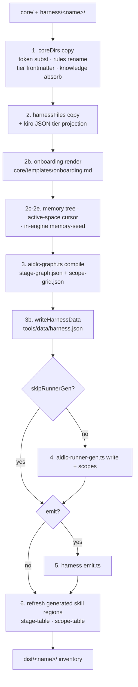

# パッケージングパイプラインとハーネス配布

> **Source**: [awslabs/aidlc-workflows](https://github.com/awslabs/aidlc-workflows/tree/3c3146cfd7cef33020d48e8d48d4e80d0f8c2820) — branch `v2`, commit `3c3146cf` (v2.6.40, retrieved 2026-08-21)
> **Status**: 実装から導出された as-built 仕様である。上流コードが本文書に対して正本である。
> **正本**: 英語版 `10-distribution-harnesses.md`(この日本語版は参照訳。両者が食い違う場合は英語版が優先)

## 1. スコープ

本文書は、ハーネス中立のソースツリー `core/` が `dist/` 配下のコミット済み・ハーネス別配布へどう投影されるかを規定する。対象は以下のとおり:

- パッケージャ(`scripts/package.ts`)とそれが消費するマニフェスト契約
- 7つのハーネスマニフェストと、それぞれが出力する形
- 8番目の `dist/` ターゲットである `dist/plugins/` とそのパッケージ内容
- 共有のオンボーディング文書レンダラ
- 既存ユーザーワークスペースに対して利用可能なインストール・シェルアップグレード経路
- リリースバイナリビルダー

投影された成果物が*何を意味するか*は規定しない。ステージグラフは `01-workflow-model.md` と `02-orchestration-engine.md` が所有し、エージェントペルソナは `05-agents.md`、センサーは `06-sensors.md`、フック本体とアダプタのセマンティクスは `07-hooks.md`、メモリ/ルール層は `08-memory-rules-learnings.md`、CLI サーフェスは `09-cli-tools.md`、プラグイン合成のセマンティクスは `11-plugin-system.md`、ドリフトガードを実行する CI 配線は `12-testing-ci.md` が所有する。本文書はそれらが*どのように整形され配送されるか*だけを記述する。

全体を通じて、`dist/` は**生成された投影出力であり、決してソースではない**。以下の `dist/` レイアウトに関する記述はすべてビルド成果物の観測であり、それぞれの正本はそれを生成したマニフェスト行または emit プラグインである。

## 2. 入力・出力・エントリポイント

| 項目 | パス | 役割 |
| --- | --- | --- |
| パッケージャ | `scripts/package.ts` | ビルドのエントリ。書込モードと `--check` ドリフトガード |
| マニフェスト契約 | `scripts/manifest-types.ts` | 各ハーネスが実装する `HarnessManifest` 型 |
| オンボーディングレンダラ | `scripts/onboarding.ts` | `core/templates/onboarding.md` をハーネスごとにレンダリング |
| レビュアー知識吸収器 | `scripts/agent-knowledge.ts` | ビルド時にレビュアーチェックリストをレビュアーエージェント本体へインライン化する |
| プラグインフックテンプレート | `scripts/plugin-hooks-template/` | `compose.ts`(全プラグイン投影へコピー) + `aidlc-plugin-compose.ts`(cursor 投影のみ) |
| リリースバイナリ | `scripts/build-binaries.ts` | `bun build --compile` マトリクス + スモークゲート |
| ドキュメントリンク書換器 | `scripts/docs-rewrite-links.ts` | CI 専用・その場書換。`dist/` の一部ではない |
| ハーネスサーフェス | `harness/<name>/` | 7ディレクトリ、それぞれに `manifest.ts` |
| 中立ソース | `core/` | `agents/ aidlc-common/ hooks/ knowledge/ memory/ scopes/ sensors/ skills/ templates/ tools/` |
| 出力 | `dist/<name>/` | 7つのハーネスツリー + `dist/plugins/` |

呼び出し形式(パッケージャ自身のヘッダより、`scripts/package.ts:4-7`):

```text
bun scripts/package.ts            regenerate dist/{claude,kiro,kiro-ide,codex}
bun scripts/package.ts --check     total drift guard (exit 1 on any drift)
bun scripts/package.ts <name>      regenerate just one harness
bun scripts/package.ts <name> --check
```

ヘッダコメントに書かれたデフォルトターゲットの一覧は古い散文である。デフォルトターゲット集合はハードコードではなく**発見(discover)される** — `discoverHarnessNames()` が `harness/` を走査して `manifest.ts` を持つ任意のディレクトリを見つけ、結果をソートする(`scripts/package.ts:121-126`)。CLI はターゲット名が指定されなかった場合にこの一覧を使う(`scripts/package.ts:1277`)。既定では7つのハーネスすべてがビルドされる。同一エントリポイント上にさらに2つのサブコマンドが存在する: `package.ts codex trust`(`scripts/package.ts:884`)と `package.ts plugin build <plugin> <harness> <outDir>`(`scripts/package.ts:1196`)。

`package.json` はこのガードをリポジトリの check へ配線している: `"check": "bun scripts/package.ts --check && bun run typecheck && bun run lint"`。

## 3. マニフェスト契約

`scripts/manifest-types.ts` は設計原則を逐語で記す(`:4-7`):

> A manifest is DATA: how to project the harness-neutral core/ tree into one
> dist/<name>/<harnessDir>/ tree. The only CODE a harness may contribute is an
> optional emit() plugin […] — structural divergence that no declarative row can express.

### 3.1 フィールド一覧

| フィールド | 型 | 必須 | 意味 |
| --- | --- | --- | --- |
| `name` | `string` | yes | `dist/<name>/` と `harness/<name>/` に一致 |
| `harnessDir` | `string` | yes | `{{HARNESS_DIR}}` が置換される値 |
| `orchestratorSkillPath` | `string?` | no | 既定は `<harnessDir>/skills/aidlc/SKILL.md` |
| `tierFlavor` | `"claude" \| "codex" \| "kiro" \| "opencode" \| "copilot" \| "cursor"` | yes | このハーネスのエージェントサーフェスが使う `TIER_PROJECTIONS` の列 |
| `coreDirs` | `DirMap[]` | yes | `core/<src>` → `<harnessDir>/<dst>` |
| `harnessFiles` | `FileMap[]` | yes | `harness/<name>/<src>` → dist |
| `frontmatterAdditions` | `Array<{file, lines}>?` | no | 投影された `.md` フロントマターへ追加される、ハーネスネイティブな YAML 行 |
| `runnerFrontmatterAdditions` | `string[]?` | no | 生成される全ランナースキルへ追加される YAML 行。`harness.json` へ永続化される |
| `onboarding` | `OnboardingSpec \| null?` | no | オンボーディング文書のレンダリング方法 |
| `rulesRename` | `string \| null` | yes | このハーネスにおけるルールディレクトリの名称。散文内の `<harnessDir>/rules/` の書換と `harness.json` の `rulesSubdir` を駆動する。現時点でコアディレクトリのリネームは発生していない — §4.1 参照 |
| `documentExtractors` | `Record<string,{argv,timeoutMs?}> \| null?` | no | `harness.json` へ出力される DocumentKB 抽出器の上書き |
| `skipRunnerGen` | `boolean?` | no | 標準のランナー生成ステップをスキップする |
| `emit` | `((ctx: EmitContext) => void) \| null` | yes | ハーネスごとの任意の emission プラグイン |
| `plugin` | `{manifestDir, kind}?` | no | ホストプラグイン投影の形 |

3つの補助型(`scripts/manifest-types.ts:12`、`:20`、`:27-47`)。宣言は逐語で再掲する。`EmitContext` と `OnboardingSpec` の範囲内に挟まるフィールドごとの JSDoc コメントは、長さの都合上ここでは省略する:

```ts
export type DirMap = { src: string; dst: string };
export type FileMap = { src: string; dst: string; projectRoot?: boolean };
export type EmitContext = {
  repoRoot: string;
  coreRoot: string;
  harnessRoot: string;
  distRoot: string;
  harnessDir: string;
  substituteToken: (s: string) => string;
  tierCap: "judgment" | "balanced" | "templated" | null;
};
```

および onboarding spec(`scripts/manifest-types.ts:58-65`):

```ts
export type OnboardingSpec = {
  dst: string;
  projectRoot?: boolean;
  fills: OnboardingFills;
};
```

### 3.2 パッケージャに組み込まれた契約ガード

- **`frontmatterAdditions` の誤字ガード。** 宣言された各ファイルは、コア投影によって正確に1回だけ生成されなければならない。不一致のエントリはビルドを中断し、
  `` `[${m.name}] frontmatterAdditions name file(s) the core projection never produced: …` ``
  を出す(`scripts/package.ts:574-580`)。
- **`frontmatterAdditions` の衝突ガード。** コアファイルが既に宣言しているキーは即座にエラーになる —
  `` `frontmatterAdditions: ${file} already declares "${key}:" in core - resolve the
  collision instead of shipping a duplicate key.` ``(`scripts/package.ts:324-329`)。YAML キーで始まらない行も同様に拒否され(`:317-323`)、先頭にフロントマターブロックを持たないファイルは `:310-314` で失敗する。
- **`orchestratorSkillPath` のコンテインメント。** 絶対パスや `..` セグメントを含むものはすべて拒否される:
  `` `packager: ${manifest.name} orchestratorSkillPath must stay within its dist root: ${rel}` ``
  (`scripts/package.ts:742-746`)。解決先のパスにファイルが存在しない場合も致命的エラーになる(`:748-752`)。
- **`documentExtractors` はパッケージャ所有。** `writeHarnessData()` はビルドのたびに**新しい**オブジェクトを構築するため(`scripts/package.ts:434-441`)、手で追加したフィールドは `--check` を失敗させたうえで次のビルドで消去される — `scripts/manifest-types.ts:130-131` の契約コメントが `argv` 配列(シェル文字列ではなく)というルールを明記する。現時点でこのフィールドを設定しているマニフェストは存在しない。

## 4. パッケージングパイプライン

`buildTree(m, outRoot, seedFrom)`(`scripts/package.ts:536-697`)がパイプラインの全体であり、書込モードと check モードの両方がこれを呼び出す。違いは `outRoot` のみである。



テキストによるフォールバック: パッケージャはコアディレクトリをコピーし、次に authored なハーネスファイルをコピーし、オンボーディング文書をレンダリングし、ワークスペースのメモリツリーと active-space カーソルとエンジン内メモリシードを emit し、アセンブルされたツリーへステージグラフをコンパイルし、`tools/data/harness.json` を書き出し、マニフェストが opt-out しない限りランナースキルを生成し、存在すればハーネスの `emit()` プラグインを呼び出し、最後にオーケストレータースキル内の生成テーブル領域をリフレッシュする。`buildTree` は `outRoot` を起点とする完全なファイルインベントリを返す。

### 4.1 ステップ1 — コアディレクトリの投影

`coreDirs` 内の各 `{src, dst}` について、パッケージャは `core/<src>` をソート順に走査し(`scripts/package.ts:335-341` `walk()`)、`<harnessDir>/<dst>/<rel>` を書き出す。`rulesRename` が設定されており、かつ `dst === "rules"` のとき、出力先はリネームされたディレクトリになる(`scripts/package.ts:554`)。各ファイルは `transform()`(§5参照)を経由し、続いてマニフェストがそのハーネス相対の出力パスを名指ししている場合は `applyFrontmatterAdditions()` を経由する。

この経路上の2つの分岐は**出荷済みマニフェストに対しては死んでいる**。`core/rules/` は存在せず(`ls -d core/*/` →
`agents aidlc-common hooks knowledge memory scopes sensors skills templates tools`)、ソースディレクトリが存在しない場合は単にスキップされる(`if (!existsSync(srcDir)) continue;`、`:553`)。リポジトリ内で唯一の `{ src: "rules", … }` 行は codex のもので、その `dst` は `aidlc-rules` であるため、`:554` の `dst === "rules"` によるリネームすら発火しない。両者は前方互換のための余地として残っているだけで、配送される挙動ではない。

### 4.2 ステップ2 — authored なハーネスサーフェス

`harnessFiles` は `harness/<name>/<src>` から、同じ `transform()` を経てコピーされる。`projectRoot: true` は、出力先を(ハーネスディレクトリの内側ではなく)dist ツリーのルート(ハーネスディレクトリの隣)へルーティングする(`scripts/package.ts:592`)。`tierFlavor === "kiro"` のときにのみ適用される追加投影が2つある(`scripts/package.ts:595-601`):

- `agents/*.json` → `projectKiroAgentJson()`(`:234-249`): 同名の `core/agents/<slug>.md` から `tier:` を読み取り、投影し、`model` キーを設定または削除し、正準形式(2スペースインデント、末尾改行)で再シリアライズする。Authored な Kiro エージェント JSON は `model` フィールドを**一切**持たないため、誰もビルドが上書きする値を編集していない。
- `settings/cli.json` → `projectKiroCliJson()`(`:257-265`): tier 由来の `chat.modelDefaults` エントリをマージする。authored なエントリが衝突時に優先される。`KIRO_TIER_EFFORT` は現在空(`core/tools/aidlc-tiers.ts:161`)であるため、このマージは no-op であり、出荷される `dist/kiro/.kiro/settings/cli.json` は authored なファイルとバイト同一である。

### 4.3 ステップ2b〜2e — オンボーディング、メモリ、カーソル、メモリシード

- **2b オンボーディング**(`scripts/package.ts:610-616`): `core/templates/onboarding.md` をマニフェストの fills とともに `renderOnboarding()` でレンダリングし、その結果を通常のコア `.md` と同じ `transform()` に通す。
- **2c メモリ**(`emitMemory`、`:456-470`): `core/memory/` を(これらの中立なファイルに対しては no-op である標準の `.md` 変換とともに)そのまま `dist/<name>/aidlc/spaces/default/memory/` へコピーする — 定数は `MEMORY_SRC = "memory"` と `MEMORY_DST = join("aidlc","spaces","default","memory")`(`:396-397`)である。出力先は `<harnessDir>` の外側、**ワークスペースルート**にあるため、method ツリーはあらゆるハーネスでエンジンディレクトリの兄弟(sibling)になる。コンパイルは `rules_in_context` をここから解決するため、これはコンパイルより前に実行される必要がある。
- **2d Active-space カーソル**(`emitActiveSpace`、`:503-507`): `"default\n"` を内容とする `dist/<name>/aidlc/active-space` を書き出す(`:422-423`)。出荷される `.gitignore` はエンドユーザーに対してこのパスを無視するが、上流リポジトリは出荷されるポインタをコミットしている(`:413-421`)。
- **2e メモリシード**(`emitMemorySeed`、`:479-493`): *同一の* `core/memory/` コンテンツを、二度目として `<harnessDir>/tools/data/memory-seed/`(`MEMORY_SEED_DST`、`:408`)へ書き出す。これはエンジンのみインストールされた場合の自己修復ソースである。§10.3 を参照。

### 4.4 ステップ3 — アセンブルされたツリーへのグラフコンパイル

`seedCompiledData()`(`:517-527`)は、2つのコミット済みコンパイル済みデータファイル — `COMPILED_DATA = ["tools/data/stage-graph.json", "tools/data/scope-grid.json"]`(`:377`) — をコンパイル前にアセンブルされたツリーへコピーする。これは `compileStageGraph()` が各ステージの番号と名前を既存の JSON からブートストラップするためである(「computed-not-authored な種(seed)契約」)。シードツリーがそれらを欠く場合(あるハーネスの初回ビルド)、パッケージャはコミット済みの Claude ツリーを正規のシード・オブ・レコードとして使うようフォールバックする(`:517-521`、`:831`)。

コンパイルはその後、ツリー内ツールとして `runTool()`(`:705-734`)経由で実行され、4つの環境シームを設定する: `AIDLC_SRC`(アセンブルされたツリー)、`AIDLC_HARNESS_DIR`、`AIDLC_HARNESS_NAME`、そして — ルールディレクトリが与えられている場合 — 出力されたメモリツリーを指す `AIDLC_RULES_DIR`(`:714-720`)。ツリー内ツールのいずれかからの非ゼロ終了コードは、ビルド全体を
`` `packager: \`bun ${args.join(" ")}\` failed in ${treeRoot}` ``
で中断する(`:728`)。

ルールをリネームするハーネスについては、`renameRulesInCompiledData()`(`:802-810`)がコンパイル済み JSON のパス文字列に対する縦深防御(defense-in-depth)のバックストップとして走る。コンパイル自体が既にリネーム済みセグメントを出力しているため、現時点ではガードされた no-op である。

### 4.5 ステップ3b — `tools/data/harness.json`

パッケージャが出力するハーネス記述子(`writeHarnessData`、`:429-448`)は、rules サブディレクトリに関するランタイムの open-set な信頼できる情報源である:

```json
{ "name": …, "harnessDir": …, "rulesSubdir": <rulesRename ?? "rules">,
  "runnerFrontmatterAdditions"?: [...], "documentExtractors"?: {...} }
```

ランタイム側の読み取り側は `core/tools/aidlc-lib.ts:251-405` の `readShippedHarnessData()` であり、`runnerFrontmatterAdditions` を YAML キー行の配列として検証し(`core/tools/aidlc-lib.ts:373-386`)、パッケージャが決して書かない `plugins` キーは許容する — このフィールドはビルドによってではなく、プラグイン選択によって*インストール済み*のツリーへ追加される。

観測された出荷値: `dist/claude/.claude/tools/data/harness.json` は `"rulesSubdir": "rules"` を持つ。`dist/kiro/.kiro/tools/data/harness.json` は `"rulesSubdir": "steering"` を持つ。`dist/cursor/.cursor/tools/data/harness.json` はさらに `"runnerFrontmatterAdditions": ["disable-model-invocation: true"]` を持つ。

### 4.6 ステップ4 — ランナー生成

`skipRunnerGen` が設定されていない限り、パッケージャはアセンブルされたツリーから `aidlc-runner-gen.ts` を2回起動する: `write`(ステージランナー、`aidlc-init`、`aidlc-compose`)と `scopes`(デフォルトのスコープランナーバッチ) — `scripts/package.ts:672-675`。ランナーの内容と命名は `09-cli-tools.md` / `17-skill-system` が所有する。パッケージングの観点から重要な事実は、ジェネレータが `AIDLC_HARNESS_DIR` の下で **dist ツリー内で**実行されるため、生成された散文が正しいディレクトリを名指しすること、そして `runnerFrontmatterAdditions` がパッケージャの引数ではなく `harness.json` 経由でそこへ到達することである。

スコープランナー集合は `defaultScopeBatch()` である — フロントマターに `runner: true` を持つ、発見されたスコープ(`core/tools/aidlc-runner-gen.ts:577-581`)。5つのコアスコープが該当する: `aidlc-bugfix`、`aidlc-express`、`aidlc-feature`、`aidlc-mvp`、`aidlc-security-patch`。ステージランナー集合は `initialization` 以外の全ステージであり(`core/tools/aidlc-runner-gen.ts:100-111`)、コンパイル済み33ステージのうち30である。

### 4.7 ステップ5 — `emit()`

7つのハーネスのうち3つ(codex、copilot、opencode)が `emit.ts` を出荷する。それぞれが `EmitContext` を受け取り、常に `ctx.distRoot` へ書き出す。`--check` の下ではそのルートは一時ディレクトリである(`scripts/package.ts:680-690`)。3つとも書き込み前に自分が所有するサブツリーをクリーンスイープ(`rmSync`)するため、削除されたランナーやペルソナが残存することはない: codex は `.agents/skills/` を掃除し(`harness/codex/emit.ts:450`)、copilot は `.github/` シェル全体を掃除し(`harness/copilot/emit.ts:218`)、opencode は `.opencode/` を掃除する(`harness/opencode/emit.ts:160`)。

`tierCap` は明示的に受け渡されるため、emit が所有する投影も、あらゆる宣言的投影と同じパック時点のキャップを使う。契約コメントはプラグインが「これを再解決してはならない」と記す(`scripts/manifest-types.ts:41-46`)。

### 4.8 ステップ6 — 生成されたスキル領域

(codex と copilot はオーケストレータースキルを `<harnessDir>/skills/` の外側に置くため)emit の後に、`refreshGeneratedSkillRegions()`(`:756-793`)がアセンブルされたオーケストレータースキル内の2つのマーク付き領域を、新しくレンダリングされたテーブルで置き換える。マーカーは逐語である(`scripts/package.ts:103-114`):

```text
<!-- BEGIN: compiled stage graph via `bun aidlc-utility.ts stage-table` - do NOT hand-edit -->
<!-- END: compiled stage graph -->
<!-- BEGIN: compiled scope grid via `bun aidlc-utility.ts scope-table` - do NOT hand-edit -->
<!-- END: compiled scope grid -->
```

マーカーが存在しない領域はスキップされる。マーカーが不整形な場合(片側が欠落、順序が逆、または重複)は
`` `packager: malformed ${region.verb} markers in ${skillPath}` ``
で中断する(`:781-785`)。

## 5. transform クラス

`transform()`(`scripts/package.ts:267-298`)は `.md` ファイルにのみ、以下を順に適用する — `.json` と `.ts` はバイトそのままコピーされる:

1. **レビュアー知識の吸収**を最初に、生のコアテキストに対して行う。これは後続の置換によって吸収された散文もカバーされるようにするためである(`:277-279`)。`absorbReviewerKnowledge()`(`scripts/agent-knowledge.ts:67-88`)は、生成されたヘッダの下に authored なソースを名指ししながら、各 `knowledge/<agent>/*.md` ファイルをエージェント本体へ追記する。レビュアー集合はハードコードされておらず、コアおよびプラグインステージのフロントマター `reviewer:` 行から**導出**される(`scripts/agent-knowledge.ts:33-58`)。
2. **ハーネスディレクトリのトークン置換** — `{{HARNESS_DIR}}` → マニフェストの `harnessDir`(`scripts/package.ts:102`、`:133-135`)。パッケージャ自身のヘッダはこれを「THE TRANSFORM CLASS(T5 — the only permitted text transform)」と呼ぶ(`:27-31`)。
3. **ルールリネーム** — `applyRulesRename()` は散文中の `<harnessDir>/rules/` → `<harnessDir>/<rulesRename>/` を書き換える。置換後のハーネスディレクトリ形式にアンカーされているため、無関係な `rules/` への言及には触れない(`:142-145`)。`rulesRename` が null の場合は no-op。
4. **Tier フロントマター投影** — `projectTierFrontmatter()`(`:175-207`)は `/agents/` を含み `-agent.md` で終わるパスにのみ適用される。YAML ブロックから authored な `tier:` を読み取り(`agentTierFromMd`、`:152-164`。フロントマターブロックの欠落や `tier:` 行の欠落はビルド失敗になる)、`projectTier(tier, harness, TIER_CAP)` を通じてそれを投影し、`tier:` 行をハーネスネイティブなキーへ置き換える。投影値が `null` であれば、そのキーは**省略される** — ハーネス自身のセッションデフォルトが適用される。全キーが省略される場合、`tier:` 行は置換なしで削除される。
5. **Cursor ペルソナメモリのピン留め** — cursor エージェント本体に対してのみ、可変な `aidlc/spaces/<active-space>/memory/` ポインタが `aidlc/spaces/default/memory/` へピン留めされる。これにより最初の起動時の再ポイントがバイト同一になる(`:286-294`)。

`core/agents/aidlc-developer-agent.md`(authored `tier: judgment`)に対する観測された効果: `dist/claude/.claude/agents/aidlc-developer-agent.md` は `model: inherit` を持つ。`dist/kiro-ide/.kiro/agents/aidlc-developer-agent.md` は `tier:` 行が完全に削除され、`frontmatterAdditions` によって `tools: ["read", "write", "shell"]` が追加される。

Cursor **プラグイン**エージェント専用の、より狭い別の変換が存在する: `projectCursorPluginAgent()` は `model|tier|effort|variant` 行を取り除き、トークンを `.cursor` へ置換する(`scripts/package.ts:209-220`)。

## 6. Check モードと再現性

### 6.1 メカニズム

`checkHarness(name)`(`scripts/package.ts:855-874`)は新しい `mkdtempSync` ディレクトリへツリーをビルドし、コンパイルは触れられていないコミット済みツリーからシードし、その結果を `dist/<name>/` に対してバイト単位で diff する。この diff は `<harnessDir>` だけでなく**配布ルート全体**を走査するため、プロジェクトルートのオンボーディング文書や設定ファイルも同じ双方向契約下にあり、削除・リネームされた出力はオーファンとして表面化する(`:864-868`)。

`diffTrees()`(`:349-373`)はハーネスガードとプラグインガードの両方が共有する単一の走査である。3つの問題文字列は逐語である:

```text
MISSING in dist: <prefix>/<rel>
DIFFERS: <prefix>/<rel>
ORPHAN in dist: <prefix>/<rel>
```

失敗時のターミナル出力は
`` `\npackage --check FAILED (${problems.length} problem(s)):` ``
に続けて最大40件の問題行、その後 `process.exit(1)`(`:1292-1296`)。成功時は `package --check: all harness trees in sync with core/ + harness/.`(`:1297`)。

### 6.2 再現性ルール

- **Tier キャップはモードに敏感である。** `AIDLC_TIER_CAP` は書込モードでのみ読まれ、`--check` の下では無視される。これにより CI 環境の迷い込んだキャップがドリフトを失敗させたり隠したりすることがない(`scripts/package.ts:82-99`)。`core/memory/` に持続する `tier_cap:` フロントマターキーはリポジトリと共に運ばれるため、両モードで適用される。キャップが有効な場合、パッケージャはそれを標準出力ではなく**標準エラー**へログする。これは `codex trust` サブコマンドの標準出力が `config.toml` へそのまま貼り付けられるためである(`:88-93`)。
- **`codex trust` はキャップ解決を完全にスキップする** — 投影を一切行わないため、不正なキャップが、それを一切使わないインストーラコマンドを壊してはならない(`:79-85`)。
- **コンパイル済みデータのシードは `stage-graph.json` / `scope-grid.json` における唯一の authored なデータ**であり、コンパイルは他の全フィールドを再導出し、コミット済みの JSON をバイト単位で再現する(`:637-645`)。
- **正準な再シリアライズ。** Kiro エージェント JSON は `JSON.stringify(parsed, null, 2)` に加えて末尾改行を通じて再出力される。コメントは明示的に「dist form is the stringify form, byte-stable under `--check`, not the authored bytes」と述べる(`:245-248`)。
- **書込モードはクリーンスイープする** — `dist/<name>/` ルート全体を、コンパイル済みデータシードを一時ディレクトリへ退避した後にクリーンスイープする。これにより削除・リネームされたプロジェクトルート出力が残存することがない(`writeHarness`、`:820-850`)。
- **名指しチェック vs リポジトリ全体チェック。** `checkPlugins(targets, !named)` は単一ハーネスチェックに対して `full = false` を渡し、トップレベルのオーファンスイープを抑制する(`:1291`、`:1151-1189`)。

## 7. ハーネス配布

7つのマニフェスト、7つの `dist/` ハーネスツリー。`dist/` は8番目のターゲットである `dist/plugins/`(§8参照)と、パッケージャが読み書きしないコミット済み PDF(`dist/AI-DLC Workflows 2.0 Specification.pdf`)も保持する。

| ハーネス | `harnessDir` | `tierFlavor` | `rulesRename` | `emit` | `skipRunnerGen` | オーケストレータースキルパス | オンボーディング文書 | プラグイン投影 | dist ファイル数 |
| --- | --- | --- | --- | --- | --- | --- | --- | --- | ---: |
| `claude` | `.claude` | claude | – | – | – | `.claude/skills/aidlc/SKILL.md` | `.claude/CLAUDE.md` | `.claude-plugin`(default)、store | 262 |
| `codex` | `.codex` | codex | `aidlc-rules` | yes | yes | `.agents/skills/aidlc/SKILL.md` | root `AGENTS.md`(emit経由) | `.codex-plugin`(default)、store | 318 |
| `copilot` | `.aidlc` | copilot | – | yes | yes | `.github/skills/aidlc/SKILL.md` | root `AGENTS.md` | `.plugin`、store | 274 |
| `cursor` | `.cursor` | cursor | – | – | – | `.cursor/skills/aidlc/SKILL.md` | root `AGENTS.md` | `.cursor-plugin`、cursor | 270 |
| `kiro` | `.kiro` | kiro | `steering` | – | – | `.kiro/skills/aidlc/SKILL.md` | root `AGENTS.md` | `.kiro-plugin`、kiro | 276 |
| `kiro-ide` | `.kiro` | kiro | `steering` | – | – | `.kiro/skills/aidlc/SKILL.md` | root `AGENTS.md` | `.kiro-plugin`、kiro | 293 |
| `opencode` | `.aidlc` | opencode | – | yes | – | `.aidlc/skills/aidlc/SKILL.md` | root `AGENTS.md` | `.opencode-plugin`、store | 275 |

2つのハーネス(copilot と opencode)は `.aidlc` を共有し、2つ(kiro CLI と kiro-ide)は `.kiro` を共有する。ランタイムでの区別は `tools/data/harness.json` の `name` によって行われ、そのメタデータが利用できない場合に限りディレクトリベースのフォールバックが使われる(`core/tools/aidlc-runtime-paths.ts:72-96`、「Copilot and OpenCode intentionally share .aidlc」というコメントを含む)。

すべてのハーネスは同じ7つの基本コアディレクトリ行を宣言する: `tools`、`aidlc-common`、`knowledge`、`sensors`、`scopes`、`agents`、`hooks`。スキルをツリー内に保持するハーネス(claude、cursor、kiro、kiro-ide、opencode)は、4つの独立したスキルディレクトリ `skills/aidlc-session-cost`、`skills/aidlc-replay`、`skills/aidlc-outcomes-pack`、`skills/aidlc-knowledge` を追加し、合計11行になる。copilot は7つの基本行のみを宣言する。Codex は行数の唯一の例外である: 7つの基本行に加えて `{ src: "rules", dst: "aidlc-rules" }`(`harness/codex/manifest.ts:34`)を宣言し、合計8行になるが、これは `core/rules/` が存在せず `buildTree()` が欠落ソースをスキップする(`if (!existsSync(srcDir)) continue;`、`scripts/package.ts:553`)ため**死んだ行**である。§7.2参照。`core/memory/` はどのマニフェストにおいても意図的にコアディレクトリで**ない** — ワークスペースルートへ移設され、ステップ2cによって emit される(`harness/claude/manifest.ts:25-30`)。

### 7.1 claude

配送されるレイアウト: `dist/claude/.claude/`(エンジン) + `dist/claude/aidlc/`(ワークスペースシェル) + プロジェクトルートの `.mcp.json` と `.gitignore`。

ネイティブメカニズム: `.claude/skills/`(42ディレクトリ: オーケストレーター、30のステージランナー、`aidlc-init`、`aidlc-compose`、5つのスコープランナー、4つの独立スキル)にスキルがある。エージェントは `.claude/agents/` 内のフラットな `.md` である。フックはアダプタシムなしの、`.claude/hooks/` 内のコア `.ts` 本体である。ルールは `.claude/rules/aidlc.md` にある単一の `@`-import スタブである。このスタブがそのディレクトリ内の唯一のファイルである — `rules/` はここではコア投影ではない(`harness/claude/manifest.ts:51-55`)。

アダプタメカニズム: **なし**。Claude はマニフェストヘッダにおいて「a peer harness, not the identity transform」と説明される。その散文は他の全ハーネスと同じ `{{HARNESS_DIR}}` トークンを持ち、置換によって `.claude/` のリテラルへ復元される(`harness/claude/manifest.ts:9-13`)。

オンボーディング: `onboarding: { dst: "CLAUDE.md", fills }` は `projectRoot` を持たないため、レンダリングされた文書はエンジンディレクトリの**内側**、`dist/claude/.claude/CLAUDE.md` に配置される(`harness/claude/manifest.ts:73`)。その最初の行は method の `@`-import であり(`harness/claude/onboarding.fills.ts:10`)、`aidlc/spaces/default/memory/*.md` への参照チェーンの最初のホップである。

インストールエントリ: `cp -r dist/claude/.claude/ <project>/.claude/` に加えて `cp -r dist/claude/aidlc/ <project>/aidlc/`(`README.md:200-201`)。`aidlc/` の兄弟ディレクトリは必須である: `--doctor` の「workspace shell ready」チェックはそれなしでは失敗する。

追加の authored なサーフェス: `.claude/settings.json`、`.claude/settings.local.json.example`、`.mcp.json`(プロジェクトルート — Claude の MCP サーバーレジストリ。他のハーネスは何も出荷しない)。

### 7.2 codex

配送されるレイアウト: `dist/codex/.codex/`(エンジン) + `dist/codex/.agents/skills/`(スキル集合全体) + `dist/codex/aidlc/` + root の `AGENTS.md` と `.gitignore`。

ネイティブメカニズム: `.agents/skills/` にスキルがある — Codex はプロジェクトスキルをここで発見し、`.codex/skills/` では決して発見しない。そのためマニフェストは `skipRunnerGen: true` を設定し、`emit()` が集合全体を組み立てる(`harness/codex/manifest.ts:11-14`、`:57-58`)。エージェントは `.codex/agents/` にある14個の TOML への変換である。ペルソナ `.md` ファイルはコンダクターが読むコア散文として、依然として `.codex/agents/` の下に出荷される。ルール: マニフェストは `{ src: "rules", dst: "aidlc-rules" }` というコアディレクトリ行を保持し(`harness/codex/manifest.ts:34`) — これはリポジトリ内で唯一そのような行である(`grep -n 'src: "rules"' harness/*/manifest.ts` は codex のみに一致) — その意図は `.codex/rules/` を Codex のネイティブな Starlark パーミッションルールディレクトリのために空けておくことである。**この行は死んでおり、それを通じて何も配送されない**: `core/rules/` は存在せず(`ls -d core/*/` →
`agents aidlc-common hooks knowledge memory scopes sensors skills templates tools`)、`buildTree()` は欠落ソースをスキップする(`if (!existsSync(srcDir)) continue;`、`scripts/package.ts:553`)ため、`find dist/codex -name aidlc-rules | wc -l` → `0` である。出荷される唯一の rules ファイルは emit が書き出す `.codex/rules/default.rules` である(`harness/codex/emit.ts:134-150`)。`ls dist/codex/.codex/` →
`agents aidlc-common config.toml hooks hooks.json knowledge rules scopes sensors tools trust-seed.toml`。

アダプタメカニズム: authored な標準入力シムが1つ、`.codex/hooks/aidlc-codex-adapter.ts`(614行)。生成された `.codex/hooks.json` から
`` `bun ${harnessDir}/hooks/aidlc-codex-adapter.ts ${target}` `` として呼び出される(`harness/codex/emit.ts:56-70`)。配線テーブルは13行あり、`SessionStart`、`UserPromptSubmit`、5つの `PreToolUse` 登録(うち1つは `spawn_agent` にマッチ)、3つの `PostToolUse` 登録(`apply_patch`、`update_plan`、`Bash` にマッチ)、`PreCompact`、`SubagentStop`、`Stop` に及ぶ(`harness/codex/emit.ts:32-54`)。

emit が所有する出力(`harness/codex/emit.ts:388-445`): `.codex/hooks.json`、`.codex/config.toml`(Bedrock プロバイダのデフォルト、`AIDLC_RULES_DIR` シェル環境シーム、`sandbox_mode = "workspace-write"`、`request_user_input` フィーチャーフラグ、TUI ステータスライン)、`.codex/rules/default.rules`、`.codex/trust-seed.toml`、root の `AGENTS.md`、14個のエージェント TOML、そして `.agents/skills/` ツリー。**生成された、またはコピーされた**すべてのスキルには、暗黙起動ガード
`"policy:\n  allow_implicit_invocation: false\n"`(`IMPLICIT_GUARD`、`harness/codex/emit.ts:362`)を含む `agents/openai.yaml` が付与される — ステージランナーのループ(`:417-421`)、`aidlc-init` / `aidlc-compose` の push(`:422-425`)、スコープランナーのループ(`:427-432`)、そして独立スキルのループ(`:437-445`)がそれぞれ1つを push する。**authored なオーケストレーターシェルは唯一の例外である** — `skills/aidlc/SKILL.md` と `question-rendering.md` をそのまま push するループ(`:409-415`)は `agents/openai.yaml` を push しない。したがって、emit される42個のスキルのうち41個がこのガードを持つ
(`find dist/codex/.agents/skills -name openai.yaml | wc -l` → `41`。
`ls dist/codex/.agents/skills/aidlc/` → `question-rendering.md SKILL.md` のみ)。

codex 固有で言及に値する散文書換が2つある: `rewriteProse()` はトークンを置換した後 `rules/` → `aidlc-rules/` へリネームする(`:283-284`)。`emitAgentsMd()` はさらに、`.codex/rules/default.rules` が**リネームされない**よう否定先読みを使い、`<harnessDir>/skills/` → `.agents/skills/` へリダイレクトする(`:294-309`)。Codex の TOML ペルソナは一切フロントマターを持たないため、ペルソナ本体のハーネス中立な `maxTurns:` 自己参照は書き換えられる(`:339-344`)。

フックトラスト: `trustEntries()`(`:190-215`)は配線行ごとに、正準な JSON アイデンティティ
`{event_name, hooks:[{async:false, command, timeout:600, type:"command"}]}`(`:155-173`)に対する `sha256:` プレフィックス付きハッシュを計算し、
`"<abs hooks.json path>:<event_snake>:<group>:<idx>"` をキーとする。`.codex/trust-seed.toml` は `<PROJECT_DIR>` を持つテンプレート形式である。`bun scripts/package.ts codex trust --project <abs-dir>
[--hooks-json <abs-path>]` は、置換済みですぐに貼り付け可能なエントリを出力する
(`scripts/package.ts:884-928`)。このサブコマンドは各パスがどちらのプラットフォームでも完全修飾であることを検証し(`:892-898`)、フラグの重複指定を拒否する。

インストールエントリ: `.codex/`、`.agents/`、`aidlc/`、`AGENTS.md` をコピーする(`README.md:232-235`)。対象は**git リポジトリでなければならない** — 「Codex only discovers a project `.codex/hooks.json` inside one」(`README.md:229`)。

### 7.3 copilot

配送されるレイアウト: `dist/copilot/.aidlc/`(エンジン) + `dist/copilot/.github/`(ネイティブに消費されるシェル) + `dist/copilot/aidlc/` + root の `AGENTS.md` と `.gitignore`。

ネイティブメカニズム: 単一の配布が両方の Copilot サーフェス — CLI ≥ 1.0.74 と VS Code エージェントモード ≥ 1.130 — に提供される。これは両方が `.github/skills/`、`.github/agents/`、`.github/hooks/`、そして root の `AGENTS.md` を同一に読むためである(`harness/copilot/manifest.ts:5-8`)。エンジンは `.copilot` や `.github` ではなく `.aidlc/` に出荷される。理由は、プロジェクトレベルの `.copilot/` が文書化された発見ルートではなく、`.github/` はエンジンツリーが所有できない実リポジトリのコンテンツと共有されるためである(`harness/copilot/manifest.ts:20-26`)。`skipRunnerGen: true`。マニフェストは `skills/` コアディレクトリを一切宣言しない。

アダプタメカニズム: `.aidlc/hooks/aidlc-copilot-adapter.ts`(1338行)。`.github/hooks/aidlc.json` から `{"version": 1}` エンベロープ内で、PascalCase のイベント名と、行ごとに `bash` と `powershell` の両方のコマンドスペリングとともに配線される(`harness/copilot/emit.ts:52-62`)。この配線は**マッチャー不要**である — VS Code はマッチャーをパースするが無視するため、すべてのアダプタターゲットは自己フィルタリングする(`:8-11`)。8行: `SessionStart`、`UserPromptSubmit`、`PreToolUse`(`guard-tool-call`)、`PostToolUse`(`post-tool`)、`PreCompact`、`SubagentStart`、`SubagentStop`、`Stop`(60秒タイムアウト。残りは30秒)。`SessionEnd` は VS Code が受け付けないため意図的に不在である。SESSION_ENDED は次の SessionStart で調整(reconcile)される(`harness/copilot/emit.ts:38-39`)。

エージェント投影: 14個のペルソナは、`tier:` 行を削除し(copilot の tier 列は型としてモデル省略である — `core/tools/aidlc-tiers.ts:104-105`)、コアの `disallowedTools: Task` 拒否をサポート済みの許可リスト
`tools: ["read", "edit", "search", "execute", "web", "todo"]`
(`harness/copilot/emit.ts:71`、`:89-98`)へ置き換えて `.github/agents/` へ再出力される。`disallowedTools` の値が厳密に `Task` でない場合、強制力のない拒否を出荷する代わりにビルドが失敗する(`:84-88`)。

パッケージャは `emit()` が実行される前に `AGENTS.md` をレンダリングするため、emit はその場で `<harnessDir>/skills/` → `.github/skills/` を書き換える(`harness/copilot/emit.ts:143-153`)。

インストールエントリ: `.aidlc/`、`aidlc/`、`AGENTS.md` をコピーする。`.github/` は**マージ**する
(`README.md:64`)。emit のヘッダはこのマージ契約を明記している: dist ツリー内では `.github/` は完全に AIDLC が所有し `--check` の対称性のためにクリーンスイープされるが、ユーザーの `.github/` は共有されているため、すべての emission は `aidlc` プレフィックスを持ち、インストールは置き換えではなくマージする(`harness/copilot/emit.ts:23-27`)。

### 7.4 cursor

配送されるレイアウト: `dist/cursor/.cursor/` + `dist/cursor/aidlc/` + root の `AGENTS.md`、`.gitignore`、`install.ts`。

ネイティブメカニズム: マニフェストヘッダは Cursor を「the most 'native' port so far」と呼ぶ
(`harness/cursor/manifest.ts:3-4`) — **`emit.ts` なし**で標準投影を直接消費する
(`harness/cursor/manifest.ts:5-6`)。スキルは `.cursor/skills/<name>/SKILL.md`(45ディレクトリ: 42個の標準ディレクトリに加え、3つの authored なショートカット `aidlc-status`、`aidlc-jump`、`aidlc-scope`)にある。`.cursor/agents/` 内の14個のコアペルソナ `.md` ファイルはライブなネイティブサブエージェントである — Cursor のエージェントフロントマターはコアのそれのサブセットであり、未知のキーは許容されるため、emit された双子は不要である(`harness/cursor/manifest.ts:16-21`)。

ルール: Cursor はフロントマターを持つ `.mdc` ファイルのみを `.cursor/rules/` から読み込み、`@`-import 行は展開されない。したがって method の include は5つの authored な `.mdc` ファイルへ分割される — `rules/aidlc.mdc`(常時オンの org/team/project)に加え、4つのエージェント判断によるフェーズポインタ
`aidlc-phase-{ideation,inception,construction,operation}.mdc`
(`harness/cursor/manifest.ts:25-31`、`:72-76`)。それぞれが、import ではなく active-space ファイルを名指しする明示的な READ 指示を持つ。

アダプタメカニズム: `.cursor/hooks/aidlc-cursor-adapter.ts`(952行)は、authored な `.cursor/hooks.json` から camelCase イベントで配線される: `sessionStart`、`sessionEnd`、`beforeSubmitPrompt`、`preToolUse`(`failClosed: true`)、2つの `postToolUse` コマンド、`postToolUseFailure`、`preCompact`、`stop`(`loop_limit: 10`)。アダプタは Cursor のペイロードを `ClaudeCodeHookInput` 形式へ正規化し、バイト共有のコアフックへサブプロセスパイプする(`harness/cursor/hooks/aidlc-cursor-adapter.ts:2-6`)。

ランナーの安全性: `runnerFrontmatterAdditions: ["disable-model-invocation: true"]` — Cursor は本来、ユーザー起動可能であってもモデルが関連スキルを自動起動することを許すが、マニフェストはこれを「state-mutating stage runners にとって安全ではない」と呼ぶ(`harness/cursor/manifest.ts:100-103`)。

`.cursor/cli.json` は Cursor が読む唯一のプロジェクトレベル CLI 設定(パーミッションのみ)として出荷され、`bun` を事前承認することで、エンジン呼び出しごとに転送ループが中断されないようにする(`harness/cursor/manifest.ts:81-85`)。

インストールエントリ: `bun dist/cursor/install.ts <project>` — `projectRoot: true` によって dist ルートへルーティングされる、配布ローカルな非破壊インストーラである(`harness/cursor/manifest.ts:87-89`)。§10.1参照。

### 7.5 kiro(CLI)

配送されるレイアウト: `dist/kiro/.kiro/` + `dist/kiro/aidlc/` + root の `AGENTS.md` と `.gitignore`。

ネイティブメカニズム: マニフェストは `rulesRename: "steering"` を設定する(`harness/kiro/manifest.ts:89`)。これは Kiro が steering を自動読込するためであり、ヘッダコメントは「rules/ → steering/ (Kiro auto-loads steering; rules ARE the always-on layer)」と述べる(`harness/kiro/manifest.ts:10-11`)。このフィールドは投影ではなく**散文の書換のみ**である: `applyRulesRename()` はコピーされた `.md` テキスト内の `<harnessDir>/rules/` → `<harnessDir>/steering/` を書き換え(`scripts/package.ts:142-145`)、`harness.json` に `rulesSubdir` の値を提供する。steering **ディレクトリ**は一切投影・配送されない — マニフェストは `{ src: "rules", … }` というコアディレクトリ行を宣言せず(その `coreDirs` は `:31-43` にある)、`core/rules/` は存在せず、`find dist/kiro -name steering | wc -l` → `0` である
(`ls dist/kiro/.kiro/` → `agents aidlc-common hooks knowledge scopes sensors settings skills tools`)。

`agents/` ディレクトリは**混在**している: 14個のペルソナ `.md` ファイルはコアに由来し、15個の Kiro ネイティブなエージェント JSON 設定(14個のペルソナに加え `aidlc.json` オーケストレーター)は authored なハーネスファイルである。`hooks/` ディレクトリも同様に混在している: コアのフック本体に、1個の authored なアダプタが加わる。**`dist/kiro/` ハーネスツリーには `.kiro.hook` ファイルは一切出荷されない**(`dist/plugins/` の下のプラグイン投影は別ツリーであり、それは1つ保持する — 下記のプラグインの箇条書きを参照) —
`find dist/kiro -name '*.kiro.hook' | wc -l` → `0`。`dist/kiro/.kiro/hooks/` 下の18ファイルはすべて `.ts` である。7つの authored な `harness/kiro/hooks/*.kiro.hook` ファイルは決して投影されない: `harnessFiles` は `hooks/aidlc-kiro-adapter.ts` のみを宣言し(`harness/kiro/manifest.ts:48-79`)、`core/hooks/` は `.kiro.hook` を一切含まない。CLI ハーネスに対するフック配線は完全に `agents/aidlc.json` 内の `hooks` オブジェクト経由で走り、アダプタコマンドを直接登録する
(`"bun .kiro/hooks/aidlc-kiro-adapter.ts session-start"`、… — `harness/kiro/agents/aidlc.json:62-70`)。このハーネス間の分割は `harness/kiro-ide/manifest.ts:18-20` に逐語で述べられている: 「The CLI harness relies on agent JSON hooks (the `hooks` object inside aidlc.json); the IDE harness relies on hooks/aidlc-*.json v2 hook files」。レガシーな `.kiro.hook` ファイルは **kiro-ide** の配布にのみ出荷される(§7.6)。

アダプタメカニズム: `.kiro/hooks/aidlc-kiro-adapter.ts`(935行)、標準入力シム。

設定: `settings/cli.json`(`chat.defaultAgent: "aidlc"` に加え `chat.modelDefaults`)と `settings/mcp.json`。

オンボーディング: プロジェクトルートの `AGENTS.md`(`projectRoot: true`)。共有スケルトンから `{{HARNESS_DIR}}` → `.kiro` の置換と `rules/` → `steering/` のリネームを、通常のコア `.md` と同じように適用してレンダリングされる(`harness/kiro/manifest.ts:81-86`)。

インストールエントリ: `.kiro/`、`aidlc/`、`AGENTS.md` をコピーする(`README.md:59`)。

プラグイン投影: `{ manifestDir: ".kiro-plugin", kind: "kiro" }` — Kiro にはホストプラグインストアがないため、プラグインはフォルダドロップに加え、初回のやりとりでコンポーズする `.kiro.hook` によって到着する(`harness/kiro/manifest.ts:94-97`)。

### 7.6 kiro-ide

配送されるレイアウト: kiro CLI と同一のディレクトリ形状である — `dist/kiro-ide/.kiro/` + `dist/kiro-ide/aidlc/` + root の `AGENTS.md` と `.gitignore` — に加えて `.kiro/steering/aidlc-active-memory.md`。

CLI ハーネスとの相違点は、マニフェストヘッダから逐語である
(`harness/kiro-ide/manifest.ts:3-16`): IDE ≥ 1.0.1xx 向けの v2 フック JSON ファイル(PascalCase のトリガーを持つ `{"version":"v1","hooks":[…]}` スキーマ)を、1.0未満のビルド向けのレガシー `.kiro.hook` ファイルに**加えて**出荷すること。`aidlc.json` は `hooks` フィールドを省略すること。active-space メモリツリーをプリロードする、常時含まれる IDE steering ファイルを出荷すること。そして、デリゲート先のエージェント `.md` ファイルへ `tools:` フロントマターグラントを注入すること。

authored なツリーで観測されたカウント: 8個の `*.json` フック登録と9個の `*.kiro.hook` レガシーファイル。`aidlc-session-end` は v2 形式で意図的に**登録されていない**。これは IDE の `Stop` トリガーが会話の終了ではなく、アシスタントの各ターンの終わりに発火するため、プロンプト間に偽の `SESSION_ENDED` を追記してしまうためである(`harness/kiro-ide/manifest.ts:76-79`)。

`frontmatterAdditions` は14行を保持し、それぞれが1つのペルソナ `.md` へ `tools: ["read", "write", "shell"]` を追加する(`harness/kiro-ide/manifest.ts:123-138`)。この根拠は実地で証明されている: IDE はデリゲートされたサブエージェントのツールグラントを、CLI が読む agent-v1 JSON ではなくエージェント `.md` フロントマターから解決するため、注入された行がなければ IDE のデリゲートはツールなしで実行される(`scripts/manifest-types.ts:98-102`)。マニフェストは、このグラントが**無範囲(unscoped)**であること — CLI の JSON サンドボックスより広いこと — と、デリゲーションツールをここで付与してはならないことを明記する(`harness/kiro-ide/manifest.ts:113-122`)。

アダプタメカニズム: `.kiro/hooks/aidlc-kiro-adapter.ts`(743行)、`harness/kiro-ide/manifest.ts:70` から投影される。同一のファイル名にもかかわらず、これは kiro CLI のアダプタでは**ない**: 各ハーネスは自分自身のコピーを authored しており、IDE のものは CLI の935行に対して743行である
(`wc -l harness/kiro-ide/hooks/aidlc-kiro-adapter.ts harness/kiro/hooks/aidlc-kiro-adapter.ts`
→ `743`、`935`。2つの `dist/` コピーはそれぞれのソースと行単位で一致する)。

インストールエントリ: `.kiro/`、`aidlc/`、`AGENTS.md` をコピーする(`README.md:58`)。

### 7.7 opencode

配送されるレイアウト: `dist/opencode/.aidlc/`(エンジン) + `dist/opencode/.opencode/`(opencode が読む唯一のディレクトリ) + `dist/opencode/aidlc/` + root の `AGENTS.md`、`opencode.json`、`.gitignore`。

エンジンが `.opencode/` の内側にない理由: opencode は `.opencode/tools/` と `.opencode/tool/` 配下のすべての `*.ts` をカスタムツール定義として自動 import し、CLI 風のスクリプトを import するとセッションがクラッシュする(ライブで再現済み) — そのためエンジンは opencode が決して走査しない `.aidlc/` に出荷される(`harness/opencode/emit.ts:14-19`)。

ネイティブメカニズムはすべて emit が所有する(`harness/opencode/emit.ts:103-165`):
`.opencode/agents/aidlc-*-agent.md`(14個のネイティブサブエージェント)、`.opencode/command/aidlc.md`(`/aidlc` エントリ、authored)、そして `.opencode/plugin/aidlc-opencode-adapter.ts`(opencode のフックの瞬間をコアフック本体へマッピングする、自動発見されるプラグインシーム)。これは、配送されるコピーがそのソースと異なる唯一のアダプタである — `dist/opencode/.opencode/plugin/aidlc-opencode-adapter.ts` の720行に対して、`harness/opencode/plugin/aidlc-opencode-adapter.ts` に authored された661行 — これは `embedShippedEntrypoints()` が emit 時にエントリポイントマーカーを展開するためである(下記参照)。他の5つのアダプタ(codex、copilot、cursor、kiro、kiro-ide)はソースとバイト同一で出荷される(各ペアに対する `cmp`、exit 0)。

エージェント投影(`emitSubagentMd`、`:36-73`): `tier:` 行は opencode のネイティブな `model:` / `variant:` キーに加え、プライマリエージェントとして登録されないための `mode: subagent` になる。`disallowedTools` はネイティブなパーミッションマップ `permission:` / `task: deny` になる。そしてコアのハーネス中立な `maxTurns: <n>` は、フロントマターと本文散文の両方で opencode ネイティブな `steps: <n>` へリネームされる。未知の disallowed tool はビルドを失敗させる(`:44-48`)。

アダプタの自己記述: `embedShippedEntrypoints()`(`:83-101`)は、アダプタソース内のリテラルマーカー `/* @aidlc-shipped-entrypoints@ */ []` を、出荷される `hooks/*.ts` と `tools/*.ts` のファイル名のソート済みリストで置き換える。マーカーが欠落している場合は「opencode adapter is missing its shipped-entrypoint emission marker.」で中断する。

`opencode.json`(プロジェクトルート、authored)は `"skills": { "paths": [".aidlc/skills"] }`、method の include である `"instructions": ["aidlc/spaces/default/memory/**/*.md"]`、そして `.aidlc/tools/**` と `.aidlc/hooks/**` に範囲を絞った bash/edit パーミッションを登録する。

codex や copilot と異なり、opencode は `skipRunnerGen` を設定**しない**ことに注意: ランナーは標準ステップを通じて `.aidlc/skills/` に生成され、`skills.paths` の glob を通じて発見される。

Emit はさらに、`.aidlc/agents/` のコア投影されたコピーを書き換え、コンダクターのインラインなペルソナフレーミングが、ネイティブな双子と同じ有効な method パスを持つようにする(`:135-140`)。これは `projectActiveMemoryReferences()` を経由する(`:75-81`)。

インストールエントリ: `dist/opencode/` の全体を `<project>/` へコピーする — `.aidlc/`、`.opencode/`、`aidlc/`、`opencode.json`、`AGENTS.md`(`README.md:63`)。

## 8. `dist/plugins` ターゲット

`dist/plugins/` は8番目のターゲットであり、**ハーネスではない**。これはプラグインごと・ハーネスごとに、すぐに使えるホストプラグイン投影を保持する: `dist/plugins/<plugin>/<harness>/`。リポジトリは1つのプラグインソース(`plugins/test-pro/`)を出荷しているため、コミット済みのターゲットは7つのハーネスサブディレクトリと合計120ファイルを持つ `dist/plugins/test-pro/` である。

プラグイン発見: `discoverPluginNames()` は `plugins/` を走査し、`.aidlc-plugin/plugin.json` を持つディレクトリを探す(`scripts/package.ts:932-949`)。`aidlc` と `aidlc-*` という名前はコア用に予約されており、発見時にスローする。これは `aidlc-<x>` プラグインのランナーディレクトリがコアのランナーパスに着地し、それらを無音で上書きしてしまうためである(`:941-948`)。

ハーネスターゲットは**各ハーネスマニフェストから導出される**のであり、ハードコードされたマップからではない: `pluginTargetFor()`(`:963-970`)は `manifest.harnessDir` をハーネスの葉(leaf)として読み取り、マニフェストが `plugin` ブロックを省略している場合には `manifestDir` を `"<harnessDir>-plugin"` に、`kind` を `"store"` にデフォルト設定する。コメントは、これが回避する失敗を名指しする: ハードコードされたマップは「lost kiro-ide in round 1」であった(`:951-956`)。

`buildPluginProjection(plugin, harness, outDir)`(`:975-1127`)は、スイープされた `outDir` へ以下を出力する:

1. **ホストマニフェスト** — `<manifestDir>/plugin.json` — `{ name: "aidlc-<plugin>", version,
   description, author }`。version のデフォルトは `"0.0.1"`、author のデフォルトは `{ name: "AIDLC" }`
   (`:988-1011`)。不正なソースマニフェストは、生の `JSON.parse` スタックではなく名指しされたエラーを送出する(`:983-987`)。
2. **マーケットプレイスカタログ** — `<manifestDir>/marketplace.json` — 単一エントリの
   `"aidlc-plugins"` カタログ(`:1014-1022`)。
3. **Compose フック配線** — `hooks/` 内。`scripts/plugin-hooks-template/compose.ts`(1866行)はすべての kind についてコピーされる。`aidlc-plugin-compose.ts`(91行)は `kind: "cursor"` の場合**のみ**コピーされる(`:1032-1035`)。登録されるコマンドは kind によって異なる:
   - `store`(claude、codex、copilot、opencode): まず PATH 上の `aidlc` を探る `sh -c` ランチャーである
     — 見つかれば `<AIDLC> plugin sync` を実行して成功時に exit 0 する — 見つからなければ PATH 上の `bun` または `$HOME/.bun/bin/bun` へフォールバックし、どちらも実行可能でなければ `aidlc plugin compose: aidlc and bun not
     found, skipping` とともに exit 0 する(`:1048-1055`)。プラグインルートの展開は claude では `${CLAUDE_PLUGIN_ROOT}`、それ以外では `${PLUGIN_ROOT}` である(`:1037`)。`statusMessage: "AIDLC <plugin>: composing plugin"` を伴う `SessionStart` グループの下、`hooks/hooks.json` へ書き込まれる(`:1086-1095`)。
   - `cursor`: `bun ./hooks/aidlc-plugin-compose.ts <harnessLeaf>` — 直接の Bun 呼び出しであり、これにより
     ランチャーは `sh`、`command -v`、POSIX パラメータ展開なしでネイティブ Windows 上で動作する(`:1039-1043`)。`{"version": 1, "hooks": {"sessionStart": [{command}]}}` として `hooks/hooks.json` へ書き込まれる。`version` フィールドは荷重を負う(load-bearing) — Cursor のフックローダーはこれがなければ「silently delivers ZERO events」する(`:1071-1084`)。
   - `kiro`: `hooks/aidlc-plugin-compose.kiro.hook` — `{version, enabled, name, description,
     when: {type: "promptSubmit"}, then: {type: "runCommand", command}}` というオブジェクト(`:1058-1070`)。
4. **プラグインコンテンツ**、7つのソースディレクトリからそのままコピーされる: `stages`、`sensors`、`tools`、
   `contributions`、`scopes`、`agents`、`knowledge`(`:1000`、`:1103-1126`)。エージェント `.md` ファイルは、プラグイン自身の knowledge ツリーに対するレビュアー知識吸収を経る。そして — `kind: "cursor"` の場合には — `projectCursorPluginAgent()` を経て、`agents/` ではなく `aidlc/agents/` へ配置される。これにより Cursor は、compose が生成する正規のプロジェクト `.cursor/agents/` コピーと並んでこれらを自動発見することがない(`:1098-1123`)。

コミット済みツリーで観測された `manifestDir` の値: `.claude-plugin`、`.codex-plugin`、
`.plugin`(copilot)、`.cursor-plugin`、`.kiro-plugin`(両方の kiro ツリー)、`.opencode-plugin`。

`checkPlugins()`(`:1151-1189`)は同じバイト diff に加えて — リポジトリ全体チェックの場合のみ — 生きたソースを持たないコミット済み `dist/plugins/<name>/` をフラグするトップレベルのオーファンスイープ
(`ORPHAN in dist: plugins/<name>/ (no plugins/<name>/ source — delete the committed tree)`)
と、ビルドがもはや emit しないコミット済みハーネスサブディレクトリを行う。

`package.ts plugin build <plugin> <harness> <outDir> [--force]` は1つの投影を任意のディレクトリへレンダリングする(`:1196-1271`) — テストが `dist/plugins/` に触れることなく実物の emitter を実行できるシームである。シンボリックリンクターゲット、ファイルターゲット、事前の AIDLC 投影ではない非空ディレクトリを拒否する。「事前の投影」は `<manifestDir>/plugin.json` をパースし、`aidlc-` プレフィックスを持つ `name` を要求することで検証される。これにより、無関係なプラグインのチェックアウトを指してもそれを消去できないようになっている(`:1252-1266`)。

プラグインが*何を*貢献し、compose がそれをどうステージグラフへ折り込むかについては、`11-plugin-system.md` を参照。

## 9. オンボーディング

1つの手で authored されたスケルトン、`core/templates/onboarding.md`(67行)が、あらゆるハーネスのオンボーディング文書へレンダリングされる。`renderOnboarding(skeleton, fills)`
(`scripts/onboarding.ts:46-83`)は3つの置換と1つのガードを行う:

- `{{SLOT:<name>}}` → ハーネスの fill 本体、または意図的な省略の場合は空文字列。マーカー単独の行は、省略されたセクションが空白行の傷跡を残さないよう、その改行とともに削除される(`:54-62`)。
- `{{INVOKE}}` → ハーネスの起動コマンド(`:65`)。
- `{{HARNESS_DIR}}` は**そのまま残される** — パッケージャの `transform()` が他の任意のコア `.md` と全く同じようにこれを処理するため、ルールリネームがオンボーディング文書にも適用される
  (`scripts/onboarding.ts:4-7`)。
- **完全性ガード**: `{{SLOT:…}}` または `{{INVOKE}}` マーカーが残存していれば、
  `` `onboarding render incomplete: marker ${leftover[0]} survived for invoke="${fills.invoke}". Every {{SLOT:...}} the skeleton declares must be fillable.` ``
  をスローする(`scripts/onboarding.ts:67-74`)。モジュールヘッダはこれを「a new harness gets a
  complete doc, provably」ガードと呼ぶ。

後処理は行末の空白を取り除き、3行以上連続する空行を2行に折り畳み、末尾を単一の改行へ正規化する(`:78-82`)。

### 9.1 スロットと fills

スケルトンは9つのスロットを宣言する: `title_block`(`core/templates/onboarding.md:1`)、
`prereq_bullets`(`:5`)、`prereq_bullets_tail`(`:8`)、`agents_note`(`:29`、インライン)、
`structure_extra`(`:42`)、`guide_pointer`(`:53`、インライン)、`sections_before_resumption`
(`:54`)、`sections_after_resumption`(`:58`)、`gitignore_extra`(`:67`)。`declaredSlots()`
は正規表現でそれらを `Set` へ抽出するため、重複するマーカーは畳み込まれ、9個を返す
(`scripts/onboarding.ts:31-35`)。

| ハーネス | `invoke` | オンボーディング出力先 | 特徴的な fill |
| --- | --- | --- | --- |
| claude | `/aidlc` | `.claude/CLAUDE.md` | `title_block` は `@.claude/rules/aidlc.md` の method import で始まる |
| codex | `$aidlc` | root `AGENTS.md`(`emit()` 内でレンダリング) | Codex 固有のヘッダ + `.codex/rules/default.rules` の前提条件 |
| copilot | `/aidlc` | root `AGENTS.md` | `agents_note` が `model:` ピンの不在を説明する |
| cursor | `/aidlc` | root `AGENTS.md` | Cursor CLI/IDE が共有する `.cursor/` の前提条件 |
| kiro | `/aidlc` | root `AGENTS.md` | Kiro CLI ≥ 2.6 の feature-line 前提条件 |
| kiro-ide | `/aidlc` | root `AGENTS.md` | IDE のモデル選択前提条件。JSON 設定は CLI 専用として記述される |
| opencode | `/aidlc` | root `AGENTS.md` | opencode ≥ 1.17 のプラグインフックサーフェス前提条件 |

Codex は `onboarding` を未設定にする唯一のハーネスである: `emit()` の内側で自分自身の fills を使い同じスケルトンをレンダリングすることで、Codex 固有のヘッダをマージし、§7.2で説明した2つの追加散文書換を適用できる
(`scripts/manifest-types.ts:49-56`、`harness/codex/emit.ts:294-309`)。

### 9.2 ユーザーが最初に目にするもの

レンダリングされる文書は、この順序で説明する: AI-DLC が何をするか。インストールの構造(スキル、セッションスキル、ドキュメントスキル、ステージランナースキル、エージェント、method/rules、センサー、knowledge、team knowledge、DocumentKB、tools、hooks)。プラグイン。慣習。ドキュメントへのポインタ。セッション再開。そして git 統合のコミット/無視の分割。2つのセクションは、件数を再述するのではなく生きたデータへ委ねるよう明示的に authored されている — スキルの箇条書きはコンパイル済みの `tools/data/stage-graph.json` と `--doctor` を指し(`core/templates/onboarding.md:25`)、Plugins セクションは「The counts above describe the
base framework; your enabled set may differ」と述べる(`:40`)。

## 10. インストールとシェルのアップグレード

普遍的なインストーラは存在しない。6つのハーネスはディレクトリコピーによりインストールされる(§7)。Cursor はプログラムを出荷する。インストール済みのシェルを一貫した状態に保つ、さらに3つのメカニズムが存在する。

### 10.1 Cursor インストーラ(`harness/cursor/install.ts`、1131行)

`install(targetDir)`(`:941-1116`)は非破壊的な、レシートによって駆動されるアップグレードである:

- **安全性の事前チェック**: `assertSafeManagedTree()` は `.cursor`、`aidlc`、
  `AGENTS.md`、`.gitignore` の中のあらゆるシンボリックリンクを拒否し、ターゲットルートの外側へ解決されるターゲットを拒否する
  (`:39-71`)。
- **決して上書きされないもの**: `aidlc/active-space` と `aidlc/spaces/` の下のすべては、*欠落しているときにシードされ、決して置き換えられない* — コードコメントは明示的に「Workspace memory is
  project-owned after seeding, and active-space is a per-user runtime pointer. Seed missing
  files but never overwrite them」と述べる(`:962-967`)。
- **ドリフト検出**: `.cursor/aidlc-install.json` のレシート
  (`{schemaVersion: 1, managedFiles: {rel: sha256}}`、`:26`、`:34-37`)は、インストール時点における管理対象ファイルすべてのハッシュを記録する。再実行時、望ましいコンテンツと異なるターゲットは、その現在のハッシュが以前のレシートと一致する場合(すなわちインストール以降変更されていない場合)、またはランタイム所有である場合に**限り**書き換えられる。それ以外の場合、そのパスは衝突として記録される
  (`:1000-1015`)。以前のレシートには存在するが現在は出荷されていないファイルは、変更されていなければ削除され、そうでなければ `<rel> (removed upstream but modified locally)` として報告される(`:1032-1046`。衝突文字列は `:1044`)。
- **構造的なマージ**(置き換えではない): 2つの共有 Cursor JSON サーフェス `.cursor/hooks.json` と `.cursor/cli.json`(`mergeHooks` `:800`、`mergeCli` `:855`)に対して行う。また `AGENTS.md`(`<!-- BEGIN AIDLC CURSOR -->` /
  `<!-- END AIDLC CURSOR -->`)と `.gitignore`(`# BEGIN AIDLC CURSOR` / `# END AIDLC CURSOR`)に対しては、`replaceOrAppendMarked()`(`:22-25`、`:1046-1078`)によるマーカー区切りのスプライスを行う。
- **書込前に失敗する**: いかなる衝突も、アクションリストが適用される*前に*
  `` `refusing to overwrite existing files that differ:\n…` `` で中断する(`:1087-1091`) — 書込ループはこのチェックの後にのみ実行される。
- **プラグインへの配慮**: compose されたプラグインステージは、破壊されるのではなく再構築される
  (`rebuildPluginComposedStage`、`:642`)。選択または構成が存在する場合、インストーラはアップグレードされたコアに対して `refreshPluginRouting()` を再実行する(ガードは `:1102`、呼び出しは `:1103`)。

### 10.2 `repointHarnessIncludes` — active-space の再ポイント

パッケージャは、すべての method include を `default` スペースへピン留めした状態で出荷する。ランタイムでは、
`repointHarnessIncludes(projectDir, space)`(`core/tools/aidlc-includes.ts:176-…`)がハーネスのネイティブな include サーフェス内の具体的なスペースセグメントを書き換える: Claude の `@`-スタブ
(`.claude/rules/aidlc.md`)、すべての Cursor `.cursor/rules/*.mdc` と `.cursor/agents/*.md`、Kiro のエージェント `resources` と steering 参照、Codex の `config.toml` `AIDLC_RULES_DIR`、そして opencode の `instructions` glob とエージェント本体。これはブートストラップ時に `ensureWorkspaceDirs`
(`core/tools/aidlc-utility.ts:3808`)から呼び出され、アクティブなスペースが `default` である間はバイト同一な no-op である — これが、パッケージャが `transform()`(§5参照)において cursor ペルソナ本体を `default` へピン留めする理由である。

### 10.3 エンジンのみインストールされた場合の自己修復

`dist/<h>/<harnessDir>/` のみをコピーし、兄弟の `aidlc/` をコピーしなかったユーザーは、default-space の method ツリーを一切持たない状態になる。`ensureWorkspaceDirs` は、(パイプラインのステップ2eによって emit された)`tools/data/memory-seed/` を `aidlc/spaces/default/memory/` へコピーすることで、これを回復する。ただし**そのツリーが不在の場合に限る**
(`core/tools/aidlc-utility.ts:3799-3802`)。`existsSync` ガードにより、これは厳密に冪等であり、「default tree never churns(default ツリーは決して撹拌されない)」不変条件を保つ。シードパスの解決器は `frameworkMemorySeedDir()`(`core/tools/aidlc-graph.ts:372-374`)であり、`frameworkTemplatesDir()` を反映し、テストシームである `AIDLC_MEMORY_SEED_DIR` を尊重する。

### 10.4 `aidlc-workspace-sync.ts` — 別の主題

`core/tools/aidlc-workspace-sync.ts`(1175行)は、シェルインストーラでもアップグレーダーでも**ない**。これは、任意の `repos.json` マルチリポジトリマニフェストに対してワークスペースルートを調停する: 宣言済みだが不在の兄弟コードリポジトリをクローンし、管理された `.gitignore` ブロックを維持し、`aidlc.code-workspace` を生成する(`core/tools/aidlc-workspace-sync.ts:1-19`)。兄弟リポジトリのランタイム発見(`discoverSiblingRepos`)は信頼できる情報源であり続け、マニフェストは利便性のためのレイヤーであり、「disk wins at runtime」である(`:9`)。これは直接、
`bun <harness-dir>/tools/aidlc-workspace-sync.ts [--force]` として起動される
(`core/tools/aidlc-workspace-doctor.ts:47`)。`aidlc workspace` CLI 名詞は `detect`
と `codekb` のみをマッピングする(`core/tools/aidlc.ts:411-418`)。

その削除に関する安全モデルは、異例に厳格であるため名指しする価値がある: オーファンの削除は `--force` **かつ**保守的な事前チェックを要求し、チェックアウトは削除されるのではなく、トランザクション隔離(保持される `.aidlc-workspace-sync-recovery-*` ディレクトリ)へ移される
(`core/tools/aidlc-workspace-sync.ts:16-19`、`:942-955`)。調停全体はワークスペースロックの下で実行される。生成されたファイルはステージングされた後、可逆的なリネームによってインストールされ、適用エラーが発生すればロールバックされる。

したがって、既存のインストールに対する文書化されたアップグレード経路は次のとおりである: `dist/<harness>/` シェルを再コピーする(Cursor: `install.ts` を再実行する。これは「upgrades framework-managed files while preserving the active-space pointer」と説明されている — `README.md:271-274`)。`aidlc upgrade` verb はユーティリティディスパッチャに存在するが、この配布ではスタブである:
`"upgrade is not available in this install; it arrives with the packaged binary distribution."`
(`core/tools/aidlc-utility.ts:224-225`)。

## 11. `scripts/build-binaries.ts` — リリース成果物

このスクリプトは意図的にパッケージャとは分離されている: 「package.ts is the deterministic source
projection and drift guard for dist/<harness>/; this script is the release-oriented executable
build」(`scripts/build-binaries.ts:3-7`)。

- **エントリポイント**: `dist/claude/.claude/tools/aidlc.ts`(`DEFAULT_ENTRY`、`:78`) — 意図的に `core/` ではなく*出荷される*ディスパッチャである: 「release artifacts must embed the shipped copy, not core/」(`:8-9`)。このスクリプトは事前に `bun scripts/package.ts --check` が実行されていることを期待する。
- **ターゲット**: 9つの構成(`targetConfigs`、`:104-115`) — `native`、`darwin-x64`、
  `darwin-arm64`、`linux-x64`、`linux-arm64`、`linux-x64-musl`、`linux-arm64-musl`、
  `linux-x64-baseline`、`windows-x64` — それぞれが `build/binaries/<target>/` 下に `aidlc` 実行ファイルを生成する。デフォルトでは `native` のみをビルドする。`--all-targets` はマトリクス全体をビルドし、
  `--target <name-or-bun-target>` は1つをビルドする(`:135-160`)。
- **厳禁事項**: 「Never enable Bun bytecode. BYTECODE-1: Bun can exit 0, emit an
  artifact, and still produce a binary that crashes before the dispatcher runs on this
  codebase.」(`:12-13`)。
- **ランタイムアセット**: `runtimeAssetsGate()`(`:1457-1492`)は、コミット済みの7つのハーネス配布全部
  — `RUNTIME_DISTRIBUTIONS = ["claude","codex","cursor","kiro","kiro-ide","copilot","opencode"]`
  (`:81-89`) — を `dist/<distribution>` から実行ファイルの隣の `<artifactDir>/runtime/<distribution>` へコピーする。これはまさに `packagedDistributionRoot()` がランタイムで解決するものである:
  `join(dirname(process.execPath), "runtime", distribution)`
  (`core/tools/aidlc-runtime-paths.ts:130-135`)。宛先のいずれかが不在の場合、このゲートは失敗する。
- **ゲート**: 各成果物はスモークゲートされる。Cross 成果物は
  `MIN_CROSS_BYTES = 10 * 1024 * 1024`(`:90`、`sizeGate` `:1495`)を超えなければならず、プラットフォームごとの
  `file(1)` needle(`Mach-O`、`ELF`、`PE32+` — `:104-115`、`fileGate` `:1506`)に一致しなければならない。
  追加の検査ゲートには `packaged-runtime-immutable`(`:377`)が含まれる。ディストリビューションごとの
  `runtime-<distribution>` ゲート(`harnessRuntimeGate`、`:441-476`)は、ハーネス環境オーバーライドの下で `sensor list`
  (`:451`)と `gen runners --check`(`:456`)を実行し、`:463` で自分自身に名前を付ける。ディストリビューションごとの別ゲート `harness-probe-<distribution>`
  (`harnessProbeGate`、`:478-516`)は `dist/<distribution>` を一時プロジェクトへコピーし、あらゆるハーネス/プロジェクト/ランタイムのオーバーライドを解除し、`doctor --project-dir <project>` を実行する(`:495`、
  名前は `:500`、`expected` 文字列は `:507`)。そして `dev-spawn-grep` は、ディスパッチャソース内のマーカーなしのリテラル `bun` spawn を検出すると失敗する(`:1426-1454`)。

## 12. `scripts/docs-rewrite-links.ts` — 隣接するが `dist/` の一部ではない

ターゲットが `docs/` の外側へ解決される相対マークダウンリンクは、その場で
`https://github.com/awslabs/aidlc-workflows/blob/v2/<repo-relative-path>` へ書き換えられる
(`scripts/docs-rewrite-links.ts:20`、`:63-78`)。この書換は `zensical build` の直前、CI のチェックアウト上で実行され、決してコミットされない(`:1-7`)。フェンス付きコードブロックは CommonMark に準拠したフェンストラッカーによってスキップされる(`:44-60`)。ディスク上に存在しないリンクターゲットは
`MISSING: <file>:<line> -> <target>` を出力して exit 1 する。これにより、タイプミスはデッドURLを出荷する代わりにデプロイを壊す(`:69-73`、`:88-91`)。

## 13. ドキュメント/コードの不一致

グラウンドルールに従い、コードの挙動は上記に文書化されている。検証中に観測された不一致をここに記録する。

1. **移植ガイドは Cursor を完全に省略している。**
   `docs/harness-engineering/09-porting-to-a-new-harness.md:21-26` はその `harness/` 形状ブロックにおいて `claude`、`kiro`、
   `codex`、`opencode`、`copilot` を列挙しており、その文書に対する**大文字小文字を区別する**全文 grep での `cursor` は0ヒットを返す
   (`grep -n "cursor" …` → exit 1) — にもかかわらず `harness/cursor/manifest.ts` は存在し、
   `dist/cursor/` はコミット済みの配布である。大文字小文字を区別しない場合はちょうど1ヒットのみで、それは散文の冒頭である
   (`grep -ni cursor …` → `4:Codex CLI, Cursor, opencode, and GitHub Copilot,
   and the set is open.`)。したがって、この省略は構造ブロックとフィールドノートにあり、冒頭文にはない。
2. **「3 session skills」は古い。**
   `docs/harness-engineering/09-porting-to-a-new-harness.md:55` は「The 3 session skills are
   core dirs for in-tree harnesses」と述べるが、ツリー内のすべてのマニフェストは**4つ**を宣言する — `aidlc-session-cost`、
   `aidlc-replay`、`aidlc-outcomes-pack`、`aidlc-knowledge`(例: `harness/claude/manifest.ts:40-43`)。
   codex/copilot の emitter も同じ4要素のリストを走査する
   (`harness/codex/emit.ts:437`、`harness/copilot/emit.ts:203`)。
3. **出荷されるオンボーディングテンプレート内の「All 16 hooks」。**
   `core/templates/onboarding.md:7` は「All 16 hooks are TypeScript (`.ts`)」と述べるが、`core/hooks/`
   は17個の `.ts` ファイルを含む。この文字列はすべてのハーネスのオンボーディング文書に出荷される。
4. **パッケージャのヘッダのデフォルトターゲット一覧は古い。**
   `scripts/package.ts:4` は素の呼び出しが
   `dist/{claude,kiro,kiro-ide,codex}` を再生成すると述べるが、実装は7つのマニフェストすべてを発見する
   (`:121-126`、`:1277`)。
5. **`manifest-types.ts` は codex が唯一の `emit()` ハーネスであると述べる。**
   `scripts/manifest-types.ts:144`(「codex only today」)と `harness/claude/manifest.ts:80`
   (「Codex is the only harness that ships an emit.ts today」)は両方とも古い: 3つの
   `harness/*/emit.ts` ファイルが存在する(codex、copilot、opencode)。
6. **`manifest-types.ts:159-160` は `manifestDir` の doc コメントを2回持つ。** 連続する2つの doc コメントが、異なる例(`:159`
   `".claude-plugin" / ".plugin" / ".kiro-plugin"`、`:160` `".claude-plugin" or
   ".cursor-plugin"`)とともに同じフィールドを記述している — 重複したコメント行であり、無害だが一貫性がない。

## 測定に関する注記

上記で述べたすべての数値は、以下のいずれかのコマンドから転記されたものであり、上流のクローンにおいてコミット `3c3146cfd7cef33020d48e8d48d4e80d0f8c2820` で実行された
(`git log -1 --format='%H %ci'` → `3c3146cfd7cef33020d48e8d48d4e80d0f8c2820 2026-08-21 11:53:55 +0100` で検証済み)。
フレームワークバージョン `2.6.40` は `head -5 CHANGELOG.md` → `## [2.6.40] - 2026-08-21` から転記した。

| 主張 | コマンド | 結果 |
| --- | --- | --- |
| 7つのハーネスマニフェスト | `ls -d harness/*/manifest.ts \| wc -l` | `7` |
| 8つの `dist/` ターゲット | `ls -d dist/*/ \| wc -l` | `8`(claude、codex、copilot、cursor、kiro、kiro-ide、opencode、plugins) |
| 3つの emit プラグイン | `ls harness/*/emit.ts \| wc -l` | `3`(codex、copilot、opencode) |
| 14個のコアエージェントペルソナ | `ls core/agents/*.md \| wc -l` | `14` |
| 4つの独立したコアスキル | `ls -d core/skills/*/` | `aidlc-knowledge/ aidlc-outcomes-pack/ aidlc-replay/ aidlc-session-cost/` |
| 10個のコアトップレベルディレクトリ | `ls -d core/*/` | `agents aidlc-common hooks knowledge memory scopes sensors skills templates tools` |
| 17個のコアフック本体 | `ls core/hooks/*.ts \| wc -l` | `17` |
| dist ファイル数 | 各 `<t>` に対する `find dist/<t> -type f \| wc -l` | claude 262、codex 318、copilot 274、cursor 270、kiro 276、kiro-ide 293、opencode 275、plugins 120 |
| スキルディレクトリ数 | `ls -d dist/claude/.claude/skills/*/ \| wc -l`(および `dist/codex/.agents/skills`、`dist/copilot/.github/skills`、`dist/cursor/.cursor/skills`、`dist/kiro/.kiro/skills`、`dist/opencode/.aidlc/skills` の各ハーネス相当) | cursor 45を除く全て42 |
| スキル名の内訳(claude) | `ls dist/claude/.claude/skills/ \| sed 's/^aidlc-//' \| tr '\n' ' '` | 42個の名前 → 1つのオーケストレーター + 30個のステージランナー + `init` + `compose` + 5個のスコープランナー + 4個の独立スキル |
| 33個のコンパイル済みステージ / 30個の実行可能ステージ | `bun -e 'const g=require("./dist/claude/.claude/tools/data/stage-graph.json"); const a=Array.isArray(g)?g:(g.stages??[]); console.log("total",a.length); console.log("runnable",a.filter(s=>s.phase!=="initialization").length);'` | `total 33` / `runnable 30` |
| 5つのスコープランナー | `grep -l "^runner: true" core/scopes/*.md` | `aidlc-bugfix aidlc-express aidlc-feature aidlc-mvp aidlc-security-patch`(5ファイル) |
| 11個のコアスコープ | `ls core/scopes/` | 11個の `.md` ファイル |
| dist ごとのエージェントサーフェス数 | `ls dist/codex/.codex/agents/*.toml \| wc -l`; `ls dist/copilot/.github/agents/*.md \| wc -l`; `ls dist/opencode/.opencode/agents/*.md \| wc -l`; `ls dist/cursor/.cursor/agents/*.md \| wc -l`; `ls dist/kiro/.kiro/agents/*.json \| wc -l` | 14、14、14、14、15(kiro = 14ペルソナ + `aidlc.json`) |
| 13個の codex フック行 / 8個の copilot フック行 | `grep -c 'target: "' harness/codex/emit.ts harness/copilot/emit.ts` | codex `13`、copilot `8` |
| 5個の cursor `.mdc` ルールファイル | `ls harness/cursor/*.mdc \| wc -l` | `5` |
| kiro-ide フックファイル | `ls harness/kiro-ide/hooks/*.json \| wc -l`; `ls harness/kiro-ide/hooks/*.kiro.hook \| wc -l` | v2 JSON `8`、legacy `9` |
| kiro CLI の authored なフックファイル | `ls harness/kiro/hooks/*.kiro.hook \| wc -l` | `7`(authored のみ — 一切投影されない) |
| kiro CLI 配布に `.kiro.hook` がない | `find dist/kiro -name '*.kiro.hook' \| wc -l`; `ls dist/kiro/.kiro/hooks/` | `0`;18ファイル、すべて `.ts` |
| kiro CLI 配布に steering ディレクトリがない | `find dist/kiro -name steering \| wc -l`; `ls dist/kiro/.kiro/` | `0`; `agents aidlc-common hooks knowledge scopes sensors settings skills tools` |
| `rules` コアディレクトリ行を宣言するのは codex のみで、それは死んでいる | `grep -n 'src: "rules"' harness/*/manifest.ts`; `find dist/codex -name aidlc-rules \| wc -l` | `harness/codex/manifest.ts:34`; `0` |
| 9個のオンボーディングスロット | `grep -o '{{SLOT:[a-z_]*}}' core/templates/onboarding.md \| sort -u \| wc -l` | `9` |
| 42個の codex スキルのうち41個が `agents/openai.yaml` を持つ | `find dist/codex/.agents/skills -name openai.yaml \| wc -l`; `ls dist/codex/.agents/skills/aidlc/` | `41`; `question-rendering.md SKILL.md` |
| 14個の kiro-ide フロントマター追加 | `grep -c "lines: \[" harness/kiro-ide/manifest.ts` | `14` |
| `documentExtractors` を設定するマニフェストなし | `grep -c documentExtractors harness/*/manifest.ts` | 7つ全てで `0` |
| 7個のプラグインハーネス投影 | `ls -d dist/plugins/test-pro/*/ \| wc -l` | `7` |
| プラグインマニフェストディレクトリ | `find dist/plugins -maxdepth 3 \| sort` | `.claude-plugin .codex-plugin .plugin .cursor-plugin .kiro-plugin (×2) .opencode-plugin` |
| 9個のバイナリターゲット | `grep -c '{ name: "' scripts/build-binaries.ts` | `9` |
| スクリプト行数 | `wc -l scripts/*.ts` | package 1302、build-binaries 1732、manifest-types 165、onboarding 83、agent-knowledge 99、docs-rewrite-links 91、ci-changelog-guard 95 |
| プラグインフックテンプレート行数 | `wc -l scripts/plugin-hooks-template/*.ts` | `compose.ts` 1866、`aidlc-plugin-compose.ts` 91 |
| アダプタ行数(authored ソース) | `wc -l harness/codex/hooks/aidlc-codex-adapter.ts harness/copilot/hooks/aidlc-copilot-adapter.ts harness/cursor/hooks/aidlc-cursor-adapter.ts harness/kiro/hooks/aidlc-kiro-adapter.ts harness/kiro-ide/hooks/aidlc-kiro-adapter.ts harness/opencode/plugin/aidlc-opencode-adapter.ts` | 614、1338、952、935、743、661 |
| kiro と kiro-ide のアダプタは別々のファイルである | `wc -l harness/kiro-ide/hooks/aidlc-kiro-adapter.ts harness/kiro/hooks/aidlc-kiro-adapter.ts`; 2つの `dist/` コピーについても同様 | `743` / `935`; `dist/kiro-ide/.kiro/hooks/…` `743`、`dist/kiro/.kiro/hooks/…` `935` |
| opencode アダプタの dist コピーのみがソースと異なる | `wc -l dist/opencode/.opencode/plugin/aidlc-opencode-adapter.ts harness/opencode/plugin/aidlc-opencode-adapter.ts`; 他の5つについては `cmp harness/<h>/hooks/aidlc-*-adapter.ts dist/<h>/…/aidlc-*-adapter.ts` | dist `720` 対 source `661`(マーカー展開); codex、copilot、cursor、kiro、kiro-ide については `cmp` exit 0(バイト同一) |
| `aidlc-plugin-compose.ts` は cursor のみである | `ls dist/plugins/test-pro/claude/hooks/`; `ls dist/plugins/test-pro/cursor/hooks/` | `compose.ts hooks.json`; `aidlc-plugin-compose.ts compose.ts hooks.json` |
| その他のファイル行数 | `wc -l harness/cursor/install.ts core/tools/aidlc-workspace-sync.ts core/templates/onboarding.md` | 1131、1175、67 |
| Cursor ガイドの省略(大文字小文字を区別) | `grep -n "cursor" docs/harness-engineering/09-porting-to-a-new-harness.md` | 出力なし、exit 1(0ヒット) |
| Cursor ガイドの省略(大文字小文字を区別しない対照) | `grep -ni cursor docs/harness-engineering/09-porting-to-a-new-harness.md` | `4:Codex CLI, Cursor, opencode, and GitHub Copilot, and the set is open.`(1ヒット) |
| 不一致2のソース行 | `grep -n "session skills" docs/harness-engineering/09-porting-to-a-new-harness.md` | `55:  and drops \`skills/\` — see emit). The 3 session skills are core dirs for` |
| dist レイアウトの列挙 | `find dist -maxdepth 2 -mindepth 1 \| sort`; `find dist/<t> -maxdepth 3 -mindepth 1 -type d \| sort`; `find dist/claude/aidlc -type f \| sort`; `find dist/codex/.codex -maxdepth 1 -type f \| sort` | §7に引用のとおり |
