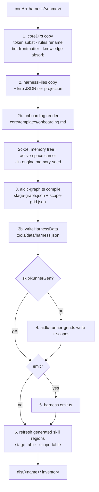

# Packaging Pipeline and Harness Distributions

> **Source**: [awslabs/aidlc-workflows](https://github.com/awslabs/aidlc-workflows/tree/3c3146cfd7cef33020d48e8d48d4e80d0f8c2820) — branch `v2`, commit `3c3146cf` (v2.6.40, retrieved 2026-08-21)
> **Status**: As-built specification derived from the implementation; the upstream code is authoritative over this document.

## 1. Scope

This document specifies how the harness-neutral source tree `core/` is projected into the
committed, per-harness distributions under `dist/`. It covers:

- the packager (`scripts/package.ts`) and the manifest contract it consumes;
- the seven harness manifests and the shape each one emits;
- the eighth `dist/` target, `dist/plugins/`, and what it packages;
- the shared onboarding-document renderer;
- install and shell-upgrade paths available to an existing user workspace;
- the release binary builder.

It does **not** specify what the projected artifacts *mean*. The stage graph is owned by
`01-workflow-model.md` and `02-orchestration-engine.md`; agent personas by `05-agents.md`;
sensors by `06-sensors.md`; hook bodies and adapter semantics by `07-hooks.md`; the memory /
rule layers by `08-memory-rules-learnings.md`; the CLI surface by `09-cli-tools.md`; plugin
composition semantics by `11-plugin-system.md`; the CI wiring that runs the drift guard by
`12-testing-ci.md`. This document describes only how those things are *shaped and delivered*.

Throughout, `dist/` is **generated projection output, never source**. Every observation of a
`dist/` layout below is an observation of a build product; the authority for each is the
manifest row or emit plugin that produced it.

## 2. Inputs, outputs, entry points

| Item | Path | Role |
| --- | --- | --- |
| Packager | `scripts/package.ts` | The build entry; write mode and `--check` drift guard |
| Manifest contract | `scripts/manifest-types.ts` | The `HarnessManifest` type every harness implements |
| Onboarding renderer | `scripts/onboarding.ts` | Renders `core/templates/onboarding.md` per harness |
| Reviewer-knowledge absorber | `scripts/agent-knowledge.ts` | Inlines reviewer checklists into reviewer agent bodies at build time |
| Plugin hook template | `scripts/plugin-hooks-template/` | `compose.ts` (copied into every plugin projection) + `aidlc-plugin-compose.ts` (cursor projections only) |
| Release binaries | `scripts/build-binaries.ts` | `bun build --compile` matrix + smoke gates |
| Docs link rewriter | `scripts/docs-rewrite-links.ts` | CI-only, in-place; not part of `dist/` |
| Harness surfaces | `harness/<name>/` | 7 directories, each with `manifest.ts` |
| Neutral source | `core/` | `agents/ aidlc-common/ hooks/ knowledge/ memory/ scopes/ sensors/ skills/ templates/ tools/` |
| Output | `dist/<name>/` | 7 harness trees + `dist/plugins/` |

Invocation forms, from the packager's own header (`scripts/package.ts:4-7`):

```text
bun scripts/package.ts            regenerate dist/{claude,kiro,kiro-ide,codex}
bun scripts/package.ts --check     total drift guard (exit 1 on any drift)
bun scripts/package.ts <name>      regenerate just one harness
bun scripts/package.ts <name> --check
```

The header comment's list of default targets is stale prose: the default target set is
**discovered**, not hardcoded — `discoverHarnessNames()` scans `harness/` for any directory
carrying a `manifest.ts` and sorts the result (`scripts/package.ts:121-126`), and the CLI uses
that list when no target is named (`scripts/package.ts:1277`). All seven harnesses build by
default. Two further subcommands exist on the same entry point: `package.ts codex trust`
(`scripts/package.ts:884`) and `package.ts plugin build <plugin> <harness> <outDir>`
(`scripts/package.ts:1196`).

`package.json` wires the guard into the repository check: `"check": "bun scripts/package.ts
--check && bun run typecheck && bun run lint"`.

## 3. The manifest contract

`scripts/manifest-types.ts` states the design rule verbatim (`:4-7`):

> A manifest is DATA: how to project the harness-neutral core/ tree into one
> dist/<name>/<harnessDir>/ tree. The only CODE a harness may contribute is an
> optional emit() plugin […] — structural divergence that no declarative row can express.

### 3.1 Field inventory

| Field | Type | Required | Meaning |
| --- | --- | --- | --- |
| `name` | `string` | yes | Matches `dist/<name>/` and `harness/<name>/` |
| `harnessDir` | `string` | yes | Value `{{HARNESS_DIR}}` substitutes to |
| `orchestratorSkillPath` | `string?` | no | Defaults to `<harnessDir>/skills/aidlc/SKILL.md` |
| `tierFlavor` | `"claude" \| "codex" \| "kiro" \| "opencode" \| "copilot" \| "cursor"` | yes | Column of `TIER_PROJECTIONS` this harness's agent surfaces use |
| `coreDirs` | `DirMap[]` | yes | `core/<src>` → `<harnessDir>/<dst>` |
| `harnessFiles` | `FileMap[]` | yes | `harness/<name>/<src>` → dist |
| `frontmatterAdditions` | `Array<{file, lines}>?` | no | Harness-native YAML lines appended to projected `.md` frontmatter |
| `runnerFrontmatterAdditions` | `string[]?` | no | YAML lines appended to every generated runner skill; persisted into `harness.json` |
| `onboarding` | `OnboardingSpec \| null?` | no | How the onboarding doc renders |
| `rulesRename` | `string \| null` | yes | The harness's name for a rules dir: drives the in-prose `<harnessDir>/rules/` rewrite and `harness.json` `rulesSubdir`. No core dir is renamed today — see §4.1 |
| `documentExtractors` | `Record<string,{argv,timeoutMs?}> \| null?` | no | DocumentKB extractor overrides emitted into `harness.json` |
| `skipRunnerGen` | `boolean?` | no | Skip the standard runner-gen step |
| `emit` | `((ctx: EmitContext) => void) \| null` | yes | Optional per-shell emission plugin |
| `plugin` | `{manifestDir, kind}?` | no | Host plugin projection shape |

The three supporting types (`scripts/manifest-types.ts:12`, `:20`, `:27-47`). The declarations
are reproduced verbatim; the per-field JSDoc comments interleaved inside the `EmitContext` and
`OnboardingSpec` ranges are elided here for length:

```ts
export type DirMap = { src: string; dst: string };
export type FileMap = { src: string; dst: string; projectRoot?: boolean };
export type EmitContext = {
  repoRoot: string;
  coreRoot: string;
  harnessRoot: string;
  distRoot: string;
  harnessDir: string;
  substituteToken: (s: string) => string;
  tierCap: "judgment" | "balanced" | "templated" | null;
};
```

and the onboarding spec (`scripts/manifest-types.ts:58-65`):

```ts
export type OnboardingSpec = {
  dst: string;
  projectRoot?: boolean;
  fills: OnboardingFills;
};
```

### 3.2 Contract guards written into the packager

- **`frontmatterAdditions` typo guard.** Every declared file must be produced by the core
  projection exactly once; unmatched entries abort the build with
  `` `[${m.name}] frontmatterAdditions name file(s) the core projection never produced: …` ``
  (`scripts/package.ts:574-580`).
- **`frontmatterAdditions` collision guard.** A key the core file already declares is a hard
  error — `` `frontmatterAdditions: ${file} already declares "${key}:" in core - resolve the
  collision instead of shipping a duplicate key.` `` (`scripts/package.ts:324-329`). A line
  that does not start with a YAML key is likewise rejected (`:317-323`), and a file with no
  leading frontmatter block fails at `:310-314`.
- **`orchestratorSkillPath` containment.** Absolute paths or any `..` segment are refused:
  `` `packager: ${manifest.name} orchestratorSkillPath must stay within its dist root: ${rel}` ``
  (`scripts/package.ts:742-746`); a missing file at the resolved path is also fatal (`:748-752`).
- **`documentExtractors` is packager-owned.** `writeHarnessData()` builds a **fresh** object
  each build (`scripts/package.ts:434-441`), so a hand-added field both fails `--check` and is
  erased on the next build — the contract comment at `scripts/manifest-types.ts:130-131` states
  the `argv` array (never a shell string) rule. No shipped manifest sets `documentExtractors`
  today.

## 4. The packaging pipeline

`buildTree(m, outRoot, seedFrom)` (`scripts/package.ts:536-697`) is the whole pipeline; both
write mode and check mode call it, differing only in `outRoot`.



Text fallback: the packager copies core dirs, then authored harness files, renders the
onboarding doc, emits the workspace memory tree plus the active-space cursor plus an
in-engine memory seed, compiles the stage graph into the assembled tree, writes
`tools/data/harness.json`, generates runner skills unless the manifest opts out, calls the
harness `emit()` plugin if one exists, and finally refreshes the generated table regions in
the orchestrator skill. `buildTree` returns the full file inventory rooted at `outRoot`.

### 4.1 Step 1 — core directory projection

For every `{src, dst}` in `coreDirs`, the packager walks `core/<src>` in sorted order
(`scripts/package.ts:335-341` `walk()`) and writes `<harnessDir>/<dst>/<rel>`. When
`rulesRename` is set and `dst === "rules"`, the destination becomes the renamed dir
(`scripts/package.ts:554`). Each file passes through `transform()` (see §5), then through
`applyFrontmatterAdditions()` if the manifest names that harness-relative output path.

Two branches on this path are **dead against the shipped manifests**. `core/rules/` does not
exist (`ls -d core/*/` →
`agents aidlc-common hooks knowledge memory scopes sensors skills templates tools`), and a
missing source dir is skipped outright (`if (!existsSync(srcDir)) continue;`, `:553`); the only
`{ src: "rules", … }` row in the repository is codex's, whose `dst` is `aidlc-rules`, so even
the `dst === "rules"` rename at `:554` never fires. Both survive as forward-compatibility seams,
not as delivered behaviour.

### 4.2 Step 2 — authored harness surfaces

`harnessFiles` are copied from `harness/<name>/<src>` with the same `transform()`.
`projectRoot: true` routes the output to the dist tree root (beside the harness dir) instead
of inside it (`scripts/package.ts:592`). Two additional projections apply only when
`tierFlavor === "kiro"` (`scripts/package.ts:595-601`):

- `agents/*.json` → `projectKiroAgentJson()` (`:234-249`): reads the `tier:` from the
  same-named `core/agents/<slug>.md`, projects it, sets or deletes the `model` key, and
  re-serializes canonically (2-space indent, trailing newline). Authored Kiro agent JSONs
  carry **no** `model` field at all, so nobody edits a value the build overwrites.
- `settings/cli.json` → `projectKiroCliJson()` (`:257-265`): merges tier-derived
  `chat.modelDefaults` entries; authored entries win on collision. `KIRO_TIER_EFFORT` is
  empty today (`core/tools/aidlc-tiers.ts:161`), so the merge is a no-op and the shipped
  `dist/kiro/.kiro/settings/cli.json` is byte-identical to the authored file.

### 4.3 Steps 2b–2e — onboarding, memory, cursor, memory-seed

- **2b Onboarding** (`scripts/package.ts:610-616`): renders `core/templates/onboarding.md`
  through `renderOnboarding()` with the manifest's fills, then runs the result through the
  same `transform()` as any core `.md`.
- **2c Memory** (`emitMemory`, `:456-470`): copies `core/memory/` verbatim (with the standard
  `.md` transform, a no-op on these neutral files) to `dist/<name>/aidlc/spaces/default/memory/`
  — the constants are `MEMORY_SRC = "memory"` and `MEMORY_DST = join("aidlc","spaces","default","memory")`
  (`:396-397`). The destination sits at the **workspace root**, outside `<harnessDir>`, so the
  method tree is a sibling of the engine dir on every harness. This must run before compile,
  because compile resolves `rules_in_context` from it.
- **2d Active-space cursor** (`emitActiveSpace`, `:503-507`): writes
  `dist/<name>/aidlc/active-space` containing `"default\n"` (`:422-423`). The shipped
  `.gitignore` ignores this path for the end user while the upstream repo commits the shipped
  pointer (`:413-421`).
- **2e Memory seed** (`emitMemorySeed`, `:479-493`): writes the *same* `core/memory/` content a
  second time into `<harnessDir>/tools/data/memory-seed/` (`MEMORY_SEED_DST`, `:408`). This is
  the engine-only-install self-heal source; see §10.3.

### 4.4 Step 3 — graph compile into the assembled tree

`seedCompiledData()` (`:517-527`) copies the two committed compiled-data files —
`COMPILED_DATA = ["tools/data/stage-graph.json", "tools/data/scope-grid.json"]` (`:377`) —
into the assembled tree before compiling, because `compileStageGraph()` bootstraps each
stage's number and name from the existing JSON (the "computed-not-authored" seed contract).
If the seed tree lacks them (a harness's first build), the packager falls back to the
committed Claude tree as the canonical seed-of-record (`:517-521`, `:831`).

Compile then runs as an in-tree tool via `runTool()` (`:705-734`), which sets four environment
seams: `AIDLC_SRC` (the assembled tree), `AIDLC_HARNESS_DIR`, `AIDLC_HARNESS_NAME`, and —
when a rules dir is supplied — `AIDLC_RULES_DIR` pointed at the emitted memory tree
(`:714-720`). A non-zero exit from any in-tree tool aborts the whole build with
`` `packager: \`bun ${args.join(" ")}\` failed in ${treeRoot}` `` (`:728`).

For rename-rules harnesses, `renameRulesInCompiledData()` (`:802-810`) runs as a
defense-in-depth backstop over the compiled JSON path strings; it is a guarded no-op today
because compile already emits the renamed segment.

### 4.5 Step 3b — `tools/data/harness.json`

The packager-emitted harness descriptor (`writeHarnessData`, `:429-448`) is the runtime's
open-set source of truth for the rules subdirectory:

```json
{ "name": …, "harnessDir": …, "rulesSubdir": <rulesRename ?? "rules">,
  "runnerFrontmatterAdditions"?: [...], "documentExtractors"?: {...} }
```

The runtime reader is `readShippedHarnessData()` in `core/tools/aidlc-lib.ts:251-405`, which
validates `runnerFrontmatterAdditions` as an array of YAML key lines
(`core/tools/aidlc-lib.ts:373-386`) and tolerates a `plugins` key the packager never writes —
that field is added to an *installed* tree by plugin selection, not by the build.

Observed shipped values: `dist/claude/.claude/tools/data/harness.json` has
`"rulesSubdir": "rules"`; `dist/kiro/.kiro/tools/data/harness.json` has `"rulesSubdir": "steering"`;
`dist/cursor/.cursor/tools/data/harness.json` additionally carries
`"runnerFrontmatterAdditions": ["disable-model-invocation: true"]`.

### 4.6 Step 4 — runner generation

Unless `skipRunnerGen` is set, the packager composes `aidlc-runner-gen.ts` from the assembled
tree twice: `write` (stage runners, `aidlc-init`, `aidlc-compose`) and `scopes` (the default
scope-runner batch) — `scripts/package.ts:672-675`. Runner content and naming are owned by
`09-cli-tools.md` / `17-skill-system`; from a packaging standpoint the load-bearing fact is
that the generator runs **inside the dist tree** under `AIDLC_HARNESS_DIR`, so generated prose
names the correct directory, and that `runnerFrontmatterAdditions` reaches it through
`harness.json` rather than through a packager argument.

The scope-runner set is `defaultScopeBatch()` — the discovered scopes whose frontmatter carries
`runner: true` (`core/tools/aidlc-runner-gen.ts:577-581`). Five core scopes qualify:
`aidlc-bugfix`, `aidlc-express`, `aidlc-feature`, `aidlc-mvp`, `aidlc-security-patch`. The
stage-runner set is every non-`initialization` stage (`core/tools/aidlc-runner-gen.ts:100-111`),
30 of the 33 compiled stages.

### 4.7 Step 5 — `emit()`

Three of seven harnesses ship an `emit.ts` (codex, copilot, opencode). Each receives the
`EmitContext` and always writes into `ctx.distRoot`; under `--check` that root is a temporary
directory (`scripts/package.ts:680-690`). All three clean-sweep their owned subtree
(`rmSync`) before writing, so a removed runner or persona cannot linger: codex sweeps
`.agents/skills/` (`harness/codex/emit.ts:450`), copilot sweeps the whole `.github/` shell
(`harness/copilot/emit.ts:218`), opencode sweeps `.opencode/` (`harness/opencode/emit.ts:160`).

`tierCap` is passed through explicitly so emit-owned projections use the same pack-time cap as
every declarative projection; the contract comment states the plugin "must not re-resolve it"
(`scripts/manifest-types.ts:41-46`).

### 4.8 Step 6 — generated skill regions

After emit (because codex and copilot place the orchestrator skill outside `<harnessDir>/skills/`),
`refreshGeneratedSkillRegions()` (`:756-793`) replaces two marked regions in the assembled
orchestrator skill with freshly rendered tables. The markers are verbatim
(`scripts/package.ts:103-114`):

```text
<!-- BEGIN: compiled stage graph via `bun aidlc-utility.ts stage-table` - do NOT hand-edit -->
<!-- END: compiled stage graph -->
<!-- BEGIN: compiled scope grid via `bun aidlc-utility.ts scope-table` - do NOT hand-edit -->
<!-- END: compiled scope grid -->
```

A region whose markers are absent is skipped; malformed markers (one side missing, reversed
order, or duplicated) abort with `` `packager: malformed ${region.verb} markers in ${skillPath}` ``
(`:781-785`).

## 5. The transform class

`transform()` (`scripts/package.ts:267-298`) applies, in order, to `.md` files only —
`.json` and `.ts` are copied byte-for-byte:

1. **Reviewer-knowledge absorption** first, on the raw core text, so absorbed prose is covered
   by the substitution that follows (`:277-279`). `absorbReviewerKnowledge()`
   (`scripts/agent-knowledge.ts:67-88`) appends each `knowledge/<agent>/*.md` file to the agent
   body under a generated header naming the authored source. The reviewer set is **derived**
   from stage frontmatter `reviewer:` lines across core and plugin stages, not hardcoded
   (`scripts/agent-knowledge.ts:33-58`).
2. **Harness-dir token substitution** — `{{HARNESS_DIR}}` → the manifest's `harnessDir`
   (`scripts/package.ts:102`, `:133-135`). The packager's own header calls this "THE TRANSFORM
   CLASS (T5 — the only permitted text transform)" (`:27-31`).
3. **Rules rename** — `applyRulesRename()` rewrites in-prose `<harnessDir>/rules/` →
   `<harnessDir>/<rulesRename>/`, anchored on the post-substitution harness-dir form so it
   cannot touch an unrelated `rules/` mention (`:142-145`). No-op when `rulesRename` is null.
4. **Tier frontmatter projection** — `projectTierFrontmatter()` (`:175-207`) applies only to
   paths containing `/agents/` and ending `-agent.md`. It reads the authored `tier:` from the
   YAML block (`agentTierFromMd`, `:152-164`; a missing frontmatter block or missing `tier:`
   line is a hard build failure), projects it through `projectTier(tier, harness, TIER_CAP)`,
   and replaces the `tier:` line with the harness-native keys. A `null` projected value means
   the key is **omitted** — the harness's own session default applies. When every key is
   omitted, the `tier:` line is dropped with no replacement.
5. **Cursor persona memory pinning** — for cursor agent bodies only, the mutable
   `aidlc/spaces/<active-space>/memory/` pointer is pinned to `aidlc/spaces/default/memory/`
   so the first startup's re-point is byte-identical (`:286-294`).

Observed effect on `core/agents/aidlc-developer-agent.md` (authored `tier: judgment`):
`dist/claude/.claude/agents/aidlc-developer-agent.md` carries `model: inherit`;
`dist/kiro-ide/.kiro/agents/aidlc-developer-agent.md` has the `tier:` line removed entirely and
`tools: ["read", "write", "shell"]` appended by `frontmatterAdditions`.

A separate, narrower transform exists for cursor **plugin** agents:
`projectCursorPluginAgent()` strips `model|tier|effort|variant` lines and substitutes the token
to `.cursor` (`scripts/package.ts:209-220`).

## 6. Check mode and reproducibility

### 6.1 Mechanism

`checkHarness(name)` (`scripts/package.ts:855-874`) builds the tree into a fresh
`mkdtempSync` directory, seeding compile from the untouched committed tree, and byte-diffs the
result against `dist/<name>/`. The diff walks the **whole distribution root**, not just
`<harnessDir>`, so project-root onboarding and config files are in the same bidirectional
contract and removed/renamed outputs surface as orphans (`:864-868`).

`diffTrees()` (`:349-373`) is the single shared walk used by both the harness and plugin guards.
Its three problem strings are verbatim:

```text
MISSING in dist: <prefix>/<rel>
DIFFERS: <prefix>/<rel>
ORPHAN in dist: <prefix>/<rel>
```

Terminal output on failure is `` `\npackage --check FAILED (${problems.length} problem(s)):` ``
followed by at most 40 problem lines, then `process.exit(1)` (`:1292-1296`); on success,
`package --check: all harness trees in sync with core/ + harness/.` (`:1297`).

### 6.2 Reproducibility rules

- **Tier cap is mode-sensitive.** `AIDLC_TIER_CAP` is read only in write mode; under `--check`
  it is ignored so a stray cap in a CI environment cannot fail or mask drift
  (`scripts/package.ts:82-99`). The persistent `tier_cap:` frontmatter key in `core/memory/`
  travels with the repo and therefore applies in both modes. When a cap is active the packager
  logs it to **stderr**, not stdout, because the `codex trust` subcommand's stdout is pasted
  verbatim into a `config.toml` (`:88-93`).
- **`codex trust` skips cap resolution entirely** — it performs no projection, so a malformed
  cap must not break an installer command that never uses it (`:79-85`).
- **The compiled-data seed is the only authored datum** in `stage-graph.json` /
  `scope-grid.json`; compile re-derives every other field and reproduces the committed JSON
  byte-for-byte (`:637-645`).
- **Canonical re-serialization.** Kiro agent JSONs are re-emitted through
  `JSON.stringify(parsed, null, 2)` plus a trailing newline; the comment is explicit that "the
  dist form is the stringify form, byte-stable under `--check`, not the authored bytes"
  (`:245-248`).
- **Write mode clean-sweeps** the whole `dist/<name>/` root so removed or renamed project-root
  outputs cannot linger, after stashing the compiled-data seed into a temp dir
  (`writeHarness`, `:820-850`).
- **Named vs. whole-repo check.** `checkPlugins(targets, !named)` passes `full = false` for a
  single-harness check, suppressing the top-level orphan sweep (`:1291`, `:1151-1189`).

## 7. Harness distributions

Seven manifests, seven `dist/` harness trees. `dist/` also holds the eighth target,
`dist/plugins/` (§8), and a checked-in PDF (`dist/AI-DLC Workflows 2.0 Specification.pdf`)
that the packager neither reads nor writes.

| Harness | `harnessDir` | `tierFlavor` | `rulesRename` | `emit` | `skipRunnerGen` | Orchestrator skill path | Onboarding doc | Plugin projection | dist files |
| --- | --- | --- | --- | --- | --- | --- | --- | --- | ---: |
| `claude` | `.claude` | claude | – | – | – | `.claude/skills/aidlc/SKILL.md` | `.claude/CLAUDE.md` | `.claude-plugin` (default), store | 262 |
| `codex` | `.codex` | codex | `aidlc-rules` | yes | yes | `.agents/skills/aidlc/SKILL.md` | root `AGENTS.md` (via emit) | `.codex-plugin` (default), store | 318 |
| `copilot` | `.aidlc` | copilot | – | yes | yes | `.github/skills/aidlc/SKILL.md` | root `AGENTS.md` | `.plugin`, store | 274 |
| `cursor` | `.cursor` | cursor | – | – | – | `.cursor/skills/aidlc/SKILL.md` | root `AGENTS.md` | `.cursor-plugin`, cursor | 270 |
| `kiro` | `.kiro` | kiro | `steering` | – | – | `.kiro/skills/aidlc/SKILL.md` | root `AGENTS.md` | `.kiro-plugin`, kiro | 276 |
| `kiro-ide` | `.kiro` | kiro | `steering` | – | – | `.kiro/skills/aidlc/SKILL.md` | root `AGENTS.md` | `.kiro-plugin`, kiro | 293 |
| `opencode` | `.aidlc` | opencode | – | yes | – | `.aidlc/skills/aidlc/SKILL.md` | root `AGENTS.md` | `.opencode-plugin`, store | 275 |

Two harnesses share `.aidlc` (copilot and opencode) and two share `.kiro` (kiro CLI and
kiro-ide). Runtime disambiguation is by `tools/data/harness.json` `name`, with directory-based
fallbacks only when that metadata is unavailable (`core/tools/aidlc-runtime-paths.ts:72-96`,
including the comment "Copilot and OpenCode intentionally share .aidlc").

Every harness declares the same seven base core dir rows: `tools`, `aidlc-common`, `knowledge`,
`sensors`, `scopes`, `agents`, `hooks`. Harnesses that keep skills in-tree (claude, cursor,
kiro, kiro-ide, opencode) add the four standalone skill dirs `skills/aidlc-session-cost`,
`skills/aidlc-replay`, `skills/aidlc-outcomes-pack`, `skills/aidlc-knowledge`, for eleven rows;
copilot declares the seven base rows only. Codex is the one exception to the count: it declares
eight rows — the seven base rows plus `{ src: "rules", dst: "aidlc-rules" }`
(`harness/codex/manifest.ts:34`), which is a **dead row** because `core/rules/` does not exist
and `buildTree()` skips a missing source (`if (!existsSync(srcDir)) continue;`,
`scripts/package.ts:553`); see §7.2. `core/memory/` is deliberately **not** a core dir on any
manifest — it relocated to the workspace root and is emitted by step 2c
(`harness/claude/manifest.ts:25-30`).

### 7.1 claude

Delivered layout: `dist/claude/.claude/` (engine) + `dist/claude/aidlc/` (workspace shell) +
project-root `.mcp.json` and `.gitignore`.

Native mechanisms: skills at `.claude/skills/` (42 directories: orchestrator, 30 stage runners,
`aidlc-init`, `aidlc-compose`, 5 scope runners, 4 standalone skills); agents as flat `.md` in
`.claude/agents/`; hooks as the core `.ts` bodies in `.claude/hooks/` with no adapter shim; rules
as a single `@`-import stub at `.claude/rules/aidlc.md`. The stub is the only file in that
directory — `rules/` is not a core projection here (`harness/claude/manifest.ts:51-55`).

Adapter mechanism: **none**. Claude is described in the manifest header as "a peer harness, not
the identity transform": its prose carries the same `{{HARNESS_DIR}}` token as every other
harness and the substitution restores the `.claude/` literals
(`harness/claude/manifest.ts:9-13`).

Onboarding: `onboarding: { dst: "CLAUDE.md", fills }` with no `projectRoot`, so the rendered
doc lands **inside** the engine dir at `dist/claude/.claude/CLAUDE.md`
(`harness/claude/manifest.ts:73`). Its first line is the method `@`-import
(`harness/claude/onboarding.fills.ts:10`), the first hop of a reference chain to
`aidlc/spaces/default/memory/*.md`.

Install entry: `cp -r dist/claude/.claude/ <project>/.claude/` plus
`cp -r dist/claude/aidlc/ <project>/aidlc/` (`README.md:200-201`). The `aidlc/` sibling is
required: `--doctor`'s "workspace shell ready" check fails without it.

Additional authored surfaces: `.claude/settings.json`, `.claude/settings.local.json.example`,
`.mcp.json` (project root — the Claude MCP-server registry; other harnesses ship none).

### 7.2 codex

Delivered layout: `dist/codex/.codex/` (engine) + `dist/codex/.agents/skills/` (the entire skill
set) + `dist/codex/aidlc/` + root `AGENTS.md` and `.gitignore`.

Native mechanisms: skills at `.agents/skills/` — Codex discovers project skills there, never in
`.codex/skills/`, so the manifest sets `skipRunnerGen: true` and `emit()` composes the whole set
(`harness/codex/manifest.ts:11-14`, `:57-58`). Agents are 14 TOML transpositions in
`.codex/agents/`; the persona `.md` files still ship under `.codex/agents/` as core prose the
conductor reads. Rules: the manifest carries a `{ src: "rules", dst: "aidlc-rules" }` core dir
row (`harness/codex/manifest.ts:34`) — the only such row in the repository
(`grep -n 'src: "rules"' harness/*/manifest.ts` matches codex alone) — whose intent is to keep
`.codex/rules/` free for Codex's native Starlark permission-rules directory. **The row is dead
and nothing is delivered through it**: `core/rules/` does not exist (`ls -d core/*/` →
`agents aidlc-common hooks knowledge memory scopes sensors skills templates tools`) and
`buildTree()` skips a missing source (`if (!existsSync(srcDir)) continue;`,
`scripts/package.ts:553`), so `find dist/codex -name aidlc-rules | wc -l` → `0`. The only rules
file that ships is the emit-written `.codex/rules/default.rules`
(`harness/codex/emit.ts:134-150`); `ls dist/codex/.codex/` →
`agents aidlc-common config.toml hooks hooks.json knowledge rules scopes sensors tools trust-seed.toml`.

Adapter mechanism: one authored stdin shim, `.codex/hooks/aidlc-codex-adapter.ts` (614 lines),
invoked as `` `bun ${harnessDir}/hooks/aidlc-codex-adapter.ts ${target}` `` from a generated
`.codex/hooks.json` (`harness/codex/emit.ts:56-70`). The wiring table has 13 rows across
`SessionStart`, `UserPromptSubmit`, five `PreToolUse` registrations (one matched on
`spawn_agent`), three `PostToolUse` registrations (matched on `apply_patch`, `update_plan`,
`Bash`), `PreCompact`, `SubagentStop`, and `Stop` (`harness/codex/emit.ts:32-54`).

Emit-owned outputs (`harness/codex/emit.ts:388-445`): `.codex/hooks.json`, `.codex/config.toml`
(Bedrock provider defaults, `AIDLC_RULES_DIR` shell-environment seam, `sandbox_mode =
"workspace-write"`, the `request_user_input` feature flags, and the TUI status line),
`.codex/rules/default.rules`, `.codex/trust-seed.toml`, root `AGENTS.md`, 14 agent TOMLs, and
the `.agents/skills/` tree. Every **generated or copied** skill also gets an
`agents/openai.yaml` containing the implicit-invocation guard
`"policy:\n  allow_implicit_invocation: false\n"` (`IMPLICIT_GUARD`, `harness/codex/emit.ts:362`)
— the stage-runner loop (`:417-421`), the `aidlc-init` / `aidlc-compose` pushes (`:422-425`),
the scope-runner loop (`:427-432`) and the standalone-skill loop (`:437-445`) each push one.
The **authored orchestrator shell is the single exception**: the loop that pushes
`skills/aidlc/SKILL.md` and `question-rendering.md` verbatim (`:409-415`) pushes no
`agents/openai.yaml`. So 41 of the 42 emitted skills carry the guard
(`find dist/codex/.agents/skills -name openai.yaml | wc -l` → `41`;
`ls dist/codex/.agents/skills/aidlc/` → `question-rendering.md SKILL.md` only).

Two prose rewrites are codex-specific and worth naming: `rewriteProse()` substitutes the token
then renames `rules/` → `aidlc-rules/` (`:283-284`); `emitAgentsMd()` additionally uses a
negative lookahead so `.codex/rules/default.rules` is **not** renamed, and redirects
`<harnessDir>/skills/` → `.agents/skills/` (`:294-309`). Persona bodies get their
harness-neutral `maxTurns:` self-citation rewritten, because Codex TOML personas carry no
frontmatter at all (`:339-344`).

Hook trust: `trustEntries()` (`:190-215`) computes, per wiring row, a
`sha256:`-prefixed hash over a canonical JSON identity
`{event_name, hooks:[{async:false, command, timeout:600, type:"command"}]}` (`:155-173`), keyed
`"<abs hooks.json path>:<event_snake>:<group>:<idx>"`. `.codex/trust-seed.toml` is the template
form with `<PROJECT_DIR>`; `bun scripts/package.ts codex trust --project <abs-dir>
[--hooks-json <abs-path>]` prints substituted, ready-to-paste entries
(`scripts/package.ts:884-928`). That subcommand validates each path is fully qualified on
either platform (`:892-898`) and rejects repeated flags.

Install entry: copy `.codex/`, `.agents/`, `aidlc/`, and `AGENTS.md` (`README.md:232-235`) into
a project that **must be a git repository** — "Codex only discovers a project
`.codex/hooks.json` inside one" (`README.md:229`).

### 7.3 copilot

Delivered layout: `dist/copilot/.aidlc/` (engine) + `dist/copilot/.github/` (the natively
consumed shell) + `dist/copilot/aidlc/` + root `AGENTS.md` and `.gitignore`.

Native mechanisms: one distribution serves both Copilot surfaces — CLI ≥ 1.0.74 and VS Code
agent mode ≥ 1.130 — because both read `.github/skills/`, `.github/agents/`, `.github/hooks/`,
and the root `AGENTS.md` identically (`harness/copilot/manifest.ts:5-8`). The engine ships at
`.aidlc/` and **not** `.copilot` or `.github`, because project-level `.copilot/` is not a
documented discovery root and `.github/` is shared with real repository content that the engine
tree cannot own (`harness/copilot/manifest.ts:20-26`). `skipRunnerGen: true`; the manifest
declares no `skills/` core dir at all.

Adapter mechanism: `.aidlc/hooks/aidlc-copilot-adapter.ts` (1338 lines), wired from
`.github/hooks/aidlc.json` in a `{"version": 1}` envelope with PascalCase event names and both
`bash` and `powershell` command spellings per row
(`harness/copilot/emit.ts:52-62`). The wiring is **matcher-free** — VS Code parses but ignores
matchers, so every adapter target self-filters (`:8-11`). Eight rows:
`SessionStart`, `UserPromptSubmit`, `PreToolUse` (`guard-tool-call`), `PostToolUse`
(`post-tool`), `PreCompact`, `SubagentStart`, `SubagentStop`, `Stop` (60 s timeout; the rest
30 s). `SessionEnd` is deliberately absent because VS Code does not accept it; SESSION_ENDED is
reconciled on the next SessionStart (`harness/copilot/emit.ts:38-39`).

Agent projection: the 14 personas are re-emitted into `.github/agents/` with the `tier:` line
dropped (the copilot tier column is model-omitted by type — `core/tools/aidlc-tiers.ts:104-105`)
and the core `disallowedTools: Task` denial replaced by a supported allowlist
`tools: ["read", "edit", "search", "execute", "web", "todo"]`
(`harness/copilot/emit.ts:71`, `:89-98`). A `disallowedTools` value that is not exactly `Task`
fails the build rather than shipping an unenforced denial (`:84-88`).

The packager renders `AGENTS.md` before `emit()` runs, so emit rewrites
`<harnessDir>/skills/` → `.github/skills/` in place (`harness/copilot/emit.ts:143-153`).

Install entry: copy `.aidlc/`, `aidlc/`, `AGENTS.md`; **merge** `.github/`
(`README.md:64`). The emit header states the merge contract: in the dist tree `.github/` is
wholly AIDLC-owned and clean-swept for `--check` parity, but a user's `.github/` is shared, so
every emission is `aidlc`-prefixed and the install merges rather than replaces
(`harness/copilot/emit.ts:23-27`).

### 7.4 cursor

Delivered layout: `dist/cursor/.cursor/` + `dist/cursor/aidlc/` + root `AGENTS.md`,
`.gitignore`, and `install.ts`.

Native mechanisms: the manifest header calls Cursor "the most 'native' port so far"
(`harness/cursor/manifest.ts:3-4`) — it consumes the standard projection directly with
**no `emit.ts`** (`harness/cursor/manifest.ts:5-6`). Skills live at `.cursor/skills/<name>/SKILL.md` (45
directories: the 42 standard ones plus three authored shortcuts `aidlc-status`, `aidlc-jump`,
`aidlc-scope`). The 14 core persona `.md` files in `.cursor/agents/` are live native subagents —
Cursor's agent frontmatter is a subset of core's and unknown keys are tolerated, so no emitted
twins are needed (`harness/cursor/manifest.ts:16-21`).

Rules: Cursor loads **only** `.mdc` files with frontmatter from `.cursor/rules/`, and `@`-import
lines do not expand. The method include is therefore split into five authored `.mdc` files —
`rules/aidlc.mdc` (always-on org/team/project) plus four agent-decided phase pointers
`aidlc-phase-{ideation,inception,construction,operation}.mdc`
(`harness/cursor/manifest.ts:25-31`, `:72-76`). Each carries an explicit READ instruction naming
the active-space file rather than an import.

Adapter mechanism: `.cursor/hooks/aidlc-cursor-adapter.ts` (952 lines) wired from an authored
`.cursor/hooks.json` with camelCase events: `sessionStart`, `sessionEnd`, `beforeSubmitPrompt`,
`preToolUse` (`failClosed: true`), two `postToolUse` commands, `postToolUseFailure`,
`preCompact`, and `stop` (`loop_limit: 10`). The adapter normalizes Cursor payloads to the
`ClaudeCodeHookInput` shape and subprocess-pipes into the byte-shared core hooks
(`harness/cursor/hooks/aidlc-cursor-adapter.ts:2-6`).

Runner safety: `runnerFrontmatterAdditions: ["disable-model-invocation: true"]` — Cursor
otherwise lets the model auto-activate a relevant skill even when user-invocable, which the
manifest calls "unsafe for state-mutating stage runners" (`harness/cursor/manifest.ts:100-103`).

`.cursor/cli.json` is shipped as the only project-level CLI config Cursor reads (permissions
only), pre-approving `bun` so the forwarding loop is not interrupted per engine call
(`harness/cursor/manifest.ts:81-85`).

Install entry: `bun dist/cursor/install.ts <project>` — a distribution-local, non-destructive
installer routed to the dist root by `projectRoot: true` (`harness/cursor/manifest.ts:87-89`).
See §10.1.

### 7.5 kiro (CLI)

Delivered layout: `dist/kiro/.kiro/` + `dist/kiro/aidlc/` + root `AGENTS.md` and `.gitignore`.

Native mechanisms: the manifest sets `rulesRename: "steering"` (`harness/kiro/manifest.ts:89`)
because Kiro auto-loads steering — the header comment reads "rules/ → steering/ (Kiro auto-loads
steering; rules ARE the always-on layer)" (`harness/kiro/manifest.ts:10-11`). That field is a
**prose rewrite only**, not a projection: `applyRulesRename()` rewrites `<harnessDir>/rules/` →
`<harnessDir>/steering/` inside copied `.md` text (`scripts/package.ts:142-145`) and supplies
the `rulesSubdir` value in `harness.json`. No steering **directory** is projected or delivered —
the manifest declares no `{ src: "rules", … }` core dir row (its `coreDirs` are at `:31-43`),
`core/rules/` does not exist, and `find dist/kiro -name steering | wc -l` → `0`
(`ls dist/kiro/.kiro/` → `agents aidlc-common hooks knowledge scopes sensors settings skills tools`).

The `agents/` directory is **mixed**: the 14 persona `.md` files come from core, while 15
Kiro-native agent JSON configs (14 personas plus the `aidlc.json` orchestrator) are authored
harness files. The `hooks/` directory is likewise mixed: core hook bodies plus one authored
adapter. **No `.kiro.hook` file ships in the `dist/kiro/` harness tree** (a plugin projection
under `dist/plugins/` is a separate tree and does carry one — see the plugin bullet below) —
`find dist/kiro -name '*.kiro.hook' | wc -l` → `0`, and all 18 files under
`dist/kiro/.kiro/hooks/` are `.ts`. The seven authored `harness/kiro/hooks/*.kiro.hook` files
are never projected: `harnessFiles` declares only `hooks/aidlc-kiro-adapter.ts`
(`harness/kiro/manifest.ts:48-79`) and `core/hooks/` contains no `.kiro.hook`. Hook wiring for
the CLI harness runs entirely through the `hooks` object inside `agents/aidlc.json`, which
registers adapter commands directly (`"bun .kiro/hooks/aidlc-kiro-adapter.ts session-start"`,
… — `harness/kiro/agents/aidlc.json:62-70`); the harness split is stated verbatim at
`harness/kiro-ide/manifest.ts:18-20`: "The CLI harness relies on agent JSON hooks (the `hooks`
object inside aidlc.json); the IDE harness relies on hooks/aidlc-*.json v2 hook files". The
legacy `.kiro.hook` files ship in the **kiro-ide** distribution only (§7.6).

Adapter mechanism: `.kiro/hooks/aidlc-kiro-adapter.ts` (935 lines), the stdin shim.

Settings: `settings/cli.json` (`chat.defaultAgent: "aidlc"` plus `chat.modelDefaults`) and
`settings/mcp.json`.

Onboarding: `AGENTS.md` at the project root (`projectRoot: true`), rendered from the shared
skeleton with the `{{HARNESS_DIR}}` → `.kiro` substitution and the `rules/` → `steering/` rename
applied like any core `.md` (`harness/kiro/manifest.ts:81-86`).

Install entry: copy `.kiro/`, `aidlc/`, and `AGENTS.md` (`README.md:59`).

Plugin projection: `{ manifestDir: ".kiro-plugin", kind: "kiro" }` — Kiro has no host plugin
store, so plugins arrive by folder-drop plus a `.kiro.hook` that composes on first interaction
(`harness/kiro/manifest.ts:94-97`).

### 7.6 kiro-ide

Delivered layout: identical directory shape to kiro CLI — `dist/kiro-ide/.kiro/` +
`dist/kiro-ide/aidlc/` + root `AGENTS.md` and `.gitignore` — plus
`.kiro/steering/aidlc-active-memory.md`.

Differences from the CLI harness, verbatim from the manifest header
(`harness/kiro-ide/manifest.ts:3-16`): it ships v2 hook JSON files (the
`{"version":"v1","hooks":[…]}` schema with PascalCase triggers) for IDE ≥ 1.0.1xx **plus** the
legacy `.kiro.hook` files for pre-1.0 builds; `aidlc.json` omits the `hooks` field; it ships an
always-included IDE steering file that preloads the active-space memory tree; and it injects a
`tools:` frontmatter grant into the delegation-target agent `.md` files.

Counts observed in the authored tree: 8 `*.json` hook registrations and 9 `*.kiro.hook` legacy
files. `aidlc-session-end` is intentionally **not** registered in v2 form, because the IDE's
`Stop` trigger fires at the end of every assistant turn rather than at conversation close and
would append a spurious `SESSION_ENDED` between prompts (`harness/kiro-ide/manifest.ts:76-79`).

`frontmatterAdditions` carries 14 rows, each adding `tools: ["read", "write", "shell"]` to one
persona `.md` (`harness/kiro-ide/manifest.ts:123-138`). The rationale is field-proven: the IDE
resolves a delegated subagent's tool grants from the agent `.md` frontmatter, not from the
agent-v1 JSON the CLI reads, so without the injected line an IDE delegate runs toolless
(`scripts/manifest-types.ts:98-102`). The manifest is explicit that this grant is **unscoped** —
wider than the CLI JSON sandbox — and that a delegation tool must never be granted here
(`harness/kiro-ide/manifest.ts:113-122`).

Adapter mechanism: `.kiro/hooks/aidlc-kiro-adapter.ts` (743 lines), projected from
`harness/kiro-ide/manifest.ts:70`. Despite the shared filename this is **not** the kiro CLI
adapter: each harness authors its own copy, and the IDE's is 743 lines against the CLI's 935
(`wc -l harness/kiro-ide/hooks/aidlc-kiro-adapter.ts harness/kiro/hooks/aidlc-kiro-adapter.ts`
→ `743`, `935`; the two `dist/` copies match their sources line for line).

Install entry: copy `.kiro/`, `aidlc/`, and `AGENTS.md` (`README.md:58`).

### 7.7 opencode

Delivered layout: `dist/opencode/.aidlc/` (engine) + `dist/opencode/.opencode/` (the only dir
opencode reads) + `dist/opencode/aidlc/` + root `AGENTS.md`, `opencode.json`, `.gitignore`.

Why the engine is not inside `.opencode/`: opencode auto-imports every `*.ts` under
`.opencode/tools/` and `.opencode/tool/` as a custom tool definition, and importing a CLI-style
script crashes the session (live-reproduced) — so the engine ships at `.aidlc/`, which opencode
never scans (`harness/opencode/emit.ts:14-19`).

Native mechanisms, all emit-owned (`harness/opencode/emit.ts:103-165`):
`.opencode/agents/aidlc-*-agent.md` (14 native subagents), `.opencode/command/aidlc.md` (the
`/aidlc` entry, authored), and `.opencode/plugin/aidlc-opencode-adapter.ts` (the
auto-discovered plugin seam mapping opencode hook moments onto the core hook bodies). This is
the one adapter whose delivered copy differs from its source — 720 lines at
`dist/opencode/.opencode/plugin/aidlc-opencode-adapter.ts` against 661 authored at
`harness/opencode/plugin/aidlc-opencode-adapter.ts` — because `embedShippedEntrypoints()`
expands the entrypoint marker at emit time (see below). The other five adapters (codex,
copilot, cursor, kiro, kiro-ide) ship byte-identical to source (`cmp` on each pair, exit 0).

Agent projection (`emitSubagentMd`, `:36-73`): the `tier:` line becomes opencode's native
`model:` / `variant:` keys plus an added `mode: subagent` so none registers as a primary agent;
`disallowedTools` becomes the native permission map `permission:` / `task: deny`; and core's
harness-neutral `maxTurns: <n>` is renamed to opencode's native `steps: <n>` in both frontmatter
and body prose. Unknown disallowed tools fail the build (`:44-48`).

Adapter self-description: `embedShippedEntrypoints()` (`:83-101`) replaces the literal marker
`/* @aidlc-shipped-entrypoints@ */ []` in the adapter source with the sorted list of shipped
`hooks/*.ts` and `tools/*.ts` filenames; a missing marker aborts with "opencode adapter is
missing its shipped-entrypoint emission marker."

`opencode.json` (project root, authored) registers `"skills": { "paths": [".aidlc/skills"] }`,
the method include `"instructions": ["aidlc/spaces/default/memory/**/*.md"]`, and bash/edit
permissions scoped to `.aidlc/tools/**` and `.aidlc/hooks/**`.

Note that unlike codex and copilot, opencode does **not** set `skipRunnerGen`: runners generate
into `.aidlc/skills/` through the standard step and are discovered via the `skills.paths` glob.

Emit also rewrites the `.aidlc/agents/` core-projected copies so the conductor's inline persona
framing carries the same valid method path as the native twin (`:135-140`), via
`projectActiveMemoryReferences()` (`:75-81`).

Install entry: copy the whole of `dist/opencode/` into `<project>/` — `.aidlc/`, `.opencode/`,
`aidlc/`, `opencode.json`, and `AGENTS.md` (`README.md:63`).

## 8. The `dist/plugins` target

`dist/plugins/` is the eighth target and is **not** a harness. It holds, per plugin and per
harness, a ready-to-drop host plugin projection: `dist/plugins/<plugin>/<harness>/`. The
repository ships one plugin source (`plugins/test-pro/`), so the committed target is
`dist/plugins/test-pro/` with 7 harness subdirectories and 120 files total.

Plugin discovery: `discoverPluginNames()` scans `plugins/` for a directory containing
`.aidlc-plugin/plugin.json` (`scripts/package.ts:932-949`). Names `aidlc` and `aidlc-*` are
reserved for core and throw at discovery time, because an `aidlc-<x>` plugin's runner
directories would land on core runner paths and silently clobber them (`:941-948`).

Harness targets are **derived from each harness manifest**, not from a hardcoded map:
`pluginTargetFor()` (`:963-970`) reads `manifest.harnessDir` as the harness leaf, and defaults
`manifestDir` to `"<harnessDir>-plugin"` and `kind` to `"store"` when the manifest omits the
`plugin` block. The comment names the failure this avoids: a hardcoded map "lost kiro-ide in
round 1" (`:951-956`).

`buildPluginProjection(plugin, harness, outDir)` (`:975-1127`) emits, into a swept `outDir`:

1. **Host manifest** at `<manifestDir>/plugin.json` — `{ name: "aidlc-<plugin>", version,
   description, author }`, defaulting version to `"0.0.1"` and author to `{ name: "AIDLC" }`
   (`:988-1011`). A malformed source manifest raises a named error rather than a raw
   `JSON.parse` stack (`:983-987`).
2. **Marketplace catalogue** at `<manifestDir>/marketplace.json` — a single-entry
   `"aidlc-plugins"` catalogue (`:1014-1022`).
3. **Compose hook wiring** in `hooks/`. `scripts/plugin-hooks-template/compose.ts` (1866 lines)
   is copied for every kind; `aidlc-plugin-compose.ts` (91 lines) is copied **only** for
   `kind: "cursor"` (`:1032-1035`). The registered command differs by kind:
   - `store` (claude, codex, copilot, opencode): a `sh -c` launcher that probes `aidlc` on PATH
     first — running `<AIDLC> plugin sync` and exiting 0 on success — then falls back to `bun`
     on PATH or `$HOME/.bun/bin/bun`, and exits 0 with `aidlc plugin compose: aidlc and bun not
     found, skipping` if neither is executable (`:1048-1055`). The plugin-root expansion is
     `${CLAUDE_PLUGIN_ROOT}` for claude and `${PLUGIN_ROOT}` elsewhere (`:1037`). Written into
     `hooks/hooks.json` under a `SessionStart` group with
     `statusMessage: "AIDLC <plugin>: composing plugin"` (`:1086-1095`).
   - `cursor`: `bun ./hooks/aidlc-plugin-compose.ts <harnessLeaf>` — a direct Bun invocation, so
     the launcher works on native Windows without `sh`, `command -v`, or POSIX parameter
     expansion (`:1039-1043`). Written into `hooks/hooks.json` as
     `{"version": 1, "hooks": {"sessionStart": [{command}]}}`; the `version` field is
     load-bearing — Cursor's hook loader "silently delivers ZERO events" without it
     (`:1071-1084`).
   - `kiro`: `hooks/aidlc-plugin-compose.kiro.hook` — a `{version, enabled, name, description,
     when: {type: "promptSubmit"}, then: {type: "runCommand", command}}` object (`:1058-1070`).
4. **Plugin content**, copied verbatim from seven source dirs: `stages`, `sensors`, `tools`,
   `contributions`, `scopes`, `agents`, `knowledge` (`:1000`, `:1103-1126`). Agent `.md` files
   go through reviewer-knowledge absorption against the plugin's own knowledge tree, and — for
   `kind: "cursor"` — through `projectCursorPluginAgent()` and into `aidlc/agents/` instead of
   `agents/`, so Cursor does not auto-discover them alongside the authoritative project
   `.cursor/agents/` copy that compose produces (`:1098-1123`).

Observed `manifestDir` values in the committed tree: `.claude-plugin`, `.codex-plugin`,
`.plugin` (copilot), `.cursor-plugin`, `.kiro-plugin` (both kiro trees), `.opencode-plugin`.

`checkPlugins()` (`:1151-1189`) applies the same byte-diff, plus — on a whole-repo check only —
a top-level orphan sweep that flags a committed `dist/plugins/<name>/` with no live source
(`ORPHAN in dist: plugins/<name>/ (no plugins/<name>/ source — delete the committed tree)`) and
a committed harness subdir the build no longer emits.

`package.ts plugin build <plugin> <harness> <outDir> [--force]` renders one projection into an
arbitrary directory (`:1196-1271`) — the seam that lets tests exercise the real emitter without
touching `dist/plugins/`. It refuses symlink targets, file targets, and non-empty directories
that are not a prior AIDLC projection; "prior projection" is verified by parsing
`<manifestDir>/plugin.json` and requiring an `aidlc-`-prefixed `name`, so pointing at a foreign
plugin checkout cannot wipe it (`:1252-1266`).

For what a plugin *contributes* and how compose folds it into the stage graph, see
`11-plugin-system.md`.

## 9. Onboarding

One hand-authored skeleton, `core/templates/onboarding.md` (67 lines), renders into every
harness's onboarding document. `renderOnboarding(skeleton, fills)`
(`scripts/onboarding.ts:46-83`) performs three substitutions and one guard:

- `{{SLOT:<name>}}` → the harness's fill body, or empty string for an intentional omission. A
  marker alone on its line is removed with its newline so an omitted section leaves no
  blank-line scar (`:54-62`).
- `{{INVOKE}}` → the harness's invoke command (`:65`).
- `{{HARNESS_DIR}}` is **left alone** — the packager's `transform()` handles it exactly like any
  other core `.md`, so the rules-rename applies to the onboarding doc too
  (`scripts/onboarding.ts:4-7`).
- **Completeness guard**: any surviving `{{SLOT:…}}` or `{{INVOKE}}` marker throws
  `` `onboarding render incomplete: marker ${leftover[0]} survived for invoke="${fills.invoke}". Every {{SLOT:...}} the skeleton declares must be fillable.` ``
  (`scripts/onboarding.ts:67-74`). The module header names this "the 'a new harness gets a
  complete doc, provably' guard."

Post-processing strips per-line trailing whitespace, collapses runs of 3+ blank lines to 2, and
normalizes to a single trailing newline (`:78-82`).

### 9.1 Slots and fills

The skeleton declares nine slots: `title_block` (`core/templates/onboarding.md:1`),
`prereq_bullets` (`:5`), `prereq_bullets_tail` (`:8`), `agents_note` (`:29`, inline),
`structure_extra` (`:42`), `guide_pointer` (`:53`, inline), `sections_before_resumption`
(`:54`), `sections_after_resumption` (`:58`), `gitignore_extra` (`:67`). `declaredSlots()`
extracts them by regex into a `Set`, so repeated markers collapse and it returns nine
(`scripts/onboarding.ts:31-35`).

| Harness | `invoke` | Onboarding destination | Distinctive fill |
| --- | --- | --- | --- |
| claude | `/aidlc` | `.claude/CLAUDE.md` | `title_block` opens with the `@.claude/rules/aidlc.md` method import |
| codex | `$aidlc` | root `AGENTS.md` (rendered inside `emit()`) | Codex-specific header + `.codex/rules/default.rules` prereq |
| copilot | `/aidlc` | root `AGENTS.md` | `agents_note` explains the absent `model:` pin |
| cursor | `/aidlc` | root `AGENTS.md` | Cursor CLI/IDE shared-`.cursor/` prereq |
| kiro | `/aidlc` | root `AGENTS.md` | Kiro CLI ≥ 2.6 feature-line prereq |
| kiro-ide | `/aidlc` | root `AGENTS.md` | IDE model-selection prereq; JSON configs described as CLI-only |
| opencode | `/aidlc` | root `AGENTS.md` | opencode ≥ 1.17 plugin-hook surface prereq |

Codex is the one harness whose manifest leaves `onboarding` unset: it renders the same skeleton
with its own fills inside `emit()` so it can merge a Codex-specific header and apply the two
extra prose rewrites described in §7.2 (`scripts/manifest-types.ts:49-56`,
`harness/codex/emit.ts:294-309`).

### 9.2 What the user sees first

The rendered document explains, in this order: what AI-DLC does; the structure of the install
(skills, session skills, document skill, stage-runner skills, agents, method/rules, sensors,
knowledge, team knowledge, DocumentKB, tools, hooks); plugins; conventions; documentation
pointers; session resumption; and the git-integration committed/ignored split. Two sections are
explicitly authored to defer to live data rather than restate counts — the skills bullet points
at the compiled `tools/data/stage-graph.json` and `--doctor`
(`core/templates/onboarding.md:25`), and the Plugins section says "The counts above describe the
base framework; your enabled set may differ" (`:40`).

## 10. Install and shell upgrade

There is no universal installer. Six harnesses install by directory copy (§7); Cursor ships a
program. Three further mechanisms keep an installed shell coherent.

### 10.1 The Cursor installer (`harness/cursor/install.ts`, 1131 lines)

`install(targetDir)` (`:941-1116`) is a non-destructive, receipt-driven upgrade:

- **Safety preflight**: `assertSafeManagedTree()` refuses any symlink among `.cursor`, `aidlc`,
  `AGENTS.md`, `.gitignore` and refuses targets resolving outside the target root
  (`:39-71`).
- **Never overwritten**: `aidlc/active-space` and everything under `aidlc/spaces/` are *seeded
  when missing and never replaced* — the code comment is explicit: "Workspace memory is
  project-owned after seeding, and active-space is a per-user runtime pointer. Seed missing
  files but never overwrite them" (`:962-967`).
- **Drift detection**: a receipt at `.cursor/aidlc-install.json`
  (`{schemaVersion: 1, managedFiles: {rel: sha256}}`, `:26`, `:34-37`) records the hash of every
  managed file at install time. On re-run, a target that differs from the desired content is
  rewritten **only** if its current hash matches the prior receipt (i.e. it is unmodified since
  install) or it is runtime-owned; otherwise the path is recorded as a collision
  (`:1000-1015`). Files present in the prior receipt but no longer shipped are removed if
  unmodified, else reported as `<rel> (removed upstream but modified locally)` (`:1032-1046`,
  the collision string at `:1044`).
- **Structural merges**, not replacement, for the two shared Cursor JSON surfaces
  `.cursor/hooks.json` and `.cursor/cli.json` (`mergeHooks` `:800`, `mergeCli` `:855`), and
  marker-delimited splices for `AGENTS.md` (`<!-- BEGIN AIDLC CURSOR -->` /
  `<!-- END AIDLC CURSOR -->`) and `.gitignore` (`# BEGIN AIDLC CURSOR` / `# END AIDLC CURSOR`)
  via `replaceOrAppendMarked()` (`:22-25`, `:1046-1078`).
- **Fail before writing**: any collision aborts with
  `` `refusing to overwrite existing files that differ:\n…` `` *before* the action list is
  applied (`:1087-1091`) — the write loop runs only after the check.
- **Plugin awareness**: composed plugin stages are rebuilt rather than clobbered
  (`rebuildPluginComposedStage`, `:642`), and when a selection or composition exists the
  installer re-runs `refreshPluginRouting()` against the upgraded core (guard `:1102`, call
  `:1103`).

### 10.2 `repointHarnessIncludes` — active-space re-pointing

The packager ships every method include pinned to the `default` space. At runtime,
`repointHarnessIncludes(projectDir, space)` (`core/tools/aidlc-includes.ts:176-…`) rewrites the
concrete space segment in the harness's native include surface: the Claude `@`-stub
(`.claude/rules/aidlc.md`), every Cursor `.cursor/rules/*.mdc` and `.cursor/agents/*.md`, Kiro
agent `resources` and steering references, the Codex `config.toml` `AIDLC_RULES_DIR`, and the
opencode `instructions` glob and agent bodies. It is invoked at bootstrap from
`ensureWorkspaceDirs` (`core/tools/aidlc-utility.ts:3808`) and is a byte-identical no-op while
the active space is `default` — which is why the packager pins cursor persona bodies to
`default` in `transform()` (§5).

### 10.3 Engine-only-install self-heal

A user who copies only `dist/<h>/<harnessDir>/` and not the sibling `aidlc/` shell would land
with no default-space method tree. `ensureWorkspaceDirs` recovers by copying
`tools/data/memory-seed/` (emitted by pipeline step 2e) out to
`aidlc/spaces/default/memory/`, but **only if that tree is absent**
(`core/tools/aidlc-utility.ts:3799-3802`). The `existsSync` guard makes this strictly
idempotent, preserving the "default tree never churns" invariant. The seed path resolver is
`frameworkMemorySeedDir()` (`core/tools/aidlc-graph.ts:372-374`), which mirrors
`frameworkTemplatesDir()` and honors the `AIDLC_MEMORY_SEED_DIR` test seam.

### 10.4 `aidlc-workspace-sync.ts` — a different subject

`core/tools/aidlc-workspace-sync.ts` (1175 lines) is **not** a shell installer or upgrader. It
reconciles a workspace root against an optional `repos.json` multi-repo manifest: cloning
declared-but-missing sibling code repos, maintaining a managed `.gitignore` block, and
generating `aidlc.code-workspace` (`core/tools/aidlc-workspace-sync.ts:1-19`). Runtime discovery
of sibling repos (`discoverSiblingRepos`) remains the source of truth; the manifest is a
convenience layer, and "disk wins at runtime" (`:9`). It is invoked directly as
`bun <harness-dir>/tools/aidlc-workspace-sync.ts [--force]`
(`core/tools/aidlc-workspace-doctor.ts:47`); the `aidlc workspace` CLI noun maps only `detect`
and `codekb` (`core/tools/aidlc.ts:411-418`).

Its removal safety model is worth naming because it is unusually strict: orphan removal
requires `--force` **and** a conservative preflight, and a checkout is moved into transaction
quarantine (a retained `.aidlc-workspace-sync-recovery-*` directory) rather than deleted
(`core/tools/aidlc-workspace-sync.ts:16-19`, `:942-955`). The whole reconcile runs under a
workspace lock; generated files are staged then installed with reversible renames, rolled back
on any apply error.

The documented upgrade path for an existing installation is therefore: re-copy the
`dist/<harness>/` shell (Cursor: re-run `install.ts`, which "upgrades framework-managed files
while preserving the active-space pointer" — `README.md:271-274`). The `aidlc upgrade` verb
exists in the utility dispatcher but is a stub in this distribution:
`"upgrade is not available in this install; it arrives with the packaged binary distribution."`
(`core/tools/aidlc-utility.ts:224-225`).

## 11. `scripts/build-binaries.ts` — release artifacts

This script is deliberately separate from the packager: "package.ts is the deterministic source
projection and drift guard for dist/<harness>/; this script is the release-oriented executable
build" (`scripts/build-binaries.ts:3-7`).

- **Entry point**: `dist/claude/.claude/tools/aidlc.ts` (`DEFAULT_ENTRY`, `:78`) — the *shipped* dispatcher, not
  `core/`, on purpose: "release artifacts must embed the shipped copy, not core/" (`:8-9`). The
  script expects `bun scripts/package.ts --check` to have run first.
- **Targets**: nine configurations (`targetConfigs`, `:104-115`) — `native`, `darwin-x64`,
  `darwin-arm64`, `linux-x64`, `linux-arm64`, `linux-x64-musl`, `linux-arm64-musl`,
  `linux-x64-baseline`, `windows-x64` — each producing an `aidlc` executable under
  `build/binaries/<target>/`. Default builds `native` only; `--all-targets` builds the matrix;
  `--target <name-or-bun-target>` builds one (`:135-160`).
- **Hard prohibition**: "Never enable Bun bytecode. BYTECODE-1: Bun can exit 0, emit an
  artifact, and still produce a binary that crashes before the dispatcher runs on this
  codebase." (`:12-13`).
- **Runtime assets**: `runtimeAssetsGate()` (`:1457-1492`) copies all seven committed harness
  distributions — `RUNTIME_DISTRIBUTIONS = ["claude","codex","cursor","kiro","kiro-ide","copilot","opencode"]`
  (`:81-89`) — from `dist/<distribution>` into `<artifactDir>/runtime/<distribution>`, beside
  the executable. This is exactly what `packagedDistributionRoot()` resolves at runtime:
  `join(dirname(process.execPath), "runtime", distribution)`
  (`core/tools/aidlc-runtime-paths.ts:130-135`). The gate fails if any destination is missing.
- **Gates**: each artifact is smoke-gated. Cross artifacts must exceed
  `MIN_CROSS_BYTES = 10 * 1024 * 1024` (`:90`, `sizeGate` `:1495`) and must match a
  `file(1)` needle per platform (`Mach-O`, `ELF`, `PE32+` — `:104-115`, `fileGate` `:1506`).
  Additional inspection gates include `packaged-runtime-immutable` (`:377`); a per-distribution
  `runtime-<distribution>` gate (`harnessRuntimeGate`, `:441-476`) that runs `sensor list`
  (`:451`) and `gen runners --check` (`:456`) under the harness env overrides and names itself
  at `:463`; a separate per-distribution `harness-probe-<distribution>` gate
  (`harnessProbeGate`, `:478-516`) that copies `dist/<distribution>` into a temp project, unsets
  every harness/project/runtime override, and runs `doctor --project-dir <project>` (`:495`,
  name at `:500`, `expected` string at `:507`); and `dev-spawn-grep`, which fails on any
  marker-free literal `bun` spawn in the dispatcher source (`:1426-1454`).

## 12. `scripts/docs-rewrite-links.ts` — adjacent, not part of `dist/`

Relative markdown links whose targets resolve outside `docs/` are rewritten in place to
`https://github.com/awslabs/aidlc-workflows/blob/v2/<repo-relative-path>`
(`scripts/docs-rewrite-links.ts:20`, `:63-78`). The rewrite runs on the CI checkout immediately
before `zensical build` and is never committed (`:1-7`). Fenced code blocks are skipped with a
CommonMark-correct fence tracker (`:44-60`), and a link target that does not exist on disk
prints `MISSING: <file>:<line> -> <target>` and exits 1, so a typo breaks the deploy instead of
shipping a dead URL (`:69-73`, `:88-91`).

## 13. Documentation / code discrepancies

Per the ground rules, code behavior is documented above; the discrepancies observed while
verifying are recorded here.

1. **The porting guide omits Cursor entirely.**
   `docs/harness-engineering/09-porting-to-a-new-harness.md:21-26` lists `claude`, `kiro`,
   `codex`, `opencode`, `copilot` in its `harness/` shape block, and a **case-sensitive**
   full-file grep for `cursor` in that document returns zero hits
   (`grep -n "cursor" …` → exit 1) — yet `harness/cursor/manifest.ts` exists and
   `dist/cursor/` is a committed distribution. Case-insensitively there is exactly one hit,
   the prose lead (`grep -ni cursor …` → `4:Codex CLI, Cursor, opencode, and GitHub Copilot,
   and the set is open.`), so the omission is in the structural block and the field notes,
   not the opening sentence.
2. **"3 session skills" is stale.**
   `docs/harness-engineering/09-porting-to-a-new-harness.md:55` says "The 3 session skills are
   core dirs for in-tree harnesses"; every in-tree manifest declares **four** — `aidlc-session-cost`,
   `aidlc-replay`, `aidlc-outcomes-pack`, `aidlc-knowledge` (e.g. `harness/claude/manifest.ts:40-43`),
   and the codex/copilot emitters iterate the same four-element list
   (`harness/codex/emit.ts:437`, `harness/copilot/emit.ts:203`).
3. **"All 16 hooks" in the shipped onboarding template.**
   `core/templates/onboarding.md:7` states "All 16 hooks are TypeScript (`.ts`)"; `core/hooks/`
   contains 17 `.ts` files. This string ships in every harness's onboarding document.
4. **The packager header's default-target list is stale.**
   `scripts/package.ts:4` says the bare invocation regenerates
   `dist/{claude,kiro,kiro-ide,codex}`; the implementation discovers all seven manifests
   (`:121-126`, `:1277`).
5. **`manifest-types.ts` says codex is the only `emit()` harness.**
   `scripts/manifest-types.ts:144` ("codex only today") and `harness/claude/manifest.ts:80`
   ("Codex is the only harness that ships an emit.ts today") are both outdated: three
   `harness/*/emit.ts` files exist (codex, copilot, opencode).
6. **`manifest-types.ts:159-160` carries the `manifestDir` doc comment twice.** Two consecutive
   doc comments describe the same field with different examples (`:159`
   `".claude-plugin" / ".plugin" / ".kiro-plugin"`, `:160` `".claude-plugin" or
   ".cursor-plugin"`) — a duplicated comment line, harmless but inconsistent.

## Measurement notes

Every number stated above was transcribed from one of the following commands, run in the
upstream clone at commit `3c3146cfd7cef33020d48e8d48d4e80d0f8c2820` (verified with
`git log -1 --format='%H %ci'` → `3c3146cfd7cef33020d48e8d48d4e80d0f8c2820 2026-08-21 11:53:55 +0100`).
Framework version `2.6.40` transcribed from `head -5 CHANGELOG.md` → `## [2.6.40] - 2026-08-21`.

| Claim | Command | Result |
| --- | --- | --- |
| 7 harness manifests | `ls -d harness/*/manifest.ts \| wc -l` | `7` |
| 8 `dist/` targets | `ls -d dist/*/ \| wc -l` | `8` (claude, codex, copilot, cursor, kiro, kiro-ide, opencode, plugins) |
| 3 emit plugins | `ls harness/*/emit.ts \| wc -l` | `3` (codex, copilot, opencode) |
| 14 core agent personas | `ls core/agents/*.md \| wc -l` | `14` |
| 4 standalone core skills | `ls -d core/skills/*/` | `aidlc-knowledge/ aidlc-outcomes-pack/ aidlc-replay/ aidlc-session-cost/` |
| 10 core top-level dirs | `ls -d core/*/` | `agents aidlc-common hooks knowledge memory scopes sensors skills templates tools` |
| 17 core hook bodies | `ls core/hooks/*.ts \| wc -l` | `17` |
| dist file counts | `find dist/<t> -type f \| wc -l` for each `<t>` | claude 262, codex 318, copilot 274, cursor 270, kiro 276, kiro-ide 293, opencode 275, plugins 120 |
| Skill-directory counts | `ls -d dist/claude/.claude/skills/*/ \| wc -l` (and the per-harness equivalents `dist/codex/.agents/skills`, `dist/copilot/.github/skills`, `dist/cursor/.cursor/skills`, `dist/kiro/.kiro/skills`, `dist/opencode/.aidlc/skills`) | 42 for all except cursor 45 |
| Skill-name breakdown (claude) | `ls dist/claude/.claude/skills/ \| sed 's/^aidlc-//' \| tr '\n' ' '` | 42 names → 1 orchestrator + 30 stage runners + `init` + `compose` + 5 scope runners + 4 standalone skills |
| 33 compiled stages / 30 runnable | `bun -e 'const g=require("./dist/claude/.claude/tools/data/stage-graph.json"); const a=Array.isArray(g)?g:(g.stages??[]); console.log("total",a.length); console.log("runnable",a.filter(s=>s.phase!=="initialization").length);'` | `total 33` / `runnable 30` |
| 5 scope runners | `grep -l "^runner: true" core/scopes/*.md` | `aidlc-bugfix aidlc-express aidlc-feature aidlc-mvp aidlc-security-patch` (5 files) |
| 11 core scopes | `ls core/scopes/` | 11 `.md` files |
| Agent-surface counts per dist | `ls dist/codex/.codex/agents/*.toml \| wc -l`; `ls dist/copilot/.github/agents/*.md \| wc -l`; `ls dist/opencode/.opencode/agents/*.md \| wc -l`; `ls dist/cursor/.cursor/agents/*.md \| wc -l`; `ls dist/kiro/.kiro/agents/*.json \| wc -l` | 14, 14, 14, 14, 15 (kiro = 14 personas + `aidlc.json`) |
| 13 codex hook rows / 8 copilot hook rows | `grep -c 'target: "' harness/codex/emit.ts harness/copilot/emit.ts` | codex `13`, copilot `8` |
| 5 cursor `.mdc` rule files | `ls harness/cursor/*.mdc \| wc -l` | `5` |
| kiro-ide hook files | `ls harness/kiro-ide/hooks/*.json \| wc -l`; `ls harness/kiro-ide/hooks/*.kiro.hook \| wc -l` | `8` v2 JSON, `9` legacy |
| kiro CLI authored hook files | `ls harness/kiro/hooks/*.kiro.hook \| wc -l` | `7` (authored only — none is projected) |
| No `.kiro.hook` in the kiro CLI distribution | `find dist/kiro -name '*.kiro.hook' \| wc -l`; `ls dist/kiro/.kiro/hooks/` | `0`; 18 files, all `.ts` |
| No steering dir in the kiro CLI distribution | `find dist/kiro -name steering \| wc -l`; `ls dist/kiro/.kiro/` | `0`; `agents aidlc-common hooks knowledge scopes sensors settings skills tools` |
| Only codex declares a `rules` core dir row, and it is dead | `grep -n 'src: "rules"' harness/*/manifest.ts`; `find dist/codex -name aidlc-rules \| wc -l` | `harness/codex/manifest.ts:34`; `0` |
| 9 onboarding slots | `grep -o '{{SLOT:[a-z_]*}}' core/templates/onboarding.md \| sort -u \| wc -l` | `9` |
| 41 of 42 codex skills carry `agents/openai.yaml` | `find dist/codex/.agents/skills -name openai.yaml \| wc -l`; `ls dist/codex/.agents/skills/aidlc/` | `41`; `question-rendering.md SKILL.md` |
| 14 kiro-ide frontmatter additions | `grep -c "lines: \[" harness/kiro-ide/manifest.ts` | `14` |
| No manifest sets `documentExtractors` | `grep -c documentExtractors harness/*/manifest.ts` | `0` for all 7 |
| 7 plugin harness projections | `ls -d dist/plugins/test-pro/*/ \| wc -l` | `7` |
| Plugin manifest dirs | `find dist/plugins -maxdepth 3 \| sort` | `.claude-plugin .codex-plugin .plugin .cursor-plugin .kiro-plugin (×2) .opencode-plugin` |
| 9 binary targets | `grep -c '{ name: "' scripts/build-binaries.ts` | `9` |
| Script line counts | `wc -l scripts/*.ts` | package 1302, build-binaries 1732, manifest-types 165, onboarding 83, agent-knowledge 99, docs-rewrite-links 91, ci-changelog-guard 95 |
| Plugin hook template line counts | `wc -l scripts/plugin-hooks-template/*.ts` | `compose.ts` 1866, `aidlc-plugin-compose.ts` 91 |
| Adapter line counts (authored source) | `wc -l harness/codex/hooks/aidlc-codex-adapter.ts harness/copilot/hooks/aidlc-copilot-adapter.ts harness/cursor/hooks/aidlc-cursor-adapter.ts harness/kiro/hooks/aidlc-kiro-adapter.ts harness/kiro-ide/hooks/aidlc-kiro-adapter.ts harness/opencode/plugin/aidlc-opencode-adapter.ts` | 614, 1338, 952, 935, 743, 661 |
| kiro vs kiro-ide adapters are distinct files | `wc -l harness/kiro-ide/hooks/aidlc-kiro-adapter.ts harness/kiro/hooks/aidlc-kiro-adapter.ts`; same for the two `dist/` copies | `743` / `935`; `dist/kiro-ide/.kiro/hooks/…` `743`, `dist/kiro/.kiro/hooks/…` `935` |
| Only the opencode adapter's dist copy differs from source | `wc -l dist/opencode/.opencode/plugin/aidlc-opencode-adapter.ts harness/opencode/plugin/aidlc-opencode-adapter.ts`; `cmp harness/<h>/hooks/aidlc-*-adapter.ts dist/<h>/…/aidlc-*-adapter.ts` for the other five | `720` dist vs `661` source (marker expansion); `cmp` exit 0 (byte-identical) for codex, copilot, cursor, kiro, kiro-ide |
| `aidlc-plugin-compose.ts` is cursor-only | `ls dist/plugins/test-pro/claude/hooks/`; `ls dist/plugins/test-pro/cursor/hooks/` | `compose.ts hooks.json`; `aidlc-plugin-compose.ts compose.ts hooks.json` |
| Other file line counts | `wc -l harness/cursor/install.ts core/tools/aidlc-workspace-sync.ts core/templates/onboarding.md` | 1131, 1175, 67 |
| Cursor guide omission (case-sensitive) | `grep -n "cursor" docs/harness-engineering/09-porting-to-a-new-harness.md` | no output, exit 1 (0 hits) |
| Cursor guide omission (case-insensitive control) | `grep -ni cursor docs/harness-engineering/09-porting-to-a-new-harness.md` | `4:Codex CLI, Cursor, opencode, and GitHub Copilot, and the set is open.` (1 hit) |
| Discrepancy 2 source line | `grep -n "session skills" docs/harness-engineering/09-porting-to-a-new-harness.md` | `55:  and drops \`skills/\` — see emit). The 3 session skills are core dirs for` |
| dist layout enumerations | `find dist -maxdepth 2 -mindepth 1 \| sort`; `find dist/<t> -maxdepth 3 -mindepth 1 -type d \| sort`; `find dist/claude/aidlc -type f \| sort`; `find dist/codex/.codex -maxdepth 1 -type f \| sort` | as quoted in §7 |
