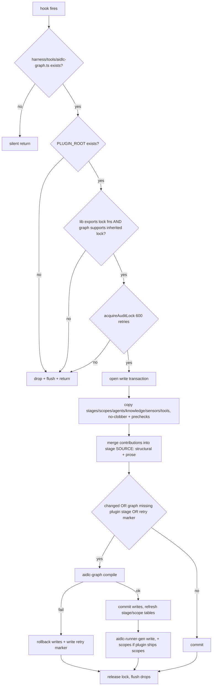

# プラグインシステム: 構造・コントリビューション・活性化

> **Source**: [awslabs/aidlc-workflows](https://github.com/awslabs/aidlc-workflows) — branch `v2`, commit `3c3146cf` (v2.6.40, retrieved 2026-08-21)
> **Status**: 実装から導出した as-built 仕様である。上流コードが本文書に優先する。
> **正本**: 英語版 `11-plugin-system.md`(この日本語版は参照訳。両者が食い違う場合は英語版が優先)

---

## 1. スコープとシステム内での位置づけ

**プラグイン**とは、AI-DLC インストールにステージ・スコープ・エージェント・ナレッジ・センサー・センサーツールを追加し、宣言的な**コントリビューション**ファイルを通じて既存のコアステージを*加算的に修正する*サードパーティ(あるいはコア外のファーストパーティ)パッケージである。プラグインについてランタイムに動的にロードされるものは何もない。フレームワークの拡張モデルは**インストール時合成**である。プラグインのコンテンツはプロジェクトのハーネスツリーへ物理的にコピーされ、そのコントリビューションはインストール済みの**ステージソース**にマージされ、その後グラフは通常のコンパイラによって再コンパイルされる。compose 後は、`plugin:` の所有権キーを除けば、エンジンは合成されたプラグインステージとコアステージを区別できない。

本文書が扱うのは以下である: プラグインパッケージの構造、`.aidlc-plugin` マニフェスト、パッケージャーによるハーネス別投影、compose フックのマージアルゴリズム、プラグインの選択/活性化、および同梱される `test-pro` の実例。以下は再導出しない: コンパイラ(`02-orchestration-engine.md` を参照)、ステージ frontmatter スキーマ(`04-stage-protocol.md` を参照)、センサーディスパッチ(`06-sensors.md` を参照)、フックのライフサイクル(`07-hooks.md` を参照)、CLI サーフェス(`09-cli-tools.md` を参照)、ハーネス/dist レイアウト(`10-distribution-harnesses.md` を参照)、テスト層(`12-testing-ci.md` を参照)。

リポジトリは、実例として本文書全体で用いる `plugins/test-pro/`(16 ファイル)のプラグインを1つだけ同梱している。

---

## 2. プラグインパッケージの構造

### 2.1 ディレクトリの種類

authored なプラグインは、フレームワークリポジトリ内の `plugins/<name>/` 配下のディレクトリである(あるいは同じ形をした独立の git リポジトリ)。この形を読む独立した消費者が2つあり、いずれもディレクトリ名をハードコードしている — どちらもマニフェストの `contributes` マップ(§2.3)は読まない:

* **パッケージャー**、`scripts/package.ts:1000`。その `contentDirs` 配列は
  `["stages", "sensors", "tools", "contributions", "scopes", "agents", "knowledge"]` である。
* **compose フック**、`scripts/plugin-hooks-template/compose.ts`。`stages/` `scopes/` `agents/` `knowledge/` `sensors/` `tools/` をコピーし、
  `contributions/` をマージする(`compose.ts:1390-1434`、`:1440`)。

| ディレクトリ | 必須か | 合成済みインストールでの配置先 | 合成主体 |
| --- | --- | --- | --- |
| `.aidlc-plugin/plugin.json` | yes(パッケージングのため) | コピーされない — パッケージャーのみが読む | `scripts/package.ts:977-987` |
| `stages/<phase>/<slug>.md` | no | `<harness>/aidlc-common/stages/<phase>/` | `compose.ts:1390` |
| `contributions/<phase>/<target>.md` | no | **コピーされない** — インストール済みステージソースへマージされる | `compose.ts:1477-1727` |
| `scopes/<plugin>-<name>.md` | no | `<harness>/scopes/` | `compose.ts:1397` |
| `agents/<plugin>-<role>-agent.md` | no | `<harness>/agents/`(+ OpenCode/Copilot では native ロースターにも) | `compose.ts:1398-1411`(双子コピーは `:1412-1430`) |
| `knowledge/<agent-slug>/*.md` | no | `<harness>/knowledge/` | `compose.ts:1432` |
| `sensors/aidlc-<id>.md` | no | `<harness>/sensors/`(フラットのみ) | `compose.ts:1433` |
| `tools/*.ts` | no | `<harness>/tools/` | `compose.ts:1434` |
| `tests/*.test.ts` | no | 配布されない — CI ではソースツリーから実行される | `tests/run-tests.ts:741-753` |
| `README.md` | no | 配布されない | — |

`<phase>` は、composer が走査する5つの正準フェーズディレクトリ名のいずれかでなければならない: `PHASES = ["initialization", "ideation", "inception", "construction", "operation"]`(`compose.ts:73`)。それ以外のディレクトリにあるステージは compose の再コンパイル検出からは不可視となり、コンパイラから
`Stage "<slug>" (<path>) is in an unknown phase directory "<phase>". Stage phase
directories must be one of: …` で拒否される(`core/tools/aidlc-graph.ts:1770-1774`)。

`memory/`、`rules/`、`hooks/` のコントリビューションサーフェスは**存在しない**。パッケージャーの `contentDirs` も composer も、そうしたツリーはコピーしない。プラグインは、自身の compose フック(§7.2)を超えて、メソッド/ルール層やライフサイクルフックを持ち込むことはできない。この点に矛盾するドキュメント上の主張については §10 を参照。

compose がコピーする `.md` ファイルには1つのテキスト置換が施される: リテラル `{{HARNESS_DIR}}` の出現はすべてハーネスのリーフ名(`.claude`、`.kiro` など)に置換される — `compose.ts:1105-1107`。`.ts` ツールファイルはバイト単位でそのままコピーされる。

### 2.2 `.aidlc-plugin/plugin.json` マニフェスト

`plugins/test-pro/.aidlc-plugin/plugin.json` の逐語:

```json
{
  "name": "test-pro",
  "version": "0.1.0",
  "description": "Full-featured testing plugin — …",
  "author": { "name": "AWS AIDLC" },
  "dependencies": ["core"],
  "aidlc": {
    "contributes": {
      "stages": "stages/",
      "overlays": "contributions/",
      "agents": "agents/",
      "scopes": "scopes/",
      "knowledge": "knowledge/",
      "sensors": "sensors/",
      "tools": "tools/"
    }
  }
}
```

フィールドごとに、それぞれどう消費されるか:

| フィールド | どこで消費されるか | 効果 |
| --- | --- | --- |
| `name` | `tests/harness/plugin-kit.ts:390-396` | プラグインディレクトリの basename と一致しなければならない(`manifest name must equal plugin directory name "<name>"`)。パッケージャーはこれを*読まない* — ホストパッケージ id はディレクトリ名から導出する |
| `version` | `scripts/package.ts:988`、`plugin-kit.ts:398-405` | ホストマニフェストとマーケットプレイスエントリへコピーされる。空でない文字列でなければならない |
| `description` | `scripts/package.ts:990` | ホストマニフェスト + マーケットプレイスエントリへコピーされる。既定は `""` |
| `author` | `scripts/package.ts:989` | ホストマニフェスト、マーケットプレイスの `owner` へコピーされる。既定は `{ name: "AIDLC" }` |
| `dependencies` | **何もしない** | 宣言のみ。`core/`、`scripts/`、`tests/harness/` のいずれにもリゾルバやバージョンチェックは存在しない |
| `aidlc.contributes` | `plugin-kit.ts:406-421` | shape 検査のみ(`manifest aidlc.contributes must be an object`)。そのキーとパス値はディスカバリには一切使われない |

したがってマニフェストは*パッケージング*の入力とドキュメント成果物であり、ランタイム上の権威は持たない。パッケージャーは不正なマニフェストに対しては loud に失敗する:
`plugins/<name>: cannot parse <path>: <err>. Fix the manifest JSON.`
(`scripts/package.ts:983-986`)。

### 2.3 予約名

`aidlc` および `aidlc-*` プレフィックスはコアの名前空間であり、3つの独立した箇所で強制される:

* **パッケージング** — `discoverPluginNames()` が
  `plugins/<n>: plugin names must not be "aidlc" or start with "aidlc-" (reserved
  for core; an aidlc-<x> plugin collides with core runner paths). Rename the
  plugin directory.` を投げる(`scripts/package.ts:941-948`)。
* **コンパイル** — ステージ frontmatter の `plugin: aidlc` は
  `stage "<slug>" declares plugin "aidlc"; omit plugin for core stages.` を投げ、
  `aidlc-` プレフィックス付きのものは `… the "aidlc-" prefix is reserved for core (a
  plugin named aidlc-<x> collides with core runner paths). Rename the plugin.` を投げる
  (`core/tools/aidlc-graph.ts:1719-1731`)。スコープファイルの同等ガードは
  `core/tools/aidlc-lib.ts:8680-8687` にある。
* **compose** — 同じ2つの形は、ファイルが着地する前に拒否される
  (`compose.ts:1063-1069`、`:520-527`)。

機構的な理由はランナーパスの衝突である: `runnerDirName()` はコアステージには `aidlc-<slug>` を発行するが、プラグイン所有のステージには**素の slug** を発行する
(`core/tools/aidlc-runner-gen.ts:88-89`)。`scopeRunnerDirName()` もスコープについて同様である
(`:583-584`)。`aidlc-x` という名前のプラグインは文字どおりコアのパス上にランナーディレクトリを生成してしまう。

ステージ slug にはさらにプラグインプレフィックスを付す必要がある。コンパイルは
`stage "<slug>" declares plugin "<p>", but plugin-owned stage slugs must start
with "<p>-". Rename the slug or fix the plugin field.` を投げる
(`aidlc-graph.ts:1733-1736`)。

---

## 3. 出力: ハーネス別ホストプラグイン投影

プラグインは authored なツリーそのままでは配布されない。`scripts/package.ts` は
**(プラグイン × ハーネス)ごとに1つのホストプラグイン投影**を
`dist/plugins/<plugin>/<harness>/` にレンダリングする(`emitPlugins`、`scripts/package.ts:1135-1142`)。
`pluginTargetFor()` はハードコードのマップではなく各ハーネス自身の `manifest.ts` からターゲットを導出するため、出荷される7つのハーネス全てが投影を受け取る
(`scripts/package.ts:963-970`):

```text
manifestDir = manifest.plugin?.manifestDir ?? `${manifest.harnessDir}-plugin`
kind        = manifest.plugin?.kind ?? "store"
```

5つのハーネスマニフェストが明示的な `plugin` ブロックを宣言している。`claude` と `codex` は既定値(`.claude-plugin` / `.codex-plugin`、kind `store`)にフォールバックする。

| ハーネス | `manifestDir` | `kind` | 生成されるフックアーティファクト |
| --- | --- | --- | --- |
| claude | `.claude-plugin`(既定) | store | `hooks/hooks.json`(`SessionStart` を含む) |
| codex | `.codex-plugin`(既定) | store | `hooks/hooks.json`(`SessionStart` を含む) |
| copilot | `.plugin` | store | `hooks/hooks.json`(`SessionStart` を含む) |
| opencode | `.opencode-plugin` | store | `hooks/hooks.json`(`SessionStart` を含む) |
| cursor | `.cursor-plugin` | cursor | `hooks/hooks.json`(`version: 1`、`sessionStart`)+ `hooks/aidlc-plugin-compose.ts` |
| kiro | `.kiro-plugin` | kiro | `hooks/aidlc-plugin-compose.kiro.hook`(`when.type: "promptSubmit"`) |
| kiro-ide | `.kiro-plugin` | kiro | kiro と同じ |

各投影には以下が含まれる:

1. `<manifestDir>/plugin.json` — `{ name: "aidlc-<plugin>", version, description, author }`
   (`scripts/package.ts:1007-1011`)。**ホストパッケージ id には `aidlc-` プレフィックスが付く**ことに注意。論理的なプラグインアイデンティティは素のままであり、compose 時にプレフィックスを剥がすことで回復される
   (`compose.ts:146-149`)。
2. `<manifestDir>/marketplace.json` — `aidlc-plugins` という名前の1エントリのカタログ
   (`scripts/package.ts:1013-1023`)。
3. `hooks/compose.ts` — composer で、
   `scripts/plugin-hooks-template/` からそのままコピーされる(`scripts/package.ts:1031-1035`)。
   `aidlc-plugin-compose.ts` は `kind === "cursor"` のときのみコピーされる。
4. ホスト側のフック配線(上表)。そのコマンドは POSIX の `sh -c` プローブか、Cursor の場合は Bun ランチャーのいずれかである。
5. 7つの `contentDirs` ツリーがそのままコピーされる。ただし Cursor だけは `agents/` を `aidlc/agents/` へ再配置する — 権威ある `.cursor/agents/` のコピーと並んで Cursor がプラグインのペルソナを自動発見しないようにするためである
   (`scripts/package.ts:1107-1110`)。

`-agent.md` で終わる名前を持つプラグインエージェントファイルは `absorbReviewerKnowledge()` を通過する(`scripts/package.ts:1113-1119`)。この関数は、当該エージェントがいずれかのステージから `reviewer:` として指名されていない限りは no-op であり、コアだけでなく `plugins/*/stages` もスキャンするため、プラグイン自身のレビューアーペルソナはその `knowledge/<agent>/*.md` が出荷されるペルソナに追記される
(`scripts/agent-knowledge.ts:49-56`、`:67-88`)。`test-pro-metrics-agent` はレビューアーではなくサポートペルソナであるため、そのナレッジはコピーされた `knowledge/` ツリーとしてのみ配布される。

`store`/`kiro` kind に対して発行されるシェルコマンドは、インストール済みの `aidlc` バイナリを優先し、bun にフォールバックする
(`scripts/package.ts:1044-1056`)。codex 向けの逐語:

```text
sh -c 'AIDLC=$(command -v aidlc 2>/dev/null || true); [ -n "$AIDLC" ] && { AIDLC_HARNESS_DIR=.codex AIDLC_HARNESS_NAME=codex "$AIDLC" plugin sync && exit 0; }; BUN=…; AIDLC_HARNESS_DIR=.codex AIDLC_HARNESS_NAME=codex "$BUN" "${PLUGIN_ROOT}/hooks/compose.ts"'
```

コミット済みの `dist/plugins/` ツリーはドリフトガード付きである: `checkPlugins()` はすべての投影を一時ディレクトリへ再構築してバイト比較したうえで孤児をスイープする —
`ORPHAN in dist: plugins/<name>/ (no plugins/<name>/ source — delete the
committed tree)` および `ORPHAN in dist: plugins/<name>/<h>/ (no such harness —
delete the committed tree)`(`scripts/package.ts:1151-1189`)。
`package.ts plugin build <plugin> <harness> <outDir>` サブコマンドは、1つの投影を任意のディレクトリへレンダリングし、テストが `dist/` に触れることなく実際のエミッタを行使できるようにする
(`scripts/package.ts:1196-1206`)。

---

## 4. 発見と活性化

### 4.1 プラグインはどこに存在するか

*ワークスペース*内では、プラグインはプロジェクト内にはまったく存在しない。ホストのプラグインストア(Claude/Codex/Copilot/OpenCode のマーケットプレイスインストール)、あるいは Kiro の場合はフォルダドロップとして存在する。合成後にプロジェクト内に存在するのは、プラグインの**コンテンツがハーネスツリーへコピーされたもの**と、`<harness>/tools/data/` 配下の2つのブックキーピングファイル(§4.3、§6.5)だけである。

composer は環境から自身の2つのルートを解決する(`compose.ts:36-48`):

```text
PLUGIN_ROOT  ← CLAUDE_PLUGIN_ROOT | PLUGIN_ROOT | AIDLC_PLUGIN_ROOT | <this file>/../..
PROJECT_DIR  ← CLAUDE_PROJECT_DIR | AIDLC_PROJECT_DIR | PWD | cwd()
HARNESS_LEAF ← AIDLC_HARNESS_DIR   (default ".claude")
```

プラグインの**アイデンティティ**(`PLUGIN_NAME`)は `.aidlc-plugin` ではなく*ホスト*マニフェストから読み取られる: `pluginNameFromRoot()` は6つのマニフェストディレクトリを順に検査する —
`.claude-plugin`、`.codex-plugin`、`.opencode-plugin`、`.cursor-plugin`、
`.plugin`、`.kiro-plugin` — 最初にパースできた `name` を採用し、先頭の `aidlc-` を剥がす
(`compose.ts:131-153`)。どのホストマニフェストもパースできない場合に限り、`PLUGIN_ROOT` の親ディレクトリセグメントへフォールバックする(投影ルートの basename はプラグイン間で共有されるハーネスリーフであるため、この選択がされている)。
`PLUGIN_KEY` は `PLUGIN_NAME` の `[\w.-]` 以外の文字を `_` に置換したものであり
(`compose.ts:163`)、プラグインごとのサイドカーファイルすべてのキーになる。

### 4.2 合成のトリガー

| パス | トリガー |
| --- | --- |
| Claude / Codex / Copilot / OpenCode | ホストの `SessionStart` フック → `aidlc plugin sync` または `bun ${PLUGIN_ROOT}/hooks/compose.ts` |
| Cursor | `sessionStart` フック → `bun ./hooks/aidlc-plugin-compose.ts .cursor` ランチャー |
| Kiro / kiro-ide | `.kiro.hook`、`when: { type: "promptSubmit" }` |
| 任意 | `aidlc plugin sync` / `bun <harness>/tools/aidlc-utility.ts plugin-sync` |

`plugin sync` は環境に指名されたプラグインルートに対するファンアウトである:
`handlePluginSync()` は `CLAUDE_PLUGIN_ROOT`、`PLUGIN_ROOT`、
`AIDLC_PLUGIN_ROOT` を(`pluginRootCandidatesFromEnv()` 経由で、
`core/tools/aidlc-utility.ts:963-972`)収集し、`hooks/compose.ts` を持つものだけを残して各々を実行する(`core/tools/aidlc-utility.ts:974-1041`)。1つも無ければ
`no installed plugins; nothing to sync` を表示し、成功時は
`plugin sync complete: N plugin(s)` を表示する。コンパイル済みシングルファイルバイナリの内側では
(`:995`)、spawn する代わりにプロセス内で `compose()` を import し(`:1010`)、
`compose()` を export しないフックは拒否する:
`plugin-sync failed for <root>: compose.ts does not export compose()`
(`aidlc-utility.ts:1013-1015`)。名詞/動詞の文法は
`plugin select|list|sync` である(`core/tools/aidlc-lib.ts:859-880`、
`core/tools/aidlc.ts:351-365`)。認識されない動詞は
`aidlc: unknown verb '<v>' for noun 'plugin'; try 'aidlc help --all'` を返す。

Cursor ランチャーはフックの stdin ペイロード(`workspace_roots`)からプロジェクトを解決し、曖昧さは拒否する:
`aidlc plugin compose: multiple Cursor workspace roots contain AI-DLC installs
(<list>); set AIDLC_PROJECT_DIR to select one`
(`scripts/plugin-hooks-template/aidlc-plugin-compose.ts:50-55`)。

### 4.3 活性化 = `harness.json` の選択リスト

合成はプラグインのファイルをインストールするが、**選択(selection)**がエンジンにそれらを見せるかどうかを決める。選択は `<harness>/tools/data/harness.json` のキー `plugins` に置かれる(`core/tools/aidlc-lib.ts:265-276`)。出荷される既定ファイルはこのキーを持たない(`dist/claude/.claude/tools/data/harness.json`)。したがって:

* `pluginsEnabled()` は `null` = 「選択なし、全て有効」を返す
  (`aidlc-lib.ts:442-444`)。
* `isPluginEnabled(p)` は `selected === null || selected.has(p)` である(`:450-453`)。
* `stageEnabledBySelection(stage)` は `phase === "initialization"` のとき `true` へ短絡し、それ以外は `isPluginEnabled(stage.plugin ?? "aidlc")` に委ねる
  (`:455-458`)。

このリーダーは厳格である: 非配列の値は
`<path>: harness.json field "plugins" must be an array of non-empty strings.` を投げ、不正な要素は
`<path>: harness.json field "plugins" entry <i> must be a non-empty string.` を投げる
(`aidlc-lib.ts:266-274`)。

`select-plugins`(`aidlc plugin select`)はこのキーを書き込み、下流のすべてのサーフェスをワークスペースロック内で再導出する(`aidlc-utility.ts:847-931`):

1. 引数なしの場合、現在の選択と既知のプラグインロースターを表示する
   (`Current plugin selection: … / Known plugins: …`、`:848-855`)。
2. すべての名前を `knownPluginNames()`(`"aidlc"`、フルステージグラフに現れるすべての `plugin`、すべてのスコープの所有者の和集合、`:456-468`)に対して検証し、
   `Unknown plugin name(s): <…>. Valid plugins: <…>.` で拒否する。
3. 稼働中の作業を取り残す選択を拒否する:
   `select-plugins refused: the new selection would strand N active workflow
   dependency(ies): …\nComplete or park the workflow(s) first (or keep the plugin
   enabled), then re-run select-plugins.`(`:877-883`)。ワークフローは、記録された `Scope` が無効化予定のプラグインに所有されている場合、あるいは保留中の `EXECUTE` チェックボックスがそのプラグインが所有するステージを指名している場合に取り残されると判定される(`:800-845`)。
4. 無効化されたプラグインのマージ済みコントリビューションを剥がし(§6.5)、選択を書き込んでから
   `regenerateSelectionSurfaces()` を実行する — `aidlc-graph compile`、
   `aidlc-runner-gen write`、`aidlc-runner-gen scopes`、そして生成される2つの SKILL.md 領域(`:604-635`)。
5. `Previous Selection` / `New Selection` を伴う監査イベント `PLUGIN_SELECTION_CHANGED` を追記する(`:907-910`。
   イベント名は `core/tools/aidlc-audit.ts:128` に登録されている)。
6. 何らかの失敗があれば3つのスナップショットと剥がされたステージファイルを復元し、再生成チェーンを再実行してから
   `select-plugins failed: <original>. Restored harness.json, stage-graph.json,
   scope-grid.json, and any stripped stage files, …` で死ぬ(`:920-930`)。

選択には、コンパイル時に強制される**閉包不変条件**がある:

> `Plugin selection closure failed: enabled stage "<slug>" consumes required
> artifact "<a>", but its only producer(s) are disabled: <list>. Enable plugin(s)
> <names> or disable the consuming stage.`
> — `core/tools/aidlc-graph.ts:1602-1606`

順序エッジは意図的にこのエラーの対象**外**である: 有効なステージの `requires_stage` が無効なステージを指名している場合は、`selectionDroppedOrderingEdges()` によって doctor アドバイザリとしてのみ報告される。依存対象が実行されない以上、そのエッジは空虚(vacuous)だからである
(`aidlc-graph.ts:1612-1640`、`aidlc-utility.ts:1765-1774` で提示される)。

`aidlc plugin list` は `Plugin selection: …` に加え、既知のプラグインごとに1行の
`<name> enabled|disabled` を表示するか、`--json` で
`{ plugins: [{name, enabled}], selectionActive }` を返す
(`aidlc-utility.ts:934-960`)。

---

## 5. compose アルゴリズム



*テキストフォールバック*: compose は、対象ディレクトリが AI-DLC プロジェクトでなければ黙って終了する。それ以外の場合、プラグインルートが見つからない、ワークスペースロックを共有するにはエンジンが古すぎる、あるいはロックを取得できない、のいずれかであれば診断ドロップを記録して戻る。ロックを保持した状態でスナップショットベースの書き込みトランザクションを開き、新しいプリミティブを no-clobber セマンティクスでコピーし、コントリビューションをインストール済みステージソースへマージし、何か変更があれば(あるいは直前のコンパイルが失敗したと分かっている場合は)グラフを再コンパイルする。コンパイルが失敗すればすべての書き込みをロールバックしてリトライマーカーを落とす。成功すればコミットし、2つの生成済み SKILL.md 領域をリフレッシュしてランナーを再生成する。ロックは常に解放され、ドロップは常にフラッシュされる。

### 5.1 ガード、ロック、トランザクション

| ガード | 挙動 | 引用元 |
| --- | --- | --- |
| `<harness>/tools/aidlc-graph.ts` が不在 | 黙って `return` — 「AIDLC プロジェクトではない」、ドロップなし | `compose.ts:379-381` |
| `PLUGIN_ROOT` がディスク上に存在しない | ドロップ `plugin root does not exist: "<p>" — check the AIDLC_PLUGIN_ROOT path` | `compose.ts:385-389` |
| インストール済みライブラリが `acquireAuditLock`/`releaseAuditLock` を欠く、またはインストール済み `aidlc-graph.ts` が `AIDLC_WORKSPACE_LOCK_OWNER_PID` トークンを欠く | ドロップ `plugin compose skipped: installed engine lacks shared compose/graph workspace-lock support; re-copy the current dist/<harness>/ shell and retry` | `compose.ts:391-402`、`:116-125` |
| `COMPOSE_LOCK_RETRIES = 600` 以内にロックが取得できない | ドロップ `plugin compose skipped: could not acquire the shared workspace lock` | `compose.ts:74`、`:404-410` |
| プラグインが選択に含まれない | 修正コマンドを明示するアドバイザリドロップ(`bun <harness>/tools/aidlc-utility.ts select-plugins <names>`)を出して続行する — ファイルコピーは進むが、コントリビューションのマージは行われ**ない**(§6.4) | `compose.ts:440-447`、`:251-256` |
| インストール済みステージスキーマが `plugin` キーを拒否する | 縮退ドロップ `plugin-owned stages/scopes/agents not composed: installed engine predates the plugin: ownership key - re-copy your dist/<harness>/ shell, then re-run compose`。ステージ/スコープ/エージェントのコピーはスキップされるが、ナレッジ/センサー/ツールのコピーは実行される | `compose.ts:1373-1382`、`:1432-1434` |

すべての書き込みは `writeComposeFile()` を経由し、書き込み前に既存バイト(新規ファイルの場合は `null`)をスナップショットする。`rollbackComposeWrites()` は逆順に復元し、復元できなければ
`compose rollback could not restore <…>` をドロップする
(`compose.ts:412-448`)。本体全体はラップされており、*いかなる* compose の失敗もホストセッションを壊さない — catch は `compose threw: <msg>` を記録して戻る
(`compose.ts:1851-1856`)。

バージョンスキューは、バージョン番号ではなく**インストール済みスキーマのプロービング**によって処理される: `installedSchemaAccepts(key, sample)` は最小限の有効なステージオブジェクトを構築し、そのキーを追加し、インストール済みの `validateStageFrontmatter` を呼ぶ。拒否はエラーメッセージがそのキーに言及している場合に限りそのキーに帰属させ、プローブ自体が何らかの理由で失敗した場合は `true`(ブロックしない)を返す — `compose.ts:355-375`。プローブは2箇所で行われる: `plugin`(`:1373`)と `required_sections`(`:1439`)。

### 5.2 プリミティブのコピー: no-clobber とプリチェック

`copyTreeNoClobber(src, dst, kind, precheck?, transform?)` (`compose.ts:1092-1141`) は既存の宛先を上書きすることが決してない。既存の宛先が*異なる*バイト列を持つ場合は本当の衝突であり、
`<kind> "<rel>" collides with an existing file (core or another plugin); not
overwritten — rename it to a plugin-namespaced path` をドロップする。宛先が同一の場合は無害な冪等再実行であり、何も記録されない。プリチェックは transform の**前**に走る(そのため、transform が投げてしまうような形はエラーではなくスキップになる)。

コピーをゲートするプリチェックは4つある:

1. **ステージスキーマと所有権**(`installedStageSchemaPrecheck`、`compose.ts:1028-1090`)。
   ステージを*インストール済み*のパーサー/バリデータでパース・検証し、本文が非空であることを要求し(`stage body is empty after the frontmatter fence
   (a behaviorally dead stage)`)、その後コンパイルの所有権チェックの throw をミラーする
   (`declares plugin "aidlc"; omit plugin for core stages`、`aidlc-` 予約、
   `PLUGIN_NAME` に対するアイデンティティ照合、および
   `slug "<s>" does not start with "<p>-" (plugin-owned stage slugs must carry the
   plugin prefix)`)。拒否されたステージの slug は `composeDroppedStageSlugs` に追加され、再コンパイル検出パスが永遠にそれをグラフに期待し続けることを防ぐ
   (`compose.ts:1027`、`:1757`)。
2. **予約済みランタイムモード**(`unsupportedRuntimeModePrecheck`、`compose.ts:724-787`)。
   `mode: agent-team` にはランタイム消費者がいない。ステージは合成されず、
   `plugin "<p>" stage "<s>" uses reserved mode "agent-team" and was not composed:
   the mode has no runtime consumer yet; change it to inline, subagent, pipeline,
   or mob` をドロップする。すでにインストールされているそのようなステージはあらかじめ監査される(no-clobber がそうしなければプリチェックを永遠にスキップしてしまうため)。
3. **スコープとエージェントの名前衝突**(`installedNameCollisionPrecheck`、
   `compose.ts:513-557`)。アイデンティティはファイル名ではなく frontmatter の `name:` である。コアのファイルは `aidlc-` の語幹プレフィックスを持つためである。拒否理由:
   `… declares plugin "<aidlc-x>"; the "aidlc-" prefix is reserved for core …`、
   `… declares plugin "<other>"/no plugin identity; owned plugin content must match
   the host manifest identity; not copied`、
   `… declares name "<n>", colliding with installed file "<path>"; not copied`。
4. **センサーマニフェストの発見可能性**(`sensorManifestNamePrecheck`、
   `compose.ts:559-594`)。センサーディスカバリは*フラットな*スキャンであり、
   `SENSOR_FILE_REGEX = /^aidlc-([a-z][a-z0-9-]*)\.md$/`
   のみをインデックス化する(`core/tools/aidlc-graph.ts:710`、`:726`)。ネストしたマニフェストや誤って命名されたマニフェストは黙って着地し、二度と発火しないことになる。プリチェックはその両方の形を、正しい形を明示したうえで拒否し、すでに着地している死んだマニフェストも監査する
   (`… is composed but never fires: … rename it to "aidlc-<id>.md" (with a matching
   id), remove the dead file, and re-run compose`)。

2つのハーネスはさらに**ネイティブエージェントロースターの双子**を得る: OpenCode
(`.opencode/agents/`)と Copilot(`.github/agents/`)は、プラグインのペルソナの投影コピーを受け取る(`compose.ts:1412-1430`、`nativeAgentsDir()` は `:798-800`)。
`core/tools/aidlc-includes.ts:325-340` は `.github/agents/` を共有ユーザー空間として扱い、`aidlc-` という名前を持つファイル**あるいは** `plugin: <name>` の frontmatter 行を持つファイルだけを再ポイントする — そこではプラグインの所有権キーが「これは自分たちのファイルだ」というマーカーを兼ねている。

### 5.3 再コンパイル、ランナー再生成、自己修復

compose は `changed || graphMissingPluginStage || retryPending` のとき再コンパイルする
(`compose.ts:1803`):

* `graphMissingPluginStage` は `<harness>/tools/data/stage-graph.json` を再読込し、ドロップされていないすべてのプラグインステージ slug が存在し、かつ `enabled: false` になっていないかを確認する。読み取れないグラフは missing 扱いとなる(`compose.ts:1764-1775`)。
  これにより、たとえ書き込みゲートすべてが冪等であっても、途中で終わった前回実行が自己修復できる。
* `missingPluginStageRunner` は、合成済み・有効・非 initialization のプラグインステージが `<skills>/<slug>/SKILL.md` を持たない場合に個別にランナー再生成を強制する(`compose.ts:1777-1791`)。
* `<project>/aidlc/.plugin-compose-retry-<PLUGIN_KEY>` にある**リトライマーカー**は、失敗したコンパイルを検出するための slug を持たない contributions-only プラグインをカバーする。コンパイル失敗時に書き込まれ、成功時に削除される
  (`compose.ts:1800-1822`)。

コンパイルが失敗した場合、ドロップは `aidlc-graph compile failed: <stderr slice>` であり、すべての書き込みがロールバックされる。成功した場合、オーケストレーター SKILL.md の2つの生成領域がリフレッシュされ(`stage-table`、`scope-table`。`<!-- BEGIN: compiled stage graph via \`bun aidlc-utility.ts stage-table\` - do
NOT hand-edit -->`センチネルで区切られる。`compose.ts:75-80`、`:300-353`)、その後`aidlc-runner-gen write` が実行され、プラグインが `scopes/` ディレクトリを持っている場合は `aidlc-runner-gen scopes`も加えて実行される(`compose.ts:1836-1847`)。spawn されるツールは固定された環境を受け取る。`AIDLC_PROJECT_DIR`、`AIDLC_STAGE_GRAPH`、`AIDLC_SENSORS_DIR`、そして compose がロックを保持している場合は`AIDLC_WORKSPACE_LOCK_OWNER_PID`を含む
(`compose.ts:276-298`)。

### 5.4 サイレント失敗なしの契約: ドロップ

compose は呼び出し元に対して決して throw しない。スキップされた、ドロップされた、あるいは縮退した動作はすべて `recordDrop(reason, severity)` を呼ぶ。severity は `"degraded"`(既定)または
`"advisory"`(`compose.ts:192-194` で宣言)であり、その呼び出し箇所は59箇所ある。ドロップはバッファされ、1回だけ
`<hooks-health-dir>/plugin-compose-<PLUGIN_KEY>.drops` にフラッシュされる。1行が
`ISO-8601<TAB>[severity] reason` の形をとる。このファイルは実行のたびに**上書き**され、実行にドロップが1件もなければ**削除される**。したがってこれは履歴ではなくライブなシグナルであり、プラグインごとに分かれているため、あるプラグインの綺麗な compose が別プラグインの縮退シグナルを消してしまうことはない
(`compose.ts:206-218`)。

`--doctor` はすべての `*.drops` ファイルを集約する: `[degraded]` を含む行が1つでもあれば
**失敗**行 `Hook drops (<hook>): N degraded of M` を生成し、修正テキストは
`<hook> degraded silently - read <path> (latest: …); fix the cause and
re-compose (the file self-clears on a clean run)` である。アドバイザリのみのファイルは合格行を生成する
(`core/tools/aidlc-utility.ts:1945-1998`)。

---

## 6. コントリビューションモデル

### 6.1 コントリビューションファイルのスキーマ

コントリビューションは frontmatter を伴う `contributions/<phase>/<target-slug>.md` である:

```yaml
target: build-and-test        # the core stage slug to modify (required)
plugin: test-pro              # ownership identity; must equal PLUGIN_NAME
adds:                         # structural merge surfaces
  produces:      [ <kebab-slug>, … ]
  sensors:       [ <kebab-slug>, … ]
  scopes:        [ <scope-name>, … ]
  consumes:
    - artifact: <kebab-slug>
      required: true|false          # defaults true when the key is absent
      conditional_on: <word>        # optional
  required_sections: [ "Quoted Section", … ]
fragments:                    # prose insertions, paired to body blocks by anchor
  - anchor: after-step:9
    order: 100
```

本文は、frontmatter のエントリごとに1つの `## fragment: <anchor>` ブロックを持つ。

パースは正規表現ベースでインデントに敏感である: `adds.<f>` 配下のリストエントリは正確に4スペースの `- kebab-name` でなければならない。不足すると
`contribution to <t>: parsed N of M adds.<f> entries (check indentation - entries
must be 4-space "    - kebab-name"); some dropped` がドロップされる(`compose.ts:1529-1541`)。
`consumes` は**エントリごとに**パースされる(任意インデントの `- artifact:` で始まる各チャンクがその継続行を所有する)ため、ダッシュを伴わない `required:` はその上にある artifact に結びつく(`compose.ts:1542-1568`)。`required_sections` の値はそのまま丸ごと捕捉され、外側の対になる引用符が1組だけ取り除かれる。空の値は
`contribution to <t>: empty required_sections value; dropped` をドロップする
(`compose.ts:1587-1599`)。

アイデンティティ絡みの拒否は、いずれも skip-and-drop である:

| 条件 | 逐語ドロップ |
| --- | --- |
| パース可能な `target:` がない | `contribution "<f>" has no parseable frontmatter target: — skipped (check for a BOM, a leading blank line, or a missing target: key)`(`compose.ts:1502`) |
| レガシーの `bundle:` キーが存在する | `contribution "<f>" uses the renamed bundle: key; write plugin: instead — skipped`(`compose.ts:1508`) |
| `plugin` に `:` を含む | `contribution "<f>" has an invalid plugin "<p>" (must not contain ':'); skipped`(`compose.ts:1514`) — `:` はフラグメントセンチネルの区切り文字である |
| `plugin` ≠ `PLUGIN_NAME` | `contribution "<f>" declares plugin "<p>"/no plugin identity; owned plugin content must match the host manifest identity "<PLUGIN_NAME>"; skipped`(`compose.ts:1516-1518`) |
| ターゲットステージファイルがどのフェーズディレクトリにも見つからない | `contribution "<f>" targets missing stage "<t>"`(`compose.ts:1522`) |

CRLF は正規化され、UTF-8 BOM と先頭の空行は frontmatter アンカーがマッチされる前に取り除かれる(`compose.ts:1495-1496`) — かつては BOM がコントリビューション全体を黙って消してしまっていた。

### 6.2 構造的マージ: 何がどのようにマージされるか

`IMPLEMENTED_ADDS = new Set(["produces", "sensors", "consumes", "scopes", "required_sections"])`
(`compose.ts:1576`) — 5つのサーフェスである。それ以外の `adds.<key>` は no-op であり、**必ず報告される**: アドバイザリ severity で
`contribution to <t>: adds.<k> is not yet an implemented
merge surface (only produces/sensors/consumes/scopes/required_sections); ignored`
(`compose.ts:1579`)。とりわけ `requires_stage` はコントリビューションを通じてマージ可能では**ない**。

マージはテキストベースであり、コンパイル済み JSON ではなく**インストール済みステージソース `.md`**へ行われる — これが再コンパイルをまたいで永続する理由である:

* `mergeListField`(`compose.ts:1166-1191`)は既存の
  `field:\n  - …` ブロックへ追記し、インライン空の `field: []` 形式をブロックへ展開し、フィールドが完全に不在であれば拒否する(ドロップ `contribution to <t>: no '<field>:' field to append to (adds
  dropped)`)。これは値による set-union であり、*この呼び出しが実際に書き込んだ*値のみを `added[]` に記録する。
* `mergeConsumes`(`compose.ts:1194-1221`)は
  `- artifact: X\n    required: <bool>[\n    conditional_on: <w>]` をレンダリングし、既存のブロックを継続行も含めてマッチさせる。そのため新しいエントリはブロック全体の後ろに着地し、コアのエントリの内部(そのエントリの brownfield ゲートを盗んでしまう位置)には入らない。
* `mergeRequiredSections`(`compose.ts:1228-1263`)はさらに、フィールドが不在なら**作成**する。frontmatter を閉じる `---` の直前に `required_sections:` を挿入し、`meta.created` をセットする。これにより、後で剥がすときにこのフィールド全体を削除すべきだと分かる。インストール済みエンジンのスキーマがこのキーを受け付けない場合はアドバイザリドロップとしてスキップされる。
* `adds.scopes` には2つの追加のガードレールがある(`compose.ts:1620-1631`): スコープ名はインストール済みの `scopes/*.md` のうちその `name:` を宣言しているものへ解決できなければならない
  (`… adds.scopes "<s>" has no installed scope file (no scopes/*.md declares name
  "<s>"); dropped`)。また、そのファイルの `plugin:` は**この**プラグインでなければならない
  (`… is not owned by plugin "<p>" (installed <file> declares plugin "<o>"/no
  plugin: field (core-owned); only this plugin's own scopes merge); dropped`)。所有権はインストール済みファイルが宣言する所有者から来るのであり、名前プレフィックスのルールからではない — プラグイン名のプレフィックスは重複しうるからである(`a` と `a-b` のように)。

すべては**加算的**である。オーバーライドも、削除も、並べ替えのサーフェスも存在しない。プラグインはコアステージの produces/consumes/sensors/scopes/sections を広げることしかできない。したがって、構造的サーフェスにおいて2つのプラグイン間で衝突が生じることは決してない — set union は可換だからである。

### 6.3 プローズフラグメント: アンカー、ペアリング、センチネル、順序

アンカーは `locateAnchor()`(`compose.ts:1265-1305`)によって、ステージ本文中の文字オフセットへ解決される。4つの形式があり、いずれも検証・エスケープされる:

| アンカー | 解決先 | 見つからない場合のドロップ |
| --- | --- | --- |
| `after-step:<n>` | `### Step <n>` 見出し、**あるいは n を含む範囲見出し `### Step <lo>-<hi>`** によって見出される節の末尾 | `contribution to <t>: after-step anchor "<a>" — no "### Step <n>" heading found (a range like "### Step 4-8" counts); prose dropped` |
| `before-step:<n>` | その見出しの先頭 | `before-step` の形で同様 |
| `end-of-steps` | `## Steps` 節の末尾 | `… anchor "end-of-steps" — no "## Steps" section found; prose dropped` |
| `in:<Section>` | `## <Section>` 節の末尾。コンポーネントは `/^[\w -]+$/` にマッチしなければならない | `… in: anchor "<a>" — no "## <Section>" section found; prose dropped` |

それ以外はすべて `contribution to <t>: unknown anchor "<a>"` をドロップする。不正な step 番号は
`bad after-step anchor "<a>" (step must be an integer)` をドロップする。

frontmatter エントリは、位置ではなく**アンカーラベルによって、アンカーごとに FIFO で**本文のブロックとペアリングされる — アンカー A の i 番目の frontmatter エントリは i 番目の `## fragment: A` ブロックを取る(`compose.ts:1694-1703`)。マッチしないエントリは
`contribution to <t>: fragment anchor "<a>" order <n> has no matching "## fragment:
<a>" prose block; dropped` をドロップし、マッチしない非空の本文ブロックは
`contribution to <t>: "## fragment: <a>" prose block has no matching frontmatter
fragments entry; dropped` をドロップする。本文の分割は、CommonMark の閉じフェンスのルール(同じ文字、長さ ≥ 開始フェンス、info string なし)に従う**フェンス対応の行スキャナー**であるため、ドキュメント用コードフェンスの内側にある `## fragment:` 行は区切り文字とはみなされない
(`compose.ts:1672-1692`)。

スプライスされた各ブロックは自己区切り(self-delimiting)である:

```text
<!-- plugin:<plugin>:<anchor>:<order>:<fnv1a32-hex> -->
…prose…
<!-- /plugin:<plugin>:<anchor>:<order>:<fnv1a32-hex> -->
```

ハッシュはプローズに対する FNV-1a 32bit であり(`compose.ts:1309-1313`)、**両方の**マーカーに現れる。これによりブロック境界がコンテンツ固有になる。`spliceFragment()`(`compose.ts:1325-1367`)は3つの挙動を持つ:

1. 同じ plugin/anchor/order のマーカーが**同じハッシュ**で存在する → no-op(冪等性)。
2. **異なるハッシュ**で存在する → 古いブロック全体(その自身のハッシュ限定の close によって境界付けられる)が置き換えられる(プラグインのアップグレード)。close マーカーが見つからない場合は
   `contribution to <t>: fragment block for "<a>" order <n> missing close marker;
   left as-is` をドロップする。
3. 不在 → ブロックは、そのアンカーにある**任意のプラグインの peer ブロック**の中で、`(order, plugin)` によってソートされた順序スロットに挿入される — したがって、別々のフック実行で合成する2つのプラグインは、フックの発火順ではなく決定的にインターリーブされる。peer が無い場合、`locateAnchor()` が基準オフセットを供給する。

1回の実行内では、フラグメントは `(order, plugin)` の順で適用され(`compose.ts:1716`)、繰り返された `(target, plugin, anchor, order)` キー — *2つ目の*コントリビューションファイルから来たものも含む — は
`contribution to <t>: duplicate fragment <p>:<a>:<n> (same plugin/anchor/order,
possibly across files); dropped` をドロップする。last-writer-wins にはならない
(`compose.ts:1469`、`:1718-1722`)。

フラグメントのプローズにも `{{HARNESS_DIR}}` 置換が適用される(`compose.ts:1697`)。

### 6.4 コントリビューションがマージされるのは有効なプラグインに限る

`contribPhases` は `pluginEnabledBySelection()` でない限り空である(`compose.ts:1477`)。この非対称性は意図的であり、ソース内にも文書化されている: ステージ/スコープ/エージェントの*コピー*は、無効化された選択下でも安全である。なぜならランタイムローダーが所有権でフィルタするからである。しかしマージされたコントリビューションは**コア**ステージソースへ着地し、そこには選択フィルターが一切届かない — 無効な状態でこれらを合成してしまうと、無効化されたプラグインの produces/sensors/prose が有効なステージへ溶接されてしまい、まさに次のセッション開始時に無効化のストリップを台無しにしてしまう。

### 6.5 サイドカーと無効化時のストリップ

構造的な add はファイル内プロヴィナンスを一切持たない(センチネルでマークされるプローズとは異なる)。そのため compose は実際にマージした内容を
`<harness>/tools/data/plugin-contrib-<PLUGIN_KEY>.json` に記録する。ターゲットステージ slug をキーとし、フィールドは `produces`、`sensors`、`consumes`、`scopes`、
`required_sections`、`required_sections_created` である(`compose.ts:1440-1466`、
`:1734-1741`)。エントリは**複数回の実行にわたって和集合として蓄積される**ため、冪等な再合成が記録を消してしまうことはない。このファイルは、当該実行で何かを追加した場合にのみ書き込まれる。書き込み失敗はアドバイザリである:
`could not write the contribution sidecar <path>:
<err> - disabling this plugin will not strip its merged contributions`。

`select-plugins` はこれを消費する。`stripDisabledPluginContributions()`
(`aidlc-utility.ts:734-789`)は再コンパイルの**前に**、新しい選択に含まれない既知のプラグインごとに実行される(`aidlc-utility.ts:890`):

* `removeListValues()` は、記録された値のみを `produces`、
  `sensors`、`scopes`、`required_sections` から取り除く。空になったブロックはインラインの `field: []` 形式に戻る。ただし `required_sections` フィールドを compose が*作成した*場合はそのフィールドごと削除される(`aidlc-utility.ts:668-696`)。
* `removeConsumesEntries()` は `- artifact:` エントリ全体をその継続行ごと削除する
  (`:698-711`)。
* `removePluginFragments()` はサイドカーを必要としない — `<!-- plugin:<p>:…:<order>:<hash> -->` の開始マーカーとペアの close マーカーにマッチする。アンカーはそれ自体が `:` を含むため、アンカーセグメントに対して非貪欲にマッチする(`:713-731`)。ペアのないマーカーはそのまま残される(「doctor の領分」)。

変更されたステージファイルと削除されたサイドカーはスナップショットリストに加わる。したがって再生成が失敗すればそれらは復元される。成功時には:
`Stripped merged contributions of disabled plugin(s): <names> (re-enabling
restores them on the next session start)` — 再有効化はプラグイン自身の compose フックが再度マージし直すことに依存する(`aidlc-utility.ts:911-915`)。

---

## 7. プラグインのコンテンツがコンパイル済みグラフへ到達する経路

compose がファイルを書き込んだ後は、通常のコンパイラがすべてを所有する。プラグイン固有の挙動は以下である:

**番号付け。** ステージ番号は**常にエンジンが割り当てる**。プラグインステージの authored な `number:` は、そのプラグイン自身の新規ステージ群の間での相対順序の*ヒント*にすぎず、その絶対値は決して使われない
(`core/tools/aidlc-graph.ts:24-27`、`core/tools/aidlc-stage-schema.ts:17-19`)。各フェーズの新規 slug のバッチは、それ自身の `requires_stage` エッジによってトポロジカルに順序付けされ(Kahn 法)、タイは authored な `number:` そして slug で解消され、その後フェーズ内で次に空いている連番のインデックス `<phaseIndex>.<maxIndexInPhase + 1>` から割り当てられる(`aidlc-graph.ts:1787-1810`)。したがって協調していないプラグイン同士が番号で衝突することはできない。`test-pro` は `3.85` と `4.45` を authored しているが、これらの値はソースファイル内には残るものの、グラフが固定する値ではない。

**所有権の伝播。** `plugin` はオプションのステージ frontmatter フィールドであり
(`aidlc-stage-schema.ts:176`)、グラフノードへそのままコピーされる
(`aidlc-graph.ts:2021-2023`)。`applyPluginSelection()` はその後、選択に応じて各ノードを削除するか `enabled: false` にする(`aidlc-graph.ts:1573-1578`)。

**スコープ。** プラグインのスコープファイルは `plugin:` キーを持つ通常のスコープであり
(`core/tools/aidlc-lib.ts:8592-8600`、`:8676-8689`)、`loadScopeMetadataAll()` には現れるが、無効化されていれば `loadScopeMetadata()` からはフィルタで除外される。プラグインのみのインストールは `freeform_default: true` によって既定を指名でき、`selectionAwareDefaultScope()` は、コアの既定が選択から外れている場合、唯一有効なプラグインの最初のスコープへフォールバックする
(`aidlc-lib.ts:8915-8960`)。

**ランナー。** `aidlc-runner-gen` は、プラグインステージには `<skills>/<slug>/`(素の slug)を、プラグインスコープには `<skills>/<scope>/` を発行し、説明テキストは
`Run the <plugin> plugin \`<slug>\` stage (<phase> phase) in isolation, without …`
である(`core/tools/aidlc-runner-gen.ts:88-89`、`:138-143`、`:583-584`)。

**センサー。** プラグインのセンサーマニフェストは、`<harness>/sensors/aidlc-<id>.md` として着地した後はコアのものと区別が付かない。`command:` 行は `{{HARNESS_DIR}}` を持ち、コピー時に置換される。バインディングはターゲットステージの `sensors:` リストによって決まり、これはコントリビューションによって広げることができる。`06-sensors.md` を参照。

**`when:` は宣言されているが評価されない。** スキーマは、`WHEN_PREDICATE_KEYS = ["producer-in-plan"]` から選んだちょうど1つのキーを持つオプションの `when` オブジェクトを受け付ける。値は非空の artifact slug でなければならない
(`aidlc-stage-schema.ts:155-159`、`:379-399`)。frontmatter パーサーはそれを再構築するが
(`aidlc-lib.ts:9239-9244`)、`buildGraphStage()` は決して `when` をグラフノードへコピーせず、どのコンパイルパスもランタイム消費者もそれを読むことはない —
`aidlc-graph.ts:1083-1084` は今なおスコープ検証を「予約済み `when:` 述語評価の将来のホーム」と呼んでいる。したがって `when:` を持つステージは、`scopes:` リストのみによってゲートされる。

---

## 8. 実例: `test-pro`

### 8.1 内訳

| 種類 | 件数 | ファイル |
| --- | --- | --- |
| 新規ステージ | 2 | `stages/construction/test-pro-integration.md`、`stages/operation/test-pro-full-suite.md` |
| コントリビューション | 4 | `contributions/construction/{nfr-requirements,nfr-design,build-and-test}.md`、`contributions/operation/performance-validation.md` |
| センサー | 2 | `sensors/aidlc-coverage-threshold.md`、`sensors/aidlc-requirement-coverage.md` |
| センサーツール | 2 | `tools/aidlc-sensor-coverage-threshold.ts`(94行)、`tools/aidlc-sensor-requirement-coverage.ts`(74行) |
| エージェント | 1 | `agents/test-pro-metrics-agent.md` |
| スコープ | 1 | `scopes/test-pro-validation.md` |
| ナレッジ | 1 | `knowledge/test-pro-metrics-agent/methodology.md` |
| テスト | 1 | `tests/plugin.test.ts` |

### 8.2 新規ステージ — どう接続されるか

`test-pro-integration`(`plugins/test-pro/stages/construction/test-pro-integration.md:1-36`):
`slug: test-pro-integration`、`plugin: test-pro`、`phase: construction`、
`execution: CONDITIONAL`、`lead_agent: aidlc-quality-agent`、
`support_agents: [test-pro-metrics-agent]`、`mode: inline`、3つの `test-pro-`
プレフィックス付き `produces`、2つのオプションの `consumes`、そして順序エッジ
`requires_stage: [build-and-test]` を持つ。その `scopes:` リストは
`enterprise, feature, mvp, test-pro-validation, classic, workshop` である。

`test-pro-full-suite`(`.../operation/test-pro-full-suite.md:1-35`):
`phase: operation`、`requires_stage: [deployment-execution, test-pro-integration]`、
`scopes: [enterprise, test-pro-validation]`、そして宣言されているが不活性な述語

```yaml
when:
  producer-in-plan: test-pro-regression-suite
```

したがって接続は**2部構成**である: `requires_stage` はコンパイル済み DAG への順序エッジを供給し(そして、1回のコンパイルで到着する新規 slug 群については、番号の種にも使われるトポロジカル順序を供給する)、一方 `scopes:` は活性化のメンバーシップを供給する — プラグインステージがあるスコープの EXECUTE セットに現れるのは、単にそのスコープを列挙しているからである。両ステージともコアの `aidlc-quality-agent` を lead として再利用しているが、これは合法である。なぜなら `validateStageFrontmatter` にはコアのエージェント、プラグイン自身のエージェント、そして `"orchestrator"` を union したロースターが渡されるからである(`tests/harness/plugin-kit.ts:305-319`)。

### 8.3 `build-and-test` コントリビューション、具体的には

`plugins/test-pro/contributions/construction/build-and-test.md` はコアの
`build-and-test` ステージをターゲットとし、以下を宣言する:

* `adds.produces`: 5つの artifact、すべて `test-pro-` プレフィックス付き。
* `adds.consumes`: 2つのエントリ、両方とも `required: false`。
* `adds.sensors`: `coverage-threshold`、`requirement-coverage`。
* `adds.required_sections`: `"Branch Coverage"`、`"Edge Cases"`、
  `"API Positive and Negative"`、`"Requirement Traceability"` — コアステージは
  `required_sections:` フィールドを持たないため、`mergeRequiredSections` がそれを**作成**し、
  `required_sections_created: true` を記録する。
* 6つの `fragments`: `after-step:9` に3つ(order 100/110/120)、
  `after-step:10` に2つ(130/140)、`in:Sensors` に1つ(150)。

すべてのアンカーは出荷されるコアステージに対して解決される: そこには `### Step 9:`、
`### Step 10:`、`## Sensors` の見出しに加えて、`locateAnchor` の範囲マッチ分岐を行使する `### Step 4-8:` の範囲見出しがある
(`core/aidlc-common/stages/construction/build-and-test.md:76`、`:102`、`:111`、`:230`)。
同じアンカーに対する3つのフラグメントこそが、フラグメントのペアリングが位置ではなくアンカーごとの FIFO である理由そのものである。

フラグメントがステージに emit するよう指示する2つの JSON ファイル —
`test-pro-test-results.json` と `test-pro-coverage-summary.json` — は、**センサーのサイドインプットであって `produces:` の成果物ではない**(`produces` は `.md` へ解決される)。そのため `adds.produces` からは除外され、代わりにフラグメント `after-step:10` の order 140 で明示的に述べられている。

残る3つのコントリビューションは、同じ形の小さな例である:
`nfr-requirements` は artifact 1件 + section 2件 + `after-step:6` フラグメント1件を追加する。`nfr-design` は artifact 1件、オプションの consume 1件、section 1件、`end-of-steps` フラグメント1件を追加する。`performance-validation` は artifact 1件、section 1件、`end-of-steps` フラグメント1件を追加する。

### 8.4 センサー

両方のマニフェストとも `kind: deterministic`、`default_severity: advisory`、
`category: document-shape`、`matches: "**/{aidlc-docs,intents}/**"`、
`timeout_seconds: 5`、そして
`command: bun {{HARNESS_DIR}}/tools/aidlc-sensor-<id>.ts` を宣言している
(`plugins/test-pro/sensors/aidlc-coverage-threshold.md:1-19`、
`aidlc-requirement-coverage.md:1-17`)。これらのツールは意図的に**自己完結型**である
— `aidlc-lib` を import しない — なぜなら、プラグインツールは自分自身のデルタとして出荷されるため、隣接するコアツールの存在を前提にしてはならないからである
(`tools/aidlc-sensor-coverage-threshold.ts:11-13`)。ディスパッチャはレコードディレクトリ配下のすべての書き込みで発火するため、各ツールはまず `--output-path` が自分自身の JSON ファイル名で終わっているかを確認し、そうでなければ偽の finding ではなくクリーンなパススルー結果(`pass: true, findings_count: 0`)を emit する
(`tools/aidlc-sensor-coverage-threshold.ts:59`、`passThrough()` ヘルパーは
`:49-52`)。入力が欠けている場合も同様にパススルーとなり、ステージが実行される前はセンサーは穏やかに縮退する。

---

## 9. プラグインのツールとフック: 実行モデル

**ツール**は、`<harness>/tools/` へコピーされる素の `.ts` ファイルである。実行のされ方はコアツールと同じである — `bun <harness>/tools/<file>.ts` — センサーマニフェストの `command:` から呼ばれる。プラグインツールのレジストリも、ディスパッチャ登録も、`core/tools/aidlc.ts` へのルートも存在しない: プラグインツールは、それを参照する何らかのテキスト(実際にはセンサーマニフェストのコマンド行)を通じてのみ到達可能である。マニフェスト内の `{{HARNESS_DIR}}` トークンが、同じマニフェストを `.claude`、`.kiro`、`.codex` などの上で動作させる仕組みである。

**フック**はコントリビューションサーフェスでは**ない**。プラグインが得る唯一のフックは、パッケージャーがそのプラグインのために書くもの — すなわち compose フックであり、その実装は `scripts/plugin-hooks-template/` 内の共有テンプレートである。そのディレクトリはちょうど2つのファイルを持つ:

* `compose.ts`(1866行) — §5-§6 で説明した composer であり、import 可能で
  (`export async function compose()`、`compose.ts:378`)、直接実行も可能である
  (`if (import.meta.main) await compose();`、`:1866`)。すべてのハーネス上のすべてのプラグインは*同じバイト列*を実行する。ハーネスごとの違いはすべて環境駆動である
  (`HARNESS_LEAF`、`HARNESS_NAME`、そして2つのブールのハーネスフラグ `IS_COPILOT`/`IS_OPENCODE`、`compose.ts:67-68`)。
* `aidlc-plugin-compose.ts`(91行) — Cursor 専用のランチャーであり、
  `kind === "cursor"` のときのみコピーされる(`scripts/package.ts:1033`)。これは Cursor の stdin ペイロードからプロジェクトを解決し、インストール済みの `aidlc plugin sync` を優先し、現在の Bun 実行ファイルで隣接する `compose.ts` を spawn するフォールバックを持つ — `sh -c`、`command -v`、POSIX のパラメータ展開を避けており、ネイティブ Windows でも動作する。

このテンプレートこそが、プラグイン著者がフックコードを一切書かない理由である: composer はフレームワーク所有かつバージョンスキューを意識した実装であるため(§5.1)、古いフレームワークに対して構築されたプラグインでも、新しいインストールに対して安全に合成できるし、その逆も成り立つ。throw する代わりに、名前の付いたドロップとともに縮退する。

---

## 10. ドキュメントとコードの食い違い

実装が持っていない、あるいは実装と矛盾する、文書化された挙動:

1. **`aidlc.contributes` は不活性である。** `docs/harness-engineering/10-authoring-a-plugin.md:82-83`
   は「`contributes` のキーはコアのサブツリーへマップされる … それらは compose 時にコアと並んでマージされる」と述べている。そのマップを読むコードは存在しない。パッケージャー
   (`scripts/package.ts:1000`)も composer(`compose.ts:1390-1434`)も、ディレクトリ名をハードコードしている。マニフェスト内で `stages/` をリネームしても何も変わらない。
2. **`memory` コントリビューションは存在しない。** 同じドキュメントの節
   (`10-authoring-a-plugin.md:86`)は
   「`memory` はデフォルトスペースのメソッドシードへマージされる」と述べている。`contentDirs` に `memory` のエントリは存在せず、`compose.ts` はそのようなツリーを一切コピーしない(その `memory` への参照は、`:598-601` の OpenCode のルールパス書き換えと、`:293` の `AIDLC_RULES_DIR` 環境変数ピンのみである)。
3. **`dependencies` は決して解決されない。** `plugins/test-pro/.aidlc-plugin/plugin.json`
   は `["core"]` を宣言し、authoring ドキュメントは `["compliance@^1.2.0"]` を示しているが、`core/`、`scripts/`、`tests/harness/` のいずれにもバージョンや存在のチェックは存在しない。
4. **プラグインの README は自身の内容を過小に述べている。** `plugins/test-pro/README.md`
   §1 は「テストリードとしてフレームワークの `aidlc-quality-agent` を再利用する — 新規エージェントなし」と述べているが、プラグインは `agents/test-pro-metrics-agent.md` を同梱しており、`test-pro-integration` はそれを `support_agents` として列挙している。マニフェストの description(「メトリクスサポートペルソナを追加する」)の方が正確である。
5. **README のステージ数とスコープ一覧は古い。** README は `/aidlc --doctor` が「34ステージを期待する」べきだと述べているが、コアは33のステージファイルを出荷しているため、test-pro の合成後は35になる。README の §4 表は、`test-pro-integration` のスコープ一覧から `test-pro-validation` を欠落させているが、そのステージファイル自身はそれを宣言している。
6. **`when:` は「まだ評価されない」と説明されているが、これは正確であるものの、スキーマのコメントは誇張している。** `aidlc-stage-schema.ts:156-158` は `when` について「もはや予約されたものではなく、アクティブな(shape 検証済みの)構造化述語である。コンパイル時のグリッド評価は別パスである」と述べている。その別パスは存在しない。`when` は検証された後、破棄される(§7)。

---

## 11. テスト

### 11.1 プラグイン自身のスイート

`plugins/test-pro/tests/plugin.test.ts`(2テスト)は、再利用可能な
`tests/harness/plugin-kit.ts`(691行)を介して、**フレームワークの実際のバリデータ**をプラグインの authored なコンテンツに対して実行する。`validatePluginContent(root)`
(`plugin-kit.ts:453-585`)は `[]` を返さなければならず、以下を検査する:

| finding コード | 検査内容 |
| --- | --- |
| `manifest-missing` / `manifest-json` / `manifest-shape` / `manifest-name` | マニフェストが存在しパースでき、オブジェクトであり、`name` がディレクトリ名と一致し、`version` が非空であり、`aidlc.contributes` がオブジェクトであること |
| `stage-schema` | すべての `stages/**.md` が、コア + プラグインのエージェント + `orchestrator` のロースターに対して実際の `parseStageFrontmatter` + `validateStageFrontmatter` を通ること |
| `stage-slug` | `slug` がファイル名の stem と一致すること |
| `plugin-owner` | ステージ、コントリビューション、スコープ、エージェントにおいて `plugin` がプラグインのディレクトリ名と一致すること |
| `artifact-namespace` | すべてのステージ `produces` とすべてのコントリビューション `adds.produces` の値が `<plugin>-` で始まること |
| `stage-body` | frontmatter フェンス後のステージ本文が非空であること |
| `contribution-target` | すべてのコントリビューションの `target` が、`dist/claude/.claude/aidlc-common/stages/` から読み取られた**出荷済みのコアステージ slug** へ解決すること |
| `file-name` | スコープとエージェントの frontmatter `name` がファイル名の stem と一致すること |

コアステージロースターとコアエージェントロースターは `core/` ではなく `dist/` から、すなわち構築済みの投影から読まれることに注意 — バリデータは、実際に出荷されるものに対してプラグインをテストする。

プラグインのスイートは自動的に発見される: `pluginTestFiles()` は
`plugins/*/tests/*.test.ts` をスキャンし、その結果を**integration** ティアに畳み込む。除外用のキーは `plugin-<plugin>-<stem>` であり、これによりすべてのプラグインの
`plugin.test.ts` が個別にアドレス可能になる(`tests/run-tests.ts:741-776`)。新しいプラグインのスイートはランナーに一切変更を加えることなく取り込まれる。

### 11.2 フレームワーク側のガード

| テスト | テスト数 | 保証内容 |
| --- | --- | --- |
| `tests/integration/t188-plugin-compose.test.ts` | 79 | エンドツーエンドの機構: 実際のパッケージャーを実行し、続けて `dist/claude` の新鮮なコピーに対して実際の compose フックを、`HARNESS_MATRIX` 全体にわたって実行する。コピーされたステージ、マージされた構造的サーフェス、スプライスされたフラグメント、`{{HARNESS_DIR}}` 置換、再コンパイル、そして古いスキーマの縮退経路(`describe("old installed schema without plugin ownership key")`、`:1282`)をアサートする |
| `tests/integration/t224-plugin-selection.test.ts` | 12 | 選択のセマンティクス: 有効化/無効化、閉包エラー、ストリップ/復元のラウンドトリップ |
| `tests/integration/t300-plugin-kit.test.ts` | 3 | 再利用可能な `plugin-kit` ヘルパー自体 |
| `tests/unit/t222-plugin-runner-naming.test.ts` | 12 | プラグインステージ/スコープの素の slug のランナーディレクトリ vs コアの `aidlc-` プレフィックス |
| `tests/unit/t262-plugin-sensor-name-guard.test.ts` | 5 | センサーマニフェストの名前プリチェック: 縮退ドロップ、ファイルが着地しないこと、compose がそれでも exit 0 になること、正しく命名されたマニフェストが実際のセンサーローダーによって発見されること |

`t188` はパッケージャーと compose フックを意図的に**サブプロセスとして**実行する。これは、ホストの SessionStart フックがそれらを呼び出すやり方を模している
(`tests/integration/t188-plugin-compose.test.ts:13-16`)。

コミット済み `dist/plugins/` ツリーのパッケージングドリフトは別のゲートである
(`checkPlugins`、§3)。これらのティアが CI にどう配線されているかは
`12-testing-ci.md` を参照。

---

## 12. 不変条件のまとめ

1. 合成はインストール時であり、ファイルベースである。プラグインについてランタイムにロードされるものは何もない。
2. コントリビューションは**加算のみ**である — produces/consumes/sensors/
   scopes/required_sections への union、およびセンチネルで区切られたプローズの挿入。オーバーライド、削除、並べ替えのサーフェスは存在せず、これがコアを不変にしている理由である。
3. すべてのマージは**冪等**である: 構造的サーフェスは値による set-union、プローズはハッシュ限定のセンチネル、ファイルは書き込み前比較。
4. プラグイン間の順序は `(order, plugin)` であり、フックの発火順ではない。
5. 所有権は4つの独立した箇所(パッケージャー、compose のコピープリチェック、compose のコントリビューションパース、コンパイラ)でのハードなアイデンティティチェックであり、いずれも `aidlc` と `aidlc-*` を拒否する。
6. 失敗は**loud だが致命的ではない**: compose は決してセッションを壊さず、コンパイル失敗時には書き込みをロールバックし、`--doctor` が縮退時に失敗させる severity タグ付きのドロップを記録する。
7. 選択はインストールとは直交する: ファイルが存在していてもプラグインが無効化されている場合があり、無効化はマージ済みコントリビューションをコアステージソースから剥がし、稼働中のワークフローを取り残すことを拒否する。

---

## 測定に関する注記

本文書中のすべての数値について、上流クローンのルート(`/…/scratchpad/aidlc-workflows`、commit `3c3146cf`)で 2026-08-21 に実行した正確なコマンドを示す。

| 記載された数値 | コマンド | 結果 |
| --- | --- | --- |
| リポジトリ内のプラグイン数 1 | `find plugins -mindepth 1 -maxdepth 1 -type d \| wc -l` | `1` |
| `plugins/test-pro` 内のファイル数 16 | `find plugins/test-pro -type f \| wc -l` | `16` |
| プラグインステージ数 2 | `find plugins/test-pro/stages -name '*.md' \| wc -l` | `2` |
| コントリビューション数 4 | `find plugins/test-pro/contributions -name '*.md' \| wc -l` | `4` |
| センサーマニフェスト数 2 | `find plugins/test-pro/sensors -name '*.md' \| wc -l` | `2` |
| センサーツール数 2 | `find plugins/test-pro/tools -name '*.ts' \| wc -l` | `2` |
| エージェント数 1 | `find plugins/test-pro/agents -name '*.md' \| wc -l` | `1` |
| スコープ数 1 | `find plugins/test-pro/scopes -name '*.md' \| wc -l` | `1` |
| ハーネス数 7 | `ls -d harness/*/ \| wc -l` | `7` |
| 出力されるプラグイン投影数 7 | `ls dist/plugins/test-pro \| wc -l` | `7` |
| 明示的な `plugin` ブロックを持つハーネスマニフェスト数 5 | `grep -l '^  plugin: {' harness/*/manifest.ts \| wc -l` | `5` |
| `contentDirs` エントリ数 7 | `grep -n "const contentDirs" scripts/package.ts` | 1000行目、7要素の配列 |
| 実装済み `adds.*` サーフェス数 5 | `grep -n "IMPLEMENTED_ADDS = new Set" scripts/plugin-hooks-template/compose.ts` | 1576行目、5要素のセット |
| `when:` 述語キー数 1 | `grep -n "WHEN_PREDICATE_KEYS = " core/tools/aidlc-stage-schema.ts` | 159行目、`["producer-in-plan"]` |
| フェーズディレクトリ名数 5 | `grep -n "^const PHASES = " scripts/plugin-hooks-template/compose.ts` | 73行目、5要素 |
| アイデンティティのために検査されるホストマニフェストディレクトリ数 6 | `grep -n "pluginNameFromRoot" -A 12 scripts/plugin-hooks-template/compose.ts` | 131-141行目、6要素 |
| `recordDrop(` 呼び出し箇所数 59 | `grep -n 'recordDrop(' scripts/plugin-hooks-template/compose.ts \| grep -vc 'function recordDrop'` | `59`(素の `grep -c` は `60` を返す — `:192` の宣言にもマッチするため) |
| `compose.ts` の行数 1866 | `wc -l < scripts/plugin-hooks-template/compose.ts` | `1866` |
| `aidlc-plugin-compose.ts` の行数 91 | `wc -l scripts/plugin-hooks-template/*` | `91` |
| `plugin-kit.ts` の行数 691 | `wc -l tests/harness/plugin-kit.ts` | `691` |
| 2つのセンサーツールの行数 94 / 74 | `wc -l plugins/test-pro/tools/*.ts` | `94`、`74` |
| `build-and-test` コントリビューションのフラグメント数 6 | `grep -c '^  - anchor:' plugins/test-pro/contributions/construction/build-and-test.md` | `6` |
| コアステージファイル数 33 | `find core/aidlc-common/stages -name '*.md' \| wc -l` | `33` |
| `COMPOSE_LOCK_RETRIES = 600` | `grep -n 'COMPOSE_LOCK_RETRIES =' scripts/plugin-hooks-template/compose.ts` | 74行目 |
| テスト数(79 / 12 / 3 / 12 / 5) | `grep -c "^\s*test(\|^\s*it(" tests/integration/t188-plugin-compose.test.ts tests/integration/t224-plugin-selection.test.ts tests/integration/t300-plugin-kit.test.ts tests/unit/t222-plugin-runner-naming.test.ts tests/unit/t262-plugin-sensor-name-guard.test.ts` | `79`、`12`、`3`、`12`、`5` |
| `plugins/test-pro/tests/plugin.test.ts` 内のテスト数 2 | 同じ述語を当該ファイルに適用(`test(` の出現は `:20`、`:24`) | `2` |
