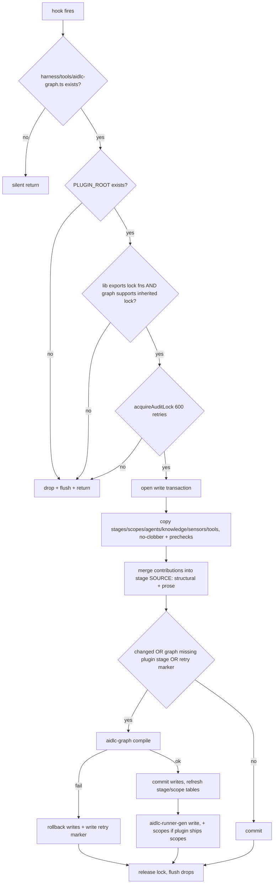

# Plugin System: Anatomy, Contributions and Activation

> **Source**: [awslabs/aidlc-workflows](https://github.com/awslabs/aidlc-workflows/tree/3c3146cfd7cef33020d48e8d48d4e80d0f8c2820) — branch `v2`, commit `3c3146cf` (v2.6.40, retrieved 2026-08-21)
> **Status**: As-built specification derived from the implementation; the upstream code is authoritative over this document.

---

## 1. Scope and position in the system

A **plugin** is a third-party (or first-party but out-of-core) package that adds
stages, scopes, agents, knowledge, sensors and sensor tools to an AI-DLC install,
and that *additively modifies* existing core stages through a declarative
**contribution** file. Nothing about a plugin is loaded dynamically at runtime:
the framework's extension model is **install-time composition**. A plugin's
content is physically copied into the project's harness tree, its contributions
are merged into the installed **stage source**, and the graph is then recompiled
by the ordinary compiler. After compose, the engine cannot tell a composed plugin
stage from a core one except by the `plugin:` ownership key.

This document owns: plugin package anatomy, the `.aidlc-plugin` manifest, the
packager's per-harness projection, the compose hook's merge algorithm, plugin
selection/activation, and the shipped `test-pro` example. It does not re-derive
the compiler (see `02-orchestration-engine.md`), the stage frontmatter schema
(see `04-stage-protocol.md`), sensor dispatch (see `06-sensors.md`), hook
lifecycle (see `07-hooks.md`), the CLI surface (see `09-cli-tools.md`), the
harness/dist layout (see `10-distribution-harnesses.md`), or the test tiers
(see `12-testing-ci.md`).

The repository ships exactly one plugin, `plugins/test-pro/` (16 files), used
throughout as the worked example.

---

## 2. Plugin package anatomy

### 2.1 Directory kinds

An authored plugin is a directory under `plugins/<name>/` in the framework repo
(or an independent git repository with the same shape). Two independent
consumers read that shape, and both hard-code the directory names — neither
reads the manifest's `contributes` map (§2.3):

* the **packager**, `scripts/package.ts:1000`, whose `contentDirs` array is
  `["stages", "sensors", "tools", "contributions", "scopes", "agents", "knowledge"]`;
* the **compose hook**, `scripts/plugin-hooks-template/compose.ts`, which copies
  `stages/` `scopes/` `agents/` `knowledge/` `sensors/` `tools/` and merges
  `contributions/` (`compose.ts:1390-1434`, `:1440`).

| Directory | Required? | Destination in a composed install | Composed by |
| --- | --- | --- | --- |
| `.aidlc-plugin/plugin.json` | yes (for packaging) | not copied — read by the packager only | `scripts/package.ts:977-987` |
| `stages/<phase>/<slug>.md` | no | `<harness>/aidlc-common/stages/<phase>/` | `compose.ts:1390` |
| `contributions/<phase>/<target>.md` | no | **not copied** — merged into installed stage source | `compose.ts:1477-1727` |
| `scopes/<plugin>-<name>.md` | no | `<harness>/scopes/` | `compose.ts:1397` |
| `agents/<plugin>-<role>-agent.md` | no | `<harness>/agents/` (+ native roster on OpenCode/Copilot) | `compose.ts:1398-1411` (twins `:1412-1430`) |
| `knowledge/<agent-slug>/*.md` | no | `<harness>/knowledge/` | `compose.ts:1432` |
| `sensors/aidlc-<id>.md` | no | `<harness>/sensors/` (flat only) | `compose.ts:1433` |
| `tools/*.ts` | no | `<harness>/tools/` | `compose.ts:1434` |
| `tests/*.test.ts` | no | not shipped — run in CI from the source tree | `tests/run-tests.ts:741-753` |
| `README.md` | no | not shipped | — |

`<phase>` must be one of the five canonical phase directory names the composer
walks: `PHASES = ["initialization", "ideation", "inception", "construction", "operation"]`
(`compose.ts:73`). A stage in any other directory is invisible to compose's
recompile detection and is rejected by the compiler with
`Stage "<slug>" (<path>) is in an unknown phase directory "<phase>". Stage phase
directories must be one of: …` (`core/tools/aidlc-graph.ts:1770-1774`).

There is **no `memory/`, `rules/` or `hooks/` contribution surface**: neither the
packager's `contentDirs` nor the composer copies such a tree. A plugin cannot
ship method/rule layers or lifecycle hooks of its own beyond its own compose hook
(§7.2). See §10 for the doc claim that contradicts this.

`.md` files copied by compose get one textual substitution: every occurrence of
the literal `{{HARNESS_DIR}}` is replaced with the harness leaf (`.claude`,
`.kiro`, …) — `compose.ts:1105-1107`. `.ts` tool files are copied byte-for-byte.

### 2.2 The `.aidlc-plugin/plugin.json` manifest

Verbatim, `plugins/test-pro/.aidlc-plugin/plugin.json`:

```json
{
  "name": "test-pro",
  "version": "0.1.0",
  "description": "Full-featured testing plugin — …",
  "author": { "name": "AWS AIDLC" },
  "dependencies": ["core"],
  "aidlc": {
    "contributes": {
      "stages": "stages/",
      "overlays": "contributions/",
      "agents": "agents/",
      "scopes": "scopes/",
      "knowledge": "knowledge/",
      "sensors": "sensors/",
      "tools": "tools/"
    }
  }
}
```

Field-by-field, as consumed:

| Field | Consumed where | Effect |
| --- | --- | --- |
| `name` | `tests/harness/plugin-kit.ts:390-396` | must equal the plugin directory basename (`manifest name must equal plugin directory name "<name>"`); it is *not* read by the packager, which derives the host package id from the directory name |
| `version` | `scripts/package.ts:988`, `plugin-kit.ts:398-405` | copied into the host manifest and marketplace entry; must be a non-empty string |
| `description` | `scripts/package.ts:990` | copied into the host manifest + marketplace entry; defaults to `""` |
| `author` | `scripts/package.ts:989` | copied into the host manifest, marketplace `owner`; defaults to `{ name: "AIDLC" }` |
| `dependencies` | **nothing** | declarative only; no resolver, no version check anywhere in `core/`, `scripts/`, or `tests/harness/` |
| `aidlc.contributes` | `plugin-kit.ts:406-421` | only shape-checked (`manifest aidlc.contributes must be an object`); its keys and path values are never used for discovery |

The manifest is therefore a *packaging* input plus a documentation artifact; it
has no runtime authority. The packager fails loud on a malformed one:
`plugins/<name>: cannot parse <path>: <err>. Fix the manifest JSON.`
(`scripts/package.ts:983-986`).

### 2.3 Reserved names

`aidlc` and any `aidlc-*` prefix are core's namespace, enforced at three
independent points:

* **packaging** — `discoverPluginNames()` throws
  `plugins/<n>: plugin names must not be "aidlc" or start with "aidlc-" (reserved
  for core; an aidlc-<x> plugin collides with core runner paths). Rename the
  plugin directory.` (`scripts/package.ts:941-948`);
* **compile** — a stage frontmatter `plugin: aidlc` throws
  `stage "<slug>" declares plugin "aidlc"; omit plugin for core stages.`, and an
  `aidlc-`-prefixed one throws `… the "aidlc-" prefix is reserved for core (a
  plugin named aidlc-<x> collides with core runner paths). Rename the plugin.`
  (`core/tools/aidlc-graph.ts:1719-1731`); the equivalent guard for scope files
  lives in `core/tools/aidlc-lib.ts:8680-8687`;
* **compose** — the same two shapes are rejected before a file lands
  (`compose.ts:1063-1069`, `:520-527`).

The mechanical reason is runner-path collision: `runnerDirName()` emits
`aidlc-<slug>` for core stages but the **bare slug** for plugin-owned ones
(`core/tools/aidlc-runner-gen.ts:88-89`), and `scopeRunnerDirName()` does the
same for scopes (`:583-584`). A plugin literally named `aidlc-x` would generate
runner directories on core's paths.

Stage slugs must additionally carry the plugin prefix: compile throws
`stage "<slug>" declares plugin "<p>", but plugin-owned stage slugs must start
with "<p>-". Rename the slug or fix the plugin field.`
(`aidlc-graph.ts:1733-1736`).

---

## 3. Emission: the per-harness host-plugin projection

Plugins are not distributed as the authored tree. `scripts/package.ts` renders
one **host plugin projection per (plugin × harness)** into
`dist/plugins/<plugin>/<harness>/` (`emitPlugins`, `scripts/package.ts:1135-1142`).
All 7 shipped harnesses receive a projection, because `pluginTargetFor()`
derives the target from each harness's own `manifest.ts` rather than a hardcoded
map (`scripts/package.ts:963-970`):

```text
manifestDir = manifest.plugin?.manifestDir ?? `${manifest.harnessDir}-plugin`
kind        = manifest.plugin?.kind ?? "store"
```

Five harness manifests declare an explicit `plugin` block; `claude` and `codex`
fall through to the defaults (`.claude-plugin` / `.codex-plugin`, kind `store`).

| Harness | `manifestDir` | `kind` | Hook artifact written |
| --- | --- | --- | --- |
| claude | `.claude-plugin` (default) | store | `hooks/hooks.json` with `SessionStart` |
| codex | `.codex-plugin` (default) | store | `hooks/hooks.json` with `SessionStart` |
| copilot | `.plugin` | store | `hooks/hooks.json` with `SessionStart` |
| opencode | `.opencode-plugin` | store | `hooks/hooks.json` with `SessionStart` |
| cursor | `.cursor-plugin` | cursor | `hooks/hooks.json` (`version: 1`, `sessionStart`) + `hooks/aidlc-plugin-compose.ts` |
| kiro | `.kiro-plugin` | kiro | `hooks/aidlc-plugin-compose.kiro.hook` (`when.type: "promptSubmit"`) |
| kiro-ide | `.kiro-plugin` | kiro | same as kiro |

Each projection contains:

1. `<manifestDir>/plugin.json` — `{ name: "aidlc-<plugin>", version, description, author }`
   (`scripts/package.ts:1007-1011`). Note the **`aidlc-` prefix on the host
   package id**; the logical plugin identity stays bare and is recovered at
   compose time by stripping the prefix (`compose.ts:146-149`).
2. `<manifestDir>/marketplace.json` — a one-entry catalogue named `aidlc-plugins`
   (`scripts/package.ts:1013-1023`).
3. `hooks/compose.ts` — the composer, copied verbatim from
   `scripts/plugin-hooks-template/` (`scripts/package.ts:1031-1035`).
   `aidlc-plugin-compose.ts` is copied only for `kind === "cursor"`.
4. The host hook wiring (table above) whose command is either a POSIX `sh -c`
   probe or, for Cursor, a Bun launcher.
5. The seven `contentDirs` trees copied verbatim, except that Cursor relocates
   `agents/` to `aidlc/agents/` so Cursor does not auto-discover the plugin
   persona alongside the authoritative `.cursor/agents/` copy
   (`scripts/package.ts:1107-1110`).

Plugin agent files whose name ends `-agent.md` are passed through
`absorbReviewerKnowledge()` (`scripts/package.ts:1113-1119`). That function is a
no-op unless the agent is named as a `reviewer:` by some stage — and it scans
`plugins/*/stages` as well as core, so a plugin's own reviewer persona gets its
`knowledge/<agent>/*.md` appended into the shipped persona
(`scripts/agent-knowledge.ts:49-56`, `:67-88`). `test-pro-metrics-agent` is a
support persona, not a reviewer, so its knowledge ships only as the copied
`knowledge/` tree.

The shell command emitted for `store`/`kiro` kinds prefers an installed `aidlc`
binary and falls back to bun (`scripts/package.ts:1044-1056`); verbatim, for
codex:

```text
sh -c 'AIDLC=$(command -v aidlc 2>/dev/null || true); [ -n "$AIDLC" ] && { AIDLC_HARNESS_DIR=.codex AIDLC_HARNESS_NAME=codex "$AIDLC" plugin sync && exit 0; }; BUN=$(command -v bun 2>/dev/null || true); [ -z "$BUN" ] && [ -x "$HOME/.bun/bin/bun" ] && BUN="$HOME/.bun/bin/bun"; [ -z "$BUN" ] && { echo "aidlc plugin compose: aidlc and bun not found, skipping" >&2; exit 0; }; AIDLC_HARNESS_DIR=.codex AIDLC_HARNESS_NAME=codex "$BUN" "${PLUGIN_ROOT}/hooks/compose.ts"'
```

The committed `dist/plugins/` tree is drift-guarded: `checkPlugins()` rebuilds
every projection into a temp dir and byte-compares, then sweeps for orphans —
`ORPHAN in dist: plugins/<name>/ (no plugins/<name>/ source — delete the
committed tree)` and `ORPHAN in dist: plugins/<name>/<h>/ (no such harness —
delete the committed tree)` (`scripts/package.ts:1151-1189`). A
`package.ts plugin build <plugin> <harness> <outDir>` subcommand renders one
projection into an arbitrary directory so tests can exercise the real emitter
without touching `dist/` (`scripts/package.ts:1196-1206`).

---

## 4. Discovery and activation

### 4.1 Where a plugin lives

In a *workspace*, a plugin does not live in the project at all. It lives in the
host's plugin store (Claude/Codex/Copilot/OpenCode marketplace install) or, for
Kiro, as a folder drop. What lives in the project after composition is the
plugin's **content, copied into the harness tree**, plus two bookkeeping files
under `<harness>/tools/data/` (§4.3, §6.5).

The composer resolves its two roots from the environment
(`compose.ts:36-48`):

```text
PLUGIN_ROOT  ← CLAUDE_PLUGIN_ROOT | PLUGIN_ROOT | AIDLC_PLUGIN_ROOT | <this file>/../..
PROJECT_DIR  ← CLAUDE_PROJECT_DIR | AIDLC_PROJECT_DIR | PWD | cwd()
HARNESS_LEAF ← AIDLC_HARNESS_DIR   (default ".claude")
```

The plugin's **identity** (`PLUGIN_NAME`) is read from the *host* manifest, not
`.aidlc-plugin`: `pluginNameFromRoot()` probes six manifest directories in order
— `.claude-plugin`, `.codex-plugin`, `.opencode-plugin`, `.cursor-plugin`,
`.plugin`, `.kiro-plugin` — takes the first parseable `name`, and strips a
leading `aidlc-` (`compose.ts:131-153`). Only if no host manifest parses does it
fall back to the parent directory segment of `PLUGIN_ROOT` (chosen because a
projection root's basename is the harness leaf, shared across plugins).
`PLUGIN_KEY` is `PLUGIN_NAME` with non-`[\w.-]` characters replaced by `_`
(`compose.ts:163`) and keys every per-plugin sidecar file.

### 4.2 Composition triggers

| Path | Trigger |
| --- | --- |
| Claude / Codex / Copilot / OpenCode | host `SessionStart` hook → `aidlc plugin sync` or `bun ${PLUGIN_ROOT}/hooks/compose.ts` |
| Cursor | `sessionStart` hook → `bun ./hooks/aidlc-plugin-compose.ts .cursor` launcher |
| Kiro / kiro-ide | `.kiro.hook`, `when: { type: "promptSubmit" }` |
| Any | `aidlc plugin sync` / `bun <harness>/tools/aidlc-utility.ts plugin-sync` |

`plugin sync` is a fan-out over the plugin roots named in the environment:
`handlePluginSync()` collects `CLAUDE_PLUGIN_ROOT`, `PLUGIN_ROOT`,
`AIDLC_PLUGIN_ROOT` (via `pluginRootCandidatesFromEnv()`,
`core/tools/aidlc-utility.ts:963-972`), keeps those with a `hooks/compose.ts`,
and runs each (`core/tools/aidlc-utility.ts:974-1041`). With none it prints
`no installed plugins; nothing to sync`; on success,
`plugin sync complete: N plugin(s)`. Inside a compiled single-file binary
(`:995`) it imports `compose()` in-process instead of spawning (`:1010`), and
refuses a hook that does not export it:
`plugin-sync failed for <root>: compose.ts does not export compose()`
(`aidlc-utility.ts:1013-1015`). The noun/verb grammar is
`plugin select|list|sync` (`core/tools/aidlc-lib.ts:859-880`,
`core/tools/aidlc.ts:351-365`); an unrecognised verb yields
`aidlc: unknown verb '<v>' for noun 'plugin'; try 'aidlc help --all'`.

The Cursor launcher resolves the project from the hook's stdin payload
(`workspace_roots`), refusing ambiguity:
`aidlc plugin compose: multiple Cursor workspace roots contain AI-DLC installs
(<list>); set AIDLC_PROJECT_DIR to select one`
(`scripts/plugin-hooks-template/aidlc-plugin-compose.ts:50-55`).

### 4.3 Activation = the selection list in `harness.json`

Composition installs a plugin's files; **selection** decides whether the engine
sees them. The selection lives in `<harness>/tools/data/harness.json` under the
key `plugins` (`core/tools/aidlc-lib.ts:265-276`). The shipped default file has
no such key (`dist/claude/.claude/tools/data/harness.json`), so:

* `pluginsEnabled()` returns `null` = "no selection, everything enabled"
  (`aidlc-lib.ts:442-444`);
* `isPluginEnabled(p)` is `selected === null || selected.has(p)` (`:450-453`);
* `stageEnabledBySelection(stage)` short-circuits to `true` for
  `phase === "initialization"`, otherwise defers to `isPluginEnabled(stage.plugin ?? "aidlc")`
  (`:455-458`).

The reader is strict: a non-array value throws
`<path>: harness.json field "plugins" must be an array of non-empty strings.`
and a bad element throws
`<path>: harness.json field "plugins" entry <i> must be a non-empty string.`
(`aidlc-lib.ts:266-274`).

`select-plugins` (`aidlc plugin select`) writes that key and re-derives every
downstream surface inside the workspace lock (`aidlc-utility.ts:847-931`):

1. with no argument it prints the current selection and the known plugin roster
   (`Current plugin selection: … / Known plugins: …`, `:848-855`);
2. it validates every name against `knownPluginNames()` — the union of `"aidlc"`,
   every `plugin` seen in the full stage graph, and every scope's owner
   (`:456-468`) — refusing with
   `Unknown plugin name(s): <…>. Valid plugins: <…>.`;
3. it refuses a selection that would strand live work:
   `select-plugins refused: the new selection would strand N active workflow
   dependency(ies): …\nComplete or park the workflow(s) first (or keep the plugin
   enabled), then re-run select-plugins.` (`:877-883`). A workflow is stranded if
   its recorded `Scope` is owned by a to-be-disabled plugin, or if a pending
   `EXECUTE` checkbox names a stage that plugin owns (`:800-845`);
4. it strips the disabled plugins' merged contributions (§6.5), writes the
   selection, then runs `regenerateSelectionSurfaces()` — `aidlc-graph compile`,
   `aidlc-runner-gen write`, `aidlc-runner-gen scopes`, and the two generated
   SKILL.md regions (`:604-635`);
5. it appends the audit event `PLUGIN_SELECTION_CHANGED` with
   `Previous Selection` / `New Selection` (`:907-910`;
   the event name is registered in `core/tools/aidlc-audit.ts:128`);
6. on any failure it restores the three snapshots plus stripped stage files and
   re-runs the regeneration chain, then dies with
   `select-plugins failed: <original>. Restored harness.json, stage-graph.json,
   scope-grid.json, and any stripped stage files, …` (`:920-930`).

Selection has a **closure invariant** enforced at compile:

> `Plugin selection closure failed: enabled stage "<slug>" consumes required
> artifact "<a>", but its only producer(s) are disabled: <list>. Enable plugin(s)
> <names> or disable the consuming stage.`
> — `core/tools/aidlc-graph.ts:1602-1606`

Ordering edges are deliberately *not* part of that error: an enabled stage whose
`requires_stage` names a disabled stage is reported by
`selectionDroppedOrderingEdges()` as a doctor advisory only, because the edge is
vacuous once the dependency never runs (`aidlc-graph.ts:1612-1640`,
surfaced at `aidlc-utility.ts:1765-1774`).

`aidlc plugin list` prints `Plugin selection: …` plus one `<name> enabled|disabled`
row per known plugin, or `--json` `{ plugins: [{name, enabled}], selectionActive }`
(`aidlc-utility.ts:934-960`).

---

## 5. The compose algorithm



*Text fallback*: compose exits silently if the directory is not an AI-DLC
project; otherwise it records a diagnostic drop and returns for a missing plugin
root, an engine too old to share the workspace lock, or a lock it cannot acquire.
With the lock held it opens a snapshot-based write transaction, copies new
primitives with no-clobber semantics, merges contributions into installed stage
source, and recompiles the graph when anything changed (or when a prior compile
is known to have failed). A failed compile rolls every write back and drops a
retry marker; a successful one commits, refreshes the two generated SKILL.md
regions and regenerates runners. The lock is always released and drops flushed.

### 5.1 Guards, locking, transaction

| Guard | Behavior | Citation |
| --- | --- | --- |
| `<harness>/tools/aidlc-graph.ts` absent | silent `return` — "not an AIDLC project", no drop | `compose.ts:379-381` |
| `PLUGIN_ROOT` missing on disk | drop `plugin root does not exist: "<p>" — check the AIDLC_PLUGIN_ROOT path` | `compose.ts:385-389` |
| installed lib lacks `acquireAuditLock`/`releaseAuditLock`, or installed `aidlc-graph.ts` lacks the `AIDLC_WORKSPACE_LOCK_OWNER_PID` token | drop `plugin compose skipped: installed engine lacks shared compose/graph workspace-lock support; re-copy the current dist/<harness>/ shell and retry` | `compose.ts:391-402`, `:116-125` |
| lock not acquired within `COMPOSE_LOCK_RETRIES = 600` | drop `plugin compose skipped: could not acquire the shared workspace lock` | `compose.ts:74`, `:404-410` |
| plugin not in the selection | advisory drop naming the exact fix command (`bun <harness>/tools/aidlc-utility.ts select-plugins <names>`) and continues — file copies proceed, contribution merges do **not** (§6.4) | `compose.ts:440-447`, `:251-256` |
| installed stage schema rejects the `plugin` key | degraded drop `plugin-owned stages/scopes/agents not composed: installed engine predates the plugin: ownership key - re-copy your dist/<harness>/ shell, then re-run compose`; stage/scope/agent copies are skipped, knowledge/sensor/tool copies still run | `compose.ts:1373-1382`, `:1432-1434` |

Every write goes through `writeComposeFile()`, which snapshots the prior bytes
(or `null` for a new file) before writing; `rollbackComposeWrites()` restores in
reverse order and drops `compose rollback could not restore <…>` if it cannot
(`compose.ts:412-448`). The whole body is wrapped so *no* compose failure ever
breaks the host session — the catch records `compose threw: <msg>` and returns
(`compose.ts:1851-1856`).

Version skew is handled by **probing the installed schema**, not by version
numbers: `installedSchemaAccepts(key, sample)` builds a minimal valid stage
object, adds the key, and calls the installed `validateStageFrontmatter`; a
rejection is attributed to the key only if an error message mentions it, and any
failure to probe returns `true` (do not block) — `compose.ts:355-375`. Two probes
are made: `plugin` (`:1373`) and `required_sections` (`:1439`).

### 5.2 Copying primitives: no-clobber plus prechecks

`copyTreeNoClobber(src, dst, kind, precheck?, transform?)` (`compose.ts:1092-1141`)
never overwrites an existing destination. An existing destination with *different*
bytes is a real collision and drops
`<kind> "<rel>" collides with an existing file (core or another plugin); not
overwritten — rename it to a plugin-namespaced path`; an identical destination is
a benign idempotent re-run and is silent. Prechecks run **before** the transform
(so a shape a transform would throw on is skipped, not fatal).

Four prechecks gate the copies:

1. **Stage schema + ownership** (`installedStageSchemaPrecheck`, `compose.ts:1028-1090`).
   Parses and validates the stage with the *installed* parser/validator, then
   requires a non-empty body (`stage body is empty after the frontmatter fence
   (a behaviorally dead stage)`), then mirrors compile's ownership throws
   (`declares plugin "aidlc"; omit plugin for core stages`, the `aidlc-` reservation,
   identity match against `PLUGIN_NAME`, and
   `slug "<s>" does not start with "<p>-" (plugin-owned stage slugs must carry the
   plugin prefix)`). A rejected stage's slug is added to `composeDroppedStageSlugs`
   so the recompile-detection pass does not expect it in the graph forever
   (`compose.ts:1027`, `:1757`).
2. **Reserved runtime mode** (`unsupportedRuntimeModePrecheck`, `compose.ts:724-787`).
   `mode: agent-team` has no runtime consumer; the stage is not composed and drops
   `plugin "<p>" stage "<s>" uses reserved mode "agent-team" and was not composed:
   the mode has no runtime consumer yet; change it to inline, subagent, pipeline,
   or mob`. An *already-installed* such stage is audited up front (no-clobber would
   otherwise skip the precheck forever).
3. **Name collision for scopes and agents** (`installedNameCollisionPrecheck`,
   `compose.ts:513-557`). Identity is the frontmatter `name:`, not the filename,
   because core files carry the `aidlc-` stem prefix. Rejections:
   `… declares plugin "<aidlc-x>"; the "aidlc-" prefix is reserved for core …`,
   `… declares plugin "<other>"/no plugin identity; owned plugin content must match
   the host manifest identity; not copied`, and
   `… declares name "<n>", colliding with installed file "<path>"; not copied`.
4. **Sensor manifest discoverability** (`sensorManifestNamePrecheck`,
   `compose.ts:559-594`). Sensor discovery is a *flat* scan indexing only
   `SENSOR_FILE_REGEX = /^aidlc-([a-z][a-z0-9-]*)\.md$/`
   (`core/tools/aidlc-graph.ts:710`, `:726`), so a nested or wrongly-named manifest
   would land silently and never fire. The precheck rejects both shapes with the
   required form spelled out, and also audits already-landed dead manifests
   (`… is composed but never fires: … rename it to "aidlc-<id>.md" (with a matching
   id), remove the dead file, and re-run compose`).

Two harnesses additionally get a **native agent roster twin**: OpenCode
(`.opencode/agents/`) and Copilot (`.github/agents/`) receive projected copies of
the plugin's personas (`compose.ts:1412-1430`, `nativeAgentsDir()` at `:798-800`).
`core/tools/aidlc-includes.ts:325-340` treats `.github/agents/` as shared user
space and only repoints files that are `aidlc-`-named **or** carry a
`plugin: <name>` frontmatter line — the plugin ownership key doubles as the
"this file is ours" marker there.

### 5.3 Recompile, runner regeneration, self-healing

Compose recompiles when `changed || graphMissingPluginStage || retryPending`
(`compose.ts:1803`):

* `graphMissingPluginStage` re-reads `<harness>/tools/data/stage-graph.json` and
  checks that every non-dropped plugin stage slug is present and not
  `enabled: false`; an unreadable graph counts as missing (`compose.ts:1764-1775`).
  This is what makes a torn prior run self-heal even though every write gate is
  idempotent.
* `missingPluginStageRunner` separately forces a runner regeneration when a
  composed, enabled, non-initialization plugin stage has no
  `<skills>/<slug>/SKILL.md` (`compose.ts:1777-1791`).
* A **retry marker** at `<project>/aidlc/.plugin-compose-retry-<PLUGIN_KEY>`
  covers the contributions-only plugin, which has no stage slug to detect a
  failed compile with. It is written on compile failure and removed on success
  (`compose.ts:1800-1822`).

On a failed compile the drop is `aidlc-graph compile failed: <stderr slice>` and
all writes roll back. On success the two generated regions of the orchestrator
SKILL.md are refreshed (`stage-table`, `scope-table`, delimited by the
`<!-- BEGIN: compiled stage graph via \`bun aidlc-utility.ts stage-table\` - do
NOT hand-edit -->` sentinels, `compose.ts:75-80`,`:300-353`), then
`aidlc-runner-gen write` runs, plus `aidlc-runner-gen scopes` when the plugin
ships a `scopes/`dir (`compose.ts:1836-1847`). Spawned tools get a pinned
environment including`AIDLC_PROJECT_DIR`,`AIDLC_STAGE_GRAPH`,`AIDLC_SENSORS_DIR`
and, when compose holds the lock, `AIDLC_WORKSPACE_LOCK_OWNER_PID`
(`compose.ts:276-298`).

### 5.4 The no-silent-failure contract: drops

Compose never throws at its caller. Every skipped, dropped or degraded action
calls `recordDrop(reason, severity)` with severity `"degraded"` (default) or
`"advisory"` (declared at `compose.ts:192-194`); there are 59 such call sites.
Drops are buffered and flushed once to
`<hooks-health-dir>/plugin-compose-<PLUGIN_KEY>.drops`, one
`ISO-8601<TAB>[severity] reason` line each. The file is **overwritten** each run
and **deleted** when a run has none, so it is a live signal rather than history,
and it is per-plugin so one clean plugin's compose cannot erase another's
degraded signal (`compose.ts:206-218`).

`--doctor` aggregates every `*.drops` file: any line containing `[degraded]`
produces a **failing** row `Hook drops (<hook>): N degraded of M` with the fix
text `<hook> degraded silently - read <path> (latest: …); fix the cause and
re-compose (the file self-clears on a clean run)`; advisory-only files produce a
passing row (`core/tools/aidlc-utility.ts:1945-1998`).

---

## 6. The contribution model

### 6.1 Contribution file schema

A contribution is `contributions/<phase>/<target-slug>.md` with frontmatter:

```yaml
target: build-and-test        # the core stage slug to modify (required)
plugin: test-pro              # ownership identity; must equal PLUGIN_NAME
adds:                         # structural merge surfaces
  produces:      [ <kebab-slug>, … ]
  sensors:       [ <kebab-slug>, … ]
  scopes:        [ <scope-name>, … ]
  consumes:
    - artifact: <kebab-slug>
      required: true|false          # defaults true when the key is absent
      conditional_on: <word>        # optional
  required_sections: [ "Quoted Section", … ]
fragments:                    # prose insertions, paired to body blocks by anchor
  - anchor: after-step:9
    order: 100
```

The body carries one `## fragment: <anchor>` block per frontmatter entry.

Parsing is regex-based and indentation-sensitive: list entries under `adds.<f>`
must be exactly four-space `- kebab-name`; a shortfall drops
`contribution to <t>: parsed N of M adds.<f> entries (check indentation - entries
must be 4-space "    - kebab-name"); some dropped` (`compose.ts:1529-1541`).
`consumes` is parsed **per entry** (each chunk starting at an any-indent
`- artifact:` owns its continuation lines) so a dash-less `required:` binds to
the artifact above it (`compose.ts:1542-1568`). `required_sections` values are
captured whole and then stripped of one matched pair of outer quotes; an empty
value drops `contribution to <t>: empty required_sections value; dropped`
(`compose.ts:1587-1599`).

Identity rejections, all skip-and-drop:

| Condition | Verbatim drop |
| --- | --- |
| no parseable `target:` | `contribution "<f>" has no parseable frontmatter target: — skipped (check for a BOM, a leading blank line, or a missing target: key)` (`compose.ts:1502`) |
| legacy `bundle:` key present | `contribution "<f>" uses the renamed bundle: key; write plugin: instead — skipped` (`compose.ts:1508`) |
| `plugin` contains `:` | `contribution "<f>" has an invalid plugin "<p>" (must not contain ':'); skipped` (`compose.ts:1514`) — `:` is the fragment-sentinel delimiter |
| `plugin` ≠ `PLUGIN_NAME` | `contribution "<f>" declares plugin "<p>"/no plugin identity; owned plugin content must match the host manifest identity "<PLUGIN_NAME>"; skipped` (`compose.ts:1516-1518`) |
| target stage file not found in any phase dir | `contribution "<f>" targets missing stage "<t>"` (`compose.ts:1522`) |

CRLF is normalised, a UTF-8 BOM and leading blank lines are stripped before the
frontmatter anchor is matched (`compose.ts:1495-1496`) — a BOM previously made a
whole contribution vanish silently.

### 6.2 Structural merge: what merges, and how

`IMPLEMENTED_ADDS = new Set(["produces", "sensors", "consumes", "scopes", "required_sections"])`
(`compose.ts:1576`) — five surfaces. Any other `adds.<key>` is a no-op that
**must be reported**: `contribution to <t>: adds.<k> is not yet an implemented
merge surface (only produces/sensors/consumes/scopes/required_sections); ignored`
at advisory severity (`compose.ts:1579`). `requires_stage`, in particular, is not
mergeable through a contribution.

The merge is textual, into the **installed stage source `.md`**, not into the
compiled JSON — which is what makes it durable across recompiles:

* `mergeListField` (`compose.ts:1166-1191`) appends to an existing
  `field:\n  - …` block, expands the inline-empty `field: []` form into a block,
  and refuses (drop `contribution to <t>: no '<field>:' field to append to (adds
  dropped)`) when the field is absent entirely. It is set-union by value and
  records only the values *this call actually wrote* into `added[]`.
* `mergeConsumes` (`compose.ts:1194-1221`) renders
  `- artifact: X\n    required: <bool>[\n    conditional_on: <w>]` and matches
  the existing block *including continuation lines*, so a new entry lands past
  the whole block rather than inside a core entry (which would steal that entry's
  brownfield gate).
* `mergeRequiredSections` (`compose.ts:1228-1263`) additionally **creates** the
  field when absent, inserting `required_sections:` immediately before the
  closing frontmatter `---`, and sets `meta.created` so a later strip knows to
  delete the whole field. It is skipped with an advisory drop when the installed
  engine's schema does not accept the key.
* `adds.scopes` has two extra guard rails (`compose.ts:1620-1631`): the scope name
  must resolve to an installed `scopes/*.md` declaring that `name:`
  (`… adds.scopes "<s>" has no installed scope file (no scopes/*.md declares name
  "<s>"); dropped`), and that file's `plugin:` must be **this** plugin
  (`… is not owned by plugin "<p>" (installed <file> declares plugin "<o>"/no
  plugin: field (core-owned); only this plugin's own scopes merge); dropped`).
  Ownership comes from the installed file's declared owner, not a name-prefix
  rule, because plugin-name prefixes overlap (`a` vs `a-b`).

Everything is **additive**. There is no override, no remove, no reorder surface;
a plugin can only widen a core stage's produces/consumes/sensors/scopes/sections.
Conflicts between two plugins therefore never arise on structural surfaces — a
set union is commutative.

### 6.3 Prose fragments: anchors, pairing, sentinels, ordering

Anchors are resolved by `locateAnchor()` (`compose.ts:1265-1305`) to a character
offset in the stage body. Four forms, all validated and escaped:

| Anchor | Resolution | Not-found drop |
| --- | --- | --- |
| `after-step:<n>` | end of the section headed by a `### Step <n>` **or a range heading `### Step <lo>-<hi>` containing n** | `contribution to <t>: after-step anchor "<a>" — no "### Step <n>" heading found (a range like "### Step 4-8" counts); prose dropped` |
| `before-step:<n>` | start of that heading | same shape, `before-step` |
| `end-of-steps` | end of the `## Steps` section | `… anchor "end-of-steps" — no "## Steps" section found; prose dropped` |
| `in:<Section>` | end of the `## <Section>` section; component must match `/^[\w -]+$/` | `… in: anchor "<a>" — no "## <Section>" section found; prose dropped` |

Anything else drops `contribution to <t>: unknown anchor "<a>"`. A malformed step
number drops `bad after-step anchor "<a>" (step must be an integer)`.

Frontmatter entries are paired to body blocks **by anchor label, FIFO per
anchor**, never positionally — the i-th frontmatter entry for anchor A takes the
i-th `## fragment: A` block (`compose.ts:1694-1703`). Unmatched entries drop
`contribution to <t>: fragment anchor "<a>" order <n> has no matching "## fragment:
<a>" prose block; dropped`; unmatched non-empty body blocks drop
`contribution to <t>: "## fragment: <a>" prose block has no matching frontmatter
fragments entry; dropped`. The body split is a **fence-aware line scanner** with
CommonMark closing-fence rules (same char, length ≥ opener, no info string), so a
`## fragment:` line inside a documentation code fence is not a delimiter
(`compose.ts:1672-1692`).

Each spliced block is self-delimiting:

```text
<!-- plugin:<plugin>:<anchor>:<order>:<fnv1a32-hex> -->
…prose…
<!-- /plugin:<plugin>:<anchor>:<order>:<fnv1a32-hex> -->
```

The hash is FNV-1a 32-bit over the prose (`compose.ts:1309-1313`) and appears in
**both** markers, making the block boundary content-specific. `spliceFragment()`
(`compose.ts:1325-1367`) then has three behaviors:

1. same plugin/anchor/order marker present with the **same hash** → no-op
   (idempotence);
2. present with a **different hash** → the whole old block (bounded by its own
   hash-qualified close) is replaced (plugin upgrade). A missing close drops
   `contribution to <t>: fragment block for "<a>" order <n> missing close marker;
   left as-is`;
3. absent → the block is inserted at its ordered slot **among peer blocks of any
   plugin at that anchor**, sorted by `(order, plugin)` — so two plugins composing
   in separate hook runs interleave deterministically, not by hook-firing order.
   With no peers, `locateAnchor()` supplies the base offset.

Within one run fragments are applied in `(order, plugin)` order
(`compose.ts:1716`), and a repeated `(target, plugin, anchor, order)` key —
including one arriving from a *second* contribution file — drops
`contribution to <t>: duplicate fragment <p>:<a>:<n> (same plugin/anchor/order,
possibly across files); dropped` rather than last-writer-wins
(`compose.ts:1469`, `:1718-1722`).

Fragment prose also gets `{{HARNESS_DIR}}` substituted (`compose.ts:1697`).

### 6.4 Contributions merge only for an enabled plugin

`contribPhases` is empty unless `pluginEnabledBySelection()` (`compose.ts:1477`).
The asymmetry is deliberate and documented in-source: stage/scope/agent *copies*
are safe under a disabling selection because the runtime loaders filter by
ownership, but merged contributions land in **core** stage source where no
selection filter reaches — composing them while disabled would weld a disabled
plugin's produces/sensors/prose into enabled stages and undo the disable strip on
the very next session start.

### 6.5 The sidecar and the disable-time strip

Structural adds carry no in-file provenance (unlike sentinel-marked prose), so
compose records what it actually merged in
`<harness>/tools/data/plugin-contrib-<PLUGIN_KEY>.json`, keyed by target stage
slug, with fields `produces`, `sensors`, `consumes`, `scopes`,
`required_sections`, `required_sections_created` (`compose.ts:1440-1466`,
`:1734-1741`). Entries are **unioned across runs** so an idempotent re-compose
never erases the record; the file is written only when this run added something.
A write failure is advisory: `could not write the contribution sidecar <path>:
<err> - disabling this plugin will not strip its merged contributions`.

`select-plugins` consumes it. `stripDisabledPluginContributions()`
(`aidlc-utility.ts:734-789`) runs **before** the recompile, for every known
plugin not in the new selection (`aidlc-utility.ts:890`):

* `removeListValues()` removes exactly the recorded values from `produces`,
  `sensors`, `scopes`, `required_sections`; an emptied block collapses back to
  the inline `field: []` form, except that a `required_sections` field compose
  *created* is deleted outright (`aidlc-utility.ts:668-696`);
* `removeConsumesEntries()` drops whole `- artifact:` entries with their
  continuation lines (`:698-711`);
* `removePluginFragments()` needs no sidecar — it matches
  `<!-- plugin:<p>:…:<order>:<hash> -->` open markers and their paired close,
  non-greedily over the anchor segment because anchors contain `:` themselves
  (`:713-731`). An unpaired marker is left in place ("doctor territory").

Mutated stage files and the deleted sidecar join the snapshot list so a failed
regeneration restores them. On success:
`Stripped merged contributions of disabled plugin(s): <names> (re-enabling
restores them on the next session start)` — re-enabling relies on the plugin's
own compose hook re-merging (`aidlc-utility.ts:911-915`).

---

## 7. How plugin content reaches the compiled graph

Once compose has written files, the ordinary compiler owns everything. The
plugin-specific behaviors are:

**Numbering.** Stage numbers are **always engine-assigned**; an authored
`number:` on a plugin stage is only a relative-ordering *hint* among that
plugin's own new stages and its absolute value is never used
(`core/tools/aidlc-graph.ts:24-27`, `core/tools/aidlc-stage-schema.ts:17-19`).
Each phase's batch of new slugs is topologically ordered by its own
`requires_stage` edges (Kahn), ties broken by the authored `number:` then slug,
then assigned next-free contiguous indices `<phaseIndex>.<maxIndexInPhase + 1>`
onward (`aidlc-graph.ts:1787-1810`). Uncoordinated plugins therefore cannot
collide on numbers. `test-pro` authors `3.85` and `4.45`; those values survive in
the source files but are not what the graph pins.

**Ownership propagation.** `plugin` is an optional stage frontmatter field
(`aidlc-stage-schema.ts:176`) copied verbatim into the graph node
(`aidlc-graph.ts:2021-2023`). `applyPluginSelection()` then deletes or sets
`enabled: false` on each node per the selection (`aidlc-graph.ts:1573-1578`).

**Scopes.** A plugin scope file is an ordinary scope with a `plugin:` key
(`core/tools/aidlc-lib.ts:8592-8600`, `:8676-8689`), and appears in
`loadScopeMetadataAll()` but is filtered out of `loadScopeMetadata()` when
disabled. A plugin-only install can nominate a default via
`freeform_default: true`, and `selectionAwareDefaultScope()` falls back to the
sole enabled plugin's first scope when core's default is deselected
(`aidlc-lib.ts:8915-8960`).

**Runners.** `aidlc-runner-gen` emits `<skills>/<slug>/` for plugin stages
(bare slug) and `<skills>/<scope>/` for plugin scopes, with description text
`Run the <plugin> plugin \`<slug>\` stage (<phase> phase) in isolation, without …`
(`core/tools/aidlc-runner-gen.ts:88-89`,`:138-143`,`:583-584`).

**Sensors.** A plugin sensor manifest is indistinguishable from a core one once
it lands as `<harness>/sensors/aidlc-<id>.md`; the `command:` line carries
`{{HARNESS_DIR}}`, substituted at copy time. Binding is by the target stage's
`sensors:` list, which a contribution can widen. See `06-sensors.md`.

**`when:` is declared but not evaluated.** The schema accepts an optional `when`
object with exactly one key from `WHEN_PREDICATE_KEYS = ["producer-in-plan"]`
whose value is a non-empty artifact slug
(`aidlc-stage-schema.ts:155-159`, `:379-399`). The frontmatter parser
reconstructs it (`aidlc-lib.ts:9239-9244`), but `buildGraphStage()` never copies
`when` into the graph node and no compile pass or runtime consumer reads it —
`aidlc-graph.ts:1083-1084` still calls scope validation the "future home of the
reserved `when:` predicate evaluation". A stage with `when:` therefore gates on
its `scopes:` list alone.

---

## 8. Worked example: `test-pro`

### 8.1 Inventory

| Kind | Count | Files |
| --- | --- | --- |
| new stages | 2 | `stages/construction/test-pro-integration.md`, `stages/operation/test-pro-full-suite.md` |
| contributions | 4 | `contributions/construction/{nfr-requirements,nfr-design,build-and-test}.md`, `contributions/operation/performance-validation.md` |
| sensors | 2 | `sensors/aidlc-coverage-threshold.md`, `sensors/aidlc-requirement-coverage.md` |
| sensor tools | 2 | `tools/aidlc-sensor-coverage-threshold.ts` (94 lines), `tools/aidlc-sensor-requirement-coverage.ts` (74 lines) |
| agents | 1 | `agents/test-pro-metrics-agent.md` |
| scopes | 1 | `scopes/test-pro-validation.md` |
| knowledge | 1 | `knowledge/test-pro-metrics-agent/methodology.md` |
| tests | 1 | `tests/plugin.test.ts` |

### 8.2 New stages — how they attach

`test-pro-integration` (`plugins/test-pro/stages/construction/test-pro-integration.md:1-36`):
`slug: test-pro-integration`, `plugin: test-pro`, `phase: construction`,
`execution: CONDITIONAL`, `lead_agent: aidlc-quality-agent`,
`support_agents: [test-pro-metrics-agent]`, `mode: inline`, three `test-pro-`
prefixed `produces`, two optional `consumes`, and the ordering edge
`requires_stage: [build-and-test]`. Its `scopes:` list is
`enterprise, feature, mvp, test-pro-validation, classic, workshop`.

`test-pro-full-suite` (`.../operation/test-pro-full-suite.md:1-35`):
`phase: operation`, `requires_stage: [deployment-execution, test-pro-integration]`,
`scopes: [enterprise, test-pro-validation]`, and the declared-but-inert predicate

```yaml
when:
  producer-in-plan: test-pro-regression-suite
```

Attachment is thus **two-part**: `requires_stage` supplies the ordering edge into
the compiled DAG (and, for new slugs arriving in one compile, the topological
order used to seed numbers), while `scopes:` supplies the activation membership —
the plugin stage appears in a scope's EXECUTE set purely because it lists that
scope. Both stages reuse the core `aidlc-quality-agent` as lead, which is legal
because `validateStageFrontmatter` is passed a roster that unions core agents,
the plugin's own agents, and `"orchestrator"` (`tests/harness/plugin-kit.ts:305-319`).

### 8.3 The `build-and-test` contribution, concretely

`plugins/test-pro/contributions/construction/build-and-test.md` targets the core
`build-and-test` stage and declares:

* `adds.produces`: 5 artifacts, all `test-pro-` prefixed;
* `adds.consumes`: 2 entries, both `required: false`;
* `adds.sensors`: `coverage-threshold`, `requirement-coverage`;
* `adds.required_sections`: `"Branch Coverage"`, `"Edge Cases"`,
  `"API Positive and Negative"`, `"Requirement Traceability"` — the core stage has
  no `required_sections:` field, so `mergeRequiredSections` **creates** it and
  records `required_sections_created: true`;
* 6 `fragments`: three at `after-step:9` (orders 100/110/120), two at
  `after-step:10` (130/140), one at `in:Sensors` (150).

Every anchor resolves against the shipped core stage: it has `### Step 9:`,
`### Step 10:` and `## Sensors` headings, plus a `### Step 4-8:` range heading
that exercises the range-matching branch of `locateAnchor`
(`core/aidlc-common/stages/construction/build-and-test.md:76`, `:102`, `:111`, `:230`).
The three same-anchor fragments are exactly why fragment pairing is per-anchor
FIFO rather than positional.

The two JSON files the fragments instruct the stage to emit —
`test-pro-test-results.json` and `test-pro-coverage-summary.json` — are **sensor
side-inputs, not `produces:` deliverables** (`produces` resolves to `.md`), which
is why they are absent from `adds.produces` and stated explicitly in fragment
`after-step:10` order 140.

The other three contributions are smaller instances of the same shape:
`nfr-requirements` adds one artifact + two sections + one `after-step:6`
fragment; `nfr-design` adds one artifact, one optional consume, one section and
an `end-of-steps` fragment; `performance-validation` adds one artifact, one
section and an `end-of-steps` fragment.

### 8.4 The sensors

Both manifests declare `kind: deterministic`, `default_severity: advisory`,
`category: document-shape`, `matches: "**/{aidlc-docs,intents}/**"`,
`timeout_seconds: 5`, and
`command: bun {{HARNESS_DIR}}/tools/aidlc-sensor-<id>.ts`
(`plugins/test-pro/sensors/aidlc-coverage-threshold.md:1-19`,
`aidlc-requirement-coverage.md:1-17`). The tools are deliberately **self-contained**
— no import of `aidlc-lib` — because a plugin tool ships in its own delta and
must not assume a sibling core tool is present
(`tools/aidlc-sensor-coverage-threshold.ts:11-13`). Because the dispatcher fires
on every write under the record dir, each tool first checks that
`--output-path` ends with its own JSON filename and otherwise emits a clean
pass-through result (`pass: true, findings_count: 0`) rather than a false finding
(`tools/aidlc-sensor-coverage-threshold.ts:59`, the `passThrough()` helper at
`:49-52`). Missing input is likewise a pass-through, so the sensors degrade
gracefully before the stage has run.

---

## 9. Plugin tools and hooks: execution model

**Tools** are plain `.ts` files copied into `<harness>/tools/`. They are executed
the same way core tools are — `bun <harness>/tools/<file>.ts` — from a sensor
manifest's `command:`. There is no plugin tool registry, no dispatcher
registration, and no route in `core/tools/aidlc.ts`: a plugin tool is reachable
only through whatever text references it (in practice a sensor manifest command
line). The `{{HARNESS_DIR}}` token in the manifest is what makes the same
manifest work on `.claude`, `.kiro`, `.codex`, etc.

**Hooks** are not a contribution surface. The only hook a plugin gets is the one
the packager writes for it: the compose hook, whose implementation is the shared
template in `scripts/plugin-hooks-template/`. That directory holds exactly two
files:

* `compose.ts` (1866 lines) — the composer described in §5-§6, importable
  (`export async function compose()`, `compose.ts:378`) and directly runnable
  (`if (import.meta.main) await compose();`, `:1866`). Every plugin on every
  harness runs *the same bytes*; per-harness differences are entirely
  environment-driven (`HARNESS_LEAF`, `HARNESS_NAME`, and the two boolean
  harness flags `IS_COPILOT`/`IS_OPENCODE` at `compose.ts:67-68`).
* `aidlc-plugin-compose.ts` (91 lines) — the Cursor-only launcher, copied only
  when `kind === "cursor"` (`scripts/package.ts:1033`). It resolves the project
  from Cursor's stdin payload, prefers an installed `aidlc plugin sync`, and
  falls back to spawning the sibling `compose.ts` with the current Bun
  executable — avoiding `sh -c`, `command -v` and POSIX parameter expansion so it
  works on native Windows.

The template is the reason a plugin author writes no hook code at all: the
composer is framework-owned and version-skew-aware (§5.1), so a plugin built
against an older framework still composes safely against a newer install and
vice versa, degrading with named drops instead of throwing.

---

## 10. Doc-vs-code discrepancies

Documented behaviors that the implementation does not have, or contradicts:

1. **`aidlc.contributes` is inert.** `docs/harness-engineering/10-authoring-a-plugin.md:82-83`
   says "`contributes` keys map to core subtrees … those are merged alongside core
   at compose". No code reads the map; both the packager
   (`scripts/package.ts:1000`) and the composer (`compose.ts:1390-1434`) hard-code
   the directory names. Renaming `stages/` in the manifest changes nothing.
2. **There is no `memory` contribution.** The same doc section
   (`10-authoring-a-plugin.md:86`) states
   "`memory` merges into the default-space method seed". No `memory` entry exists
   in `contentDirs`, and `compose.ts` never copies such a tree (its only `memory`
   references are the OpenCode rule-path rewrite at `:598-601` and the
   `AIDLC_RULES_DIR` env pin at `:293`).
3. **`dependencies` is never resolved.** `plugins/test-pro/.aidlc-plugin/plugin.json`
   declares `["core"]` and the authoring doc shows `["compliance@^1.2.0"]`, but no
   version or presence check exists anywhere in `core/`, `scripts/` or
   `tests/harness/`.
4. **The plugin README understates its own contents.** `plugins/test-pro/README.md`
   §1 says "It reuses the framework's `aidlc-quality-agent` as the test lead — no
   new agent", while the plugin ships `agents/test-pro-metrics-agent.md` and
   `test-pro-integration` lists it under `support_agents`. The manifest
   description ("adds a metrics support persona") is the accurate one.
5. **README stage counts and scope lists are stale.** The README says
   `/aidlc --doctor` should "expect 34 stages"; core ships 33 stage files, so a
   compose of test-pro yields 35. The README's §4 table omits
   `test-pro-validation` from `test-pro-integration`'s scope list, which the stage
   file declares.
6. **`when:` is described as "not evaluated yet" — accurate, but the schema
   comment overstates it.** `aidlc-stage-schema.ts:156-158` says `when` "is no
   longer reserved — it is an active (shape-validated) structured predicate;
   compile-time grid evaluation is a separate pass". That separate pass does not
   exist; `when` is validated and then discarded (§7).

---

## 11. Testing

### 11.1 The plugin's own suite

`plugins/test-pro/tests/plugin.test.ts` (2 tests) runs the **framework's real
validators** against the plugin's authored content, via the reusable
`tests/harness/plugin-kit.ts` (691 lines). `validatePluginContent(root)`
(`plugin-kit.ts:453-585`) must return `[]`, checking:

| Finding code | Check |
| --- | --- |
| `manifest-missing` / `manifest-json` / `manifest-shape` / `manifest-name` | manifest exists, parses, is an object, `name` == directory name, `version` non-empty, `aidlc.contributes` an object |
| `stage-schema` | every `stages/**.md` passes the real `parseStageFrontmatter` + `validateStageFrontmatter` against a roster of core + plugin agents + `orchestrator` |
| `stage-slug` | `slug` equals the filename stem |
| `plugin-owner` | `plugin` equals the plugin directory name — on stages, contributions, scopes and agents |
| `artifact-namespace` | every stage `produces` and every contribution `adds.produces` value starts with `<plugin>-` |
| `stage-body` | the stage body after the frontmatter fence is non-empty |
| `contribution-target` | every contribution's `target` resolves to a **shipped core stage slug**, read from `dist/claude/.claude/aidlc-common/stages/` |
| `file-name` | scope and agent frontmatter `name` equals the filename stem |

Note the core-stage roster and the core-agent roster are read from `dist/`, i.e.
from the built projection rather than `core/` — the validator tests a plugin
against what is actually shipped.

The plugin suite is discovered automatically: `pluginTestFiles()` scans
`plugins/*/tests/*.test.ts` and folds the results into the **integration** tier,
keyed for exclusion as `plugin-<plugin>-<stem>` so that every plugin's
`plugin.test.ts` is individually addressable (`tests/run-tests.ts:741-776`). A
new plugin's suite is picked up with zero runner edits.

### 11.2 Framework-side guards

| Test | Tests | Guards |
| --- | --- | --- |
| `tests/integration/t188-plugin-compose.test.ts` | 79 | the end-to-end mechanism: run the real packager, then the real compose hook against a fresh copy of `dist/claude`, across `HARNESS_MATRIX`; assert copied stages, merged structural surfaces, spliced fragments, `{{HARNESS_DIR}}` substitution, recompile, and the old-schema degradation path (`describe("old installed schema without plugin ownership key")`, `:1282`) |
| `tests/integration/t224-plugin-selection.test.ts` | 12 | selection semantics: enable/disable, the closure error, the strip/restore round trip |
| `tests/integration/t300-plugin-kit.test.ts` | 3 | the reusable `plugin-kit` helpers themselves |
| `tests/unit/t222-plugin-runner-naming.test.ts` | 12 | bare-slug runner dirs for plugin stages/scopes vs `aidlc-` for core |
| `tests/unit/t262-plugin-sensor-name-guard.test.ts` | 5 | the sensor-manifest name precheck: degraded drop, file never lands, compose still exits 0, well-named manifest is discovered by the real sensor loader |

`t188` runs the packager and the compose hook as **subprocesses** deliberately,
mirroring how a host's SessionStart hook invokes them
(`tests/integration/t188-plugin-compose.test.ts:13-16`).

Packaging drift for the committed `dist/plugins/` tree is a separate gate
(`checkPlugins`, §3). For how these tiers are wired into CI, see
`12-testing-ci.md`.

---

## 12. Invariant summary

1. Composition is install-time and file-based; nothing about a plugin is loaded
   at runtime.
2. Contributions are **additive only** — union into produces/consumes/sensors/
   scopes/required_sections, and insertion of sentinel-delimited prose. There is
   no override, removal or reorder surface, which is what makes core immutable.
3. Every merge is **idempotent**: set-union by value for structural surfaces,
   hash-qualified sentinels for prose, compare-before-write for the file.
4. Ordering across plugins is `(order, plugin)`, never hook-firing order.
5. Ownership is a hard identity check at four independent points (packager,
   compose copy prechecks, compose contribution parse, compiler), all rejecting
   `aidlc` and `aidlc-*`.
6. Failures are **loud but non-fatal**: compose never breaks a session, rolls
   writes back on a failed compile, and records a severity-tagged drop that
   `--doctor` fails on when degraded.
7. Selection is orthogonal to installation: files may be present while the
   plugin is disabled; disabling strips merged contributions from core stage
   source and refuses to strand a live workflow.

---

## Measurement notes

Every count in this document, with the exact command run in the upstream clone
root (`/…/scratchpad/aidlc-workflows`, commit `3c3146cf`) on 2026-08-21.

| Stated number | Command | Result |
| --- | --- | --- |
| 1 plugin in the repo | `find plugins -mindepth 1 -maxdepth 1 -type d \| wc -l` | `1` |
| 16 files in `plugins/test-pro` | `find plugins/test-pro -type f \| wc -l` | `16` |
| 2 plugin stages | `find plugins/test-pro/stages -name '*.md' \| wc -l` | `2` |
| 4 contributions | `find plugins/test-pro/contributions -name '*.md' \| wc -l` | `4` |
| 2 sensor manifests | `find plugins/test-pro/sensors -name '*.md' \| wc -l` | `2` |
| 2 sensor tools | `find plugins/test-pro/tools -name '*.ts' \| wc -l` | `2` |
| 1 agent | `find plugins/test-pro/agents -name '*.md' \| wc -l` | `1` |
| 1 scope | `find plugins/test-pro/scopes -name '*.md' \| wc -l` | `1` |
| 7 harnesses | `ls -d harness/*/ \| wc -l` | `7` |
| 7 emitted plugin projections | `ls dist/plugins/test-pro \| wc -l` | `7` |
| 5 harness manifests with an explicit `plugin` block | `grep -l '^  plugin: {' harness/*/manifest.ts \| wc -l` | `5` |
| 7 `contentDirs` entries | `grep -n "const contentDirs" scripts/package.ts` | line 1000, array of 7 |
| 5 implemented `adds.*` surfaces | `grep -n "IMPLEMENTED_ADDS = new Set" scripts/plugin-hooks-template/compose.ts` | line 1576, set of 5 |
| 1 `when:` predicate key | `grep -n "WHEN_PREDICATE_KEYS = " core/tools/aidlc-stage-schema.ts` | line 159, `["producer-in-plan"]` |
| 5 phase directory names | `grep -n "^const PHASES = " scripts/plugin-hooks-template/compose.ts` | line 73, 5 entries |
| 6 host manifest dirs probed for identity | `grep -n "pluginNameFromRoot" -A 12 scripts/plugin-hooks-template/compose.ts` | lines 131-141, 6 entries |
| 59 `recordDrop(` call sites | `grep -n 'recordDrop(' scripts/plugin-hooks-template/compose.ts \| grep -vc 'function recordDrop'` | `59` (a bare `grep -c` returns `60` — it also matches the declaration at `:192`) |
| 1866 lines in `compose.ts` | `wc -l < scripts/plugin-hooks-template/compose.ts` | `1866` |
| 91 lines in `aidlc-plugin-compose.ts` | `wc -l < scripts/plugin-hooks-template/aidlc-plugin-compose.ts` | `91` |
| 691 lines in `plugin-kit.ts` | `wc -l tests/harness/plugin-kit.ts` | `691` |
| 94 / 74 lines in the two sensor tools | `wc -l plugins/test-pro/tools/*.ts` | `94`, `74` |
| 6 fragments in the `build-and-test` contribution | `grep -c '^  - anchor:' plugins/test-pro/contributions/construction/build-and-test.md` | `6` |
| 33 core stage files | `find core/aidlc-common/stages -name '*.md' \| wc -l` | `33` |
| `COMPOSE_LOCK_RETRIES = 600` | `grep -n 'COMPOSE_LOCK_RETRIES =' scripts/plugin-hooks-template/compose.ts` | line 74 |
| Test counts (79 / 12 / 3 / 12 / 5) | `grep -c "^\s*test(\|^\s*it(" tests/integration/t188-plugin-compose.test.ts tests/integration/t224-plugin-selection.test.ts tests/integration/t300-plugin-kit.test.ts tests/unit/t222-plugin-runner-naming.test.ts tests/unit/t262-plugin-sensor-name-guard.test.ts` | `79`, `12`, `3`, `12`, `5` |
| 2 tests in `plugins/test-pro/tests/plugin.test.ts` | same predicate applied to that file (`test(` occurrences at `:20`, `:24`) | `2` |
