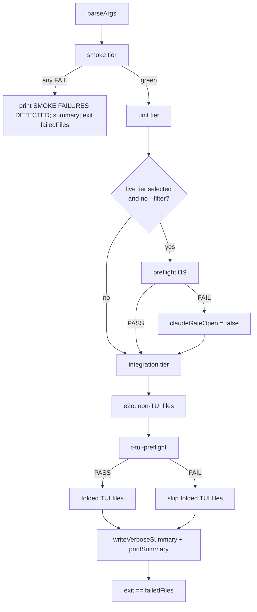

# テストアーキテクチャと継続的インテグレーション

> **Source**: [awslabs/aidlc-workflows](https://github.com/awslabs/aidlc-workflows/tree/3c3146cfd7cef33020d48e8d48d4e80d0f8c2820) — branch `v2`, commit `3c3146cf` (v2.6.40, retrieved 2026-08-21)
> **Status**: 実装から導出された as-built 仕様書であり、upstream のコードが本ドキュメントに優先する。
> **正本**: 英語版 `12-testing-ci.md`(この日本語版は参照訳。両者が食い違う場合は英語版が優先)

## 1. スコープ

本ドキュメントは、リポジトリの検証基盤 — 四層のテストスイート、discovery ベースのランナーとその出力契約、カバレッジレジストリと ratchet(ラチェット)、live e2e ドライバハーネス、そして pull request をゲートしドキュメントサイトを公開する2つの GitHub Actions ワークフロー(`ci.yml`、`docs.yml`) — を規定する。

被検対象(subjects under test)を再規定するものでは**ない**。`bun run check` が呼び出すパッケージング/parity(整合性)ガードは `10-distribution-harnesses.md` が所有する。`plugins/test-pro/tests/plugin.test.ts` がテストするプラグイン投影は `11-plugin-system.md` が所有する。カバレッジレジストリが列挙する argv ディスパッチを持つ CLI ツールは `09-cli-tools.md` が所有する。カバレッジの*ユニット*として現れるセンサー、フック、ステージ、監査イベントは、それぞれ `06-sensors.md`、`07-hooks.md`、`04-stage-protocol.md`、`03-state-audit-runtime.md` が所有する。

以下はすべて実装から導出したものである。リポジトリ自身の `docs/` ツリーがコードと食い違う箇所が2箇所あり、§9 で明示的に取り上げる。

---

## 2. テスト層モデル

### 2.1 四つのレベル

スイートは全体が TypeScript で書かれ、`bun test` によって実行され、`tests/` 配下のちょうど四つのレベルディレクトリへ整理されている。`tests/README.md:3-5` はその契約を「**discovered, not registered**(登録ではなく発見される)」と明記している — ランナーはレベルディレクトリを走査し、見つけたすべての `*.test.ts` を実行する。

| Level | Directory | Files | Runner flag | Parallelism | Isolation rule |
| --- | --- | ---: | --- | --- | --- |
| smoke | `tests/smoke/` | 13 | `--smoke` | forced serial | 構造検証のみ。LLM も credential も使わない |
| unit | `tests/unit/` | 226 | `--unit` | forced serial | 単一コンポーネントの隔離。プロセス内 import または決定的なツール spawn |
| integration | `tests/integration/` | 106(+ discovered plugin ファイル1件) | `--integration` | `--parallel N` を尊重 | コンポーネント横断の契約。live サブセットは Claude preflight でゲートされる |
| e2e | `tests/e2e/` | 71 | `--e2e` | `--parallel N` を尊重 | フルライフサイクル、worktree、レンダリング済み端末のジャーニー |

件数は `find tests/<level> -name '*.test.ts' -type f | wc -l` に基づく(§11 参照)。

smoke と unit の forced-serial(強制直列)規則は、ランナー内の単一の式である。

```text
const effectiveParallel = level === "smoke" || level === "unit" ? 1 : args.parallel;
```

(`tests/run-tests.ts:829`。同じ固定は partitioner(パーティショナー)側でも `tests/run-tests.ts:809` に繰り返されている: `const pinnedSerial = level === "smoke" || level === "unit";`)

### 2.2 レベルディレクトリ外のファイル

`find tests -name '*.test.ts' -type f | wc -l` は 419 を返すが、四つのレベルディレクトリの合計は 416 である。残る3件は以下である。

- `tests/lib/bun-junit-to-meta.test.ts`
- `tests/harness/sdk-drive.calibration.test.ts`
- `tests/harness/kiro-acp-drive.calibration.test.ts`

`levelFiles()` は `join(SCRIPT_DIR, level)`(`tests/run-tests.ts:757`)のみを読み、`discoverClaims()` は `TEST_TIERS`(`tests/gen-coverage-registry.ts:589-594`、`:928-930`)のみを走査する。**したがってこの3ファイルは、いかなるプロファイルでも `bun tests/run-tests.ts` によって実行されることは決してなく、カバレッジ claim(申告)に一切寄与しない。** 実行できるのは `bun test <path>` としてのみである。calibration(較正)ファイルは、`mechanismFromSegment`(`tests/gen-coverage-registry.ts:142-148`)が参照する SDK/ACP ドライバ較正層であり、`calibration` というファイル名セグメントを mechanism `sdk` に写像する。

### 2.3 プラグインコンテンツテストは integration 層に折り込まれる

プラグインスイートはプラグインと同じ場所(`plugins/<name>/tests/*.test.ts`)に存在し、レベルディレクトリの下にはない。`pluginTestFiles()` は `plugins/*/tests/*.test.ts`(`tests/run-tests.ts:742-754`)を任意個数発見し、`levelFiles()` はそれらを **integration** 層のみに追加する(`tests/run-tests.ts:770-776`)。本コミット時点ではそのようなファイルはちょうど1件存在する: `plugins/test-pro/tests/plugin.test.ts`。

すべてのプラグインが文字どおり `plugin.test.ts` という名前のファイルを出荷することが期待されているため、ランナーはプラグインの結果を、裸のベース名ではなく修飾名 `plugin-<plugin>-<stem>` でキー付けする(`tests/run-tests.ts:591-594`)。コード中の根拠は明快である: 裸のベース名をキーにすると「最後の書き込み者が勝ち、FAILING なスイートがサマリから消える」ことになるからだ(`tests/run-tests.ts:588-590`)。

### 2.4 並列層内での直列ピン留め

integration と e2e の内部では、個々のファイルはファイル名に `.serial.` というドットセグメントを含めることで並行実行から opt-out(離脱)できる。

```text
const serial = pinnedSerial || basename(file).includes(".serial.");
```

(`tests/run-tests.ts:816`)。本コミット時点でこのマーカーを持つファイルは 40 件あり(`find tests -name '*.serial.test.ts' -type f | wc -l`)、うち 39 件は `tests/e2e/` に、1件(`tests/integration/t112.serial.test.ts`)は integration にある。

### 2.5 Live/決定的な帯分け

`runFilesPartitioned()` は各層を4つのバケット — {serial, parallel} × {deterministic(決定的), Claude-required(Claude 必須)} — に分割し、決定的な帯を**完走させてから** live な帯を実行する(`tests/run-tests.ts:804-826`)。Claude-required 集合への所属は宣言されておらず、導出される(§4.3 参照)。

### 2.6 シェル面

ツリーに残っている `.sh` ファイルは2つだけである(`find tests -name '*.sh' -type f`): `tests/run-tests.sh`(POSIX ラッパ、§3.1)と `tests/harness/windows/sync.sh`。シェルのテストファイルは存在しない。`tests/smoke/t04-shell-lint.test.ts` は、awk 由来のシェルアンチパターンスキャナ2種を、残存する `.sh` コーパスに対するプロセス内 TypeScript の lint として保持している(`tests/smoke/t04-shell-lint.test.ts:10-25`)。

`tests/hooks/pre-commit` には git フックの shim(モード `0755`)が存在する。これはフラグなしで `bash "$HOOK_DIR/../run-tests.sh"`(すなわちデフォルトプロファイル)を実行する、5行の自己位置特定ラッパである。リポジトリ内にこれを自動でインストールするものはない。

---

## 3. ランナー契約

### 3.1 エントリポイント

`tests/run-tests.sh` は16行で、正確に3つのことを行う: `$HOME/.bun/bin` を `PATH` の先頭に付加すること、`bun` が存在しない場合に exit 127 と `ERROR: bun is required to run the AI-DLC test harness` で失敗すること、そして `exec bun "$SCRIPT_DIR/run-tests.ts" "$@"` すること。自身のヘッダでは「ネイティブ Bun/TypeScript テストランナーのための POSIX 互換ラッパ」と説明されている(`tests/run-tests.sh:2`)。

`tests/run-tests.ts`(1023行)が実体のランナーである。そのヘッダは、破ってはならない公開契約を固定している: 「flags、tier banners、START/DONE markers、summary fields、verbose log dirs、debug trace locations、そして `exit == failed files` の慣習」(`tests/run-tests.ts:5-7`)。

### 3.2 フラグ

`parseArgs()`(`tests/run-tests.ts:118-213`)でパースされる。使用方法テキストは `usage()`(`tests/run-tests.ts:71-111`)にある。

| Flag | Effect |
| --- | --- |
| `--smoke` / `--unit` / `--integration` / `--e2e` | ちょうどそのレベルを選択する。組み合わせ可能 |
| `--ci` | smoke + unit + integration |
| `--release`、`--all` | smoke + unit + integration + e2e。`fullProfile` を設定する |
| *(レベルフラグなし)* | smoke + unit + integration をデフォルトとする(`tests/run-tests.ts:207-211`) |
| `--verbose` | ファイルごとのログを `tests/logs/<utc-stamp>-p<pid>/` に書き出す |
| `--debug` | `--verbose` を含意する。子プロセス出力をライブでストリーミングし、ドライバの NDJSON トレースを書き出す |
| `--no-llm` | すべての live-model ゲートを強制的に閉じる。`AIDLC_NO_LLM=1` 経由でも可 |
| `--filter PAT` | ファイルのベース名**と**修飾名の両方に対する JS の正規表現 |
| `--parallel N` / `-P N` | 並列対応可能な層において最大 N 個のファイルを同時実行。デフォルトは1 |
| `-h`、`--help` | usage を表示して exit 0 |
| *(その他)* | `failUsage("Unknown flag: " + arg)`、exit 1 |

`--parallel` は `/^[1-9][0-9]*$/` に対して検証され、失敗時には `ERROR: --parallel requires a positive integer (got: '<value>')` を stderr に書き、exit **2** する(`tests/run-tests.ts:185-190`)。不正な `--filter` の正規表現も同様に、`ERROR: --filter must be a valid JavaScript regex: <err>` で exit 2 する(`tests/run-tests.ts:220-223`)。

`--filter` はベース名と表示名の両方に対してマッチングされる。これにより、表示された `plugin-<plugin>-<stem>` という名前を `--filter` にコピーしたユーザが、空虚な green(成功)実行を見るのではなく何かを選択できるようにしている(`tests/run-tests.ts:596-599`)。

### 3.3 実行順序と fail-fast

`main()`(`tests/run-tests.ts:917-1011`)は、以下の順で実行する。

1. **smoke** 層 — もし smoke のいずれかのファイルが失敗した場合、`SMOKE FAILURES DETECTED -- aborting before unit/integration levels` を出力して即座に return する(`tests/run-tests.ts:921-927`)。これはランナー内で唯一の fail-fast である。
2. **unit** 層。
3. **Claude preflight** — live 対応の層が選択されており `--filter` が有効でない場合、`## Preflight Health Check (Claude CLI validation)` のバナーの下、`tests/integration/t19.test.ts` を単独で実行する。これが失敗した場合、ランナーは `PREFLIGHT FAILURE -- skipping remaining Claude-dependent tests` を出力し、`claudeGateOpen = false` を設定する(`tests/run-tests.ts:931-947`)。
4. **integration** 層。preflight が既に実行済みなら `t19.test.ts` を除外する。
5. **e2e** 層。3つのサブフェーズに分かれる: すべての非 TUI ファイル、次に `## E2E TUI Capability Gate` バナーの下で `tests/e2e/t-tui-preflight.serial.test.ts` を単独実行、その preflight が通った場合に限り折り込まれた TUI ファイル群(`tests/run-tests.ts:965-1005`)。



テキストによる代替: smoke が最初に走り、失敗すると実行全体を中止する。unit がそれに続く。Claude preflight が `claudeGateOpen` を切り替えることで live な integration/e2e ファミリーをゲートする。e2e は非 TUI ファイル、続いて TUI capability preflight、その preflight が通った場合のみ TUI ファイルの順で実行される。プロセスは失敗したファイル数を exit code として終了する。

### 3.4 ファイルごとの実行と `.meta` サイドカー

各ファイルは `bun test <file> --reporter=junit --reporter-outfile=<tmp>` として spawn される(`tests/run-tests.ts:682-687`)。ランナーは実行前に `=== START <base> ===`、実行後に `--- PASS|FAIL: <base> ---` と `=== DONE <base> (<STATUS>) ===` を出力する(`tests/run-tests.ts:667`、`:704-708`)。スキップされたファイルは `=== SKIP <base> ===` と `--- SKIP: <base> (Claude substrate unavailable; derived live mechanism) ---` を出力する(`tests/run-tests.ts:601-606`)。

Bun の JUnit XML は `tests/lib/bun-junit-to-meta.ts` によって、6行の bash で source 可能なサイドカーへ正規化される。この契約は `tests/lib/bun-junit-to-meta.ts:56-62` に逐語で明記されている。

```text
NAME=<basename, no extension>
STATUS=<PASS|FAIL>
TESTS=<count of testcases>
FAILED=<count of failures>
DURATION=<seconds, may be float>
RC=<process exit code>
```

見落としやすい微妙な点は `--bun-rc` チャネルである。Bun は、本当に空のスイート(exit 0)の場合と、import 時に throw するテストファイル(exit non-zero)の場合の両方で outfile を書き出さない。XML 上の信号はバイト単位で同一になる。そのため `buildMeta(xml, name, bunRc)` は `parsed.failed > 0 || (bunRc !== null && bunRc !== 0)` の場合に `STATUS=FAIL` を設定し、クラッシュのケースでは `failed = 1` を合成することで、失敗が集計結果に可視化されるようにする(`tests/lib/bun-junit-to-meta.ts:262-280`。根拠は `:48-53`)。ランナーは常に子プロセスの実際の rc を `buildMeta(xml, name, run.rc)` として渡す(`tests/run-tests.ts:697`)。

`NAME` と `DURATION` はそれぞれ `[A-Za-z0-9._-]` と `^[0-9]+(\.[0-9]+)?$` にサニタイズされ、bash の消費者側の `source <meta>` が注入されたシェルを実行できないようになっている(`tests/lib/bun-junit-to-meta.ts:141-154`)。

### 3.5 集計、サマリ、終了コード

`aggregateTierResults()` は結果ディレクトリ内のすべての `*.meta` を読み、`TESTS`/`FAILED` を合算し、`STATUS=FAIL` の**ファイル**が1つ現れるごとに `failedFiles` をインクリメントし、その後 meta を削除する(`tests/run-tests.ts:415-429`)。`printSummary()` は次の固定ブロックを出力する(`tests/run-tests.ts:839-852`)。

```text
Test files: <n>
Failed files: <n>
Total assertions: <n>
Failed assertions: <n>
RESULT: PASS|FAIL
```

`main()` は `failedFiles` を return し、トップレベルの `process.exit(rc)` がそれを伝播する(`tests/run-tests.ts:1010`、`:1017`)。**終了コードは真偽値ではなく、失敗したファイルの数そのものと等しい。** `tests/integration/t112.serial.test.ts` は、この不変条件を較正する専用テストである — N ∈ {0,1,2,3} に対して正確に N 個の失敗ファイルとダミーの成功ファイルを配置し、ランナーが N を exit することをアサートする(`tests/integration/t112.serial.test.ts:1-22`)。`tests/smoke/t05-run-tests-parallel.test.ts` は、公開されているランナー表面の残りをカバーする: `--parallel` の検証と exit 2、バナーのタグ付け、START/DONE の交互出現、直列と並列でのサマリの等価性、失敗の伝播、`_results` サイドカーのクリーンアップ、`--no-llm` ゲートの挙動(ケース一覧は `tests/smoke/t05-run-tests-parallel.test.ts:159-543`)。

### 3.6 「パスセットの完全性」

Upstream には検証すべき列挙済みパス一覧が**存在しない**。ランナーはファイル一覧を受け付けず、レベルは実行ごとにディスクから読み取られる(`tests/run-tests.ts:756-778`)。同等の保証はリスト方式ではなく構造方式で与えられている。

- **登録ではなく発見** — レベルディレクトリ配下の新しいファイルは、ランナーへの編集ゼロで拾われる(`tests/README.md:5-7`)。新しい `plugins/*/tests/` スイートについても同様である(`tests/run-tests.ts:736-741`)。
- **結果キーの一意性** — プラグイン修飾された `.meta` 名により、失敗したファイルが同名の兄弟によってマスクされることを防ぐ(§2.3)。
- **母集団の鮮度** — カバレッジレジストリは `--check` のたびに列挙済みユニット母集団をディスクから再計算する。誰も claim していない新しいサブコマンド/イベント/スコープ/ステージ/フック/関数は CI を失敗させる(§4)。
- **stale パスの掃引** — `tests/integration/t55-test-suite-drift.test.ts` は `tests/`、`docs/`、フレームワークツリーに対する stale パスとバージョンマーカーの掃引であり、リネームでぶら下がった参照が残った場合を検出する(`tests/README.md:74`。`tests/integration/t55-test-suite-drift.test.ts:1-45`)。

### 3.7 並列化の仕組み

`runFileBand()` は境界付きの `Set<Promise<void>>` を保持し、実行中の件数が `effectiveParallel` に達するたびに `Promise.race(executing)` を await する(`tests/run-tests.ts:780-802`)。stdout の順序は**プロセス内の promise チェーンによるミューテックス**、`withStdoutLock()` によって保たれる(`tests/run-tests.ts:431-445`): 各ファイルが完了すると、その出力ブロックは他のワーカーに対して原子的にフラッシュされる。`--debug` かつ並列モードでは、ライブの子プロセス出力に `[<basename>]` が接頭されるため、重なり合うストリームでも帰属を追跡できる(`tests/run-tests.ts:671`)。

### 3.8 タイミングのシーム

Upstream は乗算的な time-scaling factor(時間スケーリング係数)を使用**しない**。タイミングのシームは、ファイルごとの絶対秒数バジェットであり、`AIDLC_TEST_TIMEOUT` から、ファイルごとのデフォルト値とともに読み取られる。例えば以下のとおりである。

```text
const TIMEOUT_S = Number.parseInt(process.env.AIDLC_TEST_TIMEOUT ?? "600", 10);
```

(`tests/integration/t21.test.ts:121`)。この慣習は72ファイル中114回出現する(`grep -rn 'AIDLC_TEST_TIMEOUT' tests`)。デフォルト値は12種類あり — 120、180、300、420、600、900、1200、1500、1800、2400、3600、4200秒 — 120秒(`tests/integration/t23.test.ts:80`)から4200秒(`tests/e2e/t-exec-codex-journey-workspace.serial.test.ts:61`。3600秒は `tests/e2e/t-tui-t139-revision-loop-idempotency.serial.test.ts:98` と `tests/e2e/t-acp-kiro-journey-workspace.serial.test.ts:83` にも現れる)まで幅がある。注目すべきは、この変数がランナーではなくテストファイル側から読まれる点である: `grep` によれば `tests/run-tests.ts` に代入は存在しない。`tests/`、`core/`、`harness/`、`scripts/` のいずれにも `TEST_TIME_FACTOR` あるいはそれに相当するスカラー値は存在しない。

別途、docs はスケーリングつまみではなくハードウェア前提を記録している: e2e 層のテストごとの `bun:test` タイムアウトは `c5.4xlarge` を基準に較正されており、それより小さいマシンでは「並列負荷の下で決定的な Bolt/ランタイムテストが偽の timeout に陥る」("tips deterministic Bolt/runtime tests into spurious timeouts under parallel load")(`docs/reference/09-testing.md:153`)。

### 3.9 ランナーが課すスイート全体の隔離

すべての子プロセスは固定の環境オーバーレイを受け取る(`tests/run-tests.ts:643-651`)。

| Variable | Value | Purpose (from `tests/run-tests.ts:608-642`) |
| --- | --- | --- |
| `AIDLC_TEST_NAME` | ファイルのベース名 | ドライバに対してテストを識別する |
| `AIDLC_SKIP_ARTIFACT_GUARD` | `1` | ほとんどの state/orchestrate テストは、artifact が一切ない裸の fixture に対して approve/advance を駆動する。`t185-stage-artifact-guard` はこれを解除して enforcement(強制)を検査する |
| `AIDLC_SKIP_HUMAN_PRESENCE_GUARD` | `1` | HUMAN_TURN presence gate についても同様。`t188-human-presence-gate` がこれを解除する |
| `AIDLC_SKIP_SUMMARY_CONFIRMATION_GUARD` | `1` | consolidated-summary(統合サマリ)の receipt(受領)ガードについても同様 |
| `AIDLC_SKIP_REVISION_BACKSTOP` | `1` | approve 時の gate-revision backstop についても同様。`t205` がこれを解除する |
| `AIDLC_ALLOW_DIRECT_AUDIT_EVENTS` | `1` | fixture が公開 CLI を通じて権限を伴う監査イベントを追記できるようにする |

Git はスイート全体を通じて隔離されている。`createIsolatedGitConfig()` は、ログディレクトリ内にモード `0600` の config を書き出し、`commit.gpgsign=false`、`tag.gpgsign=false`、そしてシステム・グローバル・コマンドの各スコープから収集したすべての保護対象 `safe.directory` 値を含める(`tests/run-tests.ts:502-535`)。子プロセスはその後 `GIT_CONFIG_GLOBAL=<that file>` と `GIT_CONFIG_SYSTEM=/dev/null`(win32 では `NUL`、`tests/run-tests.ts:32`)を伴って実行され、コマンドスコープの注入変数(`GIT_CONFIG`、`GIT_CONFIG_COUNT`、`GIT_CONFIG_PARAMETERS`、`GIT_CONFIG_KEY_<n>`、`GIT_CONFIG_VALUE_<n>`)はすべて子プロセスの環境から削除される(`tests/run-tests.ts:653-666`)。

ログディレクトリはプロセスごとである: `tests/logs/<utc-stamp>-p<pid>` は**非再帰的**な `mkdirSync` で作成される。これにより、残留した衝突は、2つのランナーが黙ってディレクトリを共有し互いの `.meta` ファイルを削除し合うのではなく、大きなエラーとして表れる(`tests/run-tests.ts:266-278`)。`--verbose` なしの場合、ランナーは `mkdtempSync` の一時ディレクトリを使用し、終了時にそれを削除する(`tests/run-tests.ts:280-282`、`:1016`)。

ランナーはまた、何かを実行する前に `.claude/settings.json` の `env` エントリを `process.env` にインポートする。ファイルがパースできない場合は失敗ではなく警告を出す(`tests/run-tests.ts:249-261`)。

---

## 4. カバレッジレジストリと ratchet

`tests/gen-coverage-registry.ts`(1349行)は*面(surface)*カバレッジの仕組みであり、行カバレッジの仕組みではない。自身のヘッダに設計が記されている: フレームワークのユニットをディスクから列挙し、各ユニットを claim(申告)しているテストファイルを発見し、両者を mechanism ゲートを介して結合し、`tests/.coverage-registry.json` を出力する(`tests/gen-coverage-registry.ts:3-9`)。

### 4.1 呼び出し方

```text
bun tests/gen-coverage-registry.ts            # regenerate + write the 3 files
bun tests/gen-coverage-registry.ts --check    # CI drift guard (exit 1 on drift)
bun tests/gen-coverage-registry.ts --print    # regenerate to stdout, write nothing
```

(`tests/gen-coverage-registry.ts:37-40`。ディスパッチは `:1291-1347`)。成功時の出力行は `coverage registry: OK (fresh, guards green, ratchet held)` である(`tests/gen-coverage-registry.ts:1300`)。

### 4.2 列挙済み母集団(結合の左辺)

すべての列挙器は `core/` ではなく**生成された** `dist/claude/` 投影から読み込む: `TOOLS_DIR = <root>/dist/claude/.claude/tools`(`tests/gen-coverage-registry.ts:69-74`)、`HOOKS_DIR = <root>/dist/claude/.claude/hooks`(`:75`)、ステージは `dist/claude/.claude/aidlc-common/stages` から、レガシーフォールバックとして `dist/claude/.claude/skills/aidlc/stages`(`:85-95`)。これが健全と言えるのは、`bun run check` が最初に `scripts/package.ts --check` を実行し、コミット済みの `dist/` を新規ビルドとバイト単位で diff しているからに過ぎない(`10-distribution-harnesses.md` 参照)。

| Unit class | Enumerator | Source read | minMechanism |
| --- | --- | --- | --- |
| `function` | `enumerateExportedFunctions`(`:550`) | `aidlc-lib.ts` + `aidlc-graph.ts` 内のトップレベルの `export function\|const\|class` | `none` |
| `audit` | `enumerateAuditEvents`(`:418`) | `aidlc-audit.ts` 内の `VALID_EVENT_TYPES` の Set リテラル | `none` |
| `scope` | `enumerateScopes`(`:447`) | `data/scope-grid.json`(フォールバックは `scope-mapping.json`)のキー | `none` |
| `stage` | `enumerateStages`(`:462`) | `stages/<phase>/` 配下のすべての `*.md`、id は `<phase>/<slug>` | `none` |
| `hook` | `enumerateHooks`(`:482`) | `hooks/` 配下のすべての `*.ts` | `none` |
| `subcommand` | `enumerateSubcommands`(`:400`) | 13個の宣言済みツールの argv ディスパッチ | `cli` |
| `render-surface` | `enumerateRenderSurfaces`(`:524`) | `aidlc-statusline.ts` 内の名前付きアンカー7個 | `tui` |

`TOOL_DESCRIPTORS`(`tests/gen-coverage-registry.ts:250-264`)は13個の CLI ツールと、それぞれが読み取るべき構文要素を指定する: 11個の `switch (<var>)` ディスパッチ(`aidlc-state`、`-audit`、`-bolt`、`-jump`、`-knowledge`、`-log`、`-worktree`、`-validate`、`-learnings`、`-sensor`、`-utility`)と、2つのオブジェクトテーブル(`aidlc-graph` の `COMMANDS`、`aidlc-runtime` の `SUBCOMMANDS`)。

render-surface の列挙器は fail-loud(大きく失敗する)方式である: アンカーが見つからない場合、`render-surface enumerator: anchor "<a>" for unit "<id>" not found in aidlc-statusline.ts — the render branch was renamed or removed.` を throw する(`tests/gen-coverage-registry.ts:531-535`)。これは、無音に縮小した母集団が退行したブランチをカバー済みとして通してしまうことを防ぐためである。

### 4.3 Claim(結合の右辺)と mechanism の導出

Claim は、`parseCoversHeader()`(`tests/gen-coverage-registry.ts:874`)がパースする先頭の `// covers:` / `# covers:` コメントブロックで宣言され、`/\b([a-z][a-z0-9-]*):([A-Za-z0-9_][\w./:-]*)/g`(`:911`)で id にマッチングされる。走査されるのは四つのレベルディレクトリのみである(`:589-594`、`:928-930`)。

テストの**mechanism**は宣言されるものではなく、テスト本体が実際に呼び出すドライバから導出される。`mechanismsOf()`(`tests/gen-coverage-registry.ts:676-702`)は、コメントと `import` 行が `codeView()`(`:791` で宣言、`:680` で呼び出し)によって除去された本体に対して導出を行う。

- `driveAidlc(` → `sdk`
- `tui-drive.ts` の spawn → `tui`
- `runOrchestrateNext(` または `drivesCliSurface(code)` → `cli`
- ドライバが見つからない場合 → `mechanismOfTestFile()`(`:623`)によるファイル名のドットセグメントへのフォールバック。未知のセグメントに対してはデフォルトで `none` になる

ラダー(順位付け)は `MECHANISMS = ["none", "cli", "sdk", "tui"]`(`:129`)である。ゲートは guarantee(保証)原則である: claim がカウントされるのは `Math.max(...ranks(claim.mechanisms)) >= rank(unit.minMechanism)` を満たす場合である(`tests/gen-coverage-registry.ts:1047-1050`)。ステータスは `covered`、`UNDER-MECHANISM`(claim は存在するがすべて弱すぎる)、`DEFERRED-tui`(claim がなく、`minMechanism === "tui"` の場合)、`UNCOVERED` のいずれかである(`:1052-1062`)。

同じ本体由来のシグナルがランナーの live ゲーティングも駆動する。`claudeDependenciesOf()` は、live な Claude 基盤を必要とするドライバのサブセットを返す — `sdk`、`tui`(**コードが `claude` バイナリを名指ししている場合のみ**)、そして `claude -p` / `claude --print` の spawn に対する `cli-claude`(`tests/gen-coverage-registry.ts:707-717`)。`discoverClaudeRequiredTests()`(`tests/harness/claude-gate.ts:21-50`)は integration + e2e を走査し、依存集合が空でないすべてのファイルについて行を返す。`import.meta.main` ブロック(`:52-60`)は1行に1パスを出力する(`console.log(rows.map((r) => r.file).join("\n"))` は `:58`、または `--json` 指定時は JSON で)。ランナーはこれを spawn し、その結果を skip set(スキップ集合)として使用する(`tests/run-tests.ts:323-341`、`:359-365`)。本コミット時点でこのゲートは **52** ファイル(integration 24、e2e 28)を報告する。

### 4.4 出力とガード

`--check` は4つの検査を行う(`tests/gen-coverage-registry.ts:1199-1280`)。

1. **Anti-rot guard (a)** — すべてのユニットクラスが0件より多くのユニットを列挙しなければならない。さもなければ `ANTI-ROT GUARD (a) FAILED: unit class(es) enumerated ZERO units: ...`(`:1209-1213`)。
2. **Anti-rot guard (b)** — 各ツールについて、構造化パーサーが数えたサブコマンド数は、同じバランスの取れたブロックに対する独立の正規表現カウント(`subcommandsForTool` `:346` 対 `independentSubcommandCount` `:359`)と一致していなければならない。さもなければ `ANTI-ROT GUARD (b) FAILED: <tool> subcommand parser counted N but the independent dispatch-site count is M.`(`:1222-1226`)。
3. **Freshness diff(鮮度差分)** — 再生成されたレジストリは、コミット済みの `tests/.coverage-registry.json` とバイト単位で同一でなければならない。さもなければ `FRESHNESS DIFF FAILED: the enumerated universe changed but tests/.coverage-registry.json was not regenerated.` と80行の diff を出力する(`:1243-1249`、`lineDiff` は `:1180`)。
4. **Ratchet(ラチェット)** — 各クラスについて、covered(カバー済み)件数は、コミット済みの `tests/.coverage-ratchet.json` ベースラインを下回ってはならない。さもなければ `RATCHET FAILED: class "<c>" covered count DROPPED from B (baseline) to N.`(`:1269-1274`)。

素の generate(生成)コマンドはガード (a) と (b) を再実行し、失敗時には書き込みを拒否する(`tests/gen-coverage-registry.ts:1306-1323`)。したがって腐敗したレジストリがコミットされることはない。

本コミット時点でのコミット済みの状態(`tests/.coverage-registry.json:22-41`、`tests/.coverage-ratchet.json`)。

| Class | Enumerated | Covered |
| --- | ---: | ---: |
| function | 345 | 170 |
| audit | 86 | 44 |
| scope | 11 | 11 |
| stage | 33 | 11 |
| hook | 17 | 17 |
| subcommand | 108 | 96 |
| render-surface | 7 | 7 |
| **total** | **607** | **356** |

(`total: 607` は `tests/.coverage-registry.json:23` からの転記である。covered の合計は七つの ratchet 値の和である。)

### 4.5 ratchet はどのように CI ゲートになるのか

`--check` はどのワークフローステップからも直接呼び出されない。**unit** 層の内側から強制される: `tests/unit/gen-coverage-registry.test.ts:556-575` は `gen-coverage-registry.ts --check` を、`AIDLC_COVERAGE_*` の環境変数オーバーライドを**一切与えず**、実際のコミット済みファイルに対して spawn し、`committed coverage registry is STALE — run 'bun tests/gen-coverage-registry.ts' to regenerate tests/.coverage-registry.json + .coverage-ratchet.json.` で失敗する。CI の `test` ジョブが unit 層を実行するため、ratchet はすべての PR をゲートする。

このジェネレータは4つの環境シームを公開しており、周辺のテストが実際のツリーではなく一時ツリー上で ratchet を証明できるようにしている: `AIDLC_COVERAGE_SRC_ROOT`、`AIDLC_COVERAGE_TESTS_DIR`、`AIDLC_COVERAGE_REGISTRY`、`AIDLC_COVERAGE_RATCHET`(`tests/gen-coverage-registry.ts:59-68`)。

**不一致(コードとコードコメント)。** `tests/gen-coverage-registry.ts:106-110` は、読者を `tests/coverage-exclusions.json` へ「このツールと同じ場所にある」("lives alongside this tool")「正当な L-CODE 除外のレビュアー向けドキュメント」として案内している。本コミット時点でそのファイルは存在しない(`ls tests/coverage-exclusions.json` → `No such file or directory`)。何もそれを読まないため不在は無害だが、コメント自体は stale(古い)ままである。

---

## 5. E2E ハーネス

### 5.1 ドライバモジュール

`tests/harness/` には live 層で共有されるドライバと fixture が置かれている(15エントリ。`tests/harness/windows/` はサブランブックである)。

| Module | Role |
| --- | --- |
| `sdk-drive.ts` | Bedrock 上の Claude Agent SDK を介して `/aidlc` を駆動する。`driveAidlc()` を公開する(`tests/harness/sdk-drive.ts:1-25`) |
| `tui-drive.ts` | 実際の対話的 TUI を駆動し、レンダリングされたグリッドをキャプチャする(§5.2) |
| `exec-drive.ts` | codex / copilot / opencode / cursor 向けのヘッドレス CLI プロジェクトセットアップと呼び出し(`tests/harness/exec-drive.ts:1-30`) |
| `kiro-acp-drive.ts` | `kiro-cli acp` をターンごとに駆動する |
| `kiro-ide-driver.ts` | Kiro IDE デスクトップアプリを駆動する |
| `claude-gate.ts` | Claude 依存のファイル集合を導出する(§4.3) |
| `fixtures.ts`、`tui-fixtures.ts`、`assert.ts`、`custom-harness.ts`、`harness-matrix.ts`、`plugin-kit.ts` | スクラッチプロジェクト、アサーション、ハーネスごとの capability(能力)テーブル、プラグイン fixture |

### 5.2 `tui-drive.ts`: 2つのバックエンド、1つのサブコマンド面

`tests/harness/tui-drive.ts:17-42` はこの分岐を明記している。

- **darwin / linux** — **tmux** バックエンド。デタッチされたセッションが tmux サーバー上に存在するため、`start` / `send` / `capture` / `wait` / `kill` の各呼び出しは、名前で再アタッチする新規プロセスとなる。
- **win32** — **node-pty** バックエンド。*bun ではなく node の下で*spawn される("node-pty input wedges under bun on Windows, microsoft/node-pty #748"、`tui-drive.ts:25-26`)。`<resolved-node> --experimental-strip-types tui-drive.ts` として呼び出される。node-pty にはサーバーが存在しないため、`start` は pty を保持する長命なデーモンを fork し、`pty.onData` を同じ cols/rows の **`@xterm/headless`** `Terminal` にパイプし、ポーリングごとに再構築されたグリッドをディスクにスナップショットする。`send`/`capture`/`wait`/`kill` は、ディスク上の2つのチャネルに対する薄いクライアントである。生の pty ストリームを `@xterm/headless` に通すことで、Windows の `capture` は `tmux capture-pane` が返すのと同じ current-screen(現在画面)グリッドを返すようになり、テスト層にプラットフォーム分岐がゼロで済む。

ヘッダには明示的な正直な注記がある: Windows バックエンドは「本セッションでは(Windows ホストがないため)検証できない … end-to-end で証明済みだと想定してはならない — tmux パスはそうだが」("CANNOT be validated in this session (no Windows host) ... Do not assume it is proven end-to-end — the tmux path is")(`tests/harness/tui-drive.ts:44-48`)。

サブコマンド面は両バックエンドで同一である: `start`、`send`、`wait`、`capture`、`kill`、`answer-gate`(`tests/harness/tui-drive.ts:50-80`)。`answer-gate` は AI-DLC の `AskUserQuestion` シーケンスに、各タブごとの推奨デフォルトを選ぶことで応答し、**ディスク上の**シグナルで終了する。画面上で判定することは決してない(`tests/harness/tui-drive.ts:74-77`)。

`tests/harness/windows/` は Windows 検証ホストをプロビジョニングする: `windows-test.cfn.yaml`(SSM 経由の Windows Server 2022)、`setup.ps1`(node-pty がネイティブビルドステップを持つため、bun ではなく **npm で** `node-pty` + `@xterm/headless` をインストールする)、`run.ps1` / `run-all.ps1`、`ssm-run.ts`、`sync.ts`、`sync.sh`。`tests/unit/t152-windows-portability.test.ts:42` は依存関係プローブ文字列 `require('node-pty'); require('@xterm/headless')` を固定している。

### 5.3 どのハーネスが e2e テスト対象か

7つのハーネスツリーが存在する(`ls harness` → `claude codex copilot cursor kiro kiro-ide opencode`)。e2e ファイルはドライバファミリーごとに命名されている。

| Prefix | Driver | Live gate | Files |
| --- | --- | --- | ---: |
| `t-tui-*` | tmux/node-pty TUI(`claude`、`t-tui-kiro-*` には `kiro-cli`) | `AIDLC_TUI_LIVE`、`AIDLC_KIRO_TUI_LIVE` | 22 |
| `t-acp-kiro-*` | `kiro-acp-drive.ts` | `AIDLC_KIRO_ACP_LIVE` | 8 |
| `t-exec-codex-*` | `exec-drive.ts` | `AIDLC_CODEX_EXEC_LIVE` | 5 |
| `t-exec-copilot-*` | `exec-drive.ts` | `AIDLC_COPILOT_EXEC_LIVE` | 1 |
| `t-run-cursor-*` | `exec-drive.ts` | `AIDLC_CURSOR_RUN_LIVE` | 1 |
| `t-run-opencode-*` | `exec-drive.ts` | `AIDLC_OPENCODE_RUN_LIVE` | 1 |
| `t-ide-kiro-*` | `kiro-ide-driver.ts` | `AIDLC_KIRO_IDE_LIVE` | 1 |

残りの32個の e2e ファイルは番号付きジャーニー(`t01`–`t138`、`t301`)であるが、そのすべてが決定的というわけではない: そのうち10個は §4.3 の body-derived(本体由来)な Claude スキップ集合に含まれ、CI の `--no-llm` の下で名前によって SKIP される。これは、それらが SDK ドライバを呼び出しているため `claudeDependenciesOf()` が `sdk` とマークするからである(`tests/gen-coverage-registry.ts:707-717`)。この10個は `t52-workflow-state-progression`、`t53`、`t54-workflow-audit-completeness`、`t55-workflow-init-then-resume`、`t56-workflow-forward-jump`、`t57-workflow-backward-jump`、`t59-workflow-depth-override`、`t122-stop-hook-e2e`、`t126-emitter-pairing-cofire`、`t138-scope-exclusion-counts` である — すなわち、ワークフローライフサイクルと stop-hook のジャーニーは live ゲート下にある。したがって決定的な残りは **22** ファイルであり、スコープごとの Bolt worktree(`t60`–`t67`)、監査の fork/merge(`t07`)、swarm referee(`t134`)、halt-and-ask の保存/破棄/リトライ相関(`t09`–`t11`)、Bolt runtime-graph の fork(`t12`)、express スコープルーティング(`t301`)をカバーする。

`tests/harness/plugin-kit.ts:595-609` は正典となるハーネス→ゲート対応表(`LIVE_GATES` / `liveGateFor`)を保持している。`claude → AIDLC_CLAUDE_SDK_LIVE`、`kiro → AIDLC_KIRO_ACP_LIVE`、`codex → AIDLC_CODEX_EXEC_LIVE`、`copilot → AIDLC_COPILOT_EXEC_LIVE`、`opencode → AIDLC_OPENCODE_RUN_LIVE`、`cursor → AIDLC_CURSOR_RUN_LIVE` とマッピングする。

### 5.4 `LIVE_MODEL_GATES` リストと `--no-llm`

ランナーは9つのゲートを const タプルとして宣言する(`tests/run-tests.ts:33-43`): `AIDLC_CLAUDE_SDK_LIVE`、`AIDLC_TUI_LIVE`、`AIDLC_KIRO_ACP_LIVE`、`AIDLC_KIRO_TUI_LIVE`、`AIDLC_CODEX_EXEC_LIVE`、`AIDLC_COPILOT_EXEC_LIVE`、`AIDLC_CURSOR_RUN_LIVE`、`AIDLC_KIRO_IDE_LIVE`、`AIDLC_OPENCODE_RUN_LIVE`。`--no-llm`(または `AIDLC_NO_LLM=1`)はこれらすべてを `"0"` に設定し(`tests/run-tests.ts:287-289`)、`--no-llm: forcing all live-model gates closed; deterministic tests still run` を出力し、`claudeGateOpen = false` を設定することで、すべての Claude 由来のファイルが名前によって SKIP されるようにする(`tests/run-tests.ts:310-317`)。

逆に、`--all`/`--release` と `--debug` を組み合わせると、明示的に設定されていない限り **`AIDLC_TUI_LIVE=1` をデフォルト**にし、どちらの分岐を取ったかを出力する(`tests/run-tests.ts:296-307`)。

### 5.5 開発依存関係

`package.json:17-25` はハーネススタックを固定している。

| Package | Version | Used by |
| --- | --- | --- |
| `@anthropic-ai/claude-agent-sdk` | `0.3.158` | `sdk-drive.ts`(SDK 契約はこの正確なバージョンに対して文書化されている、`tests/harness/sdk-drive.ts:9`) |
| `node-pty` | `1.1.0` | Windows TUI バックエンド |
| `@xterm/headless` | `^5.5.0` | Windows のグリッド再構築 |
| `@biomejs/biome` | `2.4.16` | lint(`biome.json` の `$schema` ピンと一致) |
| `bun-types` | `^1.3.13` | 型 |
| `smol-toml` | `1.7.0` | ツール内での TOML パース |
| `typescript` | `^6.0.3` | `tsc --noEmit` |

この `package.json` は `private: true` であり、`aidlc-workflows-dev` という名前を持つ点に注意。その description(説明)には、生成された `dist/<harness>/` 配布物が「この private パッケージを要求せずに bun 経由で動作する」("run via bun without requiring this private package")と記されている(`package.json:11`)。

---

## 6. `ci.yml` — PR ゲート

トリガー(`.github/workflows/ci.yml:15-26`): ブランチ `v2` に対する `pull_request`(タイプは `opened`、`synchronize`、`reopened` — 修正時の再実行の意味を曖昧にしないよう明示的に宣言されている)、および `workflow_dispatch`。**`push` トリガーは存在しない** — CI は `v2` へのマージ時には実行されない。

トップレベルの `permissions: contents: read`(`:28-29`)。Concurrency group(並行性グループ)は `ci-${{ github.ref }}`、`cancel-in-progress: true`(`:32-34`)。

4つのジョブがあり、すべて `runs-on: ubuntu-latest`、相互に **`needs:` なし** — 並列に実行され、独立にゲートする。

| Job id | Display name | Condition | Command |
| --- | --- | --- | --- |
| `check`(`:37`) | Contract checks (parity + typecheck + lint) | 常時 | `bun run check`(`:54`) |
| `test`(`:56`) | Tests (smoke + unit) | 常時 | `bun tests/run-tests.ts --smoke --unit --parallel 8`(`:72`) |
| `test-deep`(`:74`) | Tests (integration + e2e, deterministic) | 常時、`timeout-minutes: 90`(`:80`) | `bun tests/run-tests.ts --integration --e2e --no-llm --parallel 8`(`:100`) |
| `changelog-guard`(`:102`) | Changelog completeness | `if: github.event_name == 'pull_request'`(`:106`) | `bun scripts/ci-changelog-guard.ts "${{ github.event.pull_request.base.sha }}"`(`:126`) |

すべてのジョブは `actions/checkout@de0fac2e…`(v6.0.2)で checkout し、`oven-sh/setup-bun@0c5077e5…`(v2.2.0、`bun-version: '1.3.14'` に固定)で bun をインストールする。最初の3つは `bun install --frozen-lockfile` を実行する。`changelog-guard` はこれを実行しない(`git` と `bun` のみを必要とするため)が、PR のベースコミットがディスク上にあるようにするため `fetch-depth: 0` を設定する(`:111-112`)。

### 6.1 ワークフローに記録された設計意図

ヘッダ(`.github/workflows/ci.yml:3-14`)には、2つの重要な判断が記されている。

- Live-model なテストは**明示的に** `--no-llm` によって除外される — 「credential をたまたま持たないランナー上で無音の skip による pass に頼るのではなく、ランナーがすべての live ゲートを強制的に閉じ、導出された Claude 依存ファイルを名前でスキップする。これにより green な実行が意味を持ち続ける」("the runner force-closes every live gate and skips the derived Claude-dependent files by name — rather than silently passing-by-skip on a runner that happens to lack credentials, so a green run stays meaningful.")。
- 決定的な deep 層が存在するのは、「swarm-merge のリグレッションが一度、green な smoke+unit ゲートをすり抜けて出荷されたことがある。それを検出したテスト(t49)は、このゲートが以前は一度も実行していなかった integration 層に存在する」("a swarm-merge regression once shipped through a green smoke+unit gate: the test that caught it (t49) lives in the integration tier this gate previously never ran.")からである。

`test-deep` のステップコメントは、`--no-llm` の下で生き残るものを名指ししている: 「swarm/Bolt referee と audit の fork/merge パス(t49、t07、t134)、パッケージングと parity の契約、そしてジャーニー/境界スイート」("the swarm/Bolt referee and audit fork/merge paths (t49, t07, t134), the packaging and parity contracts, and the journey/boundary suites")、そして「fixture の git リポジトリはハーメティック(自己完結の config を持つ)であるため、ランナーの git identity は不要」("Fixture git repos are hermetic (self-owned config), so no runner git identity is required")と付記している(`.github/workflows/ci.yml:91-98`) — §3.9 の分離済み git の仕組みである。

### 6.2 Changelog ガードの契約

`scripts/ci-changelog-guard.ts`(95行)は単一の不変条件を強制する: **PR は既存の CHANGELOG エントリを決して削除してはならない**(`:1-2`)。

- 使用方法: `bun scripts/ci-changelog-guard.ts <base-ref>`。引数が不足している場合 → exit **2**(`:53-57`)。
- 見出しの形: `/^## \[[0-9]+\.[0-9]+\.[0-9]+\]/`。「二つのガードが何を見出しとみなすかで意見が食い違わないよう」("so the two guards never disagree about what counts as a heading")意図的に `tests/unit/t68` と「歩調を合わせて」("kept in lock-step")いる(`:22-24`)。
- ベーステキストは `git show <baseRef>:CHANGELOG.md` で読まれる。非ゼロのステータスは `Could not read CHANGELOG.md at base ref "<ref>": <detail>. Ensure the workflow checks out with fetch-depth: 0 and passes the base ref.` を発生させ、exit 1 する(`:37-50`、`:65-69`)。
- 削除集合 = ベースの見出し群からPRの見出し群を引いたもの。非空の場合 → `ci-changelog-guard: this PR removes CHANGELOG entries present on "<ref>":` に続けて各 `- ## [x.y.z]` と是正方法のテキストを出力し、exit 1 する(`:76-87`)。
- 成功時には `ci-changelog-guard: OK — all N CHANGELOG entries from "<ref>" preserved (M new).` を出力する(`:89-92`)。

ワークフローは `origin/<base_ref>` ではなく `github.event.pull_request.base.sha` を渡す。コメントはその理由を説明している: PR がオープンな間に `v2` にエントリが積み上がるにつれてブランチ ref が動くため、「これはガードに、それらの新しいエントリを再実行のたびに『削除された』と誤って報告させることになる」("which would make the guard falsely report those newer entries as 'removed' on any re-run")。これはまた、このジョブが `pull_request` 専用である理由でもある — `workflow_dispatch` では `github.base_ref` が空になる(`:103-105`)。

このガードは意図的に unit test ではない: 「unit test には比較対象となるベース ref が存在しない」("a unit test has no base ref to compare to")(`scripts/ci-changelog-guard.ts:8-9`)。これはバージョンと changelog の同期・見出しの一意性を守るが削除は守らない `tests/unit/t68-version-changelog-sync.test.ts` を補完するものである。

---

## 7. `docs.yml` — ドキュメント公開パイプライン

トリガー(`.github/workflows/docs.yml:3-27`): `v2` への `push`、`v2` への `pull_request`、そして `workflow_dispatch`。両方のブランチトリガーは、ビルドが消費するものだけに path フィルタされている: `docs/**`、`zensical.toml`、`scripts/docs-rewrite-links.ts`、`pyproject.toml`、`uv.lock`、そしてワークフローファイル自身。

Concurrency: group `docs-build-${{ github.ref }}`、`cancel-in-progress: ${{ github.event_name == 'pull_request' }}` — PR 検証ビルドはキャンセル可能だが、本番実行はキャンセル不可(`:38-40`)。

### 7.1 `build` ジョブ

ステップ(`.github/workflows/docs.yml:43-81`):

1. checkout(v6.0.2)
2. `astral-sh/setup-uv@08807647…`(v8.1.0、`version: '0.11.28'` に固定)
3. `actions/setup-python@a309ff8b…`(v6.2.0、`python-version: '3.12'`)
4. `oven-sh/setup-bun@0c5077e5…` — `ci.yml` とは異なり `bun-version` の pin **なし**(`:56`)
5. `uv sync --locked --group docs`
6. `bun scripts/docs-rewrite-links.ts`
7. `uv run zensical build --strict`
8. `site/roadmap.html` にレガシーリダイレクトスタブを書き、`roadmap/` を指すようにする
9. `actions/upload-pages-artifact@fc324d35…`(v5.0.0、`path: site`)。`if: github.event_name != 'pull_request'` でガードされる

docs の依存関係は単一の固定パッケージである: `docs` dependency group(`pyproject.toml`、`[dependency-groups]`)内の `zensical==0.0.51`。

### 7.2 リンク書き換えステップ

`scripts/docs-rewrite-links.ts` は、リンク先が `docs/` の**外**に解決される相対 markdown リンクを、`https://github.com/awslabs/aidlc-workflows/blob/v2` 配下の GitHub blob URL に書き換える(`scripts/docs-rewrite-links.ts:20`)。コミット済みの markdown はローカルクローンが実ファイルへナビゲートできるよう相対リンクのままにしており、この書き換えは CI の checkout 上でその場に適用されるだけで、決してコミットされない(`:1-7`)。

CI のセマンティクスにとって重要な性質が2つある。

- **フェンス付きコードブロックはスキップされる。** スキャナは CommonMark のフェンス(`^ {0,3}(\`{3,}|~{3,})`)を追跡し、その内側のリンクはそのままにする(`:9-11`、`:44-52`)。
- **リンク先の欠落はデプロイを失敗させる。** 書き換えられるすべてのリンク先はディスク上に存在しなければならない。見つからないものはそれぞれ `MISSING: <file>:<line> -> <target>` を出力し、最後にスクリプトは `docs-rewrite-links: N link target(s) missing on disk - refusing to deploy dead links.` を出力して exit 1 する(`scripts/docs-rewrite-links.ts:70`、`:88-91`)。ワークフローのコメントも同じ契約を述べている: 「デッドリンクが出荷される前にビルドを失敗させるため、リンクされたファイルが見つからない場合、このスクリプトは exit 1 する」("The script exits 1 if a linked file is missing, failing the build before a dead link ships")(`.github/workflows/docs.yml:64-65`)。

### 7.3 `deploy` ジョブ

`if: github.event_name != 'pull_request'`、`needs: build`、ジョブレベルの concurrency group は `pages`、`cancel-in-progress: false`(「デプロイ途中で決してキャンセルしない、Pages スターターワークフローの慣習」("never cancelled mid-deploy, the Pages starter-workflow convention")、`:88-91`)、ジョブレベルの `permissions: pages: write, id-token: write`、environment `github-pages`、単一ステップ `actions/deploy-pages@cd2ce8fc…`(v5.0.0)は `:99-100`(`.github/workflows/docs.yml:83-100`、ファイルの最終行)。トップレベルの permissions は `contents: read` のままであり、昇格した grant はこのジョブのみにスコープされる(`:29-33`)。

### 7.4 サイト設定

`zensical.toml`(183行)は `site_name`、`site_url = "https://awslabs.github.io/aidlc-workflows/"`、そして README、User Guide、Harness Engineer/Developer Reference の各セクション、`roadmap.md` をカバーする明示的な `nav` 配列を宣言する(`zensical.toml:1-142`)。テーマは `material` で、`navigation.sidebar`、`navigation.sections`、`navigation.top`、`search.suggest`、`content.code.copy`、および light/slate のパレットを備える(`:144-169`)。Markdown 拡張機能は `admonition`、`pymdownx.details`、`md_in_html`(ハーネスごとの `<details markdown="1">` インストールブロックがサイト上と GitHub 上の*両方*でレンダリングされるようにするため)、そして `mermaid` を `mermaid` クラスにマッピングするカスタムフェンス `pymdownx.superfences` を有効化する(`:171-183`)。

---

## 8. ローカルと CI の契約

### 8.1 `bun run check`

`package.json:6-10` は3つのスクリプトを定義しており、**`test` スクリプトは存在しない**。

```text
typecheck: tsc --noEmit -p tsconfig.json && tsc --noEmit -p tsconfig.tests.json && tsc --noEmit -p tsconfig.adapters.json
lint:      biome check --error-on-warnings core harness scripts plugins tests
check:     bun scripts/package.ts --check && bun run typecheck && bun run lint
```

- `tsconfig.tests.json`(13行)はルート config を extend し、`tests/**/*.ts` と `plugins/*/tests/**/*.ts` を含める。ただし fixture ツリー2つ、`tests/fixtures/brownfield-todo/**`(「スタンドアロンの React/Vite fixture 依存はリポジトリルートにインストールされていない」("Standalone React/Vite fixture dependencies are not installed at the repository root"))と `tests/fixtures/v05-mr9-sensor-fire/failing-type-check/**`(「この fixture はセンサーテストのために本物のコンパイラ診断を生成しなければならない」("This fixture must produce a real compiler diagnostic for the sensor test"))を除く。
- `tests/tsconfig.json` はエディタ用に使われる、より狭い第二の config である: `**/*.ts` を含め `fixtures/**` を除外する。
- `tsconfig.adapters.json` は `dist/*/.*/hooks/*-adapter.ts` を含める — 「生成されたハーネスツリーにのみ存在する兄弟ツールを import する」("import sibling tools that exist only in emitted harness trees")生成済みアダプタである。そのコメントは依存関係を記している: 「`bun run check` によって実行される `package.ts --check` は、ソースと dist の parity(整合性)を強制する」("package.ts --check, run by `bun run check`, enforces source/dist parity.")。
- `biome.json` は formatter を無効化し(`"formatter": {"enabled": false}`)、`dist/**` と意図的に失敗させる linter fixture をファイル集合から除外する(`biome.json:3-5`、`:16-22`)。

### 8.2 Parity(整合性)表

| Concern | Local command | CI job/step | Parity |
| --- | --- | --- | --- |
| dist のバイト parity、typecheck(3プロジェクト)、lint | `bun run check` | `check` → `bun run check`(`ci.yml:54`) | 完全一致 — 同じスクリプト |
| smoke + unit | `bun tests/run-tests.ts`(デフォルトでは integration も追加される) | `test` → `--smoke --unit --parallel 8`(`ci.yml:72`) | CI はより高い並列度で**狭い**選択を実行する |
| 決定的な integration + e2e | `bun tests/run-tests.ts --integration --e2e --no-llm` | `test-deep`(`ci.yml:100`) | 完全一致 |
| live な integration + e2e | `bun tests/run-tests.ts --release`(CLI + credential + live ゲートとともに) | **CI では実行されない** | ローカル/マージ前のみ(`ci.yml:10-12`) |
| カバレッジレジストリの鮮度 + ratchet | `bun tests/gen-coverage-registry.ts --check` | unit 層経由の間接実行(`tests/unit/gen-coverage-registry.test.ts:556-575`) | 同等 |
| CHANGELOG 削除ガード | `bun scripts/ci-changelog-guard.ts <ref>` | `changelog-guard`(`ci.yml:126`) | 完全一致だが、ベース ref を要する |
| docs のリンク整合性 + サイトビルド | `bun scripts/docs-rewrite-links.ts` の後 `uv run zensical build --strict` | `docs.yml` `build`(`:67`、`:70`) | 完全一致。ローカル実行は `docs/` をその場で変更する |

コントリビュータ向けガイダンスはコードと整合している: `CONTRIBUTING.md:50` は `bun tests/run-tests.ts` が通ることを要求し、`:59-60` はデフォルトと `--release` の各プロファイルを列挙している。`AGENTS.md:15` と `:44` は `bash tests/run-tests.sh --help` を案内している。

この表からは2つの帰結が導かれる。

1. **ローカルデフォルトと CI の和集合は、どちらの方向にも一致していない。** デフォルトのローカルプロファイルは*live 対応*の integration 層を実行する(credential がない場合はファイルごとに SKIP する)。CI は smoke+unit と `--no-llm` の integration+e2e 実行を分離している。デフォルトプロファイルのみを実行するコントリビュータは e2e を一切実行せず、CI は live なファミリーを一切実行しない。
2. **CI は docs パスに対して `bun run check` の類似物を何も実行しない。** `docs.yml` は typecheck も lint も行わない。`ci.yml` は docs サイトをビルドしない。二つのワークフローは互いに素である。

---

## 9. ドキュメントの不一致

いずれも `docs/reference/09-testing.md` が以前の実装を記述しているケースである。

1. **CI プロファイル。** `docs/reference/09-testing.md:21` は integration 層を「When: CI push (--ci, every PR)」とラベル付けし、`:210` は「CI pipeline | L2 | `bun tests/run-tests.ts --ci`」とマッピングしている。どのワークフローも `--ci` を呼び出していない: `ci.yml:72` は `--smoke --unit --parallel 8` を実行し、`ci.yml:100` は `--integration --e2e --no-llm --parallel 8` を実行する。`ci.yml` にはそもそも `push` トリガーが存在しない(`:15-26`)。コードの挙動が正である。
2. **並列実行下での標準出力のシリアライズ。** `docs/reference/09-testing.md:375` は、bash のディレクトリミューテックス `mkdir $LOG_DIR/.stdout.lock` を「POSIX 上でアトミック — flock なしで macOS bash 3.2 でも動作する」("atomic on POSIX — works on macOS bash 3.2 without flock")と説明している。現行のランナーはプロセス内の promise チェーン `withStdoutLock()` を使用しており(`tests/run-tests.ts:431-445`)、`grep -rn 'stdout.lock' tests` は `tests/` の下ではヒットしない。観測可能な性質(ファイルごとの出力ブロックが決して交錯しないこと)は保たれているが、doc に記された機構自体はもう存在しない。

三つ目の、より小さな staleness(古さ)はコード内部にあり、§4.5 で述べたとおりである: `tests/gen-coverage-registry.ts:106-110` の `tests/coverage-exclusions.json` へのポインタは、存在しないファイルを指している。

---

## 10. Fixture

`tests/fixtures/` にはトップレベルで38エントリ、174ファイルが存在する。2つの形が支配的である。

- **State fixture** — ワークフローの特定時点を表す15個の `state-*.md` ファイル(`state-mid-ideation.md`、`state-construction-bolt1.md`、`state-completed.md`、`state-corrupted.md`、…)。これらは state/orchestrate テストが approve/advance を駆動する対象の入力であり、それゆえランナーが §3.9 のスイート全体のガードバイパスを設定している理由である。
- **Milestone/シナリオツリー** — `v05-mr3-sensors-dir/`、`v05-mr7a-rule-resolution/`、`v05-mr7b-sensor-resolution/`、`v05-mr9-sensor-fire/`、`v05-mr10-sensor-fire/`、`v05-mr11-bolt-runtime-graph/`、`v05-mr12-learnings/`、`mr9-parity/`、加えてハーネスごとの hook payload コーパス(`codex-hook-payloads/`、`copilot-hook-payloads/`、`cursor-hook-payloads/`、`kiro-hook-payloads/`)と artifact コーパス(`ideation-artifacts/`、`inception-artifacts/`、`construction-artifacts/`、`re-artifacts/`)。

2つの fixture は*意図的に壊されて*おり、そのためツールチェーンから除外されている: `tests/fixtures/v05-mr9-sensor-fire/failing-type-check/**` は `tsconfig.tests.json` から除外され、`tests/fixtures/v05-mr9-sensor-fire/failing-linter/**` は `biome.json` のファイル集合から除外されている。これらは、type-check と linter のセンサーが検出すべき本物の診断を持てるように存在する(`tsconfig.tests.json` のコメント。`biome.json:19-20`)。

---

## 11. 計測に関する注記

すべてのコマンドは upstream のクローンルートで、`HEAD = 3c3146cfd7cef33020d48e8d48d4e80d0f8c2820`(`git log -1 --format='%H %ci'` → `3c3146cf… 2026-08-21 11:53:55 +0100` で検証済み)の状態で実行した。

| Number stated | Command (predicate + target set) | Result |
| --- | --- | --- |
| smoke files = 13 | `find tests/smoke -name '*.test.ts' -type f \| wc -l` | 13 |
| unit files = 226 | `find tests/unit -name '*.test.ts' -type f \| wc -l` | 226 |
| integration files = 106 | `find tests/integration -name '*.test.ts' -type f \| wc -l` | 106 |
| e2e files = 71 | `find tests/e2e -name '*.test.ts' -type f \| wc -l` | 71 |
| `tests/` 配下の `.test.ts` 総数 = 419 | `find tests -name '*.test.ts' -type f \| wc -l` | 419 |
| レベルディレクトリ外の3ファイル | `find tests -name '*.test.ts' -type f -not -path 'tests/smoke/*' -not -path 'tests/unit/*' -not -path 'tests/integration/*' -not -path 'tests/e2e/*'` | `tests/harness/kiro-acp-drive.calibration.test.ts`、`tests/harness/sdk-drive.calibration.test.ts`、`tests/lib/bun-junit-to-meta.test.ts` |
| プラグインテストファイル数 = 1 | `find plugins -path '*/tests/*.test.ts' -type f` | `plugins/test-pro/tests/plugin.test.ts` |
| `.serial.` ファイル数 = 40 | `find tests -name '*.serial.test.ts' -type f \| wc -l` | 40(`tests/e2e/` 配下39、`tests/integration/` 配下1 — 同一コマンドのソート済み出力から) |
| シェルファイル数 = 2 | `find tests -name '*.sh' -type f` | `tests/harness/windows/sync.sh`、`tests/run-tests.sh` |
| Claude ゲート対象ファイル数 = 52 | `bun tests/harness/claude-gate.ts \| wc -l` | 52 |
| … 内訳 24 / 28 | `bun tests/harness/claude-gate.ts \| grep -c '^tests/integration/'` ; 同様に `'^tests/e2e/'` | 24 ; 28 |
| `AIDLC_TEST_TIMEOUT` = 72ファイル中114回出現 | `grep -rn 'AIDLC_TEST_TIMEOUT' tests \| wc -l` ; `grep -rln 'AIDLC_TEST_TIMEOUT' tests \| wc -l` | 114 ; 72 |
| `AIDLC_TEST_TIMEOUT` の異なるデフォルト値数 = 12、最小120秒、最大4200秒 | `grep -rno 'AIDLC_TEST_TIMEOUT ?? "[0-9]*"' tests \| sed 's/.*?? "//; s/"$//' \| sort -un` | 120 180 300 420 600 900 1200 1500 1800 2400 3600 4200(最大は `tests/e2e/t-exec-codex-journey-workspace.serial.test.ts:61`) |
| `TEST_TIME_FACTOR` なし | `grep -rn 'TEST_TIME_FACTOR\|TIME_FACTOR\|AIDLC_TEST_TIMEOUT\|timeoutFactor' tests core harness scripts` | `AIDLC_TEST_TIMEOUT` のヒットのみ |
| ハーネスツリー数 = 7 | `ls harness \| wc -l`(エントリ: claude codex copilot cursor kiro kiro-ide opencode) | 7 |
| e2e のプレフィックスごとの件数(22/8/5/1/1/1/1) | `ls tests/e2e \| grep -c '^t-tui'` ; `'^t-acp-kiro'` ; `'^t-exec-codex'` ; `'^t-exec-copilot'` ; `'^t-run-cursor'` ; `'^t-run-opencode'` ; `'^t-ide-kiro'` | 22, 8, 5, 1, 1, 1, 1 |
| Claude ゲート対象の番号付き e2e ファイル数 = 10 | `bun tests/harness/claude-gate.ts \| grep '^tests/e2e/' \| grep -vc '/t-tui'`(e2e の28行 − `t-tui` の18行) | 10 — `t122-stop-hook-e2e`、`t126-emitter-pairing-cofire`、`t138-scope-exclusion-counts`、`t52`、`t53`、`t54`、`t55`、`t56`、`t57`、`t59` |
| fixture エントリ数 = 38、fixture ファイル数 = 174 | `ls tests/fixtures \| wc -l` ; `find tests/fixtures -type f \| wc -l` | 38 ; 174 |
| `state-*.md` fixture 数 = 15 | `ls tests/fixtures/state-*.md \| wc -l` | 15 |
| `tests/harness/` エントリ数 = 15 | `ls tests/harness \| wc -l` | 15 |
| `ci.yml` のジョブ数 = 4 | `grep -n '^  [a-z-]*:$' .github/workflows/ci.yml`(`jobs:` の子をフィルタしたもの — 4ヒットは `check:`、`test:`、`test-deep:`、`changelog-guard:`) | 4 |
| `docs.yml` のジョブ数 = 2 | `grep -n '^  [a-z-]*:$' .github/workflows/docs.yml` → 3ヒット、うち `push:` はトリガーキー、`build:`/`deploy:` がジョブ | 2 |
| カバレッジレジストリ総数 = 607 ユニット | `sed -n '22,41p' tests/.coverage-registry.json`(`counts` オブジェクト) | `total: 607`、`enumeratedByClass` 345/86/11/33/17/108/7 |
| クラスごとの ratchet ベースライン | `cat tests/.coverage-ratchet.json` | function 170、audit 44、scope 11、stage 11、hook 17、subcommand 96、render-surface 7(合計356、導出値) |
| `TOOL_DESCRIPTORS` = 13ツール | `tests/gen-coverage-registry.ts:250-264` を読む(配列要素13個) | 13 |
| render-surface アンカー数 = 7 | `tests/gen-coverage-registry.ts:504-522` を読む(配列要素7個) | 7 |
| `tests/coverage-exclusions.json` の不在 | `ls tests/coverage-exclusions.json` | `No such file or directory` |
| `tests/` から `stdout.lock` が不在 | `grep -rn 'stdout.lock' tests docs` | 1ヒット、`docs/reference/09-testing.md:375` のみ |
| ファイル行数 | `wc -l tests/run-tests.ts tests/run-tests.sh tests/gen-coverage-registry.ts tests/README.md tsconfig.tests.json .github/workflows/ci.yml .github/workflows/docs.yml scripts/ci-changelog-guard.ts zensical.toml package.json` | 1023, 16, 1349, 119, 13, 126, 100, 95, 183, 27 |

導出された(計測されていない)値は上記のとおりマークされている: covered ユニットの総数356は七つの ratchet クラス値の和である。「残る32個の番号付き e2e ファイル」は 71 − (22 + 8 + 5 + 1 + 1 + 1 + 1) である。§5.3 の「決定的な22件」という数値は、この32から、Claude ゲート対象と計測された番号付きファイル10件を引いたものである。

---

## 12. 相互参照

- `bun scripts/package.ts --check` の背後にあるパッケージング/parity ガード → `10-distribution-harnesses.md`
- プラグイン投影と `plugins/<name>/tests/` の慣習 → `11-plugin-system.md`
- `subcommand` ユニットクラスを形成する argv ディスパッチを持つ CLI ツール → `09-cli-tools.md`
- `audit` クラスとして列挙される監査イベント語彙(`VALID_EVENT_TYPES`) → `03-state-audit-runtime.md`
- `stage` クラスとして列挙されるステージファイル → `04-stage-protocol.md`
- `hook` クラスとして列挙されるフック(statusline のレンダー面を含む) → `07-hooks.md`
- 意図的に失敗する fixture が `tests/fixtures/v05-mr9-sensor-fire/` の下にあるセンサー → `06-sensors.md`
