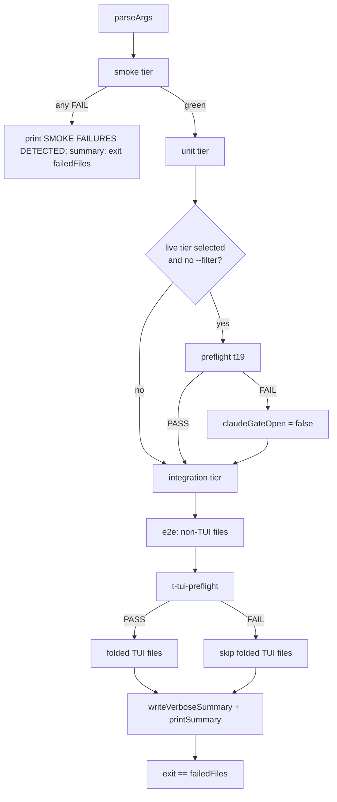

# Test Architecture and Continuous Integration

> **Source**: [awslabs/aidlc-workflows](https://github.com/awslabs/aidlc-workflows/tree/3c3146cfd7cef33020d48e8d48d4e80d0f8c2820) — branch `v2`, commit `3c3146cf` (v2.6.40, retrieved 2026-08-21)
> **Status**: As-built specification derived from the implementation; the upstream code is authoritative over this document.

## 1. Scope

This document specifies the verification substrate of the repository: the four-layer test suite,
the discovery-based runner and its output contract, the coverage registry and ratchet, the live
e2e driver harness, and the two GitHub Actions workflows (`ci.yml`, `docs.yml`) that gate pull
requests and publish the documentation site.

It does **not** re-specify the subjects under test. The packaging/parity guard invoked by
`bun run check` is owned by `10-distribution-harnesses.md`; the plugin projection tested by
`plugins/test-pro/tests/plugin.test.ts` is owned by `11-plugin-system.md`; the CLI tools whose
argv dispatch the coverage registry enumerates are owned by `09-cli-tools.md`; the sensors,
hooks, stages and audit events that appear as coverage *units* are owned by `06-sensors.md`,
`07-hooks.md`, `04-stage-protocol.md` and `03-state-audit-runtime.md` respectively.

Everything below is derived from the implementation. Two places where the repository's own
`docs/` tree disagrees with the code are called out explicitly in §9.

---

## 2. Test layer model

### 2.1 The four levels

The suite is entirely TypeScript, executed by `bun test`, and organised into exactly four level
directories under `tests/`. `tests/README.md:3-5` states the contract: the suite is
"**discovered, not registered**" — the runner walks the level directories and runs every
`*.test.ts` it finds.

| Level | Directory | Files | Runner flag | Parallelism | Isolation rule |
| --- | --- | ---: | --- | --- | --- |
| smoke | `tests/smoke/` | 13 | `--smoke` | forced serial | structural validation only; no LLM, no credentials |
| unit | `tests/unit/` | 226 | `--unit` | forced serial | single-component isolation; in-process imports or deterministic tool spawns |
| integration | `tests/integration/` | 106 (+1 discovered plugin file) | `--integration` | `--parallel N` honoured | cross-component contracts; the live subset is gated by the Claude preflight |
| e2e | `tests/e2e/` | 71 | `--e2e` | `--parallel N` honoured | full lifecycle, worktree, and rendered-terminal journeys |

Counts are from `find tests/<level> -name '*.test.ts' -type f | wc -l` (see §11).

The forced-serial rule for smoke and unit is a single expression in the runner:

```text
const effectiveParallel = level === "smoke" || level === "unit" ? 1 : args.parallel;
```

(`tests/run-tests.ts:829`; the same pin is repeated for the partitioner at
`tests/run-tests.ts:809`, `const pinnedSerial = level === "smoke" || level === "unit";`).

### 2.2 Files outside the level directories

`find tests -name '*.test.ts' -type f | wc -l` returns 419, while the four level directories sum
to 416. The three extras are:

- `tests/lib/bun-junit-to-meta.test.ts`
- `tests/harness/sdk-drive.calibration.test.ts`
- `tests/harness/kiro-acp-drive.calibration.test.ts`

`levelFiles()` only reads `join(SCRIPT_DIR, level)` (`tests/run-tests.ts:757`) and
`discoverClaims()` only walks `TEST_TIERS` (`tests/gen-coverage-registry.ts:589-594`,
`:928-930`). **These three files are therefore never executed by `bun tests/run-tests.ts` at any
profile, and never contribute coverage claims.** They are runnable only as
`bun test <path>`. The calibration files are the SDK/ACP driver calibration tier referenced by
`mechanismFromSegment` (`tests/gen-coverage-registry.ts:142-148`), which maps the
`calibration` filename segment to mechanism `sdk`.

### 2.3 Plugin content tests fold into the integration tier

Plugin suites live beside their plugin (`plugins/<name>/tests/*.test.ts`), not under a level
directory. `pluginTestFiles()` discovers any `plugins/*/tests/*.test.ts`
(`tests/run-tests.ts:742-754`) and `levelFiles()` appends them to the **integration** tier only
(`tests/run-tests.ts:770-776`). At this commit exactly one such file exists:
`plugins/test-pro/tests/plugin.test.ts`.

Because every plugin is expected to ship a file literally named `plugin.test.ts`, the runner keys
plugin results by a qualified name `plugin-<plugin>-<stem>` rather than the bare basename
(`tests/run-tests.ts:591-594`). The in-code rationale is explicit: a bare-basename key would mean
"last writer wins and a FAILING suite gets erased from the summary"
(`tests/run-tests.ts:588-590`).

### 2.4 Serial pinning inside parallel tiers

Within integration and e2e, an individual file opts out of concurrency by carrying a `.serial.`
dot-segment in its filename:

```text
const serial = pinnedSerial || basename(file).includes(".serial.");
```

(`tests/run-tests.ts:816`). 40 files carry that marker at this commit
(`find tests -name '*.serial.test.ts' -type f | wc -l`), of which 39 are in `tests/e2e/` and one
(`tests/integration/t112.serial.test.ts`) is in integration.

### 2.5 Live/deterministic banding

`runFilesPartitioned()` splits each tier into four buckets — {serial, parallel} × {deterministic,
Claude-required} — and runs the deterministic band to completion **before** the live band
(`tests/run-tests.ts:804-826`). Membership in the Claude-required set is not declared; it is
derived (see §4.3).

### 2.6 Shell surface

Only two `.sh` files remain in the tree (`find tests -name '*.sh' -type f`):
`tests/run-tests.sh` (the POSIX wrapper, §3.1) and `tests/harness/windows/sync.sh`. There are no
shell test files; `tests/smoke/t04-shell-lint.test.ts` retains the two awk-derived shell
anti-pattern scanners as an in-process TypeScript lint over whatever `.sh` corpus remains
(`tests/smoke/t04-shell-lint.test.ts:10-25`).

A git hook shim exists at `tests/hooks/pre-commit` (mode `0755`); it is a five-line self-locating
wrapper that runs `bash "$HOOK_DIR/../run-tests.sh"` with no flags — i.e. the default profile.
Nothing in the repository installs it automatically.

---

## 3. Runner contract

### 3.1 Entry points

`tests/run-tests.sh` is 16 lines and does exactly three things: prepend `$HOME/.bun/bin` to
`PATH`, fail with exit 127 and `ERROR: bun is required to run the AI-DLC test harness` when
`bun` is absent, and `exec bun "$SCRIPT_DIR/run-tests.ts" "$@"`. It is described in its own
header as a "POSIX compatibility wrapper for the native Bun/TypeScript test runner"
(`tests/run-tests.sh:2`).

`tests/run-tests.ts` (1023 lines) is the real runner. Its header pins the public contract it must
not break: "flags, tier banners, START/DONE markers, summary fields, verbose log dirs, debug
trace locations, and the `exit == failed files` convention" (`tests/run-tests.ts:5-7`).

### 3.2 Flags

Parsed in `parseArgs()` (`tests/run-tests.ts:118-213`); the usage text is `usage()`
(`tests/run-tests.ts:71-111`).

| Flag | Effect |
| --- | --- |
| `--smoke` / `--unit` / `--integration` / `--e2e` | select exactly that level; combinable |
| `--ci` | smoke + unit + integration |
| `--release`, `--all` | smoke + unit + integration + e2e; sets `fullProfile` |
| *(no level flag)* | defaults to smoke + unit + integration (`tests/run-tests.ts:207-211`) |
| `--verbose` | write per-test logs to `tests/logs/<utc-stamp>-p<pid>/` |
| `--debug` | implies `--verbose`; streams child output live and writes driver NDJSON traces |
| `--no-llm` | force every live-model gate closed; also via `AIDLC_NO_LLM=1` |
| `--filter PAT` | JS regex over the file basename **and** the qualified name |
| `--parallel N` / `-P N` | up to N concurrent files within a parallel-eligible tier; default 1 |
| `-h`, `--help` | print usage, exit 0 |
| *(anything else)* | `failUsage("Unknown flag: " + arg)`, exit 1 |

`--parallel` validates against `/^[1-9][0-9]*$/` and, on failure, writes
`ERROR: --parallel requires a positive integer (got: '<value>')` to stderr and exits **2**
(`tests/run-tests.ts:185-190`). A malformed `--filter` regex likewise exits 2 with
`ERROR: --filter must be a valid JavaScript regex: <err>` (`tests/run-tests.ts:220-223`).

`--filter` is matched against both the basename and the display name so that a user who copies a
displayed `plugin-<plugin>-<stem>` name into `--filter` selects something rather than seeing a
vacuous green run (`tests/run-tests.ts:596-599`).

### 3.3 Execution order and fail-fast

`main()` (`tests/run-tests.ts:917-1011`) runs, in order:

1. **smoke** tier — and if any smoke file failed, prints
   `SMOKE FAILURES DETECTED -- aborting before unit/integration levels` and returns immediately
   (`tests/run-tests.ts:921-927`). This is the only fail-fast in the runner.
2. **unit** tier.
3. **Claude preflight** — when a live-capable tier was selected and no `--filter` is active, runs
   `tests/integration/t19.test.ts` alone under the banner
   `## Preflight Health Check (Claude CLI validation)`. If it fails, the runner prints
   `PREFLIGHT FAILURE -- skipping remaining Claude-dependent tests` and sets `claudeGateOpen =
   false` (`tests/run-tests.ts:931-947`).
4. **integration** tier, excluding `t19.test.ts` when the preflight already ran.
5. **e2e** tier, in three sub-phases: all non-TUI files; then
   `tests/e2e/t-tui-preflight.serial.test.ts` alone under `## E2E TUI Capability Gate`; then the
   folded TUI files, but only if that preflight passed (`tests/run-tests.ts:965-1005`).



Text fallback: smoke runs first and aborts the whole run on failure; unit follows; a Claude
preflight gates the live integration/e2e families by flipping `claudeGateOpen`; e2e runs non-TUI
files, then a TUI capability preflight, then the TUI files only if that preflight passed; the
process exits with the number of failed files.

### 3.4 Per-file execution and the `.meta` sidecar

Each file is spawned as `bun test <file> --reporter=junit --reporter-outfile=<tmp>`
(`tests/run-tests.ts:682-687`). The runner prints `=== START <base> ===` before and
`--- PASS|FAIL: <base> ---` plus `=== DONE <base> (<STATUS>) ===` after
(`tests/run-tests.ts:667`, `:704-708`). Skipped files print `=== SKIP <base> ===` and
`--- SKIP: <base> (Claude substrate unavailable; derived live mechanism) ---`
(`tests/run-tests.ts:601-606`).

Bun's JUnit XML is normalised by `tests/lib/bun-junit-to-meta.ts` into a six-line, bash-sourceable
sidecar. The contract is stated verbatim at `tests/lib/bun-junit-to-meta.ts:56-62`:

```text
NAME=<basename, no extension>
STATUS=<PASS|FAIL>
TESTS=<count of testcases>
FAILED=<count of failures>
DURATION=<seconds, may be float>
RC=<process exit code>
```

The load-bearing subtlety is the `--bun-rc` channel. Bun writes **no** outfile both for a genuinely
empty suite (exit 0) and for a test file that throws at import (exit non-zero); the XML signal is
byte-identical. `buildMeta(xml, name, bunRc)` therefore sets `STATUS=FAIL` when
`parsed.failed > 0 || (bunRc !== null && bunRc !== 0)` and synthesises `failed = 1` in the crash
case so the failure is visible in the aggregate (`tests/lib/bun-junit-to-meta.ts:262-280`;
rationale at `:48-53`). The runner always supplies the child's real rc via `buildMeta(xml, name,
run.rc)` (`tests/run-tests.ts:697`).

`NAME` and `DURATION` are sanitised to `[A-Za-z0-9._-]` and `^[0-9]+(\.[0-9]+)?$` respectively so
that `source <meta>` in a bash consumer cannot execute injected shell
(`tests/lib/bun-junit-to-meta.ts:141-154`).

### 3.5 Aggregation, summary, and exit code

`aggregateTierResults()` reads every `*.meta` in the results dir, sums `TESTS`/`FAILED`, increments
`failedFiles` once per `STATUS=FAIL` **file**, then deletes the metas
(`tests/run-tests.ts:415-429`). `printSummary()` emits the fixed block
(`tests/run-tests.ts:839-852`):

```text
Test files: <n>
Failed files: <n>
Total assertions: <n>
Failed assertions: <n>
RESULT: PASS|FAIL
```

`main()` returns `failedFiles` and the top-level `process.exit(rc)` propagates it
(`tests/run-tests.ts:1010`, `:1017`). **The exit code equals the number of failed files, not a
boolean.** `tests/integration/t112.serial.test.ts` is the dedicated calibration of that invariant
— it arranges exactly N failing files for N ∈ {0,1,2,3} plus passing decoys and asserts the runner
exits N (`tests/integration/t112.serial.test.ts:1-22`). `tests/smoke/t05-run-tests-parallel.test.ts`
covers the rest of the public runner surface: `--parallel` validation and exit 2, banner tagging,
START/DONE interleaving, serial≡parallel summary equality, failure propagation, `_results` sidecar
cleanup, and the `--no-llm` gate behaviour (case list at
`tests/smoke/t05-run-tests-parallel.test.ts:159-543`).

### 3.6 "Path-set completeness"

Upstream has **no** enumerated path list to validate: the runner never accepts a file list, and
levels are read off disk each run (`tests/run-tests.ts:756-778`). The equivalent guarantees are
structural rather than list-based:

- **Discovery, not registration** — a new file under a level directory is picked up with zero
  runner edits (`tests/README.md:5-7`); the same is true of a new `plugins/*/tests/` suite
  (`tests/run-tests.ts:736-741`).
- **Result-key uniqueness** — the plugin-qualified `.meta` name prevents a failing file being
  masked by a same-named sibling (§2.3).
- **Universe freshness** — the coverage registry recomputes the enumerated unit universe from disk
  on every `--check`, so a new subcommand/event/scope/stage/hook/function that nobody claimed
  fails CI (§4).
- **Stale-path sweep** — `tests/integration/t55-test-suite-drift.test.ts` is a stale-path and
  version-marker sweep over `tests/`, `docs/` and the framework tree, catching a rename that left
  a dangling reference behind (`tests/README.md:74`;
  `tests/integration/t55-test-suite-drift.test.ts:1-45`).

### 3.7 Parallelism mechanics

`runFileBand()` maintains a bounded `Set<Promise<void>>` and awaits `Promise.race(executing)`
whenever the in-flight count reaches `effectiveParallel` (`tests/run-tests.ts:780-802`). Ordering
of stdout is preserved by an **in-process promise-chain mutex**, `withStdoutLock()`
(`tests/run-tests.ts:431-445`): each finished file's output block is flushed atomically with
respect to other workers. In `--debug` + parallel mode, live child output is prefixed with
`[<basename>]` so overlapping streams stay attributable (`tests/run-tests.ts:671`).

### 3.8 Timing seams

Upstream does **not** use a multiplicative time-scaling factor. The timing seam is a per-file
absolute budget in seconds, read from `AIDLC_TEST_TIMEOUT` with a per-file default, e.g.:

```text
const TIMEOUT_S = Number.parseInt(process.env.AIDLC_TEST_TIMEOUT ?? "600", 10);
```

(`tests/integration/t21.test.ts:121`). The convention appears 114 times across 72 files
(`grep -rn 'AIDLC_TEST_TIMEOUT' tests`), with twelve distinct defaults — 120, 180, 300, 420, 600,
900, 1200, 1500, 1800, 2400, 3600 and 4200 s — ranging from 120 s
(`tests/integration/t23.test.ts:80`) to 4200 s
(`tests/e2e/t-exec-codex-journey-workspace.serial.test.ts:61`; 3600 s appears at
`tests/e2e/t-tui-t139-revision-loop-idempotency.serial.test.ts:98` and
`tests/e2e/t-acp-kiro-journey-workspace.serial.test.ts:83`). Notably, the variable is read by the
test files, not set by the runner: `grep` shows no assignment in `tests/run-tests.ts`. There is no
`TEST_TIME_FACTOR` or equivalent scalar in `tests/`, `core/`, `harness/` or `scripts/`.

Separately, the docs record a hardware assumption rather than a scaling knob: the e2e tier's
per-test `bun:test` timeouts are calibrated for a `c5.4xlarge` and a smaller box "tips
deterministic Bolt/runtime tests into spurious timeouts under parallel load"
(`docs/reference/09-testing.md:153`).

### 3.9 Suite-wide isolation the runner imposes

Every child gets a fixed environment overlay (`tests/run-tests.ts:643-651`):

| Variable | Value | Purpose (from `tests/run-tests.ts:608-642`) |
| --- | --- | --- |
| `AIDLC_TEST_NAME` | file basename | identifies the test to drivers |
| `AIDLC_SKIP_ARTIFACT_GUARD` | `1` | most state/orchestrate tests drive approve/advance against bare fixtures with no artifacts; `t185-stage-artifact-guard` clears it to exercise enforcement |
| `AIDLC_SKIP_HUMAN_PRESENCE_GUARD` | `1` | ditto for the HUMAN_TURN presence gate; `t188-human-presence-gate` clears it |
| `AIDLC_SKIP_SUMMARY_CONFIRMATION_GUARD` | `1` | ditto for the consolidated-summary receipt guard |
| `AIDLC_SKIP_REVISION_BACKSTOP` | `1` | ditto for the approve-time gate-revision backstop; `t205` clears it |
| `AIDLC_ALLOW_DIRECT_AUDIT_EVENTS` | `1` | lets fixtures append authority-bearing audit events through the public CLI |

Git is isolated for the whole suite. `createIsolatedGitConfig()` writes a mode-`0600` config into
the log dir containing `commit.gpgsign=false`, `tag.gpgsign=false`, and every protected
`safe.directory` value harvested from the system, global, and command scopes
(`tests/run-tests.ts:502-535`). Children then run with `GIT_CONFIG_GLOBAL=<that file>` and
`GIT_CONFIG_SYSTEM=/dev/null` (`NUL` on win32, `tests/run-tests.ts:32`), and every
command-scope injection variable (`GIT_CONFIG`, `GIT_CONFIG_COUNT`, `GIT_CONFIG_PARAMETERS`,
`GIT_CONFIG_KEY_<n>`, `GIT_CONFIG_VALUE_<n>`) is deleted from the child env
(`tests/run-tests.ts:653-666`).

Log directories are per-process: `tests/logs/<utc-stamp>-p<pid>` created with a **non-recursive**
`mkdirSync` so a residual collision is a loud error rather than two runners silently sharing a
directory and deleting each other's `.meta` files (`tests/run-tests.ts:266-278`). Without
`--verbose` the runner uses an `mkdtempSync` temp dir and removes it on exit
(`tests/run-tests.ts:280-282`, `:1016`).

The runner also imports `env` entries from `.claude/settings.json` into `process.env` before
running anything, warning rather than failing if the file will not parse
(`tests/run-tests.ts:249-261`).

---

## 4. Coverage registry and ratchet

`tests/gen-coverage-registry.ts` (1349 lines) is a *surface* coverage mechanism, not a line
coverage mechanism. Its own header states the design: enumerate the framework's units from disk,
discover which test files claim to cover each unit, join the two through a mechanism gate, and emit
`tests/.coverage-registry.json` (`tests/gen-coverage-registry.ts:3-9`).

### 4.1 Invocation

```text
bun tests/gen-coverage-registry.ts            # regenerate + write the 3 files
bun tests/gen-coverage-registry.ts --check    # CI drift guard (exit 1 on drift)
bun tests/gen-coverage-registry.ts --print    # regenerate to stdout, write nothing
```

(`tests/gen-coverage-registry.ts:37-40`; dispatch at `:1291-1347`.) The success line is
`coverage registry: OK (fresh, guards green, ratchet held)`
(`tests/gen-coverage-registry.ts:1300`).

### 4.2 Enumerated universe (the left side of the join)

All enumerators read from the **generated** `dist/claude/` projection, not from `core/`:
`TOOLS_DIR = <root>/dist/claude/.claude/tools` (`tests/gen-coverage-registry.ts:69-74`),
`HOOKS_DIR = <root>/dist/claude/.claude/hooks` (`:75`), stages from
`dist/claude/.claude/aidlc-common/stages` with a legacy fallback to
`dist/claude/.claude/skills/aidlc/stages` (`:85-95`). This is sound only because `bun run check`
runs `scripts/package.ts --check` first, which byte-diffs the committed `dist/` against a fresh
build (see `10-distribution-harnesses.md`).

| Unit class | Enumerator | Source read | minMechanism |
| --- | --- | --- | --- |
| `function` | `enumerateExportedFunctions` (`:550`) | top-level `export function\|const\|class` in `aidlc-lib.ts` + `aidlc-graph.ts` | `none` |
| `audit` | `enumerateAuditEvents` (`:418`) | `VALID_EVENT_TYPES` Set literals in `aidlc-audit.ts` | `none` |
| `scope` | `enumerateScopes` (`:447`) | keys of `data/scope-grid.json` (fallback `scope-mapping.json`) | `none` |
| `stage` | `enumerateStages` (`:462`) | every `*.md` under `stages/<phase>/`, id `<phase>/<slug>` | `none` |
| `hook` | `enumerateHooks` (`:482`) | every `*.ts` under `hooks/` | `none` |
| `subcommand` | `enumerateSubcommands` (`:400`) | argv dispatch of 13 declared tools | `cli` |
| `render-surface` | `enumerateRenderSurfaces` (`:524`) | 7 named anchors in `aidlc-statusline.ts` | `tui` |

`TOOL_DESCRIPTORS` (`tests/gen-coverage-registry.ts:250-264`) names the 13 CLI tools and the
construct to read: 11 `switch (<var>)` dispatches (`aidlc-state`, `-audit`, `-bolt`, `-jump`,
`-knowledge`, `-log`, `-worktree`, `-validate`, `-learnings`, `-sensor`, `-utility`) and two object
tables (`aidlc-graph`'s `COMMANDS`, `aidlc-runtime`'s `SUBCOMMANDS`).

The render-surface enumerator is fail-loud: a missing anchor throws
`render-surface enumerator: anchor "<a>" for unit "<id>" not found in aidlc-statusline.ts — the
render branch was renamed or removed.` (`tests/gen-coverage-registry.ts:531-535`), because a
silently shrinking universe would let a regressed branch pass as covered.

### 4.3 Claims (the right side) and mechanism derivation

Claims are declared in a leading `// covers:` / `# covers:` comment block parsed by
`parseCoversHeader()` (`tests/gen-coverage-registry.ts:874`), matching ids with
`/\b([a-z][a-z0-9-]*):([A-Za-z0-9_][\w./:-]*)/g` (`:911`). Only the four level directories are
scanned (`:589-594`, `:928-930`).

A test's **mechanism** is not declared — it is derived from the drivers the test body actually
calls. `mechanismsOf()` (`tests/gen-coverage-registry.ts:676-702`) performs the derivation over a
body from which comments and `import` lines have been stripped by `codeView()` (declared at
`:791`, called at `:680`):

- `driveAidlc(` → `sdk`
- a `tui-drive.ts` spawn → `tui`
- `runOrchestrateNext(` or `drivesCliSurface(code)` → `cli`
- no driver found → fall back to the filename dot-segment via `mechanismOfTestFile()` (`:623`),
  which defaults to `none` for any unrecognised segment

The ladder is `MECHANISMS = ["none", "cli", "sdk", "tui"]` (`:129`). The gate is the
guarantee principle: a claim counts when `Math.max(...ranks(claim.mechanisms)) >=
rank(unit.minMechanism)` (`tests/gen-coverage-registry.ts:1047-1050`). Statuses are `covered`,
`UNDER-MECHANISM` (claims exist but all too weak), `DEFERRED-tui` (no claims, and
`minMechanism === "tui"`), or `UNCOVERED` (`:1052-1062`).

The same body-derived signal drives the runner's live gating.
`claudeDependenciesOf()` returns the subset of drivers that need a live Claude substrate — `sdk`,
`tui` **only when the code also names the `claude` binary**, and `cli-claude` for a
`claude -p` / `claude --print` spawn (`tests/gen-coverage-registry.ts:707-717`).
`discoverClaudeRequiredTests()` (`tests/harness/claude-gate.ts:21-50`) walks integration + e2e and
returns a row for every file with a non-empty dependency set; the `import.meta.main` block
(`:52-60`) prints one path per line (`console.log(rows.map((r) => r.file).join("\n"))` at `:58`,
or JSON under `--json`). The runner spawns it and uses the result as the skip
set (`tests/run-tests.ts:323-341`, `:359-365`). At this commit the gate reports **52** files
(24 integration, 28 e2e).

### 4.4 Outputs and guards

`--check` performs four checks (`tests/gen-coverage-registry.ts:1199-1280`):

1. **Anti-rot guard (a)** — every unit class must enumerate > 0 units; otherwise
   `ANTI-ROT GUARD (a) FAILED: unit class(es) enumerated ZERO units: ...` (`:1209-1213`).
2. **Anti-rot guard (b)** — for each tool, the structured parser's subcommand count must equal an
   independent regex count over the same balanced block
   (`subcommandsForTool` `:346` vs `independentSubcommandCount` `:359`), else
   `ANTI-ROT GUARD (b) FAILED: <tool> subcommand parser counted N but the independent
   dispatch-site count is M.` (`:1222-1226`).
3. **Freshness diff** — the regenerated registry must be byte-identical to committed
   `tests/.coverage-registry.json`; otherwise `FRESHNESS DIFF FAILED: the enumerated universe
   changed but tests/.coverage-registry.json was not regenerated.` plus an 80-line diff
   (`:1243-1249`, `lineDiff` at `:1180`).
4. **Ratchet** — for each class, the covered count must not drop below the committed
   `tests/.coverage-ratchet.json` baseline; otherwise
   `RATCHET FAILED: class "<c>" covered count DROPPED from B (baseline) to N.` (`:1269-1274`).

A plain generate re-runs guards (a) and (b) and refuses to write on failure
(`tests/gen-coverage-registry.ts:1306-1323`), so a rotted registry is never committed.

Committed state at this commit (`tests/.coverage-registry.json:22-41`,
`tests/.coverage-ratchet.json`):

| Class | Enumerated | Covered |
| --- | ---: | ---: |
| function | 345 | 170 |
| audit | 86 | 44 |
| scope | 11 | 11 |
| stage | 33 | 11 |
| hook | 17 | 17 |
| subcommand | 108 | 96 |
| render-surface | 7 | 7 |
| **total** | **607** | **356** |

(`total: 607` is transcribed from `tests/.coverage-registry.json:23`; the covered total is the sum
of the seven ratchet values.)

### 4.5 How the ratchet becomes a CI gate

`--check` is not invoked by any workflow step directly. It is enforced from inside the **unit**
tier: `tests/unit/gen-coverage-registry.test.ts:556-575` spawns `gen-coverage-registry.ts --check`
with **no** `AIDLC_COVERAGE_*` env overrides against the real committed files, and fails with
`committed coverage registry is STALE — run 'bun tests/gen-coverage-registry.ts' to regenerate
tests/.coverage-registry.json + .coverage-ratchet.json.` Because CI's `test` job runs the unit
tier, the ratchet gates every PR.

The generator exposes four env seams so the surrounding test can prove the ratchet on a temp tree
rather than the real one: `AIDLC_COVERAGE_SRC_ROOT`, `AIDLC_COVERAGE_TESTS_DIR`,
`AIDLC_COVERAGE_REGISTRY`, `AIDLC_COVERAGE_RATCHET` (`tests/gen-coverage-registry.ts:59-68`).

**Discrepancy (code vs code comment).** `tests/gen-coverage-registry.ts:106-110` points the reader
at `tests/coverage-exclusions.json` as "reviewer-facing documentation of legit L-CODE exclusions"
that "lives alongside this tool". That file does not exist at this commit
(`ls tests/coverage-exclusions.json` → `No such file or directory`). Nothing reads it, so the
absence is inert, but the comment is stale.

---

## 5. E2E harness

### 5.1 Driver modules

`tests/harness/` holds the drivers and fixtures shared by the live tiers (15 entries;
`tests/harness/windows/` is a sub-runbook):

| Module | Role |
| --- | --- |
| `sdk-drive.ts` | drives `/aidlc` through the Claude Agent SDK on Bedrock; exposes `driveAidlc()` (`tests/harness/sdk-drive.ts:1-25`) |
| `tui-drive.ts` | drives a real interactive TUI and captures the rendered grid (§5.2) |
| `exec-drive.ts` | headless CLI project setup + invocation for codex / copilot / opencode / cursor (`tests/harness/exec-drive.ts:1-30`) |
| `kiro-acp-drive.ts` | drives `kiro-cli acp` turn-by-turn |
| `kiro-ide-driver.ts` | drives the Kiro IDE desktop app |
| `claude-gate.ts` | derives the Claude-dependent file set (§4.3) |
| `fixtures.ts`, `tui-fixtures.ts`, `assert.ts`, `custom-harness.ts`, `harness-matrix.ts`, `plugin-kit.ts` | scratch projects, assertions, per-harness capability table, plugin fixtures |

### 5.2 `tui-drive.ts`: two backends, one subcommand surface

`tests/harness/tui-drive.ts:17-42` specifies the split:

- **darwin / linux** — a **tmux** backend. A detached session lives in the tmux server, so each
  `start` / `send` / `capture` / `wait` / `kill` invocation is a fresh process re-attaching by
  name.
- **win32** — a **node-pty** backend, spawned *under node, never bun* ("node-pty input wedges
  under bun on Windows, microsoft/node-pty #748", `tui-drive.ts:25-26`), invoked as
  `<resolved-node> --experimental-strip-types tui-drive.ts`. Because node-pty has no server,
  `start` forks a long-lived daemon that owns the pty, pipes `pty.onData` into an
  **`@xterm/headless`** `Terminal` of the same cols/rows, and snapshots the reconstructed grid to
  disk each poll; `send`/`capture`/`wait`/`kill` are thin clients over two on-disk channels.
  Feeding the raw pty stream through `@xterm/headless` makes Windows `capture` return the same
  current-screen grid that `tmux capture-pane` returns, so the test layer needs zero platform
  branches.

The header carries an explicit honesty note: the Windows backend "CANNOT be validated in this
session (no Windows host) ... Do not assume it is proven end-to-end — the tmux path is"
(`tests/harness/tui-drive.ts:44-48`).

The subcommand surface is identical on both backends: `start`, `send`, `wait`, `capture`, `kill`,
`answer-gate` (`tests/harness/tui-drive.ts:50-80`). `answer-gate` answers an AI-DLC
`AskUserQuestion` sequence by taking the recommended default per tab and terminates on an
**on-disk** signal, never on the screen (`tests/harness/tui-drive.ts:74-77`).

`tests/harness/windows/` provisions the Windows validation host: `windows-test.cfn.yaml`
(Windows Server 2022 via SSM), `setup.ps1` (installs `node-pty` + `@xterm/headless` **with npm**,
not bun, because node-pty has a native build step), `run.ps1` / `run-all.ps1`, `ssm-run.ts`,
`sync.ts`, `sync.sh`. `tests/unit/t152-windows-portability.test.ts:42` pins the dependency probe
string `require('node-pty'); require('@xterm/headless')`.

### 5.3 Which harnesses are e2e-tested

Seven harness trees exist (`ls harness` → `claude codex copilot cursor kiro kiro-ide opencode`).
E2E files are named by driver family:

| Prefix | Driver | Live gate | Files |
| --- | --- | --- | ---: |
| `t-tui-*` | tmux/node-pty TUI (`claude`, and `kiro-cli` for `t-tui-kiro-*`) | `AIDLC_TUI_LIVE`, `AIDLC_KIRO_TUI_LIVE` | 22 |
| `t-acp-kiro-*` | `kiro-acp-drive.ts` | `AIDLC_KIRO_ACP_LIVE` | 8 |
| `t-exec-codex-*` | `exec-drive.ts` | `AIDLC_CODEX_EXEC_LIVE` | 5 |
| `t-exec-copilot-*` | `exec-drive.ts` | `AIDLC_COPILOT_EXEC_LIVE` | 1 |
| `t-run-cursor-*` | `exec-drive.ts` | `AIDLC_CURSOR_RUN_LIVE` | 1 |
| `t-run-opencode-*` | `exec-drive.ts` | `AIDLC_OPENCODE_RUN_LIVE` | 1 |
| `t-ide-kiro-*` | `kiro-ide-driver.ts` | `AIDLC_KIRO_IDE_LIVE` | 1 |

The remaining 32 e2e files are numbered journeys (`t01`–`t138`, `t301`), but they are not all
deterministic: 10 of them fall into the body-derived Claude skip set of §4.3 and are SKIPped by
name under CI's `--no-llm`, because they call the SDK driver and so `claudeDependenciesOf()`
marks them `sdk` (`tests/gen-coverage-registry.ts:707-717`). Those 10 are
`t52-workflow-state-progression`, `t53`, `t54-workflow-audit-completeness`,
`t55-workflow-init-then-resume`, `t56-workflow-forward-jump`, `t57-workflow-backward-jump`,
`t59-workflow-depth-override`, `t122-stop-hook-e2e`, `t126-emitter-pairing-cofire` and
`t138-scope-exclusion-counts` — i.e. the workflow-lifecycle and stop-hook journeys are live-gated.
The deterministic remainder is therefore **22** files, covering Bolt worktrees per scope
(`t60`–`t67`), audit fork/merge (`t07`), the swarm referee (`t134`), halt-and-ask preservation /
discard / retry correlation (`t09`–`t11`), Bolt runtime-graph fork (`t12`) and express scope
routing (`t301`).

`tests/harness/plugin-kit.ts:595-609` holds the canonical harness→gate table
(`LIVE_GATES` / `liveGateFor`), mapping `claude → AIDLC_CLAUDE_SDK_LIVE`,
`kiro → AIDLC_KIRO_ACP_LIVE`, `codex → AIDLC_CODEX_EXEC_LIVE`,
`copilot → AIDLC_COPILOT_EXEC_LIVE`, `opencode → AIDLC_OPENCODE_RUN_LIVE`,
`cursor → AIDLC_CURSOR_RUN_LIVE`.

### 5.4 The `LIVE_MODEL_GATES` list and `--no-llm`

The runner declares nine gates as a const tuple (`tests/run-tests.ts:33-43`):
`AIDLC_CLAUDE_SDK_LIVE`, `AIDLC_TUI_LIVE`, `AIDLC_KIRO_ACP_LIVE`, `AIDLC_KIRO_TUI_LIVE`,
`AIDLC_CODEX_EXEC_LIVE`, `AIDLC_COPILOT_EXEC_LIVE`, `AIDLC_CURSOR_RUN_LIVE`,
`AIDLC_KIRO_IDE_LIVE`, `AIDLC_OPENCODE_RUN_LIVE`. `--no-llm` (or `AIDLC_NO_LLM=1`) sets every one
of them to `"0"` (`tests/run-tests.ts:287-289`), prints
`--no-llm: forcing all live-model gates closed; deterministic tests still run`, and sets
`claudeGateOpen = false` so every Claude-derived file is SKIPped by name
(`tests/run-tests.ts:310-317`).

Conversely, `--all`/`--release` combined with `--debug` **defaults `AIDLC_TUI_LIVE=1`** unless it
was set explicitly, printing which branch it took (`tests/run-tests.ts:296-307`).

### 5.5 Dev dependencies

`package.json:17-25` pins the harness stack:

| Package | Version | Used by |
| --- | --- | --- |
| `@anthropic-ai/claude-agent-sdk` | `0.3.158` | `sdk-drive.ts` (the SDK contract is documented against this exact version, `tests/harness/sdk-drive.ts:9`) |
| `node-pty` | `1.1.0` | Windows TUI backend |
| `@xterm/headless` | `^5.5.0` | Windows grid reconstruction |
| `@biomejs/biome` | `2.4.16` | lint (matches `biome.json`'s `$schema` pin) |
| `bun-types` | `^1.3.13` | types |
| `smol-toml` | `1.7.0` | TOML parsing in tooling |
| `typescript` | `^6.0.3` | `tsc --noEmit` |

Note that this `package.json` is `private: true` and named `aidlc-workflows-dev`; its description
states that the generated `dist/<harness>/` distributions "run via bun without requiring this
private package" (`package.json:11`).

---

## 6. `ci.yml` — the PR gate

Triggers (`.github/workflows/ci.yml:15-26`): `pull_request` on branch `v2` with types
`opened`, `synchronize`, `reopened` (declared explicitly so re-run-on-modify is unambiguous), plus
`workflow_dispatch`. **There is no `push` trigger** — CI does not run on merges to `v2`.

Top-level `permissions: contents: read` (`:28-29`). Concurrency group `ci-${{ github.ref }}` with
`cancel-in-progress: true` (`:32-34`).

Four jobs, all `runs-on: ubuntu-latest`, with **no `needs:` between them** — they run in parallel
and gate independently.

| Job id | Display name | Condition | Command |
| --- | --- | --- | --- |
| `check` (`:37`) | Contract checks (parity + typecheck + lint) | always | `bun run check` (`:54`) |
| `test` (`:56`) | Tests (smoke + unit) | always | `bun tests/run-tests.ts --smoke --unit --parallel 8` (`:72`) |
| `test-deep` (`:74`) | Tests (integration + e2e, deterministic) | always, `timeout-minutes: 90` (`:80`) | `bun tests/run-tests.ts --integration --e2e --no-llm --parallel 8` (`:100`) |
| `changelog-guard` (`:102`) | Changelog completeness | `if: github.event_name == 'pull_request'` (`:106`) | `bun scripts/ci-changelog-guard.ts "${{ github.event.pull_request.base.sha }}"` (`:126`) |

Every job checks out with `actions/checkout@de0fac2e…` (v6.0.2) and installs bun with
`oven-sh/setup-bun@0c5077e5…` (v2.2.0) pinned to `bun-version: '1.3.14'`. The first three run
`bun install --frozen-lockfile`; `changelog-guard` does not (it needs only `git` and `bun`), but
does set `fetch-depth: 0` so the PR base commit is on disk (`:111-112`).

### 6.1 Design intent recorded in the workflow

The header (`.github/workflows/ci.yml:3-14`) states the two load-bearing decisions:

- Live-model tests are excluded **explicitly** by `--no-llm` — "the runner force-closes every live
  gate and skips the derived Claude-dependent files by name — rather than silently passing-by-skip
  on a runner that happens to lack credentials, so a green run stays meaningful."
- The deterministic deep tiers exist because "a swarm-merge regression once shipped through a
  green smoke+unit gate: the test that caught it (t49) lives in the integration tier this gate
  previously never ran."

`test-deep`'s step comment names what survives `--no-llm`: "the swarm/Bolt referee and audit
fork/merge paths (t49, t07, t134), the packaging and parity contracts, and the journey/boundary
suites", and notes "Fixture git repos are hermetic (self-owned config), so no runner git identity
is required" (`.github/workflows/ci.yml:91-98`) — the isolated-git mechanism of §3.9.

### 6.2 Changelog guard contract

`scripts/ci-changelog-guard.ts` (95 lines) enforces a single invariant: **a PR must never delete an
existing CHANGELOG entry** (`:1-2`).

- Usage: `bun scripts/ci-changelog-guard.ts <base-ref>`; missing argument → exit **2**
  (`:53-57`).
- Heading shape: `/^## \[[0-9]+\.[0-9]+\.[0-9]+\]/`, deliberately "kept in lock-step" with
  `tests/unit/t68` "so the two guards never disagree about what counts as a heading" (`:22-24`).
- Base text is read with `git show <baseRef>:CHANGELOG.md`; a non-zero status raises
  `Could not read CHANGELOG.md at base ref "<ref>": <detail>. Ensure the workflow checks out with
  fetch-depth: 0 and passes the base ref.` and exits 1 (`:37-50`, `:65-69`).
- Removed set = base headings minus PR headings. Non-empty → prints
  `ci-changelog-guard: this PR removes CHANGELOG entries present on "<ref>":` followed by each
  `- ## [x.y.z]`, plus remediation text, and exits 1 (`:76-87`).
- Success prints `ci-changelog-guard: OK — all N CHANGELOG entries from "<ref>" preserved (M new).`
  (`:89-92`).

The workflow passes `github.event.pull_request.base.sha`, not `origin/<base_ref>`. The comment
explains why: the branch ref moves as `v2` accrues entries while the PR is open, "which would make
the guard falsely report those newer entries as 'removed' on any re-run"
(`.github/workflows/ci.yml:121-124`). This is also why the job is `pull_request`-only —
`github.base_ref` is empty on `workflow_dispatch` (`:103-105`).

The guard is deliberately not a unit test: "a unit test has no base ref to compare to"
(`scripts/ci-changelog-guard.ts:8-9`). It complements `tests/unit/t68-version-changelog-sync.test.ts`,
which guards version⇄changelog sync and heading uniqueness but not deletion.

---

## 7. `docs.yml` — the documentation publishing pipeline

Triggers (`.github/workflows/docs.yml:3-27`): `push` to `v2`, `pull_request` to `v2`, and
`workflow_dispatch`. Both branch triggers are path-filtered to exactly what the build consumes:
`docs/**`, `zensical.toml`, `scripts/docs-rewrite-links.ts`, `pyproject.toml`, `uv.lock`, and the
workflow file itself.

Concurrency: group `docs-build-${{ github.ref }}` with
`cancel-in-progress: ${{ github.event_name == 'pull_request' }}` — PR validation builds are
cancellable, production runs are not (`:38-40`).

### 7.1 `build` job

Steps (`.github/workflows/docs.yml:43-81`):

1. checkout (v6.0.2)
2. `astral-sh/setup-uv@08807647…` (v8.1.0) pinned to `version: '0.11.28'`
3. `actions/setup-python@a309ff8b…` (v6.2.0) with `python-version: '3.12'`
4. `oven-sh/setup-bun@0c5077e5…` — **without** a `bun-version` pin, unlike `ci.yml` (`:56`)
5. `uv sync --locked --group docs`
6. `bun scripts/docs-rewrite-links.ts`
7. `uv run zensical build --strict`
8. write a legacy redirect stub to `site/roadmap.html` pointing at `roadmap/`
9. `actions/upload-pages-artifact@fc324d35…` (v5.0.0) with `path: site`, guarded by
   `if: github.event_name != 'pull_request'`

The docs dependency is a single pinned package: `zensical==0.0.51` in the `docs` dependency group
(`pyproject.toml`, `[dependency-groups]`).

### 7.2 The link-rewrite step

`scripts/docs-rewrite-links.ts` rewrites relative markdown links whose targets resolve **outside**
`docs/` into GitHub blob URLs under
`https://github.com/awslabs/aidlc-workflows/blob/v2` (`scripts/docs-rewrite-links.ts:20`). The
committed markdown keeps relative links so local clones navigate to the real files; the rewrite is
applied in place on the CI checkout and never committed (`:1-7`).

Two properties matter for CI semantics:

- **Fenced code is skipped.** The scanner tracks CommonMark fences (`^ {0,3}(\`{3,}|~{3,})`) and
  leaves links inside them verbatim (`:9-11`,`:44-52`).
- **Missing targets fail the deploy.** Every rewritten target must exist on disk; each miss prints
  `MISSING: <file>:<line> -> <target>` and, at the end, the script prints
  `docs-rewrite-links: N link target(s) missing on disk - refusing to deploy dead links.` and
  exits 1 (`scripts/docs-rewrite-links.ts:70`, `:88-91`). The workflow comment states the same contract:
  "The script exits 1 if a linked file is missing, failing the build before a dead link ships"
  (`.github/workflows/docs.yml:64-65`).

### 7.3 `deploy` job

`if: github.event_name != 'pull_request'`, `needs: build`, job-level concurrency group `pages`
with `cancel-in-progress: false` ("never cancelled mid-deploy, the Pages starter-workflow
convention", `:88-91`), job-level `permissions: pages: write, id-token: write`, environment
`github-pages`, single step `actions/deploy-pages@cd2ce8fc…` (v5.0.0) at `:99-100`
(`.github/workflows/docs.yml:83-100`, the file's last line). Top-level permissions stay
`contents: read`; the elevated
grants are scoped to this job only (`:29-33`).

### 7.4 Site configuration

`zensical.toml` (183 lines) declares `site_name`, `site_url =
"https://awslabs.github.io/aidlc-workflows/"`, and an explicit `nav` array covering the README,
the User Guide, the Harness Engineer/Developer Reference sections, and `roadmap.md`
(`zensical.toml:1-142`). Theme is `material` with `navigation.sidebar`, `navigation.sections`,
`navigation.top`, `search.suggest`, `content.code.copy` and light/slate palettes
(`:144-169`). Markdown extensions enable `admonition`, `pymdownx.details`, `md_in_html` (so the
per-harness `<details markdown="1">` install blocks render on the site *and* on GitHub), and a
`pymdownx.superfences` custom fence mapping `mermaid` to a `mermaid` class (`:171-183`).

---

## 8. Local vs CI contract

### 8.1 `bun run check`

`package.json:6-10` defines three scripts and **no `test` script**:

```text
typecheck: tsc --noEmit -p tsconfig.json && tsc --noEmit -p tsconfig.tests.json && tsc --noEmit -p tsconfig.adapters.json
lint:      biome check --error-on-warnings core harness scripts plugins tests
check:     bun scripts/package.ts --check && bun run typecheck && bun run lint
```

- `tsconfig.tests.json` (13 lines) extends the root config and includes `tests/**/*.ts` plus
  `plugins/*/tests/**/*.ts`, excluding two fixture trees: `tests/fixtures/brownfield-todo/**`
  ("Standalone React/Vite fixture dependencies are not installed at the repository root") and
  `tests/fixtures/v05-mr9-sensor-fire/failing-type-check/**` ("This fixture must produce a real
  compiler diagnostic for the sensor test").
- `tests/tsconfig.json` is a second, narrower config used by editors: it includes `**/*.ts` and
  excludes `fixtures/**`.
- `tsconfig.adapters.json` includes `dist/*/.*/hooks/*-adapter.ts` — generated adapters that
  "import sibling tools that exist only in emitted harness trees" — and its comment records the
  dependency: "package.ts --check, run by `bun run check`, enforces source/dist parity."
- `biome.json` disables the formatter (`"formatter": {"enabled": false}`) and excludes `dist/**`
  and the deliberately-failing linter fixture from the file set (`biome.json:3-5`, `:16-22`).

### 8.2 Parity table

| Concern | Local command | CI job/step | Parity |
| --- | --- | --- | --- |
| dist byte-parity, typecheck (3 projects), lint | `bun run check` | `check` → `bun run check` (`ci.yml:54`) | exact — same script |
| smoke + unit | `bun tests/run-tests.ts` (default also adds integration) | `test` → `--smoke --unit --parallel 8` (`ci.yml:72`) | CI runs a **narrower** selection at higher parallelism |
| deterministic integration + e2e | `bun tests/run-tests.ts --integration --e2e --no-llm` | `test-deep` (`ci.yml:100`) | exact |
| live integration + e2e | `bun tests/run-tests.ts --release` (with CLIs + credentials + live gates) | **not run in CI** | local/pre-merge only (`ci.yml:10-12`) |
| coverage registry freshness + ratchet | `bun tests/gen-coverage-registry.ts --check` | indirectly, via the unit tier (`tests/unit/gen-coverage-registry.test.ts:556-575`) | equivalent |
| CHANGELOG deletion guard | `bun scripts/ci-changelog-guard.ts <ref>` | `changelog-guard` (`ci.yml:126`) | exact, but needs a base ref |
| docs link integrity + site build | `bun scripts/docs-rewrite-links.ts` then `uv run zensical build --strict` | `docs.yml` `build` (`:67`, `:70`) | exact; local run mutates `docs/` in place |

Contributor guidance is consistent with the code: `CONTRIBUTING.md:50` requires
`bun tests/run-tests.ts` to pass and `:59-60` lists the default and `--release` profiles;
`AGENTS.md:15` and `:44` point at `bash tests/run-tests.sh --help`.

Two consequences follow from the table:

1. **The union of local defaults and CI is not identical in either direction.** The default local
   profile runs the *live-capable* integration tier (which SKIPs per file without credentials);
   CI splits smoke+unit from a `--no-llm` integration+e2e run. A contributor who runs only the
   default profile never exercises e2e; CI never exercises the live families.
2. **Nothing in CI runs `bun run check`'s cousins on the docs path.** `docs.yml` does not
   typecheck or lint; `ci.yml` does not build the docs site. The two workflows are disjoint.

---

## 9. Documentation discrepancies

Both are cases where `docs/reference/09-testing.md` describes a previous implementation:

1. **CI profile.** `docs/reference/09-testing.md:21` labels the integration layer
   "When: CI push (--ci, every PR)" and `:210` maps "CI pipeline | L2 |
   `bun tests/run-tests.ts --ci`". No workflow invokes `--ci`: `ci.yml:72` runs
   `--smoke --unit --parallel 8` and `ci.yml:100` runs `--integration --e2e --no-llm --parallel 8`.
   `ci.yml` also has no `push` trigger at all (`:15-26`). The code behaviour is authoritative.
2. **Stdout serialisation under parallelism.** `docs/reference/09-testing.md:375` describes a
   bash directory-mutex, `mkdir $LOG_DIR/.stdout.lock`, "atomic on POSIX — works on macOS bash 3.2
   without flock". The current runner uses an in-process promise chain, `withStdoutLock()`
   (`tests/run-tests.ts:431-445`); `grep -rn 'stdout.lock' tests` returns no hits under `tests/`.
   The observable property (per-file output blocks never interleave) still holds; the mechanism
   named in the doc no longer exists.

A third, smaller staleness is internal to the code and noted in §4.5: the
`tests/coverage-exclusions.json` pointer at `tests/gen-coverage-registry.ts:106-110` refers to a
file that is not present.

---

## 10. Fixtures

`tests/fixtures/` holds 38 top-level entries and 174 files. Two shapes dominate:

- **State fixtures** — 15 `state-*.md` files representing a workflow at a specific point
  (`state-mid-ideation.md`, `state-construction-bolt1.md`, `state-completed.md`,
  `state-corrupted.md`, …). These are the inputs the state/orchestrate tests drive
  approve/advance against, which is why the runner sets the suite-wide guard bypasses of §3.9.
- **Milestone/scenario trees** — `v05-mr3-sensors-dir/`, `v05-mr7a-rule-resolution/`,
  `v05-mr7b-sensor-resolution/`, `v05-mr9-sensor-fire/`, `v05-mr10-sensor-fire/`,
  `v05-mr11-bolt-runtime-graph/`, `v05-mr12-learnings/`, `mr9-parity/`, plus per-harness hook
  payload corpora (`codex-hook-payloads/`, `copilot-hook-payloads/`, `cursor-hook-payloads/`,
  `kiro-hook-payloads/`) and artifact corpora (`ideation-artifacts/`, `inception-artifacts/`,
  `construction-artifacts/`, `re-artifacts/`).

Two fixtures are *deliberately broken* and are therefore excluded from the toolchain:
`tests/fixtures/v05-mr9-sensor-fire/failing-type-check/**` is excluded from
`tsconfig.tests.json`, and `tests/fixtures/v05-mr9-sensor-fire/failing-linter/**` is excluded from
`biome.json`'s file set. They exist so the type-check and linter sensors have a real diagnostic to
detect (`tsconfig.tests.json` comment; `biome.json:19-20`).

---

## 11. Measurement notes

All commands were run at the upstream clone root with `HEAD = 3c3146cfd7cef33020d48e8d48d4e80d0f8c2820`
(verified via `git log -1 --format='%H %ci'` → `3c3146cf… 2026-08-21 11:53:55 +0100`).

| Number stated | Command (predicate + target set) | Result |
| --- | --- | --- |
| smoke files = 13 | `find tests/smoke -name '*.test.ts' -type f \| wc -l` | 13 |
| unit files = 226 | `find tests/unit -name '*.test.ts' -type f \| wc -l` | 226 |
| integration files = 106 | `find tests/integration -name '*.test.ts' -type f \| wc -l` | 106 |
| e2e files = 71 | `find tests/e2e -name '*.test.ts' -type f \| wc -l` | 71 |
| total `.test.ts` under `tests/` = 419 | `find tests -name '*.test.ts' -type f \| wc -l` | 419 |
| 3 files outside level dirs | `find tests -name '*.test.ts' -type f -not -path 'tests/smoke/*' -not -path 'tests/unit/*' -not -path 'tests/integration/*' -not -path 'tests/e2e/*'` | `tests/harness/kiro-acp-drive.calibration.test.ts`, `tests/harness/sdk-drive.calibration.test.ts`, `tests/lib/bun-junit-to-meta.test.ts` |
| plugin test files = 1 | `find plugins -path '*/tests/*.test.ts' -type f` | `plugins/test-pro/tests/plugin.test.ts` |
| `.serial.` files = 40 | `find tests -name '*.serial.test.ts' -type f \| wc -l` | 40 (39 under `tests/e2e/`, 1 under `tests/integration/` — from the same command's sorted output) |
| shell files = 2 | `find tests -name '*.sh' -type f` | `tests/harness/windows/sync.sh`, `tests/run-tests.sh` |
| Claude-gated files = 52 | `bun tests/harness/claude-gate.ts \| wc -l` | 52 |
| ‥ split 24 / 28 | `bun tests/harness/claude-gate.ts \| grep -c '^tests/integration/'` ; same with `'^tests/e2e/'` | 24 ; 28 |
| `AIDLC_TEST_TIMEOUT` = 114 occurrences in 72 files | `grep -rn 'AIDLC_TEST_TIMEOUT' tests \| wc -l` ; `grep -rln 'AIDLC_TEST_TIMEOUT' tests \| wc -l` | 114 ; 72 |
| `AIDLC_TEST_TIMEOUT` distinct defaults = 12, min 120 s, max 4200 s | `grep -rno 'AIDLC_TEST_TIMEOUT ?? "[0-9]*"' tests \| sed 's/.*?? "//; s/"$//' \| sort -un` | 120 180 300 420 600 900 1200 1500 1800 2400 3600 4200 (max at `tests/e2e/t-exec-codex-journey-workspace.serial.test.ts:61`) |
| no `TEST_TIME_FACTOR` | `grep -rn 'TEST_TIME_FACTOR\|TIME_FACTOR\|AIDLC_TEST_TIMEOUT\|timeoutFactor' tests core harness scripts` | only `AIDLC_TEST_TIMEOUT` hits |
| harness trees = 7 | `ls harness \| wc -l` (entries: claude codex copilot cursor kiro kiro-ide opencode) | 7 |
| e2e per-prefix counts (22/8/5/1/1/1/1) | `ls tests/e2e \| grep -c '^t-tui'` ; `'^t-acp-kiro'` ; `'^t-exec-codex'` ; `'^t-exec-copilot'` ; `'^t-run-cursor'` ; `'^t-run-opencode'` ; `'^t-ide-kiro'` | 22, 8, 5, 1, 1, 1, 1 |
| numbered e2e files that are Claude-gated = 10 | `bun tests/harness/claude-gate.ts \| grep '^tests/e2e/' \| grep -vc '/t-tui'` (28 e2e rows − 18 `t-tui` rows) | 10 — `t122-stop-hook-e2e`, `t126-emitter-pairing-cofire`, `t138-scope-exclusion-counts`, `t52`, `t53`, `t54`, `t55`, `t56`, `t57`, `t59` |
| fixture entries = 38, fixture files = 174 | `ls tests/fixtures \| wc -l` ; `find tests/fixtures -type f \| wc -l` | 38 ; 174 |
| `state-*.md` fixtures = 15 | `ls tests/fixtures/state-*.md \| wc -l` | 15 |
| `tests/harness/` entries = 15 | `ls tests/harness \| wc -l` | 15 |
| `ci.yml` jobs = 4 | `grep -n '^  [a-z-]*:$' .github/workflows/ci.yml` (filtering the `jobs:` children — the four hits are `check:`, `test:`, `test-deep:`, `changelog-guard:`) | 4 |
| `docs.yml` jobs = 2 | `grep -n '^  [a-z-]*:$' .github/workflows/docs.yml` → 3 hits, of which `push:` is a trigger key and `build:`/`deploy:` are the jobs | 2 |
| coverage registry total = 607 units | `sed -n '22,41p' tests/.coverage-registry.json` (the `counts` object) | `total: 607`, `enumeratedByClass` 345/86/11/33/17/108/7 |
| ratchet baseline per class | `cat tests/.coverage-ratchet.json` | function 170, audit 44, scope 11, stage 11, hook 17, subcommand 96, render-surface 7 (sum 356, derived) |
| `TOOL_DESCRIPTORS` = 13 tools | read `tests/gen-coverage-registry.ts:250-264` (13 array entries) | 13 |
| render-surface anchors = 7 | read `tests/gen-coverage-registry.ts:504-522` (7 array entries) | 7 |
| `tests/coverage-exclusions.json` absent | `ls tests/coverage-exclusions.json` | `No such file or directory` |
| `stdout.lock` absent from `tests/` | `grep -rn 'stdout.lock' tests docs` | 1 hit, in `docs/reference/09-testing.md:375` only |
| file line counts | `wc -l tests/run-tests.ts tests/run-tests.sh tests/gen-coverage-registry.ts tests/README.md tsconfig.tests.json .github/workflows/ci.yml .github/workflows/docs.yml scripts/ci-changelog-guard.ts zensical.toml package.json` | 1023, 16, 1349, 119, 13, 126, 100, 95, 183, 27 |

Derived (not measured) values are marked as such above: the covered-unit total 356 is the sum of
the seven ratchet class values; the "32 remaining numbered e2e files" is
71 − (22 + 8 + 5 + 1 + 1 + 1 + 1); and the "22 deterministic" figure of §5.3 is that 32 minus the
10 measured Claude-gated numbered files.

---

## 12. Cross-references

- Packaging/parity guard behind `bun scripts/package.ts --check` → `10-distribution-harnesses.md`
- Plugin projection and the `plugins/<name>/tests/` convention → `11-plugin-system.md`
- CLI tools whose argv dispatch forms the `subcommand` unit class → `09-cli-tools.md`
- Audit event vocabulary (`VALID_EVENT_TYPES`) enumerated as the `audit` class →
  `03-state-audit-runtime.md`
- Stage files enumerated as the `stage` class → `04-stage-protocol.md`
- Hooks enumerated as the `hook` class, including the statusline render surfaces →
  `07-hooks.md`
- Sensors whose deliberately-failing fixtures live under `tests/fixtures/v05-mr9-sensor-fire/` →
  `06-sensors.md`
